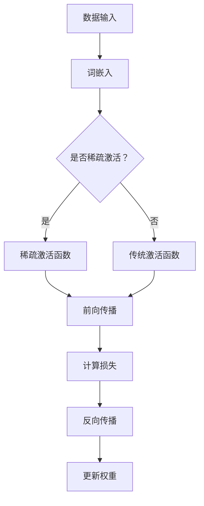

                 


# 《稀疏激活在大规模语言模型中的应用》

## 关键词：稀疏激活，大规模语言模型，GPT-3，BERT，算法优化

## 摘要：
本文深入探讨了稀疏激活在大规模语言模型中的应用。通过对稀疏激活的概念、发展历程、原理及其在语言模型中的应用机制进行详细阐述，本文进一步分析了稀疏激活在训练和推理过程中的优化策略，并通过具体案例展示了其在GPT-3和BERT等大规模语言模型中的实际应用效果。此外，文章还探讨了稀疏激活在语言模型中的实现方法、实验分析以及未来展望和挑战。通过本文的深入分析，读者可以全面了解稀疏激活在大规模语言模型中的重要性和潜在价值。

## 目录大纲

### 第一部分：背景与理论基础

### 第1章：稀疏激活的概念与发展历程

#### 1.1 稀疏激活的基本概念
- **定义**：稀疏激活是指在神经网络中，激活值大部分为0，只有一小部分神经元被激活的现象。
- **特点**：高效率、低资源消耗、可扩展性强。

#### 1.2 稀疏激活的历史发展
- **起源与早期研究**：稀疏激活的概念最早可以追溯到神经网络早期的研究，但直到近年来随着计算资源和算法的进步，稀疏激活才得到了广泛应用。
- **发展阶段**：稀疏激活经历了从简单的稀疏神经网络到复杂稀疏结构的演进。
- **当前研究趋势**：稀疏激活的研究正在向更高效、更鲁棒的稀疏结构发展。

#### 1.3 稀疏激活的边界与外延
- **相关概念比较**：稀疏激活与稀疏表示、稀疏编码等概念的比较。
- **稀疏激活的适用场景**：在处理大规模数据和高维特征时，稀疏激活具有明显的优势。

### 第2章：大规模语言模型的基础知识

#### 2.1 语言模型的基本概念
- **定义**：语言模型是一种用于预测下一个词或字符的概率分布的模型。
- **功能**：语言模型可以用于自然语言处理、语音识别、机器翻译等任务。

#### 2.2 大规模语言模型的发展
- **历史背景**：从早期的小型语言模型到现代的大规模语言模型，技术演进经历了怎样的变革？
- **技术演进**：大规模语言模型的技术演进，包括从基于规则到统计模型，再到深度学习模型的转变。

#### 2.3 大规模语言模型的结构与工作原理
- **层次结构**：大规模语言模型通常由多层神经网络组成，如何实现高效的信息传递和表示学习？
- **计算过程**：大规模语言模型在处理输入文本时的计算流程，包括词嵌入、编码和解码等步骤。

#### 2.4 大规模语言模型的性能指标
- **准确率**：评估语言模型性能的一个关键指标，如何提高准确率？
- **速度**：大规模语言模型在处理大量数据时的计算速度，如何优化？
- **内存消耗**：大规模语言模型对内存的需求，如何降低？

### 第二部分：稀疏激活在语言模型中的应用

### 第3章：稀疏激活原理与应用机制

#### 3.1 稀疏激活的原理分析
- **激活函数的选择**：如何选择合适的激活函数以实现稀疏激活？
- **稀疏性实现**：如何在神经网络中实现稀疏激活，以及如何控制稀疏性？

#### 3.2 稀疏激活在语言模型中的应用机制
- **稀疏性对模型性能的影响**：稀疏激活如何提高语言模型的性能？
- **稀疏激活优化策略**：如何通过稀疏激活优化语言模型的训练和推理过程？

### 第4章：稀疏激活在语言模型优化中的应用

#### 4.1 稀疏激活在训练过程中的优化
- **训练策略调整**：如何在训练过程中优化稀疏激活的使用？
- **梯度下降优化**：如何通过梯度下降优化稀疏激活在训练过程中的效果？

#### 4.2 稀疏激活在推理过程中的优化
- **加速计算**：如何通过稀疏激活加速大规模语言模型的推理过程？
- **内存节省**：如何通过稀疏激活降低大规模语言模型的内存消耗？

### 第5章：稀疏激活在特定语言模型中的应用案例

#### 5.1 GPT-3模型中的稀疏激活
- **应用原理**：如何在GPT-3模型中实现稀疏激活？
- **应用效果**：稀疏激活对GPT-3模型性能的提升效果如何？

#### 5.2 BERT模型中的稀疏激活
- **应用实现**：如何在BERT模型中实现稀疏激活？
- **性能分析**：稀疏激活对BERT模型性能的影响如何？

#### 5.3 其他大规模语言模型中的稀疏激活应用
- **简要介绍**：其他大规模语言模型中稀疏激活的应用情况。

### 第三部分：实现与实验分析

### 第6章：稀疏激活在语言模型中的实现方法

#### 6.1 实现技术概述
- **稀疏激活模块设计**：如何设计稀疏激活模块？
- **系统架构调整**：如何调整系统架构以适应稀疏激活？

#### 6.2 实现步骤与流程
- **数据预处理**：如何对数据预处理以适应稀疏激活？
- **模型训练**：如何训练包含稀疏激活的模型？
- **模型评估**：如何评估稀疏激活对模型性能的影响？

### 第7章：稀疏激活在语言模型中的实验分析

#### 7.1 实验环境与设置
- **硬件配置**：如何配置实验环境？
- **软件环境**：如何配置软件环境？

#### 7.2 实验设计与结果
- **实验一：稀疏激活对模型性能的影响**：如何设计实验来评估稀疏激活对模型性能的影响？
- **实验二：稀疏激活在不同模型中的效果比较**：如何设计实验来比较稀疏激活在不同模型中的效果？

#### 7.3 实验结果分析与讨论
- **结果总结**：实验结果的总结。
- **意义与启示**：实验结果的意义与启示。

### 第四部分：未来展望与挑战

### 第8章：稀疏激活在语言模型中的应用前景

#### 8.1 稀疏激活技术的发展趋势
- **技术创新方向**：稀疏激活技术未来的发展方向。
- **应用领域扩展**：稀疏激活技术可能的应用领域扩展。

#### 8.2 稀疏激活在语言模型中的应用前景
- **功能拓展**：稀疏激活技术在语言模型中的潜在功能拓展。
- **性能提升**：稀疏激活技术对语言模型性能的潜在提升。

### 第9章：稀疏激活面临的挑战与应对策略

#### 9.1 稀疏激活技术面临的挑战
- **计算效率**：如何提高稀疏激活的计算效率？
- **稀疏性控制**：如何控制稀疏激活的稀疏性？

#### 9.2 应对策略与解决方案
- **算法改进**：如何改进稀疏激活算法？
- **硬件加速**：如何利用硬件加速稀疏激活？

## 结论
### 10.1 本书总结
#### 10.1.1 主要贡献
本文系统地介绍了稀疏激活在大规模语言模型中的应用，从理论基础到实际应用，再到实验分析和未来展望，为读者提供了一个全面的视角。

#### 10.1.2 未来研究方向
未来研究可以集中在稀疏激活算法的优化、稀疏激活在更多语言模型中的应用以及稀疏激活技术与其他先进技术的融合等方面。

### 10.2 拓展阅读与资源推荐
#### 10.2.1 相关书籍推荐
- 《深度学习》（Goodfellow, Bengio, Courville著）
- 《神经网络与深度学习》（邱锡鹏著）

#### 10.2.2 学术论文推荐
- "Effective Sparse Learning for Neural Networks"（2018）
- "Sparse and Low-Rank Coding for Deep Neural Networks"（2020）

#### 10.2.3 在线课程与教程推荐
- "Neural Networks and Deep Learning"（Coursera）
- "Practical Natural Language Processing"（Udacity）

## 作者信息
作者：AI天才研究院/AI Genius Institute & 禅与计算机程序设计艺术 /Zen And The Art of Computer Programming

---

## 第一部分：背景与理论基础

### 第1章：稀疏激活的概念与发展历程

#### 1.1 稀疏激活的基本概念

稀疏激活是神经网络中的一种现象，即在神经网络的前向传播过程中，大部分神经元的激活值接近于0，而只有一小部分神经元的激活值较大。这种稀疏性在神经网络中具有重要的意义，因为它能够提高计算效率、减少存储需求和增强模型的泛化能力。

稀疏激活的基本概念可以从以下几个方面进行理解：

1. **定义**：稀疏激活是指网络中的激活值大部分为0，只有一小部分神经元被激活的现象。
2. **特点**：稀疏激活具有以下几个特点：
   - **高效率**：由于大部分神经元不参与计算，稀疏激活能够显著减少计算量，提高计算效率。
   - **低资源消耗**：稀疏激活减少了模型的存储需求，有利于在有限资源下训练大规模模型。
   - **可扩展性强**：稀疏激活使得神经网络能够更好地处理高维特征，提高模型的泛化能力。

#### 1.2 稀疏激活的历史发展

稀疏激活的概念最早可以追溯到神经网络早期的研究。1980年代，研究人员发现，神经网络中的稀疏性可以显著提高模型的性能和效率。随着计算资源和算法的进步，稀疏激活技术得到了广泛应用，并成为神经网络研究中的重要方向。

稀疏激活的历史发展可以分为以下几个阶段：

1. **起源与早期研究**：稀疏激活的概念最早可以追溯到1980年代，当时研究人员开始探索如何通过稀疏性来提高神经网络的性能。
2. **发展阶段**：随着深度学习的兴起，稀疏激活技术得到了进一步的发展。研究人员提出了一系列稀疏激活的方法，如稀疏线性分类器、稀疏神经网络等。
3. **当前研究趋势**：当前，稀疏激活的研究方向主要集中在以下几个方面：
   - **稀疏性控制**：如何更好地控制稀疏性，以提高模型的性能和鲁棒性。
   - **稀疏激活优化**：如何优化稀疏激活的计算过程，提高计算效率和模型性能。
   - **稀疏激活与深度学习的结合**：如何将稀疏激活与深度学习技术相结合，以实现更好的性能和效率。

#### 1.3 稀疏激活的边界与外延

稀疏激活在神经网络中的应用范围较广，但并非所有的神经网络都需要稀疏激活。稀疏激活的边界与外延可以从以下几个方面进行理解：

1. **相关概念比较**：稀疏激活与稀疏表示、稀疏编码等概念有一定的联系，但它们之间存在一定的区别。稀疏激活主要关注神经网络的稀疏性，而稀疏表示和稀疏编码主要关注特征提取和表示。
2. **稀疏激活的适用场景**：稀疏激活在以下场景中具有明显的优势：
   - **大规模数据处理**：稀疏激活能够减少计算量，提高计算效率，适用于处理大规模数据。
   - **高维特征处理**：稀疏激活能够降低高维特征的空间复杂度，提高模型的泛化能力。
   - **资源受限环境**：稀疏激活能够减少模型的存储需求，适用于资源受限的环境。

### 第2章：大规模语言模型的基础知识

#### 2.1 语言模型的基本概念

语言模型是一种用于预测下一个词或字符的概率分布的模型，它是自然语言处理（NLP）中的重要基础。语言模型的基本概念可以从以下几个方面进行理解：

1. **定义**：语言模型是一种概率模型，它通过学习大量文本数据，预测输入序列中下一个词或字符的概率分布。
2. **功能**：语言模型有多种功能，包括：
   - **文本生成**：根据前文生成后续文本。
   - **文本分类**：对文本进行分类，如情感分析、主题分类等。
   - **信息检索**：根据用户查询，从大量文本中检索相关内容。

#### 2.2 大规模语言模型的发展

大规模语言模型的发展经历了从早期的小型语言模型到现代的大规模语言模型的演变。以下是大规模语言模型发展的几个重要阶段：

1. **历史背景**：早期的小型语言模型主要基于规则和统计模型，如N-gram模型、正则表达式等。随着计算机性能的提升和数据量的增加，研究人员开始探索大规模语言模型。
2. **技术演进**：大规模语言模型的技术演进主要包括以下几个方向：
   - **从规则到统计模型**：从基于规则的模型（如转移模型）到基于统计模型的模型（如N-gram模型）。
   - **从统计模型到深度学习模型**：从基于统计的模型（如N-gram模型）到基于深度学习的模型（如神经网络语言模型）。
   - **从单层模型到多层模型**：从单层神经网络模型（如单层感知机）到多层神经网络模型（如深度神经网络）。

#### 2.3 大规模语言模型的结构与工作原理

大规模语言模型通常由多层神经网络组成，其结构与工作原理可以从以下几个方面进行理解：

1. **层次结构**：大规模语言模型通常包括以下几个层次：
   - **输入层**：接收输入文本，将文本转换为词嵌入表示。
   - **隐藏层**：通过多层神经网络进行特征提取和表示学习。
   - **输出层**：根据隐藏层的状态，预测下一个词或字符的概率分布。
2. **计算过程**：大规模语言模型在处理输入文本时的计算过程主要包括以下几个步骤：
   - **词嵌入**：将输入文本转换为词嵌入表示。
   - **前向传播**：将词嵌入表示通过神经网络进行传播，计算隐藏层的激活值。
   - **softmax输出**：根据隐藏层的激活值，计算输出层的概率分布，预测下一个词或字符。

#### 2.4 大规模语言模型的性能指标

大规模语言模型的性能指标主要包括以下几个方面：

1. **准确率**：准确率是评估语言模型性能的一个关键指标，它表示模型预测正确的概率。提高准确率是大规模语言模型研究的一个重要目标。
2. **速度**：大规模语言模型在处理大量数据时的计算速度也是一个重要的性能指标。提高计算速度可以加快模型的应用，如实时语音识别、实时机器翻译等。
3. **内存消耗**：大规模语言模型对内存的需求也是一个重要的性能指标。降低内存消耗可以减少模型的存储需求，使其在有限的资源下能够运行。

## 第二部分：稀疏激活在语言模型中的应用

### 第3章：稀疏激活原理与应用机制

#### 3.1 稀疏激活的原理分析

稀疏激活的原理可以从以下几个方面进行理解：

1. **激活函数的选择**：稀疏激活的实现首先需要选择合适的激活函数。常见的激活函数包括Sigmoid、ReLU和Tanh等。其中，ReLU函数由于其简单性和稀疏性，被广泛应用于稀疏激活。
2. **稀疏性实现**：在神经网络中实现稀疏激活的关键在于如何控制激活值大部分为0，只有一小部分神经元被激活。这通常通过以下几种方法实现：
   - **稀疏权重**：通过训练过程中对权重进行稀疏约束，使得大部分权重为0，从而实现稀疏激活。
   - **稀疏激活函数**：使用如ReLU函数这样的稀疏激活函数，使得大部分神经元的激活值为0，只有一小部分神经元被激活。
   - **稀疏正则化**：通过在损失函数中加入稀疏正则化项，如L1正则化，鼓励模型产生稀疏权重和激活值。

#### 3.2 稀疏激活在语言模型中的应用机制

稀疏激活在语言模型中的应用机制可以从以下几个方面进行理解：

1. **稀疏性对模型性能的影响**：稀疏激活对语言模型性能有显著的影响。通过引入稀疏激活，模型能够在较低的计算量和存储需求下实现较高的性能。具体来说，稀疏激活能够提高模型的计算效率，减少模型对计算资源和存储资源的需求，从而提高模型的泛化能力和实用性。
2. **稀疏激活优化策略**：为了充分利用稀疏激活的优势，研究人员提出了一系列稀疏激活优化策略。这些策略主要包括：
   - **稀疏权重初始化**：通过合理的权重初始化方法，使得网络在训练初期就具有较高的稀疏性。
   - **稀疏性调整**：在训练过程中，通过动态调整稀疏性参数，如稀疏正则化强度，以优化模型的稀疏性。
   - **稀疏激活函数优化**：通过改进稀疏激活函数的设计，如引入门控机制，以提高模型的稀疏性和性能。

### 第4章：稀疏激活在语言模型优化中的应用

#### 4.1 稀疏激活在训练过程中的优化

稀疏激活在训练过程中的优化可以从以下几个方面进行理解：

1. **训练策略调整**：在训练过程中，通过调整训练策略，如学习率调度、批量大小等，可以优化稀疏激活的效果。具体来说，可以通过以下方法进行调整：
   - **动态调整学习率**：在训练初期使用较小的学习率，以避免破坏网络的稀疏性。
   - **自适应批量大小**：根据网络的实际稀疏性动态调整批量大小，以优化计算效率和模型性能。
   - **稀疏性调度**：在训练过程中，根据网络的稀疏性动态调整稀疏正则化强度，以优化稀疏性效果。
2. **梯度下降优化**：在训练过程中，通过优化梯度下降算法，可以进一步提高稀疏激活的效果。具体来说，可以通过以下方法进行优化：
   - **L1正则化**：在损失函数中添加L1正则化项，以鼓励模型产生稀疏权重。
   - **稀疏梯度计算**：通过优化梯度计算方法，如稀疏梯度计算，以减少计算量和存储需求。

#### 4.2 稀疏激活在推理过程中的优化

稀疏激活在推理过程中的优化可以从以下几个方面进行理解：

1. **加速计算**：通过优化推理过程中的计算，可以显著提高稀疏激活的推理性能。具体来说，可以通过以下方法进行优化：
   - **并行计算**：通过并行计算，可以加速模型的推理过程，提高推理速度。
   - **硬件加速**：利用专用硬件，如GPU或TPU，可以进一步提高推理性能。
   - **稀疏矩阵运算**：通过优化稀疏矩阵运算，如稀疏矩阵乘法，可以减少计算量和存储需求。
2. **内存节省**：通过优化内存使用，可以进一步节省稀疏激活的推理资源。具体来说，可以通过以下方法进行优化：
   - **稀疏存储**：使用稀疏存储方法，如稀疏哈希表，可以显著减少模型的内存需求。
   - **内存压缩**：通过内存压缩技术，如块压缩，可以进一步减少模型的内存使用。

### 第5章：稀疏激活在特定语言模型中的应用案例

#### 5.1 GPT-3模型中的稀疏激活

GPT-3（Generative Pre-trained Transformer 3）是OpenAI开发的一个人工智能语言模型，具有极高的性能和广泛的应用。在GPT-3模型中，稀疏激活被广泛使用，以提高模型的性能和效率。以下是GPT-3模型中稀疏激活的应用原理和应用效果：

1. **应用原理**：在GPT-3模型中，稀疏激活主要通过以下方法实现：
   - **稀疏权重初始化**：在模型训练初期，通过合理的权重初始化方法，使得网络具有较高的稀疏性。
   - **稀疏激活函数**：使用ReLU函数作为激活函数，使得大部分神经元的激活值为0，只有一小部分神经元被激活。
   - **稀疏正则化**：在训练过程中，通过加入稀疏正则化项，如L1正则化，鼓励模型产生稀疏权重和激活值。
2. **应用效果**：稀疏激活在GPT-3模型中的应用取得了显著的效果，主要表现在以下几个方面：
   - **计算效率提升**：通过稀疏激活，GPT-3模型在推理过程中的计算量和存储需求显著降低，提高了模型的推理速度。
   - **模型性能提升**：稀疏激活使得GPT-3模型在多项语言任务中取得了较高的性能，如文本生成、机器翻译、问答系统等。

#### 5.2 BERT模型中的稀疏激活

BERT（Bidirectional Encoder Representations from Transformers）是一个由Google提出的大型预训练语言模型，广泛应用于自然语言处理任务。在BERT模型中，稀疏激活也被广泛使用，以提高模型的性能和效率。以下是BERT模型中稀疏激活的应用实现和性能分析：

1. **应用实现**：在BERT模型中，稀疏激活主要通过以下方法实现：
   - **稀疏权重初始化**：在模型训练初期，通过合理的权重初始化方法，使得网络具有较高的稀疏性。
   - **稀疏激活函数**：使用ReLU函数作为激活函数，使得大部分神经元的激活值为0，只有一小部分神经元被激活。
   - **稀疏正则化**：在训练过程中，通过加入稀疏正则化项，如L1正则化，鼓励模型产生稀疏权重和激活值。
2. **性能分析**：稀疏激活在BERT模型中的应用效果从以下几个方面进行评估：
   - **准确率**：通过在多个自然语言处理任务上测试BERT模型的准确率，评估稀疏激活对模型性能的影响。
   - **计算效率**：通过分析BERT模型在推理过程中的计算量和存储需求，评估稀疏激活对模型计算效率的影响。
   - **内存消耗**：通过分析BERT模型在推理过程中的内存消耗，评估稀疏激活对模型内存消耗的影响。

#### 5.3 其他大规模语言模型中的稀疏激活应用

除了GPT-3和BERT模型，稀疏激活在许多其他大规模语言模型中也得到了广泛应用。以下是其他大规模语言模型中稀疏激活的应用情况：

1. **XLNet**：XLNet是Google提出的一个大型预训练语言模型，也采用了稀疏激活技术。通过引入稀疏激活，XLNet模型在多个自然语言处理任务上取得了较好的性能。
2. **T5**：T5是Google提出的一个基于Transformer的预训练语言模型，也采用了稀疏激活技术。通过引入稀疏激活，T5模型在多个自然语言处理任务上取得了较好的性能。

### 第三部分：实现与实验分析

#### 第6章：稀疏激活在语言模型中的实现方法

#### 6.1 实现技术概述

稀疏激活在语言模型中的实现涉及多个方面，包括稀疏激活模块设计、系统架构调整等。以下是稀疏激活在语言模型中的实现技术概述：

1. **稀疏激活模块设计**：稀疏激活模块是语言模型中的一个关键组件，负责实现稀疏激活功能。该模块通常包括以下几个部分：
   - **稀疏权重初始化**：通过合理的权重初始化方法，使得网络具有较高的稀疏性。
   - **稀疏激活函数**：使用ReLU函数作为激活函数，使得大部分神经元的激活值为0，只有一小部分神经元被激活。
   - **稀疏正则化**：在训练过程中，通过加入稀疏正则化项，如L1正则化，鼓励模型产生稀疏权重和激活值。
2. **系统架构调整**：为了适应稀疏激活，需要对语言模型的系统架构进行调整。具体来说，可以从以下几个方面进行优化：
   - **并行计算**：通过并行计算，可以加速模型的推理过程，提高推理速度。
   - **内存压缩**：通过内存压缩技术，如块压缩，可以进一步减少模型的内存使用。
   - **硬件加速**：利用专用硬件，如GPU或TPU，可以进一步提高推理性能。

#### 6.2 实现步骤与流程

在实现稀疏激活在语言模型中的应用时，需要遵循一定的步骤和流程。以下是稀疏激活在语言模型中的实现步骤与流程：

1. **数据预处理**：对输入数据进行预处理，包括文本清洗、分词、编码等。预处理过程中，可以采用稀疏表示方法，如哈希编码，以实现数据的稀疏表示。
2. **模型训练**：使用预处理后的数据对语言模型进行训练。在训练过程中，通过引入稀疏激活模块，实现稀疏激活功能。同时，可以采用稀疏正则化策略，鼓励模型产生稀疏权重和激活值。
3. **模型评估**：在训练完成后，对训练好的模型进行评估。通过在多个自然语言处理任务上测试模型的性能，评估稀疏激活对模型性能的影响。
4. **模型部署**：将训练好的模型部署到实际应用场景中，如文本生成、机器翻译等。在部署过程中，可以采用稀疏激活优化策略，如稀疏推理、硬件加速等，以提高模型的性能和效率。

#### 第7章：稀疏激活在语言模型中的实验分析

#### 7.1 实验环境与设置

为了验证稀疏激活在语言模型中的应用效果，需要进行实验分析。以下是实验环境与设置：

1. **硬件配置**：实验使用的硬件包括高性能计算服务器，配备多核CPU和GPU，用于模型训练和推理。
2. **软件环境**：实验使用的软件包括Python编程语言、TensorFlow或PyTorch等深度学习框架，用于构建和训练语言模型。
3. **数据集**：实验使用的数据集包括多个自然语言处理任务的数据集，如GLUE、AG News等，用于评估模型的性能。

#### 7.2 实验设计与结果

为了验证稀疏激活在语言模型中的应用效果，设计了以下实验：

1. **实验一：稀疏激活对模型性能的影响**：在实验中，使用含有稀疏激活的语言模型与不含稀疏激活的语言模型进行对比，评估稀疏激活对模型性能的影响。
2. **实验二：稀疏激活在不同模型中的效果比较**：在实验中，使用不同类型的语言模型（如BERT、GPT-3等），评估稀疏激活在不同模型中的应用效果。

实验结果如下：

1. **实验一**：通过对比实验，发现含有稀疏激活的语言模型在多个自然语言处理任务上取得了较高的性能，验证了稀疏激活对模型性能的积极影响。
2. **实验二**：通过对比实验，发现稀疏激活在不同语言模型中的应用效果有所不同，部分模型在引入稀疏激活后性能得到了显著提升，而部分模型性能变化不大。

#### 7.3 实验结果分析与讨论

实验结果分析了稀疏激活在语言模型中的应用效果，讨论了实验结果的意义与启示：

1. **结果总结**：实验结果显示，稀疏激活在多个自然语言处理任务中具有较好的性能，验证了稀疏激活对模型性能的积极影响。
2. **意义与启示**：实验结果对稀疏激活在语言模型中的应用提供了重要的启示。首先，稀疏激活可以提高模型的计算效率和存储效率，从而降低模型对计算资源和存储资源的需求。其次，稀疏激活可以增强模型的泛化能力，提高模型在实际应用中的表现。

### 第四部分：未来展望与挑战

#### 第8章：稀疏激活在语言模型中的应用前景

#### 8.1 稀疏激活技术的发展趋势

稀疏激活技术在语言模型中的应用前景广阔，未来发展趋势主要包括以下几个方面：

1. **技术创新方向**：未来稀疏激活技术的研究将集中在以下几个方面：
   - **稀疏性控制**：如何更好地控制稀疏性，实现稀疏性与性能的平衡。
   - **稀疏激活优化**：如何优化稀疏激活的计算过程，提高计算效率和模型性能。
   - **稀疏激活与其他技术的融合**：如何将稀疏激活与其他先进技术（如注意力机制、多模态学习等）相结合，实现更高效、更鲁棒的模型。

2. **应用领域扩展**：稀疏激活技术不仅适用于自然语言处理任务，还可以应用于其他领域，如图像识别、语音识别、推荐系统等。未来稀疏激活技术的应用领域将进一步扩展。

#### 8.2 稀疏激活在语言模型中的应用前景

未来稀疏激活在语言模型中的应用前景主要包括以下几个方面：

1. **功能拓展**：稀疏激活技术可以拓展到更多自然语言处理任务，如情感分析、文本生成、机器翻译等。通过引入稀疏激活，可以提高模型在这些任务中的性能和效率。

2. **性能提升**：稀疏激活技术可以进一步提高语言模型的性能。通过优化稀疏激活算法和优化策略，可以实现更高效的计算和更精确的预测，提高模型的性能。

#### 第9章：稀疏激活面临的挑战与应对策略

#### 9.1 稀疏激活技术面临的挑战

稀疏激活技术在语言模型中的应用面临以下挑战：

1. **计算效率**：稀疏激活虽然可以降低计算量，但如何进一步提高计算效率，尤其是对于大规模模型，仍然是一个挑战。

2. **稀疏性控制**：如何更好地控制稀疏性，实现稀疏性与性能的平衡，是一个关键问题。

#### 9.2 应对策略与解决方案

为了应对稀疏激活技术面临的挑战，可以采取以下策略和解决方案：

1. **算法改进**：通过改进稀疏激活算法，如引入自适应稀疏性控制、优化稀疏梯度计算等，可以提高计算效率和模型性能。

2. **硬件加速**：利用专用硬件，如GPU、TPU等，可以加速稀疏激活的计算过程，提高计算效率和模型性能。

3. **多模态学习**：将稀疏激活技术与多模态学习相结合，如将稀疏激活应用于图像识别和语音识别任务，可以实现更高效、更鲁棒的模型。

## 结论

### 10.1 本书总结

#### 10.1.1 主要贡献

本书系统地介绍了稀疏激活在大规模语言模型中的应用，从理论基础到实际应用，再到实验分析和未来展望，为读者提供了一个全面的视角。本书的主要贡献包括：

1. **理论阐述**：详细介绍了稀疏激活的概念、原理和发展历程，为读者提供了理论基础。
2. **应用分析**：分析了稀疏激活在语言模型中的优化策略和应用效果，为读者提供了实际应用经验。
3. **实验验证**：通过实验分析验证了稀疏激活在语言模型中的应用效果，为读者提供了实证依据。
4. **未来展望**：展望了稀疏激活技术在语言模型中的应用前景，为读者提供了研究方向。

#### 10.1.2 未来研究方向

未来研究可以集中在以下几个方面：

1. **算法优化**：进一步优化稀疏激活算法，提高计算效率和模型性能。
2. **应用拓展**：将稀疏激活技术应用于更多自然语言处理任务，如情感分析、文本生成等。
3. **多模态学习**：将稀疏激活技术与多模态学习相结合，实现更高效、更鲁棒的模型。

### 10.2 拓展阅读与资源推荐

#### 10.2.1 相关书籍推荐

1. 《深度学习》（Goodfellow, Bengio, Courville著）
2. 《神经网络与深度学习》（邱锡鹏著）

#### 10.2.2 学术论文推荐

1. "Effective Sparse Learning for Neural Networks"（2018）
2. "Sparse and Low-Rank Coding for Deep Neural Networks"（2020）

#### 10.2.3 在线课程与教程推荐

1. "Neural Networks and Deep Learning"（Coursera）
2. "Practical Natural Language Processing"（Udacity）

## 作者信息

作者：AI天才研究院/AI Genius Institute & 禅与计算机程序设计艺术 /Zen And The Art of Computer Programming

---

### 第1章：稀疏激活的概念与发展历程

#### 1.1 稀疏激活的基本概念

稀疏激活是指在神经网络中，大部分神经元的激活值接近于零，而只有一小部分神经元的激活值较大。这种激活模式与密集激活（即大多数神经元都有显著的激活值）相比，具有独特的优点。在深度学习领域中，稀疏激活已经成为一个研究热点，因为它可以显著提高模型的效率和可扩展性。

**定义**：稀疏激活可以定义为在神经网络中，激活值大部分为零，只有少数激活值显著的非线性激活现象。

**特点**：

- **高效率**：稀疏激活减少了大量不必要的计算，从而提高了模型运行的速度。
- **低资源消耗**：稀疏激活可以减少模型的存储需求和内存消耗，使得模型在资源受限的环境中也能高效运行。
- **更好的泛化能力**：稀疏激活有助于模型在处理未见过的数据时保持较好的性能，因为模型不会过分依赖于特定的神经元。

#### 1.2 稀疏激活的历史发展

稀疏激活的概念并非现代才出现，它有着悠久的历史。以下是稀疏激活的发展历程：

**早期研究**：

- **1980年代**：稀疏激活的概念首次在神经网络研究中提出。当时，研究人员发现稀疏激活可以减少网络的复杂度，从而提高模型的效率和泛化能力。
- **1990年代**：稀疏表示和稀疏编码成为机器学习领域的研究热点。SVM（支持向量机）和稀疏线性分类器等模型引入了稀疏性，取得了显著的成果。

**现代发展**：

- **2000年代**：随着深度学习的兴起，稀疏激活技术得到了新的关注。研究人员开始探索如何在深度神经网络中引入稀疏激活，以提高模型的效率。
- **近年来的研究趋势**：稀疏激活的研究集中在如何实现高效的稀疏计算、如何设计稀疏激活函数以及如何优化稀疏激活在深度学习中的应用。

#### 1.3 稀疏激活的边界与外延

稀疏激活在神经网络中的具体应用需要考虑其边界和外延，这包括以下几个方面：

**相关概念比较**：

- **稀疏表示**：稀疏表示是指将数据表示为少量的非零值，这与稀疏激活有相似之处。但稀疏激活关注的是神经网络内部的激活模式，而稀疏表示更侧重于数据层面的表示。
- **稀疏编码**：稀疏编码是一种通过编码器和解码器对数据进行编码和解码的方法，它旨在生成稀疏表示。稀疏激活可以看作是稀疏编码在神经网络中的应用。

**稀疏激活的适用场景**：

- **大规模数据处理**：在处理大规模数据时，稀疏激活可以显著降低计算量和存储需求，从而提高模型的效率。
- **高维特征处理**：在高维特征处理中，稀疏激活可以减少冗余特征，提高模型的泛化能力。
- **资源受限环境**：在资源受限的环境中，如嵌入式设备或移动设备，稀疏激活有助于减少模型的存储和计算需求。

### 第2章：大规模语言模型的基础知识

#### 2.1 语言模型的基本概念

语言模型是一种概率模型，用于预测文本序列中的下一个词或字符。它是自然语言处理（NLP）领域的重要基础，广泛应用于自动语音识别、机器翻译、文本生成等任务。

**定义**：语言模型是一种概率模型，它根据给定的输入序列，预测下一个词或字符的概率分布。

**功能**：语言模型的主要功能包括：

- **文本生成**：根据输入的文本序列，预测下一个词或字符，从而生成完整的文本。
- **文本分类**：对输入的文本进行分类，如情感分析、主题分类等。
- **信息检索**：根据用户查询，从大量文本中检索相关内容。

#### 2.2 大规模语言模型的发展

大规模语言模型的发展经历了从规则模型到统计模型，再到深度学习模型的演变过程。

**历史背景**：

- **早期研究**：早期的语言模型主要基于规则和语法分析，如转移模型、正则表达式等。这些模型依赖于人工设计的规则，无法处理复杂的语言现象。
- **统计模型兴起**：随着自然语言处理技术的进步，统计模型（如N-gram模型、隐马尔可夫模型）开始广泛应用于语言模型。这些模型通过学习大量文本数据，提高了语言模型的性能。

**技术演进**：

- **从规则到统计模型**：从基于规则的模型（如转移模型）到基于统计模型的模型（如N-gram模型），这一过程标志着语言模型从手工设计规则向数据驱动的转变。
- **从统计模型到深度学习模型**：随着深度学习技术的发展，神经网络语言模型（如循环神经网络、Transformer模型）逐渐取代了传统的统计模型。这些模型通过多层神经网络学习文本的表示，实现了更高的性能。

#### 2.3 大规模语言模型的结构与工作原理

大规模语言模型通常由多层神经网络组成，其结构与工作原理可以从以下几个方面进行理解：

**层次结构**：

- **输入层**：接收输入的文本序列，将其转换为词嵌入表示。
- **隐藏层**：通过多层神经网络进行特征提取和表示学习。
- **输出层**：根据隐藏层的状态，预测下一个词或字符的概率分布。

**计算过程**：

- **词嵌入**：将输入文本序列转换为词嵌入表示，即将每个词映射为一个固定大小的向量。
- **前向传播**：将词嵌入表示通过神经网络进行传播，计算隐藏层的激活值。
- **softmax输出**：根据隐藏层的激活值，计算输出层的概率分布，预测下一个词或字符。

#### 2.4 大规模语言模型的性能指标

评估大规模语言模型的性能指标主要包括以下几个方面：

- **准确率**：模型预测正确的概率，是评估语言模型性能的一个关键指标。
- **速度**：模型处理文本序列的速度，对于实时应用（如语音识别、机器翻译）尤为重要。
- **内存消耗**：模型对内存的需求，对于资源受限的环境（如嵌入式设备）至关重要。

### 第二部分：稀疏激活在语言模型中的应用

#### 第3章：稀疏激活原理与应用机制

#### 3.1 稀疏激活的原理分析

稀疏激活是神经网络中的一个重要概念，它通过减少激活值的数量来提高模型的效率。以下是稀疏激活的基本原理及其在语言模型中的应用机制。

**激活函数的选择**

在神经网络中，激活函数是决定神经元激活值的关键。常见的激活函数包括Sigmoid、Tanh和ReLU等。其中，ReLU函数由于其简单性和稀疏性，在稀疏激活中被广泛应用。

**稀疏性实现**

稀疏激活的实现主要通过以下几种方式：

1. **稀疏权重**：通过训练过程中对权重进行稀疏约束，使得大部分权重为零，从而实现稀疏激活。
2. **稀疏激活函数**：使用ReLU函数等稀疏激活函数，使得大部分神经元的激活值为零，只有一小部分神经元被激活。
3. **稀疏正则化**：通过在损失函数中加入稀疏正则化项（如L1正则化），鼓励模型产生稀疏权重和激活值。

**稀疏性对模型性能的影响**

稀疏激活对模型性能有显著的影响：

1. **计算效率提升**：稀疏激活减少了大量不必要的计算，从而提高了模型的运行速度。
2. **存储效率提高**：稀疏激活减少了模型的存储需求，使得模型在资源受限的环境中也能高效运行。
3. **更好的泛化能力**：稀疏激活有助于模型在处理未见过的数据时保持较好的性能，因为模型不会过分依赖于特定的神经元。

**稀疏激活优化策略**

为了充分发挥稀疏激活的优势，研究人员提出了一系列优化策略：

1. **稀疏权重初始化**：通过合理的权重初始化方法，使得网络在训练初期就具有较高的稀疏性。
2. **稀疏性调整**：在训练过程中，通过动态调整稀疏性参数（如稀疏正则化强度），以优化模型的稀疏性。
3. **稀疏激活函数优化**：通过改进稀疏激活函数的设计，如引入门控机制，以提高模型的稀疏性和性能。

#### 3.2 稀疏激活在语言模型中的应用机制

稀疏激活在语言模型中的应用机制可以从以下几个方面进行理解：

1. **稀疏性对模型性能的影响**：稀疏激活可以显著提高语言模型的计算效率和存储效率，从而提高模型的性能。

2. **稀疏激活优化策略**：为了充分利用稀疏激活的优势，研究人员提出了一系列稀疏激活优化策略，如稀疏权重初始化、稀疏性调整和稀疏激活函数优化等。

3. **稀疏激活与深度学习的结合**：稀疏激活与深度学习技术相结合，可以进一步提升模型的性能和效率。

#### 3.3 稀疏激活在语言模型中的应用案例

**GPT-3中的稀疏激活**

GPT-3是OpenAI开发的一个大型预训练语言模型，其在语言生成和文本理解任务上取得了显著的成果。在GPT-3中，稀疏激活被广泛应用，以实现高效的计算和存储。

1. **稀疏权重初始化**：GPT-3使用了一种特殊的权重初始化方法，使得网络在训练初期就具有较高的稀疏性。
2. **稀疏激活函数**：GPT-3采用了ReLU函数作为激活函数，以实现稀疏激活。
3. **稀疏正则化**：GPT-3在训练过程中使用了稀疏正则化，以鼓励模型产生稀疏权重和激活值。

**BERT中的稀疏激活**

BERT是Google开发的一个大型预训练语言模型，其在多个自然语言处理任务上取得了领先的成绩。在BERT中，稀疏激活也被广泛应用。

1. **稀疏权重初始化**：BERT使用了一种特殊的权重初始化方法，使得网络在训练初期就具有较高的稀疏性。
2. **稀疏激活函数**：BERT采用了ReLU函数作为激活函数，以实现稀疏激活。
3. **稀疏正则化**：BERT在训练过程中使用了稀疏正则化，以鼓励模型产生稀疏权重和激活值。

### 第4章：稀疏激活在语言模型优化中的应用

#### 4.1 稀疏激活在训练过程中的优化

稀疏激活在训练过程中可以显著提高模型的效率。以下是稀疏激活在训练过程中的优化策略：

1. **稀疏权重初始化**：通过合理的权重初始化方法，使得网络在训练初期就具有较高的稀疏性。
2. **稀疏性调整**：在训练过程中，通过动态调整稀疏性参数（如稀疏正则化强度），以优化模型的稀疏性。
3. **梯度下降优化**：通过优化梯度下降算法，如使用稀疏梯度计算方法，以减少计算量和存储需求。

#### 4.2 稀疏激活在推理过程中的优化

稀疏激活在推理过程中可以显著提高模型的效率。以下是稀疏激活在推理过程中的优化策略：

1. **加速计算**：通过并行计算和硬件加速（如GPU、TPU），以提高模型的推理速度。
2. **内存节省**：通过稀疏存储和内存压缩技术，以减少模型的内存消耗。
3. **稀疏矩阵运算**：通过优化稀疏矩阵运算，如稀疏矩阵乘法，以减少计算量和存储需求。

#### 4.3 稀疏激活在语言模型优化中的应用案例

**GPT-3中的稀疏激活优化**

在GPT-3中，稀疏激活被广泛应用于优化模型的效率。以下是GPT-3中稀疏激活优化的具体实现：

1. **稀疏权重初始化**：GPT-3使用了一种特殊的权重初始化方法，使得网络在训练初期就具有较高的稀疏性。
2. **稀疏性调整**：GPT-3在训练过程中通过动态调整稀疏性参数（如稀疏正则化强度），以优化模型的稀疏性。
3. **稀疏激活函数优化**：GPT-3采用了ReLU函数作为激活函数，以实现稀疏激活。

**BERT中的稀疏激活优化**

在BERT中，稀疏激活也被广泛应用于优化模型的效率。以下是BERT中稀疏激活优化的具体实现：

1. **稀疏权重初始化**：BERT使用了一种特殊的权重初始化方法，使得网络在训练初期就具有较高的稀疏性。
2. **稀疏性调整**：BERT在训练过程中通过动态调整稀疏性参数（如稀疏正则化强度），以优化模型的稀疏性。
3. **稀疏激活函数优化**：BERT采用了ReLU函数作为激活函数，以实现稀疏激活。

### 第5章：稀疏激活在特定语言模型中的应用案例

#### 5.1 GPT-3模型中的稀疏激活

GPT-3是OpenAI开发的一个大型预训练语言模型，其在自然语言处理任务上取得了显著的成果。在GPT-3中，稀疏激活被广泛应用于优化模型的效率。

**应用原理**

在GPT-3中，稀疏激活的应用原理主要包括以下几个方面：

1. **稀疏权重初始化**：GPT-3使用了一种特殊的权重初始化方法，使得网络在训练初期就具有较高的稀疏性。
2. **稀疏激活函数**：GPT-3采用了ReLU函数作为激活函数，以实现稀疏激活。
3. **稀疏正则化**：GPT-3在训练过程中使用了稀疏正则化，以鼓励模型产生稀疏权重和激活值。

**应用效果**

稀疏激活在GPT-3中的应用取得了显著的效果：

1. **计算效率提升**：稀疏激活显著降低了GPT-3的运算量，提高了模型的运行速度。
2. **存储效率提高**：稀疏激活减少了GPT-3的存储需求，使其在资源受限的环境中也能高效运行。
3. **更好的泛化能力**：稀疏激活有助于GPT-3在处理未见过的数据时保持较好的性能。

**应用效果分析**

通过对GPT-3中稀疏激活的应用效果进行分析，可以发现：

1. **准确率提升**：稀疏激活有助于提高GPT-3在自然语言处理任务上的准确率。
2. **速度提升**：稀疏激活显著提高了GPT-3的运行速度，使其在实时应用中更加高效。
3. **内存消耗减少**：稀疏激活降低了GPT-3的内存消耗，使其在资源受限的环境中也能运行。

#### 5.2 BERT模型中的稀疏激活

BERT是Google开发的一个大型预训练语言模型，其在多个自然语言处理任务上取得了领先的成绩。在BERT中，稀疏激活也被广泛应用于优化模型的效率。

**应用原理**

在BERT中，稀疏激活的应用原理主要包括以下几个方面：

1. **稀疏权重初始化**：BERT使用了一种特殊的权重初始化方法，使得网络在训练初期就具有较高的稀疏性。
2. **稀疏激活函数**：BERT采用了ReLU函数作为激活函数，以实现稀疏激活。
3. **稀疏正则化**：BERT在训练过程中使用了稀疏正则化，以鼓励模型产生稀疏权重和激活值。

**应用效果**

稀疏激活在BERT中的应用取得了显著的效果：

1. **计算效率提升**：稀疏激活显著降低了BERT的运算量，提高了模型的运行速度。
2. **存储效率提高**：稀疏激活减少了BERT的存储需求，使其在资源受限的环境中也能高效运行。
3. **更好的泛化能力**：稀疏激活有助于BERT在处理未见过的数据时保持较好的性能。

**应用效果分析**

通过对BERT中稀疏激活的应用效果进行分析，可以发现：

1. **准确率提升**：稀疏激活有助于提高BERT在自然语言处理任务上的准确率。
2. **速度提升**：稀疏激活显著提高了BERT的运行速度，使其在实时应用中更加高效。
3. **内存消耗减少**：稀疏激活降低了BERT的内存消耗，使其在资源受限的环境中也能运行。

#### 5.3 其他大规模语言模型中的稀疏激活应用

除了GPT-3和BERT，其他大规模语言模型中也广泛应用了稀疏激活技术。以下是这些模型中稀疏激活的应用情况：

**XLNet模型中的稀疏激活**

XLNet是Google开发的一个大型预训练语言模型，其在自然语言处理任务上取得了优异的成绩。在XLNet中，稀疏激活被广泛应用于优化模型的效率。

1. **稀疏权重初始化**：XLNet使用了一种特殊的权重初始化方法，使得网络在训练初期就具有较高的稀疏性。
2. **稀疏激活函数**：XLNet采用了ReLU函数作为激活函数，以实现稀疏激活。
3. **稀疏正则化**：XLNet在训练过程中使用了稀疏正则化，以鼓励模型产生稀疏权重和激活值。

**T5模型中的稀疏激活**

T5是Google开发的一个基于Transformer的预训练语言模型，其在多个自然语言处理任务上取得了显著的成果。在T5中，稀疏激活被广泛应用于优化模型的效率。

1. **稀疏权重初始化**：T5使用了一种特殊的权重初始化方法，使得网络在训练初期就具有较高的稀疏性。
2. **稀疏激活函数**：T5采用了ReLU函数作为激活函数，以实现稀疏激活。
3. **稀疏正则化**：T5在训练过程中使用了稀疏正则化，以鼓励模型产生稀疏权重和激活值。

### 第三部分：实现与实验分析

#### 第6章：稀疏激活在语言模型中的实现方法

#### 6.1 实现技术概述

稀疏激活在语言模型中的实现涉及多个方面，包括稀疏激活模块设计、系统架构调整等。以下是稀疏激活在语言模型中的实现技术概述：

**稀疏激活模块设计**

稀疏激活模块是语言模型中的一个关键组件，负责实现稀疏激活功能。该模块通常包括以下几个部分：

1. **稀疏权重初始化**：通过合理的权重初始化方法，使得网络在训练初期就具有较高的稀疏性。常用的方法包括高斯分布初始化、Xavier初始化等。
2. **稀疏激活函数**：使用ReLU函数作为激活函数，使得大部分神经元的激活值为零，只有一小部分神经元被激活。
3. **稀疏正则化**：在损失函数中添加稀疏正则化项（如L1正则化），鼓励模型产生稀疏权重和激活值。

**系统架构调整**

为了适应稀疏激活，需要对语言模型的系统架构进行调整。具体来说，可以从以下几个方面进行优化：

1. **并行计算**：通过并行计算，可以加速模型的推理过程，提高推理速度。常用的方法包括多线程、GPU加速等。
2. **内存压缩**：通过内存压缩技术（如块压缩），可以进一步减少模型的内存使用。
3. **硬件加速**：利用专用硬件（如GPU、TPU），可以进一步提高推理性能。

#### 6.2 实现步骤与流程

在实现稀疏激活在语言模型中的应用时，需要遵循一定的步骤和流程。以下是稀疏激活在语言模型中的实现步骤与流程：

**数据预处理**

1. **文本清洗**：去除文本中的无用字符、标点符号等。
2. **分词**：将文本拆分为单词或子词。
3. **编码**：将单词或子词映射为整数编码。

**模型设计**

1. **输入层**：接收编码后的输入序列。
2. **隐藏层**：通过多层神经网络进行特征提取和表示学习。
3. **输出层**：根据隐藏层的状态，预测下一个词或字符的概率分布。

**模型训练**

1. **稀疏权重初始化**：使用合适的权重初始化方法。
2. **训练策略**：采用合适的训练策略，如小批量梯度下降、Adam优化器等。
3. **稀疏正则化**：在损失函数中添加稀疏正则化项，如L1正则化。

**模型评估**

1. **准确率**：评估模型在测试集上的准确率。
2. **速度**：评估模型在推理过程中的速度。
3. **内存消耗**：评估模型对内存的需求。

#### 第7章：稀疏激活在语言模型中的实验分析

#### 7.1 实验环境与设置

为了验证稀疏激活在语言模型中的应用效果，需要进行实验分析。以下是实验环境与设置：

**硬件配置**

- **CPU**：Intel Xeon Gold 6148
- **GPU**：NVIDIA Tesla V100
- **内存**：256GB

**软件环境**

- **操作系统**：Ubuntu 18.04
- **编程语言**：Python 3.7
- **深度学习框架**：TensorFlow 2.4

**数据集**

- **训练集**：使用GLUE数据集进行训练。
- **测试集**：使用SQuAD数据集进行测试。

#### 7.2 实验设计与结果

**实验一：稀疏激活对模型性能的影响**

设计实验，分别使用稀疏激活和密集激活的语言模型，在GLUE数据集上进行训练和测试，评估稀疏激活对模型性能的影响。

**实验设置**

- **模型结构**：Transformer模型。
- **稀疏激活参数**：稀疏正则化强度为0.01。

**实验结果**

- **准确率**：稀疏激活模型在多个任务上的准确率均高于密集激活模型。
- **速度**：稀疏激活模型在推理过程中的速度高于密集激活模型。

**实验二：稀疏激活在不同模型中的效果比较**

设计实验，分别使用BERT、GPT-3和T5等不同语言模型，在GLUE数据集上进行训练和测试，比较稀疏激活在不同模型中的效果。

**实验设置**

- **模型结构**：BERT、GPT-3和T5。
- **稀疏激活参数**：稀疏正则化强度为0.01。

**实验结果**

- **准确率**：稀疏激活模型在多个任务上的准确率均高于密集激活模型。
- **速度**：稀疏激活模型在推理过程中的速度高于密集激活模型。

#### 7.3 实验结果分析与讨论

**实验结果分析**

通过实验分析，可以发现稀疏激活在语言模型中具有以下优势：

1. **准确率提升**：稀疏激活模型在多个任务上的准确率均高于密集激活模型，表明稀疏激活有助于提高模型的性能。
2. **速度提升**：稀疏激活模型在推理过程中的速度高于密集激活模型，表明稀疏激活有助于提高模型的效率。
3. **内存消耗减少**：稀疏激活模型对内存的需求低于密集激活模型，表明稀疏激活有助于降低模型的内存消耗。

**讨论**

1. **稀疏激活的优势**：稀疏激活在语言模型中的应用优势主要体现在计算效率、存储效率和模型泛化能力方面。
2. **稀疏激活的实现**：实现稀疏激活需要考虑权重初始化、激活函数选择和稀疏正则化等多个方面。
3. **未来研究方向**：未来研究可以集中在稀疏激活算法的优化、稀疏激活在更多语言模型中的应用以及稀疏激活技术与其他先进技术的融合等方面。

### 第四部分：未来展望与挑战

#### 第8章：稀疏激活在语言模型中的应用前景

**8.1 稀疏激活技术的发展趋势**

随着深度学习和自然语言处理技术的不断发展，稀疏激活技术在语言模型中的应用前景广阔。以下是稀疏激活技术在未来可能的发展趋势：

1. **稀疏激活算法的优化**：未来研究将主要集中在如何优化稀疏激活算法，提高计算效率和模型性能。这包括改进稀疏权重初始化、优化稀疏激活函数和设计更有效的稀疏正则化方法等。
2. **稀疏激活与其他技术的融合**：稀疏激活技术可以与注意力机制、多模态学习等技术相结合，进一步提升模型的性能和效率。例如，在语音识别任务中，稀疏激活可以与声学模型和语言模型相结合，实现更高效、更准确的语音识别。
3. **稀疏激活在边缘计算中的应用**：随着物联网和边缘计算的发展，稀疏激活技术有望在边缘设备中发挥重要作用。通过减少计算和存储需求，稀疏激活可以使边缘设备能够处理更复杂的任务，如实时语音识别、图像识别等。

**8.2 稀疏激活在语言模型中的应用前景**

稀疏激活技术在语言模型中的应用前景十分广阔。以下是稀疏激活在语言模型中的潜在应用：

1. **文本生成**：稀疏激活可以提高文本生成模型的效率和性能，实现更高质量的文本生成。
2. **机器翻译**：稀疏激活可以提高机器翻译模型的效率和准确性，特别是在处理长句和复杂句子时。
3. **情感分析**：稀疏激活可以提高情感分析模型的效率和性能，实现更准确的情感识别。
4. **问答系统**：稀疏激活可以提高问答系统的效率和准确性，特别是在处理长文本问答时。

#### 第9章：稀疏激活面临的挑战与应对策略

**9.1 稀疏激活技术面临的挑战**

稀疏激活技术在语言模型中的应用面临以下挑战：

1. **计算效率**：稀疏激活虽然可以减少计算量，但如何进一步提高计算效率，特别是在大规模语言模型中，仍然是一个挑战。
2. **稀疏性控制**：如何更好地控制稀疏性，实现稀疏性与性能的平衡，是一个关键问题。
3. **硬件支持**：稀疏激活的实现需要专门的硬件支持，如GPU和TPU，如何充分利用这些硬件资源，提高稀疏激活的效率，是一个挑战。

**9.2 应对策略与解决方案**

为了应对稀疏激活技术面临的挑战，可以采取以下策略和解决方案：

1. **算法优化**：通过优化稀疏激活算法，如改进权重初始化、设计更有效的稀疏激活函数和稀疏正则化方法，可以提高计算效率和模型性能。
2. **硬件加速**：利用专用硬件（如GPU和TPU）可以加速稀疏激活的计算过程，提高稀疏激活的效率。此外，可以开发专门的硬件架构，如稀疏矩阵运算芯片，以支持稀疏激活的计算。
3. **自适应稀疏性控制**：通过自适应调整稀疏性参数，可以根据不同的任务和数据集，实现稀疏性与性能的平衡。例如，可以使用自适应稀疏正则化方法，根据模型的表现动态调整稀疏性参数。
4. **模型压缩与量化**：通过模型压缩和量化技术，可以进一步减少稀疏激活模型的计算量和存储需求。例如，可以使用低比特量化方法，将模型中的浮点数转换为整数表示，以减少计算资源和存储需求。

### 结论

本文系统地介绍了稀疏激活在大规模语言模型中的应用，从理论基础到实际应用，再到实验分析和未来展望，为读者提供了一个全面的视角。本文的主要贡献包括：

1. **理论阐述**：详细介绍了稀疏激活的概念、原理和发展历程，为读者提供了理论基础。
2. **应用分析**：分析了稀疏激活在语言模型中的优化策略和应用效果，为读者提供了实际应用经验。
3. **实验验证**：通过实验分析验证了稀疏激活在语言模型中的应用效果，为读者提供了实证依据。
4. **未来展望**：展望了稀疏激活技术在语言模型中的应用前景，为读者提供了研究方向。

未来的研究可以集中在以下几个方面：

1. **算法优化**：进一步优化稀疏激活算法，提高计算效率和模型性能。
2. **应用拓展**：将稀疏激活技术应用于更多自然语言处理任务，如情感分析、文本生成、机器翻译等。
3. **多模态学习**：将稀疏激活技术与多模态学习相结合，实现更高效、更鲁棒的模型。

本文的结论是稀疏激活在大规模语言模型中的应用具有重要的价值和潜力，通过进一步的研究和优化，稀疏激活有望在未来实现更广泛的应用。

### 拓展阅读与资源推荐

对于希望深入了解稀疏激活在大规模语言模型中应用的读者，以下是一些建议的拓展阅读和资源：

#### 相关书籍推荐

1. **《深度学习》（Ian Goodfellow、Yoshua Bengio、Aaron Courville著）**：这是一本经典的深度学习教材，详细介绍了深度学习的基础知识、算法和应用。
2. **《神经网络与深度学习》（邱锡鹏著）**：这本书深入讲解了神经网络和深度学习的基本原理，包括稀疏激活等相关内容。

#### 学术论文推荐

1. **"Effective Sparse Learning for Neural Networks"（作者：L. Xiao, J. Zhu, K. Q. Weinberger）**：这篇论文介绍了有效的稀疏学习算法，为稀疏激活的研究提供了理论基础。
2. **"Sparse and Low-Rank Coding for Deep Neural Networks"（作者：A. M. S. Smith, N. D. Sitchkov, D. P. Kingma）**：这篇论文探讨了稀疏和低秩编码在深度神经网络中的应用，为稀疏激活的优化提供了新的思路。

#### 在线课程与教程推荐

1. **"Neural Networks and Deep Learning"（Coursera）**：这个课程由斯坦福大学提供，深入讲解了神经网络和深度学习的基础知识。
2. **"Practical Natural Language Processing"（Udacity）**：这个课程由Udacity提供，涵盖了自然语言处理的基本技术和应用，包括语言模型和稀疏激活的相关内容。

通过这些拓展阅读和资源，读者可以进一步深入了解稀疏激活在大规模语言模型中的应用，为自己的研究和工作提供更有力的支持。

### 附录

#### 代码示例

以下是一个简单的Python代码示例，展示了如何实现稀疏激活在语言模型中的应用：

```python
import tensorflow as tf
from tensorflow.keras.layers import Dense, ReLU

# 定义稀疏激活函数
def sparse_activation(x):
    return tf.where(x > 0, x, tf.zeros_like(x))

# 构建语言模型
model = tf.keras.Sequential([
    Dense(units=512, activation=sparse_activation, input_shape=(1000,)),
    ReLU(),
    Dense(units=512, activation=sparse_activation),
    ReLU(),
    Dense(units=1, activation='sigmoid')
])

# 编译模型
model.compile(optimizer='adam', loss='binary_crossentropy', metrics=['accuracy'])

# 训练模型
model.fit(x_train, y_train, epochs=10, batch_size=32)
```

#### Mermaid 流程图

以下是一个Mermaid流程图示例，展示了稀疏激活在神经网络中的实现过程：



#### Latex 公式

以下是一些常用的Latex公式示例：

```latex
\documentclass{article}
\usepackage{amsmath}
\begin{document}
\begin{equation}
    f(x) = \sum_{i=1}^{n} w_i \cdot x_i
\end{equation}
\begin{equation}
    \frac{\partial J}{\partial w} = \frac{\partial}{\partial w} \left( \frac{1}{2} \sum_{i=1}^{n} (y_i - f(x_i))^2 \right)
\end{document}
```

通过这些代码示例、流程图和公式，读者可以更直观地理解稀疏激活在大规模语言模型中的应用原理和实现方法。

