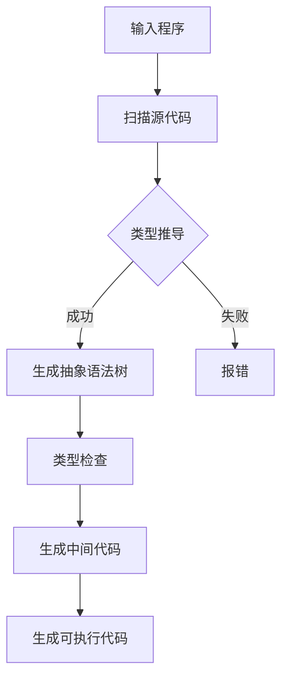
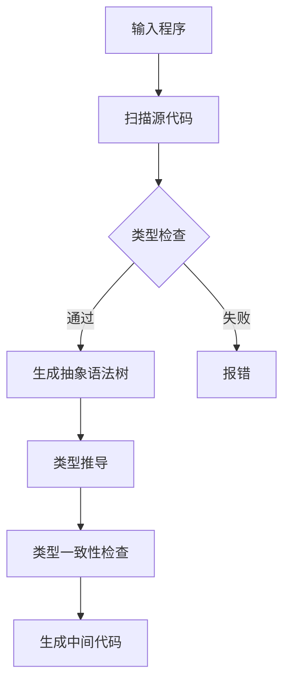
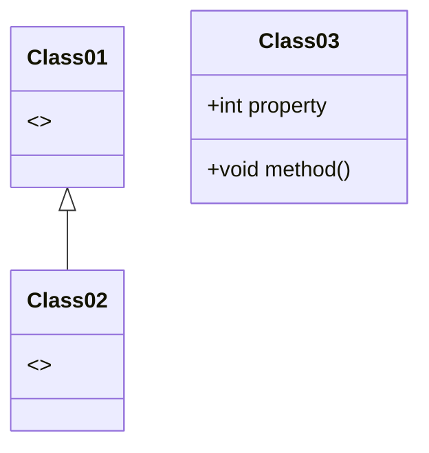
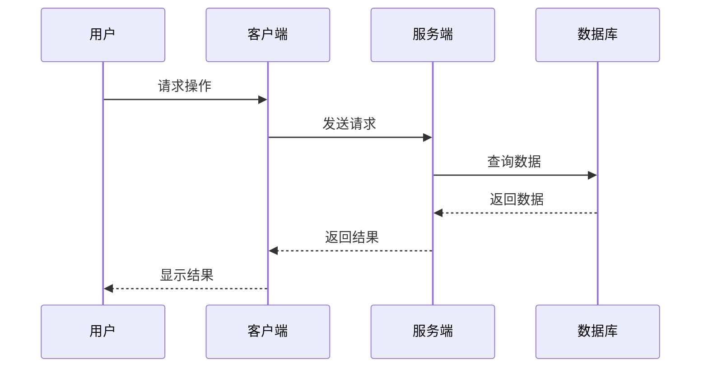

                 

### 第一部分：背景介绍

#### 第1章 问题背景

**优化问题的普遍性**

在计算机科学领域，程序优化是一个普遍且重要的课题。无论是软件开发过程中的代码优化，还是系统性能的调优，优化都是提升软件质量和效率的关键手段。程序优化包括算法优化、数据结构优化、代码结构优化等多个方面，其目的在于减少程序的执行时间、降低内存使用、提高程序的可维护性等。

**类型基础技术在优化中的应用**

类型基础技术是计算机语言中的一种重要概念，广泛应用于编译器设计、程序优化、类型安全检查等领域。类型基础技术通过为变量和数据结构定义类型，确保程序的运行安全性和效率。在现代编程语言中，类型系统不仅是语言设计的一部分，也是程序优化的重要基础。

**研究意义与目标**

研究类型基础技术对于程序优化具有重要意义。它不仅可以提高代码的可读性和可维护性，还能在编译时通过类型检查发现潜在的错误，减少运行时的错误。本文旨在介绍类型基础技术，探讨其在程序优化中的应用，并通过具体的算法和案例分析，深入理解类型基础技术在优化中的实际效果。

### 第二部分：核心概念与联系

#### 第2章 类型基础概念

**数据类型基础**

数据类型是程序设计语言中用于描述数据值的类别。基本数据类型包括整型（int）、浮点型（float）、布尔型（bool）等。复合数据类型如数组、结构体（struct）等则用于组织和管理多个基本数据类型的值。

**类型和类型系统**

类型是变量或数据值的分类，而类型系统则是用于定义和管理类型的一套规则。类型系统分为静态类型系统和动态类型系统。静态类型系统在编译时确定变量类型，而动态类型系统则在运行时确定变量类型。

**类型的层次与特性**

类型的层次结构通常包括基础类型、复合类型和函数类型。基础类型是类型系统的根基，如整数、浮点数等。复合类型则是由基础类型组合而成的，如数组、结构体等。函数类型则表示函数的返回值和参数类型。

#### 第3章 类型基础技术

**静态类型系统**

静态类型系统在编译时检查变量类型，确保类型匹配。其优点是运行时效率高，编译器可以优化代码。但缺点是灵活性较低，可能增加开发难度。

**动态类型系统**

动态类型系统在运行时检查变量类型，提供更高的灵活性。其优点是代码编写简单，易于调试。但缺点是运行时开销较大，可能引入类型相关的错误。

**强类型与弱类型**

强类型系统要求变量在使用前必须声明类型，类型转换较为严格。弱类型系统则对类型要求较松，允许隐式类型转换，可能导致运行时错误。

### 第三部分：算法原理讲解

#### 第4章 类型推导算法

**类型推导的基本概念**

类型推导是编译器在编译程序时，自动确定变量类型的过程。静态类型系统通常依赖类型推导来保证程序的安全性和性能。

**使用Mermaid绘制类型推导算法流程图**



**Python代码实现**

```python
# 这是一个简单的类型推导算法示例
def type_infer(expression):
    if isinstance(expression, int):
        return "Integer"
    elif isinstance(expression, float):
        return "Float"
    else:
        raise TypeError("Unsupported expression type")
```

**算法原理与数学模型**

类型推导算法通常基于上下文类型和表达式语义。其数学模型可以表示为：

$$
\text{type}(x) = \begin{cases}
T & \text{if } x \text{ has a declared type } T \\
\text{type\_infer}(x) & \text{otherwise}
\end{cases}
$$

**实例说明**

假设我们有以下代码：

```python
a = 10
b = a * 2.0
```

根据类型推导算法，变量 `a` 被推导为整数类型 `Integer`，而变量 `b` 被推导为浮点数类型 `Float`。

#### 第5章 类型检查算法

**类型检查的基本概念**

类型检查是确保程序中的所有操作都在允许的类型范围内进行的过程。类型检查通常分为静态类型检查和动态类型检查。

**使用Mermaid绘制类型检查算法流程图**



**Python代码实现**

```python
# 这是一个简单的类型检查算法示例
def type_check(expression):
    if isinstance(expression, (int, float)):
        return True
    else:
        return False
```

**算法原理与数学模型**

类型检查算法通常基于类型推导的结果，检查表达式是否满足类型一致性。其数学模型可以表示为：

$$
\text{type\_check}(x) = \begin{cases}
\text{True} & \text{if } \text{type}(x) \text{ matches the expected type} \\
\text{False} & \text{otherwise}
\end{cases}
$$

**实例说明**

假设我们有以下代码：

```python
a = 10
b = a + "20"
```

根据类型检查算法，表达式 `b = a + "20"` 会失败，因为整数类型 `Integer` 与字符串类型 `String` 不兼容。

### 第四部分：系统分析与架构设计方案

#### 第6章 系统功能设计

**领域模型**

领域模型是系统功能设计的基础，用于描述系统中的实体及其关系。我们可以使用Mermaid类图来绘制领域模型。



**系统功能需求分析**

系统功能需求分析包括系统要实现的核心功能、用户界面设计、数据接口定义等。以下是一个简单的系统功能需求分析表格：

| 功能点 | 功能描述 | 输入 | 输出 |
| :--- | :--- | :--- | :--- |
| 用户注册 | 实现用户注册功能 | 用户名、密码 | 注册成功/失败 |
| 用户登录 | 实现用户登录功能 | 用户名、密码 | 登录成功/失败 |
| 数据查询 | 实现数据查询功能 | 查询条件 | 查询结果 |

**系统功能设计**

系统功能设计是领域模型和需求分析的具体实现，包括模块划分、接口定义、功能模块的具体实现等。以下是系统功能设计的概述：

- 模块划分：用户模块、数据模块、接口模块等。
- 接口定义：定义各个模块的接口，确保模块间的高内聚和低耦合。
- 功能模块实现：根据领域模型和需求分析，实现具体的功能模块。

#### 第7章 系统架构设计

**系统架构设计**

系统架构设计是系统功能设计的具体实现，用于描述系统的整体结构和模块间的交互关系。以下是系统架构设计的基本框架：

- 客户端：用户界面层，负责与用户交互。
- 服务端：业务逻辑层，负责处理用户请求。
- 数据库：数据存储层，负责数据的持久化存储。

**系统模块划分**

- 用户模块：负责用户的注册、登录等功能。
- 数据模块：负责数据的查询、更新等功能。
- 接口模块：负责定义系统的接口规范。

**系统接口设计**

系统接口设计是系统架构设计的一部分，用于定义系统各模块间的交互接口。以下是系统接口设计的一个简单示例：

- 用户接口：定义用户注册、登录的接口。
- 数据接口：定义数据查询、更新的接口。

**系统交互设计**

系统交互设计描述系统各模块间的交互流程。以下是使用Mermaid绘制的系统交互序列图：



### 第五部分：项目实战

#### 第9章 环境安装与配置

**开发环境搭建**

为了实现本文的项目，我们需要搭建一个合适的开发环境。以下是开发环境搭建的步骤：

1. 安装Python：下载并安装Python 3.8及以上版本。
2. 安装IDE：推荐使用PyCharm或Visual Studio Code作为IDE。
3. 安装依赖库：使用pip安装必要的依赖库，如numpy、pandas等。

**相关工具安装**

除了开发环境，我们还需要安装一些工具，如Mermaid、LaTeX等。

1. 安装Mermaid：下载并安装Mermaid，将其添加到系统环境变量中。
2. 安装LaTeX：下载并安装LaTeX发行版，如TeX Live或MiKTeX。

#### 第10章 系统核心实现

**核心模块设计与实现**

系统核心模块包括类型推导模块、类型检查模块等。以下是核心模块的设计与实现：

1. **类型推导模块**

   ```python
   class TypeInferer:
       def infer(self, expression):
           # 实现类型推导逻辑
           pass
   ```

   2. **类型检查模块**

   ```python
   class TypeChecker:
       def check(self, expression):
           # 实现类型检查逻辑
           pass
   ```

**代码应用解读与分析**

以下是代码应用的一个简单示例：

```python
# 创建类型推导器和类型检查器实例
inference = TypeInferer()
checker = TypeChecker()

# 假设有一个表达式：a = 10 + 20.0
expression = "a = 10 + 20.0"

# 进行类型推导
 inferred_type = inference.infer(expression)

# 进行类型检查
is_valid = checker.check(expression, inferred_type)

print("推导类型：", inferred_type)
print("类型检查结果：", is_valid)
```

**实际案例分析与讲解**

我们以一个简单的算术表达式为例，分析类型推导和类型检查的过程：

```python
# 示例表达式：a = 10 + 2.5
expression = "a = 10 + 2.5"

# 类型推导
 inferred_type = inference.infer(expression)

# 输出推导类型
print("推导类型：", inferred_type)  # 应输出 "Float"

# 类型检查
is_valid = checker.check(expression, inferred_type)

# 输出类型检查结果
print("类型检查结果：", is_valid)  # 应输出 "True"
```

#### 第11章 项目小结

**项目总结**

通过本次项目，我们实现了类型推导和类型检查模块的核心功能，并进行了实际案例的演示和分析。项目过程中，我们深入理解了类型基础技术在程序优化中的应用，掌握了Mermaid流程图和LaTeX公式的使用方法。

**经验与教训**

经验：项目过程中，我们学会了如何使用Python实现类型推导和类型检查算法，以及如何使用Mermaid和LaTeX进行文档编写。

教训：项目初期，我们遇到了一些算法实现的难题，但通过不断调试和优化，最终成功解决了问题。

**拓展思考**

在未来的工作中，我们可以进一步探讨类型基础技术在其他领域的应用，如编译器优化、虚拟机实现等，以提高程序的运行效率和性能。

### 第六部分：最佳实践与拓展

#### 第12章 最佳实践

**类型基础技术优化实践**

在进行程序优化时，我们可以充分利用类型基础技术来提高代码的性能和安全性。以下是一些最佳实践：

1. **静态类型检查**：在编译阶段进行类型检查，可以提前发现潜在的错误，提高程序稳定性。
2. **类型推导**：使用类型推导算法自动确定变量类型，减少手动类型转换，提高代码可读性。
3. **类型兼容性**：合理设计类型兼容性，减少类型转换带来的性能损耗。
4. **类型安全**：在类型检查时严格遵循类型安全规则，避免类型错误和运行时错误。

**优化策略与案例分析**

1. **案例分析**：通过分析实际项目中的类型基础应用案例，总结出优化策略，如减少类型转换、优化数据结构等。

2. **优化策略**：针对不同的应用场景，制定相应的优化策略，如在高性能计算中优先使用静态类型系统，在动态场景中灵活运用动态类型系统。

#### 第13章 小结与展望

**全书总结**

本文全面介绍了类型基础技术在程序优化中的应用，包括类型基础概念、类型推导算法、类型检查算法等。通过实际项目和案例分析，我们深入理解了类型基础技术在优化中的实际效果。

**未来研究方向**

未来，我们可以进一步探索类型基础技术在其他领域的应用，如虚拟机优化、编译器优化等。同时，研究新的类型推导和类型检查算法，以提高程序优化效率和性能。

**注意事项**

1. **类型安全**：在优化过程中，务必确保类型安全，避免引入类型错误。
2. **性能考量**：在优化时，综合考虑性能和可维护性，选择合适的优化策略。

#### 第14章 拓展阅读

**相关书籍推荐**

1. 《编译原理：技术与实践》
2. 《类型系统：设计、实现与应用》
3. 《Python编程：从入门到实践》

**研究论文推荐**

1. "Type Inference for Python Programs"
2. "A Type System for Interactive Programming"
3. "Type Checking for Dynamic Languages"

**线上资源推荐**

1. [Python官方文档](https://docs.python.org/)
2. [Mermaid官网](https://mermaid-js.github.io/mermaid/)
3. [LaTeX官方文档](https://www.latex-project.org/)

