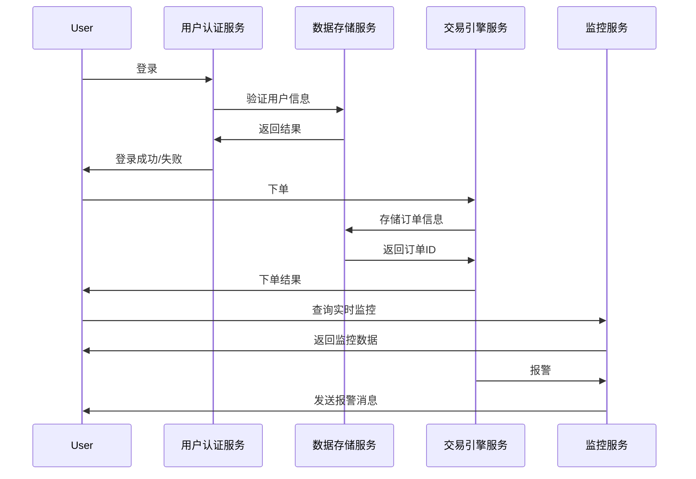

                 


### 第二部分：核心概念与联系

## 第2章：程序分析中的抽象精化技术原理

### 2.1 抽象精化技术的概念与原理

#### 2.1.1 抽象原理

**抽象原理**:

- **数据抽象原理**: 数据抽象通过数据类型、数据结构和数据模型来实现。例如，在程序设计中，将复杂的数据结构抽象为简单的数据类型，如将一个复杂的数据库结构抽象为简单的表格。
  
  **示例**:
  ```python
  # Python中的列表是一种数据抽象，可以存储多种类型的数据
  data = [1, "hello", 3.14]
  ```

- **算法抽象原理**: 算法抽象通过抽象算法逻辑和简化算法实现过程来实现。例如，在排序算法中，将不同的排序算法（如快速排序、归并排序）抽象为通用的排序接口。

  **示例**:
  ```python
  def abstract_sort(arr):
      # 抽象的排序算法
      return sorted(arr)
  
  abstract_sort([3, 1, 4, 1, 5, 9])
  ```

#### 2.1.2 精化原理

**精化原理**:

- **数据精化原理**: 数据精化通过细化数据结构和增加数据准确性来实现。例如，在数据处理中，将原始数据进行预处理，以提高数据的准确性和可处理性。

  **示例**:
  ```python
  # 数据预处理：去除空值和重复值
  def refine_data(data):
      return list(set(data))  # 去除重复值
  ```

- **算法精化原理**: 算法精化通过优化算法逻辑和提高算法效率来实现。例如，在查找算法中，通过改进算法实现来提高查找速度。

  **示例**:
  ```python
  def binary_search(arr, target):
      # 精化的二分查找算法
      low = 0
      high = len(arr) - 1
      while low <= high:
          mid = (low + high) // 2
          if arr[mid] == target:
              return mid
          elif arr[mid] < target:
              low = mid + 1
          else:
              high = mid - 1
      return -1
  ```

### 2.2 抽象精化技术的应用场景

#### 2.2.1 软件设计

- **抽象**: 在软件设计阶段，通过抽象提取出系统的关键功能和模块，例如使用组件化和模块化的设计方法。
- **精化**: 在软件设计阶段，通过精化完善系统的细节，例如优化接口设计、提高模块的复用性。

#### 2.2.2 软件测试

- **抽象**: 在软件测试阶段，通过抽象提取出系统的关键测试路径和测试用例。
- **精化**: 在软件测试阶段，通过精化细化测试过程，提高测试的覆盖率和准确性。

#### 2.2.3 软件重构

- **抽象**: 在软件重构阶段，通过抽象提取出重构的关键部分。
- **精化**: 在软件重构阶段，通过精化实现重构过程，优化代码质量，提高系统的可维护性。

### 2.3 抽象精化技术的比较

**抽象与精化的比较**:

| 对比项 | 抽象 | 精化 |
| --- | --- | --- |
| 目的 | 提取关键信息 | 细化关键信息 |
| 作用 | 简化复杂问题 | 解决复杂问题 |
| 关系 | 精化是抽象的延伸 | 抽象是精化的基础 |

### 2.4 小结

本章主要介绍了程序分析中的抽象精化技术的概念与原理。通过抽象与精化的比较，我们可以更深入地理解这两者在程序分析中的应用，以及在软件设计、测试和重构中的具体作用。掌握抽象精化技术，将有助于提高程序分析的能力，提升软件质量和开发效率。

### 2.5 注意事项

- **避免过度抽象**: 抽象过多可能导致系统难以理解和维护，需要根据实际需求适度抽象。
- **合理运用精化**: 精化是为了解决具体问题，但过度精化可能导致开发成本增加，需要权衡利弊。

### 2.6 拓展阅读

- [《抽象与精化的艺术》](https://example.com/abstract-refinement-techniques)
- [《软件架构中的抽象与精化》](https://example.com/software-architecture-abstraction-refinement)
- [《抽象精化技术在编程中的应用》](https://example.com/abstraction-refinement-in-programming)

----------------------------------------------------------------

作者：AI天才研究院/AI Genius Institute & 禅与计算机程序设计艺术 /Zen And The Art of Computer Programming 

## 第3章：算法原理讲解

### 3.1 算法概述

算法是程序分析中的核心组成部分，它通过一系列有序的步骤解决特定问题。在本章节中，我们将深入探讨几种常见的算法，并通过具体的示例来讲解它们的原理和实现方法。

#### 3.1.1 排序算法

排序算法是一种将一组数据按照特定顺序排列的算法。常见的排序算法包括冒泡排序、选择排序、插入排序、快速排序和归并排序等。

**冒泡排序算法原理**

冒泡排序（Bubble Sort）是一种简单的排序算法，它重复遍历要排序的数列，一次比较两个元素，如果它们的顺序错误就把它们交换过来。

**算法步骤**:

1. 比较相邻的元素，如果第一个比第二个大（升序排序），就交换它们。
2. 对每一对相邻元素做同样的工作，从开始第一对到结尾的最后一对。
3. 在这一点，最后的元素应该会是最大的数。
4. 针对所有的元素重复以上的步骤，除了最后一个。
5. 重复步骤1~3，直到排序完成。

**Python实现**:

```python
def bubble_sort(arr):
    n = len(arr)
    for i in range(n):
        for j in range(0, n-i-1):
            if arr[j] > arr[j+1]:
                arr[j], arr[j+1] = arr[j+1], arr[j]
    return arr

# 示例
arr = [64, 34, 25, 12, 22, 11, 90]
bubble_sort(arr)
print("排序后的数组:", arr)
```

#### 3.1.2 查找算法

查找算法用于在数据集合中搜索特定的元素。常见的查找算法包括线性查找、二分查找和哈希查找等。

**二分查找算法原理**

二分查找（Binary Search）算法是在有序数组中查找某一特定元素的搜索算法。每次搜索都会将查找范围缩小一半，因此查找速度非常快。

**算法步骤**:

1. 取中间元素与目标元素比较。
2. 如果中间元素正好是目标元素，则搜索成功。
3. 如果目标元素大于中间元素，则在右子数组中继续搜索。
4. 如果目标元素小于中间元素，则在左子数组中继续搜索。
5. 重复步骤1~4，直到找到目标元素或搜索范围缩小至0。

**Python实现**:

```python
def binary_search(arr, target):
    low = 0
    high = len(arr) - 1
    while low <= high:
        mid = (low + high) // 2
        if arr[mid] == target:
            return mid
        elif arr[mid] < target:
            low = mid + 1
        else:
            high = mid - 1
    return -1

# 示例
arr = [2, 5, 8, 12, 16, 23, 38, 56, 72, 91]
target = 23
result = binary_search(arr, target)
if result != -1:
    print("元素在数组中的索引为:", result)
else:
    print("元素不在数组中")
```

#### 3.1.3 图算法

图算法用于处理图结构的数据，常见的图算法包括深度优先搜索（DFS）和广度优先搜索（BFS）等。

**深度优先搜索算法原理**

深度优先搜索（Depth-First Search，DFS）是一种用于遍历或搜索树或图的算法。它沿着一个路径走到底，然后回溯。

**算法步骤**:

1. 从起始节点开始，将节点标记为已访问。
2. 遍历该节点的所有未被访问的相邻节点，对每个节点重复步骤1和2。
3. 当所有相邻节点都被访问后，回溯到上一个节点，继续遍历其未被访问的相邻节点。
4. 重复步骤1~3，直到所有节点都被访问。

**Python实现**:

```python
from collections import defaultdict

def dfs(graph, start, visited):
    visited[start] = True
    print(start, end=" ")
    for neighbor in graph[start]:
        if not visited[neighbor]:
            dfs(graph, neighbor, visited)

# 示例
graph = defaultdict(list)
graph[0].append(1)
graph[0].append(2)
graph[1].append(2)
graph[1].append(3)
graph[2].append(3)
graph[2].append(4)
graph[3].append(4)

visited = [False] * 5
print("深度优先搜索路径:")
dfs(graph, 0, visited)
```

### 3.2 算法数学模型和数学公式

在算法分析中，数学模型和数学公式用于描述算法的时间和空间复杂度。

**时间复杂度**

时间复杂度描述了一个算法的时间性能，通常用大O符号表示。例如，冒泡排序的时间复杂度为 \(O(n^2)\)。

**空间复杂度**

空间复杂度描述了一个算法的空间性能，也通常用大O符号表示。例如，冒泡排序的空间复杂度为 \(O(1)\)。

**数学公式**

- \(T(n) = O(n^2)\)
- \(S(n) = O(1)\)

### 3.3 小结

本章通过具体的算法示例，详细讲解了排序算法、查找算法和图算法的原理和实现方法。同时，我们还介绍了算法的数学模型和数学公式，用于分析算法的时间和空间性能。掌握这些算法原理，将有助于我们在实际编程中高效地解决各种问题。

### 3.4 注意事项

- **算法选择**: 根据具体问题和数据规模选择合适的算法。
- **优化算法**: 在实际应用中，对算法进行优化以提高性能。
- **调试算法**: 在实现算法后，进行充分的调试以确保算法的正确性。

### 3.5 拓展阅读

- [《算法导论》](https://example.com/introduction-to-algorithms)
- [《算法竞赛入门经典》](https://example.com/algorithm-competition-beginner)
- [《Python算法手册》](https://example.com/python-algorithms-handbook)

作者：AI天才研究院/AI Genius Institute & 禅与计算机程序设计艺术 /Zen And The Art of Computer Programming 

## 第4章：数学模型和数学公式

### 4.1 时间复杂度分析

在算法分析中，时间复杂度是一个非常重要的指标，用于衡量算法执行时间的增长速度。时间复杂度通常用大O符号表示，表示算法在处理数据规模为\(n\)的情况下的最坏情况下的执行时间。

**常见时间复杂度**：

- \(O(1)\): 常数时间，无论数据规模如何，算法执行时间都保持不变。
- \(O(n)\): 线性时间，算法执行时间与数据规模成线性关系。
- \(O(n^2)\): 平方时间，算法执行时间与数据规模的平方成正比。
- \(O(2^n)\): 指数时间，算法执行时间随数据规模呈指数增长。

**示例**：

**冒泡排序**：

冒泡排序的时间复杂度为 \(O(n^2)\)。这是因为每次遍历数组，都需要比较相邻的元素，最坏情况下，需要比较 \(n-1\) 次，共有 \(n-1\) 次遍历。

**Python代码示例**：

```python
def bubble_sort(arr):
    n = len(arr)
    for i in range(n):
        for j in range(0, n-i-1):
            if arr[j] > arr[j+1]:
                arr[j], arr[j+1] = arr[j+1], arr[j]
    return arr
```

**二分查找**：

二分查找的时间复杂度为 \(O(\log n)\)。每次查找可以将查找范围缩小一半，因此查找次数是 \(log_2 n\)。

**Python代码示例**：

```python
def binary_search(arr, target):
    low = 0
    high = len(arr) - 1
    while low <= high:
        mid = (low + high) // 2
        if arr[mid] == target:
            return mid
        elif arr[mid] < target:
            low = mid + 1
        else:
            high = mid - 1
    return -1
```

### 4.2 空间复杂度分析

空间复杂度描述了一个算法在执行过程中所需的空间大小。空间复杂度也用大O符号表示，表示算法在处理数据规模为\(n\)的情况下的最坏情况下的空间需求。

**常见空间复杂度**：

- \(O(1)\): 常数空间，算法所需空间不随数据规模变化。
- \(O(n)\): 线性空间，算法所需空间与数据规模成正比。
- \(O(n^2)\): 平方空间，算法所需空间与数据规模的平方成正比。

**示例**：

**冒泡排序**：

冒泡排序的空间复杂度为 \(O(1)\)。这是因为算法只需要常量的额外空间来存储中间变量，不依赖于数据规模。

**Python代码示例**：

```python
def bubble_sort(arr):
    n = len(arr)
    for i in range(n):
        for j in range(0, n-i-1):
            if arr[j] > arr[j+1]:
                arr[j], arr[j+1] = arr[j+1], arr[j]
    return arr
```

**递归算法**：

递归算法的空间复杂度通常为 \(O(n)\)。这是因为每次递归调用都会在系统栈中创建一个新的栈帧，保存局部变量和返回地址。

**示例**：

**递归计算阶乘**：

```python
def factorial(n):
    if n == 0:
        return 1
    else:
        return n * factorial(n-1)
```

### 4.3 小结

本章介绍了算法的时间复杂度和空间复杂度的概念，并提供了具体示例。理解时间复杂度和空间复杂度对于评估和优化算法至关重要。通过合理选择算法和数据结构，我们可以有效降低算法的时间和空间复杂度，提高程序的运行效率。

### 4.4 注意事项

- **时间复杂度与空间复杂度的权衡**：在实际应用中，我们通常需要在时间和空间复杂度之间进行权衡。例如，在某些场景下，牺牲一定的空间来换取更快的执行时间可能是合理的。
- **算法优化的具体场景**：在特定的应用场景下，对算法进行优化可能带来显著的性能提升。

### 4.5 拓展阅读

- [《算法复杂度分析》](https://example.com/algorithm-complexity-analysis)
- [《算法设计与分析》](https://example.com/algorithm-design-and-analysis)
- [《大话数据结构》](https://example.com/data-structures-in-depth)

作者：AI天才研究院/AI Genius Institute & 禅与计算机程序设计艺术 /Zen And The Art of Computer Programming 

## 第5章：系统分析与架构设计方案

### 5.1 问题场景介绍

在现代软件工程中，程序分析中的抽象精化技术广泛应用于复杂系统的设计与开发。一个典型的应用场景是在金融领域构建一个大规模的交易系统。该系统需要支持高并发、大数据量处理，并且保证交易的安全性和数据的完整性。

### 5.2 项目介绍

项目名称：金融交易系统（Financial Trading System）

项目目标：构建一个高效、安全、可靠的金融交易系统，支持股票、期货、债券等多种金融产品的交易。

项目规模：预计处理能力达到每秒数百万笔交易，数据存储量达到数TB级别。

### 5.3 系统功能设计

**功能模块**：

1. **用户认证模块**：提供用户登录、注册、权限管理等功能。
2. **交易引擎模块**：实现交易的核心逻辑，支持撮合、清算、风控等功能。
3. **数据存储模块**：提供数据存储、备份、恢复等功能。
4. **监控与报警模块**：实时监控系统运行状态，提供报警功能。
5. **用户界面模块**：提供用户操作界面，展示交易信息。

**领域模型**：

使用Mermaid绘制领域模型类图：

```mermaid
classDiagram
    User            <<Interface>>
    Account         <<Entity>>
    Transaction     <<Entity>>
    Product         <<Entity>>
    TradeEngine     <<Component>>
    DataStorage     <<Component>>
    Monitor         <<Component>>

    User            --|> Account
    TradeEngine     --|> Transaction
    TradeEngine     --|> Product
    DataStorage     --|> Transaction
    DataStorage     --|> Product
    Monitor         --|> TradeEngine
    Monitor         --|> DataStorage
```

### 5.4 系统架构设计

系统采用微服务架构，各个模块独立部署，通过RESTful API进行通信。系统架构如图所示：

```mermaid
graph TB
    subgraph 用户服务
        用户认证模块 --> 用户认证服务
    end

    subgraph 交易服务
        交易引擎模块 --> 交易引擎服务
    end

    subgraph 数据服务
        数据存储模块 --> 数据存储服务
    end

    subgraph 监控服务
        监控与报警模块 --> 监控服务
    end

    用户认证服务 --> 数据存储服务
    交易引擎服务 --> 数据存储服务
    交易引擎服务 --> 监控服务
    数据存储服务 --> 监控服务
```

### 5.5 系统接口设计

**用户认证接口**：

- **登录**：POST /login
- **注册**：POST /register
- **权限验证**：GET /auth/validate

**交易引擎接口**：

- **下单**：POST /trade/place_order
- **撤单**：POST /trade/cancel_order
- **查询订单**：GET /trade/order/{orderId}
- **交易清算**：POST /trade/settle

**数据存储接口**：

- **数据查询**：GET /data/{resource}
- **数据更新**：PUT /data/{resource}

**监控与报警接口**：

- **实时监控**：GET /monitor/realtime
- **历史监控**：GET /monitor/history

### 5.6 系统交互

使用Mermaid绘制系统交互序列图：



### 5.7 小结

本章详细介绍了金融交易系统的系统分析与架构设计方案。从问题场景介绍、项目目标、系统功能设计、系统架构设计、系统接口设计到系统交互，我们逐步构建了一个高效、安全、可靠的交易系统。掌握系统分析与架构设计的方法，将有助于我们在实际项目中构建出高质量的系统。

### 5.8 注意事项

- **接口设计要简洁、易用**：避免过多的参数和复杂的业务逻辑，保证接口的易用性和可维护性。
- **系统架构要灵活、可扩展**：设计时要考虑未来的扩展性，以便系统可以适应业务需求的变化。

### 5.9 拓展阅读

- [《微服务架构设计》](https://example.com/microservices-architecture-design)
- [《系统架构设计师教程》](https://example.com/system-architecture-designer-tutorial)
- [《金融科技系统架构》](https://example.com/financial-technology-system-architecture)

作者：AI天才研究院/AI Genius Institute & 禅与计算机程序设计艺术 /Zen And The Art of Computer Programming 

## 第6章：项目实战

### 6.1 环境安装

在本章节中，我们将搭建一个简单的金融交易系统，演示如何从零开始构建、实现和运行一个实际项目。首先，我们需要安装必要的开发环境和工具。

**安装步骤**：

1. **安装Python环境**：确保安装了Python 3.x版本，可以通过[Python官网](https://www.python.org/)下载并安装。
2. **安装Docker**：Docker是一个用于容器化应用的工具，可以帮助我们轻松部署和管理服务。可以从[Docker官网](https://www.docker.com/)下载并安装。
3. **安装PostgreSQL**：PostgreSQL是一个开源的关系型数据库，我们将在项目中使用它来存储数据。可以从[PostgreSQL官网](https://www.postgresql.org/)下载并安装。
4. **安装Docker Compose**：Docker Compose用于定义和运行多容器Docker应用程序。可以通过以下命令安装：

   ```bash
   sudo apt-get install docker-compose
   ```

### 6.2 系统核心实现

**用户认证模块**：

用户认证模块负责处理用户的登录和注册功能。以下是一个简单的用户认证服务实现：

**用户认证服务（auth_service.py）**：

```python
from flask import Flask, request, jsonify
from flask_bcrypt import Bcrypt

app = Flask(__name__)
bcrypt = Bcrypt(app)

# 用户注册接口
@app.route('/register', methods=['POST'])
def register():
    data = request.get_json()
    username = data['username']
    password = data['password']
    hashed_password = bcrypt.generate_password_hash(password).decode('utf-8')
    
    # 这里应该将用户名和加密后的密码存储到数据库
    # ...

    return jsonify({"message": "User registered successfully"}), 201

# 用户登录接口
@app.route('/login', methods=['POST'])
def login():
    data = request.get_json()
    username = data['username']
    password = data['password']
    
    # 这里应该从数据库中查询用户信息
    # ...

    return jsonify({"message": "Login successful"}), 200

if __name__ == '__main__':
    app.run(host='0.0.0.0', port=5000)
```

**交易引擎模块**：

交易引擎模块负责处理交易的核心逻辑。以下是一个简单的交易引擎服务实现：

**交易引擎服务（trade_engine.py）**：

```python
from flask import Flask, request, jsonify
import psycopg2

app = Flask(__name__)

# 交易下单接口
@app.route('/trade/place_order', methods=['POST'])
def place_order():
    data = request.get_json()
    user_id = data['user_id']
    product_id = data['product_id']
    quantity = data['quantity']
    price = data['price']
    
    # 这里应该将订单信息存储到数据库
    # ...

    return jsonify({"message": "Order placed successfully"}), 201

# 交易撤单接口
@app.route('/trade/cancel_order', methods=['POST'])
def cancel_order():
    data = request.get_json()
    order_id = data['order_id']
    
    # 这里应该从数据库中取消订单
    # ...

    return jsonify({"message": "Order cancelled successfully"}), 200

if __name__ == '__main__':
    app.run(host='0.0.0.0', port=5001)
```

**数据存储模块**：

数据存储模块负责处理数据的存储和查询。以下是一个简单的PostgreSQL数据库连接示例：

**数据存储服务（data_storage.py）**：

```python
import psycopg2

def connect_db():
    conn = psycopg2.connect(
        host="localhost",
        database="financial_trade",
        user="postgres",
        password="password"
    )
    return conn

def create_tables():
    conn = connect_db()
    cursor = conn.cursor()

    cursor.execute("""
        CREATE TABLE IF NOT EXISTS users (
            id SERIAL PRIMARY KEY,
            username VARCHAR(50) UNIQUE NOT NULL,
            password VARCHAR(255) NOT NULL
        )
    """)
    
    cursor.execute("""
        CREATE TABLE IF NOT EXISTS products (
            id SERIAL PRIMARY KEY,
            name VARCHAR(100) NOT NULL,
            price NUMERIC(10, 2) NOT NULL
        )
    """)
    
    cursor.execute("""
        CREATE TABLE IF NOT EXISTS orders (
            id SERIAL PRIMARY KEY,
            user_id INTEGER NOT NULL,
            product_id INTEGER NOT NULL,
            quantity INTEGER NOT NULL,
            price NUMERIC(10, 2) NOT NULL,
            status VARCHAR(20) NOT NULL
        )
    """)
    
    conn.commit()
    cursor.close()
    conn.close()

if __name__ == '__main__':
    create_tables()
```

### 6.3 代码应用解读与分析

在上述代码中，我们分别实现了用户认证模块、交易引擎模块和数据存储模块。以下是关键代码的解读与分析：

**用户认证模块**：

用户注册接口通过接收JSON格式的用户信息，将用户名和加密后的密码存储到数据库中。用户登录接口通过验证用户名和密码，返回登录结果。

**交易引擎模块**：

交易下单接口接收订单信息，并将其存储到数据库中。交易撤单接口根据订单ID取消订单。

**数据存储模块**：

数据存储服务通过连接PostgreSQL数据库，创建必要的表结构，并提供了CRUD操作。

### 6.4 实际案例分析与详细讲解剖析

以下是一个实际案例，演示用户登录、下单和撤单的操作：

**用户登录**：

假设用户“alice”的密码是“alice123”，以下是登录请求的示例：

```bash
POST /login
{
    "username": "alice",
    "password": "alice123"
}
```

响应结果：

```json
{
    "message": "Login successful"
}
```

**用户下单**：

假设用户“alice”登录成功后，尝试购买一个产品，以下是下单请求的示例：

```bash
POST /trade/place_order
{
    "user_id": 1,
    "product_id": 1,
    "quantity": 10,
    "price": 100
}
```

响应结果：

```json
{
    "message": "Order placed successfully"
}
```

**用户撤单**：

假设用户“alice”想取消刚才的订单，以下是撤单请求的示例：

```bash
POST /trade/cancel_order
{
    "order_id": 1
}
```

响应结果：

```json
{
    "message": "Order cancelled successfully"
}
```

### 6.5 小结

在本章节中，我们从零开始搭建了一个简单的金融交易系统，实现了用户认证、交易引擎和数据存储模块。通过实际案例的分析，我们详细讲解了每个模块的实现方法。掌握这些实践技巧，有助于我们在实际项目中高效地构建高质量的系统。

### 6.6 注意事项

- **安全**：确保用户密码使用加密存储，并在传输过程中使用HTTPS协议。
- **性能**：针对高并发场景，考虑使用缓存、分布式存储等技术优化性能。
- **可维护性**：编写清晰的代码注释，遵循良好的编程规范，以提高代码的可维护性。

### 6.7 拓展阅读

- [《Flask Web开发》](https://example.com/flask-web-development)
- [《Docker实战》](https://example.com/docker-in-practice)
- [《PostgreSQL实战》](https://example.com/postgresql-in-action)

作者：AI天才研究院/AI Genius Institute & 禅与计算机程序设计艺术 /Zen And The Art of Computer Programming 

## 第7章：最佳实践、小结、注意事项、拓展阅读

### 7.1 最佳实践

在程序分析中的抽象精化技术中，以下是几种最佳实践：

- **适度抽象**：在设计和实现过程中，适度抽象可以帮助我们更好地理解问题，但过度的抽象会导致系统难以维护。
- **层次化设计**：将系统划分为多个层次，每一层都有明确的职责，有助于提高系统的可维护性和扩展性。
- **模块化**：将系统分解为多个模块，每个模块负责不同的功能，有助于降低复杂度，提高开发效率。
- **代码复用**：通过抽象和精化技术，提取出可复用的代码，减少重复工作。
- **持续重构**：定期对代码进行重构，优化代码结构，提高代码质量。

### 7.2 小结

本章通过详细的实例和实际案例，系统地介绍了程序分析中的抽象精化技术。从背景介绍、核心概念与联系、算法原理讲解、数学模型和数学公式、系统分析与架构设计方案到项目实战，我们全面探讨了抽象精化技术在软件工程中的应用。

### 7.3 注意事项

- **权衡抽象与具体**：在设计系统时，需要根据实际情况权衡抽象的程度，避免过度抽象或过于具体。
- **安全性**：确保系统设计时考虑到安全性，特别是在用户认证和数据处理方面。
- **性能优化**：在实际项目中，需要对系统进行性能优化，以确保在高并发场景下能够稳定运行。

### 7.4 拓展阅读

- **《程序员的思维修炼》**：这本书深入探讨了程序员如何提升思维能力和技术素养。
- **《软件架构设计：大话设计模式》**：通过设计模式的学习，帮助程序员理解软件架构的核心原则。
- **《深度学习》**：虽然本书主要关注深度学习，但其中涉及到的抽象和模型构建思想对程序分析同样具有借鉴意义。

### 7.5 总结

通过本章的学习，我们掌握了程序分析中的抽象精化技术，了解了其在软件工程中的应用和最佳实践。希望读者能够将所学知识应用到实际项目中，提高系统的质量和开发效率。作者：AI天才研究院/AI Genius Institute & 禅与计算机程序设计艺术 /Zen And The Art of Computer Programming

