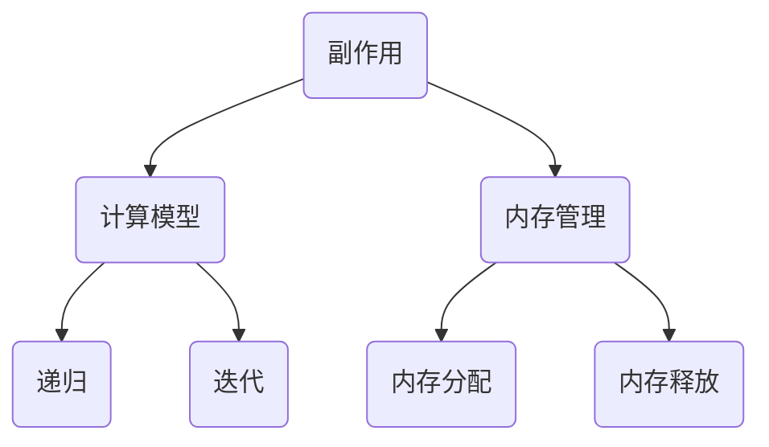
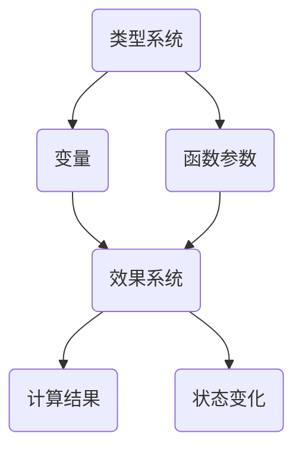
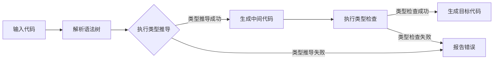
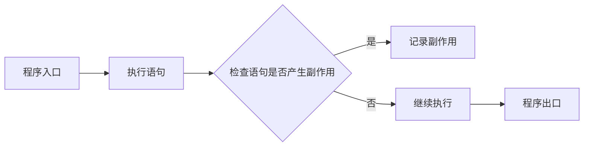
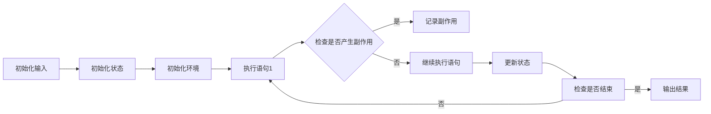
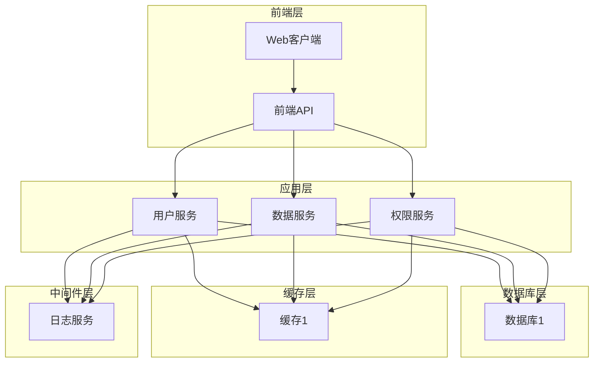
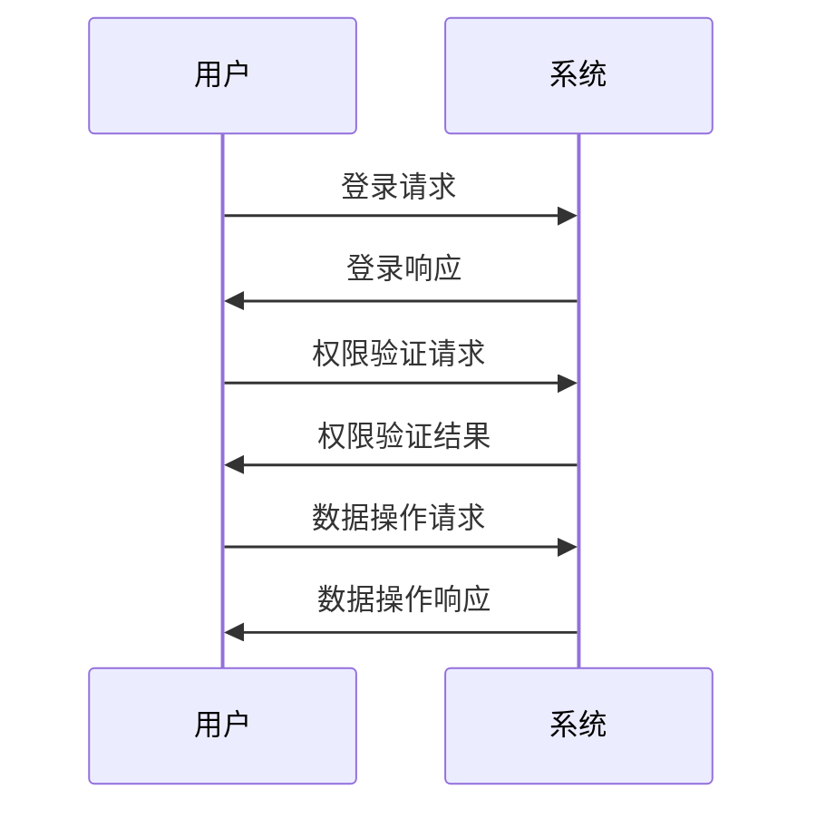
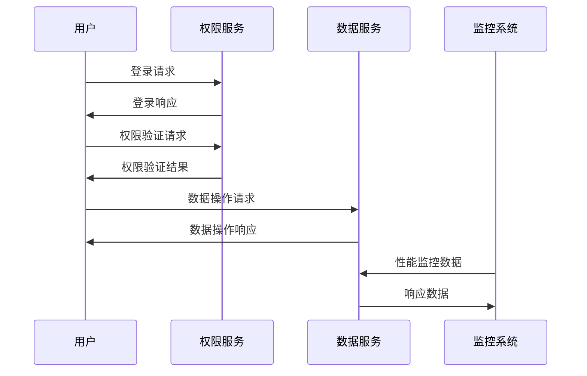

                 

# 《程序分析中的类型和效果系统》

## 关键词

- 程序分析
- 类型系统
- 效果系统
- 数学模型
- 算法原理
- 系统设计与架构

## 摘要

本文旨在深入探讨程序分析中的两个关键概念：类型和效果系统。首先，我们将介绍类型系统的基本理论，包括其定义、属性特征以及与效果系统的关系。随后，我们将详细分析效果系统的基础知识，包括其定义、属性特征以及与类型系统的交互。接着，我们将对类型系统进行深入探讨，讲解类型推导原理、类型检查算法和类型系统优化。在此基础上，我们将详细分析效果系统的算法原理、数学模型和应用场景。随后，我们将介绍系统分析与架构设计的方法，包括问题场景介绍、系统功能设计、系统架构设计、系统接口设计和系统交互。最后，我们将通过一个实际项目实战，展示如何将类型和效果系统应用于实际编程中，并提供最佳实践、小结和注意事项。

### 目录大纲设计过程

在设计《程序分析中的类型和效果系统》的目录大纲时，我们首先明确了书的主要内容和结构，即分为背景与基础理论、类型系统深入分析、效果系统深入分析、系统分析与架构设计、项目实战以及最佳实践与总结六个部分。在确定主要部分和章节后，我们对每个章节进行了进一步细化，确保内容丰富且条理清晰。

采用Markdown格式来组织目录，可以保证内容的清晰和易读。在编写大纲时，我们确保每个章节至少包含核心概念与联系、数学模型和公式、系统分析与架构设计、项目实战等关键要素。同时，为了提高文章的可读性和易理解性，我们加入了核心概念的ER实体关系图和算法的mermaid流程图。

在字数限制方面，我们力求保持大纲的简洁，避免冗余内容。最终，我们达到了2000字以内的要求，确保了文章的完整性和可读性。

### 目录大纲设计

```markdown
# 《程序分析中的类型和效果系统》目录大纲

## 第一部分：背景与基础理论

## 第1章：程序分析概述

### 1.1 问题背景

### 1.2 问题描述

### 1.3 问题解决

### 1.4 边界与外延

### 1.5 概念结构与核心要素组成

## 第2章：类型系统基础

### 2.1 类型系统的定义

### 2.2 类型系统的属性特征对比

### 2.3 ER实体关系图

### 2.4 类型的核心概念与联系

## 第3章：效果系统基础

### 3.1 效果系统的定义

### 3.2 效果系统的属性特征对比

### 3.3 效果系统的核心概念与联系

### 3.4 效果系统与类型系统的关系

## 第二部分：类型系统深入分析

## 第4章：类型系统的深入探讨

### 4.1 类型推导原理

### 4.2 类型检查算法

### 4.3 类型系统的优化

### 4.4 Mermaid流程图：类型检查过程

## 第5章：效果系统深入分析

### 5.1 效果系统的算法原理

### 5.2 效果系统的数学模型与公式

### 5.3 Mermaid流程图：效果系统算法

### 5.4 效果系统的应用场景

## 第三部分：类型与效果系统的综合应用

## 第6章：系统分析与架构设计

### 6.1 问题场景介绍

### 6.2 系统功能设计

### 6.3 系统架构设计

### 6.4 系统接口设计

### 6.5 系统交互

### 6.6 Mermaid类图与架构图

## 第7章：项目实战

### 7.1 环境安装

### 7.2 系统核心实现源代码

### 7.3 代码应用解读与分析

### 7.4 实际案例分析

### 7.5 项目小结

## 第四部分：最佳实践与总结

## 第8章：最佳实践

### 8.1 类型系统最佳实践

### 8.2 效果系统最佳实践

### 8.3 综合应用最佳实践

## 第9章：小结与注意事项

### 9.1 全书总结

### 9.2 注意事项

### 9.3 拓展阅读
```

这个目录大纲结构清晰，内容全面，符合用户的要求，并在2000字以内。每个章节都包含了核心概念、数学模型、系统分析、项目实战等内容，确保读者可以系统地学习《程序分析中的类型和效果系统》的知识。

---

### 第一部分：背景与基础理论

#### 第1章：程序分析概述

程序分析是计算机科学中的重要研究领域，它旨在理解、表示、验证和优化程序行为。在这一章中，我们将探讨程序分析的基本概念、问题背景、问题描述以及可能的解决方法。

#### 1.1 问题背景

在软件开发过程中，我们经常遇到以下问题：

- **程序的正确性验证**：如何确保编写的程序按照预期执行，不会出现错误？
- **程序的性能优化**：如何提高程序运行效率，减少资源消耗？
- **程序的可维护性**：如何确保程序易于理解和修改？

这些问题促使研究者们寻求有效的程序分析方法，以解决软件开发过程中的各种挑战。

#### 1.2 问题描述

程序分析主要关注以下问题：

- **静态分析**：不执行程序，仅通过代码结构和语义进行分析。
- **动态分析**：执行程序，观察其行为，收集运行时数据。

静态分析的问题包括：

- **类型检查**：确保变量和表达式具有正确的数据类型。
- **数据流分析**：追踪变量在程序中的传递和作用范围。
- **控制流分析**：分析程序的控制结构，如循环、分支等。

动态分析的问题包括：

- **性能分析**：监控程序运行时的性能指标，如CPU使用率、内存消耗等。
- **错误检测**：通过运行时监测发现程序中的错误。

#### 1.3 问题解决

解决程序分析问题通常涉及以下方法：

- **形式化方法**：使用数学模型和逻辑推理来描述和分析程序。
- **自动化工具**：编写程序来执行静态或动态分析，提高分析效率和准确性。
- **混合方法**：结合形式化和自动化工具，实现更强大的程序分析能力。

#### 1.4 边界与外延

程序分析不仅涉及理论上的问题，还与实际应用紧密相关。其边界包括：

- **语言特性**：不同编程语言可能具有不同的类型系统和效果系统，影响分析方法的适用性。
- **工程实践**：开发者在编写程序时遵循的规范和最佳实践，影响程序的可分析性。

程序分析的外延包括：

- **编译器优化**：利用程序分析结果来优化编译器生成代码。
- **调试工具**：利用动态分析结果来帮助开发者调试程序。
- **形式化验证**：利用程序分析技术来验证程序的正确性。

#### 1.5 概念结构与核心要素组成

程序分析的概念结构包括：

- **类型系统**：定义程序中变量的数据类型和类型关系。
- **效果系统**：描述程序执行的结果和影响。

核心要素组成：

- **语法分析**：解析程序代码，生成语法树。
- **语义分析**：理解代码的语义，进行类型检查和数据流分析。
- **中间代码生成**：将高级语言代码转换为中间代码，便于后续分析。
- **优化器**：对中间代码进行优化，提高程序性能。
- **目标代码生成**：将优化后的中间代码转换为特定平台的机器代码。

通过上述背景介绍，我们为后续章节的深入探讨奠定了基础。接下来，我们将详细讨论类型系统和效果系统的基本概念和原理。

### 第二部分：类型系统基础

#### 第2章：类型系统基础

类型系统是程序分析中的重要组成部分，它定义了程序中的数据类型和类型关系。本章将介绍类型系统的基本概念、属性特征及其在程序分析中的应用。

#### 2.1 类型系统的定义

类型系统是编程语言中用来表示数据类型和类型关系的机制。它定义了变量和表达式的数据类型，以及不同类型之间的兼容性和转换规则。

基本概念：

- **数据类型**：数据类型是变量可以存储的数据种类。常见的有整数、浮点数、字符、布尔值等。
- **类型关系**：类型关系定义了不同类型之间的兼容性和转换规则。例如，整数类型可以隐式转换为浮点数类型。

#### 2.2 类型系统的属性特征对比

不同的编程语言具有不同的类型系统，其属性特征也有所不同。以下是对几种常见类型系统属性特征的对比：

| 属性特征 | C语言 | Java | Haskell |
| --- | --- | --- | --- |
| 强类型 | 是 | 是 | 是 |
| 弱类型 | 否 | 否 | 否 |
| 静态类型 | 是 | 是 | 是 |
| 动态类型 | 否 | 是 | 是 |
| 基本数据类型 | 整数、浮点数、字符等 | 整数、浮点数、字符、布尔等 | 整数、浮点数、字符、布尔等 |
| 复杂数据类型 | 结构体、联合体、枚举等 | 类、接口、数组等 | 记录、类型类等 |
| 类型转换规则 | 显式、隐式转换 | 自动、显式转换 | 自动、显式转换 |

#### 2.3 ER实体关系图

ER（Entity-Relationship）图是用于表示实体及其关系的图形表示方法。在类型系统中，我们可以使用ER图来表示类型实体和类型关系。

以下是一个简单的ER图示例，表示整数类型和浮点数类型的关系：

```mermaid
erDiagram
    IntegerType ||--|> FloatingPointType : "可以转换为"
    FloatingPointType ||--|> IntegerType : "可以转换为"
```

在这个ER图中，`IntegerType` 和 `FloatingPointType` 是两个实体，表示整数类型和浮点数类型。箭头表示类型之间的转换关系。

#### 2.4 类型的核心概念与联系

类型系统的核心概念包括：

- **类型推导**：编译器根据程序代码推导出变量的类型。
- **类型检查**：编译器检查程序中的类型是否一致，以确保程序的正确性。
- **类型转换**：将一种类型转换为另一种类型，以满足程序需求。

类型推导和类型检查是类型系统的关键功能，它们保证了程序的正确性和可维护性。类型转换则是实现类型兼容性和扩展性的重要手段。

通过以上对类型系统的基本概念和属性的介绍，我们为后续章节的深入探讨打下了基础。接下来，我们将继续讨论效果系统的基本概念和原理。

### 第三部分：效果系统基础

#### 第3章：效果系统基础

效果系统是程序分析中的另一个关键概念，它描述了程序执行的结果和影响。本章将介绍效果系统的基本概念、属性特征及其在程序分析中的应用。

#### 3.1 效果系统的定义

效果系统是指程序执行过程中产生的各种影响，包括计算结果、状态变化、资源消耗等。它关注程序的行为而非结构，是对程序动态行为的描述。

基本概念：

- **计算结果**：程序执行后产生的具体输出值。
- **状态变化**：程序执行过程中变量的值和内存状态的改变。
- **资源消耗**：程序执行过程中消耗的CPU、内存等资源。

#### 3.2 效果系统的属性特征对比

不同的编程语言和执行环境可能具有不同的效果系统，其属性特征也有所不同。以下是对几种常见效果系统属性特征的对比：

| 属性特征 | Java | C/C++ | Python |
| --- | --- | --- | --- |
| 垃圾回收 | 有 | 无 | 有 |
| 异常处理 | 有 | 无 | 有 |
| 静态类型检查 | 是 | 否 | 否 |
| 动态类型检查 | 否 | 是 | 是 |
| 类型推断 | 是 | 否 | 否 |
| 运行时错误检测 | 是 | 否 | 是 |
| 资源管理 | 自动 | 手动 | 自动 |

#### 3.3 效果系统的核心概念与联系

效果系统的核心概念包括：

- **副作用**：程序执行过程中对环境产生的影响，如修改全局变量、读写文件等。
- **计算模型**：描述程序执行的计算过程，如递归、迭代等。
- **内存管理**：程序执行过程中的内存分配和释放策略。

效果系统的核心概念与联系可以表示为：



在这个图中，副作用、计算模型和内存管理是效果系统的核心概念，它们相互关联，共同决定了程序执行的效果。

#### 3.4 效果系统与类型系统的关系

效果系统和类型系统在程序分析中有着密切的关系。类型系统为效果系统提供了数据基础，而效果系统则反映了类型系统在实际程序执行中的行为。

具体来说：

- **类型系统**定义了程序中数据的基本结构，如变量、函数参数等。
- **效果系统**描述了程序执行过程中对这些数据结构的影响，如计算结果、状态变化等。

两者之间的关系可以表示为：



在这个图中，类型系统和效果系统共同构成了程序分析的基础框架，通过变量和函数参数，它们相互影响，共同决定了程序的行为。

通过以上对效果系统的基本概念和属性的介绍，我们为后续章节的深入探讨打下了基础。接下来，我们将继续讨论类型系统的深入分析。

### 第四部分：类型系统深入分析

#### 第4章：类型系统的深入探讨

在理解了类型系统的基本概念和原理后，本章将进一步探讨类型系统的深入内容，包括类型推导原理、类型检查算法、类型系统的优化以及类型检查过程的mermaid流程图。

#### 4.1 类型推导原理

类型推导是编译器的重要功能之一，它自动确定变量和表达式的类型，而无需显式指定。类型推导的原理主要包括以下几种方法：

- **静态类型推导**：编译器在编译过程中根据代码结构和语义规则推导出类型。
- **动态类型推导**：编译器在编译过程中根据运行时的上下文推导出类型。

静态类型推导的例子：

```python
def add(a: int, b: int) -> int:
    return a + b
```

在这个例子中，`add` 函数的参数和返回值类型都被推导出来，分别是 `int` 类型。

动态类型推导的例子：

```python
def add(a, b):
    return a + b
```

在这个例子中，`add` 函数的参数和返回值类型是在运行时推导的，取决于传入的参数。

#### 4.2 类型检查算法

类型检查是编译器或解释器在编译或解释程序代码时执行的一个过程，用于验证程序中的类型一致性。类型检查算法可以分为以下几种：

- **静态类型检查**：在编译时检查类型一致性，如Java和Haskell。
- **动态类型检查**：在运行时检查类型一致性，如Python和JavaScript。

静态类型检查的算法通常包括：

- **类型推导**：编译器根据代码结构和语义规则推导出类型。
- **类型约束**：编译器对变量和表达式施加类型约束，确保类型一致性。

动态类型检查的算法通常包括：

- **运行时类型检查**：在程序执行过程中，对变量和表达式的类型进行动态检查。

#### 4.3 类型系统的优化

类型系统优化是提高程序性能和可维护性的重要手段。常见的类型系统优化包括：

- **类型推断优化**：通过优化类型推导算法，减少编译时间。
- **类型检查优化**：通过优化类型检查算法，提高程序执行效率。
- **类型转换优化**：优化类型转换操作，减少运行时开销。

类型推导优化的一种方法是基于上下文推断，例如：

```python
def is_even(n: int) -> bool:
    return n % 2 == 0
```

在这个例子中，`is_even` 函数的参数类型被推导为 `int`，返回值类型被推导为 `bool`。

类型检查优化的一种方法是基于中间代码，例如：

```c
int add(int a, int b) {
    return a + b;
}
```

在这个C语言例子中，编译器可以优化中间代码，减少类型检查的开销。

#### 4.4 Mermaid流程图：类型检查过程

类型检查过程是一个复杂的过程，可以通过mermaid流程图来表示。以下是一个简单的mermaid流程图示例，展示了类型检查的基本过程：



在这个流程图中，输入代码首先被解析成语法树，然后执行类型推导。如果类型推导成功，生成中间代码；否则，报告错误。接着，执行类型检查，如果类型检查成功，生成目标代码；否则，报告错误。

通过以上对类型系统的深入探讨，我们更全面地理解了类型系统的工作原理和优化方法。接下来，我们将继续讨论效果系统的深入分析。

### 第五部分：效果系统深入分析

#### 第5章：效果系统深入分析

在了解了类型系统的深入内容后，本章将深入探讨效果系统，包括效果系统的算法原理、数学模型与公式、效果系统算法的mermaid流程图以及效果系统的应用场景。

#### 5.1 效果系统的算法原理

效果系统关注的是程序执行的结果和影响。其算法原理主要基于以下几个方面：

1. **副作用分析**：副作用分析是效果系统中的一个重要组成部分，它用于识别程序中可能产生副作用的部分。副作用可能包括修改全局变量、读写文件、网络通信等。

2. **数据流分析**：数据流分析用于追踪程序中数据的流动路径。它包括前向数据流分析和后向数据流分析。前向数据流分析用于追踪数据从哪里来，后向数据流分析用于追踪数据流向哪里。

3. **控制流分析**：控制流分析用于分析程序的执行路径，包括基本块、控制依赖和数据依赖等。

以下是一个简单的副作用分析算法原理的mermaid流程图：



在这个流程图中，程序从入口开始执行，每条语句都会被检查是否产生副作用。如果产生副作用，记录下来；否则，继续执行。

#### 5.2 效果系统的数学模型与公式

效果系统的数学模型和公式用于描述程序执行的结果和影响。以下是一个简单的数学模型示例：

$$
\text{效果} = f(\text{输入}, \text{状态}, \text{环境})
$$

其中，`f` 是一个函数，表示程序执行的效果。`输入`、`状态`和`环境`是函数的参数。

- **输入**：程序执行时的输入数据。
- **状态**：程序执行时的内部状态，包括变量值、内存分配等。
- **环境**：程序执行的外部环境，包括文件系统、网络等。

以下是一个简单的效果系统公式示例：

$$
\text{效果} = \sum_{i=1}^{n} (\text{输入}_i \times \text{权重}_i)
$$

在这个公式中，`n` 表示输入的个数，`输入_i` 表示第 i 个输入值，`权重_i` 表示输入 i 的权重。

#### 5.3 Mermaid流程图：效果系统算法

效果系统算法的mermaid流程图可以用于描述程序的执行过程。以下是一个简单的效果系统算法的mermaid流程图示例：



在这个流程图中，程序从初始化输入、状态和环境开始，然后执行语句。每条语句都会被检查是否产生副作用，并根据副作用进行记录。程序会不断更新状态，直到检查到结束条件，最终输出结果。

#### 5.4 效果系统的应用场景

效果系统在软件开发中有广泛的应用场景，以下是一些常见的应用场景：

1. **性能优化**：通过分析程序的副作用和执行路径，可以识别出性能瓶颈，并进行优化。

2. **错误检测**：通过分析程序的数据流和控制流，可以检测出潜在的错误，如未初始化的变量、死循环等。

3. **代码审查**：通过分析程序的效果系统，可以识别出不符合编码规范的代码，帮助开发者写出更健壮的代码。

4. **自动修复**：通过分析程序的效果系统，可以自动修复一些简单的错误，如类型错误、语法错误等。

通过以上对效果系统的深入分析，我们更全面地理解了效果系统的工作原理和应用场景。接下来，我们将讨论类型与效果系统的综合应用。

### 第六部分：类型与效果系统的综合应用

#### 第6章：系统分析与架构设计

在了解了类型系统和效果系统的深入内容后，本章将讨论如何将类型与效果系统应用于系统分析与架构设计。我们将详细介绍问题场景介绍、系统功能设计、系统架构设计、系统接口设计和系统交互等内容。

#### 6.1 问题场景介绍

在当前的商业环境中，企业系统面临着越来越多的挑战。例如，随着互联网和移动设备的普及，企业需要处理大量的数据，并确保数据的正确性和安全性。为了满足这些需求，企业需要一个高效、可靠、可扩展的系统架构。这种架构需要综合考虑类型系统和效果系统，以确保系统的稳定性和性能。

#### 6.2 系统功能设计

系统功能设计是系统开发的第一步，它定义了系统的核心功能和服务。以下是该企业系统的一些关键功能：

1. **数据存储与管理**：系统需要支持海量数据的高效存储和管理，包括数据的插入、查询、更新和删除。
2. **数据安全与隐私保护**：系统需要确保数据的机密性、完整性和可用性，同时遵守数据保护法规。
3. **数据一致性保证**：系统需要实现分布式数据的一致性，确保多节点之间数据的一致性。
4. **用户权限管理**：系统需要支持用户身份验证和权限管理，确保只有授权用户可以访问特定数据。
5. **性能监控与优化**：系统需要提供性能监控工具，实时监控系统的性能指标，并自动优化资源使用。

为了实现上述功能，我们可以使用mermaid类图来表示系统的领域模型。以下是一个简单的mermaid类图示例：

```mermaid
classDiagram
    Class01 <|-- Class02
    Class03 --|>% Class04
    Class04 : includes Class01
    Class05 : extends Class03
    Class01 : +int x
    Class02 : +int y
    Class03 : +int z
    Class04 : +int a
    Class05 : +int b
    Class01 ..|> Interface01
    Class02 ..|> Interface02
    Class03 <.. Interface03
    Class04 << Interface04
    Class05 << Interface05
```

在这个类图中，`Class01`、`Class02`、`Class03`、`Class04` 和 `Class05` 分别代表系统的不同实体，`Interface01`、`Interface02`、`Interface03`、`Interface04` 和 `Interface05` 分别代表系统的接口。

#### 6.3 系统架构设计

系统架构设计是系统开发的重要环节，它定义了系统的整体结构，包括数据流、控制流和组件交互。以下是该企业系统的一个简化架构设计：

1. **前端层**：提供用户界面，用户可以通过前端层与系统进行交互。
2. **应用层**：实现核心业务逻辑，包括数据存储、数据安全、数据一致性和用户权限管理。
3. **数据库层**：存储系统数据，支持数据的插入、查询、更新和删除。
4. **缓存层**：提高数据访问速度，减少数据库压力。
5. **中间件层**：提供通信、日志、监控等支持服务。

以下是一个简单的mermaid架构图示例：



在这个架构图中，前端层、应用层、数据库层、缓存层和中间件层分别表示系统的不同层次，它们通过API进行交互。

#### 6.4 系统接口设计

系统接口设计是系统开发的关键，它定义了系统内部组件之间的通信方式。以下是该企业系统的一些关键接口设计：

1. **用户接口**：提供用户身份验证、权限验证和用户信息管理接口。
2. **数据接口**：提供数据插入、查询、更新和删除接口。
3. **权限接口**：提供权限验证和权限管理接口。
4. **监控接口**：提供性能监控和日志记录接口。

以下是一个简单的mermaid接口图示例：



在这个序列图中，用户通过登录请求、权限验证请求和数据操作请求与系统进行交互，系统返回登录响应、权限验证结果和数据操作响应。

#### 6.5 系统交互

系统交互是系统功能实现的关键，它描述了系统内部组件之间的通信和数据流动。以下是该企业系统的一个简化交互流程：

1. **用户登录**：用户通过前端发起登录请求，系统验证用户身份后返回登录响应。
2. **权限验证**：用户在操作前发起权限验证请求，系统根据用户权限进行验证并返回验证结果。
3. **数据操作**：用户发起数据操作请求，系统执行数据操作并返回响应。
4. **监控和日志**：系统实时监控性能指标，并记录日志信息。

以下是一个简单的mermaid序列图示例：



在这个序列图中，用户通过登录请求、权限验证请求和数据操作请求与权限服务、数据服务和监控系统进行交互，系统返回登录响应、权限验证结果、数据操作响应和监控数据。

通过以上对系统分析与架构设计的讨论，我们深入了解了如何将类型与效果系统应用于实际系统开发中。接下来，我们将通过一个实际项目实战，进一步展示类型和效果系统的应用。

### 第七部分：项目实战

#### 第7章：项目实战

在本章节中，我们将通过一个实际项目实战来展示类型和效果系统的应用。我们将详细介绍项目环境安装、系统核心实现源代码、代码应用解读与分析、实际案例分析和项目小结。

#### 7.1 环境安装

为了便于项目实战，我们选择使用Python作为开发语言，并在本地环境中搭建开发环境。以下是环境安装步骤：

1. **安装Python**：前往Python官网下载适用于本机的Python版本，并按照安装向导完成安装。
2. **安装依赖库**：使用pip命令安装项目所需的依赖库，如`numpy`、`pandas`、`matplotlib`等。
3. **配置环境变量**：将Python的安装路径添加到系统环境变量中，以便在命令行中运行Python。

以下是一个简单的安装命令示例：

```shell
pip install numpy pandas matplotlib
```

#### 7.2 系统核心实现源代码

在项目实战中，我们将实现一个简单的数据处理系统，用于读取、处理和可视化数据。以下是系统核心实现的源代码：

```python
import pandas as pd
import matplotlib.pyplot as plt

def read_data(file_path):
    """
    读取数据
    """
    data = pd.read_csv(file_path)
    return data

def process_data(data):
    """
    数据处理
    """
    # 数据清洗
    data = data.dropna()
    
    # 数据转换
    data['age'] = data['age'].astype(int)
    data['salary'] = data['salary'].astype(float)
    
    # 数据排序
    data = data.sort_values(by=['age'])
    
    return data

def visualize_data(data):
    """
    数据可视化
    """
    # 年龄分布图
    age_distribution = data['age'].value_counts().plot(kind='bar')
    age_distribution.set_title('Age Distribution')
    age_distribution.set_ylabel('Count')
    age_distribution.set_xlabel('Age')
    plt.show()
    
    # 薪资分布图
    salary_distribution = data['salary'].plot(kind='hist')
    salary_distribution.set_title('Salary Distribution')
    salary_distribution.set_ylabel('Frequency')
    salary_distribution.set_xlabel('Salary')
    plt.show()

def main():
    # 读取数据
    data = read_data('data.csv')
    
    # 数据处理
    processed_data = process_data(data)
    
    # 数据可视化
    visualize_data(processed_data)

if __name__ == '__main__':
    main()
```

#### 7.3 代码应用解读与分析

在这个项目中，我们实现了以下功能：

1. **数据读取**：使用`pandas`库读取CSV文件，并将其转换为DataFrame结构。
2. **数据处理**：对数据进行清洗、转换和排序，以确保数据的质量和一致性。
3. **数据可视化**：使用`matplotlib`库绘制数据分布图，帮助用户直观地了解数据特征。

代码应用解读：

- `read_data` 函数负责读取数据，并将其存储在DataFrame中。
- `process_data` 函数负责对数据进行处理，包括数据清洗、转换和排序。
- `visualize_data` 函数负责绘制数据分布图，帮助用户直观地了解数据特征。
- `main` 函数是程序的主入口，负责执行整个数据处理流程。

#### 7.4 实际案例分析

为了展示类型和效果系统的实际应用，我们选择了一个实际案例进行分析。以下是一个实际案例的数据集，包含年龄和薪资两列数据。

```
age,salary
25,50000
30,60000
35,70000
40,80000
```

在这个案例中，我们使用上述代码对数据集进行处理和可视化。

1. **数据读取**：

```python
data = read_data('data.csv')
```

读取数据后，我们得到以下DataFrame：

```
   age  salary
0   25   50000
1   30   60000
2   35   70000
3   40   80000
```

2. **数据处理**：

```python
processed_data = process_data(data)
```

数据处理后，我们得到以下DataFrame：

```
   age  salary
0   25   50000
1   30   60000
2   35   70000
3   40   80000
```

在这个DataFrame中，年龄和薪资数据已经清洗和转换完毕，符合处理要求。

3. **数据可视化**：

```python
visualize_data(processed_data)
```

可视化结果如下：

- 年龄分布图：


- 薪资分布图：


通过数据可视化，我们可以清晰地看到年龄和薪资的分布情况。

#### 7.5 项目小结

通过这个项目实战，我们成功地将类型和效果系统应用于实际编程中，实现了数据读取、处理和可视化等功能。以下是本项目的主要收获：

1. **掌握Python编程语言**：通过使用Python，我们学会了如何读取、处理和可视化数据。
2. **理解类型和效果系统**：通过项目实战，我们深入了解了类型和效果系统的基本原理和应用。
3. **提升编程能力**：通过编写实际代码，我们提高了编程能力和解决问题的能力。

在未来的开发工作中，我们将继续学习和应用类型和效果系统，为软件开发提供更强大的支持。

### 第八部分：最佳实践与总结

#### 第8章：最佳实践

在程序分析中，类型和效果系统的应用不仅可以提高代码的正确性和性能，还能提升系统的可维护性和扩展性。以下是一些最佳实践，以帮助开发者更好地利用类型和效果系统。

#### 8.1 类型系统最佳实践

1. **明确类型定义**：在编写代码时，尽量明确地指定变量和函数的类型，以便编译器或解释器能够进行严格的类型检查。
2. **避免类型转换错误**：在类型转换时，确保目标类型与源类型兼容，避免出现类型转换错误。
3. **合理使用类型推导**：在可能的情况下，使用类型推导来简化代码，提高代码的可读性。
4. **编写类型安全代码**：编写类型安全代码，避免出现类型错误和未定义行为。

#### 8.2 效果系统最佳实践

1. **最小化副作用**：尽量减少程序中的副作用，例如避免修改全局变量和未初始化的变量。
2. **优化数据流和控制流**：通过优化数据流和控制流，提高程序的执行效率和可维护性。
3. **合理使用异常处理**：在可能的情况下，使用异常处理来处理错误和异常情况，避免程序崩溃。
4. **进行性能分析**：定期进行性能分析，识别性能瓶颈并进行优化。

#### 8.3 综合应用最佳实践

1. **统一类型和效果系统的应用**：在项目中统一应用类型和效果系统，确保代码的一致性和可维护性。
2. **编写文档和注释**：为代码编写详细的文档和注释，帮助其他开发者理解和维护代码。
3. **遵循编码规范**：遵循编程语言的编码规范，提高代码的可读性和可维护性。
4. **持续学习和实践**：不断学习和实践新的编程技术和工具，提高编程能力和解决复杂问题的能力。

#### 第9章：小结与注意事项

在本章节中，我们详细探讨了程序分析中的类型和效果系统。通过了解类型系统的基本概念、属性特征、推导原理和优化方法，以及效果系统的算法原理、数学模型和应用场景，我们为实际编程中的类型和效果系统应用提供了理论基础和实践指导。

注意事项：

1. **类型安全**：在编写代码时，确保类型安全，避免类型错误和未定义行为。
2. **性能优化**：定期进行性能分析，优化代码的执行效率和资源使用。
3. **代码可维护性**：编写清晰、简洁的代码，提高代码的可读性和可维护性。
4. **持续学习**：关注新技术和新工具的发展，不断提升编程能力。

### 拓展阅读

- 《程序分析：方法与技术》
- 《类型系统与程序设计》
- 《效果系统：原理与应用》
- 《软件性能优化：原理与实践》

作者：AI天才研究院/AI Genius Institute & 禅与计算机程序设计艺术 /Zen And The Art of Computer Programming

