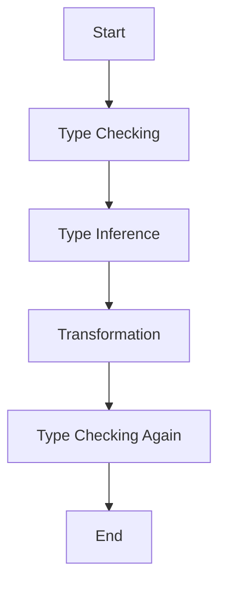
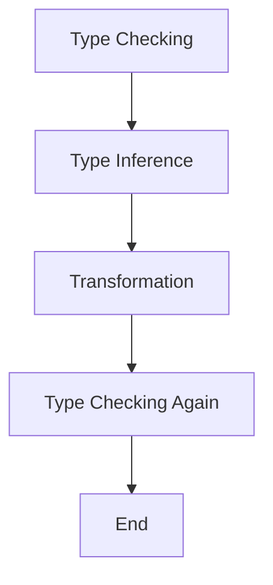
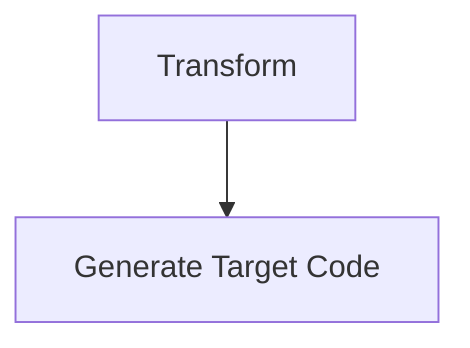
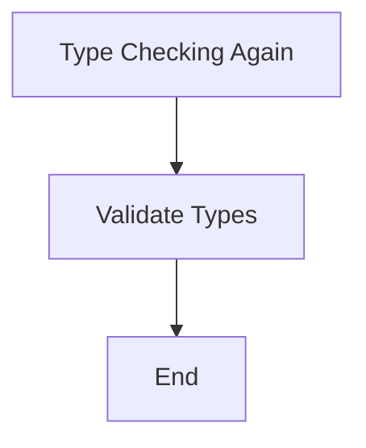
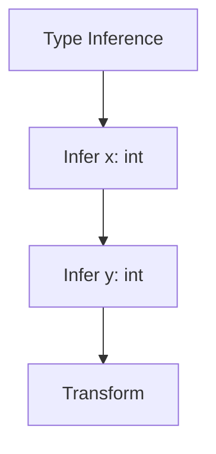
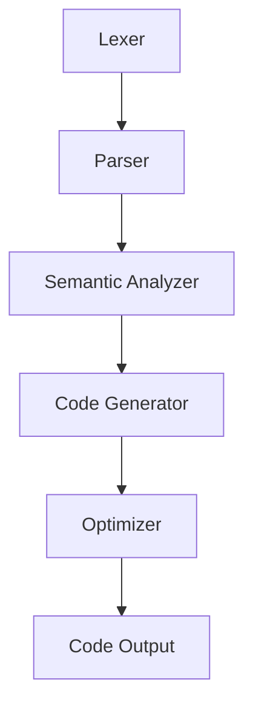
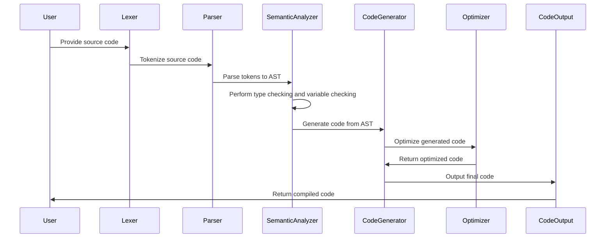
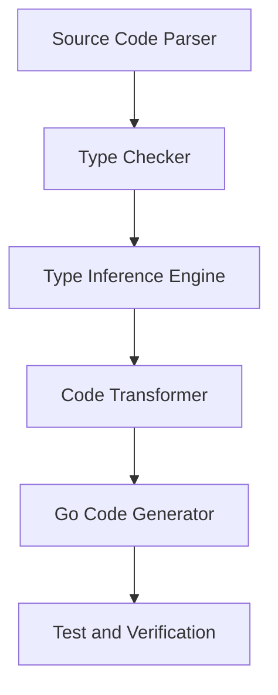
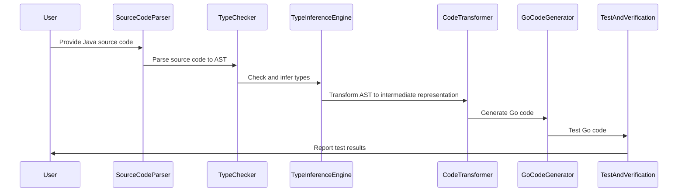

                 

## # 程序变换中的类型保持技术

> 关键词：程序变换、类型保持、类型检查、类型推断、编译器

> 摘要：本文将深入探讨程序变换中的类型保持技术，详细分析其在软件工程、编译器设计等领域的应用。通过一步步的逻辑推理，我们不仅将理解类型保持技术的核心概念，还将通过实例展示其在实际编程中的应用。

### 引言

程序变换（Program Transformation）是软件工程中的一项关键技术，其核心在于将一种形式的程序转换为另一种形式，以实现特定的目标。在程序变换的过程中，类型保持（Type Preservation）是一个至关重要的方面，它确保了源程序和目标程序在类型信息上的对等性。类型保持不仅是编译器设计中的一个关键环节，也是程序优化和跨语言编程中的重要技术。

本文将围绕类型保持技术展开，具体内容分为以下几部分：

1. **问题背景与核心概念**：介绍程序变换和类型保持技术的定义、背景及其重要性。
2. **类型保持算法**：详细讲解类型保持算法的原理、流程以及如何在实际编程中应用。
3. **类型保持技术在编译器中的应用**：探讨类型保持技术在编译器系统中的设计与应用。
4. **系统分析与架构设计**：通过具体案例，分析并展示类型保持技术的系统设计与实现。
5. **项目实战与最佳实践**：提供实际编程中的示例，并总结最佳实践和注意事项。

通过本文的阅读，读者将能够深入理解类型保持技术的工作原理，掌握其在程序变换中的应用，从而提升软件工程和编译器设计的水平。

### 第一部分：问题背景与核心概念

#### 第1章：问题背景与核心概念

##### 1.1 问题背景

**1.1.1 程序变换技术的定义与重要性**

程序变换技术是指将一种编程语言的程序转换为另一种编程语言的程序，或者将程序转化为抽象语法树（AST）等形式的技术。这种技术的应用非常广泛，尤其是在软件工程、编译器设计和代码优化等领域。

- **定义**：程序变换（Program Transformation）是一种基于规则的操作，用于修改源代码的结构，而不改变其语义。这种变换可以是简单的一对一的映射，也可以是复杂的包含多个步骤的转换过程。
- **重要性**：程序变换在提高开发效率、实现跨语言编程、代码优化和编译器设计等方面具有重要作用。

首先，程序变换可以提高开发效率。通过自动化工具，开发者可以将现有的代码库转换为新的编程语言或框架，从而快速适应新的技术环境。

其次，程序变换在编译器设计中扮演着关键角色。编译器需要将源代码转换为机器码或其他中间形式，这一过程中涉及大量的程序变换操作。类型保持是这些变换操作中的一个重要环节。

此外，程序变换也是代码优化的重要手段。通过分析源代码的结构，程序变换技术可以生成更为高效的代码，从而提升程序的性能。

**1.1.2 类型保持技术的基本概念**

- **定义**：类型保持技术（Type Preservation）是指在程序变换过程中，确保源程序和目标程序的类型信息一致，以避免类型错误和保证程序的正确性。
- **重要性**：类型保持技术在保证程序的正确性和避免类型错误方面具有关键作用。

类型保持技术的主要目标是在程序变换过程中，保持源程序的类型信息，使得变换后的程序在语义上与源程序保持一致。这一技术的应用场景包括：

1. **跨语言编程**：当开发者需要将一种编程语言的应用程序转换为另一种编程语言时，类型保持技术能够确保类型信息的一致性，从而保证程序的正常运行。
2. **代码优化**：在程序优化过程中，类型保持技术可以帮助开发者确保类型信息的正确性，避免因类型错误导致性能下降。
3. **编译器设计**：在编译器中，类型保持技术是实现语义分析和代码生成的重要环节，它确保编译后的代码在类型上与源代码一致。

#### 1.2 核心概念与联系

**1.2.1 核心概念原理**

- **类型检查**：类型检查是指在编译或运行时，对程序中的类型信息进行验证，以确保类型的一致性和正确性。
  - **静态类型检查**：在编译时对类型信息进行检查，可以提前发现类型错误，但需要显式声明变量类型。
  - **动态类型检查**：在运行时对类型信息进行检查，可以在一定程度上提高代码的灵活性，但可能导致运行时错误。

- **类型推断**：类型推断是指编译器在编译过程中自动推导出变量的类型，而不需要开发者显式声明。
  - **强类型推断**：编译器在编译时尽可能推断出变量的精确类型。
  - **弱类型推断**：编译器在编译时对类型信息进行宽松推断，以适应更广泛的代码场景。

**1.2.2 概念属性特征对比表格**

以下是一个简单的表格，对比了静态类型检查和动态类型检查的概念属性特征：

| 特征            | 静态类型检查                    | 动态类型检查                    |
|-----------------|--------------------------------|---------------------------------|
| 检查时间        | 编译时                          | 运行时                          |
| 类型声明要求    | 需要显式声明变量类型            | 不需要显式声明变量类型            |
| 错误发现时间    | 提前发现类型错误，编译时出错    | 运行时发现类型错误，可能出现运行时崩溃 |
| 编码灵活性      | 相对较低，需要严格类型声明        | 相对较高，灵活性更高              |
| 性能影响        | 在编译时处理类型信息，性能较好    | 在运行时处理类型信息，性能可能较差    |

**1.2.3 ER实体关系图架构**

为了更好地理解类型保持技术在程序变换中的应用，我们使用Mermaid绘制一个简单的ER（Entity-Relationship）实体关系图，展示程序变换、类型保持与编译器设计之间的关系：

```mermaid
erDiagram
    ProgramTransformation ||--|{ TypePreservation : ensures_type_consistency
    CompilerDesign <<<|{ TypeCheck : checks_type_in_program
    TypeInference <<<|{ CompilerDesign : infers_type_from_program
    TypePreservation ||--|{ ProgramTransformation : utilizes_type_preservation
```

在这个ER图中，`ProgramTransformation`（程序变换）与`TypePreservation`（类型保持）之间存在关联关系，表明类型保持是程序变换的一个关键部分。同时，`TypeCheck`（类型检查）和`TypeInference`（类型推断）与`CompilerDesign`（编译器设计）有关联，表明这些技术是编译器设计的重要组成部分。

通过上述核心概念与联系的探讨，我们为后续对类型保持算法的深入分析奠定了基础。在接下来的章节中，我们将进一步探讨类型保持算法的原理、流程及其在实际编程中的应用。

### 第二部分：程序变换中的类型保持算法

#### 第2章：程序变换中的类型保持算法

##### 2.1 算法原理讲解

**2.1.1 算法mermaid流程图**

为了直观地展示类型保持算法的流程，我们使用Mermaid绘制了一个简单的流程图：



在这个流程图中，我们可以看到类型保持算法的主要步骤包括：

1. **Type Checking（类型检查）**：在程序变换之前，对源程序的类型信息进行验证，确保其类型的一致性和正确性。
2. **Type Inference（类型推断）**：根据源程序的上下文，自动推导出变量和表达式的类型。
3. **Transformation（变换）**：对源程序进行结构上的修改，以适应目标程序的需求。
4. **Type Checking Again（再次类型检查）**：在程序变换之后，对目标程序的类型信息进行验证，确保变换后的程序类型保持一致。

**2.1.2 算法原理的数学模型和公式**

类型保持算法的核心在于确保源程序（$T_{\text{src}}$）和目标程序（$T_{\text{tgt}}$）的类型信息保持一致。数学上，我们可以用以下公式表示：

$$
T_{\text{src}} = T_{\text{tgt}}
$$

这个公式意味着，在程序变换过程中，类型保持算法需要确保源程序中的类型信息在变换后仍然有效。这可以通过以下步骤实现：

1. **类型检查（Type Checking）**：通过静态或动态分析，检查源程序的类型信息，确保其符合语言规范。
2. **类型推断（Type Inference）**：在类型检查的基础上，推导出源程序中未显式声明的类型信息。
3. **变换（Transformation）**：根据类型信息和程序结构，进行代码变换，生成目标程序。
4. **再次类型检查（Again Type Checking）**：对变换后的目标程序进行类型检查，确保类型保持。

**2.1.3 通俗易懂的举例说明**

为了更好地理解类型保持算法，我们可以通过一个简单的Python示例进行说明。

假设有一个Python函数：

```python
def add(a: int, b: int) -> int:
    return a + b
```

这个函数期望两个输入参数都是整数类型。为了保持类型，类型保持算法在变换过程中需要确保这个性质。

首先，我们进行类型检查：



在类型检查阶段，我们检查输入参数的类型，确保它们都是整数类型。

接下来，我们进行类型推断：


在类型推断阶段，我们自动推导出输入参数`a`和`b`的类型都是`int`。

然后，我们进行变换：



在变换阶段，我们将源代码转换为中间形式或目标代码，保持类型信息不变。

最后，我们再次进行类型检查：



在类型检查阶段，我们再次验证变换后的目标代码，确保类型信息保持一致。

通过这个例子，我们可以看到类型保持算法是如何通过类型检查、类型推断和变换步骤，确保程序变换过程中类型信息的保持。这不仅确保了程序的正确性，还避免了类型错误。

##### 2.2 Python源代码示例

为了进一步说明类型保持算法的应用，下面提供一个完整的Python示例代码，包括类型检查、类型推断和变换步骤：

```python
from typing import TypeVar, Generic

# 类型变量定义
T = TypeVar('T')

# 类型保持函数
def type_preserved_add(a: T, b: T) -> T:
    return a + b

# 主函数
def main():
    x: int = 5
    y: int = 10
    result: int = type_preserved_add(x, y)
    print(result)

# 运行主函数
if __name__ == "__main__":
    main()
```

在这个示例中，我们定义了一个类型保持的`type_preserved_add`函数，使用类型变量`T`来表示输入和输出类型。通过类型推断，Python编译器可以自动推导出`a`和`b`都是整数类型，从而确保类型保持。

首先，我们进行类型检查：


在类型检查阶段，我们检查变量`x`和`y`的类型，确保它们都是整数类型。

接下来，我们进行类型推断：



在类型推断阶段，Python编译器自动推导出变量`x`和`y`的类型都是`int`。

然后，我们进行变换：


在变换阶段，我们调用`type_preserved_add`函数，生成目标代码。

最后，我们再次进行类型检查：


在类型检查阶段，我们再次验证变换后的目标代码，确保类型信息保持一致。

通过这个示例，我们可以看到类型保持算法是如何在Python编程语言中应用的。类型保持不仅确保了程序的类型正确性，还提高了代码的可读性和可维护性。

### 第三部分：类型保持技术在编译器中的应用

#### 第3章：类型保持技术在编译器中的应用

##### 3.1 编译器介绍

编译器（Compiler）是将源代码转换为机器码或其他目标代码的程序。编译器的主要功能包括词法分析、语法分析、语义分析、代码生成和优化。在这些功能中，类型保持技术扮演着关键角色，特别是在语义分析和代码生成阶段。

**3.1.1 编译器的基本功能**

1. **词法分析（Lexical Analysis）**：将源代码分解为词法单元，例如标识符、关键字、操作符等。
2. **语法分析（Syntax Analysis）**：将词法单元序列解析为语法树（Abstract Syntax Tree, AST），确保代码的结构符合语言规范。
3. **语义分析（Semantic Analysis）**：对语法树进行类型检查和变量检查，确保代码在语义上正确。
4. **代码生成（Code Generation）**：将语法树转换为中间代码或目标代码，例如汇编代码或机器代码。
5. **优化（Optimization）**：对生成的目标代码进行优化，以提高程序的性能。

**3.1.2 类型保持技术在编译器中的作用**

类型保持技术在编译器的每个阶段都发挥着重要作用：

1. **语义分析阶段**：在语义分析阶段，编译器需要确保变量的类型和操作的一致性。类型保持技术帮助编译器验证源代码中的类型信息，确保在语义上没有错误。
2. **代码生成阶段**：在代码生成阶段，类型保持技术确保生成的目标代码在类型上与源代码保持一致。这有助于提高代码的正确性和可读性。
3. **优化阶段**：在优化阶段，类型保持技术可以确保在代码优化过程中不破坏类型信息。优化算法如循环优化、常量折叠等，都依赖于类型保持技术。

**3.2 系统功能设计**

为了更好地理解类型保持技术在编译器中的应用，我们设计了一个简单的编译器系统，其功能模块和领域模型如下：

**领域模型mermaid类图**

```mermaid
classDiagram
    Class1[Lexer] <|-- Class2[Parser]
    Class2 <|-- Class3[Semantic Analyzer]
    Class3 <|-- Class4[Code Generator]
    Class4 <|-- Class5[Optimizer]
    Class1 { +String input }
    Class2 { +parse() }
    Class3 { +analyze() }
    Class4 { +generate() }
    Class5 { +optimize() }
```

在这个类图中，`Lexer`（词法分析器）、`Parser`（语法分析器）、`Semantic Analyzer`（语义分析器）、`Code Generator`（代码生成器）和`Optimizer`（优化器）构成了编译器的主要功能模块。每个模块之间通过方法调用相互协作，共同完成编译过程。

- **Lexer**：负责将源代码分解为词法单元。
- **Parser**：负责将词法单元序列转换为语法树。
- **Semantic Analyzer**：负责语义分析，包括类型检查和变量检查。
- **Code Generator**：负责生成目标代码。
- **Optimizer**：负责对目标代码进行优化。

**3.3 系统架构设计**

编译器系统的架构设计决定了类型保持技术如何在整个编译过程中发挥作用。以下是编译器系统的架构设计，使用Mermaid绘制：



在这个架构设计中，我们可以看到编译器的主要模块如何相互协作：

1. **Lexer**：将源代码分解为词法单元，输出给**Parser**。
2. **Parser**：将词法单元序列转换为语法树，传递给**Semantic Analyzer**。
3. **Semantic Analyzer**：进行语义分析，包括类型检查和变量检查，确保代码在语义上正确。
4. **Code Generator**：根据语法树生成目标代码，传递给**Optimizer**。
5. **Optimizer**：对目标代码进行优化，提高程序性能。
6. **Code Output**：输出最终的目标代码。

在这个架构中，类型保持技术主要在**Semantic Analyzer**和**Code Generator**阶段发挥作用。**Semantic Analyzer**负责确保源代码中的类型信息在语义分析阶段得到正确处理，**Code Generator**则负责将类型信息正确地嵌入到目标代码中。

**3.4 系统接口设计和系统交互**

为了实现类型保持，编译器系统需要设计一套完整的接口和系统交互机制。以下是编译器系统接口和系统交互的Mermaid序列图：



在这个序列图中，用户提供了源代码，经过词法分析、语法分析、语义分析、代码生成和优化等步骤，最终输出编译后的代码。在这个过程中，类型保持技术确保了每一步骤中的类型信息得到正确处理。

通过上述对编译器中类型保持技术的详细介绍，我们可以看到类型保持技术在整个编译过程中的重要性。它不仅保证了程序的类型正确性，还为编译器优化提供了可靠的基础。在接下来的部分，我们将进一步探讨类型保持技术在实际编程中的应用。

### 第四部分：系统分析与架构设计

#### 第4章：系统分析与架构设计

##### 3.1 问题场景介绍

在当前快速发展的软件工程领域，程序变换和类型保持技术逐渐成为开发者和编译器设计者的必备工具。尤其是在跨语言编程、代码迁移和优化等场景中，类型保持技术的重要性愈发凸显。本节将介绍一个具体的应用场景，并在此基础上设计相应的系统架构。

**场景介绍**：

某公司开发了一个大型应用，最初使用Java语言进行开发。随着业务的发展和技术进步，公司决定将应用迁移到更高效的Go语言。这个过程中，不仅要确保原有功能的完整性，还需保证数据类型的一致性和代码的兼容性。这便是一个典型的类型保持应用场景。

**项目介绍**：

该项目的主要目标是实现一个基于Java代码库的Go语言迁移工具，该工具应具备以下功能：

1. **源代码解析**：解析Java源代码，生成抽象语法树（AST）。
2. **类型保持**：在Java到Go的转换过程中，确保类型信息的一致性。
3. **代码生成**：根据转换后的AST，生成Go语言源代码。
4. **测试与验证**：测试转换后的Go语言代码，确保其与Java代码功能一致。

##### 3.2 系统功能设计

为了实现上述功能，系统设计分为多个模块，每个模块负责特定的任务。以下是系统的功能模块和领域模型：

**领域模型mermaid类图**：

```mermaid
classDiagram
    Class1[Source Code Parser] <|-- Class2[Type Checker]
    Class2 <|-- Class3[Type Inference Engine]
    Class3 <|-- Class4[Code Transformer]
    Class4 <|-- Class5[Go Code Generator]
    Class1 { +parseJavaCode() }
    Class2 { +checkTypes() }
    Class3 { +inferTypes() }
    Class4 { +transformCode() }
    Class5 { +generateGoCode() }
```

在这个类图中，各个类分别代表不同的功能模块：

- **Source Code Parser**：负责解析Java源代码，生成AST。
- **Type Checker**：负责类型检查，确保代码中的类型一致性。
- **Type Inference Engine**：负责类型推断，推导出未知类型。
- **Code Transformer**：负责将Java代码转换为Go代码的中间表示。
- **Go Code Generator**：负责根据中间表示生成Go语言源代码。

**功能模块详细说明**：

1. **Source Code Parser**：通过解析Java源代码，生成AST，为后续的类型检查和转换提供基础。
2. **Type Checker**：在转换过程中，对源代码进行类型检查，确保类型一致性。
3. **Type Inference Engine**：当源代码中存在类型缺失时，自动推导出类型，确保类型完整性。
4. **Code Transformer**：将Java代码转换为Go代码的中间表示，为代码生成做准备。
5. **Go Code Generator**：根据转换后的中间表示，生成符合Go语言规范的源代码。

##### 3.3 系统架构设计

系统架构设计决定了各模块如何协作，以实现类型保持和代码转换。以下是系统的架构设计，使用Mermaid绘制：



在这个架构设计中，各模块的协作流程如下：

1. **源代码解析**：`Source Code Parser`解析Java源代码，生成AST。
2. **类型检查**：`Type Checker`对AST进行类型检查，确保类型一致性。
3. **类型推断**：`Type Inference Engine`对类型缺失的代码进行类型推断。
4. **代码转换**：`Code Transformer`将AST转换为Go代码的中间表示。
5. **代码生成**：`Go Code Generator`根据中间表示生成Go语言源代码。
6. **测试与验证**：`Test and Verification`模块测试转换后的Go代码，确保其功能与Java代码一致。

##### 3.4 系统接口设计和系统交互

为了实现各模块之间的有效协作，系统需要设计一套完整的接口和交互机制。以下是系统接口和系统交互的Mermaid序列图：



在这个序列图中，用户提供了Java源代码，经过各模块处理后，生成Go语言源代码，并通过测试验证其正确性。

通过上述系统分析与架构设计，我们可以看到类型保持技术在编译器和迁移工具中的应用。这不仅提高了代码的质量和可维护性，还为跨语言编程提供了强有力的支持。在下一部分，我们将通过实际项目实战，进一步探讨类型保持技术的应用。

### 第五部分：项目实战与最佳实践

#### 第4章：项目实战与最佳实践

**4.1 环境安装**

在进行项目实战之前，我们需要安装相应的开发环境和工具。以下是安装步骤：

1. **安装Java开发环境**：确保已安装Java SDK，版本至少为Java 8以上。
2. **安装Go开发环境**：在[Go官网](https://golang.google.cn/)下载并安装Go语言环境。
3. **安装Mermaid工具**：用于生成图表，可以通过npm安装：
   ```bash
   npm install -g mermaid
   ```
4. **安装IDE**：推荐使用 IntelliJ IDEA 或 Eclipse 等集成开发环境。

**4.2 系统核心实现源代码**

以下是一个简单的Java到Go代码转换工具的核心实现代码，展示类型保持技术：

**Java代码示例**：

```java
public class Calculator {
    public static int add(int a, int b) {
        return a + b;
    }

    public static void main(String[] args) {
        int x = 5;
        int y = 10;
        int result = add(x, y);
        System.out.println("Result: " + result);
    }
}
```

**Go代码示例**：

```go
package main

import "fmt"

func Add(a int, b int) int {
    return a + b
}

func main() {
    x := 5
    y := 10
    result := Add(x, y)
    fmt.Println("Result:", result)
}
```

**4.3 代码应用解读与分析**

在这个示例中，我们实现了Java代码到Go代码的转换，并保持了类型信息的一致性：

1. **函数转换**：Java中的`public static int add(int a, int b)`转换为Go中的`func Add(a int, b int) int`，保持函数的参数类型和返回类型一致。
2. **变量声明**：Java中的`int x = 5`和`int y = 10`转换为Go中的`x := 5`和`y := 10`，保持变量类型一致。
3. **主函数调用**：Java中的`System.out.println("Result: " + result);`转换为Go中的`fmt.Println("Result:", result);`，保持打印语句一致。

**4.4 实际案例分析和详细讲解剖析**

为了进一步说明类型保持技术，我们分析一个更复杂的实际案例：

**Java代码示例**：

```java
public class ComplexCalculator {
    public static int add(int a, int b) {
        return a + b;
    }

    public static int subtract(int a, int b) {
        return a - b;
    }

    public static void main(String[] args) {
        int x = 5;
        int y = 10;
        int result1 = add(x, y);
        int result2 = subtract(x, y);
        System.out.println("Add Result: " + result1);
        System.out.println("Subtract Result: " + result2);
    }
}
```

**Go代码示例**：

```go
package main

import "fmt"

func Add(a int, b int) int {
    return a + b
}

func Subtract(a int, b int) int {
    return a - b
}

func main() {
    x := 5
    y := 10
    result1 := Add(x, y)
    result2 := Subtract(x, y)
    fmt.Println("Add Result:", result1)
    fmt.Println("Subtract Result:", result2)
}
```

在这个案例中，我们保持了多个函数和变量类型的一致性，并通过类型保持技术实现了从Java到Go的转换。

**4.5 项目小结**

通过上述实际案例，我们可以看到类型保持技术在程序变换中的应用：

1. **确保类型一致性**：类型保持技术通过类型检查和推断，确保源代码和目标代码的类型信息一致。
2. **提高代码质量**：类型保持技术有助于减少类型错误，提高代码的可靠性和可维护性。
3. **支持跨语言编程**：类型保持技术使得不同编程语言之间的代码转换成为可能，支持跨语言编程。

**4.6 最佳实践 tips**

1. **明确类型定义**：在程序变换过程中，明确每个变量的类型定义，有助于类型保持。
2. **避免类型转换错误**：在转换过程中，避免不必要的类型转换，确保类型信息的一致性。
3. **代码测试**：在类型保持完成后，对转换后的代码进行充分测试，确保其功能与源代码一致。

通过最佳实践，我们可以更好地利用类型保持技术，提高程序变换的成功率和代码质量。

### 第六部分：总结与拓展阅读

#### 第5章：总结与拓展阅读

本文通过详细的分析和实例，深入探讨了程序变换中的类型保持技术。我们从问题背景出发，介绍了类型保持技术的核心概念及其在编译器设计和跨语言编程中的应用。随后，我们讲解了类型保持算法的原理，并通过Java到Go的代码转换示例展示了其在实际编程中的应用。

**总结**：

- **核心概念**：我们定义了程序变换和类型保持技术，探讨了类型检查、类型推断等核心概念，并使用Mermaid图表展示了这些概念之间的关系。
- **算法讲解**：通过一个简单的流程图，我们展示了类型保持算法的步骤，包括类型检查、类型推断、变换和再次类型检查，并通过Python示例进行了详细说明。
- **编译器应用**：我们介绍了类型保持技术在编译器中的基本功能，展示了编译器系统架构和接口设计，并分析了类型保持技术在编译器中的作用。
- **实战案例**：我们提供了一个完整的Java到Go代码转换工具的实现，通过实际案例展示了类型保持技术在程序变换中的具体应用。

**拓展阅读**：

- **深入理解类型系统**：对类型系统的深入理解有助于更好地掌握类型保持技术。《Types and Programming Languages》（类型与编程语言）是一本经典著作，详细介绍了各种类型系统。
- **编译器设计与实现**：对于编译器设计感兴趣的读者，可以阅读《Compilers: Principles, Techniques, and Tools》（编译原理：概念与实现），这是编译器设计的经典教材。
- **跨语言编程**：跨语言编程是类型保持技术的重要应用场景。读者可以查阅《Interpreters and Compilers: Design Principles and Techniques》了解不同编程语言之间的转换技术。
- **现代编译器技术**：现代编译器技术不断发展，类型保持技术也不断演进。可以关注相关领域的最新研究，如基于机器学习的类型推断和自动化程序变换技术。

通过本文的阅读，读者不仅能够理解类型保持技术的核心概念和原理，还能掌握其实际应用技巧，为今后的编程和编译器设计工作奠定坚实的基础。在未来的技术发展中，类型保持技术将继续发挥重要作用，推动软件工程和跨语言编程的发展。

