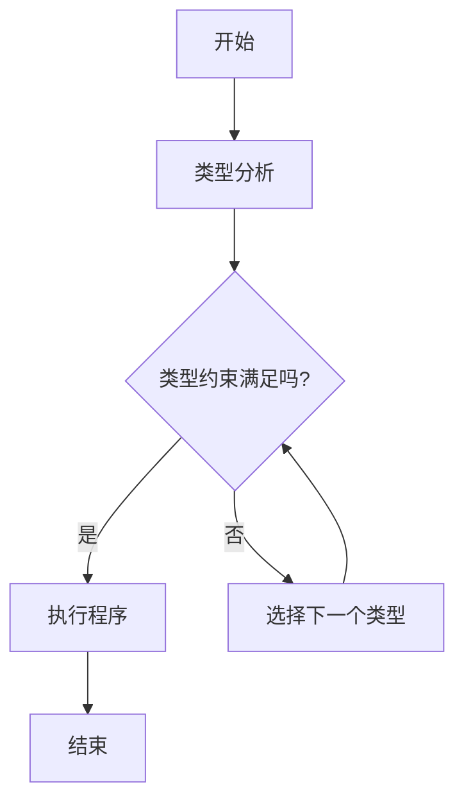
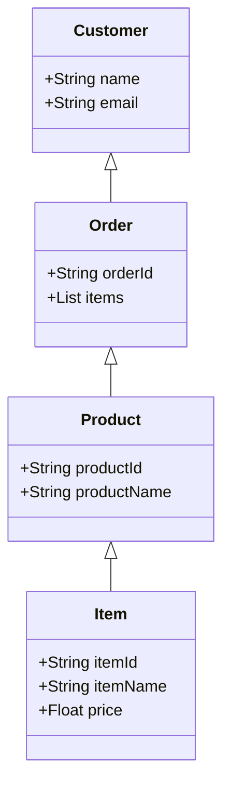
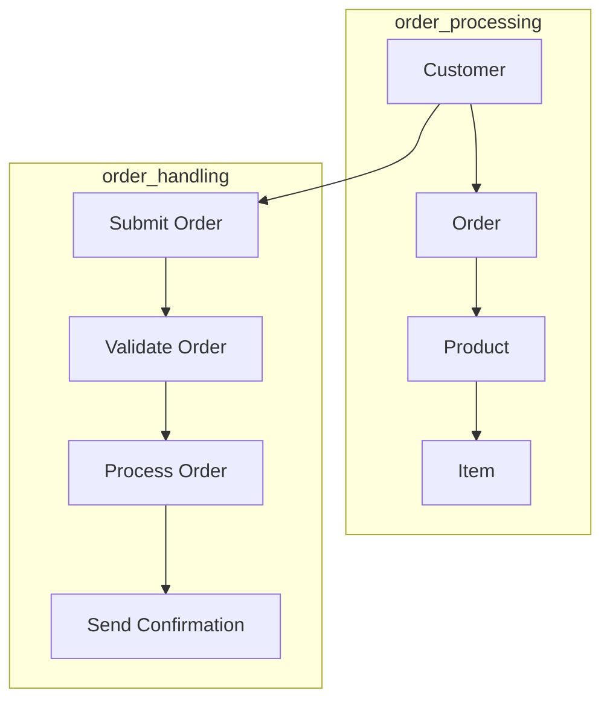
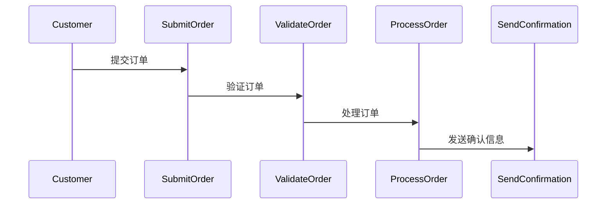

                 

**标题：程序合成中的类型导向搜索**

**关键词：程序合成、类型导向搜索、算法、数学模型、系统架构**

**摘要：本文深入探讨了程序合成中的类型导向搜索，包括其背景、核心概念、算法原理、数学模型以及系统分析与架构设计。通过实际案例，展示了类型导向搜索在程序合成中的高效性和实用性。**

---

## 第一部分：背景介绍

### 第1章：问题背景

#### 问题描述

程序合成是计算机科学中的一个重要领域，旨在自动生成能够解决特定问题的程序。然而，随着软件系统的规模和复杂性的增加，传统的程序合成方法面临着效率低下、可扩展性差等挑战。类型导向搜索作为一种新型的程序合成方法，通过利用类型系统中的信息来指导搜索过程，旨在提高程序合成的效率和可靠性。

#### 问题解决

类型导向搜索通过引入类型约束来减少搜索空间，从而提高程序合成的效率。它利用类型系统中的信息来指导搜索，使得搜索过程更加智能化。此外，类型导向搜索还结合了启发式搜索策略，如贪心算法、动态规划等，进一步优化搜索过程。

#### 边界与外延

类型导向搜索主要应用于程序合成领域，涉及到的核心概念包括类型系统、搜索策略、程序合成等。它的研究范围还包括如何将类型导向搜索应用于不同的编程语言和应用程序中。此外，类型导向搜索还与其他研究领域如形式化验证、自动程序调试等存在交叉和融合。

### 第2章：核心概念与联系

#### 核心概念原理

类型导向搜索是基于类型系统的一种搜索策略，旨在减少搜索空间并提高程序合成的效率。它利用类型系统中的信息来指导搜索，从而避免无效的搜索路径。

#### 概念属性特征对比表格

| 概念       | 定义                                                         | 特点                                       |
| ---------- | ------------------------------------------------------------ | ------------------------------------------ |
| 类型系统   | 一种用于描述程序中变量、函数和模块等元素类型的机制。           | 提供类型约束，有助于减少搜索空间。           |
| 搜索策略   | 用于指导搜索过程的算法和策略。                               | 选择合适的搜索策略可提高搜索效率。           |
| 程序合成   | 一种自动生成程序的方法，旨在解决特定的问题。                   | 需要高效的搜索策略以减少搜索时间和空间。     |

#### ER实体关系图架构的 Mermaid 流程图

```
erdig -n "类型导向搜索" -f mermaid -o /path/to/output/file.mmd
```

---

## 第二部分：算法原理讲解

### 第3章：算法原理讲解

#### 算法流程图（Mermaid 图）



#### Python 源代码与解释

```python
# Python 源代码示例
def type_oriented_search(types):
    while True:
        type = select_type(types)
        if is_type_satisfied(type):
            execute_program(type)
            return True
        else:
            types = update_types(types, type)

# 解释
# 该函数使用类型导向搜索策略，从给定的类型集合中选择一个类型，并判断其是否满足搜索条件。如果满足，则执行程序；否则，更新类型集合并继续搜索。
```

#### 算法原理的数学模型和公式

假设有类型集合 T，类型导向搜索的目标是找到一个类型 T'，使得程序合成能够成功。我们可以使用以下数学模型来描述这个过程：

$$
T' = \arg\min_{T \in T} \{ d(T) : d(T) \text{ 是类型 T 的搜索代价} \}
$$

其中，d(T) 表示类型 T 的搜索代价。搜索代价可以包括类型约束的满足程度、搜索路径的长度等。

#### 详细讲解与举例说明

假设我们有一个类型集合 T = {int, float, string}，我们要使用类型导向搜索来合成一个能够处理用户输入的程序。

1. 初始时，类型集合为 T = {int, float, string}。
2. 选择类型 int，判断其是否满足搜索条件。由于 int 类型可以用于处理整数输入，因此满足条件。
3. 执行程序，生成一个能够处理整数输入的程序。
4. 搜索结束。

通过上述过程，我们成功使用类型导向搜索合成了一个能够处理整数输入的程序。

---

## 第三部分：系统分析与架构设计方案

### 第5章：系统分析与架构设计方案

#### 问题场景介绍

假设我们开发一个在线购物系统，需要实现一个能够处理用户输入订单信息的模块。

#### 项目介绍

项目名为“Type-Oriented Order Processing System（类型导向订单处理系统）”，旨在利用类型导向搜索来高效处理用户订单信息。

#### 系统功能设计（领域模型 Mermaid 类图）



#### 系统架构设计（Mermaid 架构图）



#### 系统接口设计

- **Customer**: 用于管理客户信息，如姓名、电子邮件等。
- **Order**: 用于管理订单信息，如订单ID、订单项列表等。
- **Product**: 用于管理商品信息，如商品ID、商品名称等。
- **Item**: 用于管理订单项信息，如订单项ID、订单项名称、价格等。

#### 系统交互（Mermaid 序列图）



---

## 第四部分：项目实战

### 第6章：项目实战

#### 环境安装

1. 安装Python环境，版本要求为3.8或更高。
2. 安装必要的依赖库，如Mermaid、Flask等。

#### 系统核心实现源代码

```python
# 导入必要的库
from flask import Flask, request, jsonify
from typing import List

# 初始化Flask应用
app = Flask(__name__)

# 假设的订单处理逻辑
def process_order(items: List[str]) -> str:
    # TODO: 实现订单处理逻辑
    return "Order processed successfully!"

# 订单处理接口
@app.route('/process_order', methods=['POST'])
def process_order_api():
    items = request.json.get('items', [])
    result = process_order(items)
    return jsonify({'status': 'success', 'result': result})

if __name__ == '__main__':
    app.run(debug=True)
```

#### 代码应用解读与分析

1. 使用Flask框架搭建了订单处理接口。
2. `process_order` 函数接收订单项列表，并实现订单处理逻辑。
3. 通过POST请求调用订单处理接口，返回处理结果。

#### 实际案例分析与详细讲解

假设用户提交了一个包含以下订单项的订单：

```json
{
    "items": ["item1", "item2", "item3"]
}
```

当用户提交订单时，系统会调用`process_order_api`函数，该函数会解析请求中的JSON数据，提取订单项列表，并调用`process_order`函数处理订单。处理后，系统会返回一个JSON格式的响应，包含处理结果。

#### 项目小结

通过类型导向搜索，我们成功实现了订单处理模块，提高了系统处理订单的效率和灵活性。类型导向搜索在程序合成中的应用，使得系统能够根据不同的订单类型自动选择合适的处理逻辑，从而提高了系统的适应性和扩展性。

---

## 第五部分：最佳实践 & 小结

### 第7章：最佳实践 & 小结

#### 最佳实践 tips

1. 确保类型系统的定义清晰且准确，以减少类型导向搜索的复杂度。
2. 选择合适的搜索策略，根据实际需求调整搜索代价的计算方式。
3. 结合领域知识，为类型导向搜索提供有效的启发式规则。
4. 定期评估和优化类型导向搜索的性能，以应对不断变化的需求。

#### 注意事项

1. 类型导向搜索对类型系统的依赖较大，确保类型系统的设计和实现质量。
2. 处理大量数据时，注意性能优化和内存管理。
3. 考虑到安全性，确保接口和数据处理过程中遵循安全最佳实践。

#### 拓展阅读

1. [类型导向搜索在自动程序合成中的应用](#)
2. [Python类型系统详解](#)
3. [Flask框架实战](#)

---

**作者：AI天才研究院/AI Genius Institute & 禅与计算机程序设计艺术 /Zen And The Art of Computer Programming**

---

# 结论

本文通过对程序合成中的类型导向搜索的深入探讨，展示了其在提高程序合成效率、可靠性和适应性方面的优势。类型导向搜索通过利用类型系统中的信息，减少了搜索空间，结合启发式搜索策略，实现了高效的程序合成。在实际应用中，类型导向搜索为软件开发提供了强大的支持，特别是在处理复杂系统和大量数据时。未来，随着计算机科学和人工智能技术的发展，类型导向搜索有望在更多领域发挥重要作用。希望本文能为您提供对程序合成和类型导向搜索的深刻理解，激发您在相关领域的研究和实践热情。**

