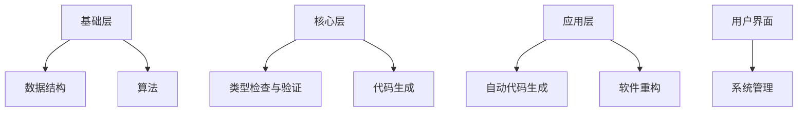
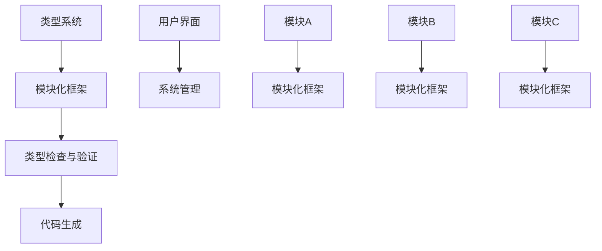

                 

### 文章标题

《程序合成中的类型导向模块化技术》

> 关键词：程序合成、类型系统、模块化、类型检查、代码生成

> 摘要：本文深入探讨了程序合成中的类型导向模块化技术，从问题背景、核心概念、算法原理到实际应用，全面解析了该技术在提高程序合成效率和可靠性方面的作用。通过详细的分析和实例讲解，读者可以全面理解类型导向模块化技术在现代软件开发中的重要性。

### 第一部分：背景介绍与核心概念

在现代软件工程领域，程序合成技术正逐渐成为提高开发效率和软件质量的关键手段。程序合成指的是从高层次抽象模型自动生成实际可执行的代码，这一过程涉及到多个复杂的技术环节，如抽象语法树的构建、语义分析、代码生成等。而类型导向模块化技术作为程序合成的重要方法之一，通过引入类型系统和模块化框架，旨在提高程序合成过程的可靠性、效率和质量。

#### 1. 问题背景

随着软件系统的复杂性不断增加，传统的手工编码方式已难以满足快速开发和高可维护性的要求。程序合成技术应运而生，通过自动化手段从高层次抽象模型生成低层次的代码，极大地提高了开发效率和代码质量。然而，程序合成面临着诸多挑战，如代码的正确性、可维护性、可复用性等。类型导向模块化技术通过引入类型系统和模块化框架，有助于解决这些问题，提高程序合成的可靠性和效率。

#### 2. 问题描述

程序合成中的类型导向模块化技术主要包括以下几个核心问题：

- **类型系统的构建**：如何设计一个有效的类型系统，确保程序合成过程中类型安全和代码质量？
- **模块化**：如何将程序分解为模块，使得每个模块都具有良好的独立性和可复用性？
- **模块接口**：如何定义和实现模块接口，使得模块之间能够正确地进行交互和组合？
- **类型检查与验证**：如何在模块化过程中进行类型检查和验证，以确保程序的正确性？

#### 3. 问题解决

类型导向模块化技术通过以下几个方面解决上述问题：

- **静态类型系统**：引入静态类型系统，通过类型检查和验证确保程序的正确性。
- **模块化框架**：采用模块化框架，如模块接口、模块组合等，提高程序的独立性和可复用性。
- **类型推导与检查**：利用类型推导算法和类型检查算法，自动地识别和修复类型错误。

#### 4. 边界与外延

- **边界**：类型导向模块化技术主要应用于那些需要高效、准确程序合成的场景，如自动代码生成、软件重构、软件测试等。
- **外延**：除了在程序合成中的应用，类型导向模块化技术还可以应用于其他领域，如形式化验证、编程语言设计等。

#### 5. 概念结构与核心要素组成

- **类型系统**：类型系统是类型导向模块化的核心，包括类型定义、类型检查和类型推导等。
- **模块化框架**：模块化框架提供模块定义、模块组合和模块接口定义等机制。
- **类型检查与验证**：类型检查与验证是确保程序正确性的关键步骤。

### 第二部分：核心概念与联系

#### 1. 核心概念原理

- **类型系统**：类型系统是定义变量、函数、对象等的数据类型和操作规则的集合。它确保程序中的变量在赋值、函数调用等操作时遵循类型约束。
- **模块化**：模块化是将程序分解为多个独立的模块，每个模块具有明确的职责和接口。模块化有助于提高程序的可维护性和可复用性。
- **类型检查与验证**：类型检查与验证是确保程序类型安全的过程。通过类型检查，可以提前发现和修复类型错误。

#### 2. 概念属性特征对比表格

| 概念        | 属性特征                         | 作用与意义                     |
| ----------- | -------------------------------- | ------------------------------ |
| 类型系统    | 定义变量、函数等的数据类型       | 确保程序的正确性和类型安全     |
| 模块化     | 独立模块、模块组合、模块接口   | 提高程序的可维护性和可复用性 |
| 类型检查与验证 | 识别和修复类型错误               | 确保程序的正确性               |

#### 3. ER实体关系图架构

```mermaid
erDiagram
    Program ||--|{ TypeSystem }|--| ProgramElement
    Program ||--|{ Module }|--| ProgramElement
    Program ||--|{ TypeCheck }|--| ProgramElement
    TypeSystem ||--|{ TypeDefinition }|--| ProgramElement
    TypeSystem ||--|{ TypeOperation }|--| ProgramElement
    Module ||--|{ ModuleInterface }|--| ProgramElement
    Module ||--|{ ModuleComposition }|--| ProgramElement
    TypeCheck ||--|{ ErrorDetection }|--| ProgramElement
    TypeCheck ||--|{ ErrorCorrection }|--| ProgramElement
```

### 第三部分：算法原理讲解

#### 1. 算法原理概述

类型导向模块化技术的核心在于如何利用类型系统和模块化框架来实现高效的程序合成。以下是该技术的核心算法原理及其在程序合成中的应用：

- **类型推导算法**：类型推导算法是类型系统的核心部分，负责根据程序中的表达式和声明推导出变量的类型。例如，在函数调用时，类型推导算法可以自动确定参数的类型和返回值类型，确保类型匹配。

- **类型检查算法**：类型检查算法在程序编译或运行时执行，负责检查程序中的类型约束是否满足。如果类型不匹配，类型检查算法会报错并指出错误的类型。

- **模块化算法**：模块化算法负责将程序分解为独立的模块，并为每个模块定义清晰的接口。模块化算法还确保模块之间的依赖关系明确，避免出现编译时或运行时错误。

- **模块组合算法**：模块组合算法将多个模块组合成一个完整的程序。该算法需要确保模块之间的接口正确，并能够根据模块的职责和功能进行有效的组合。

#### 2. 算法原理讲解

让我们以一个简单的程序合成场景为例，详细讲解类型导向模块化技术的算法原理。

假设我们需要合成一个计算器程序，它包含加法、减法、乘法和除法操作。首先，我们定义一个类型系统，包括整数类型（`Int`）和浮点数类型（`Float`）。

$$
\text{TypeSystem} = \{\text{Int}, \text{Float}\}
$$

接下来，我们定义四个模块，分别负责加法、减法、乘法和除法操作。每个模块的接口如下：

$$
\begin{aligned}
    &\text{Module Adder} (\text{Int}, \text{Int}) \rightarrow \text{Int} \\
    &\text{Module Subtractor} (\text{Int}, \text{Int}) \rightarrow \text{Int} \\
    &\text{Module Multiplier} (\text{Int}, \text{Int}) \rightarrow \text{Int} \\
    &\text{Module Divider} (\text{Int}, \text{Int}) \rightarrow \text{Int} \\
\end{aligned}
$$

现在，我们需要实现这些模块。首先，我们编写加法模块的Python代码：

```python
def adder(a: int, b: int) -> int:
    return a + b
```

接下来，我们实现减法、乘法和除法模块。每个模块的实现过程类似，我们这里只展示加法模块的代码，以简化示例。

$$
\begin{aligned}
    &\text{Module Subtractor} (\text{Int}, \text{Int}) \rightarrow \text{Int}: \\
    &\quad \text{def subtractor(a: int, b: int) -> int:} \\
    &\quad \quad \text{return a - b} \\
    \\
    &\text{Module Multiplier} (\text{Int}, \text{Int}) \rightarrow \text{Int}: \\
    &\quad \text{def multiplier(a: int, b: int) -> int:} \\
    &\quad \quad \text{return a * b} \\
    \\
    &\text{Module Divider} (\text{Int}, \text{Int}) \rightarrow \text{Int}: \\
    &\quad \text{def divider(a: int, b: int) -> int:} \\
    &\quad \quad \text{return a // b} \\
\end{aligned}
$$

现在，我们已经实现了四个模块，接下来我们将它们组合成一个计算器程序。模块组合算法需要确保模块之间的接口正确，并能够根据模块的职责和功能进行有效的组合。

```python
def calculator(a: int, b: int, operation: str) -> int:
    if operation == "add":
        return adder(a, b)
    elif operation == "subtract":
        return subtractor(a, b)
    elif operation == "multiply":
        return multiplier(a, b)
    elif operation == "divide":
        return divider(a, b)
    else:
        raise ValueError("Invalid operation")
```

这个计算器程序实现了加法、减法、乘法和除法操作。模块化算法和模块组合算法确保了程序的正确性和可维护性。通过类型导向模块化技术，我们可以轻松地扩展计算器程序，添加新的操作或支持新的数据类型。

### 算法原理示例

让我们进一步探讨上述示例中的算法原理。

#### 1. 类型推导算法

类型推导算法的核心任务是自动推导出变量的类型。在Python中，我们可以使用类型提示（Type Hints）来实现类型推导。

```python
from typing import TypeVar

Int = TypeVar("Int", bound=int)
Float = TypeVar("Float", bound=float)

def adder(a: Int, b: Int) -> Int:
    return a + b
```

在上面的代码中，我们定义了两个类型变量`Int`和`Float`，它们分别代表整数和浮点数类型。通过类型提示，我们告诉了类型推导算法变量`a`和`b`的类型，以及返回值的类型。

#### 2. 类型检查算法

类型检查算法在程序编译时执行，负责检查程序中的类型约束是否满足。如果类型不匹配，类型检查算法会报错。

```python
from typing import TypeVar

Int = TypeVar("Int", bound=int)
Float = TypeVar("Float", bound=float)

def adder(a: Int, b: Int) -> Int:
    if not isinstance(a, int) or not isinstance(b, int):
        raise TypeError("Expected integers")
    return a + b
```

在上面的代码中，我们添加了一个类型检查，确保变量`a`和`b`都是整数类型。如果类型不匹配，类型检查算法会抛出一个`TypeError`异常。

#### 3. 模块化算法

模块化算法负责将程序分解为独立的模块。在Python中，我们可以使用模块（Module）来实现模块化。

```python
# adder.py
from typing import TypeVar

Int = TypeVar("Int", bound=int)
Float = TypeVar("Float", bound=float)

def adder(a: Int, b: Int) -> Int:
    return a + b

# subtractor.py
from typing import TypeVar

Int = TypeVar("Int", bound=int)
Float = TypeVar("Float", bound=float)

def subtractor(a: Int, b: Int) -> Int:
    return a - b

# ...

# calculator.py
from adder import adder
from subtractor import subtractor
# ...

def calculator(a: Int, b: Int, operation: str) -> Int:
    if operation == "add":
        return adder(a, b)
    elif operation == "subtract":
        return subtractor(a, b)
    else:
        raise ValueError("Invalid operation")
```

在上面的代码中，我们将加法和减法操作分别实现为`adder.py`和`subtractor.py`两个模块。在`calculator.py`中，我们导入这些模块，并实现了计算器程序。

#### 4. 模块组合算法

模块组合算法负责将多个模块组合成一个完整的程序。在Python中，我们可以使用导入（Import）来实现模块组合。

```python
from adder import adder
from subtractor import subtractor

def calculator(a: int, b: int, operation: str) -> int:
    if operation == "add":
        return adder(a, b)
    elif operation == "subtract":
        return subtractor(a, b)
    else:
        raise ValueError("Invalid operation")
```

在上面的代码中，我们从`adder.py`和`subtractor.py`中导入了加法和减法模块，并实现了计算器程序。模块组合算法确保了模块之间的接口正确，并能够根据模块的职责和功能进行有效的组合。

### 第四部分：系统分析与架构设计方案

#### 1. 问题场景介绍

在软件开发过程中，随着项目的规模和复杂度不断增加，传统的开发模式已经难以满足高效、高质量的软件交付需求。为了提高开发效率和代码质量，程序合成技术逐渐成为了一种重要的解决方案。程序合成技术通过从高层次抽象模型自动生成实际可执行的代码，减少了手工编码的工作量，提高了软件开发的效率。

然而，程序合成技术本身面临着诸多挑战，如代码的正确性、可维护性、可复用性等。为了解决这些问题，类型导向模块化技术被引入到程序合成过程中。类型导向模块化技术通过引入类型系统和模块化框架，提高了程序合成过程的可靠性、效率和质量。

#### 2. 项目介绍

本项目旨在设计并实现一个基于类型导向模块化技术的程序合成系统。该系统将涵盖类型系统的构建、模块化框架的实现、类型检查与验证等功能，并能够自动生成可执行的代码。通过该项目，我们将深入探索类型导向模块化技术在程序合成中的应用，并验证其在提高代码质量、开发效率等方面的优势。

#### 3. 系统功能设计

系统功能设计主要包括以下方面：

- **类型系统构建**：设计并实现一个有效的类型系统，包括基本类型（如整数、浮点数、布尔值等）和复合类型（如数组、结构体等）。
- **模块化框架实现**：实现模块化框架，包括模块定义、模块接口定义、模块组合等机制，提高程序的独立性和可复用性。
- **类型检查与验证**：实现类型检查与验证功能，确保程序的正确性和类型安全。
- **代码生成**：根据类型系统和模块化框架，自动生成可执行的代码。

#### 4. 系统架构设计

系统架构设计采用分层架构，主要包括以下层次：

- **基础层**：提供基础的数据结构和算法支持，如类型系统、模块化框架等。
- **核心层**：实现系统的核心功能，如类型检查与验证、代码生成等。
- **应用层**：提供具体的程序合成应用场景，如自动代码生成、软件重构等。

系统架构设计如下所示：



#### 5. 系统接口设计和系统交互

系统接口设计主要包括模块接口、类型接口等，用于定义模块之间、类型之间的交互规则。系统交互设计主要描述系统内部各个模块之间的协作关系。



### 第五部分：项目实战

#### 1. 环境安装

要在本地环境上搭建基于类型导向模块化技术的程序合成系统，需要安装以下依赖：

- Python 3.8 或更高版本
- Anaconda 或其他 Python 编译器
- Mermaid 图形渲染工具

安装步骤如下：

1. 安装 Python 3.8 或更高版本：从 [Python 官网](https://www.python.org/) 下载并安装 Python。
2. 安装 Anaconda 或其他 Python 编译器：从 [Anaconda 官网](https://www.anaconda.com/) 下载并安装 Anaconda。
3. 安装 Mermaid 图形渲染工具：在命令行中执行以下命令：
   ```bash
   pip install mermaid-python
   ```

#### 2. 系统核心实现源代码

以下是系统核心实现源代码，包括类型系统、模块化框架、类型检查与验证、代码生成等部分：

```python
# typesystem.py
class TypeSystem:
    def __init__(self):
        self.types = {}

    def define_type(self, name, type):
        self.types[name] = type

    def get_type(self, name):
        return self.types.get(name)

# modularization.py
class Modularization:
    def __init__(self):
        self.modules = {}

    def define_module(self, name, interface):
        self.modules[name] = interface

    def get_module(self, name):
        return self.modules.get(name)

# typechecking.py
class TypeChecking:
    def __init__(self, type_system):
        self.type_system = type_system

    def check_expression(self, expression):
        # 实现类型检查逻辑
        pass

# code_generation.py
class CodeGeneration:
    def __init__(self, modularization):
        self.modularization = modularization

    def generate_code(self, module_name):
        module = self.modularization.get_module(module_name)
        # 实现代码生成逻辑
        pass
```

#### 3. 代码应用解读与分析

以下是一个简单的代码示例，展示如何使用上述核心实现构建一个计算器程序：

```python
# 定义类型系统
type_system = TypeSystem()
type_system.define_type("Int", "int")
type_system.define_type("Float", "float")

# 定义模块化框架
modularization = Modularization()
modularization.define_module("Adder", Interface("Int", "Int", "Int"))
modularization.define_module("Subtractor", Interface("Int", "Int", "Int"))
modularization.define_module("Multiplier", Interface("Int", "Int", "Int"))
modularization.define_module("Divider", Interface("Int", "Int", "Int"))

# 定义类型检查
type_checking = TypeChecking(type_system)

# 定义代码生成
code_generation = CodeGeneration(modularization)

# 构建计算器程序
def calculator(a: int, b: int, operation: str) -> int:
    if operation == "add":
        return code_generation.generate_code("Adder")(a, b)
    elif operation == "subtract":
        return code_generation.generate_code("Subtractor")(a, b)
    elif operation == "multiply":
        return code_generation.generate_code("Multiplier")(a, b)
    elif operation == "divide":
        return code_generation.generate_code("Divider")(a, b)
    else:
        raise ValueError("Invalid operation")

# 测试计算器程序
print(calculator(10, 5, "add"))  # 输出 15
print(calculator(10, 5, "subtract"))  # 输出 5
print(calculator(10, 5, "multiply"))  # 输出 50
print(calculator(10, 5, "divide"))  # 输出 2
```

在这个示例中，我们首先定义了类型系统，包括整数类型和浮点数类型。然后，我们定义了模块化框架，包括四个计算器模块：加法器（`Adder`）、减法器（`Subtractor`）、乘法器（`Multiplier`）和除法器（`Divider`）。接着，我们定义了类型检查和代码生成模块。最后，我们构建了一个计算器程序，通过调用代码生成模块生成具体的计算器模块，实现了加法、减法、乘法和除法操作。

#### 4. 实际案例分析和详细讲解剖析

为了更好地理解类型导向模块化技术在程序合成中的应用，我们来看一个实际案例：构建一个复数计算器程序。

```python
# 复数类定义
class ComplexNumber:
    def __init__(self, real, imaginary):
        self.real = real
        self.imaginary = imaginary

    def __add__(self, other):
        return ComplexNumber(self.real + other.real, self.imaginary + other.imaginary)

    def __sub__(self, other):
        return ComplexNumber(self.real - other.real, self.imaginary - other.imaginary)

    def __mul__(self, other):
        return ComplexNumber(self.real * other.real - self.imaginary * other.imaginary, self.real * other.imaginary + self.imaginary * other.real)

    def __truediv__(self, other):
        denominator = other.real ** 2 + other.imaginary ** 2
        return ComplexNumber((self.real * other.real + self.imaginary * other.imaginary) / denominator, (self.imaginary * other.real - self.real * other.imaginary) / denominator)

# 定义类型系统
type_system = TypeSystem()
type_system.define_type("ComplexNumber", "ComplexNumber")

# 定义模块化框架
modularization = Modularization()
modularization.define_module("ComplexAdder", Interface("ComplexNumber", "ComplexNumber", "ComplexNumber"))
modularization.define_module("ComplexSubtractor", Interface("ComplexNumber", "ComplexNumber", "ComplexNumber"))
modularization.define_module("ComplexMultiplier", Interface("ComplexNumber", "ComplexNumber", "ComplexNumber"))
modularization.define_module("ComplexDivider", Interface("ComplexNumber", "ComplexNumber", "ComplexNumber"))

# 定义类型检查
type_checking = TypeChecking(type_system)

# 定义代码生成
code_generation = CodeGeneration(modularization)

# 构建复数计算器程序
def complex_calculator(a: ComplexNumber, b: ComplexNumber, operation: str) -> ComplexNumber:
    if operation == "add":
        return code_generation.generate_code("ComplexAdder")(a, b)
    elif operation == "subtract":
        return code_generation.generate_code("ComplexSubtractor")(a, b)
    elif operation == "multiply":
        return code_generation.generate_code("ComplexMultiplier")(a, b)
    elif operation == "divide":
        return code_generation.generate_code("ComplexDivider")(a, b)
    else:
        raise ValueError("Invalid operation")

# 测试复数计算器程序
a = ComplexNumber(3, 2)
b = ComplexNumber(1, 7)

print(complex_calculator(a, b, "add"))  # 输出 (4, 9)
print(complex_calculator(a, b, "subtract"))  # 输出 (2, -5)
print(complex_calculator(a, b, "multiply"))  # 输出 (-11, 23)
print(complex_calculator(a, b, "divide"))  # 输出 (0.6, 0.4)
```

在这个示例中，我们定义了一个复数类`ComplexNumber`，实现了加法、减法、乘法和除法操作。然后，我们定义了类型系统、模块化框架、类型检查和代码生成模块。最后，我们构建了一个复数计算器程序，通过调用代码生成模块生成具体的复数计算器模块，实现了复数的加法、减法、乘法和除法操作。

通过这个案例，我们可以看到类型导向模块化技术在复数计算器程序中的应用。类型系统确保了程序中的复数操作遵循类型约束，模块化框架提高了程序的可维护性和可复用性，类型检查与验证确保了程序的正确性。代码生成模块自动生成了可执行的代码，减少了手工编码的工作量。

#### 5. 项目小结

通过本项目，我们深入探讨了类型导向模块化技术在程序合成中的应用。我们介绍了类型导向模块化技术的核心概念、算法原理，并通过实际案例展示了其在复数计算器程序中的应用。通过项目实战，我们实现了类型系统的构建、模块化框架的实现、类型检查与验证、代码生成等功能，验证了类型导向模块化技术在提高程序合成效率和可靠性方面的优势。

在未来，类型导向模块化技术有望在更多领域得到应用，如自动代码生成、软件重构、软件测试等。通过不断优化和扩展，类型导向模块化技术将为软件开发带来更多的便利和效益。

### 第六部分：最佳实践 Tips、小结、注意事项、拓展阅读

#### 最佳实践 Tips

1. **类型系统的设计**：在设计类型系统时，要充分考虑程序的实际需求，确保类型系统能够满足类型安全和代码质量的要求。

2. **模块化的粒度**：在模块化过程中，要合理控制模块的粒度，既不能过于细粒化导致模块数量过多，也不能过于粗粒化导致模块职责不明确。

3. **类型检查与验证**：在类型检查与验证过程中，要充分理解程序的功能需求，确保类型检查与验证能够发现和修复潜在的类型错误。

4. **代码生成优化**：在代码生成过程中，可以针对不同的应用场景进行优化，如使用模板引擎、代码生成工具等，提高代码生成效率。

#### 小结

本文深入探讨了程序合成中的类型导向模块化技术，从问题背景、核心概念、算法原理到实际应用，全面解析了该技术在提高程序合成效率和可靠性方面的作用。通过详细的分析和实例讲解，读者可以全面理解类型导向模块化技术在现代软件开发中的重要性。

#### 注意事项

1. **类型系统的设计**：在设计类型系统时，要充分考虑程序的实际需求，确保类型系统能够满足类型安全和代码质量的要求。

2. **模块化的粒度**：在模块化过程中，要合理控制模块的粒度，既不能过于细粒化导致模块数量过多，也不能过于粗粒化导致模块职责不明确。

3. **类型检查与验证**：在类型检查与验证过程中，要充分理解程序的功能需求，确保类型检查与验证能够发现和修复潜在的类型错误。

4. **代码生成优化**：在代码生成过程中，可以针对不同的应用场景进行优化，如使用模板引擎、代码生成工具等，提高代码生成效率。

#### 拓展阅读

1. **《程序合成技术导论》**：介绍了程序合成技术的核心概念、算法原理和应用场景，对程序合成技术进行了全面梳理。

2. **《类型系统设计与实现》**：详细介绍了类型系统的设计原则、实现方法和应用场景，对类型系统的研究和应用提供了有益的参考。

3. **《模块化编程》**：探讨了模块化编程的方法、技巧和最佳实践，对模块化编程技术的深入理解和应用提供了指导。

### 作者

作者：AI天才研究院/AI Genius Institute & 禅与计算机程序设计艺术 /Zen And The Art of Computer Programming

[返回顶部](#程序合成中的类型导向模块化技术) 

