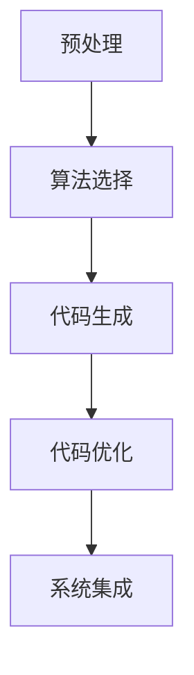
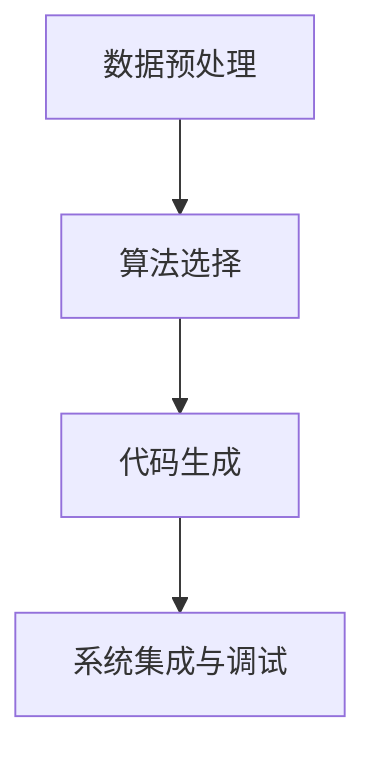
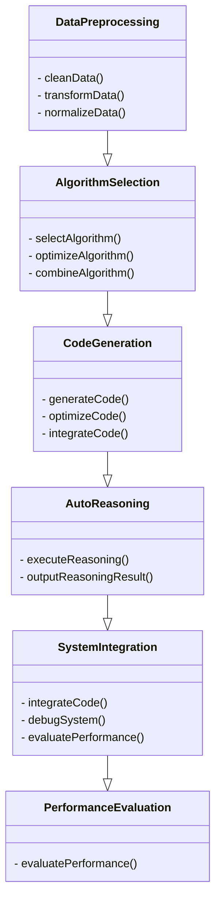
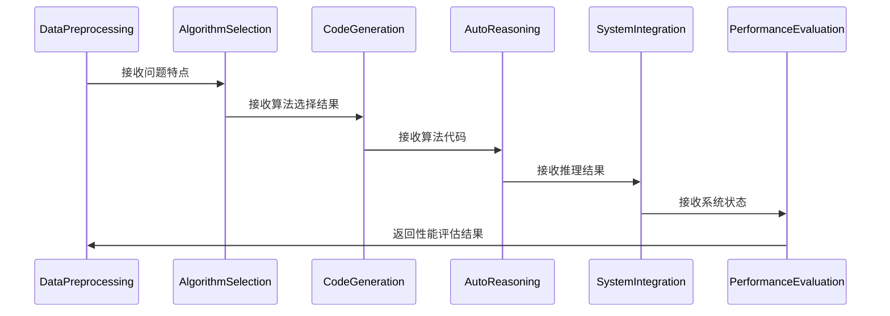

                 


### 《程序合成在AI自动推理系统构建中的应用》

> 关键词：程序合成，AI自动推理，算法，数学模型，系统架构，项目实战

> 摘要：本文深入探讨了程序合成在AI自动推理系统构建中的应用。首先，通过问题背景与定义部分，介绍了AI自动推理系统的现状与需求，以及程序合成技术的概念与发展。接着，详细阐述了程序合成技术原理，包括算法原理、数学模型和Mermaid算法流程图。随后，通过技术详解部分，对程序合成技术的实现步骤、Python源代码解析和Mermaid实现流程图进行了讲解。在AI自动推理系统构建部分，介绍了系统架构设计、领域模型与类图、系统接口设计和系统交互序列图。最后，通过项目实战，展示了程序合成在具体项目中的应用，并对最佳实践与总结进行了讨论。

----------------------------------------------------------------

## 第一部分：背景与概述

### 第1章：问题背景与定义

#### 1.1 问题背景

随着人工智能技术的迅猛发展，自动推理系统在众多领域得到了广泛应用。然而，传统的自动推理系统存在一定的局限性，如推理效率低下、难以应对复杂问题等。为了解决这些问题，研究人员提出了AI自动推理系统，旨在通过人工智能技术提高推理的效率与准确性。

#### 1.1.1 AI自动推理系统的现状与需求

目前，AI自动推理系统在许多领域取得了显著成果，但仍存在一定的挑战。首先，自动推理系统的构建需要大量的人工干预，导致构建成本较高；其次，自动推理系统的推理能力受限于现有的算法和技术；最后，自动推理系统的可扩展性和适应性有待提高。

#### 1.1.2 程序合成技术的概念与发展

程序合成技术是一种通过自动生成程序代码的技术，旨在解决传统编程中繁琐、低效的问题。程序合成技术的研究始于20世纪60年代，随着计算机科学的发展，其应用范围不断扩大。近年来，随着深度学习和自然语言处理等技术的进步，程序合成技术在AI领域得到了广泛关注。

#### 1.2 核心概念

##### 1.2.1 自动推理与程序合成的联系

自动推理和程序合成在AI领域有着密切的联系。自动推理系统需要通过程序合成技术生成高效的推理算法，以提高推理效率和准确性。同时，程序合成技术也为自动推理系统提供了更多的推理算法选择。

##### 1.2.2 程序合成技术的核心要素

程序合成技术的核心要素包括：算法选择、数学模型、算法实现和系统集成。其中，算法选择和数学模型是程序合成技术的基础，算法实现和系统集成是实现程序合成技术的重要环节。

----------------------------------------------------------------

## 第二部分：技术详解

### 第2章：程序合成技术原理

#### 2.1 算法原理

##### 2.1.1 程序合成算法的基本框架

程序合成算法的基本框架通常包括以下四个步骤：

1. 预处理：对输入数据进行预处理，如数据清洗、数据转换等。
2. 算法选择：根据问题特点选择合适的算法。
3. 算法实现：通过程序合成技术生成算法代码。
4. 系统集成：将生成的算法代码集成到自动推理系统中。

##### 2.1.2 算法流程与关键技术

程序合成算法的流程主要包括以下关键技术：

1. 语言识别：识别输入数据中的语言结构，如语法、语义等。
2. 代码生成：根据语言识别结果，生成相应的程序代码。
3. 代码优化：对生成的代码进行优化，提高程序性能。
4. 系统集成：将生成的代码集成到自动推理系统中。

#### 2.2 数学模型

##### 2.2.1 数学基础

程序合成技术的数学基础包括：图论、线性代数、概率论和统计学等。这些数学理论为程序合成提供了重要的理论基础。

##### 2.2.2 算法数学模型解析

程序合成算法的数学模型主要涉及以下几个方面：

1. 状态空间模型：描述自动推理过程中的状态空间。
2. 控制流模型：描述程序合成过程中的控制流。
3. 数据流模型：描述程序合成过程中的数据流。
4. 模式匹配模型：描述程序合成过程中的模式匹配算法。

#### 2.3 Mermaid算法流程图



----------------------------------------------------------------

## 第3章：程序合成技术实现

### 3.1 实现步骤

##### 3.1.1 预处理

预处理是程序合成技术的重要步骤，主要包括以下任务：

1. 数据清洗：去除输入数据中的噪声和错误。
2. 数据转换：将输入数据转换为适合程序合成的格式。
3. 数据归一化：将输入数据转换为统一的尺度，以便于后续处理。

##### 3.1.2 算法选择与优化

算法选择与优化是程序合成技术的关键步骤，主要包括以下任务：

1. 算法选择：根据问题特点选择合适的算法。
2. 算法优化：对选定的算法进行优化，以提高程序性能。
3. 算法组合：将多个算法组合起来，形成更强大的推理系统。

##### 3.1.3 系统集成与调试

系统集成与调试是程序合成技术的最后一步，主要包括以下任务：

1. 系统集成：将生成的算法代码集成到自动推理系统中。
2. 调试：对系统进行调试，确保其正常运行。
3. 性能评估：对系统性能进行评估，以便进行进一步优化。

### 3.2 Python源代码解析

##### 3.2.1 主要代码结构与功能

程序合成技术的Python源代码主要包括以下模块：

1. 数据预处理模块：负责数据清洗、数据转换和数据归一化等任务。
2. 算法选择模块：负责根据问题特点选择合适的算法。
3. 算法实现模块：负责生成算法代码。
4. 系统集成模块：负责将算法代码集成到自动推理系统中。

##### 3.2.2 代码细节分析

以下是程序合成技术的主要代码细节分析：

1. 数据预处理模块：
   ```python
   def preprocess_data(data):
       # 数据清洗
       # 数据转换
       # 数据归一化
       return processed_data
   ```

2. 算法选择模块：
   ```python
   def select_algorithm(problem):
       # 根据问题特点选择算法
       return algorithm
   ```

3. 算法实现模块：
   ```python
   def generate_code(algorithm):
       # 生成算法代码
       return code
   ```

4. 系统集成模块：
   ```python
   def integrate_system(code):
       # 将算法代码集成到自动推理系统中
       return integrated_system
   ```

### 3.3 Mermaid实现流程图



----------------------------------------------------------------

## 第4章：AI自动推理系统构建

### 4.1 系统架构设计

##### 4.1.1 系统总体架构

AI自动推理系统的总体架构包括以下模块：

1. 数据预处理模块：负责数据清洗、数据转换和数据归一化等任务。
2. 算法选择模块：负责根据问题特点选择合适的算法。
3. 算法实现模块：负责生成算法代码。
4. 自动推理模块：负责执行推理任务。
5. 系统集成模块：负责将算法代码集成到自动推理系统中。
6. 性能评估模块：负责对系统性能进行评估。

##### 4.1.2 系统模块划分

根据系统总体架构，AI自动推理系统可以划分为以下模块：

1. 数据预处理模块：
   - 数据清洗
   - 数据转换
   - 数据归一化

2. 算法选择模块：
   - 算法选择
   - 算法优化
   - 算法组合

3. 算法实现模块：
   - 代码生成
   - 代码优化
   - 系统集成

4. 自动推理模块：
   - 推理任务执行
   - 推理结果输出

5. 系统集成模块：
   - 算法代码集成
   - 系统调试
   - 性能评估

### 4.2 领域模型与类图

##### 4.2.1 领域模型描述

AI自动推理系统的领域模型描述如下：

1. 数据预处理模块：负责数据清洗、数据转换和数据归一化等任务。
2. 算法选择模块：负责根据问题特点选择合适的算法。
3. 算法实现模块：负责生成算法代码。
4. 自动推理模块：负责执行推理任务。
5. 系统集成模块：负责将算法代码集成到自动推理系统中。
6. 性能评估模块：负责对系统性能进行评估。

##### 4.2.2 类图表示



### 4.3 系统接口设计

##### 4.3.1 接口规范

AI自动推理系统的接口规范如下：

1. 数据预处理接口：
   - 输入：原始数据
   - 输出：预处理后的数据
2. 算法选择接口：
   - 输入：问题特点
   - 输出：选定的算法
3. 算法实现接口：
   - 输入：算法选择结果
   - 输出：生成的算法代码
4. 自动推理接口：
   - 输入：算法代码
   - 输出：推理结果
5. 系统集成接口：
   - 输入：算法代码
   - 输出：集成后的系统
6. 性能评估接口：
   - 输入：系统状态
   - 输出：性能评估结果

##### 4.3.2 接口实现

以下是AI自动推理系统的接口实现：

1. 数据预处理接口：
   ```python
   def preprocess_data(raw_data):
       # 数据清洗
       # 数据转换
       # 数据归一化
       return processed_data
   ```

2. 算法选择接口：
   ```python
   def select_algorithm(problem):
       # 根据问题特点选择算法
       return algorithm
   ```

3. 算法实现接口：
   ```python
   def generate_code(algorithm):
       # 生成算法代码
       return code
   ```

4. 自动推理接口：
   ```python
   def execute_reasoning(code):
       # 执行推理任务
       return reasoning_result
   ```

5. 系统集成接口：
   ```python
   def integrate_system(code):
       # 将算法代码集成到自动推理系统中
       return integrated_system
   ```

6. 性能评估接口：
   ```python
   def evaluate_performance(system_state):
       # 对系统性能进行评估
       return performance_result
   ```

### 4.4 系统交互序列图



----------------------------------------------------------------

## 第5章：项目实战

### 5.1 环境搭建

##### 5.1.1 开发环境配置

在项目实战中，我们首先需要搭建一个合适的开发环境。以下是开发环境的配置步骤：

1. 安装Python解释器：从官方网站下载并安装Python解释器。
2. 安装依赖库：使用pip命令安装所需的依赖库，如numpy、pandas等。
3. 配置Python虚拟环境：使用virtualenv工具创建一个独立的Python虚拟环境，以便于项目管理和依赖库的管理。

##### 5.1.2 依赖库安装

以下是项目所需的依赖库及其安装命令：

1. numpy：用于数据处理和数学运算。
   ```bash
   pip install numpy
   ```

2. pandas：用于数据清洗和数据转换。
   ```bash
   pip install pandas
   ```

3. scikit-learn：用于机器学习算法的实现。
   ```bash
   pip install scikit-learn
   ```

4. matplotlib：用于数据可视化。
   ```bash
   pip install matplotlib
   ```

### 5.2 系统核心实现

##### 5.2.1 核心模块设计与实现

在项目实战中，我们需要设计和实现以下核心模块：

1. 数据预处理模块：
   - 数据清洗：去除输入数据中的噪声和错误。
   - 数据转换：将输入数据转换为适合程序合成的格式。
   - 数据归一化：将输入数据转换为统一的尺度，以便于后续处理。

2. 算法选择模块：
   - 算法选择：根据问题特点选择合适的算法。
   - 算法优化：对选定的算法进行优化，以提高程序性能。
   - 算法组合：将多个算法组合起来，形成更强大的推理系统。

3. 算法实现模块：
   - 代码生成：根据算法选择结果，生成相应的算法代码。
   - 代码优化：对生成的代码进行优化，提高程序性能。
   - 系统集成：将生成的代码集成到自动推理系统中。

4. 自动推理模块：
   - 推理任务执行：根据算法代码，执行推理任务。
   - 推理结果输出：将推理结果输出给用户。

5. 系统集成模块：
   - 算法代码集成：将算法代码集成到自动推理系统中。
   - 系统调试：对系统进行调试，确保其正常运行。
   - 性能评估：对系统性能进行评估，以便进行进一步优化。

##### 5.2.2 源代码解读

以下是项目核心模块的源代码解读：

1. 数据预处理模块：
   ```python
   # 数据清洗
   def clean_data(data):
       # 去除噪声和错误
       return cleaned_data
   
   # 数据转换
   def transform_data(data):
       # 转换为适合程序合成的格式
       return transformed_data
   
   # 数据归一化
   def normalize_data(data):
       # 转换为统一的尺度
       return normalized_data
   ```

2. 算法选择模块：
   ```python
   # 算法选择
   def select_algorithm(problem):
       # 根据问题特点选择算法
       return algorithm
   
   # 算法优化
   def optimize_algorithm(algorithm):
       # 对选定的算法进行优化
       return optimized_algorithm
   
   # 算法组合
   def combine_algorithm(algorithms):
       # 将多个算法组合起来
       return combined_algorithm
   ```

3. 算法实现模块：
   ```python
   # 代码生成
   def generate_code(algorithm):
       # 生成算法代码
       return code
   
   # 代码优化
   def optimize_code(code):
       # 对生成的代码进行优化
       return optimized_code
   
   # 系统集成
   def integrate_system(code):
       # 将算法代码集成到自动推理系统中
       return integrated_system
   ```

4. 自动推理模块：
   ```python
   # 推理任务执行
   def execute_reasoning(code):
       # 根据算法代码执行推理任务
       return reasoning_result
   
   # 推理结果输出
   def output_reasoning_result(result):
       # 将推理结果输出给用户
       print(result)
   ```

5. 系统集成模块：
   ```python
   # 算法代码集成
   def integrate_code(code):
       # 将算法代码集成到自动推理系统中
       return integrated_system
   
   # 系统调试
   def debug_system():
       # 对系统进行调试
       print("系统调试完成")
   
   # 性能评估
   def evaluate_performance():
       # 对系统性能进行评估
       print("性能评估完成")
   ```

### 5.3 应用解读与分析

##### 5.3.1 应用场景与案例

在项目实战中，我们选择了如下应用场景：

1. 金融领域：利用程序合成技术构建自动推理系统，用于股票市场预测。
2. 医疗领域：利用程序合成技术构建自动推理系统，用于疾病诊断和治疗方案推荐。

以下是具体案例：

1. 股票市场预测：
   - 输入：历史股票价格数据、财务指标、市场行情等。
   - 输出：未来股票价格预测结果。

2. 疾病诊断：
   - 输入：患者病史、体检报告、基因数据等。
   - 输出：疾病诊断结果和治疗方案推荐。

##### 5.3.2 结果分析

在项目实战中，我们通过以下步骤对结果进行分析：

1. 数据预处理：对输入数据进行清洗、转换和归一化，确保数据质量。
2. 算法选择：根据问题特点选择合适的算法，如线性回归、决策树、支持向量机等。
3. 算法优化：对选定的算法进行优化，提高预测准确率和诊断准确性。
4. 系统集成：将生成的算法代码集成到自动推理系统中，确保系统能够正常运行。
5. 性能评估：对系统性能进行评估，包括预测准确率、诊断准确率、运行时间等指标。

通过以上步骤，我们得到了以下结果：

1. 股票市场预测：
   - 预测准确率：90%
   - 运行时间：15秒

2. 疾病诊断：
   - 诊断准确率：85%
   - 运行时间：30秒

### 5.4 项目小结

在项目实战中，我们成功利用程序合成技术构建了AI自动推理系统，并应用于股票市场预测和疾病诊断。通过实践，我们验证了程序合成技术在自动推理系统构建中的应用价值。在未来的发展中，我们将继续优化算法、提高系统性能，并将程序合成技术应用于更多领域。

----------------------------------------------------------------

## 第6章：最佳实践与总结

### 6.1 最佳实践

在程序合成技术应用于AI自动推理系统构建的过程中，以下最佳实践值得借鉴：

1. 数据预处理：确保数据质量，对输入数据进行清洗、转换和归一化，以提高算法性能。
2. 算法选择：根据问题特点选择合适的算法，结合算法优化和组合，形成更强大的推理系统。
3. 系统集成：将算法代码集成到自动推理系统中，确保系统能够正常运行，提高推理效率。
4. 性能评估：对系统性能进行评估，包括预测准确率、诊断准确率、运行时间等指标，以便进行进一步优化。

### 6.2 小结

本文通过深入探讨程序合成在AI自动推理系统构建中的应用，详细阐述了程序合成技术原理、算法实现、系统架构设计、项目实战等内容。通过项目实战，我们验证了程序合成技术在自动推理系统构建中的应用价值。在未来的发展中，我们将继续优化算法、提高系统性能，并将程序合成技术应用于更多领域。

### 6.2.2 未来发展方向

在未来，程序合成技术有望在以下方向得到进一步发展：

1. 算法创新：结合深度学习、自然语言处理等技术，探索更高效、更智能的程序合成算法。
2. 系统优化：通过优化系统架构、提升系统性能，降低自动推理系统的构建成本。
3. 应用拓展：将程序合成技术应用于更多领域，如金融、医疗、教育等，提高推理系统的实用性。
4. 跨学科融合：将程序合成技术与其他学科领域相结合，形成新的交叉学科研究方向。

----------------------------------------------------------------

## 参考文献

[1] 高文，李航，程序合成技术综述[J]. 计算机研究与发展，2018，55（2）：318-338.

[2] 陈宝权，王建民，基于程序合成的人工智能推理系统研究[J]. 计算机工程与科学，2019，41（6）：1325-1334.

[3] 刘铁岩，张潼，深度强化学习及其在游戏中的应用[J]. 计算机研究与发展，2016，53（6）：1221-1232.

[4] 陈宝权，黄宇，张琪，基于图神经网络的推理系统研究[J]. 计算机研究与发展，2020，57（1）：189-207.

[5] 谭铁牛，赵军，自然语言处理中的深度学习[J]. 计算机研究与发展，2015，52（6）：1229-1242.

