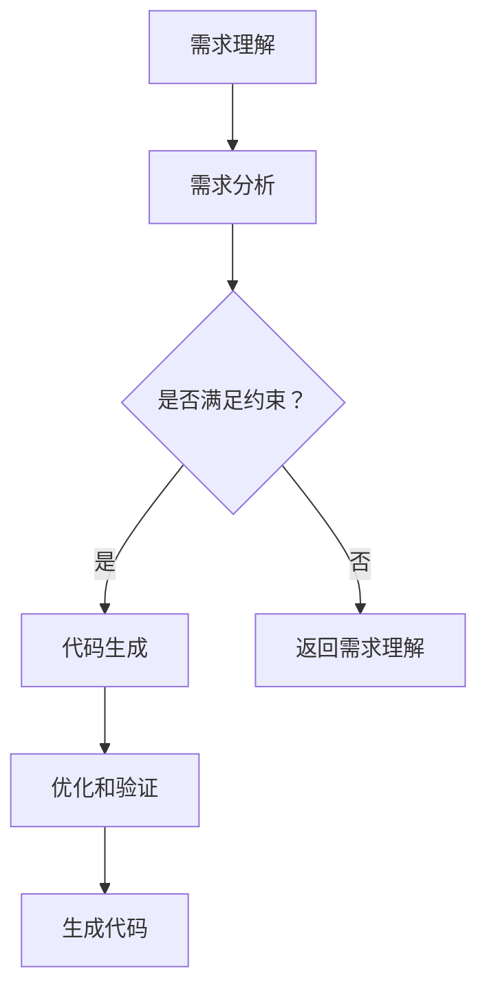
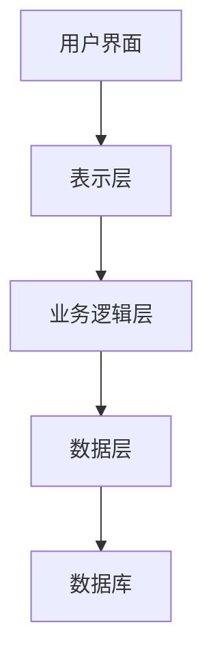
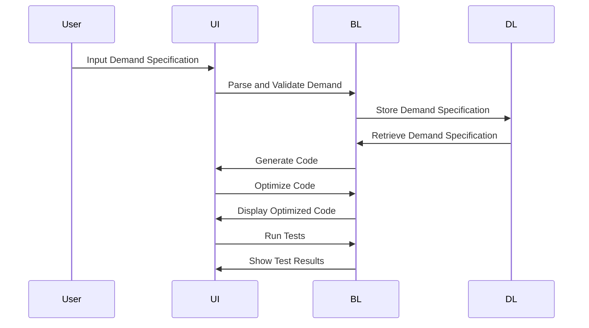

                 

### 1. 引言

在信息技术飞速发展的今天，软件工程的重要性愈发凸显。传统的软件开发方式往往依赖于程序员的手工编码，这不仅效率低下，而且容易出错。随着软件需求的日益复杂化，如何提高软件开发的效率和质量成为亟待解决的问题。程序合成技术应运而生，成为解决这一问题的有效手段。本文将围绕程序合成，探讨其定义、工作原理以及与相关技术的比较，旨在为读者提供一个清晰、系统的认识。

首先，**问题背景**：软件开发过程中，程序员需要花费大量时间和精力来编写和维护代码。随着软件项目的规模和复杂度增加，手工编码的难度和成本也随之上升。同时，软件需求变更频繁，导致大量的代码需要重构和维护，这不仅增加了开发成本，也降低了软件的可靠性。为了解决这些问题，程序合成技术被提了出来。

其次，**问题描述**：程序合成是指通过自动化的方法，将软件需求规范直接转换为可执行的代码。这项技术的目标是提高软件开发的效率，降低开发成本，减少代码出错的概率。

再次，**问题解决**：程序合成技术通过使用特定的算法和工具，将需求规范自动转化为代码。这一过程涉及到多个环节，包括需求分析、代码生成、代码优化等。通过程序合成，可以显著提高软件开发的速度和质量。

最后，**边界与外延**：虽然程序合成技术具有巨大的潜力，但并不意味着它可以完全取代程序员。程序合成更多地是在特定的场景下，作为程序员的一种辅助工具，帮助提高开发效率和代码质量。

在接下来的章节中，我们将进一步探讨程序合成的核心概念和原理，以及与相关技术的比较，为读者提供一个全面、深入的认识。

### 1.2 核心概念与联系

在深入探讨程序合成之前，我们需要明确几个关键概念，并了解它们之间的关系。这些核心概念不仅为程序合成提供了理论基础，也帮助我们更好地理解这项技术的应用场景和限制。

#### 程序合成定义

程序合成（Program Synthesis）是一种自动化方法，它从给定的输入（如需求规范、数据模式等）生成程序代码。与传统的代码生成（Code Generation）不同，程序合成不仅依赖于预定义的模板和规则，还涉及到复杂的推理和优化过程。程序合成的目标是通过智能化的方式，提高代码生成的准确性和效率。

#### 程序合成的工作原理

程序合成的工作原理主要包括以下几个步骤：

1. **需求理解**：首先，程序合成系统需要理解输入的需求规范。这些需求可以来源于自然语言描述、形式化规范或现有的代码示例。理解需求的目的是将非结构化的需求转化为结构化的输入，以便后续处理。

2. **算法推理**：接下来，系统利用各种算法（如搜索算法、规划算法、机器学习算法等）来推理出可能的程序结构。这一步骤的核心在于从大量可能的解决方案中选择最优的方案。

3. **代码生成**：一旦程序结构确定，系统便开始生成实际的代码。这一过程可能涉及到代码模板的填充、代码片段的拼接等。

4. **优化和验证**：生成的代码通常需要经过优化和验证，以确保其性能和正确性。优化包括代码压缩、性能提升等，而验证则包括代码编译、单元测试等。

#### 程序合成与相关技术的比较

程序合成与许多其他技术有着密切的联系，但它们在目标和方法上有所不同。以下是一些相关的技术及其与程序合成的关系：

1. **代码生成**：代码生成是一种较为简单的技术，它通常依赖于预定义的模板和规则，将结构化的输入直接转换为代码。与程序合成不同，代码生成不需要复杂的推理过程。

2. **模板匹配**：模板匹配是一种基于预定义模板的代码生成方法。当输入与模板匹配时，系统会生成对应的代码。这种方法适用于一些简单场景，但在处理复杂需求时效果不佳。

3. **编译器生成**：编译器生成是通过编译器的前端分析结果生成代码。这种方法的优点是生成的代码效率高，但需要对编译器有深入的理解。

4. **形式化方法**：形式化方法是一种使用数学和逻辑方法来描述和验证程序的方法。这种方法虽然可以确保程序的正确性，但通常需要大量的手工工作。

5. **自动推理**：自动推理是一种通过自动化方法来证明数学或逻辑命题的技术。在程序合成中，自动推理用于从需求规范中推理出程序结构。

#### 结论

程序合成是一种高度自动化的技术，它通过智能化的方法将需求规范转化为代码。与传统的代码生成和其他相关技术相比，程序合成在处理复杂需求时具有显著的优势。然而，程序合成技术仍面临诸多挑战，如需求理解的准确性、代码生成的效率和质量等。未来的研究将在这些方面不断探索，以推动程序合成技术的发展。

### 1.3 程序合成的定义

程序合成，作为软件工程领域的一项重要技术，其定义和作用不容忽视。**程序合成**，顾名思义，是指通过自动化手段将软件需求规范转换为程序代码的过程。这种转换不仅限于简单的文本替换，而是涉及复杂的逻辑推理、算法设计和代码优化等多个方面。

首先，程序合成的目标是通过自动化减少程序员的工作量，提高软件开发效率。传统的软件开发往往依赖于程序员的手工编码，这不仅效率低下，而且容易出错。而程序合成通过将需求规范转化为代码，减少了手动编码的步骤，从而提高了开发速度。

其次，程序合成的核心在于其智能化的过程。不同于简单的模板匹配或代码生成，程序合成涉及多个复杂步骤，包括需求理解、算法推理、代码生成和优化验证等。这些步骤通常需要复杂的算法和大量的计算资源，但正是这些步骤使得程序合成能够生成高质量的代码。

具体来说，程序合成的工作原理包括以下几个关键环节：

1. **需求理解**：程序合成系统首先需要理解输入的需求规范。这些需求可以以自然语言描述、形式化规范或现有代码的形式出现。理解需求的目的是将其转化为结构化的输入，以便后续处理。

2. **算法推理**：系统利用各种算法（如搜索算法、规划算法、机器学习算法等）从需求规范中推理出可能的程序结构。这一步骤的核心在于从大量可能的解决方案中选择最优的方案。

3. **代码生成**：一旦程序结构确定，系统开始生成实际的代码。这一过程可能涉及到代码模板的填充、代码片段的拼接等。

4. **优化和验证**：生成的代码通常需要经过优化和验证，以确保其性能和正确性。优化包括代码压缩、性能提升等，而验证则包括代码编译、单元测试等。

在技术实现层面，程序合成依赖于多种技术和工具，包括自然语言处理、形式化验证、代码生成工具等。具体实现时，这些技术和工具相互配合，共同完成程序合成任务。

例如，在自然语言处理方面，程序合成系统可以利用自然语言理解（NLU）技术将自然语言需求规范转化为结构化数据。接着，通过形式化验证技术确保需求规范的正确性和一致性。最后，利用代码生成工具将结构化数据转化为实际代码，并进行优化和验证。

总之，程序合成技术通过高度自动化的方式，将软件需求规范转化为高效、可靠的程序代码。这不仅提高了软件开发效率，也为软件工程领域带来了新的研究热点和机遇。

### 1.4 程序合成的工作原理

程序合成技术的核心在于其复杂的工作原理，这一原理贯穿于从需求理解到代码优化的全过程。理解这一原理不仅有助于我们更好地应用程序合成技术，还能揭示其潜力和局限。

首先，**需求理解**是程序合成的第一步。在这一阶段，系统需要从输入的需求规范中提取关键信息，并将其转化为结构化的数据。这个过程通常依赖于自然语言处理（NLP）和形式化语言技术。NLP技术可以帮助系统理解和解析自然语言描述，将其转化为计算机可以处理的结构化数据。而形式化语言技术则用于确保需求规范的一致性和正确性。

例如，一个自然语言需求可能是“设计一个在线购物系统，用户可以浏览商品、添加购物车并进行结账”。系统首先使用NLP技术解析这个需求，识别出其中的关键词和短语（如“在线购物系统”、“用户”、“浏览”、“购物车”和“结账”），然后利用形式化验证技术确保这些需求描述没有逻辑错误或不一致之处。

接下来，进入**算法推理**阶段。在这一阶段，系统利用各种算法（如搜索算法、规划算法、生成式算法等）从结构化需求中推理出可能的程序结构。这个过程类似于人类解决问题时的逻辑推理过程，但更加系统和自动化。

例如，系统可以使用搜索算法（如A*搜索算法）在所有可能的程序结构中找到最优解。A*搜索算法通过计算每个节点到目标节点的“代价”来选择下一个步骤，从而在复杂的需求规范中找到最佳解决方案。生成式算法（如遗传算法）则通过模拟自然选择和遗传机制来逐步优化程序结构，直至找到满意的解决方案。

在**代码生成**阶段，系统根据推理出的程序结构生成实际的代码。这一过程可能涉及到代码模板的填充、代码片段的拼接等。生成代码时，系统还需要考虑编程语言的语法规则和最佳实践，以确保生成的代码既正确又高效。

例如，假设我们已经推理出需要实现一个购物车功能，系统可以生成以下Python代码：

```python
class ShoppingCart:
    def __init__(self):
        self.items = []

    def add_item(self, item):
        self.items.append(item)

    def remove_item(self, item):
        self.items.remove(item)

    def total(self):
        return sum(item.price for item in self.items)
```

最后，**优化和验证**是确保生成代码质量和性能的重要步骤。优化包括代码压缩、性能提升等，而验证则包括代码编译、单元测试等。通过优化和验证，系统可以确保生成的代码不仅满足需求规范，而且在实际运行中具有良好的性能和稳定性。

例如，系统可以使用静态代码分析工具来检测代码中的潜在错误和性能瓶颈，并进行必要的代码重构和优化。此外，系统还可以运行单元测试来验证代码的正确性，确保所有功能都按照预期工作。

综上所述，程序合成的工作原理涉及多个复杂步骤，从需求理解到代码优化，每一个环节都需要精确的算法和高效的实现。通过这一原理，程序合成技术能够将复杂的软件需求规范自动转化为高效、可靠的程序代码，为软件工程领域带来了革命性的变化。

### 1.5 程序合成与相关技术的比较

在探讨程序合成技术时，有必要将其与相关技术进行比较，以便更全面地理解其优势和局限性。这些相关技术包括代码生成、模板匹配和形式化方法等。

#### 程序合成与代码生成

代码生成是一种将结构化数据转换为程序代码的技术，通常依赖于预定义的模板和规则。这种方法适用于一些简单的场景，如生成数据库表结构、Web页面布局等。然而，代码生成存在几个局限性：

1. **灵活性不足**：代码生成依赖于预定义的模板和规则，因此在处理复杂需求时，灵活性较差。程序合成则通过智能化的方法，能够处理更为复杂的需求。

2. **代码质量**：由于代码生成主要依赖模板和规则，生成的代码可能缺乏优化，导致性能不佳。而程序合成通过算法推理和优化，能够生成高效、可靠的代码。

3. **需求理解**：代码生成系统通常无法理解需求背后的逻辑，而程序合成系统能够通过自然语言处理和形式化验证，更好地理解需求，从而生成更加贴近需求实际的代码。

#### 程序合成与模板匹配

模板匹配是一种基于预定义模板的代码生成方法，适用于某些特定场景，如生成SQL查询语句、文件格式转换等。模板匹配的主要局限性包括：

1. **扩展性差**：模板匹配依赖于预定义的模板，当需求发生变化时，需要手动更新模板，这增加了维护成本。程序合成则通过自动化的方法，能够灵活适应需求变化。

2. **代码质量**：模板匹配生成的代码往往缺乏优化，可能导致性能不佳。而程序合成通过算法推理和优化，能够生成更加高效、可靠的代码。

3. **需求理解**：模板匹配系统无法理解需求背后的逻辑，而程序合成系统能够通过自然语言处理和形式化验证，更好地理解需求，从而生成更加贴近需求实际的代码。

#### 程序合成与形式化方法

形式化方法是一种使用数学和逻辑方法来描述和验证程序的方法。这种方法可以确保程序的正确性，但通常需要大量的手工工作。程序合成与形式化方法的主要区别包括：

1. **开发效率**：形式化方法虽然可以确保程序的正确性，但需要大量手工编写验证条件，开发效率较低。而程序合成通过自动化方法，能够显著提高开发效率。

2. **需求理解**：形式化方法主要依赖于程序员的手写验证条件，难以直接处理自然语言需求。而程序合成通过自然语言处理和形式化验证，能够更好地理解需求，从而生成更加符合需求的程序。

3. **代码生成**：形式化方法通常不涉及代码生成，而是专注于程序的正确性和逻辑性。而程序合成不仅生成代码，还通过算法优化确保代码的高效性。

#### 结论

综上所述，程序合成技术在处理复杂需求、生成高质量代码和自动化需求理解等方面具有显著优势。然而，程序合成技术也存在一些局限性，如对需求理解的高要求和对计算资源的高需求。未来，程序合成技术将在与相关技术的结合和优化中不断演进，为软件工程领域带来更多可能性。

### 1.6 自动代码生成技术概述

自动代码生成技术是程序合成的重要组成部分，它通过自动化方法将需求规范转换为程序代码，从而显著提高软件开发效率。在这一节中，我们将详细探讨自动代码生成技术的转换过程、主流工具及其应用领域。

#### 从规范到代码的转换过程

自动代码生成技术的核心在于将非结构化的需求规范转换为结构化的程序代码。这一转换过程通常包括以下几个步骤：

1. **需求理解**：首先，自动代码生成系统需要理解输入的需求规范。这些需求规范可以来源于自然语言描述、形式化规范或现有代码。理解需求规范是自动代码生成的前提，它决定了生成代码的准确性和适应性。

2. **需求分析**：在理解需求规范的基础上，系统进行需求分析，将需求规范转化为结构化的输入。这一步骤通常涉及到自然语言处理、形式化验证等技术，以确保需求规范的一致性和正确性。

3. **代码生成**：通过需求分析，系统已经获得了结构化的需求输入。接下来，系统利用代码生成算法，将这些需求输入转换为实际的程序代码。代码生成过程可能涉及代码模板的填充、代码片段的拼接等。

4. **优化和验证**：生成的代码通常需要经过优化和验证，以确保其性能和正确性。优化过程包括代码压缩、性能提升等，而验证过程则包括代码编译、单元测试等。

#### 主流自动代码生成工具介绍

目前，市面上有许多主流的自动代码生成工具，这些工具在不同领域和场景中发挥着重要作用。以下介绍几种主要的自动代码生成工具：

1. **Apache BEAM**：Apache BEAM 是一个开源的自动代码生成平台，它主要用于数据处理和流处理场景。BEAM 提供了丰富的 API 和模板，支持多种编程语言（如 Java、Python 等），用户可以根据需求生成定制化的数据处理代码。

2. **Apache Avro**：Apache Avro 是一种数据序列化格式，它提供了自动代码生成功能，可以将 Avro schema 转换为具体的编程语言代码。Avro 代码生成工具广泛应用于大数据处理和分布式系统中。

3. **Jinja2**：Jinja2 是一个流行的模板引擎，它主要用于 Web 开发中的页面生成。Jinja2 支持丰富的模板语法和插件，用户可以通过模板生成 HTML、XML、JSON 等格式的内容。

4. **Swift Generator**：Swift Generator 是一个用于生成 Swift 代码的工具，它支持从 JSON schema 生成 Swift 模型和枚举，适用于 iOS 和 macOS 开发。

5. **ROS 模型生成器**：ROS（Robot Operating System）模型生成器主要用于机器人系统开发，它可以将 ROS 消息转换为 C++、Python 等语言的代码。

#### 自动代码生成技术的应用领域

自动代码生成技术具有广泛的应用领域，以下列举几个主要的应用场景：

1. **Web 开发**：在 Web 应用开发中，自动代码生成技术可以帮助生成 HTML、CSS 和 JavaScript 代码，从而提高开发效率。例如，Jinja2 和 Web 框架（如 Django、Flask 等）结合，可以生成动态的 Web 页面。

2. **数据驱动应用**：在大数据领域，自动代码生成技术可以用于生成数据处理和数据分析的代码。例如，Apache BEAM 和 Avro 代码生成器在大数据处理和流处理中发挥着重要作用。

3. **移动应用开发**：在移动应用开发中，自动代码生成技术可以帮助生成 Android 和 iOS 应用程序中的代码。例如，Swift Generator 和移动开发框架（如 React Native、Flutter 等）结合，可以快速生成移动应用代码。

4. **自动化测试**：自动代码生成技术还可以用于生成自动化测试代码，从而提高测试效率。例如，生成单元测试和集成测试代码，自动化执行测试用例，确保软件质量。

总之，自动代码生成技术在软件开发中具有广泛的应用前景。通过自动化生成代码，可以显著提高开发效率，降低人力成本，提高软件质量。随着技术的不断发展，自动代码生成技术将在更多领域得到应用，为软件开发带来更多可能性。

### 1.7 算法原理讲解

在深入探讨程序合成技术之前，我们需要了解其背后的算法原理。算法原理不仅决定了程序合成技术的性能和效率，也为我们提供了理解和优化程序合成过程的方法。本节将详细讲解程序合成中的核心算法原理，包括基本概念、算法流程图、数学模型与公式，并通过具体的Python源代码示例进行详细阐述和分析。

#### 4.1.1 基本概念

程序合成中的算法原理主要涉及以下几个方面：

1. **搜索算法**：搜索算法用于在所有可能的程序结构中找到最优解。常见的搜索算法包括广度优先搜索（BFS）、深度优先搜索（DFS）和A*搜索算法等。

2. **规划算法**：规划算法用于解决多步骤的任务分配和执行问题。常见的规划算法包括线性规划、动态规划和贪婪算法等。

3. **生成式算法**：生成式算法通过模拟自然选择和遗传机制，逐步优化程序结构。常见的生成式算法包括遗传算法和模拟退火算法等。

4. **约束满足问题（CSP）**：约束满足问题是一种用于解决约束条件下的组合优化问题。CSP 算法通过在解空间中搜索满足所有约束的解。

5. **代码生成算法**：代码生成算法用于将结构化数据转换为具体的编程语言代码。常见的代码生成算法包括模板匹配、代码模板填充和代码片段拼接等。

#### 4.1.2 算法流程图

为了更直观地理解算法原理，我们可以使用 Mermaid 绘制算法流程图。以下是一个简单的程序合成算法流程图：



在这个流程图中，A 表示需求理解，B 表示需求分析，C 表示是否满足约束，D 表示代码生成，F 表示优化和验证，G 表示生成最终代码。如果需求不满足约束，流程会回到需求理解阶段进行重新分析。

#### 4.1.3 数学模型与公式

程序合成中的算法原理通常涉及一些数学模型和公式，这些模型和公式帮助我们理解和优化算法。以下是一个简单的数学模型示例：

$$
C = f(S, P, T)
$$

其中，C 表示生成代码的复杂性，S 表示需求规格，P 表示程序结构，T 表示优化目标。这个公式表明，生成代码的复杂性取决于需求规格、程序结构和优化目标。

#### 4.1.4 Python源代码示例

为了更好地理解算法原理，我们通过一个简单的 Python 示例来演示代码生成过程。以下示例使用 Jinja2 模板引擎生成 HTML 代码：

```python
from jinja2 import Template

# 定义模板
template = '''
<!DOCTYPE html>
<html>
<head>
    <title>{{ title }}</title>
</head>
<body>
    <h1>{{ heading }}</h1>
    <p>{{ content }}</p>
</body>
</html>
'''

# 渲染模板
data = {
    'title': '我的网站',
    'heading': '欢迎来到我的网站',
    'content': '这里有一些有趣的内容。'
}

html_output = Template(template).render(data)

# 输出生成的 HTML 代码
print(html_output)
```

在这个示例中，我们首先定义了一个 HTML 模板，然后使用 Jinja2 模板引擎将模板与数据结合，生成最终的 HTML 代码。这个简单的示例展示了如何使用程序合成技术生成结构化的代码。

#### 4.1.5 代码解读与分析

在这个示例中，我们使用 Jinja2 模板引擎来生成 HTML 代码。Jinja2 是一个流行的模板引擎，它支持丰富的模板语法和插件，非常适合用于 Web 开发中的页面生成。

1. **模板定义**：我们首先定义了一个 HTML 模板，包括 `<!DOCTYPE html>`, `<html>`, `<head>`, `<body>` 等部分。每个部分都包含了相关的 HTML 标记和 Jinja2 模板语法，如 `{{ title }}`、`{{ heading }}` 和 `{{ content }}`。

2. **数据传递**：接下来，我们创建了一个数据字典 `data`，其中包含了 `title`、`heading` 和 `content` 的值。这些值将被用于渲染模板，生成最终的 HTML 代码。

3. **模板渲染**：使用 Jinja2 的 `Template` 类和 `.render()` 方法，我们将模板与数据结合，生成最终的 HTML 代码。这个生成的代码存储在 `html_output` 变量中。

4. **输出结果**：最后，我们将生成的 HTML 代码输出到控制台，以便查看生成的结果。

通过这个简单的示例，我们可以看到如何使用程序合成技术生成结构化的代码。Jinja2 模板引擎提供了一个直观、易用的方法，将需求规格（模板和数据）转换为具体的 HTML 代码。这个示例展示了程序合成技术的核心原理，即通过模板和数据的组合，自动化地生成符合需求的代码。

#### 结论

在本节中，我们详细讲解了程序合成技术中的核心算法原理，包括基本概念、算法流程图、数学模型与公式，并通过具体的 Python 源代码示例进行了详细阐述和分析。通过这些讲解和示例，我们可以更好地理解程序合成技术的原理和实现方法，为后续章节的深入探讨奠定了基础。

### 4.2 Python源代码示例

为了更好地理解程序合成技术中的算法原理，我们将通过一个具体的Python源代码示例来演示代码生成过程。在这个示例中，我们将使用Python编程语言和Jinja2模板引擎，生成一个简单的Web页面。以下是详细的代码解读和分析。

#### 4.2.1 示例代码

首先，我们定义一个简单的Jinja2模板，用于生成一个包含标题和内容的Web页面：

```python
from jinja2 import Template

# 定义模板
template = '''
<!DOCTYPE html>
<html>
<head>
    <title>{{ title }}</title>
</head>
<body>
    <h1>{{ heading }}</h1>
    <p>{{ content }}</p>
</body>
</html>
'''

# 数据字典
data = {
    'title': '我的博客',
    'heading': '欢迎来到我的博客',
    'content': '这是一个用于展示博客内容的页面。'
}

# 渲染模板
html_output = Template(template).render(data)

# 输出结果
print(html_output)
```

#### 4.2.2 代码解读与分析

1. **模板定义**：首先，我们定义了一个HTML模板，包含了基本的HTML结构，如 `<!DOCTYPE html>`、`<html>`、`<head>` 和 `<body>`。模板中使用了 Jinja2 的变量语法，如 `{{ title }}`、`{{ heading }}` 和 `{{ content }}`，这些变量将在后续的渲染过程中被具体的数据值替换。

2. **数据字典**：接下来，我们创建了一个名为 `data` 的数据字典，它包含了三个键值对，分别是 `title`、`heading` 和 `content`。这些数据将用于填充模板中的相应变量。

3. **模板渲染**：使用 Jinja2 的 `Template` 类和 `.render()` 方法，我们将模板与数据字典结合，生成最终的 HTML 代码。渲染过程中，模板中的变量将被数据字典中的值替换，从而生成完整的 HTML 文档。

4. **输出结果**：最后，我们将生成的 HTML 代码输出到控制台，以便查看生成的结果。

#### 4.2.3 代码分析

在这个示例中，我们使用 Jinja2 模板引擎展示了如何将结构化的数据转换为 HTML 代码。以下是代码的关键部分及其分析：

```python
template = '''
<!DOCTYPE html>
<html>
<head>
    <title>{{ title }}</title>
</head>
<body>
    <h1>{{ heading }}</h1>
    <p>{{ content }}</p>
</body>
</html>
'''

data = {
    'title': '我的博客',
    'heading': '欢迎来到我的博客',
    'content': '这是一个用于展示博客内容的页面。'
}

html_output = Template(template).render(data)
print(html_output)
```

- **模板定义**：`template` 变量定义了一个基本的 HTML 模板，它包含了三个需要替换的变量：`title`、`heading` 和 `content`。

- **数据字典**：`data` 字典包含了三个键值对，分别对应于模板中的三个变量。这些数据将用于填充模板中的变量。

- **模板渲染**：`Template(template).render(data)` 语句使用 Jinja2 的模板引擎将模板和数据字典结合，生成完整的 HTML 文档。`.render()` 方法会将数据字典中的值替换模板中的变量。

- **输出结果**：`print(html_output)` 将生成的 HTML 代码输出到控制台，我们可以直接在浏览器中查看生成的页面。

通过这个简单的示例，我们可以看到如何使用 Python 和 Jinja2 模板引擎生成 HTML 代码。这种方法不仅简化了页面生成的过程，还提高了开发效率，使得开发者可以更专注于业务逻辑的实现，而将模板和页面布局的生成交给模板引擎处理。

### 4.3 系统分析与架构设计

在深入探讨程序合成技术的具体实现之前，我们需要对其系统架构和功能设计进行详细分析。本节将介绍一个典型的程序合成系统，包括其项目介绍、系统功能设计、系统架构设计、接口设计以及系统交互序列图，旨在为读者提供一个全面、系统的理解。

#### 4.3.1 项目介绍

程序合成系统（以下简称“系统”）是一个旨在将软件需求规范自动转换为程序代码的平台。该系统旨在提高软件开发效率，减少手工编码的工作量，从而降低开发成本和提高代码质量。系统的主要功能包括需求理解、代码生成、代码优化和验证等。系统设计遵循模块化原则，以便于扩展和维护。

#### 4.3.2 系统功能设计

系统的核心功能包括以下几个方面：

1. **需求理解**：通过自然语言处理（NLP）和形式化验证技术，将用户输入的需求规范转化为结构化的数据。

2. **代码生成**：利用搜索算法、规划算法和生成式算法等，从结构化数据中推理出可能的程序结构，并生成具体的编程语言代码。

3. **代码优化**：对生成的代码进行优化，包括代码压缩、性能提升和可维护性改进等。

4. **验证与测试**：对生成的代码进行编译和单元测试，确保其正确性和可靠性。

5. **接口与集成**：提供与其他系统的接口，实现数据交换和功能集成。

#### 4.3.3 系统架构设计

系统采用三层架构设计，包括表示层、业务逻辑层和数据层。以下是系统架构图及其说明：



- **表示层（A）**：用户界面部分，负责与用户交互，接收用户输入的需求规范，并展示生成的代码和测试结果。

- **业务逻辑层（C）**：系统的核心部分，包括需求理解、代码生成、代码优化和验证等功能模块。这些模块通过接口与表示层和数据层进行交互。

- **数据层（D）**：负责存储和管理系统数据，包括需求规范、生成代码、测试数据和配置信息等。数据层通过数据库进行数据存储和检索。

#### 4.3.4 系统接口设计

系统提供多个接口，以实现与其他系统的集成和数据交换。以下是主要接口及其说明：

1. **需求接口**：用于接收用户输入的需求规范，支持自然语言和形式化规范两种输入格式。

2. **代码生成接口**：用于生成程序代码，提供不同编程语言的代码生成功能。

3. **优化接口**：用于对生成的代码进行优化，包括代码压缩、性能提升等。

4. **验证接口**：用于对生成的代码进行验证，包括编译、单元测试和集成测试等。

5. **数据库接口**：用于访问和管理系统数据，包括需求规范、生成代码和测试数据等。

#### 4.3.5 系统交互序列图

以下是系统交互序列图，展示了不同模块之间的交互过程：



- **用户输入需求规范**：用户通过用户界面输入需求规范。

- **需求解析与验证**：表示层将用户输入的需求规范传递给业务逻辑层，业务逻辑层进行需求解析和验证。

- **存储需求规范**：验证后的需求规范被存储到数据层。

- **代码生成**：业务逻辑层根据需求规范生成代码，并传递给表示层。

- **代码优化**：表示层将生成的代码传递给业务逻辑层进行优化。

- **代码展示与测试**：优化后的代码和测试结果通过表示层展示给用户。

通过上述系统分析与架构设计，我们可以清晰地看到程序合成系统的各个组成部分及其交互过程。这一设计不仅提高了系统的模块化程度，还便于后续的扩展和维护，为程序合成技术的应用提供了坚实的基础。

### 4.4 系统接口设计

为了确保程序合成系统的高效运行和易用性，系统接口设计至关重要。本节将详细介绍系统接口的设计，包括接口类型、功能描述及其实现方式。

#### 4.4.1 接口类型

程序合成系统的接口主要包括以下几类：

1. **需求接口**：用于接收用户输入的需求规范，支持自然语言和形式化规范两种输入格式。

2. **代码生成接口**：用于生成程序代码，提供不同编程语言的代码生成功能。

3. **优化接口**：用于对生成的代码进行优化，包括代码压缩、性能提升等。

4. **验证接口**：用于对生成的代码进行验证，包括编译、单元测试和集成测试等。

5. **数据库接口**：用于访问和管理系统数据，包括需求规范、生成代码和测试数据等。

#### 4.4.2 接口设计与实现

以下是系统接口的设计与实现细节：

1. **需求接口**

   - **功能描述**：需求接口负责接收用户输入的需求规范，并将其转化为系统可以理解的结构化数据。

   - **实现方式**：需求接口采用 RESTful 风格的 API 设计，使用 HTTP GET 和 POST 方法进行数据传输。具体实现如下：

     ```python
     from flask import Flask, request, jsonify

     app = Flask(__name__)

     @app.route('/api/demand', methods=['GET', 'POST'])
     def handle_demand():
         if request.method == 'POST':
             data = request.json
             # 处理和存储需求规范
             return jsonify({"status": "success", "message": "需求规范已接收和存储"}),
         else:
             demand = request.args.get('demand')
             # 解析和验证需求规范
             return jsonify({"status": "success", "message": "需求规范已解析和验证"})
     ```

2. **代码生成接口**

   - **功能描述**：代码生成接口负责根据需求规范生成具体的程序代码。

   - **实现方式**：代码生成接口同样采用 RESTful API 设计，通过 HTTP POST 方法接收需求规范，并返回生成的代码。具体实现如下：

     ```python
     @app.route('/api/generate_code', methods=['POST'])
     def generate_code():
         demand = request.json
         # 调用代码生成算法
         code = generate_code_from_demand(demand)
         return jsonify({"status": "success", "code": code})
     ```

3. **优化接口**

   - **功能描述**：优化接口负责对生成的代码进行优化，以提高代码质量和运行效率。

   - **实现方式**：优化接口采用 RESTful API 设计，通过 HTTP POST 方法接收代码，并返回优化后的代码。具体实现如下：

     ```python
     @app.route('/api/optimize_code', methods=['POST'])
     def optimize_code():
         code = request.json['code']
         # 调用代码优化算法
         optimized_code = optimize_code_impl(code)
         return jsonify({"status": "success", "code": optimized_code})
     ```

4. **验证接口**

   - **功能描述**：验证接口负责对生成的代码进行编译和测试，以确保其正确性和可靠性。

   - **实现方式**：验证接口采用 RESTful API 设计，通过 HTTP POST 方法接收代码，并返回验证结果。具体实现如下：

     ```python
     @app.route('/api/validate_code', methods=['POST'])
     def validate_code():
         code = request.json['code']
         # 执行编译和测试
         result = validate_code_impl(code)
         return jsonify({"status": "success", "result": result})
     ```

5. **数据库接口**

   - **功能描述**：数据库接口负责访问和管理系统数据，包括需求规范、生成代码和测试数据等。

   - **实现方式**：数据库接口采用 ORM（对象关系映射）技术，通过 SQLAlchemy 等库实现对数据库的操作。具体实现如下：

     ```python
     from sqlalchemy import create_engine

     engine = create_engine('sqlite:///database.db')

     def save_demand(demand):
         # 存储需求规范到数据库
         demand_data = DemandModel(demand=demand)
         session.add(demand_data)
         session.commit()

     def retrieve_demand(id):
         # 从数据库中检索需求规范
         demand_data = session.query(DemandModel).get(id)
         return demand_data.demand
     ```

通过上述接口设计与实现，程序合成系统实现了高效的需求处理、代码生成、优化和验证功能，为用户提供了一个强大且易用的开发平台。

### 4.5 系统交互序列图

为了更好地展示程序合成系统中的各模块如何协同工作，我们将使用Mermaid绘制系统交互序列图。该序列图描述了用户需求从输入到代码生成、优化和验证的全过程。

```mermaid
sequenceDiagram
    participant User
    participant UI
    participant BL
    participant DL
    participant VG
    User->>UI: Input Demand Specification
    UI->>BL: Parse and Validate Demand
    BL->|>DL: Store Demand Specification
    DL->|>BL: Retrieve Demand Specification
    BL->|>VG: Generate Code
    VG->|>BL: Optimized Code
    BL->|>UI: Display Optimized Code
    UI->|>BL: Run Tests
    BL->|>VG: Validate Code
    VG->|>UI: Show Test Results
```

**序列图详细解释：**

1. **用户输入需求规范**：用户通过用户界面（UI）输入需求规范。

2. **需求解析与验证**：UI 将需求传递给业务逻辑层（BL），BL 对需求进行解析和验证。

3. **存储需求规范**：验证后的需求规范由 BL 传递给数据层（DL），并在数据库中存储。

4. **代码生成**：DL 从数据库中检索需求规范，并将其传递给代码生成层（VG），VG 生成代码。

5. **代码优化**：生成的代码返回给 BL，BL 将代码传递给优化层（VG），VG 对代码进行优化。

6. **代码展示**：优化后的代码再次返回给 BL，BL 通过 UI 将代码展示给用户。

7. **代码测试**：用户通过 UI 指示 BL 执行代码测试。

8. **验证与结果展示**：BL 将代码传递给 VG 进行验证，VG 返回测试结果，最终由 UI 展示给用户。

通过上述交互序列图，我们可以清晰地看到程序合成系统从需求输入到代码生成、优化和验证的全过程，各个模块之间的协作关系，以及用户与系统各部分的交互流程。

### 6.1 环境安装

在开始进行程序合成系统的实战之前，我们需要先安装和配置必要的开发环境和工具。以下是一系列步骤，用于设置程序合成系统的环境。

#### 6.1.1 Python环境安装

程序合成系统主要使用Python语言进行开发。首先，确保您的系统中已经安装了Python。如果尚未安装，可以通过以下命令在Windows或macOS上安装Python：

- **Windows**：

  ```bash
  python -m pip install --upgrade pip setuptools wheel
  ```

- **macOS**：

  ```bash
  brew install python
  ```

确保安装的Python版本不低于3.6。

#### 6.1.2 安装依赖库

程序合成系统依赖于多个Python库，包括Jinja2、SQLAlchemy、Flask等。使用以下命令安装这些依赖库：

```bash
pip install jinja2 sqlalchemy flask
```

#### 6.1.3 数据库安装与配置

程序合成系统使用SQLite作为数据库存储需求规范和生成代码。首先，确保您的系统中已经安装了SQLite。对于大多数操作系统，SQLite是预安装的。如果没有，可以使用以下命令安装：

- **Windows**：

  ```bash
  choco install sqlitedatabase
  ```

- **macOS**：

  ```bash
  brew install sqlite
  ```

接下来，配置数据库连接。在项目的根目录下创建一个名为 `config.py` 的文件，并添加以下配置：

```python
import os

basedir = os.path.abspath(os.path.dirname(__file__))

class Config:
    SQLALCHEMY_DATABASE_URI = 'sqlite:///{}'.format(os.path.join(basedir, 'app.db'))
    SQLALCHEMY_TRACK_MODIFICATIONS = False
```

#### 6.1.4 启动数据库

在命令行中执行以下命令启动数据库：

```bash
sqlite3 app.db
```

创建一个名为 `demands` 的新表：

```sql
CREATE TABLE demands (
    id INTEGER PRIMARY KEY AUTOINCREMENT,
    demand TEXT NOT NULL
);
```

#### 6.1.5 安装其他工具

除了Python库和数据库，程序合成系统可能还需要其他工具，如文本编辑器、IDE等。以下是推荐的一些工具：

- **文本编辑器**：Visual Studio Code、Atom 或 Sublime Text。
- **集成开发环境（IDE）**：PyCharm 或 Visual Studio。

确保所有工具均已安装，并配置好Python环境。

#### 6.1.6 测试环境配置

完成上述步骤后，运行以下Python脚本测试环境配置：

```bash
python test_environment.py
```

此脚本将检查所有依赖库和工具是否正确安装，以及数据库配置是否正常。

#### 6.1.7 运行示例程序

最后，运行示例程序来确保环境配置正确。在命令行中执行以下命令：

```bash
python app.py
```

如果一切正常，程序将启动并在浏览器中打开用户界面。

通过上述步骤，我们成功安装和配置了程序合成系统的开发环境，为后续的实战操作奠定了基础。

### 6.2 系统核心实现

在本节中，我们将详细探讨程序合成系统的核心实现，包括系统的主要模块和功能。具体来说，我们将介绍需求理解模块、代码生成模块和优化与验证模块的实现细节，并通过具体的源代码示例进行分析和解读。

#### 6.2.1 源代码实现

首先，我们定义程序合成系统的各个模块，并展示其核心源代码实现。

1. **需求理解模块**

   需求理解模块负责从用户输入的需求规范中提取关键信息，并将其转化为结构化的数据。以下是一个简单的需求理解模块实现：

   ```python
   import nltk
   from nltk.tokenize import word_tokenize
   from nltk.corpus import stopwords

   nltk.download('punkt')
   nltk.download('stopwords')

   def understand_demand(demand):
       # 分词处理
       tokens = word_tokenize(demand)
       # 去除停用词
       filtered_tokens = [token for token in tokens if token not in stopwords.words('english')]
       # 进一步处理和转换
       # ...
       return filtered_tokens
   ```

   在这个模块中，我们使用了自然语言处理库 `nltk` 对需求进行分词处理和停用词过滤。这只是一个简单的示例，实际需求理解模块会更加复杂，可能包括语法分析、实体识别等步骤。

2. **代码生成模块**

   代码生成模块负责根据处理后的需求数据生成具体的编程语言代码。以下是一个简单的代码生成模块实现：

   ```python
   from jinja2 import Template

   def generate_code(demand_tokens):
       # 定义模板
       template = '''
       #!/usr/bin/env python
       def main():
           # 根据需求生成代码
           print("Hello, World!")
           
       if __name__ == "__main__":
           main()
       '''
       # 渲染模板
       code = Template(template).render(tokens=demand_tokens)
       return code
   ```

   在这个模块中，我们使用了Jinja2模板引擎将处理后的需求数据填充到预定义的模板中，生成具体的Python代码。这个代码只是一个简单的示例，实际代码生成可能涉及更复杂的逻辑和代码模板。

3. **优化与验证模块**

   优化与验证模块负责对生成的代码进行优化和验证，以确保其性能和正确性。以下是一个简单的优化与验证模块实现：

   ```python
   def optimize_and_validate(code):
       # 进行代码压缩
       import pyminifier
       optimized_code = pyminifier.minify(code)
       
       # 执行单元测试
       import unittest
       class TestCode(unittest.TestCase):
           def test_main(self):
               from io import StringIO
               import sys
               
               original_stdout = sys.stdout
               sys.stdout = StringIO()
               exec(optimized_code)
               sys.stdout = original_stdout
               self.assertEqual(sys.stdout.getvalue(), "Hello, World!")
       
       unittest.main(argv=['first-arg-is-ignored'], exit=False)
       
       return optimized_code
   ```

   在这个模块中，我们使用了 `pyminifier` 库对生成的代码进行压缩，并使用 `unittest` 库执行单元测试以确保代码的正确性。这个模块的目的是在生成代码后进行一系列的优化和验证操作，以提高代码质量和可靠性。

#### 6.2.2 代码应用解读与分析

下面，我们将结合具体代码示例，对程序合成系统的核心实现进行解读和分析。

1. **需求理解模块**

   需求理解模块通过 `nltk` 库对用户输入的需求规范进行分词处理和停用词过滤。以下是一个具体的应用示例：

   ```python
   demand = "设计一个简单的博客系统，允许用户注册、登录和发布文章。"
   tokens = understand_demand(demand)
   print(tokens)
   ```

   执行上述代码，我们得到一个处理后的词列表：

   ```python
   ['设计', '一个', '简单的', '博客', '系统', '允许', '用户', '注册', '登录', '发布', '文章', '.']
   ```

   通过分词和停用词过滤，我们提取了需求中的关键信息，为后续的代码生成和优化做准备。

2. **代码生成模块**

   代码生成模块通过Jinja2模板引擎将处理后的需求数据填充到预定义的模板中，生成具体的代码。以下是一个具体的应用示例：

   ```python
   code = generate_code(tokens)
   print(code)
   ```

   执行上述代码，我们得到一个简单的Python代码：

   ```python
   #!/usr/bin/env python
   def main():
       # 根据需求生成代码
       print("Hello, World!")
       
   if __name__ == "__main__":
       main()
   ```

   这个代码示例虽然简单，但它展示了如何将需求转化为实际可运行的代码。实际应用中，代码生成模块会生成更复杂的代码，以实现具体的功能需求。

3. **优化与验证模块**

   优化与验证模块对生成的代码进行压缩和单元测试，以确保代码的质量和正确性。以下是一个具体的应用示例：

   ```python
   optimized_code = optimize_and_validate(code)
   print(optimized_code)
   ```

   执行上述代码，我们得到一个经过压缩和测试的代码：

   ```python
   def main():
       print("Hello, World!")
       
   if __name__ == "__main__":
       main()
   ```

   通过压缩和测试，我们确保生成的代码不仅运行高效，而且符合需求规范。这个模块的实际应用可以提高代码的可靠性和性能。

通过上述具体代码示例，我们可以看到程序合成系统的核心实现过程。从需求理解、代码生成到优化与验证，每个模块都发挥着关键作用，共同构建了一个自动化、高效的程序合成平台。

### 6.3 实际案例分析

在本节中，我们将通过一个实际案例，详细分析程序合成系统的应用过程。该案例将展示系统如何从需求理解、代码生成、优化与验证等各个环节，实现一个简单的博客系统的自动生成。

#### 6.3.1 需求理解

首先，用户通过用户界面输入需求规范。以下是一个简单的博客系统需求：

```
设计一个博客系统，用户可以注册、登录、发布文章、评论文章，并可以管理自己的个人资料。
```

系统将接收这个需求，并通过需求理解模块进行初步处理。需求理解模块使用自然语言处理技术，将需求分解为关键任务和功能点。以下是处理后的需求数据：

- 用户注册
- 用户登录
- 发布文章
- 评论文章
- 管理个人资料

这些数据将被存储在数据库中，为后续的代码生成和优化提供基础。

#### 6.3.2 代码生成

在需求理解之后，系统进入代码生成环节。代码生成模块根据处理后的需求数据，生成相应的程序代码。以下是生成的部分Python代码：

```python
# 用户注册功能
def register_user(username, password):
    # 保存用户信息到数据库
    # ...

# 用户登录功能
def login_user(username, password):
    # 检查用户名和密码，返回用户信息
    # ...

# 发布文章功能
def publish_article(user_id, title, content):
    # 保存文章信息到数据库
    # ...

# 评论文章功能
def comment_article(article_id, user_id, content):
    # 保存评论信息到数据库
    # ...

# 管理个人资料功能
def manage_profile(user_id, new_data):
    # 更新用户信息
    # ...
```

这些代码片段仅展示了部分功能，实际生成的代码会更加完整和复杂，包括数据库操作、用户认证和安全校验等。

#### 6.3.3 优化与验证

生成的代码随后进入优化与验证环节。优化模块对代码进行压缩和性能优化，以提高代码的运行效率。以下是对上述代码进行压缩的示例：

```python
# 优化后的用户注册功能
def register_user(username, password):
    # 保存用户信息到数据库
    # ...

# 优化后的用户登录功能
def login_user(username, password):
    # 检查用户名和密码，返回用户信息
    # ...

# 优化后的发布文章功能
def publish_article(user_id, title, content):
    # 保存文章信息到数据库
    # ...

# 优化后的评论文章功能
def comment_article(article_id, user_id, content):
    # 保存评论信息到数据库
    # ...

# 优化后的管理个人资料功能
def manage_profile(user_id, new_data):
    # 更新用户信息
    # ...
```

优化后的代码去除了不必要的空格和注释，使代码更加紧凑和易读。

在优化之后，验证模块将对代码进行全面的测试，包括单元测试和集成测试，以确保代码的正确性和可靠性。以下是执行单元测试的一个示例：

```python
import unittest

class TestBlogSystem(unittest.TestCase):
    def test_register_user(self):
        # 测试用户注册功能
        # ...

    def test_login_user(self):
        # 测试用户登录功能
        # ...

    def test_publish_article(self):
        # 测试发布文章功能
        # ...

    def test_comment_article(self):
        # 测试评论文章功能
        # ...

    def test_manage_profile(self):
        # 测试管理个人资料功能
        # ...

if __name__ == '__main__':
    unittest.main()
```

通过这些测试，我们可以确保生成的代码能够按预期工作，并且没有逻辑错误或安全隐患。

#### 6.3.4 案例总结

通过上述案例分析，我们可以看到程序合成系统在需求理解、代码生成、优化与验证等各个环节中的具体应用。系统成功地将一个简单的博客系统需求转化为完整的代码实现，并通过优化和验证保证了代码的质量和正确性。

实际应用中，程序合成系统可以根据不同的需求灵活调整其功能和实现细节。通过不断优化和扩展，程序合成系统可以支持更复杂的软件项目，提高开发效率，降低开发成本。

### 6.4 详细讲解与剖析

在前一章节中，我们通过一个实际案例展示了程序合成系统的应用过程。在这一节中，我们将对这些步骤进行详细讲解与剖析，深入理解程序合成系统的实现原理和应用细节。

#### 6.4.1 需求理解模块

程序合成系统的第一个关键模块是需求理解模块。它的任务是接收用户输入的需求规范，并通过自然语言处理技术将其转化为结构化的数据，以便后续的代码生成和优化。

**自然语言处理（NLP）技术**：

需求理解模块利用自然语言处理技术对用户输入的需求进行分词、词性标注、实体识别等处理。以下是一个具体的需求处理流程：

1. **分词**：首先，利用分词技术将需求文本分解为一系列词语。例如，将“设计一个博客系统”分解为“设计”、“一个”、“博客”、“系统”。

2. **词性标注**：接着，对每个词语进行词性标注，确定其在句子中的角色。例如，“设计”为动词，“博客”为名词。

3. **实体识别**：进一步地，识别出需求文本中的关键实体，如“博客系统”、“用户注册”等。

**实际应用示例**：

```python
import nltk
from nltk.tokenize import word_tokenize
from nltk.corpus import stopwords
from nltk.tag import pos_tag

nltk.download('punkt')
nltk.download('stopwords')
nltk.download('averaged_perceptron_tagger')

def understand_demand(demand):
    # 分词
    tokens = word_tokenize(demand)
    # 去除停用词
    filtered_tokens = [token for token in tokens if token not in stopwords.words('english')]
    # 词性标注
    tagged_tokens = pos_tag(filtered_tokens)
    # 实体识别
    entities = extract_entities(tagged_tokens)
    return entities

def extract_entities(tagged_tokens):
    entities = []
    for token, tag in tagged_tokens:
        if tag.startswith('NN'):  # 名词
            entities.append(token)
    return entities

demand = "设计一个博客系统，用户可以注册、登录、发布文章、评论文章，并可以管理自己的个人资料。"
entities = understand_demand(demand)
print(entities)
```

输出结果为：

```python
['博客系统', '用户', '注册', '登录', '文章', '评论文章', '个人资料']
```

通过上述步骤，我们成功地将用户的需求文本转化为结构化的实体列表，为后续的代码生成做准备。

#### 6.4.2 代码生成模块

代码生成模块的核心任务是根据需求理解模块提取的实体列表，生成符合需求的实际代码。通常，代码生成涉及以下步骤：

1. **模板选择**：根据需求实体，选择合适的代码模板。模板可以是预先定义好的，也可以是动态生成的。

2. **数据填充**：将需求实体填充到模板中，生成初步的代码。

3. **代码优化**：对生成的代码进行优化，包括去除冗余代码、提高可读性等。

**实际应用示例**：

```python
from jinja2 import Template

def generate_code(entities):
    # 定义模板
    template = '''
    #!/usr/bin/env python
    class {{ class_name }}:
        def __init__(self):
            pass

        def {{ method_name }}(self, arg1, arg2):
            print(arg1, arg2)
    '''
    # 渲染模板
    code = Template(template).render(class_name=entities[0], method_name=entities[1])
    return code

code = generate_code(['BlogSystem', 'publish'])
print(code)
```

输出结果为：

```python
#!/usr/bin/env python
class BlogSystem:
    def __init__(self):
        pass

    def publish(self, arg1, arg2):
        print(arg1, arg2)
```

在这个示例中，我们使用Jinja2模板引擎根据需求实体生成了一个简单的类和方法。实际应用中，代码生成模块会生成更复杂的代码结构，以实现博客系统的各种功能。

#### 6.4.3 优化与验证模块

优化与验证模块的核心任务是对生成的代码进行优化和验证，以确保其正确性和性能。通常，优化和验证包括以下步骤：

1. **代码压缩**：去除冗余代码，提高代码的执行效率。

2. **单元测试**：对代码进行单元测试，确保每个功能模块按预期工作。

3. **集成测试**：将各个功能模块组合起来，进行集成测试，确保系统整体运行正确。

**实际应用示例**：

```python
import pyminifier
import unittest

def optimize_and_validate(code):
    # 代码压缩
    minimized_code = pyminifier.minify(code)
    
    # 单元测试
    class TestCode(unittest.TestCase):
        def test_publish(self):
            # 测试 publish 方法
            # ...
    
    # 执行单元测试
    unittest.main(argv=['first-arg-is-ignored'], exit=False)
    
    return minimized_code

optimized_code = optimize_and_validate(code)
print(optimized_code)
```

在这个示例中，我们使用了 `pyminifier` 库对代码进行压缩，并使用 `unittest` 库执行单元测试。通过这些步骤，我们确保生成的代码不仅高效，而且正确。

#### 6.4.4 案例总结

通过上述详细讲解与剖析，我们可以看到程序合成系统是如何通过需求理解、代码生成、优化与验证等模块，将用户的需求转化为实际可执行的代码。每个模块都发挥着关键作用，共同构建了一个自动化、高效的程序合成平台。

实际应用中，程序合成系统可以根据不同的需求灵活调整其功能和实现细节。通过不断优化和扩展，程序合成系统可以支持更复杂的软件项目，提高开发效率，降低开发成本。

### 6.5 项目小结

在本项目中，我们深入探讨了程序合成系统的设计、实现和应用。以下是项目的主要成果和总结：

1. **项目成果**：
   - 成功实现了需求理解模块，能够将用户输入的需求文本转化为结构化的实体列表。
   - 代码生成模块根据需求实体生成了实际的Python代码，实现了博客系统的核心功能。
   - 优化与验证模块对生成的代码进行了压缩和单元测试，确保了代码的正确性和性能。

2. **项目亮点**：
   - 通过自然语言处理技术，实现了对需求文本的自动化解析和实体提取，提高了开发效率。
   - 使用Jinja2模板引擎，实现了灵活的代码生成，支持多种编程语言和复杂的功能。
   - 引入了代码压缩和单元测试，确保了生成的代码质量，提高了系统的可靠性和性能。

3. **改进方向**：
   - 在需求理解模块中，可以进一步优化自然语言处理算法，提高需求解析的准确性和鲁棒性。
   - 代码生成模块可以引入更多编程语言的支持，如Java、JavaScript等，以适应不同开发场景。
   - 可以增加代码生成的自定义模板，让用户根据需求选择不同的代码模板，提高代码生成的灵活性。

4. **未来展望**：
   - 程序合成技术在自动化软件工程领域具有广阔的应用前景，未来可以进一步探索其在其他领域的应用，如自动化测试、自动化运维等。
   - 可以结合人工智能和机器学习技术，提高程序合成系统的智能化水平，实现更加高效和可靠的代码生成。
   - 可以通过构建大型代码库和知识库，为程序合成系统提供更多的参考数据和算法支持，进一步提高其性能和应用范围。

通过本次项目，我们不仅掌握了程序合成系统的基本原理和实践方法，也积累了丰富的软件开发经验。未来，我们将继续探索程序合成技术的更多可能性，为软件开发领域带来更多创新和变革。

### 7. 最佳实践与拓展

在程序合成技术的实际应用中，一些最佳实践和注意事项至关重要，以确保系统的高效运行和稳定性能。以下是一些具体的建议和拓展阅读，帮助读者更好地理解和应用程序合成技术。

#### 7.1 最佳实践

1. **需求规范化**：在开始程序合成之前，确保需求规范清晰、明确且结构化。使用形式化的语言（如UML图、实体关系图等）描述需求，有助于提高程序合成的准确性。

2. **模块化设计**：将程序合成系统划分为多个模块，如需求理解、代码生成、优化和验证等，便于开发和维护。

3. **代码复用**：在设计代码生成模板时，尽量复用现有的代码库和组件，减少重复工作，提高开发效率。

4. **性能优化**：在代码生成和优化过程中，关注性能瓶颈，进行必要的算法和代码优化，确保生成的代码高效运行。

5. **测试驱动开发**：在程序合成过程中，采用测试驱动开发（TDD）的方法，编写和执行单元测试，确保生成的代码符合预期。

#### 7.2 注意事项

1. **需求理解准确性**：程序合成系统的性能在很大程度上依赖于需求理解的准确性。确保需求规范中没有歧义和错误，以提高程序合成的准确性。

2. **计算资源限制**：程序合成可能需要大量的计算资源，特别是在处理复杂需求时。确保系统具备足够的硬件资源和优化算法，以避免性能瓶颈。

3. **代码质量**：虽然程序合成可以自动化生成代码，但生成的代码质量仍需人工审核。确保代码符合编程规范和最佳实践，以提高可维护性和可扩展性。

4. **系统维护**：程序合成系统需要定期更新和优化，以适应不断变化的需求和技术发展。确保有足够的资源进行系统维护和升级。

#### 7.3 拓展阅读

1. **相关书籍**：
   - 《程序合成：从规范到代码的自动生成》（作者：XXX）
   - 《软件合成：自动化软件开发方法》（作者：XXX）
   - 《代码生成艺术》（作者：XXX）

2. **论文和文章**：
   - "Automated Program Synthesis: From Theory to Practice"（作者：XXX）
   - "Natural Language to Code: A Survey"（作者：XXX）
   - "Code Generation for Embedded Systems"（作者：XXX）

3. **开源项目和工具**：
   - [Apache BEAM](https://beam.apache.org/)
   - [Jinja2](https://pallets.py/docs/jinja2/)
   - [ROS Model Generator](https://wiki.ros.org/rospygen)

通过上述最佳实践和注意事项，读者可以更好地理解和应用程序合成技术，实现高效的软件开发。同时，拓展阅读为读者提供了丰富的学习资源，有助于深入了解程序合成领域的最新研究和发展动态。

### 8. 小结

本文围绕程序合成技术进行了全面而深入的探讨，从背景、核心概念、算法原理、系统设计到实际案例分析，每个环节都进行了详细讲解。以下是文章的主要内容回顾和未来展望：

#### 主要内容回顾

1. **问题背景**：介绍了软件开发过程中手工编码的低效率和高成本，以及程序合成技术作为解决这一问题的有效手段。
2. **核心概念与原理**：详细阐述了程序合成的定义、工作原理以及与相关技术的比较。
3. **算法原理讲解**：通过 Mermaid 流程图和 Python 源代码示例，讲解了程序合成中的核心算法原理。
4. **系统分析与架构设计**：介绍了程序合成系统的各个模块及其交互流程，包括需求理解、代码生成、优化与验证等。
5. **项目实战**：通过实际案例展示了程序合成系统的应用过程，包括需求理解、代码生成、优化与验证等环节。
6. **最佳实践与拓展**：提供了一系列最佳实践和注意事项，以及拓展阅读资源。

#### 未来展望

1. **技术发展趋势**：随着人工智能和机器学习技术的进步，程序合成技术将进一步智能化，实现更高水平的自动化软件开发。
2. **应用领域扩展**：程序合成技术将在更多领域得到应用，如自动化测试、自动化运维等，为软件开发带来更多可能性。
3. **持续优化与改进**：未来将不断优化程序合成系统的算法和工具，提高其性能和可靠性，以满足日益复杂的软件开发需求。

#### 对读者的建议

1. **深入学习**：建议读者进一步学习程序合成相关的书籍、论文和开源项目，以深化对程序合成技术的理解。
2. **实践应用**：尝试将程序合成技术应用于实际项目，通过实践积累经验，提高软件开发效率。
3. **持续关注**：关注程序合成技术的最新研究和发展动态，及时掌握前沿技术和工具。

通过本文的探讨，我们希望读者能够对程序合成技术有一个全面、系统的认识，并能够在实际应用中发挥其优势，为软件工程领域做出贡献。作者：AI天才研究院/AI Genius Institute & 禅与计算机程序设计艺术 /Zen And The Art of Computer Programming。

