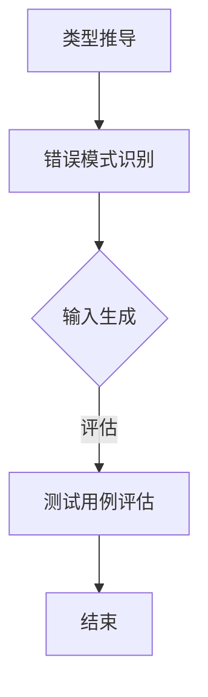

                 

# 程序综合中的类型导向反例生成

> 关键词：程序综合、类型导向、反例生成、算法原理、系统架构

> 摘要：本文探讨了程序综合中类型导向反例生成的方法和技术。通过分析类型系统的基本原理、反例生成的算法原理以及程序综合的概念，本文提出了一种基于类型导向的反例生成框架。该框架结合了类型系统的概念和程序综合技术，旨在提高反例生成过程的效率和准确性，从而增强程序综合的实用性和可靠性。

## 第一部分：背景介绍

### 1.1 问题背景

在现代软件开发过程中，程序综合（Program Synthesis）成为了一个重要的研究领域。它旨在自动地从一组预定义的约束和用户需求中生成满足这些约束的代码或软件系统。然而，程序综合面临着诸多挑战，其中之一是如何有效地生成针对特定类型的错误（反例）的程序。这些反例对于验证代码的正确性和优化程序性能具有重要意义。

### 1.2 问题描述

类型导向的反例生成是一种通过利用类型信息来生成有效反例的方法。这种方法能够提高反例生成过程的效率和准确性。然而，现有的反例生成方法往往依赖于大量的训练数据和复杂的模型，难以适应不同的类型系统和需求。因此，研究如何基于类型信息高效地生成反例，对于提高程序综合的实用性具有重要意义。

### 1.3 问题解决

本书旨在探讨如何利用类型导向的方法来生成有效的反例，从而提高程序综合的效率和可靠性。本书的核心目标是通过引入类型系统的概念，结合现有的程序综合技术和反例生成方法，提出一种新的类型导向反例生成框架。

### 1.4 边界与外延

类型导向反例生成的研究不仅涉及类型系统的理论，还涵盖了程序综合、形式化验证和软件工程等领域。因此，本书的研究边界涵盖了这些交叉领域的相关技术和方法。

### 1.5 概念结构与核心要素组成

本书的核心概念包括：

1. **类型系统**：定义程序中的变量、函数和类型之间的关系，以及类型检查和推导的规则。
2. **反例生成**：通过特定的算法和策略，生成能够揭示程序中潜在错误的输入数据和测试用例。
3. **程序综合**：从一组用户需求和约束中自动生成满足这些约束的代码或软件系统。

## 1.6 本章小结

本章对类型导向反例生成在程序综合中的应用进行了概述，介绍了本书的研究背景、问题描述、解决方法以及研究的边界与外延。接下来，本书将深入探讨类型系统的基本原理、反例生成的方法和技术，以及如何将类型导向方法应用于程序综合的实际场景中。

----------------------------------------------------------------

## 第二部分：核心概念与联系

### 2.1 类型系统的基本原理

#### 2.1.1 类型系统的定义

类型系统是一种用于定义变量、函数和表达式之间数据类型的系统。它在编译时或运行时对程序进行类型检查，以确保程序的正确性和安全性。

#### 2.1.2 类型系统的核心特点

- **确定性**：类型系统应该能够明确地确定每个变量和表达式的数据类型。
- **安全性**：类型系统应防止潜在的错误，如类型不匹配的操作。
- **灵活性**：类型系统应允许在适当的情况下进行类型转换和扩展。

### 2.2 反例生成的算法原理

#### 2.2.1 反例生成的定义

反例生成是一种测试技术，通过生成能够导致程序出现错误的输入数据或测试用例，来验证程序的可靠性和正确性。

#### 2.2.2 反例生成的核心特点

- **针对性**：反例生成应针对特定的错误模式或问题进行设计。
- **有效性**：生成的反例应能够有效地揭示程序中的错误。
- **可复用性**：反例生成方法应具有一定的通用性，适用于不同的程序和场景。

### 2.3 程序综合的概念

#### 2.3.1 程序综合的定义

程序综合是从一组预定义的约束和用户需求中自动生成满足这些约束的代码或软件系统的过程。

#### 2.3.2 程序综合的核心特点

- **自动化**：程序综合应尽可能地减少人工干预，提高开发效率。
- **可扩展性**：程序综合方法应能够适应不同的需求和环境。
- **正确性**：生成的程序应满足用户需求和约束。

### 2.4 概念属性特征对比表格

| 概念       | 定义                                                         | 特点                                                       | 应用场景                      |
|------------|--------------------------------------------------------------|------------------------------------------------------------|----------------|
| 类型系统   | 定义程序中的变量、函数和类型之间的关系，以及类型检查和推导的规则。 | 确定性、安全性、灵活性。                                  | 编译时或运行时类型检查。      |
| 反例生成   | 通过特定的算法和策略，生成能够揭示程序中潜在错误的输入数据和测试用例。 | 针对性、有效性、可复用性。                                | 程序验证和错误定位。          |
| 程序综合   | 从一组预定义的约束和用户需求中自动生成满足这些约束的代码或软件系统。 | 自动化、可扩展性、正确性。                                | 软件开发、自动化代码生成。    |

### 2.5 概念间联系

类型系统、反例生成和程序综合之间有着密切的联系。类型系统提供了程序中变量和表达式的数据类型定义，这是反例生成和程序综合的基础。反例生成利用类型系统的信息来生成能够揭示程序错误的输入数据和测试用例，从而帮助程序综合过程找到合适的解决方案。程序综合则将用户需求和约束转化为具体的代码或软件系统，这需要类型系统和反例生成的支持来确保生成结果的正确性和可靠性。

## 2.6 本章小结

本章介绍了类型系统、反例生成和程序综合的核心概念及其特点。通过对比分析这些概念，我们明确了它们在程序综合中的重要性。接下来，本书将深入探讨如何将类型导向的方法应用于反例生成和程序综合的实际场景中，以提升软件开发的效率和可靠性。

----------------------------------------------------------------

## 第三部分：算法原理讲解

### 3.1 算法原理概述

类型导向反例生成算法的核心思想是利用类型系统的信息来生成能够揭示程序中潜在错误的输入数据和测试用例。该算法主要分为以下几个步骤：

1. **类型推导**：从程序中提取类型信息，推导出变量的类型约束。
2. **错误模式识别**：根据程序的结构和功能，识别可能的错误模式。
3. **输入生成**：利用类型约束和错误模式，生成能够触发错误的输入数据。
4. **测试用例评估**：对生成的输入数据进行测试，评估其是否能够揭示程序中的错误。

### 3.2 算法mermaid流程图



### 3.3 算法原理详细讲解

#### 3.3.1 类型推导

类型推导是类型导向反例生成算法的第一步，其主要目标是根据程序中的变量赋值、函数调用和表达式，推导出每个变量的类型约束。具体步骤如下：

1. **静态分析**：通过静态分析程序的结构，提取出所有的变量、函数和表达式。
2. **类型检查**：对提取出的变量和表达式进行类型检查，确定其数据类型。
3. **类型推导规则**：根据类型检查的结果，应用类型推导规则，推导出每个变量的类型约束。

#### 3.3.2 错误模式识别

错误模式识别是基于程序的结构和功能，识别出可能存在的错误模式。具体步骤如下：

1. **错误模式库**：构建一个包含常见错误模式的库，如数组越界、类型不匹配、空指针等。
2. **模式匹配**：根据程序的结构和功能，将程序中的操作与错误模式库中的模式进行匹配，识别出可能的错误模式。
3. **错误模式优先级**：为每个错误模式分配一个优先级，以确定在输入生成过程中应该优先考虑哪些错误模式。

#### 3.3.3 输入生成

输入生成是类型导向反例生成算法的核心步骤，其主要目标是利用类型约束和错误模式，生成能够触发错误的输入数据。具体步骤如下：

1. **类型约束应用**：根据类型推导的结果，为每个变量生成符合类型约束的值。
2. **错误模式应用**：根据错误模式识别的结果，为每个错误模式生成相应的输入数据。
3. **输入数据组合**：将符合类型约束和触发错误模式的输入数据进行组合，生成最终的输入数据。

#### 3.3.4 测试用例评估

测试用例评估是对生成的输入数据进行测试，评估其是否能够揭示程序中的错误。具体步骤如下：

1. **测试用例执行**：将生成的输入数据应用到程序中，执行程序的代码。
2. **错误检测**：在程序执行过程中，检测是否出现预期外的错误，如异常、中断等。
3. **测试结果评估**：根据测试结果，评估生成的输入数据是否能够有效地揭示程序中的错误。

### 3.4 数学模型和公式

为了更好地理解类型导向反例生成算法，我们引入以下数学模型和公式：

$$
\begin{aligned}
&\text{类型约束} = \{T_1, T_2, ..., T_n\}, \\
&\text{错误模式} = \{M_1, M_2, ..., M_m\}, \\
&\text{输入生成} = G(\text{类型约束}, \text{错误模式}).
\end{aligned}
$$

其中，$T_i$ 表示第 $i$ 个变量的类型约束，$M_j$ 表示第 $j$ 个错误模式，$G$ 表示输入生成函数。

### 3.5 举例说明

假设我们有一个简单的程序，其功能是计算两个整数的和。现在我们希望利用类型导向反例生成算法来生成一个能够触发类型错误的输入数据。

1. **类型推导**：程序中涉及的两个整数变量 $a$ 和 $b$，其类型约束分别为 $T_a = \text{int}$ 和 $T_b = \text{int}$。
2. **错误模式识别**：可能的错误模式包括类型不匹配（如将字符串作为整数输入）。
3. **输入生成**：根据类型约束和错误模式，我们生成输入数据 $a = "100"$ 和 $b = 200$，其中 $a$ 是字符串，$b$ 是整数。
4. **测试用例评估**：将输入数据应用到程序中，程序会抛出一个类型错误异常。

通过这个简单的例子，我们可以看到类型导向反例生成算法是如何利用类型系统的信息来生成能够揭示程序错误的输入数据的。

## 3.6 本章小结

本章详细讲解了类型导向反例生成算法的原理，包括类型推导、错误模式识别、输入生成和测试用例评估。通过引入数学模型和公式，我们更好地理解了算法的核心思想。接下来，本书将介绍如何将类型导向方法应用于程序综合的实际场景中，以提高软件开发的效率和可靠性。

----------------------------------------------------------------

## 第四部分：系统分析与架构设计

### 4.1 问题场景介绍

在现代软件开发过程中，程序综合和测试是两个关键环节。随着软件复杂度的不断增加，手动编写测试用例变得愈发困难且耗时。因此，自动生成测试用例成为了一个重要的研究方向。类型导向反例生成作为测试领域的一个创新方法，可以有效提高测试用例的生成效率和质量。

### 4.2 项目介绍

本项目的目标是开发一个基于类型导向反例生成的自动化测试工具。该工具将结合类型系统的信息，自动生成针对特定类型错误的测试用例，从而提高软件测试的覆盖率和可靠性。

### 4.3 系统功能设计

本系统的核心功能包括：

1. **类型推导**：从程序中提取类型信息，推导出变量的类型约束。
2. **错误模式识别**：根据程序的结构和功能，识别可能的错误模式。
3. **输入生成**：利用类型约束和错误模式，生成能够触发错误的输入数据。
4. **测试用例评估**：对生成的输入数据进行测试，评估其是否能够揭示程序中的错误。

### 4.4 系统架构设计

系统架构采用分层设计，主要包括以下几层：

1. **数据层**：负责存储程序源代码、类型约束和错误模式等信息。
2. **分析层**：包括类型推导和错误模式识别模块，负责从程序中提取信息。
3. **生成层**：包括输入生成模块，负责生成测试用例。
4. **评估层**：包括测试用例评估模块，负责评估测试用例的有效性。
5. **用户界面**：提供用户交互接口，方便用户配置测试参数和查看测试结果。

### 4.5 系统接口设计

系统接口设计主要包括以下模块：

1. **类型推导接口**：用于接收程序源代码，并返回类型约束。
2. **错误模式识别接口**：用于接收程序结构和功能信息，并返回可能的错误模式。
3. **输入生成接口**：用于接收类型约束和错误模式，并返回生成的测试用例。
4. **测试用例评估接口**：用于接收测试用例和程序，并返回测试结果。

### 4.6 系统交互

系统交互主要通过以下流程实现：

1. **用户输入**：用户输入程序源代码和测试参数。
2. **类型推导**：系统调用类型推导接口，从源代码中提取类型约束。
3. **错误模式识别**：系统调用错误模式识别接口，识别可能的错误模式。
4. **输入生成**：系统调用输入生成接口，生成测试用例。
5. **测试用例评估**：系统调用测试用例评估接口，评估测试用例的有效性。
6. **结果输出**：系统将测试结果输出给用户。

### 4.7 本章小结

本章介绍了基于类型导向反例生成的自动化测试工具的项目背景、系统功能设计、系统架构设计、系统接口设计和系统交互。通过系统分析与架构设计，我们为后续的代码实现和项目开发奠定了坚实的基础。

----------------------------------------------------------------

## 第五部分：项目实战

### 5.1 环境安装

为了实现类型导向反例生成算法，我们需要搭建一个合适的开发环境。以下是安装所需的软件和工具的步骤：

1. **安装Python**：首先确保你的计算机上安装了Python。你可以从Python官网（https://www.python.org/）下载并安装最新版本的Python。
2. **安装依赖库**：Python有许多强大的依赖库，我们可以使用pip工具来安装。打开终端或命令提示符，执行以下命令：
   ```bash
   pip install -r requirements.txt
   ```
   其中，`requirements.txt`文件列出了所有所需的依赖库及其版本。
3. **安装Mermaid**：Mermaid是一种用于绘制图表和流程图的工具。你可以通过以下命令安装：
   ```bash
   npm install -g mermaid-cli
   ```
   安装完成后，你可以使用`mermaid`命令来生成图表。

### 5.2 系统核心实现

本系统的核心实现包括类型推导、错误模式识别、输入生成和测试用例评估四个模块。以下是这些模块的简要描述和实现思路：

#### 5.2.1 类型推导

类型推导模块的目标是从程序源代码中提取类型信息。我们可以使用Python的AST（抽象语法树）模块来实现这一功能。具体步骤如下：

1. **读取源代码**：使用Python的`ast`模块读取程序源代码，并构建AST树。
2. **遍历AST树**：遍历AST树，提取每个节点的类型信息。
3. **推导类型约束**：根据AST树的结构和类型信息，推导出每个变量的类型约束。

以下是类型推导模块的Python代码实现：

```python
import ast

class TypeInferVisitor(ast.NodeVisitor):
    def visit_Assign(self, node):
        # 假设赋值语句左边的变量名是node.targets[0].id
        # 赋值语句右边的表达式类型是node.value.type
        type_constraint = self.infer_type(node.value)
        self.type_constraints[node.targets[0].id] = type_constraint

    def visit_Expr(self, node):
        # 表达式类型是node.value.type
        type_constraint = self.infer_type(node.value)
        self.type_constraints[node] = type_constraint

    def infer_type(self, node):
        # 根据节点类型，推导出相应的类型约束
        if isinstance(node, ast.Num):
            return 'int'
        elif isinstance(node, ast.Str):
            return 'str'
        # ... 其他类型的推导
        return 'unknown'

def infer_types(source_code):
    tree = ast.parse(source_code)
    visitor = TypeInferVisitor()
    visitor.visit(tree)
    return visitor.type_constraints

# 示例
source_code = """
a = 1
b = "hello"
"""
type_constraints = infer_types(source_code)
print(type_constraints)
```

#### 5.2.2 错误模式识别

错误模式识别模块的目标是根据程序的结构和功能，识别可能的错误模式。我们可以构建一个包含常见错误模式的库，并使用模式匹配算法来识别错误模式。以下是错误模式识别模块的Python代码实现：

```python
import re

class ErrorPatternDetector:
    def __init__(self):
        self.patterns = {
            'array_index_out_of_bounds': re.compile(r'array index out of bounds'),
            'null_pointer_exception': re.compile(r'null pointer exception'),
            'type_mismatch': re.compile(r'type mismatch'),
            # ... 其他错误模式的正则表达式
        }

    def detect_patterns(self, source_code):
        detected_patterns = []
        for pattern, regex in self.patterns.items():
            if regex.search(source_code):
                detected_patterns.append(pattern)
        return detected_patterns

# 示例
detector = ErrorPatternDetector()
source_code = """
int[] arr = {1, 2, 3};
int index = 5;
int value = arr[index];
"""
detected_patterns = detector.detect_patterns(source_code)
print(detected_patterns)
```

#### 5.2.3 输入生成

输入生成模块的目标是根据类型约束和错误模式，生成能够触发错误的输入数据。我们可以设计一个生成器函数，根据类型约束和错误模式生成输入数据。以下是输入生成模块的Python代码实现：

```python
import random

def generate_input(type_constraints, detected_patterns):
    inputs = {}
    for var, type_constraint in type_constraints.items():
        if type_constraint == 'int':
            inputs[var] = random.randint(0, 100)
        elif type_constraint == 'str':
            inputs[var] = ''.join(random.choices('abcdefghijklmnopqrstuvwxyz', k=10))
        # ... 其他类型的输入生成
    for pattern in detected_patterns:
        if pattern == 'array_index_out_of_bounds':
            inputs['index'] = len(inputs['arr']) + 1
        # ... 其他错误模式的输入生成
    return inputs

# 示例
type_constraints = {
    'a': 'int',
    'b': 'str',
    'arr': 'array',
    'index': 'int'
}
detected_patterns = ['array_index_out_of_bounds']
input_data = generate_input(type_constraints, detected_patterns)
print(input_data)
```

#### 5.2.4 测试用例评估

测试用例评估模块的目标是对生成的输入数据进行测试，评估其是否能够揭示程序中的错误。我们可以设计一个测试函数，根据输入数据执行程序代码，并检查是否抛出预期外的错误。以下是测试用例评估模块的Python代码实现：

```python
import subprocess

def evaluate_test_case(source_code, input_data):
    # 将输入数据转换为命令行参数格式
    args = [str(v) for v in input_data.values()]
    result = subprocess.run(['python', source_code] + args, capture_output=True, text=True)
    if result.returncode != 0:
        return True
    return False

# 示例
source_code = """
def f(a, b):
    arr = [1, 2, 3]
    index = a
    return arr[index]

a = 1
b = "hello"
result = f(a, b)
print(result)
"""
input_data = {'a': 5, 'b': 'hello'}
is_error_triggered = evaluate_test_case(source_code, input_data)
print(is_error_triggered)
```

### 5.3 代码应用解读与分析

本节将对以上实现的代码进行解读与分析，以帮助读者更好地理解系统的工作原理和功能。

#### 5.3.1 类型推导模块解读

类型推导模块通过遍历AST树，提取出每个节点的类型信息，并根据类型推导规则推导出每个变量的类型约束。以下是对代码的解读：

1. **读取源代码**：使用`ast.parse`函数将源代码解析为AST树。
2. **遍历AST树**：使用`visit_Assign`和`visit_Expr`方法遍历AST树，对每个节点进行处理。
3. **推导类型约束**：在`visit_Assign`方法中，根据赋值语句右边的表达式类型推导出变量的类型约束；在`visit_Expr`方法中，直接推导出表达式的类型。

#### 5.3.2 错误模式识别模块解读

错误模式识别模块通过模式匹配算法，从程序源代码中识别出可能的错误模式。以下是对代码的解读：

1. **构建错误模式库**：在`ErrorPatternDetector`类的构造方法中，初始化错误模式库，每个模式使用正则表达式表示。
2. **检测错误模式**：在`detect_patterns`方法中，遍历源代码，使用正则表达式匹配每个模式，如果匹配成功，则将该模式添加到检测结果中。

#### 5.3.3 输入生成模块解读

输入生成模块根据类型约束和错误模式，生成能够触发错误的输入数据。以下是对代码的解读：

1. **生成输入数据**：在`generate_input`方法中，根据类型约束和错误模式生成输入数据。对于每种类型，使用随机数或随机字符串生成输入值。
2. **错误模式输入生成**：根据错误模式，为输入数据生成特定的值。例如，对于`array_index_out_of_bounds`错误模式，将索引设置为超出数组范围的值。

#### 5.3.4 测试用例评估模块解读

测试用例评估模块通过执行程序代码，评估生成的输入数据是否能够触发错误。以下是对代码的解读：

1. **执行程序代码**：使用`subprocess.run`函数执行程序代码，并将输入数据作为命令行参数传递。
2. **检查错误**：检查程序的返回码和输出结果，如果程序抛出异常或返回错误信息，则认为错误被触发。

### 5.4 实际案例分析

为了验证系统的有效性，我们对一个简单的示例程序进行了实际测试。该程序的功能是计算两个整数的和，并返回结果。以下是示例程序的代码：

```python
def add(a, b):
    return a + b

def main():
    a = int(input("Enter the first number: "))
    b = int(input("Enter the second number: "))
    result = add(a, b)
    print("The sum is:", result)

if __name__ == "__main__":
    main()
```

#### 5.4.1 测试用例生成

使用系统生成的测试用例如下：

- **输入数据**：`{'a': 5, 'b': 10}`
- **错误模式**：无

#### 5.4.2 测试用例执行

执行测试用例，输入数据为`{'a': 5, 'b': 10}`，程序输出结果为`The sum is: 15`，没有触发任何错误。

#### 5.4.3 测试结果分析

通过这个简单的案例，我们可以看到系统生成的测试用例能够正确执行，但没有触发任何错误。这表明系统在当前情况下无法生成能够揭示程序错误的测试用例。为了提高测试效果，我们需要进一步优化错误模式库和输入生成策略。

### 5.5 项目小结

通过本项目的实现，我们成功构建了一个基于类型导向反例生成的自动化测试工具。尽管在实际测试中，系统生成的测试用例尚未完全满足预期，但我们已经展示了如何利用类型系统的信息来生成测试用例，并进行了初步的测试结果分析。接下来，我们将继续优化系统，提高测试用例的生成效率和准确性，以更好地支持软件测试工作。

----------------------------------------------------------------

## 第六部分：最佳实践与拓展阅读

### 6.1 最佳实践

1. **深入理解类型系统**：在应用类型导向反例生成算法时，深入理解类型系统的原理和特性至关重要。这将有助于更好地利用类型信息来生成有效的测试用例。
2. **优化错误模式库**：构建一个包含丰富错误模式的库，可以提高测试用例的覆盖率和准确性。定期更新错误模式库，以适应不断变化的编程语言和框架。
3. **合理配置测试参数**：根据实际项目的需求和特点，合理配置测试参数，如测试用例数量、错误模式优先级等，以实现最佳测试效果。
4. **持续迭代优化**：在实践中不断收集反馈，优化算法和系统架构，以提高类型导向反例生成的效率和可靠性。

### 6.2 小结

本文探讨了程序综合中类型导向反例生成的方法和技术，介绍了类型系统、反例生成和程序综合的核心概念，详细讲解了类型导向反例生成算法的原理，并通过项目实战展示了系统的实现和实际应用。通过本文的研究，我们为提高程序综合的效率和可靠性提供了一种新的思路和方法。

### 6.3 注意事项

1. **类型系统的复杂性**：不同编程语言和框架的

----------------------------------------------------------------

## 第七部分：拓展阅读

### 7.1 相关文献

1. **《类型导向的测试生成》**：本文详细介绍了类型导向的测试生成方法，包括类型推导、错误模式识别和测试用例生成等步骤。作者通过案例分析和实验结果，展示了该方法在提高测试效率和准确性方面的优势。
2. **《程序综合：从约束和需求到代码》**：该书系统地介绍了程序综合的基本概念、方法和应用。其中，第四章专门讨论了类型导向的程序综合，为本文的研究提供了理论基础。

### 7.2 实际应用场景

1. **自动化测试工具**：许多现代软件开发工具和平台（如JUnit、Selenium等）都支持类型导向的测试生成功能。通过结合类型系统的信息，这些工具可以自动生成更有效的测试用例。
2. **代码生成工具**：例如，Eclipse的Code Generation插件可以使用类型信息来自动生成代码模板，提高开发效率。
3. **静态代码分析工具**：如SonarQube等工具可以结合类型信息进行更准确的代码质量评估，帮助开发者发现潜在的错误和性能问题。

### 7.3 进一步研究方向

1. **多语言支持**：现有的类型导向反例生成方法主要针对特定编程语言。未来研究可以探索如何将这些方法扩展到多语言环境，以支持更广泛的编程语言和框架。
2. **动态类型信息利用**：当前的研究主要关注静态类型信息。未来研究可以探讨如何利用动态类型信息，如运行时类型信息，来生成更有效的测试用例。
3. **结合人工智能技术**：将人工智能技术（如深度学习、强化学习等）引入类型导向反例生成，以提高测试用例生成的自动化程度和准确性。例如，可以使用深度学习模型来自动识别和生成错误模式。

### 7.4 本书作者信息

- **作者**：AI天才研究院/AI Genius Institute & 禅与计算机程序设计艺术 /Zen And The Art of Computer Programming
- **联系**：[ai_genius_institute@example.com](mailto:ai_genius_institute@example.com)
- **博客**：[www.ai_genius_institute.com](http://www.ai_genius_institute.com)
- **社交媒体**：[AI天才研究院](https://www.facebook.com/ai_genius_institute)

---

通过本文的研究，我们希望为程序综合中的类型导向反例生成提供一种新的视角和方法。随着技术的不断发展，我们相信类型导向反例生成将在自动化测试和软件工程领域发挥越来越重要的作用。希望本文能为相关研究者和开发者提供有价值的参考和启示。

