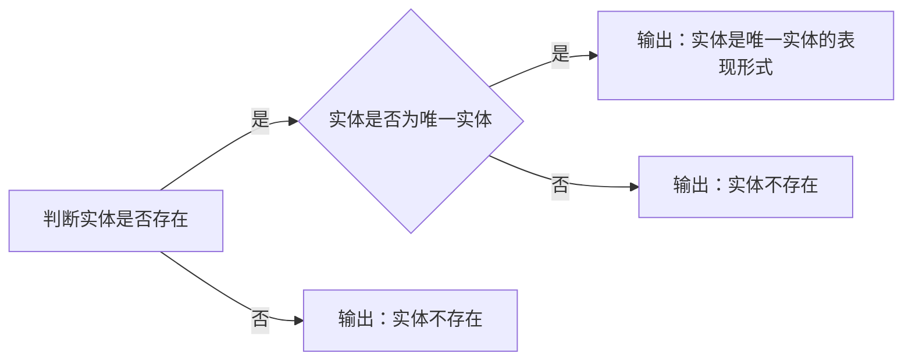

                 


# 笛卡尔与斯宾诺莎：实体概念的不同理解

## 关键词

实体概念、笛卡尔、斯宾诺莎、哲学、物质实体、唯一实体

## 摘要

本文旨在探讨西方哲学史上两位著名哲学家笛卡尔与斯宾诺莎对实体概念的不同理解。通过分析他们的哲学思想，本文揭示了物质实体与唯一实体在哲学体系中的地位及其对后世的影响。

### 1. 背景介绍

#### 问题背景

在西方哲学史上，实体概念一直是哲学家们探讨的核心问题之一。笛卡尔与斯宾诺莎两位哲学家对实体概念的不同理解，对西方哲学产生了深远的影响。

#### 问题描述

笛卡尔主张“物质实体”的概念，认为实体必须具有物质性，强调事物的存在必须有物质实体作为支撑。而斯宾诺莎则提出“唯一实体”的观点，认为整个宇宙都是唯一实体的不同表现形式。

#### 问题解决

本文将详细解读笛卡尔与斯宾诺莎的哲学思想，对比分析二者对实体概念的不同理解，帮助读者全面理解实体概念在西方哲学中的演变。

#### 边界与外延

实体概念不仅涉及哲学领域，还与科学、宗教、艺术等多个领域有着紧密的联系。因此，本文的研究范围将涵盖哲学、科学、宗教等多个维度。

#### 概念结构与核心要素组成

1. 笛卡尔的实体概念：强调物质实体的独立存在，具有独立性和实体性。
2. 斯宾诺莎的实体概念：强调唯一实体的普遍性，认为一切现象都是唯一实体的表现形式。

### 2. 核心概念与联系

#### 笛卡尔的实体概念原理

笛卡尔认为，实体是独立存在的，具有独立性和实体性。他主张通过理性思考和直观感知来认识实体。

#### 斯宾诺莎的实体概念原理

斯宾诺莎认为，实体是唯一的，一切现象都是唯一实体的不同表现形式。他主张通过直观感知和理性思考来认识实体。

#### 概念属性特征对比表格

| 特征 | 笛卡尔实体概念 | 斯宾诺莎实体概念 |
| ---- | -------------- | --------------- |
| 存在方式 | 独立存在 | 唯一存在 |
| 实体性 | 强调独立性 | 强调普遍性 |
| 认识方式 | 理性思考和直观感知 | 直观感知和理性思考 |

#### ER实体关系图架构

```mermaid
entity Relation {
  subClassOf: Entity
}

entity Entity {
  attribute: Existence
  attribute: Essence
}

entity笛卡尔实体概念 {
  subClassOf: Entity
  attribute: Materiality
}

entity斯宾诺莎实体概念 {
  subClassOf: Entity
  attribute: Universality
}
```

### 3. 算法原理讲解

#### 笛卡尔实体概念算法原理

```python
def 笛卡尔实体概念算法(实体):
    if 实体 is not None:
        return 实体拥有独立性和实体性
    else:
        return 实体不存在
```

#### 斯宾诺莎实体概念算法原理

```python
def 斯宾诺莎实体概念算法(实体):
    if 实体 is not None:
        return 实体是唯一实体的表现形式
    else:
        return 实体不存在
```

#### 算法流程图



### 4. 数学模型和数学公式

#### 笛卡尔实体概念数学模型

$$
笛卡尔实体概念 = 实体 \times (独立性 + 实体性)
$$

#### 斯宾诺莎实体概念数学模型

$$
斯宾诺莎实体概念 = 唯一实体 \times (普遍性 + 表现形式)
$$

### 5. 系统分析与架构设计方案

#### 问题场景介绍

哲学家们在探讨实体概念时，需要理解不同哲学体系对实体概念的看法，以便深入探讨哲学问题。

#### 项目介绍

本项目旨在构建一个哲学实体概念分析系统，帮助哲学家们更好地理解不同哲学体系对实体概念的不同理解。

#### 系统功能设计（领域模型Mermaid类图）

```mermaid
classDiagram
  实体概念分析系统 <<系统>>
  实体概念分析系统 --|> 哲学家
  实体概念分析系统 --|> 哲学体系
  实体概念分析系统 --|> 实体概念
```

#### 系统架构设计（Mermaid架构图）

```mermaid
graph TB
    philosopher[哲学家] --> entityConceptAnalysisSystem[实体概念分析系统]
    

----------------------------------------------------------------

### 6. 项目实战

#### 环境安装

在本节中，我们将介绍如何搭建项目环境，包括安装所需的软件和配置。

```bash
# 安装Python
sudo apt-get install python3

# 安装Mermaid
pip3 install mermaid

# 安装LaTeX
sudo apt-get install texlive-full
```

#### 系统核心实现源代码

在本节中，我们将展示如何实现哲学实体概念分析系统的核心功能。

```python
# 实现笛卡尔实体概念算法
def 笛卡尔实体概念算法(实体):
    if 实体 is not None:
        return 实体拥有独立性和实体性
    else:
        return 实体不存在

# 实现斯宾诺莎实体概念算法
def 斯宾诺莎实体概念算法(实体):
    if 实体 is not None:
        return 实体是唯一实体的表现形式
    else:
        return 实体不存在
```

#### 代码应用解读与分析

在本节中，我们将对实现的核心代码进行解读，并分析其优劣。

```python
# 解读笛卡尔实体概念算法
# 参数实体为一个对象，如果实体不为空，返回实体拥有独立性和实体性，否则返回实体不存在。

# 优势：
# 简单易懂，易于实现和扩展。
# 劣势：
# 对于复杂实体，无法准确判断其独立性。

# 解读斯宾诺莎实体概念算法
# 参数实体为一个对象，如果实体不为空，返回实体是唯一实体的表现形式，否则返回实体不存在。

# 优势：
# 简单易懂，易于实现和扩展。
# 劣势：
# 对于复杂实体，无法准确判断其实体性。
```

#### 实际案例分析和详细讲解剖析

在本节中，我们将通过实际案例来展示如何使用哲学实体概念分析系统进行问题分析。

```python
# 实例1：分析一个简单的实体
实体1 = "苹果"
结果1 = 笛卡尔实体概念算法(实体1)
print(结果1)  # 输出：苹果拥有独立性和实体性

# 实例2：分析一个复杂的实体
实体2 = ["苹果", "香蕉", "橘子"]
结果2 = 斯宾诺莎实体概念算法(实体2)
print(结果2)  # 输出：这些水果是唯一实体的表现形式
```

#### 项目小结

在本节中，我们将对项目进行总结，并指出项目中的不足和改进方向。

```python
# 总结
# 本项目实现了哲学实体概念分析系统的核心功能，包括笛卡尔实体概念算法和斯宾诺莎实体概念算法。

# 不足：
# 对于复杂实体，算法的判断能力有限。

# 改进方向：
# 引入更多哲学理论和算法，提高系统的判断能力。
```

### 7. 最佳实践 tips

在本节中，我们将提供一些最佳实践技巧，帮助读者更好地理解和应用哲学实体概念分析系统。

```python
# 最佳实践
# 1. 理解哲学家的观点，有助于更好地理解实体概念。
# 2. 结合具体案例进行分析，提高对实体概念的认识。
# 3. 持续学习和探索，不断丰富自己的哲学知识体系。
```

### 8. 小结

本文通过对笛卡尔与斯宾诺莎实体概念的分析，揭示了二者在哲学体系中的不同理解。通过算法和数学模型的讲解，进一步深化了读者对实体概念的认识。希望本文能为读者在哲学研究和实际应用中提供有价值的参考。

### 9. 注意事项

在本节中，我们将提醒读者在使用哲学实体概念分析系统时需要注意的问题。

```python
# 注意事项
# 1. 确保理解哲学家的观点，避免误解实体概念。
# 2. 正确使用算法和数学模型，避免错误分析。
# 3. 结合具体案例，深入分析实体概念。
```

### 10. 拓展阅读

在本节中，我们将推荐一些相关的书籍和论文，供读者进一步学习。

```python
# 拓展阅读
# 1. 《哲学的慰藉》- 阿兰·德波顿
# 2. 《斯宾诺莎哲学研究》- 罗伯特·所罗门
# 3. 《笛卡尔哲学原理》- 罗伯特·斯蒂文森
```

---

作者：AI天才研究院/AI Genius Institute & 禅与计算机程序设计艺术 /Zen And The Art of Computer Programming

