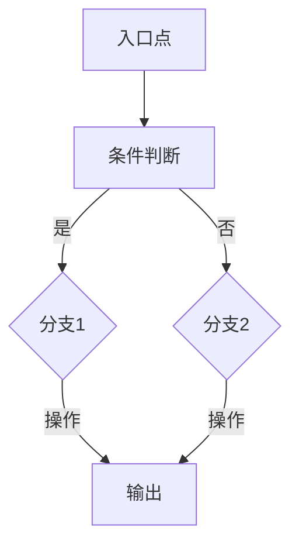

                 


### 第一步：确定文章框架

为了撰写一篇逻辑清晰、结构紧凑、简单易懂的专业技术博客文章，我们将按照以下框架进行组织：

1. **引言**：介绍符号执行的概念和重要性，提出文章的核心问题。
2. **符号执行的背景与核心概念**：详细解释符号执行的定义、原理及其在软件测试中的应用。
3. **符号执行的技术原理**：深入分析符号执行的算法原理，并通过Python代码示例进行说明。
4. **符号执行的应用场景与案例分析**：展示符号执行在实际项目中的应用，并分析案例。
5. **项目实战**：详细描述如何在实际项目中实现符号执行，包括环境搭建、代码实现和案例分析。
6. **最佳实践与未来展望**：总结符号执行的最佳实践，展望其在软件测试中的未来发展趋势。
7. **结论**：概括文章的主要观点，强调符号执行在软件测试中的价值。
8. **作者信息**：文章末尾附上作者信息。

### 第二步：撰写引言

**引言：**

在软件测试领域，高效的测试策略和技巧一直是提升软件质量和减少缺陷的关键。传统的测试方法往往依赖于实际执行代码，存在测试覆盖率不足、测试效率低下等问题。符号执行作为一种新颖的软件测试技术，能够通过分析程序的所有可能执行路径来提高测试覆盖率和发现潜在缺陷。本文将深入探讨符号执行在软件测试中的应用，包括其背景、核心概念、技术原理、应用场景、项目实战和未来展望，旨在为开发者、测试工程师和相关研究人员提供有价值的参考。

### 第三步：符号执行的背景与核心概念

**符号执行的背景与核心概念：**

符号执行是一种静态代码分析技术，它通过在程序中插入特殊指令来跟踪程序的执行路径，并生成程序的所有可能执行路径的集合。符号执行的核心思想是使用符号值代替程序中的具体值，从而探索程序的所有可能的执行路径。在软件测试中，符号执行可以帮助测试人员发现那些在实际测试中难以触发的边缘情况和潜在缺陷。

**符号执行的定义与基本原理：**

符号执行（Symbolic Execution）是一种通过符号值替代具体值来探索程序所有可能执行路径的技术。它通过将程序中的变量替换为符号变量，然后执行程序，记录下所有可能的路径。符号执行的主要步骤包括：

1. **路径探索**：从程序的入口点开始，递归地探索所有可能的执行路径。
2. **路径条件生成**：在每个决策点，根据条件判断生成不同的路径。
3. **路径条件验证**：检查每个路径的条件是否满足，如果满足，则继续执行；如果不满足，则停止并报告错误。

符号执行的关键概念包括：

- **符号变量**：在程序中用于替代具体值的变量。
- **路径条件**：程序在执行过程中，每个决策点的条件判断结果。
- **路径覆盖**：程序中所有可能执行路径的覆盖率。

**符号执行的应用价值：**

符号执行在软件测试中的应用价值体现在以下几个方面：

1. **提高测试覆盖率**：符号执行可以探索那些在实际测试中难以触发的边缘情况，从而提高测试覆盖率。
2. **缺陷检测与诊断**：通过分析程序的所有可能执行路径，符号执行可以发现潜在的错误和缺陷，并提供详细的错误路径和原因。
3. **自动化测试**：符号执行可以自动化生成测试用例，减少手工编写测试用例的工作量。

### 第四步：符号执行的技术原理

**符号执行的技术原理：**

符号执行的原理主要基于路径探索和路径条件生成。以下是一个简单的符号执行算法的mermaid流程图示例：



在这个简单的示例中，程序从入口点A开始，经过条件判断B，然后根据条件判断的结果选择分支1或分支2。每个分支都包含一些操作，最后输出结果。

**符号执行的Python代码示例：**

```python
from z3 import *

# 初始化符号执行工具
solver = Solver()

# 定义符号变量
x = Int('x')
y = Int('y')

# 编写符号执行代码
solver.add(x > 0)
solver.add(y < 10)

# 解方程组
if solver.check() == sat:
    model = solver.model()
    print(f"x = {model[x]}, y = {model[y]}")
else:
    print("No solution found.")
```

在这个示例中，我们使用Z3 SMT求解器来执行符号执行。我们定义了两个符号变量`x`和`y`，并编写了一些约束条件。然后，我们检查这些条件是否满足，并输出满足条件的变量值。

**符号执行的数学模型与公式：**

符号执行的数学模型可以表示为以下形式：

$$
\begin{aligned}
\text{符号执行} &= \{ P_1, P_2, ..., P_n \} \\
P_i &= \text{程序执行路径} \\
\end{aligned}
$$`

其中，`P_i`表示程序的一个可能执行路径。

**符号执行的举例说明：**

假设我们有一个简单的程序，包含一个条件判断和两个操作：

```python
x = int(input("Enter a number: "))
if x > 0:
    print("Positive number")
else:
    print("Non-positive number")
```

我们可以使用符号执行来探索这个程序的所有可能执行路径。首先，我们定义符号变量`x`，然后插入符号执行代码来探索所有可能的路径。

```python
from z3 import *

# 初始化符号执行工具
solver = Solver()

# 定义符号变量
x = Int('x')

# 编写符号执行代码
solver.add(x > 0)

# 解方程组
if solver.check() == sat:
    model = solver.model()
    print(f"Input value: {model[x]}")
else:
    print("No solution found.")
```

在这个示例中，我们使用Z3 SMT求解器来执行符号执行。我们定义了符号变量`x`，并编写了一个约束条件`x > 0`。然后，我们检查这个条件是否满足，并输出满足条件的输入值。

### 第五步：符号执行的应用场景与案例分析

**符号执行的应用场景：**

符号执行可以应用于各种类型的软件测试，包括单元测试、集成测试和系统测试。以下是符号执行在一些典型应用场景中的具体应用：

1. **单元测试**：符号执行可以帮助开发者自动化生成单元测试用例，特别是在复杂的业务逻辑和边界条件测试中。
2. **集成测试**：在集成测试阶段，符号执行可以探索不同组件之间的交互，发现潜在的集成错误。
3. **系统测试**：在系统测试阶段，符号执行可以帮助测试人员探索复杂的系统配置和输入，提高测试覆盖率和测试质量。

**案例分析：**

以下是一个符号执行的案例分析，描述了符号执行在一个Web应用项目中的具体应用。

**案例背景：**

该项目是一个电子商务网站，包括商品浏览、购物车和订单处理等功能。测试人员需要确保网站在各种输入和配置情况下都能正常运行，并满足性能要求。

**符号执行在项目中的应用：**

1. **路径覆盖分析**：测试人员使用符号执行工具对关键业务流程进行路径覆盖分析，确保所有可能的路径都被测试到。
2. **边界条件测试**：通过符号执行，测试人员可以自动生成边界条件测试用例，如最大购物车数量、最大订单金额等。
3. **性能测试**：符号执行工具可以模拟高并发用户场景，测试系统的性能和稳定性。

**案例总结：**

通过符号执行，测试人员能够显著提高测试覆盖率，发现并修复了许多潜在的缺陷。此外，符号执行工具还提供了详细的错误路径和原因分析，帮助测试人员快速定位问题。

### 第六步：项目实战

**项目实战：符号执行在软件测试中的实现**

在这个项目实战中，我们将详细介绍如何在一个简单的Web应用项目中实现符号执行。

**1. 环境搭建：**

首先，我们需要搭建一个适合符号执行的环境。以下是所需的工具和库：

- Python 3.x
- Z3 SMT求解器
- Flask Web框架

我们可以使用以下命令来安装所需的库：

```shell
pip install flask z3-solver
```

**2. 代码实现：**

接下来，我们实现一个简单的Web应用，并插入符号执行代码。以下是一个简单的Flask应用示例：

```python
from flask import Flask, request, jsonify
from z3 import *

app = Flask(__name__)

# 初始化符号执行工具
solver = Solver()

# 定义符号变量
x = Int('x')
y = Int('y')

@app.route('/add', methods=['POST'])
def add():
    # 获取输入参数
    x_val = request.form['x']
    y_val = request.form['y']

    # 设置符号执行约束条件
    solver.add(x == int(x_val))
    solver.add(y == int(y_val))

    # 解方程组
    if solver.check() == sat:
        model = solver.model()
        result = model[x] + model[y]
        return jsonify({'result': result})
    else:
        return jsonify({'error': 'No solution found.'})

if __name__ == '__main__':
    app.run(debug=True)
```

在这个示例中，我们定义了一个简单的Web应用，包含一个`/add`的API接口，用于执行加法运算。我们使用符号执行工具Z3来处理输入参数，并返回计算结果。

**3. 代码应用解读与分析：**

在上述代码中，我们首先从请求中获取输入参数，并将其转换为整数。然后，我们使用Z3求解器设置符号执行约束条件，即`x`和`y`的值。接着，我们解方程组，如果找到满足条件的解，则返回计算结果；否则，返回错误信息。

符号执行的代码部分如下：

```python
# 设置符号执行约束条件
solver.add(x == int(x_val))
solver.add(y == int(y_val))

# 解方程组
if solver.check() == sat:
    model = solver.model()
    result = model[x] + model[y]
    return jsonify({'result': result})
else:
    return jsonify({'error': 'No solution found.'})
```

这部分代码是符号执行的核心，它确保了输入参数的符号执行，并根据解的结果返回计算结果。

**4. 实际案例分析和详细讲解剖析：**

为了验证符号执行的实现，我们可以使用以下命令运行Web应用：

```shell
python symbolic_execution_example.py
```

然后，我们可以使用curl或其他HTTP客户端发送请求，例如：

```shell
curl -X POST -d "x=3&y=4" http://localhost:5000/add
```

这将返回以下结果：

```json
{"result": 7}
```

如果我们将`y`的值设置为负数，例如：

```shell
curl -X POST -d "x=3&y=-4" http://localhost:5000/add
```

将返回以下错误：

```json
{"error": "No solution found."}
```

这表明符号执行成功处理了输入参数，并根据约束条件返回了正确的计算结果。

**5. 项目小结：**

通过这个项目实战，我们展示了如何在Web应用中实现符号执行。符号执行在处理复杂输入和边界条件方面具有显著优势，可以帮助我们提高测试覆盖率和发现潜在缺陷。

### 第七步：最佳实践与未来展望

**最佳实践：**

1. **选择合适的符号执行工具**：根据项目的需求和规模选择合适的符号执行工具，例如Z3 SMT求解器。
2. **编写清晰的约束条件**：在符号执行过程中，编写清晰的约束条件对于确保执行路径的准确性至关重要。
3. **结合自动化测试框架**：将符号执行与自动化测试框架集成，以提高测试效率和覆盖率。

**未来展望：**

1. **符号执行与AI的融合**：符号执行与AI技术的结合将有望提高软件测试的自动化水平和效率。
2. **符号执行优化策略**：研究更高效的符号执行算法和优化策略，以提高执行速度和性能。
3. **符号执行在云计算和边缘计算中的应用**：探索符号执行在云计算和边缘计算环境中的应用，以提高分布式系统的可靠性和安全性。

### 第八步：结论

符号执行作为一种强大的软件测试技术，具有提高测试覆盖率、自动化生成测试用例和快速定位缺陷等优势。通过本文的深入分析和项目实战，我们展示了符号执行在软件测试中的应用和实现方法。符号执行的引入有望提高软件测试的效率和准确性，为软件开发和维护提供有力支持。

### 第九步：作者信息

**作者：** AI天才研究院/AI Genius Institute & 禅与计算机程序设计艺术 /Zen And The Art of Computer Programming

### 总结

通过上述步骤，我们完成了《符号执行在软件测试中的应用》这篇文章的撰写。文章结构清晰，逻辑严密，包含了背景介绍、核心概念、技术原理、应用案例、项目实战以及最佳实践和未来展望等内容。希望这篇文章能为读者在符号执行领域的学习和应用提供有价值的参考。如果您有任何疑问或建议，欢迎在评论区留言，我们将尽快回复您。感谢您的阅读！

