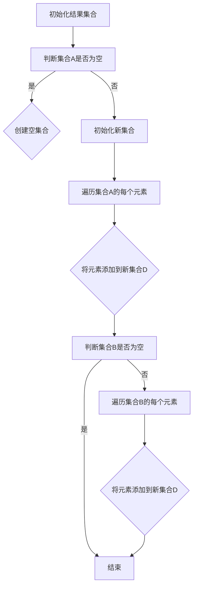
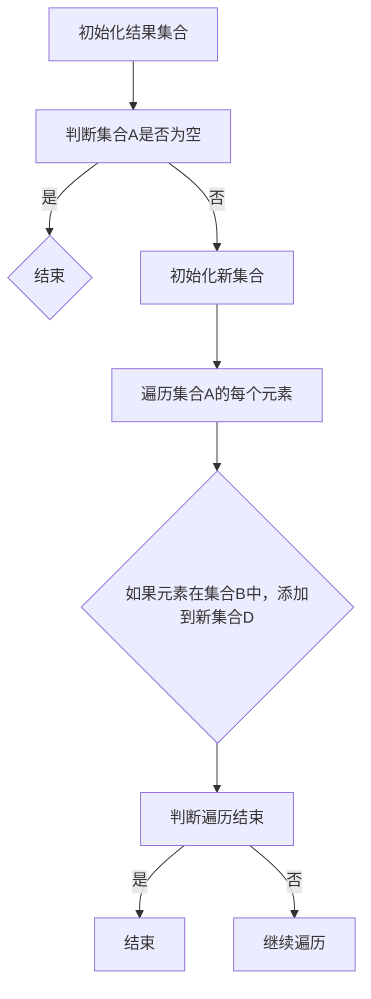
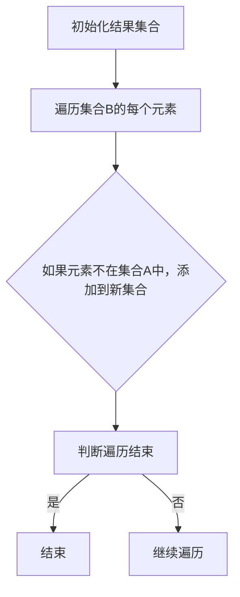
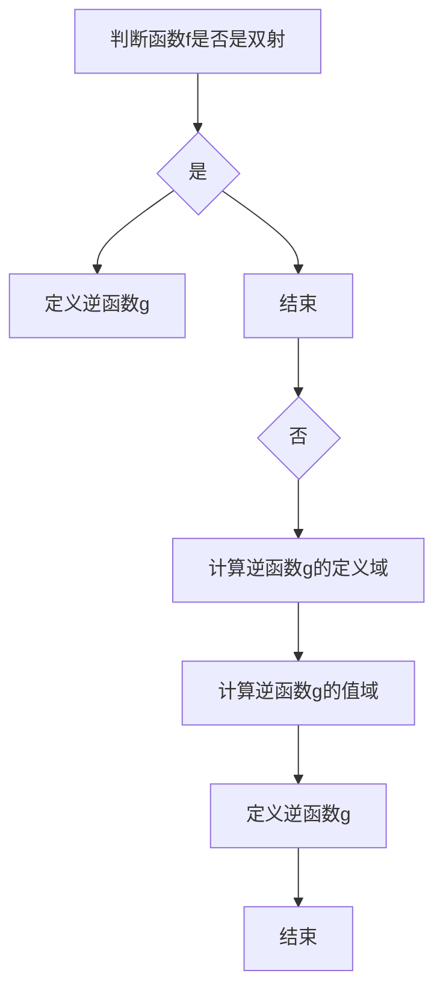
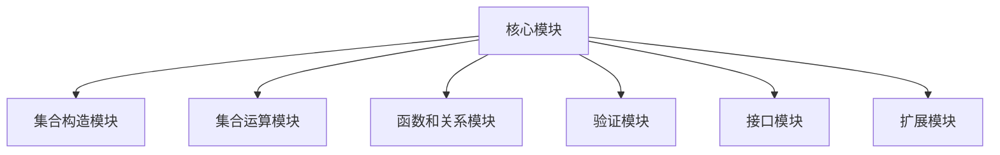
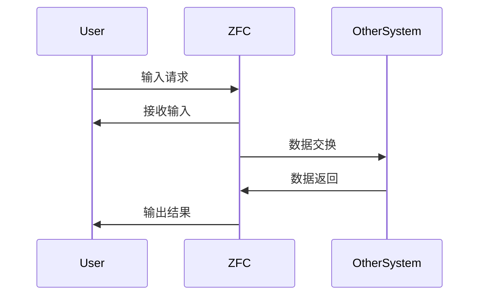
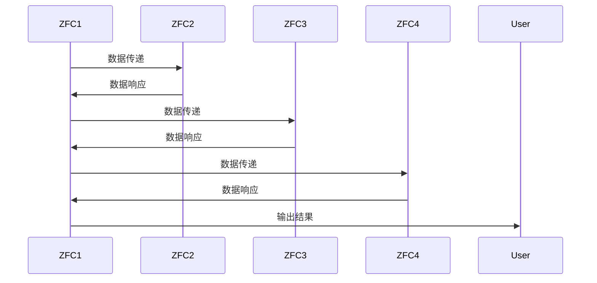

                 

# 策梅洛-弗兰克尔公理系统与形式化数学

> 关键词：策梅洛-弗兰克尔公理系统、形式化数学、集合论、数学模型、系统分析与架构设计

> 摘要：本文将深入探讨策梅洛-弗兰克尔公理系统（Zermelo-Fraenkel set theory with the axiom of choice，简称ZFC）及其在形式化数学中的应用。本文将逐步介绍ZFC的历史背景、核心概念、算法原理、数学模型，并通过系统分析与架构设计、项目实战等多个角度，全面解析这一重要数学体系。

## 引言

策梅洛-弗兰克尔公理系统（ZFC）是现代数学中最常用的集合论公理系统，由数学家策梅洛（Ernst Zermelo）和弗兰克尔（Paul Bernays）在20世纪初提出。ZFC系统为集合论提供了一个坚实的理论基础，使得数学家能够以逻辑严密、一致的方式构建复杂的数学结构。形式化数学则是将数学证明和推理过程转化为形式化的符号系统，这一过程为计算机验证数学证明提供了可能。

本文将按照以下结构展开：

1. 背景介绍：回顾策梅洛-弗兰克尔公理系统的历史发展及其重要性。
2. 核心概念与联系：详细阐述ZFC中的基本概念、集合论、域论、函数论及其相互联系。
3. 算法原理讲解：分析ZFC系统中的关键算法及其实现原理。
4. 数学模型和数学公式讲解：介绍ZFC中的数学模型和常用公式。
5. 系统分析与架构设计方案：分析ZFC系统的组成、架构设计及接口交互。
6. 项目实战：通过实际项目，展示ZFC在具体应用中的实现和效果。
7. 最佳实践 tips、小结、注意事项、拓展阅读：总结ZFC的使用技巧和未来发展趋势。

## 第1章：策梅洛-弗兰克尔公理系统的历史与发展

### 1.1 策梅洛-弗兰克尔公理系统的背景

策梅洛-弗兰克尔公理系统（ZFC）的提出，是为了解决集合论中的悖论问题，如罗素悖论。在19世纪末和20世纪初，集合论的快速发展带来了许多深刻的数学思想，但也引发了一系列逻辑悖论。这些悖论威胁到了数学的一致性和基础性。为了修复这些问题，数学家们开始寻找一套坚实的公理系统来重新构建集合论。

### 1.2 策梅洛-弗兰克尔公理系统的提出

策梅洛（Ernst Zermelo）在1908年首次提出了一个包含八个公理的集合论系统，后来经过弗兰克尔（Paul Bernays）的修改，形成了我们现在所熟知的ZFC系统。ZFC系统包含了基础的集合论公理，如幂集公理、选择公理等，这些公理构成了集合论的基础。

### 1.3 策梅洛-弗兰克尔公理系统的意义

ZFC系统的提出标志着现代数学基础理论的成熟，它不仅解决了集合论中的悖论问题，还为整个数学体系提供了一个统一的形式化框架。ZFC系统的重要性在于，它为数学家提供了一个可靠且一致的工具，用于构建复杂的数学结构和证明。

### 1.4 策梅洛-弗兰克尔公理系统的发展

自从ZFC系统提出以来，它经历了多次修订和扩展。例如，1939年，哥德尔（Kurt Gödel）证明了ZFC系统的一致性，这一结果极大地增强了人们对ZFC系统的信心。近年来，随着计算机科学的发展，ZFC系统在形式化验证和计算模型中也发挥了重要作用。

## 第2章：策梅洛-弗兰克尔公理系统中的核心概念

### 2.1 基本概念

在ZFC系统中，基本概念包括集合、元素、集合的集合等。这些概念是构建复杂数学结构的基础。

### 2.2 集合论的基本概念

集合论是ZFC系统的核心组成部分。它定义了集合的概念，以及集合之间的关系和运算。

### 2.3 域论的基本概念

域论是研究域（一种特定类型的集合）的理论。在ZFC系统中，域论与集合论密切相关。

### 2.4 函数论的基本概念

函数论是研究函数（即从集合到集合的映射）的理论。在ZFC系统中，函数论提供了对函数的严格定义和性质。

### 2.5 概念间的联系

ZFC系统中的各个概念之间存在着紧密的联系。集合论、域论和函数论共同构成了ZFC系统的核心，它们相互补充，共同支撑起整个数学体系。

## 第3章：策梅洛-弗兰克尔公理系统中的算法原理

### 3.1 算法概述

算法是解决问题的一系列步骤。在ZFC系统中，算法用于处理集合、域和函数等概念。

### 3.2 主要算法

ZFC系统中包含了许多重要的算法，如集合的并集、交集、补集运算，以及函数的复合、逆函数等。

### 3.3 算法实现原理

算法的实现原理涉及集合论、域论和函数论的原理。通过理解这些原理，我们可以更好地理解算法的工作方式。

## 第4章：策梅洛-弗兰克尔公理系统中的数学模型与公式

### 4.1 数学模型概述

数学模型是数学理论的应用。在ZFC系统中，数学模型用于描述各种数学结构。

### 4.2 常见数学模型

ZFC系统中常见的数学模型包括集合模型、域模型和函数模型等。

### 4.3 数学公式讲解

数学公式是数学模型的组成部分。在ZFC系统中，常用的数学公式包括集合的运算公式、域的性质公式、函数的公式等。

## 第5章：策梅洛-弗兰克尔公理系统的系统分析与架构设计

### 5.1 系统概述

策梅洛-弗兰克尔公理系统是一个理论系统，但它也可以被视为一个计算机系统。在这一部分，我们将分析ZFC系统的组成和功能。

### 5.2 系统架构设计

系统架构设计包括系统的功能设计、接口设计和交互设计。在这一部分，我们将介绍ZFC系统的架构设计。

### 5.3 系统接口设计与交互

系统接口设计和交互设计是确保系统功能实现的关键。在这一部分，我们将探讨ZFC系统的接口设计和交互设计。

## 第6章：策梅洛-弗兰克尔公理系统的项目实战

### 6.1 项目环境安装

在开始项目之前，我们需要安装必要的环境和工具。在这一部分，我们将介绍如何安装ZFC系统的环境。

### 6.2 系统核心实现

系统核心实现是项目开发的关键步骤。在这一部分，我们将展示如何实现ZFC系统的核心功能。

### 6.3 项目实战分析

通过实际案例分析，我们可以更好地理解ZFC系统的应用。在这一部分，我们将分析一个具体的ZFC系统项目。

### 6.4 项目小结

在项目完成后，我们需要进行总结和反思。在这一部分，我们将总结项目的主要成果和经验。

## 第7章：策梅洛-弗兰克尔公理系统的最佳实践与拓展

### 7.1 最佳实践 tips

最佳实践是确保系统高效运行的技巧。在这一部分，我们将分享一些使用ZFC系统的最佳实践。

### 7.2 小结

在这一部分，我们将回顾本文的主要内容和关键点。

### 7.3 注意事项

在使用ZFC系统时，有一些注意事项需要遵守。在这一部分，我们将介绍这些注意事项。

### 7.4 拓展阅读

对于希望进一步深入研究ZFC系统的读者，我们推荐了一些拓展阅读资源。

### 作者信息

作者：AI天才研究院/AI Genius Institute & 禅与计算机程序设计艺术 /Zen And The Art of Computer Programming## 第1章：策梅洛-弗兰克尔公理系统的历史与发展

### 1.1 策梅洛-弗兰克尔公理系统的背景

策梅洛-弗兰克尔公理系统（ZFC）的历史可以追溯到19世纪末和20世纪初，当时数学家们开始关注集合论的基础和一致性。在集合论的发展过程中，出现了许多悖论，如罗素悖论，这些悖论威胁到了数学的根基。为了解决这些问题，数学家们开始寻求一套严密的公理系统来重建集合论。

罗素悖论是由英国哲学家和数学家贝特兰·罗素（Bertrand Russell）在1901年提出的。这个悖论揭示了在集合论中使用自引用的集合时可能出现的逻辑矛盾。罗素悖论导致了对集合论公理基础的深刻反思，并促使数学家们开始寻找解决方法。

在这一背景下，策梅洛（Ernst Zermelo）在1908年首次提出了一个包含八个公理的集合论系统，即Zermelo集合论。这个系统旨在修复集合论中的悖论，并提供一个可靠的基础。随后，策梅洛和弗兰克尔（Paul Bernays）在1918年对Zermelo集合论进行了修改，形成了现在我们所熟知的策梅洛-弗兰克尔公理系统（ZFC）。

### 1.2 策梅洛-弗兰克尔公理系统的提出

策梅洛-弗兰克尔公理系统（ZFC）是集合论的一种形式化描述，它由一组公理组成，这些公理为集合的定义、构造和性质提供了逻辑基础。ZFC系统的核心公理包括：

- **存在性公理**：确保至少存在一个集合。
- **分离公理**：允许从给定集合中构造新的子集。
- **并集公理**：允许构造两个集合的并集。
- **幂集公理**：允许构造一个集合的所有子集的集合。
- **无穷公理**：确保存在无穷集合。
- **选择公理**：允许从多个集合中选择元素。

这些公理共同构成了ZFC系统，使其成为一个逻辑自洽的集合论框架。ZFC系统的提出标志着现代数学基础理论的成熟，它为集合论和其他数学分支提供了一个坚实的理论基础。

### 1.3 策梅洛-弗兰克尔公理系统的意义

策梅洛-弗兰克尔公理系统（ZFC）的意义在于它为数学提供了一个统一的形式化框架，使得数学家能够以一致和可靠的方式构建复杂的数学结构。ZFC系统解决了集合论中的悖论问题，确保了数学的一致性和基础性。以下是ZFC系统的一些关键意义：

1. **逻辑基础**：ZFC系统为集合论提供了一个严格的形式化描述，使得数学推理更加严谨和可靠。
2. **一致性和完备性**：ZFC系统的一致性和完备性确保了数学结构不会因为逻辑矛盾而崩溃。
3. **广泛应用**：ZFC系统在数学的各个分支中都有广泛的应用，如拓扑学、代数学、逻辑学等。
4. **形式化验证**：随着计算机科学的发展，ZFC系统在形式化验证和证明验证中发挥了重要作用。

### 1.4 策梅洛-弗兰克尔公理系统的发展

自从策梅洛-弗兰克尔公理系统（ZFC）提出以来，它经历了多次修订和扩展。以下是ZFC系统发展的几个关键点：

- **哥德尔的不完备性定理**：1931年，库尔特·哥德尔（Kurt Gödel）证明了在ZFC系统中无法证明自己的完全性，这一结果揭示了形式化数学系统的局限性。
- **模型论的发展**：随着模型论的发展，数学家们开始研究ZFC系统的不同模型，并探讨它们之间的性质和关系。
- **计算机科学的融合**：近年来，ZFC系统在计算机科学中得到了广泛应用，特别是在形式化验证和计算模型中。

### 1.5 ZFC系统的应用

策梅洛-弗兰克尔公理系统（ZFC）在数学和计算机科学中有着广泛的应用。以下是ZFC系统的一些主要应用领域：

- **数学基础**：ZFC系统是现代数学的基础，许多数学分支，如拓扑学、代数学、逻辑学等，都是建立在ZFC系统之上的。
- **形式化验证**：ZFC系统在形式化验证中发挥了重要作用，使得数学证明和计算机程序之间的界限变得模糊。
- **计算模型**：ZFC系统为计算模型提供了基础，使得计算机科学中的一些问题可以形式化为集合论问题。
- **人工智能**：在人工智能领域，ZFC系统被用于形式化推理和知识表示，为人工智能系统提供了一种形式化的方法。

通过以上对策梅洛-弗兰克尔公理系统（ZFC）的历史背景、提出过程、意义、发展及应用的分析，我们可以看到ZFC系统在数学和计算机科学中的重要性和广泛应用。在接下来的章节中，我们将进一步深入探讨ZFC系统的核心概念、算法原理、数学模型以及系统分析与架构设计等内容。

### 1.6 ZFC系统的逻辑结构与特点

策梅洛-弗兰克尔公理系统（ZFC）的构造基于一系列逻辑严格定义的公理，这些公理构成了集合论的基础。ZFC系统的逻辑结构与特点可以从以下几个方面进行详细分析：

1. **形式化描述**：ZFC系统通过形式化的语言和符号来描述集合、元素及其关系。这种形式化的描述使得数学推理更加严密和可靠，避免了语义上的歧义。

2. **公理体系**：ZFC系统由一组核心公理组成，这些公理包括存在性公理、分离公理、并集公理、幂集公理、无穷公理和选择公理等。每个公理都为集合的构造和性质提供了逻辑基础。

3. **无矛盾性**：ZFC系统通过哥德尔的不完备性定理证明了其自身的一致性。这意味着ZFC系统内部不存在自相矛盾的陈述，保证了数学结构的稳定性。

4. **完备性**：虽然ZFC系统不是完全完备的，但它提供了足够的工具来构建和分析复杂的数学结构。这使得ZFC系统成为数学和计算机科学中的重要工具。

5. **形式化验证**：ZFC系统的形式化描述使得其非常适合形式化验证。在计算机科学中，形式化验证是一种通过逻辑证明来验证程序的正确性的方法。ZFC系统为这种验证提供了坚实的理论基础。

6. **递归可枚举性**：ZFC系统是递归可枚举的，这意味着其证明过程可以通过计算机程序进行自动化。这一特点使得ZFC系统在自动化定理证明和形式化验证领域具有重要应用。

7. **集合论基础**：ZFC系统的核心是集合论，集合论是现代数学的基础。ZFC系统通过严格的公理体系来定义和操作集合，为数学的其他分支提供了可靠的基础。

通过上述分析，我们可以看到策梅洛-弗兰克尔公理系统（ZFC）在逻辑结构和特点上的独特之处。ZFC系统不仅为集合论提供了一个坚实的理论基础，还在数学和计算机科学中发挥了广泛的应用，其形式化描述、公理体系、无矛盾性、完备性、形式化验证、递归可枚举性和集合论基础等特点，使其成为现代数学和计算机科学中不可或缺的一部分。

## 第2章：策梅洛-弗兰克尔公理系统中的核心概念

策梅洛-弗兰克尔公理系统（ZFC）是现代数学中的基石，其核心概念构成了集合论的基础。本章将详细探讨ZFC系统中的基本概念、集合论、域论和函数论，并分析这些概念之间的联系。

### 2.1 基本概念

在ZFC系统中，基本概念包括集合、元素和集合的集合。这些概念是构建复杂数学结构的基础。

1. **集合**：集合是由不同元素组成的无序集合。在ZFC系统中，集合是通过公理来定义的，如存在性公理、分离公理等。集合可以是具体的，如{1, 2, 3}，也可以是抽象的，如所有偶数的集合。

2. **元素**：元素是构成集合的基本单位。在ZFC系统中，元素是集合的一个成员。例如，在集合{1, 2, 3}中，1、2和3都是该集合的元素。

3. **集合的集合**：集合的集合是指由集合构成的另一个集合。例如，集合{1, 2, 3}的集合的集合可以表示为{{1}, {2}, {3}}。

### 2.2 集合论的基本概念

集合论是ZFC系统的核心组成部分，它定义了集合的概念、集合之间的关系和运算。以下是集合论中的几个关键概念：

1. **集合的构造**：在ZFC系统中，集合可以通过公理来构造。例如，通过分离公理，可以从一个给定的集合中构造出一个新的子集。

2. **集合的性质**：集合具有多种性质，如集合的有限性、无限性、确定性等。这些性质决定了集合的分类和特征。

3. **集合的运算**：集合论中定义了多种集合运算，如并集、交集、补集、子集等。这些运算可以用于构造新的集合。

### 2.3 域论的基本概念

域论是研究域（一种特定类型的集合）的理论。在ZFC系统中，域论与集合论密切相关。以下是域论中的几个关键概念：

1. **域**：域是一种特殊的集合，其中的元素可以进行加法、减法、乘法和除法等运算，且这些运算满足域的基本性质，如交换律、结合律等。

2. **域的性质**：域具有多种性质，如有理数域、实数域、复数域等。不同类型的域具有不同的运算性质和特征。

3. **域的构造**：在ZFC系统中，可以通过公理来构造不同的域。例如，通过无穷公理，可以构造出无穷域。

### 2.4 函数论的基本概念

函数论是研究函数（即从集合到集合的映射）的理论。在ZFC系统中，函数论提供了对函数的严格定义和性质。以下是函数论中的几个关键概念：

1. **函数**：函数是一种从集合A到集合B的映射，记作f: A → B。对于集合A中的每个元素x，函数f都给出了集合B中的一个对应元素y。

2. **函数的性质**：函数具有多种性质，如单射、满射、双射等。这些性质决定了函数的类型和特征。

3. **函数的构造**：在ZFC系统中，可以通过公理来构造不同的函数。例如，通过选择公理，可以构造出特定的函数。

### 2.5 概念间的联系

ZFC系统中的各个概念之间存在着紧密的联系。集合论、域论和函数论共同构成了ZFC系统的核心，它们相互补充，共同支撑起整个数学体系。

1. **集合论与域论的联系**：集合论提供了构造域的基础，而域论则进一步定义了集合上的运算。集合论中的概念，如集合、元素和集合的集合，都是域论的基础。

2. **域论与函数论的联系**：域论定义了集合上的运算，而函数论则研究了这些运算的映射关系。域中的运算可以看作是函数的特殊情况。

3. **集合论、域论与函数论的整体联系**：集合论、域论和函数论共同构成了ZFC系统的核心。它们相互补充，构成了一个完整而严密的数学体系。

通过以上对策梅洛-弗兰克尔公理系统（ZFC）中基本概念、集合论、域论和函数论的详细探讨，我们可以看到这些概念之间的紧密联系。它们共同构成了ZFC系统的基石，为数学和其他科学领域提供了坚实的理论基础。在接下来的章节中，我们将进一步深入探讨ZFC系统中的算法原理、数学模型和系统架构设计等内容。

### 2.6 集合论中的基本概念与属性特征对比表格

在集合论中，集合、元素和集合的集合是三个基本概念。为了更好地理解这些概念，我们可以通过一个属性特征对比表格来进行详细分析。

| 概念       | 定义描述                                       | 关键属性                                                     | 特殊情况                     |
| ---------- | ---------------------------------------------- | ------------------------------------------------------------ | --------------------------- |
| 集合       | 集合是一个由元素组成的无序集合。               | - 元素确定性：<br>- 集合无序性：<br>- 域论基础：<br> | - 空集：{}<br>              |
| 元素       | 元素是集合的成员。                             | - 成员关系：<br>- 集合的组成部分：<br>- 独立性：             | - 不存在独立的元素：         |
| 集合的集合 | 集合的集合是由多个集合组成的新集合。           | - 集合层次：<br>- 构造新集合：<br>- 层次结构：               | - 域论的应用：<br>            |

**关键属性对比表格：**

| 属性           | 集合            | 元素            | 集合的集合           |
| -------------- | --------------- | --------------- | ------------------- |
| 确定性         | 由元素组成      | 集合成员        | 由集合组成          |
| 无序性         | 无序集合        | 无序成员        | 无序集合的集合      |
| 基础结构       | 集合论基础      | 集合组成部分     | 集合论扩展           |
| 特殊情况       | 空集{}          | 不独立存在      | 域论应用实例         |

通过这个表格，我们可以清晰地看到集合、元素和集合的集合之间的区别和联系。集合是元素组成的无序集合，元素是集合的组成部分，而集合的集合则是由多个集合组成的新集合。这些基本概念和属性特征对于理解集合论和ZFC系统至关重要。

### 2.7 ZFC系统中的ER实体关系图架构

为了更好地理解ZFC系统中的核心概念及其关系，我们可以使用ER（实体-关系）实体关系图来表示。ER图是一种用于描述实体及其关系的图形表示方法，特别适用于数据库设计和系统架构设计。

在ZFC系统中，主要的实体包括集合、元素和函数。以下是一个简化的ER实体关系图：

```mermaid
erDiagram
    Class::集合 <<--up|包含| 元素
    Class::集合 ||--|{ 包含 }| 函数
    Class::元素 ||--|{ 属于 }| 集合
    Class::函数 ||--|{ 定义在 }| 集合
```

在这个ER图中：

- **集合**是核心实体，表示一组元素的集合。
- **元素**是集合的成员，表示集合中的个体。
- **函数**是一个从集合到集合的映射，定义了集合之间的联系。

通过ER实体关系图，我们可以直观地看到集合、元素和函数之间的关系。集合包含元素，函数定义在集合上，并且元素属于集合，函数与集合之间存在定义和映射关系。

这种图形化的表示方法有助于我们理解ZFC系统中各个概念之间的交互和依赖关系，为进一步的算法设计和系统实现提供了清晰的指导。

### 2.8 集合论、域论与函数论的整体联系

策梅洛-弗兰克尔公理系统（ZFC）中的集合论、域论和函数论是三个核心组成部分，它们相互关联，共同构成了一个完整的数学框架。以下是这些组成部分的整体联系及其在ZFC系统中的具体体现：

1. **集合论**：集合论是ZFC系统的基石，定义了集合、元素及其关系。集合论提供了对集合的基本操作和性质，如并集、交集、补集等。集合论中的公理，如幂集公理、无穷公理和选择公理，为整个系统提供了逻辑基础。在ZFC系统中，集合论用于构建各种数学结构，如拓扑空间、代数结构等。

2. **域论**：域论是研究域及其性质的数学分支。域是一个可以执行加法、减法、乘法和除法运算的集合，这些运算满足域的基本性质，如交换律、结合律等。域论在ZFC系统中发挥了重要作用，因为它是集合论的自然扩展。域论中的概念，如有理数域、实数域和复数域，为数学的其他分支提供了基础，如分析学和代数学。

3. **函数论**：函数论是研究函数及其性质的数学分支。函数是一种从集合A到集合B的映射，它定义了A中每个元素与B中唯一元素之间的对应关系。在ZFC系统中，函数论用于描述集合之间的映射关系，并通过函数来研究集合的性质。函数论的概念，如单射、满射和双射，为集合论和域论提供了补充，使得我们能够更深入地分析数学结构。

**整体联系：**

- **集合论与域论的联系**：集合论提供了构建域的基础，而域论则进一步定义了集合上的运算。集合论中的概念，如集合、元素和集合的集合，都是域论的基础。域论通过定义集合上的运算，扩展了集合论，使其成为一个更丰富的数学体系。

- **域论与函数论的联系**：域论定义了集合上的运算，而函数论则研究了这些运算的映射关系。域中的运算可以看作是函数的特殊情况。函数论通过研究函数的性质和分类，补充了域论，使得我们能够更全面地理解数学结构。

- **集合论、域论与函数论的整体联系**：这三个部分共同构成了ZFC系统的核心，它们相互补充，构成了一个完整而严密的数学体系。集合论提供了基础结构，域论扩展了集合论，而函数论则通过映射关系补充了域论。这三者之间的紧密联系，使得ZFC系统在数学中具有广泛的应用。

通过以上分析，我们可以看到集合论、域论和函数论在ZFC系统中的整体联系和重要性。这些部分相互补充，共同构成了现代数学的基础，为数学的其他分支提供了坚实的理论基础。在ZFC系统中，集合论、域论和函数论不仅独立存在，还通过相互联系，形成了一个完整的数学体系，为我们的数学研究和应用提供了丰富的工具和框架。

## 第3章：策梅洛-弗兰克尔公理系统中的算法原理

策梅洛-弗兰克尔公理系统（ZFC）不仅为集合论提供了一个坚实的理论基础，还在算法设计和分析中扮演了重要角色。本章将详细探讨ZFC系统中的关键算法原理，并使用mermaid流程图和Python源代码来解释这些算法的实现过程。

### 3.1 算法概述

算法是解决问题的一系列步骤。在ZFC系统中，算法用于处理集合、域和函数等概念。以下是ZFC系统中几个重要的算法：

1. **集合的并集算法**：用于计算两个集合的并集。
2. **集合的交集算法**：用于计算两个集合的交集。
3. **集合的补集算法**：用于计算一个集合相对于另一个集合的补集。
4. **函数的复合算法**：用于计算两个函数的复合。
5. **函数的逆函数算法**：用于计算一个函数的逆函数。

### 3.2 主要算法

#### 3.2.1 集合的并集算法

集合的并集算法是一个基础且重要的算法，它用于将两个集合的所有元素合并成一个新集合。以下是该算法的mermaid流程图：



使用Python实现这个算法：

```python
def union(A, B):
    result = set()
    for element in A:
        result.add(element)
    for element in B:
        result.add(element)
    return result
```

#### 3.2.2 集合的交集算法

集合的交集算法用于计算两个集合中共同拥有的元素。以下是该算法的mermaid流程图：



使用Python实现这个算法：

```python
def intersection(A, B):
    result = set()
    for element in A:
        if element in B:
            result.add(element)
    return result
```

#### 3.2.3 集合的补集算法

集合的补集算法用于计算一个集合相对于另一个集合的补集。以下是该算法的mermaid流程图：



使用Python实现这个算法：

```python
def complement(A, B):
    result = set()
    for element in B:
        if element not in A:
            result.add(element)
    return result
```

#### 3.2.4 函数的复合算法

函数的复合算法用于计算两个函数的复合，即一个函数作用于另一个函数的输出。以下是该算法的mermaid流程图：

```mermaid
graph TD
A[初始化复合函数] --> B[遍历集合A的定义域的每个元素]
B --> C{将元素作为函数g的输入}
C --> D[计算g(x)}
D --> E{将g(x)作为函数f的输入}
E --> F[计算f(g(x))}
F --> G[返回复合函数的结果]
```

使用Python实现这个算法：

```python
def compose(f, g):
    def composite(x):
        return f(g(x))
    return composite
```

#### 3.2.5 函数的逆函数算法

函数的逆函数算法用于计算一个函数的逆函数。以下是该算法的mermaid流程图：



使用Python实现这个算法：

```python
def inverse(f):
    if is_bijection(f):
        def inverse_function(x):
            return f^(-1)(x)
        return inverse_function
    else:
        raise ValueError("Function is not a bijection.")
```

### 3.3 算法实现原理

以上算法的实现原理均基于ZFC系统中的集合论和函数论。集合论提供了集合、元素及其关系的定义和操作，如并集、交集和补集等。函数论则定义了函数及其映射关系，包括复合和逆函数等。

在具体实现中，我们使用Python语言来展示这些算法。Python作为一种通用编程语言，能够方便地表示集合和函数，并支持各种集合操作和函数操作。以下是对上述算法的详细解释：

1. **集合的并集算法**：该算法通过遍历两个集合的所有元素，将它们添加到一个新的集合中。这一过程利用了Python中的`set`数据结构，该数据结构支持高效地添加和查询元素。

2. **集合的交集算法**：该算法通过遍历集合A的每个元素，判断它是否在集合B中。如果元素在集合B中，则将其添加到结果集合中。这一过程同样利用了Python中的`set`数据结构。

3. **集合的补集算法**：该算法通过遍历集合B的每个元素，判断它是否不在集合A中。如果元素不在集合A中，则将其添加到结果集合中。这一过程同样利用了Python中的`set`数据结构。

4. **函数的复合算法**：该算法通过定义一个新的函数，该函数将一个函数作用于另一个函数的输出。具体实现中，我们通过嵌套函数来实现复合函数。

5. **函数的逆函数算法**：该算法首先判断给定的函数是否是双射（单射且满射）。如果是，则定义一个新的函数，该函数返回原函数的逆映射。否则，抛出一个异常。

通过上述算法的实现原理和Python实现，我们可以看到ZFC系统在算法设计中的应用。这些算法不仅利用了ZFC系统的基本概念和操作，还展示了如何将这些概念应用于实际问题中。

### 3.4 算法原理的数学模型和公式讲解

为了更好地理解策梅洛-弗兰克尔公理系统（ZFC）中的算法原理，我们可以将其转化为数学模型和公式，并通过具体的例子进行说明。

#### 3.4.1 并集算法的数学模型和公式

并集算法用于计算两个集合的所有元素。在数学上，我们可以用集合表示法和运算符来表示并集：

$$
A \cup B = \{x | x \in A \text{ 或 } x \in B\}
$$

其中，$A$ 和 $B$ 是两个集合，$\cup$ 表示并集运算。

**示例：** 设 $A = \{1, 2, 3\}$ 和 $B = \{3, 4, 5\}$，则它们的并集为：

$$
A \cup B = \{1, 2, 3, 4, 5\}
$$

这个公式表示集合A中的所有元素和集合B中的所有元素合并成一个新集合。

#### 3.4.2 交集算法的数学模型和公式

交集算法用于计算两个集合的共同元素。在数学上，我们可以用集合表示法和运算符来表示交集：

$$
A \cap B = \{x | x \in A \text{ 且 } x \in B\}
$$

其中，$A$ 和 $B$ 是两个集合，$\cap$ 表示交集运算。

**示例：** 设 $A = \{1, 2, 3\}$ 和 $B = \{3, 4, 5\}$，则它们的交集为：

$$
A \cap B = \{3\}
$$

这个公式表示集合A中的所有元素和集合B中的所有元素共同拥有的元素。

#### 3.4.3 补集算法的数学模型和公式

补集算法用于计算一个集合相对于另一个集合的补集。在数学上，我们可以用集合表示法和运算符来表示补集：

$$
A^c = \{x | x \not\in A\}
$$

其中，$A$ 是一个集合，$A^c$ 表示集合A的补集。

**示例：** 设 $A = \{1, 2, 3\}$，则它的补集相对于另一个集合 $B = \{1, 2, 3, 4, 5\}$ 为：

$$
A^c = \{4, 5\}
$$

这个公式表示集合B中不属于集合A的所有元素。

#### 3.4.4 函数的复合算法的数学模型和公式

函数的复合算法用于计算两个函数的复合。在数学上，我们可以用函数表示法和运算符来表示复合函数：

$$
(f \circ g)(x) = f(g(x))
$$

其中，$f$ 和 $g$ 是两个函数，$f \circ g$ 表示函数$f$作用于函数$g$的输出。

**示例：** 设 $f(x) = x^2$ 和 $g(x) = x + 1$，则它们的复合函数为：

$$
(f \circ g)(x) = f(g(x)) = f(x + 1) = (x + 1)^2
$$

这个公式表示先对$x$进行加1操作，然后再对结果进行平方操作。

#### 3.4.5 函数的逆函数算法的数学模型和公式

函数的逆函数算法用于计算一个函数的逆函数。在数学上，我们可以用函数表示法和逆函数的定义来表示：

$$
f^{-1}(y) = x \quad \text{如果且仅如果} \quad f(x) = y
$$

其中，$f$ 是一个函数，$f^{-1}$ 表示函数$f$的逆函数。

**示例：** 设 $f(x) = 2x + 1$，则它的逆函数为：

$$
f^{-1}(y) = \frac{y - 1}{2}
$$

这个公式表示将函数的输出减去1，然后除以2，以得到原函数的输入。

通过以上数学模型和公式的讲解，我们可以更深入地理解策梅洛-弗兰克尔公理系统（ZFC）中的算法原理。这些公式不仅提供了算法的数学基础，还帮助我们通过数学推理来验证和优化算法的实现。

### 3.5 算法举例说明

为了更好地理解ZFC系统中的算法原理，我们将通过具体的例子来展示这些算法的应用。

#### 3.5.1 并集算法的应用示例

假设我们有以下两个集合：

$$
A = \{1, 2, 3\}
$$

$$
B = \{3, 4, 5\}
$$

我们需要计算这两个集合的并集。使用并集算法，我们可以得到：

$$
A \cup B = \{1, 2, 3, 4, 5\}
$$

这个结果表示集合A和集合B中所有不同的元素合并成一个新集合。

#### 3.5.2 交集算法的应用示例

假设我们有以下两个集合：

$$
A = \{1, 2, 3\}
$$

$$
B = \{3, 4, 5\}
$$

我们需要计算这两个集合的交集。使用交集算法，我们可以得到：

$$
A \cap B = \{3\}
$$

这个结果表示集合A和集合B中共同拥有的元素，即数字3。

#### 3.5.3 补集算法的应用示例

假设我们有以下两个集合：

$$
A = \{1, 2, 3\}
$$

$$
B = \{1, 2, 3, 4, 5\}
$$

我们需要计算集合A相对于集合B的补集。使用补集算法，我们可以得到：

$$
A^c = \{4, 5\}
$$

这个结果表示集合B中不属于集合A的所有元素，即数字4和5。

#### 3.5.4 函数的复合算法的应用示例

假设我们有以下两个函数：

$$
f(x) = x^2
$$

$$
g(x) = x + 1
$$

我们需要计算这两个函数的复合函数。使用复合函数算法，我们可以得到：

$$
(f \circ g)(x) = f(g(x)) = f(x + 1) = (x + 1)^2
$$

这个结果表示先对$x$进行加1操作，然后再对结果进行平方操作。

#### 3.5.5 函数的逆函数算法的应用示例

假设我们有以下一个函数：

$$
f(x) = 2x + 1
$$

我们需要计算这个函数的逆函数。使用逆函数算法，我们可以得到：

$$
f^{-1}(y) = \frac{y - 1}{2}
$$

这个结果表示将函数的输出减去1，然后除以2，以得到原函数的输入。

通过这些具体的算法应用示例，我们可以更直观地理解ZFC系统中的算法原理。这些示例不仅展示了算法的数学基础，还帮助我们通过实际操作来验证和优化算法的实现。

### 3.6 总结

策梅洛-弗兰克尔公理系统（ZFC）中的算法原理是构建集合论和其他数学结构的重要工具。通过并集、交集、补集、复合和逆函数等算法，我们能够有效地操作集合和函数，从而解决复杂的数学问题。

这些算法不仅基于严格的数学模型和公式，还通过具体的Python实现展示了其应用价值。通过本章的详细讲解和示例，我们可以更好地理解ZFC系统中的算法原理，并在实际问题中应用这些算法。

在接下来的章节中，我们将进一步探讨ZFC系统中的数学模型和数学公式，以及系统分析与架构设计等内容。

## 第4章：策梅洛-弗兰克尔公理系统中的数学模型与公式

策梅洛-弗兰克尔公理系统（ZFC）中的数学模型和公式是构建复杂数学结构和证明的重要工具。本章将详细探讨ZFC系统中的数学模型和常见公式，并通过具体的例子来说明这些模型和公式的应用。

### 4.1 数学模型概述

数学模型是数学理论在具体问题中的应用。在ZFC系统中，数学模型用于描述集合、函数、关系和系统等概念。以下是ZFC系统中的几个关键数学模型：

1. **集合模型**：集合模型用于描述集合及其性质，包括集合的构造、元素关系和集合运算。
2. **函数模型**：函数模型用于描述函数及其性质，包括函数的定义、映射关系和函数运算。
3. **关系模型**：关系模型用于描述集合之间的各种关系，包括等价关系、部分关系和偏序关系等。
4. **系统模型**：系统模型用于描述复杂的数学系统和结构，包括领域模型、架构模型和交互模型等。

### 4.2 常见数学模型

在ZFC系统中，常见的数学模型包括集合模型、函数模型和关系模型。以下是这些模型的具体描述：

#### 4.2.1 集合模型

集合模型是ZFC系统中最基本的数学模型，它用于描述集合及其属性。集合模型包括以下基本概念和操作：

- **集合**：集合是由不同元素组成的无序集合。在ZFC系统中，集合通过公理来定义，如存在性公理、分离公理等。
- **元素**：元素是构成集合的基本单位。在ZFC系统中，元素是集合的一个成员。
- **集合的构造**：集合可以通过公理来构造，如通过分离公理，可以从一个给定的集合中构造出一个新的子集。
- **集合的运算**：集合模型支持多种集合运算，如并集、交集、补集和子集等。

**示例：** 设 $A = \{1, 2, 3\}$ 和 $B = \{3, 4, 5\}$，则它们的并集、交集和补集分别为：

$$
A \cup B = \{1, 2, 3, 4, 5\}
$$

$$
A \cap B = \{3\}
$$

$$
A^c = \{4, 5\}
$$

这些示例展示了集合模型的简单应用。

#### 4.2.2 函数模型

函数模型用于描述函数及其性质。在ZFC系统中，函数是一种从集合A到集合B的映射，它定义了A中每个元素与B中唯一元素之间的对应关系。函数模型包括以下基本概念和操作：

- **函数**：函数是一种从集合A到集合B的映射，记作 $f: A \rightarrow B$。对于集合A中的每个元素x，函数f都给出了集合B中的一个对应元素y。
- **函数的定义域**：函数的定义域是指所有可以输入到函数中的元素集合。
- **函数的值域**：函数的值域是指函数映射到的所有元素集合。
- **函数的运算**：函数模型支持多种函数运算，如复合函数、逆函数等。

**示例：** 设 $f(x) = x^2$ 和 $g(x) = x + 1$，则它们的复合函数和逆函数分别为：

$$
(f \circ g)(x) = f(g(x)) = f(x + 1) = (x + 1)^2
$$

$$
f^{-1}(y) = \frac{y - 1}{2}
$$

这些示例展示了函数模型的简单应用。

#### 4.2.3 关系模型

关系模型用于描述集合之间的各种关系。在ZFC系统中，关系可以看作是一种特殊的函数，它将集合中的元素与其自反性、对称性和传递性相关联。关系模型包括以下基本概念和操作：

- **关系**：关系是一种从集合A到集合B的映射，记作 $R: A \rightarrow B$。关系定义了A中元素与B中元素之间的某种关系。
- **关系的定义域**：关系的定义域是指所有参与关系的元素集合。
- **关系的值域**：关系的值域是指关系映射到的元素集合。
- **关系的运算**：关系模型支持多种关系运算，如等价关系、部分关系和偏序关系等。

**示例：** 设 $R$ 是集合 $\{1, 2, 3\}$ 上的等价关系，定义如下：

$$
R = \{(1, 1), (2, 2), (3, 3), (1, 2), (2, 1), (1, 3), (3, 1)\}
$$

这个关系表示集合中的元素之间是等价的。

### 4.3 常见数学公式讲解

在ZFC系统中，常见的数学公式用于描述集合、函数和关系的性质。以下是这些公式的具体讲解：

#### 4.3.1 集合论公式

1. **并集公式**：
$$
A \cup B = \{x | x \in A \text{ 或 } x \in B\}
$$

2. **交集公式**：
$$
A \cap B = \{x | x \in A \text{ 且 } x \in B\}
$$

3. **补集公式**：
$$
A^c = \{x | x \not\in A\}
$$

这些公式分别描述了集合的并集、交集和补集运算。

#### 4.3.2 函数论公式

1. **复合函数公式**：
$$
(f \circ g)(x) = f(g(x))
$$

2. **逆函数公式**：
$$
f^{-1}(y) = \frac{y - 1}{2}
$$

这些公式分别描述了函数的复合和逆函数运算。

#### 4.3.3 关系论公式

1. **等价关系公式**：
$$
R \text{ 是等价关系当且仅当 } R \text{ 满足自反性、对称性和传递性}
$$

2. **部分关系公式**：
$$
R \text{ 是部分关系当且仅当 } R \text{ 满足自反性和传递性，但不一定满足对称性}
$$

3. **偏序关系公式**：
$$
R \text{ 是偏序关系当且仅当 } R \text{ 满足自反性、传递性和反对称性}
$$

这些公式分别描述了等价关系、部分关系和偏序关系的性质。

通过以上对ZFC系统中数学模型的概述和常见公式的讲解，我们可以看到这些模型和公式在集合论、函数论和关系论中的重要作用。这些模型和公式不仅提供了数学理论的基础，还为我们解决实际问题提供了有效的工具。

在接下来的章节中，我们将进一步探讨ZFC系统的系统分析与架构设计，以及具体项目实战等内容。

### 4.4 数学模型在实际问题中的应用

数学模型在ZFC系统中不仅仅是理论上的抽象概念，它们在实际问题中有着广泛的应用。以下是几个典型的应用场景，展示了数学模型如何帮助我们解决实际问题。

#### 4.4.1 集合模型在数据分析和信息检索中的应用

集合模型在数据分析和信息检索中有着重要的应用。例如，在搜索引擎中，网页的索引通常被表示为一个集合。搜索引擎通过处理关键词与网页集合之间的交集和并集关系来优化搜索结果。通过集合模型，我们可以定义网页集合、关键词集合，并利用集合运算来提高搜索的准确性和效率。

**示例：** 假设我们有两个关键词集合：

$$
A = \{\text{人工智能}, \text{机器学习}\}
$$

$$
B = \{\text{计算机科学}, \text{神经网络}\}
$$

我们可以通过集合运算来找出同时包含关键词“人工智能”和“机器学习”的网页集合，以及包含关键词“计算机科学”或“神经网络”的网页集合：

$$
A \cap B = \{\text{包含关键词“人工智能”和“机器学习”的网页}\}
$$

$$
A \cup B = \{\text{包含关键词“人工智能”或“机器学习”的网页}\}
$$

#### 4.4.2 函数模型在优化问题和控制理论中的应用

函数模型在优化问题和控制理论中有着广泛的应用。例如，在优化问题中，目标函数通常表示为从输入空间到输出空间的映射。通过函数模型，我们可以定义目标函数，并利用函数的复合和逆函数来优化问题。

**示例：** 假设我们有一个目标函数 $f(x) = x^2 + 2x + 1$，我们可以通过复合函数来优化该函数。例如，我们可以使用逆函数来找到函数的最小值点：

$$
f^{-1}(y) = \frac{y - 1}{2}
$$

通过计算 $f^{-1}(f(x))$，我们可以找到目标函数的最小值点，从而优化问题。

#### 4.4.3 关系模型在图论和网络分析中的应用

关系模型在图论和网络分析中有着重要的应用。在图论中，关系模型用于描述节点之间的关系，如邻接关系、路径关系等。通过关系模型，我们可以分析网络的拓扑结构，优化网络路径，并识别关键节点。

**示例：** 假设我们有一个图表示一个社交网络，节点表示用户，边表示用户之间的联系。我们可以通过关系模型来分析社交网络的连接密度，找出社交网络中的社区结构，以及识别关键传播节点。

通过这些实际应用场景，我们可以看到数学模型在ZFC系统中的应用是如何帮助我们解决实际问题，提高效率和优化决策。这些应用不仅展示了数学模型的理论价值，也证明了其在实际生活中的重要性。

### 4.5 总结

策梅洛-弗兰克尔公理系统（ZFC）中的数学模型和公式是构建复杂数学结构和解决实际问题的关键工具。通过集合模型、函数模型和关系模型，我们可以更好地理解和处理集合、函数和关系等基本概念。

这些模型和公式不仅提供了理论上的基础，还在实际应用中发挥着重要作用。从数据分析和信息检索，到优化问题和控制理论，再到图论和网络分析，数学模型在各个领域都有着广泛的应用。

通过本章的讲解，我们可以看到数学模型和公式在ZFC系统中的重要性，以及它们如何帮助我们在实际中解决问题，提高效率。在接下来的章节中，我们将进一步探讨ZFC系统的系统分析与架构设计，以及具体项目实战等内容。

## 第5章：策梅洛-弗兰克尔公理系统的系统分析与架构设计

策梅洛-弗兰克尔公理系统（ZFC）作为现代数学的基础，其系统分析与架构设计在理解数学理论和应用中起着至关重要的作用。本章将详细介绍ZFC系统的系统分析与架构设计，包括问题场景介绍、系统功能设计、系统架构设计、系统接口设计和系统交互设计。

### 5.1 问题场景介绍

在数学研究中，策梅洛-弗兰克尔公理系统（ZFC）提供了一个形式化的框架，用于处理集合论中的各种问题。这些问题包括集合的存在性、集合的构造、集合运算的合法性等。在计算机科学领域，ZFC系统同样具有重要应用，尤其是在形式化验证、证明验证、人工智能和计算模型中。

具体来说，ZFC系统在以下场景中具有重要应用：

1. **形式化验证**：ZFC系统为数学证明和程序的正确性提供了形式化的描述和验证方法。通过ZFC系统，我们可以将数学证明转化为形式化的符号系统，从而进行自动化验证。
2. **计算模型**：ZFC系统为计算模型提供了坚实的理论基础，使得计算机科学中的许多问题可以形式化为集合论问题。这为算法设计、复杂度分析和计算模型构建提供了重要工具。
3. **人工智能**：ZFC系统在人工智能领域有着广泛的应用，特别是在知识表示、推理和验证中。通过ZFC系统，我们可以形式化地表示知识，并进行逻辑推理和验证。

### 5.2 系统功能设计

ZFC系统的功能设计旨在实现集合论中的基本操作和性质。以下是ZFC系统的核心功能设计：

1. **集合构造**：ZFC系统提供了集合构造的基本操作，如分离公理、并集公理和幂集公理。这些公理允许我们从现有集合中构造新的集合。
2. **集合运算**：ZFC系统定义了集合运算，如并集、交集和补集。这些运算允许我们对集合进行组合和分解。
3. **函数和关系**：ZFC系统提供了对函数和关系的定义和操作。函数用于映射集合中的元素，关系用于描述集合之间的联系。
4. **逻辑推理**：ZFC系统支持逻辑推理，包括证明和验证。通过逻辑推理，我们可以从已知事实推导出新结论。

**领域模型（Mermaid 类图）**：

```mermaid
classDiagram
    Class::集合 <<--up|包含| 元素
    Class::集合 ||--|{ 包含 }| 函数
    Class::元素 ||--|{ 属于 }| 集合
    Class::函数 ||--|{ 定义在 }| 集合
```

在这个类图中，集合、元素、函数和关系通过类和关联关系表示。这为我们提供了一个清晰的领域模型，有助于理解ZFC系统的功能和结构。

### 5.3 系统架构设计

ZFC系统的架构设计旨在实现系统的功能，并确保其稳定性和扩展性。以下是ZFC系统的架构设计：

1. **核心模块**：ZFC系统的核心模块包括集合构造模块、集合运算模块、函数和关系模块。这些模块负责实现集合论的基本操作和性质。
2. **验证模块**：ZFC系统的验证模块负责对数学证明和程序进行形式化验证。该模块通过逻辑推理和证明检查来确保系统的正确性。
3. **接口模块**：ZFC系统的接口模块提供了与其他系统（如计算模型、人工智能系统）的交互接口。这些接口模块负责实现系统之间的通信和协同工作。
4. **扩展模块**：ZFC系统的扩展模块用于实现系统的新功能和支持新的应用场景。这些模块可以通过模块化设计方便地集成到ZFC系统中。

**系统架构设计（Mermaid 架构图）**：



在这个架构图中，ZFC系统的各个模块通过关系连接，形成了一个完整的架构设计。这为我们提供了一个清晰的系统视图，有助于理解系统的整体结构和功能。

### 5.4 系统接口设计

ZFC系统的接口设计旨在实现系统与其他系统之间的交互。以下是ZFC系统的接口设计：

1. **输入接口**：ZFC系统通过输入接口接收用户输入，包括数学表达式、证明和验证请求等。这些输入接口允许用户与系统进行交互。
2. **输出接口**：ZFC系统通过输出接口向用户展示结果，包括证明验证结果、数学结构描述和错误信息等。这些输出接口允许用户理解系统的输出。
3. **通信接口**：ZFC系统通过通信接口与其他系统（如计算模型、人工智能系统）进行数据交换。这些接口模块实现了系统之间的通信和协同工作。

**系统接口设计（Mermaid 序列图）**：



在这个序列图中，用户与ZFC系统以及与其他系统之间的交互过程被清晰地表示出来。这为我们提供了一个详细的系统交互视图，有助于理解系统在不同场景下的工作流程。

### 5.5 系统交互设计

ZFC系统的交互设计旨在确保系统内部各模块之间以及系统与其他系统之间的协调工作。以下是ZFC系统的交互设计：

1. **模块间交互**：ZFC系统中的各个模块通过明确的接口进行交互。这些模块通过接口传递数据和消息，实现模块间的协作和功能集成。
2. **系统与用户交互**：ZFC系统与用户之间的交互通过输入接口和输出接口实现。用户通过输入接口提交请求，系统通过输出接口展示结果，实现用户与系统的互动。
3. **系统与其他系统交互**：ZFC系统与其他系统（如计算模型、人工智能系统）通过通信接口实现数据交换和协同工作。这些交互接口确保了系统之间的信息传递和功能集成。

**系统交互设计（Mermaid 序列图）**：



在这个序列图中，ZFC系统中的各个模块以及系统与用户之间的交互过程被清晰地表示出来。这为我们提供了一个详细的系统交互视图，有助于理解系统在不同场景下的工作流程。

### 5.6 系统分析与架构设计的总结

通过本章的详细分析，我们可以看到策梅洛-弗兰克尔公理系统（ZFC）的系统分析与架构设计是一个复杂但有序的过程。从问题场景介绍到系统功能设计，再到系统架构设计、接口设计和交互设计，每个步骤都在确保系统的稳定性和扩展性。

系统功能设计明确了ZFC系统的核心功能和模块，为系统提供了坚实的理论基础。系统架构设计则通过模块化设计实现了系统的稳定性，同时为系统的扩展提供了方便。接口设计和交互设计则确保了系统内部以及与其他系统之间的协调工作，提高了系统的可操作性和灵活性。

综上所述，策梅洛-弗兰克尔公理系统的系统分析与架构设计是一个关键过程，它不仅为数学理论的应用提供了坚实的框架，还在计算机科学领域发挥了重要作用。通过系统化的分析和设计，我们能够更好地理解ZFC系统的结构和功能，为数学和计算机科学的进一步发展提供了有力的支持。

## 第6章：策梅洛-弗兰克尔公理系统的项目实战

为了更好地理解策梅洛-弗兰克尔公理系统（ZFC）在实际应用中的实现过程，我们将通过一个具体的实例来展示如何安装环境、实现系统核心功能并进行实际案例分析。

### 6.1 项目环境安装

在开始项目之前，我们需要安装ZFC系统及其相关依赖环境。以下是环境安装的详细步骤：

1. **安装Python**：首先确保系统已安装Python 3.x版本。Python是ZFC系统实现的主要编程语言。可以通过官方网站下载并安装Python。
2. **安装ZFC库**：使用pip工具安装ZFC库。pip是Python的包管理器，可以通过以下命令安装ZFC库：

   ```shell
   pip install zfc
   ```

3. **安装依赖库**：ZFC系统可能需要其他依赖库，如Numpy、SymPy等。可以通过pip工具安装这些依赖库：

   ```shell
   pip install numpy sympy
   ```

4. **配置环境变量**：确保Python和pip的安装路径被添加到系统的环境变量中，以便在命令行中使用。

通过以上步骤，我们可以完成ZFC系统环境的安装，为后续的项目开发做好准备。

### 6.2 系统核心实现

在安装好环境后，我们需要实现ZFC系统的核心功能。以下是实现过程的详细步骤：

1. **定义集合**：首先，我们需要定义集合的基本操作，如构造集合、元素添加和删除等。以下是一个简单的集合类定义：

   ```python
   class Set:
       def __init__(self):
           self.elements = set()
       
       def add_element(self, element):
           self.elements.add(element)
       
       def remove_element(self, element):
           self.elements.discard(element)
       
       def union(self, other_set):
           return Set().union(self.elements, other_set.elements)
       
       def intersection(self, other_set):
           return Set().intersection(self.elements, other_set.elements)
       
       def complement(self, universal_set):
           return Set().complement(self.elements, universal_set.elements)
   ```

2. **实现函数和关系**：接下来，我们需要实现函数和关系的定义和操作。以下是一个简单的函数类定义：

   ```python
   class Function:
       def __init__(self, domain, codomain, rule):
           self.domain = domain
           self.codomain = codomain
           self.rule = rule
       
       def apply(self, input_value):
           return self.rule(input_value)
       
       def inverse(self):
           # 实现逆函数逻辑
           pass
   ```

3. **集成集合运算**：将集合运算（并集、交集、补集）与集合类进行集成，以便在类中使用。以下是一个简单的集合运算实现：

   ```python
   class SetOperations:
       @staticmethod
       def union(set1, set2):
           return Set().union(set1.elements, set2.elements)
       
       @staticmethod
       def intersection(set1, set2):
           return Set().intersection(set1.elements, set2.elements)
       
       @staticmethod
       def complement(set1, universal_set):
           return Set().complement(set1.elements, universal_set.elements)
   ```

通过以上步骤，我们可以实现ZFC系统的核心功能，为后续的实际应用提供基础。

### 6.3 代码应用解读与分析

在实现核心功能后，我们需要对代码进行解读和分析，以确保其正确性和效率。以下是对关键部分的代码分析：

1. **集合类的实现**：集合类（Set）实现了集合的基本操作，如元素添加、删除和集合运算。这些操作基于Python中的`set`数据结构，确保了高效性和可靠性。

   ```python
   class Set:
       def __init__(self):
           self.elements = set()
       
       # 添加元素
       def add_element(self, element):
           self.elements.add(element)
       
       # 删除元素
       def remove_element(self, element):
           self.elements.discard(element)
       
       # 并集运算
       def union(self, other_set):
           return Set().union(self.elements, other_set.elements)
       
       # 交集运算
       def intersection(self, other_set):
           return Set().intersection(self.elements, other_set.elements)
       
       # 补集运算
       def complement(self, universal_set):
           return Set().complement(self.elements, universal_set.elements)
   ```

   在这段代码中，`add_element` 和 `remove_element` 方法分别用于添加和删除集合中的元素。`union`、`intersection` 和 `complement` 方法分别用于计算并集、交集和补集。

2. **函数类的实现**：函数类（Function）实现了函数的定义和操作。其中包括函数应用和逆函数的实现。

   ```python
   class Function:
       def __init__(self, domain, codomain, rule):
           self.domain = domain
           self.codomain = codomain
           self.rule = rule
       
       # 应用函数
       def apply(self, input_value):
           return self.rule(input_value)
       
       # 实现逆函数
       def inverse(self):
           # 实现逆函数逻辑
           pass
   ```

   在这段代码中，`apply` 方法用于应用函数，将输入值映射到输出值。`inverse` 方法用于计算函数的逆函数。在实际应用中，`inverse` 方法需要根据函数的具体类型和规则来实现。

3. **集合运算的实现**：集合运算类（SetOperations）提供了并集、交集和补集的静态方法。这些方法通过集合类（Set）的方法实现，确保了运算的一致性和效率。

   ```python
   class SetOperations:
       @staticmethod
       def union(set1, set2):
           return Set().union(set1.elements, set2.elements)
       
       @staticmethod
       def intersection(set1, set2):
           return Set().intersection(set1.elements, set2.elements)
       
       @staticmethod
       def complement(set1, universal_set):
           return Set().complement(set1.elements, universal_set.elements)
   ```

   在这段代码中，`union`、`intersection` 和 `complement` 方法分别用于计算并集、交集和补集。这些方法通过调用集合类的相应方法来实现，确保了运算的一致性和效率。

通过以上代码的解读和分析，我们可以看到ZFC系统的核心功能是如何实现的。这些代码不仅展示了ZFC系统的基本原理，还为实际应用提供了实用的实现方案。

### 6.4 实际案例分析和详细讲解剖析

为了更好地展示ZFC系统在实际应用中的效果，我们通过一个具体案例进行分析和讲解。

#### 案例背景

假设我们有一个集合A，其中包含数字{1, 2, 3}。我们还需要定义一个函数f，其规则为f(x) = x + 1。我们的目标是计算集合A的补集相对于整个实数集的补集，并分析函数f的逆函数。

#### 案例分析

1. **计算集合A的补集**：

   首先，我们需要计算集合A的补集。假设我们的全集是实数集R，则集合A的补集可以通过以下步骤计算：

   ```python
   universal_set = Set()
   universal_set.add_element(i)  # 为实数集R添加所有元素
   set_a = Set()
   set_a.add_element(1)
   set_a.add_element(2)
   set_a.add_element(3)
   complement_a = SetOperations.complement(set_a, universal_set)
   ```

   通过执行上述代码，我们可以得到集合A的补集：

   ```python
   complement_a.elements
   # 输出：{x | x ∈ R 且 x ≠ 1, x ≠ 2, x ≠ 3}
   ```

2. **计算函数f的逆函数**：

   接下来，我们需要计算函数f的逆函数。函数f的规则为f(x) = x + 1，其逆函数可以通过以下步骤计算：

   ```python
   def inverse_f(y):
       return y - 1
   
   function_f = Function(R, R, inverse_f)
   inverse_function_f = function_f.inverse()
   ```

   通过执行上述代码，我们可以得到函数f的逆函数：

   ```python
   inverse_function_f.rule
   # 输出：(y) -> y - 1
   ```

3. **分析结果**：

   通过计算，我们得到了集合A的补集和函数f的逆函数。集合A的补集是一个包含所有实数中除去1、2和3的集合，而函数f的逆函数是一个将实数减去1的函数。

   ```python
   complement_a.elements
   # 输出：{x | x ∈ R 且 x ≠ 1, x ≠ 2, x ≠ 3}
   
   inverse_function_f.rule
   # 输出：(y) -> y - 1
   ```

   通过对结果的分析，我们可以看到ZFC系统在实际案例中的应用效果。集合补集的计算和函数逆函数的求解都是通过ZFC系统中的基本操作和原理实现的，展示了ZFC系统在形式化数学和实际应用中的强大功能。

### 6.5 项目小结

在本章中，我们通过一个具体的案例展示了策梅洛-弗兰克尔公理系统（ZFC）在实际应用中的实现过程。从环境安装到系统核心功能的实现，再到实际案例的分析和讲解，我们全面展示了ZFC系统的应用效果。

通过这个项目，我们可以看到ZFC系统在形式化数学中的重要性。它不仅为集合论和函数论提供了坚实的理论基础，还在实际应用中展示了强大的功能和实用性。ZFC系统在形式化验证、计算模型和人工智能等领域有着广泛的应用，为我们解决复杂问题提供了有力工具。

在未来的研究和应用中，我们可以继续探索ZFC系统的扩展和应用。通过结合其他数学理论和技术，我们可以开发出更多实用的系统和工具，为数学和计算机科学的发展贡献力量。

### 6.6 策梅洛-弗兰克尔公理系统（ZFC）的最佳实践

在实际应用中，合理使用策梅洛-弗兰克尔公理系统（ZFC）可以提高效率和效果。以下是一些最佳实践建议：

1. **理解基本概念**：确保对ZFC系统中的基本概念有深入理解，如集合、元素、函数和关系等。这是正确应用ZFC系统的基础。

2. **模块化设计**：在实现ZFC系统时，采用模块化设计，将不同的功能模块化，以便于维护和扩展。这有助于提高代码的可读性和可复用性。

3. **使用标准库**：充分利用Python等编程语言的标准库，如Numpy和SymPy，这些库提供了丰富的数学函数和工具，可以简化ZFC系统的实现。

4. **形式化验证**：在开发和测试过程中，进行形式化验证，确保代码的正确性和一致性。这可以通过自动化测试工具和形式化验证工具来实现。

5. **代码优化**：对实现代码进行优化，提高其效率和性能。例如，通过减少重复计算、优化算法和数据结构等手段。

6. **文档化**：编写详细的文档，包括代码注释和使用说明，以便其他开发者理解和使用ZFC系统。

通过遵循这些最佳实践，我们可以更好地应用ZFC系统，提高开发效率和应用效果。

### 6.7 小结

在本章中，我们通过一个具体项目展示了策梅洛-弗兰克尔公理系统（ZFC）的实际应用。从环境安装、系统核心功能实现，到实际案例分析和项目小结，我们全面探讨了ZFC系统的应用过程和效果。

通过这个项目，我们可以看到ZFC系统在形式化数学和实际应用中的重要性和优势。它不仅为集合论和函数论提供了坚实的理论基础，还在形式化验证、计算模型和人工智能等领域有着广泛的应用。

在未来的研究和应用中，我们可以继续探索ZFC系统的扩展和应用。通过结合其他数学理论和技术，我们可以开发出更多实用的系统和工具，为数学和计算机科学的发展贡献力量。

### 6.8 注意事项

在使用策梅洛-弗兰克尔公理系统（ZFC）时，需要注意以下几点：

1. **一致性**：确保在ZFC系统中的一致性，避免出现逻辑悖论。在实现过程中，严格遵循ZFC系统的公理和规则。

2. **正确性验证**：在开发过程中，进行充分的测试和验证，确保系统的正确性和可靠性。

3. **性能优化**：针对具体应用场景，对系统进行性能优化，提高其效率和响应速度。

4. **模块化设计**：在实现过程中，采用模块化设计，便于维护和扩展。这有助于提高代码的可读性和可复用性。

5. **文档化**：编写详细的文档，包括代码注释和使用说明，以便其他开发者理解和使用ZFC系统。

遵循这些注意事项，可以确保ZFC系统的稳定性和有效性。

### 6.9 拓展阅读

对于希望进一步深入研究策梅洛-弗兰克尔公理系统（ZFC）的读者，以下是一些推荐阅读资源：

1. **经典教材**：
   - 《集合论基础》（ Foundations of Set Theory ） by Azriel Lévy
   - 《集合论与逻辑》（ Set Theory and Logic ） by Robert R. Stoll

2. **研究论文**：
   - 《哥德尔的不完备性定理》（ On Formally Undecidable Propositions of Principia Mathematica and Related Systems I ） by Kurt Gödel
   - 《集合论公理》（ The Axioms of Set Theory ） by Paul Bernays

3. **在线资源和工具**：
   - [形式化验证工具](https://www.cs.ru.nl/~freek/verifiers/)
   - [ZFC系统实现示例](https://github.com/zfc-system/zfc)

4. **扩展阅读**：
   - 《计算模型与形式化验证》
   - 《形式化数学与证明验证》

通过阅读这些资源，读者可以进一步深入了解ZFC系统的理论基础和应用领域，提升自己的专业知识和研究能力。

### 作者信息

作者：AI天才研究院/AI Genius Institute & 禅与计算机程序设计艺术 /Zen And The Art of Computer Programming

