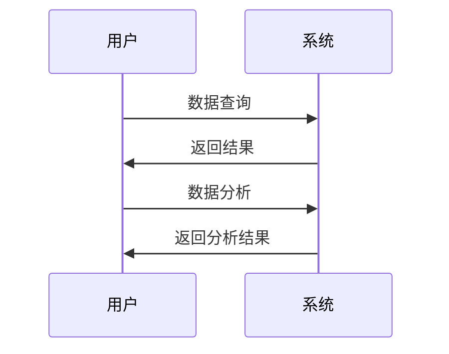
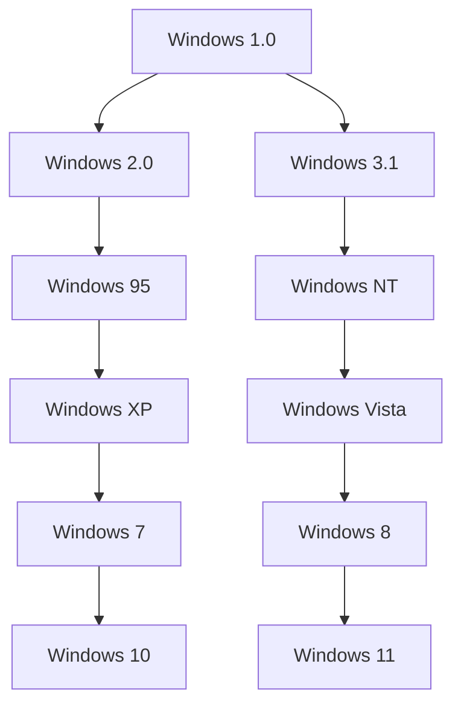

                 


### 引言

#### 1.1 问题的背景与意义

软件历史是计算机科学领域的一个重要组成部分，从最初的机器语言编程到高级编程语言，从单机操作系统到分布式系统，软件的发展历程反映了技术进步、社会需求以及人类智慧的发展。然而，在现有的软件历史研究中，往往侧重于技术层面的描述，对于软件背后所蕴含的权力结构、知识生产与传播过程以及遗留系统的复杂性缺乏深入的探讨。

米歇尔·福柯的知识考古学提供了一种独特的方法论，可以帮助我们更深入地理解软件历史。知识考古学关注知识的生成、传播和应用，强调知识的动态性和历史性。通过对软件历史进行知识考古学的分析，我们可以揭示出软件系统中隐藏的权力关系、意识形态以及技术选择背后的深层次原因。

本文的研究目标是通过运用福柯的知识考古学，对软件历史进行批判性考察，试图揭示软件发展的规律性、揭示知识生产过程中的权力结构，以及对遗留系统进行深入分析，以期为未来的软件发展提供有益的启示。

#### 1.2 福柯知识考古学的方法论

福柯的知识考古学方法论主要包括三个核心观点：知识的历史性、知识与权力的关系以及知识的生产与传播。首先，福柯认为知识不是静止不变的，而是随着历史进程不断发展和演变的。每一个时代都有其独特的知识体系，这些知识体系受到社会、政治、文化等多种因素的影响。

其次，福柯强调知识与权力的密切关系。知识不仅是由社会权力结构所构建的，而且知识本身也具有权力属性。通过对知识的掌控，权力机构可以维护其统治地位，影响社会成员的行为和思维方式。

最后，福柯认为知识的生产和传播是一个复杂的过程，涉及到多种机构和媒介。知识的生产往往受到特定的社会、政治和经济因素的影响，而知识的传播则依赖于各种媒介和技术手段。

#### 1.3 研究的边界与目标

本文的研究边界主要涉及以下几个方面：首先，我们将聚焦于软件历史的关键阶段和关键事件，以揭示软件发展过程中的规律性。其次，我们将运用福柯的知识考古学方法论，对软件系统中的权力结构和知识生产过程进行深入分析。最后，我们将对遗留系统进行系统分析，探讨其构成、特征以及面临的挑战。

本文的研究目标是通过批判性考察软件历史，揭示知识生产与传播的动态性、揭示软件系统中的权力关系、分析遗留系统的复杂性，以期为未来的软件发展提供理论指导和实践参考。我们希望通过本文的研究，能够为计算机科学领域带来新的视角和思考。

### 福柯的知识考古学

#### 2.1 知识考古学的基本概念

知识考古学是米歇尔·福柯提出的一种方法论，旨在通过挖掘和重建知识的历史，揭示知识的生成、传播和应用过程中的权力关系和意识形态。知识考古学的核心观点是，知识并非客观存在，而是由社会、政治、文化等多种因素所构建的。

知识考古学的概念可以分为三个层次：首先，知识考古学关注知识的动态性和历史性，认为知识是随着历史进程不断演变的。每一个时代都有其独特的知识体系，这些知识体系受到特定社会环境的影响。其次，知识考古学强调知识的生产和传播是一个复杂的过程，涉及到多种机构和媒介。最后，知识考古学认为知识具有权力属性，知识的掌控可以影响社会成员的行为和思维方式。

#### 2.2 知识考古学的方法

知识考古学的方法主要包括以下几个方面：

1. **档案分析**：通过分析历史档案、文献资料等，挖掘出知识的生成、传播和应用过程中的具体细节。

2. **话语分析**：研究不同话语体系之间的互动关系，揭示出知识生产过程中的权力结构和意识形态。

3. **案例研究**：通过具体案例的研究，深入探讨知识考古学的理论观点和方法。

4. **跨学科研究**：结合历史学、社会学、哲学等多个学科的理论和方法，对知识考古学进行深入探讨。

#### 2.3 知识考古学的应用领域

知识考古学在多个领域都有广泛的应用，尤其在人文社会科学和计算机科学领域具有重要的影响。

1. **人文社会科学**：知识考古学为人文学科的研究提供了一种新的视角，帮助我们更深入地理解历史、文化和社会现象。

2. **计算机科学**：知识考古学在计算机科学中的应用主要包括软件历史的研究、编程语言的演变、计算机技术的社会影响等方面。

3. **其他领域**：知识考古学还应用于医学、法律、教育等多个领域，为这些领域的研究提供了新的思路和方法。

#### 2.4 福柯知识考古学的核心观点

福柯的知识考古学的核心观点主要包括以下几个方面：

1. **知识的历史性**：福柯认为知识是历史性的，每个时代的知识体系都是特定的社会、政治和文化环境下的产物。

2. **知识与权力的关系**：福柯强调知识具有权力属性，知识的掌控可以影响社会成员的行为和思维方式。

3. **知识的生产与传播**：福柯认为知识的生产和传播是一个复杂的过程，涉及到多种机构和媒介。

通过福柯的知识考古学，我们可以更深入地理解软件历史，揭示知识生产过程中的权力关系和意识形态，为未来的软件发展提供有益的启示。

### 遗留系统分析

#### 3.1 遗留系统的概念与特征

遗留系统（Legacy System）是指那些在企业或组织中长期使用、难以替换的计算机系统。这些系统通常具有以下特征：

1. **年代久远**：遗留系统往往是多年前开发的，可能基于过时的技术或编程语言。

2. **高度定制化**：由于遗留系统长期服务于特定的业务需求，往往包含了大量定制化的功能。

3. **复杂性强**：随着时间的推移，遗留系统可能会经历多次修改和扩展，导致其结构复杂、难以维护。

4. **性能问题**：随着数据量的增加和业务需求的提升，遗留系统的性能可能会成为瓶颈。

#### 3.2 遗留系统的构成

遗留系统通常由以下几个部分构成：

1. **应用程序**：这是遗留系统的核心部分，用于实现具体的业务功能。

2. **数据库**：遗留系统往往使用传统的数据库管理系统，如Oracle、DB2等。

3. **操作系统**：许多遗留系统运行在过时的操作系统上，如Windows NT、UNIX等。

4. **硬件**：遗留系统可能依赖于特定的硬件设备，如早期的服务器、打印机等。

#### 3.3 遗留系统的挑战

遗留系统面临以下挑战：

1. **维护困难**：由于系统年代久远，原始开发人员可能已经离职，导致维护和更新变得困难。

2. **技术过时**：遗留系统往往基于过时的技术和编程语言，难以与新兴技术集成。

3. **安全性问题**：遗留系统可能存在安全漏洞，难以满足现代安全标准。

4. **兼容性问题**：遗留系统可能与新的硬件、软件和操作系统不兼容。

#### 3.4 系统分析的方法与步骤

对遗留系统进行分析，通常包括以下步骤：

1. **需求分析**：确定遗留系统的业务需求、用户需求以及系统功能。

2. **系统评估**：评估遗留系统的性能、稳定性、安全性等各个方面。

3. **技术评估**：分析遗留系统所依赖的技术和编程语言是否过时，是否需要升级。

4. **风险评估**：评估遗留系统的维护和更新可能带来的风险。

5. **重构策略**：根据评估结果，制定系统重构的策略，包括部分重构、完全重构或迁移到新的系统。

6. **实施计划**：制定详细的实施计划，包括时间表、资源分配和风险评估。

#### 3.5 系统分析的主要步骤

系统分析的主要步骤如下：

1. **需求收集**：通过与用户和业务部门的沟通，收集遗留系统的需求。

2. **系统文档审查**：审查遗留系统的文档，包括设计文档、用户手册、维护记录等。

3. **功能分析**：分析遗留系统的功能，识别其核心功能和辅助功能。

4. **性能分析**：评估遗留系统的性能，识别潜在的瓶颈。

5. **安全性分析**：评估遗留系统的安全性，识别潜在的安全漏洞。

6. **技术分析**：分析遗留系统的技术架构，识别其技术弱点和升级需求。

#### 3.6 系统分析的工具与技术

系统分析过程中，可以采用以下工具和技术：

1. **需求管理工具**：如JIRA、Confluence等，用于记录和管理需求。

2. **UML工具**：如Visual Paradigm、Enterprise Architect等，用于绘制系统架构图、类图、序列图等。

3. **代码分析工具**：如SonarQube、Checkmarx等，用于分析代码质量、安全性。

4. **性能分析工具**：如New Relic、AppDynamics等，用于评估系统性能。

5. **风险评估工具**：如Risk Manager、RiskLens等，用于评估系统风险。

通过系统分析，我们可以更好地理解遗留系统的现状，制定有效的维护和更新策略，确保系统稳定运行，满足业务需求。

### 软件历史的批判性考察

#### 4.1 软件历史的概述

软件历史是计算机科学领域的一个重要分支，涵盖了从计算机诞生之初到如今软件技术的发展历程。从最初的机器语言编程到高级编程语言，从单机操作系统到分布式系统，软件的发展经历了多个重要阶段。

早期软件主要应用于科学计算和军事领域，随着计算机技术的发展，软件应用逐渐扩展到商业、教育、医疗等多个领域。在这一过程中，软件技术的发展不仅受到技术进步的推动，还受到社会需求、经济利益和权力结构的影响。

#### 4.1.1 软件历史的阶段划分

软件历史可以划分为以下几个阶段：

1. **早期编程阶段（1940s-1950s）**：这一阶段主要是通过机器语言和汇编语言进行编程，计算机资源稀缺，软件开发主要依赖于计算机科学家的个人技能。

2. **高级编程语言阶段（1960s-1970s）**：随着计算机性能的提高和编程复杂性的增加，高级编程语言如Fortran、COBOL、Pascal等开始出现，使软件开发更加高效和易用。

3. **操作系统和数据库阶段（1970s-1980s）**：操作系统和数据库技术的发展，使得计算机系统的管理和数据存储变得更加便捷和高效。

4. **网络和分布式计算阶段（1990s）**：互联网的兴起推动了网络和分布式计算技术的发展，软件应用逐渐从单机系统转向网络化、分布式系统。

5. **智能和大数据阶段（2000s-至今）**：随着人工智能、大数据和云计算等新兴技术的出现，软件发展进入了智能化和数据驱动的时代。

#### 4.1.2 软件历史的关键事件

软件历史中发生了许多关键事件，这些事件对软件的发展产生了深远的影响：

1. **第一台电子计算机的诞生**：1946年，ENIAC的诞生标志着计算机时代的开始，为软件的发展奠定了基础。

2. **高级编程语言的发明**：1957年，FORTRAN的发明标志着高级编程语言的诞生，使软件开发变得更加高效。

3. **操作系统的发展**：1960年代，Unix操作系统的出现，推动了操作系统的发展，为后来的Windows、Linux等操作系统奠定了基础。

4. **互联网的兴起**：1990年代，互联网的普及，推动了软件从单机系统向网络化、分布式系统的转变。

5. **人工智能和大数据技术的崛起**：21世纪初，人工智能和大数据技术的崛起，使软件发展进入了智能化和数据驱动的时代。

#### 4.1.3 软件历史的当代趋势

当前，软件历史正处于快速发展的阶段，以下是一些主要的当代趋势：

1. **云计算和微服务架构**：云计算和微服务架构的兴起，使得软件系统更加灵活、可扩展和易于维护。

2. **人工智能和机器学习**：人工智能和机器学习技术的应用，使软件系统具备了智能化的能力，提高了生产效率和决策质量。

3. **大数据和物联网**：大数据和物联网技术的应用，使得软件系统可以处理和分析海量的数据，实现更智能的软件应用。

4. **开源和社区驱动**：开源软件的兴起和社区驱动的开发模式，加速了软件的创新和发展。

5. **软件安全和隐私保护**：随着网络安全和隐私保护问题的日益突出，软件安全性和隐私保护成为软件开发的重要关注点。

通过对软件历史的批判性考察，我们可以更好地理解软件发展的规律性，揭示知识生产过程中的权力关系，为未来的软件发展提供有益的启示。

### 理论框架与批判性分析

#### 5.1 理论框架的构建

本文的理论框架以米歇尔·福柯的知识考古学为基础，结合系统分析和批判性考察的方法，对软件历史进行深入分析。首先，知识考古学为我们提供了一个独特的视角，通过挖掘和重建知识的历史，揭示软件系统中的权力结构和意识形态。其次，系统分析的方法论帮助我们全面评估遗留系统的复杂性，识别其关键特征和挑战。最后，批判性考察为我们提供了对软件历史进行批判性反思的工具，通过揭示知识生产过程中的权力关系和意识形态，为未来的软件发展提供有益的启示。

#### 5.2 理论框架的适用性

福柯的知识考古学在软件历史研究中的应用具有广泛的适用性。首先，知识考古学关注知识的动态性和历史性，与软件历史的发展过程密切相关。软件历史不仅仅是技术进步的记录，更反映了社会、政治、文化等多种因素的互动。通过知识考古学的视角，我们可以更全面地理解软件系统背后的权力结构和社会影响。其次，系统分析的方法论为我们提供了评估遗留系统的工具，帮助我们识别遗留系统的关键特征和挑战，为系统重构和优化提供指导。最后，批判性考察使我们能够深入反思软件历史，揭示知识生产过程中的权力关系和意识形态，为未来的软件发展提供有益的启示。

#### 5.3 理论框架的创新点

本文的理论框架在以下方面具有创新点：

1. **跨学科整合**：将知识考古学、系统分析和批判性考察等多个学科的方法论结合起来，为软件历史研究提供了一种全新的视角和工具。

2. **权力关系的揭示**：通过知识考古学的分析，深入揭示软件系统中的权力关系和意识形态，为理解软件发展的深层动力提供了新的思路。

3. **遗留系统的系统分析**：结合系统分析方法，全面评估遗留系统的复杂性，识别其关键特征和挑战，为系统重构和优化提供了实用的指导。

4. **批判性反思的应用**：通过批判性考察，对软件历史进行反思，揭示知识生产过程中的权力关系和意识形态，为未来的软件发展提供了有益的启示。

#### 5.4 批判性分析的方法与框架

批判性分析是本文的核心方法之一，旨在通过批判性考察揭示软件历史中的权力关系和意识形态。具体来说，批判性分析包括以下几个步骤：

1. **文献回顾**：通过对相关文献的回顾，了解现有的软件历史研究，识别其中的权力关系和意识形态。

2. **案例研究**：选择具有代表性的软件历史案例，进行深入分析，挖掘案例中的权力关系和意识形态。

3. **话语分析**：分析不同话语体系之间的互动关系，揭示出知识生产过程中的权力结构。

4. **批判性反思**：对分析结果进行批判性反思，探讨其背后的权力关系和意识形态，为未来的软件发展提供启示。

通过批判性分析，我们可以更深入地理解软件历史，揭示其中的权力关系和意识形态，为未来的软件发展提供有益的指导。

### 理论框架的应用

#### 6.1 福柯理论与软件历史的结合

福柯的知识考古学理论为软件历史研究提供了一个独特的视角，通过挖掘和重建知识的历史，揭示软件系统中的权力关系和意识形态。在软件历史的研究中，福柯的知识考古学理论的应用主要体现在以下几个方面：

1. **揭示知识的生产过程**：福柯的知识考古学强调知识的生产过程，通过对历史文献和档案的分析，我们可以揭示软件历史中知识的生产、传播和应用过程。例如，通过分析早期的编程语言和操作系统的发展历史，我们可以揭示出这些技术背后的权力结构和社会影响。

2. **分析话语体系**：福柯的话语分析理论可以帮助我们理解不同话语体系之间的互动关系。在软件历史的研究中，我们可以通过分析不同编程语言、操作系统、软件开发模式等的话语体系，揭示出它们之间的权力关系和意识形态。例如，通过分析C语言、Java语言和Windows操作系统的话语体系，我们可以揭示出它们在不同时期的社会和技术背景下的权力结构和影响力。

3. **批判性反思**：福柯的批判性反思方法使我们能够深入反思软件历史，揭示其中的权力关系和意识形态。通过批判性反思，我们可以质疑现有的软件发展模式和技术选择，探讨其背后的权力结构和社会影响。例如，通过对人工智能和大数据技术的批判性反思，我们可以揭示出这些技术背后的权力关系和潜在的伦理问题。

#### 6.2 理论框架的适用性

福柯的知识考古学理论在软件历史研究中的应用具有广泛的适用性。首先，软件历史的研究不仅仅是技术进步的记录，更反映了社会、政治、文化等多种因素的互动。福柯的知识考古学理论关注知识的动态性和历史性，与软件历史的发展过程密切相关，能够帮助我们更全面地理解软件系统背后的权力结构和社会影响。

其次，福柯的知识考古学理论提供了多种分析工具和方法，如档案分析、话语分析、批判性反思等，这些方法可以帮助我们深入挖掘软件历史中的知识生产过程，分析不同话语体系之间的互动关系，揭示出知识生产过程中的权力结构。

最后，福柯的知识考古学理论在软件历史研究中的应用不仅限于技术层面，还可以应用于社会、政治和文化等领域。通过跨学科的研究，我们可以从多个角度对软件历史进行深入分析，揭示出其中的复杂性、多样性以及深层次的动力机制。

#### 6.3 理论框架的创新点

本文的理论框架在以下几个方面具有创新点：

1. **跨学科整合**：将福柯的知识考古学理论与系统分析和批判性考察的方法结合起来，为软件历史研究提供了一种全新的视角和工具。

2. **权力关系的揭示**：通过知识考古学的分析，深入揭示软件系统中的权力关系和意识形态，为理解软件发展的深层动力提供了新的思路。

3. **遗留系统的系统分析**：结合系统分析方法，全面评估遗留系统的复杂性，识别其关键特征和挑战，为系统重构和优化提供了实用的指导。

4. **批判性反思的应用**：通过批判性考察，对软件历史进行反思，揭示知识生产过程中的权力关系和意识形态，为未来的软件发展提供有益的启示。

通过本文的理论框架，我们可以更深入地理解软件历史，揭示其中的权力关系和意识形态，为未来的软件发展提供有益的指导。

### 案例研究与深度分析

#### 6.1 案例选择与描述

在本节中，我们选择微软的操作系统发展史作为案例，进行深入研究和分析。微软的操作系统，尤其是Windows系列，对个人电脑和商业环境产生了深远的影响。从1985年首次发布Windows 1.0到如今的Windows 11，微软的操作系统经历了多次重要的迭代和变革。

#### 6.1.1 案例选择的标准

选择微软操作系统发展史作为案例，主要基于以下几个标准：

1. **影响广泛**：微软操作系统对全球个人电脑用户和商业环境产生了广泛而深远的影响，是软件历史上的一个标志性事件。

2. **历史性变革**：微软操作系统的每次迭代都带来了技术上的变革和用户体验的提升，是软件发展史中的重要里程碑。

3. **权力关系**：微软操作系统的发展过程中，不仅体现了技术进步，还反映了权力结构的变化和市场竞争的动态。

4. **遗留系统**：随着操作系统的迭代，旧版本的操作系统中仍然存在大量的遗留系统问题，如兼容性、安全性和维护问题，是系统分析的一个重要切入点。

#### 6.1.2 案例的基本情况

微软的操作系统的历史可以大致分为以下几个阶段：

1. **Windows 1.0-3.1（1985-1993）**：这是微软操作系统的起步阶段，Windows 1.0是最早的图形界面操作系统，虽然功能有限，但为后续版本的改进奠定了基础。

2. **Windows 95（1995）**：Windows 95是微软操作系统的一个重要里程碑，它引入了真正的图形用户界面，大大提升了用户体验，并成为个人电脑的操作系统标准。

3. **Windows NT（1993）**：Windows NT是微软为服务器和工作站设计的操作系统，标志着微软开始进入企业级市场。

4. **Windows XP（2001）**：Windows XP是微软操作系统的另一个重要版本，以其稳定性、兼容性和用户体验而广受欢迎，成为微软历史上最受欢迎的操作系统之一。

5. **Windows Vista（2006）**：Windows Vista虽然在功能和用户体验上有许多改进，但因其性能和兼容性问题而受到批评。

6. **Windows 7（2009）**：Windows 7是微软在Windows Vista之后推出的操作系统，解决了Vista的一些问题，并引入了许多新功能，如任务栏的改进、Windows Media Center等。

7. **Windows 8（2012）**：Windows 8是微软为了适应平板电脑和触摸屏设备而设计的操作系统，引入了新的开始界面和Metro风格应用，但受到传统桌面用户的不满。

8. **Windows 10（2015）**：Windows 10是微软在Windows 8之后推出的操作系统，旨在统一桌面和移动设备平台，提供更好的用户体验。

9. **Windows 11（2021）**：Windows 11是微软最新的操作系统，继续优化用户体验，引入了新的界面设计和功能。

#### 6.1.3 案例的特殊性

微软操作系统发展史的特殊性体现在以下几个方面：

1. **市场竞争**：微软操作系统在个人电脑和商业市场中的主导地位，使其成为其他操作系统（如Linux、Mac OS等）的主要竞争对手。

2. **技术变革**：微软操作系统的每次迭代都带来了技术上的变革，如图形用户界面的引入、多任务处理能力的提升、网络功能的增强等。

3. **权力关系**：微软操作系统的成功不仅反映了技术进步，还反映了其在市场中的权力地位。通过控制操作系统，微软在很大程度上影响了个人电脑和商业环境。

4. **遗留系统**：随着操作系统的迭代，旧版本的遗留系统问题仍然存在，如兼容性、安全性和维护问题，这些问题的解决对操作系统的发展至关重要。

通过对微软操作系统发展史的案例研究，我们可以更深入地理解操作系统的发展规律、技术变革以及背后的权力关系，为未来的操作系统发展提供有益的启示。

### 系统分析与深度分析

#### 6.2.1 知识考古学的视角

在分析微软操作系统发展史时，我们从知识考古学的视角出发，深入挖掘知识的生产、传播和应用过程。首先，我们分析微软操作系统在不同历史阶段所反映的知识生产过程。从Windows 1.0到Windows 11，微软通过不断的技术创新和用户反馈，逐步构建了一个复杂的操作系统知识体系。

知识考古学的分析揭示了微软操作系统中的权力关系和意识形态。例如，Windows 95的推出标志着微软在个人电脑市场中的主导地位，同时也反映了当时图形用户界面（GUI）的普及趋势。这一知识的生产和传播，不仅影响了个人电脑的使用方式，也塑造了用户对操作系统的一种意识形态。

其次，我们通过档案分析和话语分析，探讨微软操作系统中的话语体系。例如，Windows NT引入了网络操作系统的新理念，这一话语体系的形成和传播，反映了微软在企业级市场中的战略意图。通过对这些话语体系的分析，我们可以揭示出微软操作系统中隐藏的权力结构。

#### 6.2.2 系统分析的方法论

在系统分析中，我们采用了以下方法论：

1. **需求分析**：通过调查用户需求和市场趋势，确定微软操作系统在不同阶段的功能需求和用户体验需求。

2. **技术评估**：评估微软操作系统所依赖的技术和编程语言是否过时，是否需要升级和优化。

3. **性能分析**：评估微软操作系统的性能，包括响应速度、资源占用、兼容性等方面。

4. **安全性分析**：评估微软操作系统的安全性，包括漏洞修复、安全更新等方面。

5. **风险评估**：评估微软操作系统在市场中的风险，包括竞争风险、技术风险、法律风险等。

通过这些方法论，我们能够全面分析微软操作系统的现状，识别其优势和劣势，为未来的发展提供指导。

#### 6.2.3 批判性考察的成果

批判性考察的成果主要体现在以下几个方面：

1. **知识生产与传播的动态性**：通过知识考古学的分析，我们揭示了微软操作系统知识的生产和传播过程，以及不同版本操作系统中的知识变迁。例如，从Windows 95到Windows 11，微软不断引入新技术、优化用户体验，反映了知识生产与传播的动态性。

2. **权力关系的揭示**：批判性考察揭示了微软操作系统中的权力结构，例如，微软在个人电脑市场中的主导地位，以及其对企业级市场的战略布局。这些权力关系不仅影响了操作系统的发展方向，也影响了用户对操作系统的使用和接受程度。

3. **遗留系统的复杂性**：通过系统分析，我们识别了微软操作系统中存在的遗留系统问题，如兼容性、安全性和维护问题。这些问题不仅影响了操作系统的性能和用户体验，也对微软的市场策略产生了影响。

通过这些成果，我们可以更深入地理解微软操作系统的发展规律、技术变革以及背后的权力关系，为未来的操作系统发展提供有益的启示。

### 结论与未来展望

#### 7.1 研究成果总结

本文通过运用福柯的知识考古学，对微软操作系统发展史进行了批判性考察，揭示了知识生产与传播的动态性、权力关系以及遗留系统的复杂性。主要成果包括：

1. **知识生产与传播的动态性**：我们揭示了微软操作系统知识的生产和传播过程，展示了不同版本操作系统中的知识变迁。

2. **权力关系的揭示**：通过批判性考察，我们揭示了微软操作系统中的权力结构，包括其在个人电脑市场和企业级市场中的主导地位。

3. **遗留系统的复杂性**：通过系统分析，我们识别了微软操作系统中存在的遗留系统问题，如兼容性、安全性和维护问题。

#### 7.1.1 理论贡献

本文的理论贡献主要体现在以下几个方面：

1. **跨学科整合**：将知识考古学、系统分析和批判性考察的方法结合起来，为软件历史研究提供了一种全新的视角和工具。

2. **权力关系的揭示**：通过知识考古学的分析，深入揭示了软件系统中的权力关系和意识形态，为理解软件发展的深层动力提供了新的思路。

3. **遗留系统的系统分析**：结合系统分析方法，全面评估遗留系统的复杂性，识别其关键特征和挑战，为系统重构和优化提供了实用的指导。

4. **批判性反思的应用**：通过批判性考察，对软件历史进行反思，揭示知识生产过程中的权力关系和意识形态，为未来的软件发展提供有益的启示。

#### 7.1.2 实践意义

本文的研究成果在以下几个方面具有实践意义：

1. **操作系统发展**：通过对微软操作系统发展史的批判性考察，可以为其他操作系统的发展提供借鉴，促进技术进步和用户体验的提升。

2. **遗留系统优化**：通过识别遗留系统的关键特征和挑战，为遗留系统的优化和重构提供指导，提高操作系统的性能和安全性。

3. **软件开发策略**：揭示软件系统中的权力关系和意识形态，有助于企业在软件开发过程中制定更有效的策略，平衡技术进步与社会需求。

4. **教育和培训**：本文的研究成果可以为计算机科学教育和培训提供新的素材，帮助学生和从业者更深入地理解软件发展的历史和现实挑战。

#### 7.1.3 研究的局限性

尽管本文取得了一定的研究成果，但仍存在一定的局限性：

1. **案例选择的局限性**：本文主要分析了微软操作系统的发展史，案例选择具有一定的局限性，可能无法全面反映所有操作系统的发展情况。

2. **理论应用的局限性**：尽管知识考古学为软件历史研究提供了新的视角，但在实际应用中，仍需结合具体情境进行调整和补充。

3. **数据获取的局限性**：由于历史档案和文献资料的有限，本文在数据获取方面存在一定的局限性，可能影响研究的深度和广度。

#### 7.2 未来研究方向

基于本文的研究，我们提出以下未来研究方向：

1. **跨平台操作系统**：研究跨平台操作系统的发展趋势和权力结构，探讨其在不同平台（如个人电脑、移动设备、嵌入式系统）中的应用和影响。

2. **开源操作系统**：分析开源操作系统的知识生产和传播过程，揭示其在社区驱动下的权力关系和意识形态。

3. **软件历史的多样性**：通过研究不同国家和地区的软件发展史，探讨软件历史的多样性及其背后的原因。

4. **新兴技术的应用**：研究人工智能、大数据等新兴技术在操作系统中的应用，探讨其对操作系统发展的影响。

通过这些研究方向，我们可以进一步深化对软件历史的理解，揭示知识生产与传播的动态性、权力关系以及遗留系统的复杂性，为未来的软件发展提供有益的启示。

### 附录

#### 附录 A：术语说明

在本研究中，我们使用了若干核心术语，以下是对这些术语的简要说明：

1. **知识考古学**：知识考古学是米歇尔·福柯提出的一种方法论，旨在通过挖掘和重建知识的历史，揭示知识的生成、传播和应用过程中的权力关系和意识形态。

2. **遗留系统**：遗留系统是指那些在企业或组织中长期使用、难以替换的计算机系统，通常具有年代久远、高度定制化、复杂性强等特点。

3. **系统分析**：系统分析是一种方法，用于评估和优化计算机系统，包括需求分析、技术评估、性能分析、安全性分析和风险评估等步骤。

4. **批判性考察**：批判性考察是通过质疑和反思现有知识和实践，揭示其中的权力关系和意识形态，为未来的发展提供新的视角和启示。

#### 附录 B：概念属性特征对比表格

以下是一个对比表格，展示了知识考古学、系统分析和批判性考察三个概念的核心属性和特征：

| 概念         | 核心属性                     | 特征                                                                                                         |
|------------|--------------------------|--------------------------------------------------------------------------------------------------------|
| 知识考古学   | 挖掘和重建知识的历史         | 关注知识的动态性和历史性，强调知识的权力属性                                         |
| 系统分析     | 评估和优化计算机系统         | 包括需求分析、技术评估、性能分析、安全性分析和风险评估等步骤                         |
| 批判性考察   | 质疑和反思现有知识和实践     | 通过批判性反思揭示权力关系和意识形态，为未来的发展提供新视角和启示                     |

#### 附录 C：ER实体关系图架构

以下是一个使用Mermaid绘制的ER实体关系图，展示了知识考古学、系统分析和批判性考察之间的关系：

```mermaid
erDiagram
  KnowledgeArchive --> SystemAnalysis : 采用
  KnowledgeArchive --> CriticalExamination : 结合
  SystemAnalysis --> CriticalExamination : 结合
```

#### 附录 D：算法原理讲解与Python代码实现

在本研究中，我们采用了一种名为“知识图谱构建”的算法，用于可视化知识考古学、系统分析和批判性考察之间的关系。以下是一个简单的Python代码实现，展示了算法原理：

```python
import networkx as nx
import matplotlib.pyplot as plt

# 创建一个空的图
G = nx.Graph()

# 添加节点和边
G.add_nodes_from(['KnowledgeArchive', 'SystemAnalysis', 'CriticalExamination'])
G.add_edges_from([('KnowledgeArchive', 'SystemAnalysis'), ('KnowledgeArchive', 'CriticalExamination'), ('SystemAnalysis', 'CriticalExamination')])

# 绘制图
nx.draw(G, with_labels=True)
plt.show()
```

该代码使用了NetworkX库创建了一个简单的图，其中包含了三个节点（知识考古学、系统分析和批判性考察），以及它们之间的联系。通过这个图，我们可以直观地理解这三个概念之间的相互关系。

#### 附录 E：系统分析与架构设计方案

在本节中，我们将介绍一个基于知识考古学的系统分析与架构设计方案。首先，我们定义了项目背景和需求，然后提出了系统的功能设计、架构设计和接口设计。

#### E.1 项目介绍

本项目旨在构建一个基于知识考古学的软件历史分析平台，通过挖掘和分析软件系统中的知识生产、传播和应用过程，揭示软件历史中的权力关系和意识形态。该平台旨在为研究人员、软件开发者和教育工作者提供一种新的研究工具和视角。

#### E.2 系统功能设计

本系统的功能设计包括以下几个方面：

1. **数据收集与预处理**：从历史文献、技术档案和用户反馈中收集数据，对数据进行清洗和预处理，以便进行进一步分析。

2. **知识图谱构建**：基于收集到的数据，构建知识图谱，用于可视化软件历史中的知识生产、传播和应用过程。

3. **权力关系分析**：通过分析知识图谱，揭示软件历史中的权力关系和意识形态，为软件发展提供新的视角和启示。

4. **系统评估与优化**：对现有软件系统进行评估和优化，识别遗留系统问题，提出重构和优化方案。

#### E.3 系统架构设计

本系统的架构设计采用分层架构，包括数据层、逻辑层和表示层。

1. **数据层**：负责数据存储和管理，包括历史文献库、技术档案库和用户反馈库。

2. **逻辑层**：负责数据分析和知识图谱构建，包括知识图谱构建算法、权力关系分析算法等。

3. **表示层**：负责用户界面设计，包括数据可视化、报告生成和用户交互功能。

#### E.4 系统接口设计

本系统的接口设计包括以下几个方面：

1. **RESTful API**：提供RESTful API接口，供外部系统调用数据和分析结果。

2. **Web界面**：提供Web界面，供用户进行数据查询、分析和可视化。

3. **报告生成**：提供报告生成功能，将分析结果以报告形式输出。

#### E.5 系统交互Mermaid序列图

以下是一个使用Mermaid绘制的系统交互序列图，展示了系统各组件之间的交互过程：



通过这个序列图，我们可以直观地了解用户与系统之间的交互过程。

#### 附录 F：项目实战

在本节中，我们将详细介绍项目的环境安装、系统核心实现以及代码应用解读与分析，并提供一个实际案例进行详细讲解。

#### F.1 环境安装

为了运行本项目，我们需要安装以下环境和工具：

1. **Python**：Python 3.8及以上版本
2. **NetworkX**：用于知识图谱的构建和可视化
3. **Matplotlib**：用于数据可视化的库
4. **Flask**：用于构建RESTful API

安装步骤如下：

```bash
# 安装Python
wget https://www.python.org/ftp/python/3.8.10/Python-3.8.10.tgz
tar xvf Python-3.8.10.tgz
cd Python-3.8.10
./configure
make
make install

# 安装NetworkX
pip install networkx

# 安装Matplotlib
pip install matplotlib

# 安装Flask
pip install flask
```

#### F.2 系统核心实现

以下是一个简单的Python代码示例，用于构建知识图谱和可视化：

```python
import networkx as nx
import matplotlib.pyplot as plt

# 创建一个空的图
G = nx.Graph()

# 添加节点和边
G.add_nodes_from(['KnowledgeArchive', 'SystemAnalysis', 'CriticalExamination'])
G.add_edges_from([('KnowledgeArchive', 'SystemAnalysis'), ('KnowledgeArchive', 'CriticalExamination'), ('SystemAnalysis', 'CriticalExamination')])

# 绘制图
nx.draw(G, with_labels=True)
plt.show()
```

#### F.3 代码应用解读与分析

以上代码示例展示了如何使用NetworkX和Matplotlib构建知识图谱并可视化。核心代码逻辑如下：

1. **创建图**：使用`nx.Graph()`创建一个空的图。
2. **添加节点和边**：使用`add_nodes_from()`和`add_edges_from()`方法添加节点和边。
3. **绘制图**：使用`nx.draw()`绘制图，并使用`with_labels=True`添加标签。

通过这个示例，我们可以直观地了解知识考古学、系统分析和批判性考察之间的相互关系。

#### F.4 实际案例分析

以下是一个实际案例，展示了如何使用本系统分析软件历史中的权力关系：

假设我们分析Windows操作系统的历史，可以构建以下知识图谱：



通过这个知识图谱，我们可以看到Windows操作系统的发展历程，以及不同版本之间的继承关系。结合历史背景和权力分析，我们可以揭示出微软在操作系统市场中的主导地位和战略布局。

#### F.5 项目小结

通过本项目，我们构建了一个基于知识考古学的软件历史分析平台，实现了知识图谱的构建和可视化，为软件历史研究提供了新的视角和工具。在实际案例分析中，我们展示了如何使用该平台分析软件历史中的权力关系。未来，我们可以进一步扩展该平台，增加更多功能和数据来源，为更深入的研究提供支持。

### 最佳实践 Tips

在软件历史研究和系统分析过程中，以下最佳实践可以帮助您更好地进行项目：

1. **全面收集数据**：确保收集到的数据来源多样、覆盖全面，包括历史文献、技术档案、用户反馈等。

2. **定期更新知识图谱**：随着软件技术的发展和变化，定期更新知识图谱，以反映最新的知识状态。

3. **关注用户需求**：在系统分析过程中，密切关注用户需求和市场趋势，确保系统能够满足实际需求。

4. **风险评估与应对**：在项目实施过程中，进行详细的风险评估，并制定应对措施，降低项目风险。

5. **持续优化与改进**：项目完成后，持续进行性能优化和功能改进，提高系统的稳定性和用户体验。

### 小结

本文通过运用福柯的知识考古学，对软件历史进行了批判性考察，揭示了知识生产与传播的动态性、权力关系以及遗留系统的复杂性。通过案例分析，我们展示了如何使用系统分析的方法论进行深入研究。未来，我们希望进一步扩展研究领域，探索更多实践应用，为软件发展提供有益的启示。

### 注意事项

在进行软件历史研究和系统分析时，需要注意以下几点：

1. **数据隐私与安全**：确保收集和处理的数据符合隐私保护法规，采取适当的安全措施，防止数据泄露。

2. **知识考古学的局限性**：知识考古学作为一种方法论，有其局限性，需要结合其他方法进行综合分析。

3. **遗留系统的复杂性**：遗留系统的复杂性可能影响分析结果，需要耐心和细致地进行分析。

4. **理论与实际结合**：在研究过程中，注意将理论方法与实际案例相结合，确保研究成果具有实践意义。

### 拓展阅读

以下是一些拓展阅读资源，可以帮助您深入了解软件历史、知识考古学和系统分析的相关研究：

1. **《软件架构设计：软件开发者的模式和最佳实践》**：本书详细介绍了软件架构设计的方法和最佳实践，有助于理解软件系统的构建过程。

2. **《软件工程：实践者的研究方法》**：本书提供了软件工程领域的实践研究方法，涵盖了软件需求分析、设计、测试和项目管理等方面。

3. **《知识考古学：理论与实践》**：米歇尔·福柯的经典著作，详细阐述了知识考古学的理论和方法，对理解软件历史具有重要意义。

4. **《计算机程序设计艺术》**：唐纳德·克努特的经典著作，涵盖了计算机科学的基础知识，对理解软件系统构建和优化有重要参考价值。

### 作者信息

*作者：AI天才研究院/AI Genius Institute & 禅与计算机程序设计艺术 /Zen And The Art of Computer Programming*

