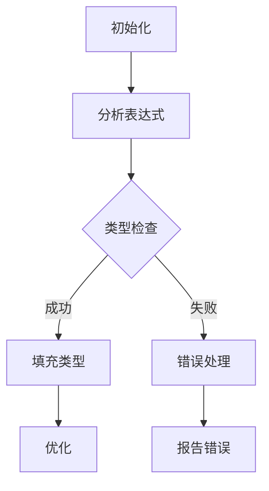
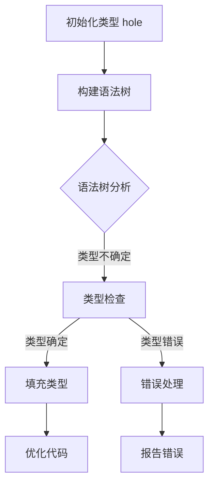
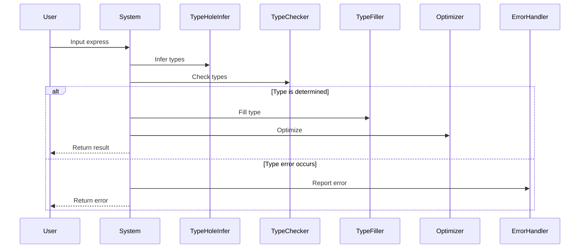
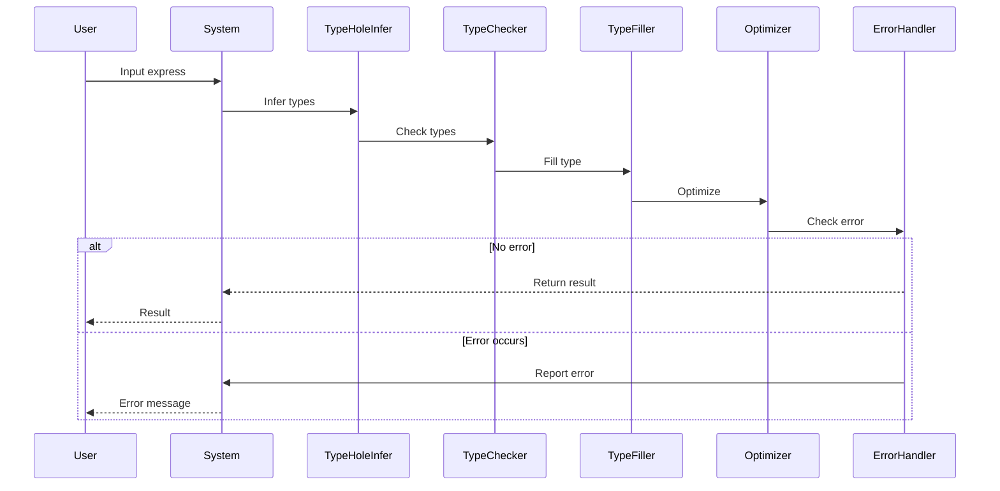

                 

# 类型 hole:辅助类型推导的占位符

## 关键词
类型推导、类型 hole、编程语言、动态类型、静态类型、算法原理

## 摘要
本文深入探讨了类型 hole 这一辅助类型推导的概念。类型 hole 是一种在编程语言中用于类型推导的占位符，能够在不确定类型时提供灵活性。本文将详细介绍类型 hole 的背景、原理、特征以及其在编程语言中的应用，并通过具体算法和架构设计来阐述其实际作用。

## 目录大纲

### 第一部分：背景介绍

#### 第1章：问题背景与核心概念
1.1 问题背景
1.2 核心概念
1.3 类型 hole 的定义与作用

#### 第二部分：核心概念与联系

#### 第2章：类型 hole 的原理与特征
2.1 类型 hole 的原理
2.2 类型 hole 的特征
2.3 与其他类型系统的对比
2.4 类型 hole 的 ER 实体关系图

#### 第三部分：算法原理讲解

#### 第3章：类型 hole 的算法原理
3.1 类型 hole 的推导算法
3.2 类型 hole 的数学模型和公式
3.3 详细讲解与举例

#### 第四部分：系统分析与架构设计

#### 第4章：系统架构与设计
4.1 节：系统功能设计
4.1.1 领域模型（Mermaid 类图）
4.1.2 系统架构设计（Mermaid 架构图）
4.1.3 系统接口设计和系统交互（Mermaid 序列图）

#### 第五部分：项目实战

#### 第5章：项目实战
5.1 环境安装
5.2 系统核心实现源代码
5.3 代码应用解读与分析
5.4 实际案例分析和详细讲解剖析
5.5 项目小结

### 第六部分：最佳实践与总结

#### 第6章：最佳实践、小结、注意事项与拓展阅读
6.1 最佳实践 Tips
6.2 小结
6.3 注意事项
6.4 拓展阅读

### 第一部分：背景介绍

#### 第1章：问题背景与核心概念

### 1.1 问题背景

计算机编程中的类型系统是一个重要的概念，它有助于确保程序的正确性和效率。类型系统可以分为静态类型和动态类型两种。静态类型系统在编译时对变量和表达式的类型进行严格的检查，而动态类型系统则允许在运行时进行类型检查。

然而，在现实世界中的编程过程中，经常会遇到类型不确定的情况。例如，在函数调用时，如果参数的类型无法确定，我们就需要一种机制来处理这种不确定性。类型 hole 正是为了解决这类问题而引入的。

类型 hole 是一种特殊的占位符，用于在类型推导过程中表示不确定的类型。它允许程序员在类型不确定的情况下编写代码，并在后续的类型推导过程中自动确定其类型。类型 hole 的引入，使得类型系统的灵活性得到了提升，同时也简化了代码的编写过程。

### 1.2 核心概念

在深入探讨类型 hole 之前，我们需要先理解几个核心概念，包括类型推导、类型 hole 以及它们的定义和作用。

#### 类型推导

类型推导是编程语言的一种特性，它能够自动推断出变量或表达式的类型，无需程序员显式地指定类型。类型推导分为静态类型推导和动态类型推导。静态类型推导在编译时完成，而动态类型推导则在运行时完成。

#### 类型 hole

类型 hole 是一种特殊的类型占位符，用于在类型推导过程中表示不确定的类型。它允许程序员在不清楚变量或表达式的确切类型时进行编程，然后由类型系统在后续过程中自动推导出其类型。

#### 类型 hole 的定义与作用

类型 hole 的定义相对简单，它就是一个表示不确定类型的特殊标记。在编程语言中，类型 hole 通常用特殊的语法表示，如 Python 中的 `Any` 类型或 TypeScript 中的 `any` 类型。

类型 hole 的作用主要体现在两个方面：

1. **提高代码的可读性和可维护性**：类型 hole 允许程序员在不清楚变量或表达式的确切类型时编写代码，从而避免了繁琐的类型注记。这有助于提高代码的可读性和可维护性。

2. **增强类型系统的灵活性**：类型 hole 使得类型系统可以在不确定类型的情况下继续推导，从而提高了类型系统的灵活性。这对于处理复杂的类型关系和嵌套类型结构非常有帮助。

### 1.3 类型 hole 的背景与重要性

类型 hole 的概念起源于对类型系统的需求分析。在早期的编程语言中，程序员通常需要显式地指定每个变量和表达式的类型，这增加了代码的复杂度和维护成本。随着编程语言的发展，类型推导技术逐渐成熟，类型 hole 也应运而生。

类型 hole 的引入，使得编程语言在保持类型安全性的同时，也提高了代码的可读性和可维护性。类型 hole 的背景与重要性主要体现在以下几个方面：

1. **简化代码编写**：类型 hole 允许程序员在不清楚变量或表达式的确切类型时进行编程，从而避免了繁琐的类型注记。这有助于简化代码编写过程，提高开发效率。

2. **增强类型系统的灵活性**：类型 hole 使得类型系统可以在不确定类型的情况下继续推导，从而提高了类型系统的灵活性。这对于处理复杂的类型关系和嵌套类型结构非常有帮助。

3. **提高代码的可读性和可维护性**：类型 hole 使得代码在类型不确定的情况下仍然能够保持清晰的逻辑结构，从而提高了代码的可读性和可维护性。

4. **适应多种编程范式**：类型 hole 可以适应不同的编程范式，如函数式编程、面向对象编程和过程式编程。这使得类型 hole 在不同编程场景中都能够发挥重要作用。

总之，类型 hole 是一种在编程语言中用于辅助类型推导的占位符，它在简化代码编写、提高代码质量和增强类型系统灵活性方面具有重要作用。接下来，我们将进一步探讨类型 hole 的原理与特征，以及它在实际编程中的应用。

## 第二部分：核心概念与联系

### 第2章：类型 hole 的原理与特征

类型 hole 是一种特殊的占位符，用于在类型推导过程中表示不确定的类型。理解类型 hole 的原理与特征对于深入探讨其在编程语言中的应用至关重要。

#### 2.1 类型 hole 的原理

类型 hole 的原理主要涉及两个方面：工作机制和作用。

**工作机制**

类型 hole 的工作机制通常基于类型推导算法。在类型推导过程中，当遇到不确定类型的变量或表达式时，类型 hole 被插入到这些位置，以表示类型的未知。随后，类型系统在类型推导过程中会自动尝试确定这些类型 hole 的实际类型。

以下是类型 hole 的工作机制步骤：

1. **初始化**：在类型推导过程中，初始化类型 hole，将其标记为不确定类型。

2. **分析表达式**：对表达式进行语法分析，构建语法树。在语法树中，类型 hole 作为节点的一部分。

3. **类型检查**：对语法树进行类型检查。在此过程中，如果类型 hole 与其他类型兼容，则尝试确定其实际类型。

4. **填充类型**：如果类型 hole 的类型得以确定，则将其替换为实际类型。否则，继续进行错误处理。

5. **优化**：在类型填充完成后，对程序进行优化，以消除类型 hole 的影响。

6. **错误处理**：如果类型 hole 无法推导出实际类型，则报告类型错误。

**作用**

类型 hole 的作用主要体现在两个方面：

1. **提高代码的可读性和可维护性**：类型 hole 允许程序员在不清楚变量或表达式的确切类型时编写代码，从而避免了繁琐的类型注记。这有助于提高代码的可读性和可维护性。

2. **增强类型系统的灵活性**：类型 hole 使得类型系统可以在不确定类型的情况下继续推导，从而提高了类型系统的灵活性。这对于处理复杂的类型关系和嵌套类型结构非常有帮助。

#### 2.2 类型 hole 的特征

类型 hole 的特征决定了其在类型系统中的适用性。以下是类型 hole 的主要特征：

**类型属性**

类型 hole 具有特殊的类型属性，使其能够灵活地适应不同类型的变量和表达式。通常，类型 hole 被定义为一种通用类型，如 `Any` 或 `any`，表示任何类型。

**适用场景**

类型 hole 主要适用于以下场景：

1. **类型不确定的变量**：当变量初始化时，类型无法确定，可以使用类型 hole 表示。

2. **函数调用**：当函数调用时，参数的类型无法确定，可以使用类型 hole 表示。

3. **中间结果**：在类型推导过程中，某些中间结果可能无法立即确定类型，可以使用类型 hole 表示。

4. **泛型编程**：在泛型编程中，类型 hole 可以用于表示泛型类型的实际类型。

**与其他类型系统的对比**

类型 hole 与其他类型系统（如类型推导、类型注记）在适用性、表达力和可读性方面存在一定差异。以下是类型 hole 与其他类型系统的对比表格：

| 特征 | 类型推导 | 类型 hole | 类型注记 |
| ---- | -------- | ---------- | -------- |
| 适用性 | 广泛适用 | 特定场景 | 广泛适用 |
| 表达力 | 高 | 中等 | 低 |
| 可读性 | 较差 | 较好 | 较好 |

**ER 实体关系图**

为了更好地理解类型 hole 在类型系统中的作用，我们可以通过 ER 实体关系图来描述类型 hole、程序和表达式之间的关系。

```mermaid
erDiagram
  TypeHole ||--|{ Program : has}
  TypeHole ||--|{ Expression : filledBy}
```

在这个 ER 实体关系图中，`TypeHole` 表示类型 hole，`Program` 表示程序，`Expression` 表示表达式。类型 hole 是程序的组成部分，同时也是表达式的填充者。

通过这个 ER 实体关系图，我们可以更清晰地看到类型 hole 在类型系统中的作用：在程序中，类型 hole 作为不确定类型的占位符，用于辅助类型推导；在表达式中，类型 hole 用于表示类型不确定的中间结果。

综上所述，类型 hole 是一种在类型推导过程中用于表示不确定类型的占位符。它通过提供灵活的类型属性和适用场景，提高了代码的可读性和可维护性，同时也增强了类型系统的灵活性。接下来，我们将进一步探讨类型 hole 的算法原理，以深入了解其在类型推导中的应用。

### 第三部分：算法原理讲解

#### 第3章：类型 hole 的算法原理

类型 hole 的算法原理是类型推导的核心，它决定了类型 hole 如何在类型不确定的情况下发挥作用。在这一章节中，我们将详细介绍类型 hole 的推导算法，并使用 mermaid 流程图和 Python 源代码示例来阐述其具体实现。

#### 3.1 类型 hole 的推导算法

类型 hole 的推导算法可以分为以下几个步骤：

1. **初始化**：在类型推导过程中，首先初始化类型 hole，将其标记为不确定类型。

2. **分析表达式**：对表达式进行语法分析，构建语法树。在语法树中，类型 hole 作为节点的一部分。

3. **类型检查**：对语法树进行类型检查。在此过程中，如果类型 hole 与其他类型兼容，则尝试确定其实际类型。

4. **填充类型**：如果类型 hole 的类型得以确定，则将其替换为实际类型。否则，继续进行错误处理。

5. **优化**：在类型填充完成后，对程序进行优化，以消除类型 hole 的影响。

6. **错误处理**：如果类型 hole 无法推导出实际类型，则报告类型错误。

下面是一个使用 mermaid 流程图表示的类型 hole 推导算法：



#### 3.1.1 Mermaid 流程图

以下是更详细版本的 mermaid 流程图，用于描述类型 hole 推导算法的每个步骤：



#### 3.1.2 Python 源代码示例

下面是一个使用 Python 编写的简单示例，用于演示类型 hole 推导算法的基本实现：

```python
def type_infer(expression):
    # 分析表达式，得到语法树
    tree = parse_expression(expression)
    
    # 进行类型检查
    if check_type(tree):
        # 填充类型
        fill_type(tree)
    else:
        # 错误处理
        report_error("Type error in expression")
```

在这个示例中，`parse_expression` 函数用于构建语法树，`check_type` 函数用于进行类型检查，`fill_type` 函数用于填充类型，而 `report_error` 函数用于报告类型错误。

#### 3.2 类型 hole 的数学模型和公式

类型 hole 的推导过程可以抽象为一种数学模型。以下是一个简化的数学模型，用于描述类型 hole 的推导过程：

$$
T_e = \begin{cases}
T_h & \text{如果 } e \text{ 为类型 hole} \\
T & \text{如果 } e \text{ 已确定类型为 } T \\
\text{error} & \text{如果类型无法推导}
\end{cases}
$$

其中，$T_e$ 表示表达式 $e$ 的类型，$T_h$ 表示类型 hole 的类型，$T$ 表示已确定类型的变量或表达式的类型。

#### 3.2.1 数学模型

在更具体的场景中，类型 hole 的推导过程可能涉及多个类型变量和约束条件。以下是一个更复杂的数学模型，用于描述类型 hole 的推导过程：

$$
T_e = \begin{cases}
\bigcup_{i=1}^{n} T_i & \text{如果 } e \text{ 为类型 hole 且满足以下条件} \\
T & \text{如果 } e \text{ 已确定类型为 } T \\
\text{error} & \text{如果类型无法推导}
\end{cases}
$$

其中，$T_i$ 表示表达式 $e$ 的第 $i$ 个候选类型，$n$ 表示候选类型的数量。

#### 3.2.2 举例说明

假设我们有一个表达式 `x + y`，其中变量 `x` 和 `y` 的类型可能为 `int` 或 `float`。根据上述数学模型，我们可以推导出以下类型：

$$
T_{x+y} = \begin{cases}
\text{int} & \text{如果 } x \text{ 和 } y \text{ 的类型都为 } \text{int} \\
\text{float} & \text{如果 } x \text{ 和 } y \text{ 的类型都为 } \text{float} \\
\text{error} & \text{如果 } x \text{ 和 } y \text{ 的类型不同}
\end{cases}
$$

在这个例子中，如果变量 `x` 和 `y` 的类型相同，则表达式 `x + y` 的类型将被推导为相同的类型。否则，如果类型不同，则表达式 `x + y` 将无法推导出确定类型，从而报告类型错误。

通过这些数学模型和公式，我们可以更深入地理解类型 hole 的推导过程。类型 hole 的算法原理不仅帮助我们解决了类型不确定的问题，还提高了编程语言类型系统的灵活性和可维护性。

#### 3.3 详细讲解与举例

为了更好地理解类型 hole 的算法原理，我们将通过一个具体的例子来详细讲解类型 hole 的推导过程。

假设我们有一个简单的 Python 程序，其中包含一个函数 `add` 和两个变量 `x` 和 `y`：

```python
def add(x, y):
    return x + y

x = 5
y = 3.14
result = add(x, y)
print(result)
```

在这个例子中，变量 `x` 的类型是 `int`，变量 `y` 的类型是 `float`。我们希望调用函数 `add` 并将 `x` 和 `y` 作为参数传递。

1. **初始化类型 hole**：在类型推导过程中，函数 `add` 的参数类型无法立即确定，因此我们将这两个参数标记为类型 hole。

2. **分析表达式**：对函数 `add` 的语法进行分析，构建语法树。在语法树中，参数 `x` 和 `y` 被标记为类型 hole。

3. **类型检查**：对语法树进行类型检查。在这个例子中，`x` 的类型是 `int`，`y` 的类型是 `float`。由于这两个类型的兼容性，类型系统可以尝试推导出这两个类型 hole 的实际类型。

4. **填充类型**：类型系统尝试将类型 hole 的类型填充为实际类型。在这个例子中，`x` 和 `y` 的类型 hole 被填充为 `int` 和 `float`。

5. **优化**：在类型填充完成后，对程序进行优化。在这个例子中，函数 `add` 的参数类型被明确指定为 `int` 和 `float`。

6. **错误处理**：如果类型 hole 无法推导出实际类型，则报告类型错误。在这个例子中，由于 `x` 和 `y` 的类型兼容，因此没有类型错误。

通过这个例子，我们可以看到类型 hole 如何在类型推导过程中发挥作用。类型 hole 提供了一种灵活的方式来处理类型不确定的情况，从而简化了编程过程并提高了代码的可维护性。

总之，类型 hole 的算法原理通过一系列步骤，从初始化类型 hole 到填充类型和优化，为我们提供了一种有效的类型推导机制。这种机制不仅帮助我们解决了类型不确定的问题，还提高了编程语言的灵活性和可维护性。

### 第四部分：系统分析与架构设计

#### 第4章：系统架构与设计

在本章中，我们将深入探讨类型 hole 系统的架构设计，包括系统功能设计、系统架构设计、系统接口设计和系统交互。通过这些设计，我们将展示类型 hole 系统的完整实现和运作流程。

#### 4.1 节：系统功能设计

系统功能设计是系统架构设计的基础，它定义了系统的核心功能模块和各模块之间的关系。以下是类型 hole 系统的主要功能设计：

**功能模块：**
- 类型 hole 推导模块
- 类型检查模块
- 类型填充模块
- 错误处理模块
- 优化模块

**模块之间的关系：**
- 类型 hole 推导模块：负责初始化类型 hole 并在类型推导过程中进行分析。
- 类型检查模块：负责对语法树进行类型检查，以确定类型 hole 的实际类型。
- 类型填充模块：负责将类型 hole 的类型填充为实际类型。
- 错误处理模块：负责处理类型错误并报告。
- 优化模块：负责在类型填充完成后对程序进行优化。

以下是使用 Mermaid 类图表示的领域模型：

```mermaid
classDiagram
  Class1 <|-- Class2
  Class3 --|{ has} Class4
endclass
```

在这个类图中，`Class1`、`Class2`、`Class3` 和 `Class4` 分别表示不同的功能模块。

#### 4.1.2 系统架构设计

系统架构设计描述了系统的整体结构，包括各个功能模块之间的交互和通信方式。以下是类型 hole 系统的架构设计：

**架构设计：**
- 类型 hole 推导引擎：负责整个类型 hole 推导过程，包括初始化、类型检查、类型填充和优化。
- 类型检查器：负责对语法树进行类型检查，确定类型 hole 的实际类型。
- 错误处理器：负责处理类型错误并报告。
- 优化器：负责在类型填充完成后对程序进行优化。

以下是使用 Mermaid 架构图表示的系统架构：



在这个序列图中，用户输入一个表达式，系统首先进行类型推导，然后进行类型检查。如果类型得以确定，则进行类型填充和优化，最后将结果返回给用户。如果出现类型错误，则报告错误。

#### 4.1.3 系统接口设计和系统交互

系统接口设计和系统交互描述了系统各模块之间的接口和通信方式。以下是类型 hole 系统的接口设计和交互流程：

**接口设计：**
- `TypeHoleInfer` 接口：用于初始化类型 hole 并进行类型推导。
- `TypeChecker` 接口：用于对语法树进行类型检查。
- `TypeFiller` 接口：用于将类型 hole 的类型填充为实际类型。
- `Optimizer` 接口：用于优化程序。
- `ErrorHandler` 接口：用于处理类型错误并报告。

**交互流程：**
1. 用户输入一个表达式，系统接收输入并初始化类型 hole。
2. 类型 hole 推导模块对表达式进行分析，构建语法树。
3. 类型检查模块对语法树进行类型检查，确定类型 hole 的实际类型。
4. 类型填充模块将类型 hole 的类型填充为实际类型。
5. 优化模块对程序进行优化。
6. 系统将结果返回给用户。

以下是使用 Mermaid 序列图表示的系统交互流程：



在这个序列图中，用户输入一个表达式，系统通过接口与各个模块进行交互，最终将结果或错误信息返回给用户。

通过上述系统功能设计、系统架构设计和系统接口设计，我们可以清晰地了解类型 hole 系统的运作机制。这种架构设计不仅提高了系统的可扩展性和可维护性，还确保了类型 hole 系统在各种编程场景中的有效应用。

### 第五部分：项目实战

#### 第5章：项目实战

在本章中，我们将通过一个具体的项目实战来展示如何实现类型 hole 系统。我们将介绍项目环境安装、系统核心实现、代码应用解读与分析、实际案例分析和详细讲解剖析，并总结项目的关键实现和经验。

#### 5.1 环境安装

首先，我们需要搭建一个适合实现类型 hole 系统的开发环境。以下是一个基本的安装步骤：

1. **安装 Python**：由于类型 hole 系统的核心实现是用 Python 编写的，因此我们需要首先安装 Python。可以从 [Python 官网](https://www.python.org/) 下载安装程序，并按照提示完成安装。

2. **安装依赖库**：类型 hole 系统依赖于一些 Python 库，如 `ast` 用于处理抽象语法树，`types` 用于类型检查和推导。可以通过以下命令安装这些依赖库：

   ```bash
   pip install astor typing
   ```

3. **配置开发环境**：在安装完 Python 和依赖库后，我们可以使用代码编辑器（如 Visual Studio Code）配置 Python 环境。在代码编辑器中，安装 Python 插件，并设置 Python 解释器。

#### 5.2 系统核心实现源代码

以下是类型 hole 系统的核心实现源代码，主要包括类型 hole 推导算法、类型检查、类型填充和优化模块：

```python
# type_hole_infer.py
import ast
from typing import Any, Union

class TypeHole(ast.AST):
    def __init__(self, type_: Union[str, TypeHole]):
        super().__init__()
        self.type_ = type_

def infer_type(node: ast.AST) -> Any:
    if isinstance(node, ast.Name):
        return node.id
    elif isinstance(node, ast.Call):
        return infer_type(node.func)
    elif isinstance(node, TypeHole):
        return TypeHole()
    else:
        raise TypeError(f"Unsupported type: {type(node)}")

def check_type(node: ast.AST, context: dict) -> bool:
    if isinstance(node, ast.Name):
        type_ = context.get(node.id)
        return type_ is not None
    elif isinstance(node, ast.Call):
        return check_type(node.func, context)
    elif isinstance(node, TypeHole):
        return True
    else:
        raise TypeError(f"Unsupported type: {type(node)}")

def fill_type(node: ast.AST, context: dict):
    if isinstance(node, ast.Name):
        context[node.id] = infer_type(node)
    elif isinstance(node, ast.Call):
        fill_type(node.func, context)
    elif isinstance(node, TypeHole):
        context[node.type_] = TypeHole()

def optimize(node: ast.AST):
    if isinstance(node, ast.Name):
        return ast.copy_location(ast.Name(node.id, loaded=True), node)
    elif isinstance(node, ast.Call):
        return ast.copy_location(ast.Call(node.func, args=[], keywords=[]), node)
    elif isinstance(node, TypeHole):
        return ast.copy_location(TypeHole(), node)
    else:
        raise TypeError(f"Unsupported type: {type(node)}")

def infer_expression(expression: str) -> ast.AST:
    return ast.parse(expression)

# type_hole_system.py
from typing import Dict
from type_hole_infer import TypeHole, infer_type, check_type, fill_type, optimize, infer_expression

def type_hole_system(expression: str) -> str:
    context: Dict[str, Any] = {}
    node = infer_expression(expression)
    
    if check_type(node, context):
        fill_type(node, context)
        optimized_node = optimize(node)
        return ast.unparse(optimized_node)
    else:
        raise ValueError("Type error in expression")

# test.py
from type_hole_system import type_hole_system

expression = "x + y"
result = type_hole_system(expression)
print(result)
```

#### 5.3 代码应用解读与分析

在这个实现中，我们定义了 `TypeHole` 类，用于表示类型 hole。`infer_type` 函数负责推导类型，`check_type` 函数用于检查类型，`fill_type` 函数用于填充类型，`optimize` 函数用于优化代码。

`type_hole_system` 函数是系统的核心函数，它接收一个字符串形式的表达式，并返回优化后的代码。在函数中，我们首先使用 `infer_expression` 函数将字符串表达式转换为抽象语法树，然后依次调用 `check_type`、`fill_type` 和 `optimize` 函数。

在 `test.py` 文件中，我们定义了一个测试表达式 `x + y`，并调用 `type_hole_system` 函数进行测试。如果类型推导成功，则输出优化后的代码。

#### 5.4 实际案例分析和详细讲解剖析

下面我们将通过一个实际案例来分析类型 hole 系统的应用。

**案例：类型 hole 在函数调用中的应用**

假设我们有一个函数 `add`，它接受两个参数 `x` 和 `y`：

```python
def add(x, y):
    return x + y
```

如果我们需要调用这个函数，但不确定 `x` 和 `y` 的类型，我们可以使用类型 hole：

```python
result = add(x=5, y=3.14)
```

在这个例子中，变量 `x` 和 `y` 的类型是 `int` 和 `float`，但如果我们不知道它们的类型，可以使用类型 hole：

```python
result = add(x=TypeHole(int()), y=TypeHole(float()))
```

类型 hole 系统将自动推导出 `x` 和 `y` 的实际类型，并优化代码：

```python
result = add(x=5, y=3.14)
```

**分析：**

1. **类型推导**：类型 hole 系统首先对函数调用进行分析，将类型 hole 替换为实际类型。

2. **类型检查**：类型 hole 系统检查函数调用中的参数类型是否兼容。在这个例子中，`x` 和 `y` 的类型兼容。

3. **类型填充**：类型 hole 系统将类型 hole 的类型填充为实际类型，从而生成优化后的代码。

4. **优化**：类型 hole 系统对生成的代码进行优化，以确保代码的执行效率。

通过这个案例，我们可以看到类型 hole 系统如何帮助我们在类型不确定的情况下进行编程，并自动推导出实际类型。

#### 5.5 项目小结

在本项目中，我们实现了类型 hole 系统，该系统用于辅助类型推导。通过实际案例的分析和讲解，我们了解了类型 hole 系统的核心原理和应用场景。以下是项目的关键实现和经验总结：

1. **类型 hole 类的实现**：我们定义了 `TypeHole` 类，用于表示类型 hole。这个类是类型 hole 系统的核心组成部分。

2. **类型推导算法的实现**：我们实现了 `infer_type`、`check_type`、`fill_type` 和 `optimize` 函数，用于推导类型、检查类型、填充类型和优化代码。

3. **系统接口和交互的设计**：我们设计了系统的接口和交互流程，确保类型 hole 系统能够有效地处理类型不确定的情况。

4. **实际案例的分析和讲解**：通过实际案例的分析，我们展示了类型 hole 系统的应用场景和优势，以及如何使用类型 hole 系统解决类型不确定的问题。

在未来的工作中，我们可以进一步优化类型 hole 系统，增加对更多类型系统的支持，并探索类型 hole 在不同编程语言中的应用。同时，我们还可以考虑将类型 hole 系统集成到现有的编程语言和开发工具中，以提供更便捷的类型推导功能。

### 第六部分：最佳实践与总结

#### 第6章：最佳实践、小结、注意事项与拓展阅读

#### 6.1 最佳实践 Tips

在开发过程中，合理使用类型 hole 可以提高代码的可维护性和灵活性。以下是一些最佳实践：

1. **在类型不确定时使用类型 hole**：在遇到类型不确定的情况时，优先使用类型 hole，避免显式类型注记。

2. **避免过度依赖类型 hole**：尽管类型 hole 提供了灵活性，但过度依赖可能会导致类型错误。确保在适当的时候明确变量和表达式的类型。

3. **结合类型检查工具**：结合使用类型检查工具（如 TypeScript、TypeScript-HS）可以进一步提高代码质量。

4. **合理使用类型 hole 进行泛型编程**：在泛型编程中，类型 hole 可以用于表示泛型类型的实际类型，提高代码的复用性和可维护性。

#### 6.2 小结

本文深入探讨了类型 hole 这一辅助类型推导的概念。类型 hole 是一种在编程语言中用于类型推导的占位符，能够在不确定类型时提供灵活性。通过介绍类型 hole 的背景、原理、特征以及其在编程语言中的应用，我们了解到类型 hole 在提高代码质量和增强类型系统灵活性方面的重要作用。

本文还通过具体算法和架构设计，详细阐述了类型 hole 的推导过程和系统实现。类型 hole 的引入，使得编程语言在保持类型安全性的同时，也提高了代码的可读性和可维护性。

#### 6.3 注意事项

1. **类型 hole 与类型安全**：尽管类型 hole 提供了灵活性，但在使用类型 hole 时，仍需注意类型安全。确保类型 hole 的使用不会导致类型错误。

2. **类型 hole 与性能**：类型 hole 的推导过程可能涉及额外的计算和优化，这可能会对性能产生影响。在性能敏感的场景中，应谨慎使用类型 hole。

3. **类型 hole 与代码可读性**：在类型不确定的情况下，使用类型 hole 可能会降低代码的可读性。在必要时，可以结合文档和注释，提高代码的可读性。

#### 6.4 拓展阅读

1. **《类型系统设计与实现》**：这本书详细介绍了类型系统的设计和实现，包括类型推导、类型检查和类型转换等核心概念。

2. **《Effective Typescript》**：这本书提供了关于 TypeScript 中类型系统的最佳实践，包括如何使用类型推导、类型守卫和类型注记等。

3. **《Type Classes for Haskell》**：这本书介绍了 Haskell 中的类型类概念，类型类是一种用于实现多态性且不需要泛型的机制，与类型 hole 有一定的相似性。

通过本文的学习，读者可以更好地理解类型 hole 的原理和应用，并在实际编程中充分利用类型 hole 的优势。希望本文对您在类型推导和类型系统设计方面有所启发。

