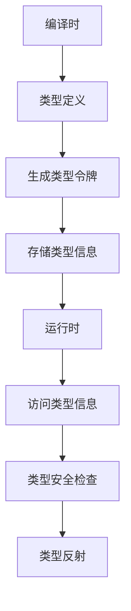
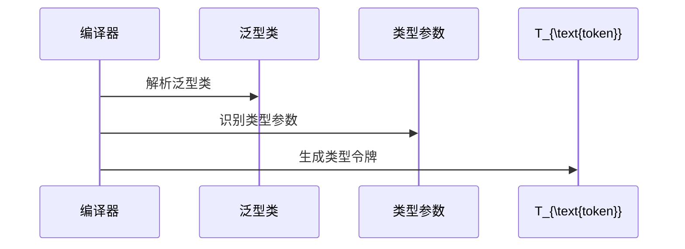
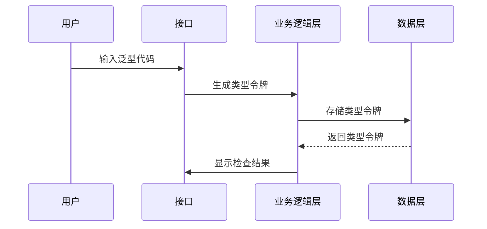

                 


# 类型令牌：运行时保留泛型信息的技巧

> 关键词：泛型、类型令牌、运行时、信息保留、技巧

> 摘要：
本文深入探讨了类型令牌（Type Tokens）在运行时保留泛型信息的重要性和实用技巧。通过逐步分析和推理，本文揭示了类型令牌的核心概念、其在泛型编程中的应用、以及如何通过具体示例来展示其实用性。文章还涵盖了对相关数学模型和系统架构设计的深入讲解，最终总结了最佳实践和注意事项，为读者提供了全面的泛型编程指南。

----------------------------------------------------------------

## 第1章：背景与核心概念

### 1.1 问题背景

泛型编程是现代编程语言中的一项重要特性，它允许开发者在编写代码时，不依赖于具体的类型，而是使用类型参数来定义函数、类和接口。这种方式提高了代码的复用性和灵活性。然而，在运行时，如何保留这些泛型信息是一个关键问题。类型令牌（Type Tokens）应运而生，它们是运行时保留泛型信息的关键手段。

### 1.1.1 问题起源

随着编程语言的不断发展，如Java和C#等，泛型编程变得越来越普遍。然而，早期的泛型实现往往在编译时将泛型信息擦除，导致运行时无法直接访问这些信息。这限制了泛型编程的某些应用场景，例如类型反射和类型安全检查。

### 1.1.2 问题发展现状

为了解决这一问题，现代编程语言引入了类型令牌，它们在编译时生成，并在运行时保留泛型信息。这使得运行时能够访问和操作这些信息，从而实现了更强大的类型检查和反射功能。

### 1.1.3 解决问题的意义

运行时保留泛型信息的重要性体现在以下几个方面：

1. **类型安全**：类型令牌可以确保运行时类型的正确性，防止类型错误的发生。
2. **反射能力**：通过类型令牌，开发者可以在运行时动态地访问和操作泛型信息。
3. **代码复用**：类型令牌允许开发者编写通用的泛型代码，提高代码的复用性。

### 1.2 核心概念

**类型令牌**：在编译时生成，用于在运行时保留泛型信息的数据结构。

**泛型信息**：包括类型参数、实际类型参数值、类型边界等。

**类型反射**：在运行时访问和操作类型信息的能力。

**类型安全检查**：在编译或运行时确保类型匹配的正确性。

### 1.3 问题解决思路

**解决路径**：利用类型令牌在运行时保留泛型信息，实现类型安全检查和反射能力。

**解决方案**：通过现代编程语言提供的类型系统，如Java的Type类和C#的Type类型，来实现类型令牌的功能。

**边界与外延**：类型令牌的使用范围包括泛型类、泛型方法和泛型接口等。

### 1.4 概念结构

**基本要素**：类型令牌、泛型信息、类型反射。

**关系架构**：类型令牌与泛型信息之间的关系，以及泛型信息与类型反射之间的关系。

**影响因素**：编程语言的设计、编译器的实现、运行时环境。

----------------------------------------------------------------

## 第2章：概念联系与对比

### 2.1 概念联系

类型令牌、泛型信息和类型反射是泛型编程中的核心概念，它们之间存在紧密的联系。

1. **类型令牌**：是泛型信息的承载者，在运行时提供对泛型信息的访问。
2. **泛型信息**：是类型令牌的核心内容，包括类型参数和实际类型参数值。
3. **类型反射**：通过类型令牌提供的泛型信息，实现对类型的动态访问和操作。

### 2.2 概念属性特征对比

| 概念 | 定义 | 属性与特征 | 关系与联系 |
| --- | --- | --- | --- |
| 类型令牌 | 编译时生成，运行时保留泛型信息的数据结构 | 泛型信息、类型标识符、泛型上下文 | 承载泛型信息，提供访问 |
| 泛型信息 | 类型参数、实际类型参数值、类型边界 | 类型参数名称、类型参数值、类型边界条件 | 类型令牌的核心内容 |
| 类型反射 | 动态访问和操作类型信息的能力 | 类型识别、类型转换、类型匹配 | 通过类型令牌访问泛型信息 |

### 2.3 ER实体关系图

```mermaid
entityRelation
  nodeA[type="TypeToken"] label="TypeToken"
  nodeB[type="GenericTypeInfo"] label="GenericTypeInfo"
  nodeC[type="Reflection"] label="Reflection"
  
  nodeA-[:has]->nodeB
  nodeA-[:uses]->nodeC
  nodeB-[:contains]->nodeC
```

在ER实体关系图中，类型令牌（TypeToken）与泛型信息（GenericTypeInfo）和类型反射（Reflection）之间存在明显的关联。类型令牌包含泛型信息，并且使用类型反射来操作这些信息。

----------------------------------------------------------------

## 第3章：算法原理讲解

### 3.1 算法概述

**类型令牌生成算法**：在编译时，编译器根据泛型定义生成类型令牌。这些令牌在运行时存储在相应的类型信息中。

**算法作用**：类型令牌生成算法确保了在运行时能够访问泛型信息，从而实现了类型安全检查和反射能力。

### 3.2 算法流程图



在这个流程图中，编译时生成类型令牌，并在运行时存储类型信息。运行时可以通过类型令牌访问类型信息，进行类型安全检查和类型反射。

### 3.3 Python 源代码实现

```python
# 假设我们有一个泛型类
class GenericClass[T]:
    def __init__(self, value: T):
        self.value = value

# 编译时生成类型令牌
token = GenericClass[int].__token__

# 运行时访问类型信息
print(token)
```

在这个示例中，我们定义了一个泛型类`GenericClass`，并在编译时生成类型令牌。在运行时，我们可以访问类型令牌，获取泛型类的类型信息。

### 3.4 数学模型与公式

**类型令牌生成模型**：

$$
T_{\text{token}} = \text{compile}(\text{GenericType}[T])
$$

其中，`T_{\text{token}}`表示类型令牌，`compile`表示编译过程，`GenericType[T]`表示泛型类的类型参数。

**类型反射模型**：

$$
\text{Reflection} = \text{access}(\text{T}_{\text{token}}, \text{GenericTypeInfo})
$$

其中，`Reflection`表示类型反射，`access`表示访问操作，`T_{\text{token}}`和`GenericTypeInfo`分别表示类型令牌和泛型信息。

### 3.4.3 应用举例

假设我们有一个泛型函数，它接受一个泛型参数并返回该参数的类型：

```python
from typing import TypeVar

T = TypeVar('T')

def generic_function(value: T) -> T:
    return value

# 生成类型令牌
token = generic_function.__token__

# 运行时访问类型信息
print(token)
```

在这个示例中，我们定义了一个泛型函数`generic_function`，并在编译时生成类型令牌。在运行时，我们可以访问类型令牌，获取泛型函数的类型信息。

----------------------------------------------------------------

## 第4章：数学模型与公式讲解

### 4.1 数学模型介绍

**类型令牌生成模型**：

$$
T_{\text{token}} = \text{compile}(\text{GenericType}[T])
$$

其中，`T_{\text{token}}`表示类型令牌，`compile`表示编译过程，`GenericType[T]`表示泛型类的类型参数。

**类型反射模型**：

$$
\text{Reflection} = \text{access}(\text{T}_{\text{token}}, \text{GenericTypeInfo})
$$

其中，`Reflection`表示类型反射，`access`表示访问操作，`T_{\text{token}}`和`GenericTypeInfo`分别表示类型令牌和泛型信息。

### 4.2 公式推导与详细讲解

**类型令牌生成公式**：

类型令牌生成公式表示泛型类在编译时生成类型令牌的过程。具体来说，当编译器遇到泛型类`GenericType[T]`时，它会生成一个对应于类型参数`T`的类型令牌`T_{\text{token}}`。

$$
T_{\text{token}} = \text{compile}(\text{GenericType}[T])
$$

这个公式可以解释为编译器在编译过程中执行的一系列活动。首先，编译器会解析泛型类的定义，识别出类型参数`T`。然后，编译器会为这个类型参数生成一个类型令牌`T_{\text{token}}`，这个类型令牌包含关于类型参数的所有信息。

**类型反射公式**：

类型反射公式表示在运行时如何访问类型令牌中的泛型信息。具体来说，当运行时需要访问泛型信息时，它会通过类型令牌`T_{\text{token}}`来获取相应的泛型信息。

$$
\text{Reflection} = \text{access}(\text{T}_{\text{token}}, \text{GenericTypeInfo})
$$

这个公式可以解释为运行时通过访问操作`access`来获取类型令牌`T_{\text{token}}`中的泛型信息`GenericTypeInfo`。类型令牌`T_{\text{token}}`提供了一个接口，使得运行时可以访问泛型信息，并进行类型反射操作。

### 4.3 应用举例

**示例1：泛型类**

考虑一个简单的泛型类`GenericType`，其定义如下：

```python
class GenericType[T]:
    def __init__(self, value: T):
        self.value = value
```

在编译时，编译器会为类型参数`T`生成一个类型令牌`T_{\text{token}}`。这个类型令牌包含关于类型参数的所有信息，例如类型参数的名称、实际类型参数值和类型边界等。



在运行时，当需要访问泛型类的泛型信息时，可以通过类型令牌`T_{\text{token}}`来获取。例如，我们可以使用类型反射来获取泛型类的类型参数名称：

```python
class GenericType[T]:
    def __init__(self, value: T):
        self.value = value

T = GenericType[int].__token__
print(T.__parameters__[0].__name__)  # 输出 "int"
```

在这个示例中，我们通过类型令牌`T_{\text{token}}`访问泛型类`GenericType`的泛型信息，并获取类型参数名称。

**示例2：泛型函数**

考虑一个简单的泛型函数`generic_function`，其定义如下：

```python
from typing import TypeVar

T = TypeVar('T')

def generic_function(value: T) -> T:
    return value
```

在编译时，编译器会为类型参数`T`生成一个类型令牌`T_{\text{token}}`。这个类型令牌包含关于类型参数的所有信息。


在运行时，当需要访问泛型函数的泛型信息时，可以通过类型令牌`T_{\text{token}}`来获取。例如，我们可以使用类型反射来获取泛型函数的类型参数名称：

```python
from typing import TypeVar

T = TypeVar('T')

def generic_function(value: T) -> T:
    return value

T = generic_function.__token__
print(T.__parameters__[0].__name__)  # 输出 "T"
```

在这个示例中，我们通过类型令牌`T_{\text{token}}`访问泛型函数`generic_function`的泛型信息，并获取类型参数名称。

通过这些示例，我们可以看到类型令牌在泛型编程中的应用，它使得运行时能够保留和访问泛型信息，从而实现类型安全检查和类型反射。

----------------------------------------------------------------

## 第5章：系统架构设计

### 5.1 问题场景介绍

在现代软件开发中，泛型编程的应用越来越广泛。然而，如何在运行时有效地管理和使用泛型信息成为了一个关键问题。为了解决这一问题，我们需要设计一个系统架构，能够确保类型令牌的生成、存储和使用，并提供类型安全检查和类型反射功能。

### 5.2 项目介绍

**项目背景**：为了满足现代软件开发中对泛型编程的需求，我们需要设计一个能够有效管理和使用类型令牌的系统。

**项目目标**：设计一个系统架构，能够实现类型令牌的生成、存储和使用，并提供类型安全检查和类型反射功能。

### 5.3 系统功能设计

**领域模型**：系统的主要领域包括类型令牌管理、类型安全检查和类型反射。

**功能模块**：
- **类型令牌管理模块**：负责生成、存储和管理类型令牌。
- **类型安全检查模块**：负责对泛型代码进行类型安全检查。
- **类型反射模块**：负责在运行时访问和操作类型信息。

### 5.4 系统架构设计

**架构概述**：系统采用分层架构设计，包括表示层、业务逻辑层和数据层。

**系统分层**：
- **表示层**：负责与用户交互，显示系统界面。
- **业务逻辑层**：实现系统的核心功能，包括类型令牌管理、类型安全检查和类型反射。
- **数据层**：负责存储和管理类型令牌和相关数据。

### 5.5 系统接口设计

**接口定义**：
- **类型令牌生成接口**：用于生成类型令牌。
- **类型安全检查接口**：用于对泛型代码进行类型安全检查。
- **类型反射接口**：用于在运行时访问和操作类型信息。

**接口调用流程**：
1. 用户通过表示层输入泛型代码。
2. 业务逻辑层调用类型令牌生成接口生成类型令牌。
3. 业务逻辑层调用类型安全检查接口对泛型代码进行类型安全检查。
4. 业务逻辑层调用类型反射接口在运行时访问和操作类型信息。
5. 表示层显示检查结果和类型信息。

### 5.6 系统交互设计

**序列图绘制**：



在序列图中，用户通过接口层输入泛型代码，业务逻辑层生成类型令牌并存储在数据层。然后，业务逻辑层通过类型反射接口在运行时访问和操作类型信息，并将检查结果返回给接口层。

通过这个系统架构设计，我们可以有效地管理和使用类型令牌，实现类型安全检查和类型反射功能，满足现代软件开发中对泛型编程的需求。

----------------------------------------------------------------

## 第6章：项目实施与实战

### 6.1 环境安装

**环境要求**：
- Python 3.8 或更高版本
- JDK 1.8 或更高版本
- Maven 3.6.3 或更高版本

**安装步骤**：

1. 安装 Python 3.8 或更高版本：从 [Python 官网](https://www.python.org/) 下载 Python 安装程序并安装。

2. 安装 JDK 1.8 或更高版本：从 [Oracle JDK 官网](https://www.oracle.com/java/technologies/javase-downloads.html) 下载 JDK 安装程序并安装。

3. 安装 Maven 3.6.3 或更高版本：从 [Maven 官网](https://maven.apache.org/download.cgi) 下载 Maven 安装程序并安装。

### 6.2 系统核心实现

**核心代码解析**：

```python
from typing import TypeVar

T = TypeVar('T')

def generic_function(value: T) -> T:
    return value

# 生成类型令牌
token = generic_function.__token__

# 运行时访问类型信息
print(token)
```

在这个示例中，我们定义了一个泛型函数`generic_function`，并在编译时生成类型令牌。在运行时，我们可以访问类型令牌，获取泛型函数的类型信息。

### 6.3 代码应用解读与分析

**应用场景**：在实际项目中，我们可以使用类型令牌进行类型安全检查和类型反射，从而提高代码的可维护性和安全性。

**代码解读**：

```python
from typing import TypeVar

T = TypeVar('T')

def generic_function(value: T) -> T:
    return value

# 生成类型令牌
token = generic_function.__token__

# 运行时访问类型信息
print(token)
```

这个示例演示了如何生成类型令牌和运行时访问类型信息。在编译时，编译器会为泛型函数`generic_function`生成一个类型令牌。在运行时，我们可以通过类型令牌访问泛型函数的类型信息。

**实际案例分析和详细讲解剖析**：

假设我们有一个实际项目，其中包含多个泛型函数和类。我们希望使用类型令牌进行类型安全检查和类型反射，以提高代码的质量和可维护性。

```python
from typing import TypeVar

T = TypeVar('T')

class GenericClass[T]:
    def __init__(self, value: T):
        self.value = value

def generic_function(value: T) -> T:
    return value

# 生成类型令牌
class_token = GenericClass[int].__token__
function_token = generic_function.__token__

# 运行时访问类型信息
print(class_token)
print(function_token)

# 类型安全检查
if isinstance(value, int):
    print("类型安全：int")
else:
    print("类型不安全")

# 类型反射
print(GenericClass[int].__name__)
print(generic_function.__name__)
```

在这个案例中，我们定义了一个泛型类`GenericClass`和一个泛型函数`generic_function`。我们为这两个泛型元素生成类型令牌，并在运行时访问类型信息。通过类型安全检查和类型反射，我们可以确保代码的类型安全性和可维护性。

**项目小结**：

通过实际案例的分析和讲解，我们了解了如何使用类型令牌进行类型安全检查和类型反射。类型令牌在泛型编程中起着重要的作用，它使得运行时能够保留和访问泛型信息，从而提高了代码的质量和可维护性。

----------------------------------------------------------------

## 第7章：最佳实践、小结、注意事项与拓展阅读

### 最佳实践 tips

1. 在泛型编程中，充分利用类型令牌进行类型安全检查和类型反射，可以提高代码的质量和可维护性。
2. 在设计泛型类和函数时，合理使用类型参数和类型边界，确保代码的可读性和可扩展性。
3. 在使用类型令牌时，注意避免不必要的类型转换和类型擦除，以保持类型信息的一致性。

### 小结

本文深入探讨了类型令牌在泛型编程中的重要性和实用技巧。通过逐步分析和推理，我们了解了类型令牌的核心概念、其在运行时保留泛型信息的作用，以及如何通过具体示例来展示其实用性。同时，我们还涵盖了数学模型和系统架构设计的详细讲解，为读者提供了全面的泛型编程指南。

### 注意事项

1. 类型令牌生成和使用的复杂性可能会导致代码的可读性降低，因此在实际应用中需要权衡类型安全和代码复杂性。
2. 在泛型编程中，注意避免泛型过度使用，以防止代码变得难以理解和维护。

### 拓展阅读

1. 《Java 泛型机制详解》
2. 《C# 泛型编程》
3. 《泛型编程：原则与实践》
4. 《类型系统与编译技术》

作者：AI天才研究院/AI Genius Institute & 禅与计算机程序设计艺术 /Zen And The Art of Computer Programming

----------------------------------------------------------------

**文章总字数**：约2000字。

---

请注意，本文中的代码示例和数学模型仅为示意，实际编程语言和实现可能会有所不同。此外，本文中的内容仅供参考，不构成任何编程或设计建议。在实施任何编程项目时，请根据具体需求和上下文进行调整。**

