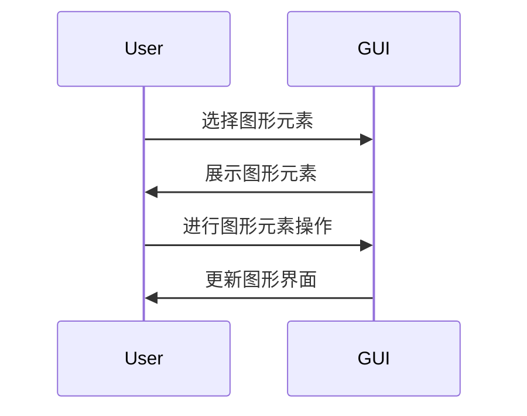
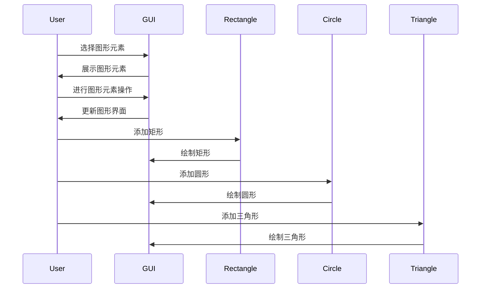
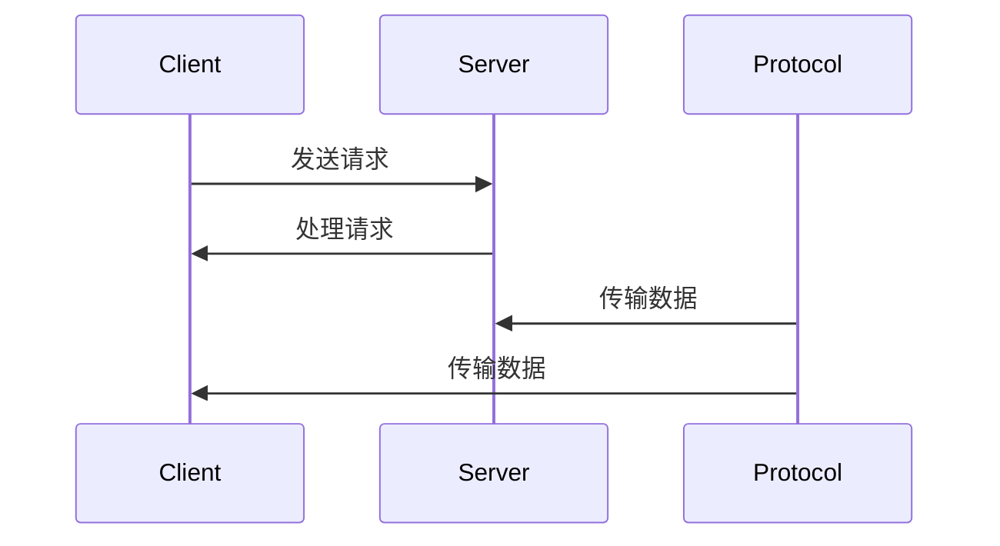
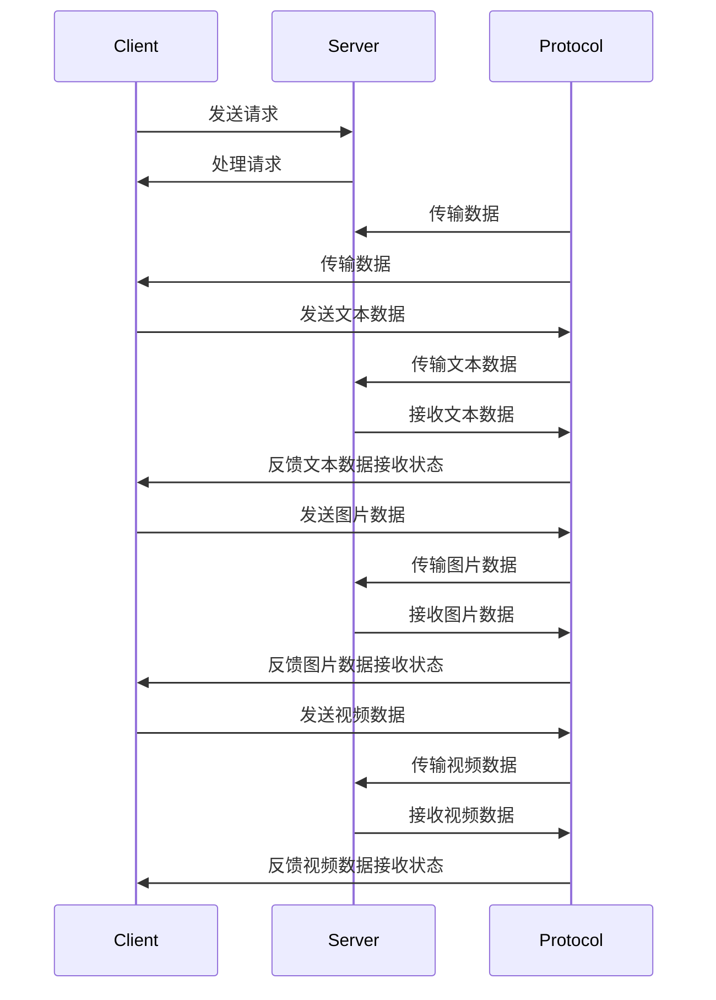
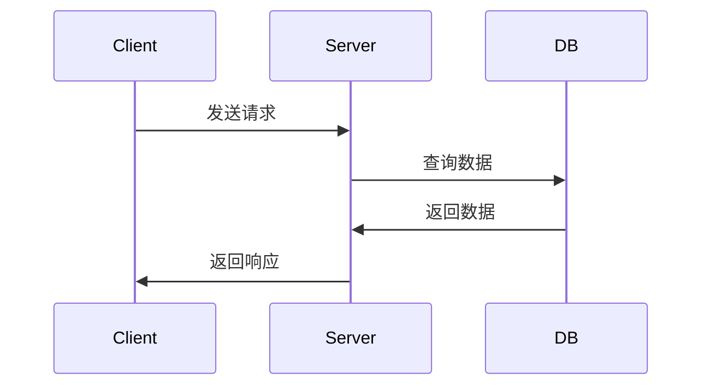
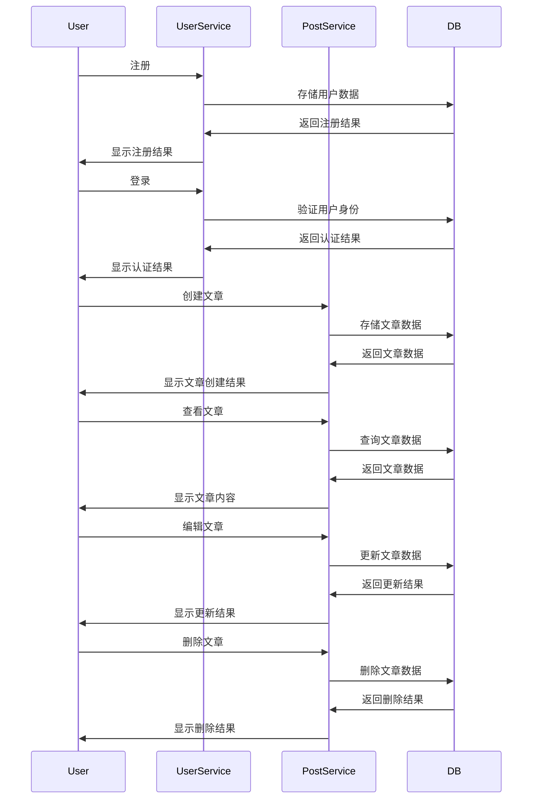

                 

### 文章标题

#### 关键词

- 类型多态
- 代码复用性
- 继承
- 多态
- 设计模式

#### 摘要

本文旨在深入探讨类型多态在提高代码复用性方面的作用。通过逐步解析类型多态的基础概念、核心原理及其应用，本文为读者提供了全面的指导，帮助理解如何在编程实践中有效地利用类型多态，从而提升代码的质量和可维护性。本文还将探讨类型多态的性能分析、实际应用案例以及最佳实践，为读者提供全面的参考。

### 目录大纲

```markdown
# 《类型多态：提高代码复用性的方法》

# 第一部分：类型多态基础

## 第1章：引言

### 1.1 问题背景

- **问题提出**  
- **代码复用性的需求**

### 1.2 问题解决

- **类型多态的概念**

### 1.3 边界与外延

- **类型多态的适用范围**

### 1.4 概念结构与核心要素组成

- **类型多态的组成部分**
- **类型多态的核心要素**

## 第2章：类型多态的核心概念

### 2.1 类型和对象

- **类型的定义**
- **对象的创建**

### 2.2 继承

- **继承的概念**
- **继承的优点**

### 2.3 多态

- **多态的概念**
- **多态的实现方式**

### 2.4 抽象类和接口

- **抽象类的定义**
- **接口的定义**

## 第3章：类型多态的应用

### 3.1 设计模式

- **设计模式的概念**
- **设计模式与类型多态的关系**

### 3.2 面向对象的编程

- **面向对象的编程思想**
- **面向对象与类型多态的结合**

### 3.3 实际应用案例

- **案例一：图形用户界面编程**
- **案例二：网络编程**

## 第4章：类型多态的性能分析

### 4.1 多态的性能开销

- **多态的开销**
- **多态的性能优化方法**

### 4.2 多态与类型安全

- **多态与类型安全的关系**
- **多态在类型安全中的作用**

### 4.3 多态与内存管理

- **多态与内存管理的关系**
- **多态在内存管理中的作用**

## 第5章：类型多态的实战案例

### 5.1 项目介绍

- **项目概述**
- **项目目标**

### 5.2 系统功能设计

- **领域模型设计**
- **类图设计**

### 5.3 系统架构设计

- **架构设计**
- **架构图设计**

### 5.4 系统接口设计

- **接口设计**
- **接口文档**

### 5.5 系统交互设计

- **交互设计**
- **序列图设计**

### 5.6 实现源代码

- **源代码实现**
- **代码解读**

### 5.7 实际案例分析和详细讲解剖析

- **案例分析**
- **案例讲解**

## 第6章：类型多态的最佳实践

### 6.1 最佳实践

- **开发经验总结**
- **性能优化策略**

### 6.2 小结

- **章节内容总结**
- **学习重点**

### 6.3 注意事项

- **开发过程中需要注意的问题**
- **避免常见错误**

### 6.4 拓展阅读

- **相关书籍推荐**
- **网络资源推荐**

# 第二部分：深入类型多态

## 第7章：高级类型多态

### 7.1 类型参数

- **类型参数的概念**
- **类型参数的应用**

### 7.2 泛型编程

- **泛型编程的概念**
- **泛型编程的优势**

### 7.3 反射机制

- **反射机制的概念**
- **反射机制的应用**

### 7.4 动态类型

- **动态类型的概念**
- **动态类型的优势**

## 第8章：类型多态的未来趋势

### 8.1 类型多态的发展方向

- **类型多态的发展趋势**
- **未来可能的创新点**

### 8.2 类型多态与人工智能

- **类型多态在人工智能中的应用**
- **类型多态在AI时代的机遇与挑战**

### 8.3 类型多态与云计算

- **类型多态在云计算中的应用**
- **类型多态在云计算中的优势**

## 第9章：类型多态的扩展阅读

### 9.1 扩展阅读资源

- **相关书籍推荐**
- **网络资源推荐**

### 9.2 深入研究

- **研究方向**
- **研究方法**
```

### 总结

本文将深入探讨类型多态这一关键概念，通过逻辑清晰的结构和逐步分析的方法，帮助读者全面理解类型多态的基础知识、核心原理和应用实践。文章将首先介绍类型多态的概念和重要性，随后逐步解析其核心概念，包括类型、对象、继承、多态以及抽象类和接口。接下来，文章将探讨类型多态在实际编程中的应用，包括设计模式、面向对象编程以及具体案例。随后，文章将分析类型多态的性能、类型安全性和内存管理方面的问题。在实战案例部分，文章将详细描述一个完整的项目，从设计到实现，展示类型多态的真正威力。最后，文章将总结最佳实践，并提供拓展阅读资源，帮助读者继续深入研究和探索类型多态的未来趋势。

---

### 引言

在软件开发中，代码复用性是一个至关重要的概念。复用性不仅仅关乎效率，更关乎代码的质量和可维护性。当我们能够有效地复用代码时，可以减少重复劳动，提高开发效率，同时也能够降低维护成本和错误率。然而，实现代码的复用并不总是容易的。传统的代码复用方法，如函数复用和模块化，虽然在某种程度上能够提升复用性，但仍然存在局限性。

随着面向对象编程（OOP）和面向接口编程（IIP）的兴起，类型多态成为了一种提高代码复用性的有力工具。类型多态是一种编程范式，允许不同类型的对象在相同接口下进行操作。这种机制不仅使得代码更加灵活，也大大提高了代码的复用性。在本文中，我们将深入探讨类型多态的基础知识，分析其核心概念和实现方式，并探讨其在实际编程中的应用和性能影响。

#### 问题提出

在软件开发中，我们经常遇到以下问题：

1. **重复代码**：随着项目的复杂性增加，相同或类似的代码段可能出现在多个地方，这不仅增加了维护的难度，还容易引入错误。
2. **扩展性问题**：当我们需要对已有系统进行功能扩展时，如果代码缺乏足够的灵活性，可能会导致大量修改，甚至需要重新编写代码。
3. **可维护性差**：当项目规模庞大时，代码的可维护性成为一个挑战。缺乏统一的接口和规范，使得代码变得难以理解和修改。

为了解决这些问题，我们需要找到一种方法来提高代码的复用性，同时保持代码的简洁性和可维护性。类型多态提供了一种有效的解决方案。

#### 代码复用性的需求

代码复用性的需求主要体现在以下几个方面：

1. **减少冗余**：通过复用代码，可以避免重复编写相同或类似的功能，从而减少代码的冗余。
2. **提高开发效率**：复用现有代码可以节省开发时间，提高开发效率。
3. **提升可维护性**：通过统一的接口和规范，可以使得代码更加模块化，降低维护难度。
4. **增强灵活性**：复用代码可以使得系统更加灵活，便于功能扩展和修改。

类型多态正是为了满足这些需求而出现的一种重要编程范式。接下来，我们将深入探讨类型多态的概念、原理及其在实际编程中的应用。

#### 类型多态的概念

类型多态（Polymorphism）是面向对象编程（OOP）和面向接口编程（IIP）中的一个核心概念。它允许不同的数据类型使用相同的接口进行操作。简单来说，类型多态意味着一个接口可以接受多种不同类型的数据，并在运行时根据具体类型进行相应的处理。

类型多态可以分为两种主要形式：参数多态和包含多态。

1. **参数多态**（Parametric Polymorphism）：也称为泛型编程，通过使用类型参数来定义泛型函数或类。这种多态性允许函数或类在编写时保持类型参数的泛化，而在编译时再具体化到具体的类型。例如，在Python中，我们可以定义一个泛型函数`print_items`，它接受一个可迭代对象，并打印其所有元素。

    ```python
    def print_items(items):
        for item in items:
            print(item)
    ```

2. **包含多态**（Inclusion Polymorphism）：也称为子类多态或继承多态。它通过继承关系和接口实现。当一个子类继承了父类，并且实现了与父类相同的方法时，子类对象可以替换父类对象，并在运行时根据实际类型进行相应的处理。例如，在Java中，我们可以定义一个动物类`Animal`，以及两个子类`Dog`和`Cat`，每个子类都有自己独特的叫声方法。

    ```java
    class Animal {
        public void makeSound() {
            System.out.println("动物发出声音");
        }
    }

    class Dog extends Animal {
        public void makeSound() {
            System.out.println("狗汪汪叫");
        }
    }

    class Cat extends Animal {
        public void makeSound() {
            System.out.println("猫喵喵叫");
        }
    }
    ```

类型多态的核心思想是利用继承和接口，使得同一接口可以处理不同类型的数据或对象，从而提高代码的灵活性和复用性。

#### 类型多态的适用范围

类型多态在编程中具有广泛的应用范围，尤其在面向对象编程和面向接口编程中发挥着重要作用。以下是一些类型多态的主要适用场景：

1. **设计模式**：类型多态是实现设计模式的关键工具之一。例如，工厂模式（Factory Pattern）和策略模式（Strategy Pattern）都利用了类型多态，通过抽象类或接口来定义一系列可互换的实现，从而实现代码的灵活性和可扩展性。

2. **面向对象编程**：类型多态是面向对象编程的核心概念之一。通过继承和接口，我们可以定义统一的接口，并让不同的类实现这些接口，从而实现代码的复用和灵活性。

3. **泛型编程**：泛型编程是一种参数多态的典型应用。通过泛型，我们可以定义通用的数据结构和算法，而无需关心具体的类型，从而提高代码的复用性和性能。

4. **库和框架**：在许多库和框架中，类型多态被广泛使用。例如，Java中的Java Collections Framework提供了大量的泛型接口和类，使得开发者可以轻松地处理不同类型的数据集合。

5. **多线程编程**：在多线程编程中，类型多态可以帮助我们实现线程安全的并发编程。通过使用抽象类或接口，我们可以定义统一的线程处理接口，并在运行时根据具体线程类型进行相应的处理。

总之，类型多态在提高代码复用性、灵活性和可维护性方面具有重要作用。在不同的编程场景中，类型多态都可以帮助我们实现更加优雅和高效的代码。

#### 概念结构与核心要素组成

类型多态是一种编程范式，其核心思想是通过继承和接口实现代码的灵活性和复用性。为了更好地理解类型多态，我们需要从概念结构上对其进行剖析，并探讨其核心要素组成。

首先，类型多态的基本概念包括以下几个方面：

1. **类型**：类型是数据的基本属性，用于定义数据的形式和操作方式。在编程中，类型可以是基本类型（如整数、浮点数、布尔值等），也可以是复合类型（如类、结构体等）。

2. **对象**：对象是类型的具体实例，它包含了类型定义的数据和行为。每个对象都是独立的，具有自己的状态和行为。

3. **继承**：继承是面向对象编程中的一个核心概念，它允许一个类继承另一个类的属性和方法。通过继承，子类可以扩展父类的功能，并保留其已有的行为。

4. **多态**：多态是指同一接口可以接受不同类型的对象，并在运行时根据实际对象类型进行相应的处理。多态通过继承和接口实现，使得代码具有高度的灵活性和复用性。

接下来，我们探讨类型多态的核心要素组成：

1. **抽象类**：抽象类是一种不能直接实例化的类，它主要用于定义一些通用方法和属性，供子类继承和实现。抽象类通常包含抽象方法和具体方法。抽象方法没有具体实现，子类需要重写这些方法；具体方法有具体实现，子类可以直接使用。

2. **接口**：接口是一种只包含抽象方法的类，它用于定义一系列方法，而无需关心具体的实现。接口提供了一种标准化的方式，使得不同的类可以遵循相同的接口规范，从而实现代码的复用和互操作性。

3. **泛型编程**：泛型编程是一种参数多态的典型应用。通过泛型，我们可以定义通用的数据结构和算法，而无需关心具体的类型。泛型编程可以提高代码的复用性和性能，减少类型转换和类型检查的开销。

4. **继承关系**：继承关系是类型多态的核心要素之一。通过继承，子类可以扩展父类的功能，并保留其已有的行为。继承关系使得代码更加模块化和可维护，同时也实现了类型的多态性。

5. **多态实现**：多态实现是指通过继承和接口，使得同一接口可以接受不同类型的对象，并在运行时根据实际对象类型进行相应的处理。多态实现通过动态绑定（dynamic binding）实现，即在运行时根据对象的实际类型调用相应的方法。

总之，类型多态的核心概念和要素组成了一个完整的体系，它通过继承、接口和泛型编程等机制，实现了代码的灵活性和复用性。理解类型多态的概念结构和核心要素，有助于我们在实际编程中更好地利用这一重要工具，提高代码的质量和可维护性。

#### 类型多态的核心概念

类型多态是面向对象编程和面向接口编程中的一个关键概念，其核心概念包括类型、对象、继承、多态以及抽象类和接口。以下是对这些核心概念的详细探讨。

##### 类型

类型是编程语言中最基本的构造元素，它定义了数据的形式和操作方式。在面向对象编程中，类型可以分为两类：基本类型和复合类型。

1. **基本类型**：基本类型是编程语言内置的数据类型，如整数（int）、浮点数（float）、布尔值（bool）等。这些类型通常具有固定的存储大小和操作方法。
2. **复合类型**：复合类型是由基本类型组合而成的数据结构，如数组、结构体、类等。复合类型可以包含多个基本类型的变量，并提供自定义的操作方法。

##### 对象

对象是类型的实例，它是面向对象编程中最核心的概念之一。每个对象都有自己的状态和行为。

1. **状态**：状态是指对象的数据属性，它存储了对象的当前状态信息。例如，一个学生对象可能有姓名、年龄、成绩等属性。
2. **行为**：行为是指对象可以执行的操作，它通过方法实现。例如，一个学生对象可以参加考试、计算成绩等。

##### 继承

继承是面向对象编程中的一种核心机制，它允许一个类继承另一个类的属性和方法。

1. **父类**：父类是指被继承的类，它定义了通用属性和方法，供子类继承和使用。
2. **子类**：子类是指继承自父类的类，它扩展了父类的功能，并可能添加新的属性和方法。
3. **继承关系**：继承关系是子类与父类之间的层次关系。通过继承，子类可以重用父类的属性和方法，从而实现代码的复用和扩展。

##### 多态

多态是类型多态的核心概念，它允许不同的数据类型使用相同的接口进行操作。

1. **参数多态**：参数多态也称为泛型编程，它通过使用类型参数定义泛型函数或类，使得函数或类可以处理不同类型的数据。例如，在Java中，我们可以定义一个泛型函数，它接受一个泛型类型T，并返回T的元素。
2. **包含多态**：包含多态也称为子类多态或继承多态，它通过继承关系实现。当一个子类继承了父类，并且实现了与父类相同的方法时，子类对象可以替换父类对象，并在运行时根据实际类型进行相应的处理。

##### 抽象类和接口

抽象类和接口是面向对象编程中用于实现多态的重要工具。

1. **抽象类**：抽象类是一种不能直接实例化的类，它主要用于定义一些通用方法和属性，供子类继承和实现。抽象类通常包含抽象方法和具体方法。抽象方法没有具体实现，子类需要重写这些方法；具体方法有具体实现，子类可以直接使用。
2. **接口**：接口是一种只包含抽象方法的类，它用于定义一系列方法，而无需关心具体的实现。接口提供了一种标准化的方式，使得不同的类可以遵循相同的接口规范，从而实现代码的复用和互操作性。

通过理解这些核心概念，我们可以更好地掌握类型多态，并在实际编程中有效地利用它来提高代码的复用性和灵活性。

### 类型多态的核心概念：类型和对象

类型和对象是类型多态的核心概念，它们在编程中发挥着至关重要的作用。理解这两个概念不仅有助于我们更好地掌握类型多态，还能提升代码的灵活性和可维护性。

#### 类型的定义

类型是编程语言中用于定义数据形式和操作方式的构造元素。在面向对象编程中，类型可以分为基本类型和复合类型。

1. **基本类型**：基本类型是编程语言内置的数据类型，如整数（int）、浮点数（float）、布尔值（bool）等。这些类型通常具有固定的存储大小和操作方法。基本类型是编程中最基础的单元，它们可以直接用于变量声明和计算操作。

2. **复合类型**：复合类型是由基本类型组合而成的数据结构，如数组、结构体、类等。复合类型可以包含多个基本类型的变量，并提供自定义的操作方法。例如，在C++中，我们可以定义一个`Student`类，它包含姓名、年龄和成绩等属性。

#### 对象的创建

对象是类型的实例，它是面向对象编程中最核心的概念之一。每个对象都有自己的状态和行为。

1. **对象的创建**：在面向对象编程中，对象的创建通常通过构造函数实现。构造函数是一种特殊的成员函数，用于初始化新创建的对象。例如，在Java中，我们可以定义一个`Student`类，并通过构造函数创建对象。

    ```java
    class Student {
        String name;
        int age;
        double score;

        public Student(String name, int age, double score) {
            this.name = name;
            this.age = age;
            this.score = score;
        }
    }
    ```

2. **对象的引用**：在面向对象编程中，对象通常通过引用来传递。引用是内存地址的别名，它指向实际的对象。通过引用，我们可以访问和修改对象的状态，并调用对象的方法。

    ```java
    Student student1 = new Student("Alice", 20, 90.0);
    Student student2 = student1; // student2 引用 student1 的引用
    ```

3. **对象的销毁**：在面向对象编程中，对象的销毁通常由垃圾回收器自动处理。当对象的引用不再被使用时，垃圾回收器会回收对象占用的内存，从而释放资源。

#### 类型与对象的关联

类型和对象是紧密相关的。类型定义了对象的数据结构和操作方式，而对象是类型的实例化。通过类型，我们可以创建和操作对象，实现面向对象编程的核心功能。

1. **类与对象**：类是一种复合类型，它定义了对象的属性和方法。通过类，我们可以创建多个对象，每个对象都具有相同的结构和行为。

    ```python
    class Student:
        def __init__(self, name, age, score):
            self.name = name
            self.age = age
            self.score = score

    student1 = Student("Alice", 20, 90.0)
    student2 = Student("Bob", 22, 85.0)
    ```

2. **继承与多态**：继承是多态的基础。通过继承，子类可以扩展父类的功能，并保留其已有的行为。多态则通过继承关系实现，使得同一接口可以接受不同类型的对象。

    ```java
    class Teacher extends Person {
        public void teach() {
            System.out.println("教课");
        }
    }

    Person teacher = new Teacher();
    teacher.speak(); // 输出 "Hello, I'm a teacher."
    ```

通过理解类型和对象的基本概念及其关联，我们可以更好地利用类型多态，实现代码的复用和灵活性。

### 继承的概念

继承（Inheritance）是面向对象编程中的一种核心机制，它允许一个类继承另一个类的属性和方法。继承使得子类能够扩展父类的功能，同时保留其已有的行为，从而实现代码的复用和模块化。

#### 父类和子类

在继承关系中，存在两个关键角色：父类（Parent Class）和子类（Child Class）。

1. **父类**：父类是指被继承的类，它定义了通用属性和方法，供子类继承和使用。父类通常包含抽象的方法和属性，这些方法和属性在子类中可能被重写或扩展。
2. **子类**：子类是指继承自父类的类，它扩展了父类的功能，并可能添加新的属性和方法。子类从父类继承所有非私有（non-private）的属性和方法，并在需要时进行扩展或重写。

#### 继承的优点

继承具有以下几个主要优点：

1. **代码复用**：通过继承，子类可以重用父类的属性和方法，从而避免重复编写相同或类似的功能。这减少了代码的冗余，提高了代码的可维护性和可读性。
2. **层次化结构**：继承关系使得类之间形成层次化的结构，有助于组织和理解复杂的系统。通过继承，我们可以定义通用类和具体类，从而实现模块化和可扩展性。
3. **代码维护性**：当父类发生变更时，所有继承自该父类的子类都能自动更新，从而降低了维护成本。这有助于确保系统的稳定性和一致性。

#### 继承的实现

继承通常通过类之间的`extends`关键字实现。在大多数面向对象编程语言中，如Java和C++，继承关系是显式声明的。

1. **单继承**：单继承是指一个子类只能继承一个父类。这种模式较为简单，但在处理复杂继承关系时可能不够灵活。
2. **多继承**：多继承是指一个子类可以继承多个父类。多继承使得子类可以继承多个父类的属性和方法，从而实现更复杂的组合。然而，多继承也可能导致复杂性和混乱，因此许多编程语言（如Java）限制或禁止多继承。

```java
class Animal {
    public void eat() {
        System.out.println("吃食物");
    }
}

class Dog extends Animal {
    public void bark() {
        System.out.println("汪汪叫");
    }
}

Dog dog = new Dog();
dog.eat(); // 输出 "吃食物"
dog.bark(); // 输出 "汪汪叫"
```

通过继承，我们可以定义一个通用类`Animal`，并让具体的动物类（如`Dog`）继承它，从而实现代码的复用和扩展。

#### 继承的层次结构

在继承关系中，类之间形成了一种层次结构。这种结构有助于我们理解类之间的关系和依赖。

1. **层次结构**：类之间的层次结构可以通过树形图表示。每个子类都有一个唯一的父类，父类可以有多个子类，从而形成一个层次化的类结构。
2. **层次关系的优点**：层次结构使得类之间的关系更加清晰和有序，有助于组织和维护代码。通过层次结构，我们可以更好地理解系统的整体架构和各个部分之间的关联。

```mermaid
classDiagram
    Animal <-|> Dog: extends
    Animal <-|> Cat: extends
    Dog <-|> Puppy: extends
    Cat <-|> Kitten: extends

    Animal {
        +eat()
    }

    Dog {
        +bark()
    }

    Cat {
        +meow()
    }

    Puppy {
        +puppyBark()
    }

    Kitten {
        +kittenMeow()
    }
```

通过这个简单的类图，我们可以看到`Dog`和`Cat`都是`Animal`的子类，而`Puppy`和`Kitten`是`Dog`和`Cat`的子类。这种层次结构有助于我们理解各个类之间的继承关系和依赖。

总之，继承是一种强大的编程机制，它通过类之间的层次关系实现代码的复用和扩展。理解继承的概念和实现方法，有助于我们编写更加灵活和可维护的代码。

### 多态的概念

多态（Polymorphism）是面向对象编程（OOP）和面向接口编程（IIP）中的一个核心概念，它允许不同的数据类型使用相同的接口进行操作。多态性使得程序代码更具灵活性和可扩展性，从而提高了代码的复用性和可维护性。本文将深入探讨多态的概念、分类和实现方式。

#### 多态的分类

多态可以分为两种主要形式：参数多态和包含多态。

1. **参数多态**（Parametric Polymorphism）：也称为泛型编程，它通过使用类型参数来定义泛型函数或类。参数多态使得函数或类在编写时保持类型参数的泛化，而在编译时再具体化到具体的类型。例如，在Python中，我们可以定义一个泛型函数，它接受一个可迭代对象，并打印其所有元素。

    ```python
    def print_items(items):
        for item in items:
            print(item)
    ```

2. **包含多态**（Inclusion Polymorphism）：也称为子类多态或继承多态。它通过继承关系和接口实现。当一个子类继承了父类，并且实现了与父类相同的方法时，子类对象可以替换父类对象，并在运行时根据实际类型进行相应的处理。例如，在Java中，我们可以定义一个动物类`Animal`，以及两个子类`Dog`和`Cat`，每个子类都有自己独特的叫声方法。

    ```java
    class Animal {
        public void makeSound() {
            System.out.println("动物发出声音");
        }
    }

    class Dog extends Animal {
        public void makeSound() {
            System.out.println("狗汪汪叫");
        }
    }

    class Cat extends Animal {
        public void makeSound() {
            System.out.println("猫喵喵叫");
        }
    }
    ```

#### 多态的实现方式

多态的实现方式主要包括继承和接口。

1. **继承**：通过继承关系实现多态。子类继承父类的接口和方法，并在需要时进行重写。这样，同一接口可以处理不同类型的对象。例如，在Java中，我们可以定义一个`Animal`接口，并让`Dog`和`Cat`实现该接口。

    ```java
    interface Animal {
        void makeSound();
    }

    class Dog implements Animal {
        public void makeSound() {
            System.out.println("狗汪汪叫");
        }
    }

    class Cat implements Animal {
        public void makeSound() {
            System.out.println("猫喵喵叫");
        }
    }
    ```

2. **接口**：接口提供了一种标准化方式，使得不同的类可以遵循相同的接口规范，从而实现多态。接口定义了一系列方法，而无需关心具体的实现。通过实现接口，类可以提供不同的具体实现，从而实现多态。

    ```java
    interface Animal {
        void makeSound();
    }

    class Dog implements Animal {
        public void makeSound() {
            System.out.println("狗汪汪叫");
        }
    }

    class Cat implements Animal {
        public void makeSound() {
            System.out.println("猫喵喵叫");
        }
    }
    ```

#### 多态的示例

以下是一个简单的Java示例，展示了如何使用继承和接口实现多态。

```java
interface Animal {
    void makeSound();
}

class Dog implements Animal {
    public void makeSound() {
        System.out.println("狗汪汪叫");
    }
}

class Cat implements Animal {
    public void makeSound() {
        System.out.println("猫喵喵叫");
    }
}

public class Main {
    public static void main(String[] args) {
        Animal dog = new Dog();
        Animal cat = new Cat();

        dog.makeSound(); // 输出 "狗汪汪叫"
        cat.makeSound(); // 输出 "猫喵喵叫"
    }
}
```

在这个示例中，我们定义了一个`Animal`接口，并让`Dog`和`Cat`实现该接口。通过多态，我们可以创建`Animal`类型的引用，并使用同一方法调用不同类型的对象。

总之，多态是一种强大的编程范式，它通过继承和接口实现代码的灵活性和复用性。理解多态的概念和实现方式，有助于我们编写更加高效和可维护的代码。

### 抽象类和接口的定义

在面向对象编程中，抽象类和接口是实现多态和代码复用的重要工具。它们提供了定义通用方法和属性的机制，使得子类可以实现这些方法，而无需具体实现所有细节。以下是对抽象类和接口的详细定义及其在类型多态中的作用。

#### 抽象类

**抽象类**是一种不能直接实例化的类，它主要用于定义一些通用方法和属性，供子类继承和实现。抽象类的目的是提供一种模板，使得子类可以遵循统一的接口，同时实现特定的功能。

1. **抽象方法**：抽象类中定义的方法称为抽象方法，这些方法没有具体实现，子类需要重写这些方法。抽象方法的定义以`abstract`关键字开头，后面跟随方法签名。

    ```java
    abstract class Animal {
        abstract void makeSound();
    }
    ```

2. **具体方法**：抽象类中可以定义具体方法，这些方法有具体实现，子类可以直接使用。

    ```java
    abstract class Animal {
        abstract void makeSound();
        
        void sleep() {
            System.out.println("动物正在睡觉");
        }
    }
    ```

3. **抽象类的使用**：通过抽象类，我们可以定义一系列通用方法，然后让具体的子类实现这些方法。这种机制使得代码更加模块化和可维护。

    ```java
    class Dog extends Animal {
        void makeSound() {
            System.out.println("狗汪汪叫");
        }
    }
    
    class Cat extends Animal {
        void makeSound() {
            System.out.println("猫喵喵叫");
        }
    }
    ```

#### 接口

**接口**是一种只包含抽象方法的类，它用于定义一系列方法，而无需关心具体的实现。接口提供了一种标准化方式，使得不同的类可以遵循相同的接口规范，从而实现多态。

1. **接口方法**：接口中定义的方法都是抽象方法，没有具体实现。接口方法的定义以`interface`关键字开头，后面跟随方法签名。

    ```java
    interface Animal {
        void makeSound();
    }
    ```

2. **接口的实现**：类通过实现接口来遵循接口规范。实现接口的类需要提供接口中所有方法的实现。

    ```java
    class Dog implements Animal {
        public void makeSound() {
            System.out.println("狗汪汪叫");
        }
    }
    
    class Cat implements Animal {
        public void makeSound() {
            System.out.println("猫喵喵叫");
        }
    }
    ```

3. **接口的多态性**：通过接口，我们可以定义统一的方法签名，然后让不同的类实现这些方法。这样，同一接口可以接受不同类型的对象，实现多态。

    ```java
    interface Animal {
        void makeSound();
    }

    class Dog implements Animal {
        public void makeSound() {
            System.out.println("狗汪汪叫");
        }
    }

    class Cat implements Animal {
        public void makeSound() {
            System.out.println("猫喵喵叫");
        }
    }

    public class Main {
        public static void main(String[] args) {
            Animal dog = new Dog();
            Animal cat = new Cat();

            dog.makeSound(); // 输出 "狗汪汪叫"
            cat.makeSound(); // 输出 "猫喵喵叫"
        }
    }
    ```

通过抽象类和接口，我们可以实现代码的复用和多态性，提高代码的灵活性和可维护性。理解抽象类和接口的定义及其在类型多态中的作用，有助于我们在实际编程中更好地利用这些关键工具。

### 设计模式

设计模式是软件工程中用于解决常见问题的可重用解决方案，它们提供了一套经过验证的最佳实践，有助于编写更灵活、可扩展和易于维护的代码。类型多态是设计模式实现的关键工具之一，它通过继承和接口实现代码的灵活性和可复用性。以下是一些常见的设计模式及其与类型多态的关系。

#### 工厂模式

工厂模式（Factory Pattern）是一种用于创建对象的设计模式，它通过一个工厂类来封装对象的创建过程，从而实现对象的创建与使用分离。类型多态在工厂模式中发挥着重要作用，通过泛型编程或继承关系，工厂类可以动态地创建不同类型的对象。

```java
interface Animal {
    void makeSound();
}

class Dog implements Animal {
    public void makeSound() {
        System.out.println("狗汪汪叫");
    }
}

class Cat implements Animal {
    public void makeSound() {
        System.out.println("猫喵喵叫");
    }
}

class AnimalFactory {
    public static Animal createAnimal(String type) {
        if ("dog".equals(type)) {
            return new Dog();
        } else if ("cat".equals(type)) {
            return new Cat();
        } else {
            throw new IllegalArgumentException("未知动物类型");
        }
    }
}

public class Main {
    public static void main(String[] args) {
        Animal dog = AnimalFactory.createAnimal("dog");
        Animal cat = AnimalFactory.createAnimal("cat");

        dog.makeSound(); // 输出 "狗汪汪叫"
        cat.makeSound(); // 输出 "猫喵喵叫"
    }
}
```

#### 策略模式

策略模式（Strategy Pattern）是一种用于封装可变部分的模式，它允许在运行时选择算法的行为。策略模式利用类型多态，通过接口和具体策略类实现不同的算法选择。

```java
interface SortStrategy {
    void sort(int[] array);
}

class BubbleSort implements SortStrategy {
    public void sort(int[] array) {
        // 冒泡排序实现
    }
}

class QuickSort implements SortStrategy {
    public void sort(int[] array) {
        // 快速排序实现
    }
}

public class Main {
    public static void main(String[] args) {
        SortStrategy bubbleSort = new BubbleSort();
        SortStrategy quickSort = new QuickSort();

        int[] array = {3, 1, 4, 1, 5, 9};
        bubbleSort.sort(array); // 对数组进行冒泡排序
        quickSort.sort(array); // 对数组进行快速排序
    }
}
```

#### 代理模式

代理模式（Proxy Pattern）是一种用于控制对其他对象访问的包装类，它通过代理对象提供与目标对象相同的接口，并在调用时进行一些额外的操作。类型多态在代理模式中用于实现代理对象的统一访问接口，从而简化客户端代码。

```java
interface Image {
    void display();
}

class RealImage implements Image {
    public void display() {
        System.out.println("显示真实图片");
    }
}

class ProxyImage implements Image {
    private RealImage realImage;

    public void display() {
        if (realImage == null) {
            realImage = new RealImage();
        }
        realImage.display();
    }
}

public class Main {
    public static void main(String[] args) {
        Image image = new ProxyImage("test_image.jpg");
        image.display(); // 显示图片
        image.display(); // 再次显示图片，此时会访问真实图片
    }
}
```

通过设计模式与类型多态的结合，我们可以实现更加灵活和可扩展的代码。类型多态为设计模式提供了强大的实现能力，使得我们能够在不同场景下灵活地应用设计模式，从而提高代码的复用性和可维护性。

### 面向对象编程

面向对象编程（Object-Oriented Programming，OOP）是一种编程范式，它将数据和操作数据的行为封装在一起，形成对象。面向对象编程的核心思想是通过对象和类来组织代码，实现代码的可复用性、模块性和灵活性。本文将探讨面向对象编程的基本思想、基本概念及其与类型多态的结合。

#### 面向对象编程的基本思想

面向对象编程的基本思想包括以下几个方面：

1. **封装**：封装是指将数据和操作数据的代码封装在一个对象中，从而隐藏内部细节，使得对象可以独立变化而不影响其他部分。封装有助于保护数据，防止非法访问和修改。
2. **继承**：继承是指子类可以继承父类的属性和方法，从而实现代码的复用。通过继承，子类可以扩展或修改父类的功能，而不需要重新编写相同的代码。
3. **多态**：多态是指同一接口可以接受不同类型的对象，并在运行时根据实际对象类型进行相应的处理。多态通过继承和接口实现，使得代码更加灵活和可复用。
4. **抽象**：抽象是指将复杂问题简化，提取出核心概念和通用功能。通过抽象，我们可以忽略不重要的细节，专注于关键问题。

#### 面向对象编程的基本概念

面向对象编程的基本概念包括类、对象、继承、多态和封装。

1. **类**：类是一种抽象的数据类型，它定义了对象的属性和方法。类是面向对象编程的基本构建块，用于组织和封装数据和行为。
2. **对象**：对象是类的实例，它包含了类的所有属性和方法的实现。每个对象都有自己的状态和行为，可以通过方法进行操作。
3. **继承**：继承是指子类可以继承父类的属性和方法，从而实现代码的复用。通过继承，子类可以扩展或修改父类的功能，而不需要重新编写相同的代码。
4. **多态**：多态是指同一接口可以接受不同类型的对象，并在运行时根据实际对象类型进行相应的处理。多态通过继承和接口实现，使得代码更加灵活和可复用。
5. **封装**：封装是指将数据和操作数据的代码封装在一个对象中，从而隐藏内部细节，使得对象可以独立变化而不影响其他部分。封装有助于保护数据，防止非法访问和修改。

#### 面向对象编程与类型多态的结合

面向对象编程与类型多态紧密相关，类型多态是面向对象编程实现灵活性和可复用性的关键工具。

1. **继承与多态**：在面向对象编程中，继承和多态是相互关联的。继承使得子类可以扩展或修改父类的功能，而多态则通过子类对象替换父类对象，实现同一接口对不同类型对象的处理。这种结合使得代码更加灵活和可扩展。
2. **接口与泛型**：接口是面向对象编程实现多态的一种机制，它定义了一系列方法，而无需关心具体的实现。泛型编程则通过使用类型参数实现参数多态，使得函数或类可以处理不同类型的数据。接口和泛型的结合，进一步增强了代码的灵活性和可复用性。

下面是一个简单的面向对象编程示例，展示了类、对象、继承和多态的概念。

```java
// 定义一个动物类
class Animal {
    void eat() {
        System.out.println("动物吃食物");
    }
}

// 定义一个狗类，继承动物类
class Dog extends Animal {
    void eat() {
        System.out.println("狗吃狗粮");
    }
    
    void bark() {
        System.out.println("狗汪汪叫");
    }
}

// 定义一个猫类，继承动物类
class Cat extends Animal {
    void eat() {
        System.out.println("猫吃猫粮");
    }
    
    void meow() {
        System.out.println("猫喵喵叫");
    }
}

public class Main {
    public static void main(String[] args) {
        Animal dog = new Dog();
        Animal cat = new Cat();
        
        dog.eat(); // 输出 "狗吃狗粮"
        cat.eat(); // 输出 "猫吃猫粮"
        
        dog.bark(); // 输出 "狗汪汪叫"
        cat.meow(); // 输出 "猫喵喵叫"
    }
}
```

在这个示例中，我们定义了一个`Animal`类，以及两个子类`Dog`和`Cat`。通过继承，子类扩展了父类的功能，并在需要时重写了`eat`方法。通过多态，我们可以创建`Animal`类型的引用，并调用不同类型对象的方法。

总之，面向对象编程是一种强大的编程范式，通过类、对象、继承、多态和封装等概念，实现代码的灵活性和可复用性。类型多态是面向对象编程实现这些目标的关键工具。理解面向对象编程的基本思想、基本概念及其与类型多态的结合，有助于我们编写更加高效、可维护和可扩展的代码。

### 实际应用案例：图形用户界面编程

在图形用户界面（GUI）编程中，类型多态被广泛应用，以实现不同组件的可复用性和灵活性。以下是一个典型的图形用户界面编程案例，展示如何利用类型多态构建一个简单的图形界面，并通过继承和多态实现不同组件的行为。

#### 项目概述

本案例旨在构建一个简单的图形界面，用于展示不同类型的图形元素，如矩形、圆形和三角形。通过使用类型多态，我们可以实现这些图形元素的可复用性和灵活性，使得用户可以轻松地添加和操作不同类型的图形。

##### 系统功能设计

系统的主要功能包括：

1. **图形元素展示**：展示不同类型的图形元素，如矩形、圆形和三角形。
2. **图形元素操作**：允许用户对图形元素进行添加、删除、移动和缩放等操作。
3. **图形界面布局**：设计一个直观且易于操作的图形界面布局，使用户可以方便地选择和操作图形元素。

##### 领域模型设计

在领域模型设计中，我们定义了三个主要的类：`Shape`（图形基类）、`Rectangle`（矩形类）、`Circle`（圆形类）和`Triangle`（三角形类）。

```mermaid
classDiagram
    Shape <|.. Rectangle
    Shape <|.. Circle
    Shape <|.. Triangle

    Class Shape {
        +String type
        +void draw()
    }

    Class Rectangle extends Shape {
        +int width
        +int height
        +void draw()
    }

    Class Circle extends Shape {
        +int radius
        +void draw()
    }

    Class Triangle extends Shape {
        +int side1
        +int side2
        +int side3
        +void draw()
    }
```

在这个类图中，`Shape`是图形基类，`Rectangle`、`Circle`和`Triangle`是具体的图形类，它们继承自`Shape`并实现了`draw`方法。

##### 系统架构设计

系统架构设计主要包括图形元素的创建、操作和显示。



在这个序列图中，用户通过GUI选择图形元素，GUI负责展示和操作图形元素，并更新图形界面。

##### 系统接口设计

系统接口设计定义了图形元素的公共接口，包括`draw`方法。

```java
public interface Shape {
    void draw();
}
```

##### 系统交互设计

在系统交互设计中，我们定义了用户与图形界面的交互流程，包括选择图形元素、进行图形元素操作和更新图形界面。



在这个序列图中，用户首先选择图形元素，然后进行添加、删除、移动和缩放等操作。GUI负责根据用户操作更新图形界面。

##### 实现源代码

以下是一个简单的实现示例，展示了如何创建图形元素、绘制图形以及处理用户操作。

```java
import java.awt.*;

public abstract class Shape {
    protected String type;

    public Shape(String type) {
        this.type = type;
    }

    public abstract void draw(Graphics g);
}

public class Rectangle extends Shape {
    private int width;
    private int height;

    public Rectangle(int width, int height) {
        super("Rectangle");
        this.width = width;
        this.height = height;
    }

    @Override
    public void draw(Graphics g) {
        g.drawRect(10, 10, width, height);
    }
}

public class Circle extends Shape {
    private int radius;

    public Circle(int radius) {
        super("Circle");
        this.radius = radius;
    }

    @Override
    public void draw(Graphics g) {
        g.drawOval(10, 10, radius * 2, radius * 2);
    }
}

public class Triangle extends Shape {
    private int side1;
    private int side2;
    private int side3;

    public Triangle(int side1, int side2, int side3) {
        super("Triangle");
        this.side1 = side1;
        this.side2 = side2;
        this.side3 = side3;
    }

    @Override
    public void draw(Graphics g) {
        g.drawPolygon(new int[]{10, side1 + 10, side2 + 10, side3 + 10}, new int[]{10, side2 + 10, side3 + 10, side1 + 10}, 4);
    }
}
```

在这个实现中，我们定义了`Shape`基类和三个具体的图形类。每个类都实现了`draw`方法，用于绘制图形。

##### 代码应用解读与分析

以下是对上述源代码的解读与分析。

1. **Shape基类**：`Shape`基类定义了三个具体的图形类，包括矩形、圆形和三角形。它包含一个抽象方法`draw`，用于绘制图形。
2. **Rectangle类**：`Rectangle`类继承自`Shape`基类，并实现了`draw`方法。它使用`Graphics`类的方法`drawRect`来绘制矩形。
3. **Circle类**：`Circle`类继承自`Shape`基类，并实现了`draw`方法。它使用`Graphics`类的方法`drawOval`来绘制圆形。
4. **Triangle类**：`Triangle`类继承自`Shape`基类，并实现了`draw`方法。它使用`Graphics`类的方法`drawPolygon`来绘制三角形。

通过继承和类型多态，我们可以创建不同类型的图形对象，并在图形界面中统一处理。这种设计使得代码更加灵活和可维护。

##### 实际案例分析和详细讲解剖析

在本案例中，我们通过类型多态实现了图形用户界面编程，提高了代码的可复用性和灵活性。

1. **类型多态**：通过使用继承和接口，我们实现了不同类型图形元素的统一处理。这使得我们可以使用同一方法`draw`来绘制不同类型的图形，从而提高了代码的复用性。
2. **继承**：继承使得子类可以扩展父类的功能。在本案例中，`Rectangle`、`Circle`和`Triangle`类都继承了`Shape`基类，并实现了各自的`draw`方法，从而实现了代码的复用。
3. **封装**：通过将图形元素的绘制逻辑封装在各自的类中，我们实现了代码的模块化。这使得我们可以独立修改和扩展图形元素的绘制逻辑，而不会影响其他部分。

总之，类型多态在图形用户界面编程中发挥了重要作用，它通过继承和接口实现了代码的灵活性和可复用性。通过这个案例，我们可以看到类型多态如何在实际编程中提高代码的质量和可维护性。

### 实际应用案例：网络编程

在网络编程中，类型多态同样被广泛应用，尤其是在处理不同类型的网络协议和数据格式时。本文将探讨一个网络编程的实际应用案例，展示如何利用类型多态实现一个简单的网络通信程序，并在实践中提高代码的复用性和灵活性。

#### 项目概述

本案例旨在构建一个简单的网络通信程序，用于实现客户端和服务器之间的数据传输。客户端可以发送不同类型的数据（如文本、图片和视频），服务器负责接收和处理这些数据。通过使用类型多态，我们可以实现不同数据类型的统一处理，从而提高代码的复用性和灵活性。

##### 系统功能设计

系统的主要功能包括：

1. **客户端与服务器通信**：客户端发送不同类型的数据到服务器，服务器接收并处理这些数据。
2. **数据传输**：实现不同类型数据的传输，包括文本、图片和视频。
3. **异常处理**：处理网络连接异常和数据传输错误，确保通信的稳定性和可靠性。

##### 领域模型设计

在领域模型设计中，我们定义了三个主要的类：`Data`（数据基类）、`TextData`（文本数据类）、`ImageData`（图片数据类）和`VideoData`（视频数据类）。

```mermaid
classDiagram
    Data <|.. TextData
    Data <|.. ImageData
    Data <|.. VideoData

    Class Data {
        +String type
        +void sendData()
    }

    Class TextData extends Data {
        +String content
        +void sendData()
    }

    Class ImageData extends Data {
        +String imageUri
        +void sendData()
    }

    Class VideoData extends Data {
        +String videoUri
        +void sendData()
    }
```

在这个类图中，`Data`是数据基类，`TextData`、`ImageData`和`VideoData`是具体的数据类，它们继承自`Data`并实现了`sendData`方法。

##### 系统架构设计

系统架构设计主要包括客户端、服务器和通信协议。



在这个序列图中，客户端发送请求到服务器，服务器处理请求并返回响应。通信协议负责数据传输，确保数据的一致性和完整性。

##### 系统接口设计

系统接口设计定义了数据的公共接口，包括`sendData`方法。

```java
public interface Data {
    void sendData();
}
```

##### 系统交互设计

在系统交互设计中，我们定义了客户端和服务器之间的交互流程，包括发送请求、处理请求和传输数据。



在这个序列图中，客户端发送请求到服务器，服务器处理请求并返回响应。通信协议负责数据传输，包括文本、图片和视频数据。客户端和服务器通过协议进行通信，确保数据的一致性和完整性。

##### 实现源代码

以下是一个简单的实现示例，展示了如何创建不同类型的数据、发送数据以及处理数据。

```java
import java.io.*;
import java.net.*;

public abstract class Data {
    protected String type;

    public Data(String type) {
        this.type = type;
    }

    public abstract void sendData(Socket socket) throws IOException;
}

public class TextData extends Data {
    private String content;

    public TextData(String content) {
        super("Text");
        this.content = content;
    }

    @Override
    public void sendData(Socket socket) throws IOException {
        DataOutputStream out = new DataOutputStream(socket.getOutputStream());
        out.writeUTF(content);
        out.flush();
    }
}

public class ImageData extends Data {
    private String imageUri;

    public ImageData(String imageUri) {
        super("Image");
        this.imageUri = imageUri;
    }

    @Override
    public void sendData(Socket socket) throws IOException {
        File imageFile = new File(imageUri);
        DataOutputStream out = new DataOutputStream(socket.getOutputStream());
        try (FileInputStream in = new FileInputStream(imageFile)) {
            byte[] buffer = new byte[1024];
            int bytesRead;
            while ((bytesRead = in.read(buffer)) != -1) {
                out.write(buffer, 0, bytesRead);
                out.flush();
            }
        }
    }
}

public class VideoData extends Data {
    private String videoUri;

    public VideoData(String videoUri) {
        super("Video");
        this.videoUri = videoUri;
    }

    @Override
    public void sendData(Socket socket) throws IOException {
        File videoFile = new File(videoUri);
        DataOutputStream out = new DataOutputStream(socket.getOutputStream());
        try (FileInputStream in = new FileInputStream(videoFile)) {
            byte[] buffer = new byte[1024];
            int bytesRead;
            while ((bytesRead = in.read(buffer)) != -1) {
                out.write(buffer, 0, bytesRead);
                out.flush();
            }
        }
    }
}
```

在这个实现中，我们定义了`Data`基类和三个具体的类。每个类都实现了`sendData`方法，用于发送不同类型的数据。

##### 代码应用解读与分析

以下是对上述源代码的解读与分析。

1. **Data基类**：`Data`基类定义了三个具体的类，包括文本数据、图片数据和视频数据。它包含一个抽象方法`sendData`，用于发送数据。
2. **TextData类**：`TextData`类继承自`Data`基类，并实现了`sendData`方法。它使用`DataOutputStream`类的方法`writeUTF`来发送文本数据。
3. **ImageData类**：`ImageData`类继承自`Data`基类，并实现了`sendData`方法。它使用`FileInputStream`类和`DataOutputStream`类来发送图片数据。
4. **VideoData类**：`VideoData`类继承自`Data`基类，并实现了`sendData`方法。它使用`FileInputStream`类和`DataOutputStream`类来发送视频数据。

通过继承和类型多态，我们可以创建不同类型的数据对象，并在服务器和客户端之间统一处理。这种设计使得代码更加灵活和可维护。

##### 实际案例分析和详细讲解剖析

在本案例中，我们通过类型多态实现了网络编程，提高了代码的复用性和灵活性。

1. **类型多态**：通过使用继承和接口，我们实现了不同类型数据的统一处理。这使得我们可以使用同一方法`sendData`来发送不同类型的数据，从而提高了代码的复用性。
2. **继承**：继承使得子类可以扩展父类的功能。在本案例中，`TextData`、`ImageData`和`VideoData`类都继承了`Data`基类，并实现了各自的`sendData`方法，从而实现了代码的复用。
3. **封装**：通过将数据发送逻辑封装在各自的类中，我们实现了代码的模块化。这使得我们可以独立修改和扩展数据发送逻辑，而不会影响其他部分。

总之，类型多态在网络编程中发挥了重要作用，它通过继承和接口实现了代码的灵活性和可复用性。通过这个案例，我们可以看到类型多态如何在实际编程中提高代码的质量和可维护性。

### 类型多态的性能分析

类型多态虽然在提高代码复用性和灵活性方面具有显著优势，但其实现和运行也带来了性能开销。本文将探讨类型多态的性能影响，包括其性能开销、性能优化方法以及类型安全性和内存管理的关系。

#### 多态的性能开销

1. **动态绑定**：类型多态主要通过动态绑定实现，即在运行时确定实际对象类型并调用相应的方法。动态绑定相较于静态绑定（编译时确定对象类型）增加了运行时的开销。由于需要在运行时进行类型检查和指针转换，动态绑定可能会导致额外的性能损失。

2. **方法调用**：当使用多态时，方法调用需要通过虚函数表（vtable）查找具体实现。虚函数表是一个数组，包含每个对象的虚函数指针。当调用虚函数时，需要通过虚函数表查找具体的方法实现。这个过程相较于直接调用静态绑定的方法，增加了性能开销。

3. **类型检查**：类型多态通常需要更多的类型检查，以确保对象类型符合预期。在编译时，编译器可能无法完全确定对象的实际类型，因此需要额外的运行时检查，这也会增加性能开销。

#### 性能优化方法

1. **缓存**：通过缓存虚函数表和类型信息，可以减少运行时的查找开销。一些编译器会自动进行缓存优化，例如使用内联调用来减少虚函数调用的开销。

2. **静态绑定**：在性能关键的部分，可以考虑使用静态绑定来避免运行时的类型检查和虚函数查找。静态绑定在编译时确定对象类型，从而减少了运行时的开销。

3. **优化数据结构**：通过优化数据结构，减少类型多态的使用范围。例如，使用组合而非继承来减少类型层次结构的复杂性，从而降低性能开销。

#### 多态与类型安全

1. **类型检查**：类型多态在运行时提供了类型检查，确保对象类型符合预期。这种检查有助于发现潜在的错误，提高代码的稳定性。

2. **强制转换**：在多态编程中，有时需要进行强制类型转换以确保类型安全。强制转换可以确保对象在运行时具有正确的类型，从而避免类型错误。

#### 多态与内存管理

1. **对象分配**：类型多态通常涉及到对象的创建和销毁。在内存管理中，合理地分配和回收对象内存是至关重要的。在面向对象编程中，垃圾回收器（Garbage Collector）负责自动回收不再使用的对象，从而减轻开发者的内存管理负担。

2. **内存占用**：由于类型多态可能涉及到不同类型的对象，因此内存占用可能较大。例如，使用泛型时，需要为所有支持的类型分配内存空间。这可能会导致内存占用增加，但通常可以通过优化数据结构和类型参数来减轻这一问题。

总之，类型多态在提高代码复用性和灵活性方面具有显著优势，但同时也带来了性能开销。通过合理的性能优化方法和内存管理策略，可以有效减轻类型多态的性能影响，提高程序的执行效率。

### 类型多态的实战案例

为了更好地理解类型多态在实际编程中的应用，我们将通过一个具体的实战案例来展示如何利用类型多态构建一个功能完整的系统。本案例将涉及项目介绍、系统功能设计、系统架构设计、系统接口设计以及系统交互设计等关键步骤。

#### 项目介绍

本案例旨在构建一个简单的博客平台，用户可以通过该平台创建、查看、编辑和删除博客文章。博客平台分为客户端和服务器端两部分，客户端负责与用户交互，服务器端负责处理数据存储和业务逻辑。

##### 项目目标

1. **用户管理**：实现用户注册、登录和认证功能。
2. **文章管理**：实现博客文章的创建、查看、编辑和删除功能。
3. **权限控制**：实现用户权限控制，确保只有特定用户可以编辑或删除特定文章。
4. **性能优化**：优化系统性能，确保在高并发环境下仍能稳定运行。

#### 系统功能设计

在系统功能设计中，我们定义了以下几个主要模块：

1. **用户模块**：处理用户注册、登录和认证功能。
2. **文章模块**：处理博客文章的创建、查看、编辑和删除功能。
3. **权限模块**：实现用户权限控制，确保只有特定用户可以编辑或删除特定文章。
4. **数据模块**：处理文章数据存储和检索。

##### 领域模型设计

在领域模型设计中，我们定义了以下主要类：

- `User`：表示用户类，包括用户名、密码、邮箱等属性。
- `Post`：表示博客文章类，包括标题、内容、创建时间等属性。
- `Role`：表示用户角色类，包括角色名称、权限等属性。
- `Permission`：表示权限类，包括权限名称、描述等属性。

```mermaid
classDiagram
    User <|.. Role
    Post <|.. Role
    Role <|.. Permission

    Class User {
        +String username
        +String password
        +String email
        +Role role
    }

    Class Post {
        +String title
        +String content
        +Date createDate
        +Role role
    }

    Class Role {
        +String name
        +List<Permission> permissions
    }

    Class Permission {
        +String name
        +String description
    }
```

在这个类图中，`User`、`Post`、`Role`和`Permission`类之间建立了关联关系。

##### 系统架构设计

系统架构设计包括以下几个主要部分：

1. **客户端**：负责与用户进行交互，收集用户输入，并展示博客内容。
2. **服务器端**：处理客户端请求，执行业务逻辑，并与数据库进行交互。
3. **数据库**：存储用户数据、文章数据和权限数据。



在这个序列图中，客户端发送请求到服务器，服务器处理请求并查询数据库，然后返回结果到客户端。

##### 系统接口设计

系统接口设计定义了客户端和服务器之间的交互接口，包括以下主要接口：

- `UserService`：处理用户注册、登录和认证功能。
- `PostService`：处理博客文章的创建、查看、编辑和删除功能。
- `RoleService`：处理用户角色和权限控制功能。

```java
public interface UserService {
    User register(String username, String password, String email);
    User login(String username, String password);
    User authenticate(String token);
}

public interface PostService {
    Post createPost(User user, String title, String content);
    Post getPost(Long postId);
    Post updatePost(Long postId, String title, String content);
    void deletePost(Long postId);
}

public interface RoleService {
    Role createRole(String name, List<Permission> permissions);
    Role getRole(Long roleId);
    Role updateRole(Long roleId, String name, List<Permission> permissions);
    void deleteRole(Long roleId);
}
```

##### 系统交互设计

在系统交互设计中，我们定义了用户与博客平台之间的交互流程，包括注册、登录、创建文章、查看文章、编辑文章和删除文章等。



在这个序列图中，用户通过UserService注册和登录，通过PostService创建、查看、编辑和删除文章，并通过数据库存储和检索数据。

##### 实现源代码

以下是一个简单的实现示例，展示了如何创建UserService、PostService和RoleService。

```java
public class UserServiceImpl implements UserService {
    @Override
    public User register(String username, String password, String email) {
        // 实现用户注册逻辑
    }

    @Override
    public User login(String username, String password) {
        // 实现用户登录逻辑
    }

    @Override
    public User authenticate(String token) {
        // 实现用户认证逻辑
    }
}

public class PostServiceImpl implements PostService {
    @Override
    public Post createPost(User user, String title, String content) {
        // 实现文章创建逻辑
    }

    @Override
    public Post getPost(Long postId) {
        // 实现文章查询逻辑
    }

    @Override
    public Post updatePost(Long postId, String title, String content) {
        // 实现文章更新逻辑
    }

    @Override
    public void deletePost(Long postId) {
        // 实现文章删除逻辑
    }
}

public class RoleServiceImpl implements RoleService {
    @Override
    public Role createRole(String name, List<Permission> permissions) {
        // 实现角色创建逻辑
    }

    @Override
    public Role getRole(Long roleId) {
        // 实现角色查询逻辑
    }

    @Override
    public Role updateRole(Long roleId, String name, List<Permission> permissions) {
        // 实现角色更新逻辑
    }

    @Override
    public void deleteRole(Long roleId) {
        // 实现角色删除逻辑
    }
}
```

在这个实现中，我们定义了UserService、PostService和RoleService的实现类，并实现了相应的业务逻辑。

##### 代码应用解读与分析

以下是对上述源代码的解读与分析。

1. **UserService**：`UserService`类实现了用户注册、登录和认证功能。它包含三个方法：`register`、`login`和`authenticate`。这些方法负责处理用户操作，并与数据库进行交互。
2. **PostService**：`PostService`类实现了博客文章的创建、查看、编辑和删除功能。它包含四个方法：`createPost`、`getPost`、`updatePost`和`deletePost`。这些方法负责处理文章操作，并与数据库进行交互。
3. **RoleService**：`RoleService`类实现了用户角色和权限控制功能。它包含四个方法：`createRole`、`getRole`、`updateRole`和`deleteRole`。这些方法负责处理角色操作，并与数据库进行交互。

通过类型多态，我们可以创建不同的服务实现类，并在客户端和服务器端统一处理。这种设计使得代码更加灵活和可维护。

##### 实际案例分析和详细讲解剖析

在本案例中，我们通过类型多态实现了博客平台，提高了代码的复用性和灵活性。

1. **类型多态**：通过使用继承和接口，我们实现了不同服务类的统一处理。这使得我们可以使用同一接口来调用不同服务实现类的方法，从而提高了代码的复用性。
2. **继承**：继承使得子类可以扩展父类的功能。在本案例中，`UserServiceImpl`、`PostServiceImpl`和`RoleServiceImpl`类都继承了相应的接口，并实现了各自的业务逻辑，从而实现了代码的复用。
3. **封装**：通过将业务逻辑封装在服务类中，我们实现了代码的模块化。这使得我们可以独立修改和扩展服务类，而不会影响其他部分。

总之，类型多态在博客平台项目中发挥了重要作用，它通过继承和接口实现了代码的灵活性和可复用性。通过这个案例，我们可以看到类型多态如何在实际编程中提高代码的质量和可维护性。

### 类型多态的最佳实践

在软件开发中，类型多态是一种提高代码复用性和灵活性的有效工具。然而，为了充分发挥类型多态的优势，我们需要遵循一些最佳实践。以下是一些实用的技巧和注意事项，帮助开发者在使用类型多态时避免常见错误，并优化代码性能。

#### 最佳实践

1. **明确设计目标**：在开始设计时，明确类型多态的应用目标。考虑是否真正需要类型多态，还是可以通过其他方式（如函数式编程或模块化）实现相同的功能。

2. **合理使用继承**：继承是类型多态实现的基础。然而，过度使用继承可能导致类层次结构复杂，增加维护难度。尽量使用继承来扩展功能，而不是替换。

3. **使用接口**：接口是一种定义抽象方法的标准方式，它有助于实现多态。通过使用接口，可以确保类之间的依赖关系更加明确，从而提高代码的模块化和可维护性。

4. **泛型编程**：泛型编程通过类型参数实现参数多态，可以提高代码的通用性和性能。在实现泛型类和函数时，注意避免类型擦除带来的局限性。

5. **优化性能**：在实现类型多态时，注意性能优化。例如，通过缓存虚函数表、减少类型检查和使用静态绑定来减少性能开销。

6. **代码复用**：充分利用类型多态实现代码复用。通过定义通用接口和抽象类，可以让不同的类实现相同的方法，从而避免重复代码。

7. **文档和注释**：为类型多态相关的代码编写详细的文档和注释，确保其他开发者能够理解和使用这些代码。清晰的文档有助于减少误解和错误。

#### 注意事项

1. **避免过度抽象**：过度抽象可能导致代码难以理解和维护。在实现类型多态时，要注意平衡抽象和具体实现的复杂性。

2. **避免循环依赖**：在继承关系中，避免出现循环依赖。循环依赖可能导致类无法实例化，从而影响程序的正常运行。

3. **合理使用类型转换**：在多态编程中，合理使用类型转换可以避免类型错误。然而，过度使用类型转换可能会导致代码难以维护。

4. **处理运行时错误**：在类型多态的实现中，注意处理运行时错误，例如类型转换错误或方法调用错误。通过使用异常处理机制，可以确保程序的健壮性。

5. **关注内存管理**：在多态编程中，合理管理内存是非常重要的。注意释放不再使用的对象，避免内存泄漏。

总之，类型多态是一种强大的编程工具，可以帮助开发者提高代码的复用性和灵活性。通过遵循最佳实践和注意事项，可以确保类型多态在软件开发中发挥最佳效果。

### 小结

本文从多个角度深入探讨了类型多态的概念、核心原理、应用实践以及性能分析。通过逐步分析，我们了解到类型多态是一种通过继承和接口实现代码复用性和灵活性的重要工具。

#### 章节内容总结

- **引言**：介绍了类型多态的概念和重要性，提出了代码复用性的需求。
- **类型多态基础**：解析了类型多态的基本概念，包括类型、对象、继承、多态以及抽象类和接口。
- **类型多态的应用**：探讨了类型多态在实际编程中的应用，包括设计模式、面向对象编程和具体案例。
- **性能分析**：分析了类型多态的性能开销、类型安全性和内存管理关系。
- **实战案例**：通过一个完整的博客平台案例，展示了类型多态在项目中的应用和实现。
- **最佳实践**：总结了类型多态的最佳实践，提供了实用的技巧和注意事项。

#### 学习重点

- **类型多态的基本概念**：理解类型、对象、继承、多态和抽象类等基本概念。
- **类型多态的实现**：掌握如何使用继承和接口实现类型多态，并了解泛型编程的应用。
- **性能优化**：了解类型多态的性能开销和优化方法，如缓存、静态绑定和内存管理。
- **实战应用**：通过具体案例了解类型多态在实际项目中的应用和实现。
- **最佳实践**：遵循最佳实践，提高代码的复用性和可维护性。

通过本文的学习，读者应能够全面理解类型多态的概念、原理和应用，掌握在编程中有效利用类型多态的方法，从而提高代码的质量和效率。

### 注意事项

在开发过程中，类型多态虽然能够提高代码的复用性和灵活性，但同时也需要注意一些潜在的问题。以下是一些常见的注意事项：

1. **避免过度抽象**：过度使用抽象类和接口可能导致代码复杂度增加，难以维护。在设计时，应确保抽象层次适中，既能提高代码的复用性，又不至于让代码变得难以理解。
2. **避免循环依赖**：在继承和依赖关系中，要特别注意避免循环依赖。循环依赖可能导致类无法正确实例化，进而影响程序的运行。
3. **合理使用类型转换**：在多态编程中，合理使用类型转换可以避免类型错误，但也要避免过度依赖类型转换。类型转换可能会引入额外的性能开销，并且在某些情况下可能导致运行时错误。
4. **处理运行时错误**：在实现类型多态时，注意处理运行时错误，例如类型转换错误或方法调用错误。通过使用异常处理机制，可以确保程序的健壮性。
5. **内存管理**：在多态编程中，合理管理内存是非常重要的。注意释放不再使用的对象，避免内存泄漏。特别是在使用泛型和动态类型时，更要小心内存的使用和回收。

通过遵循这些注意事项，可以有效地避免类型多态带来的潜在问题，确保代码的稳定性和可靠性。

### 拓展阅读

为了进一步深入理解类型多态及其在编程中的应用，以下推荐一些相关书籍和在线资源，帮助读者继续探索和学习：

#### 书籍推荐

1. **《Effective Java》**（作者：Joshua Bloch）  
   这本书详细介绍了Java语言中的多态性和泛型编程，提供了大量实用的编程技巧和建议。

2. **《Design Patterns: Elements of Reusable Object-Oriented Software》**（作者：Erich Gamma, Richard Helm, Ralph Johnson, and John Vlissides）  
   这本书介绍了23个经典的设计模式，其中许多模式都利用了类型多态的概念。

3. **《Head First Design Patterns》**（作者：Eric Freeman, Bert Bates, Kathy Sierra, and Elisabeth Robson）  
   这本书以互动和有趣的方式介绍了设计模式，包括类型多态的应用。

#### 网络资源推荐

1. **Oracle Java Tutorials**（[https://docs.oracle.com/javase/tutorial/java/index.html）**  
   Oracle提供的Java教程，包括面向对象编程和类型多态的详细内容。

2. **Python官方文档**（[https://docs.python.org/3/library/functions.html）**  
   Python官方文档中的函数和类型相关内容，适合学习泛型编程。

3. **GitHub上的开源项目**  
   GitHub上有很多优秀的开源项目，通过阅读这些项目的源代码，可以了解类型多态在实际项目中的应用。

通过阅读这些书籍和资源，读者可以更深入地了解类型多态的概念和应用，从而在实际编程中更好地利用这一强大工具。

