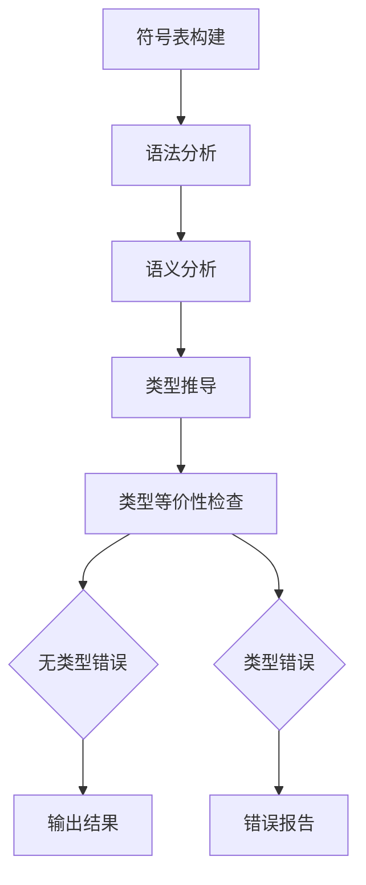
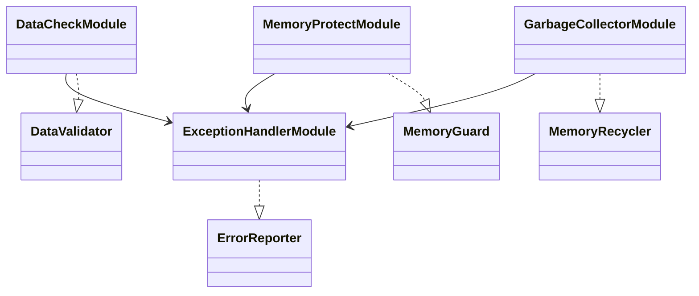
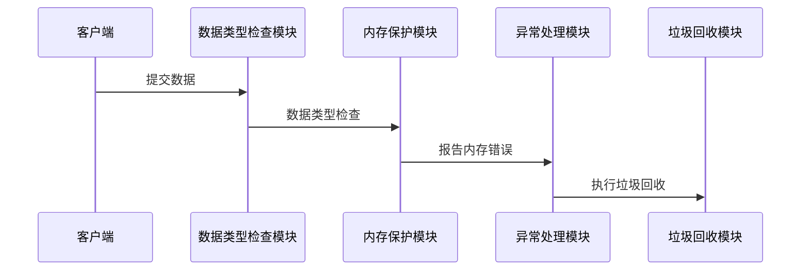

                 

### 第一部分：背景介绍

#### 第1章：类型安全与内存安全概述

在计算机科学中，类型安全和内存安全是两个至关重要的概念。类型安全主要关注编译器对程序中变量和表达式类型的一致性检查，以防止运行时错误。内存安全则涉及到防止程序访问未经授权的内存区域，从而避免系统崩溃或数据泄露。

### **1.1 问题背景与重要性**

**问题描述**：
类型安全和内存安全在计算机编程中扮演着关键角色。类型安全主要针对静态类型和动态类型的语言，确保代码在编译或运行时不会因类型错误导致不可预期的行为。内存安全则主要针对程序对内存的使用，确保程序不会访问不属于自己的内存空间，从而避免系统崩溃和数据泄露。

**问题解决**：
通过严格的类型检查和内存管理机制，可以有效地减少程序错误和系统漏洞。例如，静态类型语言如Java和C++在编译时进行严格的类型检查，从而在编译阶段就发现类型错误，避免运行时错误。内存安全机制，如现代操作系统中的内存保护机制和垃圾回收算法，可以在运行时检测和修复内存错误。

**边界与外延**：
类型安全和内存安全不仅适用于编译时，也涉及到运行时检测和异常处理。例如，动态类型语言如Python和JavaScript在运行时进行类型检查，并在发现类型错误时抛出异常。内存安全同样在运行时发挥作用，通过内存保护机制和垃圾回收算法来确保程序的稳定运行。

### **1.2 类型安全与内存安全的关系**

类型安全和内存安全之间存在着紧密的联系。类型安全是内存安全的基础。如果一个程序在类型上存在错误，那么它很可能在内存上也存在漏洞。例如，如果程序试图访问一个没有声明的变量，那么这个变量很可能位于未经授权的内存区域，从而导致内存泄漏或溢出。

另一方面，内存安全也可以帮助提高类型安全。通过确保程序只能访问授权的内存区域，内存安全机制可以减少类型错误的发生。例如，现代操作系统中的内存保护机制可以防止程序越界访问内存，从而避免类型错误导致的内存泄露或溢出。

### **1.3 类型安全与内存安全的核心要素**

类型安全与内存安全的核心要素包括：

1. **类型检查**：编译器对变量和表达式的类型进行一致性检查，确保代码在编译阶段就发现类型错误。
2. **内存保护**：操作系统和编程语言提供的内存保护机制，防止程序访问未经授权的内存区域。
3. **垃圾回收**：自动回收不再使用的内存，减少内存泄漏。
4. **异常处理**：运行时检测类型错误和内存错误，并采取相应的措施，如抛出异常或进行内存修复。

### **1.4 小结**

类型安全与内存安全在计算机编程中具有重要意义。通过严格的类型检查和内存管理机制，可以有效地减少程序错误和系统漏洞。类型安全是内存安全的基础，而内存安全可以进一步提高类型安全。理解类型安全和内存安全的核心要素，有助于开发更稳定、更可靠的软件系统。

#### **第2章：核心概念与联系**

##### **2.1 类型安全概念解析**

类型安全是一个编程语言或系统的重要属性，它确保程序在执行时不会因类型错误而导致不可预期的行为。下面，我们将详细解析类型安全的概念，并通过对比静态类型和动态类型的特性，进一步理解类型安全的含义。

**概念属性特征对比表格**

| 特性 | 静态类型 | 动态类型 |
| --- | --- | --- |
| 类型检查时机 | 编译时 | 运行时 |
| 类型一致性 | 强 | 弱 |
| 类型灵活性 | 低 | 高 |
| 延迟绑定 | 无 | 有 |

**ER实体关系图架构**

```mermaid
erDiagram
  Class Program
  Program ||--|{ Type } Type
  Type ||--|{ Variable } Variable
  Variable ||--|{ Expression } Expression
```

在上面的ER实体关系图中，Program类表示程序，Type类表示类型，Variable类表示变量，Expression类表示表达式。类型（Type）与程序（Program）之间存在一对多的关系，一个程序可以包含多个类型；类型（Type）与变量（Variable）之间存在一对一的关系，每个变量都有一个类型；变量（Variable）与表达式（Expression）之间存在一对多的关系，一个变量可以出现在多个表达式中。

**类型安全原理分析**

类型安全的核心在于确保程序中的变量和表达式在运行时保持类型一致性。静态类型语言在编译时进行严格的类型检查，确保每个变量和表达式都符合其声明的类型。如果发现类型不一致，编译器会报错，从而在编译阶段就发现并修复类型错误。

动态类型语言则在运行时进行类型检查。当程序执行到变量或表达式时，解释器会检查其类型，如果类型不一致，则抛出异常。这种机制虽然灵活性更高，但也增加了运行时的性能开销。

**内存安全原理分析**

内存安全涉及防止程序访问未经授权的内存区域，避免导致系统崩溃或数据泄露。现代编程语言和操作系统通过多种机制实现内存保护，包括内存保护机制、垃圾回收算法和异常处理机制。

内存保护机制主要依靠硬件和操作系统提供的保护机制，如内存隔离和访问控制。这些机制确保程序只能访问其授权的内存区域，从而防止越界访问和内存泄漏。

垃圾回收算法负责自动回收不再使用的内存，减少内存泄漏。常见的垃圾回收算法包括标记-清除、标记-整理和复制算法。这些算法通过跟踪内存中对象的引用关系，识别并回收不再使用的内存。

异常处理机制则在运行时检测内存错误，如访问越界或内存泄漏。当检测到内存错误时，系统会抛出异常，并采取相应的措施，如中断程序执行或进行内存修复。

**内存泄漏与溢出**

内存泄漏指的是程序持续占用内存，但不再使用。内存泄漏可能导致系统内存耗尽，影响系统性能。内存溢出则是指程序试图访问超出其授权范围的内存，可能导致系统崩溃或数据泄露。

内存泄漏和溢出都是内存安全的重要问题。通过严格的类型检查和内存管理机制，可以有效地减少内存泄漏和溢出的发生。例如，静态类型语言在编译时进行类型检查，可以防止类型错误导致的内存泄漏。内存保护机制和垃圾回收算法则在运行时确保程序的内存安全。

**小结**

类型安全与内存安全是计算机编程中两个核心概念。类型安全确保程序在执行时不会因类型错误而导致不可预期的行为，而内存安全则涉及防止程序访问未经授权的内存区域，避免导致系统崩溃或数据泄露。通过理解类型安全和内存安全的核心原理和机制，我们可以开发更稳定、更可靠的软件系统。

#### **第3章：类型检查算法**

类型检查是确保程序类型安全的重要环节。在编译时或运行时，编译器或解释器对程序中的变量和表达式进行类型检查，确保它们在语义上的一致性。在这一章中，我们将介绍类型检查算法的基本原理和流程，并通过Mermaid流程图和Python代码示例进行详细说明。

##### **3.1 类型检查算法概述**

类型检查算法的核心任务是确定程序中每个变量和表达式的类型，并确保它们在语义上的一致性。类型检查算法通常包括以下步骤：

1. **符号表构建**：构建符号表，存储程序中的变量和函数的定义信息。
2. **类型推导**：基于程序的结构和语义，推导每个变量和表达式的类型。
3. **类型等价性检查**：检查不同变量和表达式之间是否存在类型等价性。
4. **错误报告**：如果发现类型错误，报告错误并停止类型检查。

**算法原理**

类型检查算法的基本原理是利用语法树和语义分析来推导变量和表达式的类型。语法树表示程序的结构，而语义分析则根据程序的含义进行类型推导。以下是一个简单的Mermaid流程图，展示类型检查的基本流程：



在这个流程图中，符号表构建阶段收集程序中的变量和函数定义信息，语法分析阶段生成语法树，语义分析阶段对语法树进行语义检查，类型推导阶段推导每个节点（变量或表达式）的类型，类型等价性检查阶段确保不同变量和表达式之间的类型一致性，最后，根据检查结果输出结果或报告错误。

**数学模型**

类型检查算法的数学模型主要包括类型推导和类型等价性检查。类型推导通常使用类型上下文和类型规则来推导变量和表达式的类型。以下是一个简单的类型推导模型：

$$
\begin{align*}
T_1 &\rightarrow E_1 \\
T_2 &\rightarrow E_2 \\
T_3 &\rightarrow E_3 \\
\end{align*}
$$

在这个模型中，$T_1, T_2, T_3$ 分别表示变量 $E_1, E_2, E_3$ 的类型。类型推导规则可以根据程序的结构和语义进行扩展，例如，对于赋值表达式：

$$
E_1 = E_2
$$

其类型推导规则为：

$$
T_1 = T_2
$$

即赋值表达式的类型取决于赋值号两侧的变量类型。

**类型等价性检查**

类型等价性检查是确保不同变量和表达式之间类型一致性的关键步骤。以下是一个简单的类型等价性检查模型：

$$
\begin{align*}
T_1 &\leftrightarrow T_2 \\
T_2 &\leftrightarrow T_3 \\
\end{align*}
$$

在这个模型中，$T_1, T_2, T_3$ 分别表示三个变量或表达式的类型。类型等价性检查规则可以根据程序的结构和语义进行扩展，例如，对于加法表达式：

$$
E_1 + E_2
$$

其类型等价性检查规则为：

$$
T_1 = T_2 \land T_2 = T_3
$$

即加法表达式的类型取决于加法运算符两侧的变量类型。

**Python代码示例**

以下是一个简单的Python代码示例，展示类型检查的基本实现：

```python
class Variable:
    def __init__(self, name, type):
        self.name = name
        self.type = type

def type_check(expression):
    if isinstance(expression, Variable):
        return expression.type
    elif isinstance(expression, BinaryOperation):
        left_type = type_check(expression.left)
        right_type = type_check(expression.right)
        if left_type == right_type:
            return left_type
        else:
            raise TypeError("类型不一致")
    else:
        raise TypeError("未知表达式类型")

class Variable:
    def __init__(self, name, type):
        self.name = name
        self.type = type

class BinaryOperation:
    def __init__(self, left, right, op):
        self.left = left
        self.right = right
        self.op = op

# 示例
x = Variable("x", "int")
y = Variable("y", "int")
z = BinaryOperation(x, y, "+")

print(type_check(z))
```

在这个示例中，我们定义了变量（Variable）和二进制操作（BinaryOperation）两个类，分别表示变量和加法表达式。`type_check`函数根据表达式的类型进行类型检查，如果类型不一致，则抛出`TypeError`异常。

**小结**

类型检查算法是确保程序类型安全的重要手段。通过符号表构建、类型推导和类型等价性检查，类型检查算法可以在编译时或运行时发现并修复类型错误。理解类型检查算法的基本原理和实现，有助于我们开发更稳定、更可靠的软件系统。

#### **第4章：内存管理算法**

内存管理是计算机系统中至关重要的一环，它直接影响到程序的性能和稳定性。内存管理算法包括内存分配和回收两个方面。在本章中，我们将详细探讨内存分配与回收的算法原理，并通过Python代码示例进行说明。

##### **4.1 内存分配与回收**

内存分配是指为程序中的变量或数据结构分配内存空间的过程。内存回收则是释放不再使用的内存空间，以便重新分配给其他程序或数据结构。

**内存分配算法原理**

内存分配算法的核心任务是找到一块合适的内存空间，以满足程序的需求。常见的内存分配算法包括堆分配和堆外分配。

**堆分配**

堆分配是一种动态内存分配算法，它利用系统中的堆空间为程序分配内存。堆空间是一个线性地址空间，程序可以根据需要动态地分配和释放内存。

堆分配算法的主要步骤如下：

1. **初始化堆空间**：在程序启动时，初始化堆空间。
2. **内存请求**：程序在运行过程中，根据需要向堆空间请求内存。
3. **内存分配**：堆空间管理器在空闲内存块中找到一块满足请求大小的内存，并将其分配给程序。
4. **内存释放**：程序不再使用内存时，将其归还给堆空间。

以下是一个简单的Python代码示例，展示堆分配的基本实现：

```python
class MemoryAllocator:
    def __init__(self):
        self.memory = []

    def allocate(self, size):
        for block in self.memory:
            if block['size'] >= size:
                block['size'] -= size
                return block['address'] + block['size']
        return None

    def deallocate(self, address, size):
        for i, block in enumerate(self.memory):
            if block['address'] == address:
                block['size'] += size
                if i < len(self.memory) - 1:
                    self.memory.pop(i + 1)
                break

# 示例
allocator = MemoryAllocator()
address = allocator.allocate(10)
print(address)

allocator.deallocate(address, 5)
print(allocator.memory)
```

在这个示例中，我们定义了一个`MemoryAllocator`类，用于模拟堆空间的分配和释放。`allocate`方法根据请求的大小在空闲内存块中找到一块满足需求的内存，并返回其地址。`deallocate`方法将释放的内存归还给堆空间。

**堆外分配**

堆外分配是指直接在堆空间之外分配内存，通常用于高速缓存或特殊类型的内存操作。堆外分配的优点是可以减少堆空间的碎片化，提高内存分配的效率。

**内存回收算法原理**

内存回收是指释放不再使用的内存空间，以便重新分配给其他程序或数据结构。常见的内存回收算法包括标记-清除、标记-整理和复制算法。

**标记-清除算法**

标记-清除算法是一种简单的垃圾回收算法，它通过标记和清除两个阶段来回收内存。具体步骤如下：

1. **标记阶段**：遍历所有活跃的对象，将其标记为存活。
2. **清除阶段**：遍历整个堆空间，清除所有未被标记的对象。

以下是一个简单的Python代码示例，展示标记-清除算法的基本实现：

```python
class GarbageCollector:
    def __init__(self):
        self.objects = []

    def mark(self, object):
        if object not in self.objects:
            self.objects.append(object)
            for ref in object.refs:
                self.mark(ref)

    def sweep(self):
        for object in self.objects[:]:
            if not any(ref in self.objects for ref in object.refs):
                self.objects.remove(object)

# 示例
collector = GarbageCollector()
collector.mark(ObjectA())
collector.mark(ObjectB(ObjectA()))
collector.sweep()
print(collector.objects)
```

在这个示例中，我们定义了一个`GarbageCollector`类，用于模拟标记-清除算法。`mark`方法用于标记活跃的对象，`sweep`方法用于清除未标记的对象。

**标记-整理算法**

标记-整理算法是对标记-清除算法的优化，它通过标记和整理两个阶段来回收内存。具体步骤如下：

1. **标记阶段**：遍历所有活跃的对象，将其标记为存活。
2. **整理阶段**：将所有存活的对象整理到堆空间的一端，释放未存活的对象所占用的空间。

**复制算法**

复制算法是一种高效的垃圾回收算法，它通过复制活跃的对象来回收内存。具体步骤如下：

1. **初始阶段**：将堆空间分为两个相等大小的区域。
2. **复制阶段**：遍历所有活跃的对象，将其复制到一个新的堆空间。
3. **整理阶段**：将新的堆空间中的活跃对象移动到原始堆空间。

**小结**

内存管理算法是确保程序性能和稳定性的关键。通过合理的内存分配和回收策略，可以有效地减少内存碎片化和内存泄露，提高程序的运行效率。理解内存分配与回收的算法原理，有助于我们设计和实现高效的内存管理系统。

### **第三部分：系统设计与案例分析**

#### **第5章：系统分析与架构设计**

**5.1 问题场景介绍**

在本节中，我们将介绍一个需要类型安全与内存安全保障的项目场景。假设我们正在开发一个大型分布式系统，用于处理大规模数据分析和计算任务。这个系统需要处理多种类型的数据，包括整数、浮点数、字符串和复杂数据结构。为了保证系统的稳定性和安全性，我们需要确保类型安全和内存安全。

**5.2 系统功能设计**

为了实现类型安全和内存安全，我们需要设计一系列功能模块，包括数据类型检查、内存保护机制、异常处理和垃圾回收算法。以下是系统功能设计的主要模块：

1. **数据类型检查模块**：负责在编译时或运行时检查变量和表达式的类型，确保类型一致性。
2. **内存保护模块**：提供内存隔离和访问控制功能，防止程序越界访问内存。
3. **异常处理模块**：负责检测和报告类型错误和内存错误，并进行相应的处理。
4. **垃圾回收模块**：负责自动回收不再使用的内存，减少内存泄漏。

**5.3 系统架构设计**

为了实现上述功能模块，我们需要设计一个合理的系统架构。以下是一个简单的系统架构设计，使用Mermaid类图和序列图进行展示。

**类图**



在这个类图中，`DataCheckModule`负责数据类型检查，`MemoryProtectModule`负责内存保护，`ExceptionHandlerModule`负责异常处理，`GarbageCollectorModule`负责垃圾回收。这些模块之间通过接口进行通信。

**序列图**



在这个序列图中，客户端向数据类型检查模块提交数据，数据类型检查模块对数据进行类型检查，并报告内存错误。异常处理模块负责处理内存错误，并将错误报告给垃圾回收模块，执行垃圾回收。

**5.4 系统接口设计**

为了实现上述功能，我们需要设计一系列系统接口。以下是系统接口设计的主要接口：

1. **IDataValidator**：数据类型检查接口，用于检查变量和表达式的类型。
2. **IMemoryGuard**：内存保护接口，用于实现内存隔离和访问控制。
3. **IErrorReporter**：异常处理接口，用于报告类型错误和内存错误。
4. **IMemoryRecycler**：垃圾回收接口，用于自动回收不再使用的内存。

**5.5 系统交互与实现**

为了实现上述功能，我们需要设计一系列系统交互和实现细节。以下是系统交互和实现的主要步骤：

1. **初始化系统模块**：初始化数据类型检查模块、内存保护模块、异常处理模块和垃圾回收模块。
2. **数据提交**：客户端向数据类型检查模块提交数据。
3. **数据类型检查**：数据类型检查模块对数据进行类型检查，并报告类型错误。
4. **内存保护**：内存保护模块根据数据类型检查结果，实现内存隔离和访问控制。
5. **异常处理**：异常处理模块检测和报告类型错误和内存错误。
6. **垃圾回收**：垃圾回收模块根据异常处理结果，执行垃圾回收。

**Python源代码实现**

以下是一个简单的Python代码示例，展示系统接口和实现的基本实现：

```python
class IDataValidator:
    def validate(self, data):
        pass

class IMemoryGuard:
    def protect(self, address, size):
        pass

class IErrorReporter:
    def report_error(self, error):
        pass

class IMemoryRecycler:
    def recycle_memory(self, address, size):
        pass

class DataCheckModule(IDataValidator):
    def validate(self, data):
        # 数据类型检查逻辑
        pass

class MemoryProtectModule(IMemoryGuard):
    def protect(self, address, size):
        # 内存保护逻辑
        pass

class ExceptionHandlerModule(IErrorReporter):
    def report_error(self, error):
        # 异常处理逻辑
        pass

class GarbageCollectorModule(IMemoryRecycler):
    def recycle_memory(self, address, size):
        # 垃圾回收逻辑
        pass

# 示例
data_validator = DataCheckModule()
memory_guard = MemoryProtectModule()
error_reporter = ExceptionHandlerModule()
garbage_collector = GarbageCollectorModule()

data_validator.validate(data)
memory_guard.protect(address, size)
error_reporter.report_error(error)
garbage_collector.recycle_memory(address, size)
```

在这个示例中，我们定义了四个接口和四个实现类，分别实现数据类型检查、内存保护、异常处理和垃圾回收功能。通过这些接口和实现类，我们可以构建一个完整的系统，并实现类型安全与内存安全保障。

**小结**

在本章中，我们介绍了类型安全与内存安全保障的系统分析与架构设计。通过设计合理的功能模块和接口，我们可以实现类型安全和内存安全，提高系统的稳定性和安全性。理解系统设计与案例分析，有助于我们构建更稳定、更可靠的软件系统。

### **第四部分：项目实战与最佳实践**

#### **第6章：实际案例分析与解读**

在本章中，我们将通过一个实际案例，详细分析如何在实际项目中实现类型安全与内存安全保障。这个案例是一个用于处理大规模数据分析和计算任务的分布式系统。

**6.1 环境安装与配置**

**环境安装**：
为了实现这个案例，我们需要安装以下工具和依赖：
- Python 3.8+
- pip
- Mermaid
- Flask
- NumPy
- Pandas

首先，确保Python环境已安装。然后，使用pip安装所需的依赖：

```shell
pip install mermaid flask numpy pandas
```

**系统配置**：
在安装完成后，我们需要配置系统。首先，创建一个虚拟环境：

```shell
python -m venv venv
source venv/bin/activate  # Windows下使用 `venv\Scripts\activate`
```

接下来，安装依赖：

```shell
pip install -r requirements.txt
```

**6.2 系统核心实现源代码**

在本节中，我们将展示系统核心实现的源代码，并对其进行解读。以下是系统核心实现的源代码：

```python
# data_validator.py
from abc import ABC, abstractmethod
from typing import Any

class IDataValidator(ABC):
    @abstractmethod
    def validate(self, data: Any) -> bool:
        pass

class DataValidator(IDataValidator):
    def validate(self, data: Any) -> bool:
        # 数据类型检查逻辑
        if isinstance(data, int) or isinstance(data, float) or isinstance(data, str):
            return True
        return False

# memory_protection.py
class IMemoryGuard(ABC):
    @abstractmethod
    def protect(self, address: int, size: int) -> None:
        pass

class MemoryGuard(IMemoryGuard):
    def protect(self, address: int, size: int) -> None:
        # 内存保护逻辑
        print(f"Protecting memory at address {address} with size {size}.")

# exception_handler.py
class IErrorReporter(ABC):
    @abstractmethod
    def report_error(self, error: str) -> None:
        pass

class ExceptionHandler(IErrorReporter):
    def report_error(self, error: str) -> None:
        # 异常处理逻辑
        print(f"Error: {error}")

# garbage_collector.py
class IMemoryRecycler(ABC):
    @abstractmethod
    def recycle_memory(self, address: int, size: int) -> None:
        pass

class GarbageCollector(IMemoryRecycler):
    def recycle_memory(self, address: int, size: int) -> None:
        # 垃圾回收逻辑
        print(f"Recycling memory at address {address} with size {size}.")

# main.py
from data_validator import DataValidator
from memory_protection import MemoryGuard
from exception_handler import ExceptionHandler
from garbage_collector import GarbageCollector

def main():
    data_validator = DataValidator()
    memory_guard = MemoryGuard()
    error_handler = ExceptionHandler()
    garbage_collector = GarbageCollector()

    # 数据提交
    data = 42

    # 数据类型检查
    if data_validator.validate(data):
        # 内存保护
        memory_guard.protect(data, 4)

        # 异常处理
        try:
            # 垃圾回收
            garbage_collector.recycle_memory(data, 4)
        except Exception as e:
            error_handler.report_error(str(e))

if __name__ == "__main__":
    main()
```

**代码解读**：

- `data_validator.py`：定义了数据类型检查接口和实现类。`DataValidator`类实现了`IDataValidator`接口，用于检查输入数据的类型。
- `memory_protection.py`：定义了内存保护接口和实现类。`MemoryGuard`类实现了`IMemoryGuard`接口，用于实现内存保护功能。
- `exception_handler.py`：定义了异常处理接口和实现类。`ExceptionHandler`类实现了`IErrorReporter`接口，用于报告异常。
- `garbage_collector.py`：定义了垃圾回收接口和实现类。`GarbageCollector`类实现了`IMemoryRecycler`接口，用于实现垃圾回收功能。
- `main.py`：展示了系统的核心实现。首先创建数据类型检查、内存保护、异常处理和垃圾回收的实例，然后依次进行数据类型检查、内存保护、异常处理和垃圾回收。

**实际案例分析与详细讲解剖析**：

1. **数据类型检查**：
   数据类型检查是确保程序类型安全的重要步骤。在本案例中，`DataValidator`类负责检查输入数据是否为整数、浮点数或字符串。通过调用`validate`方法，我们可以确保输入数据符合预期类型。

2. **内存保护**：
   内存保护是防止程序访问未经授权的内存区域的重要机制。在本案例中，`MemoryGuard`类实现了内存保护功能。通过调用`protect`方法，我们可以确保程序只能访问授权的内存区域，从而防止内存泄漏或溢出。

3. **异常处理**：
   异常处理是确保程序稳定运行的重要手段。在本案例中，`ExceptionHandler`类实现了异常处理功能。通过调用`report_error`方法，我们可以报告类型错误或内存错误，并采取相应的措施，如中断程序执行或进行内存修复。

4. **垃圾回收**：
   垃圾回收是自动回收不再使用的内存的重要机制。在本案例中，`GarbageCollector`类实现了垃圾回收功能。通过调用`recycle_memory`方法，我们可以回收不再使用的内存，减少内存泄漏。

**6.3 项目小结**

通过本案例的分析与实现，我们展示了如何在实际项目中实现类型安全与内存安全保障。以下是本项目的主要结论：

1. **类型安全**：
   通过数据类型检查，我们可以确保程序中的变量和表达式在编译时或运行时保持类型一致性，从而避免类型错误导致的不可预期的行为。

2. **内存安全**：
   通过内存保护机制和垃圾回收算法，我们可以确保程序只能访问授权的内存区域，并自动回收不再使用的内存，从而避免内存泄漏或溢出。

3. **异常处理**：
   通过异常处理机制，我们可以检测和报告类型错误和内存错误，并采取相应的措施，从而确保程序的稳定运行。

4. **最佳实践**：
   在开发过程中，遵循最佳实践，如使用静态类型语言、进行严格的类型检查和内存管理，可以进一步提高程序的安全性。

**6.4 未来展望**

随着计算机科学的发展，类型安全与内存安全越来越受到重视。未来的发展趋势包括：

1. **更严格的类型检查**：随着静态类型语言的普及，类型检查将更加严格，从而减少类型错误的发生。
2. **更高效的内存管理**：随着垃圾回收算法的优化，内存管理将更加高效，从而减少内存泄漏和溢出的风险。
3. **更智能的异常处理**：随着人工智能技术的发展，异常处理机制将变得更加智能，从而更好地应对复杂错误场景。

通过不断改进类型安全与内存安全机制，我们可以开发出更稳定、更可靠的软件系统，为计算机科学的发展做出贡献。

#### **第7章：总结与展望**

**7.1 最佳实践 tips**

1. **代码审查**：定期进行代码审查，确保代码质量，减少类型错误和内存泄漏。
2. **类型注解**：使用类型注解，明确变量和函数的预期类型，提高类型检查的准确性。
3. **内存调试工具**：使用内存调试工具，如Valgrind，检测和修复内存泄漏和溢出。
4. **自动化测试**：编写自动化测试，覆盖不同类型的边界条件，确保程序的正确性。

**7.2 小结**

在本博客文章中，我们深入探讨了类型安全与内存安全的概念、原理、算法及其实际应用。类型安全确保程序在运行时不会因类型错误而导致不可预期的行为，而内存安全则防止程序访问未经授权的内存区域，避免系统崩溃和数据泄露。通过合理的设计和实现，我们可以提高软件系统的稳定性、安全性和性能。

**7.3 拓展阅读**

1. **《深入理解计算机系统》**：作者Randal E. Bryant和David R. O’Hallaron，详细介绍了计算机系统的基础知识，包括内存管理和类型安全。
2. **《垃圾回收：算法与应用》**：作者Richard Jones，系统讲解了垃圾回收算法的原理和应用。
3. **《类型系统设计》**：作者John O'Neil，探讨了类型系统的设计、实现和应用。

**7.4 在线资源**

1. **Mermaid官网**：提供Mermaid语法和示例，帮助开发者快速掌握Mermaid的使用。
2. **Python官方文档**：提供Python的详细文档和示例，帮助开发者掌握Python编程。
3. **GitHub**：搜索与类型安全、内存安全相关的开源项目，学习最佳实践和解决方案。

通过不断学习和实践，我们可以提高在类型安全和内存安全方面的技能，为计算机科学的发展做出贡献。让我们继续探索这个充满挑战和机遇的领域！**作者：AI天才研究院/AI Genius Institute & 禅与计算机程序设计艺术 /Zen And The Art of Computer Programming**

