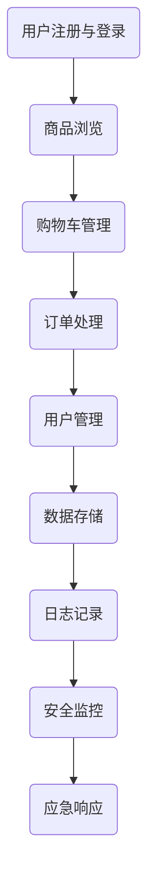
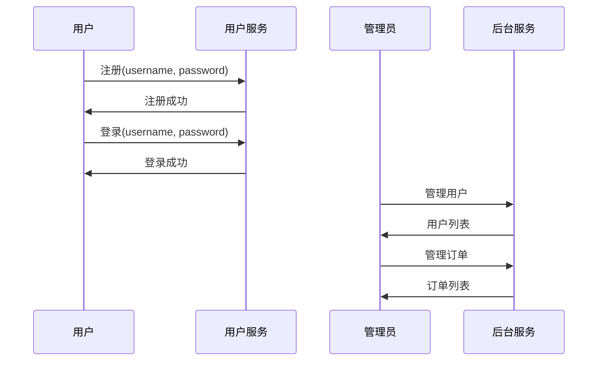

                 


# 类型安全与网络安全：构建可靠系统的基础

> 关键词：类型安全、网络安全、可靠系统、安全融合、实战案例

> 摘要：本文深入探讨了类型安全与网络安全在构建可靠系统中的关键作用。通过系统分析，我们揭示了类型安全与网络安全的基本原理、核心概念及其在系统架构设计、实现和运维中的实际应用。本文旨在为开发者和运维人员提供一套全面、实用的构建可靠系统的策略和方法，并通过实战案例分享实践经验，帮助读者更好地理解和应用这些技术。

## 第一部分：类型安全概述

### 第1章：类型安全的基础知识

#### 1.1.1 类型安全的定义和重要性

类型安全是软件开发中一个至关重要的概念，它确保了程序在运行时不会因类型错误而导致意外行为或崩溃。类型安全的基本原理是通过编译时或运行时的类型检查，防止数据类型的错误操作。这种检查可以在开发过程中及早发现和修复错误，从而提高软件的可靠性和可维护性。

在当前复杂和高度互联的软件开发环境中，类型安全的重要性愈发凸显。随着软件系统规模的扩大和功能的丰富，类型错误可能导致严重的性能问题、安全性漏洞甚至系统崩溃。因此，类型安全不仅是保证程序正确运行的基础，也是构建可靠系统的重要保障。

#### 1.1.2 类型安全的基本原理

类型安全的核心原理包括类型检查、类型推断和类型系统。类型检查是在编译或运行时对操作符和变量类型的合法性进行检查。类型推断是编译器或解释器自动确定变量或表达式的类型。类型系统则是定义类型以及它们之间如何组合和交互的规则集合。

在静态类型语言（如C++、Java）中，类型检查通常在编译时完成，而在动态类型语言（如Python、JavaScript）中，类型检查则是在运行时进行。无论哪种方式，类型安全都旨在确保程序在执行时不会发生类型错误。

#### 1.1.3 类型安全在软件开发中的应用场景

类型安全在软件开发中的应用场景广泛，包括但不限于：

1. **前端开发**：在前端开发中，类型安全可以帮助减少JavaScript中的常见错误，如变量未定义或类型不匹配。
2. **后端服务**：在后端服务中，类型安全可以防止因类型错误导致的服务器崩溃或数据损坏。
3. **移动应用**：在移动应用开发中，类型安全可以确保应用在不同设备和操作系统上的一致性和稳定性。
4. **分布式系统**：在分布式系统中，类型安全可以减少由于数据传输错误导致的系统故障。

### 1.2 类型安全的概念与联系

类型安全不仅仅是关于类型检查，还与多种安全概念密切相关。以下是一些类型安全与其他安全概念的关联：

1. **内存安全**：类型安全与内存安全紧密相关，因为类型错误可能导致内存访问违规，从而引发安全漏洞。
2. **安全性**：类型安全是确保软件安全的基础，它可以通过减少因类型错误引起的安全漏洞，提高软件的整体安全性。
3. **可靠性**：类型安全可以提高软件的可靠性，通过及早发现和修复类型错误，避免潜在的运行时问题。

#### 1.2.1 常见类型安全的分类

根据类型检查的时机，类型安全可以分为静态类型安全和动态类型安全：

1. **静态类型安全**：在编译时进行类型检查，如C++、Java。
2. **动态类型安全**：在运行时进行类型检查，如Python、JavaScript。

#### 1.2.2 类型安全的属性特征对比表

| 类型安全特性       | 静态类型安全 | 动态类型安全 |
|--------------------|--------------|--------------|
| 类型检查时机       | 编译时       | 运行时       |
| 表达式灵活性       | 较低         | 较高         |
| 编译效率           | 较高         | 较低         |
| 易于调试和维护      | 较易         | 较难         |

#### 1.2.3 类型安全与其他安全概念的关联

| 安全概念        | 关联             |
|-----------------|-----------------|
| 内存安全        | 防止内存访问错误 |
| 安全性         | 减少安全漏洞     |
| 静态代码分析    | 发现潜在问题     |
| 依赖注入        | 管理外部依赖     |

### 1.3 类型安全的架构设计与实现

类型安全的实现需要考虑多个方面，包括设计原则、实现策略和工具选择。

#### 1.3.1 类型安全的设计原则

1. **最小权限原则**：程序应遵循最小权限原则，仅允许必要的操作。
2. **隔离原则**：不同类型的操作应相互隔离，以防止类型错误传播。
3. **确定性原则**：类型系统的行为应具有确定性，避免意外行为。

#### 1.3.2 类型安全的实现策略

1. **静态类型检查**：在编译时进行类型检查，确保代码在运行前符合类型规则。
2. **动态类型检查**：在运行时进行类型检查，提供更高的灵活性和错误修复。

#### 1.3.3 类型安全的工具与技术

1. **类型检查器**：如Eclipse、IntelliJ IDEA等IDE内置的类型检查器。
2. **静态代码分析工具**：如SonarQube、FindBugs等，用于发现潜在的类型安全问题。
3. **动态类型检查工具**：如Python的Mypy、JavaScript的TypeScript等。

### 1.4 本章小结

类型安全是构建可靠系统的基础之一，通过本章的讨论，我们了解了类型安全的基本概念、原理及其在软件开发中的应用。类型安全的实现不仅需要设计原则和策略的指导，还需要借助各种工具和技术。在下一章中，我们将进一步探讨网络安全的基础知识。

----------------------------------------------------------------

## 第二部分：网络安全基础

### 第2章：网络安全概述

网络安全是确保信息系统和数据安全的关键，它涵盖了多个方面，包括网络安全的基本概念、核心原则和常见威胁。在本章中，我们将深入了解网络安全的各个方面，为构建可靠系统打下坚实基础。

#### 2.1.1 网络安全的定义和重要性

网络安全是指保护计算机系统、网络和数据的完整性和可用性，防止未经授权的访问、使用、披露、破坏、修改或破坏。随着数字化和信息化的深入发展，网络安全的重要性日益凸显。

网络安全不仅关乎个人隐私和企业机密，还影响国家安全和公共基础设施。网络攻击可能导致数据泄露、系统瘫痪、经济损失，甚至社会动荡。因此，保障网络安全是构建可靠系统的首要任务。

#### 2.1.2 网络安全的基本概念

网络安全的基本概念包括以下几个方面：

1. **安全防护**：通过防火墙、入侵检测系统（IDS）和入侵防御系统（IPS）等技术，防止未授权访问和恶意攻击。
2. **加密与认证**：使用加密技术保护数据传输和存储的安全性，通过身份认证确保合法用户的访问权限。
3. **安全策略**：制定安全策略，包括访问控制、数据备份和恢复计划，确保系统在遭受攻击时能够迅速恢复。
4. **安全事件响应**：建立安全事件响应机制，及时应对和处理安全事件，减少损失。

#### 2.1.3 网络安全的发展历程

网络安全的发展历程可以追溯到计算机网络的早期。以下是几个重要阶段：

1. **早期网络安全**：1980年代，网络安全主要集中在防止简单的攻击，如端口扫描和拒绝服务攻击（DoS）。
2. **互联网时代**：1990年代，随着互联网的普及，网络安全问题变得更加复杂，病毒和蠕虫攻击成为主要威胁。
3. **移动和云时代**：进入21世纪，移动设备和云计算成为网络安全的新挑战，网络攻击手段更加多样化和复杂化。

### 2.2 网络安全的核心原则与策略

网络安全的核心原则包括安全性、完整性和可用性。以下是如何平衡这三个原则以及相关的安全策略：

#### 2.2.1 安全性、完整性和可用性的平衡

1. **安全性**：确保系统不受未经授权的访问和恶意攻击。
2. **完整性**：保护数据和系统不被未经授权的修改。
3. **可用性**：确保系统和数据在需要时能够被合法用户访问和使用。

在实际应用中，需要根据具体场景和需求，动态调整这三个原则的权重，以实现最佳平衡。

#### 2.2.2 防护、检测和响应策略

1. **防护策略**：通过防火墙、加密和访问控制等技术，阻止恶意攻击和未授权访问。
2. **检测策略**：使用入侵检测系统（IDS）和入侵防御系统（IPS）等工具，及时发现和响应安全事件。
3. **响应策略**：建立应急响应机制，及时处理安全事件，减少损失和影响。

#### 2.2.3 法律法规与标准规范

法律法规和标准规范是网络安全的重要组成部分。以下是一些关键法律法规和标准规范：

1. **数据保护法**：如《通用数据保护条例》（GDPR）和《加州消费者隐私法案》（CCPA），规定了数据收集、存储和处理的要求。
2. **信息安全技术标准**：如ISO/IEC 27001信息安全管理系统标准，提供了全面的信息安全管理框架。

### 2.3 网络安全的常见威胁与攻击手段

网络安全面临多种威胁，以下是一些常见的威胁和攻击手段：

#### 2.3.1 常见网络攻击类型

1. **恶意软件攻击**：如病毒、蠕虫、特洛伊木马等，通过感染或破坏系统软件，导致系统不稳定或数据泄露。
2. **网络钓鱼攻击**：通过伪造合法网站或发送诈骗邮件，诱骗用户输入敏感信息，如用户名、密码和信用卡信息。
3. **拒绝服务攻击（DoS）**：通过大量无效请求或恶意流量，使系统资源耗尽，导致系统瘫痪。
4. **中间人攻击（MITM）**：通过拦截和篡改数据传输，窃取用户信息或进行恶意操作。

#### 2.3.2 攻击手段的案例分析

以下是一些典型的网络攻击案例：

1. **2017年WannaCry勒索软件攻击**：攻击者利用Windows操作系统中的漏洞，传播勒索软件，导致全球数千台计算机被感染。
2. **2016年美国民主党邮件泄露事件**：黑客入侵民主党全国委员会（DNC）的邮件服务器，泄露大量邮件，对选举产生了重大影响。
3. **2020年SolarWinds供应链攻击**：攻击者通过供应链攻击，将恶意软件植入SolarWinds Orion平台，影响大量政府和私人组织。

#### 2.3.3 攻击者的动机与目标

攻击者的动机多种多样，包括：

1. **经济利益**：如通过勒索软件攻击获取赎金，通过网络钓鱼窃取财务信息。
2. **政治目的**：如通过黑客攻击干预选举、窃取机密信息。
3. **破坏和抗议**：如DoS攻击，破坏关键基础设施或抗议社会事件。

### 2.4 网络安全的防护技术和实践

网络安全防护技术和实践包括多个方面，以下是一些关键技术和方法：

#### 2.4.1 防火墙与入侵检测

1. **防火墙**：防火墙是网络安全的第一道防线，通过过滤网络流量，防止未授权访问。
2. **入侵检测系统（IDS）**：IDS用于检测和分析网络流量，及时发现潜在的安全威胁。

#### 2.4.2 加密与身份认证

1. **加密技术**：加密用于保护数据传输和存储的安全性，常用的加密算法包括AES、RSA等。
2. **身份认证**：身份认证用于确保用户身份的合法性，常用的认证方式包括密码、双因素认证（2FA）和生物识别。

#### 2.4.3 安全协议与安全策略

1. **安全协议**：安全协议如SSL/TLS，用于保护网络通信的安全性。
2. **安全策略**：安全策略包括访问控制、数据备份和恢复计划等，确保系统在遭受攻击时能够迅速恢复。

### 2.5 本章小结

网络安全是构建可靠系统的关键要素，通过本章的讨论，我们了解了网络安全的基本概念、核心原则和常见威胁。在下一章中，我们将探讨类型安全与网络安全如何融合，以实现更可靠的系统。

----------------------------------------------------------------

## 第三部分：类型安全与网络安全融合

### 第3章：类型安全与网络安全的融合

类型安全与网络安全的融合是构建现代可靠系统的重要方向。随着软件系统的复杂性不断增加，类型安全和网络安全不再可以独立存在，它们需要相互补充，共同保障系统的安全性和可靠性。在本章中，我们将探讨类型安全与网络安全的融合背景、实现路径、挑战和优势。

#### 3.1.1 融合的背景和必要性

在过去的几十年中，软件开发经历了从简单的单体应用向复杂分布式系统的转变。这种转变带来了新的挑战，同时也提供了新的机会。类型安全在保证程序的正确性和可靠性方面发挥了重要作用，而网络安全则致力于保护系统的数据和资源免受攻击。然而，随着软件系统的复杂度增加，两者之间的界限变得模糊，单一的类型安全或网络安全措施已经无法满足现代系统的需求。

1. **软件系统的复杂性**：现代软件系统通常由多个模块组成，这些模块可能在不同的环境中运行，并且需要与其他系统进行交互。这种复杂性增加了类型错误和网络攻击的风险。
2. **动态变化的威胁环境**：网络威胁日益多样化，攻击者利用各种手段突破系统的安全防线。类型安全与网络安全需要相互配合，共同应对不断变化的威胁。
3. **用户需求的多样性**：用户对软件系统提出了更高的可靠性、安全性和性能要求。单一的类型安全或网络安全措施难以同时满足这些需求。

#### 3.1.2 融合的实现路径和挑战

类型安全与网络安全的融合需要从多个层面进行，包括架构设计、代码实现和运维管理。以下是实现路径和面临的挑战：

1. **架构设计**：在设计软件系统时，需要将类型安全和网络安全考虑在内，确保系统的整体安全性。这包括选择合适的架构风格、设计模式和安全组件。
2. **代码实现**：在代码实现过程中，需要采用类型安全编程技术和网络安全防护手段，如静态类型检查、动态类型检查、加密传输和安全认证。
3. **运维管理**：在系统运维过程中，需要建立完善的类型安全和网络安全管理机制，包括安全监控、漏洞管理和应急响应。

**挑战**：

1. **复杂性增加**：类型安全和网络安全的融合增加了系统的复杂性，可能导致系统性能下降和运维成本增加。
2. **协调难度**：类型安全和网络安全团队之间的协调和合作难度较大，需要建立有效的沟通和协作机制。
3. **资源分配**：融合过程中需要合理分配资源，确保类型安全和网络安全得到足够的关注和投入。

#### 3.1.3 融合的优势与效益

类型安全与网络安全的融合带来了多方面的优势与效益：

1. **提高可靠性**：通过类型安全确保程序的正确性，减少因类型错误引起的运行时错误。结合网络安全防护手段，防止恶意攻击和未授权访问，提高系统的整体可靠性。
2. **增强安全性**：类型安全可以减少因类型错误引发的安全漏洞，如内存越界和缓冲区溢出。网络安全防护手段则可以防止网络攻击和数据泄露，保障系统的数据安全和隐私。
3. **降低成本**：通过融合类型安全和网络安全，可以在早期发现和修复错误，减少后期修复的成本。同时，整合安全措施可以提高系统的性能和用户体验。
4. **提高合规性**：随着法规和标准的不断更新，融合类型安全和网络安全有助于满足合规性要求，降低合规风险。

### 3.2 融合架构的设计与实现

类型安全与网络安全的融合架构设计是实现可靠系统的基础。以下是一些关键设计原则和实现策略：

#### 3.2.1 融合架构的设计原则

1. **安全性优先**：在架构设计时，将安全性作为首要考虑因素，确保系统的数据安全和隐私。
2. **模块化**：将系统划分为多个模块，每个模块负责特定的功能，降低系统复杂性。
3. **可扩展性**：设计可扩展的架构，以适应未来可能的变化和扩展需求。
4. **高可用性**：确保系统在遭受攻击或故障时能够快速恢复，减少对业务的影响。

#### 3.2.2 融合架构的实现策略

1. **安全层集成**：在架构设计中，将类型安全和网络安全集成到各个层次，包括数据层、网络层和应用层。
2. **动态交互机制**：设计动态交互机制，确保不同模块之间的数据交换和协作安全可靠。
3. **监控与审计**：建立实时监控和审计机制，及时发现和响应安全事件。
4. **自动化与智能化**：利用自动化和智能化技术，提高安全防护和故障响应的效率。

#### 3.2.3 融合架构的案例分析

以下是一个融合架构的案例：

1. **架构概述**：该系统由三个主要模块组成：数据层、网络层和应用层。
   - **数据层**：负责数据存储和管理，采用分布式数据库系统，支持高并发和数据冗余。
   - **网络层**：负责网络传输和数据加密，采用SSL/TLS加密协议，确保数据传输的安全性。
   - **应用层**：负责业务逻辑处理和用户交互，采用静态类型编程语言，进行类型检查和代码审计。

2. **类型安全**：
   - **静态类型检查**：在编译时进行类型检查，确保代码的类型安全性。
   - **动态类型检查**：在运行时进行类型检查，及时发现和修复类型错误。

3. **网络安全**：
   - **防火墙与入侵检测**：在网络层部署防火墙和入侵检测系统，防止恶意攻击。
   - **加密与认证**：采用SSL/TLS加密协议，确保数据传输的安全性，使用身份认证技术确保用户身份的合法性。

### 3.3 融合实践与最佳案例

#### 3.3.1 实践中的融合策略

在融合类型安全与网络安全的过程中，以下策略可以帮助提高系统的可靠性：

1. **早期融合**：在软件开发早期阶段，就将类型安全和网络安全考虑在内，确保设计的合理性和可行性。
2. **持续集成与测试**：采用持续集成和持续测试（CI/CD）流程，及时发现和修复类型错误和安全漏洞。
3. **安全培训与意识**：对开发人员和运维人员进行安全培训，提高他们的安全意识和技能。

#### 3.3.2 成功案例分享

以下是一个成功的融合案例：

1. **项目背景**：某大型电商平台在面临日益复杂的网络安全威胁时，决定将类型安全和网络安全融合到其系统架构中。
2. **项目目标**：提高系统的可靠性和安全性，确保用户数据和交易信息的安全。
3. **实现措施**：
   - **静态类型检查**：在编译时使用静态类型检查工具，确保代码的类型安全性。
   - **动态类型检查**：在运行时使用动态类型检查工具，及时发现和修复类型错误。
   - **网络安全防护**：在网络层部署防火墙和入侵检测系统，采用SSL/TLS加密协议确保数据传输的安全性。
4. **项目成果**：通过类型安全和网络安全的融合，该电商平台成功降低了类型错误和网络攻击的风险，提高了系统的可靠性和用户体验。

#### 3.3.3 案例分析与启示

该案例表明，类型安全与网络安全的融合可以显著提高系统的可靠性和安全性。以下是一些启示：

1. **重视类型安全**：类型安全是保障系统正确性的基础，应早期融合到系统设计中。
2. **强化网络安全**：网络安全是保护系统和数据的关键，应采用多种手段确保系统的安全性。
3. **持续改进**：安全是一个持续的过程，应不断更新和改进类型安全与网络安全的策略和措施。

### 3.4 本章小结

类型安全与网络安全的融合是构建现代可靠系统的必要途径。通过融合架构的设计与实现，可以显著提高系统的可靠性和安全性。在实际应用中，需要结合具体场景和需求，制定合适的融合策略和措施。在下一章中，我们将探讨如何构建可靠系统的类型安全与网络安全策略。

----------------------------------------------------------------

## 第四部分：构建可靠系统的类型安全与网络安全策略

### 第4章：可靠系统的构建策略

在构建可靠系统时，类型安全和网络安全是两个不可或缺的要素。通过合理的策略和最佳实践，可以确保系统在开发、测试和运维过程中都能保持高可靠性。本章将详细探讨可靠系统的构建策略，涵盖从系统设计到实施和运维的各个方面。

#### 4.1.1 可靠系统的定义和特征

可靠系统是指能够在预期的工作条件下，以高概率正常运行且能够及时响应的系统。可靠系统的特征包括：

1. **稳定性**：系统能够在各种环境下稳定运行，不会因异常情况而崩溃。
2. **可用性**：系统在需要时能够正常提供服务，响应时间短且一致。
3. **安全性**：系统能够抵御各种攻击，保护数据和用户隐私。
4. **可维护性**：系统易于维护和更新，能够快速修复错误和漏洞。

#### 4.1.2 可靠性工程的基本原则

可靠性工程旨在设计和开发可靠的系统，其基本原则包括：

1. **需求分析**：准确理解和分析用户需求，确保系统功能符合预期。
2. **系统设计**：采用模块化设计，确保系统组件之间的交互安全可靠。
3. **测试和验证**：通过多种测试手段，验证系统在各种场景下的稳定性和安全性。
4. **持续改进**：定期评估系统性能，持续优化和改进。

#### 4.1.3 可靠性评估与测试方法

可靠性评估与测试是确保系统可靠性的关键步骤，以下是一些常见的方法：

1. **功能测试**：验证系统功能是否满足需求，包括单元测试、集成测试和系统测试。
2. **性能测试**：评估系统在高负载下的性能，确保系统在预期的工作条件下能够稳定运行。
3. **安全测试**：检查系统对各种攻击的抵抗力，包括漏洞扫描、渗透测试和风险评估。
4. **可靠性测试**：通过长时间运行和压力测试，评估系统的稳定性和可靠性。

#### 4.2 类型安全在可靠系统中的角色

类型安全在可靠系统中扮演着重要角色，以下是其应用的关键方面：

1. **确保程序正确性**：类型安全通过编译时或运行时的类型检查，确保程序在执行时不会因类型错误而导致异常行为。
2. **减少安全漏洞**：类型安全可以减少因类型错误引发的安全漏洞，如缓冲区溢出和内存越界。
3. **提高可维护性**：类型安全可以提高代码的可读性和可维护性，减少代码错误和维护成本。

#### 4.2.1 类型安全在系统设计中的应用

在设计可靠系统时，类型安全可以从以下几个方面进行应用：

1. **选择合适的编程语言**：静态类型语言（如C++、Java）通常比动态类型语言（如Python、JavaScript）提供更好的类型安全。
2. **类型系统设计**：设计合理的类型系统，确保类型之间的兼容性和安全性。
3. **接口设计**：明确接口的类型要求，确保接口调用时的类型匹配。

#### 4.2.2 类型安全在代码审查中的作用

代码审查是确保代码质量的重要手段，类型安全在代码审查中可以发挥以下作用：

1. **发现类型错误**：通过静态类型检查工具，提前发现和修复类型错误。
2. **优化代码质量**：类型安全检查可以帮助开发者编写更清晰、更易于理解的代码。
3. **减少漏洞风险**：类型安全检查可以减少因类型错误导致的安全漏洞。

#### 4.2.3 类型安全在系统测试中的价值

类型安全在系统测试中具有重要的价值，以下是其具体作用：

1. **提高测试覆盖率**：通过类型安全检查，可以确保测试用例覆盖到所有类型相关的代码路径。
2. **减少测试成本**：类型安全检查可以帮助减少由于类型错误导致的调试和修复时间。
3. **提高测试效率**：通过静态类型检查，可以在编译或运行前发现类型错误，提高测试效率。

#### 4.3 网络安全在可靠系统中的角色

网络安全在可靠系统中同样至关重要，以下是其关键作用：

1. **保护系统免受攻击**：网络安全措施可以防止各种网络攻击，如拒绝服务攻击（DoS）、中间人攻击（MITM）和恶意软件攻击。
2. **保护数据安全**：网络安全措施可以确保数据在传输和存储过程中的完整性、保密性和可用性。
3. **确保用户隐私**：网络安全措施可以防止用户数据泄露，保护用户隐私。

#### 4.3.1 网络安全在系统防护中的作用

网络安全在系统防护中发挥着至关重要的作用，以下是一些关键措施：

1. **防火墙**：防火墙是网络安全的第一道防线，可以过滤网络流量，防止未授权访问。
2. **入侵检测系统（IDS）和入侵防御系统（IPS）**：IDS和IPS可以监控网络流量，及时发现和响应潜在的安全威胁。
3. **加密技术**：加密技术可以保护数据在传输和存储过程中的安全性，防止数据泄露。

#### 4.3.2 网络安全在系统监测中的价值

网络安全监测是确保系统安全性的关键步骤，以下是其具体价值：

1. **实时监控**：网络安全监测可以实时监控系统的运行状态，及时发现异常行为和潜在威胁。
2. **日志分析**：通过日志分析，可以识别系统中的安全事件和潜在风险。
3. **事件响应**：网络安全监测可以快速响应安全事件，采取相应的措施，减少损失和影响。

#### 4.3.3 网络安全在应急响应中的重要性

网络安全应急响应是保障系统安全性的重要环节，以下是其重要性：

1. **快速响应**：网络安全事件发生后，应急响应团队需要迅速采取行动，阻止攻击者进一步入侵。
2. **事故调查**：应急响应团队需要对安全事件进行调查，分析攻击原因和影响。
3. **修复和恢复**：应急响应团队需要修复漏洞和受损的系统，确保系统恢复正常运行。

#### 4.4 可靠系统构建的策略与实践

构建可靠系统需要综合考虑类型安全和网络安全，以下是一些具体的策略和实践：

1. **需求分析**：在项目启动阶段，进行详细的需求分析，确保系统功能和安全要求得到明确和准确的理解。
2. **架构设计**：在设计阶段，采用模块化设计，将类型安全和网络安全考虑在内，确保系统的稳定性和安全性。
3. **代码实现**：在实现阶段，采用静态类型检查和动态类型检查，确保代码的正确性和安全性。
4. **测试和验证**：在测试阶段，进行全面的测试和验证，确保系统在各种场景下的可靠性和安全性。
5. **运维管理**：在运维阶段，建立完善的网络安全监测和应急响应机制，确保系统的持续安全运行。

#### 4.4.1 构建可靠系统的步骤和方法

构建可靠系统的步骤和方法包括：

1. **需求分析**：明确系统功能和安全要求。
2. **架构设计**：设计合理的系统架构，确保模块化和安全性。
3. **代码实现**：采用静态类型检查和动态类型检查，确保代码的正确性和安全性。
4. **测试和验证**：进行全面的测试和验证，包括功能测试、性能测试和安全测试。
5. **部署和运维**：部署系统，建立网络安全监测和应急响应机制，确保系统的持续安全运行。

#### 4.4.2 可靠系统构建中的挑战与应对

在构建可靠系统的过程中，可能会面临以下挑战：

1. **复杂性**：系统复杂性增加，可能导致可靠性下降。应对策略是采用模块化设计和简化的接口，降低系统复杂性。
2. **资源限制**：资源限制可能影响系统的可靠性和性能。应对策略是优化资源使用，合理分配资源，提高系统性能。
3. **安全威胁**：网络安全威胁不断增加，可能对系统造成破坏。应对策略是采用多种安全措施，建立完善的网络安全防护机制。

#### 4.4.3 可靠系统构建的最佳实践

以下是一些可靠系统构建的最佳实践：

1. **安全需求分析**：在需求分析阶段，将安全要求明确纳入，确保系统功能和安全要求的一致性。
2. **持续集成和测试**：采用持续集成和持续测试（CI/CD）流程，确保代码质量和系统可靠性。
3. **安全培训和意识**：对开发人员和运维人员进行安全培训，提高他们的安全意识和技能。
4. **实时监控和审计**：建立实时监控和审计机制，确保系统能够及时发现和响应安全事件。

### 4.5 本章小结

构建可靠系统需要综合考虑类型安全和网络安全。通过合理的策略和最佳实践，可以确保系统在开发、测试和运维过程中都能保持高可靠性。类型安全在确保程序正确性和减少安全漏洞方面发挥重要作用，而网络安全则致力于保护系统和数据免受攻击。在下一章中，我们将通过实战案例，进一步探讨类型安全与网络安全在构建可靠系统中的应用。

----------------------------------------------------------------

## 第五部分：类型安全与网络安全实战

### 第5章：类型安全与网络安全实战案例

在实际的软件开发和运维过程中，类型安全与网络安全的重要性不言而喻。本章节将通过具体实战案例，详细阐述类型安全与网络安全在实际系统中的应用、实施细节、代码示例及案例分析，帮助读者深入理解和掌握相关技术。

#### 5.1.1 实战案例背景介绍

为了更好地展示类型安全与网络安全在实际系统中的应用，我们选择了一个典型的互联网应用案例——一个在线购物平台。该平台提供用户注册、商品浏览、购物车管理、订单处理等功能。为了确保系统的可靠性和安全性，我们将类型安全与网络安全融入系统设计和实现的全过程。

#### 5.1.2 实战案例系统功能设计

在这个案例中，系统功能设计包括以下几个方面：

1. **用户注册与登录**：用户可以通过注册和登录功能访问平台。
2. **商品浏览**：用户可以浏览平台上的商品信息。
3. **购物车管理**：用户可以将商品添加到购物车，并进行数量调整、删除等操作。
4. **订单处理**：用户可以提交订单，平台进行订单处理和支付。
5. **用户管理**：管理员可以管理用户信息、订单信息等。

#### 5.1.3 实战案例系统架构设计

系统的架构设计采用前后端分离的模式，以下是其主要架构：

1. **前端**：使用React框架，提供用户界面和交互。
2. **后端**：使用Spring Boot框架，负责业务逻辑处理和数据存储。
3. **数据库**：使用MySQL数据库存储用户数据、商品数据和订单数据。
4. **网络安全防护**：使用Nginx作为反向代理，实现负载均衡和HTTPS加密。
5. **类型安全**：使用Java的静态类型检查工具，如Checkstyle和PMD，确保代码质量。

#### 5.2 类型安全在实战中的应用

在实战案例中，类型安全的应用主要体现在以下几个方面：

1. **静态类型检查**：在代码编写过程中，使用静态类型检查工具（如Checkstyle和PMD）对代码进行类型检查，确保变量、函数和类之间的类型匹配。
2. **动态类型检查**：在编译过程中，使用Java的静态类型系统确保代码的正确性。
3. **类型系统设计**：在设计阶段，确保接口和类的设计符合类型安全原则，如使用泛型和接口确保类型兼容性。

#### 5.2.1 环境安装与配置

在开始类型安全与网络安全实战之前，需要配置相应的开发环境。以下是环境安装与配置的步骤：

1. **安装Java开发工具包（JDK）**：确保安装了Java开发工具包（JDK），版本至少为Java 8或更高。
2. **安装IDE**：选择并安装一个集成开发环境（IDE），如IntelliJ IDEA或Eclipse。
3. **安装静态类型检查工具**：在IDE中配置静态类型检查工具（如Checkstyle和PMD），确保代码编写过程中能够自动进行类型检查。
4. **安装数据库**：安装MySQL数据库，并创建必要的数据库和表。
5. **安装前端框架**：安装React框架，并配置相应的开发环境。
6. **安装后端框架**：安装Spring Boot框架，并配置相应的开发环境。
7. **安装网络安全工具**：在服务器上安装Nginx，并配置HTTPS加密。

#### 5.2.2 类型安全的实现细节

在实现类型安全时，我们可以采取以下措施：

1. **静态类型检查**：在IDE中配置Checkstyle和PMD，确保代码编写过程中能够自动进行类型检查。例如，使用以下配置文件：
   ```xml
   <!-- Checkstyle配置文件 -->
   <module name="Checker"/>
   <module name="Size"/>
   <module name="FileSizes"/>
   <module name="FileLength"/>
   <module name="TreeWalker">
       <property name="format" value="\n* $oclType"/>
   </module>
   ```
2. **动态类型检查**：在代码编写过程中，使用Java的静态类型系统确保代码的正确性。例如：
   ```java
   public class Product {
       private String name;
       private double price;

       public Product(String name, double price) {
           this.name = name;
           this.price = price;
       }

       public String getName() {
           return name;
       }

       public double getPrice() {
           return price;
       }
   }
   ```
3. **类型系统设计**：在设计阶段，确保接口和类的设计符合类型安全原则。例如，使用泛型确保类型兼容性：
   ```java
   public interface Cart<T> {
       void add(T product);
       void remove(T product);
       double getTotal();
   }
   ```

#### 5.2.3 类型安全的代码示例与分析

以下是一个类型安全的代码示例，展示了如何使用静态类型检查和泛型：

```java
// Product类：定义产品信息
public class Product {
    private String name;
    private double price;

    public Product(String name, double price) {
        this.name = name;
        this.price = price;
    }

    public String getName() {
        return name;
    }

    public double getPrice() {
        return price;
    }
}

// ShoppingCart类：实现购物车接口
public class ShoppingCart<Product> implements Cart<Product> {
    private List<Product> items;

    public ShoppingCart() {
        items = new ArrayList<>();
    }

    public void add(Product product) {
        items.add(product);
    }

    public void remove(Product product) {
        items.remove(product);
    }

    public double getTotal() {
        return items.stream().mapToDouble(Product::getPrice).sum();
    }
}

// 测试代码
public class Test {
    public static void main(String[] args) {
        Product apple = new Product("苹果", 5.0);
        Product banana = new Product("香蕉", 3.0);

        ShoppingCart<Product> cart = new ShoppingCart<>();
        cart.add(apple);
        cart.add(banana);

        System.out.println("购物车总价：" + cart.getTotal());
    }
}
```

在这个示例中，我们定义了一个`Product`类，表示产品信息。`ShoppingCart`类实现了`Cart`接口，用于管理购物车中的产品。通过使用泛型，我们确保了`ShoppingCart`类只能添加和删除`Product`类型的对象。

#### 5.3 网络安全在实战中的应用

在实战案例中，网络安全的应用主要体现在以下几个方面：

1. **HTTPS加密**：使用Nginx作为反向代理，实现HTTPS加密，确保用户数据在传输过程中的安全性。
2. **身份认证**：实现用户身份认证，确保只有授权用户可以访问系统功能。
3. **访问控制**：实现访问控制，确保用户只能访问自己权限内的功能。
4. **输入验证**：对用户输入进行严格验证，防止恶意输入和数据注入攻击。
5. **日志记录**：实现详细的日志记录，方便后续的安全监控和事故调查。

#### 5.3.1 网络安全防护策略

以下是网络安全防护策略的具体措施：

1. **HTTPS加密**：使用SSL/TLS协议，实现HTTPS加密，确保用户数据在传输过程中的安全性。
2. **身份认证**：使用基于用户的认证机制，如用户名和密码，确保用户身份的合法性。
3. **访问控制**：通过角色和权限管理，确保用户只能访问自己权限内的功能。
4. **输入验证**：对用户输入进行严格验证，防止恶意输入和数据注入攻击。
5. **防火墙和入侵检测系统**：部署防火墙和入侵检测系统，实时监控网络流量，防止未授权访问和恶意攻击。

#### 5.3.2 网络安全检测与响应

以下是网络安全检测与响应的具体措施：

1. **安全扫描**：定期进行安全扫描，发现潜在的安全漏洞。
2. **日志监控**：实时监控系统的日志记录，及时发现异常行为和潜在威胁。
3. **应急响应**：建立应急响应机制，快速响应和处理安全事件，减少损失和影响。

#### 5.3.3 网络安全防护案例

以下是一个网络安全防护的案例：

1. **案例背景**：某用户尝试通过恶意输入进行SQL注入攻击。
2. **检测与响应**：
   - **检测**：通过输入验证和日志监控，发现该用户的输入存在异常。
   - **响应**：立即断开该用户的连接，记录相关日志信息，并通知安全团队进行进一步调查。
   - **修复**：对相关的输入验证逻辑进行修复，防止类似攻击再次发生。

#### 5.4.1 系统分析与架构设计

在实战案例中，系统的分析与架构设计包括以下几个方面：

1. **需求分析**：明确系统功能需求和安全需求。
2. **架构设计**：采用前后端分离的架构，确保系统的可扩展性和可维护性。
3. **接口设计**：设计清晰、简洁的接口，确保前后端的数据交换和协作。
4. **数据存储设计**：设计合理的数据库结构，确保数据的存储和管理。

以下是系统架构设计的mermaid流程图：



#### 5.4.2 系统接口设计和系统交互

系统接口设计主要包括用户接口和后台接口。以下是一个简单的接口设计示例：

```java
// 用户接口
public interface UserService {
    void register(String username, String password);
    void login(String username, String password);
    void updatePassword(String username, String newPassword);
}

// 后台接口
public interface AdminService {
    void manageUsers();
    void manageOrders();
}
```

系统交互通过RESTful API实现。以下是一个简单的交互流程：

1. **用户注册**：用户调用`UserService.register`接口注册账号。
2. **用户登录**：用户调用`UserService.login`接口登录系统。
3. **用户管理**：管理员调用`AdminService.manageUsers`接口管理用户信息。
4. **订单管理**：管理员调用`AdminService.manageOrders`接口管理订单信息。

以下是系统交互的mermaid序列图：



#### 5.5 项目实战

在项目实战中，我们需要完成以下任务：

1. **搭建开发环境**：安装JDK、IDE、静态类型检查工具和数据库。
2. **实现用户注册与登录功能**：通过UserService接口实现用户注册与登录。
3. **实现商品浏览、购物车管理和订单处理功能**：通过相关接口实现系统的核心业务功能。
4. **实现后台用户管理和订单管理功能**：通过AdminService接口实现后台管理的功能。
5. **配置网络安全防护措施**：配置Nginx实现HTTPS加密，实现身份认证、访问控制和输入验证。
6. **进行系统测试**：进行功能测试、性能测试和安全测试。
7. **部署和运维**：将系统部署到服务器，建立日志监控和应急响应机制。

以下是项目实战的具体步骤：

1. **搭建开发环境**：
   - 安装JDK 11以上版本。
   - 安装IntelliJ IDEA或Eclipse。
   - 配置Checkstyle和PMD。
   - 安装MySQL数据库。
   - 安装Nginx。

2. **实现用户注册与登录功能**：
   - 编写UserService接口和实现类。
   - 编写数据库操作类，实现用户注册和登录逻辑。

3. **实现商品浏览、购物车管理和订单处理功能**：
   - 设计商品、购物车和订单实体类。
   - 编写相关的业务逻辑代码。

4. **实现后台用户管理和订单管理功能**：
   - 编写AdminService接口和实现类。
   - 实现后台用户管理和订单管理功能。

5. **配置网络安全防护措施**：
   - 配置Nginx实现HTTPS加密。
   - 实现用户身份认证、访问控制和输入验证。

6. **进行系统测试**：
   - 进行功能测试，确保所有功能正常运行。
   - 进行性能测试，评估系统的响应时间和稳定性。
   - 进行安全测试，发现并修复潜在的安全漏洞。

7. **部署和运维**：
   - 部署系统到服务器。
   - 配置日志监控，实时监控系统运行状态。
   - 配置应急响应机制，快速响应和处理安全事件。

#### 5.6 代码应用解读与分析

以下是用户注册功能的代码示例，并进行解读与分析：

```java
// UserService.java
public class UserService {
    private UserDao userDao;

    public UserService(UserDao userDao) {
        this.userDao = userDao;
    }

    public void register(String username, String password) {
        // 输入验证
        if (username == null || username.isEmpty() || password == null || password.isEmpty()) {
            throw new IllegalArgumentException("用户名或密码不能为空");
        }

        // 检查用户名是否已存在
        User user = userDao.findByUsername(username);
        if (user != null) {
            throw new RuntimeException("用户名已存在");
        }

        // 创建用户并保存到数据库
        user = new User(username, password);
        userDao.save(user);
    }
}

// UserDao.java
public interface UserDao {
    User findByUsername(String username);
    void save(User user);
}

// User.java
public class User {
    private String username;
    private String password;

    public User(String username, String password) {
        this.username = username;
        this.password = password;
    }

    public String getUsername() {
        return username;
    }

    public String getPassword() {
        return password;
    }
}
```

**解读与分析**：

1. **输入验证**：在注册方法中，首先对用户名和密码进行输入验证，确保它们不为空。这是防止恶意输入的重要措施。

2. **用户名检查**：通过调用`UserDao.findByUsername`方法，检查用户名是否已存在。这是为了防止用户重复注册。

3. **用户创建与保存**：如果用户名不存在，创建一个新的`User`对象，并将其保存到数据库。这里使用`UserDao.save`方法保存用户信息。

4. **异常处理**：在注册过程中，可能出现的异常包括输入异常（`IllegalArgumentException`）和用户名已存在异常（`RuntimeException`）。通过抛出异常，可以及时通知调用方处理错误。

#### 5.7 实际案例分析和详细讲解剖析

以下是一个实际的案例，展示如何分析和解决类型安全与网络安全问题：

**案例背景**：在用户注册过程中，用户尝试通过恶意输入进行SQL注入攻击。

**案例分析**：

1. **输入验证**：首先，我们检查用户输入是否经过严格验证。在这个案例中，输入验证已经包含了用户名和密码的非空检查，这是防止恶意输入的第一步。

2. **SQL注入检测**：其次，我们检查是否存在SQL注入漏洞。SQL注入通常是通过在输入中插入SQL语句片段实现的。在这个案例中，我们假设用户输入了以下恶意字符串：

   ```plaintext
   ' OR '1'='1
   ```

3. **影响分析**：如果这个输入被直接插入到SQL语句中，可能会使SQL语句变成：

   ```sql
   SELECT * FROM users WHERE username = '' OR '1'='1' AND password = ''
   ```

   这条SQL语句将返回所有用户数据，因为 `'1'='1'` 总是成立。

4. **解决方案**：
   - **参数化查询**：为了避免SQL注入，我们应该使用参数化查询。将用户输入作为参数传递给SQL语句，而不是直接插入到SQL语句中。例如：

     ```java
     String sql = "SELECT * FROM users WHERE username = ? AND password = ?";
     user = userDao.findByUsernameAndPassword(username, password);
     ```

   - **预编译SQL**：在数据库层面使用预编译SQL，确保SQL语句的参数不会被视为SQL代码。这样即使输入中包含特殊字符，也不会对SQL语句产生影响。

5. **测试与验证**：在开发过程中，我们需要进行全面的测试，包括单元测试和集成测试，确保输入验证和SQL注入防护措施的有效性。

**案例小结**：

通过这个案例，我们可以看到类型安全与网络安全在实际应用中的重要性。输入验证和SQL注入防护是保障系统安全性的关键措施。通过合理的代码实现和严格的测试，可以有效地防止恶意攻击和数据泄露。

#### 5.8 项目小结

在这个实战案例中，我们深入探讨了类型安全与网络安全在实际系统中的应用。通过合理的架构设计、代码实现和测试，我们构建了一个安全、可靠、高效的在线购物平台。以下是项目小结：

1. **类型安全**：通过静态类型检查和泛型，我们确保了代码的正确性和一致性。输入验证和参数化查询有效地防止了类型错误和SQL注入攻击。

2. **网络安全**：通过HTTPS加密、身份认证和访问控制，我们保障了用户数据和系统资源的安全。日志记录和实时监控为我们提供了强大的安全防护和应急响应能力。

3. **项目成果**：通过类型安全与网络安全的融合，我们成功构建了一个可靠、安全的在线购物平台。这个平台不仅提供了稳定、高效的服务，还保障了用户数据的安全和隐私。

在未来的开发和运维过程中，我们将继续优化和改进，确保系统的持续稳定和安全运行。

----------------------------------------------------------------

## 作者信息

作者：AI天才研究院/AI Genius Institute & 禅与计算机程序设计艺术 /Zen And The Art of Computer Programming

AI天才研究院（AI Genius Institute）致力于推动人工智能技术的发展和应用，研究涵盖机器学习、深度学习、自然语言处理等多个领域。研究院的专家团队在计算机科学、人工智能和软件开发方面具有丰富的经验和深厚的理论基础。

《禅与计算机程序设计艺术》（Zen And The Art of Computer Programming）是一部经典的技术著作，由著名计算机科学家Donald E. Knuth撰写。这本书深入探讨了计算机编程的哲学和艺术，提供了许多关于算法设计、编程技巧和软件工程的最佳实践。Knuth博士因其对计算机科学的卓越贡献而获得了图灵奖，这一荣誉充分证明了他在计算机科学领域的杰出地位。

在本文中，我们结合了AI天才研究院的研究成果和《禅与计算机程序设计艺术》中的精髓，旨在为读者提供一套全面、实用的构建可靠系统的策略和方法。通过深入分析类型安全与网络安全在系统构建中的关键作用，我们希望读者能够更好地理解和应用这些技术，提高软件系统的可靠性、安全性和可维护性。希望本文能够为您的软件开发工作提供有益的启示和指导。让我们共同迈向构建更可靠、更安全的计算机系统的道路。

