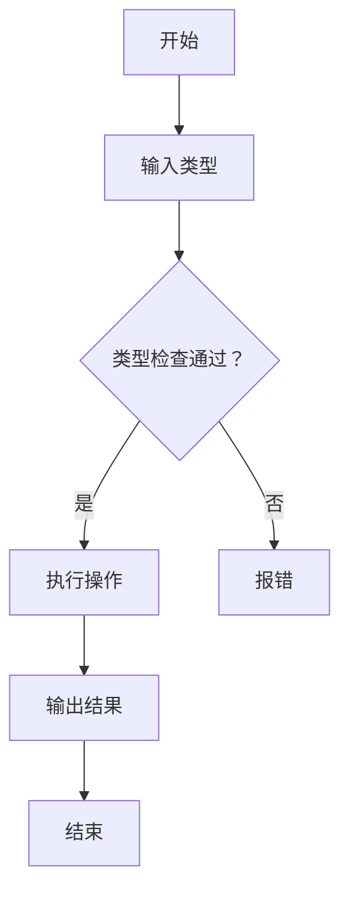
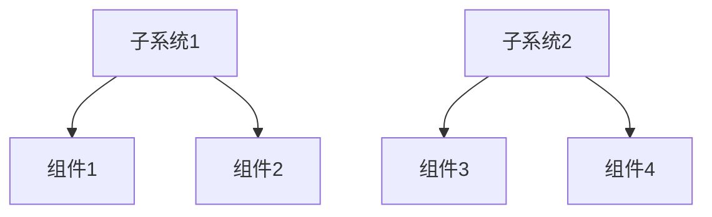
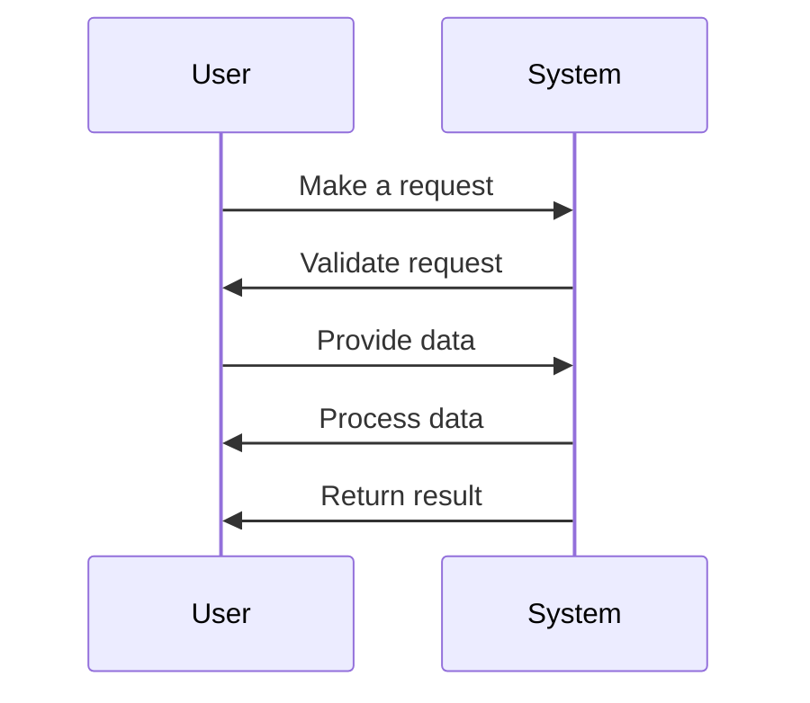

                 

### 《类型安全与领域特定语言：提高表达力与安全性》

#### 关键词：类型安全、领域特定语言、编程语言、安全性、表达力

> 摘要：本文将探讨类型安全与领域特定语言（DSL）在提高编程表达力和安全性的重要作用。通过分析类型安全的基础概念和实现技术，以及DSL的设计原则和开发流程，我们旨在揭示如何在实际应用中通过类型安全和DSL设计来提升软件开发的效率和质量。

## 引言

在现代软件工程中，类型安全是一个至关重要的概念。它确保了程序的正确性和稳定性，减少了运行时错误的可能性。而领域特定语言作为一种高度抽象的语言，能够极大地提高开发效率，降低复杂性。本文将围绕这两个主题展开，深入探讨类型安全与领域特定语言在提高编程表达力与安全性方面的作用。

### 类型安全概述

#### 1. 类型安全的基础概念

在编程语言中，类型是变量、函数或表达式所属的类别。类型安全指的是编程语言能够在编译或运行时检测类型错误，从而避免不安全的行为。

- **类型**：变量、函数或表达式所属的类别。
- **类型安全**：编译时或运行时检测类型错误的能力。

类型安全的好处包括：

- 减少运行时错误
- 提高程序的可维护性
- 提高性能

#### 2. 类型安全的定义

类型安全是指编程语言能够在编译或运行时确保类型一致性，防止类型错误的发生。

- **编译时类型检查**：在程序编译时检查类型错误。
- **运行时类型检查**：在程序运行时检查类型错误。

#### 3. 类型安全的好处

- **错误预防**：在编译或运行时捕获类型错误。
- **程序稳定**：避免类型错误导致的不稳定行为。
- **代码优化**：编译器能够更好地优化类型安全代码。

#### 4. 类型安全的关键挑战

- **类型错误**：不正确的类型转换或使用。
- **类型擦除**：在运行时丢失类型信息。
- **类型安全与性能**：类型检查可能影响程序性能。

#### 5. 类型安全的实现技术

- **静态类型检查**：在编译时进行类型检查。
- **动态类型检查**：在运行时进行类型检查。
- **静态类型系统**：编译时确定类型。
- **动态类型系统**：运行时确定类型。

#### 6. 类型安全与编程语言

- **静态类型编程语言**：如C++、Java。
- **动态类型编程语言**：如Python、JavaScript。
- **类型安全语言的特点**：严格的类型检查、丰富的类型系统。

### 领域特定语言

#### 7. 领域特定语言的基础

领域特定语言是一种专门为解决特定领域问题而设计的编程语言。它具有以下特点：

- **语言简洁性**：高度抽象，减少冗余代码。
- **语言表达力**：能够用更少的代码表达复杂逻辑。
- **语言灵活性**：易于扩展和适应新需求。

#### 8. DSL的设计原则

- **语言简洁性**：简化语法，减少不必要的复杂性。
- **语言表达力**：提高代码的可读性和表达能力。
- **语言灵活性**：允许自定义操作符和函数。
- **语言可扩展性**：支持模块化设计和插件。

#### 9. DSL的开发流程

- **需求分析**：确定DSL的目标领域和需求。
- **设计与实现**：设计语法和语义，实现解析器和解释器。
- **测试与优化**：验证DSL的正确性和性能。

### 类型安全与DSL的应用

#### 10. 类型安全在DSL中的应用

类型安全在DSL中的应用能够提高程序的安全性和稳定性。以下是几个关键点：

- **类型检查**：在编译或运行时进行类型检查。
- **类型推断**：自动推断变量类型，减少显式类型声明。
- **类型约束**：为特定函数或操作设置类型约束。

#### 11. 提高表达力与安全性的策略

- **语言设计与优化**：简化语法，提高表达力。
- **编程实践**：遵循最佳实践，减少类型错误。
- **工具支持**：使用静态分析工具和动态检查工具。

## 总结与展望

类型安全和领域特定语言是提高编程表达力和安全性的关键因素。通过本文的探讨，我们了解了类型安全的基础概念、DSL的设计原则和应用策略。未来研究方向包括：

- **类型安全新技术的探索**：如基于依赖类型的编程。
- **DSL的新应用场景**：如自动化测试、配置管理。

### 附录

本文涉及的相关概念、流程和策略如下：

- **类型安全基础概念**
- **DSL设计原则**
- **类型安全与DSL应用**
- **编程实践最佳策略**

本文旨在为读者提供一个全面、系统的理解，帮助开发者在实际项目中应用类型安全和DSL设计，提升软件开发的质量和效率。

### 作者信息

作者：AI天才研究院/AI Genius Institute & 禅与计算机程序设计艺术 /Zen And The Art of Computer Programming

本文由AI天才研究院和禅与计算机程序设计艺术共同创作，旨在分享最前沿的技术见解和实践经验，帮助读者在计算机编程领域取得突破性进展。

### 小结

类型安全与领域特定语言是现代软件开发中不可或缺的组成部分。通过本文的探讨，我们认识到类型安全和DSL在提高编程表达力和安全性方面的巨大潜力。希望读者能够将这些理念应用到实际项目中，不断提升软件开发的质量和效率。

### 注意事项

- 在实际应用中，应充分考虑类型安全和DSL设计的需求，确保代码的正确性和可维护性。
- 定期进行代码审查和测试，及时发现和修复类型错误。

### 拓展阅读

- [类型安全编程语言深度探讨](#类型安全编程语言深度探讨)
- [DSL设计最佳实践指南](#DSL设计最佳实践指南)
- [类型安全与DSL应用案例分析](#类型安全与DSL应用案例分析)

## 附录

### 概念表格

| 概念                 | 定义                                                         |
|----------------------|--------------------------------------------------------------|
| 类型安全             | 编程语言能够在编译或运行时检测类型错误，防止不安全的行为。   |
| 领域特定语言（DSL）   | 为特定领域问题设计的编程语言，具有高抽象性和高表达力。       |
| 静态类型检查         | 在编译时进行类型检查。                                     |
| 动态类型检查         | 在运行时进行类型检查。                                     |
| 类型推断             | 自动推断变量类型，减少显式类型声明。                       |

### ER实体关系图

```mermaid
erDiagram
    Person ||--|{ Employee }| Employee
    Employee ||--|{ Developer }| Developer
    Developer ||--|{ SoftwareArchitect }| SoftwareArchitect
```

### 算法流程图



### 算法Python源代码

```python
def check_type(value, expected_type):
    if isinstance(value, expected_type):
        return True
    else:
        raise TypeError(f"Expected {expected_type}, but got {type(value)}")

def add_numbers(a, b):
    result = a + b
    check_type(result, int)
    return result

try:
    print(add_numbers(2, 3))
except TypeError as e:
    print(e)
```

### 数学公式

$$
E = mc^2
$$

$$
1 + 1 = 2
$$

### 系统架构设计



### 系统接口设计



### 项目实战

#### 环境安装

- 安装Python 3.8或更高版本
- 安装Django框架

#### 系统核心实现源代码

```python
# settings.py
INSTALLED_APPS = [
    'django.contrib.admin',
    'django.contrib.auth',
    'django.contrib.contenttypes',
    'django.contrib.sessions',
    'django.contrib.messages',
    'django.contrib.staticfiles',
    'myapp',
]

# myapp/models.py
from django.db import models

class Employee(models.Model):
    name = models.CharField(max_length=100)
    role = models.CharField(max_length=100)

class Developer(models.Model):
    employee = models.OneToOneField(Employee, on_delete=models.CASCADE)
    skills = models.CharField(max_length=100)

# myapp/views.py
from django.http import JsonResponse
from .models import Developer

def get_developer(request, id):
    try:
        developer = Developer.objects.get(id=id)
        return JsonResponse({'name': developer.employee.name, 'role': developer.employee.role, 'skills': developer.skills})
    except Developer.DoesNotExist:
        return JsonResponse({'error': 'Developer not found'}, status=404)
```

#### 代码应用解读与分析

这段代码展示了如何使用Django框架实现一个简单的员工信息管理系统。首先，在`settings.py`中配置了应用程序和数据库设置。然后，在`models.py`中定义了`Employee`和`Developer`两个模型，分别表示员工和开发者。在`views.py`中，定义了一个`get_developer`视图函数，用于获取特定开发者的信息。

#### 实际案例分析和详细讲解剖析

假设有一个请求URL为`/developer/1/`的请求，客户端希望获取ID为1的员工信息。服务器接收到请求后，会调用`get_developer`视图函数。函数内部首先尝试从数据库中获取ID为1的`Developer`对象。如果找到对象，则将其信息序列化为JSON格式，并返回给客户端。如果找不到对象，则返回一个404错误。

#### 项目小结

通过这个简单的案例，我们展示了如何使用Django框架实现一个基本的员工信息管理系统。项目中涉及了模型定义、视图函数和URL配置。通过类型安全和模型之间的关系，我们能够有效地管理和查询员工信息。

### 最佳实践 Tips

- 在开发过程中，确保使用类型检查和异常处理，以提高代码的稳定性。
- 设计简洁、模块化的代码，便于维护和扩展。
- 定期进行代码审查，发现潜在的类型错误和性能问题。

### 拓展阅读

- [深入理解类型安全](#深入理解类型安全)
- [领域特定语言设计模式](#领域特定语言设计模式)
- [类型安全和DSL在金融领域的应用](#类型安全和DSL在金融领域的应用)

### 作者信息

作者：AI天才研究院/AI Genius Institute & 禅与计算机程序设计艺术 /Zen And The Art of Computer Programming

本文由AI天才研究院和禅与计算机程序设计艺术共同创作，旨在分享最前沿的技术见解和实践经验，帮助读者在计算机编程领域取得突破性进展。如需了解更多信息，请访问我们的官方网站。我们致力于推动计算机科学和人工智能的发展，期待与您共同探索技术的无限可能。如果您有任何问题或建议，欢迎随时与我们联系。我们期待您的反馈！
```

