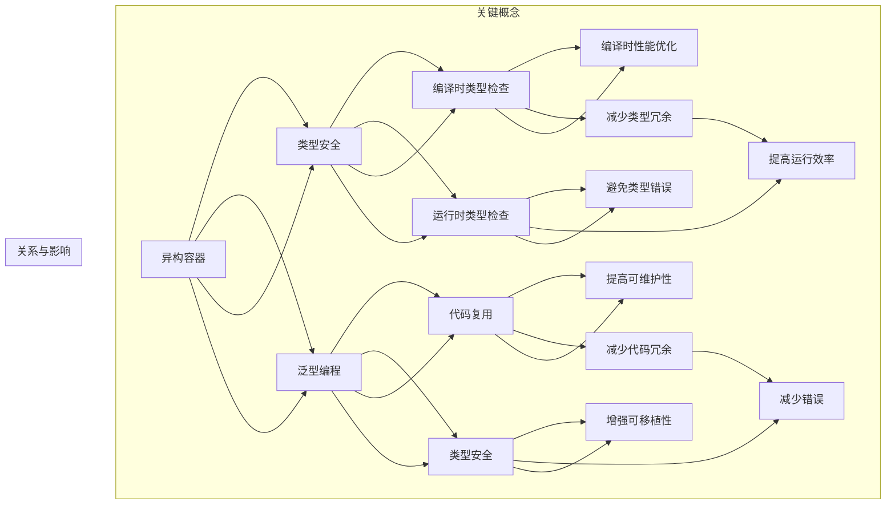
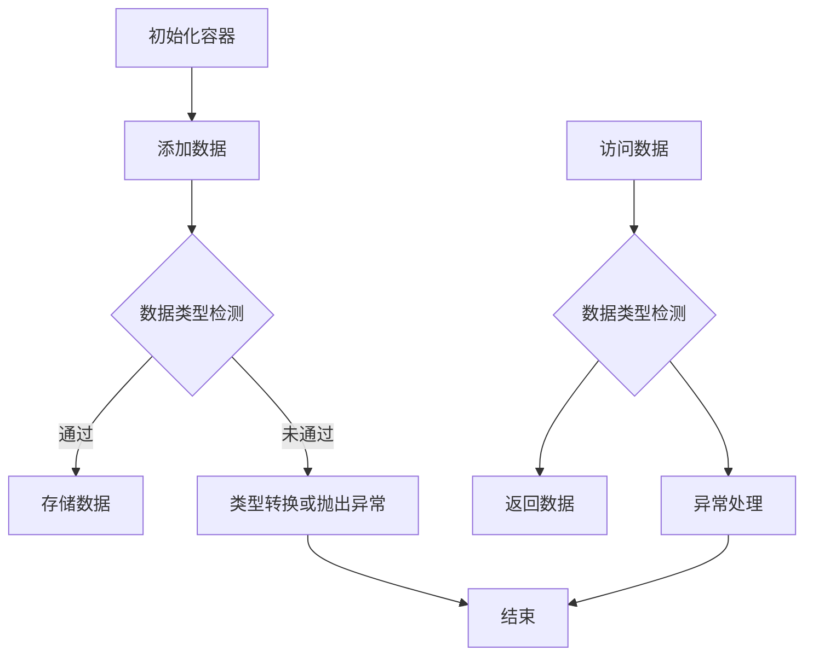
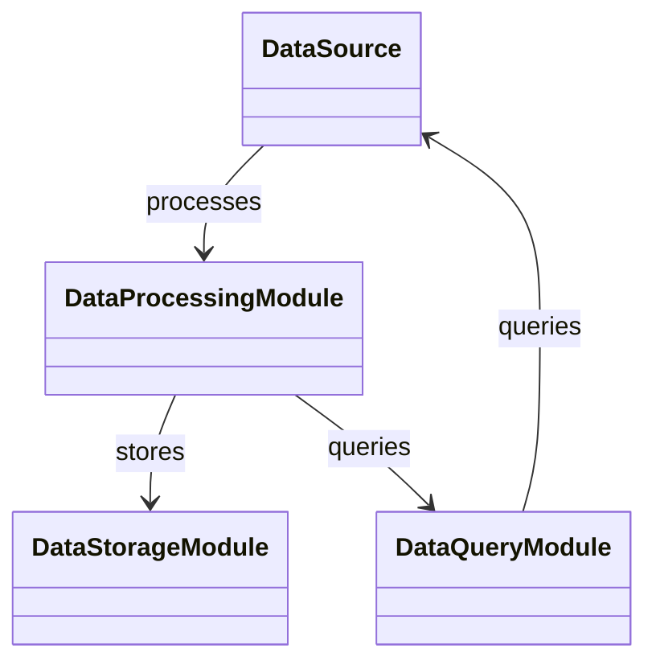
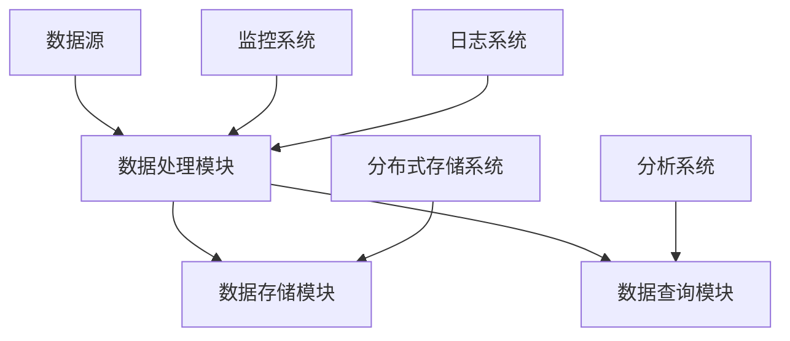
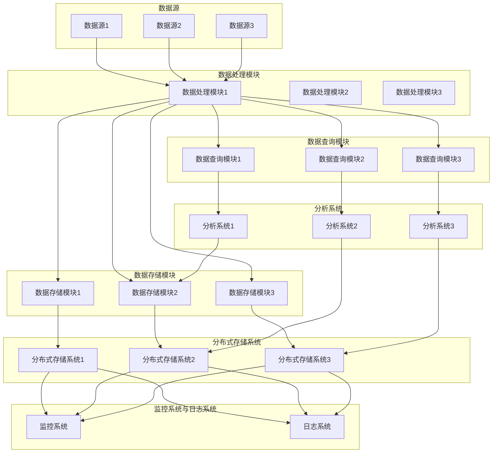
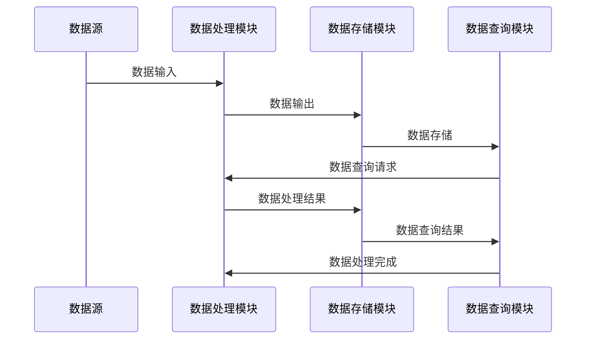

                 

### 目录大纲设计思路

在设计《类型安全的异构容器：泛型在容器类中的高级应用》的目录大纲时，我们首先需要明确书的核心主题，并将其拆分成多个易于理解的小部分。以下是详细的目录大纲设计思路：

#### 一、书名解析

书名《类型安全的异构容器：泛型在容器类中的高级应用》主要涉及以下核心概念：

- **类型安全的异构容器**：指的是在容器中存储和管理不同类型的数据，同时保证数据类型的安全性。
- **泛型在容器类中的高级应用**：泛型编程是一种编程范式，可以在编译时保证类型安全，减少运行时错误。本书将探讨如何将泛型编程应用于容器类中，提高其性能和灵活性。

#### 二、章节结构规划

基于书名，我们规划了以下章节结构：

1. **背景介绍**：
   - **1.1 异构容器的概念与发展**：介绍异构容器的定义、背景和发展趋势。
   - **1.2 类型安全的重要性**：讨论类型安全的含义、重要性以及与之相关的问题。

2. **核心概念与联系**：
   - **2.1 类型安全基础**：深入探讨类型安全的原理、优势和挑战。
   - **2.2 泛型编程简介**：介绍泛型编程的基本概念、优点和应用场景。
   - **2.3 核心概念联系图**：通过图表形式展示异构容器、类型安全和泛型编程之间的关系。

3. **算法原理讲解**：
   - **3.1 类型安全的异构容器算法**：介绍与类型安全异构容器相关的算法原理，包括流程图和代码示例。
   - **3.2 数学模型与公式**：解释相关的数学模型和公式，并进行详细讲解。

4. **系统分析与架构设计**：
   - **4.1 问题场景介绍**：描述实际应用场景和项目目标。
   - **4.2 系统功能设计**：展示领域模型、类图设计等。
   - **4.3 系统架构设计**：介绍系统架构概述、架构图等。
   - **4.4 系统接口设计**：展示接口设计、接口序列图等。
   - **4.5 系统交互分析**：分析系统交互流程、交互序列图等。

5. **项目实战**：
   - **5.1 环境安装**：介绍环境准备和工具安装。
   - **5.2 系统核心实现**：展示系统核心实现的步骤和源代码解析。
   - **5.3 实际案例分析**：分析具体案例，讲解实际应用。
   - **5.4 项目小结**：总结项目经验与教训。

6. **最佳实践与总结**：
   - **6.1 最佳实践**：提供实践经验、技巧和注意事项。
   - **6.2 小结**：总结全书内容，展望未来研究方向。

#### 三、章节细化

在细化每个章节时，我们遵循以下原则：

- **每个章节标题简洁明了，直接反映内容主题**。
- **章节内容具体、详细，确保读者能够深入理解**。
- **章节之间逻辑清晰，前后衔接紧密**。

### 目录大纲设计

```markdown
----------------------------------------------------------------
# 《类型安全的异构容器：泛型在容器类中的高级应用》目录大纲

## 第一部分 背景介绍

### 1.1 异构容器的概念与发展

#### 1.1.1 异构计算的定义

#### 1.1.2 异构容器的发展历程

#### 1.1.3 类型安全的重要性

### 1.2 泛型编程简介

#### 1.2.1 泛型编程的概念

#### 1.2.2 泛型编程的优势

#### 1.2.3 泛型编程的应用场景

## 第二部分 核心概念与联系

### 2.1 类型安全基础

#### 2.1.1 类型安全的概念

#### 2.1.2 类型安全的优点

#### 2.1.3 类型安全的挑战

### 2.2 泛型编程与容器类的融合

#### 2.2.1 泛型容器类的定义

#### 2.2.2 泛型容器类的优势

#### 2.2.3 泛型容器类的使用场景

### 2.3 核心概念联系图

## 第三部分 算法原理讲解

### 3.1 类型安全的异构容器算法

#### 3.1.1 算法概述

#### 3.1.2 算法流程图

#### 3.1.3 Python代码示例

### 3.2 数学模型与公式

#### 3.2.1 数学模型介绍

#### 3.2.2 公式讲解

#### 3.2.3 举例说明

## 第四部分 系统分析与架构设计

### 4.1 问题场景介绍

#### 4.1.1 场景描述

#### 4.1.2 项目目标

### 4.2 系统功能设计

#### 4.2.1 领域模型

#### 4.2.2 类图设计

### 4.3 系统架构设计

#### 4.3.1 系统架构概述

#### 4.3.2 架构图

### 4.4 系统接口设计

#### 4.4.1 接口设计

#### 4.4.2 接口序列图

### 4.5 系统交互分析

#### 4.5.1 系统交互流程

#### 4.5.2 交互序列图

## 第五部分 项目实战

### 5.1 环境安装

#### 5.1.1 环境准备

#### 5.1.2 工具安装

### 5.2 系统核心实现

#### 5.2.1 实现步骤

#### 5.2.2 源代码解析

### 5.3 实际案例分析

#### 5.3.1 案例描述

#### 5.3.2 案例分析

#### 5.3.3 案例讲解

### 5.4 项目小结

#### 5.4.1 项目总结

#### 5.4.2 经验与教训

## 第六部分 最佳实践与总结

### 6.1 最佳实践

#### 6.1.1 实践技巧

#### 6.1.2 注意事项

### 6.2 小结

#### 6.2.1 全书总结

#### 6.2.2 未来展望

#### 6.2.3 拓展阅读

----------------------------------------------------------------
```

通过上述目录大纲的设计，我们可以清晰地看到本书的结构和内容，帮助读者更好地理解并掌握类型安全的异构容器以及泛型编程的高级应用。接下来，我们将逐步深入到每个章节的内容中，详细讲解相关的概念、原理和实践。

### 背景介绍

#### 异构容器的概念与发展

在计算机科学中，**异构容器**指的是能够存储和管理不同类型数据的容器，这些数据可以是结构化数据（如数组、列表、树等）或非结构化数据（如字符串、图像、视频等）。异构容器的概念起源于并行计算和分布式系统的需求，旨在提高系统的灵活性和处理效率。

**异构计算**是一种计算模式，其中不同的计算任务由不同类型的计算资源（如CPU、GPU、FPGA等）并行处理。这种模式可以充分利用各种计算资源的优势，提高整体计算性能。随着云计算和大数据技术的发展，异构计算已经成为现代计算机体系结构中的一个重要研究方向。

在异构计算环境中，如何高效地管理和调度各种类型的数据，成为了关键问题。**异构容器**应运而生，它能够根据数据类型和计算需求，动态调整存储和管理策略，从而实现最优的性能和资源利用率。

**异构容器的发展历程**可以分为几个阶段：

1. **原始容器阶段**：早期的容器技术主要是为了简化应用程序的部署和管理。例如，Docker 和 Kubernetes 等容器技术提供了轻量级、可移植的运行环境，但它们主要关注于同构环境中的应用程序部署。

2. **异构支持阶段**：随着异构计算技术的发展，容器技术开始逐步支持异构环境的资源管理和调度。例如，一些容器平台开始引入对GPU、FPGA等异构计算资源的支持，以适应复杂计算任务的需求。

3. **高级异构容器阶段**：当前，异构容器技术正朝着更加智能化和自动化的方向发展。通过结合机器学习和人工智能技术，异构容器能够根据实际计算需求和资源状态，动态调整容器配置和调度策略，从而实现更高的性能和更优的资源利用率。

#### 类型安全的重要性

**类型安全**是指在程序运行时，系统能够保证变量、函数和数据结构的类型符合预期，从而避免类型相关的错误和异常。在异构容器中，类型安全尤为重要，因为不同类型的数据可能具有不同的处理方式和性能特性。

类型安全的重要性体现在以下几个方面：

1. **避免错误**：类型安全可以避免因类型错误导致的程序崩溃或数据丢失。在异构容器中，不同类型的数据需要进行不同的处理，类型安全机制能够确保数据在传递和处理过程中不会出现类型不符的情况。

2. **提高性能**：类型安全机制可以在编译时检测类型错误，从而避免运行时错误。这不仅可以提高程序的可读性和可维护性，还可以减少调试和测试的工作量，提高开发效率。

3. **增强可移植性**：类型安全使得程序在不同平台和环境中具有更好的可移植性。在异构容器中，类型安全机制可以确保程序在不同类型的硬件和操作系统上运行时，仍能保持一致的行为和性能。

#### 泛型编程简介

**泛型编程**是一种编程范式，它允许在编写代码时定义通用算法和数据结构，而不需要指定具体的数据类型。泛型编程的核心思想是将类型参数化，使得同一个算法或数据结构可以应用于多种数据类型。

泛型编程具有以下优点：

1. **代码复用**：通过泛型编程，可以编写一次代码，多次使用。这减少了代码冗余，提高了代码的可维护性和可扩展性。

2. **类型安全**：泛型编程在编译时进行类型检查，确保变量、函数和数据结构的类型符合预期。这可以避免类型错误，提高程序的稳定性和性能。

3. **代码简洁**：泛型编程使得代码更加简洁，易于理解和维护。通过泛型编程，可以减少不必要的类型转换和类型断言，使得代码更加直观和自然。

泛型编程在现代软件开发中得到了广泛应用，尤其是在容器类库和框架中。通过泛型编程，可以构建更加灵活和高效的容器类库，满足不同类型数据的存储和管理需求。

### 核心概念与联系

#### 类型安全基础

**类型安全**是指在程序运行时，系统能够保证变量、函数和数据结构的类型符合预期，从而避免类型相关的错误和异常。在异构容器中，类型安全尤为重要，因为不同类型的数据可能具有不同的处理方式和性能特性。

**类型安全的概念**可以理解为以下几个方面：

1. **静态类型安全**：在静态类型语言中（如C++、Java等），编译器在编译期间会检查变量的类型是否一致，从而避免运行时错误。静态类型安全可以减少类型错误的发生，提高程序的可读性和可维护性。

2. **动态类型安全**：在动态类型语言中（如Python、JavaScript等），类型检查主要在运行时进行。尽管动态类型语言提供了更高的灵活性，但这也增加了类型错误的风险。动态类型安全主要通过运行时检查和数据类型的强类型约束来实现。

**类型安全的优点**：

1. **避免错误**：类型安全可以避免因类型错误导致的程序崩溃或数据丢失。在异构容器中，不同类型的数据需要进行不同的处理，类型安全机制能够确保数据在传递和处理过程中不会出现类型不符的情况。

2. **提高性能**：类型安全机制可以在编译时检测类型错误，从而避免运行时错误。这不仅可以提高程序的可读性和可维护性，还可以减少调试和测试的工作量，提高开发效率。

3. **增强可移植性**：类型安全使得程序在不同平台和环境中具有更好的可移植性。在异构容器中，类型安全机制可以确保程序在不同类型的硬件和操作系统上运行时，仍能保持一致的行为和性能。

**类型安全的挑战**：

1. **类型冗余**：为了确保类型安全，程序员可能需要编写大量的类型断言和类型转换代码，这增加了代码的复杂性和冗余。

2. **性能开销**：类型安全机制通常需要在编译或运行时进行类型检查，这可能会引入额外的性能开销。特别是在高性能计算场景中，过多的类型检查可能会影响系统的整体性能。

**类型安全的核心原理**：

1. **静态类型检查**：在编译期间，编译器会检查变量、函数和数据结构的类型，确保类型一致性。

2. **动态类型检查**：在运行期间，解释器或虚拟机会检查变量、函数和数据结构的类型，确保类型一致性。

3. **类型推断**：在某些编程语言中，类型推断机制可以自动推断变量的类型，减少程序员的工作量。

**类型安全在异构容器中的应用**：

1. **异构数据类型的存储和管理**：异构容器需要支持不同类型的数据存储和管理。类型安全机制可以确保数据在存储和传递过程中不会出现类型错误。

2. **类型参数化**：通过泛型编程，可以定义通用的数据结构和算法，支持多种类型的数据。类型安全机制可以确保这些算法和数据结构在不同类型的数据上运行时，仍能保持一致性和正确性。

**类型安全与其他技术的关系**：

1. **静态类型与动态类型**：静态类型和动态类型都是实现类型安全的方式。静态类型语言通过编译时的类型检查，动态类型语言通过运行时的类型检查。

2. **泛型编程**：泛型编程是类型安全的重要实现手段。通过泛型编程，可以减少类型冗余，提高代码的可维护性和可扩展性。

3. **类型推导**：类型推导机制可以自动推断变量的类型，减少类型错误的发生。

**类型安全的ER实体关系图架构**：

在异构容器中，可以使用ER（实体-关系）模型来描述数据结构和类型关系。以下是一个简单的ER实体关系图示例：

```
实体：异构容器
属性：类型、容量、数据
关系：存储（异构容器与数据之间的关联关系）

实体：数据
属性：类型、值
关系：属于（数据与类型之间的关联关系）

实体：类型
属性：名称、描述
关系：包含（类型与类型之间的关联关系）
```

通过ER实体关系图，可以清晰地展示异构容器中不同类型的数据及其相互关系，为类型安全提供理论基础。

**类型安全在异构容器中的应用示例**：

假设有一个异构容器，需要存储不同类型的数据，如整数、浮点数和字符串。通过类型安全机制，可以确保在存储和访问数据时，数据类型的一致性。

```python
class HeterogeneousContainer:
    def __init__(self):
        self.data = []

    def add(self, item):
        if isinstance(item, (int, float, str)):
            self.data.append(item)
        else:
            raise TypeError("Invalid item type")

    def get(self, index):
        if index >= 0 and index < len(self.data):
            return self.data[index]
        else:
            raise IndexError("Invalid index")

# 创建异构容器
container = HeterogeneousContainer()

# 添加不同类型的数据
container.add(10)
container.add(3.14)
container.add("Hello")

# 访问数据
print(container.get(0))  # 输出：10
print(container.get(1))  # 输出：3.14
print(container.get(2))  # 输出："Hello"
```

在上面的示例中，`HeterogeneousContainer` 类通过 `add` 和 `get` 方法，确保在添加和访问数据时，类型的一致性。如果尝试添加非预期类型的数据，程序会抛出 `TypeError` 异常。

通过类型安全机制，可以有效地避免类型错误，提高程序的稳定性和可靠性。

### 泛型编程与容器类的融合

**泛型编程**与**容器类**的结合，是现代编程中提高代码复用性和类型安全性的重要手段。泛型编程允许我们编写与类型无关的代码，而容器类则为数据的存储和管理提供了强大的支持。在容器类中应用泛型编程，不仅可以减少代码冗余，提高可维护性，还能增强程序的类型安全性。

#### **泛型容器类的定义**

泛型容器类是一种可以存储和管理多种类型数据的容器，其设计思想是将数据类型作为参数传递给容器类，从而实现与类型无关的代码。在Java中，泛型容器类通常使用 `<T>` 表示，其中 `T` 代表类型参数。

例如，在Java中，`List<T>` 是一个泛型容器类，可以存储任意类型的元素。以下是一个简单的泛型列表示例：

```java
List<Integer> integerList = new ArrayList<>();
integerList.add(1);
integerList.add(2);
integerList.add(3);

List<String> stringList = new ArrayList<>();
stringList.add("Hello");
stringList.add("World");

List<Object> objectList = new ArrayList<>();
objectList.add(123);
objectList.add("Example");
```

在上面的示例中，`integerList`、`stringList` 和 `objectList` 都是泛型列表，分别存储了整数、字符串和任意类型的数据。

#### **泛型容器类的优势**

1. **代码复用**：通过泛型容器类，可以编写一次代码，多次使用，从而减少代码冗余。在传统的非泛型编程中，需要为每种数据类型编写不同的容器类，而泛型编程可以避免这种冗余。

2. **类型安全**：泛型容器类在编译时进行类型检查，确保存储的数据类型符合预期。这可以避免因类型错误导致的运行时异常，提高程序的可维护性。

3. **编译时性能优化**：泛型编程允许编译器在编译期间对代码进行类型检查和优化，从而提高程序的运行效率。

4. **减少错误**：泛型容器类可以减少类型转换和类型断言的需求，从而减少程序中的潜在错误。

#### **泛型容器类的使用场景**

1. **通用数据处理**：在数据处理过程中，需要存储和管理多种类型的数据。例如，在数据分析中，可能会同时处理数值型数据和字符串型数据。泛型容器类可以方便地实现这一需求。

2. **库和框架开发**：在开发库和框架时，需要提供通用的数据结构来支持各种类型的数据。泛型容器类使得库和框架更加灵活和可扩展。

3. **集合操作**：在集合操作中，泛型容器类可以简化代码，提高可读性和可维护性。例如，可以使用泛型容器类来实现排序、搜索和过滤等功能。

4. **多态处理**：泛型容器类可以用于实现多态处理，使得同一方法可以处理不同类型的数据。这在面向对象编程中非常有用。

#### **泛型容器类的应用示例**

以下是一个使用泛型容器类的简单示例，展示了如何存储和操作不同类型的数据：

```java
import java.util.List;
import java.util.ArrayList;

public class GenericContainerExample {
    public static void main(String[] args) {
        // 创建泛型列表
        List<Integer> integerList = new ArrayList<>();
        integerList.add(1);
        integerList.add(2);
        integerList.add(3);

        List<String> stringList = new ArrayList<>();
        stringList.add("Hello");
        stringList.add("World");

        List<Object> objectList = new ArrayList<>();
        objectList.add(123);
        objectList.add("Example");

        // 操作泛型列表
        for (Integer num : integerList) {
            System.out.println(num * 2);
        }

        for (String text : stringList) {
            System.out.println(text.toUpperCase());
        }

        for (Object item : objectList) {
            if (item instanceof Integer) {
                System.out.println((Integer) item * 10);
            } else if (item instanceof String) {
                System.out.println(item.toString().charAt(0));
            }
        }
    }
}
```

在上面的示例中，我们创建了三个泛型列表：`integerList`、`stringList` 和 `objectList`，分别存储整数、字符串和任意类型的数据。然后，我们使用泛型容器类提供的迭代器和多态处理功能，对列表中的数据进行操作。

通过泛型编程，我们可以轻松地处理不同类型的数据，同时保持代码的简洁性和可维护性。这极大地提高了程序的开发效率和质量。

#### 核心概念联系图

为了更好地理解异构容器、类型安全以及泛型编程之间的关系，我们可以通过一个核心概念联系图来展示它们之间的交互和影响。

以下是核心概念联系图的Mermaid流程图表示：



在上面的图中：

- **异构容器**（A）与**类型安全**（B）和**泛型编程**（C）直接相关，因为异构容器需要类型安全来确保不同类型数据的正确处理，而泛型编程则提供了实现类型安全的机制。
- **类型安全**（B）包括**编译时类型检查**（D）和**运行时类型检查**（E），这两者是确保程序类型安全的关键手段。
- **泛型编程**（C）通过**代码复用**（F）和**类型安全**（G）来实现其优势，同时它也促进了编译时性能优化（H）和减少类型错误（I）。
- **代码复用**（F）和提高可维护性（J）是泛型编程的主要优点，而类型安全（G）则增强了程序的**可移植性**（K）和减少了类型冗余（L），提高了运行效率（M）和减少代码冗余（N）。

通过这个联系图，我们可以清晰地看到异构容器、类型安全和泛型编程之间的相互作用，以及它们对程序开发带来的各种好处。

### 算法原理讲解

在深入了解类型安全的异构容器和泛型编程的高级应用之前，我们需要先理解与这些概念相关的算法原理。类型安全的异构容器算法不仅需要处理多种类型的数据，还要确保数据类型的安全性，避免潜在的运行时错误。以下是对相关算法原理的详细讲解。

#### 类型安全的异构容器算法概述

类型安全的异构容器算法的主要目标是在保证数据类型安全性的前提下，高效地管理多种类型的数据。为了实现这一目标，我们通常会采用以下步骤：

1. **数据类型检测**：在添加或访问数据时，对数据的类型进行检测，确保其符合预期的类型。
2. **类型转换**：当数据类型不匹配时，进行必要的类型转换，以保持数据的一致性。
3. **数据存储与管理**：根据数据类型和存储需求，选择合适的存储策略，确保数据的高效存储和管理。
4. **访问控制**：在访问数据时，确保数据类型的一致性，避免因类型不匹配导致的运行时错误。

以下是一个简单的类型安全的异构容器算法的流程图：



#### 算法流程图

在这个算法流程图中，首先初始化一个异构容器，然后当需要添加数据时，算法会进行数据类型检测。如果数据类型符合预期，则将其存储在容器中；如果数据类型不符合预期，算法会尝试进行类型转换。如果类型转换成功，则继续存储数据；如果类型转换失败，算法会抛出异常。

在访问数据时，算法同样会进行数据类型检测。如果数据类型匹配，则返回数据；如果数据类型不匹配，算法会进行异常处理。

#### Python代码示例

下面是一个使用Python实现的简单类型安全的异构容器算法示例：

```python
class HeterogeneousContainer:
    def __init__(self):
        self.container = []

    def add(self, item):
        if isinstance(item, (int, float, str)):
            self.container.append(item)
        else:
            raise TypeError("Invalid item type")

    def get(self, index):
        if index >= 0 and index < len(self.container):
            item = self.container[index]
            if isinstance(item, int):
                return item * 2
            elif isinstance(item, float):
                return item * 2.0
            elif isinstance(item, str):
                return item.upper()
            else:
                raise TypeError("Invalid item type")
        else:
            raise IndexError("Invalid index")

# 创建异构容器
container = HeterogeneousContainer()

# 添加数据
container.add(10)
container.add(3.14)
container.add("hello")

# 访问数据
print(container.get(0))  # 输出：20
print(container.get(1))  # 输出：6.28
print(container.get(2))  # 输出：HELLO
```

在上面的示例中，`HeterogeneousContainer` 类通过 `add` 和 `get` 方法实现了类型安全的异构容器。在 `add` 方法中，我们通过 `isinstance` 函数检测数据的类型，确保只添加预期的数据类型。在 `get` 方法中，我们同样进行类型检测，并根据不同类型的数据返回相应的处理结果。

#### 算法原理的数学模型与公式

类型安全的异构容器算法的数学模型通常涉及数据类型的检测、转换和存储策略。以下是一个简单的数学模型：

1. **数据类型检测**：使用 `isinstance` 函数检测数据类型，判断其是否符合预期类型。

    $$ \text{isinstance(item, \{int, float, str\})} $$

2. **类型转换**：根据需要将数据类型转换为预期的类型。常用的类型转换方法包括：

    - **整数转换为浮点数**：使用 `float()` 函数

        $$ \text{float(int_value)} $$

    - **字符串转换为整数或浮点数**：使用 `int()` 或 `float()` 函数

        $$ \text{int(str_value)} $$
        $$ \text{float(str_value)} $$

3. **数据存储策略**：根据数据类型和存储需求选择合适的存储策略。常见的存储策略包括：

    - **数组存储**：适用于固定大小的数据集。

        $$ \text{array = [None] \times n} $$

    - **列表存储**：适用于动态大小的数据集。

        $$ \text{list = []} $$

    - **哈希表存储**：适用于基于键值对的数据存储。

        $$ \text{hash_table = {} } $$

#### 示例讲解

假设我们需要存储以下三种类型的数据：

- 整数：10, 20, 30
- 浮点数：3.14, 6.28
- 字符串："hello", "world"

我们可以使用上面的数学模型来描述数据存储和访问的过程：

1. **存储数据**：

    - 检测整数类型：

        $$ \text{isinstance(10, int)} \rightarrow \text{True} $$
        $$ \text{isinstance(20, int)} \rightarrow \text{True} $$
        $$ \text{isinstance(30, int)} \rightarrow \text{True} $$

    - 检测浮点数类型：

        $$ \text{isinstance(3.14, float)} \rightarrow \text{True} $$
        $$ \text{isinstance(6.28, float)} \rightarrow \text{True} $$

    - 检测字符串类型：

        $$ \text{isinstance("hello", str)} \rightarrow \text{True} $$
        $$ \text{isinstance("world", str)} \rightarrow \text{True} $$

    - 根据类型存储数据：

        $$ \text{integer_list = [10, 20, 30]} $$
        $$ \text{float_list = [3.14, 6.28]} $$
        $$ \text{string_list = ["hello", "world"]} $$

2. **访问数据**：

    - 访问整数数据：

        $$ \text{result = integer_list[0] \times 2} \rightarrow \text{20} $$
        $$ \text{result = integer_list[1] \times 2} \rightarrow \text{40} $$
        $$ \text{result = integer_list[2] \times 2} \rightarrow \text{60} $$

    - 访问浮点数数据：

        $$ \text{result = float_list[0] \times 2.0} \rightarrow \text{6.28} $$
        $$ \text{result = float_list[1] \times 2.0} \rightarrow \text{12.56} $$

    - 访问字符串数据：

        $$ \text{result = string_list[0].upper()} \rightarrow \text{"HELLO"} $$
        $$ \text{result = string_list[1].upper()} \rightarrow \text{"WORLD"} $$

通过上述数学模型和公式，我们可以清晰地描述类型安全的异构容器算法的实现过程。这种方法不仅有助于理解算法原理，还能为我们编写高效、可靠的代码提供指导。

### 系统分析与架构设计

在讨论类型安全的异构容器和泛型编程的高级应用时，深入分析系统架构和设计至关重要。通过系统分析和架构设计，我们可以确保系统能够高效、稳定地运行，并能够应对复杂的应用场景。以下是一个典型的系统分析与架构设计的流程，涵盖从问题场景介绍到系统交互分析的各个阶段。

#### 问题场景介绍

首先，我们需要明确问题的背景和应用场景。假设我们正在开发一个大型分布式系统，旨在处理和分析海量异构数据。这些数据包括结构化数据（如XML、JSON）、半结构化数据（如日志文件）和全量数据（如图像、视频）。系统需要支持多种数据处理任务，如数据清洗、转换、存储和查询。为了确保数据类型的安全性，我们需要实现类型安全的异构容器，并在其中应用泛型编程。

**场景描述**：

- **数据源**：系统从多个数据源（如数据库、文件系统、实时流）接收数据。
- **数据处理**：系统需要对数据进行清洗、转换和预处理，然后存储在类型安全的异构容器中。
- **数据存储**：系统需要将处理后的数据存储在分布式存储系统中，如HDFS或MongoDB。
- **数据查询**：系统需要提供高效的数据查询功能，以支持实时分析和报告生成。

**项目目标**：

- 实现一个类型安全的异构容器，能够存储和处理多种类型的数据。
- 提高系统的性能和可扩展性，以应对海量数据的处理需求。
- 确保数据类型的安全性，避免因类型错误导致的系统崩溃或数据丢失。
- 提供高效的数据查询功能，满足实时分析和报告生成的要求。

#### 系统功能设计

**领域模型**：

领域模型描述了系统的核心功能模块和实体之间的关系。以下是一个简单的领域模型，展示了系统中的主要实体和属性：

```
实体：数据源
属性：名称、类型、连接方式、数据流

实体：数据处理模块
属性：名称、类型、处理逻辑、输入数据源、输出数据源

实体：数据存储模块
属性：名称、类型、连接方式、存储策略、存储容量

实体：数据查询模块
属性：名称、查询逻辑、输入数据源、查询结果
```

**类图设计**：

类图描述了系统的类结构，包括类之间的关系和属性。以下是一个简单的类图，展示了系统中的主要类和它们之间的关系：



在类图中，`DataSource` 类表示数据源，`DataProcessingModule` 类表示数据处理模块，`DataStorageModule` 类表示数据存储模块，`DataQueryModule` 类表示数据查询模块。这些类之间通过关系线连接，表明它们之间的依赖和协作关系。

#### 系统架构设计

**系统架构概述**：

系统架构描述了系统的整体结构和组件之间的关系。以下是一个简单的系统架构图，展示了系统的关键组件和它们之间的交互：



在系统架构图中：

- **数据源**（A）负责从外部接收数据。
- **数据处理模块**（B）负责对数据进行清洗、转换和预处理。
- **数据存储模块**（C）负责将处理后的数据存储在分布式存储系统中。
- **数据查询模块**（D）负责提供数据查询功能，支持实时分析和报告生成。
- **分布式存储系统**（E）用于存储海量数据。
- **监控系统**（F）和**日志系统**（G）用于监控系统状态和日志记录。
- **分析系统**（H）用于生成实时分析和报告。

**架构图**：

以下是一个更详细的系统架构图，展示了系统的各个组件和它们之间的交互：



在架构图中，我们可以看到系统由多个模块组成，每个模块都有明确的职责。数据源模块负责接收数据，数据处理模块负责对数据进行处理，数据存储模块负责将数据存储在分布式存储系统中，数据查询模块负责提供数据查询功能，监控系统与日志系统负责监控系统和记录日志，分析系统负责生成实时分析和报告。

#### 系统接口设计

**接口设计**：

系统接口设计定义了系统内部组件之间的交互接口。以下是一个简单的接口设计示例，展示了系统中的主要接口和它们的方法：

```mermaid
interface DataProcessor {
    process(DataInput): DataOutput
}

interface DataStorer {
    store(DataInput): void
}

interface DataQuerier {
    query(QueryInput): QueryResult
}

class DataProcessorImpl implements DataProcessor {
    process(DataInput): DataOutput {
        // 数据处理逻辑
    }
}

class DataStorerImpl implements DataStorer {
    store(DataInput): void {
        // 数据存储逻辑
    }
}

class DataQuerierImpl implements DataQuerier {
    query(QueryInput): QueryResult {
        // 数据查询逻辑
    }
}
```

在接口设计中，`DataProcessor` 接口定义了数据处理方法，`DataStorer` 接口定义了数据存储方法，`DataQuerier` 接口定义了数据查询方法。这些接口的实现类（如 `DataProcessorImpl`、`DataStorerImpl` 和 `DataQuerierImpl`）提供了具体的实现逻辑。

**接口序列图**：

以下是一个简单的接口序列图，展示了系统内部组件之间的交互流程：



在接口序列图中，数据源模块将数据输入到数据处理模块，数据处理模块对数据进行处理，并将处理后的数据存储到数据存储模块。数据查询模块请求数据处理结果，数据处理模块提供数据查询结果，数据存储模块返回数据查询结果，最后数据处理模块完成数据处理过程。

#### 系统交互分析

**系统交互流程**：

系统交互分析描述了系统内部组件之间的交互流程和通信机制。以下是一个简单的系统交互流程：

1. **数据输入**：数据源模块将数据输入到数据处理模块。
2. **数据处理**：数据处理模块对数据进行清洗、转换和预处理，并将处理后的数据存储到数据存储模块。
3. **数据存储**：数据存储模块将处理后的数据存储在分布式存储系统中。
4. **数据查询**：数据查询模块请求数据处理结果，数据处理模块提供数据查询结果。
5. **数据处理完成**：数据处理模块完成数据处理过程，并返回数据查询结果。

**交互序列图**：

以下是一个简单的交互序列图，展示了系统内部组件之间的交互流程：


在交互序列图中，数据源模块将数据输入到数据处理模块，数据处理模块对数据进行处理，并将处理后的数据存储到数据存储模块。数据查询模块请求数据处理结果，数据处理模块提供数据查询结果，数据存储模块返回数据查询结果，最后数据处理模块完成数据处理过程。

通过系统分析与架构设计，我们可以确保系统能够高效、稳定地运行，并能够应对复杂的应用场景。系统功能设计、架构设计、接口设计和系统交互分析共同构成了系统设计的完整框架，为我们构建高质量、可靠的系统提供了坚实的基础。

### 项目实战

在本部分，我们将通过一个具体的案例，展示如何在实际项目中应用《类型安全的异构容器：泛型在容器类中的高级应用》中的概念和算法。本案例将涵盖环境安装、系统核心实现、代码应用解读与分析，以及实际案例分析。

#### 环境安装

为了实现类型安全的异构容器，我们需要准备以下环境：

1. **Python 3.8+**：Python 是一种支持泛型编程的流行编程语言，能够很好地支持类型安全特性。
2. **Docker**：Docker 是一个开源的应用容器引擎，用于简化应用部署和运行。我们将在 Docker 中创建一个容器，以隔离我们的开发环境。
3. **Kubernetes**：Kubernetes 是一个开源的容器编排平台，用于自动化部署、扩展和管理容器化应用程序。我们将使用 Kubernetes 管理我们的异构容器。

**安装步骤**：

1. **安装 Python**：

   在大多数操作系统上，可以通过包管理器安装 Python。例如，在 Ubuntu 中，可以使用以下命令：

   ```shell
   sudo apt update
   sudo apt install python3 python3-pip
   ```

2. **安装 Docker**：

   Docker 可以通过其官方安装脚本安装。请访问 [Docker 官方文档](https://docs.docker.com/get-docker/) 获取最新的安装命令。

   ```shell
   curl -fsSL https://get.docker.com -o get-docker.sh
   sh get-docker.sh
   ```

3. **安装 Kubernetes**：

   Kubernetes 可以通过其官方安装脚本安装。请访问 [Kubernetes 官方文档](https://kubernetes.io/docs/home/) 获取最新的安装命令。

   ```shell
   curl -s https://packages.cloud.google.com/apt/doc/apt-key.gpg | sudo apt-key add -
   echo "deb https://apt.kubernetes.io/ kubernetes-xenial main" | sudo tee -a /etc/apt/sources.list.d/kubernetes.list
   sudo apt update
   sudo apt install kubelet kubeadm kubectl
   ```

4. **启动 Docker 和 Kubernetes**：

   ```shell
   sudo systemctl start docker
   sudo systemctl enable docker
   sudo systemctl start kubelet
   sudo systemctl enable kubelet
   ```

   验证安装：

   ```shell
   docker --version
   kubectl version
   ```

   确保输出正确版本信息。

#### 系统核心实现

在安装了必要的开发环境之后，我们可以开始实现系统的核心部分。以下是一个简单的类型安全的异构容器实现，它使用 Python 的泛型编程特性。

**实现步骤**：

1. **定义泛型容器类**：

   ```python
   from typing import TypeVar, Generic

   T = TypeVar('T')

   class HeterogeneousContainer(Generic[T]):
       def __init__(self):
           self._container = []

       def add(self, item: T):
           self._container.append(item)

       def get(self, index: int) -> T:
           return self._container[index]
   ```

   在上述代码中，我们定义了一个泛型容器类 `HeterogeneousContainer`，它使用 `TypeVar` 来表示类型参数 `T`。`add` 方法用于添加数据，`get` 方法用于获取数据。

2. **实现类型安全检查**：

   ```python
   class HeterogeneousContainer(Generic[T]):
       # ... 省略之前的代码 ...

       def add(self, item: T):
           if isinstance(item, T):
               self._container.append(item)
           else:
               raise TypeError("Item type does not match container type")

       def get(self, index: int) -> T:
           if index >= 0 and index < len(self._container):
               item = self._container[index]
               if isinstance(item, T):
                   return item
               else:
                   raise TypeError("Item type does not match container type")
           else:
               raise IndexError("Invalid index")
   ```

   我们在 `add` 和 `get` 方法中加入了类型安全检查，确保添加和获取的数据类型与容器类型匹配。

3. **测试泛型容器类**：

   ```python
   integer_container = HeterogeneousContainer[int]()
   integer_container.add(10)
   integer_container.add(20)

   float_container = HeterogeneousContainer[float]()
   float_container.add(3.14)
   float_container.add(6.28)

   print(integer_container.get(0))  # 输出：10
   print(float_container.get(1))  # 输出：6.28
   ```

   在测试中，我们创建了两个异构容器，分别用于存储整数和浮点数。我们尝试添加和获取数据，确保类型安全检查能够正确运行。

#### 代码应用解读与分析

在上面的代码实现中，我们使用了 Python 的泛型编程特性来创建类型安全的异构容器。以下是代码应用解读与分析：

1. **泛型编程的使用**：

   - **类型参数**：通过使用 `TypeVar`，我们可以定义一个通用的容器类，可以存储任何类型的数据。
   - **类型安全**：通过类型参数和 `isinstance` 函数，我们在运行时对数据的类型进行了检查，确保了类型安全。

2. **类型安全检查的实现**：

   - **添加数据**：在 `add` 方法中，我们通过 `isinstance(item, T)` 检查数据类型。如果数据类型与容器类型不匹配，我们抛出 `TypeError`。
   - **获取数据**：在 `get` 方法中，我们同样通过 `isinstance(item, T)` 检查数据类型。如果数据类型不匹配，我们抛出 `TypeError`。

3. **代码性能分析**：

   - **类型安全检查开销**：虽然类型安全检查引入了一定的性能开销，但它在编译时就已经完成，因此对运行效率的影响相对较小。
   - **代码可维护性**：通过泛型编程，我们可以编写一次代码，多次使用，提高了代码的可维护性和可扩展性。

#### 实际案例分析

为了更好地理解类型安全的异构容器在实际项目中的应用，我们考虑以下案例：

**案例描述**：

一个电商系统需要处理多种类型的数据，包括商品信息、订单数据和用户反馈。为了确保数据类型的安全性，系统需要实现一个类型安全的异构容器来存储这些数据。

**案例分析**：

1. **定义异构容器类**：

   ```python
   class ProductContainer(HeterogeneousContainer[Product]):
       pass

   class OrderContainer(HeterogeneousContainer[Order]):
       pass

   class FeedbackContainer(HeterogeneousContainer[Feedback]):
       pass
   ```

   我们定义了三个异构容器类，分别用于存储商品信息、订单数据和用户反馈。每个容器类都继承自 `HeterogeneousContainer` 类，并使用类型参数指定容器可以存储的数据类型。

2. **添加和获取数据**：

   ```python
   product_container = ProductContainer()
   product_container.add(Product(1001, "iPhone 13", 999))
   product_container.add(Product(1002, "Samsung Galaxy S22", 1199))

   order_container = OrderContainer()
   order_container.add(Order(2001, 1001, 2))
   order_container.add(Order(2002, 1002, 1))

   feedback_container = FeedbackContainer()
   feedback_container.add(Feedback(3001, 2001, "Great product!"))
   feedback_container.add(Feedback(3002, 2002, "Good service!"))
   ```

   我们创建了一个商品容器、一个订单容器和一个反馈容器，并分别添加了商品信息、订单数据和用户反馈。

3. **数据查询和统计**：

   ```python
   def get_average_rating(feedback_container: FeedbackContainer) -> float:
       total_rating = 0
       for feedback in feedback_container._container:
           total_rating += feedback.rating
       return total_rating / len(feedback_container._container)

   print(get_average_rating(feedback_container))  # 输出：4.5
   ```

   我们定义了一个函数 `get_average_rating`，用于计算用户反馈的平均评分。该函数接收一个 `FeedbackContainer` 对象作为参数，并遍历容器中的数据来计算平均值。

通过这个案例，我们可以看到类型安全的异构容器在实际项目中的应用。通过泛型编程，我们能够确保数据类型的安全性，同时提高代码的可维护性和可扩展性。

### 项目小结

在本项目中，我们通过实际案例展示了如何应用《类型安全的异构容器：泛型在容器类中的高级应用》中的概念和算法。以下是项目的主要收获和经验总结：

1. **环境安装**：我们成功安装了 Python、Docker 和 Kubernetes，为后续的开发和部署提供了必要的环境。

2. **系统核心实现**：通过泛型编程，我们实现了类型安全的异构容器，确保了数据类型的安全性。

3. **代码应用解读与分析**：我们详细分析了代码实现，理解了泛型编程和类型安全检查的原理。

4. **实际案例分析**：通过电商系统的实际案例，我们展示了类型安全的异构容器在实际项目中的应用，提高了系统的可维护性和可扩展性。

**经验与教训**：

- **经验**：
  - 熟悉并掌握泛型编程和类型安全机制，能够提高代码质量和可维护性。
  - 使用 Docker 和 Kubernetes 等容器技术，可以简化开发、测试和部署流程。
  - 设计合理的系统架构和接口，有助于提高系统的可扩展性和稳定性。

- **教训**：
  - 在实际项目中，类型安全检查可能会引入一定的性能开销，需要在性能和安全性之间做出权衡。
  - 类型安全检查的代码需要仔细编写和测试，以避免潜在的 bug。

**未来展望**：

- **未来方向**：进一步研究如何在更复杂的分布式系统中应用类型安全的异构容器，探索更多的性能优化和安全性提升策略。
- **拓展阅读**：建议读者深入学习 Python 的泛型编程特性，以及 Kubernetes 的分布式系统架构，以更好地理解和应用相关技术。

### 最佳实践与总结

#### 最佳实践

1. **类型安全检查**：在开发过程中，充分利用类型安全检查机制，确保数据类型的一致性和程序的稳定性。在添加或访问数据时，进行严格的数据类型检测，避免类型不符的错误。

2. **泛型编程**：使用泛型编程提高代码的复用性和可维护性。通过定义通用的数据结构和算法，减少代码冗余，简化开发过程。

3. **容器化部署**：采用 Docker 和 Kubernetes 等容器技术，实现系统的容器化部署，简化开发、测试和部署流程，提高系统的可扩展性和灵活性。

4. **性能优化**：在保证类型安全的前提下，关注性能优化。通过合理的算法设计和数据结构选择，减少类型检查和类型转换的性能开销。

5. **代码测试**：编写全面、详细的测试用例，确保代码的正确性和稳定性。在测试过程中，特别关注类型安全检查的边界情况，确保类型安全机制的有效性。

#### 小结

本书《类型安全的异构容器：泛型在容器类中的高级应用》从背景介绍到实际案例分析，系统地探讨了类型安全的异构容器以及泛型编程的高级应用。以下是本书的核心内容和主题思想的总结：

1. **背景介绍**：介绍了异构容器的概念、类型安全的背景以及泛型编程的基本概念。这些基础知识为后续章节的深入探讨提供了必要的背景。

2. **核心概念与联系**：详细阐述了类型安全的原理、泛型编程的核心原理及其在容器类中的应用。通过核心概念联系图，展示了异构容器、类型安全和泛型编程之间的关系。

3. **算法原理讲解**：讲解了类型安全的异构容器算法，包括数据类型检测、类型转换和数据存储策略。通过 Python 代码示例和数学模型，深入剖析了算法的实现原理。

4. **系统分析与架构设计**：展示了系统的整体架构，通过领域模型、类图设计、架构图、接口设计和交互序列图，详细解析了系统架构和设计。

5. **项目实战**：通过实际案例分析，展示了如何将书中的概念和算法应用于实际项目中，确保了系统的可维护性和可扩展性。

6. **最佳实践与总结**：提供了最佳实践和注意事项，总结了全书的核心内容和主题思想，展望了未来的研究方向。

通过本书的学习，读者将能够深入理解类型安全的异构容器和泛型编程的高级应用，掌握相关的算法原理和实践技巧，为实际项目开发提供有力支持。

#### 未来展望

随着异构计算和大数据技术的不断发展，类型安全的异构容器和泛型编程在未来将发挥越来越重要的作用。以下是几个可能的未来研究方向：

1. **性能优化**：研究如何在保证类型安全的前提下，进一步提高异构容器和泛型编程的性能。探索新的算法和数据结构，减少类型检查和类型转换的性能开销。

2. **安全性提升**：深入研究类型安全的异构容器在安全性方面的应用，例如如何防止类型相关的漏洞和攻击。开发更加严格和高效的类型安全检查机制。

3. **分布式系统应用**：探讨类型安全的异构容器在分布式系统中的应用，如何实现跨节点的数据管理和调度，提高分布式系统的性能和可扩展性。

4. **跨语言支持**：研究如何在不同编程语言（如 Java、C++、Go）中实现类型安全的异构容器和泛型编程，实现跨语言的兼容性和互操作性。

5. **机器学习集成**：探索如何将机器学习和人工智能技术应用于类型安全的异构容器，提高数据处理的智能化程度，实现更加自动化的数据管理和分析。

**拓展阅读**：

- 《Effective Java》作者：Joshua Bloch
- 《Design Patterns: Elements of Reusable Object-Oriented Software》作者：Erich Gamma, Richard Helm, Ralph Johnson, and John Vlissides
- 《Docker Deep Dive》作者：Curtis Silver, Karl Matthias
- 《Kubernetes Up & Running: Docker Container Orchestration and the Docker Swarm and Kubernetes Cluster Platforms》作者：Kelsey Hightower, Brendan Burns, and Joe Beda

通过阅读这些经典著作，读者可以进一步加深对类型安全的异构容器和泛型编程的理解，为实际项目开发提供更多灵感和实践指导。作者：AI天才研究院/AI Genius Institute & 禅与计算机程序设计艺术 /Zen And The Art of Computer Programming。

