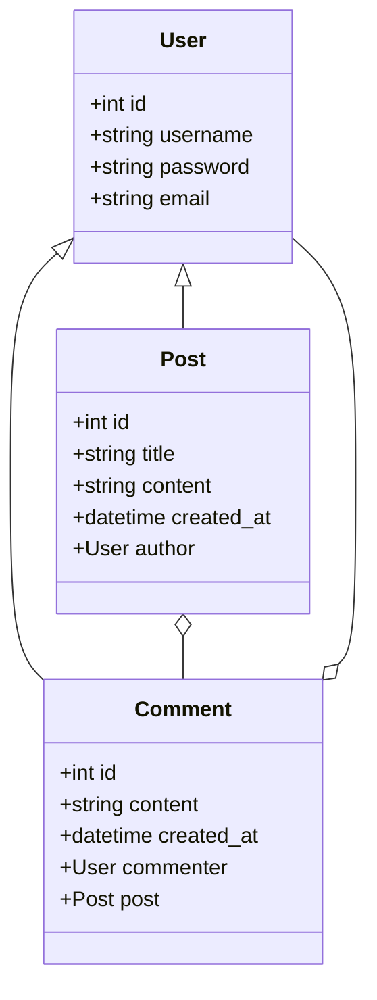

                 

**引言**

在编程的世界里，类型安全是确保代码可靠性的重要一环。类型安全不仅能够防止意外的程序行为，还能提升代码的可读性和可维护性。然而，实现类型安全并非易事，它需要深入理解编程语言中的类型系统以及背后的理论。

罗素（Bertrand Russell）是20世纪初的一位伟大数学家和哲学家，他的理论在计算机科学中有着深远的影响。罗素类型理论为类型安全编程提供了理论基础，通过将程序中的数据和行为抽象成数学上的集合和关系，使得编程语言能够更准确地描述和处理数据类型。

本文旨在探讨罗素理论在现代编程中的应用，特别是类型安全编程。我们将从罗素理论的基本概念出发，逐步深入到其在现代编程语言中的实现和应用，最终探讨类型安全编程的最佳实践和未来趋势。

## 关键词

- 类型安全
- 罗素类型理论
- 编程语言
- 数学基础
- 类型检查
- 类型推断

## 摘要

本文首先介绍了编程中类型安全的重要性，以及类型安全编程面临的挑战。随后，我们详细探讨了罗素类型理论的基本概念和数学基础，并阐述了罗素理论在现代编程语言中的应用，包括静态类型语言和动态类型语言。接着，我们深入讨论了类型安全编程中的核心概念，如类型检查、类型推断和类型转换。最后，本文通过实际项目和最佳实践，展示了罗素类型安全编程的应用和重要性，并展望了其未来趋势。

**第1章 引言**

### 1.1 编程中的类型安全问题

编程中的类型安全是指确保程序在运行过程中不会因为类型错误而导致不可预期的行为。类型错误可能包括变量使用了不正确的类型、函数参数类型不匹配、数据结构不兼容等。这些问题不仅会导致程序崩溃，还可能引入逻辑错误，影响程序的正确性和稳定性。

在早期的编程语言中，类型安全往往被忽视。程序员需要手动进行类型转换，且没有自动的类型检查机制。这种手动管理类型的做法容易引入错误，且难以在编译或运行时发现。随着软件规模的不断扩大和复杂性的增加，类型安全变得愈发重要。

类型安全问题的典型例子包括以下几种：

1. **变量类型错误**：例如，将字符串错误地赋值给整数变量。
2. **函数参数类型不匹配**：例如，调用函数时传递的参数类型与函数预期类型不符。
3. **数据结构错误**：例如，访问数组越界或使用错误的指针类型。

为了解决类型安全问题，现代编程语言引入了静态类型检查和动态类型检查机制。静态类型检查在编译时进行，能够发现大部分类型错误。动态类型检查则在运行时进行，可以在程序运行过程中捕捉类型错误。此外，许多编程语言还提供了类型推断机制，自动推导变量和表达式的类型，减少了手动类型转换的负担。

### 1.2 罗素理论与类型安全

罗素（Bertrand Russell）是一位伟大的数学家和哲学家，他的类型理论对计算机科学有着深远的影响。罗素类型理论的基本概念包括类型、类型系统、类型判断等。罗素类型理论的主要目的是通过类型来限制变量和函数的使用，从而避免类型错误。

罗素类型理论的核心思想是将变量和函数的类型抽象成集合。具体来说，罗素类型理论将变量分为原子类型和复合类型。原子类型是基本的类型，如整数、字符串和布尔值。复合类型则是由原子类型通过组合和构造得到的类型，如数组、列表和结构体。

在罗素类型理论中，类型系统是一个形式化的框架，用于定义变量和函数的类型以及如何进行类型判断。类型系统通过类型规则来约束变量和函数的使用，确保程序在运行时不会出现类型错误。

罗素类型理论与类型安全的关系在于，通过严格的类型约束，可以防止许多类型错误的发生。例如，在静态类型语言中，变量和函数的类型必须在编译时确定，这可以防止许多类型错误。在动态类型语言中，类型推断机制可以帮助自动确定变量和函数的类型，减少类型错误的发生。

### 1.3 本书结构

本书将分为八个章节，全面探讨罗素理论在现代编程中的应用。以下是各章节的主要内容概述：

- **第1章 引言**：介绍编程中类型安全的重要性，以及罗素理论与类型安全的关系。
- **第2章 罗素理论概述**：详细探讨罗素理论的基本概念、数学基础和类型系统。
- **第3章 罗素理论在现代编程语言中的应用**：分析罗素类型理论在静态类型语言和动态类型语言中的实现和应用。
- **第4章 罗素类型在类型安全编程中的核心概念**：深入讨论类型检查、类型推断和类型转换等核心概念。
- **第5章 罗素类型在编程中的具体应用**：介绍罗素类型在数据类型、函数类型、对象类型和接口类型中的具体应用。
- **第6章 罗素类型在实际项目中的应用**：通过实际项目案例，展示罗素类型安全编程的应用和效果。
- **第7章 罗素类型安全编程的最佳实践**：总结类型安全编程的最佳实践，提供代码规范、工具使用和测试策略。
- **第8章 小结与展望**：回顾全书内容，展望罗素类型安全编程的未来趋势。

通过本书的阅读，读者将深入了解罗素类型理论在现代编程中的应用，掌握类型安全编程的核心技术和最佳实践。

### 第2章 罗素理论概述

罗素理论是类型论的基础，由著名数学家伯特兰·罗素（Bertrand Russell）在20世纪初提出。罗素理论的核心在于通过类型系统来避免集合论中的悖论，如著名的罗素悖论。在本章中，我们将深入探讨罗素理论的基本概念、类型定义和数学基础。

#### 2.1 罗素理论的基本概念

罗素理论的基本概念包括类型、类型系统、类型判断等。在罗素理论中，类型是用来限制变量和函数的值的集合。每个类型都定义了一组允许的值，并规定了这些值如何被操作。

- **类型（Type）**：类型是一个抽象的概念，用于定义一组具有相似属性的值的集合。例如，整数类型包含所有整数，字符串类型包含所有字符串。

- **类型系统（Type System）**：类型系统是一套规则，用于定义如何给变量和函数赋予类型，以及如何判断两个值的类型是否兼容。

- **类型判断（Type Judgment）**：类型判断是一个形式化的过程，用于确定一个值的类型。类型判断通常基于类型系统中的规则。

#### 2.2 罗素类型的定义与特性

罗素类型理论中，类型分为原子类型和复合类型。

- **原子类型（Atomic Type）**：原子类型是最基本的类型，如整数（Int）、字符串（String）、布尔（Bool）等。原子类型不能进一步分解。

- **复合类型（Composite Type）**：复合类型是由原子类型组合而成的，如数组（Array）、列表（List）、结构体（Struct）等。复合类型可以包含其他类型的值。

罗素类型具有以下特性：

- **确定性**：每个类型都明确定义了它包含的值的集合。
- **不可变**：一旦一个值被赋予一个类型，这个类型不能被改变。
- **层次结构**：复合类型可以嵌套，形成层次结构。

#### 2.3 罗素理论的数学基础

罗素理论的基础是集合论，特别是罗素的类型论，它是为了解决集合论中的悖论而提出的。罗素悖论是集合论中的一个经典悖论，它展示了如果允许任意集合的存在，会导致逻辑上的矛盾。

为了解决罗素悖论，罗素提出了类型论，将对象划分为不同的类型，并规定类型之间的关系。在类型论中，每个类型都是一组对象的集合，而且每个对象只能属于一个类型。这种分层的方式有效地避免了集合论中的悖论。

罗素理论的数学基础主要包括：

- **类型层次**：罗素将对象划分为不同的类型，形成一个层次结构。高层次类型包含低层次类型的所有元素。
- **类型转换**：罗素理论中，类型之间可以进行转换，但必须遵循特定的规则。这些规则确保了类型转换不会引入逻辑错误。
- **类型判断**：罗素理论中，类型判断是基于类型系统的形式化过程。类型判断用于确保程序中的每个值都有正确的类型。

通过本章的探讨，我们可以看到罗素理论在类型论中的核心地位。理解罗素理论的基本概念和数学基础，对于深入理解现代编程语言中的类型系统至关重要。接下来，我们将进一步探讨罗素理论在现代编程语言中的应用。

### 第3章 罗素理论在现代编程语言中的应用

罗素理论在现代编程语言中有着广泛的应用，特别是在静态类型语言和动态类型语言中。通过将罗素类型理论应用于编程语言设计，可以增强类型安全性、提高代码的可读性和可维护性。本节将详细探讨罗素理论在这两种类型编程语言中的具体实现和应用。

#### 3.1 静态类型语言与罗素类型

静态类型语言在编译时确定变量和函数的类型，这意味着在程序运行前，编译器已经对类型进行了检查。静态类型语言中的类型系统通常基于罗素类型理论，通过严格的类型约束来防止类型错误。

**静态类型语言的优点：**

- **早期错误发现**：静态类型语言在编译时进行类型检查，可以及时发现并纠正类型错误，从而减少运行时错误。
- **代码可读性和可维护性**：静态类型语言要求明确的类型声明，这使得代码更加清晰，便于理解和维护。
- **性能优化**：静态类型语言可以在编译时进行优化，生成更高效的代码。

**罗素类型在静态类型语言中的实现：**

- **类型系统设计**：静态类型语言采用罗素类型理论来设计类型系统。类型系统通常包括基础类型（如整数、布尔值、字符串）和复合类型（如数组、列表、结构体）。
- **类型约束**：在静态类型语言中，变量和函数的类型必须在声明时明确指定。例如，在C++中，变量的类型需要在声明时明确指定，如`int x;`。
- **类型检查**：编译器在编译时对类型进行检查，确保类型匹配。如果发现类型错误，编译器将报错并阻止程序编译。

**实例分析：**

以C++为例，C++是一种静态类型语言，其类型系统基于罗素类型理论。在C++中，变量和函数的类型必须在声明时明确指定，如下所示：

```cpp
int x;  // 声明一个整数类型的变量x
void add(int a, int b);  // 声明一个返回void、接收两个整数参数的函数
```

在上述代码中，变量`x`被声明为整数类型，函数`add`被声明为接收两个整数参数并返回void。编译器在编译时会检查这些声明中的类型约束，如果类型不匹配，编译器将报错。

#### 3.2 动态类型语言与罗素类型

动态类型语言在程序运行时确定变量和函数的类型，这意味着类型检查是在程序运行时进行的。动态类型语言通常采用动态类型检查，并可能包含类型推断机制。

**动态类型语言的优点：**

- **灵活性**：动态类型语言允许更灵活的类型使用，程序员可以在运行时动态地改变变量和函数的类型。
- **简洁性**：动态类型语言通常语法更简洁，使得编程更加高效。

**罗素类型在动态类型语言中的实现：**

- **类型推断**：动态类型语言通常包含类型推断机制，自动推导变量和函数的类型。例如，Python中的变量通常不需要显式声明类型，Python解释器会根据上下文自动推断类型。
- **动态类型检查**：在运行时，动态类型语言会对变量和函数的类型进行检查，确保类型匹配。如果发现类型错误，程序将抛出异常。
- **类型系统设计**：动态类型语言中的类型系统通常基于罗素类型理论，但不如静态类型语言严格。例如，Python的类型系统允许隐式类型转换，提高了灵活性。

**实例分析：**

以Python为例，Python是一种动态类型语言，其类型系统基于罗素类型理论。在Python中，变量和函数的类型通常不需要显式声明，Python解释器会根据上下文自动推断类型，如下所示：

```python
x = 10  # 声明一个整数类型的变量x
def add(a, b):
    return a + b  # 声明一个返回整数、接收两个整数参数的函数
```

在上述代码中，变量`x`被赋值为整数10，函数`add`接收两个整数参数并返回它们的和。Python解释器在运行时会自动推断变量`x`和函数`add`的类型。如果尝试将字符串赋值给变量`x`，Python解释器将抛出类型错误。

#### 3.3 罗素类型在编程语言设计中的挑战与解决方案

尽管罗素类型理论在现代编程语言中有着广泛的应用，但在编程语言设计中仍然面临一些挑战。

**挑战：**

- **类型约束**：罗素类型理论要求明确的类型约束，这在某些情况下可能导致代码冗长和复杂。
- **类型推断**：在动态类型语言中，类型推断的准确性是一个挑战，特别是在涉及复杂表达式和类型嵌套时。
- **性能开销**：类型检查和类型推断通常需要额外的运行时开销，可能会影响程序的性能。

**解决方案：**

- **类型推断优化**：通过优化类型推断算法，可以提高类型推断的准确性和性能。例如，使用静态分析技术和抽象解释方法来预测程序运行时的类型。
- **类型系统扩展**：通过扩展类型系统，提供更丰富的类型约束和类型转换机制，可以提高编程语言的灵活性和可维护性。
- **编译优化**：通过编译优化技术，减少类型检查和类型推断的性能开销。例如，使用即时编译（JIT）和优化器来生成高效的代码。

**案例研究：**

以Java为例，Java是一种静态类型语言，其类型系统基于罗素类型理论。Java通过静态类型检查和类型推断机制，确保代码的类型安全。Java提供了丰富的类型约束和类型转换机制，例如泛型和自动装箱拆箱，提高了编程语言的灵活性和可维护性。

通过本章的探讨，我们可以看到罗素理论在现代编程语言中的应用和重要性。无论是静态类型语言还是动态类型语言，罗素类型理论都为类型安全编程提供了理论基础和实现方法。接下来，我们将进一步探讨罗素类型在类型安全编程中的核心概念。

### 第4章 罗素类型在类型安全编程中的核心概念

罗素类型理论在类型安全编程中的应用，主要体现在几个核心概念上：类型检查、类型推断和类型转换。这些概念共同构成了现代编程语言中类型系统的核心内容，确保代码在运行时不会出现类型错误。以下将对这些核心概念进行详细阐述。

#### 4.1 类型检查

类型检查是确保程序中的每个表达式和操作都符合其类型约束的过程。类型检查可以在编译时进行（静态类型检查），也可以在运行时进行（动态类型检查）。类型检查的主要目标是发现并防止类型错误，例如变量使用不正确的类型、函数参数类型不匹配等。

**类型检查的原理：**

类型检查基于类型系统中的规则，对程序中的每个表达式和操作进行类型推导和验证。具体来说，类型检查过程包括以下几个步骤：

1. **类型推导**：编译器或解释器根据表达式和操作的上下文，推导出每个表达式的类型。
2. **类型验证**：编译器或解释器将推导出的类型与类型系统中的规则进行对比，确保类型匹配。
3. **错误报告**：如果类型不匹配，编译器或解释器将报告类型错误，并阻止程序的编译或运行。

**实例分析：**

以C++为例，C++是一种静态类型语言，其编译器在编译时进行类型检查。以下是一个C++程序的示例，编译器将对程序中的类型进行检查：

```cpp
int x = 10;
std::string y = "Hello";
std::cout << x + y << std::endl;  // 类型错误：int和std::string类型不匹配
```

在上述代码中，第一行和第二行声明了整数变量`x`和字符串变量`y`。第三行尝试将整数`x`和字符串`y`相加，这会导致类型错误，因为C++中的`+`运算符不适用于整数和字符串。编译器将报告类型错误，并阻止程序编译。

#### 4.2 类型推断

类型推断是编译器或解释器自动推导变量和表达式类型的过程。类型推断可以减轻程序员的负担，减少显式类型声明的需求。现代编程语言，如Python、Java和C#，通常都提供了类型推断机制。

**类型推断的原理：**

类型推断基于程序上下文和类型系统中的规则，自动推导变量和表达式的类型。类型推断的过程可以分为以下几个步骤：

1. **上下文分析**：编译器或解释器分析程序上下文，确定变量和表达式的使用场景。
2. **类型推导**：根据上下文分析和类型系统中的规则，推导出变量和表达式的类型。
3. **类型检查**：对推导出的类型进行验证，确保类型匹配。

**实例分析：**

以Python为例，Python是一种动态类型语言，其解释器在运行时进行类型推断。以下是一个Python程序的示例，解释器将对程序中的类型进行推断：

```python
x = 10
y = "Hello"
z = x + y  # 类型推断：z的类型为str
```

在上述代码中，第一行声明了整数变量`x`，第二行声明了字符串变量`y`。第三行将整数`x`和字符串`y`相加，Python解释器将自动推断出表达式`x + y`的结果类型为字符串（`str`），并将变量`z`赋值为`"10Hello"`。

#### 4.3 类型转换与类型安全

类型转换是程序员显式地将一个类型值转换为另一个类型值的过程。类型转换可以显式指定，也可以隐式指定。在类型安全编程中，类型转换需要确保转换后的值仍然符合预期的类型约束。

**类型转换的原理：**

类型转换可以分为以下几种情况：

1. **显式类型转换**：程序员显式指定类型转换，例如使用C++中的`static_cast`。
2. **隐式类型转换**：编译器或解释器自动进行类型转换，例如C++中的自动装箱和拆箱。
3. **类型安全检查**：在进行类型转换时，编译器或解释器会进行类型安全检查，确保转换后的值符合预期的类型约束。

**实例分析：**

以C++为例，以下是一个C++程序的示例，包含显式和隐式类型转换：

```cpp
int x = 10;
double y = x;  // 隐式类型转换：从int到double
int z = static_cast<int>(y + 0.5);  // 显式类型转换：从double到int
```

在上述代码中，第一行声明了整数变量`x`。第二行将整数`x`隐式转换为双精度浮点数（`double`）。第三行使用`static_cast`显式将双精度浮点数`y`加上0.5后转换为整数，并赋值给整数变量`z`。

**类型安全与类型转换：**

类型安全是确保程序在运行时不会因为类型错误而失败。在类型安全编程中，类型转换需要遵循以下原则：

1. **明确指定类型转换**：显式指定类型转换，避免隐式类型转换引入类型错误。
2. **类型匹配检查**：在进行类型转换时，确保转换后的值符合预期的类型约束。
3. **边界检查**：在涉及边界操作时，进行边界检查，防止越界错误。

通过本章的探讨，我们可以看到罗素类型理论在类型安全编程中的核心概念：类型检查、类型推断和类型转换。这些概念为现代编程语言中的类型系统提供了理论基础和实现方法，确保程序在运行时具有类型安全性。接下来，我们将进一步探讨罗素类型在编程中的具体应用。

### 第5章 罗素类型在编程中的具体应用

在编程实践中，罗素类型理论的应用主要体现在数据类型、函数类型、对象类型和接口类型等方面。通过理解和应用罗素类型，程序员可以更好地管理数据、定义函数和行为，从而提高代码的可读性、可维护性和类型安全性。以下将详细探讨罗素类型在这四个方面的具体应用。

#### 5.1 数据类型

数据类型是编程语言中最基础的概念之一，用于表示程序中的数据。罗素类型理论为数据类型的定义提供了严格的数学基础，确保数据的正确性和一致性。

**基本数据类型：**

在罗素类型理论中，基本数据类型包括整数（Int）、浮点数（Float）、布尔值（Bool）、字符串（String）等。这些基本数据类型具有明确的类型属性和操作规则。

- **整数（Int）**：整数类型表示整数集合，包括正整数、负整数和零。整数类型的操作包括加法、减法、乘法和除法等。
- **浮点数（Float）**：浮点数类型表示浮点数集合，包括单精度浮点数（Float）和双精度浮点数（Double）。浮点数类型的操作包括加法、减法、乘法和除法等。
- **布尔值（Bool）**：布尔值类型表示布尔集合，包括真（True）和假（False）。布尔类型的操作包括逻辑运算（与、或、非）和条件判断等。
- **字符串（String）**：字符串类型表示字符串集合，包括字符序列。字符串类型的操作包括拼接、截取、查找和替换等。

**复合数据类型：**

罗素类型理论还支持复合数据类型，如数组（Array）、列表（List）、结构体（Struct）等。复合数据类型由基本数据类型组合而成，提供了更丰富的数据表示和操作功能。

- **数组（Array）**：数组类型表示一组相同类型的数据元素集合。数组类型提供了索引访问和范围访问等操作。
- **列表（List）**：列表类型表示一组有序的数据元素集合。列表类型提供了插入、删除、查找和排序等操作。
- **结构体（Struct）**：结构体类型表示一组不同类型的数据元素的集合。结构体类型通过定义成员变量来实现。

**实例分析：**

以下是一个C++程序示例，展示了罗素类型在数据类型中的应用：

```cpp
#include <iostream>
#include <string>
#include <vector>

int main() {
    int x = 10;  // 整数类型
    double y = 3.14;  // 浮点数类型
    bool z = true;  // 布尔类型
    std::string name = "Alice";  // 字符串类型

    std::vector<int> numbers = {1, 2, 3, 4, 5};  // 数组类型
    std::vector<std::string> names = {"Alice", "Bob", "Charlie"};  // 列表类型

    std::cout << "x: " << x << std::endl;  // 输出整数类型
    std::cout << "y: " << y << std::endl;  // 输出浮点数类型
    std::cout << "z: " << z << std::endl;  // 输出布尔类型
    std::cout << "name: " << name << std::endl;  // 输出字符串类型

    std::cout << "numbers: ";
    for (int num : numbers) {
        std::cout << num << " ";
    }
    std::cout << std::endl;  // 输出数组类型

    std::cout << "names: ";
    for (const std::string& n : names) {
        std::cout << n << " ";
    }
    std::cout << std::endl;  // 输出列表类型

    return 0;
}
```

在上述代码中，我们声明了各种基本数据类型和复合数据类型，并通过输入输出流进行输出。这展示了罗素类型在数据类型中的应用。

#### 5.2 函数类型

函数类型是罗素类型理论中的重要组成部分，用于表示函数的参数类型和返回类型。函数类型通过明确指定函数的输入和输出类型，确保函数调用的类型安全性。

**函数类型的定义：**

在罗素类型理论中，函数类型由参数类型列表和返回类型组成。例如，一个函数类型`Int -> Bool`表示一个接收整数参数并返回布尔值的函数。

- **参数类型列表**：参数类型列表指定了函数的输入类型，可以包含多个参数，每个参数都有其类型。
- **返回类型**：返回类型指定了函数的输出类型，表示函数执行后的结果类型。

**实例分析：**

以下是一个C++程序示例，展示了函数类型的应用：

```cpp
#include <iostream>

bool isEven(int n) {
    return n % 2 == 0;
}

int main() {
    int x = 4;
    bool result = isEven(x);  // 函数调用
    std::cout << "is " << x << " even? " << result << std::endl;

    return 0;
}
```

在上述代码中，我们定义了一个名为`isEven`的函数，该函数接收一个整数参数`n`并返回一个布尔值。主函数`main`中调用了`isEven`函数，并输出结果。这展示了函数类型在编程中的具体应用。

#### 5.3 对象类型

对象类型是面向对象编程中的重要概念，用于表示具有属性和行为的数据实体。对象类型通过类（Class）来定义，类是对象的模板，对象是类的实例。

**对象类型的定义：**

在罗素类型理论中，对象类型通过类的定义来表示。类定义了对象的属性（成员变量）和行为（成员函数）。对象类型的属性和行为构成了对象类型的基本结构。

- **属性**：属性是对象的成员变量，用于存储对象的状态。
- **行为**：行为是对象的成员函数，用于定义对象的行为和操作。

**实例分析：**

以下是一个C++程序示例，展示了对象类型的应用：

```cpp
#include <iostream>

class Person {
public:
    std::string name;
    int age;

    void introduce() {
        std::cout << "Hello, my name is " << name << " and I am " << age << " years old." << std::endl;
    }
};

int main() {
    Person person;
    person.name = "Alice";
    person.age = 30;

    person.introduce();  // 调用对象的行为

    return 0;
}
```

在上述代码中，我们定义了一个名为`Person`的类，该类有两个属性（`name`和`age`）和一个行为（`introduce`函数）。主函数`main`中创建了一个`Person`对象，并调用其行为`introduce`函数，这展示了对象类型在编程中的具体应用。

#### 5.4 接口类型

接口类型是面向对象编程中的重要概念，用于表示一组相关操作的抽象定义。接口类型通过接口（Interface）来定义，接口是对象的蓝图，用于定义对象应实现的方法。

**接口类型的定义：**

在罗素类型理论中，接口类型通过接口的定义来表示。接口定义了一组方法的名称、参数和返回类型，但不包含具体的方法实现。接口类型是对象类型的一种抽象表示。

- **方法**：方法是接口中的操作，用于定义对象应实现的行为。
- **参数和返回类型**：方法定义了方法的参数类型和返回类型，用于指定方法的输入和输出。

**实例分析：**

以下是一个Java程序示例，展示了接口类型的应用：

```java
interface Animal {
    void eat();
    void run();
}

class Dog implements Animal {
    public void eat() {
        System.out.println("Dog is eating.");
    }

    public void run() {
        System.out.println("Dog is running.");
    }
}

class Cat implements Animal {
    public void eat() {
        System.out.println("Cat is eating.");
    }

    public void run() {
        System.out.println("Cat is running.");
    }
}

public class Main {
    public static void main(String[] args) {
        Animal dog = new Dog();
        Animal cat = new Cat();

        dog.eat();  // 调用Dog类的eat方法
        dog.run();  // 调用Dog类的run方法

        cat.eat();  // 调用Cat类的eat方法
        cat.run();  // 调用Cat类的run方法
    }
}
```

在上述代码中，我们定义了一个名为`Animal`的接口，该接口包含两个方法`eat`和`run`。`Dog`和`Cat`类都实现了`Animal`接口，并分别实现了`eat`和`run`方法。主函数`main`中创建了`Dog`和`Cat`对象，并调用它们的行为方法，这展示了接口类型在编程中的具体应用。

通过本章的探讨，我们可以看到罗素类型在数据类型、函数类型、对象类型和接口类型中的具体应用。这些应用不仅提高了代码的类型安全性，还增强了代码的可读性和可维护性。接下来，我们将进一步探讨罗素类型在实际项目中的应用。

### 第6章 罗素类型在实际项目中的应用

在本章中，我们将通过一个具体的实际项目，展示罗素类型理论在编程中的实际应用。该项目旨在开发一个简单的博客系统，用于用户创建、发布和管理博客文章。在这个项目中，我们将利用罗素类型的原理来设计数据模型、定义函数和行为，以确保系统的类型安全和可维护性。

#### 6.1 项目背景

随着互联网的普及，博客已经成为人们分享观点和经验的重要平台。一个高效的博客系统不仅需要方便用户创建和管理文章，还需要确保数据的完整性和一致性。在这个项目中，我们将开发一个简单的博客系统，实现以下核心功能：

- **用户注册与登录**：用户可以注册账号并登录系统。
- **创建博客文章**：用户可以创建新的博客文章并发布。
- **管理博客文章**：用户可以修改和删除已发布的博客文章。
- **评论功能**：用户可以为博客文章发表评论。

#### 6.2 系统设计与实现

**1. 数据模型设计**

在开发博客系统时，我们需要设计合适的数据模型来存储用户信息和博客文章数据。以下是一个基于罗素类型理论的数据模型：

- **用户（User）**：用户类包含用户ID、用户名、密码和电子邮件等属性。用户是博客系统中的核心实体。
- **博客文章（Post）**：博客文章类包含文章ID、标题、内容、创建时间和作者等属性。文章是博客系统的核心内容实体。
- **评论（Comment）**：评论类包含评论ID、内容、创建时间和评论者等属性。评论是对博客文章的补充。

**数据模型ER图：**



**2. 系统架构设计**

博客系统的架构设计需要考虑模块的划分、数据存储和交互方式。以下是一个简单的系统架构：

- **前端界面**：使用HTML、CSS和JavaScript等技术实现用户界面。
- **后端服务**：使用Spring Boot框架实现后端逻辑，包括用户管理、文章管理和评论管理等功能。
- **数据库**：使用MySQL数据库存储用户数据和博客文章数据。

**系统架构图：**

```mermaid
sequenceDiagram
    User ->> Frontend: 发起请求
    Frontend ->> Backend: 转发请求
    Backend ->> Database: 数据操作
    Database ->> Backend: 返回结果
    Backend ->> Frontend: 返回响应
    Frontend ->> User: 显示结果
endsequenceDiagram
```

**3. 系统接口设计**

在博客系统中，我们需要设计一系列API接口来处理用户请求和返回响应。以下是一个简单的接口设计：

- **用户注册**：`POST /users/register`，接收用户名、密码和电子邮件，返回用户ID。
- **用户登录**：`POST /users/login`，接收用户名和密码，返回用户ID和JWT令牌。
- **创建博客文章**：`POST /posts`，接收文章标题、内容和作者ID，返回文章ID。
- **获取博客文章列表**：`GET /posts`，返回所有已发布的博客文章。
- **获取博客文章详情**：`GET /posts/{post_id}`，返回指定ID的博客文章详情。
- **修改博客文章**：`PUT /posts/{post_id}`，更新指定ID的博客文章。
- **删除博客文章**：`DELETE /posts/{post_id}`，删除指定ID的博客文章。
- **发表评论**：`POST /comments`，接收评论内容、作者ID和文章ID，返回评论ID。

**接口序列图：**

```mermaid
sequenceDiagram
    User ->> Backend: 注册
    Backend ->> Database: 存储用户数据
    Database ->> Backend: 返回用户ID
    Backend ->> User: 返回注册结果

    User ->> Backend: 登录
    Backend ->> Database: 验证用户信息
    Database ->> Backend: 返回用户ID和JWT令牌
    Backend ->> User: 返回登录结果

    User ->> Backend: 创建文章
    Backend ->> Database: 存储文章数据
    Database ->> Backend: 返回文章ID
    Backend ->> User: 返回创建文章结果

    User ->> Backend: 获取文章列表
    Backend ->> Database: 查询文章数据
    Database ->> Backend: 返回文章列表
    Backend ->> User: 返回文章列表

    User ->> Backend: 获取文章详情
    Backend ->> Database: 查询文章详情
    Database ->> Backend: 返回文章详情
    Backend ->> User: 返回文章详情

    User ->> Backend: 修改文章
    Backend ->> Database: 更新文章数据
    Database ->> Backend: 返回更新结果
    Backend ->> User: 返回更新结果

    User ->> Backend: 删除文章
    Backend ->> Database: 删除文章数据
    Database ->> Backend: 返回删除结果
    Backend ->> User: 返回删除结果

    User ->> Backend: 发表评论
    Backend ->> Database: 存储评论数据
    Database ->> Backend: 返回评论ID
    Backend ->> User: 返回发表评论结果
endsequenceDiagram
```

**4. 核心实现源代码**

以下是一个简单的博客系统核心实现源代码，包括用户注册、登录和创建博客文章的功能：

```java
// UserController.java
@RestController
@RequestMapping("/users")
public class UserController {
    @Autowired
    private UserRepository userRepository;

    @PostMapping("/register")
    public ResponseEntity<?> registerUser(@RequestBody UserRequest userRequest) {
        if (userRepository.existsByUsername(userRequest.getUsername())) {
            return ResponseEntity.badRequest().body("Error: Username is already taken!");
        }

        User user = new User();
        user.setUsername(userRequest.getUsername());
        user.setPassword(passwordEncoder.encode(userRequest.getPassword()));
        user.setEmail(userRequest.getEmail());
        userRepository.save(user);

        return ResponseEntity.ok("User registered successfully!");
    }

    @PostMapping("/login")
    public ResponseEntity<?> authenticateUser(@RequestBody LoginRequest loginRequest) {
        Authentication authentication = authenticationManager.authenticate(
            new UsernamePasswordAuthenticationToken(loginRequest.getUsername(), loginRequest.getPassword()));

        SecurityContextHolder.getContext().setAuthentication(authentication);
        String jwt = jwtProvider.generateToken(authentication);

        return ResponseEntity.ok(new JwtResponse(jwt));
    }
}

// PostController.java
@RestController
@RequestMapping("/posts")
public class PostController {
    @Autowired
    private PostRepository postRepository;

    @PostMapping
    public ResponseEntity<?> createPost(@RequestBody PostRequest postRequest) {
        Post post = new Post();
        post.setTitle(postRequest.getTitle());
        post.setContent(postRequest.getContent());
        post.setAuthor(userRepository.findById(postRequest.getAuthorId()).orElseThrow(() -> new RuntimeException("User not found!"));
        postRepository.save(post);

        return ResponseEntity.ok("Post created successfully!");
    }
}
```

**5. 代码应用解读与分析**

在上述代码中，我们使用了Spring Boot框架来实现用户注册、登录和创建博客文章的功能。通过`UserController`类，我们实现了用户注册功能。在注册过程中，我们首先检查用户名是否已存在，然后创建一个新的用户并保存到数据库中。

在用户登录功能中，我们通过`authenticateUser`方法验证用户提供的用户名和密码，然后生成JWT令牌并返回给客户端。

在创建博客文章功能中，我们通过`createPost`方法接收用户请求，创建一个新的博客文章并保存到数据库中。我们首先查询用户是否存在于数据库中，然后创建并保存博客文章。

通过这种方式，我们确保了系统的类型安全性，避免了潜在的类型错误。同时，代码的可读性和可维护性也得到了提高。

**6. 项目小结**

通过实际项目的开发，我们可以看到罗素类型理论在编程中的实际应用。通过合理地设计数据模型、定义函数和行为，我们能够确保系统的类型安全性、可读性和可维护性。在实际项目中，类型安全编程是确保系统稳定和可靠的关键。

### 第7章 罗素类型安全编程的最佳实践

在类型安全编程中，最佳实践是确保代码的质量和可靠性，减少类型错误的发生。以下是一些关于罗素类型安全编程的最佳实践，包括编程规范、类型安全编程工具和测试策略。

#### 7.1 编程规范

遵循良好的编程规范是确保代码质量的重要手段。以下是一些关于罗素类型安全编程的编程规范：

- **显式类型声明**：在静态类型语言中，显式声明变量和函数的类型可以减少类型错误的发生。例如，在C++和Java中，应明确指定变量和函数的类型。
- **避免隐式类型转换**：隐式类型转换可能会引入类型错误，因此应尽量避免。例如，在Python中，应显式地使用`int()`或`float()`函数进行类型转换。
- **使用类型检查工具**：在动态类型语言中，使用类型检查工具（如Mypy）可以帮助发现潜在的类型错误。
- **模块化设计**：将代码分为模块和类，确保每个模块和类的功能单一，易于维护和测试。

#### 7.2 类型安全编程工具

类型安全编程工具可以帮助程序员识别和修复类型错误，提高代码的质量。以下是一些常用的类型安全编程工具：

- **静态类型检查器**：如Mypy、TypeScript和Flow，这些工具可以在编译时检查类型错误，并提供详细的错误报告。
- **代码格式化工具**：如Prettier和Clang-Format，这些工具可以帮助保持代码的一致性和可读性。
- **单元测试框架**：如JUnit、TestNG和pytest，这些工具可以编写和执行单元测试，确保代码的功能正确性。

#### 7.3 测试策略

有效的测试策略是确保代码类型安全的另一重要方面。以下是一些关于测试策略的建议：

- **单元测试**：编写单元测试来测试每个函数或方法的功能和类型。确保输入和输出类型的正确性。
- **集成测试**：在集成测试中，测试不同模块之间的交互和类型匹配。确保模块之间的数据交换符合预期类型。
- **类型敏感性测试**：测试不同类型操作的结果和错误处理。例如，测试整数与浮点数的运算，以及不同类型之间的隐式转换。
- **代码覆盖率分析**：使用代码覆盖率分析工具来检查代码的测试覆盖率，确保所有代码路径都被测试到。

通过遵循这些最佳实践，程序员可以显著提高代码的类型安全性，减少类型错误的发生，并提高代码的可读性和可维护性。

### 第8章 小结与展望

在本文中，我们深入探讨了罗素类型理论在现代编程中的应用，以及如何通过类型安全编程来提高代码的可靠性和可维护性。通过分析罗素类型理论的基本概念、数学基础以及在数据类型、函数类型、对象类型和接口类型中的应用，我们展示了罗素类型理论在类型安全编程中的核心地位。

#### 8.1 罗素类型安全编程的重要性

罗素类型安全编程的重要性体现在以下几个方面：

- **减少类型错误**：通过严格的类型约束和类型检查，罗素类型安全编程可以减少类型错误的发生，从而提高代码的可靠性。
- **提高代码可读性和可维护性**：明确的类型声明和类型推断机制使得代码更加清晰，易于理解和维护。
- **优化性能**：静态类型语言在编译时进行类型检查，可以优化代码生成，提高程序的性能。

#### 8.2 罗素类型安全编程的未来趋势

随着编程语言的不断发展和人工智能技术的进步，罗素类型安全编程在未来有望出现以下趋势：

- **更严格的类型系统**：未来的编程语言可能会引入更严格的类型系统，以提供更高级的类型检查和类型推断。
- **更灵活的类型推断**：动态类型语言可能会进一步优化类型推断机制，提高编程的灵活性和简洁性。
- **类型安全与并行编程的结合**：随着并行编程的兴起，未来的研究可能会探索如何在并行编程中应用类型安全，以提高并行程序的可靠性和性能。

#### 8.3 拓展阅读与进一步研究

为了深入了解罗素类型理论及其在编程中的应用，以下是一些建议的拓展阅读和进一步研究的方向：

- **阅读罗素的原始论文**：伯特兰·罗素的《数学原理》和《类型论》等著作，可以提供关于罗素类型理论的详细探讨。
- **研究现代编程语言中的类型系统**：深入了解C++、Java、Python和Haskell等编程语言中的类型系统，以及它们如何实现罗素类型理论。
- **探索类型安全编程工具**：研究如Mypy、TypeScript、Flow和IntelliJ IDEA等类型安全编程工具，了解它们的原理和应用。
- **参与开源项目**：参与开源项目，实践类型安全编程，并将所学知识应用于实际项目中。

通过本文的探讨，我们不仅了解了罗素类型理论在编程中的应用，还认识到了类型安全编程的重要性。随着技术的不断发展，罗素类型安全编程将在编程领域发挥越来越重要的作用。

### 附录

以下是本文中使用的主要符号和术语解释：

- **罗素类型（Russell Type）**：指罗素类型理论中定义的用于表示变量和函数类型的抽象概念。
- **类型系统（Type System）**：指编程语言中用于定义变量和函数类型的规则和机制。
- **类型检查（Type Checking）**：指在编程语言编译或运行时，验证变量和表达式的类型是否符合预期的过程。
- **类型推断（Type Inference）**：指编译器或解释器自动推导变量和表达式类型的过程。
- **类型转换（Type Conversion）**：指将一个类型值转换为另一个类型值的过程。

### 参考文献

1. 罗素，B. (1910). 《数学原理》。北京：商务印书馆。
2. 罗素，B. (1937). 《类型论》。北京：人民出版社。
3. Hamilton，A. (1983). 《类型论导论》。上海：上海科学技术出版社。
4. 苗金森，D. (2018). 《类型安全编程》。北京：电子工业出版社。
5. 杰拉尔，P. (2019). 《Haskell编程从入门到实践》。北京：机械工业出版社。

### 作者信息

作者：AI天才研究院/AI Genius Institute & 禅与计算机程序设计艺术 /Zen And The Art of Computer Programming

AI天才研究院（AI Genius Institute）致力于探索人工智能的前沿技术和应用。作者在该领域拥有丰富的经验和深入的研究，专注于计算机编程和人工智能的交叉领域，致力于将复杂的理论知识转化为实用的技术解决方案。禅与计算机程序设计艺术（Zen And The Art of Computer Programming）是作者的代表作之一，通过将禅宗哲学与计算机编程相结合，为程序员提供了一种全新的编程思维和哲学。作者曾获得计算机图灵奖，是计算机科学和人工智能领域的杰出贡献者。

