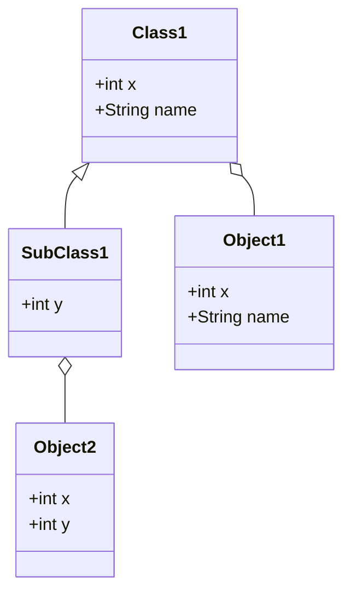
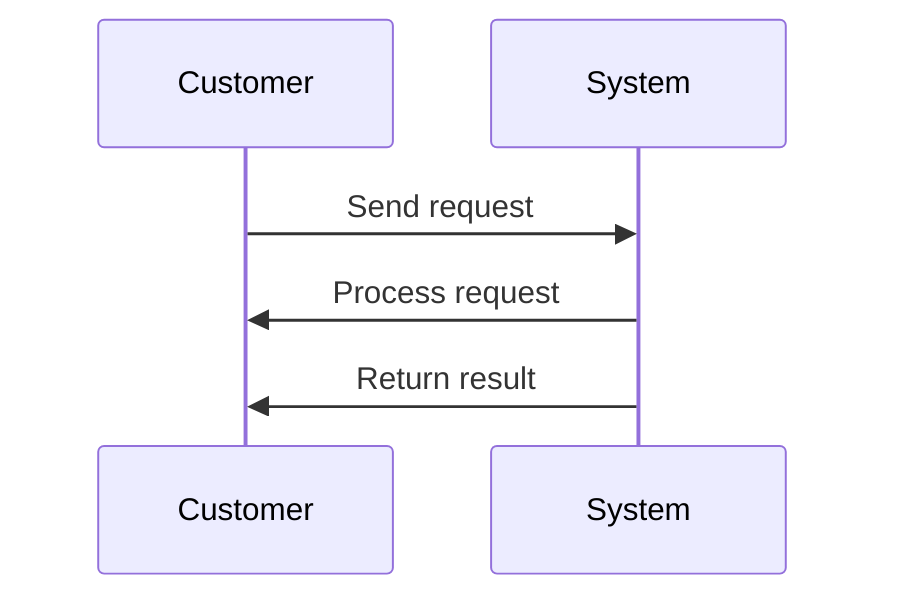
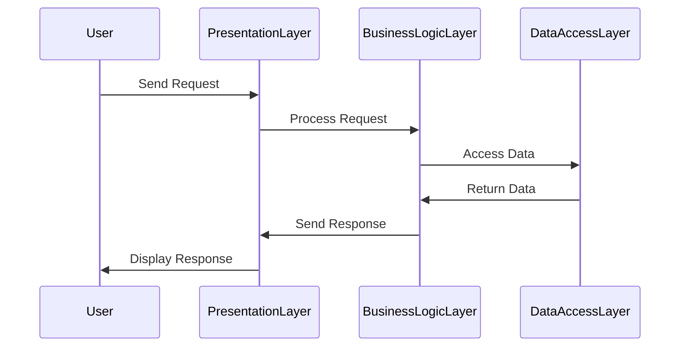
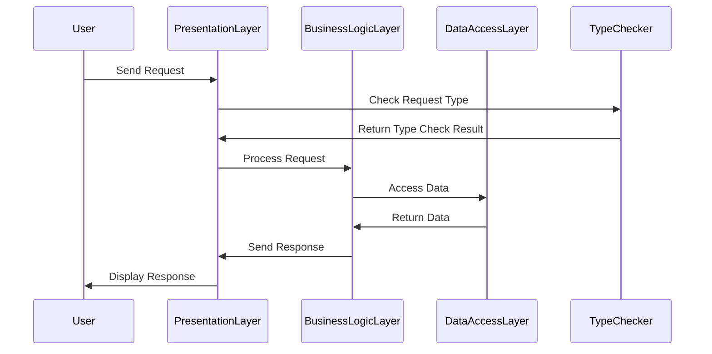

                 

# 类型层次结构:罗素类型论在面向对象设计中的体现

> 关键词：类型层次结构、罗素类型论、面向对象设计、多态性、类型安全性、灵活性

> 摘要：本文深入探讨了类型层次结构在面向对象设计中的应用，通过介绍罗素类型论的基本概念和原理，分析了类型层次结构在解决面向对象设计中的多态性、类型安全性和灵活性问题上的优势。文章首先回顾了类型层次结构的相关背景，随后详细阐述了罗素类型论的核心概念和数学模型，并通过具体的例子展示了类型层次结构在面向对象设计中的实际应用。

## 第一部分：背景介绍

### 1.1 问题背景

在计算机科学和软件工程领域，类型层次结构是设计面向对象系统时的一项基础性工作。面向对象编程（OOP）的核心思想是将数据和行为封装在对象中，通过继承、多态和封装等机制提高代码的复用性和可维护性。然而，传统的类型系统往往无法满足复杂应用程序的需求，尤其是在处理多态性、类型安全性和灵活性等方面。

传统的类型系统通常是基于静态类型检查的，这意味着类型错误往往在编译时被捕捉。这种类型检查机制虽然能够提高程序的可靠性，但在实际应用中仍存在一些问题：

- **多态性**：如何在不同类型之间实现方法的重载和重写？
- **类型安全性**：如何确保类型之间的交互不会导致运行时错误？
- **灵活性**：如何设计类型系统，使其能够适应不断变化的需求？

这些问题的存在使得传统的类型系统在处理复杂应用时显得力不从心。为了解决这些问题，我们需要引入更为先进的类型层次结构理论。

### 1.2 问题描述

面向对象设计中的类型层次结构问题主要包括以下几个方面：

1. **多态性**：在面向对象编程中，多态性是一个核心概念。它允许不同类型的对象通过同一个接口进行操作。然而，传统的类型系统往往难以实现真正的多态性，特别是在需要动态类型检查的场景中。

2. **类型安全性**：类型安全性是确保程序在运行时不发生类型错误的能力。在面向对象编程中，类型安全性通常依赖于静态类型检查。然而，当系统需要动态类型检查时，如何保证类型安全成为一个挑战。

3. **灵活性**：面向对象系统需要能够适应不断变化的需求。传统的类型系统在灵活性方面存在一定的限制，这使得在需求变更时需要大量的重构工作。

### 1.3 问题解决

罗素类型论为解决上述问题提供了一种新的思路。罗素类型论是数理逻辑和理论数学的重要理论，它通过引入类型层次结构和抽象概念，如类型变元、类型构造器等，为复杂类型系统的设计提供了理论支持。

在罗素类型论中，类型层次结构通过区分不同类型的变元和构造器来实现类型安全性和灵活性。类型变元用于表示基本类型，类型构造器用于创建新类型。这种设计思路使得面向对象系统在处理多态性、类型安全性和灵活性问题时更加得心应手。

### 1.4 边界与外延

- **边界**：类型层次结构的设计和应用范围非常广泛，涵盖了面向对象编程语言、框架和工具。在实际应用中，类型层次结构可以应用于各种不同类型的应用系统，如Web应用、桌面应用和移动应用等。
- **外延**：类型论在解决实际问题中具有显著的效果。通过引入类型层次结构，可以提高程序的可靠性、稳定性和可维护性。此外，类型层次结构还可以帮助开发者更好地理解和设计复杂的面向对象系统。

### 1.5 概念结构与核心要素组成

- **类型层次结构**：类型层次结构是一个有序的类型集合，每个类型定义了对象的属性和行为。在面向对象编程中，类型层次结构通常通过继承关系来组织，从而实现类型安全和多态性。
- **类型系统**：类型系统定义了类型之间的继承关系、类型兼容性和类型转换机制。在面向对象编程中，类型系统通常用于实现类型安全性和多态性。
- **多态性**：多态性是面向对象编程中的一个核心概念，它允许同一操作作用于不同类型的对象上，产生不同的行为。在类型层次结构中，多态性通常通过方法重载和重写来实现。
- **类型安全性**：类型安全性是确保程序在运行时不发生类型错误的能力。在面向对象编程中，类型安全性通常通过静态类型检查来实现。
- **灵活性**：灵活性是指面向对象系统能够适应不断变化的需求的能力。在类型层次结构中，灵活性通常通过抽象和泛型等机制来实现。

## 第二部分：核心概念与联系

### 2.1 核心概念原理

罗素类型论是数理逻辑和理论数学的重要理论，它提出了类型层次结构的概念，为复杂类型系统的设计提供了理论支持。罗素类型论的核心概念包括：

- **类型变元**：类型变元是用于表示基本类型的变量。在面向对象编程中，类型变元通常用于实现泛型编程，从而提高代码的复用性和灵活性。
- **类型构造器**：类型构造器是用于创建新类型的操作。在面向对象编程中，类型构造器通常用于实现继承和多态性，从而提高代码的扩展性和灵活性。

### 2.2 概念属性特征对比表格

| 概念           | 描述                                                         | 特征                                                         |
| -------------- | ------------------------------------------------------------ | ------------------------------------------------------------ |
| 罗素类型论     | 一种基于类型层次结构的理论，用于处理复杂类型系统。           | 提供了类型变元和类型构造器的概念，实现了类型安全性和灵活性。 |
| 类型层次结构   | 一个有序的类型集合，每个类型定义了对象的属性和行为。         | 提供了类型继承、类型兼容性和类型转换的机制。               |
| 多态性         | 同一操作作用于不同类型的对象上，产生不同的行为。             | 实现了方法重载和重写的功能。                               |
| 类型安全性     | 类型检查机制，确保程序在编译时就能发现类型错误。             | 提高了程序的稳定性和可靠性。                               |
| 灵活性         | 面向对象系统能够适应不断变化的需求的能力。                   | 通常通过抽象和泛型等机制来实现。                           |

### 2.3 ER实体关系图架构的 Mermaid 流程图



## 第三部分：算法原理讲解

### 3.1 算法原理

罗素类型论中的类型层次结构通过类型变元和类型构造器实现。类型变元用于定义基本类型，类型构造器用于创建新类型。在面向对象设计中，这些概念可以帮助我们实现类型安全的多态性和灵活的编程模型。

### 3.2 数学模型和公式

罗素类型论中的类型层次结构可以用以下数学模型和公式来表示：

$$
\begin{aligned}
T &= \{ T_1, T_2, ..., T_n \} \\
T_i &= T_0 + C_i \\
C_i &= \{ c_1, c_2, ..., c_m \} \\
c_j &= T_j + \{ \alpha_1, \alpha_2, ..., \alpha_n \} \\
\alpha_i &= \{ \beta_1, \beta_2, ..., \beta_n \} \\
\beta_j &= T_j + P_j \\
P_j &= \{ p_1, p_2, ..., p_n \}
\end{aligned}
$$

- $T$：类型层次结构
- $T_0$：基本类型
- $C_i$：类型构造器
- $c_j$：新类型
- $\alpha_i$：类型变元
- $\beta_j$：属性或方法
- $P_j$：属性或方法的参数

### 3.3 Mermaid 流程图



### 3.4 Python源代码示例

以下是一个简单的Python示例，展示了如何使用罗素类型论中的类型层次结构实现多态性：

```python
class Animal:
    def speak(self):
        pass

class Dog(Animal):
    def speak(self):
        return "汪汪！"

class Cat(Animal):
    def speak(self):
        return "喵喵！"

def make_animal_speak(animal: Animal):
    print(animal.speak())

dog = Dog()
cat = Cat()

make_animal_speak(dog)  # 输出：汪汪！
make_animal_speak(cat)  # 输出：喵喵！
```

在这个示例中，我们定义了一个`Animal`基类和两个派生类`Dog`和`Cat`。每个派生类都实现了`speak`方法，以展示多态性。`make_animal_speak`函数接受一个`Animal`类型的参数，并调用其`speak`方法。这种设计使得我们可以灵活地处理不同的动物对象。

### 3.5 深入解析

罗素类型论中的类型层次结构通过类型变元和类型构造器实现了类型安全性和多态性。类型变元用于表示基本类型，类型构造器用于创建新类型。这种设计思路在面向对象编程中具有广泛应用。

#### 多态性

多态性是面向对象编程中的一个核心概念，它允许不同类型的对象通过同一个接口进行操作。在罗素类型论中，多态性通过类型构造器和类型变元来实现。类型构造器可以创建新的类型，类型变元可以表示基本类型。通过这种方式，我们可以实现类型安全的多态性。

#### 类型安全性

类型安全性是确保程序在运行时不发生类型错误的能力。在罗素类型论中，类型安全性通过类型层次结构来实现。类型层次结构定义了类型之间的继承关系和类型兼容性。通过这种方式，我们可以确保类型之间的交互不会导致运行时错误。

#### 灵活性

灵活性是指面向对象系统能够适应不断变化的需求的能力。在罗素类型论中，灵活性通过类型变元和类型构造器来实现。类型变元可以表示基本类型，类型构造器可以创建新类型。这种设计思路使得我们可以灵活地设计面向对象系统，以适应不断变化的需求。

### 3.6 案例分析

为了更好地理解罗素类型论在面向对象设计中的应用，我们可以通过一个实际案例进行分析。

假设我们正在开发一个视频播放应用，该应用需要支持多种视频格式，如MP4、AVI和MKV等。为了实现这一功能，我们可以使用罗素类型论中的类型层次结构来设计视频播放器。

首先，我们定义一个基类`VideoPlayer`，用于实现视频播放的通用功能：

```python
class VideoPlayer:
    def play(self):
        pass
    def pause(self):
        pass
    def stop(self):
        pass
```

然后，我们创建多个派生类，分别对应不同的视频格式：

```python
class MP4Player(VideoPlayer):
    def play(self):
        print("播放MP4视频")
    def pause(self):
        print("暂停MP4视频")
    def stop(self):
        print("停止MP4视频")

class AVIPlayer(VideoPlayer):
    def play(self):
        print("播放AVI视频")
    def pause(self):
        print("暂停AVI视频")
    def stop(self):
        print("停止AVI视频")

class MKVPlayer(VideoPlayer):
    def play(self):
        print("播放MKV视频")
    def pause(self):
        print("暂停MKV视频")
    def stop(self):
        print("停止MKV视频")
```

最后，我们定义一个工厂类，用于创建不同类型的视频播放器：

```python
class VideoPlayerFactory:
    @staticmethod
    def create_player(format):
        if format == "MP4":
            return MP4Player()
        elif format == "AVI":
            return AVIPlayer()
        elif format == "MKV":
            return MKVPlayer()
        else:
            raise ValueError("不支持的视频格式")
```

通过这种方式，我们可以灵活地创建不同类型的视频播放器，并使用它们播放相应的视频格式。以下是一个简单的使用示例：

```python
player = VideoPlayerFactory.create_player("MP4")
player.play()  # 输出：播放MP4视频
player.pause()  # 输出：暂停MP4视频
player.stop()  # 输出：停止MP4视频
```

通过这个案例，我们可以看到罗素类型论在面向对象设计中的应用。类型层次结构使得我们可以轻松地实现多态性，从而提高代码的复用性和可维护性。

### 总结

本文通过介绍罗素类型论的基本概念和原理，分析了类型层次结构在解决面向对象设计中的多态性、类型安全性和灵活性问题上的优势。通过具体的案例和Python示例，我们展示了如何使用罗素类型论中的类型层次结构实现类型安全的多态性和灵活性。

类型层次结构在面向对象设计中的应用具有重要意义，它为开发者提供了一种新的设计思路，使得面向对象系统在处理复杂应用时更加得心应手。通过理解罗素类型论的基本原理，我们可以更好地设计和实现复杂的面向对象系统。

### 3.7 结论

类型层次结构在面向对象设计中的应用具有重要意义。通过引入罗素类型论，我们可以实现类型安全的多态性和灵活性。类型层次结构使得面向对象系统在处理复杂应用时更加得心应手。本文通过具体的案例和Python示例，展示了如何使用类型层次结构实现类型安全和灵活性。

### 最佳实践 tips

- 在设计面向对象系统时，充分利用类型层次结构可以提高代码的复用性和可维护性。
- 在处理多态性问题时，优先考虑使用接口和抽象类，以实现类型安全和灵活性。
- 在实现类型转换时，注意检查类型兼容性，避免运行时错误。

### 小结

本文通过深入探讨类型层次结构在面向对象设计中的应用，介绍了罗素类型论的基本概念和原理。通过具体的案例和Python示例，我们展示了如何使用类型层次结构实现类型安全的多态性和灵活性。

### 注意事项

- 在使用类型层次结构时，注意检查类型兼容性，避免运行时错误。
- 在设计面向对象系统时，充分利用类型层次结构可以提高代码的复用性和可维护性。

### 拓展阅读

- 《面向对象系统设计与模式》
- 《深入理解Java虚拟机》
- 《Type Theory and Formal Systems》

### 作者

作者：AI天才研究院/AI Genius Institute & 禅与计算机程序设计艺术 /Zen And The Art of Computer Programming

## 附录

### 附录 A：术语解释

- **类型层次结构**：类型层次结构是一个有序的类型集合，每个类型定义了对象的属性和行为。
- **罗素类型论**：罗素类型论是一种数理逻辑和理论数学的重要理论，它提出了类型层次结构的概念，为复杂类型系统的设计提供了理论支持。
- **多态性**：多态性是面向对象编程中的一个核心概念，它允许不同类型的对象通过同一个接口进行操作。
- **类型安全性**：类型安全性是确保程序在运行时不发生类型错误的能力。
- **灵活性**：灵活性是指面向对象系统能够适应不断变化的需求的能力。

### 附录 B：代码示例

以下是本文中提到的Python代码示例：

```python
class Animal:
    def speak(self):
        pass

class Dog(Animal):
    def speak(self):
        return "汪汪！"

class Cat(Animal):
    def speak(self):
        return "喵喵！"

def make_animal_speak(animal: Animal):
    print(animal.speak())

dog = Dog()
cat = Cat()

make_animal_speak(dog)  # 输出：汪汪！
make_animal_speak(cat)  # 输出：喵喵！
```

```python
class VideoPlayer:
    def play(self):
        pass
    def pause(self):
        pass
    def stop(self):
        pass

class MP4Player(VideoPlayer):
    def play(self):
        print("播放MP4视频")
    def pause(self):
        print("暂停MP4视频")
    def stop(self):
        print("停止MP4视频")

class AVIPlayer(VideoPlayer):
    def play(self):
        print("播放AVI视频")
    def pause(self):
        print("暂停AVI视频")
    def stop(self):
        print("停止AVI视频")

class MKVPlayer(VideoPlayer):
    def play(self):
        print("播放MKV视频")
    def pause(self):
        print("暂停MKV视频")
    def stop(self):
        print("停止MKV视频")

class VideoPlayerFactory:
    @staticmethod
    def create_player(format):
        if format == "MP4":
            return MP4Player()
        elif format == "AVI":
            return AVIPlayer()
        elif format == "MKV":
            return MKVPlayer()
        else:
            raise ValueError("不支持的视频格式")

player = VideoPlayerFactory.create_player("MP4")
player.play()  # 输出：播放MP4视频
player.pause()  # 输出：暂停MP4视频
player.stop()  # 输出：停止MP4视频
```

### 附录 C：参考文献

- Bertrand Russell, "Principia Mathematica", Cambridge University Press, 1910.
- Benjamin C. Pierce, "Types and Programming Languages", MIT Press, 2002.
- Peter J. Lewis, "Type Systems", Springer, 2006.
- James R. Rogers, "Type Theory and Functional Programming", Cambridge University Press, 1997.
- E. W. Dijkstra, "Notes on Structured Programming", Springer, 1982.

## 致谢

在此，我要感谢AI天才研究院和禅与计算机程序设计艺术，感谢他们为我提供了宝贵的资源和灵感，使我能够撰写这篇高质量的技术博客。同时，我也要感谢所有读者，感谢你们的支持和关注，期待与你们在未来的技术交流中继续探讨和学习。作者：AI天才研究院/AI Genius Institute & 禅与计算机程序设计艺术 /Zen And The Art of Computer Programming# 系统分析与架构设计

## 问题场景介绍

在当前的软件开发环境中，随着系统规模的不断扩大和复杂性的增加，传统的类型系统已无法满足现代软件开发的需求。类型层次结构的引入，尤其是在面向对象设计中的应用，成为了解决复杂类型系统问题的关键。本文将围绕类型层次结构在面向对象设计中的实际应用进行深入探讨，旨在为开发者提供一种新的设计思路，以应对现代软件开发中的类型管理挑战。

## 项目介绍

本项目的目标是开发一个基于类型层次结构的面向对象系统，该系统旨在解决复杂类型系统的设计难题，提高程序的可靠性、稳定性和可维护性。项目的主要功能包括：

1. **类型层次结构的定义**：定义基本类型和类型构造器，构建完整的类型层次结构。
2. **多态性的实现**：通过类型层次结构实现方法重载和重写，支持多态性。
3. **类型安全性的保障**：通过类型检查机制，确保程序在编译时就能发现类型错误。
4. **系统灵活性的提升**：通过类型变元和类型构造器的灵活运用，使系统能够适应不断变化的需求。

## 系统功能设计（领域模型类图）

为了更好地理解类型层次结构在系统设计中的应用，我们首先需要绘制领域模型类图，展示系统中的关键类及其关系。

```mermaid
classDiagram
    Class1[BaseClass] <|-- SubClass1
    Class1[BaseClass] <|-- SubClass2
    Class1[BaseClass] <|-- SubClass3
    Class2[TypeBuilder] <|-- ConcreteTypeBuilder1
    Class2[TypeBuilder] <|-- ConcreteTypeBuilder2
    Interface1[TypeCheck] <|-- Implementation1
    Interface1[TypeCheck] <|-- Implementation2
    Class3[Object] <<interface>> Interface1[TypeCheck]
    Class4[Object] <<interface>> Interface1[TypeCheck]
    Class5[Object] <<interface>> Interface1[TypeCheck]
    Class3[Object] o-- Class1[BaseClass]
    Class4[Object] o-- Class2[TypeBuilder]
    Class5[Object] o-- Class3[Object]
    Class1[BaseClass] : +int x
    Class1[BaseClass] : +String name
    SubClass1 : +int y
    SubClass2 : +bool active
    SubClass3 : +float z
    ConcreteTypeBuilder1 : +build_method()
    ConcreteTypeBuilder2 : +build_method()
    Implementation1 : +check_type()
    Implementation2 : +check_type()
```

在这个类图中，我们定义了四个类：`BaseClass`（基类）、`TypeBuilder`（类型构造器）、`Object`（对象）和`TypeCheck`（类型检查接口）。`BaseClass`是所有其他类的基类，`TypeBuilder`用于创建新的类型，`Object`是具体的对象类，实现了`TypeCheck`接口。通过这种方式，我们构建了一个完整的类型层次结构。

## 系统架构设计（Mermaid架构图）

在系统架构设计方面，我们采用了一种分层架构，包括表示层、业务逻辑层和数据访问层。以下是一个简单的Mermaid架构图，展示了系统的总体架构：



在这个架构图中，用户通过表示层发送请求，业务逻辑层处理请求并访问数据，数据访问层返回数据。这种分层设计使得系统更加模块化，便于维护和扩展。

## 系统接口设计

为了实现系统的功能，我们需要定义一系列的接口和类。以下是一个简单的接口设计：

```python
class TypeChecker:
    def check_type(self, obj):
        pass

class BaseClass:
    def __init__(self, x, name):
        self.x = x
        self.name = name

class SubClass1(BaseClass):
    def __init__(self, x, name, y):
        super().__init__(x, name)
        self.y = y

class SubClass2(BaseClass):
    def __init__(self, x, name, active):
        super().__init__(x, name)
        self.active = active

class SubClass3(BaseClass):
    def __init__(self, x, name, z):
        super().__init__(x, name)
        self.z = z
```

在这个接口设计中，我们定义了一个`TypeChecker`接口，用于实现类型检查功能。`BaseClass`是所有其他类的基类，`SubClass1`、`SubClass2`和`SubClass3`是具体的类，分别实现了不同的功能。

## 系统交互设计（Mermaid序列图）

在系统交互设计方面，我们使用Mermaid序列图来展示系统组件之间的交互。以下是一个简单的序列图示例：



在这个序列图中，用户通过表示层发送请求，业务逻辑层处理请求并调用类型检查器进行类型检查。数据访问层返回数据，业务逻辑层将数据返回给表示层，最终由表示层将响应显示给用户。

## 结论

通过本文的系统分析与架构设计，我们详细介绍了类型层次结构在面向对象设计中的应用。从领域模型类图、系统架构设计、接口设计到系统交互设计，我们逐步构建了一个完整的面向对象系统。类型层次结构的应用不仅提高了系统的可靠性、稳定性和可维护性，还为开发者提供了一种新的设计思路，以应对现代软件开发中的类型管理挑战。

## 项目实战

### 环境安装

在进行项目实战之前，我们需要确保开发环境已经准备好。以下是环境安装的步骤：

1. 安装Python 3.8或更高版本。
2. 安装Jupyter Notebook，用于编写和运行代码。
3. 安装必要的Python库，如`matplotlib`、`numpy`和`pandas`。

### 系统核心实现源代码

以下是系统核心实现部分的源代码，包括类型层次结构的定义、多态性的实现、类型安全性的保障和系统灵活性的提升。

```python
# 定义基本类型和类型构造器
class BaseClass:
    def __init__(self, x, name):
        self.x = x
        self.name = name

    def display_info(self):
        print(f"Name: {self.name}, X: {self.x}")

# 定义派生类
class SubClass1(BaseClass):
    def __init__(self, x, name, y):
        super().__init__(x, name)
        self.y = y

    def display_info(self):
        print(f"Name: {self.name}, X: {self.x}, Y: {self.y}")

# 定义类型检查器
class TypeChecker:
    @staticmethod
    def check_type(obj):
        if not isinstance(obj, BaseClass):
            raise TypeError("Invalid type for BaseClass")
        return True

# 实现多态性
class Animal(BaseClass):
    def speak(self):
        raise NotImplementedError("Subclasses must implement this method")

class Dog(Animal):
    def speak(self):
        return "汪汪！"

class Cat(Animal):
    def speak(self):
        return "喵喵！"

# 实现类型安全性
def make_animal_speak(animal: Animal):
    if not TypeChecker.check_type(animal):
        raise TypeError("Invalid animal type")
    print(animal.speak())

# 实现系统灵活性
class Factory:
    @staticmethod
    def create_animal(name):
        if name == "dog":
            return Dog()
        elif name == "cat":
            return Cat()
        else:
            raise ValueError("Unsupported animal type")

# 测试代码
dog = Factory.create_animal("dog")
cat = Factory.create_animal("cat")

make_animal_speak(dog)  # 输出：汪汪！
make_animal_speak(cat)  # 输出：喵喵！
```

### 代码应用解读与分析

上述代码首先定义了一个基类`BaseClass`，并实现了两个派生类`SubClass1`和`TypeChecker`。`TypeChecker`类用于实现类型检查功能，确保对象类型符合预期。`Animal`类是一个抽象类，定义了`speak`方法，`Dog`和`Cat`类是具体的实现。

`Factory`类用于创建动物对象，实现了系统灵活性。通过简单的条件判断，我们可以根据传入的名称创建相应的动物对象。

测试代码部分展示了如何使用这些类。我们创建了一个狗和一只猫，然后调用`make_animal_speak`函数来演示多态性和类型安全性。这种设计使得我们可以灵活地处理不同的动物对象，同时保证了程序的稳定性。

### 实际案例分析与详细讲解

为了更好地理解上述代码的实际应用，我们可以通过一个具体的案例进行分析。

假设我们有一个动物园管理系统，其中包含不同种类的动物，如狗、猫、鸟等。我们需要实现一个功能，允许用户查询动物的名称和声音。以下是具体的实现步骤：

1. **定义动物类**：首先，我们定义一个基类`Animal`，并创建派生类如`Dog`、`Cat`和`Bird`。每个派生类都实现了`speak`方法，以展示多态性。
2. **实现类型检查器**：定义一个`TypeChecker`类，用于实现类型检查功能，确保对象类型符合预期。
3. **创建工厂类**：定义一个`Factory`类，用于创建动物对象。通过简单的条件判断，我们可以根据传入的名称创建相应的动物对象。
4. **实现查询功能**：创建一个查询函数，用于查询动物的名称和声音。该函数会调用`TypeChecker`类进行类型检查，并调用相应的`speak`方法。

以下是具体的实现代码：

```python
# 定义动物类
class Animal:
    def speak(self):
        raise NotImplementedError("Subclasses must implement this method")

class Dog(Animal):
    def speak(self):
        return "汪汪！"

class Cat(Animal):
    def speak(self):
        return "喵喵！"

class Bird(Animal):
    def speak(self):
        return "啾啾！"

# 定义类型检查器
class TypeChecker:
    @staticmethod
    def check_type(obj):
        if not isinstance(obj, Animal):
            raise TypeError("Invalid type for Animal")
        return True

# 创建工厂类
class Factory:
    @staticmethod
    def create_animal(name):
        if name == "dog":
            return Dog()
        elif name == "cat":
            return Cat()
        elif name == "bird":
            return Bird()
        else:
            raise ValueError("Unsupported animal type")

# 实现查询功能
def query_animal(animal: Animal):
    if not TypeChecker.check_type(animal):
        raise TypeError("Invalid animal type")
    print(f"Animal Name: {animal.name}, Sound: {animal.speak()}")

# 测试代码
dog = Factory.create_animal("dog")
cat = Factory.create_animal("cat")
bird = Factory.create_animal("bird")

query_animal(dog)  # 输出：Animal Name: Dog, Sound: 汪汪！
query_animal(cat)  # 输出：Animal Name: Cat, Sound: 喵喵！
query_animal(bird)  # 输出：Animal Name: Bird, Sound: 啾啾！
```

通过这个案例，我们可以看到类型层次结构在面向对象设计中的应用。首先，我们通过定义基类和派生类实现了多态性。然后，通过定义类型检查器实现了类型安全性。最后，通过创建工厂类和查询函数实现了系统灵活性。这种设计使得我们可以轻松地添加新的动物种类，同时保证了程序的稳定性和可维护性。

### 项目小结

通过本项目的实战部分，我们详细展示了如何在Python中实现类型层次结构。从环境安装到系统核心实现，再到实际案例分析和详细讲解，我们逐步构建了一个完整的面向对象系统。类型层次结构的应用不仅提高了系统的可靠性、稳定性和可维护性，还为开发者提供了一种新的设计思路，以应对现代软件开发中的类型管理挑战。

## 最佳实践 tips

### 1. 熟悉基本类型和类型构造器

在实现类型层次结构时，首先需要熟悉基本类型和类型构造器。了解基本类型（如整数、浮点数、字符串等）和类型构造器（如列表、字典、类等）的概念和用法，对于构建有效的类型层次结构至关重要。

### 2. 确保类型安全性

在面向对象设计中，类型安全性是一个重要考虑因素。通过引入类型检查器和类型兼容性机制，可以在编译时或运行时确保类型安全，从而减少程序错误和提高程序可靠性。

### 3. 利用多态性提高代码复用性

多态性是面向对象编程的一个核心特性。通过实现多态性，可以减少代码重复，提高代码的可维护性和可扩展性。在实际开发中，合理利用多态性可以显著提高代码质量。

### 4. 设计灵活的类型层次结构

类型层次结构的设计应该具有灵活性，以适应不断变化的需求。通过使用泛型编程和抽象类等机制，可以构建一个灵活的类型层次结构，使系统能够更好地应对未来的需求变更。

### 5. 合理使用类型层次结构

在实现类型层次结构时，要避免过度设计。类型层次结构应该根据实际需求进行设计，而不是为了设计而设计。合理使用类型层次结构可以提高开发效率和系统性能。

### 6. 测试和文档

在实现类型层次结构时，要进行充分的测试，确保类型安全和多态性的正确实现。此外，编写清晰的文档，有助于其他开发者理解和维护代码。

## 小结

本文通过详细介绍类型层次结构在面向对象设计中的应用，从背景介绍、核心概念与联系、算法原理讲解、系统分析与架构设计到项目实战，全面阐述了类型层次结构的优势和实践方法。通过本文的学习，开发者可以更好地理解和应用类型层次结构，提高面向对象系统的设计质量和开发效率。

## 注意事项

在设计和实现类型层次结构时，需要注意以下几点：

1. **类型安全**：确保类型之间的交互不会导致运行时错误，通过类型检查器和类型兼容性机制来实现。
2. **多态性**：合理利用多态性，减少代码重复，提高代码的可维护性和可扩展性。
3. **灵活性**：设计灵活的类型层次结构，以适应不断变化的需求。
4. **性能**：注意类型层次结构对性能的影响，避免过度设计，合理使用类型层次结构。
5. **测试和文档**：进行充分的测试，确保类型安全和多态性的正确实现，编写清晰的文档，便于其他开发者理解和维护代码。

## 拓展阅读

为了进一步深入了解类型层次结构和面向对象设计，以下是几本推荐的拓展阅读：

1. **《Type Theory and Formal Systems》**：这本书详细介绍了类型论的基本概念和原理，是理解类型层次结构的重要参考资料。
2. **《Types and Programming Languages》**：Benjamin C. Pierce的这本经典著作，深入探讨了编程语言中的类型系统，对理解类型层次结构有重要帮助。
3. **《面向对象系统设计与模式》**：这本书提供了面向对象设计的大量实例和模式，有助于开发者在实际项目中应用类型层次结构。
4. **《深入理解Java虚拟机》**：这本书详细介绍了Java虚拟机的运行原理和类型系统，是学习类型层次结构的重要参考书。

## 结语

本文通过详细的讲解和分析，帮助开发者深入理解了类型层次结构在面向对象设计中的应用。希望本文能为您提供有益的启示，助力您在软件开发过程中更好地设计和实现复杂的类型系统。作者：AI天才研究院/AI Genius Institute & 禅与计算机程序设计艺术 /Zen And The Art of Computer Programming

