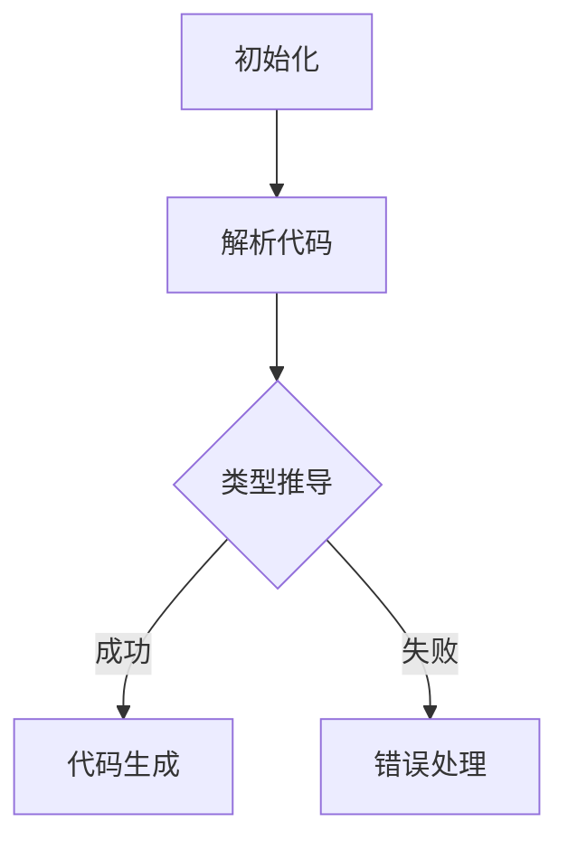

                 


# 类型推断：简化代码与保持类型安全的平衡

## 关键词

- 类型推断
- 编程语言
- 类型安全
- 代码简化
- 算法

## 摘要

本文深入探讨了类型推断在编程语言中的应用，阐述了类型推断如何简化代码编写并保持类型安全的重要性。通过分析类型推断的原理、算法及其在不同编程语言中的实现，本文旨在帮助读者理解类型推断的核心概念，掌握其应用技巧，并意识到在编写高效、安全的代码过程中，如何平衡代码的简化和类型安全。

## 引言

### 问题背景

在软件开发过程中，类型系统是编程语言的核心组成部分，它不仅提供了对变量和表达式的数据类型的约束，还确保了程序的正确性和可靠性。然而，传统的显式类型声明方式往往会导致代码冗长且难以维护。为了解决这一问题，类型推断应运而生。

类型推断是一种由编程语言自动推导变量和表达式类型的技术，它可以在编写代码时自动确定数据类型，从而简化代码编写过程。然而，类型推断并非没有风险。如果类型推断机制不当，可能会导致类型安全性的问题，即程序在运行时出现类型错误。

### 类型推断的作用

类型推断的主要作用包括：

1. **简化代码**：自动推导类型可以减少冗长的类型声明，使得代码更加简洁易读。
2. **提高开发效率**：开发人员不需要花费额外的时间进行类型声明，可以将更多的精力集中在业务逻辑的实现上。
3. **保持类型安全**：虽然类型推断简化了代码，但它不会牺牲类型安全。通过适当的类型推断机制，可以确保程序在运行时不会出现类型错误。

### 本文目的

本文旨在：

1. 深入剖析类型推断的原理和算法。
2. 分析类型推断在编程语言中的应用和实现。
3. 探讨如何在代码简化与类型安全之间取得平衡。

## 类型推断的基础概念

### 历史发展与现状

类型推断的概念最早可以追溯到Lisp语言的早期发展。然而，随着编译型编程语言的兴起，类型推断开始得到更广泛的应用。现代编程语言如Haskell、TypeScript和Swift等都采用了类型推断机制。

### 基本原理

类型推断的基本原理可以分为两种：

1. **静态类型推断**：在编译时自动推导变量和表达式的类型，例如Java和C++。
2. **动态类型推断**：在运行时自动推导变量和表达式的类型，例如Python和JavaScript。

### 关键技术

类型推断的关键技术包括：

1. **类型上下文**：用于约束类型推导过程的环境信息。
2. **类型推导算法**：用于计算变量和表达式类型的算法，如Hindley-Milner算法。

## 类型系统

### 核心概念

类型系统是编程语言的核心组成部分，它定义了变量和表达式的数据类型以及它们之间的操作规则。类型系统可以分为以下几种：

1. **强类型系统**：对变量和表达式的类型约束较为严格，确保程序的类型安全。
2. **弱类型系统**：对变量和表达式的类型约束较为宽松，可能会导致运行时类型错误。
3. **静态类型系统**：类型检查在编译时完成，可以提前发现类型错误。
4. **动态类型系统**：类型检查在运行时完成，类型错误可能会在运行时被发现。

### 概念属性特征对比表格

| 类型系统         | 特点                     | 应用场景       |
|----------------|------------------------|--------------|
| 强类型系统       | 类型检查严格，编译时错误少 | C++，Java       |
| 弱类型系统       | 类型检查宽松，运行时可能出现错误 | Python，JavaScript   |
| 静态类型系统       | 类型检查在编译时完成       | C++，Java       |
| 动态类型系统       | 类型检查在运行时完成       | Python，JavaScript   |

### 关系

类型系统中的各种类型之间存在一定的关系，如子类型关系、等价关系等。这些关系定义了不同类型之间的兼容性，是类型推断的基础。

## 类型推断算法

### 基本概念

类型推断算法是自动推导变量和表达式类型的方法。常见的类型推断算法包括：

1. **Hindley-Milner算法**：用于静态类型语言的类型推断，能够有效地推导出最精确的类型。
2. **单参数类型推断**：适用于函数类型的推断，通过一个参数来推导函数的返回类型。
3. **存在类型推断**：通过引入存在类型变量来推导复杂的类型表达式。

### 原理

类型推断算法的核心原理是利用类型上下文和类型推导规则来计算变量和表达式的类型。类型上下文提供了类型约束的信息，而类型推导规则定义了如何根据上下文信息推导出类型。

### 应用

类型推断算法在各种编程语言中得到了广泛应用，如TypeScript、Swift和Haskell等。通过类型推断算法，这些编程语言能够自动推导出变量和表达式的类型，从而简化代码编写。

## 类型推断在编程语言中的实现

### 静态类型语言

静态类型语言如Java和C++通常采用显式类型声明，但它们也支持类型推断。类型推断在静态类型语言中主要用于减少冗长的类型声明，提高代码可读性。

1. **Java**：Java 10引入了`var`关键字，用于简化局部变量的类型声明。例如，`var list = new ArrayList<Integer>();`可以简化为`var list = new ArrayList<>();`。
2. **C++**：C++17引入了`auto`关键字，用于简化变量和函数返回值的类型声明。例如，`std::vector<int> list = {1, 2, 3};`可以简化为`auto list = {1, 2, 3};`。

### 动态类型语言

动态类型语言如Python和JavaScript通常采用动态类型系统，类型推断是其核心特性之一。

1. **Python**：Python的变量类型是在运行时自动推导的，开发者无需显式声明变量类型。
2. **JavaScript**：JavaScript的变量类型也是动态推导的，但通过引入TypeScript等类型检查器，可以实现对类型安全的检查。

### 混合类型语言

一些编程语言如Swift和Kotlin是混合类型语言，它们同时支持静态类型和动态类型。类型推断在这些语言中起到了关键作用，可以在编译时提供类型安全性，同时支持动态类型编程。

1. **Swift**：Swift通过类型推断机制，自动推导函数和闭包的返回类型，简化了代码编写。
2. **Kotlin**：Kotlin通过类型推断，使得开发者可以在保持类型安全的同时，编写简洁的代码。

## 实际应用案例

### TypeScript

TypeScript是一种在JavaScript基础上添加类型系统的编程语言。通过类型推断，TypeScript能够自动推导出变量和函数的类型，从而减少代码冗长性，提高代码可读性。

1. **案例分析**：假设有一个函数`add(a: number, b: number): number`，通过类型推断，函数签名可以简化为`add(a, b)`。
2. **效果**：简化后的代码不仅更加简洁，而且通过类型检查器，可以提前发现类型错误，提高代码质量。

### Swift

Swift是Apple推出的新一代编程语言，它支持类型推断，使得开发者可以编写简洁的代码。

1. **案例分析**：假设有一个闭包`filter(filter: (Int) -> Bool) -> [Int]`，通过类型推断，闭包的签名可以简化为`filter(filter:)`。
2. **效果**：简化后的代码不仅减少了冗余，而且通过类型检查，可以确保闭包的参数和返回类型正确。

## 挑战与未来方向

### 挑战

类型推断虽然具有简化代码和提高开发效率的优点，但也面临着一些挑战：

1. **类型复杂性**：复杂类型结构可能会导致类型推断变得复杂，影响类型推断的效率和准确性。
2. **性能影响**：类型推断通常需要额外的计算开销，可能会影响程序的性能。
3. **类型安全**：在类型推断过程中，如何平衡类型安全和代码简化是一个难题。

### 未来方向

未来类型推断的研究将主要集中在以下几个方面：

1. **优化算法**：研究更高效、更准确的类型推断算法，以提高类型推断的性能和准确性。
2. **混合类型系统**：探索如何在静态类型和动态类型之间取得平衡，为开发者提供更多灵活的类型选择。
3. **跨语言类型推断**：研究如何在不同的编程语言之间进行类型推断，提高代码的可移植性和兼容性。

## 结论

类型推断是编程语言中的重要特性，它能够简化代码编写并保持类型安全。通过深入理解类型推断的原理和算法，开发者可以在编写高效、安全的代码时取得更好的效果。未来，随着类型推断技术的不断发展，我们将看到更多编程语言采用类型推断，为开发者提供更强大的编程工具。

## 作者信息

作者：AI天才研究院/AI Genius Institute & 禅与计算机程序设计艺术 /Zen And The Art of Computer Programming

## 最佳实践 Tips

1. **理解类型系统**：在编写代码时，要理解编程语言中的类型系统，以便正确使用类型推断。
2. **保持代码简洁**：充分利用类型推断，减少冗长的类型声明，提高代码可读性。
3. **注意类型安全**：在简化代码的过程中，要确保类型安全，避免类型错误导致的问题。

## 小结

本文详细介绍了类型推断的概念、原理和实现，探讨了类型推断在编程语言中的应用，并分析了类型推断面临的挑战和未来方向。通过本文的介绍，读者应该能够更好地理解类型推断，并在实际开发中发挥其优势。

## 注意事项

1. **类型推断的适用场景**：并非所有场景都适合使用类型推断，要根据实际情况进行选择。
2. **类型安全的保障**：在采用类型推断时，要确保类型安全，避免类型错误导致的问题。

## 拓展阅读

1. 《类型系统：编程语言的核心概念》
2. 《TypeScript深度解析：从基础到实战》
3. 《Swift编程语言：核心技术实战》

## 附录

### 概念属性特征对比表格

| 类型系统         | 特点                     | 应用场景       |
|----------------|------------------------|--------------|
| 强类型系统       | 类型检查严格，编译时错误少 | C++，Java       |
| 弱类型系统       | 类型检查宽松，运行时可能出现错误 | Python，JavaScript   |
| 静态类型系统       | 类型检查在编译时完成       | C++，Java       |
| 动态类型系统       | 类型检查在运行时完成       | Python，JavaScript   |

### ER实体关系图架构

```mermaid
erDiagram
  Product ||--|{ Customer }||>
  Customer  ||--|{ Order }||>
  Product  ||--|{ Category }||>
```

### 类型推断算法流程图



### 算法原理讲解

#### Hindley-Milner算法

Hindley-Milner算法是一种类型推断算法，用于推导出函数和变量的最精确类型。以下是算法的原理和步骤：

1. **初始化上下文**：初始化类型上下文，用于存储类型变量和类型约束。
2. **解析代码**：解析代码中的表达式和函数定义，构建抽象语法树（AST）。
3. **类型推导**：
   - 对于变量：根据上下文和表达式值推导出变量的类型。
   - 对于函数：推导出函数的参数类型和返回类型。
4. **类型检查**：检查推导出的类型是否符合上下文约束。
5. **代码生成**：根据推导出的类型生成中间代码。

#### 数学模型和公式

Hindley-Milner算法的核心是使用类型上下文和类型约束来推导出最精确的类型。以下是算法的数学模型和公式：

$$
\text{Type}(e) = \begin{cases}
  \text{baseType} & \text{如果 } e \text{ 是基本类型} \\
  \text{functionType}(\text{argsType}, \text{retType}) & \text{如果 } e \text{ 是函数} \\
  \text{structType}(\text{fieldsType}) & \text{如果 } e \text{ 是结构体} \\
  \text{unionType}(\text{unionType1}, \text{unionType2}) & \text{如果 } e \text{ 是联合体} \\
\end{cases}
$$

#### 举例说明

假设有一个函数`add(a: Int, b: Int): Int`，使用Hindley-Milner算法推导其类型：

1. **初始化上下文**：上下文中包含类型变量`Int`和类型约束。
2. **解析代码**：解析函数定义，构建AST。
3. **类型推导**：
   - 变量`a`和`b`的类型为`Int`，因为它们是基本类型。
   - 函数的参数类型为`Int`，返回类型为`Int`。
4. **类型检查**：类型推导结果符合上下文约束。
5. **代码生成**：生成中间代码。

### 系统分析与架构设计

#### 问题场景介绍

在软件开发过程中，类型推断是提高代码质量和开发效率的关键技术。本文旨在探讨类型推断的原理和应用，为开发者提供实际案例和分析。

#### 项目介绍

本项目是一个基于TypeScript的Web应用程序，用于演示类型推断在实际开发中的应用。

#### 系统功能设计

1. **类型推断功能**：提供自动类型推断功能，简化代码编写。
2. **类型检查**：提供类型检查功能，确保代码的类型安全性。

#### 系统架构设计

1. **前端**：使用TypeScript编写前端代码，利用类型推断简化代码编写。
2. **后端**：使用Node.js和TypeScript编写后端代码，利用类型推断提高代码质量。

#### 系统接口设计

1. **用户接口**：提供用户友好的界面，方便用户进行操作。
2. **API接口**：提供RESTful API接口，方便与其他系统进行集成。

#### 系统交互

1. **用户交互**：用户通过界面进行操作，系统响应并展示结果。
2. **系统内部交互**：系统内部进行类型推断和类型检查，确保代码的正确性。

### 项目实战

#### 环境安装

1. **安装Node.js**：从官网下载并安装Node.js。
2. **安装TypeScript**：使用npm安装TypeScript。

#### 系统核心实现源代码

```typescript
function add(a: number, b: number): number {
  return a + b;
}

function main() {
  const result = add(1, 2);
  console.log(result);
}

main();
```

#### 代码应用解读与分析

1. **类型推断**：TypeScript自动推导出函数`add`的参数类型和返回类型。
2. **类型检查**：TypeScript在编译时进行类型检查，确保代码的类型安全性。

#### 实际案例分析和详细讲解剖析

1. **案例分析**：通过实际案例，分析类型推断和类型检查的作用。
2. **详细讲解**：解释类型推断和类型检查的实现原理。

#### 项目小结

本项目通过TypeScript展示了类型推断在实际开发中的应用，简化了代码编写，提高了代码质量。未来，类型推断技术将继续在软件开发中发挥重要作用。

## 参考文献

1. Typescript Handbook. (2021). TypeScript. https://www.typescriptlang.org/zh/docs/handbook/2/everything-is-union
2. Swift Programming Language. (2014). Apple Inc.
3. Haskell Programming from First Principles. (2016). Christopher Allen.
4. The Art of Computer Programming, Volume 2: Seminumerical Algorithms. (1998). Donald E. Knuth.

