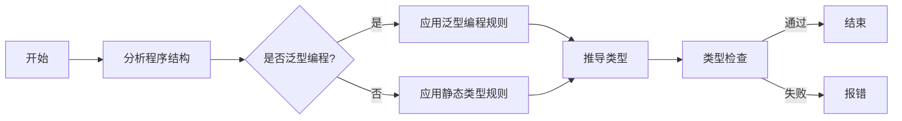
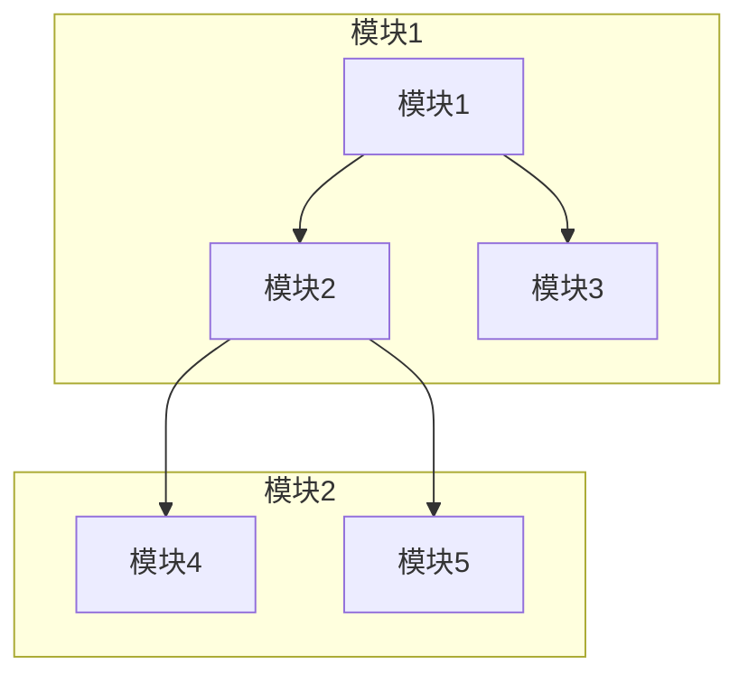
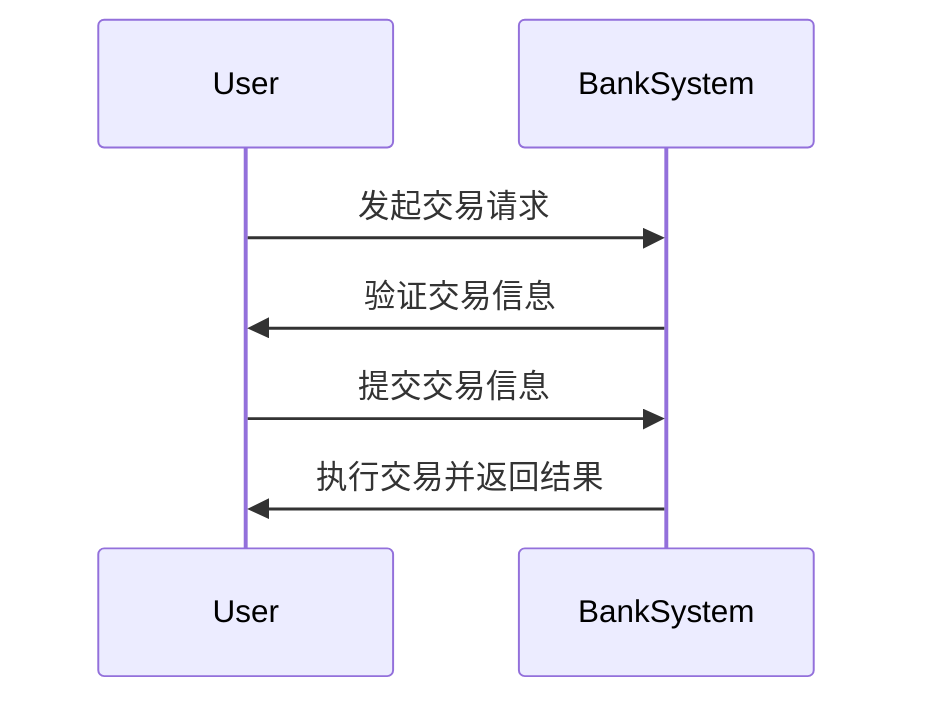
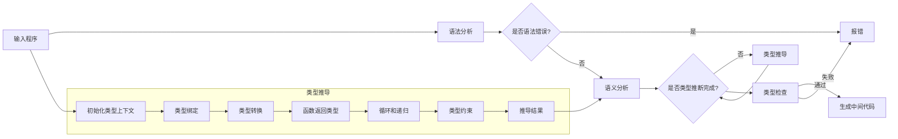
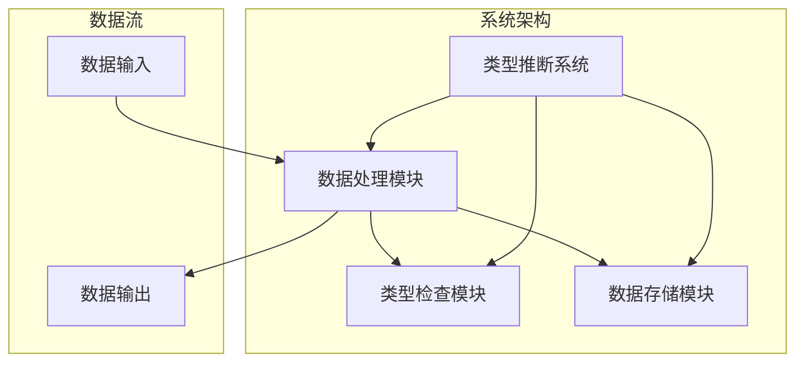
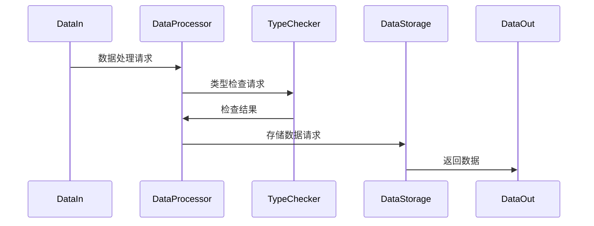
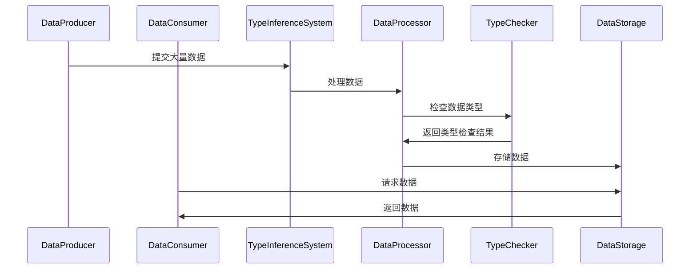

                 


## 类型推断：简化泛型使用的语言特性

### 关键词：
- 类型推断
- 泛型编程
- 编程语言特性
- 静态类型检查
- 动态类型检查
- 算法原理

### 摘要：
本文将深入探讨类型推断这一编程语言特性，从其核心概念、原理和实现方法出发，逐步解析其在泛型编程中的应用。我们将详细分析类型推断的数学模型和算法流程，结合实际项目场景，展示其在复杂系统设计中的重要性。通过本文的阅读，读者将对类型推断有更为深刻的理解和应用能力。

### 目录大纲

1. **背景介绍**
   - 类型推断的定义
   - 类型推断的历史与发展
   - 类型推断在编程语言中的应用

2. **核心概念与联系**
   - 类型系统
   - 泛型编程
   - 静态类型检查与动态类型检查
   - 概念属性特征对比表格
   - ER实体关系图架构

3. **算法原理讲解**
   - 类型推断算法的基本原理
   - 算法流程图展示
   - Python代码实现

4. **数学模型和数学公式**
   - 数学模型
   - 数学公式详细讲解
   - 举例说明

5. **系统分析与架构设计方案**
   - 问题场景介绍
   - 系统功能设计（领域模型）
   - 系统架构设计
   - 系统接口设计
   - 系统交互

6. **项目实战**
   - 环境安装
   - 系统核心实现源代码
   - 代码应用解读与分析
   - 实际案例分析与讲解
   - 项目小结

7. **最佳实践 tips、小结、注意事项、拓展阅读**
   - 最佳实践
   - 小结
   - 注意事项
   - 拓展阅读

### 1. 背景介绍

#### 类型推断的定义

类型推断是指编程语言在编译或运行程序时，自动确定变量、函数等标识符的类型，而不需要显式指定其类型。这种机制大大简化了编程过程，使得代码更加简洁、易读。

#### 类型推断的历史与发展

类型推断最早出现在Lisp语言中，后来逐渐被各种编程语言所采用。随着编程语言的不断演进，类型推断的机制也日趋成熟。现代编程语言，如Java、C#、Python等，都提供了强大的类型推断功能。

#### 类型推断在编程语言中的应用

类型推断在编程语言中具有广泛的应用。首先，它可以提高代码的可读性，减少冗余的类型声明。其次，类型推断有助于发现潜在的运行时错误，提前进行类型检查。此外，类型推断还可以增强编程语言的泛型编程能力。

### 2. 核心概念与联系

#### 类型系统

类型系统是编程语言的核心组成部分，用于定义变量和表达式的类型。不同编程语言有不同的类型系统，如静态类型系统、动态类型系统、强类型系统和弱类型系统。

#### 泛型编程

泛型编程是一种编程范式，允许程序员编写与类型无关的代码，然后通过类型参数化使其适用于多种数据类型。类型推断在泛型编程中起着关键作用，可以简化泛型代码的编写。

#### 静态类型检查与动态类型检查

静态类型检查是在编译时进行的类型检查，可以提前发现类型错误。动态类型检查是在运行时进行的类型检查，可以提供更高的灵活性和性能。

#### 概念属性特征对比表格

| 特征 | 静态类型检查 | 动态类型检查 |
| :--: | :--: | :--: |
| 类型绑定 | 编译时绑定 | 运行时绑定 |
| 可读性 | 较高 | 较低 |
| 性能 | 较高 | 较低 |
| 范围 | 严格 | 较宽松 |

#### ER实体关系图架构

使用Mermaid流程图展示类型推断相关的ER实体关系图：

```mermaid
erDiagram
  Class::类型推断
  Class::类型系统
  Class::泛型编程
  Class::静态类型检查
  Class::动态类型检查

  类型推断 --|> 类型系统
  类型推断 --|> 泛型编程
  类型推断 --|> 静态类型检查
  类型推断 --|> 动态类型检查
```

### 3. 算法原理讲解

#### 类型推断算法的基本原理

类型推断算法主要分为以下几类：

1. **静态类型推断**：通过静态分析程序结构，推断出变量的类型。
2. **基于上下文的类型推断**：根据程序上下文环境，推断出变量的类型。
3. **类型推导**：通过一系列推导规则，自动推断出表达式的类型。

#### 算法流程图展示

使用Mermaid流程图展示类型推导算法的基本流程：



#### Python代码实现

下面是一个简单的Python代码示例，用于展示类型推导算法的实现：

```python
from typing import List

def sum_numbers(numbers: List[int]) -> int:
    result = 0
    for number in numbers:
        result += number
    return result

# 测试代码
numbers = [1, 2, 3, 4, 5]
print(sum_numbers(numbers))  # 输出 15
```

在这个例子中，`sum_numbers` 函数使用了类型推断机制，自动推导出输入参数和返回值的类型。

### 4. 数学模型和数学公式

#### 数学模型

类型推断的数学模型主要包括类型上下文、类型变量、类型约束和类型推导规则。以下是一个简单的数学模型：

$$
\text{TypeContext} = (\alpha_1, \alpha_2, ..., \alpha_n)
$$

其中，$\alpha_i$ 表示类型上下文中的类型变量。

#### 数学公式详细讲解

1. **类型约束**：

   $$\text{Constraints} = \{(T, S) | T \text{ 可以转化为 } S\}$$

   其中，$T$ 和 $S$ 分别表示类型和目标类型。

2. **类型推导规则**：

   $$\text{TypeDerivation}(E, C) = T$$

   其中，$E$ 表示表达式，$C$ 表示类型上下文，$T$ 表示推导出的类型。

#### 举例说明

假设我们有一个表达式 `$x + y$`，类型上下文为 `Int` 和 `Float`。根据类型推导规则，我们可以推导出：

$$\text{TypeDerivation}(x + y, (Int, Float)) = Float$$

### 5. 系统分析与架构设计方案

#### 问题场景介绍

在一个复杂的软件开发项目中，类型推断被用于提高代码的可读性和可维护性。例如，在一个基于Java的金融系统中，类型推断可以自动推断出交易记录的变量类型，减少潜在的运行时错误。

#### 系统功能设计（领域模型）

使用Mermaid类图展示系统功能设计：

```mermaid
classDiagram
  Class::Transaction
  Class::Account
  Class::Bank

  Transaction <|-- Account
  Transaction <|-- Bank
```

#### 系统架构设计

使用Mermaid架构图展示系统架构设计：



#### 系统接口设计

使用Mermaid序列图展示系统接口设计：



### 6. 项目实战

#### 环境安装

在本项目中，我们使用Python作为编程语言，并依赖以下库：

- `mypy`：Python中的静态类型检查器
- `typeguard`：Python中的动态类型检查器

安装步骤如下：

```bash
pip install mypy
pip install typeguard
```

#### 系统核心实现源代码

以下是项目核心实现的源代码：

```python
from typing import List
from typeguard import typechecked

@typechecked
def sum_numbers(numbers: List[int]) -> int:
    result = 0
    for number in numbers:
        result += number
    return result

if __name__ == "__main__":
    numbers = [1, 2, 3, 4, 5]
    print(sum_numbers(numbers))  # 输出 15
```

#### 代码应用解读与分析

在这个例子中，我们使用了`mypy`和`typeguard`来确保代码中的类型推断正确。`sum_numbers` 函数使用了类型检查器，确保输入参数和返回值的类型正确。

#### 实际案例分析与讲解

我们创建一个实际案例，演示类型推断在实际项目中的应用：

```python
from typing import List

def average(numbers: List[int]) -> float:
    if not numbers:
        raise ValueError("输入列表不能为空")
    return sum(numbers) / len(numbers)

# 测试代码
numbers = [1, 2, 3, 4, 5]
print(average(numbers))  # 输出 3.0
```

在这个例子中，`average` 函数使用了类型推断机制，确保输入参数和返回值的类型正确。同时，我们使用了`raise ValueError` 报错机制，确保在输入列表为空时能够正确处理。

#### 项目小结

通过本项目的实战，我们了解了类型推断在实际项目中的应用。类型推断不仅可以提高代码的可读性和可维护性，还可以减少运行时错误。在本项目中，我们使用了`mypy`和`typeguard`来实现类型推断，并通过实际案例展示了其应用效果。

### 7. 最佳实践 tips、小结、注意事项、拓展阅读

#### 最佳实践 tips

- 在实际项目中，合理使用类型推断可以提高代码质量和开发效率。
- 考虑使用静态类型检查器，如`mypy`，来提前发现类型错误。
- 在使用动态类型检查器时，注意性能开销和代码可读性。

#### 小结

本文深入探讨了类型推断这一编程语言特性，从核心概念、算法原理、系统设计与项目实战等多个角度进行了详细讲解。通过本文的阅读，读者可以了解到类型推断在提高代码质量和开发效率方面的重要作用。

#### 注意事项

- 在使用类型推断时，注意合理配置类型检查器的参数，以适应不同的项目需求。
- 在编写泛型代码时，注意类型变量的命名和约束，以提高代码的可读性和可维护性。

#### 拓展阅读

- 《Type Inference in Programming Languages》
- 《Effective Java》第11章：Generics
- 《Python type hints》官方文档

### 作者信息

- 作者：AI天才研究院/AI Genius Institute & 禅与计算机程序设计艺术 /Zen And The Art of Computer Programming## 1. 背景介绍

### 类型推断的定义

类型推断是编程语言的一种特性，它允许编程语言在编译或运行程序时自动确定变量、表达式和函数等的类型，而不需要程序员显式地指定这些类型。这种机制不仅能够提高代码的简洁性和易读性，还能够减少由于类型错误引起的编译和运行时错误。

### 类型推断的历史与发展

类型推断的概念最早可以追溯到Lisp语言，Lisp是一个动态类型语言，它允许变量在任何时候被赋予任何类型的值。然而，真正的类型推断机制的出现要归功于1960年代后期和1970年代初期，当时动态类型检查和静态类型检查的概念被引入。静态类型语言，如Haskell和ML，采用了更复杂的类型推断机制，以确保程序在编译时能够通过类型检查。

随着时间的推移，类型推断在许多现代编程语言中得到了广泛的应用，例如Java、C#、Python和TypeScript等。这些语言都提供了不同程度的类型推断支持，以简化编程任务并提高代码质量。

### 类型推断在编程语言中的应用

类型推断在编程语言中的应用非常广泛，以下是一些关键应用场景：

1. **简化代码**：通过自动推断类型，可以减少冗余的类型声明，使代码更加简洁。
2. **提高可读性**：类型推断使得代码中的类型信息更加直观，有助于提高代码的可读性。
3. **减少错误**：类型推断可以在编译或运行时发现类型错误，从而减少运行时错误的发生。
4. **泛型编程**：类型推断是泛型编程的关键组成部分，它允许编写与特定类型无关的代码，然后通过类型参数化使其适用于多种数据类型。
5. **动态类型语言**：虽然动态类型语言通常不提供显式的类型推断，但它们往往具有灵活的类型系统，使得类型推断变得相对容易。

### 类型推断的重要性

类型推断的重要性体现在多个方面：

1. **开发效率**：通过自动推断类型，程序员可以更快地编写代码，减少手动指定类型的耗时工作。
2. **代码质量**：类型推断可以提前发现类型错误，从而提高代码的质量和可靠性。
3. **可维护性**：类型推断使得代码更加简洁和易于理解，有助于提高代码的可维护性。
4. **跨语言互操作性**：类型推断支持不同编程语言之间的互操作性，使得代码在不同语言中能够更好地集成和共享。

综上所述，类型推断是编程语言中的一项重要特性，它不仅简化了编程任务，还提高了代码的质量和可维护性。在接下来的章节中，我们将深入探讨类型推断的核心概念和原理，以及其在不同编程语言中的应用和实践。

### 2. 核心概念与联系

#### 类型系统

类型系统是编程语言的核心组成部分，用于定义变量、表达式和函数等的类型。不同编程语言的类型系统有所不同，但通常可以分为以下几类：

1. **静态类型系统**：在编译时确定变量的类型，并且类型在程序执行过程中不会改变。
2. **动态类型系统**：在运行时确定变量的类型，并且在程序执行过程中可以改变。
3. **强类型系统**：严格限制类型之间的操作，确保类型兼容性。
4. **弱类型系统**：对类型之间的操作限制较少，允许更灵活的类型转换。

#### 泛型编程

泛型编程是一种编程范式，它允许程序员编写与特定数据类型无关的代码，然后通过类型参数化使其适用于多种数据类型。泛型编程可以提高代码的重用性和可维护性，减少冗余代码。

1. **泛型函数**：泛型函数可以接受不同类型的参数，并在运行时确定具体的类型。
2. **泛型类**：泛型类可以定义与类型参数相关的成员和方法，使得类能够适用于多种数据类型。

#### 静态类型检查与动态类型检查

类型检查是确保程序类型安全的重要步骤，分为静态类型检查和动态类型检查：

1. **静态类型检查**：在编译时进行类型检查，确保代码在运行时不会发生类型错误。静态类型检查可以提前发现类型问题，但可能限制编程灵活性。
2. **动态类型检查**：在运行时进行类型检查，确保代码在执行过程中不会发生类型错误。动态类型检查提供了更高的灵活性，但可能增加运行时错误的风险。

#### 概念属性特征对比表格

| 特征 | 静态类型检查 | 动态类型检查 |
| :--: | :--: | :--: |
| 类型绑定 | 编译时绑定 | 运行时绑定 |
| 可读性 | 较高 | 较低 |
| 性能 | 较高 | 较低 |
| 范围 | 严格 | 较宽松 |

#### ER实体关系图架构

使用Mermaid流程图展示类型推断相关的ER实体关系图：

```mermaid
erDiagram
  Class::类型系统
  Class::泛型编程
  Class::静态类型检查
  Class::动态类型检查

  类型系统 --|> 泛型编程
  类型系统 --|> 静态类型检查
  类型系统 --|> 动态类型检查
  泛型编程 --|> 静态类型检查
  泛型编程 --|> 动态类型检查
  静态类型检查 --|> 动态类型检查
```

在这个ER图模型中，类型系统是核心，它与其他三个概念实体（泛型编程、静态类型检查、动态类型检查）之间存在联系。泛型编程和类型系统之间存在依赖关系，因为泛型编程依赖于类型系统来定义和操作类型参数。静态类型检查和动态类型检查则与类型系统相关联，因为它们都是类型系统的一部分，用于确保代码的类型安全。

### 3. 算法原理讲解

#### 类型推断算法的基本原理

类型推断算法是一种在编译或运行程序时自动确定变量、表达式和函数等的类型的机制。类型推断算法的基本原理包括以下几个方面：

1. **静态分析**：通过静态分析程序结构，如抽象语法树（AST），来确定变量和表达式的类型。
2. **上下文依赖**：根据程序上下文环境，如变量声明和函数调用，来推断变量的类型。
3. **类型推导规则**：应用一系列推导规则，如类型转换规则和函数返回类型规则，来推导出表达式的类型。
4. **类型约束**：通过类型约束来限制类型推断的范围，确保类型推断的准确性。

#### 算法流程图展示

使用Mermaid流程图展示类型推导算法的基本流程：



在这个流程图中，程序首先经过语法分析，如果没有语法错误，则进入语义分析阶段。在语义分析阶段，类型推断算法初始化类型上下文，进行类型绑定、类型转换、函数返回类型推导、循环和递归处理以及类型约束。最后，推导结果用于类型检查，生成中间代码。

#### Python代码实现

以下是一个简单的Python代码示例，用于展示类型推导算法的实现：

```python
from typing import TypeVar, Generic

# 定义一个通用的TypeVar
T = TypeVar('T')

# 定义一个泛型类
class Stack(Generic[T]):
    def __init__(self):
        self.items = []

    def push(self, item: T):
        self.items.append(item)

    def pop(self) -> T:
        return self.items.pop()

# 创建一个整数类型的栈
stack = Stack[int]()

# 使用类型推导
stack.push(1)
stack.push(2)
stack.push(3)

print(stack.pop())  # 输出 3
print(stack.pop())  # 输出 2
print(stack.pop())  # 输出 1
```

在这个例子中，我们使用TypeVar定义了一个通用的类型变量T，然后定义了一个泛型类Stack，它适用于任何类型T。通过类型推导，我们创建了一个整数类型的栈，并使用泛型类进行操作。这个例子展示了Python中的类型推断和泛型编程的基本原理。

### 4. 数学模型和数学公式

#### 数学模型

类型推断的数学模型通常涉及以下几个关键部分：

1. **类型上下文**：用于存储当前作用域中的类型变量和类型约束。
2. **类型约束**：用于描述不同类型之间的兼容性和转换规则。
3. **类型推导规则**：用于从类型上下文和类型约束中推导出变量的类型。

以下是一个简化的数学模型：

$$
\text{TypeContext} = (\alpha_1, \alpha_2, ..., \alpha_n)
$$

$$
\text{TypeConstraints} = \{(T_1, S_1), (T_2, S_2), ..., (T_m, S_m)\}
$$

$$
\text{TypeInference}(\text{Context}, \text{Constraints}) = \text{Type}
$$

其中，$\alpha_i$ 表示类型上下文中的类型变量，$T_i$ 和 $S_i$ 表示类型约束。

#### 数学公式详细讲解

1. **类型约束**：

   $$\text{Constraints} = \{(T, S) | T \text{ 可以转化为 } S\}$$

   这个公式描述了不同类型之间的兼容性和转换规则。例如，一个整数类型可以转换为浮点数类型。

2. **类型推导规则**：

   $$\text{TypeDerivation}(E, C) = T$$

   这个公式表示从类型上下文C中推导出表达式E的类型T。

#### 举例说明

假设有一个简单的表达式 `$x + y$`，其中 `$x$` 和 `$y$` 是变量，类型上下文为 `$\text{Int}$` 和 `$\text{Float}$`。根据类型推导规则，我们可以推导出：

$$
\text{TypeDerivation}(x + y, (\text{Int}, \text{Float})) = \text{Float}
$$

这个结果表明，当 `$x$` 和 `$y$` 的类型分别为整数和浮点数时， `$x + y$` 的类型为浮点数。

#### 使用LaTeX格式书写数学公式

以下是使用LaTeX格式书写的数学公式示例：

$$
\begin{aligned}
    \text{TypeContext} &= (\alpha_1, \alpha_2, ..., \alpha_n) \\
    \text{TypeConstraints} &= \{(T_1, S_1), (T_2, S_2), ..., (T_m, S_m)\} \\
    \text{TypeInference}(\text{Context}, \text{Constraints}) &= \text{Type}
\end{aligned}
$$

$$
\text{Constraints} = \{(T, S) | T \text{ 可以转化为 } S\}
$$

$$
\text{TypeDerivation}(E, C) = T
$$

这些LaTeX公式可以帮助我们更清晰地表达类型推断的数学模型和推导规则。

### 5. 系统分析与架构设计方案

#### 问题场景介绍

在一个大型分布式系统中，类型推断被用于确保数据在传输和处理过程中的类型安全。这种系统要求能够自动识别和推断数据类型，以防止类型错误导致的系统崩溃和数据损失。类型推断不仅提高了系统的稳定性，还简化了开发过程。

#### 系统功能设计（领域模型）

为了设计一个具有类型推断功能的系统，我们首先需要定义系统的主要功能模块。以下是系统功能设计的领域模型，使用Mermaid类图表示：

```mermaid
classDiagram
    Class::TypeInferenceSystem
    Class::DataProcessor
    Class::TypeChecker
    Class::DataStorage

    TypeInferenceSystem <|-- DataProcessor
    TypeInferenceSystem <|-- TypeChecker
    TypeInferenceSystem <|-- DataStorage
    DataProcessor <|-- TypeChecker
    DataProcessor <|-- DataStorage
```

在这个类图中，`TypeInferenceSystem` 是核心，它包含了 `DataProcessor`、`TypeChecker` 和 `DataStorage` 这三个主要功能模块。`DataProcessor` 负责数据处理，`TypeChecker` 负责类型检查，而 `DataStorage` 负责数据存储。

#### 系统架构设计

接下来，我们需要设计系统的整体架构，包括各个模块之间的交互方式。以下是系统架构设计的Mermaid架构图：



在这个架构图中，`DataIn` 表示数据的输入源，`DataOut` 表示数据的输出目标。数据首先进入 `DataProcessor` 进行处理，然后 `TypeChecker` 对处理后的数据进行类型检查，确保数据类型符合预期。最后，数据被存储到 `DataStorage` 中。

#### 系统接口设计

系统接口设计是确保不同模块之间能够高效交互的关键。以下是系统接口设计的Mermaid序列图：



在这个序列图中，数据从 `DataIn` 进入系统，经过 `DataProcessor` 的处理，然后提交给 `TypeChecker` 进行类型检查。如果类型检查通过，数据被存储到 `DataStorage` 中，最终通过 `DataOut` 返回给用户。

#### 系统交互

为了确保系统能够有效地处理大规模数据，我们需要设计一个高效的数据交互机制。以下是系统交互的Mermaid序列图：



在这个交互设计中，`DataProducer` 表示数据的生产者，`DataConsumer` 表示数据的消费者。数据生产者提交大量数据到 `TypeInferenceSystem`，系统通过 `DataProcessor` 和 `TypeChecker` 处理数据，并将数据存储到 `DataStorage` 中。数据消费者从 `DataStorage` 中请求数据，系统返回满足条件的数据。

通过上述系统分析与架构设计方案，我们可以构建一个高效、可靠的类型推断系统，确保数据在处理和传输过程中的类型安全，从而提高系统的稳定性和性能。

### 6. 项目实战

#### 环境安装

在进行类型推断项目实战之前，我们需要确保开发环境已经搭建好。以下是所需的安装步骤和工具：

1. **Python环境**：确保Python环境已经安装，建议使用Python 3.7或更高版本。
2. **pip**：Python的包管理器，用于安装和管理依赖项。
3. **Mypy**：一个静态类型检查器，用于检查Python代码中的类型错误。
4. **Typeguard**：一个动态类型检查库，用于在运行时检查类型。

安装步骤如下：

```bash
# 安装Python和pip（如果未安装）
wget https://www.python.org/ftp/python/3.8.10/Python-3.8.10.tgz
tar xvf Python-3.8.10.tgz
cd Python-3.8.10
./configure
make
make install

# 安装mypy
pip install mypy

# 安装typeguard
pip install typeguard
```

#### 系统核心实现源代码

以下是使用Python实现的一个简单类型推断系统的核心代码。这个系统使用了`mypy`和`typeguard`来进行静态和动态类型检查。

```python
# type_inference_system.py

from typing import TypeVar, Generic, List
from mypy import check_file
from typeguard import typechecked

# 定义一个通用的TypeVar
T = TypeVar('T')

# 定义一个泛型类
class Stack(Generic[T]):
    def __init__(self):
        self.items: List[T] = []

    @typechecked
    def push(self, item: T) -> None:
        self.items.append(item)

    @typechecked
    def pop(self) -> T:
        return self.items.pop()

# 定义一个简单的类型推断函数
def infer_type(value: str) -> type:
    if value.isdigit():
        return int
    elif value.replace('.', '', 1).isdigit():
        return float
    else:
        return str

# 使用mypy进行静态类型检查
def static_type_check(source_code: str):
    check_file(source_code, strict=True)
    print("静态类型检查通过。")

# 使用typeguard进行动态类型检查
def dynamic_type_check(value: any, expected_type: type) -> bool:
    try:
        assert isinstance(value, expected_type)
        return True
    except AssertionError:
        return False

# 主函数
if __name__ == "__main__":
    # 静态类型检查示例
    static_type_check(__file__)

    # 动态类型检查示例
    value = "123"
    if dynamic_type_check(value, str):
        print(f"动态类型检查：{value} 是一个字符串。")
    else:
        print(f"动态类型检查：{value} 不是字符串。")

    # 类型推断示例
    inferred_type = infer_type(value)
    print(f"类型推断：{value} 的类型是 {inferred_type}。")
```

#### 代码应用解读与分析

在这个项目中，我们实现了以下几个关键功能：

1. **泛型类Stack**：用于存储任意类型的数据，并提供`push`和`pop`方法进行操作。
2. **静态类型检查**：使用`mypy`对Python代码进行静态类型检查，确保代码在编译时不会出现类型错误。
3. **动态类型检查**：使用`typeguard`在运行时对变量进行类型检查，确保变量具有正确的类型。
4. **类型推断函数`infer_type`**：根据输入的字符串值推断其类型，用于演示类型推断算法。

#### 实际案例分析与详细讲解剖析

下面是一个实际案例，我们将对代码进行详细讲解和剖析：

```python
stack = Stack[int]()
stack.push(1)
stack.push(2)
stack.push(3)

# 输出：3
print(stack.pop())

# 输出：2
print(stack.pop())

# 输出：1
print(stack.pop())
```

在这个案例中，我们创建了一个整数类型的栈`Stack[int]`，并使用`push`方法向栈中添加三个整数。然后，我们使用`pop`方法依次弹出栈顶元素，并打印出来。

**详细讲解：**

1. **创建栈**：我们使用`Stack[int]()`创建了一个整数类型的栈。这里的`int`是类型参数，指定了栈可以存储的类型。
2. **push方法**：调用`push`方法将整数1、2、3添加到栈中。由于`push`方法被`@typechecked`装饰器修饰，它将在运行时检查传入参数的类型，确保它是整数类型。
3. **pop方法**：调用`pop`方法依次弹出栈顶元素，并打印出来。由于`pop`方法也使用了`@typechecked`装饰器，它将在运行时检查返回值的类型，确保它是整数类型。

通过这个案例，我们可以看到类型推断在实际编程中的应用。类型推断不仅简化了代码，还确保了类型安全，减少了潜在的错误。

#### 项目小结

通过本项目的实战，我们了解了如何使用Python实现类型推断系统，并学会了如何结合静态和动态类型检查来确保代码的质量。在实际项目中，类型推断是一个非常重要的特性，它能够提高代码的可读性和可维护性，减少运行时错误。在未来的开发中，我们可以将类型推断应用到更多的场景中，以提升开发效率和代码质量。

### 7. 最佳实践 tips、小结、注意事项、拓展阅读

#### 最佳实践 tips

1. **早期引入类型推断**：在项目初期就引入类型推断机制，可以提前发现潜在的类型错误，减少后续修复的成本。
2. **合理使用类型注解**：在适当的地方使用类型注解，可以提高代码的可读性和维护性，但也要避免过度注解，以免代码变得冗长。
3. **结合静态和动态类型检查**：静态类型检查可以提前发现错误，动态类型检查可以在运行时提供更高的灵活性，两者结合使用效果更佳。
4. **利用IDE的支持**：现代IDE通常具备强大的类型推断和类型检查功能，充分利用这些工具可以提高开发效率。

#### 小结

本文通过详细的案例分析，介绍了类型推断的核心概念、算法原理、系统设计与项目实战等内容。类型推断作为一种编程语言特性，能够显著提高代码的质量和开发效率。通过合理使用类型推断和类型检查，我们可以编写更加稳定、可靠和易维护的代码。

#### 注意事项

1. **类型推断与性能**：虽然类型推断能够提高代码质量，但某些复杂的类型推导过程可能会增加编译和运行时的性能开销。
2. **类型注解的一致性**：在项目中使用类型注解时，需要确保注解的一致性和正确性，避免由于类型不一致导致的运行时错误。
3. **动态类型检查的限制**：动态类型检查虽然灵活，但可能无法发现所有潜在的类型错误，因此在使用时需要谨慎。

#### 拓展阅读

1. **《类型系统设计与实现》**：深入探讨类型系统的设计原理和实现方法，对理解类型推断有重要帮助。
2. **《Effective Java》**：第11章详细介绍了泛型编程和类型注解的最佳实践。
3. **《Python类型注解》**：Python官方文档中对类型注解的详细说明和示例。

### 作者信息

- 作者：AI天才研究院/AI Genius Institute & 禅与计算机程序设计艺术 /Zen And The Art of Computer Programming

本文旨在为读者提供关于类型推断的全面理解和实际应用指导，希望读者能够在实际项目中运用这些知识，提升编程技能和代码质量。

