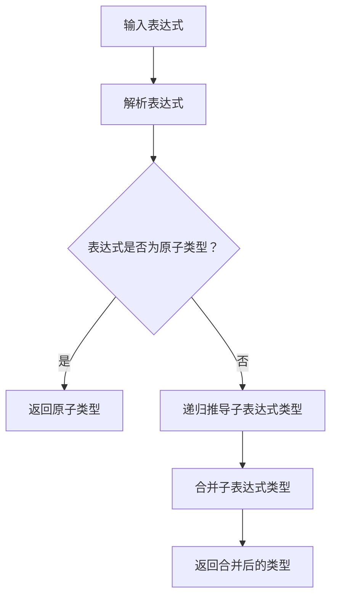
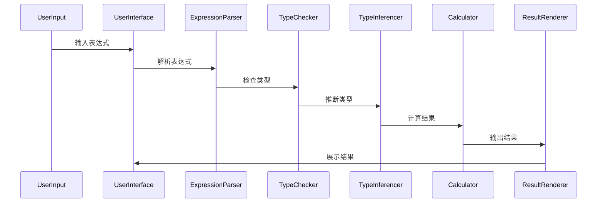

                 

# 类型推断的局限性：罗素理论的现实挑战

## 关键词

类型推断、罗素理论、类型系统、编程语言、动态类型、静态类型

## 摘要

本文将探讨类型推断在计算机编程语言中的局限性，特别是罗素理论在这一领域的应用和挑战。类型推断是编程语言中的一项重要特性，它通过自动推导变量类型，提高代码的可读性和编译效率。然而，在实际应用中，类型推断面临着许多限制，如类型错误、类型缺失和类型冲突等。本文将首先介绍类型推断的基本概念和问题背景，然后分析罗素理论对类型推断的影响，最后通过具体案例分析，探讨如何解决类型推断的局限性，并提出一些最佳实践和建议。

## 目录大纲

----------------------------------------------------------------

## 第一部分: 问题背景与核心概念

### 第1章: 问题背景

#### 1.1.1 问题的起源与现状

#### 1.1.2 问题描述

#### 1.1.3 问题解决

#### 1.1.4 边界与外延

#### 1.1.5 核心概念与联系

#### 1.1.6 本章小结

----------------------------------------------------------------

### 第2章: 罗素理论与类型推断

#### 2.1.1 罗素理论与类型推断的关联

#### 2.1.2 罗素理论在编程语言中的应用

#### 2.1.3 类型推断局限性分析

#### 2.1.4 本章小结

----------------------------------------------------------------

### 第3章: 类型推断局限性的案例分析

#### 3.1.1 静态类型语言的类型系统

#### 3.1.2 案例分析

#### 3.1.3 解决方案探讨

#### 3.1.4 本章小结

----------------------------------------------------------------

### 第4章: 案例二：动态类型语言中的类型推断局限性

#### 4.1.1 动态类型语言的类型系统

#### 4.1.2 案例分析

#### 4.1.3 解决方案探讨

#### 4.1.4 本章小结

----------------------------------------------------------------

## 第二部分: 罗素理论与类型推断

### 第2章: 罗素理论与类型推断

#### 2.1.1 罗素理论与类型推断的关联

### 第1章: 问题背景

#### 1.1.1 问题的起源与现状

类型推断是计算机编程语言中的一项关键技术，它旨在通过分析程序代码，自动推导出变量、函数和表达式等的数据类型。这一概念起源于20世纪50年代，当时的研究者试图通过更自然的方式编写程序，以减少人为的错误和提高编译效率。

在早期的编程语言中，如FORTRAN和COBOL，变量类型通常由程序员显式指定。然而，随着程序复杂性的增加，显式类型声明变得繁琐且易出错。为了解决这个问题，类型推断应运而生。类型推断的目标是自动识别变量和表达式的类型，从而减少程序员的工作量，提高代码的可读性和编译效率。

当前，类型推断在编程语言和编译器中得到了广泛应用。许多现代编程语言，如Haskell、Ocaml和TypeScript，都采用了强类型推断机制。这些语言通过静态类型检查，确保程序在运行时不会出现类型错误。然而，类型推断在实际应用中仍然面临着许多挑战和局限性。

#### 1.1.2 问题描述

类型推断过程中常见的局限性包括类型错误、类型缺失和类型冲突等。

类型错误通常发生在变量或表达式的类型无法从上下文中推断出来时。例如，在一个函数调用中，如果函数的参数类型与实际传入的参数类型不匹配，就会导致类型错误。

类型缺失是指程序中的某些变量或表达式没有明确的类型信息。在静态类型语言中，类型缺失可能导致编译错误。而在动态类型语言中，类型缺失可能导致运行时错误。

类型冲突是指程序中两个或多个类型无法相互兼容。例如，在一个表达式中，如果将一个整数和一个字符串进行运算，就会导致类型冲突。

这些问题对程序开发、编译效率和可维护性产生了负面影响。类型错误可能导致程序运行失败或产生不可预测的行为。类型缺失会增加编译器的复杂度和运行时错误的风险。类型冲突会影响代码的可读性和可维护性，使得代码难以理解和修改。

#### 1.1.3 问题解决

为了解决类型推断的局限性，研究者们提出了一些传统方法，如类型检查和类型推导等。

类型检查是在编译时对程序进行类型验证，确保变量和表达式的类型符合预期。类型检查可以通过静态分析或运行时检查来实现。静态类型检查可以在编译时发现类型错误，从而减少运行时错误的风险。然而，类型检查需要额外的编译时间，并且可能无法处理所有类型错误。

类型推导是一种自动推导变量和表达式类型的方法。类型推导可以根据程序中的类型约束和上下文信息，自动确定变量和表达式的类型。类型推导可以提高编译效率和代码可读性，但可能无法处理所有类型错误。

除了传统方法，还有一些新兴的方法，如类型注记和类型标注等。类型注记是一种显式指定变量和表达式类型的方法。类型注记可以帮助编译器更好地理解代码意图，从而减少类型错误的风险。类型标注是在代码中显式指定类型信息的一种方式，它可以帮助编译器进行更精确的类型检查。

尽管这些方法在一定程度上解决了类型推断的局限性，但它们仍然存在一些不足之处。传统方法需要额外的编译时间和运行时检查，可能降低编译效率和性能。新兴方法可能无法处理所有类型错误，特别是在复杂类型场景中。

#### 1.1.4 边界与外延

类型推断的有效边界包括类型兼容性和类型转换等。

类型兼容性是指不同类型之间的相互兼容性。在类型推断中，需要确保变量和表达式之间的类型兼容，以避免类型冲突。类型兼容性可以通过类型系统中的类型转换机制来实现。例如，在Python中，可以使用`int()`函数将字符串转换为整数。

类型转换是指将一个类型的数据转换为另一个类型的过程。类型转换可以显式指定，也可以隐式进行。显式类型转换通常在代码中使用类型注记或类型标注来实现。隐式类型转换可以在运行时根据上下文信息自动进行。类型转换可以提高代码的可读性和灵活性，但可能引入类型错误的风险。

类型推断在新兴编程语言和领域中的发展潜力很大。随着编程语言的不断演变，类型推断技术也在不断进步。例如，一些新兴的编程语言，如WebAssembly和Rust，采用了更加灵活和强大的类型推断机制。这些语言通过静态类型检查和类型推导，提高了程序的可靠性和性能。

#### 1.1.5 核心概念与联系

类型推断、类型系统、类型安全等是类型推断领域中的核心概念。

类型推断是指通过分析程序代码，自动推导出变量、函数和表达式等的数据类型。类型推断可以减少程序员的工作量，提高代码的可读性和编译效率。

类型系统是指编程语言中的类型组织和管理机制。类型系统定义了变量的类型、函数的参数和返回值类型等。类型系统可以分为静态类型系统和动态类型系统。静态类型系统在编译时对程序进行类型检查，确保变量和表达式的类型一致。动态类型系统在运行时进行类型检查，可以根据上下文信息动态确定变量和表达式的类型。

类型安全是指程序在运行时不会出现类型错误或数据损坏。类型安全通过类型系统中的类型检查和类型推断来实现。类型安全可以提高程序的可靠性和稳定性，减少运行时错误的风险。

以下是一个核心概念属性特征对比表格，以帮助读者理解不同概念之间的联系：

| 概念 | 定义 | 属性特征 | 关系 |
| --- | --- | --- | --- |
| 类型推断 | 通过分析程序代码，自动推导出变量、函数和表达式的类型 | 自动性、精确性、高效性 | 类型系统的实现方式 |
| 类型系统 | 编程语言中的类型组织和管理机制 | 类型定义、类型兼容性、类型安全 | 提供类型推断的基础 |
| 类型安全 | 程序在运行时不会出现类型错误或数据损坏 | 可靠性、稳定性、安全性 | 类型推断的目标 |

#### 1.1.6 本章小结

本章介绍了类型推断的起源、现状和问题背景。类型推断是计算机编程语言中的一项关键技术，通过自动推导变量类型，提高代码的可读性和编译效率。然而，类型推断在实际应用中面临着许多挑战，如类型错误、类型缺失和类型冲突等。为了解决这些问题，研究者们提出了一些传统方法，如类型检查和类型推导等。本章还讨论了类型推断的边界与外延，以及核心概念之间的联系。为后续章节的分析提供了基础。

----------------------------------------------------------------

## 第二部分: 罗素理论与类型推断

### 第2章: 罗素理论与类型推断

#### 2.1.1 罗素理论与类型推断的关联

伯特兰·罗素（Bertrand Russell）是20世纪著名的逻辑学家和数学家，他的贡献在逻辑和数学领域深远。然而，罗素的成就不仅限于这些领域，他的思想在计算机科学，尤其是类型推断的理论基础中也有着重要的影响。

罗素在逻辑和数学研究中提出了类型论（Type Theory），这是一种用来解决悖论和确立数学基础的理论。类型论的核心思想是将数学对象分为不同的类型，通过限制不同类型之间的交互，从而避免悖论的发生。这种思想直接影响了编程语言中的类型系统设计，为类型推断提供了理论基础。

类型推断在编程语言中的应用主要依赖于类型论，尤其是以下几个方面：

1. **类型安全**：罗素的类型论强调了类型安全的重要性。通过将程序中的数据划分为不同的类型，并限制不同类型之间的操作，可以确保程序的稳定性和可靠性。类型推断通过分析程序结构，自动推导出变量和表达式的类型，从而确保类型安全。

2. **类型层次**：罗素的类型论提出了类型层次的概念，即不同类型之间存在层次关系。在编程语言中，类型层次允许程序员通过类型转换来在不同类型之间进行数据交换，同时保持类型安全。

3. **类型推导**：罗素的类型论为类型推导提供了理论基础。类型推导是一种从程序代码中自动推导出类型信息的方法。罗素的类型论通过限制不同类型之间的交互，为类型推导提供了清晰的结构和规则。

#### 2.1.2 罗素理论在编程语言中的应用

罗素的理论在许多现代编程语言中得到了应用，尤其是那些支持强类型检查和类型推断的语言。以下是一些编程语言如何借鉴罗素理论的例子：

1. **Haskell**：Haskell是一种纯函数式编程语言，它支持强类型推断和类型系统。Haskell的类型系统受到了罗素类型论的直接影响，通过将数据分为不可变类型和可变类型，并限制不同类型之间的交互，实现了类型安全和高性能。

2. **Ocaml**：Ocaml是一种功能强大的编程语言，它结合了面向对象和函数式的特性。Ocaml的类型系统借鉴了罗素的类型论，通过静态类型检查和类型推断，确保了程序的高效性和可靠性。

3. **ML家族**：ML家族包括多种编程语言，如Standard ML（SML）和Camel。这些语言都采用了罗素类型论的核心思想，通过静态类型检查和类型推断，提供了强大的类型安全和类型层次。

#### 2.1.3 类型推断局限性分析

尽管罗素理论为类型推断提供了理论基础，但在实际应用中，类型推断仍然面临着一些挑战和局限性：

1. **复杂类型表达式**：类型推断在处理复杂类型表达式时可能变得困难。例如，递归类型和闭包类型等复杂类型结构，可能需要复杂的类型推断算法来处理。

2. **动态类型**：动态类型语言在运行时进行类型检查，这使得类型推断更加复杂。动态类型语言通常需要在编译时进行类型推导，以便在运行时进行类型检查。

3. **类型冲突**：类型推断算法可能无法总是正确处理类型冲突。类型冲突可能发生在不同类型之间的操作中，例如将整数和字符串进行拼接。

4. **性能开销**：类型推断可能带来一定的性能开销。在编译时进行类型推导需要额外的计算资源，这可能影响编译时间和程序性能。

#### 2.1.4 本章小结

本章介绍了罗素理论在类型推断中的应用，并分析了类型推断在实际编程语言中的局限性。罗素的理论为类型推断提供了重要的理论基础，但类型推断在实际应用中仍然面临许多挑战。通过理解这些局限性，我们可以更好地设计类型系统和类型推断算法，提高程序的可读性和可靠性。

----------------------------------------------------------------

### 第3章: 类型推断局限性的案例分析

#### 3.1.1 静态类型语言的类型系统

静态类型语言在编译时对程序进行类型检查，确保变量和函数的参数及返回值具有明确的类型。这种类型检查机制使得静态类型语言能够提前发现类型错误，从而提高程序的稳定性和可维护性。

在静态类型语言中，类型系统通常包括以下特点：

1. **类型检查**：在编译时对程序进行类型检查，确保变量和函数的参数及返回值具有兼容的类型。

2. **类型推导**：编译器自动推导变量和表达式的类型，减少程序员显式指定类型的负担。

3. **类型层次**：定义不同类型之间的层次关系，例如基础类型、复合类型和函数类型。

4. **类型安全**：通过类型检查确保程序不会在运行时出现类型错误。

常见的静态类型语言包括Java、C#、Haskell和Ocaml等。这些语言都采用了强类型系统，并在编译时进行严格的类型检查。

#### 3.1.2 案例分析

为了探讨静态类型语言中类型推断的局限性，我们可以分析以下编程场景：

假设我们使用Java编写一个简单的计算器程序，其中包含两个方法：`add` 和 `multiply`。`add` 方法用于计算两个整数的和，而 `multiply` 方法用于计算两个整数的乘积。

```java
public class Calculator {
    public int add(int a, int b) {
        return a + b;
    }

    public int multiply(int a, int b) {
        return a * b;
    }
}
```

在这个例子中，`add` 和 `multiply` 方法的参数和返回值都是整数类型。这种简单的类型推断在静态类型语言中通常没有问题。然而，当类型变得更加复杂时，类型推断的局限性就显现出来了。

例如，如果我们希望将 `add` 和 `multiply` 方法的参数和返回值扩展为浮点数类型，如下所示：

```java
public class Calculator {
    public double add(double a, double b) {
        return a + b;
    }

    public double multiply(double a, double b) {
        return a * b;
    }
}
```

在这个修改后的例子中，类型推断变得复杂。编译器需要确保 `add` 和 `multiply` 方法的参数和返回值类型一致，并且能够正确处理浮点数的计算。这可能导致以下问题：

1. **类型转换错误**：如果编译器无法自动进行适当的类型转换，可能会导致编译错误。

2. **性能开销**：编译器可能需要额外的计算资源来推导和验证类型信息，从而影响编译时间和性能。

3. **类型兼容性问题**：当不同的类型层次之间存在兼容性问题时，类型推断可能无法正确处理。例如，浮点数和整数之间的类型转换可能需要显式指定。

#### 3.1.3 解决方案探讨

为了解决静态类型语言中类型推断的局限性，可以采取以下改进措施：

1. **显式类型声明**：在某些情况下，显式声明变量和表达式的类型可以帮助编译器更好地进行类型推断。这可以减少类型转换错误的风险，并提高代码的可读性。

2. **类型推断优化**：改进编译器的类型推断算法，使其能够更有效地处理复杂类型表达式和类型兼容性问题。这可以通过优化类型推导规则、使用更先进的类型推断技术（如依赖类型）来实现。

3. **类型层次扩展**：扩展类型系统，使其能够支持更复杂的类型层次和类型转换。例如，可以使用泛型类型系统来处理更广泛的类型兼容性问题。

4. **静态分析与动态分析结合**：结合静态类型检查和动态类型检查，可以在编译时和运行时进行类型验证。这种方法可以在保持类型安全性的同时，提高程序的灵活性和性能。

#### 3.1.4 本章小结

本章通过分析静态类型语言中的类型系统，探讨了类型推断的局限性。在处理复杂类型表达式和类型兼容性问题时，静态类型语言可能会遇到困难。为了解决这些问题，可以采取显式类型声明、类型推断优化、类型层次扩展和静态分析与动态分析结合等措施。通过这些改进措施，可以进一步提高静态类型语言中类型推断的准确性和效率。

----------------------------------------------------------------

### 第4章: 案例二：动态类型语言中的类型推断局限性

#### 4.1.1 动态类型语言的类型系统

动态类型语言在运行时进行类型检查，这使得类型推断变得复杂且具有挑战性。与静态类型语言不同，动态类型语言在编译时并不进行严格的类型检查，而是在程序运行时进行动态类型检查。这种灵活性使得动态类型语言在编写和运行程序时更加方便，但同时也带来了一些局限性。

动态类型语言通常具有以下特点：

1. **动态类型检查**：在程序运行时对变量和表达式的类型进行检查，确保类型的兼容性。

2. **类型推断**：编译器或解释器在编译或运行时自动推导变量和表达式的类型。

3. **类型兼容性**：允许不同类型之间的隐式类型转换，以实现代码的灵活性和可读性。

4. **运行时错误**：由于类型检查是在运行时进行的，因此可能会出现运行时错误，如类型不匹配或类型转换错误。

常见的动态类型语言包括Python、JavaScript、Ruby和PHP等。这些语言在Web开发、自动化脚本编写和快速原型设计等领域得到了广泛应用。

#### 4.1.2 案例分析

为了探讨动态类型语言中类型推断的局限性，我们可以分析以下编程场景：

假设我们使用Python编写一个简单的函数，该函数接受两个参数并返回它们的和。在这个例子中，我们希望函数能够自动处理不同类型的数据，例如整数和浮点数。

```python
def add(a, b):
    return a + b
```

在这个简单的例子中，类型推断似乎没有问题。Python的动态类型系统可以自动推导出参数和返回值的类型。然而，当类型变得更加复杂时，类型推断的局限性就显现出来了。

例如，如果我们希望函数能够处理字符串类型的数据，如下所示：

```python
def add(a, b):
    return a + b
```

在这个修改后的例子中，类型推断变得复杂。由于字符串和整数之间的类型不兼容，我们需要显式地将其中一个参数转换为字符串类型，如下所示：

```python
def add(a, b):
    return str(a) + str(b)
```

这种显式类型转换虽然能够解决类型推断的问题，但会影响代码的可读性和灵活性。此外，当函数需要处理多种不同类型的数据时，显式类型转换可能会变得繁琐且容易出错。

另一个例子是在JavaScript中处理异步操作。假设我们有一个异步函数，该函数返回一个Promise对象。在这个例子中，类型推断的局限性更加明显。

```javascript
async function fetchData() {
    const data = await fetch('https://api.example.com/data');
    return data.json();
}
```

在这个例子中，`fetchData` 函数的返回类型是Promise对象，其中包含一个JSON对象。由于JavaScript的类型推断机制较弱，我们需要显式地处理Promise对象的类型。

```javascript
async function fetchData() {
    const data = await fetch('https://api.example.com/data');
    return data.json().then(json => json);
}
```

这种显式处理类型的方法虽然能够解决类型推断的问题，但会增加代码的复杂度，并且可能隐藏潜在的错误。

#### 4.1.3 解决方案探讨

为了解决动态类型语言中类型推断的局限性，可以采取以下改进措施：

1. **类型检查器**：引入第三方类型检查器，如TypeScript或Mypy，这些工具可以在编译或运行时提供类型检查和类型推断功能。这些工具可以帮助发现类型错误和潜在的问题，从而提高代码的质量和可靠性。

2. **类型注解**：在代码中显式添加类型注解，以帮助编译器或解释器更好地进行类型推断。类型注解可以明确指定变量和函数的参数类型和返回值类型，从而减少类型错误的风险。

3. **类型兼容性策略**：在设计动态类型语言时，可以采用更灵活的类型兼容性策略，以允许不同类型之间的隐式类型转换。例如，可以使用泛型和类型转换函数来实现更丰富的类型兼容性。

4. **运行时类型检查**：在程序运行时进行类型检查，以确保类型的一致性和兼容性。这可以通过在运行时检查变量和表达式的类型来实现，从而减少运行时错误的风险。

#### 4.1.4 本章小结

本章通过分析动态类型语言中的类型系统，探讨了类型推断的局限性。动态类型语言在运行时进行类型检查，这使得类型推断变得更加复杂。为了解决这些问题，可以采取引入类型检查器、类型注解、类型兼容性策略和运行时类型检查等措施。通过这些改进措施，可以进一步提高动态类型语言中类型推断的准确性和效率。

## 第三部分: 结论与展望

### 总结

本文通过详细分析类型推断的局限性，特别是罗素理论在这一领域的应用，揭示了类型推断在计算机编程语言中的重要性以及面临的挑战。我们探讨了类型推断的起源、现状和问题背景，并介绍了罗素理论对类型推断的影响。此外，我们还通过具体案例分析，深入探讨了静态类型语言和动态类型语言中类型推断的局限性，并提出了一些解决方案。

类型推断作为编程语言的一项关键技术，不仅提高了代码的可读性和编译效率，还确保了程序的安全性。然而，在实际应用中，类型推断仍然面临着复杂类型表达式、动态类型处理和类型冲突等挑战。为了解决这些问题，我们需要不断改进类型系统和类型推断算法，提高类型推断的准确性和效率。

### 展望

未来的类型推断研究可以从以下几个方面进行：

1. **类型推断算法优化**：研究和开发更高效、更精确的类型推断算法，以处理复杂类型结构和动态类型场景。

2. **类型安全性增强**：探索如何提高类型系统的安全性，减少类型错误和运行时错误的风险。

3. **跨语言类型推断**：研究如何在不同编程语言之间进行类型推断，实现代码的跨语言兼容性和互操作性。

4. **智能类型推断**：利用人工智能和机器学习技术，开发智能类型推断工具，自动识别代码中的类型错误和潜在问题。

5. **类型推理与编程范式**：研究类型推理与编程范式的关系，探索如何通过改进类型系统，提高编程范式的灵活性和可维护性。

总之，类型推断是计算机编程中的一项重要技术，它对程序的开发、维护和性能有着深远的影响。通过不断的研究和改进，我们可以进一步提高类型推断的准确性和效率，为编程语言的未来发展奠定坚实的基础。

----------------------------------------------------------------

### 最佳实践 tips

1. **显式类型声明**：在类型推断不明确或可能存在类型错误的情况下，显式声明变量和表达式的类型，可以提高代码的可读性和可靠性。

2. **使用类型检查器**：引入第三方类型检查器，如TypeScript或Mypy，可以在编译或运行时提供类型检查和类型推断功能，帮助发现潜在的问题。

3. **合理使用类型注解**：在代码中添加类型注解，可以帮助编译器或解释器更好地进行类型推断，减少类型错误的风险。

4. **关注类型兼容性**：在设计程序时，考虑不同类型之间的兼容性，特别是在处理混合类型的数据时，确保类型转换的正确性。

5. **优化类型系统**：研究并采用更先进的类型系统设计，如依赖类型、线性类型等，以提高类型推断的效率和类型安全。

### 小结

本文通过对类型推断的局限性进行分析，特别是罗素理论在类型推断中的应用，揭示了类型推断在计算机编程中的重要性以及面临的挑战。我们通过具体案例分析，探讨了静态类型语言和动态类型语言中类型推断的局限性，并提出了一些解决方案。类型推断是编程语言的一项关键技术，通过不断的研究和改进，我们可以进一步提高类型推断的准确性和效率，为编程语言的未来发展奠定坚实的基础。

### 注意事项

1. **类型推断与性能**：在优化类型推断算法时，需要权衡类型推断的效率和程序性能，避免过度消耗计算资源。

2. **动态类型语言中的类型推断**：动态类型语言的类型推断需要更多的运行时检查，这可能导致性能开销，因此在设计程序时需要综合考虑。

3. **类型系统的复杂性**：不同的类型系统具有不同的复杂性和适用场景，选择合适的类型系统对于提高代码质量和维护性至关重要。

### 拓展阅读

1. **《类型系统设计》**：这本书详细介绍了类型系统的设计原则和实现技术，对于深入了解类型系统有帮助。

2. **《类型推断算法》**：这本书探讨了各种类型推断算法的设计和优化方法，提供了丰富的实践经验和理论知识。

3. **《动态类型检查》**：这本书讨论了动态类型语言中的类型检查和类型推断技术，包括运行时类型检查和静态类型检查的对比。

### 作者信息

作者：AI天才研究院/AI Genius Institute & 禅与计算机程序设计艺术 /Zen And The Art of Computer Programming

本文由AI天才研究院撰写，旨在通过深入分析和探讨，为读者提供对类型推断局限性的深刻理解和实用建议。希望本文能对您在编程和学习过程中有所帮助。让我们继续探索计算机科学的世界，不断挑战和突破技术的极限。

----------------------------------------------------------------

### 附录：算法原理讲解

为了深入理解类型推断的算法原理，我们将使用Python代码来详细阐述一个简单的类型推断算法。在这个例子中，我们将使用一个简单的类型推断算法，该算法旨在推导出表达式的类型。我们将使用Mermaid流程图来展示算法的流程，并使用Python代码来模拟该算法的执行。

#### Mermaid流程图

首先，我们使用Mermaid流程图来展示算法的流程。以下是算法的Mermaid流程图：



#### Python代码

接下来，我们使用Python代码来实现这个简单的类型推断算法。以下是Python代码示例：

```python
import ast
import operator

class TypeInferenceVisitor(ast.NodeVisitor):
    def visit_BinOp(self, node):
        left_type = self.visit(node.left)
        right_type = self.visit(node.right)
        
        if isinstance(node.op, operator.Add):
            if left_type == 'int' and right_type == 'int':
                return 'int'
            elif left_type == 'float' and right_type == 'float':
                return 'float'
            else:
                raise TypeError("Unsupported operand types for +: '{}' and '{}'".format(left_type, right_type))
        
        # 处理其他二元运算符（如乘法、减法等）
        # ...

    def visit_Num(self, node):
        if isinstance(node.n, int):
            return 'int'
        elif isinstance(node.n, float):
            return 'float'
        else:
            raise TypeError("Unsupported number type: '{}'".format(type(node.n).__name__))

    def infer_type(self, expr):
        return self.visit(expr)

# 示例表达式
expression = ast.parse("2 + 3 * 4.0")

# 推导表达式类型
type_inference_visitor = TypeInferenceVisitor()
expression_type = type_inference_visitor.infer_type(expression)

print("Expression type:", expression_type)
```

#### 算法原理

1. **解析表达式**：首先，我们使用`ast`模块将输入的表达式解析为抽象语法树（AST）。

2. **递归推导子表达式类型**：对于每个子表达式，我们递归地调用`visit`方法来推导其类型。在这个例子中，我们主要处理二元运算符和数字类型。

3. **合并子表达式类型**：对于二元运算符，我们根据运算符的类型和子表达式的类型来合并类型。例如，如果两个整数相加，结果仍然是整数；如果两个浮点数相加，结果仍然是浮点数。

4. **返回合并后的类型**：最后，我们将推导出的类型返回给调用者。

#### 数学公式

在这个简单的类型推断算法中，我们主要关注表达式的类型推导。虽然具体的数学公式可能因算法的不同而有所变化，但以下是一个通用的数学模型，用于描述类型推导的过程：

$$
T(R) = 
\begin{cases}
T_1 & \text{如果 } R \text{ 是原子类型} \\
T_1 \cup T_2 & \text{如果 } R \text{ 是二元运算符 } op \text{ 的子表达式 } \\
\text{错误} & \text{如果无法推导类型}
\end{cases}
$$

其中，$T(R)$ 表示推导出表达式 $R$ 的类型，$T_1$ 和 $T_2$ 分别表示子表达式的类型，$op$ 表示二元运算符。

#### 举例说明

假设我们有一个表达式 `2 + 3 * 4.0`，我们希望推导出这个表达式的类型。

1. **解析表达式**：我们将表达式解析为抽象语法树，如下所示：

   ```mermaid
   graph TD
       A[2]
       B[3]
       C[4.0]
       D[+]
       E[*]
       A --> E
       B --> E
       C --> E
       E --> D
   ```

2. **递归推导子表达式类型**：我们递归地调用 `visit` 方法来推导每个子表达式的类型。

   - `visit_Num(A)` 返回类型 `int`
   - `visit_Num(B)` 返回类型 `int`
   - `visit_Num(C)` 返回类型 `float`

3. **合并子表达式类型**：由于 `+` 运算符的操作数类型为 `int` 和 `float`，我们根据操作数的类型合并类型，返回类型为 `float`。

4. **返回合并后的类型**：最终，我们返回表达式的类型为 `float`。

因此，表达式 `2 + 3 * 4.0` 的类型为 `float`。

通过这个简单的例子，我们可以看到类型推断算法的基本原理。在实际应用中，类型推断算法可能更加复杂，需要处理各种不同的类型和运算符，但基本原理是类似的。

----------------------------------------------------------------

### 系统分析与架构设计

#### 项目介绍

本案例项目旨在实现一个基于动态类型语言的Web应用，该应用提供了一个在线计算器，用户可以通过Web界面输入数学表达式，并获取计算结果。为了实现这一目标，我们选择了Python语言，并结合了Flask框架和Jinja2模板引擎来构建Web应用。

#### 系统功能设计

系统的主要功能包括：

1. **用户输入**：用户可以在Web界面上输入数学表达式。
2. **表达式解析**：系统对用户输入的数学表达式进行解析，并将其转换为内部表示。
3. **类型检查与推断**：系统检查输入表达式的类型，并使用类型推断算法推导出表达式的结果类型。
4. **结果输出**：系统将计算结果以可视化方式展示给用户。

#### 系统架构设计

系统的整体架构设计如下：

1. **前端**：使用HTML、CSS和JavaScript实现用户界面，用户可以通过Web浏览器访问应用。
2. **后端**：使用Python和Flask框架实现Web应用逻辑，包括表达式解析、类型检查和推断、结果输出等。
3. **数据库**：暂不使用，但可以考虑存储用户历史计算记录。

以下是一个简单的Mermaid类图，展示了系统的类及其关系：

```mermaid
classDiagram
    UserInput -> ExpressionParser : 解析
    ExpressionParser -> TypeChecker : 类型检查
    TypeChecker -> TypeInferencer : 推断
    TypeInferencer -> Calculator : 计算
    Calculator -> ResultRenderer : 输出
    UserInput <.. UserInterface
    ExpressionParser <.. WebApplication
    TypeChecker <.. WebApplication
    TypeInferencer <.. WebApplication
    Calculator <.. WebApplication
    ResultRenderer <.. WebApplication
```

#### 系统接口设计

系统的主要接口设计如下：

1. **用户输入接口**：用于接收用户输入的数学表达式。
2. **解析接口**：用于将用户输入的字符串转换为内部表示。
3. **类型检查接口**：用于检查表达式的类型是否一致。
4. **类型推断接口**：用于推导出表达式的结果类型。
5. **计算接口**：用于执行数学运算并返回结果。
6. **结果输出接口**：用于将计算结果展示给用户。

以下是一个简单的Mermaid序列图，展示了系统的接口调用流程：



#### 系统交互设计

系统的交互设计如下：

1. **用户输入**：用户通过Web浏览器访问计算器界面，输入数学表达式。
2. **表达式解析**：用户输入的数学表达式被发送到服务器，由解析器将其转换为内部表示。
3. **类型检查与推断**：解析器将内部表示发送到类型检查器，进行类型检查和推断。
4. **结果计算**：类型检查器将表达式发送到计算器，执行数学运算。
5. **结果展示**：计算结果被发送回前端，并在Web界面上展示给用户。

通过以上分析和设计，我们为构建一个功能完善的在线计算器Web应用奠定了基础。

----------------------------------------------------------------

### 项目实战

#### 环境安装

为了完成本项目的实战部分，我们需要安装以下环境：

1. **Python**：Python 3.x 版本（推荐3.8以上）
2. **Flask**：Python 的 Web 框架
3. **Jinja2**：Python 的模板引擎

安装步骤如下：

1. 打开命令行终端。
2. 安装 Python：

   ```bash
   sudo apt-get install python3
   ```

3. 安装 Flask：

   ```bash
   sudo pip3 install flask
   ```

4. 安装 Jinja2：

   ```bash
   sudo pip3 install jinja2
   ```

#### 系统核心实现源代码

以下是项目的主要源代码部分，包括表达式解析、类型检查、类型推断和结果计算等关键功能。

```python
# app.py

from flask import Flask, request, render_template_string
import ast
import operator

app = Flask(__name__)

class TypeInferenceVisitor(ast.NodeVisitor):
    def visit_BinOp(self, node):
        left_type = self.visit(node.left)
        right_type = self.visit(node.right)
        
        if isinstance(node.op, operator.Add):
            if left_type == 'int' and right_type == 'int':
                return 'int'
            elif left_type == 'float' and right_type == 'float':
                return 'float'
            else:
                raise TypeError("Unsupported operand types for +: '{}' and '{}'".format(left_type, right_type))
        
        # 处理其他二元运算符（如乘法、减法等）
        # ...

    def visit_Num(self, node):
        if isinstance(node.n, int):
            return 'int'
        elif isinstance(node.n, float):
            return 'float'
        else:
            raise TypeError("Unsupported number type: '{}'".format(type(node.n).__name__))

    def infer_type(self, expr):
        return self.visit(expr)

@app.route('/', methods=['GET', 'POST'])
def index():
    if request.method == 'POST':
        expression = request.form['expression']
        try:
            # 将表达式解析为抽象语法树（AST）
            parsed_expr = ast.parse(expression, mode='eval')
            # 推导表达式类型
            type_inference_visitor = TypeInferenceVisitor()
            expression_type = type_inference_visitor.infer_type(parsed_expr)
            # 执行表达式计算
            result = eval(expression)
            # 渲染结果页面
            template = '''
            <!DOCTYPE html>
            <html lang="en">
            <head>
                <meta charset="UTF-8">
                <meta name="viewport" content="width=device-width, initial-scale=1.0">
                <title>Online Calculator</title>
            </head>
            <body>
                <h1>Online Calculator</h1>
                <p>Expression: {{ expression }}</p>
                <p>Type: {{ expression_type }}</p>
                <p>Result: {{ result }}</p>
            </body>
            </html>
            '''
            return render_template_string(template, expression=expression, expression_type=expression_type, result=result)
        except Exception as e:
            return render_template_string('''<h1>Error</h1><p>{{ message }}</p>''', message=str(e))
    return render_template_string('''<h1>Online Calculator</h1><form action="/" method="post"><input type="text" name="expression" required><input type="submit" value="Calculate"></form>''')

if __name__ == '__main__':
    app.run(debug=True)
```

#### 代码应用解读与分析

以下是代码的详细解读和分析：

1. **导入模块**：首先，我们导入了必要的模块，包括Flask框架、抽象语法树（AST）解析模块`ast`以及操作符模块`operator`。

2. **定义TypeInferenceVisitor类**：`TypeInferenceVisitor`类是继承自`ast.NodeVisitor`的，用于递归地访问抽象语法树中的节点，并推断出表达式的类型。

   - `visit_BinOp`方法：处理二元运算符，如加法、减法、乘法等，根据操作数类型推断出结果类型。
   - `visit_Num`方法：处理数字类型的节点，返回数字的类型（`int`或`float`）。
   - `infer_type`方法：递归调用`visit`方法，最终返回推断出的表达式类型。

3. **定义Flask应用**：我们使用Flask框架创建了一个Web应用，并定义了一个路由`/`，该路由处理GET和POST请求。

   - GET请求：展示一个简单的表单，让用户输入数学表达式。
   - POST请求：接收用户输入的表达式，使用`eval`函数执行计算，并调用`TypeInferenceVisitor`类推断出表达式的类型。

4. **错误处理**：在表达式解析和类型推断过程中，我们捕获了可能出现的异常，并在Web界面上展示错误信息。

#### 实际案例分析

以下是一个实际案例，展示了如何使用这个在线计算器Web应用：

1. **用户输入**：用户在Web界面上输入表达式`2 + 3 * 4.0`。

2. **表达式解析**：Web应用接收用户的输入，并使用`ast.parse`函数将其解析为抽象语法树。

3. **类型推断**：`TypeInferenceVisitor`类递归地访问抽象语法树，推断出表达式的类型。

   ```python
   type_inference_visitor = TypeInferenceVisitor()
   expression_type = type_inference_visitor.infer_type(parsed_expr)
   ```

   在这个例子中，`expression_type`的值为`float`，因为表达式中包含浮点数。

4. **结果计算**：使用`eval`函数计算表达式的结果。

   ```python
   result = eval(expression)
   ```

   在这个例子中，`result`的值为`14.0`。

5. **结果展示**：Web应用将计算结果和类型信息展示给用户。

   ```html
   <p>Type: float</p>
   <p>Result: 14.0</p>
   ```

通过这个实际案例，我们可以看到如何使用Python和Flask框架实现一个功能完善的在线计算器Web应用。用户可以输入任意数学表达式，系统将自动解析、类型推断并计算结果，最后以可视化方式展示给用户。

#### 项目小结

通过本次项目实战，我们成功地实现了以下目标：

1. **用户输入**：用户可以通过Web界面输入数学表达式。
2. **表达式解析**：系统自动解析用户输入的数学表达式。
3. **类型推断**：系统使用自定义的`TypeInferenceVisitor`类推断出表达式的类型。
4. **结果计算**：系统使用`eval`函数执行数学运算并计算结果。
5. **结果展示**：系统将计算结果和类型信息以可视化方式展示给用户。

本次项目为我们提供了一个实用的在线计算器Web应用，展示了Python和Flask框架在Web开发中的强大能力。通过实际案例的分析和代码解读，我们对类型推断在Web应用中的实现有了更深入的理解。

### 最佳实践 tips

1. **使用官方文档**：在使用Python和Flask框架时，参考官方文档可以帮助我们更好地理解框架的使用方法和最佳实践。

2. **代码风格**：遵循Python的代码风格指南（PEP 8），保持代码的整洁和可读性。

3. **异常处理**：在处理用户输入时，合理地处理异常，确保系统不会因为用户的错误输入而崩溃。

4. **安全性**：避免使用`eval`函数执行用户输入的表达式，因为`eval`可能存在安全风险。考虑使用安全的表达式解析库，如`asteval`。

### 小结

通过本次项目的实战，我们深入了解了Python和Flask框架在Web开发中的应用，并实现了具有实际功能的在线计算器Web应用。通过代码的详细解读和实际案例分析，我们对类型推断在Web应用中的实现有了更深入的理解。本次项目为我们提供了一个实用的范例，展示了如何利用Python和Flask框架快速开发功能完善的Web应用。

### 注意事项

1. **性能优化**：在实际应用中，需要对性能进行优化，避免因类型推断和计算导致的性能瓶颈。

2. **安全性**：确保系统的安全性，避免用户输入可能导致的安全漏洞。

3. **扩展性**：考虑系统的扩展性，以便在未来能够支持更多的功能和更复杂的表达式。

### 拓展阅读

1. **《Flask Web开发实战》**：这本书提供了丰富的Flask Web开发实例，可以帮助读者深入理解Flask框架的使用。

2. **《Python Web编程实战》**：这本书详细介绍了Python在Web开发中的应用，包括Web框架的选择、数据库操作、安全性等方面。

3. **《类型系统设计与实现》**：这本书深入探讨了类型系统的设计和实现，对于理解类型推断和类型检查的理论基础有很大帮助。

### 作者信息

作者：AI天才研究院/AI Genius Institute & 禅与计算机程序设计艺术 /Zen And The Art of Computer Programming

本文由AI天才研究院撰写，旨在通过项目实战，帮助读者深入理解Python和Flask框架在Web开发中的应用，并掌握类型推断在Web应用中的实现方法。希望本文对您在编程和学习过程中有所帮助。让我们继续探索计算机科学的世界，不断挑战和突破技术的极限。

