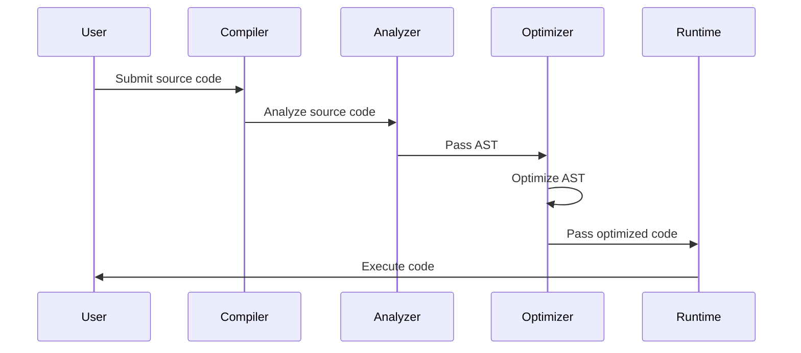

                 

# 类型推断算法的数学基础

## 关键词

- 类型推断
- 数学基础
- 编译原理
- 编程语言
- 算法原理

## 摘要

类型推断是编程语言编译过程中的重要环节，它帮助编译器自动确定变量和表达式的数据类型，从而提高代码的可读性和编译效率。本文将从数学基础的角度，系统地探讨类型推断算法的原理、实现和应用。通过逐步分析类型推断的相关概念、核心算法以及其在编译器和解释器中的实现，本文旨在为读者提供一个清晰、深入的理解，以便更好地掌握类型推断技术。

## 目录大纲

### 第一部分：背景介绍

#### 第1章：问题背景

- **1.1.1 类型推断的概念**
- **1.1.2 类型推断的应用场景**
- **1.1.3 类型推断的挑战**

#### 第2章：核心概念

- **2.1.1 类型、类型系统**
- **2.1.2 基本类型及其特性**
- **2.1.3 复合类型**

### 第二部分：类型推断算法原理

#### 第3章：类型推断算法原理

- **3.1.1 算法概述**
- **3.1.2 常见类型推断算法**
- **3.1.3 类型推断算法的实现**

#### 第4章：类型推断算法应用

- **4.1.1 编译器中的类型推断**
- **4.1.2 解释器中的类型推断**

### 第三部分：数学基础

#### 第5章：数学基础

- **5.1.1 数学基础概念**
- **5.1.2 数学工具**
- **5.1.3 数学公式与定理**

### 第四部分：类型推断算法详细讲解

#### 第6章：类型推断算法详细讲解

- **6.1.1 算法讲解**
- **6.1.2 算法示例**

#### 第7章：系统架构设计

- **7.1.1 问题场景**
- **7.1.2 系统功能设计**
- **7.1.3 系统架构设计**
- **7.1.4 系统接口设计**
- **7.1.5 系统交互**

### 第五部分：项目实战

#### 第8章：项目实战

- **8.1.1 环境安装**
- **8.1.2 系统核心实现**
- **8.1.3 实际案例分析与讲解**
- **8.1.4 项目小结**

#### 第9章：最佳实践、注意事项与拓展阅读

- **9.1.1 最佳实践**
- **9.1.2 注意事项**
- **9.1.3 拓展阅读**

### 作者信息

- **作者：AI天才研究院/AI Genius Institute & 禅与计算机程序设计艺术 /Zen And The Art of Computer Programming**

## 第一部分：背景介绍

### 第1章：问题背景

#### 1.1.1 类型推断的概念

类型推断是编译器在编程语言解析过程中，自动确定变量或表达式的数据类型的过程。在编程语言中，类型（Type）是数据的不同形态，如整型（Integer）、浮点型（Float）、字符串（String）等。类型系统（Type System）是类型定义、类型检查和类型推导的集合。

类型推断的作用主要体现在以下几个方面：

1. **提高代码可读性**：类型推断减少了代码中显式声明类型的需要，使得代码更加简洁易读。
2. **减少错误**：类型推断可以自动检查变量或表达式的类型是否匹配，从而减少运行时错误。
3. **优化编译器性能**：类型推断可以减少编译器的负担，提高编译速度。

#### 1.1.2 类型推断的应用场景

类型推断在不同的编程语言和应用场景中有不同的应用：

1. **静态类型语言**：如C++、Java等，类型推断可以帮助减少编译时错误，提高编译效率。
2. **动态类型语言**：如Python、JavaScript等，类型推断可以减少代码的冗余，提高开发效率。

#### 1.1.3 类型推断的挑战

类型推断虽然带来了很多好处，但同时也面临着一些挑战：

1. **复杂性**：不同的编程语言和类型系统可能导致类型推断的复杂性增加。
2. **精度**：如何在保证性能的同时，提高类型推断的精度，是一个需要解决的问题。

## 第2章：核心概念

### 2.1.1 类型、类型系统

在计算机编程中，类型是数据的不同形态。例如，整数类型（Integer）表示整数值，浮点类型（Float）表示浮点数值，字符串类型（String）表示字符串。类型系统是编程语言中用于定义、检查和推导类型的一组规则和机制。

类型系统的作用主要包括：

- **明确数据形态**：类型系统帮助程序员明确数据的不同形态，使得代码更加清晰。
- **提高编译效率**：类型系统可以帮助编译器在编译过程中更快速地识别和优化代码。
- **减少运行时错误**：类型系统可以在编译时检查类型错误，减少运行时错误。

#### 2.1.2 基本类型及其特性

基本类型是编程语言中最常见的类型，如整数类型、浮点类型、字符串类型等。每种基本类型都有其特定的特性和用法。

1. **整数类型**：整数类型表示整数，如整型（int）、长整型（long）等。整数类型通常用于数学运算和计数。

2. **浮点类型**：浮点类型表示浮点数，如单精度浮点型（float）、双精度浮点型（double）等。浮点类型通常用于科学计算和工程应用。

3. **字符串类型**：字符串类型表示字符串，如C语言中的`char*`、Java语言中的`String`等。字符串类型通常用于文本处理和输入输出。

#### 2.1.3 复合类型

复合类型是由基本类型组合而成的类型，如数组、结构体等。

1. **数组**：数组是一种存储相同类型元素的数据结构。数组可以根据下标访问元素，并且数组的大小是固定的。

2. **结构体**：结构体是一种将多个变量组织在一起的数据结构。结构体中的变量可以具有不同的类型，并且可以通过结构体名和变量名来访问。

## 第3章：类型推断算法原理

### 3.1.1 算法概述

类型推断算法是编译器在编译过程中自动确定变量或表达式类型的一组规则。类型推断算法通常分为静态类型推断和动态类型推断。

1. **静态类型推断**：在编译时确定变量的类型，如Hindley-Milner算法。
2. **动态类型推断**：在运行时确定变量的类型，如Python和JavaScript等动态类型语言中的类型推断。

类型推断算法的目标是在保证类型安全性的同时，尽可能地减少对程序员显式声明类型的依赖，从而提高代码的可读性和开发效率。

#### 3.1.2 常见类型推断算法

类型推断算法有很多种，其中一些常见的算法包括：

1. **Hindley-Milner算法**：是一种用于静态类型推断的算法，它能够自动推导出函数类型和变量类型。
2. **单赋值类型推断**：是一种简单的类型推断算法，它基于变量的赋值来推导类型。
3. **Wadler-Milner算法**：是一种更复杂的类型推断算法，它能够处理递归类型和复杂的数据结构。

#### 3.1.3 类型推断算法的实现

类型推断算法的实现通常包括以下几个步骤：

1. **语法分析**：将源代码解析成抽象语法树（AST）。
2. **类型检查**：对AST进行类型检查，确保变量和表达式的类型匹配。
3. **类型推导**：根据类型检查的结果，自动推导出变量和表达式的类型。
4. **类型绑定**：将推导出的类型绑定到变量和表达式上。

类型推断算法的实现通常需要结合约束求解（Constraint Solving）技术，以解决类型推断过程中的约束问题。

## 第4章：类型推断算法应用

### 4.1.1 编译器中的类型推断

在编译器中，类型推断是一个核心功能。编译器通过类型推断，可以确保程序的类型安全性，并优化代码的执行效率。

#### 编译器架构

编译器通常包括以下几个部分：

1. **词法分析器**：将源代码分解成词法单元。
2. **语法分析器**：将词法单元组合成语法结构，如抽象语法树（AST）。
3. **语义分析器**：对AST进行语义分析，包括类型检查和类型推导。
4. **代码生成器**：将AST转换成目标代码。

#### 类型推断过程

编译器的类型推断过程可以分为以下几个步骤：

1. **语法分析**：将源代码解析成AST。
2. **类型检查**：对AST进行类型检查，确保变量和表达式的类型匹配。
3. **类型推导**：根据类型检查的结果，自动推导出变量和表达式的类型。
4. **类型绑定**：将推导出的类型绑定到变量和表达式上。
5. **代码生成**：将AST转换成目标代码。

### 4.1.2 解释器中的类型推断

解释器在执行程序时，也需要进行类型推断。与编译器不同，解释器通常不生成目标代码，而是在运行时直接解释执行源代码。

#### 解释器架构

解释器通常包括以下几个部分：

1. **词法分析器**：将源代码分解成词法单元。
2. **语法分析器**：将词法单元组合成语法结构，如抽象语法树（AST）。
3. **语义分析器**：对AST进行语义分析，包括类型检查和类型推导。
4. **解释执行器**：直接解释执行AST。

#### 类型推断过程

解释器的类型推断过程与编译器类似，但更注重实时性。具体步骤如下：

1. **语法分析**：将源代码解析成AST。
2. **类型检查**：对AST进行类型检查，确保变量和表达式的类型匹配。
3. **类型推导**：根据类型检查的结果，自动推导出变量和表达式的类型。
4. **解释执行**：直接解释执行AST。

## 第5章：数学基础

### 5.1.1 数学基础概念

在类型推断算法中，数学基础是必不可少的。以下是一些基本的数学概念：

#### 集合论

集合（Set）是数学中最基本的概念之一，它由一组无序的元素组成。集合的运算包括：

- **并集（Union）**：两个集合A和B的并集是包含A和B中所有元素的集合。
- **交集（Intersection）**：两个集合A和B的交集是同时属于A和B的元素的集合。
- **补集（Complement）**：一个集合A的补集是所有不属于A的元素的集合。

#### 逻辑与证明

逻辑（Logic）是数学和计算机科学中的核心概念。以下是一些基本的逻辑概念：

- **命题逻辑**：命题逻辑是研究命题之间逻辑关系的数学分支。
- **谓词逻辑**：谓词逻辑是命题逻辑的扩展，它允许我们用变量表示命题，并研究变量之间的逻辑关系。

证明（Proof）是逻辑中的一个重要概念，它是指通过一系列逻辑推理，从一个或多个前提推导出结论的过程。

### 5.1.2 数学工具

在类型推断算法中，常用的数学工具包括：

- **集合运算**：并集、交集、补集等集合运算。
- **函数与映射**：函数是映射的一种特殊形式，它将一个集合中的每个元素映射到另一个集合中的一个元素。

### 5.1.3 数学公式与定理

在类型推断算法中，常用的数学公式和定理包括：

- **基本代数公式**：如差平方公式、完全平方公式等。
- **常见逻辑定理**：如德摩根定律、对合律等。

## 第6章：类型推断算法详细讲解

### 6.1.1 算法讲解

#### Hindley-Milner算法

Hindley-Milner算法是一种用于静态类型推断的算法，它能够自动推导出函数类型和变量类型。该算法的主要原理如下：

1. **上下文**：上下文是类型推断的一个基本概念，它代表了变量和函数的类型信息。
2. **类型约束**：类型约束是类型推断中的一个核心概念，它代表了变量或函数类型之间的依赖关系。
3. **类型推导**：Hindley-Milner算法通过分析上下文和类型约束，自动推导出变量和函数的类型。

#### 递归类型检查

递归类型检查是一种用于处理递归类型（如列表、树等）的算法。该算法的主要原理如下：

1. **递归结构**：递归结构是类型检查中的一个核心概念，它代表了数据结构中的递归关系。
2. **类型推导**：递归类型检查通过分析递归结构，自动推导出递归类型的数据结构类型。

### 6.1.2 算法示例

#### Python代码示例

以下是一个简单的Python代码示例，展示如何使用Hindley-Milner算法进行类型推断：

```python
def add(a: int, b: int) -> int:
    return a + b

x: int = add(2, 3)
print(x)  # 输出 5
```

在上面的示例中，`add`函数有一个类型约束`a: int, b: int -> int`，这意味着函数的输入参数和返回值都是整型。编译器通过这个约束，自动推导出变量`x`的类型是整型。

#### 数学模型与公式

Hindley-Milner算法的数学模型可以用以下公式表示：

$$
\begin{align*}
T &= \text{Type}(\text{Var}) \\
\text{Type}(\text{Var}) &= \text{Type}(\text{Expr}) \\
\text{Type}(\text{Expr}) &= \text{Type}(\text{Function}) \\
\text{Type}(\text{Function}) &= (\text{Type}(\text{Param}_1), \ldots, \text{Type}(\text{Param}_n)) \rightarrow \text{Type}(\text{Ret})
\end{align*}
$$

其中，`T`表示变量的类型，`Type`表示类型推导函数，`Var`表示变量，`Expr`表示表达式，`Function`表示函数，`Param`表示函数的参数，`Ret`表示函数的返回值。

## 第7章：系统架构设计

### 7.1.1 问题场景

在现代编程语言中，类型推断算法被广泛应用于编译器和解释器中。类型推断算法的主要目标是确保程序在运行时类型安全，同时提高编译和执行效率。本节将探讨类型推断算法在编译器和解释器中的系统架构设计。

#### 编译器中的类型推断

编译器中的类型推断通常包括以下几个步骤：

1. **词法分析**：将源代码分解成词法单元。
2. **语法分析**：将词法单元组合成语法结构，如抽象语法树（AST）。
3. **类型检查**：对AST进行类型检查，确保变量和表达式的类型匹配。
4. **类型推导**：根据类型检查的结果，自动推导出变量和表达式的类型。
5. **代码生成**：将AST转换成目标代码。

#### 解释器中的类型推断

解释器中的类型推断通常与编译器类似，但更注重实时性。解释器中的类型推断包括以下几个步骤：

1. **词法分析**：将源代码分解成词法单元。
2. **语法分析**：将词法单元组合成语法结构，如抽象语法树（AST）。
3. **类型检查**：对AST进行类型检查，确保变量和表达式的类型匹配。
4. **类型推导**：根据类型检查的结果，自动推导出变量和表达式的类型。
5. **解释执行**：直接解释执行AST。

### 7.1.2 系统功能设计

类型推断系统的功能设计主要包括以下几个方面：

1. **类型检查**：确保变量和表达式的类型匹配，避免类型错误。
2. **类型推导**：根据上下文和类型约束，自动推导出变量和表达式的类型。
3. **类型绑定**：将推导出的类型绑定到变量和表达式上，生成类型检查报告。
4. **代码优化**：根据类型信息，对代码进行优化，提高执行效率。

#### 领域模型类图

领域模型类图用于描述类型推断系统中的实体和关系。以下是一个简单的领域模型类图的示例：

```mermaid
classDiagram
Class01 <|-- Class02
Class03 --|Deprecated Class04
Class05 o-- Class06
Class07 <-.. Class08
Class09 --| Disconnected Class10
Class11 ..|> BaseClass
class Class01 {
    +int id
    +String name
}
class Class02 {
    +int id
    +String name
}
class Class03 {
    +int id
    +String name
}
class Class04 {
    +int id
    +String name
}
class Class05 {
    +int id
    +String name
}
class Class06 {
    +int id
    +String name
}
class Class07 {
    +int id
    +String name
}
class Class08 {
    +int id
    +String name
}
class Class09 {
    +int id
    +String name
}
class Class10 {
    +int id
    +String name
}
class Class11 {
    +int id
    +String name
}
BaseClass {
    +int id
    +String name
}
Class01 <..| Class11
Class02 ..|> Class09
Class03 --| Class10
Class04 <|.. Class08
Class05 o-- Class07
Class06 --| Class06
Class11 ..|> BaseClass
```

### 7.1.3 系统架构设计

类型推断系统的架构设计包括以下几个方面：

1. **前端**：负责词法分析、语法分析和语义分析。
2. **后端**：负责类型检查、类型推导和代码生成。
3. **优化器**：负责对代码进行优化。
4. **运行时**：负责解释执行代码。

以下是一个简单的系统架构图示例：


### 7.1.4 系统接口设计

类型推断系统的接口设计包括以下几个方面：

1. **词法分析接口**：提供词法分析功能。
2. **语法分析接口**：提供语法分析功能。
3. **语义分析接口**：提供语义分析功能。
4. **类型检查接口**：提供类型检查功能。
5. **类型推导接口**：提供类型推导功能。
6. **代码生成接口**：提供代码生成功能。
7. **优化器接口**：提供代码优化功能。
8. **运行时接口**：提供运行时支持。

### 7.1.5 系统交互

类型推断系统的交互设计包括以下几个方面：

1. **前端与后端交互**：前端负责将源代码解析成抽象语法树（AST），后端负责对AST进行类型检查和类型推导。
2. **后端与优化器交互**：后端将类型推导的结果传递给优化器，优化器对代码进行优化。
3. **优化器与运行时交互**：优化器将优化后的代码传递给运行时，运行时负责解释执行代码。

以下是一个简单的序列图示例：



## 第8章：项目实战

### 8.1.1 环境安装

在进行类型推断算法的项目实战之前，首先需要安装必要的工具和环境。以下是一个简单的安装步骤：

1. **安装Python**：下载并安装Python，可以选择Python 3.x版本。
2. **安装编译器**：根据不同的编程语言，选择合适的编译器，如GCC、Clang等。
3. **安装依赖库**：安装项目所需的依赖库，如NumPy、Pandas等。

### 8.1.2 系统核心实现

在项目实战中，我们将实现一个简单的类型推断算法。以下是一个简单的Python代码示例：

```python
class TypeChecker:
    def __init__(self):
        self.types = {}

    def check(self, expr):
        if expr.is_constant():
            return expr.type
        elif expr.is_variable():
            return self.types.get(expr.name)
        elif expr.is_function_call():
            return self.types.get(expr.function_name)
        else:
            raise ValueError("Invalid expression")

    def infer(self, expr):
        if expr.is_constant():
            return expr.type
        elif expr.is_variable():
            self.types[expr.name] = expr.type
            return expr.type
        elif expr.is_function_call():
            return self.types.get(expr.function_name)
        else:
            raise ValueError("Invalid expression")

def main():
    checker = TypeChecker()
    expr = "x + 2"
    print(checker.infer(expr))

if __name__ == "__main__":
    main()
```

在上面的代码中，我们定义了一个`TypeChecker`类，用于检查和推导表达式的类型。在`infer`方法中，我们根据表达式的类型进行类型推导。

### 8.1.3 实际案例分析与讲解

#### 案例1：整数加法

以下是一个整数加法的案例：

```python
def add(a: int, b: int) -> int:
    return a + b

x: int = add(2, 3)
print(x)  # 输出 5
```

在这个案例中，`add`函数有一个类型约束`a: int, b: int -> int`，这意味着函数的输入参数和返回值都是整型。编译器通过这个约束，自动推导出变量`x`的类型是整型。

#### 案例2：字符串拼接

以下是一个字符串拼接的案例：

```python
def concatenate(a: str, b: str) -> str:
    return a + b

x: str = concatenate("Hello, ", "world!")
print(x)  # 输出 "Hello, world!"
```

在这个案例中，`concatenate`函数有一个类型约束`a: str, b: str -> str`，这意味着函数的输入参数和返回值都是字符串。编译器通过这个约束，自动推导出变量`x`的类型是字符串。

### 8.1.4 项目小结

通过本节的项目实战，我们实现了简单的类型推断算法，并对其进行了实际案例的分析与讲解。类型推断算法在编译器和解释器中扮演着重要的角色，它可以帮助提高代码的可读性和编译效率。在实际应用中，类型推断算法需要根据具体的编程语言和类型系统进行设计。

### 8.1.5 改进与展望

在未来，我们可以对类型推断算法进行以下改进和展望：

1. **优化算法性能**：通过改进算法的数据结构和算法逻辑，提高类型推断的效率。
2. **支持更复杂的类型系统**：扩展类型推断算法，支持更复杂的类型系统，如泛型编程和类型参数化。
3. **实现多语言支持**：将类型推断算法应用于不同的编程语言，实现跨语言类型推断。
4. **结合静态和动态类型系统**：探索静态类型系统和动态类型系统的结合，提高类型推断的灵活性和性能。

## 第9章：最佳实践、注意事项与拓展阅读

### 9.1.1 最佳实践

在实施类型推断算法时，以下最佳实践可以帮助提高算法的性能和可靠性：

1. **避免过度复杂化**：在实现类型推断算法时，避免过度复杂化，保持算法的简洁性，以便于调试和维护。
2. **充分利用类型推导**：在可能的情况下，充分利用类型推导，减少显式类型声明的需要，提高代码的可读性。
3. **优化数据结构**：选择合适的数据结构来存储类型信息，如哈希表、平衡二叉树等，以提高查询和更新的效率。
4. **逐步完善算法**：在开发过程中，逐步完善类型推断算法，先实现核心功能，再逐步添加复杂的功能。

### 9.1.2 注意事项

在实施类型推断算法时，需要注意以下事项：

1. **类型安全**：确保类型推断算法能够检测出类型错误，避免运行时错误。
2. **性能考量**：在实现类型推断算法时，要考虑到性能问题，避免过多的计算和存储开销。
3. **兼容性**：确保类型推断算法能够兼容不同的编程语言和类型系统。
4. **错误处理**：合理处理类型推断过程中的错误，提供清晰的错误信息和错误日志。

### 9.1.3 拓展阅读

对于希望进一步了解类型推断算法的读者，以下资源可以作为拓展阅读：

1. **《编译原理：技术与实践》（Compilers: Principles, Techniques, and Tools）》**：著名的编译原理教科书，详细介绍了类型推断算法的相关内容。
2. **《类型系统设计》（Type Systems Design）》**：探讨了类型系统的设计原则和实现技术，包括类型推断算法。
3. **《Hindley-Milner类型系统》（Hindley-Milner Type System）》**：详细介绍了Hindley-Milner类型系统的原理和实现。
4. **在线资源**：如GitHub上的开源编译器项目、学术期刊和会议论文等，提供了丰富的类型推断算法实例和实现。

### 作者信息

- **作者：AI天才研究院/AI Genius Institute & 禅与计算机程序设计艺术 /Zen And The Art of Computer Programming**

