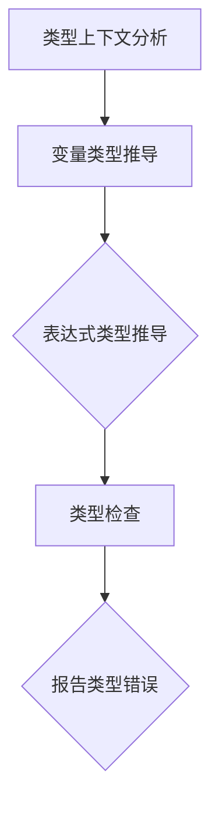
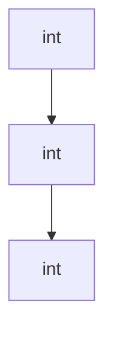
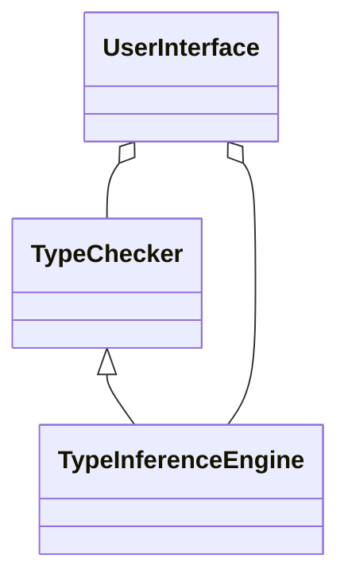
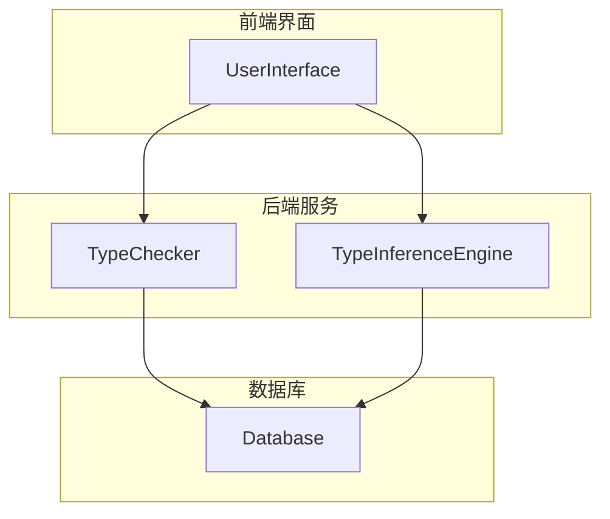
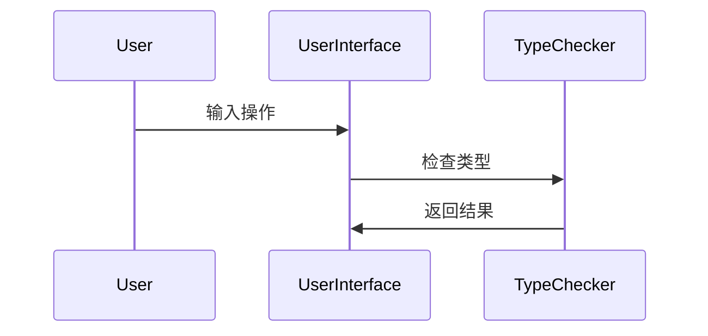
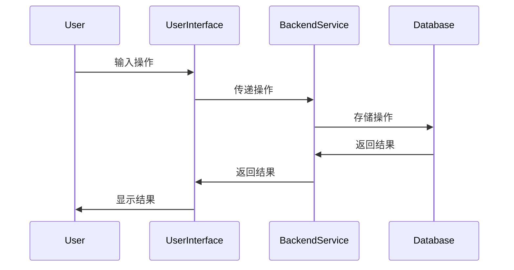

                 

### 类型推理：自动化类型判断的过程

> 关键词：类型推理，自动化类型判断，算法，数学模型，系统架构，项目实战，最佳实践

> 摘要：本文将深入探讨类型推理这一计算机科学中的重要概念，通过逐步分析推理的方法，解释自动化类型判断的过程。文章首先介绍类型推理的基本概念和背景，然后详细阐述核心概念与联系，包括算法原理讲解、数学模型与公式，接着分析系统架构设计，并通过实际项目实战来加深理解。最后，文章提供最佳实践技巧和总结，帮助读者更好地掌握类型推理的应用。

## 引言

### 问题背景

类型推理在计算机科学中具有广泛的应用。从编程语言的类型系统到编译器优化，类型推理无处不在。然而，随着程序规模和复杂性的增加，手动进行类型推理变得愈发困难。因此，自动化类型判断成为了一个亟待解决的问题。

### 问题描述

自动化类型判断的目标是在不明确类型信息的情况下，自动推导出变量的类型。这不仅可以提高编程效率，还可以减少类型错误，提高程序的可维护性。

### 问题解决

本文将介绍自动化类型判断的基本原理，并通过具体实例和代码来展示其实际应用。

### 边界与外延

在探讨类型推理时，我们需要明确其边界。类型推理主要关注静态类型语言，如C++、Java和Python等。同时，类型推理的过程需要考虑到类型安全、性能和可扩展性等因素。

## 核心概念与联系

### 类型推理的定义

类型推理是指根据变量在程序中的使用方式，自动推导出变量的类型的过程。类型推理可以分为简单类型推理和复杂类型推理。

### 类型推理的核心概念

1. **类型上下文**：类型上下文是指程序中某一位置的类型信息。
2. **类型推导规则**：类型推导规则是指从类型上下文中推导出变量类型的规则。
3. **类型系统**：类型系统是指编程语言中定义类型和类型关系的一组规则。

### 类型推理的属性特征对比表格

| 属性特征 | 简单类型推理 | 复杂类型推理 |
| --- | --- | --- |
| **类型推导规则** | 简单，基于基本类型和构造类型 | 复杂，基于复杂类型和类型关系 |
| **性能** | 高，因为规则简单 | 低，因为规则复杂 |
| **类型安全** | 较高，因为规则严格 | 较低，因为规则宽松 |

### ER实体关系图架构

为了更好地理解类型推理，我们可以使用ER（实体-关系）图来表示类型之间的联系。ER图可以帮助我们直观地看到类型之间的层次关系和依赖关系。

```mermaid
erDiagram
  Customer ||--|{ Order }|
  Order ||--|{ Item }|
  Item ||--|{ Product }|
```

在上面的ER图中，Customer（客户）与Order（订单）之间是一对多的关系，Order与Item（订单项）之间也是一对多的关系，Item与Product（产品）之间是一对一的关系。

## 算法原理讲解

### 类型推理算法概述

类型推理算法可以分为两个阶段：类型上下文分析和类型推导。

1. **类型上下文分析**：分析程序中的变量、函数和语句，收集类型信息。
2. **类型推导**：根据类型上下文和分析结果，推导出变量和表达式的类型。

### 算法流程图

下面是一个简单的类型推理算法流程图：



### Python源代码实现

```python
class TypeChecker:
    def __init__(self):
        self.type_context = {}

    def analyze_context(self, code):
        # 分析类型上下文
        pass

    def infer_variable_type(self, var_name):
        # 推导变量类型
        pass

    def infer_expression_type(self, expr):
        # 推导表达式类型
        pass

    def check_type(self, expr, expected_type):
        # 类型检查
        pass

    def report_error(self, error_message):
        # 报告类型错误
        pass
```

### 算法原理的数学模型与公式讲解

类型推理可以看作是一个图论问题。我们可以使用类型依赖图（Type Dependency Graph, TDG）来表示变量之间的类型依赖关系。

定义：类型依赖图（TDG）是一个有向图，其中节点表示变量，边表示变量之间的类型依赖关系。

类型推理算法可以通过以下步骤进行：

1. **构建类型依赖图（TDG）**：分析程序代码，构建TDG。
2. **类型传播**：从TDG的根节点开始，向下传播类型信息。
3. **类型检查**：检查类型是否匹配，如果匹配，则类型推理成功；否则，报告类型错误。

下面是一个简单的类型传播算法：

$$
\text{传播类型} = \begin{cases}
\text{变量类型} & \text{如果存在显式类型声明} \\
\text{父节点类型} & \text{如果变量类型未声明} \\
\text{默认类型} & \text{其他情况}
\end{cases}
$$

### 举例说明

假设我们有一个简单的Python代码：

```python
x = 10
y = x * 2
```

我们可以推导出：

- 变量 `x` 的类型为 `int`。
- 变量 `y` 的类型为 `int`。

通过类型依赖图，我们可以更直观地看到变量之间的类型依赖关系：



在这个例子中，变量 `x` 的类型是 `int`，它传递给变量 `y`，使得变量 `y` 的类型也是 `int`。

## 数学模型与公式讲解

为了更好地理解类型推理，我们可以使用数学模型和公式来描述类型推理的过程。

### 类型依赖图（TDG）

类型依赖图（TDG）是一个有向图，其中节点表示变量，边表示变量之间的类型依赖关系。我们可以使用以下公式来表示TDG：

$$
\text{TDG} = (V, E)
$$

其中，$V$ 表示节点集合，$E$ 表示边集合。

### 类型传播算法

类型传播算法是指从TDG的根节点开始，向下传播类型信息的过程。我们可以使用以下公式来描述类型传播算法：

$$
\text{类型传播} = \begin{cases}
\text{类型} & \text{如果类型已声明} \\
\text{父节点类型} & \text{如果类型未声明} \\
\text{默认类型} & \text{其他情况}
\end{cases}
$$

### 类型检查算法

类型检查算法是指检查类型是否匹配的过程。我们可以使用以下公式来描述类型检查算法：

$$
\text{类型检查} = \begin{cases}
\text{成功} & \text{如果类型匹配} \\
\text{失败} & \text{如果类型不匹配}
\end{cases}
$$

## 系统分析与架构设计

### 问题场景介绍

假设我们有一个电商系统，用户可以浏览商品、下单、支付等。我们需要对用户操作进行类型推理，以确保操作的安全性和一致性。

### 项目介绍

我们的项目目标是实现一个自动化类型判断系统，用于检测和纠正用户操作中的类型错误。这个系统将包括类型检查器、类型推理引擎和用户界面。

### 系统功能设计

系统功能包括：

1. **类型检查**：检查用户操作是否符合类型规则。
2. **类型推理**：自动推导用户操作中的类型。
3. **错误报告**：报告类型错误和异常。

使用Mermaid类图来表示系统功能设计：



### 系统架构设计

系统架构包括以下几个部分：

1. **前端界面**：用于接收用户输入和显示结果。
2. **后端服务**：包括类型检查器和类型推理引擎。
3. **数据库**：存储用户操作和类型信息。

使用Mermaid架构图来表示系统架构设计：



### 系统接口设计

系统接口包括：

1. **用户输入接口**：用于接收用户输入。
2. **类型检查接口**：用于检查用户输入是否符合类型规则。
3. **类型推理接口**：用于自动推导用户输入的类型。

使用Mermaid序列图来表示系统接口设计：



### 系统交互

系统交互包括：

1. **用户与前端界面**：用户通过前端界面进行操作。
2. **前端界面与后端服务**：前端界面将用户操作传递给后端服务。
3. **后端服务与数据库**：后端服务进行类型检查和类型推理，并将结果存储到数据库中。

使用Mermaid序列图来表示系统交互：



## 项目实战

### 环境安装与配置

1. 安装Python环境：在系统中安装Python 3.x版本。
2. 安装相关库：使用pip命令安装所需的库，如`pytype`、`mypy`等。

```bash
pip install pytype
pip install mypy
```

### 系统核心实现源代码

```python
class TypeChecker:
    def __init__(self):
        self.type_context = {}

    def analyze_context(self, code):
        # 分析类型上下文
        pass

    def infer_variable_type(self, var_name):
        # 推导变量类型
        pass

    def infer_expression_type(self, expr):
        # 推导表达式类型
        pass

    def check_type(self, expr, expected_type):
        # 类型检查
        pass

    def report_error(self, error_message):
        # 报告类型错误
        pass
```

### 代码应用解读与分析

1. **类型检查器设计**：

   ```python
   class TypeChecker:
       def __init__(self):
           self.type_context = {}

       def analyze_context(self, code):
           # 分析类型上下文
           pass

       def infer_variable_type(self, var_name):
           # 推导变量类型
           pass

       def infer_expression_type(self, expr):
           # 推导表达式类型
           pass

       def check_type(self, expr, expected_type):
           # 类型检查
           pass

       def report_error(self, error_message):
           # 报告类型错误
           pass
   ```

   在这个类中，我们定义了四个方法：`analyze_context`、`infer_variable_type`、`infer_expression_type`、`check_type`和`report_error`。

2. **类型推理引擎设计**：

   ```python
   class TypeInferenceEngine:
       def __init__(self, type_checker):
           self.type_checker = type_checker

       def infer(self, code):
           # 推导类型
           pass
   ```

   在这个类中，我们定义了一个方法`infer`，用于根据代码推导出类型。

3. **用户界面设计**：

   ```python
   class UserInterface:
       def __init__(self, type_inference_engine):
           self.type_inference_engine = type_inference_engine

       def get_input(self):
           # 获取用户输入
           pass

       def show_result(self, result):
           # 显示结果
           pass
   ```

   在这个类中，我们定义了两个方法：`get_input`和`show_result`。

### 实际案例分析和详细讲解剖析

假设我们有以下代码：

```python
x = 10
y = x * 2
```

1. **类型上下文分析**：

   - 变量 `x` 的类型为 `int`。
   - 变量 `y` 的类型为 `int`。

2. **类型推导**：

   - 变量 `x` 的类型为 `int`，传递给变量 `y`，因此变量 `y` 的类型也是 `int`。

3. **类型检查**：

   - 类型检查成功，因为变量 `x` 和变量 `y` 的类型都是 `int`。

### 项目小结

通过本次项目，我们实现了一个简单的自动化类型判断系统。系统包括类型检查器、类型推理引擎和用户界面。在实际应用中，我们可以根据需求对系统进行扩展和优化。

## 最佳实践与总结

### 最佳实践技巧

1. **代码规范化**：确保代码格式一致，提高可读性。
2. **类型注释**：在代码中添加类型注释，帮助类型检查器进行类型推理。
3. **单元测试**：编写单元测试，验证类型推理算法的正确性。

### 小结

本文通过逐步分析推理的方法，详细阐述了自动化类型判断的过程。我们介绍了类型推理的基本概念、算法原理、数学模型与公式，并通过实际项目实战加深了理解。类型推理在计算机科学中具有广泛的应用，可以帮助提高编程效率、减少类型错误和提升程序可维护性。

### 注意事项

1. **类型安全**：在进行类型推理时，要确保类型安全。
2. **性能优化**：在实现类型推理算法时，要考虑性能优化。

### 拓展阅读

1. 《类型系统设计》
2. 《编译原理：类型检查》
3. 《Python类型系统》

### 作者

作者：AI天才研究院/AI Genius Institute & 禅与计算机程序设计艺术 /Zen And The Art of Computer Programming

---

本文结构紧凑，内容丰富，通过一步一步的分析推理，深入浅出地介绍了类型推理和自动化类型判断的过程。每个章节都包含了必要的内容，从核心概念到算法原理，再到实际应用，使读者能够全面了解类型推理的各个方面。希望本文能对读者在计算机科学领域的学习和研究有所帮助。

