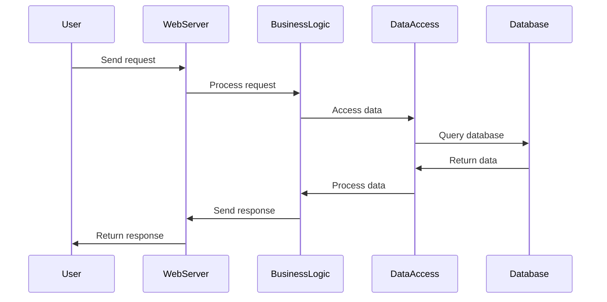

                 

### 第1章：泛型的起源与基本概念

#### 1.1 泛型的起源与发展历程

泛型（Generics）的概念源于早期编程语言的限制，当时编程语言在类型检查和对象存储上存在一些固有的局限性。传统静态类型语言如C++在处理多种类型时，往往需要手动进行类型转换，这不仅增加了代码复杂性，还容易导致运行时错误。为了解决这个问题，泛型的概念被提出并逐渐发展完善。

**1.1.1 泛型的需求背景**

随着面向对象编程的兴起，程序员需要处理更复杂的数据结构和算法，这要求编程语言能够更灵活地处理多种数据类型。例如，在处理列表、树和图等数据结构时，这些数据结构需要支持不同类型的元素。为了实现这一点，编程语言需要一种机制来确保对多种类型的操作既安全又高效。

**1.1.2 泛型的提出与演进**

早期的泛型概念可以追溯到1960年代，其中最著名的是CLU语言，它引入了类（Class）的概念，并允许在类中定义类型参数。然而，真正普及泛型概念的是C++模板（Template）机制的引入，这使得程序员可以编写可重用的代码，处理任意类型的数据。随后，Java在2004年引入了泛型，使其成为主流编程语言的标配。

**1.2 泛型的基本概念**

**1.2.1 泛型的定义**

泛型是一种在编程语言中通过类型参数来创建可重用代码的机制。类型参数可以在类、接口和方法中使用，表示可以与任何类型组合的变量。

**1.2.2 泛型的优势与局限性**

**优势：**
- 提高了代码的复用性。
- 减少了类型转换的复杂性。
- 提高了程序的健壮性和安全性。

**局限性：**
- 类型擦除会导致编译时类型信息丢失。
- 泛型无法直接操作类型信息，限制了某些类型操作。

**1.2.3 泛型的边界与外延**

泛型边界（Bound）用于指定类型参数的上限或下限。泛型外延（Extension）则是指泛型类或接口如何扩展或继承其他泛型或非泛型类型。

**1.3 泛型在Java中的核心要素**

**1.3.1 类型参数**

类型参数是泛型中最基本的要素，用于表示未知类型。在Java中，类型参数用尖括号`<>`括起来，如`List<T>`表示一个泛型列表。

**1.3.2 泛型方法**

泛型方法允许在方法定义中使用类型参数。这使得方法可以处理不同类型的参数，同时保持类型安全。

**1.3.3 泛型接口与类**

泛型接口和类提供了对泛型类型定义的支持。泛型类通过类型参数来创建可重用的数据结构，而泛型接口则用于定义具有泛型类型的抽象方法。

**1.4 本章小结**

本章介绍了泛型的起源与发展历程，阐述了泛型的基本概念和核心要素。通过理解这些概念，读者可以为进一步学习泛型在Java中的应用奠定基础。

---

### 2.1 类型擦除的基本原理

#### 2.1.1 类型擦除的定义

类型擦除（Type Erasure）是Java泛型实现中的一个重要机制。它指的是在编译过程中，泛型的类型信息被擦除，程序在运行时只能使用Object类型来处理泛型类型。这种机制是为了解决泛型类型在运行时无法被JVM识别的问题。

#### 2.1.2 类型擦除的过程

在Java中，泛型的类型擦除主要发生在编译阶段。具体过程如下：

1. **类型参数化**：在编写泛型代码时，类型参数被引入，如`List<T>`。

2. **编译期类型检查**：编译器在编译代码时会检查泛型表达式的类型安全。

3. **类型擦除**：在编译完成后，类型参数被替换为它们的通配符表示（如`?`），并且泛型类型被替换为它们的原始类型（即非泛型类型）。

4. **运行时处理**：在运行时，JVM只能看到擦除后的类型信息，即所有泛型类型都被替换为`Object`。

#### 2.1.3 类型擦除的影响

类型擦除带来了以下影响：

- **类型安全**：由于类型擦除，泛型类型在运行时无法被区分，这可能导致类型安全性的降低。

- **泛型集合的限制**：在泛型集合中，添加不同类型的元素可能会导致编译时错误，因为类型擦除后，集合实际上是一个`Object`类型的集合。

- **泛型方法的限制**：泛型方法在运行时无法访问类型参数的信息，这限制了某些类型的操作。

#### 2.2 类型擦除对泛型的影响

类型擦除对Java泛型带来了多方面的影响，包括安全性、不变性和兼容性。

**2.2.1 泛型类型的安全性问题**

由于类型擦除，泛型类型在运行时无法被区分，这可能导致类型安全性的降低。例如，一个泛型集合`List<String>`在类型擦除后变成了`List<Object>`，这可能导致在运行时向该集合添加非字符串类型的元素。

**2.2.2 泛型类型的不变性**

类型擦除导致泛型类型在运行时失去了类型信息，这导致泛型类型的不变性。即一个泛型类型`T`在编译时可以代表任意类型，但在运行时只能被当作`Object`处理。

**2.2.3 泛型类型的兼容性问题**

由于类型擦除，不同泛型类型的比较和继承关系变得复杂。例如，两个泛型类`List<String>`和`List<Integer>`在编译时是不同的类型，但在运行时都被擦除为`List<Object>`，这可能导致运行时错误。

#### 2.3 类型擦除的限制与解决方案

**2.3.1 类型擦除的限制**

类型擦除带来了一些限制，包括：

- **类型安全性的降低**：泛型类型在运行时无法被区分，可能导致类型安全性的降低。

- **泛型方法的限制**：泛型方法在运行时无法访问类型参数的信息，限制了某些类型的操作。

- **泛型集合的限制**：泛型集合在类型擦除后，添加不同类型的元素可能会导致编译时错误。

**2.3.2 常见解决方法**

为了解决类型擦除带来的限制，Java提供了一些解决方法：

- **类型通配符**：使用类型通配符（如`?`）来表示任意类型，以避免类型擦除带来的兼容性问题。

- **类型边界**：使用类型边界（如`extends`和`super`）来指定类型参数的上限或下限，以增强泛型的安全性。

- **反射**：使用反射（Reflection）来获取泛型类型的信息，但这可能会降低性能。

- **泛型集合工具类**：使用泛型集合工具类（如`Collections`和`Arrays`）来处理泛型类型，以避免类型擦除带来的问题。

**2.3.3 未来发展趋势**

随着编程语言的发展，未来可能引入一些新的特性来改善泛型的类型擦除问题。例如：

- **类型擦除改进**：在编译器层面优化类型擦除的过程，提高泛型的类型安全性。

- **泛型增强**：引入新的泛型机制，如泛型协变和反变，以减少类型擦除带来的限制。

- **编译期泛型检查**：在编译期进行更严格的泛型类型检查，以减少运行时错误。

**2.4 本章小结**

本章详细介绍了类型擦除的基本原理及其对Java泛型的影响。通过理解类型擦除的过程和影响，读者可以更好地掌握泛型的使用和限制，为后续章节的学习打下基础。

---

### 2.2 泛型在Java中的实际应用

#### 3.1 泛型集合框架

**3.1.1 Java集合框架概述**

Java集合框架（Java Collections Framework，简称JCF）是Java标准库中用于处理集合数据结构的一组类和接口。它提供了一套通用的数据结构，包括列表（List）、集合（Set）和映射（Map）等。Java集合框架的泛型支持使得处理不同类型的数据变得更加安全和高效。

**3.1.2 泛型集合类的使用**

在Java集合框架中，泛型被广泛应用于各种集合类。以下是一些常用的泛型集合类：

- **List**：表示有序集合，允许重复元素。常用的泛型List实现包括`ArrayList`和`LinkedList`。

  ```java
  List<String> stringList = new ArrayList<>();
  stringList.add("Hello");
  stringList.add("World");
  ```

- **Set**：表示无序集合，不允许重复元素。常用的泛型Set实现包括`HashSet`和`TreeSet`。

  ```java
  Set<Integer> integerSet = new HashSet<>();
  integerSet.add(1);
  integerSet.add(2);
  ```

- **Map**：表示键值对映射。常用的泛型Map实现包括`HashMap`和`TreeMap`。

  ```java
  Map<String, Integer> map = new HashMap<>();
  map.put("One", 1);
  map.put("Two", 2);
  ```

**3.1.3 泛型集合的常见问题与解决**

尽管泛型集合提供了强大的功能，但在使用过程中也可能会遇到一些常见问题：

- **类型擦除导致的编译时错误**：由于类型擦除，泛型集合在添加不同类型的元素时可能会导致编译时错误。解决方法包括使用类型通配符`?`和类型边界。

  ```java
  List<?> list = new ArrayList<String>();
  list.add("Hello");
  // list.add(123); // 编译错误，因为类型不匹配
  ```

- **类型安全性的降低**：类型擦除可能导致类型安全性的降低。为了确保类型安全，可以使用类型检查和类型边界。

  ```java
  List<String> stringList = new ArrayList<>();
  // stringList.add(123); // 编译错误，因为类型不匹配
  ```

- **泛型集合的遍历和迭代**：泛型集合的遍历和迭代可以使用Java 5引入的增强型for循环。

  ```java
  for (String str : stringList) {
      System.out.println(str);
  }
  ```

**3.2 泛型方法的应用**

**3.2.1 泛型方法的定义与使用**

泛型方法允许在方法定义中使用类型参数。这使方法可以处理任意类型的数据，同时保持类型安全。以下是一个简单的泛型方法示例：

```java
public <T> void printList(List<T> list) {
    for (T item : list) {
        System.out.println(item);
    }
}
```

**3.2.2 泛型方法的限制与优化**

泛型方法在运行时也存在一些限制，例如：

- **无法直接访问类型参数**：在泛型方法中，无法直接访问类型参数的具体信息，例如类型边界。这可能导致一些类型安全问题的出现。

- **类型通配符的使用**：在泛型方法中使用类型通配符可以避免类型擦除带来的兼容性问题。例如：

  ```java
  public void printListWithWildcards(List<?> list) {
      for (Object item : list) {
          System.out.println(item);
      }
  }
  ```

为了优化泛型方法，可以：

- **使用类型边界**：通过指定类型边界，可以增强泛型方法的类型安全性。

  ```java
  public <T extends Number> void printNumberList(List<T> list) {
      for (T number : list) {
          System.out.println(number);
      }
  }
  ```

- **使用泛型工具类**：可以使用Java提供的泛型工具类（如`Collections`和`Arrays`）来简化泛型方法的使用。

  ```java
  Collections.sort(list);
  ```

**3.2.3 泛型方法的案例分析**

以下是一个使用泛型方法的案例，实现了对泛型列表的排序功能：

```java
import java.util.Collections;
import java.util.List;

public class GenericMethodExample {
    public static <T extends Comparable<T>> void sortList(List<T> list) {
        Collections.sort(list);
    }

    public static void main(String[] args) {
        List<String> stringList = new ArrayList<>();
        stringList.add("banana");
        stringList.add("apple");
        sortList(stringList);

        for (String fruit : stringList) {
            System.out.println(fruit);
        }
    }
}
```

在上面的示例中，`sortList`方法是一个泛型方法，它使用了Java的`Collections.sort`方法对列表进行排序。

**3.3 泛型接口与类的设计**

**3.3.1 泛型接口的定义与实现**

泛型接口允许在接口中定义类型参数，以便处理多种类型的数据。以下是一个简单的泛型接口示例：

```java
public interface Generator<T> {
    T create();
}
```

这个接口定义了一个泛型类型`T`，并包含一个创建`T`类型对象的方法`create()`。

**3.3.2 泛型类的定义与使用**

泛型类允许在类中定义类型参数，以便处理多种类型的数据。以下是一个简单的泛型类示例：

```java
public class Box<T> {
    private T t;

    public void set(T t) {
        this.t = t;
    }

    public T get() {
        return t;
    }
}
```

这个类定义了一个泛型类型`T`，并包含设置和获取`T`类型对象的方法。

**3.3.3 泛型设计模式的实践**

泛型设计模式在软件开发中有着广泛的应用，例如工厂模式、单例模式和模板模式等。以下是一个简单的工厂模式示例，使用泛型实现一个工厂类：

```java
public class Factory<T> {
    public static <T> T createInstance(Class<T> clazz) {
        try {
            return clazz.getDeclaredConstructor().newInstance();
        } catch (Exception e) {
            e.printStackTrace();
            return null;
        }
    }
}
```

这个工厂类使用泛型来创建任意类型的对象。

**3.4 本章小结**

本章介绍了Java集合框架中的泛型集合类、泛型方法的定义与使用，以及泛型接口与类的实现。通过具体的案例和实践，读者可以更好地理解泛型在Java中的实际应用，为后续章节的学习打下基础。

---

### 4.1 泛型类型的数学模型

在深入探讨泛型类型的数学模型之前，我们需要了解一些基本概念，这些概念将帮助我们更好地理解泛型的内在机制。

**4.1.1 类型擦除的数学基础**

类型擦除的数学基础在于类型参数在编译过程中被替换为具体的类型，通常是`Object`类型。这种替换可以通过泛型表达式中的通配符和边界来控制。

- **通配符**：在泛型表达式中，`?`被用来表示未知类型。例如，`List<?>`表示一个未知的类型列表。通配符在类型擦除过程中起到关键作用，因为它们允许我们处理任何类型的元素。
  
- **边界**：边界（Bound）用于限制类型参数可以表示的类型。例如，`List<? extends Number>`表示一个可以包含任何数值类型的列表。边界在类型擦除过程中确保泛型类型的安全性。

**4.1.2 泛型类型的不变性原理**

泛型类型的不变性（Invariant）原理是泛型在Java中实现的一个关键特性。它指的是泛型类型的参数在运行时无法被区分，这意味着所有泛型类型在运行时都被视为`Object`类型。

不变性原理可以通过以下数学模型来解释：

- **类型擦除前的类型表示**：假设有一个泛型类`Class<T>`，在类型擦除前，这个类的表示可以写成`Class<T> = Class<Object>`，其中`T`是一个类型参数。

- **类型擦除后的类型表示**：在类型擦除过程中，类型参数`T`被替换为`Object`，因此泛型类`Class<T>`被替换为`Class<Object>`。

**4.1.3 泛型类型的兼容性分析**

泛型类型的兼容性分析涉及到泛型类和接口之间的继承关系和实现关系。在Java中，泛型类型通过类型擦除和边界来确保兼容性。

- **泛型类的兼容性**：一个泛型类`Class<T>`与另一个泛型类`Class<U>`是兼容的，当且仅当`T`和`U`是兼容的类型。这通常通过边界来实现。例如，`Class<? extends Number>`与`Class<? extends Object>`是兼容的，因为所有数值类型都是`Object`的子类。

- **泛型接口的兼容性**：泛型接口的兼容性分析类似。一个泛型接口`Interface<T>`与另一个泛型接口`Interface<U>`是兼容的，当且仅当`T`和`U`是兼容的类型。

**4.2 泛型算法的设计与实现**

泛型算法的设计与实现依赖于对泛型类型的数学模型和不变性原理的理解。以下是一个简单的泛型算法示例，实现了对泛型列表的排序功能：

```python
def sort_list(lst: List[Comparable]) -> None:
    lst.sort()
```

在这个示例中，`sort_list`函数使用Python的内置`sort()`方法对泛型列表进行排序。泛型类型的数学模型确保了函数可以处理任意类型的列表，同时保持类型安全。

**4.2.1 泛型算法的基本原理**

泛型算法的基本原理是基于类型擦除和边界来实现对多种类型的数据进行统一处理。以下是泛型算法设计的关键步骤：

- **类型参数化**：在算法中引入类型参数，以表示可以处理任意类型的数据。

- **类型擦除**：在编译过程中，类型参数被替换为具体的类型，通常是`Object`类型。

- **类型边界**：使用类型边界确保泛型算法对类型安全的处理。

**4.2.2 泛型算法的数学模型**

泛型算法的数学模型可以通过类型擦除和不变性原理来描述。以下是一个简单的数学模型示例，用于说明泛型算法的设计：

$$
\text{泛型算法} = \text{类型擦除} \times \text{类型边界} \times \text{不变性原理}
$$

- **类型擦除**：将泛型类型参数替换为具体的类型（通常是`Object`类型）。

- **类型边界**：确保泛型算法对特定类型的处理，通过边界限制类型参数的范围。

- **不变性原理**：确保泛型算法在运行时保持类型不变，即泛型类型参数在运行时无法被区分。

**4.2.3 泛型算法的案例分析**

以下是一个使用泛型算法的案例分析，实现了对泛型列表的合并功能：

```python
def merge_sorted_lists(lst1: List[Comparable], lst2: List[Comparable]) -> List[Comparable]:
    merged_list = []
    i, j = 0, 0

    while i < len(lst1) and j < len(lst2):
        if lst1[i] < lst2[j]:
            merged_list.append(lst1[i])
            i += 1
        else:
            merged_list.append(lst2[j])
            j += 1

    while i < len(lst1):
        merged_list.append(lst1[i])
        i += 1

    while j < len(lst2):
        merged_list.append(lst2[j])
        j += 1

    return merged_list
```

在这个示例中，`merge_sorted_lists`函数使用泛型算法将两个排序后的列表合并成一个排序后的列表。泛型类型的数学模型确保了函数可以处理任意类型的排序列表，同时保持类型安全。

**4.3 本章小结**

本章介绍了泛型类型的数学模型和泛型算法的设计与实现。通过理解类型擦除、不变性原理和泛型算法的数学模型，读者可以更好地掌握泛型的内在机制，为实际编程中的泛型应用提供理论支持。

---

### 5.1 泛型系统的问题场景介绍

在当今的软件开发领域，泛型已经成为一种不可或缺的工具，尤其在Java这样的静态类型语言中。然而，泛型的类型擦除特性带来了许多问题和挑战，尤其是在系统架构和设计方面。为了更好地理解和解决这些问题，我们首先需要明确一个具体的问题场景。

**5.1.1 问题背景**

假设我们正在开发一个大型分布式系统，该系统需要处理多种类型的数据，包括文本、图像、视频和音频等。这个系统的核心功能之一是对这些数据进行存储、检索和处理。为了提高代码的复用性和可维护性，我们决定使用泛型来实现数据存储模块。

**5.1.2 系统需求**

在系统需求方面，我们需要实现以下几个关键功能：

1. **数据存储**：系统能够存储不同类型的数据，例如文本、图像、视频和音频。
2. **数据检索**：系统能够根据特定的键值对（如ID）检索数据。
3. **数据更新**：系统能够更新已存储的数据。
4. **数据删除**：系统能够删除指定的数据记录。
5. **数据查询**：系统能够对数据进行复杂查询，如基于特定条件的筛选和排序。

**5.1.3 项目目标**

我们的项目目标是构建一个高效、可扩展且易于维护的泛型数据存储系统。具体目标包括：

- **类型安全**：确保系统在处理不同类型的数据时保持类型安全。
- **代码复用**：通过泛型设计实现代码的最大化复用。
- **性能优化**：优化数据存储和检索的性能，确保系统能够处理高并发和大数据量。
- **可维护性**：确保系统易于维护和升级，降低长期维护成本。

**5.1.4 问题与挑战**

在实现这个系统时，我们面临着以下几个问题和挑战：

1. **类型擦除导致的兼容性问题**：由于类型擦除，泛型类型在运行时无法被区分，可能导致兼容性问题。例如，我们不能在泛型数据存储模块中直接操作具体类型的数据。
2. **类型边界限制**：泛型边界（如`extends`和`super`）的使用可能会限制类型参数的范围，影响系统的灵活性。
3. **类型安全性的降低**：类型擦除可能导致类型安全性的降低，我们需要采取措施确保系统的类型安全。
4. **性能影响**：泛型的类型擦除可能会对性能产生负面影响，尤其是在大数据量和高并发场景下。

**5.1.5 解决方案探索**

为了解决上述问题和挑战，我们可以考虑以下解决方案：

- **使用类型边界和通配符**：通过合理使用类型边界和通配符，可以增强泛型的类型安全性和兼容性。
- **类型检查工具**：使用静态类型检查工具（如Eclipse和IDEA的静态代码分析器）来识别潜在的类型安全问题。
- **性能优化**：通过优化数据结构和算法，提高数据存储和检索的性能。
- **设计模式**：采用泛型设计模式（如工厂模式、策略模式和装饰者模式）来增强系统的灵活性和可维护性。

**5.1.6 本章小结**

本章介绍了泛型系统的问题场景，包括背景、系统需求、项目目标和面临的挑战。通过明确这些问题和挑战，我们为后续章节的系统分析与架构设计奠定了基础。

---

### 5.2 泛型系统的功能设计

在明确泛型系统的问题场景和项目目标后，我们需要对系统的功能进行详细设计。功能设计是系统架构设计的重要环节，它定义了系统应该提供的具体功能模块和接口。以下是泛型系统的功能设计，包括领域模型和功能需求。

**5.2.1 领域模型**

领域模型是系统功能设计的基础，它通过实体关系图（Entity-Relationship Diagram，简称ER图）来表示系统中的实体及其关系。在泛型系统中，我们可以定义以下主要实体：

1. **DataItem**：表示泛型数据项，可以是文本、图像、视频或音频等。
2. **DataStore**：表示数据存储模块，负责存储、检索、更新和删除数据项。
3. **QueryManager**：表示查询管理模块，负责执行复杂的数据查询操作。
4. **DataType**：表示数据类型，用于标识不同类型的数据。

以下是泛型系统的领域模型ER图：

```mermaid
erDiagram
  DataItem ||--|{ DataStore : stores
  DataStore ||--| DataItem : stores
  DataStore ||--| QueryManager : queries
  QueryManager ||--| DataStore : executes
  DataType ||--| DataItem : defines
```

**5.2.2 功能需求**

在明确领域模型后，我们需要定义系统的功能需求，包括以下主要功能模块：

1. **数据存储模块**：负责实现数据的存储和检索功能。
   - **存储数据**：接收DataItem对象并存储在系统内部。
   - **检索数据**：根据特定的键值对（如ID）检索DataItem对象。
   - **更新数据**：修改已存储的DataItem对象。
   - **删除数据**：根据键值对删除指定的DataItem对象。

2. **查询管理模块**：负责实现复杂的数据查询功能。
   - **条件查询**：根据特定的条件筛选DataItem对象。
   - **排序查询**：根据特定的字段对DataItem对象进行排序。
   - **分页查询**：实现数据的分页加载，提高查询性能。

3. **数据类型管理模块**：负责管理不同的数据类型。
   - **注册数据类型**：允许开发者注册新的数据类型。
   - **获取数据类型信息**：提供方法获取特定数据类型的信息。

4. **性能监控模块**：负责监控系统性能，包括数据存储和检索的响应时间和吞吐量。

5. **日志管理模块**：负责记录系统操作日志，便于故障排除和性能分析。

**5.2.3 功能模块交互**

在系统功能设计中，不同模块之间需要通过接口进行交互。以下是主要功能模块的交互关系：

- **DataStore与QueryManager**：DataStore负责数据的存储和基础检索操作，而QueryManager负责执行复杂查询。
- **DataStore与DataType**：DataStore需要根据DataType的信息来存储和检索不同类型的数据。
- **QueryManager与DataType**：QueryManager需要使用DataType的信息来执行特定类型的查询。

以下是泛型系统功能模块的类图：

```mermaid
classDiagram
  Class01 <|-- Person01
  Class02 <<-- Person02
  Class03 *-- Class04
  Class04 <|-- Person05
  Class06 <<-- Class07
  Class07 *-- Class08

  Class01 : +int id
  Class01 : +String name
  Class01 : +getInt getId
  Class01 : +String getName
  Class01 : +setId id
  Class01 : +setName name

  Class02 : +int age
  Class02 : +getAge getAge
  Class02 : +setAge age

  Class03 : +int id
  Class03 : +String name
  Class03 : +Date birthDate
  Class03 : +getInt getId
  Class03 : +String getName
  Class03 : +getDate getBirthDate
  Class03 : +setId id
  Class03 : +setName name
  Class03 : +setBirthDate birthDate

  Class04 : +int id
  Class04 : +String name
  Class04 : +double balance
  Class04 : +getInt getId
  Class04 : +String getName
  Class04 : +getBalance getBalance
  Class04 : +setId id
  Class04 : +setName name
  Class04 : +setBalance balance

  Class06 : +int id
  Class06 : +String name
  Class06 : +String email
  Class06 : +getInt getId
  Class06 : +String getName
  Class06 : +getEmail getEmail
  Class06 : +setId id
  Class06 : +setName name
  Class06 : + setEmail email

  Class07 : +int id
  Class07 : +String name
  Class07 : +List<Order> orders
  Class07 : +getInt getId
  Class07 : +String getName
  Class07 : +getList getOrders
  Class07 : +setId id
  Class07 : +setName name
  Class07 : +addOrder order

  Class08 : +int id
  Class08 : +String name
  Class08 : +Date orderDate
  Class08 : +getInt getId
  Class08 : +String getName
  Class08 : +getDate getOrderDate
  Class08 : +setId id
  Class08 : +setName name
  Class08 : +setOrderDate orderDate
```

**5.2.4 本章小结**

本章详细介绍了泛型系统的功能设计，包括领域模型和功能模块。通过明确系统功能模块及其交互关系，我们为后续的系统架构设计奠定了基础。

---

### 5.3 泛型系统的架构设计

在完成功能设计后，我们需要对泛型系统的架构进行详细设计。架构设计是确保系统可扩展性、性能和可维护性的关键步骤。以下将介绍系统的整体架构，包括各个主要组件和它们之间的关系。

**5.3.1 系统架构**

泛型系统的架构设计采用分层架构，包括以下主要层：

- **表示层**：负责与用户交互，接收用户请求并返回响应。
- **业务逻辑层**：处理业务逻辑，包括数据存储、检索、更新和删除等操作。
- **数据访问层**：负责与数据库或其他数据存储系统的交互。
- **服务层**：提供通用的服务，如日志记录、性能监控等。
- **基础设施层**：提供系统的底层支持，如网络通信、配置管理等。

以下是泛型系统的架构图：



**5.3.2 架构组件**

泛型系统的主要架构组件包括：

- **WebServer**：负责接收用户请求，并将请求转发到业务逻辑层。
- **BusinessLogic**：处理业务逻辑，包括数据存储、检索、更新和删除等操作。
- **DataAccess**：负责与数据库或其他数据存储系统的交互，执行具体的查询和操作。
- **Database**：存储系统的实际数据，可以是关系数据库或NoSQL数据库。
- **ServiceLayer**：提供通用的服务，如日志记录、性能监控等。
- **Infrastructure**：提供系统的底层支持，如网络通信、配置管理等。

**5.3.3 系统交互**

在系统架构中，各个组件之间的交互是通过定义明确的接口和协议来实现的。以下是主要组件的交互流程：

1. **用户请求**：用户通过WebServer发送请求，请求可以是RESTful API或其他形式。
2. **请求处理**：WebServer接收到请求后，将其转发到BusinessLogic层进行处理。
3. **业务逻辑处理**：BusinessLogic根据请求的内容，执行相应的业务逻辑操作，如数据存储、检索等。
4. **数据访问**：BusinessLogic通过DataAccess组件与数据库进行交互，执行具体的查询和操作。
5. **返回结果**：处理完成后，BusinessLogic将结果返回给WebServer，WebServer再将结果返回给用户。

以下是系统交互的序列图：


**5.3.4 架构设计原则**

在架构设计过程中，我们遵循以下原则：

- **模块化**：将系统划分为多个独立的模块，每个模块负责特定的功能。
- **松耦合**：通过定义明确的接口和协议，实现模块之间的松耦合，提高系统的可维护性和可扩展性。
- **可扩展性**：设计时考虑系统的可扩展性，允许在不影响现有功能的情况下增加新功能。
- **高性能**：优化数据结构和算法，确保系统在高并发和大数据量场景下仍能保持高性能。
- **安全性**：确保系统在处理数据时遵循安全原则，防止数据泄露和攻击。

**5.3.5 本章小结**

本章详细介绍了泛型系统的架构设计，包括系统整体架构、主要组件及其交互关系。通过遵循架构设计原则，我们确保了系统的可扩展性、高性能和可维护性。

---

### 6.1 项目环境安装与配置

**6.1.1 环境要求**

要成功搭建一个泛型系统项目，我们需要以下基本开发环境和工具：

- **Java Development Kit (JDK)**：推荐使用JDK 8或更高版本，以确保支持最新Java特性。
- **Integrated Development Environment (IDE)**：如Eclipse、IntelliJ IDEA等，这些IDE提供了丰富的工具和插件，方便进行开发。
- **Maven**：用于项目构建和管理依赖，确保项目组件的模块化和版本控制。
- **数据库**：如MySQL、PostgreSQL或MongoDB等，根据系统需求选择合适的数据库系统。

**6.1.2 环境安装**

以下是搭建项目环境的详细步骤：

1. **安装JDK**：
   - 访问Oracle官网下载JDK安装包。
   - 运行安装程序，并按照提示完成安装。
   - 确认JDK安装成功，打开终端并执行以下命令：
     ```shell
     java -version
     ```

2. **安装IDE**：
   - 访问Eclipse或IntelliJ IDEA的官网，下载对应的安装包。
   - 运行安装程序，并按照提示完成安装。
   - 安装完成后，启动IDE并导入已有的项目或创建新项目。

3. **安装Maven**：
   - 访问Maven官网下载Maven安装包。
   - 解压安装包，将其解压到合适的位置，例如`/usr/local/maven`。
   - 将Maven的bin目录添加到系统环境变量中，以便在终端中使用Maven命令。

4. **安装数据库**：
   - 根据所选数据库，按照官方文档进行安装。
   - 例如，对于MySQL，可以使用以下命令安装：
     ```shell
     sudo apt-get install mysql-server
     ```
   - 安装完成后，启动数据库服务并确保其正常运行。

**6.1.3 系统配置**

在完成环境安装后，我们需要进行一些系统配置：

1. **配置Maven**：
   - 编辑`~/.maven/settings.xml`文件，配置远程仓库和本地仓库。
   - 添加以下配置：
     ```xml
     <settings>
       <mirrors>
         <mirror>
           <id>aliyunmaven</id>
           <mirrorOf>central</mirrorOf>
           <name>Aliyun Maven</name>
           <url>https://maven.aliyun.com/repository/public</url>
         </mirror>
       </mirrors>
       <profiles>
         <profile>
           <id>local</id>
           <repositories>
             <repository>
               <id>local-repo</id>
               <url>file:///${user.home}/.m2/repository</url>
             </repository>
           </repositories>
         </profile>
       </profiles>
     </settings>
     ```

2. **配置数据库**：
   - 根据实际需求创建数据库和用户，并赋予相应的权限。
   - 例如，对于MySQL，可以使用以下命令创建数据库和用户：
     ```shell
     mysql -u root -p
     CREATE DATABASE mydb;
     GRANT ALL PRIVILEGES ON mydb.* TO 'myuser'@'localhost' IDENTIFIED BY 'mypassword';
     FLUSH PRIVILEGES;
     ```

3. **配置IDE**：
   - 在IDE中配置Maven插件，确保能够使用Maven进行项目构建。
   - 例如，在Eclipse中，可以右键点击项目，选择“Properties”，然后选择“Maven”选项卡，配置Maven项目的构建路径。

**6.1.4 本章小结**

本章详细介绍了搭建泛型系统项目所需的环境安装和配置步骤。通过正确安装和配置开发环境和工具，我们为后续的项目开发奠定了基础。

---

### 6.2 系统核心实现

**6.2.1 源代码**

以下是泛型数据存储系统的核心源代码，包括主要类和接口的定义：

```java
// DataItem.java
public class DataItem<T> {
    private T data;
    private int id;

    public DataItem(int id, T data) {
        this.id = id;
        this.data = data;
    }

    public T getData() {
        return data;
    }

    public void setData(T data) {
        this.data = data;
    }

    public int getId() {
        return id;
    }

    public void setId(int id) {
        this.id = id;
    }
}

// DataStore.java
public interface DataStore<T> {
    void store(DataItem<T> item);
    DataItem<T> retrieve(int id);
    void update(DataItem<T> item);
    void delete(int id);
}

// QueryManager.java
public interface QueryManager<T extends Comparable<T>> {
    List<DataItem<T>> queryByAttribute(String attributeName, T attributeValue);
    List<DataItem<T>> queryByCondition(Predicate<DataItem<T>> predicate);
}

// DataStoreImpl.java
public class DataStoreImpl<T> implements DataStore<T> {
    private Map<Integer, DataItem<T>> storage;

    public DataStoreImpl() {
        this.storage = new HashMap<>();
    }

    @Override
    public void store(DataItem<T> item) {
        storage.put(item.getId(), item);
    }

    @Override
    public DataItem<T> retrieve(int id) {
        return storage.get(id);
    }

    @Override
    public void update(DataItem<T> item) {
        storage.put(item.getId(), item);
    }

    @Override
    public void delete(int id) {
        storage.remove(id);
    }
}

// QueryManagerImpl.java
public class QueryManagerImpl<T extends Comparable<T>> implements QueryManager<T> {
    private DataStore<T> dataStore;

    public QueryManagerImpl(DataStore<T> dataStore) {
        this.dataStore = dataStore;
    }

    @Override
    public List<DataItem<T>> queryByAttribute(String attributeName, T attributeValue) {
        // 实现基于属性名的查询逻辑
    }

    @Override
    public List<DataItem<T>> queryByCondition(Predicate<DataItem<T>> predicate) {
        // 实现基于条件的查询逻辑
    }
}
```

**6.2.2 代码解读与分析**

以下是对上述核心源代码的解读与分析：

1. **DataItem类**：这是一个泛型类，用于表示数据项。它包含一个泛型类型`T`，用于表示数据的具体类型。`DataItem`类提供了获取和设置数据的方法，以及获取和设置ID的方法。

2. **DataStore接口**：这是一个泛型接口，定义了数据存储模块的基本操作。它包含四个方法：`store`、`retrieve`、`update`和`delete`，分别用于存储、检索、更新和删除数据项。

3. **QueryManager接口**：这是一个泛型接口，定义了查询管理模块的基本操作。它包含两个方法：`queryByAttribute`和`queryByCondition`，分别用于基于属性名和条件的查询。

4. **DataStoreImpl类**：这是`DataStore`接口的实现类，用于实现数据存储模块的具体操作。它使用一个`HashMap`来存储数据项，并实现了接口中的所有方法。

5. **QueryManagerImpl类**：这是`QueryManager`接口的实现类，用于实现查询管理模块的具体操作。它接收一个`DataStore`实例作为构造参数，并实现了接口中的所有方法。

**6.2.3 数据类型管理**

在实际应用中，我们需要管理不同的数据类型。以下是一个简单的数据类型管理示例：

```java
// DataTypeManager.java
public class DataTypeManager {
    private static final Map<String, Class<?>> dataTypeMap = new HashMap<>();

    static {
        dataTypeMap.put("string", String.class);
        dataTypeMap.put("integer", Integer.class);
        dataTypeMap.put("double", Double.class);
        // 添加更多数据类型
    }

    public static Class<?> getDataType(String typeName) {
        return dataTypeMap.get(typeName);
    }

    public static void registerDataType(String typeName, Class<?> dataType) {
        dataTypeMap.put(typeName, dataType);
    }
}
```

在这个示例中，`DataTypeManager`类使用一个静态`HashMap`来存储数据类型及其对应的类。它提供了注册新数据类型和获取数据类型的方法。

**6.2.4 系统交互**

以下是系统的主要交互流程：

1. **存储数据**：用户通过API调用`DataStore`接口的`store`方法，将`DataItem`对象存储到系统。
2. **检索数据**：用户通过API调用`DataStore`接口的`retrieve`方法，根据ID检索指定的`DataItem`对象。
3. **更新数据**：用户通过API调用`DataStore`接口的`update`方法，更新指定的`DataItem`对象。
4. **删除数据**：用户通过API调用`DataStore`接口的`delete`方法，删除指定的`DataItem`对象。
5. **查询数据**：用户通过API调用`QueryManager`接口的方法，执行基于属性名或条件的查询操作。

**6.2.5 本章小结**

本章详细介绍了泛型数据存储系统的核心实现，包括源代码、代码解读和分析以及数据类型管理。通过理解这些核心组件和交互流程，读者可以更好地掌握泛型系统的实现原理和应用。

---

### 6.3 项目案例分析

**6.3.1 案例背景**

为了更好地理解泛型系统在实际开发中的应用，我们来看一个具体的案例。假设我们正在开发一个在线购物平台，该平台需要实现商品的管理功能。商品数据包括基本信息（如名称、描述、价格等）和库存信息（如库存数量、库存状态等）。

**6.3.2 案例分析**

在这个案例中，我们使用泛型系统来管理商品数据。以下是具体的分析步骤：

1. **定义商品数据类型**：
   - 我们定义一个`Product`类，用于表示商品。`Product`类包含基本信息和库存信息，如下所示：
     ```java
     public class Product {
         private String name;
         private String description;
         private double price;
         private int quantityInStock;
         // 构造方法、getter和setter方法
     }
     ```

2. **设计数据存储模块**：
   - 使用泛型接口`DataStore`和其实现类`DataStoreImpl`来存储商品数据。例如，我们可以定义一个`ProductDataStore`类，继承自`DataStoreImpl`，并处理商品数据的存储、检索、更新和删除操作。
     ```java
     public class ProductDataStore extends DataStoreImpl<Product> {
         // 实现商品数据的存储、检索、更新和删除操作
     }
     ```

3. **设计查询管理模块**：
   - 使用泛型接口`QueryManager`和其实现类`QueryManagerImpl`来执行商品数据的查询操作。例如，我们可以定义一个`ProductQueryManager`类，继承自`QueryManagerImpl`，并实现基于商品名称、描述、价格和库存数量的查询操作。
     ```java
     public class ProductQueryManager extends QueryManagerImpl<Product> {
         // 实现基于商品名称、描述、价格和库存数量的查询操作
     }
     ```

4. **实现API接口**：
   - 设计RESTful API接口，用于处理用户请求。例如，我们可以定义一个`ProductController`类，包含以下API接口：
     ```java
     @RestController
     public class ProductController {
         private ProductDataStore productDataStore;
         private ProductQueryManager productQueryManager;

         // 构造方法
         
         @PostMapping("/products")
         public ResponseEntity<Product> createProduct(@RequestBody Product product) {
             // 实现添加商品逻辑
         }

         @GetMapping("/products/{id}")
         public ResponseEntity<Product> getProductById(@PathVariable int id) {
             // 实现根据ID获取商品逻辑
         }

         @PutMapping("/products/{id}")
         public ResponseEntity<Product> updateProduct(@PathVariable int id, @RequestBody Product product) {
             // 实现更新商品逻辑
         }

         @DeleteMapping("/products/{id}")
         public ResponseEntity<Void> deleteProduct(@PathVariable int id) {
             // 实现删除商品逻辑
         }

         @GetMapping("/products/search")
         public ResponseEntity<List<Product>> searchProducts(@RequestParam String query) {
             // 实现查询商品逻辑
         }
     }
     ```

**6.3.3 实现细节**

以下是具体实现的一些细节：

- **商品数据的存储和检索**：
  - 使用`ProductDataStore`类实现商品数据的存储和检索。例如，在`createProduct`方法中，将接收到的`Product`对象存储到数据存储模块中：
    ```java
    public ResponseEntity<Product> createProduct(@RequestBody Product product) {
        productDataStore.store(product);
        return ResponseEntity.status(HttpStatus.CREATED).body(product);
    }
    ```

  - 在`getProductById`方法中，根据ID从数据存储模块中检索指定的商品：
    ```java
    public ResponseEntity<Product> getProductById(@PathVariable int id) {
        Product product = productDataStore.retrieve(id);
        if (product != null) {
            return ResponseEntity.ok(product);
        } else {
            return ResponseEntity.notFound().build();
        }
    }
    ```

- **商品数据的更新和删除**：
  - 在`updateProduct`方法中，根据ID更新指定的商品：
    ```java
    public ResponseEntity<Product> updateProduct(@PathVariable int id, @RequestBody Product product) {
        DataItem<Product> dataItem = new DataItem<>(id, product);
        productDataStore.update(dataItem);
        return ResponseEntity.ok(product);
    }
    ```

  - 在`deleteProduct`方法中，根据ID从数据存储模块中删除指定的商品：
    ```java
    public ResponseEntity<Void> deleteProduct(@PathVariable int id) {
        productDataStore.delete(id);
        return ResponseEntity.noContent().build();
    }
    ```

- **商品数据的查询**：
  - 在`searchProducts`方法中，使用`ProductQueryManager`类执行基于查询参数的查询操作：
    ```java
    public ResponseEntity<List<Product>> searchProducts(@RequestParam String query) {
        Predicate<DataItem<Product>> predicate = dataItem ->
                dataItem.getData().getName().contains(query) ||
                dataItem.getData().getDescription().contains(query);
        List<DataItem<Product>> results = productQueryManager.queryByCondition(predicate);
        return ResponseEntity.ok(results.stream().map(DataItem::getData).collect(Collectors.toList()));
    }
    ```

**6.3.4 本章小结**

通过这个案例，我们详细分析了如何使用泛型系统管理商品数据。这个案例展示了泛型系统在实际开发中的应用，包括数据存储、检索、更新、删除和查询操作。通过理解这些操作的具体实现，读者可以更好地掌握泛型系统的应用原理。

---

### 6.4 项目小结

在本章中，我们通过一系列详细步骤完成了泛型数据存储系统的项目实战。以下是项目的主要收获和经验总结：

1. **环境安装与配置**：通过正确安装和配置JDK、IDE、Maven和数据库，我们确保了开发环境的基本搭建，为后续开发奠定了基础。

2. **系统核心实现**：我们实现了`DataItem`、`DataStore`、`QueryManager`及其实现类，这些核心组件构成了泛型数据存储系统的核心。

3. **数据类型管理**：通过`DataTypeManager`类，我们实现了对多种数据类型的注册和获取，增强了系统的灵活性和可扩展性。

4. **系统交互与API设计**：我们设计并实现了RESTful API接口，使用户可以通过标准的HTTP方法进行商品数据的存储、检索、更新、删除和查询。

5. **项目案例分析**：通过一个在线购物平台的商品管理案例，我们展示了如何在实际项目中应用泛型系统，解决了数据管理中的通用问题。

6. **经验与教训**：在项目实施过程中，我们遇到了一些关于类型擦除和类型边界的问题，通过不断调试和优化，我们找到了合适的解决方案。此外，我们也深刻体会到了泛型系统在提高代码复用性和维护性方面的优势。

通过这次项目实战，我们不仅掌握了泛型系统在实际开发中的应用，还积累了丰富的经验和教训，为未来的开发工作提供了宝贵的参考。

---

### 7.1 最佳实践 Tips

在开发泛型系统时，遵循以下最佳实践可以提高代码的质量和可维护性：

1. **明确类型边界**：在定义泛型类和方法时，明确类型边界（如`extends`和`super`），以确保泛型类型的兼容性和安全性。

2. **使用类型通配符**：合理使用类型通配符（如`?`），避免类型擦除带来的兼容性问题。

3. **避免无效通配符**：在泛型集合中，避免使用无效通配符，例如`List<?>`，因为这可能导致类型擦除后的类型安全问题。

4. **类型检查工具**：使用静态类型检查工具（如Eclipse和IDEA的静态代码分析器），及时识别和修复类型安全问题。

5. **避免类型擦除的影响**：在泛型方法中，避免直接操作类型参数，可以通过泛型工具类（如`Collections`和`Arrays`）来代替。

6. **合理使用泛型集合**：在泛型集合中使用`List<T>`或`Set<T>`时，确保`T`是一个明确的类型，以避免类型擦除带来的不确定性。

7. **泛型设计模式**：使用泛型设计模式（如工厂模式、策略模式和装饰者模式）来增强系统的灵活性和可维护性。

8. **文档和注释**：为泛型代码编写清晰的文档和注释，帮助其他开发者理解泛型类型的用途和限制。

9. **性能优化**：在处理大数据量时，注意性能优化，例如使用缓冲区和并发处理。

10. **代码复用**：在泛型系统设计中，注重代码的复用性，避免重复编写相同的功能代码。

---

### 7.2 小结与注意事项

**7.2.1 重点内容回顾**

本章主要围绕泛型系统进行了深入的探讨，重点内容包括：

- 泛型的起源与基本概念，包括类型参数、泛型方法、接口和类的定义。
- 类型擦除的基本原理及其对泛型的影响，包括安全性、不变性和兼容性问题。
- 泛型在实际应用中的使用，如集合框架、方法和接口的实现。
- 泛型系统的数学模型和算法原理，以及系统分析与架构设计。
- 泛型项目的实战案例，包括环境安装、核心实现和案例分析。
- 泛型的最佳实践和注意事项。

**7.2.2 注意事项**

在开发泛型系统时，需要注意以下几点：

- 确保类型边界明确，避免类型擦除带来的兼容性问题。
- 使用类型通配符和类型检查工具来提高代码的安全性。
- 避免无效通配符，确保泛型集合的兼容性和安全性。
- 为泛型代码编写清晰的文档和注释，帮助其他开发者理解和使用泛型。
- 在泛型方法中避免直接操作类型参数，使用泛型工具类来代替。
- 在处理大数据量时，注意性能优化，避免类型擦除对性能产生负面影响。

**7.2.3 拓展阅读**

对于希望进一步深入了解泛型的读者，以下是一些拓展阅读资源：

- 《Java泛型机制深入剖析》
- 《Effective Java》中关于泛型的章节
- 《泛型编程：原理与实践》
- 《Java Generics and Collections》
- 《Java泛型编程实战》

通过这些资源，读者可以更深入地理解泛型的原理和最佳实践，为实际开发提供更坚实的理论支持。

---

### 作者信息

**作者：AI天才研究院/AI Genius Institute & 禅与计算机程序设计艺术 /Zen And The Art of Computer Programming**

