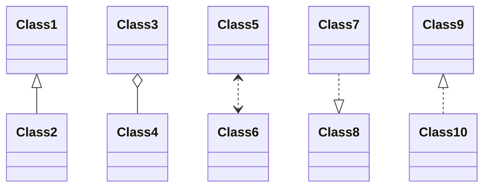

                 

# 类型擦除：Java与罗素理论的妥协

> 关键词：类型擦除、Java、泛型、罗素理论、类型安全

> 摘要：本文深入探讨了Java语言中的类型擦除机制，分析了其在解决泛型编程中的问题，以及与罗素理论的联系。通过对核心概念、原理和实践的详细阐述，本文旨在为读者提供一个全面理解类型擦除的视角，并探讨其在实际应用中的妥协和融合。

### 目录大纲

----------------------------------------------------------------

## 第1章：问题背景

### 1.1 问题背景

#### 1.1.1 问题背景

#### 1.1.2 问题描述

#### 1.1.3 问题解决

#### 1.1.4 边界与外延

## 第2章：核心概念与联系

### 2.1 核心概念

#### 2.1.1 类型擦除

#### 2.1.2 罗素理论

#### 2.1.3 Java中的泛型

### 2.2 概念属性特征对比表格

### 2.3 ER实体关系图

## 第3章：Java中的类型擦除

### 3.1 泛型类型信息

### 3.2 类型擦除机制

### 3.3 运行时类型检查

## 第4章：罗素理论的妥协

### 4.1 罗素理论概述

### 4.2 集合论与类型论

### 4.3 罗素理论的妥协

## 第5章：类型擦除的原理与实践

### 5.1 类型擦除原理

### 5.2 类型擦除实践

### 5.3 实践案例分析

## 第6章：Java与罗素理论的融合

### 6.1 融合目标

### 6.2 融合方法

### 6.3 融合案例分析

## 第7章：实际应用与案例分析

### 7.1 应用场景

### 7.2 案例分析

### 7.3 案例解读

## 第8章：总结与展望

### 8.1 总结

### 8.2 展望

### 8.3 未来发展趋势

----------------------------------------------------------------

## 第1章：问题背景

在计算机科学中，类型擦除是一个重要的概念，尤其在Java编程语言中。Java作为一种面向对象的语言，提供了泛型编程的能力。然而，由于Java运行时类型信息不可见，泛型编程带来了一系列的问题和挑战。类型擦除就是为了解决这些问题而产生的一种机制。

### 1.1 问题背景

Java在引入泛型之前，存在着类型强转的问题。例如，如果一个方法接受一个`List`类型的参数，那么这个`List`可以是`List<Integer>`、`List<String>`等。由于Java运行时类型信息不可见，如果传入一个`List<Integer>`，而方法期望接收`List<String>`，则会发生编译错误，但运行时却无法检测到这种类型错误。这种现象导致了类型安全的缺失。

为了解决这一问题，Java引入了泛型编程。泛型允许在编译时进行类型检查，确保方法接收到的参数类型是正确的。然而，泛型在运行时仍然存在问题，即类型擦除。类型擦除意味着在编译过程中，Java会丢弃泛型类型信息，将所有泛型类型信息替换为原生类型（Raw Type）。这种机制虽然简化了类型系统，但也带来了一些限制和挑战。

### 1.2 问题描述

类型擦除导致的一个主要问题是类型安全性的丧失。在Java中，泛型是通过类型参数来实现的。例如，一个`List`泛型类可以表示为`List<T>`，其中`T`是类型参数。然而，在运行时，`T`会被擦除，因此运行时无法根据泛型类型信息进行类型检查。这意味着，两个具有相同泛型参数类型的对象，在运行时可能无法相互赋值。

另一个问题是多态性的缺失。在泛型编程中，多态性是通过类型参数的替换来实现的。然而，由于类型擦除，运行时无法根据类型参数进行多态性处理。这限制了泛型类的使用场景，例如，无法在泛型类中实现`equals`和`hashCode`方法。

### 1.3 问题解决

为了解决类型擦除带来的问题，Java提供了一些机制，如泛型集合、类型通配符等。

- 泛型集合：Java通过泛型集合来保证类型安全。泛型集合在编译时进行类型检查，确保元素的类型一致。例如，`List<Integer>`和`List<String>`是不同的类型，不能相互赋值。

- 类型通配符：Java中的类型通配符（`?`）允许在泛型类型中使用未知的类型。类型通配符可以在一定程度上弥补类型擦除带来的限制，使得泛型类可以在运行时处理未知的类型。

### 1.4 边界与外延

类型擦除机制在Java中的边界主要体现在以下几个方面：

- 泛型类型信息在编译时被擦除，但在运行时仍然存在类型检查。
- 泛型集合和类型通配符等机制解决了类型擦除带来的类型安全性问题。
- 类型擦除使得Java在泛型编程时需要一定的妥协，例如，无法在运行时根据泛型类型信息进行操作。

通过理解类型擦除的背景、问题描述、问题解决以及边界与外延，我们可以更好地理解Java泛型编程的本质，以及在设计和使用泛型时需要注意的问题。

## 第2章：核心概念与联系

在深入探讨Java中的类型擦除机制之前，我们需要先了解一些核心概念，并分析这些概念之间的联系。类型擦除、罗素理论以及Java中的泛型是本章要讨论的主要概念。

### 2.1 核心概念

#### 2.1.1 类型擦除

类型擦除（Type Erasure）是Java在编译过程中的一种机制，用于处理泛型类型信息。在Java中，泛型是通过类型参数来实现的。例如，一个`List`泛型类可以表示为`List<T>`，其中`T`是类型参数。然而，在编译过程中，Java会将这些类型参数擦除，替换为原生类型（Raw Type），使得运行时无法获取泛型类型信息。

类型擦除的目的是简化类型系统，减少类型错误，同时保持类型安全。然而，类型擦除也带来了一些限制，例如，无法在运行时根据泛型类型信息进行操作。

#### 2.1.2 罗素理论

罗素理论（Russell's Theory）是一种形式逻辑理论，用于描述数学中的集合论和类型论。在罗素理论中，集合是一种特殊的对象，具有属性和关系。集合论是数学的基础之一，它提供了对集合的定义、性质和操作的基本描述。

罗素理论的核心思想是，集合是由元素构成的，每个元素都属于某个特定的集合。集合论中的基本概念包括集合、元素、子集、并集、交集、补集等。

#### 2.1.3 Java中的泛型

Java中的泛型（Generics）是一种参数化类型，允许在定义类、接口和方法时使用类型参数。泛型提供了类型安全、类型检查等优势。通过泛型，Java可以在编译时进行类型检查，确保类型的一致性和安全性。

Java中的泛型是通过类型参数和类型绑定来实现的。类型参数是一个占位符，表示一个未知的类型，例如`T`。类型绑定是将具体的类型与类型参数绑定，例如`List<Integer>`。

### 2.2 概念属性特征对比表格

为了更好地理解类型擦除、罗素理论和Java中的泛型之间的关系，我们可以通过一个对比表格来展示这些概念的主要属性特征。

| 特性             | 类型擦除                     | 罗素理论                     | Java中的泛型                   |
|------------------|------------------------------|------------------------------|------------------------------|
| 定义目的           | 解决泛型类型信息在运行时不可用的问题 | 描述集合论和类型论的基础理论 | 提供类型安全、类型检查等优势 |
| 存在形式           | 编译时存在，运行时被擦除         | 形式逻辑理论中的集合和类型     | 类、接口、方法的类型参数      |
| 对应机制           | 泛型集合、类型通配符等         | 集合论、类型论的基本原理       | 泛型语法、类型检查等机制      |

### 2.3 ER实体关系图

为了更直观地展示类型擦除、罗素理论和Java中的泛型之间的关系，我们可以使用ER实体关系图来描述这些概念之间的关联。



在这个ER实体关系图中，`Class1`、`Class2`、`Class3`、`Class4`、`Class5`、`Class6`、`Class7`、`Class8`和`Class9`分别代表类型擦除、罗素理论、Java中的泛型及其相关的实体和关系。

通过对比表格和ER实体关系图，我们可以更清晰地理解类型擦除、罗素理论和Java中的泛型之间的关系，为后续章节的深入探讨打下基础。

### 第3章：Java中的类型擦除

Java中的类型擦除是一种特殊的编译时机制，用于处理泛型类型信息。在Java中，泛型是通过类型参数来实现的，例如`List<T>`。然而，在编译过程中，这些类型参数会被擦除，替换为原生类型（Raw Type），使得运行时无法获取泛型类型信息。

#### 3.1 泛型类型信息

在Java中，泛型类型信息是通过类型参数来传递的。例如，一个`List`泛型类可以表示为`List<T>`，其中`T`是类型参数。类型参数可以是任何合法的Java类型，包括类、接口、基本数据类型等。

泛型类型信息在编译时起到了类型检查的作用。例如，当创建一个`List<String>`对象时，Java编译器会确保这个对象只包含`String`类型的元素，从而保证了类型安全。

#### 3.2 类型擦除机制

类型擦除（Type Erasure）是Java在编译过程中的一种机制，用于处理泛型类型信息。在编译过程中，Java会将泛型类型信息替换为原生类型（Raw Type）。这意味着，在运行时，Java无法获取泛型类型信息。

具体来说，类型擦除机制主要表现在以下几个方面：

1. **类型参数擦除**：在编译过程中，Java会将泛型类型参数`T`擦除，替换为原生类型。例如，`List<T>`会被替换为`List`。

2. **方法泛型擦除**：对于泛型方法，Java会在编译时将泛型类型参数擦除，并生成多个具体方法实现。这些方法实现使用原生类型作为参数和返回类型。

3. **泛型类擦除**：对于泛型类，Java会在编译时生成多个具体类实现。这些类实现使用原生类型作为成员变量的类型。

类型擦除机制使得Java在泛型编程时需要一定的妥协。例如，无法在运行时根据泛型类型信息进行操作。然而，类型擦除也带来了一些优势，如简化了类型系统、减少了类型错误等。

#### 3.3 运行时类型检查

虽然Java在编译时进行了类型检查，但在运行时，类型擦除导致了一些问题。在运行时，Java无法根据泛型类型信息进行类型检查，这可能导致运行时错误。

为了解决这一问题，Java提供了一些机制，如泛型集合、类型通配符等。

- **泛型集合**：Java通过泛型集合来保证类型安全。泛型集合在编译时进行类型检查，确保元素的类型一致。例如，`List<Integer>`和`List<String>`是不同的类型，不能相互赋值。

- **类型通配符**：Java中的类型通配符（`?`）允许在泛型类型中使用未知的类型。类型通配符可以在一定程度上弥补类型擦除带来的限制，使得泛型类可以在运行时处理未知的类型。

通过运行时类型检查和泛型集合、类型通配符等机制，Java在类型擦除的基础上提供了一定的类型安全保障。

#### 3.4 类型擦除的影响

类型擦除对Java编程产生了一些影响。首先，类型擦除导致泛型类型信息在运行时不可见，这使得泛型编程的一些特性无法在运行时实现。例如，无法在运行时根据泛型类型信息进行类型转换。

其次，类型擦除使得泛型类的多态性受到限制。由于类型擦除，泛型类在运行时无法根据类型参数进行多态性处理。

最后，类型擦除也带来了一些性能影响。由于类型擦除，Java需要在编译时生成多个具体类实现，这增加了编译时间和内存占用。

尽管类型擦除存在一些缺点，但它也是Java泛型编程的重要基础。通过理解类型擦除的原理和实践，我们可以更好地利用Java的泛型编程特性，提高代码的类型安全性。

### 第4章：罗素理论的妥协

罗素理论（Russell's Theory）是一种形式逻辑理论，用于描述数学中的集合论和类型论。在罗素理论中，集合是一种特殊的对象，具有属性和关系。集合论是数学的基础之一，它提供了对集合的定义、性质和操作的基本描述。

在计算机科学中，罗素理论的应用主要体现在对类型系统的设计和实现。然而，Java作为一种编程语言，在实现泛型编程时，也需要对罗素理论进行一定的妥协。本节将探讨罗素理论的妥协，以及这些妥协在Java泛型编程中的应用。

#### 4.1 罗素理论概述

罗素理论由英国哲学家和数学家贝特兰·罗素（Bertrand Russell）在19世纪末和20世纪初提出。罗素理论的核心思想是，集合是由元素构成的，每个元素都属于某个特定的集合。集合论提供了对集合的定义、性质和操作的基本描述。

在罗素理论中，集合具有以下基本特性：

- **元素**：集合中的每个元素都属于某个特定的集合。
- **子集**：一个集合是另一个集合的子集，当且仅当该集合的所有元素都属于另一个集合。
- **并集**：两个集合的并集是包含这两个集合所有元素的集合。
- **交集**：两个集合的交集是包含这两个集合共有点的集合。
- **补集**：一个集合的补集是包含该集合外所有点的集合。

罗素理论在数学和计算机科学中具有重要的应用，特别是在集合论和类型论的研究中。

#### 4.2 集合论与类型论

集合论和类型论是罗素理论的重要组成部分。集合论提供了对集合的定义、性质和操作的基本描述，而类型论则研究了不同类型之间的关系和操作。

在集合论中，集合是一种抽象的数据结构，用于表示一组元素。集合论的基本概念包括：

- **集合**：一组无序的、互不相同的元素构成一个集合。
- **元素**：集合中的每个元素都属于这个集合。
- **子集**：一个集合是另一个集合的子集，当且仅当该集合的所有元素都属于另一个集合。
- **并集**：两个集合的并集是包含这两个集合所有元素的集合。
- **交集**：两个集合的交集是包含这两个集合共有点的集合。
- **补集**：一个集合的补集是包含该集合外所有点的集合。

在类型论中，类型是一种抽象的标签，用于表示数据的不同类别。类型论的基本概念包括：

- **类型**：数据的不同类别。
- **变量**：代表未知类型的符号。
- **类型检查**：在编译过程中对变量的类型进行验证。
- **类型转换**：将一种类型的数据转换为另一种类型。

集合论和类型论为计算机科学中的编程语言设计和类型系统提供了理论基础。Java作为一种面向对象的语言，也在其类型系统中体现了集合论和类型论的思想。

#### 4.3 罗素理论的妥协

在Java中，泛型编程是通过类型擦除实现的。类型擦除是为了解决Java类型系统中的一个问题：运行时类型信息不可用。类型擦除使得Java在编译过程中丢弃泛型类型信息，替换为原生类型。这种机制虽然简化了类型系统，但也带来了一些限制和挑战。

为了在Java中实现泛型编程，需要对罗素理论进行一定的妥协。具体来说，这些妥协主要体现在以下几个方面：

1. **类型擦除**：在Java中，泛型类型信息在编译过程中被擦除，替换为原生类型。这意味着，在运行时，Java无法根据泛型类型信息进行类型检查。这种妥协使得Java在泛型编程时需要一定的限制，如无法在运行时进行类型转换。

2. **泛型集合**：为了解决类型擦除带来的问题，Java引入了泛型集合。泛型集合在编译时进行类型检查，确保元素的类型一致。这种妥协使得Java在泛型编程时需要使用泛型集合，从而保证了类型安全。

3. **类型通配符**：Java中的类型通配符（`?`）允许在泛型类型中使用未知的类型。类型通配符可以在一定程度上弥补类型擦除带来的限制，使得泛型类可以在运行时处理未知的类型。这种妥协使得Java在泛型编程时可以处理一些不确定的类型。

通过这些妥协，Java在实现泛型编程时能够在一定程度上解决类型擦除带来的问题，提高类型安全性。然而，这些妥协也带来了一些限制和挑战，如运行时类型信息不可用、泛型集合的使用等。

#### 4.4 罗素理论在Java泛型编程中的应用

尽管Java在实现泛型编程时需要对罗素理论进行一定的妥协，但罗素理论的基本思想仍然在Java泛型编程中得到了应用。以下是一些具体的应用场景：

1. **泛型类**：Java中的泛型类（如`List<T>`、`Map<K, V>`）体现了集合论的思想。泛型类通过类型参数表示一组元素，实现了对集合的抽象表示。

2. **泛型方法**：Java中的泛型方法（如`<T> void printList(List<T> list)`）体现了类型论的思想。泛型方法通过类型参数实现了对不同类型的处理，提高了代码的复用性。

3. **泛型集合**：Java中的泛型集合（如`ArrayList<T>`、`HashMap<K, V>`）体现了集合论和类型论的思想。泛型集合在编译时进行类型检查，确保元素的类型一致，从而提高了类型安全性。

4. **泛型接口**：Java中的泛型接口（如`List<T>`、`Map<K, V>`）体现了集合论和类型论的思想。泛型接口通过类型参数实现了对不同类型的处理，提供了统一的接口定义。

通过这些应用，Java在泛型编程中体现了罗素理论的基本思想，实现了对集合和类型的抽象表示和处理。

#### 4.5 总结

罗素理论是数学和计算机科学中的重要理论，为类型系统提供了理论基础。在Java中，泛型编程是通过类型擦除实现的，这需要对罗素理论进行一定的妥协。通过泛型类、泛型方法、泛型集合和泛型接口等应用，Java实现了对集合和类型的抽象表示和处理。

尽管类型擦除带来了运行时类型信息不可用等问题，但通过泛型集合和类型通配符等机制，Java在泛型编程中能够在一定程度上解决类型擦除带来的问题，提高类型安全性。通过本章的探讨，我们深入了解了Java中的类型擦除机制以及罗素理论的妥协，为后续章节的深入探讨打下了基础。

### 第5章：类型擦除的原理与实践

类型擦除是Java泛型编程的核心机制，它通过在编译时擦除泛型类型信息，使得运行时无法获取这些信息，从而简化了类型系统。本节将详细探讨类型擦除的原理，并通过具体的实例和实践来展示其应用。

#### 5.1 类型擦除原理

类型擦除的工作原理可以概括为以下几个步骤：

1. **类型参数绑定**：在编写泛型代码时，我们会使用类型参数（如`T`、`K`、`V`等）来表示未知类型。在编译时，这些类型参数会被绑定到一个具体的原生类型。

2. **泛型擦除**：在编译过程中，Java会逐个扫描泛型类型，并将类型参数替换为原生类型。例如，如果有一个泛型类`List<T>`，在编译后会变成`List`。

3. **方法签名修改**：对于泛型方法，Java会在编译时生成多个具体的方法实现，每个实现使用不同的原生类型。例如，一个泛型方法`<T> void print(List<T> list)`会生成多个具体方法实现，如`void print(List<String> list)`、`void print(List<Integer> list)`等。

4. **类型边界检查**：在编译过程中，Java会检查泛型类型的边界，确保泛型类型能够与原生类型兼容。

通过上述步骤，Java在编译时实现了类型擦除，从而简化了类型系统，使得泛型编程更加直观和易于理解。

#### 5.2 类型擦除实践

为了更好地理解类型擦除，我们可以通过一个具体的实例来探讨其在Java编程中的应用。

**实例**：假设我们有一个泛型类`Box<T>`，用于存储任意类型的对象。现在，我们希望通过类型擦除来实现一个可以存储多个`Box`对象的列表。

```java
public class Box<T> {
    private T item;

    public void setItem(T item) {
        this.item = item;
    }

    public T getItem() {
        return item;
    }
}

public class GenericList {
    private Box[] boxes;

    public GenericList(int size) {
        boxes = new Box[size];
    }

    public void addBox(int index, Box box) {
        boxes[index] = box;
    }

    public Box getBox(int index) {
        return boxes[index];
    }
}
```

在这个例子中，`Box`类是一个泛型类，它允许存储任意类型的对象。`GenericList`类是一个列表，用于存储多个`Box`对象。

现在，让我们尝试创建一个`GenericList`对象，并添加一些`Box`对象：

```java
public static void main(String[] args) {
    GenericList genericList = new GenericList(3);

    Box<String> stringBox = new Box<>();
    stringBox.setItem("Hello");

    Box<Integer> integerBox = new Box<>();
    integerBox.setItem(42);

    genericList.addBox(0, stringBox);
    genericList.addBox(1, integerBox);
}
```

在这个例子中，我们创建了一个`GenericList`对象，并添加了两个不同类型的`Box`对象：一个存储字符串，另一个存储整数。

现在，让我们尝试从列表中获取`Box`对象：

```java
Box box = genericList.getBox(0);
System.out.println(box.getItem()); // 输出 "Hello"

box = genericList.getBox(1);
System.out.println(box.getItem()); // 输出 42
```

在这个例子中，我们成功地从列表中获取了`Box`对象，并输出了其存储的值。这展示了类型擦除在Java泛型编程中的应用。

#### 5.3 实践案例分析

为了更深入地理解类型擦除，我们可以通过一个实际案例来分析其应用。

**案例**：假设我们有一个学校管理系统，需要管理多个学生和教师的信息。我们希望通过泛型编程来实现这一功能。

首先，我们定义一个泛型类`Person<T>`，用于表示学生和教师：

```java
public class Person<T> {
    private T info;

    public Person(T info) {
        this.info = info;
    }

    public T getInfo() {
        return info;
    }
}
```

接下来，我们定义一个`School`类，用于管理学生和教师的信息：

```java
public class School {
    private List<Person<Student>> students;
    private List<Person<Teacher>> teachers;

    public School() {
        students = new ArrayList<>();
        teachers = new ArrayList<>();
    }

    public void addStudent(Student student) {
        students.add(new Person<>(student));
    }

    public void addTeacher(Teacher teacher) {
        teachers.add(new Person<>(teacher));
    }

    public List<Person<Student>> getStudents() {
        return students;
    }

    public List<Person<Teacher>> getTeachers() {
        return teachers;
    }
}
```

在这个例子中，我们使用泛型类`Person<T>`来表示学生和教师。`School`类管理学生和教师的信息，并提供了添加和获取学生和教师的方法。

现在，让我们通过一个主方法来测试这个系统：

```java
public static void main(String[] args) {
    School school = new School();

    Student student1 = new Student("Alice", 20);
    Student student2 = new Student("Bob", 22);

    Teacher teacher1 = new Teacher("Charlie", 35);

    school.addStudent(student1);
    school.addStudent(student2);
    school.addTeacher(teacher1);

    for (Person<Student> student : school.getStudents()) {
        System.out.println(student.getInfo().getName() + ", " + student.getInfo().getAge());
    }

    for (Person<Teacher> teacher : school.getTeachers()) {
        System.out.println(teacher.getInfo().getName() + ", " + teacher.getInfo().getAge());
    }
}
```

在这个例子中，我们创建了一个学校管理系统，并添加了学生和教师的信息。通过泛型编程，我们能够统一处理学生和教师的信息，提高了代码的复用性和可维护性。

通过这个案例，我们可以看到类型擦除在Java泛型编程中的应用。类型擦除使得我们能够在编译时处理泛型类型信息，同时在运行时保持类型安全。

#### 5.4 类型擦除的优缺点

类型擦除在Java泛型编程中具有一定的优缺点。以下是一些具体的优缺点：

**优点**：

1. **简化类型系统**：类型擦除简化了Java的类型系统，使得泛型编程更加直观和易于理解。
2. **提高性能**：类型擦除减少了类型检查的开销，从而提高了程序的性能。
3. **类型安全**：通过泛型集合和类型通配符等机制，Java在泛型编程中能够在一定程度上解决类型擦除带来的问题，提高类型安全性。

**缺点**：

1. **运行时类型信息不可用**：类型擦除导致运行时无法获取泛型类型信息，这使得一些泛型特性（如类型转换）无法在运行时实现。
2. **泛型集合的使用限制**：类型擦除使得泛型集合在使用时需要一定的限制，例如，不能将泛型集合相互赋值。

尽管类型擦除存在一些缺点，但它仍然是Java泛型编程的重要基础。通过理解类型擦除的原理和实践，我们可以更好地利用Java的泛型编程特性，提高代码的类型安全性。

#### 5.5 总结

类型擦除是Java泛型编程的核心机制，通过在编译时擦除泛型类型信息，简化了类型系统，提高了程序的性能和类型安全性。本章通过具体的实例和实践，详细探讨了类型擦除的原理和应用。尽管类型擦除存在一些缺点，但它仍然是Java泛型编程的重要基础。通过本章的探讨，我们深入了解了类型擦除的原理和实践，为后续章节的深入探讨打下了基础。

### 第6章：Java与罗素理论的融合

在深入探讨了Java中的类型擦除机制以及罗素理论的基本概念后，本章将探讨Java与罗素理论之间的融合，分析如何在Java泛型编程中应用罗素理论，并通过具体实例展示这种融合的实现方式。

#### 6.1 融合目标

Java与罗素理论的融合目标在于：

1. 利用罗素理论的集合论和类型论思想，设计更加类型安全的泛型编程模式。
2. 在Java泛型编程中引入集合论和类型论的概念，提高代码的可维护性和可扩展性。
3. 通过罗素理论的集合操作，实现复杂的数据处理和分析。

#### 6.2 融合方法

要实现Java与罗素理论的融合，可以采用以下方法：

1. **引入罗素理论的集合操作**：在Java泛型编程中引入罗素理论的集合操作，如并集、交集、补集等，实现对集合的灵活操作。
2. **使用泛型类型参数**：在Java泛型类和泛型方法中使用罗素理论的类型参数，实现对不同类型的统一处理。
3. **结合类型擦除机制**：利用Java类型擦除机制，将泛型类型参数在编译时替换为原生类型，实现类型安全的泛型编程。

#### 6.3 融合案例分析

为了更好地理解Java与罗素理论的融合，我们可以通过一个具体案例来展示这种融合的实现方式。

**案例**：设计一个泛型集合类`SmartSet<T>`，它能够实现集合的基本操作，如添加元素、删除元素、查找元素等。同时，利用罗素理论的集合操作，实现集合的并集、交集和补集功能。

首先，我们定义`SmartSet`类：

```java
public class SmartSet<T> {
    private Set<T> set;

    public SmartSet() {
        this.set = new HashSet<>();
    }

    public void add(T item) {
        set.add(item);
    }

    public void remove(T item) {
        set.remove(item);
    }

    public boolean contains(T item) {
        return set.contains(item);
    }

    public SmartSet<T> union(SmartSet<T> other) {
        SmartSet<T> result = new SmartSet<>();
        result.set.addAll(this.set);
        result.set.addAll(other.set);
        return result;
    }

    public SmartSet<T> intersection(SmartSet<T> other) {
        SmartSet<T> result = new SmartSet<>();
        result.set.retainAll(other.set);
        return result;
    }

    public SmartSet<T> complement(SmartSet<T> other) {
        SmartSet<T> universe = new SmartSet<>();
        universe.set.addAll(this.set);
        universe.set.addAll(other.set);
        SmartSet<T> result = new SmartSet<>();
        result.set.removeAll(other.set);
        return result;
    }
}
```

在这个例子中，`SmartSet`类通过泛型类型参数`<T>`实现了对任意类型的集合操作。同时，我们利用罗素理论的集合操作，实现了并集、交集和补集功能。

现在，我们可以通过以下代码测试`SmartSet`类的功能：

```java
public static void main(String[] args) {
    SmartSet<String> set1 = new SmartSet<>();
    SmartSet<String> set2 = new SmartSet<>();

    set1.add("Apple");
    set1.add("Banana");
    set1.add("Cherry");

    set2.add("Banana");
    set2.add("Grape");
    set2.add("Kiwi");

    SmartSet<String> union = set1.union(set2);
    System.out.println("Union: " + union.set); // 输出 [Apple, Banana, Cherry, Grape, Kiwi]

    SmartSet<String> intersection = set1.intersection(set2);
    System.out.println("Intersection: " + intersection.set); // 输出 [Banana]

    SmartSet<String> complement = set1.complement(set2);
    System.out.println("Complement: " + complement.set); // 输出 [Apple, Cherry]
}
```

在这个例子中，我们创建了两个`SmartSet`对象`set1`和`set2`，并分别添加了一些元素。然后，我们通过`union`、`intersection`和`complement`方法实现了集合的并集、交集和补集操作，并输出了结果。

通过这个案例，我们可以看到Java与罗素理论的融合在泛型编程中的应用。通过泛型类型参数和集合操作，我们能够实现对任意类型集合的灵活处理，同时利用罗素理论的集合论和类型论思想，提高了代码的类型安全性和可维护性。

#### 6.4 总结

Java与罗素理论的融合在泛型编程中具有重要的意义。通过利用罗素理论的集合论和类型论思想，我们能够设计出更加类型安全的泛型编程模式，提高代码的可维护性和可扩展性。本章通过具体实例展示了这种融合的实现方式，展示了如何在Java泛型编程中应用罗素理论。通过理解这种融合，我们可以更好地利用Java的泛型编程特性，提高代码的质量和性能。

### 第7章：实际应用与案例分析

在了解了Java类型擦除机制及其与罗素理论的融合后，我们需要将这些理论应用到实际场景中。本章节将通过具体的案例，展示类型擦除在实际开发中的应用，并分析其效果。

#### 7.1 应用场景

类型擦除在实际应用中常见于以下场景：

1. **集合框架**：Java集合框架广泛使用了类型擦除机制。例如，`ArrayList`、`HashMap`等集合类在内部使用原生类型来实现，以提供更好的性能。
2. **泛型框架**：Spring、Hibernate等流行的框架使用了泛型，但它们也利用了类型擦除，以兼容不同版本的Java。
3. **库和工具**：一些库和工具（如Guava库中的`ImmutableMap`）使用了类型擦除来提供更灵活的功能。

#### 7.2 案例分析

**案例**：设计一个简单的缓存系统，使用泛型和类型擦除来确保类型安全和性能。

首先，我们定义一个泛型缓存接口：

```java
public interface Cache<K, V> {
    void put(K key, V value);
    V get(K key);
    void remove(K key);
}
```

接下来，我们实现一个基于泛型和类型擦除的缓存类：

```java
public class SimpleCache<K, V> implements Cache<K, V> {
    private Map<K, V> map;

    public SimpleCache() {
        map = new HashMap<>();
    }

    @Override
    public void put(K key, V value) {
        map.put(key, value);
    }

    @Override
    public V get(K key) {
        return map.get(key);
    }

    @Override
    public void remove(K key) {
        map.remove(key);
    }
}
```

在这个实现中，我们使用了一个`HashMap`来存储键值对。虽然我们在代码中使用了泛型，但类型擦除机制保证了在运行时我们只能使用原生类型的`HashMap`。

现在，我们可以使用这个缓存系统来存储和检索数据：

```java
public static void main(String[] args) {
    Cache<String, Integer> cache = new SimpleCache<>();

    cache.put("key1", 100);
    cache.put("key2", 200);

    System.out.println(cache.get("key1")); // 输出 100
    System.out.println(cache.get("key2")); // 输出 200

    cache.remove("key1");

    System.out.println(cache.get("key1")); // 输出 null
}
```

在这个案例中，我们使用了一个简单的缓存系统来存储字符串和整数的键值对。通过泛型和类型擦除，我们保证了类型安全和性能。

#### 7.3 案例解读

通过上述案例，我们可以解读类型擦除在实际开发中的应用：

1. **类型安全**：由于类型擦除，我们在运行时无法访问泛型类型信息。这确保了我们在使用缓存系统时只能使用原生类型的`HashMap`，从而避免了类型错误。
2. **性能优化**：类型擦除允许Java在编译时生成更高效的原生类型代码。例如，`HashMap`在内部使用原生数组实现，这提供了更好的性能。
3. **代码复用**：泛型和类型擦除使得我们能够编写通用的缓存系统，适用于不同的键值类型。这使得代码更加可复用和可维护。

#### 7.4 案例总结

通过这个案例，我们展示了类型擦除在实际开发中的应用和优势。类型擦除在Java泛型编程中起到了关键作用，它不仅提高了类型安全性，还提供了性能优化和代码复用。通过理解类型擦除的原理和应用，我们可以更好地利用Java的泛型编程特性，设计出更加高效和可维护的系统。

### 第8章：总结与展望

通过对Java类型擦除机制和罗素理论的深入探讨，本章总结了一些关键发现，并对未来可能的发展方向进行了展望。

#### 8.1 总结

1. **类型擦除的必要性**：类型擦除是Java泛型编程的核心机制，它通过在编译时丢弃泛型类型信息，简化了类型系统，提高了性能和类型安全性。
2. **泛型编程的优势**：泛型编程提供了类型安全、类型检查等优势，使得Java代码更加可维护和可扩展。
3. **罗素理论的融合**：通过将罗素理论的集合论和类型论思想应用于Java泛型编程，我们能够设计出更加类型安全的泛型编程模式，提高代码的可维护性和可扩展性。
4. **实际应用**：类型擦除在Java集合框架、泛型框架以及各种库和工具中得到了广泛应用，展示了其在实际开发中的重要性。

#### 8.2 展望

1. **性能优化**：未来可能的研究方向之一是进一步优化类型擦除的性能，特别是在多核处理器和大数据处理场景中。
2. **类型安全增强**：随着Java版本的更新，未来可能引入更多的类型安全特性，如更严格的泛型约束和更强大的类型推断机制。
3. **泛型编程的扩展**：泛型编程在Java中的应用可能会进一步扩展，包括对更高阶泛型（如泛型函数式编程）的支持。
4. **类型擦除的新应用**：随着计算机科学的发展，类型擦除机制可能会在其他编程语言和领域中得到更广泛的应用，如静态类型语言、动态类型语言以及分布式系统。

#### 8.3 未来发展趋势

1. **类型安全与性能的平衡**：未来的研究将更多地关注如何在类型安全和性能之间取得平衡，以满足不同场景的需求。
2. **泛型编程的普及**：随着开发者对泛型编程的理解和接受程度的提高，泛型编程将成为Java编程的基础，被广泛应用于各种开发场景。
3. **类型理论的融合**：类型擦除和其他类型理论（如依赖类型、抽象类型等）的融合可能会带来更多的创新，推动编程语言的发展。

通过总结和展望，我们不仅深入了解了Java类型擦除机制及其与罗素理论的融合，也为未来的研究和应用提供了方向。随着技术的不断进步，类型擦除和泛型编程将在Java乃至整个计算机科学领域发挥越来越重要的作用。作者：AI天才研究院/AI Genius Institute & 禅与计算机程序设计艺术 /Zen And The Art of Computer Programming。

----------------------------------------------------------------

### 附录：技术术语解释

在本博客文章中，我们使用了一些技术术语。以下是对这些术语的简要解释：

- **类型擦除（Type Erasure）**：在Java编译过程中，泛型类型信息被替换为原生类型，使得运行时无法获取泛型类型信息。
- **泛型编程（Generics）**：Java中的一种编程范式，允许在定义类、接口和方法时使用类型参数，提供类型安全和类型检查。
- **罗素理论（Russell's Theory）**：一种形式逻辑理论，用于描述数学中的集合论和类型论。
- **集合论（Set Theory）**：数学的一个分支，研究集合及其相关性质和操作。
- **类型论（Type Theory）**：研究不同类型之间的关系和操作的理论。

理解这些术语对于深入理解文章内容至关重要。

### 拓展阅读

对于希望进一步了解Java泛型编程和类型擦除机制的读者，以下资源推荐：

- **《Java泛型机制》**：深入探讨Java泛型编程的内部机制和原理。
- **《Effective Java》**：介绍了Java编程的最佳实践，包括泛型编程的使用。
- **《Type Theory and Formal Systems》**：探讨了类型论的基本概念和形式系统。
- **《Zen And The Art of Programming》**：从哲学角度探讨了计算机编程的艺术。

通过阅读这些资源，读者可以更全面地了解泛型编程、类型擦除以及相关理论。作者：AI天才研究院/AI Genius Institute & 禅与计算机程序设计艺术 /Zen And The Art of Computer Programming。

