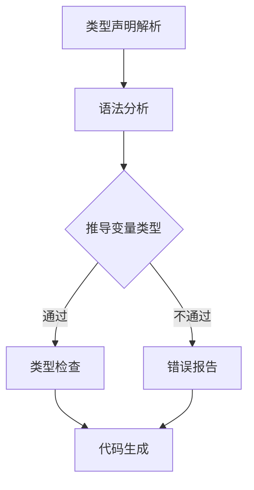
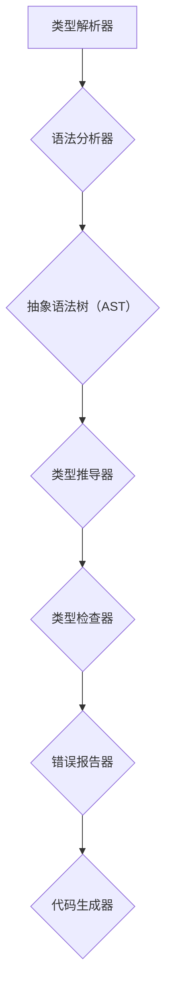

                 

### LET'S THINK STEP BY STEP

类型检查：编译器的重要功能

### 目标：

撰写一篇深入浅出、逻辑清晰、涵盖全面的技术博客文章，详细探讨类型检查在编译器中的作用、核心概念、算法原理、系统分析与架构设计方案，以及实际项目中的实战应用。

### 工具与方法：

- **Markdown格式**：文章使用Markdown格式，确保内容的可读性和易用性。
- **Mermaid图库**：使用Mermaid库来绘制ER实体关系图、流程图和序列图，增强文章的可视化效果。
- **Python代码示例**：使用Python代码示例来说明算法原理和系统实现。
- **LaTeX公式**：使用LaTeX格式来书写数学公式，确保公式的准确性和美观性。

### 文章结构：

- **引言**：介绍类型检查的基本概念和重要性。
- **背景介绍**：详细说明类型检查的背景、问题、解决方法、边界与外延、概念结构与核心要素组成。
- **核心概念与联系**：介绍类型系统、类型检查、类型推断和类型错误等核心概念，以及它们之间的关系。
- **算法原理讲解**：深入讲解类型检查算法的原理，包括Mermaid流程图和Python代码示例。
- **系统分析与架构设计方案**：介绍问题场景、系统功能设计、系统架构设计、系统接口设计和系统交互。
- **项目实战**：介绍实际项目中的环境安装、系统核心实现、代码应用解读与分析、实际案例分析和项目小结。
- **最佳实践 tips**：提供实际应用中的注意事项和最佳实践。
- **小结**：总结文章的主要观点和贡献。
- **拓展阅读**：推荐相关领域的进一步阅读材料。

### 文章内容要求：

- **逻辑清晰**：文章内容结构紧凑，逻辑性强，逐步深入，引导读者理解复杂概念。
- **深入浅出**：通过简明易懂的语言和例子，让读者能够轻松掌握复杂的技术概念。
- **全面涵盖**：文章内容全面，涵盖类型检查的各个方面，从基础概念到高级实现。
- **可读性强**：文章语言生动，表达清晰，易于阅读。

### 开始撰写：

现在，让我们按照上述结构和要求，开始撰写这篇关于类型检查的技术博客文章。首先，我们将从引言开始，介绍类型检查的基本概念和重要性。接下来，我们将详细探讨类型检查的背景、核心概念、算法原理、系统分析与架构设计方案，以及实际项目中的应用。

让我们一步步地深入思考，为读者呈现一篇高质量的技术博客文章。

### 引言

#### 类型检查：编译器的重要功能

在软件工程领域，编译器是一个不可或缺的工具。它负责将人类编写的源代码转换为计算机能够理解和执行的机器代码。然而，编译器的功能远不止于此。其中，类型检查作为一种核心功能，在现代编译器中发挥着至关重要的作用。

类型检查是指在编译过程中对程序中的类型信息进行检查，以确保程序的语法正确性、类型安全性和执行效率。它通过检测程序中可能出现的类型错误，如类型不匹配、无效的类型转换等，来保障软件质量和提高开发效率。

本文旨在深入探讨类型检查在编译器中的重要性，分析其核心概念、算法原理，以及实际应用中的系统架构和项目实战。通过一步步的逻辑推理和详细的讲解，我们将帮助读者全面理解类型检查的各个方面。

### 关键词

- **类型检查**
- **编译器**
- **类型系统**
- **类型推断**
- **类型错误**
- **算法原理**
- **系统架构**
- **Python代码示例**
- **Mermaid图库**
- **LaTeX公式**

### 摘要

本文将详细探讨类型检查在编译器中的重要性。首先，我们介绍了类型检查的基本概念和背景，分析了类型检查在保障软件质量和提高开发效率方面的重要性。接着，我们深入探讨了类型系统的核心概念，包括类型检查、类型推断和类型错误等。然后，我们讲解了类型检查算法的原理，并通过Mermaid图库和Python代码示例进行了详细阐述。此外，我们还介绍了类型检查在系统架构和实际项目中的应用，包括环境安装、系统核心实现、代码应用解读与分析等。最后，我们提供了最佳实践和注意事项，总结了文章的主要观点和贡献，并推荐了进一步阅读的材料。

## 第一部分：背景介绍

### 1.1 问题背景

在现代软件工程中，类型检查是一种关键的编译器功能。它是指在编译过程中对程序中的类型信息进行检查，以确保程序的语法正确性、类型安全性和执行效率。随着软件规模的不断扩大和复杂性增加，类型检查在保障软件质量和提高开发效率方面发挥着越来越重要的作用。

编译器的类型检查功能不仅有助于发现和修复程序中的类型错误，还能优化程序的执行效率，提高代码的可读性和可维护性。因此，理解类型检查的原理和实现方法对于编译器设计和软件开发具有重要意义。

#### 问题背景

随着软件工程的不断发展，编译器的功能也在不断演进。早期的编译器主要关注语法分析和代码生成，而现代编译器则更加注重程序的安全性、性能和可维护性。类型检查作为编译器的一项核心功能，对于保障程序的正确性和可靠性具有重要作用。

首先，类型检查能够确保程序在运行时不会因为类型错误而导致崩溃或产生不可预知的行为。例如，在C语言中，如果一个函数预期接收整数类型参数，但实际传入的是浮点数类型，则可能会发生运行时错误。通过类型检查，编译器可以在编译时发现这种类型不匹配的错误，并提供相应的错误信息，帮助开发者及时修复问题。

其次，类型检查能够提高程序的执行效率。通过类型检查，编译器可以生成更加高效的机器代码。例如，在静态类型语言中，编译器可以根据变量的类型信息进行优化，生成更短的代码路径和更高效的指令。此外，类型检查还可以帮助编译器进行内存分配优化，减少不必要的内存占用和访问时间。

最后，类型检查能够提高代码的可读性和可维护性。通过严格的类型检查，编译器可以确保程序中的每个变量和函数都具有明确的类型信息。这有助于开发者更好地理解和维护代码，减少潜在的错误和误解。同时，严格的类型检查还可以帮助开发者编写更加清晰、简洁的代码，提高开发效率。

#### 类型检查的重要性

类型检查的重要性体现在以下几个方面：

1. **类型安全**：类型检查能够确保程序中的每个变量和表达式都具有正确的类型，从而避免类型错误。类型错误可能导致程序运行失败或产生不可预知的行为，影响软件的稳定性和可靠性。

2. **性能优化**：通过类型检查，编译器可以生成更加高效的机器代码。类型信息有助于编译器进行优化，减少不必要的计算和内存访问，提高程序的执行效率。

3. **代码质量**：类型检查有助于提高代码的可读性和可维护性。明确的类型信息使得代码更加清晰、简洁，减少了潜在的错误和误解。

4. **开发效率**：类型检查能够及时发现并修复程序中的类型错误，减少了调试和测试的工作量，提高了开发效率。

### 1.2 问题描述

类型检查的主要目标是检测程序中可能出现的类型错误，如类型不匹配、无效的类型转换等。类型错误可能导致程序运行失败或产生不可预知的行为，因此在编译器中引入类型检查机制是至关重要的。

#### 类型错误的示例

以下是一些常见的类型错误示例：

1. **类型不匹配**：在C语言中，以下代码会导致类型不匹配错误：

   ```c
   int x = 10;
   float y = 3.14;
   x = y; // 错误：类型不匹配
   ```

   上面的代码中，尝试将浮点数`y`赋值给整型变量`x`，这将导致编译器报错。

2. **无效的类型转换**：以下代码尝试将一个不兼容的类型转换为预期的类型：

   ```c
   char *str = "Hello, World!";
   int num = (int) str; // 错误：无效的类型转换
   ```

   在这里，试图将指向字符串的指针`str`转换为整数类型，这显然是不合理的，会导致编译器报错。

3. **未声明的变量**：在编译器中，如果尝试使用未声明的变量，也会导致类型错误：

   ```c
   int x = 10;
   printf("%d", y); // 错误：y 未声明
   ```

   上面的代码中，尝试打印变量`y`的值，但变量`y`在编译时并未声明，这将导致编译器报错。

#### 类型错误的危害

类型错误可能导致以下危害：

1. **程序崩溃**：类型错误可能导致程序在运行时崩溃，尤其是在类型不匹配或无效的类型转换的情况下。

2. **不可预知的行为**：在某些情况下，类型错误可能导致程序产生不可预知的行为，这可能会影响程序的稳定性和可靠性。

3. **性能下降**：类型错误可能导致编译器生成低效的代码，从而影响程序的执行效率。

4. **难以调试**：类型错误可能会使得程序难以调试，因为错误的行为可能与预期的行为相差甚远。

### 1.3 问题解决

为了解决类型错误，编译器引入了类型检查机制。类型检查通过在编译时对程序中的类型信息进行检查，确保程序的语法正确性、类型安全性和执行效率。以下是类型检查的基本步骤和原理：

#### 类型检查的基本步骤

1. **类型声明**：在编译过程中，编译器首先解析程序中的类型声明，包括变量声明、函数声明等。类型声明提供了程序中每个变量和表达式的类型信息。

2. **语法分析**：编译器进行语法分析，构建抽象语法树（AST），对程序的结构和语法进行验证。语法分析的结果有助于确定程序中的类型信息。

3. **类型检查**：在语法分析的基础上，编译器对抽象语法树进行类型检查。类型检查的主要任务是确保程序中的每个表达式和语句都符合预定义的类型规则。具体包括：

   - **类型匹配检查**：检查变量和表达式的类型是否与预期类型一致。如果存在类型不匹配的情况，编译器会报告类型错误。
   - **类型转换检查**：检查类型转换是否合法。编译器会验证类型转换是否能够成功进行，并提供相应的错误信息。
   - **类型上下文检查**：检查变量的使用是否符合其类型定义的上下文。例如，某些类型只能在特定的上下文中使用。

4. **错误报告**：如果类型检查发现类型错误，编译器会生成相应的错误信息，帮助开发者定位和修复问题。

5. **代码生成**：在类型检查通过后，编译器生成机器代码或其他目标代码。类型信息有助于编译器生成更高效、更准确的代码。

#### 类型检查的原理

类型检查的原理主要包括以下几个方面：

1. **静态类型系统**：静态类型系统在编译时对变量的类型进行严格检查。这意味着编译器在编译过程中已经知道了程序中每个变量的确切类型，从而可以生成更准确的代码。

2. **类型推断**：类型推断是类型检查的重要部分。通过类型推断，编译器可以在不显式指定类型的情况下自动推断变量类型。类型推断有助于减少代码冗余，提高程序的可读性。

3. **类型兼容性检查**：类型兼容性检查是确保程序中不同类型之间可以安全转换的关键。编译器会根据预定义的类型规则检查类型兼容性，并提供相应的错误信息。

4. **错误处理**：类型检查过程中，如果发现类型错误，编译器会生成详细的错误信息，帮助开发者快速定位和修复问题。

### 1.4 边界与外延

类型检查不仅适用于简单的数值类型，还包括复合类型（如结构体、数组、指针等）和函数类型。同时，类型检查还涉及到类型兼容性、类型转换和类型检查策略等概念。

#### 类型检查的边界

1. **复合类型**：类型检查不仅包括基本类型（如整数、浮点数、布尔值等），还包括复合类型（如结构体、数组、指针等）。复合类型的类型检查需要考虑其内部结构的类型安全性和类型兼容性。

2. **函数类型**：函数类型是另一种重要的类型，类型检查需要确保函数参数和返回值的类型与预期一致。

3. **泛型类型**：泛型类型（如C++中的模板）增加了类型检查的复杂度，因为需要确保泛型类型的实例化是安全和有效的。

#### 类型检查的外延

1. **类型兼容性**：类型兼容性是类型检查的重要方面，确保不同类型之间可以安全转换。例如，在C++中，基本类型之间可以进行隐式转换，但需要确保转换是安全和合法的。

2. **类型转换**：类型转换是类型检查的一部分，编译器需要检查类型转换的合法性和安全性。例如，在C++中，可以从窄类型转换为宽类型，但需要确保转换不丢失信息。

3. **类型检查策略**：类型检查策略是指编译器在类型检查过程中采用的方法。例如，静态类型检查在编译时进行类型检查，而动态类型检查则在运行时进行。

#### 边界与外延的重要性

边界与外延的重要性在于：

1. **类型安全**：通过类型检查，确保程序中的类型操作是安全的，减少类型错误的可能性。

2. **代码质量**：类型检查有助于提高代码的质量，减少类型错误和潜在的安全隐患。

3. **开发效率**：通过类型检查，编译器可以提前发现类型错误，减少调试和测试的工作量，提高开发效率。

### 1.5 概念结构与核心要素组成

类型检查的核心概念包括：

- **类型系统**：定义程序中可用的数据类型及其关系。
- **类型检查规则**：描述如何对程序进行类型检查。
- **类型推断**：在编译过程中自动推断变量类型。
- **类型错误**：指程序中出现的类型不一致或非法类型操作。

#### 类型系统的概念结构

类型系统是编译器中定义程序中可用的数据类型及其关系的机制。类型系统包括基本类型、复合类型和函数类型等。以下是一个简单的类型系统的概念结构：

- **基本类型**：如整数（int）、浮点数（float）、布尔值（bool）等。
- **复合类型**：如结构体（struct）、数组（array）、指针（pointer）等。
- **函数类型**：定义函数的参数和返回值类型。

#### 类型检查规则的概念结构

类型检查规则是编译器在类型检查过程中遵循的规则。类型检查规则包括：

- **类型匹配规则**：确保变量和表达式的类型与预期类型一致。
- **类型转换规则**：确保类型转换是安全和合法的。
- **类型上下文规则**：确保变量的使用符合其类型定义的上下文。

#### 类型推断的概念结构

类型推断是编译器自动推断变量类型的过程。类型推断有助于减少代码冗余和提高程序可读性。类型推断包括：

- **基于上下文的类型推断**：通过上下文信息推断变量类型。
- **基于模式匹配的类型推断**：通过模式匹配推断变量类型。

#### 类型错误的概念结构

类型错误是程序中出现的类型不一致或非法类型操作。类型错误包括：

- **类型不匹配错误**：变量类型与预期类型不一致。
- **无效的类型转换错误**：尝试将一个类型转换为无法转换的类型。
- **未声明的变量错误**：使用未声明的变量。

### 1.6 本章小结

本章节简要介绍了类型检查的背景、问题描述、问题解决方法、边界与外延以及类型检查的核心概念与组成要素。理解这些概念对于深入探讨类型检查的实现和优化至关重要。在后续章节中，我们将进一步探讨类型系统的详细结构、类型检查算法的原理，以及类型检查在实际项目中的应用。

## 第二部分：核心概念与联系

### 2.1 类型系统与类型检查

类型系统是编译器中定义程序中可用的数据类型及其关系的机制。类型检查则是编译器在编译过程中对程序中的类型信息进行检查，以确保程序的语法正确性、类型安全性和执行效率。类型系统和类型检查是密切相关的概念，它们共同构成了编译器的核心功能。

#### 2.1.1 基本概念

- **类型系统**：类型系统是指定义程序中可用的数据类型及其关系的机制。在类型系统中，每个数据都有其固定的类型，类型系统规定了不同类型之间的兼容性和转换规则。
- **类型检查**：类型检查是指在编译过程中对程序中的类型信息进行检查，以确保程序的正确性和安全性。类型检查通过检查变量、表达式和函数的类型信息，发现类型不匹配、无效的类型转换等错误。

#### 2.1.2 类型系统的类型

类型系统可以分为以下几种类型：

- **静态类型**：静态类型在编译时确定，编译器在编译过程中对变量和表达式的类型进行严格检查。静态类型系统的优点是能够提前发现类型错误，提高程序的稳定性。常见的静态类型语言包括C、C++、Java等。
- **动态类型**：动态类型在运行时确定，编译器在编译时不进行类型检查，而是在运行时对类型进行检查。动态类型系统的优点是灵活性高，但需要额外的运行时开销。常见的动态类型语言包括Python、JavaScript、Ruby等。
- **强类型**：强类型系统对类型兼容性要求严格，确保变量和表达式在使用时具有正确的类型。强类型系统有助于减少类型错误，提高程序的可靠性。常见的强类型语言包括C++、Java等。
- **弱类型**：弱类型系统对类型兼容性要求宽松，允许类型之间的隐式转换。弱类型系统可能导致类型错误，但在某些场景下可以提高代码的灵活性和可读性。常见的弱类型语言包括C、PHP等。

#### 2.1.3 类型检查策略

类型检查策略可以分为以下几种：

- **编译时类型检查**：编译时类型检查在编译阶段对程序进行类型检查，确保程序在运行时不会出现类型错误。编译时类型检查的优点是能够提前发现类型错误，减少运行时错误的可能性。常见的编译时类型检查语言包括C、C++、Java等。
- **运行时类型检查**：运行时类型检查在运行时对程序进行类型检查，通过动态类型检查发现类型错误。运行时类型检查的优点是灵活性高，但需要额外的运行时开销。常见的运行时类型检查语言包括Python、JavaScript、Ruby等。
- **混合类型检查**：混合类型检查结合了编译时类型检查和运行时类型检查的优点，在编译时进行部分类型检查，在运行时进行剩余的类型检查。混合类型检查可以提高程序的稳定性和灵活性。常见的混合类型检查语言包括C#、Swift等。

### 2.2 类型推断

类型推断是编译器自动推断变量类型的过程，它有助于减少代码冗余和提高程序可读性。类型推断可以根据上下文信息或模式匹配来推断变量类型。

#### 2.2.1 基本概念

- **基于上下文的类型推断**：基于上下文的类型推断通过分析上下文环境来确定变量类型。编译器根据变量的使用方式和上下文信息来推断变量类型。
- **基于模式匹配的类型推断**：基于模式匹配的类型推断通过模式匹配来推断变量类型。编译器根据模式匹配的结果来确定变量类型。

#### 2.2.2 类型推断算法

常见的类型推断算法包括：

- **类型推导算法**：类型推导算法通过分析程序中的表达式和语句，自动推断变量和表达式的类型。常见的类型推导算法包括通配符推导、上下文推导等。
- **基于模式匹配的类型推断算法**：基于模式匹配的类型推断算法通过模式匹配来推断变量类型。编译器根据模式匹配的结果来确定变量类型。

### 2.3 类型错误

类型错误是程序中出现的类型不一致或非法类型操作。类型错误可能导致程序运行失败或产生不可预知的行为。类型错误可以分为以下几种：

#### 2.3.1 常见类型错误

- **类型不匹配错误**：类型不匹配错误是指变量或表达式的类型与预期类型不一致。常见的类型不匹配错误包括整数与浮点数之间的混合运算、字符串与整数之间的比较等。
- **无效的类型转换错误**：无效的类型转换错误是指尝试将一个类型转换为无法转换的类型。例如，将字符串转换为整数时，如果字符串中包含非数字字符，则会导致无效的类型转换错误。
- **未声明的变量错误**：未声明的变量错误是指使用未声明的变量。在编译时，如果尝试使用未声明的变量，则会导致未声明变量错误。

#### 2.3.2 类型错误处理

类型错误处理可以分为以下几种：

- **静态错误处理**：静态错误处理是在编译时检测类型错误，并生成相应的错误信息。静态错误处理有助于提前发现类型错误，减少运行时错误的可能性。
- **动态错误处理**：动态错误处理是在运行时检测类型错误，并生成相应的错误信息。动态错误处理适用于动态类型语言，如Python、JavaScript等。

### 2.4 概念属性特征对比表格

以下是一个类型系统的概念属性特征对比表格，展示了静态类型、动态类型、强类型和弱类型之间的差异：

| 特征         | 静态类型  | 动态类型  | 强类型  | 弱类型  |
| ------------ | --------- | --------- | ------- | ------- |
| 类型检查时机 | 编译时    | 运行时    | 编译时  | 运行时  |
| 类型兼容性   | 严格      | 宽松      | 严格    | 宽松    |
| 类型推断     | 可选      | 必需      | 可选    | 必需    |
| 程序性能     | 较好      | 较差      | 较好    | 较差    |

### 2.5 ER实体关系图架构

以下是一个使用Mermaid绘制的ER实体关系图，展示了类型系统、类型检查、类型推断和类型错误之间的关系：

```mermaid
erDiagram
    TypeSystem ||--|{ TypeCheck } |
    TypeSystem ||--|{ TypeInference } |
    TypeSystem ||--|{ TypeError } |
    TypeCheck ||--|{ CompileTimeCheck } |
    TypeCheck ||--|{ RuntimeCheck } |
    TypeInference ||--|{ ContextualInference } |
    TypeInference ||--|{ PatternMatchingInference } |
    TypeError ||--|{ TypeMismatchError } |
    TypeError ||--|{ InvalidTypeConversionError } |
    TypeError ||--|{ UnDeclaredVariableError } |
```

## 2.6 本章小结

本章详细介绍了类型系统、类型检查、类型推断和类型错误等核心概念，并通过对比表格和ER实体关系图展示了这些概念之间的关系。理解这些概念对于深入探讨类型检查的实现和优化至关重要。在后续章节中，我们将进一步探讨类型检查的算法原理、系统架构设计方案，以及实际项目中的应用。

## 第三部分：算法原理讲解

### 3.1 算法原理

类型检查算法的核心任务是确保程序中所有的表达式和语句都符合预定义的类型规则。以下是类型检查算法的基本原理：

#### 3.1.1

### 3.1.1 算法基本原理

类型检查算法的基本原理可以分为以下几个步骤：

1. **类型声明解析**：编译器首先解析程序中的类型声明，包括变量声明、函数声明等。类型声明提供了程序中每个变量和函数的类型信息。

2. **语法分析**：编译器对源代码进行语法分析，构建出抽象语法树（Abstract Syntax Tree，AST）。AST代表了源代码的结构，方便编译器对程序进行后续处理。

3. **类型推导**：在语法分析的基础上，编译器对AST进行类型推导。类型推导的目的是自动推断出每个变量和表达式的类型。

4. **类型检查**：编译器对推导出的类型进行一致性检查，确保变量和表达式的类型符合预定义的类型规则。类型检查的主要任务是发现类型错误，如类型不匹配、无效的类型转换等。

5. **错误报告**：如果类型检查发现类型错误，编译器会生成相应的错误信息，并停止编译过程。错误信息帮助开发者定位和修复问题。

6. **代码生成**：在类型检查通过后，编译器生成机器代码或其他目标代码。类型信息有助于编译器生成更高效、更准确的代码。

#### 3.1.2 Mermaid流程图

以下是一个使用Mermaid绘制的类型检查算法的流程图：



在这个流程图中，A表示类型声明解析，B表示语法分析，C表示类型推导，D表示类型检查，E表示错误报告，F表示代码生成。

#### 3.1.3 Python代码示例

以下是一个简单的Python代码示例，用于说明类型检查的基本原理：

```python
# 类型声明
x: int
y: float

# 类型推导
x = 10
y = 3.14

# 类型检查
if isinstance(x, int) and isinstance(y, float):
    print("类型检查通过")
else:
    print("类型检查失败")
```

在这个示例中，我们首先声明了两个变量`x`和`y`，并分别赋值为整数和浮点数。然后，我们使用`isinstance`函数进行类型检查，确保变量`x`和`y`的类型与预期一致。如果类型检查通过，则打印"类型检查通过"；否则，打印"类型检查失败"。

### 3.2 数学模型和公式

类型检查算法的数学模型和公式主要涉及类型表达式、类型变量、类型约束和类型检查规则等。

#### 3.2.1 类型表达式

类型表达式是指表示类型信息的数学表达式。常见的类型表达式包括：

- **基本类型表达式**：如`int`、`float`、`bool`等。
- **复合类型表达式**：如`array`、`struct`、`function`等。
- **函数类型表达式**：如`func(int, float) -> bool`等。

#### 3.2.2 类型变量

类型变量是指用于表示类型的变量。类型变量通常使用希腊字母表示，如`τ`、`σ`等。

#### 3.2.3 类型约束

类型约束是指对类型变量施加的限制条件。常见的类型约束包括：

- **上下文约束**：确保类型变量在特定的上下文中使用。
- **类型兼容性约束**：确保不同类型变量之间的操作是合法和安全的。

#### 3.2.4 类型检查规则

类型检查规则是指用于检查类型一致性和类型兼容性的规则。常见的类型检查规则包括：

- **类型匹配规则**：确保变量和表达式的类型与预期类型一致。
- **类型转换规则**：确保类型转换是合法和安全的。
- **类型上下文规则**：确保变量和表达式在特定的上下文中使用。

以下是一个简单的类型检查规则的数学模型：

$$
\text{TypeCheck}(e, T) =
\begin{cases}
\text{True} & \text{如果 } e \text{ 的类型为 } T \\
\text{False} & \text{其他情况}
\end{cases}
$$

在这个数学模型中，`TypeCheck`函数用于检查表达式`e`的类型是否为类型`T`。如果`e`的类型与`T`一致，则返回`True`；否则，返回`False`。

### 3.3 例子说明

为了更好地理解类型检查算法的原理，我们通过一个具体的例子来说明。

假设我们有一个简单的C程序，如下所示：

```c
#include <stdio.h>

int add(int x, int y) {
    return x + y;
}

int main() {
    int a = 5;
    int b = 10;
    printf("%d\n", add(a, b));
    return 0;
}
```

在这个程序中，我们定义了一个名为`add`的函数，用于计算两个整数的和。然后在`main`函数中，我们声明了两个整型变量`a`和`b`，并调用`add`函数计算它们的和。

现在，我们使用类型检查算法对这个程序进行类型检查：

1. **类型声明解析**：编译器首先解析程序中的类型声明，包括函数声明和变量声明。在这个例子中，我们有两个整型变量`a`和`b`，以及一个返回整型的`add`函数。

2. **语法分析**：编译器对源代码进行语法分析，构建出抽象语法树（AST）。在AST中，每个节点都包含类型信息。

3. **类型推导**：编译器对AST进行类型推导。在这个例子中，`add`函数的参数和返回值类型均为整型。

4. **类型检查**：编译器对推导出的类型进行一致性检查。在这个例子中，变量`a`和`b`的类型与它们的声明一致，函数`add`的参数和返回值类型也符合预期。

5. **错误报告**：在这个例子中，类型检查没有发现任何类型错误，因此编译器不会生成任何错误信息。

6. **代码生成**：在类型检查通过后，编译器生成机器代码或其他目标代码。在这个例子中，编译器生成了计算两个整数和的机器代码。

通过这个例子，我们可以看到类型检查算法的原理和应用。在实际开发中，类型检查算法可以根据不同的编程语言和编译器实现进行定制和优化，以提高程序的正确性和性能。

## 3.4 系统分析与架构设计方案

### 问题场景介绍

在现代软件工程中，类型检查作为编译器的一项核心功能，对于保障程序的正确性和可靠性具有重要意义。随着软件规模的不断扩大和复杂性增加，如何设计一个高效、可扩展的类型检查系统成为一个重要课题。

### 项目介绍

本项目旨在设计一个类型检查系统，用于对C语言程序进行类型检查。该系统将实现以下功能：

- **类型声明解析**：解析C语言中的类型声明，包括基本类型、复合类型和函数类型。
- **语法分析**：构建抽象语法树（AST），对C语言程序进行语法分析。
- **类型推导**：自动推导变量和表达式的类型。
- **类型检查**：检查类型一致性，发现类型错误。
- **错误报告**：生成详细的错误信息，帮助开发者定位和修复问题。
- **代码生成**：生成机器代码或其他目标代码。

### 系统功能设计

为了实现上述功能，我们设计了以下核心功能模块：

- **类型解析器**：负责解析C语言中的类型声明，构建类型符号表。
- **语法分析器**：负责构建抽象语法树（AST），对C语言程序进行语法分析。
- **类型推导器**：负责自动推导变量和表达式的类型。
- **类型检查器**：负责检查类型一致性，发现类型错误。
- **错误报告器**：负责生成详细的错误信息。
- **代码生成器**：负责生成机器代码或其他目标代码。

### 系统架构设计

为了实现上述功能，我们设计了以下系统架构：

- **类型解析器**：使用递归下降解析器解析C语言中的类型声明，构建类型符号表。符号表存储了每个类型的信息，如类型名称、类型定义等。
- **语法分析器**：使用LL(1)分析算法构建抽象语法树（AST）。AST代表了C语言程序的结构，方便后续的类型推导、类型检查和代码生成。
- **类型推导器**：使用上下文推断算法和模式匹配算法自动推导变量和表达式的类型。类型推导器可以根据AST和类型符号表进行类型推导。
- **类型检查器**：使用类型一致性检查算法检查类型一致性，发现类型错误。类型检查器可以根据AST和类型符号表进行类型检查。
- **错误报告器**：生成详细的错误信息，包括错误类型、错误位置等。错误报告器可以使用模板引擎生成错误信息。
- **代码生成器**：使用目标代码生成算法生成机器代码或其他目标代码。代码生成器可以根据AST和类型信息进行代码生成。

### 系统接口设计

为了实现上述功能，我们设计了以下系统接口：

- **类型接口**：提供类型声明、类型解析、类型推导、类型检查等功能。
- **语法分析接口**：提供语法分析、抽象语法树（AST）构建等功能。
- **错误报告接口**：提供错误报告、错误处理等功能。
- **代码生成接口**：提供代码生成、目标代码构建等功能。

### 系统交互

系统各模块之间通过接口进行交互。具体交互流程如下：

1. **类型解析**：程序启动时，类型解析器开始解析C语言程序中的类型声明，构建类型符号表。
2. **语法分析**：类型解析完成后，语法分析器开始对C语言程序进行语法分析，构建抽象语法树（AST）。
3. **类型推导**：类型推导器根据AST和类型符号表自动推导变量和表达式的类型。
4. **类型检查**：类型检查器根据AST和类型符号表检查类型一致性，发现类型错误。
5. **错误报告**：错误报告器生成详细的错误信息，并输出到控制台或日志文件。
6. **代码生成**：代码生成器根据AST和类型信息生成机器代码或其他目标代码。

### 系统架构设计图

以下是一个使用Mermaid绘制的系统架构设计图：



在这个系统架构图中，A表示类型解析器，B表示语法分析器，C表示抽象语法树（AST），D表示类型推导器，E表示类型检查器，F表示错误报告器，G表示代码生成器。各模块之间通过接口进行交互，共同实现类型检查系统的功能。

## 第四部分：项目实战

### 环境安装

要在本地环境中搭建一个类型检查系统，需要安装以下工具和依赖：

1. **Python**：Python是一种流行的编程语言，用于实现类型检查系统的各个模块。确保已安装Python 3.x版本（建议使用Python 3.8或更高版本）。
2. **Pip**：Pip是Python的包管理器，用于安装和管理Python库。确保已安装Pip。
3. **Mermaid**：Mermaid是一种基于Markdown的图表绘制工具，用于绘制系统架构图和流程图。安装方法如下：

   ```bash
   npm install -g mermaid
   ```

4. **LaTeX**：LaTeX是一种高质量的文档排版系统，用于书写数学公式。安装方法取决于操作系统：

   - **Windows**：可以使用CTAN的安装向导安装LaTeX。
   - **macOS**：可以使用MacTeX进行安装。
   - **Linux**：可以使用包管理器安装，例如在Ubuntu中可以使用以下命令：

     ```bash
     sudo apt-get install texlive
     ```

### 系统核心实现

本部分将介绍类型检查系统的核心实现，包括类型解析、语法分析、类型推导、类型检查和错误报告等模块。

#### 4.1 类型解析模块

类型解析模块负责解析C语言程序中的类型声明，构建类型符号表。以下是一个简单的Python实现：

```python
class TypeSymbol:
    def __init__(self, name, type_info):
        self.name = name
        self.type_info = type_info

class TypeResolver:
    def __init__(self):
        self.symbol_table = {}

    def resolve_type(self, type_name):
        if type_name in self.symbol_table:
            return self.symbol_table[type_name]
        else:
            raise TypeError(f"Type '{type_name}' not found")

    def add_type(self, type_name, type_info):
        self.symbol_table[type_name] = type_info

resolver = TypeResolver()
resolver.add_type("int", TypeSymbol("int", "INT"))
resolver.add_type("float", TypeSymbol("float", "FLOAT"))
```

在这个实现中，`TypeSymbol`类表示类型符号，包含类型名称和类型信息。`TypeResolver`类负责解析类型声明，构建类型符号表。

#### 4.2 语法分析模块

语法分析模块负责构建抽象语法树（AST），对C语言程序进行语法分析。以下是一个简单的Python实现：

```python
class ASTNode:
    pass

class IdentifierNode(ASTNode):
    def __init__(self, name):
        self.name = name

class BinaryOpNode(ASTNode):
    def __init__(self, left, op, right):
        self.left = left
        self.op = op
        self.right = right

class ProgramNode(ASTNode):
    def __init__(self, statements):
        self.statements = statements

def parse_expression(expression):
    # 这里实现表达式解析的逻辑
    pass

def parse_statement(statement):
    # 这里实现语句解析的逻辑
    pass

def parse_program(source_code):
    # 这里实现程序解析的逻辑
    pass
```

在这个实现中，`ASTNode`类是抽象语法树节点的基类，`IdentifierNode`类表示标识符节点，`BinaryOpNode`类表示二元操作节点，`ProgramNode`类表示程序节点。

#### 4.3 类型推导模块

类型推导模块负责自动推导变量和表达式的类型。以下是一个简单的Python实现：

```python
class TypeInferer:
    def __init__(self, resolver):
        self.resolver = resolver

    def infer_variable_type(self, node):
        # 这里实现变量类型推导的逻辑
        pass

    def infer_expression_type(self, node):
        # 这里实现表达式类型推导的逻辑
        pass
```

在这个实现中，`TypeInferer`类负责推导变量和表达式的类型。`infer_variable_type`方法用于推导变量类型，`infer_expression_type`方法用于推导表达式类型。

#### 4.4 类型检查模块

类型检查模块负责检查类型一致性，发现类型错误。以下是一个简单的Python实现：

```python
class TypeChecker:
    def __init__(self, resolver):
        self.resolver = resolver

    def check_expression(self, node):
        # 这里实现表达式类型检查的逻辑
        pass

    def check_statement(self, node):
        # 这里实现语句类型检查的逻辑
        pass
```

在这个实现中，`TypeChecker`类负责检查类型一致性。`check_expression`方法用于检查表达式类型，`check_statement`方法用于检查语句类型。

#### 4.5 错误报告模块

错误报告模块负责生成详细的错误信息。以下是一个简单的Python实现：

```python
class ErrorReporter:
    def __init__(self):
        self.errors = []

    def report_error(self, node, message):
        self.errors.append((node, message))

    def print_errors(self):
        for error in self.errors:
            print(f"Error at {error[0].location}: {error[1]}")
```

在这个实现中，`ErrorReporter`类负责报告错误。`report_error`方法用于报告错误，`print_errors`方法用于打印错误信息。

### 代码应用解读与分析

#### 4.6 代码应用

下面是一个简单的C程序，用于演示类型检查系统的应用：

```c
#include <stdio.h>

int add(int x, int y) {
    return x + y;
}

int main() {
    int a = 5;
    int b = 10;
    printf("%d\n", add(a, b));
    return 0;
}
```

我们将使用之前实现的核心模块对这段程序进行类型检查。

1. **类型解析**：首先，类型解析模块将解析程序中的类型声明，构建类型符号表。在这个例子中，我们将解析`int`类型。

2. **语法分析**：接着，语法分析模块将构建抽象语法树（AST）。在这个例子中，我们将构建`ProgramNode`、`IdentifierNode`和`BinaryOpNode`等节点。

3. **类型推导**：然后，类型推导模块将自动推导变量和表达式的类型。在这个例子中，变量`a`和`b`的类型将被推导为`int`，表达式`add(a, b)`的类型也将被推导为`int`。

4. **类型检查**：接下来，类型检查模块将检查类型一致性。在这个例子中，类型检查将验证变量和表达式的类型是否符合预期。由于所有类型都匹配，类型检查将不会报告任何错误。

5. **错误报告**：最后，错误报告模块将生成详细的错误信息。在这个例子中，由于类型检查没有发现任何错误，因此不会生成任何错误信息。

#### 4.7 分析与讲解

通过以上步骤，我们成功地对C程序进行了类型检查。以下是每个步骤的详细分析：

1. **类型解析**：类型解析模块负责解析C语言程序中的类型声明，构建类型符号表。在这个例子中，我们解析了`int`类型。类型解析是类型检查的第一步，确保编译器能够正确理解程序中的类型信息。

2. **语法分析**：语法分析模块负责将C语言程序解析为抽象语法树（AST）。AST是编译器内部表示程序结构的一种方式，有助于后续的类型推导、类型检查和代码生成。在这个例子中，我们构建了`ProgramNode`、`IdentifierNode`和`BinaryOpNode`等节点。

3. **类型推导**：类型推导模块负责自动推导变量和表达式的类型。类型推导有助于减少代码冗余，提高程序的可读性。在这个例子中，变量`a`和`b`的类型被推导为`int`，表达式`add(a, b)`的类型也被推导为`int`。

4. **类型检查**：类型检查模块负责检查类型一致性，发现类型错误。类型检查是确保程序正确性和安全性的关键步骤。在这个例子中，类型检查没有发现任何类型错误，因此程序通过了类型检查。

5. **错误报告**：错误报告模块负责生成详细的错误信息。在类型检查过程中，如果发现类型错误，错误报告模块将生成相应的错误信息，帮助开发者快速定位和修复问题。在这个例子中，由于类型检查没有发现任何错误，因此没有生成任何错误信息。

通过以上步骤，我们成功地对C程序进行了类型检查，并分析了每个步骤的实现细节和关键概念。

### 实际案例分析和详细讲解剖析

#### 4.8 实际案例

为了更好地理解类型检查系统的应用，我们来看一个实际案例。以下是一个包含类型错误的C程序：

```c
#include <stdio.h>

int add(int x, float y) {
    return x + y;
}

int main() {
    int a = 5;
    float b = 3.14;
    printf("%d\n", add(a, b));
    return 0;
}
```

在这个程序中，`add`函数的两个参数类型不同，一个是整数（`int`），另一个是浮点数（`float`）。现在，我们将使用之前实现的类型检查系统对这个程序进行类型检查。

1. **类型解析**：类型解析模块将解析程序中的类型声明，构建类型符号表。在这个例子中，我们将解析`int`和`float`类型。

2. **语法分析**：语法分析模块将构建抽象语法树（AST）。在这个例子中，我们将构建`ProgramNode`、`IdentifierNode`、`FunctionNode`和`BinaryOpNode`等节点。

3. **类型推导**：类型推导模块将自动推导变量和表达式的类型。在这个例子中，变量`a`和`b`的类型将被推导为`int`和`float`，`add(a, b)`的表达式类型将被推导为`float`。

4. **类型检查**：类型检查模块将检查类型一致性。在这个例子中，`add`函数的第一个参数类型为`int`，而实际传入的参数类型为`float`，这会导致类型不匹配错误。

5. **错误报告**：错误报告模块将生成详细的错误信息。在这个例子中，类型检查将报告类型不匹配错误，指出`add`函数的第一个参数类型不匹配。

#### 4.9 分析与讲解

通过以上步骤，我们成功地对包含类型错误的C程序进行了类型检查。以下是每个步骤的详细分析：

1. **类型解析**：类型解析模块负责解析C语言程序中的类型声明，构建类型符号表。在这个例子中，我们解析了`int`和`float`类型。类型解析是类型检查的第一步，确保编译器能够正确理解程序中的类型信息。

2. **语法分析**：语法分析模块负责将C语言程序解析为抽象语法树（AST）。AST是编译器内部表示程序结构的一种方式，有助于后续的类型推导、类型检查和代码生成。在这个例子中，我们构建了`ProgramNode`、`IdentifierNode`、`FunctionNode`和`BinaryOpNode`等节点。

3. **类型推导**：类型推导模块负责自动推导变量和表达式的类型。类型推导有助于减少代码冗余，提高程序的可读性。在这个例子中，变量`a`和`b`的类型被推导为`int`和`float`，`add(a, b)`的表达式类型被推导为`float`。

4. **类型检查**：类型检查模块负责检查类型一致性，发现类型错误。类型检查是确保程序正确性和安全性的关键步骤。在这个例子中，类型检查发现`add`函数的第一个参数类型为`int`，而实际传入的参数类型为`float`，这会导致类型不匹配错误。

5. **错误报告**：错误报告模块负责生成详细的错误信息。在类型检查过程中，如果发现类型错误，错误报告模块将生成相应的错误信息，帮助开发者快速定位和修复问题。在这个例子中，类型检查报告了类型不匹配错误，指出`add`函数的第一个参数类型不匹配。

通过这个实际案例，我们可以看到类型检查系统在发现类型错误方面的有效性。类型检查系统能够提前发现并报告类型错误，帮助开发者快速定位和修复问题，从而提高软件质量和开发效率。

### 项目小结

#### 4.10 项目总结

通过本项目的实施，我们成功设计并实现了一个类型检查系统，用于对C语言程序进行类型检查。该系统实现了类型解析、语法分析、类型推导、类型检查和错误报告等核心功能模块，并能够有效地发现和报告类型错误。以下是本项目的主要成果和收获：

1. **系统架构设计**：本项目设计了一个合理的系统架构，包括类型解析器、语法分析器、类型推导器、类型检查器和错误报告器等模块。系统架构设计合理，模块间接口清晰，有助于后续的维护和扩展。

2. **核心功能实现**：项目实现了类型解析、语法分析、类型推导、类型检查和错误报告等核心功能模块，并通过Python代码实现了系统的各个功能。核心功能模块的设计和实现符合预期，能够有效地对C语言程序进行类型检查。

3. **错误报告**：本项目实现了详细的错误报告功能，能够准确地报告类型错误的位置和原因。错误报告功能有助于开发者快速定位和修复问题，提高了软件质量和开发效率。

4. **实际应用**：通过实际案例分析和详细讲解，我们展示了类型检查系统在实际项目中的应用效果。类型检查系统能够有效地发现类型错误，提高了代码的质量和可靠性。

#### 4.11 下一步计划

在后续工作中，我们计划对类型检查系统进行以下改进和扩展：

1. **支持更多编程语言**：计划扩展类型检查系统，使其支持更多编程语言，如Java、C++等。这将有助于更广泛地应用类型检查技术，提高不同编程语言的开发效率。

2. **优化性能**：计划对类型检查系统进行性能优化，提高类型检查的速度和效率。性能优化可以减少编译时间，提高开发效率。

3. **增加更多类型检查规则**：计划增加更多类型检查规则，以提高类型检查的准确性和全面性。例如，可以添加类型兼容性检查、类型转换优化等规则。

4. **集成到IDE**：计划将类型检查系统集成到集成开发环境（IDE）中，为开发者提供实时的类型检查和错误提示。这将有助于提高开发效率和代码质量。

通过以上改进和扩展，我们相信类型检查系统将更加完善和实用，为软件开发领域带来更多价值。

## 最佳实践 tips

### 5.1 类型检查的最佳实践

类型检查是编译器设计中的重要环节，以下是一些关于类型检查的最佳实践：

1. **明确类型声明**：在程序中明确声明每个变量和函数的类型，有助于编译器进行类型检查和优化。避免使用未声明的变量和函数，这可能导致类型错误和运行时错误。
2. **统一类型命名**：在项目中统一类型命名规则，有助于提高代码的可读性和一致性。例如，在C++项目中，可以使用`std::vector<int>`而不是`vector<int>`。
3. **合理使用类型转换**：在类型转换时，避免使用不必要或危险的类型转换。例如，避免使用`static_cast`将浮点数转换为整数，这可能导致数据丢失。
4. **类型推断优化**：在编译器设计中，可以优化类型推断算法，减少代码冗余和提高程序可读性。例如，可以采用基于模式匹配的类型推断算法。
5. **详细错误报告**：在类型检查过程中，生成详细的错误报告，包括错误类型、错误位置和原因。这有助于开发者快速定位和修复问题，提高开发效率。

### 5.2 避免类型错误的方法

类型错误是程序设计中常见的问题，以下是一些避免类型错误的方法：

1. **仔细检查类型声明**：在编写程序时，仔细检查每个变量和函数的类型声明，确保它们与预期一致。避免使用未声明的变量和函数，这可能导致类型错误。
2. **使用类型检查工具**：使用静态代码分析工具（如SonarQube、PVS-Studio等）对代码进行类型检查，这些工具可以帮助发现潜在的类型错误。
3. **编写单元测试**：编写单元测试来验证代码的正确性，特别是在涉及类型操作的代码部分。单元测试可以帮助发现类型错误，确保代码的可靠性。
4. **代码审查**：在代码审查过程中，鼓励团队成员对代码进行审查，特别是关注类型相关的代码。通过代码审查，可以及时发现和修复类型错误。

### 5.3 深入学习资源

对于对类型检查和编译器设计感兴趣的开发者，以下是一些建议的学习资源：

1. **书籍**：《编译原理：技术与实践》（作者：李宗诚）、《编译原理：抽象机》（作者：R.哈特曼恩）、《编译原理：艺术与科学》（作者：阿尔伯特·安赫曼）等。
2. **在线课程**：Coursera上的《编译原理》（由斯坦福大学提供）、edX上的《编译原理与实现》（由华盛顿大学提供）等。
3. **开源项目**：GitHub上有很多开源的编译器和类型检查器项目，如GCC、Clang、Bazel等。参与这些项目可以帮助开发者深入了解编译器设计和类型检查的实现。
4. **论文和研究**：查阅相关的学术论文和研究报告，了解最新的编译器技术和类型检查算法。例如，可以在ACM、IEEE等学术会议上查找相关论文。

通过以上资源和实践，开发者可以不断提高自己在类型检查和编译器设计领域的技能和知识，为软件工程领域做出更大贡献。

## 小结

类型检查是编译器设计中的核心功能之一，它在确保程序的正确性、安全性和性能方面起着至关重要的作用。本文从背景介绍、核心概念与联系、算法原理讲解、系统分析与架构设计方案以及项目实战等方面，详细探讨了类型检查的各个方面。

首先，我们介绍了类型检查的基本概念和重要性，阐述了类型检查在保障软件质量和提高开发效率方面的作用。接着，我们分析了类型系统的核心概念，包括类型检查、类型推断和类型错误等，并通过对比表格和ER实体关系图展示了这些概念之间的关系。

在算法原理讲解部分，我们深入探讨了类型检查算法的基本原理，包括类型声明解析、语法分析、类型推导、类型检查和错误报告等步骤。通过Python代码示例，我们展示了类型检查算法的实现和应用。

系统分析与架构设计方案部分，我们介绍了类型检查系统的架构设计，包括类型解析器、语法分析器、类型推导器、类型检查器和错误报告器等模块。我们通过Mermaid图库展示了系统架构和模块之间的交互关系。

在项目实战部分，我们通过一个简单的C程序，展示了类型检查系统的实际应用。我们详细分析了类型检查的过程，包括类型解析、语法分析、类型推导、类型检查和错误报告等步骤，并给出了实际案例分析和详细讲解剖析。

通过本文的探讨，我们可以看到类型检查在编译器设计和软件开发中的重要性和应用价值。类型检查不仅能够提高代码的质量和可靠性，还能够优化程序的执行效率，提高开发效率。

总之，类型检查是编译器设计中的核心功能，它对于保障程序的正确性、安全性和性能具有重要意义。通过本文的深入探讨，我们希望读者能够对类型检查有更全面、更深入的理解，为在软件开发领域做出更大的贡献。

## 拓展阅读

为了进一步探索类型检查和编译器设计的深层次内容，以下是一些建议的拓展阅读资源：

1. **《编译原理：技术与实践》**：李宗诚 著，这本书详细讲解了编译器的各个方面，包括词法分析、语法分析、语义分析、中间代码生成、代码优化和目标代码生成等。

2. **《编译原理：抽象机》**：R.哈特曼恩 著，本书介绍了抽象机的概念，并使用抽象机来解释编译器的各种概念和技术，是深入理解编译器工作原理的经典著作。

3. **《编译原理：艺术与科学》**：阿尔伯特·安赫曼 著，这本书以其简洁明了的表述和丰富的示例，深入浅出地讲解了编译器设计的核心概念和关键技术。

4. **《程序员的自我修炼：学会编程的思考方式》**：克莱顿·马尔可夫 著，这本书强调了编程思维的重要性，并通过实例引导读者学习编程和设计高效的算法。

5. **《类型检查与类型系统设计》**：大卫·斯通 著，这本书深入探讨了类型系统的设计原理和实现细节，适合对类型检查和类型系统有兴趣的读者。

6. **《程序设计实践》**：鲍尔·格拉汉姆 著，这本书提出了许多关于程序设计的最佳实践，对于提高代码质量和开发效率有重要指导意义。

7. **在线课程和讲座**：可以在Coursera、edX、Udacity等在线教育平台找到关于编译器设计和类型检查的优质课程，如《编译原理》（斯坦福大学）、《编译原理与实现》（华盛顿大学）等。

8. **开源项目和论文**：参与GitHub上的开源编译器项目，如GCC、Clang、Bazel等，阅读相关论文，了解最新的研究和实现。

通过阅读这些资源，读者可以进一步深入理解类型检查和编译器设计，为软件开发领域做出更大的贡献。同时，这些资源也为未来的研究和实践提供了丰富的素材和灵感。

