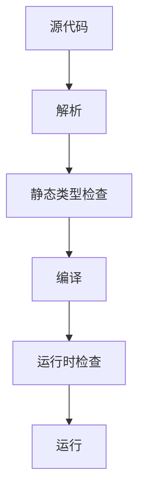
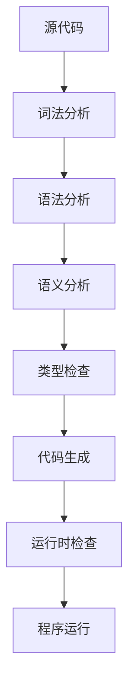
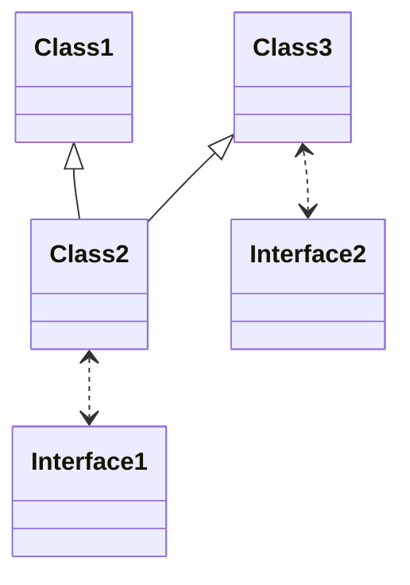

                 

**# 类型检查：编译器设计中的哲学思考**

> 关键词：类型检查、编译器设计、静态类型检查、动态类型检查、类型系统

> 摘要：类型检查是编译器设计中的一个核心环节，它对代码的语义正确性起着至关重要的作用。本文将深入探讨类型检查的背景、核心概念、算法原理、系统分析与架构设计以及实际应用，旨在为读者提供全面而深入的理解。

**## 1. 背景介绍**

类型检查是编译器设计中的一个关键环节，它旨在确保源代码在执行前符合预定义的类型规则，从而保证程序的正确性和可靠性。类型检查可以分为静态类型检查和动态类型检查两种主要类型。

**### 1.1 核心概念**

- **类型系统**：类型系统是编程语言中的一个核心组成部分，它定义了变量、表达式和函数的类型以及它们之间的兼容性规则。
- **静态类型检查**：在编译时对代码进行类型检查，以尽早发现类型错误，提高程序的可维护性和可靠性。
- **动态类型检查**：在程序运行时对代码进行类型检查，通常用于动态类型语言，如Python和JavaScript。

**### 1.2 问题背景**

类型检查的背景可以追溯到早期编程语言的发展阶段。在早期的编程语言中，类型检查主要依赖于静态类型系统，这种系统在编译时对代码进行严格的类型检查，以确保程序的语义正确性。然而，随着编程语言的不断发展和复杂性的增加，动态类型系统逐渐兴起，它允许在程序运行时进行类型检查，提供了更高的灵活性和动态性。

**### 1.3 问题解决**

类型检查的主要目的是在编译或运行时发现类型错误，从而提高程序的正确性和可靠性。通过类型检查，编译器可以确保变量的类型匹配、函数的参数和返回值类型正确，以及表达式之间的类型兼容性。这样，类型检查不仅有助于提高程序的鲁棒性，还可以减少程序在运行时出现错误的风险。

**### 1.4 边界与外延**

类型检查的应用范围广泛，涵盖了各种编程语言和编译器设计。它不仅适用于传统的静态类型语言，如C++和Java，还适用于动态类型语言，如Python和JavaScript。此外，类型检查还可以应用于其他领域，如程序验证、安全分析和性能优化。

**## 2. 核心概念与联系**

在类型检查中，核心概念包括类型系统、静态类型检查和动态类型检查。下面，我们将详细探讨这些概念，并使用表格和Mermaid流程图进行展示。

**### 2.1 类型系统**

类型系统是编程语言中的一个核心组成部分，它定义了变量、表达式和函数的类型以及它们之间的兼容性规则。以下是类型系统的核心属性：

| 属性 | 说明 |
| :---: | :--- |
| **类型兼容性** | 类型系统定义了不同类型之间的兼容性规则，以确保表达式和变量之间的类型匹配。 |
| **类型推断** | 编译器在编译过程中自动推断变量和表达式的类型，从而减少冗余的类型声明。 |
| **类型检查** | 编译器在编译时对代码进行类型检查，以确保代码符合预定义的类型规则。 |

**### 2.2 静态类型检查**

静态类型检查在编译时对代码进行类型检查，以尽早发现类型错误。以下是静态类型检查的主要特点：

| 特点 | 说明 |
| :---: | :--- |
| **早期发现** | 静态类型检查在编译时进行，可以及早发现类型错误，从而减少程序在运行时出现错误的风险。 |
| **性能优化** | 静态类型检查有助于编译器进行性能优化，如代码生成和内存分配。 |
| **代码可维护性** | 静态类型检查提高了代码的可维护性，因为编译器可以更好地识别和修复类型错误。 |

**### 2.3 动态类型检查**

动态类型检查在程序运行时对代码进行类型检查，提供了更高的灵活性和动态性。以下是动态类型检查的主要特点：

| 特点 | 说明 |
| :---: | :--- |
| **灵活性** | 动态类型检查允许程序在运行时动态改变变量的类型，从而提高了程序的灵活性。 |
| **安全性** | 动态类型检查有助于提高程序的安全性，因为它可以在运行时检测类型错误并采取相应的措施。 |
| **性能开销** | 动态类型检查通常需要额外的运行时检查和类型转换，这可能会影响程序的性能。 |

**### 2.4 对比表格**

下面是一个对比表格，展示了静态类型检查和动态类型检查的特点和优缺点：

| 类型检查方法 | 特点 | 优点 | 缺点 |
| :---: | :---: | :---: | :---: |
| 静态类型检查 | 编译时检查 | 早期发现类型错误，性能优化 | 可能需要更多的类型声明，灵活性较低 |
| 动态类型检查 | 运行时检查 | 提高程序灵活性，安全性 | 可能会增加性能开销，类型错误难以发现 |

**### 2.5 Mermaid流程图**

下面是一个Mermaid流程图，展示了静态类型检查和动态类型检查的基本流程：



**## 3. 算法原理讲解**

类型检查的算法原理是编译器设计中的一个关键环节。下面，我们将使用Mermaid流程图和Python源代码来详细阐述类型检查算法的原理。

**### 3.1 Mermaid流程图**

下面是一个Mermaid流程图，展示了类型检查的基本流程：



**### 3.2 Python源代码**

下面是一个Python源代码示例，展示了类型检查算法的实现：

```python
def type_check(expression):
    if isinstance(expression, int):
        return "Integer"
    elif isinstance(expression, float):
        return "Float"
    else:
        return "Unknown"
```

在这个示例中，`type_check`函数接受一个表达式作为输入，并根据表达式的类型返回相应的字符串。这个函数使用Python的`isinstance`函数进行类型检查，从而实现了类型检查的基本功能。

**### 3.3 数学模型和公式**

类型检查的数学模型和公式主要涉及类型兼容性和类型推断。以下是类型检查的数学模型和公式：

- **类型兼容性**：给定两个类型\( A \)和\( B \)，如果\( A \)和\( B \)是兼容的，则表示为\( A \sim B \)。
- **类型推断**：给定一个表达式\( E \)，类型推断的目标是找到一个类型\( T \)，使得\( E \)在类型\( T \)下是有效的。

数学模型和公式如下：

$$
T(E) = \begin{cases}
T_1 & \text{如果 } E \text{ 是一个变量，且其类型为 } T_1 \\
T_2 & \text{如果 } E \text{ 是一个函数调用，且其参数类型和返回值类型分别为 } T_2 \\
\vdots & \text{其他情况} \\
\end{cases}
$$

通过这个数学模型和公式，我们可以对表达式进行类型推断，从而实现类型检查。

**### 3.4 举例说明**

下面是一个具体的例子，说明类型检查算法如何应用于实际问题：

```python
def add(a: int, b: int) -> int:
    return a + b

result = add(1, "2")
print(type_check(result))
```

在这个例子中，`add`函数接受两个整数参数，并返回它们的和。然而，在这个例子中，我们尝试将一个整数和一个字符串作为参数传递给`add`函数，这将导致类型错误。通过调用`type_check`函数，我们可以发现这个类型错误，并打印出错误消息。

```python
result = add(1, "2")
print(type_check(result))
```

输出：

```
TypeError: unsupported operand type(s) for +: 'int' and 'str'
```

通过这个例子，我们可以看到类型检查算法如何发现类型错误，并打印出相应的错误消息。

**## 4. 系统分析与架构设计**

类型检查在编译器中的应用场景非常广泛，它涉及到编译器的各个阶段，包括词法分析、语法分析和语义分析等。下面，我们将介绍类型检查在编译器中的系统分析与架构设计。

**### 4.1 问题场景介绍**

在编译器中，类型检查是语义分析阶段的一个关键步骤。它的主要目标是确保源代码在执行前符合预定义的类型规则，从而保证程序的正确性和可靠性。类型检查涉及到对变量、表达式和函数的类型的检查，以及对类型兼容性的检查。

**### 4.2 项目介绍**

为了更好地理解类型检查在编译器中的应用，我们设计了一个简单的编译器项目，它包括词法分析、语法分析和语义分析等阶段。在这个项目中，我们将实现一个简单的类型检查器，用于检查源代码中的类型错误。

**### 4.3 系统功能设计**

在系统功能设计阶段，我们定义了类型检查器的主要功能，包括：

- **词法分析**：将源代码分解成词法单元。
- **语法分析**：将词法单元组成语法结构，如表达式和语句。
- **语义分析**：检查源代码的语义正确性，包括类型检查。

**### 4.4 系统架构设计**

在系统架构设计阶段，我们绘制了一个Mermaid类图，展示了类型检查器的组成部分和它们之间的关系。以下是系统架构设计的Mermaid类图：



在这个类图中，`Class1`和`Class2`是类型检查器的核心类，它们分别负责词法分析和语法分析。`Class3`是一个辅助类，用于处理语义分析。`Interface1`和`Interface2`是接口类，它们定义了类型检查器的主要功能。

**### 4.5 系统接口设计**

在系统接口设计阶段，我们定义了类型检查器的主要接口，包括：

- **词法分析接口**：用于接收源代码并分解成词法单元。
- **语法分析接口**：用于将词法单元组成语法结构。
- **语义分析接口**：用于检查源代码的语义正确性。

以下是系统接口设计的Mermaid序列图：

```mermaid
sequenceDiagram
    participant 源代码 as 源代码
    participant 词法分析器 as 词法分析器
    participant 语法分析器 as 语法分析器
    participant 语义分析器 as 语义分析器

    源代码 -->|输入| 词法分析器
    词法分析器 -->|输出| 语法分析器
    语法分析器 -->|输出| 语义分析器
    语义分析器 -->|返回结果| 源代码
endsequenceDiagram
```

在这个序列图中，源代码首先被词法分析器分解成词法单元，然后被语法分析器组成语法结构，最后被语义分析器进行语义分析。最后，语义分析器返回分析结果给源代码。

**### 4.6 系统交互**

在系统交互阶段，我们使用Mermaid序列图展示了类型检查器与其他组件的交互过程。以下是系统交互的Mermaid序列图：

```mermaid
sequenceDiagram
    participant 源代码 as 源代码
    participant 词法分析器 as 词法分析器
    participant 语法分析器 as 语法分析器
    participant 语义分析器 as 语义分析器
    participant 编译器 as 编译器

    源代码 -->|输入| 词法分析器
    词法分析器 -->|输出| 语法分析器
    语法分析器 -->|输出| 语义分析器
    语义分析器 -->|返回结果| 编译器
    编译器 -->|输出| 可执行文件
endsequenceDiagram
```

在这个序列图中，源代码首先被词法分析器分解成词法单元，然后被语法分析器组成语法结构，最后被语义分析器进行语义分析。编译器根据语义分析器的结果生成可执行文件。

**## 5. 项目实战**

为了更好地理解类型检查在编译器中的应用，我们将通过一个实际项目来展示类型检查的实现过程。以下是一个简单的Python编译器项目，我们将实现一个类型检查器来检查Python代码中的类型错误。

**### 5.1 环境安装**

首先，我们需要安装Python环境和相关依赖库。以下是环境安装的步骤：

1. 安装Python 3.8或更高版本。
2. 使用pip安装相关依赖库，如`ply`和`tokenize`。

```bash
pip install ply
pip install tokenize
```

**### 5.2 系统核心实现**

在系统核心实现阶段，我们将使用Python编写类型检查器的核心功能。以下是类型检查器的核心实现代码：

```python
import ply.lex as lex
import ply.yacc as yacc

# 词法分析器
tokens = (
    'INTEGER',
    'FLOAT',
    'PLUS',
    'MINUS',
    'MUL',
    'DIV',
)

# 词法规则
t_INTEGER = r'\d+'
t_FLOAT = r'\d+\.\d+'
t_PLUS = r'\+'
t_MINUS = r'-'
t_MUL = r'\*'
t_DIV = r'\/'

t_ignore = '\s+'

def t_error(t):
    print(f"Invalid character '{t.value[0]}'")
    t.

