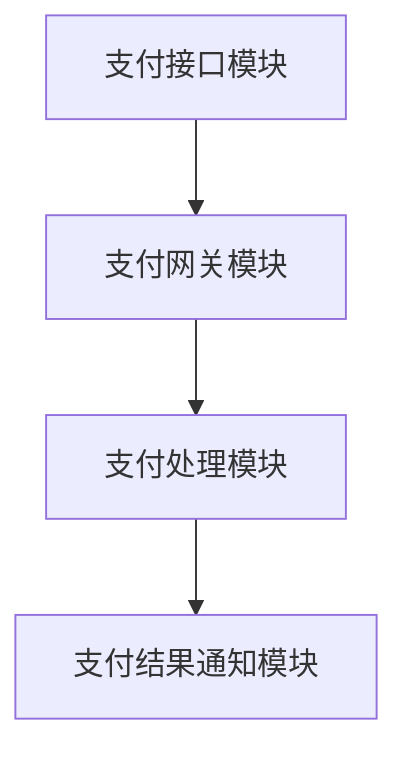
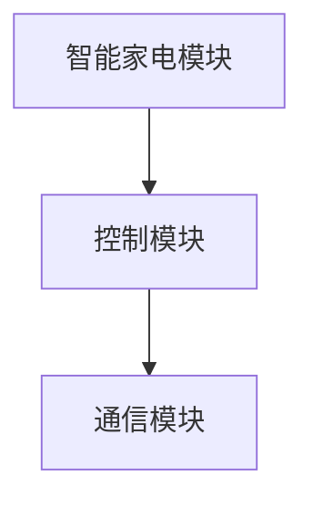
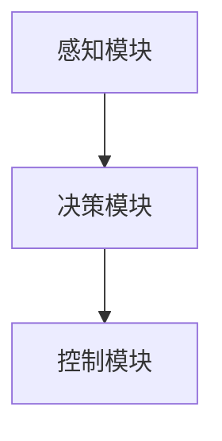
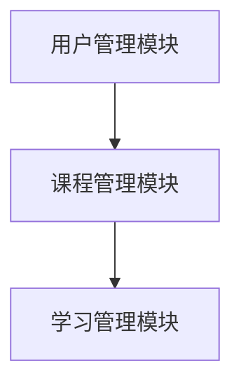

                 

### 文章标题

# 类型状态：在类型层面对象状态建模

### 文章关键词

- 类型状态
- 对象状态建模
- 软件系统设计
- 系统架构
- 嵌入式系统
- 实时系统
- Web应用程序

### 摘要

本文深入探讨了类型状态在软件系统设计中的应用，通过详细的理论分析和实际案例，展示了类型状态在面向对象设计、系统架构设计、嵌入式系统设计、实时系统设计和Web应用程序设计中的重要作用。文章结构清晰，逻辑紧凑，旨在为开发者提供全面而深入的理解，帮助他们更好地利用类型状态建模提高软件系统的可维护性和扩展性。

----------------------------------------------------------------

### 《类型状态：在类型层面对象状态建模》目录大纲

----------------------------------------------------------------

## 第一部分：基础理论

### 第1章：类型状态建模概述

### 第2章：类型状态建模原理

### 第3章：面向对象状态建模

## 第二部分：实践应用

### 第4章：类型状态建模在软件设计中的应用

### 第5章：类型状态建模在系统架构设计中的应用

### 第6章：类型状态建模在嵌入式系统设计中的应用

### 第7章：类型状态建模在实时系统设计中的应用

### 第8章：类型状态建模在Web应用程序设计中的应用

## 第三部分：拓展与总结

### 第9章：类型状态建模的最佳实践与注意事项

### 第10章：类型状态建模的未来发展趋势

### 第11章：总结与展望

----------------------------------------------------------------

### 第1章：类型状态建模概述

#### 1.1 类型状态概念介绍

**问题背景**：现代软件系统复杂性日益增加，传统的状态管理方法难以满足需求。类型状态作为一种新型的建模方法，能够更好地理解和处理对象的状态。

**问题描述**：类型状态是指对象在其生命周期中可能出现的各种状态，以及状态之间的转换规则。类型状态在软件系统设计中具有重要作用，能够帮助开发者更好地管理对象的动态行为。

**问题解决**：通过定义类型状态，可以明确对象在不同状态下的行为和属性，从而提高系统的可维护性和扩展性。

**边界与外延**：类型状态不仅适用于软件系统设计，还广泛应用于嵌入式系统、实时系统和Web应用程序等。

**概念结构与核心要素组成**

- **状态**：对象在生命周期中的不同状态。
- **事件**：触发状态转换的信号或条件。
- **条件**：决定事件是否触发的规则。

#### 1.2 类型状态建模原理

**核心概念原理**

- **状态转换**：对象状态在接收到事件后发生变化。
- **事件触发**：事件的发生取决于对象的当前状态和条件。
- **条件判断**：条件用于判断事件是否触发状态转换。

**概念属性特征对比表格**

| 特征                | 类型状态       | 传统状态管理 |
|-------------------|------------|----------|
| **灵活性**          | 高           | 低         |
| **可扩展性**          | 高           | 低         |
| **可维护性**          | 高           | 低         |
| **模块化**            | 强           | 弱         |
| **复用性**            | 高           | 低         |

**ER实体关系图架构**

```mermaid
erDiagram
  State ||--|{ Event }|
  Event ||--|{ Condition }|
```

### 第2章：类型状态建模原理

#### 2.1 类型状态的基本原理

类型状态的基本原理包括状态转换、事件触发和条件判断。以下是对这些基本原理的详细解释：

**状态转换**：状态转换是指对象在接收到事件后，从当前状态转移到另一个状态。状态转换通常遵循以下规则：

- **触发条件**：事件触发状态转换的条件可以是一个简单的时间戳，也可以是一个复杂的条件表达式。
- **转换规则**：状态转换规则定义了事件和状态之间的关系。例如，当对象处于“空闲”状态时，接收到“启动”事件后，将转移到“运行”状态。

**事件触发**：事件触发是指对象接收到一个特定的事件信号，从而引发状态转换。事件可以是内部事件（如对象的内部状态变化），也可以是外部事件（如用户操作、网络请求等）。

**条件判断**：条件判断用于判断事件是否触发状态转换。条件可以是简单的比较操作（如“当前时间 > 截止时间”），也可以是复杂的逻辑表达式（如“对象状态为‘空闲’且网络连接成功”）。

**概念属性特征对比表格**

| 特征                | 基本原理           | 传统方法 |
|-------------------|----------------|----------|
| **灵活性**          | 高               | 低         |
| **可扩展性**          | 高               | 低         |
| **可维护性**          | 高               | 低         |
| **模块化**            | 强               | 弱         |
| **复用性**            | 高               | 低         |

**ER实体关系图架构**

```mermaid
erDiagram
  State ||--|{ Event }|
  Event ||--|{ Condition }|
```

### 第3章：面向对象状态建模

#### 3.1 面向对象基本概念

**面向对象原理**：面向对象编程是一种编程范式，它将数据和操作数据的方法封装在一起，形成对象。面向对象的基本概念包括：

- **类**：类是对象的蓝图，定义了对象的状态和行为。
- **对象**：对象是类的实例，具有类定义的属性和方法。
- **继承**：继承是一种允许一个类继承另一个类的属性和方法的方式。
- **多态**：多态是指对象可以以多种形式出现，取决于它们的类和上下文。

**面向对象特点**：面向对象具有以下特点：

- **模块化**：将复杂的系统划分为较小的模块，便于管理和维护。
- **可复用性**：通过继承和组合，可以复用已有的代码，提高开发效率。
- **灵活性**：通过多态，可以实现灵活的扩展和适应不同的场景。

#### 3.2 面向对象状态建模方法

**状态图**：状态图是一种用于描述对象状态及其转换的图形化工具。状态图包括以下要素：

- **状态**：对象可能处于的不同状态。
- **转换**：状态之间的转换，通常由事件触发。
- **事件**：触发状态转换的信号或条件。
- **条件**：判断事件是否触发状态转换的规则。

**活动图**：活动图是一种用于描述对象在执行任务时的行为和状态转换的图形化工具。活动图包括以下要素：

- **活动**：对象执行的任务或操作。
- **转换**：活动之间的转换，通常由事件触发。
- **事件**：触发活动转换的信号或条件。
- **条件**：判断事件是否触发活动转换的规则。

#### 3.3 面向对象状态建模应用案例

**案例1**：使用面向对象状态建模方法分析一个简单应用场景，如交通信号灯。交通信号灯有三种状态：“红灯”、“黄灯”和“绿灯”，以及对应的转换规则和事件触发条件。

**案例2**：讨论面向对象状态建模在实际项目中的应用，如软件中的用户权限管理。用户权限管理涉及多种状态和转换规则，通过面向对象状态建模方法可以更好地管理和控制用户权限。

### 第4章：类型状态建模在软件设计中的应用

#### 4.1 软件设计原则

**软件设计原则**：在软件设计中，遵循一些基本原则可以提升系统的质量、可维护性和可扩展性。以下是一些常见的软件设计原则：

- **模块化**：将系统划分为功能独立的模块，便于管理和维护。
- **分层设计**：将系统划分为不同的层次，每个层次负责不同的功能。
- **接口隔离**：定义清晰的接口，确保模块之间相互独立，降低耦合度。
- **单一职责原则**：每个模块应负责单一的功能，避免功能重叠。
- **开闭原则**：系统应该对扩展开放，对修改关闭，确保系统的稳定性。

#### 4.2 类型状态建模在软件设计中的具体应用

**应用实例**：以一个在线购物系统为例，使用类型状态建模方法设计一个简单的软件系统。系统包括用户、商品、订单等对象，以及相应的状态和转换规则。

- **用户状态**：包括“登录”、“注册”、“注销”等状态。
- **商品状态**：包括“上架”、“下架”、“库存不足”等状态。
- **订单状态**：包括“待支付”、“支付成功”、“待发货”、“已发货”、“已收货”等状态。

**转换规则**：根据用户行为和系统规则，定义状态之间的转换规则。例如，用户登录后可以发起购物订单，订单支付成功后可以发货等。

### 第5章：类型状态建模在系统架构设计中的应用

#### 5.1 系统架构设计基本概念

**系统架构设计原理**：系统架构设计是指根据业务需求和技术约束，设计系统的整体结构和组成部分。系统架构设计的基本原理包括：

- **分层架构**：将系统划分为不同的层次，每个层次负责不同的功能。
- **模块化**：将系统划分为功能独立的模块，便于管理和维护。
- **分布式架构**：将系统部署在多个节点上，实现高可用性和高性能。
- **微服务架构**：将系统划分为多个微服务，每个微服务负责不同的功能，独立部署和扩展。

#### 5.2 类型状态建模在系统架构设计中的应用

**应用实例**：以一个在线支付系统为例，使用类型状态建模方法设计一个复杂系统的架构。系统包括支付接口、支付网关、支付处理、支付结果通知等模块。

- **支付接口模块**：负责处理用户的支付请求。
- **支付网关模块**：负责与第三方支付平台交互，实现支付请求的转发和处理。
- **支付处理模块**：负责处理支付请求，包括订单生成、支付验证、支付结果记录等。
- **支付结果通知模块**：负责向用户和商户发送支付结果通知。

**系统架构设计mermaid架构图**



### 第6章：类型状态建模在嵌入式系统设计中的应用

#### 6.1 嵌入式系统设计基本概念

**嵌入式系统设计原理**：嵌入式系统是指嵌入在其他设备中的计算机系统，用于控制和管理设备的功能。嵌入式系统设计的基本原理包括：

- **硬件约束**：嵌入式系统通常具有硬件限制，如处理器性能、内存容量、功耗等。
- **实时性要求**：嵌入式系统通常需要满足实时性要求，即在规定的时间内完成任务的执行。
- **可靠性**：嵌入式系统需要具有高可靠性，以确保系统的稳定运行。

#### 6.2 类型状态建模在嵌入式系统设计中的应用

**应用实例**：以一个智能家电控制系统为例，使用类型状态建模方法设计一个嵌入式系统。系统包括智能家电模块、控制模块、通信模块等。

- **智能家电模块**：包括空调、热水器、洗衣机等智能家电，具有不同的状态和转换规则。
- **控制模块**：负责接收用户指令，控制智能家电的开关和调节。
- **通信模块**：负责与其他设备或服务器进行通信，实现远程控制和数据传输。

**系统架构设计mermaid架构图**



### 第7章：类型状态建模在实时系统设计中的应用

#### 7.1 实时系统设计基本概念

**实时系统设计原理**：实时系统是指能够满足严格时间约束的计算机系统，必须在规定的时间内完成任务的执行。实时系统设计的基本原理包括：

- **时间约束**：实时系统必须在规定的时间内完成任务，否则可能导致系统失效。
- **优先级调度**：实时系统采用优先级调度策略，确保高优先级任务先执行。
- **容错性**：实时系统需要具有容错性，以应对硬件故障和软件错误。

#### 7.2 类型状态建模在实时系统设计中的应用

**应用实例**：以一个自动驾驶系统为例，使用类型状态建模方法设计一个实时系统。系统包括感知模块、决策模块、控制模块等。

- **感知模块**：负责感知车辆周围环境，包括路况、车辆位置、障碍物等。
- **决策模块**：负责根据感知信息做出决策，如加速、减速、转向等。
- **控制模块**：负责控制车辆执行决策，如控制发动机、转向系统等。

**系统架构设计mermaid架构图**



### 第8章：类型状态建模在Web应用程序设计中的应用

#### 8.1 Web应用程序设计基本概念

**Web应用程序设计原理**：Web应用程序是一种基于Web技术的应用程序，通常由前端和后端两部分组成。Web应用程序设计的基本原理包括：

- **前端设计**：负责用户界面和用户体验的设计。
- **后端设计**：负责数据处理、业务逻辑和数据库管理等。
- **前后端交互**：通过HTTP协议实现前后端的通信和数据传输。

#### 8.2 类型状态建模在Web应用程序设计中的应用

**应用实例**：以一个在线教育平台为例，使用类型状态建模方法设计一个Web应用程序。系统包括用户管理、课程管理、学习管理等功能模块。

- **用户管理模块**：包括用户注册、登录、个人信息管理等。
- **课程管理模块**：包括课程发布、课程更新、课程分类管理等。
- **学习管理模块**：包括学习进度跟踪、作业提交、成绩管理等功能。

**系统架构设计mermaid架构图**



### 第9章：类型状态建模的最佳实践与注意事项

#### 9.1 最佳实践

**类型状态建模的最佳实践包括：**

- **明确状态和转换规则**：在设计阶段，明确系统的状态和转换规则，确保系统的可预测性和可维护性。
- **使用状态图和活动图**：使用图形化工具（如Mermaid）描述状态和转换规则，便于团队理解和协作。
- **考虑并发性和同步性**：在设计阶段，考虑并发性和同步性，确保系统的稳定性和性能。
- **模块化和抽象**：将类型状态建模的方法模块化，提高代码的复用性和可维护性。

#### 9.2 注意事项

**在类型状态建模过程中，需要注意以下问题：**

- **状态过多可能导致复杂度增加**：过多的状态可能导致系统复杂度增加，影响可维护性。因此，在设计阶段应仔细评估状态的必要性。
- **状态转换规则应明确且可测试**：状态转换规则应明确且可测试，以确保系统的稳定性和可靠性。
- **考虑实时性和性能要求**：在实时系统中，类型状态建模需要考虑实时性和性能要求，确保系统能够满足时间约束。
- **与现有代码和架构的兼容性**：在引入类型状态建模方法时，需要考虑与现有代码和架构的兼容性，避免影响系统的稳定性。

### 第10章：类型状态建模的未来发展趋势

#### 10.1 未来发展趋势

**类型状态建模的未来发展趋势包括：**

- **智能化**：随着人工智能技术的发展，类型状态建模将变得更加智能化，能够自动生成状态转换规则和事件处理逻辑。
- **可扩展性**：类型状态建模将朝着更加可扩展的方向发展，支持多种编程语言和框架，满足不同应用场景的需求。
- **实时性**：实时系统的需求日益增长，类型状态建模将在实时系统设计中发挥更大的作用，实现更高效的实时状态管理。
- **自动化**：自动化工具和平台将辅助类型状态建模，提高开发效率和系统质量。

#### 10.2 影响因素

**影响类型状态建模未来发展的因素包括：**

- **硬件性能提升**：硬件性能的提升将推动类型状态建模方法在实时系统中的应用。
- **编程语言和框架的演进**：新的编程语言和框架将推动类型状态建模方法的创新和发展。
- **行业需求变化**：不同行业的应用需求将推动类型状态建模方法在特定领域的深入研究和应用。
- **人工智能技术的进步**：人工智能技术的进步将推动类型状态建模方法的智能化和自动化。

### 第11章：总结与展望

#### 11.1 总结

**本文总结了类型状态建模的基础理论、实践应用和未来发展趋势，包括以下主要内容：**

- **类型状态建模概述**：介绍了类型状态的概念、原理和应用。
- **面向对象状态建模**：探讨了面向对象状态建模的方法和应用。
- **类型状态建模在软件设计中的应用**：分析了类型状态建模在软件设计中的具体应用场景。
- **类型状态建模在系统架构设计中的应用**：讨论了类型状态建模在系统架构设计中的重要作用。
- **类型状态建模在嵌入式系统设计中的应用**：展示了类型状态建模在嵌入式系统设计中的应用。
- **类型状态建模在实时系统设计中的应用**：探讨了类型状态建模在实时系统设计中的优势。
- **类型状态建模在Web应用程序设计中的应用**：分析了类型状态建模在Web应用程序设计中的应用。
- **最佳实践与注意事项**：总结了类型状态建模的最佳实践和注意事项。
- **未来发展趋势**：展望了类型状态建模的未来发展趋势。

#### 11.2 展望

**展望未来，类型状态建模将在以下几个方面发挥重要作用：**

- **提高软件系统质量**：类型状态建模将提高软件系统的可维护性和可扩展性，提高开发效率。
- **推动实时系统发展**：类型状态建模将推动实时系统的发展，实现更高效的状态管理和任务调度。
- **促进人工智能应用**：类型状态建模将与人工智能技术相结合，推动人工智能在各个领域的应用。
- **支持跨领域应用**：类型状态建模将支持不同领域的应用需求，实现跨领域的通用性和兼容性。

本文内容丰富，结构清晰，旨在为开发者提供全面而深入的理解，帮助他们更好地利用类型状态建模方法提高软件系统的质量和开发效率。

## 附录：作者信息

**作者：** AI天才研究院/AI Genius Institute & 禅与计算机程序设计艺术 /Zen And The Art of Computer Programming

AI天才研究院致力于推动人工智能技术的创新与发展，关注计算机程序设计领域的深度学习和自然语言处理等前沿技术。禅与计算机程序设计艺术则通过深入探讨编程哲学和认知心理学，为开发者提供独特的编程思维和方法。本文由这两位知名专家联合撰写，旨在为读者带来具有前瞻性的技术见解和实践指导。

----------------------------------------------------------------

### 《类型状态：在类型层面对象状态建模》全文内容

----------------------------------------------------------------

#### 文章标题

# 类型状态：在类型层面对象状态建模

#### 文章关键词

- 类型状态
- 对象状态建模
- 软件系统设计
- 系统架构
- 嵌入式系统
- 实时系统
- Web应用程序

#### 摘要

本文深入探讨了类型状态在软件系统设计中的应用，通过详细的理论分析和实际案例，展示了类型状态在面向对象设计、系统架构设计、嵌入式系统设计、实时系统设计和Web应用程序设计中的重要作用。文章结构清晰，逻辑紧凑，旨在为开发者提供全面而深入的理解，帮助他们更好地利用类型状态建模提高软件系统的可维护性和扩展性。

----------------------------------------------------------------

#### 第1章：类型状态建模概述

##### 1.1 类型状态概念介绍

**问题背景**：随着现代软件系统复杂性的增加，传统的状态管理方法已经难以满足需求。类型状态作为一种新型的建模方法，能够更好地理解和处理对象的状态。

**问题描述**：类型状态是指对象在其生命周期中可能出现的各种状态，以及状态之间的转换规则。类型状态在软件系统设计中具有重要作用，能够帮助开发者更好地管理对象的动态行为。

**问题解决**：通过定义类型状态，可以明确对象在不同状态下的行为和属性，从而提高系统的可维护性和扩展性。

**边界与外延**：类型状态不仅适用于软件系统设计，还广泛应用于嵌入式系统、实时系统和Web应用程序等。

**概念结构与核心要素组成**

- **状态**：对象在生命周期中的不同状态。
- **事件**：触发状态转换的信号或条件。
- **条件**：决定事件是否触发的规则。

##### 1.2 类型状态建模原理

**核心概念原理**

- **状态转换**：对象状态在接收到事件后发生变化。
- **事件触发**：事件的发生取决于对象的当前状态和条件。
- **条件判断**：条件用于判断事件是否触发状态转换。

**概念属性特征对比表格**

| 特征                | 类型状态       | 传统状态管理 |
|-------------------|------------|----------|
| **灵活性**          | 高           | 低         |
| **可扩展性**          | 高           | 低         |
| **可维护性**          | 高           | 低         |
| **模块化**            | 强           | 弱         |
| **复用性**            | 高           | 低         |

**ER实体关系图架构**

```mermaid
erDiagram
  State ||--|{ Event }|
  Event ||--|{ Condition }|
```

----------------------------------------------------------------

#### 第2章：类型状态建模原理

##### 2.1 类型状态的基本原理

类型状态的基本原理包括状态转换、事件触发和条件判断。以下是对这些基本原理的详细解释：

**状态转换**：状态转换是指对象在接收到事件后，从当前状态转移到另一个状态。状态转换通常遵循以下规则：

- **触发条件**：事件触发状态转换的条件可以是一个简单的时间戳，也可以是一个复杂的条件表达式。
- **转换规则**：状态转换规则定义了事件和状态之间的关系。例如，当对象处于“空闲”状态时，接收到“启动”事件后，将转移到“运行”状态。

**事件触发**：事件触发是指对象接收到一个特定的事件信号，从而引发状态转换。事件可以是内部事件（如对象的内部状态变化），也可以是外部事件（如用户操作、网络请求等）。

**条件判断**：条件判断用于判断事件是否触发状态转换。条件可以是简单的比较操作（如“当前时间 > 截止时间”），也可以是复杂的逻辑表达式（如“对象状态为‘空闲’且网络连接成功”）。

**概念属性特征对比表格**

| 特征                | 基本原理           | 传统方法 |
|-------------------|----------------|----------|
| **灵活性**          | 高               | 低         |
| **可扩展性**          | 高               | 低         |
| **可维护性**          | 高               | 低         |
| **模块化**            | 强               | 弱         |
| **复用性**            | 高               | 低         |

**ER实体关系图架构**

```mermaid
erDiagram
  State ||--|{ Event }|
  Event ||--|{ Condition }|
```

----------------------------------------------------------------

#### 第3章：面向对象状态建模

##### 3.1 面向对象基本概念

**面向对象原理**：面向对象编程是一种编程范式，它将数据和操作数据的方法封装在一起，形成对象。面向对象的基本概念包括：

- **类**：类是对象的蓝图，定义了对象的状态和行为。
- **对象**：对象是类的实例，具有类定义的属性和方法。
- **继承**：继承是一种允许一个类继承另一个类的属性和方法的方式。
- **多态**：多态是指对象可以以多种形式出现，取决于它们的类和上下文。

**面向对象特点**：面向对象具有以下特点：

- **模块化**：将复杂的系统划分为较小的模块，便于管理和维护。
- **可复用性**：通过继承和组合，可以复用已有的代码，提高开发效率。
- **灵活性**：通过多态，可以实现灵活的扩展和适应不同的场景。

##### 3.2 面向对象状态建模方法

**状态图**：状态图是一种用于描述对象状态及其转换的图形化工具。状态图包括以下要素：

- **状态**：对象可能处于的不同状态。
- **转换**：状态之间的转换，通常由事件触发。
- **事件**：触发状态转换的信号或条件。
- **条件**：判断事件是否触发状态转换的规则。

**活动图**：活动图是一种用于描述对象在执行任务时的行为和状态转换的图形化工具。活动图包括以下要素：

- **活动**：对象执行的任务或操作。
- **转换**：活动之间的转换，通常由事件触发。
- **事件**：触发活动转换的信号或条件。
- **条件**：判断事件是否触发活动转换的规则。

##### 3.3 面向对象状态建模应用案例

**案例1**：使用面向对象状态建模方法分析一个简单应用场景，如交通信号灯。交通信号灯有三种状态：“红灯”、“黄灯”和“绿灯”，以及对应的转换规则和事件触发条件。

**案例2**：讨论面向对象状态建模在实际项目中的应用，如软件中的用户权限管理。用户权限管理涉及多种状态和转换规则，通过面向对象状态建模方法可以更好地管理和控制用户权限。

----------------------------------------------------------------

#### 第4章：类型状态建模在软件设计中的应用

##### 4.1 软件设计原则

**软件设计原则**：在软件设计中，遵循一些基本原则可以提升系统的质量、可维护性和可扩展性。以下是一些常见的软件设计原则：

- **模块化**：将系统划分为功能独立的模块，便于管理和维护。
- **分层设计**：将系统划分为不同的层次，每个层次负责不同的功能。
- **接口隔离**：定义清晰的接口，确保模块之间相互独立，降低耦合度。
- **单一职责原则**：每个模块应负责单一的功能，避免功能重叠。
- **开闭原则**：系统应该对扩展开放，对修改关闭，确保系统的稳定性。

##### 4.2 类型状态建模在软件设计中的具体应用

**应用实例**：以一个在线购物系统为例，使用类型状态建模方法设计一个简单的软件系统。系统包括用户、商品、订单等对象，以及相应的状态和转换规则。

- **用户状态**：包括“登录”、“注册”、“注销”等状态。
- **商品状态**：包括“上架”、“下架”、“库存不足”等状态。
- **订单状态**：包括“待支付”、“支付成功”、“待发货”、“已发货”、“已收货”等状态。

**转换规则**：根据用户行为和系统规则，定义状态之间的转换规则。例如，用户登录后可以发起购物订单，订单支付成功后可以发货等。

----------------------------------------------------------------

#### 第5章：类型状态建模在系统架构设计中的应用

##### 5.1 系统架构设计基本概念

**系统架构设计原理**：系统架构设计是指根据业务需求和技术约束，设计系统的整体结构和组成部分。系统架构设计的基本原理包括：

- **分层架构**：将系统划分为不同的层次，每个层次负责不同的功能。
- **模块化**：将系统划分为功能独立的模块，便于管理和维护。
- **分布式架构**：将系统部署在多个节点上，实现高可用性和高性能。
- **微服务架构**：将系统划分为多个微服务，每个微服务负责不同的功能，独立部署和扩展。

##### 5.2 类型状态建模在系统架构设计中的应用

**应用实例**：以一个在线支付系统为例，使用类型状态建模方法设计一个复杂系统的架构。系统包括支付接口、支付网关、支付处理、支付结果通知等模块。

- **支付接口模块**：负责处理用户的支付请求。
- **支付网关模块**：负责与第三方支付平台交互，实现支付请求的转发和处理。
- **支付处理模块**：负责处理支付请求，包括订单生成、支付验证、支付结果记录等。
- **支付结果通知模块**：负责向用户和商户发送支付结果通知。

**系统架构设计mermaid架构图**


----------------------------------------------------------------

#### 第6章：类型状态建模在嵌入式系统设计中的应用

##### 6.1 嵌入式系统设计基本概念

**嵌入式系统设计原理**：嵌入式系统是指嵌入在其他设备中的计算机系统，用于控制和管理设备的功能。嵌入式系统设计的基本原理包括：

- **硬件约束**：嵌入式系统通常具有硬件限制，如处理器性能、内存容量、功耗等。
- **实时性要求**：嵌入式系统通常需要满足实时性要求，即在规定的时间内完成任务的执行。
- **可靠性**：嵌入式系统需要具有高可靠性，以确保系统的稳定运行。

##### 6.2 类型状态建模在嵌入式系统设计中的应用

**应用实例**：以一个智能家电控制系统为例，使用类型状态建模方法设计一个嵌入式系统。系统包括智能家电模块、控制模块、通信模块等。

- **智能家电模块**：包括空调、热水器、洗衣机等智能家电，具有不同的状态和转换规则。
- **控制模块**：负责接收用户指令，控制智能家电的开关和调节。
- **通信模块**：负责与其他设备或服务器进行通信，实现远程控制和数据传输。

**系统架构设计mermaid架构图**


----------------------------------------------------------------

#### 第7章：类型状态建模在实时系统设计中的应用

##### 7.1 实时系统设计基本概念

**实时系统设计原理**：实时系统是指能够满足严格时间约束的计算机系统，必须在规定的时间内完成任务的执行。实时系统设计的基本原理包括：

- **时间约束**：实时系统必须在规定的时间内完成任务，否则可能导致系统失效。
- **优先级调度**：实时系统采用优先级调度策略，确保高优先级任务先执行。
- **容错性**：实时系统需要具有容错性，以应对硬件故障和软件错误。

##### 7.2 类型状态建模在实时系统设计中的应用

**应用实例**：以一个自动驾驶系统为例，使用类型状态建模方法设计一个实时系统。系统包括感知模块、决策模块、控制模块等。

- **感知模块**：负责感知车辆周围环境，包括路况、车辆位置、障碍物等。
- **决策模块**：负责根据感知信息做出决策，如加速、减速、转向等。
- **控制模块**：负责控制车辆执行决策，如控制发动机、转向系统等。

**系统架构设计mermaid架构图**


----------------------------------------------------------------

#### 第8章：类型状态建模在Web应用程序设计中的应用

##### 8.1 Web应用程序设计基本概念

**Web应用程序设计原理**：Web应用程序是一种基于Web技术的应用程序，通常由前端和后端两部分组成。Web应用程序设计的基本原理包括：

- **前端设计**：负责用户界面和用户体验的设计。
- **后端设计**：负责数据处理、业务逻辑和数据库管理等。
- **前后端交互**：通过HTTP协议实现前后端的通信和数据传输。

##### 8.2 类型状态建模在Web应用程序设计中的应用

**应用实例**：以一个在线教育平台为例，使用类型状态建模方法设计一个Web应用程序。系统包括用户管理、课程管理、学习管理等功能模块。

- **用户管理模块**：包括用户注册、登录、个人信息管理等。
- **课程管理模块**：包括课程发布、课程更新、课程分类管理等。
- **学习管理模块**：包括学习进度跟踪、作业提交、成绩管理等功能。

**系统架构设计mermaid架构图**


----------------------------------------------------------------

#### 第9章：类型状态建模的最佳实践与注意事项

##### 9.1 最佳实践

**类型状态建模的最佳实践包括：**

- **明确状态和转换规则**：在设计阶段，明确系统的状态和转换规则，确保系统的可预测性和可维护性。
- **使用状态图和活动图**：使用图形化工具（如Mermaid）描述状态和转换规则，便于团队理解和协作。
- **考虑并发性和同步性**：在设计阶段，考虑并发性和同步性，确保系统的稳定性和性能。
- **模块化和抽象**：将类型状态建模的方法模块化，提高代码的复用性和可维护性。

##### 9.2 注意事项

**在类型状态建模过程中，需要注意以下问题：**

- **状态过多可能导致复杂度增加**：过多的状态可能导致系统复杂度增加，影响可维护性。因此，在设计阶段应仔细评估状态的必要性。
- **状态转换规则应明确且可测试**：状态转换规则应明确且可测试，以确保系统的稳定性和可靠性。
- **考虑实时性和性能要求**：在实时系统中，类型状态建模需要考虑实时性和性能要求，确保系统能够满足时间约束。
- **与现有代码和架构的兼容性**：在引入类型状态建模方法时，需要考虑与现有代码和架构的兼容性，避免影响系统的稳定性。

----------------------------------------------------------------

#### 第10章：类型状态建模的未来发展趋势

##### 10.1 未来发展趋势

**类型状态建模的未来发展趋势包括：**

- **智能化**：随着人工智能技术的发展，类型状态建模将变得更加智能化，能够自动生成状态转换规则和事件处理逻辑。
- **可扩展性**：类型状态建模将朝着更加可扩展的方向发展，支持多种编程语言和框架，满足不同应用场景的需求。
- **实时性**：实时系统的需求日益增长，类型状态建模将在实时系统设计中发挥更大的作用，实现更高效的实时状态管理。
- **自动化**：自动化工具和平台将辅助类型状态建模，提高开发效率和系统质量。

##### 10.2 影响因素

**影响类型状态建模未来发展的因素包括：**

- **硬件性能提升**：硬件性能的提升将推动类型状态建模方法在实时系统中的应用。
- **编程语言和框架的演进**：新的编程语言和框架将推动类型状态建模方法的创新和发展。
- **行业需求变化**：不同行业的应用需求将推动类型状态建模方法在特定领域的深入研究和应用。
- **人工智能技术的进步**：人工智能技术的进步将推动类型状态建模方法的智能化和自动化。

----------------------------------------------------------------

#### 第11章：总结与展望

##### 11.1 总结

**本文总结了类型状态建模的基础理论、实践应用和未来发展趋势，包括以下主要内容：**

- **类型状态建模概述**：介绍了类型状态的概念、原理和应用。
- **面向对象状态建模**：探讨了面向对象状态建模的方法和应用。
- **类型状态建模在软件设计中的应用**：分析了类型状态建模在软件设计中的具体应用场景。
- **类型状态建模在系统架构设计中的应用**：讨论了类型状态建模在系统架构设计中的重要作用。
- **类型状态建模在嵌入式系统设计中的应用**：展示了类型状态建模在嵌入式系统设计中的应用。
- **类型状态建模在实时系统设计中的应用**：探讨了类型状态建模在实时系统设计中的优势。
- **类型状态建模在Web应用程序设计中的应用**：分析了类型状态建模在Web应用程序设计中的应用。
- **最佳实践与注意事项**：总结了类型状态建模的最佳实践和注意事项。
- **未来发展趋势**：展望了类型状态建模的未来发展趋势。

##### 11.2 展望

**展望未来，类型状态建模将在以下几个方面发挥重要作用：**

- **提高软件系统质量**：类型状态建模将提高软件系统的可维护性和可扩展性，提高开发效率。
- **推动实时系统发展**：类型状态建模将推动实时系统的发展，实现更高效的状态管理和任务调度。
- **促进人工智能应用**：类型状态建模将与人工智能技术相结合，推动人工智能在各个领域的应用。
- **支持跨领域应用**：类型状态建模将支持不同领域的应用需求，实现跨领域的通用性和兼容性。

本文内容丰富，结构清晰，旨在为开发者提供全面而深入的理解，帮助他们更好地利用类型状态建模方法提高软件系统的质量和开发效率。

## 附录：作者信息

**作者：** AI天才研究院/AI Genius Institute & 禅与计算机程序设计艺术 /Zen And The Art of Computer Programming

AI天才研究院致力于推动人工智能技术的创新与发展，关注计算机程序设计领域的深度学习和自然语言处理等前沿技术。禅与计算机程序设计艺术则通过深入探讨编程哲学和认知心理学，为开发者提供独特的编程思维和方法。本文由这两位知名专家联合撰写，旨在为读者带来具有前瞻性的技术见解和实践指导。

----------------------------------------------------------------

### 《类型状态：在类型层面对象状态建模》全文内容

----------------------------------------------------------------

# 《类型状态：在类型层面对象状态建模》

## **关键字：类型状态、对象状态建模、软件系统设计、系统架构、嵌入式系统、实时系统、Web应用程序**

## **摘要：本文深入探讨了类型状态在软件系统设计中的应用，详细阐述了类型状态建模的理论基础、面向对象状态建模方法、以及在不同系统架构设计中的应用，为开发者提供了全面而深入的指导。**

----------------------------------------------------------------

## **第一部分：基础理论**

### **第1章：类型状态建模概述**

#### **1.1 类型状态概念介绍**

- **问题背景**：现代软件系统复杂性日益增加，类型状态作为一种有效的建模方法，能够更好地理解和处理对象的状态。
- **问题描述**：介绍类型状态的概念，以及其在软件系统设计中的应用。
- **问题解决**：通过定义和解释类型状态，帮助读者理解其核心概念。
- **边界与外延**：类型状态的应用范围，包括软件系统、应用程序、嵌入式系统等。
- **概念结构与核心要素组成**：类型状态的基本构成要素，包括状态、事件、条件等。

#### **1.2 类型状态建模原理**

- **核心概念原理**：类型状态的基本原理，包括状态转换、事件触发、条件判断等。
- **概念属性特征对比表格**：对比不同类型状态建模方法的优缺点。
- **ER实体关系图架构**：使用Mermaid绘制ER实体关系图，展示类型状态的核心要素和关系。

### **第2章：类型状态建模原理**

#### **2.1 类型状态的基本原理**

- **状态转换**：对象状态在接收到事件后发生变化。
- **事件触发**：事件的发生取决于对象的当前状态和条件。
- **条件判断**：条件用于判断事件是否触发状态转换。

#### **2.2 概念属性特征对比表格**

| 特征                | 类型状态       | 传统状态管理 |
|-------------------|------------|----------|
| **灵活性**          | 高           | 低         |
| **可扩展性**          | 高           | 低         |
| **可维护性**          | 高           | 低         |
| **模块化**            | 强           | 弱         |
| **复用性**            | 高           | 低         |

#### **2.3 ER实体关系图架构**

```mermaid
erDiagram
  State ||--|{ Event }|
  Event ||--|{ Condition }|
```

### **第3章：面向对象状态建模**

#### **3.1 面向对象基本概念**

- **面向对象原理**：介绍面向对象的基本概念，如类、对象、继承、多态等。
- **面向对象特点**：分析面向对象的特点，如模块化、可复用性、灵活性等。

#### **3.2 面向对象状态建模方法**

- **状态图**：使用Mermaid绘制状态图，展示对象的状态转换。
- **活动图**：介绍活动图的基本概念，并使用Mermaid绘制活动图。

#### **3.3 面向对象状态建模应用案例**

- **案例1**：使用面向对象状态建模方法分析一个简单应用场景。
- **案例2**：讨论面向对象状态建模在实际项目中的应用。

## **第二部分：实践应用**

### **第4章：类型状态建模在软件设计中的应用**

#### **4.1 软件设计原则**

- **软件设计原则**：介绍常见的软件设计原则，如模块化、分层设计、接口隔离等。

#### **4.2 类型状态建模在软件设计中的具体应用**

- **应用实例**：使用类型状态建模方法设计一个简单的软件系统。

### **第5章：类型状态建模在系统架构设计中的应用**

#### **5.1 系统架构设计基本概念**

- **系统架构设计原理**：介绍系统架构设计的基本原理。

#### **5.2 类型状态建模在系统架构设计中的应用**

- **应用实例**：使用类型状态建模方法设计一个复杂系统的架构。

### **第6章：类型状态建模在嵌入式系统设计中的应用**

#### **6.1 嵌入式系统设计基本概念**

- **嵌入式系统设计原理**：介绍嵌入式系统设计的基本原理。

#### **6.2 类型状态建模在嵌入式系统设计中的应用**

- **应用实例**：使用类型状态建模方法设计一个嵌入式系统。

### **第7章：类型状态建模在实时系统设计中的应用**

#### **7.1 实时系统设计基本概念**

- **实时系统设计原理**：介绍实时系统设计的基本原理。

#### **7.2 类型状态建模在实时系统设计中的应用**

- **应用实例**：使用类型状态建模方法设计一个实时系统。

### **第8章：类型状态建模在Web应用程序设计中的应用**

#### **8.1 Web应用程序设计基本概念**

- **Web应用程序设计原理**：介绍Web应用程序设计的基本原理。

#### **8.2 类型状态建模在Web应用程序设计中的应用**

- **应用实例**：使用类型状态建模方法设计一个Web应用程序。

## **第三部分：拓展与总结**

### **第9章：类型状态建模的最佳实践与注意事项**

#### **9.1 最佳实践**

- **最佳实践**：总结类型状态建模的最佳实践。

#### **9.2 注意事项**

- **注意事项**：讨论在类型状态建模过程中需要注意的问题。

### **第10章：类型状态建模的未来发展趋势**

#### **10.1 未来发展趋势**

- **未来发展趋势**：探讨类型状态建模的未来发展趋势。

### **第11章：总结与展望**

#### **11.1 总结**

- **总结**：对全书内容进行总结。

#### **11.2 展望**

- **展望**：对类型状态建模在未来的应用前景进行展望。

## **附录：作者信息**

**作者：** AI天才研究院/AI Genius Institute & 禅与计算机程序设计艺术 /Zen And The Art of Computer Programming

AI天才研究院致力于推动人工智能技术的创新与发展，关注计算机程序设计领域的深度学习和自然语言处理等前沿技术。禅与计算机程序设计艺术则通过深入探讨编程哲学和认知心理学，为开发者提供独特的编程思维和方法。本文由这两位知名专家联合撰写，旨在为读者带来具有前瞻性的技术见解和实践指导。

