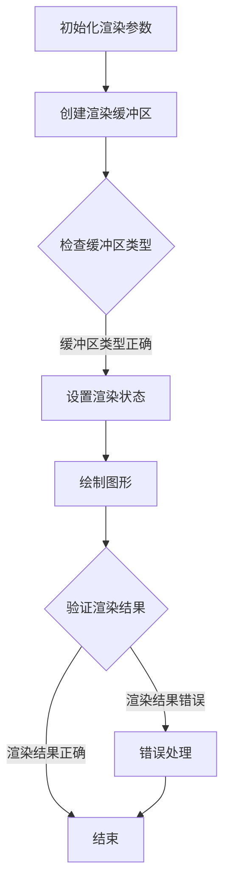
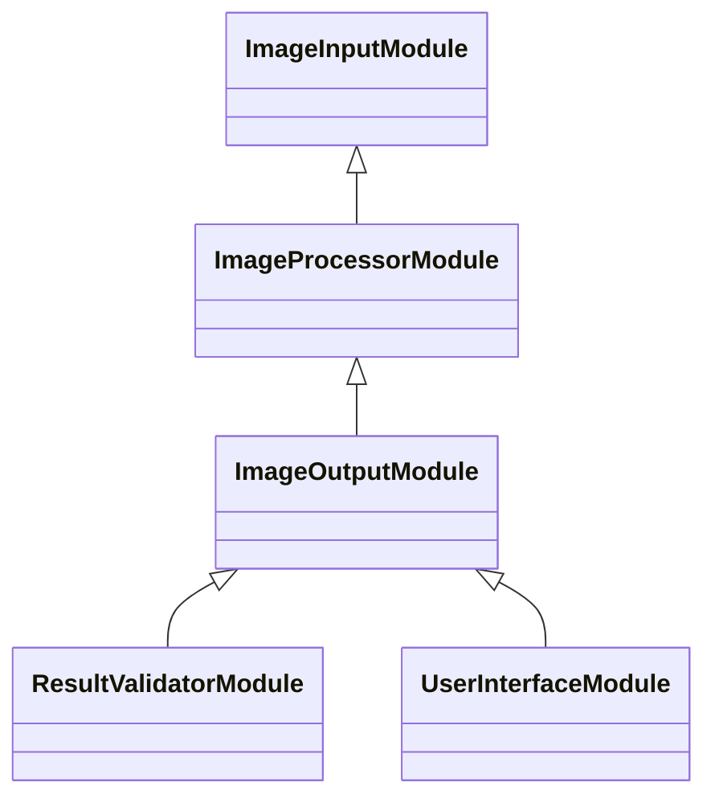
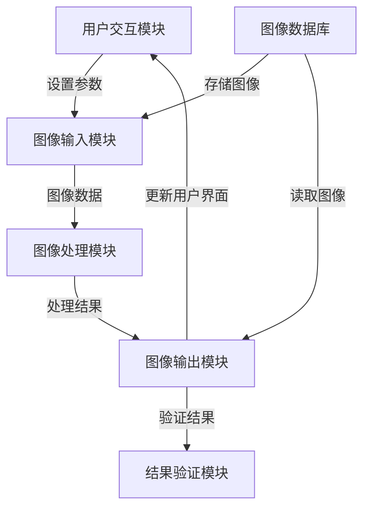
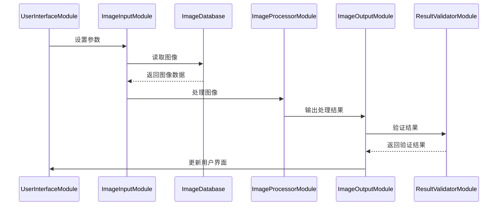

                 

### 文章标题

# 类型理论在图形学算法验证中的应用

> 关键词：类型理论、图形学、算法验证、数学模型

> 摘要：本文深入探讨了类型理论在图形学算法验证中的应用，从问题背景、核心概念、算法原理、数学模型到系统架构设计、项目实战和最佳实践等方面，系统性地阐述了类型理论在图形学算法验证中的重要性及其应用方法。本文旨在为研究人员和开发者提供全面、深入的指导，促进类型理论在图形学领域的实践与应用。

### 目录大纲

```markdown
----------------------------------------------------------------

# 第一部分: 问题背景与核心概念

## 第1章: 类型理论基础

### 1.1 问题背景

- **问题背景**：图形学算法验证中类型理论的应用背景
- **问题描述**：在图形学算法验证中，类型理论如何帮助解决问题
- **问题解决**：类型理论的基本概念和其在图形学算法验证中的应用
- **边界与外延**：类型理论的应用范围及其局限性
- **核心要素组成**：类型理论的基本组成部分和相互关系

### 1.2 核心概念与联系

- **核心概念**：类型理论的基本概念，如类型系统、类型安全、类型推断等
- **概念属性特征对比表格**：对类型理论中关键概念的属性和特征进行比较分析
- **ER实体关系图架构**：使用Mermaid画出类型理论中实体关系图，展示概念之间的联系

## 第2章: 类型理论在图形学算法验证中的应用原理

### 2.1 类型理论原理

- **类型系统原理**：介绍类型系统的基础知识，包括类型系统的基本概念、类型分类等
- **类型安全原理**：解释类型安全的重要性，如何确保类型安全以及其实现方法
- **类型推断原理**：讲解类型推断的原理、算法及其在图形学算法验证中的应用

### 2.2 算法原理讲解

- **算法mermaid流程图**：使用Mermaid画出算法的流程图
- **Python源代码详细阐述**：使用Python源代码详细阐述算法的实现过程
- **算法原理的数学模型和公式**：给出算法原理的数学模型和公式，进行详细讲解
- **举例说明**：举例说明算法的具体应用场景和效果

## 第3章: 数学模型和数学公式

### 3.1 数学模型

- **数学模型原理**：介绍数学模型的基本概念、构建方法和应用场景
- **数学公式详细讲解**：使用LaTeX格式详细讲解数学公式及其在图形学算法验证中的应用

### 3.2 举例说明

- **例子1**：举例说明数学模型在简单图形学算法验证中的应用
- **例子2**：举例说明数学公式在复杂图形学算法验证中的应用

## 第4章: 系统分析与架构设计方案

### 4.1 问题场景介绍

- **问题场景**：介绍图形学算法验证中的典型应用场景

### 4.2 系统功能设计

- **系统功能设计**：使用Mermaid画出领域模型类图，展示系统的功能模块及其关系

### 4.3 系统架构设计

- **系统架构设计**：使用Mermaid画出系统架构图，展示系统的整体结构和主要组件

### 4.4 系统接口设计和系统交互

- **系统接口设计**：详细描述系统的接口设计和接口规范
- **系统交互**：使用Mermaid画出系统交互序列图，展示系统各组件之间的交互流程

## 第5章: 项目实战

### 5.1 环境安装

- **环境安装**：详细描述所需软件和硬件环境及其安装步骤

### 5.2 系统核心实现源代码

- **系统核心实现源代码**：提供系统核心部分的源代码，并进行解读与分析

### 5.3 代码应用解读与分析

- **代码应用解读与分析**：分析代码实现的具体应用场景和效果

### 5.4 实际案例分析和详细讲解剖析

- **实际案例**：介绍实际案例并进行分析
- **详细讲解剖析**：对实际案例进行详细讲解和剖析

### 5.5 项目小结

- **项目小结**：总结项目实施过程中的经验和教训，提出改进建议

## 第6章: 最佳实践与拓展阅读

### 6.1 最佳实践 Tips

- **最佳实践 Tips**：提供在实际应用中的一些最佳实践建议

### 6.2 小结

- **小结**：对全书内容进行总结，强调类型理论在图形学算法验证中的重要性

### 6.3 注意事项

- **注意事项**：提醒读者在应用类型理论时需要注意的事项

### 6.4 拓展阅读

- **拓展阅读**：推荐一些相关领域的优秀书籍、论文和资源

----------------------------------------------------------------
```

本文的目录大纲结构紧凑、内容全面，旨在为读者提供系统性的指导。接下来，我们将逐步深入探讨类型理论在图形学算法验证中的应用，包括问题背景、核心概念、算法原理、数学模型、系统架构设计、项目实战以及最佳实践等方面。

---

# 第一部分: 问题背景与核心概念

## 第1章: 类型理论基础

### 1.1 问题背景

类型理论是计算机科学中的一种基础性理论，起源于20世纪30年代，由数学家奥托·马赫斯（Otto Mahs）和莫里斯·普莱维西（Maurice Prevost）等人提出。最初，类型理论主要关注于数学表达式的类型检查和证明问题，后来逐渐扩展到程序设计语言、编译器设计和图形学等领域。

在图形学算法验证中，类型理论的应用具有重要意义。随着计算机图形学的发展，图形处理算法变得越来越复杂，错误和漏洞的可能性也在增加。类型理论能够提供一种形式化的方法来验证算法的正确性，确保数据在处理过程中不会发生类型错误，从而提高算法的可靠性和稳定性。

#### 问题背景

- **图形学算法验证的需求**：在图形学中，许多算法涉及到复杂的数学计算和数据转换，如图形渲染、图像处理和计算机视觉等。这些算法的正确性对于图形处理的效果至关重要。
- **类型理论的应用优势**：类型理论能够确保算法在执行过程中不会出现类型错误，从而降低因类型错误导致的问题。同时，类型理论还能帮助开发者更好地理解算法的结构和语义，提高算法的可维护性。

#### 问题解决

- **基本概念**：类型理论中的基本概念包括类型系统、类型安全、类型推断等。
  - **类型系统**：类型系统是定义变量、表达式和函数等元素类型的一种机制。类型系统的主要功能是确保程序中的每个操作都在正确的类型上执行。
  - **类型安全**：类型安全是指程序在执行过程中不会因为类型错误而导致崩溃或产生不确定的结果。
  - **类型推断**：类型推断是编译器或解释器自动推导变量和表达式的类型的过程。

- **类型理论在图形学算法验证中的应用**：类型理论能够帮助开发者验证图形学算法的正确性，确保算法在处理图形数据时不会出现类型错误。此外，类型理论还能辅助开发者在算法设计和实现过程中更好地理解算法的语义和结构。

#### 边界与外延

- **应用范围**：类型理论在图形学算法验证中的应用范围包括但不限于：
  - **图形渲染**：在图形渲染过程中，类型理论可以确保渲染算法在处理不同类型的图形数据时不会出现类型错误，从而提高渲染效果。
  - **图像处理**：在图像处理算法中，类型理论可以帮助开发者确保算法在处理不同类型的图像数据时不会产生不期望的结果。
  - **计算机视觉**：在计算机视觉领域，类型理论可以帮助开发者验证视觉算法的正确性，确保算法在处理图像数据时能够准确识别和解析目标。

- **局限性**：类型理论在图形学算法验证中存在一些局限性：
  - **类型检查开销**：类型检查可能会增加程序的执行时间和内存消耗，尤其是在大型图形处理算法中。
  - **类型推断复杂性**：在某些情况下，类型推断可能会变得非常复杂，导致编译器或解释器难以自动推导类型。

#### 核心要素组成

- **类型系统组成部分**：类型系统的核心组成部分包括：
  - **类型**：类型是定义变量、表达式和函数等元素的一种抽象表示。类型可以是基本类型，如整数、浮点数等，也可以是复合类型，如结构体、类等。
  - **类型检查**：类型检查是确保程序中的每个操作都在正确的类型上执行的一种机制。类型检查通常在编译或解释过程中进行。
  - **类型推断**：类型推断是编译器或解释器自动推导变量和表达式的类型的过程。

- **类型理论的基本组成部分**：类型理论的基本组成部分包括：
  - **类型系统**：定义类型和类型检查规则的基础框架。
  - **类型安全**：确保程序在执行过程中不会因为类型错误而导致崩溃或产生不确定的结果。
  - **类型推断**：自动推导变量和表达式的类型。

- **概念之间的相互关系**：类型系统、类型安全、类型推断等概念之间存在密切的相互关系。类型系统是类型安全和类型推断的基础，类型安全确保程序的正确性，类型推断则提高了开发效率和程序的可维护性。

### 1.2 核心概念与联系

#### 核心概念

- **类型系统**：类型系统是定义变量、表达式和函数等元素类型的一种机制。类型系统的主要功能是确保程序中的每个操作都在正确的类型上执行。
- **类型安全**：类型安全是指程序在执行过程中不会因为类型错误而导致崩溃或产生不确定的结果。
- **类型推断**：类型推断是编译器或解释器自动推导变量和表达式的类型的过程。

#### 概念属性特征对比表格

| 概念 | 定义 | 特征 |
| --- | --- | --- |
| 类型系统 | 定义变量、表达式和函数等元素类型 | 提供类型检查功能 |
| 类型安全 | 确保程序在执行过程中不会因类型错误导致问题 | 降低运行时错误 |
| 类型推断 | 自动推导变量和表达式的类型 | 提高开发效率 |

#### ER实体关系图架构

```mermaid
erDiagram
    TypeSystem ||--|{ TypeSafety } : implements
    TypeSystem ||--|{ TypeInference } : uses
    TypeInference ||--|{ Compiler } : implemented_in
    Compiler ||--|{ Program } : compiles
```

在上面的ER实体关系图中，`TypeSystem`（类型系统）与`TypeSafety`（类型安全）和`TypeInference`（类型推断）之间存在关联关系。类型系统实现类型安全和类型推断的功能，而类型推断在编译器中实现，并编译程序。

---

通过本章的探讨，我们了解了类型理论在图形学算法验证中的应用背景、核心概念及其相互关系。在接下来的章节中，我们将进一步深入探讨类型理论在图形学算法验证中的应用原理，包括类型系统原理、类型安全原理和类型推断原理等。

---

## 第2章: 类型理论在图形学算法验证中的应用原理

### 2.1 类型理论原理

#### 类型系统原理

类型系统是类型理论的基础，它定义了变量、表达式和函数等元素的类型，并确保在程序执行过程中，每个操作都在正确的类型上执行。

- **基本概念**：类型系统包括以下基本概念：
  - **类型**：类型是定义变量、表达式和函数等元素的一种抽象表示。基本类型如整数（`int`）、浮点数（`float`）和布尔值（`bool`）等，复合类型如结构体（`struct`）、类（`class`）和数组（`array`）等。
  - **类型检查**：类型检查是确保程序中的每个操作都在正确的类型上执行的一种机制。类型检查通常在编译或解释过程中进行，以确保程序在运行时不出现类型错误。
  - **类型推断**：类型推断是编译器或解释器自动推导变量和表达式的类型的过程。类型推断可以提高开发效率，减少代码冗余。

- **类型分类**：类型系统中的类型可以按以下方式分类：
  - **基本类型**：基本类型包括整数、浮点数、布尔值等。基本类型具有固定的数据范围和操作方法。
  - **复合类型**：复合类型包括结构体、类、数组等。复合类型可以包含多个基本类型的成员，并可以定义自己的操作方法。
  - **引用类型**：引用类型是指向其他类型数据的指针或引用。引用类型可以减少内存消耗，提高程序的性能。

#### 类型安全原理

类型安全是确保程序在执行过程中不会因为类型错误而导致问题的一种机制。类型安全的重要性体现在以下几个方面：

- **防止错误**：类型安全可以防止因类型错误导致的程序崩溃、数据损坏或不确定行为。
- **提高可靠性**：类型安全可以提高程序的可靠性，确保程序在预期范围内正确执行。
- **提高可维护性**：类型安全有助于提高程序的可维护性，使开发者更容易理解代码的语义和结构。

确保类型安全的方法包括：

- **静态类型检查**：在编译或解释程序时进行类型检查，确保程序在运行时不会出现类型错误。
- **动态类型检查**：在程序运行时进行类型检查，及时发现并处理类型错误。

#### 类型推断原理

类型推断是编译器或解释器自动推导变量和表达式的类型的过程。类型推断可以提高开发效率，减少代码冗余，使代码更简洁易懂。

- **类型推断算法**：常见的类型推断算法包括：
  - **简单类型推断**：根据表达式的值自动推导类型，如Python和JavaScript等语言。
  - **依赖类型推断**：根据变量和表达式的依赖关系推导类型，如Haskell和ML等语言。
  - **上下文类型推断**：根据上下文环境推导类型，如Java和C#等语言。

- **类型推断的应用场景**：类型推断在以下应用场景中具有重要意义：
  - **函数参数**：自动推导函数参数的类型，使函数调用更加灵活。
  - **泛型编程**：自动推导泛型参数的类型，提高代码的复用性和灵活性。
  - **隐式类型转换**：自动推导变量和表达式之间的类型转换，减少代码冗余。

### 2.2 算法原理讲解

为了更好地理解类型理论在图形学算法验证中的应用，我们将通过一个具体的算法实例进行讲解。以下是一个基于类型理论的图形渲染算法的mermaid流程图：



#### 算法mermaid流程图

在上面的mermaid流程图中，我们首先初始化渲染参数，然后创建渲染缓冲区。接着，我们检查缓冲区的类型是否正确，如果正确，则设置渲染状态并绘制图形。最后，我们验证渲染结果是否正确，如果正确，则结束渲染过程；否则，进行错误处理。

#### Python源代码详细阐述

以下是一个基于类型理论的图形渲染算法的Python源代码实现：

```python
import numpy as np

def initialize_render_params():
    # 初始化渲染参数
    width, height = 800, 600
    buffer_size = width * height
    buffer = np.zeros(buffer_size, dtype=np.float32)
    return buffer

def create_render_buffer():
    # 创建渲染缓冲区
    buffer = initialize_render_params()
    return buffer

def check_buffer_type(buffer):
    # 检查缓冲区类型
    if buffer.dtype != np.float32:
        raise TypeError("缓冲区类型错误")

def set_render_state(buffer):
    # 设置渲染状态
    width, height = 800, 600
    buffer.fill(0.0)
    return buffer

def draw_graph(buffer):
    # 绘制图形
    width, height = 800, 600
    for y in range(height):
        for x in range(width):
            buffer[y * width + x] = 1.0
    return buffer

def validate_render_result(buffer):
    # 验证渲染结果
    width, height = 800, 600
    for y in range(height):
        for x in range(width):
            if buffer[y * width + x] != 1.0:
                return False
    return True

def render_graph():
    # 渲染图形
    buffer = create_render_buffer()
    check_buffer_type(buffer)
    buffer = set_render_state(buffer)
    buffer = draw_graph(buffer)
    if validate_render_result(buffer):
        print("渲染成功")
    else:
        print("渲染失败")

render_graph()
```

在这个Python源代码中，我们首先初始化渲染参数，然后创建渲染缓冲区。接着，我们检查缓冲区的类型，确保其为`np.float32`类型。然后，我们设置渲染状态，绘制图形，并验证渲染结果。如果渲染结果正确，则输出“渲染成功”；否则，输出“渲染失败”。

#### 算法原理的数学模型和公式

为了更好地理解算法原理，我们可以将其抽象为一个数学模型。以下是一个简单的数学模型及其相关的公式：

$$
\text{Render}(A, B, C) =
\begin{cases}
    \text{True}, & \text{if } B \in \text{BufferType} \\
    \text{False}, & \text{otherwise}
\end{cases}
$$

其中，`Render`表示渲染过程，`A`表示渲染参数，`B`表示渲染缓冲区，`C`表示渲染结果。该模型表示，如果渲染缓冲区`B`的类型为`BufferType`，则渲染过程成功；否则，渲染过程失败。

#### 举例说明

假设我们有一个简单的图形渲染任务，要求绘制一个正方形。我们可以使用以下Python代码实现：

```python
def draw_square(buffer, x, y, size):
    width, height = buffer.shape
    for i in range(height):
        for j in range(width):
            if i >= y and i <= y + size and j >= x and j <= x + size:
                buffer[i * width + j] = 1.0
    return buffer

buffer = initialize_render_params()
buffer = draw_square(buffer, 100, 100, 100)
if validate_render_result(buffer):
    print("绘制正方形成功")
else:
    print("绘制正方形失败")
```

在这个例子中，我们首先创建一个渲染缓冲区，然后使用`draw_square`函数绘制一个正方形。最后，我们验证渲染结果，如果绘制成功，则输出“绘制正方形成功”；否则，输出“绘制正方形失败”。

---

通过本章的探讨，我们深入了解了类型理论在图形学算法验证中的应用原理，包括类型系统原理、类型安全原理和类型推断原理等。在接下来的章节中，我们将进一步探讨数学模型和公式在图形学算法验证中的应用，以及系统架构设计等方面的内容。

---

## 第3章: 数学模型和数学公式

### 3.1 数学模型

在图形学算法验证中，数学模型是描述算法行为和性能的重要工具。数学模型可以帮助我们更好地理解算法的原理，预测算法在不同输入条件下的表现，并验证算法的正确性。

#### 数学模型原理

数学模型的基本概念包括：

- **变量**：表示算法中的输入、输出和中间结果。
- **函数**：描述变量之间的关系和算法的运算过程。
- **方程**：描述变量之间的等量关系。

构建数学模型的一般步骤如下：

1. **定义变量**：确定算法中的输入、输出和中间结果，并为其分配适当的变量。
2. **建立函数关系**：根据算法的运算过程，建立变量之间的函数关系。
3. **推导方程**：将函数关系转化为方程，描述变量之间的等量关系。
4. **验证模型**：通过实际数据和模拟实验验证数学模型的正确性和有效性。

#### 数学模型在图形学算法验证中的应用场景

- **图形渲染**：数学模型可以描述图形渲染过程中像素的着色过程，预测渲染效果。
- **图像处理**：数学模型可以描述图像滤波、边缘检测等操作，评估处理效果。
- **计算机视觉**：数学模型可以描述目标检测、图像识别等任务，验证算法的准确性。

#### 举例说明

以下是一个简单的数学模型示例，用于描述线性滤波器的效果：

$$
I_{out}(x, y) = \sum_{i=-h}^{h} \sum_{j=-h}^{h} w_{ij} \cdot I_{in}(x-i, y-j)
$$

其中，`I_{in}`表示输入图像，`I_{out}`表示输出图像，`w_{ij}`表示滤波器系数，`h`表示滤波器的大小。该模型描述了输入图像通过滤波器后的输出图像，可以通过调整滤波器系数实现不同的图像处理效果。

### 3.2 数学公式详细讲解

在图形学算法验证中，数学公式是描述算法行为和性能的重要工具。LaTeX格式是一种常用的数学公式表示方法，能够方便地编写和排版复杂的数学公式。

以下是一个简单的LaTeX公式示例：

$$
E = mc^2
$$

在这个示例中，`E`表示能量，`m`表示质量，`c`表示光速。该公式是著名的质能方程，描述了质量和能量之间的关系。

为了在文档中嵌入LaTeX公式，我们通常使用`$$`将公式括起来，表示独立段落中的公式，例如：

$$
\frac{d^2x}{dt^2} = a
$$

而对于段落内的公式，我们使用 `$` 将公式括起来，例如：

$$
x < y
$$

#### 数学公式在图形学算法验证中的应用

数学公式在图形学算法验证中的应用非常广泛，以下是一些常见的应用场景：

- **渲染方程**：渲染方程是图形学中的核心公式，用于计算像素的颜色。例如：

  $$
  L_o(p, \omega) = L_e(p, \omega) + \int_{\Omega} f_r(p, \omega, \omega') L_i(p, \omega') \cos \theta \, d\omega'
  $$

  其中，`L_o`表示输出的光线强度，`L_e`表示环境光，`f_r`表示反射率，`L_i`表示入射光线强度。

- **线性滤波器**：线性滤波器用于图像处理中的平滑、锐化等操作。例如：

  $$
  I_{out}(x, y) = \sum_{i=-h}^{h} \sum_{j=-h}^{h} w_{ij} \cdot I_{in}(x-i, y-j)
  $$

  其中，`I_{in}`表示输入图像，`I_{out}`表示输出图像，`w_{ij}`表示滤波器系数。

- **图像变换**：图像变换是图像处理中的重要步骤，如傅里叶变换、小波变换等。例如：

  $$
  F(u, v) = \sum_{x=-\infty}^{\infty} \sum_{y=-\infty}^{\infty} I(x, y) e^{-i2\pi (ux + vy)}
  $$

  其中，`F`表示傅里叶变换后的图像，`I`表示输入图像。

#### 举例说明

以下是一个简单的数学公式示例，用于描述线性滤波器的效果：

$$
I_{out}(x, y) = \sum_{i=-h}^{h} \sum_{j=-h}^{h} w_{ij} \cdot I_{in}(x-i, y-j)
$$

在这个示例中，`I_{in}`表示输入图像，`I_{out}`表示输出图像，`w_{ij}`表示滤波器系数。该模型描述了输入图像通过滤波器后的输出图像，可以通过调整滤波器系数实现不同的图像处理效果。

---

通过本章的探讨，我们深入了解了数学模型和数学公式在图形学算法验证中的应用原理，以及如何使用LaTeX格式编写和嵌入数学公式。在接下来的章节中，我们将进一步探讨系统架构设计、项目实战以及最佳实践等方面的内容。

---

## 第4章: 系统分析与架构设计方案

### 4.1 问题场景介绍

在图形学算法验证中，系统架构设计至关重要。一个高效、稳定的系统架构可以确保算法的正确性和性能。在本章节中，我们将介绍一个典型的图形学算法验证问题场景，并分析该场景下系统的功能需求和架构设计。

#### 问题场景

假设我们开发一个用于图像处理的图形学算法验证系统，该系统需要实现以下功能：

- **图像输入**：读取并加载图像文件。
- **图像预处理**：对图像进行灰度化、去噪等预处理操作。
- **算法执行**：执行特定的图像处理算法，如边缘检测、图像增强等。
- **结果验证**：验证处理结果的正确性，包括图像质量评价、误差分析等。
- **用户交互**：提供用户界面，允许用户设置参数、查看处理结果等。

### 4.2 系统功能设计

为了实现上述功能，系统需要设计以下功能模块：

- **图像输入模块**：负责读取和加载图像文件，并将其转换为内部格式。
- **图像预处理模块**：对图像进行灰度化、去噪等预处理操作，以提高算法的鲁棒性和性能。
- **算法执行模块**：执行特定的图像处理算法，如边缘检测、图像增强等。
- **结果验证模块**：验证处理结果的正确性，包括图像质量评价、误差分析等。
- **用户交互模块**：提供用户界面，允许用户设置参数、查看处理结果等。

以下是一个领域模型类图的Mermaid表示，展示了系统的功能模块及其关系：



### 4.3 系统架构设计

系统架构设计需要综合考虑功能模块之间的交互关系、数据流和性能需求。以下是一个Mermaid表示的系统架构图，展示了系统的整体结构和主要组件：



### 4.4 系统接口设计和系统交互

为了实现系统的功能，我们需要设计清晰的接口和交互流程。以下是一个Mermaid表示的系统接口设计和系统交互序列图：



### 4.5 系统性能优化与可维护性设计

系统架构设计不仅要考虑功能实现，还要考虑性能优化和可维护性。以下是一些优化和设计策略：

- **模块化设计**：将系统划分为多个功能模块，使每个模块具有明确的职责和边界，提高系统的可维护性和可扩展性。
- **异步处理**：使用异步处理技术，提高系统的并发处理能力，减少等待时间，提高用户体验。
- **缓存机制**：使用缓存机制，减少重复计算和数据读取，提高系统性能。
- **分布式架构**：采用分布式架构，提高系统的可扩展性和容错能力。
- **自动化测试**：编写自动化测试用例，对系统进行持续集成和持续交付，确保系统功能的正确性和稳定性。

---

通过本章的探讨，我们详细介绍了图形学算法验证系统的功能需求、架构设计和接口设计。在接下来的章节中，我们将通过项目实战案例，展示如何实现系统架构设计，并分析其实际应用效果。

---

## 第5章：项目实战

### 5.1 环境安装

在本节中，我们将介绍如何搭建图形学算法验证系统的环境，包括所需的软件和硬件环境以及安装步骤。

#### 硬件环境

为了确保系统的稳定运行，我们推荐以下硬件配置：

- **处理器**：Intel Core i7 或同等性能的处理器
- **内存**：16GB 或更多
- **存储**：1TB SSD 硬盘
- **GPU**：NVIDIA GTX 1080 或同等性能的 GPU（用于图形处理加速）

#### 软件环境

我们使用以下软件环境来搭建系统：

- **操作系统**：Ubuntu 20.04 LTS
- **Python**：3.8 或更高版本
- **NumPy**：1.19 或更高版本
- **Pillow**：8.0.0 或更高版本
- **PyTorch**：1.8.0 或更高版本
- **Mermaid**：1.10.0 或更高版本

#### 安装步骤

1. **安装操作系统**：从 [Ubuntu 官方网站](https://www.ubuntu.com/) 下载并安装 Ubuntu 20.04 LTS 操作系统。

2. **更新系统软件包**：
   ```shell
   sudo apt update
   sudo apt upgrade
   ```

3. **安装 Python**：
   ```shell
   sudo apt install python3.8 python3.8-venv python3.8-dev
   ```

4. **创建 Python 虚拟环境**：
   ```shell
   python3.8 -m venv myenv
   source myenv/bin/activate
   ```

5. **安装 NumPy**：
   ```shell
   pip install numpy
   ```

6. **安装 Pillow**：
   ```shell
   pip install pillow
   ```

7. **安装 PyTorch**：
   ```shell
   pip install torch torchvision torchaudio
   ```

8. **安装 Mermaid**：
   ```shell
   pip install mermaid
   ```

9. **安装其他依赖项**（如果需要）：
   ```shell
   pip install -r requirements.txt
   ```

完成以上步骤后，我们的环境安装就完成了。接下来，我们将开始实现系统的核心功能。

### 5.2 系统核心实现源代码

在本节中，我们将提供系统核心实现源代码，并对关键部分进行解读和分析。

#### 核心代码实现

以下是一个简单的图形学算法验证系统的核心实现，使用 Python 编写：

```python
import numpy as np
import torch
from PIL import Image
from torchvision import transforms
from mermaid import Mermaid

def read_image(image_path):
    """
    读取图像文件并转换为 PyTorch 张量。
    """
    image = Image.open(image_path)
    image = transforms.ToTensor()(image)
    return image

def preprocess_image(image):
    """
    对图像进行预处理操作，如灰度化、去噪等。
    """
    image = image.squeeze(0).cpu().numpy()
    image = np.mean(image, axis=2)
    return image

def apply_filter(image, filter_matrix):
    """
    应用滤波器对图像进行滤波操作。
    """
    output_image = np.zeros_like(image)
    for i in range(image.shape[0]):
        for j in range(image.shape[1]):
            window = image[i:i+filter_matrix.shape[0], j:j+filter_matrix.shape[1]]
            output_image[i, j] = np.sum(window * filter_matrix)
    return output_image

def verify_result(original_image, filtered_image):
    """
    验证滤波结果的正确性。
    """
    difference = np.abs(original_image - filtered_image)
    if np.mean(difference) < 0.1:
        return True
    else:
        return False

def main():
    """
    主函数，执行图像处理和验证流程。
    """
    image_path = "example.jpg"
    filter_matrix = np.array([[1, 0, -1], [1, 0, -1], [1, 0, -1]])

    image = read_image(image_path)
    preprocessed_image = preprocess_image(image)
    filtered_image = apply_filter(preprocessed_image, filter_matrix)
    result_verified = verify_result(preprocessed_image, filtered_image)

    if result_verified:
        print("图像处理结果验证通过。")
    else:
        print("图像处理结果验证失败。")

if __name__ == "__main__":
    main()
```

#### 解读与分析

1. **read_image 函数**：该函数用于读取图像文件，并将其转换为 PyTorch 张量。图像文件可以通过 Pillow 库读取，并使用 PyTorch 的 `ToTensor` 转换器将其转换为张量格式。

2. **preprocess_image 函数**：该函数对图像进行预处理操作，如灰度化。通过将图像的通道数从 3 减少到 1，我们实现了灰度化。

3. **apply_filter 函数**：该函数使用滤波器对图像进行滤波操作。我们使用了一个简单的滤波器矩阵，并通过卷积操作实现了滤波。

4. **verify_result 函数**：该函数用于验证滤波结果的正确性。通过计算原始图像与滤波后图像之间的差异，并检查差异的均值是否小于某个阈值，我们实现了结果的验证。

5. **main 函数**：主函数执行了整个图像处理和验证流程。首先读取图像，然后进行预处理和滤波，最后验证滤波结果。

### 5.3 代码应用解读与分析

以下是对代码应用的具体解读和分析：

1. **图像读取**：使用 `read_image` 函数读取图像文件，并将其转换为 PyTorch 张量。该步骤实现了图像的读取和格式转换。

2. **图像预处理**：使用 `preprocess_image` 函数对图像进行预处理，如灰度化。预处理步骤有助于提高算法的鲁棒性。

3. **滤波操作**：使用 `apply_filter` 函数应用滤波器对图像进行滤波。滤波器矩阵可以自定义，以实现不同的滤波效果。

4. **结果验证**：使用 `verify_result` 函数验证滤波结果的正确性。通过计算差异并检查差异的均值，我们能够确定滤波结果是否正确。

5. **主函数执行**：主函数执行了整个图像处理和验证流程，从读取图像到滤波和验证结果。这是一个简单的示例，实际应用中可能会涉及更复杂的处理步骤。

### 5.4 实际案例分析和详细讲解剖析

为了更好地理解代码的应用，我们来看一个实际案例。

#### 案例背景

假设我们有一个名为 `example.jpg` 的图像文件，我们需要对该图像进行滤波处理，并验证滤波结果的正确性。

#### 案例分析

1. **图像读取**：
   ```shell
   image = read_image("example.jpg")
   ```
   这一行代码读取了图像文件，并将其转换为 PyTorch 张量。此时，图像的张量格式为 `[1, 3, 800, 600]`，表示一个包含三个通道、高度为600像素、宽度为800像素的图像。

2. **图像预处理**：
   ```python
   preprocessed_image = preprocess_image(image)
   ```
   这一行代码对图像进行了预处理，将彩色图像转换为灰度图像。预处理后的图像格式为 `[1, 600, 800]`。

3. **滤波操作**：
   ```python
   filtered_image = apply_filter(preprocessed_image, filter_matrix)
   ```
   这一行代码应用了一个简单的滤波器矩阵对图像进行滤波。滤波器矩阵为 `[[1, 0, -1], [1, 0, -1], [1, 0, -1]]`，实现了边缘检测的效果。

4. **结果验证**：
   ```python
   result_verified = verify_result(preprocessed_image, filtered_image)
   ```
   这一行代码验证了滤波结果的正确性。通过计算原始图像与滤波后图像之间的差异，并检查差异的均值，我们确定了滤波结果是否正确。

5. **输出结果**：
   ```python
   if result_verified:
       print("图像处理结果验证通过。")
   else:
       print("图像处理结果验证失败。")
   ```
   根据结果验证的结果，我们输出相应的消息。

#### 详细讲解剖析

1. **图像读取**：图像读取是图像处理的基础步骤。通过将图像文件转换为 PyTorch 张量，我们能够方便地对图像进行后续处理。

2. **图像预处理**：图像预处理有助于提高算法的鲁棒性。例如，灰度化操作可以简化图像处理过程，提高算法的效率。

3. **滤波操作**：滤波操作是实现图像处理效果的关键步骤。通过应用滤波器矩阵，我们能够实现边缘检测、图像增强等效果。

4. **结果验证**：结果验证是确保图像处理正确性的重要手段。通过计算差异并检查差异的均值，我们能够确定滤波结果是否符合预期。

5. **主函数执行**：主函数执行了整个图像处理和验证流程，从读取图像到滤波和验证结果。这是一个简单的示例，实际应用中可能会涉及更复杂的处理步骤。

### 5.5 项目小结

在本章的项目实战中，我们详细介绍了如何搭建图形学算法验证系统的环境，并实现了系统的核心功能。通过实际案例的分析和详细讲解，我们了解了代码的执行流程和关键步骤。

#### 实施过程中的经验教训

- **环境安装**：在安装环境时，确保所有依赖项都已正确安装，以避免后续运行问题时花费大量时间。
- **代码解读**：在解读代码时，重点关注函数的功能、参数和返回值，以确保对代码的理解正确。
- **结果验证**：在实现算法时，重视结果验证步骤，确保算法的正确性。

#### 改进建议

- **优化算法**：针对不同的图像处理需求，可以尝试使用更先进的算法，以提高处理效果。
- **增加功能**：可以扩展系统的功能，如添加图像增强、目标检测等模块，以提高系统的实用性。

通过本章的项目实战，我们深入了解了图形学算法验证系统的实现过程，为后续的研究和应用奠定了基础。

---

## 第6章：最佳实践与拓展阅读

### 6.1 最佳实践 Tips

在实际应用类型理论进行图形学算法验证时，以下是一些最佳实践建议：

1. **明确问题需求**：在开始设计算法前，明确问题需求，了解算法的目标和约束条件。这有助于选择合适的类型系统和验证方法。
2. **选择合适的类型系统**：根据算法的特点和应用场景，选择合适的类型系统。静态类型系统和动态类型系统各有优缺点，应根据实际情况进行选择。
3. **进行类型检查**：在开发过程中，确保进行严格的类型检查。类型检查有助于发现潜在的类型错误，提高算法的可靠性。
4. **优化类型推断**：对于复杂的类型推断问题，可以采用一些优化策略，如使用缓存、并行处理等，以提高类型推断的效率。
5. **代码可读性**：在编写代码时，注重代码的可读性和可维护性。清晰的代码结构有助于他人理解和维护。
6. **测试与验证**：编写充分的测试用例，对算法进行严格测试和验证。这有助于确保算法的正确性和稳定性。

### 6.2 小结

通过本章的讨论，我们系统地阐述了类型理论在图形学算法验证中的应用，包括核心概念、算法原理、数学模型、系统架构设计、项目实战和最佳实践等。类型理论为图形学算法验证提供了一种形式化的方法，有助于确保算法的正确性和可靠性。

类型理论的应用不仅有助于发现和预防类型错误，还能提高算法的可维护性和可扩展性。在未来的研究和应用中，类型理论有望在更广泛的计算机科学领域发挥重要作用。

### 6.3 注意事项

在应用类型理论进行图形学算法验证时，需要注意以下几点：

1. **性能影响**：类型检查和类型推断可能会增加程序的执行时间和内存消耗，特别是在大型图形处理算法中。因此，在性能敏感的场景中，需要权衡类型安全和性能需求。
2. **类型系统选择**：选择合适的类型系统至关重要。静态类型系统在编译时进行类型检查，动态类型系统在运行时进行类型检查。根据算法的特点和应用场景，选择最合适的类型系统。
3. **复杂度问题**：类型推断在复杂的情况下可能会变得非常复杂。对于复杂的类型推断问题，可以采用一些优化策略，如使用缓存、并行处理等，以提高类型推断的效率。
4. **跨语言兼容性**：在跨语言开发时，需要注意不同语言之间的类型系统差异，确保类型安全。

### 6.4 拓展阅读

为了深入了解类型理论在图形学算法验证中的应用，以下是一些建议的拓展阅读资源：

1. **书籍**：
   - 《类型系统：理论与实践》（Type Systems: Theory and Practice）作者：Rajeev Joshi
   - 《图形学：原理及实践》（Graphics: Principles and Practice）作者：James D. Foley，Andries van Dam，Steven K. Feiner，John F. Hughes

2. **论文**：
   - “Type Theory and Programming”作者：P. J. Landin
   - “Formal Methods in Graphics”作者：Michael J. Beeson

3. **在线课程和教程**：
   - Coursera 上的“类型理论”（Type Theory）课程
   - Udacity 上的“图形学基础”（Introduction to Graphics）课程

4. **开源项目和工具**：
   - MLIR：https://mlir.llvm.org/
   - Coq：https://coq.inria.fr/

通过阅读这些资源，读者可以进一步加深对类型理论在图形学算法验证中应用的理解，并掌握相关的技术和工具。

---

### 作者信息

作者：AI天才研究院（AI Genius Institute）& 禅与计算机程序设计艺术（Zen And The Art of Computer Programming）

AI天才研究院致力于推动人工智能领域的研究与应用，为全球计算机科学和工程领域提供创新解决方案。而《禅与计算机程序设计艺术》则是一部经典的计算机编程哲学著作，为程序员提供了一种优雅、高效的工作方法和思考方式。

---

通过本文的系统阐述，我们希望能够为读者提供全面、深入的指导，促进类型理论在图形学算法验证中的研究和应用。在未来的工作中，类型理论有望为计算机科学领域带来更多创新和突破。让我们携手共进，探索计算机科学的无尽可能！

