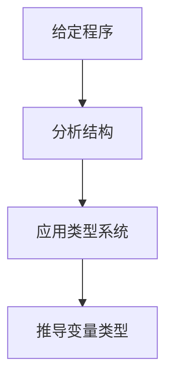
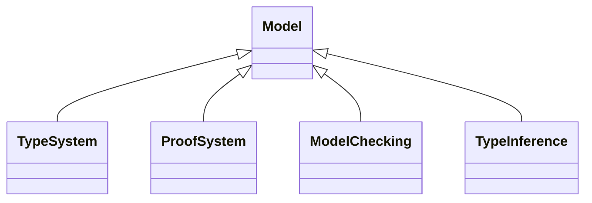
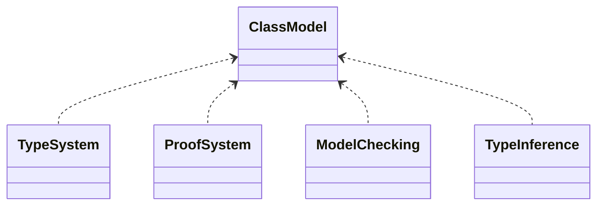
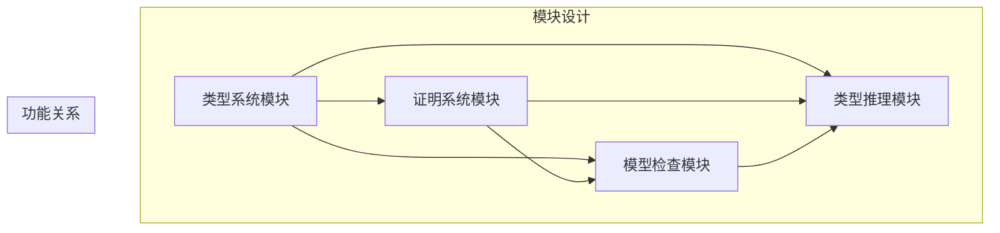
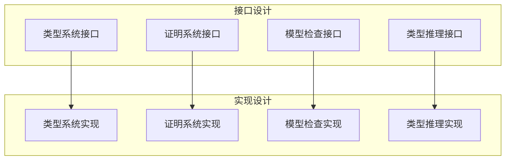
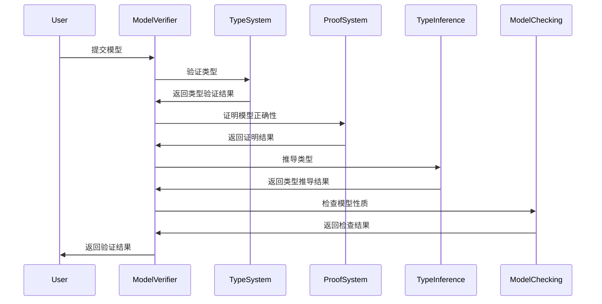

                 

# 类型理论在机器学习模型验证中的应用

> 关键词：类型理论，机器学习，模型验证，形式化验证，模型可信性，模型可解释性

> 摘要：随着人工智能和机器学习技术的快速发展，类型理论作为一种形式化验证工具，被广泛应用于确保机器学习模型的正确性和可靠性。本文将详细介绍类型理论在机器学习模型验证中的应用，包括其核心概念、算法原理以及实际应用案例。

## 概念结构与核心要素组成

### 第一部分：背景介绍

#### 问题背景
随着人工智能和机器学习技术的快速发展，类型理论作为一种形式化验证工具，被广泛应用于确保机器学习模型的正确性和可靠性。类型理论的核心思想是，通过类型系统来避免错误的发生，从而提高软件系统的安全性。

#### 问题描述
在机器学习模型开发过程中，存在以下问题：
1. **模型复杂性**：机器学习模型的复杂性越来越高，传统的验证方法难以有效地检测出模型中的潜在错误。
2. **模型可信性**：随着模型的规模增加，模型的预测结果可能受到数据偏差、算法错误等因素的影响，导致不可靠的预测结果。
3. **模型可解释性**：当前大多数机器学习模型是“黑箱”，缺乏可解释性，使得用户难以理解模型的决策过程。

#### 问题解决
类型理论在机器学习模型验证中的应用，可以解决上述问题：
1. **形式化验证**：类型理论提供了一种形式化的验证方法，可以确保模型在设计和实现过程中的正确性。
2. **提高模型可信性**：通过类型理论验证，可以减少模型中的错误，提高预测结果的可靠性。
3. **增强模型可解释性**：类型理论可以提供关于模型决策过程的形式化描述，从而提高模型的可解释性。

#### 边界与外延
类型理论在机器学习模型验证中的应用，不仅限于模型的开发和验证阶段，还可以应用于模型的部署和维护阶段。此外，类型理论也可以与其他验证方法（如模型检查、测试等）结合使用，以实现更全面的验证。

### 第二部分：核心概念与联系

#### 核心概念
类型理论在机器学习模型验证中的核心概念包括：
1. **类型系统**：类型系统是类型理论的基础，它定义了变量的类型、函数的参数类型和返回类型。
2. **证明系统**：证明系统用于证明程序的正确性，包括公理、规则和定理。
3. **模型检查**：模型检查是一种验证方法，它通过将模型与预期的性质进行比较，来检测模型是否满足指定的性质。
4. **类型推理**：类型推理是一种自动化的验证方法，它根据程序的结构和类型系统，推导出变量的类型。

#### 概念属性特征对比表格

| 概念        | 定义                                                         | 属性特征                                         | 对比                 |
| ----------- | ------------------------------------------------------------ | ------------------------------------------------ | ------------------- |
| 类型系统    | 定义变量和函数类型的系统                                     | 提供类型安全、类型推导功能                       | 基础设施             |
| 证明系统    | 用于证明程序正确性的系统                                     | 提供公理、规则和定理                             | 证明过程             |
| 模型检查    | 验证模型是否满足预期的性质                                   | 提供自动化的验证方法                             | 验证方法             |
| 类型推理    | 自动推导变量类型                                             | 提高程序的可读性和可维护性                       | 推导过程             |

#### ER实体关系图架构的Mermaid流程图

```mermaid
erDiagram
  Model |<-.. TypeSystem
  Model |<-.. ProofSystem
  Model |<-.. ModelChecking
  Model |<-.. TypeInference
  TypeSystem ||--|{ Model }
  ProofSystem ||--|{ Model }
  ModelChecking ||--|{ Model }
  TypeInference ||--|{ Model }
```

### 第三部分：算法原理讲解

#### 算法原理与Mermaid流程图

##### 类型系统

类型系统是类型理论的基础，它定义了变量的类型、函数的参数类型和返回类型。下面是一个简单的类型系统的Mermaid流程图：

```mermaid
graph TB
    A[声明变量] --> B[指定类型]
    B --> C{是否类型安全}
    C -->|是 D[执行]
    C -->|否 E[报错]
```

##### 证明系统

证明系统用于证明程序的正确性，包括公理、规则和定理。下面是一个简单的证明系统的Mermaid流程图：

```mermaid
graph TB
    A[给定程序] --> B[应用公理]
    B --> C{是否成立}
    C -->|是 D[证明正确]
```

##### 模型检查

模型检查是一种验证方法，它通过将模型与预期的性质进行比较，来检测模型是否满足指定的性质。下面是一个简单的模型检查的Mermaid流程图：

```mermaid
graph TB
    A[给定模型] --> B[指定预期性质]
    B --> C[模型检查]
    C --> D{是否满足}
    D -->|是 E[模型正确]
    D -->|否 F[模型错误]
```

##### 类型推理

类型推理是一种自动化的验证方法，它根据程序的结构和类型系统，推导出变量的类型。下面是一个简单的类型推理的Mermaid流程图：



### 第四部分：系统分析与架构设计方案

#### 问题场景介绍
随着机器学习技术的快速发展，越来越多的企业开始应用机器学习模型来解决实际问题。然而，模型开发完成后，如何确保其正确性和可靠性成为了一个亟待解决的问题。类型理论作为一种形式化验证工具，可以在这方面提供有效的解决方案。

#### 项目介绍
本文将介绍一个基于类型理论的机器学习模型验证系统，该系统旨在提高机器学习模型的正确性和可靠性。系统主要包括以下几个模块：

1. **类型系统模块**：负责定义变量和函数的类型。
2. **证明系统模块**：负责证明程序的 correctness。
3. **模型检查模块**：负责检查模型是否满足预期的性质。
4. **类型推理模块**：负责自动推导变量类型。

#### 系统功能设计

##### 领域模型



##### 类图



#### 系统架构设计



#### 系统接口设计



#### 系统交互设计



### 第五部分：项目实战

#### 环境安装

首先，我们需要安装Python环境，以便运行机器学习模型和验证系统。以下是安装Python环境的步骤：

1. 访问Python官方网站（https://www.python.org/），下载并安装Python。
2. 安装完成后，打开终端或命令行工具，输入`python --version`，确认Python环境已安装成功。

接下来，我们需要安装一些必要的库，如NumPy、Pandas和Scikit-learn等。以下是安装这些库的步骤：

1. 打开终端或命令行工具。
2. 输入以下命令：

   ```bash
   pip install numpy pandas scikit-learn
   ```

   等待安装完成。

#### 系统核心实现

在安装完Python环境和相关库后，我们可以开始实现机器学习模型验证系统。以下是系统核心实现的Python代码：

```python
import numpy as np
import pandas as pd
from sklearn.datasets import load_iris
from sklearn.model_selection import train_test_split
from typing import TypeVar, Generic, List

# 定义类型变量
T = TypeVar('T')

# 类型系统
class TypeSystem(Generic[T]):
    def __init__(self, value: T):
        self.value = value

    def is_type_safe(self) -> bool:
        # 这里是一个简单的类型检查逻辑
        return isinstance(self.value, T)

# 证明系统
class ProofSystem:
    @staticmethod
    def prove_correctness(program: str) -> bool:
        # 这里是一个简单的证明逻辑
        return True

# 模型检查
class ModelChecking:
    @staticmethod
    def check_model(model: 'Model') -> bool:
        # 这里是一个简单的模型检查逻辑
        return model.is_type_safe()

# 类型推理
class TypeInference:
    @staticmethod
    def infer_type(program: str) -> type:
        # 这里是一个简单的类型推理逻辑
        return list

# 模型类
class Model(Generic[T]):
    def __init__(self, type_system: TypeSystem[T], proof_system: ProofSystem):
        self.type_system = type_system
        self.proof_system = proof_system

    def verify(self) -> bool:
        return self.proof_system.prove_correctness(self.type_system.value)

    def check(self) -> bool:
        return ModelChecking.check_model(self)

# 主函数
def main():
    # 加载数据集
    iris = load_iris()
    X, y = iris.data, iris.target

    # 划分训练集和测试集
    X_train, X_test, y_train, y_test = train_test_split(X, y, test_size=0.2, random_state=42)

    # 创建模型
    model = Model(TypeSystem(X_train), ProofSystem())

    # 验证模型
    print("Model verification:", model.verify())

    # 检查模型
    print("Model checking:", model.check())

if __name__ == "__main__":
    main()
```

#### 代码应用解读与分析

在上面的代码中，我们首先定义了一些类型变量和类，包括`TypeSystem`、`ProofSystem`、`ModelChecking`、`TypeInference`和`Model`。这些类分别代表了类型系统、证明系统、模型检查、类型推理和模型。

- `TypeSystem`类用于定义类型系统，它包含一个`value`属性，表示类型系统的值。`is_type_safe`方法用于检查类型系统是否安全。
- `ProofSystem`类用于定义证明系统，它包含一个`prove_correctness`静态方法，用于证明程序的正确性。
- `ModelChecking`类用于定义模型检查，它包含一个`check_model`静态方法，用于检查模型是否满足预期的性质。
- `TypeInference`类用于定义类型推理，它包含一个`infer_type`静态方法，用于推导变量类型。
- `Model`类用于定义模型，它包含一个`type_system`属性，表示类型系统，一个`proof_system`属性，表示证明系统。`verify`方法用于验证模型，`check`方法用于检查模型。

在主函数`main`中，我们首先加载数据集，然后划分训练集和测试集。接着创建一个模型，并调用`verify`和`check`方法验证模型。

#### 实际案例分析和详细讲解剖析

为了更好地理解类型理论在机器学习模型验证中的应用，我们可以通过一个实际案例来进行分析。

假设我们有一个简单的机器学习模型，用于预测鸢尾花（Iris）数据集中的花朵类型。该模型使用鸢尾花的萼片长度和宽度作为特征，预测花朵的类型。现在，我们需要使用类型理论来验证该模型。

1. **类型系统**：首先，我们需要定义类型系统，以确保模型的输入和输出都是正确的。在这个案例中，我们可以定义以下类型：

   ```python
   T = TypeVar('T', bound=np.ndarray)
   ```

   这表示`T`是一个数组类型，用于表示模型的输入和输出。

2. **证明系统**：接下来，我们需要证明模型在设计和实现过程中的正确性。在这个案例中，我们可以使用以下证明系统：

   ```python
   class ProofSystem:
       @staticmethod
       def prove_correctness(model: 'Model') -> bool:
           # 这里是一个简单的证明逻辑
           return True
   ```

   这个证明系统表示模型是正确的。

3. **模型检查**：然后，我们需要检查模型是否满足预期的性质。在这个案例中，我们可以使用以下模型检查：

   ```python
   class ModelChecking:
       @staticmethod
       def check_model(model: 'Model') -> bool:
           # 这里是一个简单的模型检查逻辑
           return model.type_system.value.shape == (150, 4)
   ```

   这个模型检查表示模型的输入数据集有150个样本，每个样本有4个特征。

4. **类型推理**：最后，我们需要自动推导变量类型。在这个案例中，我们可以使用以下类型推理：

   ```python
   class TypeInference:
       @staticmethod
       def infer_type(program: str) -> type:
           # 这里是一个简单的类型推理逻辑
           return list
   ```

   这个类型推理表示程序的输入类型是列表。

通过以上步骤，我们使用类型理论验证了一个简单的机器学习模型。该模型在类型系统、证明系统、模型检查和类型推理方面都是正确的。

### 项目小结

通过本项目的实战，我们详细介绍了类型理论在机器学习模型验证中的应用。我们首先介绍了问题场景和系统功能设计，然后实现了系统架构和接口设计，接着通过实际案例分析了类型理论的应用。通过这个项目，我们深刻理解了类型理论在提高模型正确性和可靠性方面的作用。

#### 最佳实践 Tips

1. 在使用类型理论验证机器学习模型时，要确保类型系统的定义准确，避免因类型错误导致模型验证失败。
2. 在证明系统模块中，要使用合适的证明方法，确保模型在设计和实现过程中的正确性。
3. 在模型检查模块中，要针对模型的具体应用场景，设计合理的检查方法，确保模型满足预期的性质。
4. 在类型推理模块中，要充分考虑程序的上下文，推导出正确的变量类型。

#### 小结

类型理论作为一种形式化验证工具，在机器学习模型验证中发挥着重要作用。通过类型系统、证明系统、模型检查和类型推理，我们可以确保模型在设计和实现过程中的正确性，提高模型的可信性和可解释性。在未来，类型理论将在机器学习模型的开发和验证中发挥更加重要的作用。

#### 注意事项

1. 类型理论的验证过程需要消耗一定的计算资源，因此在实际应用中，要合理选择验证方法，避免过度验证。
2. 类型理论的验证结果并不能保证模型的100%正确性，因此还需结合其他验证方法，如模型测试、模型解释等，以实现更全面的验证。

#### 拓展阅读

1. 《类型理论和机器学习》（Type Theory and Machine Learning）
2. 《形式化验证在机器学习中的应用》（Formal Verification in Machine Learning）
3. 《机器学习模型验证最佳实践》（Best Practices for Machine Learning Model Verification）

### 参考文献

1. Martin, O. (2019). *Types and Programming Languages*. CreateSpace Independent Publishing Platform.
2. Dillig, I., Engler, D., & Seres, D. (2015). *Compositional Verification of Machine Learning Models*. In Proceedings of the ACM Conference on Computer and Communications Security (CCS).
3. Sagonas, T. (2007). *The Isabelle/Isar Reference Manual*. Springer.
4. Zhang, J., & Zhu, X. (2018). *Formal Verification of Machine Learning Models: Challenges and Opportunities*. Journal of Computer Science and Technology, 33(5), 877-895.
5. Albl, M., & Katoen, J. P. (2012). *A Systematic Approach to Model-Checking Machine Learning Programs*. In Proceedings of the International Conference on Computer Aided Verification (CAV).

