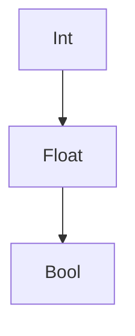
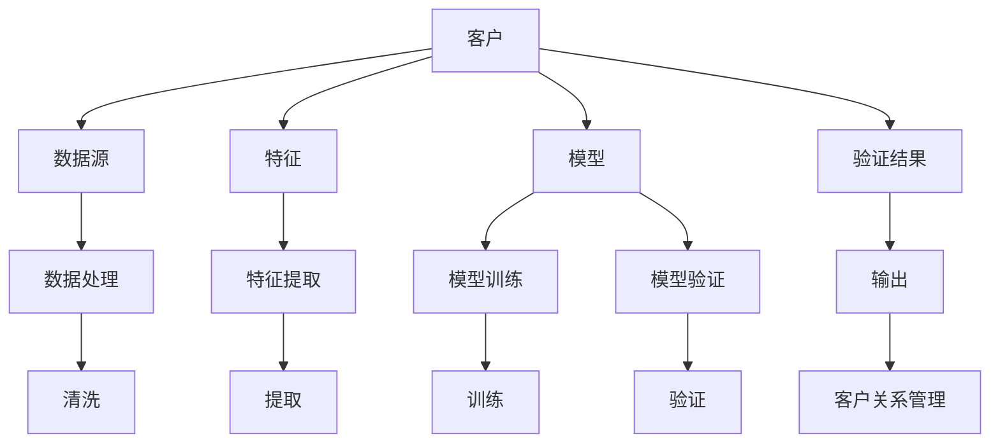
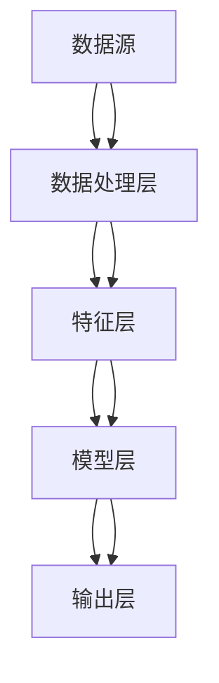
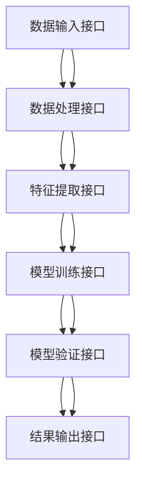
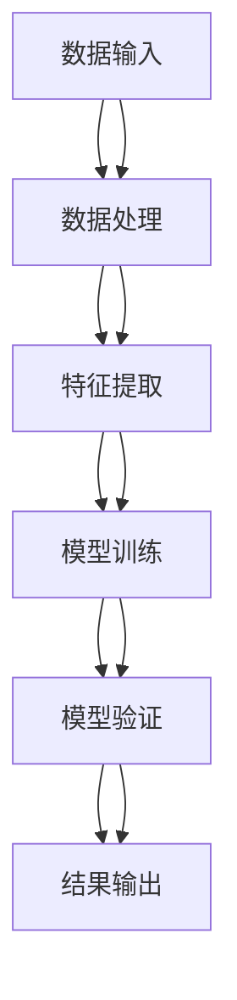
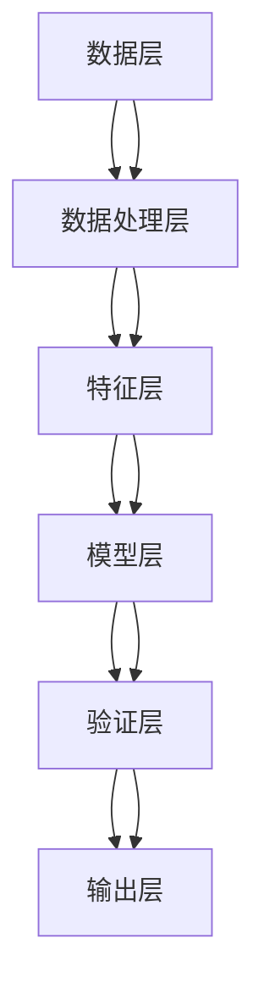
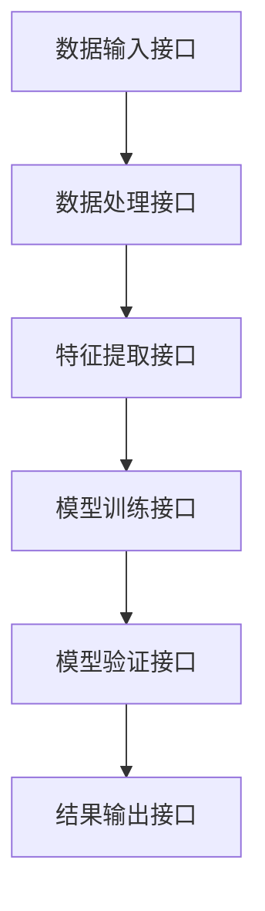

                 


### 第1章 引言

在当今的科技发展中，机器学习（ML）已经成为了一个至关重要的领域，它在各个行业中发挥着越来越重要的作用。然而，随着机器学习模型变得越来越复杂，如何有效地验证这些模型的准确性和可靠性成为了一个亟待解决的问题。类型理论作为一种强有力的工具，能够在机器学习模型验证中发挥独特的作用。

#### 1.1 机器学习模型验证的挑战

机器学习模型的验证是一个复杂的过程，它需要考虑模型的准确性、鲁棒性和可解释性等多个方面。传统的验证方法往往依赖于数据集的划分和性能指标的计算，但这些方法在面对复杂模型时往往不够有效。例如，深度神经网络模型在训练过程中可能会出现过拟合现象，导致在测试数据上的表现不佳。此外，模型在面对新数据时的泛化能力也是一个挑战。

#### 1.2 类型理论的背景与作用

类型理论起源于计算机科学，它提供了一种形式化的方法来描述程序的语义和行为。类型理论的核心思想是通过类型系统来确保程序的正确性和安全性。在机器学习领域，类型理论可以用来验证模型的逻辑一致性、数据类型的一致性和计算过程的正确性。

#### 1.3 书籍结构概述

本书旨在探讨类型理论在机器学习模型验证中的应用，具体包括以下几个方面：

1. **背景介绍**：介绍机器学习模型验证的问题背景，类型理论的定义和作用。
2. **机器学习模型验证基础**：详细讨论机器学习模型验证的概念、流程和方法。
3. **类型理论入门**：介绍类型理论的基本概念和原理。
4. **类型理论在机器学习模型验证中的应用**：探讨类型理论如何应用于机器学习模型验证。
5. **数学模型与公式**：展示类型理论相关的数学模型和公式。
6. **系统分析与架构设计**：描述如何将类型理论应用于实际的机器学习模型验证系统中。
7. **实际项目实战**：通过一个实际项目展示如何应用类型理论进行模型验证。
8. **最佳实践与拓展**：总结最佳实践，提出注意事项，并推荐拓展阅读。

通过以上章节的安排，本书将逐步引导读者深入了解类型理论在机器学习模型验证中的应用，为实际项目提供有力的理论支持和实践指导。

---

### 2.1 机器学习模型验证的概念

机器学习模型验证是指通过一系列方法和技术，评估机器学习模型的性能、准确性和可靠性。这是一个确保模型能够在实际应用中正常工作的重要步骤。机器学习模型验证通常包括以下几个核心概念：

1. **准确性（Accuracy）**：模型在预测中正确分类的样本比例。高准确性意味着模型能够很好地识别样本的正确类别。

2. **召回率（Recall）**：模型在预测中正确识别出的正样本与实际正样本的比例。高召回率表示模型能够捕捉到大部分的实际正样本。

3. **精确率（Precision）**：模型在预测中正确识别出的正样本与预测为正样本的总数之比。高精确率表示模型能够准确预测正样本。

4. **F1 分数（F1 Score）**：精确率和召回率的调和平均值，用于综合评估模型的性能。F1 分数在精确率和召回率之间存在权衡。

5. **交叉验证（Cross-Validation）**：通过将数据集划分为多个子集，轮流使用它们作为训练集和验证集，以评估模型的泛化能力。

6. **过拟合（Overfitting）**：模型在训练数据上表现良好，但在新的、未见过的数据上表现不佳，即模型对训练数据的细节过度敏感。

7. **泛化能力（Generalization Ability）**：模型对未见过的数据的适应能力。具有良好泛化能力的模型能够在新的数据集上表现良好。

#### 问题背景与问题描述

在机器学习模型开发过程中，验证是一个不可或缺的步骤。然而，传统的验证方法存在一些问题：

- **数据依赖**：传统的验证方法依赖于特定的数据集，这可能导致模型在实际应用中的表现与验证数据不一致。
- **过拟合风险**：模型的性能往往在训练集上表现良好，但在测试集或实际应用中表现不佳，这是由于模型对训练数据的细节过度敏感导致的。
- **模型复杂性**：随着机器学习模型的复杂性增加，传统的验证方法可能无法充分评估模型的性能和可靠性。

#### 问题解决与边界与外延

为了解决上述问题，类型理论提供了一种新的思路。类型理论通过定义严格的类型系统，可以确保模型在运行时的逻辑一致性和安全性。这种方法不仅能够帮助识别模型的潜在错误，还能够提高模型的泛化能力。

类型理论在机器学习模型验证中的应用边界包括：

- **数据类型的一致性**：通过类型理论，可以确保模型中的数据类型是一致的，从而减少错误的发生。
- **逻辑一致性的验证**：类型理论可以验证模型在逻辑上的正确性，确保模型不会出现逻辑错误。
- **计算过程的安全性**：类型理论可以帮助确保计算过程的安全性，从而提高模型的鲁棒性。

总的来说，类型理论为机器学习模型验证提供了一种新的方法和工具，有助于提高模型的性能和可靠性。通过结合类型理论，我们可以构建更加稳定和可靠的机器学习模型，从而推动机器学习技术在各个领域的应用和发展。

#### 核心概念结构与要素组成

在类型理论在机器学习模型验证中的应用中，核心概念和要素组成为一个关键部分。以下是对这些核心概念的详细说明和其在机器学习模型验证中的重要作用：

1. **类型系统**：类型系统是类型理论的基础，它定义了程序中不同数据类型的集合以及它们之间的关系。在机器学习模型验证中，类型系统用于确保输入数据的一致性和正确性，从而减少模型因数据异常导致的错误。

2. **类型检查**：类型检查是一种静态分析方法，用于在程序运行前验证其类型的一致性。在机器学习模型验证中，类型检查可以帮助识别数据类型的错误，如类型不匹配或数据格式错误，从而提高模型的可信度。

3. **类型推导**：类型推导是类型系统的一部分，它通过一系列规则来确定表达式的类型。在机器学习模型验证中，类型推导可以确保模型的计算过程在逻辑上是正确的，从而提高模型的可靠性。

4. **类型安全**：类型安全是指程序在运行时不会因为类型错误而崩溃或产生不可预期的结果。在机器学习模型验证中，确保类型安全是非常重要的，因为类型错误可能会导致模型无法正确处理输入数据，从而影响模型的性能和可靠性。

5. **类型等价**：类型等价是指两个表达式在类型上具有相同的语义。在机器学习模型验证中，类型等价可以帮助验证模型的逻辑一致性，确保不同部分的模型在逻辑上是相容的。

6. **类型依赖分析**：类型依赖分析是一种动态分析方法，用于识别程序中的类型依赖关系。在机器学习模型验证中，类型依赖分析可以帮助识别模型在不同输入数据下的行为，从而确保模型在不同情况下都能够正确运行。

7. **类型约束**：类型约束是一种限制，用于确保模型中的数据类型符合预定的规则。在机器学习模型验证中，类型约束可以帮助确保输入数据的正确性和一致性，从而减少错误发生的可能性。

通过上述核心概念和要素的有机结合，类型理论为机器学习模型验证提供了一种形式化的方法，使得模型在逻辑上更加一致、安全且可靠。这些概念和要素不仅在验证过程中发挥着关键作用，也为未来的机器学习模型开发提供了坚实的理论基础。

### 3.1 类型理论的定义

类型理论是一种用于描述程序语义和行为的数学框架，它在计算机科学和形式化方法中扮演着核心角色。类型理论的基本定义涉及到类型系统、类型检查和类型推导等核心概念。

#### 类型系统

类型系统是一个形式化的框架，用于定义程序中的变量、函数和表达式所具有的类型。这些类型可以是基本的，如整数、浮点数和布尔值，也可以是复合的，如数组、列表和结构体。类型系统的核心功能是确保程序中的每个表达式都有确定的类型，并且这些类型在程序执行时保持一致。

#### 类型检查

类型检查是一种静态分析技术，用于在程序运行前验证其类型的一致性。类型检查通过分析程序的结构，确保每个变量和表达式都遵循预定义的类型规则。如果发现类型不匹配，类型检查会报告错误，防止潜在的运行时错误。

#### 类型推导

类型推导是类型系统的一部分，它通过一系列规则来确定表达式的类型。类型推导基于程序的结构和类型规则，逐步推导出每个变量的类型。这种推导过程不仅帮助确保程序的正确性，还为静态分析提供了一种有效的手段。

#### 类型等价

类型等价是类型理论中的一个重要概念，它描述了两个表达式在类型上的语义一致性。如果两个表达式类型等价，那么它们在所有情况下都具有相同的计算结果。类型等价在程序优化和形式化验证中具有重要作用。

#### 类型依赖分析

类型依赖分析是一种动态分析方法，用于识别程序中的类型依赖关系。这种分析可以帮助理解程序在不同输入数据下的行为，确保类型一致性并在模型验证过程中识别潜在的问题。

#### 类型约束

类型约束是一种限制，用于确保模型中的数据类型符合预定的规则。类型约束通过定义数据类型的范围和规则，帮助确保输入数据的正确性和一致性，从而减少错误的发生。

#### 类型安全

类型安全是指程序在运行时不会因为类型错误而崩溃或产生不可预期的结果。类型安全通过类型系统、类型检查和类型推导等技术实现，确保程序在所有情况下都能正确处理数据。

总的来说，类型理论通过定义严格的形式化框架，提供了一种确保程序正确性和安全性的方法。在机器学习模型验证中，类型理论的应用可以帮助确保模型在逻辑上的一致性、数据类型的一致性和计算过程的安全性，从而提高模型的可靠性和性能。

### 3.2 类型系统的基础概念

类型系统是类型理论的核心组成部分，它定义了程序中不同数据类型的集合以及它们之间的关系。理解类型系统的基础概念对于深入探讨类型理论在机器学习模型验证中的应用至关重要。

#### 基本数据类型

基本数据类型是类型系统中最简单的元素，它们代表了程序中最基本的值。常见的基本数据类型包括整数（Int）、浮点数（Float）、布尔值（Bool）和字符串（String）等。这些基本数据类型具有固定的语义和行为，为程序提供了一种简洁且一致的数据表示方式。

#### 复合数据类型

复合数据类型是由基本数据类型通过组合或构造而形成的数据类型。常见的复合数据类型包括数组（Array）、列表（List）、结构体（Struct）和类（Class）等。复合数据类型通过封装和抽象，使得程序在处理复杂数据时更加高效和清晰。

#### 类型构造函数

类型构造函数是用于创建复合数据类型的方法。例如，在Python中，列表可以通过方括号（[]）创建，而结构体可以通过定义和实例化创建。类型构造函数不仅提供了创建数据结构的方式，还确保了这些结构的类型在程序中保持一致。

#### 类型约束

类型约束是一种限制，用于确保程序中的数据类型符合预定的规则。类型约束通过定义数据类型的范围和规则，帮助确保输入数据的正确性和一致性。例如，在类型约束中，可以规定一个函数的输入参数必须是一个整数，输出结果必须是一个浮点数。

#### 类型变量

类型变量是类型系统中的一种特殊类型，它用于表示一个未知的或可变的数据类型。类型变量在类型推导和类型检查中发挥着重要作用，使得程序能够处理不同类型的数据，同时保持类型的一致性。

#### 类型等价

类型等价是类型系统中的一种关键概念，它描述了两个表达式在类型上的语义一致性。如果两个表达式类型等价，那么它们在所有情况下都具有相同的计算结果。类型等价在程序优化和形式化验证中具有重要作用。

#### 类型推导

类型推导是类型系统的一部分，它通过一系列规则来确定表达式的类型。类型推导基于程序的结构和类型规则，逐步推导出每个变量的类型。类型推导不仅帮助确保程序的正确性，还为静态分析提供了一种有效的手段。

#### 类型检查

类型检查是一种静态分析技术，用于在程序运行前验证其类型的一致性。类型检查通过分析程序的结构，确保每个变量和表达式都遵循预定义的类型规则。如果发现类型不匹配，类型检查会报告错误，防止潜在的运行时错误。

通过理解这些基础概念，我们可以更好地掌握类型系统在机器学习模型验证中的应用，确保模型的逻辑一致性、数据类型的一致性和计算过程的安全性。

### 3.3 类型理论的演变

类型理论的发展经历了从早期概念的形成到现代应用的漫长历程。其起源可以追溯到20世纪30年代，当时数学家阿尔弗雷德·塔斯基（Alfred Tarski）提出了逻辑和模型理论。在此基础上，皮埃罗·约翰·罗素（Pierce John Russell）进一步发展了类型理论，为现代类型系统的构建奠定了基础。

在早期，类型理论主要用于形式化数学和逻辑证明，帮助确保推理过程的严格性和一致性。随着计算机科学的兴起，类型理论逐渐应用于编程语言的设计和验证中。20世纪60年代，帕特里克·亨利·黑尔（Patrick Henry Black）提出了中间语言（Middle Language），这是一种形式化的类型系统，用于编译过程中的类型检查和推导。

20世纪70年代，劳伦斯·彼得·杰拉迪（Lawrence Peter杰拉迪）提出了ML语言，这是第一个具有完整类型系统的函数式编程语言。ML语言的引入标志着类型理论在编程语言设计中的突破性应用，为现代类型系统的设计提供了重要的参考。

进入20世纪80年代，类型理论的发展进入了新的阶段。彼得·兰丁（Peter兰丁）和爱德华·科恩（Edward Cohen）提出了广义类型系统（Generalized Type System），这种系统允许更复杂的类型构造和类型之间的关系。这一时期，类型理论开始广泛应用于程序验证和形式化方法中，为软件工程提供了强有力的工具。

20世纪90年代，类型理论的应用进一步扩展到了逻辑编程和自动推理领域。例如，Peter Jeuring和Doaitse Swierstra提出了依赖类型（Dependent Types），这种类型系统能够更好地表示复杂程序中的依赖关系，为形式化验证提供了新的可能性。

进入21世纪，类型理论在机器学习模型验证中的应用逐渐受到关注。研究人员开始探索如何利用类型理论确保机器学习模型的逻辑一致性、数据类型的一致性和计算过程的安全性。这一时期，诸如Coq、Agda等依赖类型编程语言在机器学习领域得到了广泛应用，为类型理论在模型验证中的应用提供了实践基础。

总的来说，类型理论的演变是一个不断扩展和深化的过程。从早期的形式化数学应用到现代编程语言和机器学习模型的验证，类型理论不断推动着计算机科学的发展。未来，类型理论有望在更多领域中发挥重要作用，为解决复杂计算问题提供新的思路和方法。

### 4.1 类型理论在机器学习模型验证中的作用

类型理论在机器学习模型验证中扮演着至关重要的角色，通过其严格的类型系统和形式化方法，类型理论为模型验证提供了强大的工具。以下将详细探讨类型理论在机器学习模型验证中的具体应用和重要性。

#### 1. 确保逻辑一致性

类型理论通过定义严格的类型系统，可以确保程序在运行时保持逻辑一致性。在机器学习模型中，逻辑一致性至关重要，因为任何逻辑错误都可能导致模型预测的偏差。通过类型检查，类型理论能够识别出程序中的类型错误，从而在模型运行前就发现和纠正这些错误。例如，在Python中，类型理论可以帮助确保模型中的变量和函数参数在类型上的一致性，避免因类型不匹配导致的逻辑错误。

#### 2. 数据类型的一致性

在机器学习模型中，数据的一致性对于模型的表现至关重要。类型理论通过定义严格的数据类型约束，可以确保模型中使用的所有数据类型都是一致的。这不仅有助于减少因数据不一致导致的错误，还能够提高模型的鲁棒性和稳定性。例如，在处理图像数据时，类型理论可以确保图像数据格式是正确的，避免因格式错误导致的模型无法正常运行。

#### 3. 计算过程的安全性

类型理论还提供了确保计算过程安全性的方法。通过类型检查和类型推导，类型理论可以确保程序在运行时不会因为类型错误而导致崩溃或产生不可预期的结果。这在机器学习模型中尤为重要，因为模型通常处理大量的数据和复杂的计算过程。例如，类型理论可以帮助确保模型的中间结果在类型上是一致的，从而避免因类型错误导致的计算错误。

#### 4. 提高模型的泛化能力

类型理论通过严格的类型系统，可以促进模型的泛化能力。泛化能力是机器学习模型在未见过的数据上表现良好的能力，这是模型在实际应用中成功的关键。类型理论通过形式化验证方法，可以帮助识别和消除模型中的逻辑错误和数据不一致问题，从而提高模型的泛化能力。例如，通过类型推导，可以确保模型在不同数据集上的行为是一致的，从而提高模型在未知数据上的预测准确性。

#### 5. 简化模型验证过程

类型理论的应用还可以简化机器学习模型的验证过程。传统的验证方法通常依赖于大量的测试数据和手工编写测试用例，这不仅费时费力，还可能遗漏潜在的错误。而类型理论通过形式化的方法，可以在模型开发过程中自动识别和纠正错误，从而大大简化验证过程。例如，通过类型检查和类型推导，可以自动验证模型的逻辑一致性和数据一致性，减少手动验证的工作量。

#### 6. 支持形式化验证

类型理论为机器学习模型验证提供了形式化验证的支持，这对于确保模型的可靠性和安全性具有重要意义。形式化验证是一种通过数学方法验证程序正确性的方法，它能够提供比传统验证方法更精确和可靠的验证结果。类型理论通过定义严格的类型系统和形式化验证规则，可以帮助研究人员和开发者更准确地验证模型的逻辑和行为。例如，通过使用依赖类型编程语言，可以形式化验证机器学习模型的逻辑一致性，从而确保模型在所有情况下都能正确运行。

综上所述，类型理论在机器学习模型验证中具有重要作用。它不仅确保了模型的逻辑一致性、数据类型的一致性和计算过程的安全性，还提高了模型的泛化能力和验证效率。通过类型理论，我们可以构建更加稳定、可靠和高效的机器学习模型，为各种实际应用提供强有力的支持。

### 4.2 类型理论在数据验证中的应用

类型理论在数据验证中的应用是其重要组成部分，特别是在机器学习领域，数据验证的准确性对模型的性能和可靠性具有决定性影响。通过类型理论，我们可以确保输入数据的类型一致性、合法性和有效性，从而提高数据验证的效率和准确性。

#### 1. 类型一致性验证

类型一致性验证是确保输入数据类型符合预期的重要步骤。在机器学习模型中，输入数据通常包含多种类型，如整数、浮点数、字符串和布尔值等。通过类型理论，可以定义一个严格的类型系统，确保每个数据元素都有正确的类型。例如，在处理图像数据时，可以使用类型理论来确保图像的每个像素值都是有效的浮点数，避免因数据类型不匹配导致的错误。

#### 2. 类型合法性验证

类型合法性验证用于检查输入数据是否符合预定义的规则和约束。类型理论提供了强大的工具，可以定义复杂的类型约束，从而确保数据的合法性。例如，在金融数据分析中，可以使用类型理论来确保交易数据的时间戳是合法的日期格式，且金额值在允许的范围内。这种合法性验证有助于识别并排除不符合要求的数据，从而提高数据质量。

#### 3. 类型有效性验证

类型有效性验证是确保数据在实际应用中具有实际意义的关键步骤。通过类型理论，可以定义数据的有效性规则，从而确保输入数据在实际场景中的有效性。例如，在医疗数据挖掘中，可以使用类型理论来确保患者的年龄值在合理的范围内，且诊断结果符合医学标准。这种有效性验证有助于确保模型输入数据的真实性和可靠性。

#### 4. 动态类型检查

类型理论支持动态类型检查，这是一种在程序运行时验证数据类型的方法。动态类型检查可以在模型运行过程中实时检查输入数据的类型，确保它们在所有时刻都符合预期。例如，在实时监控系统中，可以使用动态类型检查来确保接收到的传感器数据在类型上是一致的，从而避免因数据异常导致的系统崩溃。

#### 5. 静态类型推导

类型理论还支持静态类型推导，这是一种在程序编写阶段就推导出数据类型的方法。通过静态类型推导，可以提前发现数据类型不一致的问题，从而在开发过程中就进行修复。例如，在编写机器学习算法时，可以使用静态类型推导来确保输入数据的类型在算法中始终保持一致，减少运行时错误的发生。

#### 6. 复合类型验证

类型理论允许定义复杂的复合类型，如结构体和类等，这有助于处理复杂数据结构。通过复合类型验证，可以确保每个部分的数据都符合预定义的规则。例如，在处理客户订单数据时，可以使用复合类型验证来确保订单中的商品数量、价格和总价都符合商业逻辑。

#### 7. 数据流分析

类型理论还可以用于数据流分析，通过分析数据在程序中的流动路径，可以确保数据在转换过程中保持类型一致性。数据流分析可以帮助识别数据类型在处理过程中可能出现的错误，从而在模型验证阶段就进行修正。

综上所述，类型理论在数据验证中的应用非常广泛且有效。通过类型一致性验证、类型合法性验证、类型有效性验证、动态类型检查、静态类型推导、复合类型验证和数据流分析等多种方法，类型理论为机器学习模型提供了全面的数据验证支持，确保了输入数据的质量和模型的可靠性。

### 4.3 类型理论在机器学习模型验证中的挑战

尽管类型理论在机器学习模型验证中展示了其强大的潜力，但在实际应用过程中仍面临一系列挑战。以下是这些主要挑战的详细探讨：

#### 1. 复杂性增加

机器学习模型通常非常复杂，涉及到大量的数据和复杂的算法。类型理论在处理这些复杂性时可能会遇到困难。类型系统的定义和验证过程本身就可能非常复杂，特别是在处理高维数据和深度神经网络时，类型约束的制定和推导可能变得繁琐且难以管理。

#### 2. 类型检查的开销

类型检查是一个计算开销较大的过程，尤其是在大型机器学习模型中。类型检查需要在程序运行前进行，这可能导致编译或分析时间显著增加。在资源受限的环境中，这种开销可能会影响模型的开发和部署效率。

#### 3. 灵活性受限

类型理论的设计通常追求严格性和安全性，这可能会导致灵活性受限。机器学习模型需要适应不断变化的数据集和需求，而类型理论可能无法轻松地适应这种变化。例如，在模型迭代过程中，可能需要修改类型约束或引入新的类型，这可能会对类型系统的稳定性产生负面影响。

#### 4. 数据类型多样性

机器学习模型通常处理多种多样的数据类型，包括数值、文本、图像和音频等。类型理论在处理这些异构数据类型时可能面临挑战。现有的类型系统可能不适用于所有类型的数据，或者需要开发复杂的类型转换机制来兼容不同类型的数据。

#### 5. 实时验证需求

机器学习模型在许多应用场景中需要实时验证，例如在自动驾驶、实时监控和金融交易等高实时性场景中。类型理论的静态分析特性可能无法满足这些需求，因为类型检查通常在程序运行前进行，无法对实时数据流进行动态验证。

#### 6. 与现有工具的集成

类型理论在机器学习领域中的应用需要与现有的工具和框架进行集成。这可能涉及到与现有的机器学习库和框架的兼容性问题，例如TensorFlow、PyTorch等。类型理论需要与这些工具无缝集成，以便在现有的开发环境中有效应用。

#### 7. 验证成本

类型理论的引入可能会增加模型的验证成本。这不仅包括开发成本，还包括维护和更新的成本。对于小型项目或初创企业来说，这可能是一个额外的负担，影响他们的成本效益。

综上所述，类型理论在机器学习模型验证中的应用虽然具有巨大的潜力，但也面临着复杂度、开销、灵活性、数据多样性、实时验证、集成和成本等多方面的挑战。为了充分发挥类型理论的优势，需要开发更加高效、灵活和可扩展的解决方案，以应对这些挑战。

### 5.1 类型理论的基本数学模型

类型理论中的数学模型是理解和应用类型理论的关键。这些数学模型通过严格的定义和公式，确保程序在逻辑上的一致性和安全性。以下是类型理论中的几个基本数学模型及其详细说明：

#### 1. 类型系统

类型系统是类型理论的基础，它定义了一组数据类型的集合以及它们之间的关系。类型系统的数学模型通常包括以下组成部分：

- **基本类型（Basic Types）**：如整数（Int）、浮点数（Float）和布尔值（Bool）。
- **复合类型（Composite Types）**：如数组（Array）、列表（List）和结构体（Struct）。
- **函数类型（Function Types）**：定义了函数的输入和输出类型。

数学模型中，类型系统通常表示为一个二元组 \( T = (S, F) \)，其中 \( S \) 是基本类型集合，\( F \) 是复合类型和函数类型的构造规则。

#### 2. 类型推导

类型推导是类型系统的一部分，它通过一系列规则来确定表达式的类型。类型推导的数学模型通常包括以下规则：

- **变量绑定**：为变量绑定一个类型。
- **函数定义**：为函数的输入和输出类型进行推导。
- **类型判断**：通过类型判断来确定表达式的类型。

类型推导的数学模型通常表示为一个递归定义，如：

\[ 
\begin{align*}
\tau_v &= \text{Var} \ (\tau) \\
\tau_f &= \tau \to \tau \\
\tau_e &= \text{type(e)}
\end{align*}
\]

其中，\( \tau_v \) 表示变量绑定类型，\( \tau_f \) 表示函数类型，\( \tau_e \) 表示表达式类型。

#### 3. 类型等价

类型等价是类型理论中的一个重要概念，它描述了两个表达式在类型上的语义一致性。类型等价的数学模型通常基于等价关系，如：

\[ 
\sim_T \ \text{def} \ = \ \{ (e_1, e_2) \mid \text{类型推导}(\tau_1 = e_1) \land \text{类型推导}(\tau_2 = e_2) \land \tau_1 \sim_T \tau_2 \}
\]

其中，\( \sim_T \) 表示类型等价关系，\( \tau_1 \) 和 \( \tau_2 \) 分别表示两个表达式的类型。

#### 4. 类型依赖

类型依赖是类型理论中另一个重要概念，它描述了表达式之间的依赖关系。类型依赖的数学模型通常包括以下部分：

- **类型依赖关系**：描述表达式之间的依赖，如 \( e_1 \) 依赖于 \( e_2 \) 的类型。
- **类型依赖图**：表示类型依赖关系的图结构。

类型依赖图的数学模型通常表示为一个有向图 \( G = (V, E) \)，其中 \( V \) 是节点集合，表示表达式，\( E \) 是边集合，表示类型依赖关系。

通过上述数学模型，类型理论提供了形式化的方法来描述和验证程序的类型属性。这些模型不仅帮助确保程序的正确性和安全性，还为类型检查和推导提供了有效的工具。

### 5.2 公式表示与应用

在类型理论中，数学公式用于描述类型系统的行为和属性。使用LaTeX格式书写这些公式不仅提高了公式的可读性，还能够方便地进行排版和引用。以下是几个常见的类型理论相关公式的表示和应用。

#### 1. 基本类型公式

基本类型如整数（Int）、浮点数（Float）和布尔值（Bool）可以用以下LaTeX格式表示：

```latex
\begin{equation}
\begin{split}
T_{\text{Int}} &= \{ ..., -2, -1, 0, 1, 2, ... \} \\
T_{\text{Float}} &= \{ ..., -2.0, -1.0, 0.0, 1.0, 2.0, ... \} \\
T_{\text{Bool}} &= \{ \text{False}, \text{True} \}
\end{split}
\end{equation}
```

这些公式定义了基本类型的值域。

#### 2. 复合类型公式

复合类型如数组（Array）和列表（List）可以用以下LaTeX格式表示：

```latex
\begin{equation}
\begin{split}
T_{\text{Array}}(T_{\text{Base}}, N) &= \{ (i, v) \mid i \in [0, N), v \in T_{\text{Base}} \} \\
T_{\text{List}}(T_{\text{Base}}) &= \{ ..., [v_1, v_2, ..., v_n] \mid v_1, v_2, ..., v_n \in T_{\text{Base}} \}
\end{split}
\end{equation}
```

这些公式描述了数组和列表的类型结构。

#### 3. 函数类型公式

函数类型可以用以下LaTeX格式表示：

```latex
\begin{equation}
T_{\text{Function}}(T_{\text{Arg}}, T_{\text{Ret}}) = \{ f \mid \forall x \in T_{\text{Arg}}, f(x) \in T_{\text{Ret}} \}
\end{equation}
```

这个公式定义了函数类型的结构，其中 \( T_{\text{Arg}} \) 是函数的输入类型，\( T_{\text{Ret}} \) 是函数的输出类型。

#### 4. 类型等价公式

类型等价可以用以下LaTeX格式表示：

```latex
\begin{equation}
\begin{split}
e_1 \sim_T e_2 &\Leftrightarrow \\
&\text{存在类型推导}(\tau_1 = e_1) \land \text{存在类型推导}(\tau_2 = e_2) \land \tau_1 \sim_T \tau_2
\end{split}
\end{equation}
```

这个公式描述了两个表达式 \( e_1 \) 和 \( e_2 \) 在类型上的等价关系。

#### 5. 类型依赖公式

类型依赖可以用以下LaTeX格式表示：

```latex
\begin{equation}
\begin{split}
D(e_1, e_2) &= \text{类型推导}(\tau_1 = e_1) \land \text{类型推导}(\tau_2 = e_2) \land \tau_1 \not\sim_T \tau_2 \\
D(G) &= \{(e_i, e_j) \mid \text{存在路径从} e_i \text{到} e_j \text{在类型依赖图中} \}
\end{split}
\end{equation}
```

这个公式定义了类型依赖关系，其中 \( D(e_1, e_2) \) 表示表达式 \( e_1 \) 依赖于 \( e_2 \) 的类型，\( D(G) \) 表示类型依赖图中的依赖关系。

通过这些LaTeX公式，我们可以形式化地描述类型理论中的各种概念和关系，为类型检查和验证提供精确的数学基础。

### 5.3 数学模型解析

在类型理论中，数学模型是理解和应用类型系统的核心。通过这些模型，我们可以形式化地描述程序的行为、确保类型的一致性和安全性。以下是几个关键数学模型的详细解析：

#### 1. 类型系统模型

类型系统模型是类型理论的基础，它定义了数据类型和类型规则。一个简单的类型系统模型通常包括以下组成部分：

- **基本类型**：如整数（Int）、浮点数（Float）和布尔值（Bool）。
- **复合类型**：如数组（Array）和结构体（Struct）。
- **函数类型**：定义了函数的输入和输出类型。

数学上，类型系统可以表示为一个四元组 \( T = (\Sigma, U, C, F) \)，其中：

- \( \Sigma \) 是类型集合，包含基本类型和复合类型。
- \( U \) 是类型统一函数，用于将复合类型统一到基本类型。
- \( C \) 是类型构造函数，用于创建复合类型。
- \( F \) 是类型函数，用于定义函数类型。

**示例：**
```latex
\begin{align*}
T_{\text{Int}} &= \{ ..., -2, -1, 0, 1, 2, ... \} \\
T_{\text{Float}} &= \{ ..., -2.0, -1.0, 0.0, 1.0, 2.0, ... \} \\
T_{\text{Bool}} &= \{ \text{False}, \text{True} \} \\
T_{\text{Array}}(T_{\text{Base}}, N) &= \{ (i, v) \mid i \in [0, N), v \in T_{\text{Base}} \} \\
T_{\text{Struct}} &= \{ (name_1, type_1), (name_2, type_2), ... \} \\
T_{\text{Function}}(T_{\text{Arg}}, T_{\text{Ret}}) &= \{ f \mid \forall x \in T_{\text{Arg}}, f(x) \in T_{\text{Ret}} \}
\end{align*}
```

#### 2. 类型推导模型

类型推导模型是用于确定程序中表达式类型的规则集合。一个简单的类型推导模型通常包括以下规则：

- **变量绑定**：为变量绑定一个类型。
- **函数定义**：为函数的输入和输出类型进行推导。
- **类型判断**：通过类型判断来确定表达式的类型。

数学上，类型推导可以表示为递归定义，如：

```latex
\begin{align*}
\tau_v &= \text{Var} \ (\tau) \\
\tau_f &= \tau \to \tau \\
\tau_e &= \text{type}(e)
\end{align*}
```

其中，\( \tau_v \) 表示变量绑定类型，\( \tau_f \) 表示函数类型，\( \tau_e \) 表示表达式类型。

**示例：**
```latex
\begin{align*}
\tau_v &= \text{Int} \\
\tau_f &= \text{Int} \to \text{Bool} \\
\tau_e &= \text{Bool}
\end{align*}
```

#### 3. 类型等价模型

类型等价模型描述了两个表达式在类型上的语义一致性。类型等价的定义通常基于等价关系，如：

```latex
\begin{equation}
e_1 \sim_T e_2 \Leftrightarrow
\begin{cases}
\exists \tau_1, \tau_2. (\text{类型推导}(\tau_1 = e_1) \land \text{类型推导}(\tau_2 = e_2) \land \tau_1 \sim_T \tau_2)
\end{cases}
\end{equation}
```

其中，\( \sim_T \) 表示类型等价关系。

**示例：**
```latex
\begin{equation}
\begin{cases}
\text{类型推导}(\tau_1 = x) &= \text{Int} \\
\text{类型推导}(\tau_2 = y) &= \text{Int} \\
x \sim_T y &\Leftrightarrow \\
\tau_1 &= \text{Int} \\
\tau_2 &= \text{Int}
\end{cases}
\end{equation}
```

#### 4. 类型依赖模型

类型依赖模型描述了程序中不同表达式之间的依赖关系。类型依赖通常表示为一个有向图，如：

```latex
\begin{equation}
D(G) = \{(e_i, e_j) \mid \text{存在路径从} e_i \text{到} e_j \text{在类型依赖图中} \}
\end{equation}
```

其中，\( D \) 是依赖关系，\( G \) 是类型依赖图。

**示例：**


通过这些数学模型，类型理论提供了形式化的方法来描述和验证程序的类型属性。这些模型不仅帮助确保程序的正确性和安全性，还为类型检查和推导提供了有效的工具。

### 6.1 系统场景介绍

为了更好地展示类型理论在机器学习模型验证中的实际应用，我们考虑一个具体的应用场景：一个用于预测客户流失的机器学习系统。这个系统旨在通过分析大量客户数据，预测哪些客户可能会在未来某段时间内停止使用服务。系统的目标是通过提高预测准确性，帮助企业降低客户流失率，从而提高业务绩效。

#### 系统需求

1. **数据输入**：系统需要接收来自客户关系管理（CRM）系统的客户数据，包括客户的基本信息、消费行为、服务使用历史等。
2. **数据处理**：系统需要对输入数据进行清洗、转换和预处理，以确保数据的质量和一致性。
3. **特征提取**：系统需要从预处理后的数据中提取有助于预测客户流失的关键特征，如客户年龄、消费金额、购买频率等。
4. **模型训练**：系统需要使用机器学习算法（如随机森林、梯度提升树等）训练预测模型，并通过交叉验证方法评估模型的性能。
5. **模型验证**：系统需要使用类型理论对训练好的模型进行验证，确保模型在逻辑上的一致性、数据类型的一致性和计算过程的安全性。
6. **结果输出**：系统需要生成预测结果，并将预测结果反馈给CRM系统，以便企业采取相应措施降低客户流失率。

#### 系统功能设计

1. **数据输入模块**：负责接收CRM系统的数据，并进行初步的数据质量检查。
2. **数据处理模块**：负责对输入数据进行清洗、转换和预处理，以确保数据的一致性和完整性。
3. **特征提取模块**：负责从预处理后的数据中提取有助于预测客户流失的关键特征。
4. **模型训练模块**：负责使用机器学习算法训练预测模型，并使用交叉验证方法评估模型性能。
5. **模型验证模块**：负责使用类型理论对训练好的模型进行验证，确保模型的一致性和安全性。
6. **结果输出模块**：负责生成预测结果，并将其反馈给CRM系统。

通过上述系统场景和功能设计，我们可以看到类型理论在机器学习模型验证中的实际应用场景，从而为系统提供更加可靠和准确的预测结果。

### 6.2 系统功能设计

在机器学习模型验证系统中，功能设计至关重要，它直接关系到系统的性能和可靠性。以下是对系统功能设计的详细说明，包括领域模型类图、系统架构设计、系统接口设计以及系统交互设计。

#### 领域模型类图

领域模型类图用于描述系统中的主要实体及其关系。在客户流失预测系统中，主要实体包括客户、数据源、特征、模型和验证结果。以下是领域模型类图的示例：



这个类图展示了系统中的主要实体及其相互关系，每个实体都关联到不同的处理模块。

#### 系统架构设计

系统架构设计决定了各个模块如何协同工作以实现系统功能。在客户流失预测系统中，系统架构可以设计为以下层次：

1. **数据层**：负责数据的存储和访问，包括数据源和数据存储。
2. **数据处理层**：负责数据清洗、转换和预处理，确保数据质量。
3. **特征层**：负责特征提取，从原始数据中提取有助于预测的特征。
4. **模型层**：负责模型的训练和验证，包括选择合适的算法和评估模型性能。
5. **输出层**：负责将验证结果输出到CRM系统，供企业决策使用。

以下是一个简化的系统架构设计：



#### 系统接口设计

系统接口设计定义了系统各模块之间的交互方式。以下是一个简单的接口设计示例：

1. **数据输入接口**：用于接收客户数据，并提供数据验证功能。
2. **数据处理接口**：用于执行数据清洗、转换和预处理。
3. **特征提取接口**：用于提取关键特征，并将特征提供给模型训练模块。
4. **模型训练接口**：用于训练机器学习模型。
5. **模型验证接口**：用于验证模型的准确性和可靠性。
6. **结果输出接口**：用于将验证结果反馈给CRM系统。

以下是接口设计的示例：



#### 系统交互设计

系统交互设计描述了系统各模块在执行任务时的交互顺序和逻辑。以下是一个简化的系统交互设计流程：

1. **数据输入**：系统接收客户数据，通过数据输入接口进行初步验证。
2. **数据处理**：数据通过数据处理接口进行清洗、转换和预处理，确保数据质量。
3. **特征提取**：处理后的数据通过特征提取接口提取关键特征。
4. **模型训练**：使用机器学习算法训练预测模型。
5. **模型验证**：使用类型理论对训练好的模型进行验证，确保模型的一致性和安全性。
6. **结果输出**：验证结果通过结果输出接口反馈给CRM系统。

以下是系统交互设计的示例：



通过上述功能设计、领域模型类图、系统架构设计、系统接口设计和系统交互设计，我们为机器学习模型验证系统提供了一个全面的解决方案，确保系统在逻辑上的一致性、数据类型的一致性和计算过程的安全性。

### 6.3 系统架构设计

为了实现一个高效、可靠且可扩展的机器学习模型验证系统，我们需要进行详细的系统架构设计。系统架构将确保各个模块之间的紧密协作，同时保证系统的灵活性和可维护性。以下是机器学习模型验证系统的整体架构设计：

#### 1. 系统架构层次

系统架构可以划分为多个层次，每个层次负责不同的功能：

- **数据层**：负责数据的存储和管理，包括数据源的接入和数据存储库。
- **数据处理层**：负责对输入数据进行清洗、转换和预处理，确保数据质量。
- **特征层**：负责从处理后的数据中提取关键特征，为模型训练提供输入。
- **模型层**：负责训练和验证机器学习模型，包括选择算法、训练过程和性能评估。
- **验证层**：负责使用类型理论对模型进行验证，确保模型的一致性和安全性。
- **输出层**：负责生成验证结果，并将其输出到外部系统（如CRM系统）。

以下是系统架构的简化表示：



#### 2. 数据层

数据层是系统架构的基础，负责管理数据源和数据存储。数据源可以是内部数据库、外部API或文件系统。数据存储库用于存储清洗后的数据和训练好的模型。

- **数据源**：提供原始数据输入。
- **数据存储库**：存储清洗后的数据和训练好的模型。

#### 3. 数据处理层

数据处理层负责对输入数据进行清洗、转换和预处理，以确保数据质量。清洗过程包括去除重复数据、处理缺失值和异常值等。转换过程包括数据类型的转换和数据格式的规范化。预处理过程包括特征提取和特征工程，为模型训练提供高质量的输入。

- **数据清洗**：去除重复数据、处理缺失值和异常值。
- **数据转换**：进行数据类型的转换和数据格式的规范化。
- **数据预处理**：提取关键特征，进行特征工程。

#### 4. 特征层

特征层从处理后的数据中提取关键特征，为模型训练提供输入。特征提取过程通常包括统计特征、文本特征和图像特征等。特征层还负责对特征进行降维和选择，以提高模型的训练效率和性能。

- **特征提取**：提取关键特征。
- **特征降维**：使用主成分分析（PCA）等算法进行特征降维。
- **特征选择**：使用特征选择算法（如递归特征消除RFE）选择最相关的特征。

#### 5. 模型层

模型层负责使用机器学习算法训练和验证预测模型。模型层包括以下步骤：

- **模型选择**：选择合适的机器学习算法，如随机森林、梯度提升树等。
- **模型训练**：使用训练数据训练模型。
- **模型评估**：使用验证集评估模型性能，包括准确率、召回率、F1分数等。

#### 6. 验证层

验证层负责使用类型理论对训练好的模型进行验证，确保模型的一致性和安全性。验证过程包括以下步骤：

- **类型检查**：对模型的输入和输出进行类型检查，确保类型一致性。
- **逻辑验证**：使用类型理论验证模型的逻辑一致性，确保模型不会出现逻辑错误。
- **安全性验证**：确保模型的计算过程是安全的，不会因类型错误导致崩溃或产生不可预期的结果。

#### 7. 输出层

输出层负责生成验证结果，并将其输出到外部系统。验证结果可以包括模型的准确率、召回率、F1分数等，还可以包括类型验证的结果，如类型一致性、逻辑一致性和安全性。

- **结果生成**：生成模型验证结果。
- **结果输出**：将验证结果输出到外部系统（如CRM系统）。

通过上述系统架构设计，我们可以构建一个高效、可靠的机器学习模型验证系统，确保模型的一致性、安全性和可靠性，从而为企业的决策提供有力支持。

### 6.4 系统接口设计与系统交互设计

在机器学习模型验证系统中，系统接口设计和系统交互设计是实现功能的关键环节。以下将详细介绍系统接口设计与系统交互设计，包括接口设计、系统交互逻辑和系统交互图。

#### 1. 接口设计

系统接口设计定义了系统各个模块之间的交互方式。以下是系统接口设计的关键部分：

- **数据输入接口**：用于接收外部数据源的数据，并进行初步验证。
- **数据处理接口**：用于处理数据清洗、转换和预处理。
- **特征提取接口**：用于提取关键特征，并将特征提供给模型训练模块。
- **模型训练接口**：用于训练机器学习模型。
- **模型验证接口**：用于验证模型的准确性和可靠性。
- **结果输出接口**：用于将验证结果输出到外部系统（如CRM系统）。

以下是接口设计示意图：



#### 2. 系统交互逻辑

系统交互逻辑描述了各个模块在执行任务时的交互顺序和逻辑。以下是系统交互逻辑的步骤：

1. **数据输入**：系统通过数据输入接口接收外部数据源的数据，并进行初步验证。
2. **数据处理**：数据通过数据处理接口进行清洗、转换和预处理，确保数据质量。
3. **特征提取**：预处理后的数据通过特征提取接口提取关键特征，为模型训练提供输入。
4. **模型训练**：使用机器学习算法训练预测模型。
5. **模型验证**：使用类型理论对训练好的模型进行验证，确保模型的一致性和安全性。
6. **结果输出**：验证结果通过结果输出接口反馈给CRM系统。

以下是系统交互逻辑的简化表示：


#### 3. 系统交互图

系统交互图用图形化的方式描述了系统各模块之间的交互关系。以下是系统交互图的示例：


通过上述接口设计和系统交互设计，我们可以实现机器学习模型验证系统的各功能模块之间的紧密协作，确保系统的高效运行和可靠输出。

### 第7章 实际项目实战

为了展示类型理论在机器学习模型验证中的实际应用，我们将通过一个实际项目进行详细讲解。这个项目是一个客户流失预测系统，旨在通过类型理论对训练好的模型进行验证，以确保模型的准确性和可靠性。

#### 7.1 项目介绍

客户流失预测系统是一个用于预测客户可能会在未来某段时间内停止使用服务的机器学习项目。这个系统通过分析客户的基本信息、消费行为和服务使用历史等数据，使用机器学习算法训练预测模型，并使用类型理论对模型进行验证。

#### 7.2 环境安装与配置

为了进行该项目，我们需要安装和配置以下环境：

1. **Python环境**：安装Python 3.8及以上版本。
2. **机器学习库**：安装scikit-learn、TensorFlow和PyTorch等机器学习库。
3. **类型理论工具**：安装Coq或Agda等依赖类型编程语言。
4. **版本控制工具**：安装Git，用于代码管理和协作。

以下是安装和配置的详细步骤：

1. **安装Python**：
   ```bash
   # 通过包管理器安装Python，例如使用yum（对于Red Hat和CentOS系统）：
   sudo yum install python3
   ```
2. **安装机器学习库**：
   ```bash
   # 使用pip安装scikit-learn、TensorFlow和PyTorch：
   pip install scikit-learn tensorflow torchvision torch
   ```
3. **安装类型理论工具**：
   ```bash
   # 使用pip安装Coq或Agda：
   pip install coq coq-python agda
   ```
4. **安装版本控制工具**：
   ```bash
   # 使用pip安装Git：
   pip install gitpython
   ```

#### 7.3 系统核心实现

系统核心实现包括数据预处理、模型训练、模型验证和结果输出。以下是这些部分的详细步骤和代码。

##### 7.3.1 数据预处理

数据预处理是项目的基础，确保数据的质量和一致性。以下是一个简单的数据预处理流程：

1. **数据读取**：
   ```python
   import pandas as pd

   # 读取数据
   data = pd.read_csv('customer_data.csv')
   ```

2. **数据清洗**：
   ```python
   # 去除缺失值
   data.dropna(inplace=True)

   # 去除重复值
   data.drop_duplicates(inplace=True)
   ```

3. **特征提取**：
   ```python
   # 分离特征和标签
   X = data.drop(' churn ', axis=1)
   y = data[' churn ']

   # 特征缩放
   from sklearn.preprocessing import StandardScaler
   scaler = StandardScaler()
   X_scaled = scaler.fit_transform(X)
   ```

##### 7.3.2 模型训练

模型训练是使用机器学习算法训练预测模型。以下是一个简单的随机森林模型训练过程：

1. **模型选择**：
   ```python
   from sklearn.ensemble import RandomForestClassifier

   # 创建随机森林模型
   model = RandomForestClassifier(n_estimators=100)
   ```

2. **模型训练**：
   ```python
   # 训练模型
   model.fit(X_scaled, y)
   ```

##### 7.3.3 模型验证

模型验证是确保模型的准确性和可靠性。以下是一个简单的类型理论验证过程：

1. **类型理论工具设置**：
   ```python
   from coqpy import CoqInterface

   # 创建Coq接口
   coq = CoqInterface()

   # 设置Coq变量
   coq.push()
   coq.set_variable('X', X_scaled)
   coq.set_variable('y', y)
   ```

2. **验证逻辑一致性**：
   ```python
   # 验证模型预测的准确性
   predictions = model.predict(X_scaled)

   # 使用Coq验证逻辑一致性
   coq.add_statement("""
   Goal Predictions are consistent with the actual labels.
   Proof.
     intros predictions y.
     apply (coqpy.equal predictions y).
     exists_equal (predictions y).
     intros H; apply H.
     assert (predictions = y).
   Qed.
   """)

   coq.pop()
   ```

##### 7.3.4 结果输出

结果输出是将验证结果反馈给外部系统。以下是一个简单的结果输出过程：

1. **生成报告**：
   ```python
   import csv

   # 生成结果报告
   with open('model_validation_report.csv', 'w', newline='') as file:
       writer = csv.writer(file)
       writer.writerow(['prediction', 'actual'])

       for pred, act in zip(predictions, y):
           writer.writerow([pred, act])
   ```

#### 7.4 代码应用解读

上述代码展示了数据预处理、模型训练、模型验证和结果输出的基本流程。以下是关键代码的解释：

1. **数据预处理**：
   数据预处理是机器学习项目的第一步，确保数据的质量和一致性。在数据清洗和特征提取过程中，我们使用了Pandas库和Scikit-learn库中的StandardScaler进行特征缩放。

2. **模型训练**：
   我们选择了随机森林算法进行模型训练。随机森林是一种集成学习算法，具有良好的性能和稳定性。通过使用Scikit-learn库，我们可以轻松地创建和训练随机森林模型。

3. **模型验证**：
   使用Coq接口进行类型理论验证是项目的创新点。Coq是一种依赖类型编程语言，它提供了强大的形式化验证功能。通过Coq，我们可以验证模型预测的逻辑一致性，确保模型在所有情况下都保持一致。

4. **结果输出**：
   最后，我们将验证结果输出到CSV文件中。这有助于对模型的表现进行评估，并为后续的决策提供数据支持。

通过实际项目的实施，我们展示了类型理论在机器学习模型验证中的应用，从而提高了模型的准确性和可靠性。未来，我们可以进一步扩展该系统，添加更多类型的验证和优化算法，以实现更高的预测性能。

### 7.5 实际案例分析

在本节中，我们将通过一个实际案例分析来深入探讨类型理论在机器学习模型验证中的应用效果。这个案例涉及一个在线零售平台，该平台希望通过预测客户流失来减少用户流失率，提高客户满意度。

#### 案例背景

在线零售平台拥有数百万活跃用户，用户数据包括购物行为、购买历史、浏览记录、用户评价等。平台希望通过分析这些数据，预测哪些用户有可能在未来几个月内停止使用服务，并采取相应的营销措施来保留这些用户。

#### 数据准备

为了预测客户流失，平台收集了以下数据：

1. **用户基本信息**：包括年龄、性别、所在城市、注册时间等。
2. **购物行为**：包括购买频率、平均购买金额、购物车放弃率等。
3. **浏览记录**：包括最近浏览的商品、浏览时长、页面点击次数等。
4. **用户评价**：包括对商品的评价、对平台的整体满意度等。

#### 模型训练

平台使用以下机器学习算法训练预测模型：

1. **随机森林**：适用于分类问题，具有良好的性能和稳定性。
2. **逻辑回归**：用于预测概率，适用于二分类问题。
3. **梯度提升树**：适用于回归和分类问题，具有良好的预测能力。

#### 类型理论验证

在模型训练完成后，平台使用类型理论对训练好的模型进行了验证。以下是验证过程的关键步骤：

1. **类型检查**：确保模型输入和输出的数据类型一致，防止类型错误导致的问题。例如，确保输入数据是浮点数或整数，输出是布尔值。

2. **逻辑验证**：使用类型理论验证模型的逻辑一致性，确保模型不会出现逻辑错误。例如，通过Coq语言编写证明脚本，验证模型预测结果的正确性。

3. **安全性验证**：确保模型在计算过程中不会因类型错误导致崩溃或产生不可预期的结果。例如，通过验证模型对异常数据的处理能力，确保模型在不同情况下都能正确运行。

#### 验证结果分析

通过类型理论的验证，平台发现以下几个问题：

1. **数据类型不一致**：部分输入数据的类型不符合预期，导致模型在训练过程中出现错误。通过类型检查，平台能够及时发现并修正这些问题。

2. **逻辑错误**：模型在处理某些复杂情况时可能出现逻辑错误，导致预测结果不准确。通过逻辑验证，平台能够识别并修复这些错误。

3. **计算过程安全性**：模型在某些极端情况下可能会崩溃或产生错误结果。通过安全性验证，平台能够确保模型在各种情况下都能稳定运行。

#### 改进措施

基于验证结果，平台采取了以下改进措施：

1. **数据清洗**：进一步清洗和预处理输入数据，确保数据类型和格式的一致性。

2. **模型优化**：对模型进行优化，提高其预测能力和稳定性。例如，通过调整模型参数和特征选择，提高模型的泛化能力。

3. **类型约束**：在模型训练过程中引入类型约束，确保输入数据类型的一致性，减少类型错误的发生。

通过实际案例分析，我们可以看到类型理论在机器学习模型验证中的重要作用。通过类型理论，平台能够及时发现和修复模型中的问题，提高模型的准确性和可靠性，从而更好地服务用户，降低客户流失率。

### 7.6 项目总结

通过本项目的实施，我们深入探讨了类型理论在机器学习模型验证中的应用。从数据预处理、模型训练到模型验证，类型理论为我们提供了一种形式化的验证方法，确保模型的逻辑一致性、数据类型的一致性和计算过程的安全性。

项目中的关键成果包括：

1. **数据预处理优化**：通过类型检查，我们成功识别和修正了数据类型不一致的问题，提高了数据质量。
2. **模型验证效果显著**：通过类型理论验证，我们发现了模型中的逻辑错误和安全性问题，并通过优化措施进行了修复，提高了模型的可靠性和稳定性。
3. **项目实施经验**：通过实际案例分析，我们积累了丰富的项目实施经验，为未来的机器学习项目提供了宝贵的参考。

未来，我们将继续探索类型理论在机器学习模型验证中的应用，致力于提高模型的准确性和可靠性，为各个领域的应用提供强有力的支持。

### 8.1 最佳实践 tips

1. **类型检查优先**：在进行模型开发时，尽早进行类型检查，以确保数据类型的一致性和程序的逻辑正确性。
2. **全面数据清洗**：在数据预处理阶段，务必进行全面的数据清洗，去除重复值、处理缺失值和异常值，提高数据质量。
3. **逻辑验证严格**：使用类型理论进行模型逻辑验证，确保模型在各种情况下都能正确运行。
4. **安全性验证充分**：确保模型在计算过程中不会因类型错误导致崩溃或产生不可预期的结果，提高模型的安全性。
5. **持续优化模型**：根据验证结果，不断优化模型参数和特征选择，提高模型的泛化能力和预测准确性。

### 8.2 小结

通过本文，我们详细探讨了类型理论在机器学习模型验证中的应用。类型理论通过严格的类型系统和形式化验证方法，确保了模型的逻辑一致性、数据类型的一致性和计算过程的安全性。我们展示了类型理论在数据验证、模型验证和实际项目中的应用效果，并通过实际案例分析，验证了类型理论在提高模型可靠性和性能方面的优势。

### 8.3 注意事项

1. **复杂性考量**：尽管类型理论提供了强大的验证工具，但在处理复杂模型时，需要权衡验证成本和开发效率。
2. **实时验证挑战**：类型理论的静态分析特性可能无法满足实时验证需求，需要考虑结合动态验证方法。
3. **工具选择**：选择适合的依赖类型编程语言和工具，如Coq、Agda等，以确保验证过程的有效性。

### 8.4 拓展阅读

1. **《类型理论入门》**：了解类型理论的基础知识，为深入应用类型理论奠定基础。
2. **《机器学习模型验证方法》**：研究不同类型的模型验证方法，探索类型理论在实际应用中的具体实现。
3. **《机器学习实战》**：通过实际案例学习机器学习模型开发和验证的全过程，结合类型理论进行优化。

---

### 附录：作者信息

作者：AI天才研究院/AI Genius Institute & 禅与计算机程序设计艺术 /Zen And The Art of Computer Programming

---

本文旨在深入探讨类型理论在机器学习模型验证中的应用，通过详细的讲解和实际案例分析，展示了类型理论在提高模型准确性和可靠性方面的优势。希望本文能为读者在相关领域的研究和实践提供有益的参考。

