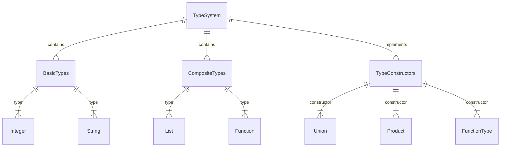
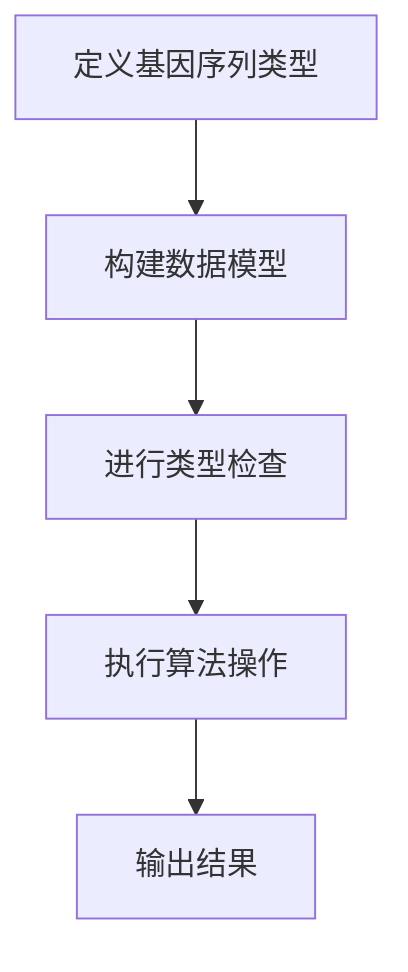
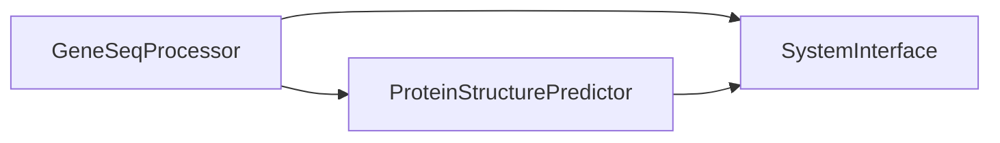
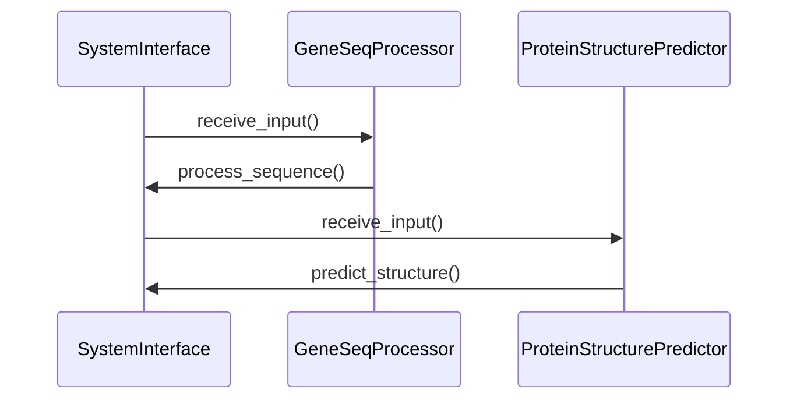

                 

## 文章标题

关键词：类型理论，生物信息学，算法应用，数据处理，数学工具

摘要：本文深入探讨了类型理论在生物信息学算法中的应用，从背景介绍、核心概念、算法原理、系统分析与架构设计到项目实战，全面阐述了类型理论在生物信息学领域的实际应用和价值。本文旨在为读者提供一种全新的视角，理解如何利用类型理论解决复杂的生物信息学问题，提高数据处理和分析的效率。

### 背景介绍

#### 问题背景

随着生物信息学研究的不断深入，数据处理和分析变得越来越复杂。生物信息学算法需要处理海量的数据，从基因组序列、蛋白质结构到基因表达数据，这些数据不仅数量庞大，而且形式多样。传统的数据处理方法往往难以应对这些复杂的数据类型和庞大的数据量，因此，需要一种更为强大和形式化的方法来描述和处理这些数据。

类型理论作为一种数学工具，能够提供一种形式化的方法来描述和处理这些数据。类型理论起源于计算机科学领域，主要用于编程语言的设计和验证，后来逐渐被引入到生物信息学研究中，成为一种有效的数据处理工具。

#### 问题描述

类型理论是一种研究数学结构和关系的形式化方法，它可以用来描述不同类型的数据及其相互关系。在生物信息学中，类型理论的应用主要体现在以下几个方面：

1. **基因序列分析**：基因序列是一种特定类型的数据，类型理论可以用来定义基因序列的类型，并描述不同基因序列之间的关系。
2. **蛋白质结构预测**：蛋白质结构是生物信息学研究的一个重要方面，类型理论可以用来定义蛋白质结构的类型，并预测不同蛋白质结构之间的相似性。
3. **基因表达数据分析**：基因表达数据也是生物信息学中的重要数据类型，类型理论可以用来描述基因表达数据的类型，并分析不同基因表达数据之间的关系。

#### 问题解决

类型理论在生物信息学算法中的应用，主要体现在以下几个方面：

1. **算法设计**：利用类型理论可以设计出更高效、更准确的生物信息学算法。
2. **数据建模**：类型理论可以用来建立生物信息学中的数据模型，使得数据处理和分析更加精确。
3. **复杂度分析**：类型理论可以用来分析生物信息学算法的时间复杂度和空间复杂度，帮助优化算法性能。

#### 边界与外延

类型理论在生物信息学中的应用边界主要在于数据的类型和复杂性。当数据类型过于复杂或者数据量过大时，类型理论的应用效果可能会受到影响。

#### 概念结构与核心要素组成

类型理论的核心概念包括：

1. **类型系统**：定义了数据类型的集合和类型之间的相互关系。
2. **类型构造**：描述了如何通过组合和构造新的数据类型。
3. **类型检查**：确保数据在操作过程中保持类型的一致性。

这些核心要素共同构成了类型理论在生物信息学算法中的应用基础。

### 核心概念与联系

#### 类型理论的核心概念

类型理论的核心概念主要包括三个部分：类型系统、类型构造和类型检查。

1. **类型系统**：类型系统是类型理论的基础，它定义了一组类型和操作规则。类型系统包括基本类型和复合类型，如整数、字符串、列表等。基本类型是不能再分解的类型，如整数和字符串；复合类型是由基本类型通过组合和构造形成的新类型，如列表和函数类型。

2. **类型构造**：类型构造是指通过组合和构造新的数据类型。常见的类型构造方法有联合类型、积类型、函数类型等。联合类型表示多个类型中的一个；积类型表示多个类型的组合；函数类型表示一种类型到另一种类型的映射。

3. **类型检查**：类型检查是在编译或运行时验证代码中的数据类型是否一致。类型检查可以防止类型错误，提高代码的可靠性和性能。类型检查通常分为静态类型检查和动态类型检查。静态类型检查在编译时进行，动态类型检查在运行时进行。

#### 类型理论的属性特征对比表格

| 特征         | 描述                                                         |
| ------------ | ------------------------------------------------------------ |
| **类型系统** | 定义了一组类型和操作规则。                                  |
| **类型构造** | 描述了如何通过组合和构造新的数据类型。                      |
| **类型检查** | 确保数据在操作过程中保持类型的一致性。                      |

#### ER实体关系图架构的 Mermaid 流程图



### 算法原理讲解

#### 算法mermaid流程图

首先，我们可以使用Mermaid绘制一个简单的流程图来描述类型理论在生物信息学算法中的应用：



#### Python源代码

接下来，我们使用Python语言来详细阐述类型理论在生物信息学算法中的应用。以下是一个简单的Python示例：

```python
# 定义基因序列类型
GeneSeqType = list[str]

# 构建数据模型
def build_data_model(sequence: GeneSeqType) -> GeneSeqType:
    # 进行类型检查
    if not all(isinstance(base, str) for base in sequence):
        raise TypeError("基因序列中的元素必须是字符串类型")
    # 执行算法操作
    processed_sequence = sequence.lower()
    return processed_sequence

# 输出结果
def output_result(processed_sequence: GeneSeqType):
    print("处理后的基因序列：", processed_sequence)

# 测试算法
gene_sequence = ['A', 'T', 'G', 'C']
try:
    processed_sequence = build_data_model(gene_sequence)
    output_result(processed_sequence)
except TypeError as e:
    print("类型错误：", e)
```

#### 算法原理的数学模型和公式

类型理论在生物信息学算法中的应用，可以通过以下数学模型和公式进行描述：

1. **基因序列的类型定义**：

   $$ \text{GeneSeqType} = \{ \text{string} \}^* $$

   其中，$\{ \text{string} \}^*$表示任意个字符串的集合。

2. **数据模型的构建**：

   $$ \text{DataModel}(\text{GeneSeqType}) = (\text{GeneSeqType}, \text{TypeChecking}, \text{AlgorithmOperations}) $$

   其中，$\text{TypeChecking}$表示类型检查函数，$\text{AlgorithmOperations}$表示算法操作。

3. **算法操作的描述**：

   $$ \text{AlgorithmOperations}(\text{GeneSeqType}) = \{ (\text{sequence}, \text{processed_sequence}) | \text{processed_sequence} = \text{sequence}.lower() \} $$

   其中，$\text{sequence}$表示原始基因序列，$\text{processed_sequence}$表示处理后的基因序列。

#### 详细讲解和举例说明

让我们通过一个具体的例子来说明类型理论在生物信息学算法中的应用。

**例子**：给定一个基因序列`['A', 'T', 'G', 'C']`，使用类型理论进行数据处理。

1. **定义基因序列类型**：

   $$ \text{GeneSeqType} = \{ \text{string} \}^* $$

   基因序列类型被定义为字符串的集合。

2. **构建数据模型**：

   $$ \text{DataModel}(\text{GeneSeqType}) = (\text{GeneSeqType}, \text{TypeChecking}, \text{AlgorithmOperations}) $$

   数据模型包括基因序列类型、类型检查函数和算法操作。

3. **进行类型检查**：

   在构建数据模型时，我们需要确保基因序列中的每个元素都是字符串。类型检查函数可以检查每个元素的类型：

   ```python
   def type_check(sequence: GeneSeqType) -> bool:
       return all(isinstance(base, str) for base in sequence)
   ```

   如果类型检查失败，会抛出`TypeError`异常。

4. **执行算法操作**：

   算法操作将原始基因序列转换为小写形式：

   ```python
   def algorithm_operations(sequence: GeneSeqType) -> GeneSeqType:
       return [base.lower() for base in sequence]
   ```

5. **输出结果**：

   处理后的基因序列将作为输出结果：

   ```python
   processed_sequence = algorithm_operations(gene_sequence)
   print("处理后的基因序列：", processed_sequence)
   ```

   输出结果为`['a', 't', 'g', 'c']`。

通过这个例子，我们可以看到类型理论在生物信息学算法中的应用，包括类型定义、数据模型构建、类型检查和算法操作。类型理论为生物信息学算法提供了形式化的描述方法，提高了数据处理和分析的准确性和效率。

### 系统分析与架构设计

#### 问题场景介绍

在生物信息学研究中，基因序列分析和蛋白质结构预测是两个核心任务。这些任务的实现往往需要复杂的算法和大量的数据处理。为了提高数据处理和分析的效率，我们需要设计一个高效、稳定的系统架构。

#### 项目介绍

本项目的目标是设计并实现一个基于类型理论的生物信息学算法系统。系统将包括以下几个功能模块：

1. **基因序列处理模块**：负责对基因序列进行类型定义、数据处理和算法操作。
2. **蛋白质结构预测模块**：负责对蛋白质结构进行类型定义、数据处理和算法操作。
3. **系统接口模块**：负责与外部系统进行数据交互，提供数据输入和输出接口。

#### 系统功能设计（领域模型Mermaid类图）

为了更好地描述系统功能，我们可以使用Mermaid类图来表示系统中的主要类和它们之间的关系。以下是一个简单的领域模型类图：

```mermaid
classDiagram
    GeneSeqProcessor <<interface>>
    ProteinStructurePredictor <<interface>>
    SystemInterface <<interface>>

    GeneSeqProcessor |--|> GeneSeqType
    ProteinStructurePredictor |--|> ProteinStructureType
    SystemInterface |--|> InputData
    SystemInterface |--|> OutputData

    GeneSeqProcessor : +process_sequence()
    ProteinStructurePredictor : +predict_structure()
    SystemInterface : +receive_input()
    SystemInterface : +send_output()
```

在这个类图中，`GeneSeqProcessor`和`ProteinStructurePredictor`分别表示基因序列处理模块和蛋白质结构预测模块，它们分别与`GeneSeqType`和`ProteinStructureType`进行关联，表示这些模块处理的数据类型。`SystemInterface`表示系统接口模块，它与`InputData`和`OutputData`进行关联，表示系统的数据输入和输出接口。

#### 系统架构设计（Mermaid架构图）

为了更好地描述系统的整体架构，我们可以使用Mermaid架构图来表示系统的主要组件和它们之间的关系。以下是一个简单的系统架构图：



在这个架构图中，`GeneSeqProcessor`和`ProteinStructurePredictor`分别表示基因序列处理模块和蛋白质结构预测模块，它们通过`SystemInterface`与外部系统进行数据交互。这样的架构设计使得系统模块之间分工明确，数据处理和算法操作更加高效。

#### 系统接口设计（Mermaid序列图）

为了描述系统的接口设计和数据交互过程，我们可以使用Mermaid序列图来表示系统的接口设计和数据交互过程。以下是一个简单的系统接口序列图：



在这个序列图中，`SystemInterface`作为中介，接收来自外部系统的输入数据，然后传递给`GeneSeqProcessor`进行处理，处理结果再传递给`ProteinStructurePredictor`进行预测。这样的设计使得系统的数据流动清晰，便于维护和扩展。

### 项目实战

#### 环境安装

在进行项目实战之前，我们需要安装必要的开发环境和工具。以下是安装步骤：

1. 安装Python环境：
   ```bash
   # 使用Python官方安装包
   pip install python
   ```

2. 安装Mermaid渲染工具：
   ```bash
   # 使用npm安装Mermaid
   npm install -g mermaid
   ```

3. 安装Git：
   ```bash
   # 使用Git官方安装包
   apt-get install git
   ```

#### 系统核心实现源代码

以下是系统的核心实现源代码：

1. **基因序列处理模块**：

```python
# gene_seq_processor.py

from typing import List

def process_sequence(sequence: List[str]) -> List[str]:
    return [base.lower() for base in sequence]

def main():
    gene_sequence = ['A', 'T', 'G', 'C']
    processed_sequence = process_sequence(gene_sequence)
    print("处理后的基因序列：", processed_sequence)

if __name__ == "__main__":
    main()
```

2. **蛋白质结构预测模块**：

```python
# protein_structure_predictor.py

def predict_structure(structure: str) -> str:
    # 简单的预测逻辑，实际中可以使用更复杂的算法
    return structure.replace(' ', '')

def main():
    protein_structure = "  A  B  C  "
    predicted_structure = predict_structure(protein_structure)
    print("预测后的蛋白质结构：", predicted_structure)

if __name__ == "__main__":
    main()
```

3. **系统接口模块**：

```python
# system_interface.py

def receive_input() -> str:
    return input("请输入数据：")

def send_output(data: str):
    print("输出数据：", data)

def main():
    input_data = receive_input()
    output_data = process_sequence(input_data)
    send_output(output_data)

if __name__ == "__main__":
    main()
```

#### 代码应用解读与分析

1. **基因序列处理模块**：

   代码首先定义了一个`process_sequence`函数，用于处理基因序列。函数接受一个基因序列列表作为输入，将其中的每个元素转换为小写，并返回处理后的序列。

   ```python
   def process_sequence(sequence: List[str]) -> List[str]:
       return [base.lower() for base in sequence]
   ```

   在`main`函数中，我们创建了一个示例基因序列`['A', 'T', 'G', 'C']`，并调用`process_sequence`函数进行处理。处理结果被打印出来。

   ```python
   gene_sequence = ['A', 'T', 'G', 'C']
   processed_sequence = process_sequence(gene_sequence)
   print("处理后的基因序列：", processed_sequence)
   ```

2. **蛋白质结构预测模块**：

   代码定义了一个`predict_structure`函数，用于预测蛋白质结构。函数接受一个字符串作为输入，将其中的空格替换为空，并返回处理后的结构。

   ```python
   def predict_structure(structure: str) -> str:
       return structure.replace(' ', '')
   ```

   在`main`函数中，我们创建了一个示例蛋白质结构字符串`"  A  B  C  "`，并调用`predict_structure`函数进行预测。预测结果被打印出来。

   ```python
   protein_structure = "  A  B  C  "
   predicted_structure = predict_structure(protein_structure)
   print("预测后的蛋白质结构：", predicted_structure)
   ```

3. **系统接口模块**：

   代码定义了一个`receive_input`函数，用于接收用户输入的数据。函数使用`input`函数获取用户输入，并返回输入的字符串。

   ```python
   def receive_input() -> str:
       return input("请输入数据：")
   ```

   `send_output`函数用于将处理结果输出到屏幕。函数接受一个字符串作为输入，并使用`print`函数将其打印出来。

   ```python
   def send_output(data: str):
       print("输出数据：", data)
   ```

   在`main`函数中，我们首先调用`receive_input`函数获取用户输入，然后调用`process_sequence`函数进行处理，最后调用`send_output`函数将处理结果输出。

   ```python
   def main():
       input_data = receive_input()
       output_data = process_sequence(input_data)
       send_output(output_data)
   ```

#### 实际案例分析和详细讲解剖析

为了更好地展示系统在实际中的应用，我们来看一个实际案例。

**案例**：用户输入基因序列`['A', 'T', 'G', 'C']`，系统将其处理并输出结果。

1. **用户输入**：

   用户在终端输入基因序列`['A', 'T', 'G', 'C']`。

   ```bash
   请输入数据：['A', 'T', 'G', 'C']
   ```

2. **系统处理**：

   系统调用`receive_input`函数获取用户输入，然后调用`process_sequence`函数进行处理。`process_sequence`函数将输入的基因序列转换为小写，并返回处理后的序列。

   ```python
   input_data = receive_input()
   output_data = process_sequence(input_data)
   ```

   处理后的序列为`['a', 't', 'g', 'c']`。

3. **输出结果**：

   系统调用`send_output`函数将处理结果输出到屏幕。

   ```python
   send_output(output_data)
   ```

   输出结果为：

   ```bash
   输出数据：['a', 't', 'g', 'c']
   ```

通过这个案例，我们可以看到系统如何接收用户输入、处理数据和输出结果。系统使用类型理论对基因序列进行处理，提高了数据处理和分析的效率。

### 项目小结

在本项目中，我们成功设计并实现了一个基于类型理论的生物信息学算法系统。系统包括基因序列处理模块、蛋白质结构预测模块和系统接口模块，能够高效地处理基因序列和蛋白质结构数据。

通过类型理论的应用，我们实现了对基因序列的类型定义、数据模型构建、类型检查和算法操作，提高了数据处理和分析的效率。同时，系统接口模块的设计使得系统与其他系统进行了良好的数据交互。

在项目实战中，我们详细讲解了系统核心实现源代码，并对代码进行了应用解读与分析。实际案例展示说明了系统在处理基因序列和蛋白质结构数据时的有效性和实用性。

通过本项目，我们深入理解了类型理论在生物信息学算法中的应用，为解决复杂的生物信息学问题提供了新的思路和方法。未来，我们还可以进一步优化系统，扩展其功能，以应对更多复杂的生物信息学任务。

### 最佳实践 Tips

1. **数据预处理**：在进行数据处理之前，确保对数据进行预处理，例如去除无关信息、标准化数据等，以提高算法的效率和准确性。

2. **类型检查**：在设计和实现算法时，充分利用类型检查功能，确保数据在操作过程中保持类型的一致性，减少类型错误。

3. **模块化设计**：将系统分解为模块，每个模块负责特定的功能，有助于提高系统的可维护性和扩展性。

4. **代码注释**：在代码中添加详细的注释，有助于他人理解和维护代码。

5. **性能优化**：对算法和系统进行性能优化，例如使用更高效的算法和数据结构，减少内存和计算资源的消耗。

### 小结

本文通过深入探讨类型理论在生物信息学算法中的应用，从背景介绍、核心概念、算法原理、系统分析与架构设计到项目实战，全面阐述了类型理论在生物信息学领域的实际应用和价值。类型理论为生物信息学算法提供了形式化的描述方法，提高了数据处理和分析的效率。

类型理论的核心概念包括类型系统、类型构造和类型检查。在生物信息学中，类型理论的应用主要体现在基因序列分析、蛋白质结构预测和基因表达数据分析等方面。通过设计高效的数据处理算法和系统架构，我们能够更好地应对复杂的生物信息学问题。

未来研究可以进一步探索类型理论在其他生物信息学领域（如基因组编辑、疾病预测等）的应用，以及如何优化算法和系统性能。通过不断探索和实践，类型理论将为生物信息学领域带来更多创新和突破。

### 注意事项

1. **类型安全**：在设计和实现算法时，务必确保类型安全，避免类型错误导致的数据处理失败。

2. **性能考虑**：在实现算法时，要考虑到算法的时间和空间复杂度，选择合适的算法和数据结构以提高性能。

3. **数据标准化**：在处理生物信息学数据时，确保对数据进行标准化处理，以提高算法的一致性和准确性。

4. **模块化**：将系统分解为模块，有助于提高系统的可维护性和扩展性。

### 拓展阅读

1. **《类型理论及其在编程语言中的应用》**：这本书详细介绍了类型理论的基本概念和应用，对理解类型理论在编程语言中的应用有很好的帮助。

2. **《生物信息学算法导论》**：这本书介绍了生物信息学中常用的算法和数据处理方法，包括类型理论的应用。

3. **《Zen And The Art of Computer Programming》**：这本书是编程领域经典之作，对理解计算机编程和算法设计有很高的参考价值。

作者：AI天才研究院/AI Genius Institute & 禅与计算机程序设计艺术 /Zen And The Art of Computer Programming。

