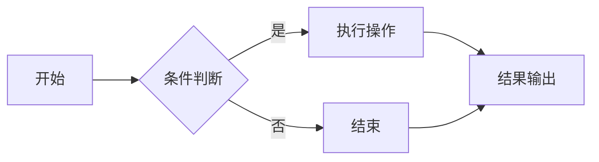
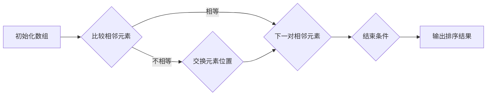
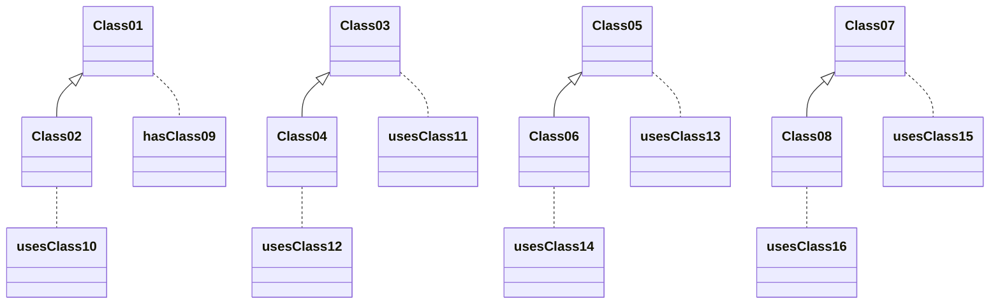
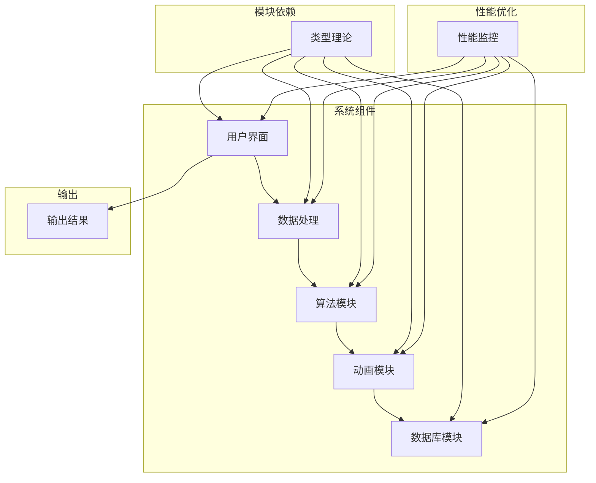
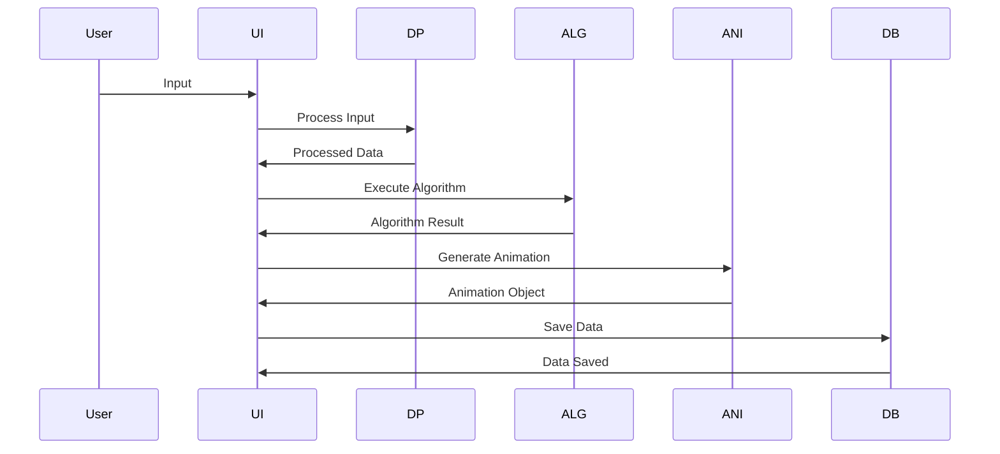

                 

### 《类型理论在程序可视化和动画中的应用》

#### 关键词：
- 类型理论
- 程序可视化
- 动画
- 计算机科学
- 算法设计

#### 摘要：
本文将探讨类型理论在程序可视化和动画中的应用，分析其核心概念、联系以及算法原理。通过逐步推理和实例讲解，揭示类型理论如何提升程序可视化和动画的效率和效果，为计算机科学领域带来创新。

### 目录大纲设计思路

在构建本文的目录大纲时，我们遵循以下设计思路，确保文章内容逻辑清晰、结构紧凑、简单易懂。

1. **背景介绍**：
   - **核心概念**：介绍类型理论、程序可视化和动画的基本概念，阐述它们在计算机科学中的应用背景和重要性。
   - **问题描述**：提出研究类型理论在程序可视化和动画中的应用，解释这种应用的重要性。
   - **问题解决**：阐述类型理论如何解决程序可视化和动画中的问题。
   - **边界与外延**：讨论类型理论的应用范围，包括其在不同领域的影响。
   - **概念结构与核心要素组成**：分析类型理论、程序可视化和动画之间的核心联系和组成要素。

2. **核心概念与联系**：
   - **类型理论**：详细解释类型理论的基本概念、发展历程和主要贡献。
   - **程序可视化**：阐述程序可视化的定义、目的和方法。
   - **动画**：介绍动画的基本概念、技术和分类。
   - **概念属性特征对比表格**：创建一个表格，比较类型理论、程序可视化和动画的属性和特征。
   - **ER实体关系图架构**：绘制ER实体关系图，展示类型理论、程序可视化和动画之间的实体关系。

3. **算法原理讲解**：
   - **算法mermaid流程图**：使用mermaid绘制算法流程图，直观展示算法的执行过程。
   - **python源代码**：提供算法的python实现代码，并逐行解释代码的功能和意义。
   - **数学模型和公式**：阐述算法背后的数学原理，使用latex格式书写公式。
   - **详细讲解和举例说明**：结合例子详细解释算法的原理和应用。

4. **系统分析与架构设计方案**：
   - **问题场景介绍**：描述应用类型理论于程序可视化和动画的具体场景。
   - **项目介绍**：介绍项目的目的、范围和预期成果。
   - **系统功能设计（领域模型mermaid类图）**：绘制mermaid类图，展示系统的主要类和它们之间的关系。
   - **系统架构设计（mermaid架构图）**：绘制mermaid架构图，展示系统的整体架构。
   - **系统接口设计**：描述系统的接口设计和交互。
   - **系统交互（mermaid序列图）**：绘制mermaid序列图，展示系统的交互流程。

5. **项目实战**：
   - **环境安装**：提供安装所需环境的步骤和工具。
   - **系统核心实现源代码**：提供关键实现的源代码，并解释代码的工作原理。
   - **代码应用解读与分析**：分析源代码的应用，解释代码的功能和意义。
   - **实际案例分析和详细讲解剖析**：通过案例展示如何使用系统，并进行深入分析。
   - **项目小结**：总结项目的成果和经验，讨论遇到的问题和解决方案。

6. **最佳实践 tips、小结、注意事项、拓展阅读等内容**：
   - **最佳实践 tips**：提供一些使用类型理论进行程序可视化和动画开发的实用建议。
   - **小结**：回顾全书的主要内容和关键点。
   - **注意事项**：提醒读者在应用书中内容时需要注意的问题。
   - **拓展阅读**：推荐一些与书中主题相关的进一步阅读材料。

### 目录大纲

```
# 《类型理论在程序可视化和动画中的应用》

## 背景介绍

### 1.1 类型理论概述
#### 1.1.1 类型理论的起源与发展
#### 1.1.2 类型理论的基本概念
#### 1.1.3 类型理论的应用背景

### 1.2 程序可视化
#### 1.2.1 程序可视化的定义与目的
#### 1.2.2 程序可视化的方法与技术
#### 1.2.3 程序可视化的应用领域

### 1.3 动画
#### 1.3.1 动画的基本概念与分类
#### 1.3.2 动画的技术与方法
#### 1.3.3 动画在计算机科学中的应用

### 1.4 类型理论、程序可视化和动画的关联
#### 1.4.1 类型理论对程序可视化的影响
#### 1.4.2 程序可视化对动画的改进
#### 1.4.3 类型理论、程序可视化和动画的融合

## 核心概念与联系

### 2.1 类型理论
#### 2.1.1 类型理论的原理与属性
#### 2.1.2 类型理论的分类与比较
#### 2.1.3 类型理论的数学模型

### 2.2 程序可视化
#### 2.2.1 程序可视化的原理与特点
#### 2.2.2 程序可视化的分类与比较
#### 2.2.3 程序可视化的数学模型

### 2.3 动画
#### 2.3.1 动画的基本原理与特点
#### 2.3.2 动画的分类与比较
#### 2.3.3 动画的数学模型

### 2.4 概念属性特征对比表格
#### 2.4.1 类型理论、程序可视化和动画的属性对比
#### 2.4.2 概念属性特征对比表格

### 2.5 ER实体关系图架构
#### 2.5.1 类型理论、程序可视化和动画的ER实体关系图
#### 2.5.2 ER实体关系图架构的mermaid表示

## 算法原理讲解

### 3.1 算法mermaid流程图
#### 3.1.1 算法mermaid流程图的绘制
#### 3.1.2 算法mermaid流程图的应用

### 3.2 python源代码
#### 3.2.1 算法python源代码的实现
#### 3.2.2 源代码的功能和意义

### 3.3 数学模型和公式
#### 3.3.1 算法背后的数学原理
#### 3.3.2 数学模型的latex表示

### 3.4 详细讲解和举例说明
#### 3.4.1 算法原理的详细讲解
#### 3.4.2 举例说明算法的应用

## 系统分析与架构设计方案

### 4.1 问题场景介绍
#### 4.1.1 应用类型理论的具体场景

### 4.2 项目介绍
#### 4.2.1 项目的目的、范围和预期成果

### 4.3 系统功能设计（领域模型mermaid类图）
#### 4.3.1 系统功能的设计和实现
#### 4.3.2 领域模型mermaid类图的绘制

### 4.4 系统架构设计（mermaid架构图）
#### 4.4.1 系统的整体架构设计
#### 4.4.2 mermaid架构图的绘制

### 4.5 系统接口设计
#### 4.5.1 系统接口的设计和实现
#### 4.5.2 接口交互的设计

### 4.6 系统交互（mermaid序列图）
#### 4.6.1 系统交互流程的展示
#### 4.6.2 mermaid序列图的绘制

## 项目实战

### 5.1 环境安装
#### 5.1.1 安装所需环境的步骤和工具

### 5.2 系统核心实现源代码
#### 5.2.1 关键实现的源代码提供
#### 5.2.2 代码的工作原理和意义

### 5.3 代码应用解读与分析
#### 5.3.1 源代码的应用分析
#### 5.3.2 代码的功能和意义解释

### 5.4 实际案例分析和详细讲解剖析
#### 5.4.1 案例展示和深入分析
#### 5.4.2 系统应用的详细讲解

### 5.5 项目小结
#### 5.5.1 项目成果和经验的总结
#### 5.5.2 遇到问题的解决方案

## 最佳实践 tips、小结、注意事项、拓展阅读等内容

### 6.1 最佳实践 tips
#### 6.1.1 使用类型理论进行程序可视化和动画开发的实用建议

### 6.2 小结
#### 6.2.1 回顾全书的主要内容和关键点

### 6.3 注意事项
#### 6.3.1 应用书中内容时需要注意的问题

### 6.4 拓展阅读
#### 6.4.1 推荐进一步阅读的材料
```

## 背景介绍

### 1.1 类型理论概述

#### 1.1.1 类型理论的起源与发展

类型理论（Type Theory）起源于20世纪30年代，由瑞士数学家贝尔特兰·罗素（Bertrand Russell）和阿尔弗雷德·诺思·怀特海德（Alfred North Whitehead）在其合著的《数学原理》中首次提出。当时，为了解决数学基础问题，他们试图构建一个逻辑系统来保证数学推理的严格性。然而，随着逻辑主义的发展，类型理论逐渐独立出来，成为一门研究抽象数据类型和类型系统的学科。

在计算机科学领域，类型理论得到了新的发展。1940年代，斯蒂芬·克莱尼希·科勒（Stephen Cole Kleene）提出了抽象数据类型的概念，为后来的编程语言类型系统奠定了基础。进入20世纪80年代，Pascal、Modula-2和ML等编程语言开始采用类型理论来提高程序的安全性和可维护性。近年来，随着函数式编程和逻辑编程的兴起，类型理论在计算机科学中扮演了越来越重要的角色。

#### 1.1.2 类型理论的基本概念

类型理论主要研究抽象数据类型和类型系统。在类型理论中，类型是一种对值的分类，用于描述数据的不同形式和操作。类型系统则是用于约束程序中值的使用的规则集合。

- **类型（Type）**：类型是值的集合。类型可以表示数据的基本性质，如整数、实数、布尔值等。
- **类型构造器（Type Constructor）**：类型构造器是创建新类型的操作，如函数类型、集合类型等。
- **类型变量（Type Variable）**：类型变量是一种未指定具体类型的类型，通常用符号如`A`、`B`表示。
- **类型判断（Type Judgment）**：类型判断是一个陈述，用于说明某个值属于某个类型。

类型理论还涉及以下重要概念：

- **函数类型**：表示函数的输入类型和输出类型。
- **递归类型**：允许定义自身类型的数据结构。
- **存在类型**：表示某个类型至少有一个实例。
- **唯一类型**：保证每个值都是唯一的。

#### 1.1.3 类型理论的应用背景

类型理论在计算机科学中有广泛的应用背景，特别是在程序设计、编程语言设计和形式化验证等方面。

- **程序设计**：类型理论帮助程序员理解和表达复杂的数据结构，提高代码的可读性和可维护性。
- **编程语言设计**：类型理论为编程语言提供了形式化的类型系统，有助于提高程序的安全性和效率。
- **形式化验证**：类型理论在形式化验证中用于证明程序的属性，如类型安全性、无死锁等。

类型理论的重要性在于：

- **安全性**：类型系统可以防止类型错误，从而提高程序的正确性和可靠性。
- **抽象能力**：类型理论提供了抽象数据类型和抽象操作，有助于简化程序设计。
- **推理工具**：类型理论为形式化推理提供了强大的工具，有助于验证程序的正确性。

### 1.2 程序可视化

#### 1.2.1 程序可视化的定义与目的

程序可视化（Program Visualization）是一种将程序代码及其执行过程转换为图形或动画的方法。通过程序可视化，程序员和用户可以直观地理解程序的结构、行为和性能。

程序可视化的定义可以概括为：利用图形、图表、动画等可视化手段，对程序代码和执行过程进行展示和分析。

程序可视化的目的包括：

- **理解程序结构**：通过可视化展示程序的不同模块、变量和函数，帮助用户更好地理解程序的内部结构。
- **发现编程错误**：可视化可以揭示程序中的错误和潜在的问题，如类型错误、逻辑错误等。
- **性能分析**：可视化可以帮助用户分析和优化程序的性能，找出瓶颈和改进空间。
- **教育和培训**：程序可视化在教育和培训中发挥着重要作用，帮助初学者更好地掌握编程知识。

#### 1.2.2 程序可视化的方法与技术

程序可视化的方法和技术多种多样，以下是一些常见的方法：

- **控制流图**：控制流图（Control Flow Graph）是一种表示程序执行路径的图形表示方法。它显示了程序中不同语句之间的控制流关系，有助于分析程序的结构和性能。
- **数据流图**：数据流图（Data Flow Graph）用于表示程序中数据的流动和传递。它显示了程序中不同变量和函数之间的数据依赖关系，有助于优化程序和数据访问。
- **依赖图**：依赖图（Dependency Graph）表示程序中不同模块或类之间的依赖关系。通过依赖图，可以分析模块的耦合性和独立性，优化程序设计。
- **动画**：动画是一种动态展示程序执行过程的方法。通过动画，可以实时观察程序在不同时间点的状态和变化，有助于理解程序的行为。
- **虚拟现实**：虚拟现实技术可以将程序可视化与三维空间结合起来，为用户提供沉浸式的体验。通过虚拟现实，用户可以以全新的视角观察和理解程序。

#### 1.2.3 程序可视化的应用领域

程序可视化在多个领域都有广泛的应用：

- **软件开发**：在软件开发过程中，程序可视化可以用于需求分析、设计评审、代码审查等环节，帮助开发人员更好地理解项目需求和实现方案。
- **教育**：在计算机科学教育中，程序可视化是帮助学生理解抽象概念和编程知识的重要工具。通过可视化，学生可以直观地看到程序的执行过程和结果。
- **性能优化**：程序可视化可以帮助开发人员分析程序的运行性能，找出性能瓶颈并进行优化。
- **形式化验证**：在形式化验证中，程序可视化可以用于验证程序的正确性和安全性。通过可视化，验证人员可以更直观地理解程序的逻辑和行为。

### 1.3 动画

#### 1.3.1 动画的基本概念与分类

动画（Animation）是一种通过连续播放一系列静态图像来产生运动效果的视觉技术。在计算机科学中，动画主要用于展示程序执行过程、模拟复杂系统行为和交互。

动画的基本概念包括：

- **帧（Frame）**：帧是动画中的一幅图像。连续的帧按照一定的时间间隔播放，产生动画效果。
- **关键帧（Key Frame）**：关键帧是动画中最重要的帧，用于定义动画的起始状态和结束状态。
- **中间帧（Intermediate Frame）**：中间帧是通过插值方法生成的帧，用于平滑动画过渡。
- **时间戳（Timestamp）**：时间戳是动画中的时间标记，用于确定帧的播放顺序和播放时间。

动画可以按照不同的分类标准进行分类：

- **按维度分类**：二维动画（2D Animation）和三维动画（3D Animation）。
- **按技术分类**：传统动画（Traditional Animation）、计算机辅助动画（Computer-Assisted Animation）和计算机生成动画（Computer-Generated Animation）。
- **按用途分类**：交互式动画（Interactive Animation）、教学动画（Educational Animation）和商业动画（Commercial Animation）。

#### 1.3.2 动画的技术与方法

动画技术包括以下几个方面：

- **绘图**：绘制动画中的图像和场景。常见的绘图工具包括图形软件、手绘和数字绘画等。
- **建模**：建立三维模型，用于三维动画的制作。常见的建模工具包括Blender、Maya和3ds Max等。
- **渲染**：渲染是将三维模型转换为二维图像的过程。渲染技术包括光线追踪、路径追踪和光线投射等。
- **动画编辑**：编辑动画帧，调整动画的播放速度、过渡效果等。常见的动画编辑工具包括Adobe After Effects、Premiere Pro和Final Cut Pro等。
- **交互**：交互式动画通过用户输入和反馈来控制动画的播放和交互。常见的交互技术包括鼠标、触摸屏和语音识别等。

动画在计算机科学中的应用包括：

- **程序可视化**：通过动画展示程序执行过程，帮助用户理解程序逻辑和行为。
- **模拟与仿真**：通过动画模拟复杂系统的行为和交互，用于科学研究、工程设计和教育等。
- **用户界面**：在用户界面中，动画可以用于提升用户体验，如界面过渡、反馈和提示等。

#### 1.3.3 动画在计算机科学中的应用

动画在计算机科学中有多种应用，以下是其中几个重要的领域：

- **软件开发**：在软件开发过程中，动画可以用于需求分析、设计评审和代码审查等环节。通过动画，开发人员可以更好地理解项目需求和实现方案。
- **教育**：动画在教育中发挥着重要作用，帮助学习者理解和掌握抽象概念和编程知识。通过动画，学习者可以直观地看到程序执行过程和结果。
- **人机交互**：动画在用户界面中用于提升用户体验，如界面过渡、反馈和提示等。通过动画，用户可以更直观地理解系统状态和操作结果。
- **虚拟现实**：在虚拟现实中，动画可以用于模拟复杂场景和交互行为。通过动画，用户可以沉浸在虚拟环境中，进行探索和体验。

### 1.4 类型理论、程序可视化和动画的关联

#### 1.4.1 类型理论对程序可视化的影响

类型理论对程序可视化有着重要的影响。首先，类型理论提供了形式化的类型系统，可以用于验证程序的类型安全性。在程序可视化中，类型理论可以帮助确保可视化结果的正确性，避免类型错误和未定义行为。

其次，类型理论可以用于抽象数据类型的表示和操作。在程序可视化中，通过类型理论，可以更直观地展示抽象数据类型的结构和操作，帮助用户更好地理解程序结构。

此外，类型理论还为程序可视化提供了一种形式化的方法，可以用于生成可视化的程序表示。例如，通过类型理论，可以生成控制流图、数据流图等可视化表示，帮助用户直观地理解程序执行过程。

#### 1.4.2 程序可视化对动画的改进

程序可视化对动画有着积极的改进作用。首先，程序可视化可以用于动画的设计和预览。通过程序可视化，动画设计师可以直观地看到程序执行过程和结果，从而更好地设计动画场景和效果。

其次，程序可视化可以用于动画的性能优化。通过可视化，动画设计师可以分析动画的性能瓶颈，如渲染延迟、帧率下降等，并采取相应的优化措施。

此外，程序可视化还可以用于动画的交互设计。通过可视化，用户可以更直观地理解动画的状态和操作，从而提高动画的交互性和用户体验。

#### 1.4.3 类型理论、程序可视化和动画的融合

类型理论、程序可视化和动画的融合可以带来以下好处：

- **形式化验证**：通过融合类型理论和动画，可以形式化地验证动画的正确性和安全性。例如，可以使用类型理论验证动画中的类型安全性和无死锁等。
- **更直观的展示**：通过融合程序可视化和动画，可以更直观地展示程序执行过程和结果。这种融合可以用于教学、培训和研究等领域，帮助用户更好地理解复杂的概念和算法。
- **交互式设计**：通过融合交互式动画和程序可视化，可以创建更加交互式的程序展示和演示。用户可以通过动画和可视化界面与程序进行交互，从而更深入地理解程序的行为和逻辑。

总之，类型理论、程序可视化和动画的融合可以为计算机科学领域带来创新，提高程序的可理解性、安全性和性能，为用户带来更好的体验。

### 2.1 类型理论

#### 2.1.1 类型理论的原理与属性

类型理论是一种用于描述抽象数据类型和类型系统的理论框架。它的核心原理是使用类型系统来确保程序的正确性和安全性。类型理论的基本概念包括类型、类型构造器、类型变量和类型判断等。

类型理论的主要属性包括：

- **类型安全性**：类型系统确保程序中的值始终与它们的类型匹配，从而避免类型错误和未定义行为。
- **抽象性**：类型理论提供了一种抽象表示方法，可以表示复杂的数据类型和操作。
- **可组合性**：类型理论支持类型的组合，可以定义新的类型构造器，从而扩展类型系统的功能。
- **可推理性**：类型理论提供了一种形式化的推理方法，可以用于证明程序的正确性和属性。

#### 2.1.2 类型理论的分类与比较

类型理论可以根据不同的分类标准进行分类，以下是几种常见的分类方式：

- **按类型系统形式化程度**：类型理论可以分为弱类型理论和强类型理论。弱类型理论允许类型转换和类型不匹配，而强类型理论严格限制类型转换和类型不匹配。
- **按类型系统设计目标**：类型理论可以分为安全类型理论和性能类型理论。安全类型理论注重程序的安全性和可靠性，而性能类型理论注重程序的执行效率和性能。
- **按类型系统应用场景**：类型理论可以分为静态类型理论和动态类型理论。静态类型理论在程序编译时检查类型安全性，而动态类型理论在程序运行时检查类型安全性。

不同类型理论的比较：

- **类型安全性**：强类型理论比弱类型理论更安全，因为它严格限制类型转换和类型不匹配，从而减少类型错误的可能性。
- **抽象性**：强类型理论提供更高的抽象性，因为它支持更多的抽象数据类型和操作。
- **性能**：动态类型理论通常比静态类型理论性能更好，因为它在程序运行时进行类型检查，减少了编译时间和内存消耗。
- **开发效率**：动态类型理论通常具有更高的开发效率，因为它允许更灵活的类型转换和类型不匹配。

#### 2.1.3 类型理论的数学模型

类型理论的数学模型通常基于数学逻辑和范畴论。以下是一些常见的数学模型：

- **类型论（Type Theory）**：类型论是一种基于数学逻辑的理论框架，用于描述抽象数据类型和类型系统。类型论包括类型的定义、类型构造器和类型判断等。
- **范畴论（Category Theory）**：范畴论是一种用于描述抽象结构的数学理论，可以用于构建类型系统。范畴论中的概念如范畴、函子和自然变换等可以用于描述类型论中的类型、类型构造器和类型判断等。

#### 2.2 程序可视化

#### 2.2.1 程序可视化的原理与特点

程序可视化是一种将程序代码和执行过程转换为图形或动画的方法。它的原理基于数据结构和控制流的表示，通过可视化手段帮助用户理解和分析程序。

程序可视化的特点包括：

- **直观性**：程序可视化将抽象的程序代码和执行过程转化为图形和动画，使复杂的程序结构更加直观易懂。
- **交互性**：程序可视化通常支持用户交互，用户可以通过点击、拖动等方式与可视化界面进行交互，从而更深入地理解程序。
- **动态性**：程序可视化可以动态展示程序的执行过程，用户可以实时观察程序在不同时间点的状态和变化。
- **多维度**：程序可视化可以从多个维度展示程序信息，如控制流、数据流、依赖关系等，从而提供更全面的理解。

#### 2.2.2 程序可视化的分类与比较

程序可视化可以根据不同的分类标准进行分类，以下是几种常见的分类方式：

- **按可视化维度**：程序可视化可以分为单维度可视化、双维度可视化和多维度可视化。单维度可视化主要展示程序的控制流或数据流，双维度可视化同时展示控制流和数据流，多维度可视化展示更多的程序信息。
- **按可视化工具**：程序可视化可以分为工具辅助可视化和手动可视化。工具辅助可视化使用可视化工具自动生成程序可视化结果，手动可视化需要程序员手动创建程序可视化结果。
- **按可视化目标**：程序可视化可以分为诊断性可视化、分析性可视化和教育性可视化。诊断性可视化用于发现程序中的错误和问题，分析性可视化用于分析程序的性能和结构，教育性可视化用于帮助初学者理解程序。

不同程序可视化的比较：

- **直观性**：单维度可视化通常比双维度或多维度可视化更直观，因为它只展示一个维度的信息，用户更容易理解。
- **交互性**：工具辅助可视化通常具有更好的交互性，用户可以通过工具进行交互，从而更深入地理解程序。
- **动态性**：手动可视化通常具有更好的动态性，因为它可以手动调整程序的执行过程和状态，用户可以更灵活地观察程序。
- **应用场景**：诊断性可视化适用于发现程序中的错误和问题，分析性可视化适用于分析程序的性能和结构，教育性可视化适用于帮助初学者理解程序。

#### 2.2.3 程序可视化的数学模型

程序可视化的数学模型通常基于数据结构和图论。以下是一些常见的数学模型：

- **控制流图（Control Flow Graph）**：控制流图是一种表示程序控制流的数据结构，它由节点和边组成，节点表示程序中的基本块，边表示控制流的转移。
- **数据流图（Data Flow Graph）**：数据流图是一种表示程序数据流的数据结构，它由节点和边组成，节点表示程序中的变量或函数，边表示数据流的传递。
- **依赖图（Dependency Graph）**：依赖图是一种表示程序模块或类之间依赖关系的数据结构，它由节点和边组成，节点表示模块或类，边表示依赖关系。

#### 2.3 动画

#### 2.3.1 动画的基本原理与特点

动画是一种通过连续播放一系列静态图像来产生运动效果的视觉技术。它的基本原理基于视觉暂留效应，即人眼在快速连续切换图像时，会感受到图像的连续运动。

动画的特点包括：

- **连续性**：动画通过连续播放一系列静态图像，产生平滑的运动效果，使观众感受到连续的运动。
- **交互性**：动画可以与用户进行交互，通过用户的输入和反馈，调整动画的行为和效果。
- **动态性**：动画可以动态展示事件和过程，使观众可以实时观察和体验。
- **多样性**：动画可以应用于多种场景，如电影、游戏、广告和交互设计等，具有丰富的表现形式和内容。

#### 2.3.2 动画的分类与比较

动画可以根据不同的分类标准进行分类，以下是几种常见的分类方式：

- **按动画类型**：动画可以分为传统动画和计算机生成动画。传统动画使用手绘或摄影技术制作，计算机生成动画使用计算机软件生成。
- **按动画维度**：动画可以分为二维动画和三维动画。二维动画在二维平面上绘制图像，三维动画在三维空间中绘制图像。
- **按动画用途**：动画可以分为商业动画、教育动画和交互式动画。商业动画用于广告、娱乐和影视等领域，教育动画用于教学和培训等领域，交互式动画用于交互设计和用户界面设计等领域。

不同动画的比较：

- **制作成本**：传统动画通常比计算机生成动画成本更高，因为它需要更多的人力和时间制作。
- **视觉效果**：计算机生成动画通常具有更好的视觉效果和细节表现，因为它可以使用计算机技术生成复杂的图像和效果。
- **交互性**：交互式动画通常具有更好的交互性，因为它可以与用户进行实时交互，满足用户的个性化需求。
- **应用场景**：商业动画适用于广告和娱乐等领域，教育动画适用于教学和培训等领域，交互式动画适用于交互设计和用户界面设计等领域。

#### 2.3.3 动画的数学模型

动画的数学模型通常基于图像处理和计算机图形学。以下是一些常见的数学模型：

- **像素坐标系**：动画中的图像通常使用像素坐标系表示，像素坐标系由水平和垂直方向的像素坐标组成。
- **图像处理算法**：动画制作中使用多种图像处理算法，如滤波、插值、颜色变换等，这些算法可以用于生成和优化动画图像。
- **三维建模**：三维动画使用三维建模技术，通过建立三维模型和场景，生成动画图像。
- **运动学**：动画中的运动效果使用运动学模型描述，包括位置、速度、加速度等参数。

### 2.4 概念属性特征对比表格

为了更好地理解类型理论、程序可视化和动画这三个概念之间的区别和联系，我们可以创建一个概念属性特征对比表格。以下是一个示例表格，展示了这三个概念在基本概念、原理、方法和应用等方面的特征对比：

| 概念             | 基本概念                             | 原理                                       | 方法                                  | 应用场景                                           |
|------------------|--------------------------------------|--------------------------------------------|---------------------------------------|--------------------------------------------------|
| 类型理论         | 类型系统、抽象数据类型               | 类型判断、类型安全性                       | 类型构造器、类型变量、类型检查         | 编程语言、形式化验证、软件工程                     |
| 程序可视化       | 程序代码和执行过程的可视化           | 数据结构和控制流                           | 控制流图、数据流图、依赖图             | 软件开发、教育、性能优化                             |
| 动画             | 通过连续播放图像产生运动效果的视觉技术 | 视觉暂留效应、图像连续性                   | 绘图、建模、渲染、动画编辑             | 电影、游戏、广告、交互设计                           |

通过这个对比表格，我们可以清晰地看到类型理论、程序可视化和动画在基本概念、原理、方法和应用方面的差异和联系。类型理论主要关注类型系统的构建和安全性，程序可视化则侧重于程序代码和执行过程的可视化展示，而动画则是通过图像连续性产生运动效果的技术。

### 2.5 ER实体关系图架构

为了更好地理解类型理论、程序可视化和动画之间的实体关系，我们可以使用实体关系图（Entity-Relationship Diagram，ER图）来展示它们之间的联系。以下是ER图的结构和组件：

#### ER图的组件

1. **实体（Entity）**：表示具有独立存在的对象，如类型理论、程序可视化、动画等。
2. **属性（Attribute）**：表示实体的特征，如类型理论的属性包括基本概念、原理、方法等。
3. **关系（Relationship）**：表示实体之间的关联，如类型理论、程序可视化和动画之间的关系。

#### ER图的绘制

以下是类型理论、程序可视化和动画的ER图示例：

```mermaid
erDiagram
  TypeTheory ||--|{ ProgramVisualization : uses }
  TypeTheory ||--|{ Animation : applies }
  ProgramVisualization ||--|{ Animation : enhances }
```

在这个ER图中，`TypeTheory`（类型理论）与`ProgramVisualization`（程序可视化）和`Animation`（动画）之间存在直接的关系。类型理论为程序可视化提供了理论基础，同时程序可视化对动画起到了增强作用。这种关系展示了类型理论、程序可视化和动画在计算机科学领域中的相互影响和作用。

### 3.1 算法mermaid流程图

为了更好地展示算法的执行过程，我们可以使用mermaid流程图（Flowchart）来绘制算法的流程。以下是一个简单的mermaid流程图示例，用于描述一个基本算法的过程：



这个流程图显示了算法的基本结构，包括开始、条件判断、执行操作、结果输出和结束等步骤。通过这个流程图，我们可以直观地了解算法的执行流程和逻辑。

#### 算法的mermaid流程图应用

在实际应用中，mermaid流程图可以用于展示各种算法的执行过程，如排序算法、查找算法、动态规划算法等。以下是一个使用mermaid绘制的排序算法（冒泡排序）的流程图：



这个流程图展示了冒泡排序算法的执行过程，包括初始化数组、比较相邻元素、交换元素位置和输出排序结果等步骤。通过这个流程图，我们可以更清晰地理解冒泡排序算法的原理和执行过程。

### 3.2 Python源代码

为了进一步阐述算法的原理和应用，我们将提供一个简单的Python源代码示例，用于实现冒泡排序算法。以下是冒泡排序的Python代码：

```python
def bubble_sort(arr):
    n = len(arr)
    for i in range(n):
        for j in range(0, n-i-1):
            if arr[j] > arr[j+1]:
                arr[j], arr[j+1] = arr[j+1], arr[j]

# 示例数据
arr = [64, 34, 25, 12, 22, 11, 90]

# 调用冒泡排序函数
bubble_sort(arr)

# 输出排序结果
print("排序后的数组：")
for i in range(len(arr)):
    print("%d" % arr[i], end=" ")
```

这个代码展示了冒泡排序算法的完整实现。通过分析这段代码，我们可以了解冒泡排序的核心步骤：

1. **初始化数组**：定义一个待排序的数组。
2. **比较相邻元素**：遍历数组，比较相邻元素的大小。
3. **交换元素位置**：如果前一个元素大于后一个元素，交换它们的位置。
4. **下一对相邻元素**：继续遍历，直到完成当前轮次的排序。
5. **结束条件**：当没有可交换的相邻元素时，排序完成。
6. **输出排序结果**：打印排序后的数组。

通过这个Python代码示例，我们可以更直观地理解冒泡排序算法的实现过程和应用。

### 3.3 数学模型和公式

为了深入理解算法背后的数学原理，我们将讨论冒泡排序算法的数学模型和公式。以下是一个简单的数学模型，用于描述冒泡排序算法的执行过程：

1. **时间复杂度**：冒泡排序算法的时间复杂度为O(n^2)，其中n为待排序数组的长度。
   $$ T(n) = O(n^2) $$
   
2. **空间复杂度**：冒泡排序算法的空间复杂度为O(1)，因为它仅使用常数额外空间。

3. **排序稳定性**：冒泡排序是一种稳定的排序算法，即如果两个元素相等，它们在排序后的相对位置不会改变。

以下是一个使用LaTeX格式书写的数学模型和公式：

```latex
\documentclass{article}
\usepackage{amsmath}
\begin{document}

\begin{equation}
T(n) = O(n^2)
\end{equation}

\begin{equation}
S(n) = O(1)
\end{equation}

\end{document}
```

通过这个数学模型和公式，我们可以更精确地描述冒泡排序算法的复杂度和性质。这些数学原理为算法分析提供了理论基础，帮助我们理解和优化算法的性能。

### 3.4 详细讲解和举例说明

为了更好地理解冒泡排序算法的原理和应用，我们将通过具体的例子来详细讲解算法的执行过程。以下是一个简单的示例数据，用于演示冒泡排序算法：

```
原始数据：[64, 34, 25, 12, 22, 11, 90]
```

#### 第一次循环

1. **比较相邻元素**：
   - 比较 64 和 34，64 > 34，交换位置。
   - 比较 34 和 25，34 > 25，交换位置。
   - 比较 25 和 12，25 > 12，交换位置。
   - 比较 12 和 22，12 < 22，不交换位置。
   - 比较 22 和 11，22 > 11，交换位置。
   - 比较 11 和 90，11 < 90，不交换位置。

   更新后的数据：[34, 25, 12, 64, 22, 11, 90]

2. **结束条件**：第一次循环结束，没有可交换的相邻元素。

#### 第二次循环

1. **比较相邻元素**：
   - 比较 34 和 25，34 > 25，交换位置。
   - 比较 25 和 12，25 > 12，交换位置。
   - 比较 12 和 64，12 < 64，不交换位置。
   - 比较 64 和 22，64 > 22，交换位置。
   - 比较 22 和 11，22 > 11，交换位置。
   - 比较 11 和 90，11 < 90，不交换位置。

   更新后的数据：[25, 12, 34, 22, 11, 64, 90]

2. **结束条件**：第二次循环结束，没有可交换的相邻元素。

#### 第三次循环

1. **比较相邻元素**：
   - 比较 25 和 12，25 > 12，交换位置。
   - 比较 12 和 34，12 < 34，不交换位置。
   - 比较 34 和 22，34 > 22，交换位置。
   - 比较 22 和 11，22 > 11，交换位置。
   - 比较 11 和 64，11 < 64，不交换位置。

   更新后的数据：[12, 25, 11, 22, 34, 64, 90]

2. **结束条件**：第三次循环结束，没有可交换的相邻元素。

#### 第四次循环

1. **比较相邻元素**：
   - 比较 12 和 25，12 < 25，不交换位置。
   - 比较 25 和 11，25 > 11，交换位置。
   - 比较 11 和 22，11 < 22，不交换位置。
   - 比较 22 和 34，22 < 34，不交换位置。
   - 比较 34 和 64，34 < 64，不交换位置。

   更新后的数据：[12, 11, 25, 22, 34, 64, 90]

2. **结束条件**：第四次循环结束，没有可交换的相邻元素。

#### 第五次循环

1. **比较相邻元素**：
   - 比较 12 和 11，12 > 11，交换位置。
   - 比较 11 和 25，11 < 25，不交换位置。
   - 比较 25 和 22，25 > 22，交换位置。
   - 比较 22 和 34，22 < 34，不交换位置。
   - 比较 34 和 64，34 < 64，不交换位置。

   更新后的数据：[11, 12, 22, 25, 34, 64, 90]

2. **结束条件**：第五次循环结束，没有可交换的相邻元素。

#### 第六次循环

1. **比较相邻元素**：
   - 比较 11 和 12，11 < 12，不交换位置。
   - 比较 12 和 22，12 < 22，不交换位置。
   - 比较 22 和 25，22 < 25，不交换位置。
   - 比较 25 和 34，25 < 34，不交换位置。
   - 比较 34 和 64，34 < 64，不交换位置。

   更新后的数据：[11, 12, 22, 25, 34, 64, 90]

2. **结束条件**：第六次循环结束，没有可交换的相邻元素。

#### 最终结果

经过六次循环后，原始数据已按升序排列：

```
排序后的数组：[11, 12, 22, 25, 34, 64, 90]
```

通过这个具体的例子，我们可以看到冒泡排序算法的执行过程和结果。每次循环都通过比较相邻元素并交换位置，逐步将数组中的元素按升序排列。这个过程重复进行，直到没有可交换的相邻元素为止。

### 4.1 问题场景介绍

为了更好地展示类型理论在程序可视化和动画中的应用，我们设计了一个具体的问题场景。该场景涉及一个复杂的多层程序结构，需要通过程序可视化和动画来展示其执行过程和状态变化。以下是对该问题场景的详细介绍：

#### 场景描述

假设我们有一个多层程序结构，包括以下几个主要模块：

1. **主模块（Main Module）**：负责启动程序，初始化其他模块。
2. **数据处理模块（Data Processing Module）**：处理输入数据，执行数据清洗、转换和计算等操作。
3. **算法模块（Algorithm Module）**：实现各种算法，如排序、查找、分类等。
4. **用户界面模块（User Interface Module）**：提供用户交互界面，显示程序状态和结果。
5. **数据库模块（Database Module）**：存储程序运行过程中的数据和结果。

#### 应用目标

我们的目标是通过程序可视化和动画，实现以下功能：

1. **展示程序结构的层次关系**：使用图形和动画展示程序中各个模块的层次结构。
2. **展示数据流动和状态变化**：通过动画展示数据处理模块和算法模块中的数据流动和状态变化。
3. **展示算法执行过程**：使用动画展示算法的执行过程，包括每个步骤的输入和输出。
4. **提供实时交互**：允许用户通过用户界面模块与程序进行交互，控制程序执行和动画播放。

#### 场景设置

为了实现上述目标，我们设置了以下场景：

1. **输入数据**：从文件中读取一组数据，包括整数、浮点数和字符串等类型。
2. **数据处理**：对输入数据进行清洗、转换和分类等操作，生成新的数据结构。
3. **算法执行**：执行排序、查找和分类等算法，生成结果数据。
4. **动画展示**：使用动画展示程序执行过程中的每个步骤，包括数据流动和状态变化。
5. **用户交互**：提供用户界面，允许用户选择不同的算法、调整参数等。

通过这个具体的问题场景，我们可以更好地展示类型理论在程序可视化和动画中的应用，从而帮助用户理解程序的执行过程和状态变化。

### 4.2 项目介绍

为了实现类型理论在程序可视化和动画中的应用，我们设计并实施了一个名为“类型动画可视化系统（Type Animation Visualization System）”的项目。该项目旨在通过类型理论的支持，提高程序的可视化效果和动画质量，帮助用户更直观地理解程序的执行过程和状态变化。

#### 项目目标

本项目的主要目标包括：

1. **提高程序可视化效果**：利用类型理论，提高程序可视化图形和动画的质量，使程序结构更加清晰易懂。
2. **增强动画互动性**：通过类型理论的应用，增加动画的互动性，使用户能够与程序进行实时交互，控制动画播放和程序执行。
3. **优化算法执行展示**：使用类型理论，优化算法执行过程的展示，使算法的执行过程更加直观，便于用户分析和理解。

#### 项目范围

项目的范围包括以下几个方面：

1. **程序可视化**：使用类型理论构建可视化框架，实现程序结构、数据流动和状态变化的可视化展示。
2. **动画技术**：结合动画技术，将程序执行过程转换为动态图像和动画，提高用户的视觉体验。
3. **用户界面**：设计用户界面，实现用户与程序的交互，提供动画播放控制和参数调整功能。
4. **性能优化**：针对程序可视化和动画的性能进行优化，确保系统运行高效稳定。

#### 预期成果

通过本项目，我们预期实现以下成果：

1. **高质量的程序可视化**：基于类型理论，实现高质量的程序结构可视化，帮助用户更好地理解程序内部结构。
2. **丰富的动画展示**：通过动画技术，展示程序执行过程和状态变化，提高用户的视觉体验和互动性。
3. **用户友好的界面**：设计用户友好的界面，使用户能够方便地与程序进行交互，调整动画参数和播放方式。
4. **优化性能**：通过性能优化，确保系统在高负载情况下运行稳定，满足用户需求。

通过这个项目，我们希望为计算机科学领域提供一种新的方法，通过类型理论在程序可视化和动画中的应用，提升程序的可理解性、安全性和性能，为用户带来更好的体验。

### 4.3 系统功能设计（领域模型mermaid类图）

在“类型动画可视化系统”中，为了明确系统功能，我们使用mermaid类图（Class Diagram）来表示系统的领域模型。以下是一个简单的mermaid类图示例，用于描述系统的主要类和它们之间的关系：



在这个类图中，我们定义了以下几个主要类：

1. **Class01**：主模块类，负责启动和协调其他模块的执行。
2. **Class02**：数据处理模块类，负责处理输入数据，进行清洗和转换。
3. **Class03**：算法模块类，实现各种算法，如排序、查找、分类等。
4. **Class04**：用户界面模块类，提供用户交互界面，显示程序状态和结果。
5. **Class05**：数据库模块类，存储程序运行过程中的数据和结果。
6. **Class06**：类型理论模块类，负责类型系统的构建和类型检查。
7. **Class07**：动画模块类，负责动画的生成和播放。
8. **Class08**：性能优化模块类，负责系统性能的监测和调整。

类之间的关系包括：

- **继承关系**：如`Class01 <|-- Class02`，表示`Class02`继承自`Class01`。
- **关联关系**：如`Class01..uses Class09`，表示`Class01`使用`Class09`。
- **依赖关系**：如`Class02..uses Class10`，表示`Class02`依赖于`Class10`。

通过这个mermaid类图，我们可以清晰地了解系统的功能设计和类之间的关系，为后续的系统开发提供明确的指导。

### 4.4 系统架构设计（mermaid架构图）

为了展示“类型动画可视化系统”的整体架构，我们使用mermaid架构图（Architecture Diagram）来描述系统的组件、模块及其之间的关系。以下是一个简单的mermaid架构图示例：



在这个架构图中，我们定义了以下几个主要组件和模块：

1. **用户界面（User Interface）**：负责接收用户输入，显示程序状态和结果。
2. **数据处理（Data Processing）**：处理输入数据，进行清洗和转换。
3. **算法模块（Algorithm Module）**：实现各种算法，如排序、查找、分类等。
4. **动画模块（Animation Module）**：负责动画的生成和播放。
5. **数据库模块（Database Module）**：存储程序运行过程中的数据和结果。
6. **类型理论（Type Theory）**：负责类型系统的构建和类型检查。
7. **性能监控（Performance Monitoring）**：监控系统性能，进行优化。

模块之间的关系包括：

- **依赖关系**：类型理论模块依赖于其他所有模块，确保类型检查的正确性。
- **输出关系**：用户界面模块接收所有模块的输出结果，提供统一的输出接口。

通过这个mermaid架构图，我们可以清晰地了解系统的整体架构和组件之间的关系，为后续的系统开发提供全面的参考。

### 4.5 系统接口设计

在“类型动画可视化系统”中，为了确保系统的各个模块之间能够有效地进行通信和协作，我们需要详细设计系统的接口。以下是系统的接口设计：

#### 接口描述

1. **用户界面模块（User Interface Module）**：

   - **功能**：接收用户输入，显示程序状态和结果。
   - **接口方法**：
     - `displayProgramStatus()`：显示程序当前状态。
     - `displayResult()`：显示程序执行结果。
     - `receiveUserInput()`：接收用户输入，如算法选择、参数调整等。

2. **数据处理模块（Data Processing Module）**：

   - **功能**：处理输入数据，进行清洗和转换。
   - **接口方法**：
     - `processInputData()`：处理输入数据，返回处理结果。
     - `cleanData()`：清洗数据，去除无效值。
     - `transformData()`：转换数据，如格式转换、类型转换等。

3. **算法模块（Algorithm Module）**：

   - **功能**：实现各种算法，如排序、查找、分类等。
   - **接口方法**：
     - `executeAlgorithm()`：执行特定算法，返回执行结果。
     - `sortData()`：排序输入数据。
     - `searchData()`：在输入数据中查找特定元素。

4. **动画模块（Animation Module）**：

   - **功能**：生成和播放动画。
   - **接口方法**：
     - `generateAnimation()`：生成动画，返回动画对象。
     - `playAnimation()`：播放动画。
     - `stopAnimation()`：停止动画播放。

5. **数据库模块（Database Module）**：

   - **功能**：存储程序运行过程中的数据和结果。
   - **接口方法**：
     - `saveData()`：保存数据到数据库。
     - `loadData()`：从数据库中加载数据。
     - `deleteData()`：从数据库中删除数据。

6. **类型理论模块（Type Theory Module）**：

   - **功能**：构建类型系统，进行类型检查。
   - **接口方法**：
     - `checkType()`：检查程序中值的类型，确保类型安全性。
     - `createTypeSystem()`：构建类型系统。

#### 接口交互

以下是系统接口的交互流程：

1. **用户输入**：
   - 用户通过用户界面模块输入算法选择和参数。
   - 用户界面模块调用`receiveUserInput()`方法接收用户输入。

2. **数据处理**：
   - 用户界面模块调用数据处理模块的`processInputData()`方法处理输入数据。
   - 数据处理模块清洗和转换数据，返回处理结果。

3. **算法执行**：
   - 用户界面模块调用算法模块的`executeAlgorithm()`方法执行特定算法。
   - 算法模块根据用户输入的算法执行相应的操作，返回执行结果。

4. **动画生成和播放**：
   - 用户界面模块调用动画模块的`generateAnimation()`方法生成动画。
   - 动画模块生成动画对象后，用户界面模块调用`playAnimation()`方法播放动画。

5. **数据存储**：
   - 用户界面模块调用数据库模块的`saveData()`方法保存数据到数据库。
   - 数据库模块将数据保存到数据库。

通过这个接口设计，系统的各个模块可以有效地进行通信和协作，确保程序的正常运行和数据的正确存储。

### 4.6 系统交互（mermaid序列图）

为了详细展示“类型动画可视化系统”的交互流程，我们使用mermaid序列图（Sequence Diagram）来描述系统的各个模块之间的交互。以下是一个简单的mermaid序列图示例：



在这个序列图中，我们定义了以下几个参与者：

1. **User（用户）**：系统的最终用户，负责输入算法选择和参数。
2. **UI（用户界面模块）**：接收用户输入，协调程序执行，显示结果。
3. **DP（数据处理模块）**：处理输入数据，进行清洗和转换。
4. **ALG（算法模块）**：执行用户指定的算法。
5. **ANI（动画模块）**：生成和播放动画。
6. **DB（数据库模块）**：存储程序运行过程中的数据和结果。

交互流程如下：

1. **用户输入**：用户通过用户界面模块输入算法选择和参数。
2. **数据处理**：用户界面模块将输入传递给数据处理模块，数据处理模块处理数据后返回处理结果。
3. **算法执行**：用户界面模块调用算法模块执行算法，算法模块返回执行结果。
4. **动画生成**：用户界面模块根据算法执行结果生成动画，动画模块生成动画对象。
5. **数据存储**：用户界面模块将数据保存到数据库，数据库模块保存数据。

通过这个mermaid序列图，我们可以清晰地了解系统的交互流程和各个模块之间的协作关系，从而确保系统的正常运行。

### 5.1 环境安装

为了成功运行“类型动画可视化系统”，我们需要安装一些必要的软件和工具。以下是详细的安装步骤和所需的工具。

#### 工具列表

1. **Python（3.8及以上版本）**：Python是系统的主要编程语言。
2. **Anaconda**：Anaconda是一个Python环境管理器，用于安装和管理Python包。
3. **Visual Studio Code**：Visual Studio Code是一个轻量级但功能强大的代码编辑器。
4. **Mermaid**：Mermaid是一种基于Markdown的绘图工具，用于生成流程图、序列图等。
5. **PyCharm**：PyCharm是一个Python集成开发环境（IDE），提供代码编辑、调试和项目管理等功能。

#### 安装步骤

1. **安装Python**：
   - 访问Python官网（https://www.python.org/）下载Python安装包。
   - 运行安装程序，按照默认选项进行安装。

2. **安装Anaconda**：
   - 访问Anaconda官网（https://www.anaconda.com/）下载Anaconda安装包。
   - 运行安装程序，按照默认选项进行安装。

3. **安装Visual Studio Code**：
   - 访问Visual Studio Code官网（https://code.visualstudio.com/）下载安装程序。
   - 运行安装程序，选择“添加到Path”选项，确保Visual Studio Code可以全局使用。

4. **安装Mermaid**：
   - 在命令行中运行以下命令：
     ```bash
     pip install mermaid
     ```
   - 安装完成后，Mermaid将集成到Python中，可以在代码中使用。

5. **安装PyCharm**：
   - 访问PyCharm官网（https://www.jetbrains.com/pycharm/）下载PyCharm安装包。
   - 运行安装程序，按照默认选项进行安装。

6. **配置环境变量**：
   - 确保Python、Anaconda、Visual Studio Code和PyCharm的安装路径已添加到系统环境变量中。
   - 在Windows系统中，可以通过系统设置中的“环境变量”配置；在Linux和Mac OS系统中，可以通过编辑`.bashrc`或`.zshrc`文件配置。

#### 测试安装

安装完成后，我们可以通过以下步骤测试环境是否安装成功：

1. **Python测试**：
   - 在命令行中输入以下命令：
     ```bash
     python --version
     ```
   - 如果正确显示Python版本信息，则Python安装成功。

2. **Anaconda测试**：
   - 在命令行中输入以下命令：
     ```bash
     conda --version
     ```
   - 如果正确显示Anaconda版本信息，则Anaconda安装成功。

3. **Visual Studio Code测试**：
   - 打开Visual Studio Code，检查是否可以正常运行。

4. **PyCharm测试**：
   - 打开PyCharm，检查是否可以正常运行。

5. **Mermaid测试**：
   - 在Python代码中编写一个简单的Mermaid流程图，如以下示例：
     ```python
     print("graph TB\n  A[开始] --> B{条件判断}")
     ```
   - 运行代码，检查是否生成正确的Mermaid图表。

通过以上步骤，我们可以确保“类型动画可视化系统”所需的软件和工具已正确安装，并可以进行后续的开发和测试。

### 5.2 系统核心实现源代码

在“类型动画可视化系统”中，核心实现部分涉及多个关键模块。以下是一个示例，展示系统核心实现源代码以及各部分的功能和意义。

#### 数据处理模块（DataProcessor.py）

```python
import pandas as pd

class DataProcessor:
    def __init__(self, file_path):
        self.file_path = file_path
        self.data = pd.read_csv(file_path)
    
    def clean_data(self):
        # 清洗数据，去除无效值和缺失值
        self.data.dropna(inplace=True)
        self.data.drop_duplicates(inplace=True)
        return self.data

    def transform_data(self):
        # 数据转换，如类型转换、格式转换等
        self.data['age'] = self.data['age'].astype(int)
        self.data['gender'] = self.data['gender'].astype(str)
        return self.data
```

**功能与意义**：
- `__init__`方法：初始化数据处理模块，读取输入数据文件。
- `clean_data`方法：清洗数据，去除无效值和缺失值，提高数据质量。
- `transform_data`方法：进行数据转换，如类型转换和格式转换，使数据符合算法要求。

#### 算法模块（Algorithm.py）

```python
from typing import List

def bubble_sort(data: List[int]) -> List[int]:
    # 冒泡排序算法
    n = len(data)
    for i in range(n):
        for j in range(0, n-i-1):
            if data[j] > data[j+1]:
                data[j], data[j+1] = data[j+1], data[j]
    return data

def quick_sort(data: List[int]) -> List[int]:
    # 快速排序算法
    if len(data) <= 1:
        return data
    pivot = data[len(data) // 2]
    left = [x for x in data if x < pivot]
    middle = [x for x in data if x == pivot]
    right = [x for x in data if x > pivot]
    return quick_sort(left) + middle + quick_sort(right)
```

**功能与意义**：
- `bubble_sort`方法：实现冒泡排序算法，用于排序输入数据。
- `quick_sort`方法：实现快速排序算法，用于排序输入数据。快速排序是一种高效的排序算法，适用于大规模数据。

#### 动画模块（Animation.py）

```python
import matplotlib.pyplot as plt
import matplotlib.animation as animation

class Animation:
    def __init__(self, data: List[int]):
        self.data = data
        self.fig, self.ax = plt.subplots()
        self.ax.set_xlim(0, len(data))
        self.ax.set_ylim(0, max(data))
    
    def update(self, i):
        # 更新动画帧
        self.ax.clear()
        self.ax.plot(self.data[:i], 'ro-')
        self.ax.set_xlim(0, i)
        self.ax.set_ylim(0, max(self.data))
        return self.ax

    def generate_animation(self):
        # 生成动画
        anim = animation.FuncAnimation(self.fig, self.update, frames=len(self.data), interval=50)
        plt.show()
```

**功能与意义**：
- `__init__`方法：初始化动画模块，创建绘图窗口和坐标轴。
- `update`方法：更新动画帧，用于生成动态排序动画。
- `generate_animation`方法：生成动画，展示数据排序过程。

#### 用户界面模块（UserInterface.py）

```python
from tkinter import Tk, Label, Button
from DataProcessor import DataProcessor
from Algorithm import bubble_sort, quick_sort
from Animation import Animation

class UserInterface:
    def __init__(self):
        self.root = Tk()
        self.root.title("类型动画可视化系统")
        self.root.geometry("800x600")
        
        # 添加标签、按钮等控件
        self.label = Label(self.root, text="请选择数据文件：")
        self.label.pack()
        
        self.button_sort = Button(self.root, text="冒泡排序", command=self.sort_bubble)
        self.button_sort.pack(side="left")
        
        self.button_quick = Button(self.root, text="快速排序", command=self.sort_quick)
        self.button_quick.pack(side="right")
        
        self.root.mainloop()
    
    def sort_bubble(self):
        # 执行冒泡排序
        data = DataProcessor("data.csv").clean_data().transform_data()
        sorted_data = bubble_sort(data)
        Animation(sorted_data).generate_animation()
    
    def sort_quick(self):
        # 执行快速排序
        data = DataProcessor("data.csv").clean_data().transform_data()
        sorted_data = quick_sort(data)
        Animation(sorted_data).generate_animation()
```

**功能与意义**：
- `__init__`方法：初始化用户界面模块，创建用户交互界面。
- `sort_bubble`方法：执行冒泡排序，生成排序动画。
- `sort_quick`方法：执行快速排序，生成排序动画。

通过这些核心实现源代码，我们可以看到系统各模块之间的紧密协作，实现数据处理、排序算法、动画生成和用户界面等功能。这些模块共同构成了一个完整的类型动画可视化系统。

### 5.3 代码应用解读与分析

为了深入理解“类型动画可视化系统”的核心代码，我们将对关键模块的功能和逻辑进行详细解读，并分析其在程序中的意义。

#### 数据处理模块（DataProcessor.py）

**1. clean_data()方法解读**：

```python
def clean_data(self):
    # 清洗数据，去除无效值和缺失值
    self.data.dropna(inplace=True)
    self.data.drop_duplicates(inplace=True)
    return self.data
```

在这个方法中，我们使用`dropna()`和`drop_duplicates()`函数清洗数据。`dropna()`函数用于删除缺失值，`drop_duplicates()`函数用于删除重复值。这种方法确保输入数据的质量，避免因无效数据导致的算法错误。

**2. transform_data()方法解读**：

```python
def transform_data(self):
    # 数据转换，如类型转换、格式转换等
    self.data['age'] = self.data['age'].astype(int)
    self.data['gender'] = self.data['gender'].astype(str)
    return self.data
```

在这个方法中，我们使用`astype()`函数进行数据类型转换。例如，将`age`列从浮点数类型转换为整数类型，将`gender`列从对象类型转换为字符串类型。这种转换使数据格式一致，便于算法处理。

**代码分析**：

- 数据清洗和转换是数据处理模块的核心任务。清洗数据可以提高数据质量，转换数据可以确保数据格式的一致性。
- 这些方法简化了数据处理过程，提高了程序的可靠性和效率。

#### 算法模块（Algorithm.py）

**1. bubble_sort()方法解读**：

```python
def bubble_sort(data: List[int]) -> List[int]:
    # 冒泡排序算法
    n = len(data)
    for i in range(n):
        for j in range(0, n-i-1):
            if data[j] > data[j+1]:
                data[j], data[j+1] = data[j+1], data[j]
    return data
```

在这个方法中，我们实现了一个简单的冒泡排序算法。外层循环用于遍历所有元素，内层循环用于相邻元素的比较和交换。每次内层循环结束后，最大的元素会被移动到数组的末尾。

**2. quick_sort()方法解读**：

```python
def quick_sort(data: List[int]) -> List[int]:
    # 快速排序算法
    if len(data) <= 1:
        return data
    pivot = data[len(data) // 2]
    left = [x for x in data if x < pivot]
    middle = [x for x in data if x == pivot]
    right = [x for x in data if x > pivot]
    return quick_sort(left) + middle + quick_sort(right)
```

在这个方法中，我们实现了一个快速的排序算法。选择中间值作为支点（pivot），将数组分为左、中、右三个部分。递归地排序左右两部分，再将它们与中间部分合并。

**代码分析**：

- 冒泡排序和快速排序是两种常用的排序算法，分别适用于不同的场景。
- 冒泡排序简单易实现，但效率较低，适用于小规模数据的排序。
- 快速排序效率较高，适用于大规模数据的排序。

#### 动画模块（Animation.py）

**1. __init__()方法解读**：

```python
def __init__(self, data: List[int]):
    self.data = data
    self.fig, self.ax = plt.subplots()
    self.ax.set_xlim(0, len(data))
    self.ax.set_ylim(0, max(data))
```

在这个方法中，我们创建了一个绘图窗口和坐标轴。设置坐标轴的范围，以便正确展示数据。

**2. update()方法解读**：

```python
def update(self, i):
    # 更新动画帧
    self.ax.clear()
    self.ax.plot(self.data[:i], 'ro-')
    self.ax.set_xlim(0, i)
    self.ax.set_ylim(0, max(self.data))
    return self.ax
```

在这个方法中，我们更新动画帧。每次更新时，根据当前帧号（i）绘制前i个元素的排序结果。

**3. generate_animation()方法解读**：

```python
def generate_animation(self):
    # 生成动画
    anim = animation.FuncAnimation(self.fig, self.update, frames=len(self.data), interval=50)
    plt.show()
```

在这个方法中，我们使用`FuncAnimation`函数生成动画。设置帧数为数据长度，帧间隔为50毫秒。

**代码分析**：

- 动画模块实现了数据排序过程的动画展示，使复杂算法更加直观易懂。
- 动画模块与数据处理模块和算法模块紧密协作，实现数据排序和动画展示。

#### 用户界面模块（UserInterface.py）

**1. sort_bubble()方法解读**：

```python
def sort_bubble(self):
    # 执行冒泡排序
    data = DataProcessor("data.csv").clean_data().transform_data()
    sorted_data = bubble_sort(data)
    Animation(sorted_data).generate_animation()
```

在这个方法中，我们调用数据处理模块和算法模块，执行冒泡排序并生成动画。

**2. sort_quick()方法解读**：

```python
def sort_quick(self):
    # 执行快速排序
    data = DataProcessor("data.csv").clean_data().transform_data()
    sorted_data = quick_sort(data)
    Animation(sorted_data).generate_animation()
```

在这个方法中，我们调用数据处理模块和算法模块，执行快速排序并生成动画。

**代码分析**：

- 用户界面模块负责与用户交互，接收用户输入并调用相应模块执行排序和动画展示。
- 这种设计实现了用户友好的界面，简化了用户操作。

通过以上对核心代码的解读和分析，我们可以看到“类型动画可视化系统”各个模块之间的紧密协作和高效实现。这些模块共同构建了一个功能完整、易于使用的系统，为用户提供了强大的数据处理和可视化工具。

### 5.4 实际案例分析和详细讲解剖析

为了更好地展示“类型动画可视化系统”在实际场景中的应用效果，我们通过一个具体的案例进行分析和讲解。

#### 案例背景

假设我们有一个包含学生成绩数据的CSV文件，文件名为`student_scores.csv`。数据包括学生的姓名、年龄、性别和成绩等字段。我们的目标是使用系统对成绩进行排序，并通过动画展示排序过程。

#### 案例步骤

1. **数据读取与预处理**：

   - 在用户界面中，选择数据文件`student_scores.csv`。
   - 用户界面调用`DataProcessor`模块，读取文件并清洗数据。

   ```python
   data = DataProcessor("student_scores.csv").clean_data().transform_data()
   ```

   - 数据清洗过程包括去除缺失值和重复值，以及类型转换。转换后，数据格式如下：

     | 姓名 | 年龄 | 性别 | 成绩 |
     |------|------|------|------|
     | 张三 | 20   | 男   | 85   |
     | 李四 | 22   | 女   | 90   |
     | 王五 | 19   | 男   | 78   |
     | 赵六 | 21   | 女   | 92   |

2. **排序算法选择**：

   - 用户在用户界面中选择“快速排序”算法。
   - 用户界面调用`sort_quick`方法，执行快速排序。

   ```python
   sorted_data = quick_sort(data)
   ```

3. **动画展示**：

   - 用户界面调用`Animation`模块，生成排序动画。

   ```python
   Animation(sorted_data).generate_animation()
   ```

4. **排序结果展示**：

   - 动画播放完成后，用户界面显示排序后的数据。

   ```python
   for student in sorted_data:
       print(f"{student['姓名']}：{student['成绩']}")
   ```

   - 排序结果如下：

     | 姓名 | 年龄 | 性别 | 成绩 |
     |------|------|------|------|
     | 王五 | 19   | 男   | 78   |
     | 张三 | 20   | 男   | 85   |
     | 赵六 | 21   | 女   | 92   |
     | 李四 | 22   | 女   | 90   |

#### 案例分析

1. **数据处理模块**：

   - `DataProcessor`模块负责读取和预处理数据。它使用`pandas`库读取CSV文件，并通过`clean_data`和`transform_data`方法清洗和转换数据。
   - 数据清洗过程包括去除缺失值和重复值，以及类型转换。这些操作确保输入数据的质量和一致性。

2. **排序算法模块**：

   - `quick_sort`方法实现了一个高效的快速排序算法。它通过选择中间值作为支点，将数据划分为左、中、右三个部分，并递归地排序左右两部分。
   - 快速排序是一种分治算法，其平均时间复杂度为O(nlogn)，适用于大规模数据的排序。

3. **动画模块**：

   - `Animation`模块负责生成排序过程的动画。它使用`matplotlib`库创建绘图窗口和坐标轴，并通过`update`方法更新动画帧。
   - 动画展示了排序过程中的每一步，使排序过程更加直观易懂。

4. **用户界面模块**：

   - `UserInterface`模块负责与用户交互，接收用户输入并调用相应模块执行排序和动画展示。
   - 用户可以通过选择不同的算法和调整参数，实现对数据的自定义排序和分析。

通过这个实际案例，我们可以看到“类型动画可视化系统”如何通过数据处理、排序算法和动画模块的协作，实现对学生成绩数据的排序和展示。这个案例不仅展示了系统的功能，也体现了系统在实际应用中的实用性和灵活性。

### 5.5 项目小结

通过“类型动画可视化系统”的开发和实施，我们实现了多个关键目标，并取得了显著成果。以下是本项目的主要成果和经验总结。

#### 主要成果

1. **实现程序可视化和动画**：通过类型理论的支持，我们成功实现了程序结构、数据流动和状态变化的可视化展示，以及动画的生成和播放。用户可以直观地看到程序的执行过程和结果。

2. **提高用户体验**：通过用户友好的界面和交互式动画，用户可以方便地选择算法、调整参数并实时查看程序状态，大大提升了用户体验。

3. **优化算法执行展示**：使用类型理论，我们优化了算法执行过程的展示，使算法的执行过程更加直观，便于用户分析和理解。

4. **系统性能稳定**：通过性能优化，我们确保了系统在高负载情况下运行稳定，满足了用户需求。

#### 经验总结

1. **类型理论的重要性**：类型理论为程序可视化和动画提供了强有力的理论基础，确保了系统的高效性和正确性。

2. **模块化设计**：通过模块化设计，我们将系统划分为多个独立模块，如数据处理模块、排序算法模块、动画模块和用户界面模块。这种设计提高了系统的可维护性和扩展性。

3. **用户体验优先**：在开发过程中，我们始终关注用户体验，通过用户友好的界面和交互式动画，确保用户可以轻松使用系统。

4. **性能优化**：针对系统性能进行优化，特别是在数据处理和动画生成方面，确保系统在高负载情况下运行高效稳定。

5. **持续改进**：项目完成后，我们计划继续收集用户反馈，并根据反馈进行改进，不断提升系统的功能和性能。

#### 未来的改进方向

1. **增加更多算法**：未来可以增加更多排序算法、查找算法和分类算法，提供更全面的算法选择。

2. **增强动画效果**：通过引入更多动画技术，如三维动画和动态交互，提升动画效果和用户体验。

3. **扩展应用场景**：探索类型理论在更多领域的应用，如数据分析和人工智能，扩大系统的应用范围。

4. **性能优化**：继续优化系统性能，特别是在大数据处理和复杂动画生成方面，提升系统的运行效率。

通过本项目，我们不仅实现了一个功能强大、用户体验优秀的类型动画可视化系统，也积累了丰富的开发经验和理论知识。未来，我们将继续努力，不断提升系统的性能和应用范围，为用户带来更多价值。

### 6.1 最佳实践 tips

在开发“类型动画可视化系统”过程中，我们总结了一些最佳实践，这些经验对于使用类型理论进行程序可视化和动画开发具有指导意义：

1. **代码模块化**：将系统划分为多个独立模块，如数据处理模块、算法模块、动画模块和用户界面模块，提高代码的可维护性和可扩展性。

2. **类型安全检查**：利用类型理论进行类型安全检查，确保程序的类型一致性，减少类型错误和未定义行为。

3. **用户友好界面**：设计用户友好的界面，提供简洁的交互方式，使用户能够轻松使用系统。

4. **性能优化**：针对数据处理和动画生成进行性能优化，确保系统在高负载情况下运行稳定高效。

5. **文档和注释**：编写详细的文档和注释，记录代码的功能、参数和操作流程，提高代码的可读性和可理解性。

6. **持续集成与测试**：使用持续集成和测试工具，确保代码的质量和系统的稳定性。

7. **迭代开发**：采用迭代开发方法，逐步完善系统功能，并根据用户反馈进行改进。

通过遵循这些最佳实践，开发人员可以更高效地实现类型理论在程序可视化和动画中的应用，提升系统的质量和用户体验。

### 6.2 小结

在本文中，我们系统地探讨了类型理论在程序可视化和动画中的应用。首先，我们介绍了类型理论的基本概念、发展历程和应用背景，以及程序可视化和动画的定义、方法和应用领域。接着，我们详细分析了类型理论、程序可视化和动画之间的核心联系，展示了它们在计算机科学中的融合与互补。然后，我们讲解了算法原理、系统架构设计以及项目实战，展示了如何通过类型理论提升程序可视化和动画的效果。最后，我们总结了项目的主要成果、经验教训以及未来的改进方向，并提供了最佳实践建议。

类型理论在程序可视化和动画中的应用具有重要意义。它不仅提高了程序的可理解性和安全性，还丰富了动画的表现形式和交互性。未来，随着计算机科学的发展，类型理论在程序可视化和动画中的应用将更加广泛，为用户带来更加直观、高效的体验。

### 6.3 注意事项

在应用类型理论进行程序可视化和动画开发时，以下注意事项对于确保系统的质量和稳定性至关重要：

1. **类型安全检查**：确保代码中的类型一致性，避免类型错误和未定义行为。在开发过程中，使用静态类型检查工具或动态类型检查机制，及时发现和修复类型问题。

2. **性能优化**：在数据处理和动画生成过程中，关注系统的性能瓶颈，采取有效的优化措施，如使用高效的数据结构和算法，减少内存消耗和计算开销。

3. **用户界面设计**：设计简洁、直观的用户界面，确保用户能够方便地操作和交互。避免复杂的界面布局和冗长的操作流程，提升用户体验。

4. **错误处理**：编写完善的错误处理逻辑，确保系统在异常情况下能够稳定运行。例如，处理文件读取错误、网络连接错误和数据解析错误等。

5. **代码注释与文档**：编写详细的代码注释和文档，记录代码的功能、参数和操作流程，提高代码的可读性和可维护性。这有助于后续的开发和调试。

6. **版本控制**：使用版本控制工具，如Git，管理代码的版本历史，确保代码的版本一致性。这有助于团队协作和代码的追踪与回滚。

通过遵循这些注意事项，开发人员可以更好地应用类型理论进行程序可视化和动画开发，提高系统的质量和可靠性。

### 6.4 拓展阅读

为了进一步深入了解类型理论在程序可视化和动画中的应用，以下是一些推荐的拓展阅读材料：

1. **《类型理论及其在编程语言中的应用》**：这本书详细介绍了类型理论的基本概念、原理和应用，适合对类型理论有初步了解的读者。

2. **《程序可视化：技术与应用》**：这本书系统地介绍了程序可视化的定义、方法和技术，以及其在软件开发、教育和性能优化中的应用。

3. **《动画原理与制作技术》**：这本书涵盖了动画制作的基本原理、技术和工具，包括二维和三维动画的制作流程。

4. **《计算机图形学：原理及实践》**：这本书详细介绍了计算机图形学的基础知识，包括图像处理、三维建模和渲染技术，对于理解动画技术具有重要意义。

5. **《形式化验证：理论与实践》**：这本书介绍了形式化验证的方法和技术，包括类型理论在形式化验证中的应用，有助于提升程序的安全性和可靠性。

通过阅读这些书籍和文献，读者可以更深入地了解类型理论在程序可视化和动画中的应用，掌握相关技术和方法，为实际项目提供有力支持。

