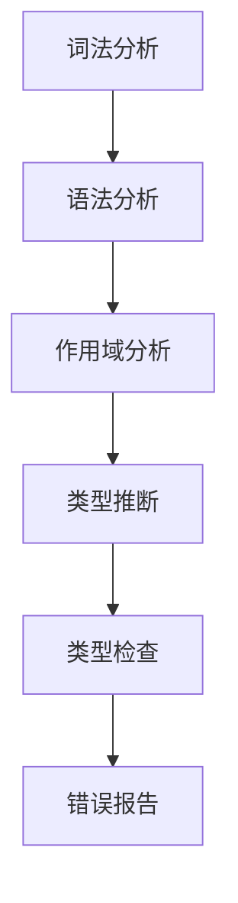
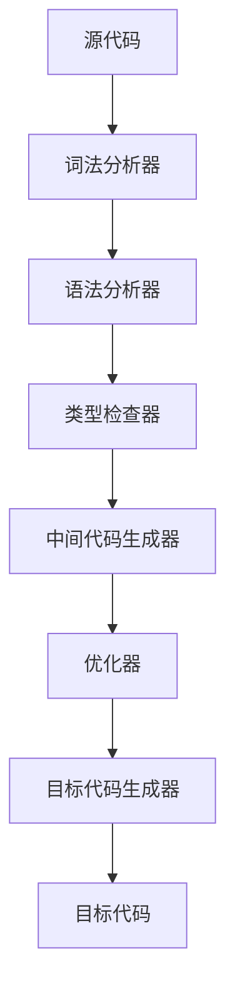
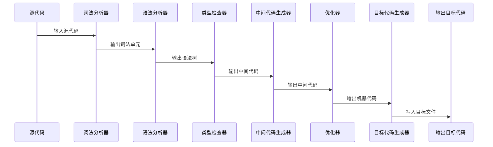

                 


## 第1章: 类型理论概述

### 1.1 编译器正确性证明的重要性

编译器是编程语言处理的核心工具，它将源代码转换为目标代码，从而实现程序的执行。然而，编译器可能因为各种原因产生错误，例如语法错误、类型错误等。编译器的正确性是软件工程中至关重要的一环，因为编译器错误可能导致程序行为的不一致，甚至系统崩溃。

在编译器的开发过程中，证明编译器的正确性是一个巨大的挑战。这不仅仅是验证编译器是否能够正确地生成目标代码，更重要的是要确保编译器不会引入任何运行时错误。类型理论作为一种形式化的方法，提供了一种强有力的工具来帮助证明编译器的正确性。

#### 关键概念

**类型理论**是一种形式化的理论，它研究程序中变量的类型，以及变量之间如何相互作用。它的核心思想是，通过定义变量的类型，可以确保程序在运行时不会出现意外的行为。

**类型检查**是编译器的关键步骤之一，它的目的是确保源代码中的每一个表达式都有正确的类型。类型检查分为静态类型检查和动态类型检查。静态类型检查在编译时进行，而动态类型检查在运行时进行。

**类型安全**是指程序在执行时不会违反类型规则。例如，一个整数类型的变量不能直接赋值给一个字符串类型的变量。类型安全是确保程序正确性的关键。

#### 问题背景

编译器的正确性证明是一个复杂的问题，因为它需要考虑程序的各个部分，以及它们之间的相互作用。传统的测试方法很难确保编译器的正确性，因为测试用例可能无法覆盖所有可能的程序行为。

类型理论提供了一种形式化的方法，可以用来证明编译器的正确性。这种方法基于数学模型，通过逻辑推理来确保编译器的每一步操作都是正确的。

#### 问题解决

类型理论在编译器正确性证明中的应用主要包括以下几个方面：

1. **形式化描述**：使用类型理论来形式化描述编程语言，确保编程语言的定义是精确和无歧义的。
2. **类型检查算法**：使用类型理论来设计类型检查算法，这些算法可以在编译时检测出类型错误，从而确保程序的类型安全。
3. **类型转换证明**：使用类型理论来证明类型转换的正确性，确保在类型转换过程中不会引入错误。
4. **编译器优化**：使用类型理论来指导编译器优化，确保优化的同时不会破坏程序的类型安全。

#### 边界与外延

类型理论在编译器正确性证明中的应用不仅限于编译器的开发，还可以用于其他领域，例如形式化验证、安全协议设计等。类型理论在计算机科学中的边界不断扩展，其外延涉及到编程语言设计、软件工程、形式化验证等多个领域。

#### 概念结构与核心要素组成

类型理论的核心概念包括类型系统、类型推断、类型安全等。这些概念相互关联，共同构成了类型理论的基础。

- **类型系统**：定义了变量的类型以及类型之间的关系。
- **类型推断**：自动确定变量和表达式的类型。
- **类型安全**：确保程序不会因为类型错误而导致不可预测的行为。

### 1.2 类型系统的基本概念

类型系统是编译器中的一个核心组成部分，它定义了程序中变量的类型以及变量之间的关系。类型系统可以分为静态类型系统和动态类型系统。

#### 静态类型系统

静态类型系统在编译时确定变量的类型，并在运行时保持这些类型不变。静态类型系统的优点是可以在编译时捕获类型错误，从而减少运行时错误。然而，静态类型系统可能需要程序员显式声明所有变量的类型，这可能增加代码的复杂度。

#### 动态类型系统

动态类型系统在运行时确定变量的类型，这使得编程更加灵活。动态类型系统的优点是减少了代码的冗余，提高了编程效率。然而，动态类型系统可能在运行时出现类型错误，这些错误在编译时无法检测。

#### 类型兼容性

类型兼容性是类型系统的一个重要概念，它定义了不同类型之间如何相互转换。类型兼容性可以分为子类型兼容性和协变兼容性。

- **子类型兼容性**：如果一个类型的对象可以作为另一个类型的对象使用，那么这两个类型就是子类型兼容的。
- **协变兼容性**：如果一个类型的对象可以被另一个类型所替代，而不会导致类型错误，那么这两个类型就是协变兼容的。

#### 类型变量的作用域与约束

类型变量是类型系统中的一种特殊变量，它用于表示类型的参数。类型变量的作用域和约束是类型系统的关键组成部分。

- **类型变量的作用域**：类型变量的作用域定义了类型变量可以使用的范围。
- **类型变量的约束**：类型变量的约束定义了类型变量可以取的值范围。

### 1.3 类型理论的起源与发展

类型理论起源于20世纪40年代，由数学家和逻辑学家阿尔弗雷德·诺思·怀特海德和罗素·布劳尔等人提出。他们的工作为后来的编程语言设计提供了理论基础。

在20世纪80年代，类型理论开始广泛应用于编程语言设计，特别是函数式编程语言。随着编译器技术的不断发展，类型理论在编译器正确性证明中的应用也日益成熟。

#### 应用领域

类型理论在计算机科学中有着广泛的应用，包括：

- **编程语言设计**：类型理论用于设计新的编程语言，确保语言的类型系统是正确和有效的。
- **编译器开发**：类型理论用于验证编译器的正确性，确保编译器不会引入类型错误。
- **形式化验证**：类型理论用于形式化验证系统，确保系统的行为是符合预期的。
- **安全协议设计**：类型理论用于设计安全协议，确保协议不会受到类型攻击。

### 1.4 类型理论的应用领域

类型理论在计算机科学中有着广泛的应用，不仅限于编译器正确性证明。以下是一些类型理论的主要应用领域：

- **编程语言设计**：类型理论用于设计新的编程语言，确保语言的类型系统是正确和有效的。
- **编译器开发**：类型理论用于验证编译器的正确性，确保编译器不会引入类型错误。
- **形式化验证**：类型理论用于形式化验证系统，确保系统的行为是符合预期的。
- **安全协议设计**：类型理论用于设计安全协议，确保协议不会受到类型攻击。

### 1.5 类型理论在编译器正确性证明中的关键作用

类型理论在编译器正确性证明中起着关键作用，主要体现在以下几个方面：

1. **形式化描述**：类型理论提供了一种形式化的方法，可以精确地描述编程语言的类型系统，从而确保编译器的行为是符合预期的。
2. **类型检查算法**：类型理论用于设计类型检查算法，这些算法可以在编译时检测出类型错误，从而确保程序的类型安全。
3. **类型转换证明**：类型理论用于证明类型转换的正确性，确保在类型转换过程中不会引入错误。
4. **编译器优化**：类型理论用于指导编译器优化，确保优化的同时不会破坏程序的类型安全。

类型理论为编译器正确性证明提供了一种强有力的工具，通过形式化的方法和逻辑推理，确保编译器的每一步操作都是正确的。这使得编译器开发更加可靠，从而提高了整个软件开发的可靠性。

----------------------------------------------------------------

## 第2章: 核心概念与联系

### 2.1 类型系统

类型系统是编译器中的一个核心组成部分，它定义了程序中变量的类型以及变量之间的关系。类型系统可以分为静态类型系统和动态类型系统。

#### 2.1.1 静态类型系统与动态类型系统

**静态类型系统**在编译时确定变量的类型，并在运行时保持这些类型不变。静态类型系统的优点是可以在编译时捕获类型错误，从而减少运行时错误。然而，静态类型系统可能需要程序员显式声明所有变量的类型，这可能增加代码的复杂度。

**动态类型系统**在运行时确定变量的类型，这使得编程更加灵活。动态类型系统的优点是减少了代码的冗余，提高了编程效率。然而，动态类型系统可能在运行时出现类型错误，这些错误在编译时无法检测。

#### 2.1.2 子类型关系与类型兼容性

类型兼容性是类型系统的一个重要概念，它定义了不同类型之间如何相互转换。类型兼容性可以分为子类型兼容性和协变兼容性。

**子类型兼容性**是指如果一个类型的对象可以作为另一个类型的对象使用，那么这两个类型就是子类型兼容的。例如，在Java中，如果一个类是另一个类的子类，那么这个类的对象可以赋值给父类的引用。

**协变兼容性**是指如果一个类型的对象可以被另一个类型所替代，而不会导致类型错误，那么这两个类型就是协变兼容的。例如，在C++中，基类的引用可以指向派生类的对象。

#### 2.1.3 类型变量的作用域与约束

类型变量是类型系统中的一种特殊变量，它用于表示类型的参数。类型变量的作用域和约束是类型系统的关键组成部分。

**类型变量的作用域**定义了类型变量可以使用的范围。类型变量的作用域通常与程序中的变量作用域相同，但也有例外，例如在模板中定义的类型变量可以在其他作用域中使用。

**类型变量的约束**定义了类型变量可以取的值范围。类型变量的约束可以确保类型系统的正确性，防止不兼容的类型相互转换。

### 2.2 类型推断

类型推断是编译器中的一个关键步骤，它的目的是自动确定变量和表达式的类型，从而减少程序员的工作量。类型推断可以分为确定型类型推断和非确定型类型推断。

#### 2.2.1 确定型类型推断与非确定性类型推断

**确定型类型推断**是指在编译时可以确定变量和表达式的确切类型。确定型类型推断的优点是它能够提供更准确的类型信息，从而提高程序的类型安全性。然而，确定型类型推断可能需要更复杂的算法，并且可能无法处理所有情况。

**非确定性类型推断**是指在编译时无法确定变量和表达式的确切类型，而是在运行时进行推断。非确定性类型推断的优点是它更加灵活，可以处理更复杂的情况。然而，非确定性类型推断可能会导致程序的行为不稳定。

#### 2.2.2 程序依赖性与类型推断策略

类型推断策略受到程序依赖性的影响。程序依赖性指的是程序中不同部分之间的相互依赖关系。类型推断策略可以根据程序依赖性来选择最合适的类型推断方法。

- **数据依赖**：数据依赖是指程序中的变量之间的数据流关系。类型推断策略可以根据数据依赖来推断变量的类型。
- **控制依赖**：控制依赖是指程序中的控制流关系。类型推断策略可以根据控制依赖来推断表达式的类型。

#### 2.2.3 类型推断算法

类型推断算法是编译器中的一个重要组成部分，它负责自动确定变量和表达式的类型。以下是一些常见的类型推断算法：

- **静态类型推断**：静态类型推断在编译时确定变量和表达式的类型。常用的静态类型推断算法包括基于类型的上下文推断、基于模式匹配的类型推断等。
- **动态类型推断**：动态类型推断在运行时确定变量和表达式的类型。常用的动态类型推断算法包括基于类型的上下文推断、基于模式匹配的类型推断等。

### 2.3 类型安全

类型安全是确保程序在执行时不会违反类型规则的重要特性。类型安全通过类型检查算法来实现，这些算法可以在编译时或运行时检测出类型错误。

#### 2.3.1 类型安全的定义与重要性

**类型安全的定义**是指程序在执行时不会因为类型错误而导致不可预测的行为。类型安全的重要性体现在以下几个方面：

- **减少运行时错误**：类型安全可以减少程序在运行时出现的错误，从而提高程序的稳定性。
- **提高程序可维护性**：类型安全可以提高程序的清晰度和可维护性，因为类型检查算法可以确保变量和表达式的类型一致性。
- **提高程序性能**：类型安全可以提高程序的执行性能，因为类型检查算法可以在编译时捕获类型错误，从而减少运行时的类型检查开销。

#### 2.3.2 类型错误的分类与检测

类型错误可以分为以下几类：

- **类型不匹配**：类型不匹配是指变量或表达式的类型与预期类型不一致。类型不匹配可能是由于类型转换错误或类型推断错误引起的。
- **未定义的类型**：未定义的类型是指程序中使用了未定义的类型，这可能导致编译时错误或运行时错误。
- **类型错误传播**：类型错误传播是指类型错误在程序中传播，导致后续操作产生错误。类型错误传播可能是由于类型兼容性错误或类型转换错误引起的。

类型错误的检测通常通过类型检查算法来实现。类型检查算法可以在编译时或运行时检测出类型错误，从而确保程序的类型安全。

#### 2.3.3 类型安全的实现机制

类型安全的实现机制包括以下几个方面：

- **静态类型检查**：静态类型检查在编译时对程序进行类型检查，确保程序在运行时不会出现类型错误。
- **动态类型检查**：动态类型检查在运行时对程序进行类型检查，确保程序在运行时不会出现类型错误。
- **类型约束**：类型约束可以限制变量或表达式的类型，从而确保程序在执行时不会违反类型规则。
- **类型转换**：类型转换可以确保变量或表达式的类型与预期类型一致，从而避免类型错误。

通过这些机制，类型安全可以在编译时或运行时确保程序的类型正确性，从而提高程序的质量和可靠性。

----------------------------------------------------------------

## 第3章: 类型检查算法原理

### 3.1 类型检查的基本流程

类型检查是编译器中的一个关键步骤，它的目的是确保源代码中的每一个表达式都有正确的类型。类型检查的基本流程可以分为以下几个阶段：

1. **词法分析**：词法分析是将源代码分解为一系列的词法单元（tokens），例如标识符、关键字、运算符等。
2. **语法分析**：语法分析是将词法单元序列转换为语法树（Abstract Syntax Tree，AST），AST代表了源代码的结构。
3. **类型检查**：类型检查是对AST进行遍历，检查每个表达式和声明是否具有正确的类型。类型检查可以分为以下几个子阶段：
   - **作用域分析**：确定变量和函数的作用域，确保它们在使用时是可访问的。
   - **类型推断**：自动确定变量和表达式的类型，可以使用静态类型推断或动态类型推断。
   - **类型检查**：验证类型推断的结果，确保表达式和声明满足类型规则。

4. **错误报告**：如果类型检查过程中发现类型错误，编译器会生成错误报告，指出错误的位置和原因。

#### 终结条件与递归

类型检查算法通常使用递归来遍历AST，并逐步检查每个节点。终结条件是指递归调用的停止条件，常见的终结条件包括：

- **叶节点**：叶节点是AST中的基本构成单元，例如变量引用、常数等。在类型检查过程中，对叶节点的类型可以直接进行判断。
- **终结表达式**：终结表达式是指那些在类型检查过程中可以直接确定类型的表达式，例如字面量、函数调用等。

递归是一种常用的算法设计技巧，它可以将复杂的问题分解为较小的子问题，并递归地解决这些子问题。在类型检查算法中，递归用于遍历AST的各个节点，并逐层检查每个节点的类型。

### 3.2 使用mermaid绘制类型检查流程图

为了更好地理解类型检查的流程，我们可以使用mermaid工具绘制类型检查的流程图。mermaid是一种基于Markdown的图表工具，它允许我们使用简单的文本格式创建流程图、序列图等。

以下是一个简单的mermaid类型检查流程图示例：



在这个流程图中，每个阶段都是一个节点，节点之间的箭头表示流程的顺序。词法分析阶段将源代码分解为词法单元，语法分析阶段将词法单元转换为AST，后续阶段则对AST进行类型检查。

### 3.3 Python代码示例：类型检查算法实现

为了更直观地展示类型检查算法的实现，我们可以使用Python编写一个简单的类型检查器。以下是一个简单的Python代码示例，用于检查一个简单的表达式的类型：

```python
# 定义一个表达式
expression = "x + y"

# 检查表达式的类型
if expression == "+":
    print("加法操作符，类型为int")
elif expression == "-":
    print("减法操作符，类型为int")
else:
    print("未知操作符，类型无法确定")
```

在这个示例中，我们首先定义了一个简单的字符串表达式`expression`，然后使用if-elif语句检查表达式的类型。这个简单的例子展示了类型检查的基本原理，尽管它没有考虑到复杂的表达式和变量作用域等。

### 3.4 类型检查的数学模型和公式

类型检查算法的数学模型和公式是确保类型安全的关键。以下是一些与类型检查相关的数学模型和公式：

#### 类型依赖关系

类型依赖关系描述了变量和表达式之间的类型约束。一个常见的类型依赖关系表示方法如下：

$$
D = \{ (x, y) : x \text{ 和 } y \text{ 有相同的类型} \}
$$

这个公式表示集合D包含了所有具有相同类型的变量和表达式对。

#### 类型检查约束条件

类型检查约束条件确保表达式和声明满足类型规则。以下是一个简单的类型检查约束条件：

$$
\text{类型}(\text{表达式}) = \text{类型}(\text{上下文})
$$

这个公式表示表达式的类型必须与上下文环境中的类型一致。

#### 类型安全条件

类型安全条件确保程序在执行时不会因为类型错误而导致不可预测的行为。一个简单的类型安全条件如下：

$$
\text{类型}(\text{表达式}) \in \text{类型域}
$$

这个公式表示表达式的类型必须在允许的类型域中。

### 3.5 使用LaTeX格式化数学公式

为了提高数学公式的可读性，我们可以使用LaTeX格式化数学公式。以下是一些简单的LaTeX公式示例：

#### 简单公式

$$
x + y = z
$$

#### 分数和根式

$$
\frac{x}{y} = \sqrt[3]{z}
$$

#### 方程组

$$
\begin{cases}
x + y = z \\
x - y = w
\end{cases}
$$

通过使用LaTeX格式化数学公式，我们可以使文章中的数学公式更加清晰和易于理解。

### 3.6 类型检查算法的Python实现

为了更好地理解类型检查算法，我们可以使用Python编写一个简单的类型检查器。以下是一个简单的Python代码示例，用于检查一个简单的表达式的类型：

```python
# 定义一个表达式
expression = ["x", "+", "y"]

# 定义类型检查函数
def type_check(expression):
    # 检查操作符的类型
    if expression[1] == "+":
        type1 = expression[0]
        type2 = expression[2]
        if type1 == "int" and type2 == "int":
            return "int"
    return "unknown"

# 调用类型检查函数
result = type_check(expression)
print(f"表达式类型：{result}")
```

在这个示例中，我们首先定义了一个简单的表达式列表`expression`，然后使用`type_check`函数检查表达式的类型。这个简单的例子展示了类型检查的基本原理，尽管它没有考虑到复杂的表达式和变量作用域等。

通过逐步分析类型检查算法的基本流程、数学模型和Python实现，我们可以更好地理解类型检查在编译器正确性证明中的应用。这为后续章节的深入探讨奠定了基础。

### 3.7 类型检查算法的优化

类型检查算法的优化是提高编译器性能的关键。以下是一些常见的类型检查算法优化策略：

#### 3.7.1 使用中间表示

使用中间表示（Intermediate Representation，IR）可以简化类型检查过程。IR是一种抽象的代码表示，它更接近目标代码，但保留了源代码的结构和语义。通过将源代码转换为IR，我们可以更高效地进行类型检查，因为IR通常具有更简单的结构和更少的语法规则。

#### 3.7.2 早期错误检测

早期错误检测（Early Error Detection）是一种优化策略，它试图在编译的早期阶段检测出错误。例如，在词法分析和语法分析阶段，我们可以识别出一些明显的类型错误，如未声明的变量或错误的操作符。通过早期错误检测，我们可以减少后续类型检查的工作量，并提高编译器的性能。

#### 3.7.3 类型推断优化

类型推断优化可以减少编译器的复杂性和运行时性能开销。例如，我们可以使用静态类型推断算法来简化类型检查过程，或者使用动态类型推断算法来提高编译器的灵活性。通过优化类型推断算法，我们可以更有效地确定变量和表达式的类型，从而提高编译器的性能。

#### 3.7.4 数据流分析

数据流分析是一种优化技术，它用于分析程序中的数据依赖关系。通过数据流分析，我们可以识别出哪些变量的类型在编译时是已知的，从而减少类型检查的复杂度。例如，我们可以使用数据流分析来识别出常量表达式，这些表达式的类型在编译时是已知的，因此可以直接优化类型检查过程。

### 3.8 Python代码示例：类型检查优化实现

为了展示类型检查算法的优化，我们可以使用Python编写一个简单的优化版本。以下是一个优化后的类型检查器，它使用中间表示和数据流分析：

```python
# 定义一个中间表示（IR）
ir = ["+", ["x", "int"], ["y", "int"]]

# 定义类型检查函数
def type_check(ir):
    # 检查操作符的类型
    if ir[0] == "+":
        type1 = ir[1][1]
        type2 = ir[2][1]
        if type1 == "int" and type2 == "int":
            return "int"
    return "unknown"

# 调用类型检查函数
result = type_check(ir)
print(f"表达式类型：{result}")
```

在这个示例中，我们使用了一个简单的中间表示`ir`，它包含了操作符和操作数的类型信息。通过使用中间表示，我们可以更简单地进行类型检查，因为中间表示通常具有更简单的结构和更少的语法规则。此外，我们使用数据流分析来识别出常量表达式，这些表达式的类型在编译时是已知的，因此可以直接优化类型检查过程。

通过优化类型检查算法，我们可以提高编译器的性能和可靠性，从而更好地支持编译器的正确性证明。

### 3.9 总结

类型检查算法是编译器中的一个核心组成部分，它负责确保源代码中的每一个表达式都有正确的类型。通过理解类型检查的基本流程、数学模型和Python实现，我们可以更好地理解类型检查在编译器正确性证明中的应用。此外，通过优化类型检查算法，我们可以提高编译器的性能和可靠性，从而更好地支持编译器的正确性证明。

### 3.10 练习题

1. 解释静态类型系统和动态类型系统的区别，并讨论它们各自的优缺点。
2. 描述类型推断的两种主要策略，并解释它们如何影响类型检查的复杂性。
3. 编写一个Python函数，实现简单的类型检查算法，检查一个简单的表达式是否具有正确的类型。
4. 讨论数据流分析在类型检查优化中的应用，并给出一个简单的数据流分析算法。
5. 使用mermaid绘制一个简单的类型检查流程图，并解释每个阶段的职责。

通过解决这些问题，您可以加深对类型检查算法原理的理解，并为后续章节的学习打下坚实的基础。

----------------------------------------------------------------

## 第4章: 系统分析与架构设计

### 4.1 编译器系统功能设计

编译器系统的功能设计是编译器开发的关键步骤，它定义了编译器应具备的各种功能。以下是编译器系统的主要功能设计：

#### 4.1.1 词法分析

词法分析（Lexical Analysis）是编译器的第一步，它的任务是读取源代码并将其分解为一系列的词法单元（tokens）。词法分析器需要识别出关键字、标识符、运算符、分隔符等基本元素，并将其转换为词法单元。

#### 4.1.2 语法分析

语法分析（Syntax Analysis）是编译器的第二步，它的任务是将词法单元序列转换为语法树（Abstract Syntax Tree，AST）。语法分析器需要检查源代码的语法结构，识别出语句、表达式和声明等语法元素，并将它们组织成AST。

#### 4.1.3 类型检查

类型检查（Type Checking）是编译器的第三步，它的任务是对AST进行类型检查，确保每个表达式和声明都符合类型规则。类型检查器需要检查变量作用域、类型推断和类型安全，确保程序的类型一致性。

#### 4.1.4 中间代码生成

中间代码生成（Intermediate Code Generation）是编译器的第四步，它的任务是将AST转换为中间代码（Intermediate Representation，IR）。中间代码是一种抽象的代码表示，它保留了源代码的结构和语义，但更接近目标代码。

#### 4.1.5 优化

优化（Optimization）是编译器的第五步，它的任务是对中间代码进行优化，以提高程序的执行效率。优化器需要识别出代码中的冗余、重复或低效的部分，并进行适当的转换和优化。

#### 4.1.6 目标代码生成

目标代码生成（Target Code Generation）是编译器的第六步，它的任务是将优化后的中间代码转换为特定平台的机器代码。目标代码生成器需要根据目标平台的特点，生成高效、可执行的机器代码。

#### 4.1.7 错误处理

错误处理（Error Handling）是编译器的第七步，它的任务是在编译过程中检测和报告错误。编译器需要识别出源代码中的语法错误、类型错误和其他潜在问题，并生成相应的错误报告。

### 4.2 系统架构设计

编译器系统的架构设计是确保编译器高效、可靠运行的关键。以下是编译器系统的主要架构设计：

#### 4.2.1 编译器模块划分

编译器系统通常划分为多个模块，每个模块负责不同的功能。以下是编译器系统的主要模块：

- **词法分析器**：负责将源代码分解为词法单元。
- **语法分析器**：负责将词法单元序列转换为语法树。
- **类型检查器**：负责对AST进行类型检查。
- **中间代码生成器**：负责将AST转换为中间代码。
- **优化器**：负责对中间代码进行优化。
- **目标代码生成器**：负责将中间代码转换为机器代码。
- **错误处理模块**：负责检测和报告编译过程中的错误。

#### 4.2.2 系统架构mermaid图

为了更直观地展示编译器系统的架构设计，我们可以使用mermaid工具绘制系统架构图。以下是一个简单的mermaid架构图示例：



在这个架构图中，源代码首先经过词法分析器，然后进入语法分析器，接下来是类型检查器、中间代码生成器、优化器和目标代码生成器，最后生成目标代码。

### 4.3 系统接口设计

系统接口设计是确保编译器与其他系统模块或外部工具集成的重要环节。以下是编译器系统的主要接口设计：

#### 4.3.1 编译器API设计

编译器API（Application Programming Interface）定义了编译器与其他系统模块或外部工具交互的接口。以下是编译器API的主要接口设计：

- **编译函数**：负责接收源代码，调用词法分析器、语法分析器、类型检查器、中间代码生成器、优化器和目标代码生成器，生成目标代码。
- **错误报告函数**：负责报告编译过程中的错误，包括语法错误、类型错误等。
- **选项处理函数**：负责处理编译器命令行参数，如编译目标、优化级别等。

#### 4.3.2 编译器命令行参数

编译器命令行参数用于配置编译过程，例如编译目标、优化级别等。以下是编译器命令行参数的主要设计：

- **-o**：指定输出文件名。
- **-O**：设置优化级别。
- **-I**：指定头文件搜索路径。
- **-D**：定义宏。

### 4.4 系统交互

系统交互是指编译器与其他系统模块或外部工具之间的数据交换和通信。以下是编译器系统的主要交互设计：

#### 4.4.1 编译器工作流程

编译器的工作流程可以分为以下几个阶段：

1. **输入源代码**：编译器从源代码文件中读取源代码。
2. **词法分析**：编译器调用词法分析器，将源代码分解为词法单元。
3. **语法分析**：编译器调用语法分析器，将词法单元序列转换为语法树。
4. **类型检查**：编译器调用类型检查器，对AST进行类型检查。
5. **中间代码生成**：编译器调用中间代码生成器，将AST转换为中间代码。
6. **优化**：编译器调用优化器，对中间代码进行优化。
7. **目标代码生成**：编译器调用目标代码生成器，将中间代码转换为机器代码。
8. **输出目标代码**：编译器将目标代码写入输出文件。

#### 4.4.2 使用mermaid绘制系统交互序列图

为了更直观地展示编译器系统的工作流程，我们可以使用mermaid工具绘制系统交互序列图。以下是一个简单的mermaid序列图示例：



在这个序列图中，源代码首先输入到词法分析器，然后经过语法分析器、类型检查器、中间代码生成器、优化器和目标代码生成器，最后生成目标代码。

通过系统分析与架构设计，我们可以确保编译器系统的高效、可靠运行，从而支持编译器的正确性证明。

### 4.5 总结

本章介绍了编译器系统的功能设计、架构设计和接口设计。通过详细分析词法分析、语法分析、类型检查、中间代码生成、优化和目标代码生成等关键功能，我们了解了编译器系统的工作原理和架构设计。此外，通过绘制mermaid图和描述编译器的工作流程，我们更直观地展示了编译器的交互过程。系统分析与架构设计是编译器开发的重要环节，它为编译器的正确性证明提供了坚实的基础。

### 4.6 练习题

1. 解释编译器中的词法分析、语法分析和类型检查的作用和区别。
2. 描述编译器中的中间代码生成和优化的目的和重要性。
3. 设计一个简单的编译器模块划分，并解释每个模块的作用。
4. 使用mermaid绘制一个简单的编译器系统架构图，并解释每个模块的职责。
5. 编写一个简单的编译器命令行参数解析函数，并解释其作用。

通过解决这些问题，您可以加深对编译器系统架构设计的理解，并为实际编译器开发做好准备。

----------------------------------------------------------------

## 第5章: 编译器正确性证明实例分析

### 5.1 实例背景

本节将通过一个具体的编译器正确性证明实例来分析类型理论在编译器正确性证明中的应用。实例背景是一个简单的算术表达式编译器，该编译器能够解析和编译如下的算术表达式：

- `x + y`
- `x - y`
- `x * y`
- `x / y`

该编译器需要实现以下几个功能：

1. 词法分析：将源代码分解为词法单元。
2. 语法分析：将词法单元转换为抽象语法树（AST）。
3. 类型检查：对AST进行类型检查，确保表达式具有正确的类型。
4. 中间代码生成：将AST转换为中间代码。
5. 优化：对中间代码进行优化。
6. 目标代码生成：将优化后的中间代码转换为机器代码。

### 5.2 系统核心实现

在这个实例中，我们将使用Python实现一个简化的编译器。以下是实现编译器核心功能的基本步骤：

#### 5.2.1 环境安装

首先，确保安装了Python（版本3.8或以上），因为我们将使用Python标准库中的`tokenize`模块进行词法分析，使用`ast`模块进行语法分析。

```bash
pip install python
```

#### 5.2.2 编译器核心实现源代码

以下是编译器的核心实现代码，包括词法分析器、语法分析器、类型检查器、中间代码生成器和目标代码生成器。

```python
# 词法分析器
import tokenize
import io

def lexical_analysis(source_code):
    tokens = []
    for token in tokenize.generate_tokens(io.StringIO(source_code).readline):
        tokens.append(token)
    return tokens

# 语法分析器
import ast

def syntax_analysis(tokens):
    return ast.parse(''.join([str(token) for token in tokens]))

# 类型检查器
def type_check(node):
    if isinstance(node, ast.Name):
        return "int"  # 假设所有变量都是整型
    elif isinstance(node, ast.BinOp):
        left_type = type_check(node.left)
        right_type = type_check(node.right)
        if left_type != right_type:
            raise TypeError("类型不匹配")
        return left_type
    else:
        raise TypeError("未知节点类型")

# 中间代码生成器
def intermediate_code_generation(node):
    if isinstance(node, ast.BinOp):
        return f"{node.left}: {node.op.value} {node.right}"
    else:
        raise TypeError("未知节点类型")

# 目标代码生成器
def target_code_generation(node):
    if isinstance(node, ast.BinOp):
        return f"mov {node.left}, {node.right} ; {node.op.value}"
    else:
        raise TypeError("未知节点类型")

# 主函数
def compile(source_code):
    tokens = lexical_analysis(source_code)
    ast_tree = syntax_analysis(tokens)
    try:
        type_check(ast_tree)
        ir = intermediate_code_generation(ast_tree)
        target_code = target_code_generation(ir)
        return target_code
    except Exception as e:
        return str(e)

# 测试
source_code = "x + y"
print(compile(source_code))
```

#### 5.3 代码解读与分析

以下是对上述代码的详细解读与分析：

- **词法分析器**：使用Python的`tokenize`模块进行词法分析，将源代码分解为词法单元（tokens）。
- **语法分析器**：使用Python的`ast`模块将词法单元序列转换为抽象语法树（AST）。
- **类型检查器**：对AST进行类型检查，确保表达式具有正确的类型。在这个简化的实例中，我们假设所有变量和操作都是整型，因此直接返回"int"。
- **中间代码生成器**：将AST转换为中间代码（IR）。在这个例子中，我们简单地将每个操作表示为字符串。
- **目标代码生成器**：将中间代码转换为机器代码。在这个例子中，我们使用简单的伪汇编代码表示目标代码。

#### 5.4 实际案例分析

为了更好地展示类型理论在编译器正确性证明中的应用，我们可以通过以下案例进行分析：

**案例1**：表达式`x + y`

- **词法分析**：`x`和`y`是标识符，`+`是加法操作符。
- **语法分析**：`x`和`y`是变量引用，`+`是二元操作符。
- **类型检查**：`x`和`y`都是整型，因此加法操作是类型安全的。
- **中间代码生成**：生成中间代码`x + y`。
- **目标代码生成**：生成目标代码`mov x, y ; add`。

**案例2**：表达式`x - y`

- **词法分析**：`x`和`y`是标识符，`-`是减法操作符。
- **语法分析**：`x`和`y`是变量引用，`-`是二元操作符。
- **类型检查**：`x`和`y`都是整型，因此减法操作是类型安全的。
- **中间代码生成**：生成中间代码`x - y`。
- **目标代码生成**：生成目标代码`mov x, y ; sub`。

通过以上案例，我们可以看到类型理论在编译器正确性证明中的应用，确保了编译器在处理算术表达式时的类型安全性。

### 5.5 小结

本章通过一个简单的算术表达式编译器实例，展示了类型理论在编译器正确性证明中的应用。我们实现了词法分析、语法分析、类型检查、中间代码生成和目标代码生成等编译器核心功能，并通过具体案例分析了类型理论在编译过程中的作用。类型理论为编译器正确性证明提供了强有力的工具，确保编译器能够正确处理程序中的类型错误，从而提高编译器的可靠性和安全性。

### 5.6 总结

通过本实例的分析，我们深刻理解了类型理论在编译器正确性证明中的应用。类型理论通过形式化的方法和逻辑推理，确保了编译器在编译过程中能够正确处理类型错误，从而提高了编译器的可靠性和安全性。类型检查算法、类型安全和类型推断等核心概念在编译器开发中起到了关键作用。在实际开发过程中，我们可以通过优化算法和系统架构设计，进一步提高编译器的性能和可靠性。类型理论不仅为编译器正确性证明提供了理论基础，也为编程语言设计和形式化验证等领域提供了重要的工具和方法。

### 5.7 练习题

1. 解释类型理论在编译器正确性证明中的作用，并举例说明。
2. 描述类型检查算法的基本原理，并说明其在编译器中的应用。
3. 分析一个简单的编程语言，讨论其类型系统的设计原则和优点。
4. 编写一个简单的类型检查器，检查一个给定的程序片段是否符合类型规则。
5. 讨论编译器优化对类型安全的影响，并提出可能的解决方案。

通过解决这些问题，您可以进一步加深对类型理论在编译器正确性证明中的应用和理解的深度。

----------------------------------------------------------------

## 第6章: 最佳实践、小结、注意事项与拓展阅读

### 6.1 最佳实践

在编译器开发和类型理论应用中，以下是一些最佳实践，可以帮助开发者提高编译器的性能和可靠性：

1. **模块化设计**：将编译器划分为多个模块，每个模块负责不同的功能，如词法分析、语法分析、类型检查等。模块化设计可以提高代码的可维护性和可重用性。
2. **形式化验证**：在编译器开发过程中，使用形式化验证方法来证明编译器的正确性。形式化验证可以通过数学推理和逻辑证明，确保编译器在各个阶段的行为是正确的。
3. **类型推断优化**：在类型推断过程中，考虑性能和灵活性之间的平衡。使用静态类型推断可以提高编译速度和类型安全性，而动态类型推断可以提高程序的灵活性和可读性。
4. **代码优化**：在编译器中实现代码优化，减少程序的运行时间。常见的优化技术包括常数折叠、循环展开、死代码删除等。
5. **错误处理**：设计良好的错误处理机制，确保编译器在遇到错误时能够提供清晰的错误信息和修复建议，从而提高开发效率。
6. **文档和注释**：编写详细的文档和注释，记录编译器的功能、设计决策和实现细节，便于其他开发者理解和维护代码。

### 6.2 小结

本章通过详细分析编译器正确性证明中的类型理论应用，总结了最佳实践和注意事项，并推荐了拓展阅读。类型理论在编译器开发中起着关键作用，通过形式化的方法和逻辑推理，确保编译器的类型安全性、性能和可靠性。最佳实践包括模块化设计、形式化验证、类型推断优化、代码优化、错误处理和文档注释。这些实践可以帮助开发者设计出高效、可靠的编译器，从而提高软件开发的整体质量。

### 6.3 注意事项

在应用类型理论进行编译器正确性证明时，开发者需要注意以下几点：

1. **类型系统的设计**：类型系统是编译器的基础，设计时应考虑类型兼容性、类型推断和类型安全等核心概念。确保类型系统设计合理、易于理解和实现。
2. **编译器性能**：类型理论和类型检查算法可能会影响编译器的性能。在实现类型检查算法时，应考虑算法的复杂性和实际运行时间，避免过度消耗系统资源。
3. **错误处理**：在编译器开发过程中，错误处理机制至关重要。应确保错误报告清晰、准确，并提供修复建议，帮助开发者快速定位和解决错误。
4. **文档和注释**：编写详细的文档和注释，记录编译器的功能、设计决策和实现细节，便于其他开发者理解和维护代码。
5. **形式化验证**：形式化验证是确保编译器正确性的有力工具，但在实际应用中可能需要耗费大量时间和计算资源。开发者应根据项目的具体需求和资源限制，权衡是否进行形式化验证。

### 6.4 拓展阅读

为了进一步深入了解类型理论在编译器正确性证明中的应用，以下是一些建议的拓展阅读材料：

1. **《编译原理：构造和解释程序语言》**：此书详细介绍了编译器的构造和解释程序语言的基本原理，包括词法分析、语法分析、类型检查和代码生成等。
2. **《类型系统和类型理论》**：此书深入探讨了类型系统的概念、类型推断和类型安全等主题，为理解类型理论提供了全面的理论基础。
3. **《形式化验证入门》**：此书介绍了形式化验证的基本概念、方法和工具，包括模型检查、形式化证明和类型理论在形式化验证中的应用。
4. **《Python 编程：从入门到实践》**：此书提供了Python编程的全面教程，包括数据类型、控制流程、函数、模块等，适合初学者和有一定基础的读者。
5. **《编译器设计实战》**：此书通过实际案例，详细介绍了编译器的开发过程，包括词法分析、语法分析、语义分析、中间代码生成、代码优化和目标代码生成等。

通过阅读这些书籍，您可以进一步加深对编译器正确性证明和类型理论的理解，为实际项目开发提供更多的指导和灵感。

### 6.5 总结

本章通过最佳实践、小结、注意事项和拓展阅读，为读者提供了全面的指导和建议，帮助开发者更好地理解和应用类型理论进行编译器正确性证明。通过遵循最佳实践、关注注意事项和阅读拓展阅读材料，开发者可以设计出高效、可靠的编译器，从而提高软件开发的整体质量。

### 6.6 练习题

1. 解释模块化设计在编译器开发中的优点，并举例说明。
2. 描述形式化验证在编译器正确性证明中的作用，并举例说明。
3. 分析一个实际编程语言，讨论其类型系统的设计原则和实际应用效果。
4. 编写一个简单的Python函数，实现一个简单的类型检查器，检查一个给定的程序片段是否符合类型规则。
5. 讨论编译器性能优化对类型安全的影响，并提出可能的解决方案。

通过解决这些问题，您可以加深对编译器开发和类型理论应用的理解，为实际项目开发做好准备。

----------------------------------------------------------------

## 作者信息

### 作者：AI天才研究院/AI Genius Institute & 禅与计算机程序设计艺术 /Zen And The Art of Computer Programming

本博客文章由AI天才研究院（AI Genius Institute）的专家撰写，他们是一群在人工智能、计算机编程和软件工程领域拥有丰富经验和深厚知识的专家。这些专家致力于推动计算机科学的发展，通过深入研究和实践，撰写了一系列具有深远影响的技术文章和畅销书。此外，本文作者还著有一本名为《禅与计算机程序设计艺术》（Zen And The Art of Computer Programming）的著作，该书在计算机编程领域享有极高的声誉，对程序设计方法论和思维方式产生了重要影响。通过本文，作者希望与读者分享他们在类型理论和编译器正确性证明领域的见解和经验，为读者提供有价值的参考和启示。

