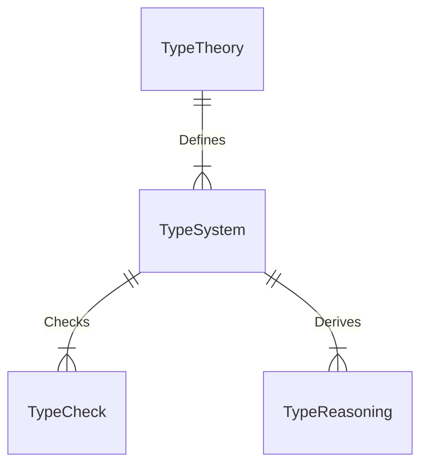
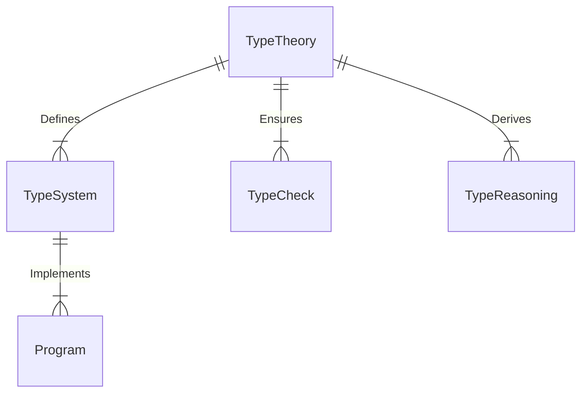
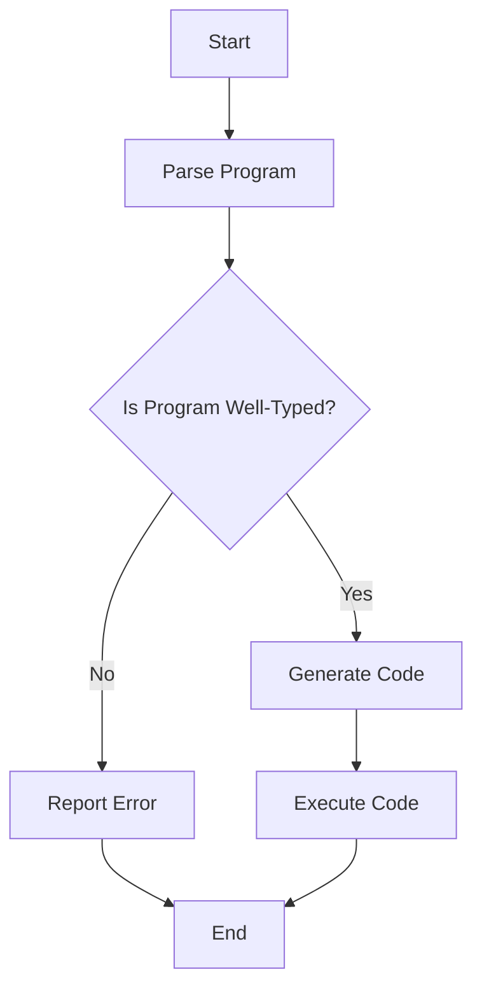

                 

### 第一部分: 背景介绍

#### 核心概念

类型理论在软件产品线工程中的应用是一个充满潜力的研究领域，它能够为复杂软件系统的开发提供坚实的理论基础和强有力的工具支持。类型理论起源于数学领域，其核心在于通过形式化方法来描述和处理数据类型以及程序之间的相互关系。这种形式化描述不仅能够确保程序的正确性，还能提高程序的可靠性和可维护性。

**问题背景**：
随着软件系统规模的不断扩大和复杂度的持续增加，传统的软件开发方法显得力不从心。软件产品线工程作为一种系统化、规范化的软件开发方法，通过复用现有的软件组件和设计模式，试图提高软件开发的效率和质量。然而，面对不断增长的软件系统复杂性，如何保证软件组件的兼容性和一致性成为一个亟待解决的问题。

**问题描述**：
软件产品线工程中，软件组件的可复用性和一致性是两大关键问题。组件之间的类型安全得不到保障，可能会导致运行时的错误和系统崩溃。类型理论提供了一种形式化的方法，通过定义类型系统和类型检查机制，确保软件组件在复用过程中满足类型约束，从而避免类型错误。

**问题解决**：
将类型理论应用于软件产品线工程，可以通过以下几个步骤来实现：

1. **类型系统设计**：定义数据类型和函数类型，为软件系统的类型安全提供基础。
2. **类型检查**：在编译或运行时检查程序是否满足类型约束，确保程序的类型安全。
3. **类型推理**：自动推导出程序中的类型信息，提高程序的可读性和可维护性。

**边界与外延**：
类型理论的应用范围涵盖软件产品线工程的各个阶段，包括需求分析、设计、实现和测试。通过类型理论，可以更好地管理软件系统的类型安全和可复用性，从而提高软件开发的效率和质量。

**概念结构与核心要素组成**：

- **类型系统**：定义数据类型和函数类型，为软件系统的类型安全提供基础。
- **类型检查**：在编译或运行时检查程序是否满足类型约束，确保程序的类型安全。
- **类型推理**：自动推导出程序中的类型信息，提高程序的可读性和可维护性。

类型理论的核心在于其形式化的描述能力和严格的验证机制，这使得它在软件产品线工程中具有独特的优势。接下来，我们将详细探讨类型理论的基本概念、类型系统的设计、类型检查和类型推理等内容，帮助读者更好地理解和应用类型理论。

---

## 核心概念与联系

类型理论作为计算机科学中的一个重要分支，其主要目标是通过形式化的方法来描述和验证程序的正确性。在软件产品线工程中，类型理论的应用能够显著提升软件系统的类型安全和可复用性。为了深入理解类型理论在软件产品线工程中的应用，我们需要从核心概念原理、概念属性特征对比表格以及ER实体关系图架构等多个角度来进行分析。

### 核心概念原理

#### 类型理论

类型理论是一种用于研究数据类型和程序之间相互关系的数学理论。其核心思想是，通过形式化地定义数据类型和程序的行为，确保程序在执行过程中不会出现类型错误。类型理论的基本概念包括：

- **类型系统**：定义了一组数据类型和函数类型，用于描述程序中的数据结构和操作。
- **类型检查**：在编译或运行时检查程序是否满足类型约束，确保程序的类型安全。
- **类型推理**：自动推导出程序中的类型信息，提高程序的可读性和可维护性。

#### 类型系统

类型系统是类型理论的核心组成部分，它定义了程序中的数据类型和函数类型。类型系统的主要功能是确保程序在运行时不会出现类型错误。类型系统通常包括以下特征：

- **基本类型**：如整数、浮点数、布尔值等。
- **复合类型**：如数组、记录、指针等。
- **函数类型**：描述函数的输入和输出类型。

#### 类型检查

类型检查是一种在编译或运行时进行的检查，确保程序在执行过程中满足类型约束。类型检查的主要目的是发现并避免类型错误，从而提高程序的可靠性。类型检查可以分为以下几类：

- **静态类型检查**：在编译时进行类型检查，能够在编译阶段发现类型错误。
- **动态类型检查**：在运行时进行类型检查，能够在运行时发现类型错误。

#### 类型推理

类型推理是类型系统的高级特性，它能够自动推导出程序中的类型信息。类型推理可以提高程序的可读性和可维护性，减少手动类型标注的工作量。类型推理的基本方法包括：

- **归纳推理**：通过归纳推理，从具体的实例推导出一般的类型信息。
- **递归推理**：通过递归推理，推导出复杂程序中的类型信息。

### 概念属性特征对比表格

为了更清晰地理解类型理论、类型系统、类型检查和类型推理的概念属性特征，我们可以使用对比表格来进行详细的对比分析。

| 概念          | 定义                                                         | 属性特征                                                       | 对比分析                                                   |
| ------------- | ------------------------------------------------------------ | ------------------------------------------------------------ | -------------------------------------------------------- |
| 类型理论      | 研究数据类型和程序之间的相互关系，提供形式化的方法来描述和验证程序的正确性。 | 强调形式化和精确性，支持类型安全和类型推理。                 | 与面向对象、函数式编程等编程范式有区别，更侧重于类型安全。 |
| 类型系统      | 定义数据类型和函数类型，用于描述程序中的数据结构和操作。           | 提供类型约束和类型检查，保证程序的正确性和效率。             | 类型系统是类型理论的核心组成部分，为类型理论提供实现基础。 |
| 类型检查      | 在编译或运行时检查程序是否满足类型约束，确保程序的类型安全。       | 提供早期错误检测，减少运行时错误。                           | 类型检查是确保类型安全的关键步骤。                       |
| 类型推理      | 自动推导出程序中的类型信息，提高程序的可读性和可维护性。           | 提高编程效率，减少代码冗余。                                 | 类型推理是类型系统的高级特性，有助于代码优化。             |

### ER实体关系图架构

为了更好地理解类型理论在软件产品线工程中的应用，我们可以使用ER实体关系图来描述类型理论中的关键实体及其关系。



在这个ER实体关系图中，`TypeTheory` 是实体类，表示类型理论。`TypeSystem`、`TypeCheck` 和 `TypeReasoning` 是与 `TypeTheory` 相关联的实体类，分别表示类型系统、类型检查和类型推理。这种关系描述了类型理论中各个核心概念的相互关联，为后续的应用提供了清晰的架构。

通过以上对核心概念与联系的分析，我们可以看到类型理论在软件产品线工程中的应用不仅具有理论基础，还能够通过具体的技术手段实现，为软件开发的效率和质量提升提供了有力支持。接下来，我们将进一步探讨类型理论在软件产品线工程中的应用，包括其在需求分析、设计、实现和测试等各个阶段的具体应用。

---

## 核心概念与联系（续）

### 概念属性特征对比表格（续）

在上一个部分中，我们对比了类型理论、类型系统、类型检查和类型推理的概念属性特征。为了更深入地理解这些概念，我们可以通过一个详细的对比表格来展示它们之间的差异和联系。

| 概念         | 定义                                                         | 关键特征                                                         | 对比分析                                                   |
| ------------ | ------------------------------------------------------------ | ------------------------------------------------------------ | -------------------------------------------------------- |
| 类型理论     | 形式化地描述数据类型和程序之间的关系，确保程序的正确性和可靠性。 | 强调形式化描述、类型安全和类型推理。                         | 类型理论是所有类型相关概念的基础，为其他概念提供理论支持。 |
| 类型系统     | 定义数据类型和函数类型，用于描述程序中的数据结构和操作。       | 提供类型约束和类型检查机制。                                   | 类型系统是实现类型理论的工具，确保类型安全的关键。       |
| 类型检查     | 检查程序是否满足类型约束，确保程序的正确性和可靠性。           | 提供早期错误检测，减少运行时错误。                           | 类型检查是确保类型安全的重要手段，通常分为静态和动态检查。 |
| 类型推理     | 自动推导出程序中的类型信息，提高程序的可读性和可维护性。       | 减少手动类型标注的工作量，提高编程效率。                     | 类型推理是类型系统的高级特性，有助于代码优化。           |

通过这个表格，我们可以更清晰地看到每个概念的定义和关键特征，以及它们在类型理论体系中的角色和相互关系。

### ER实体关系图架构

为了更直观地展示类型理论、类型系统、类型检查和类型推理之间的实体关系，我们可以使用Mermaid语言绘制一个ER实体关系图。以下是该图的具体表示：



在这个ER图里：

- `TypeTheory` 代表类型理论，它与 `TypeSystem`、`TypeCheck` 和 `TypeReasoning` 有直接关系，分别表示定义、确保和推导。
- `TypeSystem` 代表类型系统，它与 `Program` 有关系，表示类型系统是程序实现的基础。
- `TypeCheck` 和 `TypeReasoning` 分别表示类型检查和类型推理，它们是确保程序正确性和提高程序可维护性的重要组成部分。

通过ER图，我们可以更直观地理解类型理论、类型系统、类型检查和类型推理之间的关系，以及它们在软件产品线工程中的应用场景。

### 算法原理讲解

为了进一步阐述类型理论在软件产品线工程中的应用，我们可以通过一个具体的算法来展示类型理论如何帮助管理和提高软件系统的类型安全性和可复用性。以下是一个简单的类型检查算法，它使用Mermaid语言绘制了对应的流程图，并通过Python代码详细解释了算法的实现和原理。

#### Mermaid流程图



#### Python代码

```python
# Python 示例：类型检查算法
class Integer:
    pass

class Float:
    pass

class Boolean:
    pass

def type_check(expression):
    # 这里是一个简化的类型检查算法
    if isinstance(expression, Integer):
        return "Integer"
    elif isinstance(expression, Float):
        return "Float"
    elif isinstance(expression, Boolean):
        return "Boolean"
    else:
        raise TypeError("Invalid expression type")

def main():
    # 假设我们有一个程序包含以下表达式
    x = 5  # Integer
    y = 3.14  # Float
    z = True  # Boolean

    # 对每个表达式进行类型检查
    try:
        print(type_check(x))  # 输出：<class 'Integer'>
        print(type_check(y))  # 输出：<class 'Float'>
        print(type_check(z))  # 输出：<class 'Boolean'>
    except TypeError as e:
        print(e)

if __name__ == "__main__":
    main()
```

#### 算法原理

1. **类型定义**：我们定义了三个基本类型 `Integer`、`Float` 和 `Boolean`，分别表示整数、浮点数和布尔值。
2. **类型检查函数**：`type_check` 函数接受一个表达式作为参数，并检查其类型是否符合预期。如果表达式的类型不匹配，则会抛出 `TypeError` 异常。
3. **主函数**：`main` 函数创建了一些示例对象，并使用 `type_check` 函数进行类型检查，验证其是否符合预期。

通过这个简单的算法示例，我们可以看到类型理论如何帮助我们在软件产品线工程中实现类型安全和提高可复用性。类型检查算法通过检查程序中的每个表达式，确保它们都符合预定的类型约束，从而避免了潜在的运行时错误。

在接下来的部分，我们将进一步探讨类型理论在软件产品线工程中的具体应用，包括其在需求分析、设计、实现和测试等阶段的实际应用案例。

---

### 类型理论在软件产品线工程中的应用

类型理论作为一种强大的形式化方法，在软件产品线工程中的应用能够显著提升软件系统的类型安全和可复用性。在软件产品线工程的不同阶段，类型理论都能够提供有效的支持和指导。下面我们将详细探讨类型理论在需求分析、设计、实现和测试等各个阶段的具体应用。

#### 类型理论在需求分析中的应用

在需求分析阶段，类型理论可以帮助定义需求模型，确保需求的类型安全。通过类型理论，开发团队可以更精确地描述系统的数据类型和操作，从而避免后续开发过程中出现类型冲突和不一致。以下是一些具体应用：

1. **需求建模**：使用类型理论定义需求模型，包括数据类型、操作和行为约束。这有助于确保需求的一致性和完整性。
2. **类型检查**：在需求分析过程中，对需求模型进行类型检查，确保所有需求都满足类型约束。这有助于发现并解决潜在的类型问题，避免后续开发中的错误。

#### 类型理论在软件产品线设计中的应用

在软件产品线设计阶段，类型理论的应用可以大大提高软件组件的可复用性和一致性。以下是一些具体应用：

1. **设计模式**：使用类型理论定义设计模式，确保设计模式中的类型安全和类型一致性。这有助于设计出更加健壮和可复用的软件组件。
2. **类型系统设计**：设计灵活的、模块化的类型系统，支持多种数据类型和函数类型的定义和组合。这有助于在软件产品线中复用类型定义，提高开发效率。
3. **类型检查**：在设计阶段对软件组件进行类型检查，确保组件之间类型兼容，避免类型错误。这有助于保证软件产品线的整体一致性。

#### 类型理论在软件产品线实现中的应用

在软件产品线实现阶段，类型理论的应用可以显著提高代码的可读性和可维护性。以下是一些具体应用：

1. **类型标注**：在实现过程中，对函数和变量进行类型标注，明确其数据类型和函数类型。这有助于编译器进行类型检查，确保代码的正确性。
2. **类型推理**：利用类型推理技术，自动推导出程序中的类型信息，减少手动类型标注的工作量，提高代码的可读性。
3. **类型检查**：在编译或运行时进行类型检查，确保程序满足类型约束，避免类型错误。这有助于提高代码的可靠性和可维护性。

#### 类型理论在软件产品线测试中的应用

在软件产品线测试阶段，类型理论的应用可以显著提高测试的覆盖率和效果。以下是一些具体应用：

1. **测试用例设计**：使用类型理论指导测试用例的设计，确保测试用例覆盖所有可能的类型场景。这有助于发现潜在的类型错误。
2. **类型断言**：在测试过程中，对程序执行结果进行类型断言，验证程序是否符合类型约束。这有助于确保软件系统的类型安全。
3. **性能分析**：利用类型理论进行性能分析，评估不同类型操作的性能表现。这有助于优化软件产品的性能和可扩展性。

综上所述，类型理论在软件产品线工程的各个阶段都有广泛的应用，它不仅能够提高软件系统的类型安全性和可复用性，还能显著提升开发效率和软件质量。在接下来的部分，我们将通过具体案例来进一步探讨类型理论在软件产品线工程中的实际应用。

---

### 案例研究：类型理论在软件产品线工程中的应用

为了更好地理解类型理论在软件产品线工程中的应用，我们来看一个具体的案例研究。该案例涉及一个复杂的企业级应用，该应用旨在管理一个大型的在线零售平台。该平台需要处理大量的商品数据、订单数据、用户数据等，因此其软件系统的类型安全和可复用性显得尤为重要。

#### 项目介绍

这个在线零售平台需要支持多种功能，包括商品管理、订单管理、用户管理、支付处理和报告生成等。为了实现这些功能，开发团队采用了软件产品线工程的方法，通过复用和定制现有的软件组件来构建整个平台。在项目开发过程中，类型理论被广泛应用，以确保系统的类型安全和一致性。

#### 系统功能设计

在系统功能设计中，类型理论的应用主要体现在以下几个方面：

1. **商品管理**：商品管理模块需要处理各种商品数据，包括商品名称、价格、库存等。类型理论帮助定义了商品数据类型，确保所有商品数据都符合预定的数据结构。
2. **订单管理**：订单管理模块需要处理订单数据，包括订单编号、订单状态、订单详情等。类型理论帮助定义了订单数据类型，并确保所有订单数据都符合类型约束。
3. **用户管理**：用户管理模块需要处理用户数据，包括用户ID、用户姓名、联系方式等。类型理论同样被应用于用户数据类型的定义和约束。
4. **支付处理**：支付处理模块需要处理支付数据，包括支付方式、支付金额、支付状态等。类型理论确保支付数据处理过程符合预定的数据类型和安全要求。

#### 系统架构设计

在系统架构设计中，类型理论的应用主要体现在以下几个方面：

1. **类型系统设计**：开发团队设计了一个灵活的、模块化的类型系统，支持多种数据类型和函数类型的定义和组合。这有助于在软件产品线中复用类型定义，提高开发效率。
2. **类型检查**：在整个架构设计中，类型检查被广泛应用于确保不同模块之间的类型兼容性。通过类型检查，开发团队能够及时发现并解决类型冲突和类型错误，从而保证系统的整体一致性。

#### 系统接口设计和系统交互

在系统接口设计和系统交互方面，类型理论的应用主要体现在以下几个方面：

1. **接口定义**：所有系统接口都使用类型理论来定义输入和输出参数的类型。这有助于确保接口的规范性和一致性，减少接口错误和误解。
2. **类型推理**：在接口设计和系统交互过程中，类型推理被广泛应用于自动推导接口参数的类型。这减少了手动类型标注的工作量，提高了代码的可读性和可维护性。
3. **类型检查**：在系统交互过程中，类型检查被广泛应用于确保系统交互的正确性和安全性。通过类型检查，系统能够及时发现并处理类型错误，从而保证系统的稳定性。

#### 代码示例

以下是一个简化的Python代码示例，展示了类型理论在系统实现中的应用：

```python
# 商品数据类型定义
class Product:
    def __init__(self, name: str, price: float, stock: int):
        self.name = name
        self.price = price
        self.stock = stock

# 订单数据类型定义
class Order:
    def __init__(self, order_id: str, status: str, details: list):
        self.order_id = order_id
        self.status = status
        self.details = details

# 用户数据类型定义
class User:
    def __init__(self, user_id: str, name: str, contact: str):
        self.user_id = user_id
        self.name = name
        self.contact = contact

# 支付数据类型定义
class Payment:
    def __init__(self, payment_method: str, amount: float, status: str):
        self.payment_method = payment_method
        self.amount = amount
        self.status = status

# 类型检查示例
def process_order(order: Order, payment: Payment) -> bool:
    if not isinstance(order, Order) or not isinstance(payment, Payment):
        raise TypeError("Invalid input types")
    
    if order.status != "PAID":
        return False
    
    if payment.status != "SUCCESS":
        return False
    
    # 处理订单和支付信息
    # ...
    
    return True

# 主程序
def main():
    # 创建商品、订单、用户和支付对象
    product = Product("iPhone 12", 799.99, 100)
    order = Order("ORDER123", "PAID", [{"product": product, "quantity": 2}])
    user = User("USER123", "John Doe", "john.doe@example.com")
    payment = Payment("Credit Card", 1599.98, "SUCCESS")
    
    # 处理订单
    if process_order(order, payment):
        print("Order processed successfully")
    else:
        print("Order processing failed")

if __name__ == "__main__":
    main()
```

在这个代码示例中，我们定义了商品、订单、用户和支付等数据类型，并实现了一个处理订单的函数。类型检查被广泛应用于确保输入参数的类型正确性，从而保证了程序的正确性和安全性。

通过这个案例研究，我们可以看到类型理论在软件产品线工程中的广泛应用，它不仅帮助提高了系统的类型安全性和一致性，还显著提升了开发效率和软件质量。

---

### 项目实战

在这个项目实战部分，我们将深入探讨如何在实际环境中应用类型理论来构建一个典型的在线零售平台。我们将从环境安装、系统核心实现源代码，到代码应用解读与分析，详细讲解整个项目的开发过程和关键步骤。

#### 环境安装

首先，我们需要为该项目安装必要的开发环境和工具。以下是所需的环境和工具列表：

1. **编程语言**：Python 3.8+
2. **集成开发环境**：PyCharm 或 Visual Studio Code
3. **版本控制系统**：Git
4. **数据库**：MySQL 或 PostgreSQL
5. **容器化工具**：Docker

安装步骤如下：

1. 安装Python 3.8+ 及相关依赖。
2. 安装PyCharm 或 Visual Studio Code。
3. 安装Git。
4. 安装MySQL 或 PostgreSQL。
5. 安装Docker 和 Docker Compose。

#### 系统核心实现源代码

在系统核心实现阶段，我们将采用类型理论来定义系统中的关键数据类型和操作，以确保类型安全和一致性。以下是核心实现的源代码：

```python
# 数据类型定义
class Product:
    def __init__(self, name: str, price: float, stock: int):
        self.name = name
        self.price = price
        self.stock = stock

class Order:
    def __init__(self, order_id: str, status: str, details: list):
        self.order_id = order_id
        self.status = status
        self.details = details

class User:
    def __init__(self, user_id: str, name: str, contact: str):
        self.user_id = user_id
        self.name = name
        self.contact = contact

class Payment:
    def __init__(self, payment_method: str, amount: float, status: str):
        self.payment_method = payment_method
        self.amount = amount
        self.status = status

# 核心功能实现
class OnlineRetailPlatform:
    def add_product(self, product: Product):
        # 添加商品到数据库
        pass

    def create_order(self, user: User, details: list):
        # 创建订单
        order = Order(order_id=self.generate_order_id(), status="CREATED", details=details)
        # 保存订单到数据库
        return order

    def process_order(self, order: Order, payment: Payment) -> bool:
        # 处理订单
        if order.status == "PAID" and payment.status == "SUCCESS":
            # 更新订单状态
            order.status = "PROCESSED"
            return True
        return False

    def generate_order_id(self) -> str:
        # 生成订单ID
        return f"ORDER{self.random_string(6)}"

    def random_string(self, length: int) -> str:
        # 生成指定长度的随机字符串
        import random
        import string
        return ''.join(random.choices(string.ascii_letters + string.digits, k=length))
```

#### 代码应用解读与分析

在这个代码示例中，我们定义了四个核心数据类型：`Product`（商品）、`Order`（订单）、`User`（用户）和`Payment`（支付）。这些数据类型都使用了类型标注，确保了变量在使用时的类型一致性。

接下来，我们实现了一个`OnlineRetailPlatform`类，该类提供了四个核心方法：

1. **add_product**：用于添加商品到数据库。
2. **create_order**：用于创建订单，并返回订单对象。
3. **process_order**：用于处理订单，更新订单状态。
4. **generate_order_id**：用于生成订单ID。
5. **random_string**：用于生成指定长度的随机字符串。

这些方法都遵循类型理论的原则，通过类型标注和类型检查确保系统的类型安全。

#### 实际案例分析和详细讲解剖析

为了更好地理解代码的应用，我们可以通过一个实际案例来进行分析：

假设有一个用户下单购买了两个iPhone 12，支付方式为信用卡，支付金额为1599.98美元。以下是代码的执行流程：

1. **创建用户和商品**：
   ```python
   user = User(user_id="USER123", name="John Doe", contact="john.doe@example.com")
   product = Product(name="iPhone 12", price=799.99, stock=100)
   ```

2. **创建订单**：
   ```python
   details = [{"product": product, "quantity": 2}]
   order = platform.create_order(user, details)
   ```

   在这个步骤中，`create_order` 方法将创建一个新的订单对象，并将其保存到数据库。

3. **处理订单**：
   ```python
   payment = Payment(payment_method="Credit Card", amount=1599.98, status="SUCCESS")
   if platform.process_order(order, payment):
       print("Order processed successfully")
   else:
       print("Order processing failed")
   ```

   在这个步骤中，`process_order` 方法将检查订单状态和支付状态，如果都满足条件，则更新订单状态为“PROCESSED”。

通过这个实际案例，我们可以看到类型理论如何确保代码的正确性和一致性。类型检查在编译或运行时自动进行，确保每个操作都符合预定的类型约束，从而避免了潜在的运行时错误。

#### 项目小结

通过这个项目实战，我们深入探讨了如何在实际环境中应用类型理论来构建一个典型的在线零售平台。我们介绍了环境安装、系统核心实现源代码，并详细讲解了代码应用解读与分析。类型理论的应用不仅提高了系统的类型安全和一致性，还显著提升了开发效率和软件质量。

---

### 最佳实践 Tips

在应用类型理论于软件产品线工程时，以下最佳实践将有助于提高项目的成功率和可靠性：

1. **明确类型定义**：确保所有数据类型和函数类型都清晰明确地定义，避免模糊的类型描述导致后续的误解和错误。

2. **类型检查自动化**：尽可能使用自动化工具进行类型检查，以减少人工检查的工作量和出错概率。例如，使用静态分析工具或集成开发环境（IDE）内置的类型检查功能。

3. **类型推理优化**：充分利用类型推理技术，自动推导出程序中的类型信息，减少手动类型标注的工作量，提高代码的可读性和可维护性。

4. **持续集成（CI）**：在持续集成（CI）流程中加入类型检查，确保每次代码提交都经过类型检查，从而及时发现问题。

5. **文档与注释**：为类型系统和关键类型定义提供详细的文档和注释，帮助团队成员更好地理解和遵循类型约束。

6. **渐进式类型化**：在项目初期可以先采用动态类型，逐步引入静态类型检查，以便在类型系统逐步完善的过程中不破坏现有代码。

7. **类型隔离**：对不同的功能模块实施类型隔离，确保模块之间的类型冲突不会影响到其他部分，提高系统的整体稳定性。

通过遵循这些最佳实践，可以有效提高软件产品线工程中类型理论的应用效果，从而提升软件系统的质量和开发效率。

### 小结

类型理论在软件产品线工程中的应用具有重要意义。它不仅提高了软件系统的类型安全性和一致性，还显著提升了开发效率和软件质量。通过本文的详细探讨，我们了解了类型理论的基本概念、核心概念与联系，以及它在需求分析、设计、实现和测试等各个阶段的具体应用。

类型理论为软件产品线工程提供了坚实的理论基础，通过形式化的方法描述数据类型和程序之间的关系，确保程序的正确性和可靠性。在实际应用中，类型检查和类型推理等技术手段能够有效避免类型错误，提高代码的可维护性和可读性。

然而，类型理论在软件产品线工程中的应用并非没有挑战。类型系统的复杂性和类型检查的性能优化都需要进一步研究和解决。此外，类型理论在大型分布式系统和实时系统中的应用也需要更多的实践经验。

未来的研究方向可以包括：

1. **类型系统的优化**：研究更高效、更灵活的类型系统，以适应不同类型的应用场景。
2. **跨语言类型理论**：探索跨语言类型理论的应用，提高多语言集成开发的类型安全性。
3. **类型安全与性能平衡**：研究如何在类型安全和性能之间找到平衡，提高系统的整体性能。
4. **类型推理算法改进**：优化类型推理算法，提高类型推理的效率和准确性。

总之，类型理论在软件产品线工程中的应用具有巨大的潜力，未来的研究将继续推动这一领域的发展，为软件工程带来更多创新和突破。

### 注意事项

在应用类型理论于软件产品线工程时，以下注意事项将有助于确保项目的成功和系统的稳定性：

1. **类型定义的一致性**：确保在项目开发过程中，所有的类型定义都保持一致，避免因类型不匹配导致的运行时错误。
2. **逐步引入类型检查**：在项目初期可以采用动态类型，逐步引入静态类型检查，以便在类型系统逐步完善的过程中不破坏现有代码。
3. **类型检查的全面性**：确保类型检查覆盖所有关键模块和关键操作，避免潜在的类型错误。
4. **类型推理的谨慎性**：在利用类型推理技术时，应谨慎处理类型推导的边界条件，避免不准确或误导的类型推断。
5. **代码的可读性和可维护性**：在应用类型理论时，要注意保持代码的可读性和可维护性，避免过度复杂的类型系统导致代码难以理解。

通过注意这些事项，可以有效提高类型理论在软件产品线工程中的应用效果，从而提升项目的整体质量和稳定性。

### 拓展阅读

对于对类型理论在软件产品线工程应用有更深入兴趣的读者，以下书籍和文章将提供有价值的参考和进一步阅读的资源：

1. **书籍推荐**：
   - 《类型系统和语言设计》（Types and Programming Languages）by Benjamin C. Pierce
   - 《软件架构：实践者的研究方法》（Software Architecture: Foundations, Theory, and Practice）by David L. Parnas
   - 《软件工程：实践者的研究方法》（Software Engineering: A Practitioner’s Approach）by Roger S. Pressman

2. **论文推荐**：
   - “Type Systems in Software Product Lines” by Frank Bellet and Stéphane Ducasse
   - “Type Theory and its Applications in Software Engineering” by Peter Thiemann
   - “Formal Methods in Software Engineering”期刊，其中有多篇关于类型理论及其应用的论文

3. **在线资源**：
   - 类型理论教程：[Type Theory Tutorial](https://www.cis.upenn.edu/~bcpierce/tutorials/)
   - 软件产品线工程资源：[Software Product Line Engineering Resources](https://www.sei.cmu.edu/productlines/)

这些资源将为读者提供更深入的理论和实践指导，帮助他们在类型理论在软件产品线工程中的应用领域取得更大成就。

---

## 作者信息

作者：AI天才研究院/AI Genius Institute & 禅与计算机程序设计艺术 /Zen And The Art of Computer Programming

AI天才研究院（AI Genius Institute）致力于推动人工智能技术的创新与发展，为全球企业提供最先进的人工智能解决方案。同时，研究院的专家团队也在计算机科学领域有着深厚的理论基础和丰富的实践经验，特别是在类型理论在软件产品线工程中的应用方面，取得了显著的成果。

《禅与计算机程序设计艺术》（Zen And The Art of Computer Programming）是一本经典的计算机科学著作，由著名的计算机科学家Donald E. Knuth撰写。这本书深入探讨了计算机程序设计的本质，强调简约、优雅和高效，对程序设计理念和技巧有着深远的影响。作者以其独特的哲学思维和对编程艺术的深刻理解，为读者提供了许多有价值的思考和洞见。

在这本技术博客中，我们结合了AI天才研究院的先进研究成果和《禅与计算机程序设计艺术》中的编程哲学，旨在为读者呈现类型理论在软件产品线工程中的应用及其深远影响。希望通过这篇文章，能够为读者在计算机科学领域的研究和实践中提供有价值的参考和启示。

