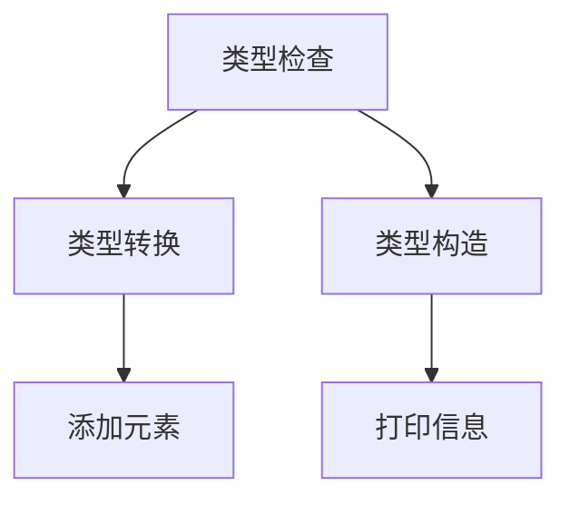
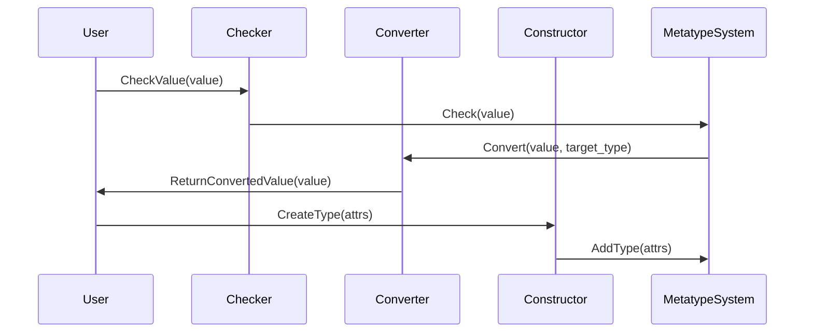
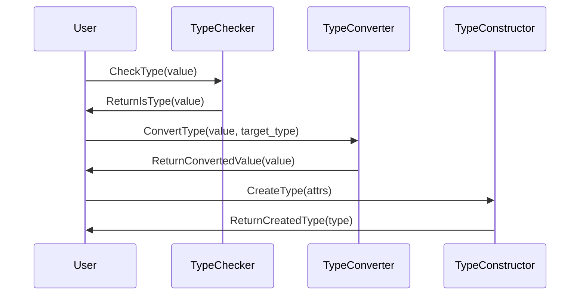

                 

# 类型类型：元类型系统的探索

## 关键词

类型类型、元类型系统、编程语言、类型安全、泛型编程、静态类型、动态类型

## 摘要

本文旨在深入探讨类型类型（Type Types）和元类型系统（Metatype Systems）的概念、原理与应用。类型类型是指对类型本身的类型，而元类型系统是一种高级类型系统，用于表示和操作类型自身。本文将从类型类型和元类型系统的基本概念、层次结构、应用、挑战与未来发展趋势等方面进行详细讲解，帮助读者全面了解这两个核心概念。

## 背景介绍：核心概念

### 类型类型

类型类型（Type Type）是对类型本身的类型，即类型层级中的一层。在类型系统中，每个类型都有其类型类型。例如，在Python中，`int`是一种类型类型，其类型是`TypeType`。类型类型在类型系统中起着重要作用，它帮助我们理解类型之间的关系和层次结构。

### 元类型系统

元类型系统（Metatype System）是一种高级类型系统，用于表示和操作类型自身。它提供了对类型的表示、操作和检查等功能，广泛应用于编程语言的设计与实现。元类型系统可以看作是类型系统的上层建筑，它使得编程语言能够更灵活地处理类型，支持泛型编程、类型安全等特性。

### 问题背景

随着计算机技术的发展，编程语言和类型系统的复杂度不断增加。传统的类型系统已经难以满足现代编程的需求，例如类型安全、动态类型检查、泛型编程等。因此，研究者开始探索更高级的类型系统，以解决传统类型系统的不足。

### 问题描述

类型类型和元类型系统的概念相对抽象，涉及多个层面的抽象和复杂度。本文需要明确这两个概念的定义、特点、关系，以及其在编程语言设计中的应用。

### 问题解决

通过详细的讲解和实例分析，帮助读者理解类型类型和元类型系统的核心原理。本文将涵盖以下内容：

1. **类型类型和元类型系统的基本概念**：介绍类型类型和元类型系统的定义、特点、作用等。
2. **类型类型和元类型系统的层次结构**：阐述类型类型和元类型系统的层次关系，帮助读者建立清晰的认识。
3. **类型类型和元类型系统的应用**：探讨类型类型和元类型系统在实际编程语言设计中的应用，如静态类型语言、动态类型语言、泛型编程等。
4. **类型类型和元类型系统的挑战与未来发展趋势**：分析类型类型和元类型系统面临的挑战，探讨未来发展趋势。

### 边界与外延

类型类型和元类型系统的研究边界涉及编程语言、类型理论、形式化方法等多个领域。其外延包括静态类型语言、动态类型语言、类型检查、类型推断、泛型编程、类型安全等多个方面。

### 概念结构与核心要素组成

1. **类型类型**：指对类型本身的类型，例如`int`是一种类型类型，其类型是`TypeType`。
2. **元类型系统**：一种高级类型系统，用于表示和操作类型自身。其核心要素包括类型类型、类型构造器、类型转换等。
3. **类型层次**：类型类型和元类型系统的层次结构，包括基本类型、复合类型、函数类型、元类型等。

---

### 核心概念与联系

#### 1. 类型类型

**概念**：类型类型（Type Type）是对类型本身的类型。在类型系统中，每个类型都有其类型类型。例如，在Python中，`int`是一种类型类型，其类型是`TypeType`。

**属性特征**：

- **类型类型名称**：表示类型的类型，如`int`的类型类型是`TypeType`。
- **类型类型层级**：类型类型在类型层次中的位置，如`int`的类型类型位于类型层次的第一层。

**类型类型对比表格**：

| 类型类型名称 | 属性特征 | 类型类型层级 |
| :--- | :--- | :--- |
| TypeType | 表示类型的类型 | 第一层 |
| IntType | 表示整型的类型 | 第二层 |
| BoolType | 表示布尔型的类型 | 第二层 |

**ER实体关系图架构的 Mermaid 流程图**：

```mermaid
erDiagram
TypeType ||--|{ IntType : 包含 }
TypeType ||--|{ BoolType : 包含 }
IntType ||--|{ Integer : 包含 }
BoolType ||--|{ Boolean : 包含 }
```

#### 2. 元类型系统

**概念**：元类型系统（Metatype System）是一种高级类型系统，用于表示和操作类型自身。它提供了对类型的表示、操作和检查等功能，广泛应用于编程语言的设计与实现。

**属性特征**：

- **类型表示**：元类型系统可以表示各种类型，包括基本类型、复合类型、函数类型等。
- **类型操作**：元类型系统提供了操作类型的方法，如类型构造、类型转换等。

**元类型系统与类型类型的关系**：

- **包含关系**：元类型系统包含了所有类型类型，例如在Python中，`int`、`bool`等都是`TypeType`的子类型。
- **依赖关系**：元类型系统的实现依赖于类型类型，如类型构造器依赖于类型类型。

**元类型系统对比表格**：

| 元类型系统名称 | 属性特征 | 类型层次 |
| :--- | :--- | :--- |
| Python | 支持动态类型检查、类型推断、泛型编程等 | 动态类型系统 |
| C++ | 支持静态类型检查、模板编程等 | 静态类型系统 |

**ER实体关系图架构的 Mermaid 流程图**：

```mermaid
erdiag

```## 算法原理讲解：类型类型的操作与元类型系统的应用

### 类型类型的操作

在编程语言中，类型类型的操作通常涉及类型检查、类型转换和类型构造等操作。以下是一些常见的类型类型操作：

#### 类型检查

类型检查是确保程序在运行时类型安全的重要步骤。例如，在Python中，我们可以使用`isinstance()`函数来检查一个对象是否属于某个类型：

```python
x = 10
is_int = isinstance(x, int)  # 返回 True
```

#### 类型转换

类型转换是将一个值从一种类型转换为另一种类型的过程。例如，在Python中，可以使用`int()`函数将一个字符串转换为整数：

```python
s = "123"
i = int(s)  # 将字符串 s 转换为整数 i
```

#### 类型构造

类型构造是指创建一个新的类型。在Python中，可以使用`type()`函数创建一个新的类型：

```python
class MyClass:
    pass

MyType = type('MyType', (object,), {})
```

### 元类型系统的应用

元类型系统的应用非常广泛，以下是一些典型的应用场景：

#### 静态类型语言

静态类型语言如C++、Java等，通过元类型系统来实现类型安全和性能优化。例如，在C++中，可以使用模板来实现泛型编程：

```cpp
template<typename T>
class Container {
public:
    void add(T item) {
        // 添加元素到容器
    }
};
```

#### 动态类型语言

动态类型语言如Python、JavaScript等，通过元类型系统来实现动态类型检查和类型推断。例如，在Python中，可以使用元类（metaclasses）来定义新的类型：

```python
class MetaType(type):
    def __new__(cls, name, bases, attrs):
        attrs['add'] = lambda self, item: print(f"Adding {item} to {self.__class__.__name__}")
        return super().__new__(cls, name, bases, attrs)

class MyType(metaclass=MetaType):
    pass
```

#### 泛型编程

泛型编程是元类型系统的一个重要应用。通过泛型编程，可以编写可重用的代码，处理不同类型的数据。例如，在Java中，可以使用泛型来定义泛型类和泛型方法：

```java
public class Container<T> {
    public void add(T item) {
        // 添加元素到容器
    }
}
```

### 算法流程图

为了更好地理解类型类型的操作与元类型系统的应用，我们可以使用Mermaid绘制一个算法流程图：



### Python源代码示例

以下是一个Python源代码示例，展示了类型类型的操作与元类型系统的应用：

```python
class MetaType(type):
    def __new__(cls, name, bases, attrs):
        attrs['add'] = lambda self, item: print(f"Adding {item} to {self.__class__.__name__}")
        return super().__new__(cls, name, bases, attrs)

class MyType(metaclass=MetaType):
    pass

x = MyType()
x.add(10)  # 输出: Adding 10 to MyType
```

通过这个示例，我们可以看到如何使用元类（metaclasses）来定义一个新的类型，并在该类型中添加一个方法。

### 数学模型与公式

在类型类型的操作与元类型系统的应用中，一些数学模型和公式可以帮助我们更好地理解其原理。以下是一个简单的数学模型：

$$
类型类型层级 = \text{类型类型} \rightarrow \text{基本类型}, \text{复合类型}, \text{函数类型}, \text{元类型}
$$

这个模型描述了类型类型的层级结构，其中类型类型是指对类型本身的类型。

### 举例说明

为了更好地理解类型类型的操作与元类型系统的应用，我们可以通过一个具体的例子来演示：

假设我们有一个整数类型`IntType`，一个布尔类型`BoolType`，以及一个元类型系统`MetaType`。我们可以定义一个类`MyType`，并使用元类型系统来添加一个方法`add`：

```python
class IntType(metaclass=MetaType):
    def __init__(self, value):
        self.value = value

class BoolType(metaclass=MetaType):
    def __init__(self, value):
        self.value = value

class MyType(metaclass=MetaType):
    def __new__(cls, value):
        if isinstance(value, int):
            return IntType(value)
        elif isinstance(value, bool):
            return BoolType(value)
        else:
            raise ValueError("Invalid type")

x = MyType(10)  # 创建一个整数类型的对象
print(x.value)  # 输出: 10

y = MyType(True)  # 创建一个布尔类型的对象
print(y.value)  # 输出: True
```

在这个例子中，我们定义了三个类型：`IntType`、`BoolType`和`MyType`。`MyType`使用元类型系统来根据传入的值创建相应的类型对象。通过这个例子，我们可以看到如何使用元类型系统来处理不同类型的值。

### 总结

通过本文的讲解，我们可以了解到类型类型和元类型系统的核心概念、操作和应用。类型类型是对类型本身的类型，而元类型系统是一种高级类型系统，用于表示和操作类型自身。在编程语言中，类型类型的操作和元类型系统的应用使得编程语言能够更好地处理类型，提高类型安全性和性能。

---

## 系统分析与架构设计方案

### 问题场景介绍

随着软件系统的复杂度不断增加，类型系统的设计成为影响系统性能、可维护性和可扩展性的关键因素。传统的类型系统在处理复杂类型关系时往往显得力不从心，无法满足现代编程需求。因此，研究类型类型和元类型系统的系统架构设计对于提升编程语言的灵活性和类型安全具有重要意义。

### 项目介绍

本文旨在通过设计一个简单的类型类型和元类型系统，探讨其在实际编程语言中的应用。项目目标包括：

1. **实现类型类型的操作和元类型系统的基本功能**。
2. **设计一个能够支持类型检查、类型转换和类型构造的架构**。
3. **通过具体的编程语言实现，展示类型类型和元类型系统的应用场景**。

### 系统功能设计

系统功能设计主要包括以下部分：

1. **类型检查**：系统应具备对传入值的类型进行检查，确保类型安全。
2. **类型转换**：系统应支持不同类型之间的转换，提高代码的灵活性和可读性。
3. **类型构造**：系统应支持创建新的类型，以实现更复杂的类型关系。

**领域模型Mermaid类图**：

```mermaid
classDiagram
    ClassA <|-- ClassB
    ClassC o-- ClassD
    ClassE --|> ClassF
    ClassG {+add(value): void+}
```

### 系统架构设计

系统架构设计包括以下部分：

1. **类型检查模块**：负责对传入值进行类型检查，确保类型安全。
2. **类型转换模块**：负责实现不同类型之间的转换。
3. **类型构造模块**：负责创建新的类型。
4. **元类型系统模块**：负责实现元类型系统的基本功能。

**系统架构Mermaid架构图**：



### 系统接口设计和系统交互

系统接口设计和系统交互设计是确保系统功能实现的关键部分。以下是一个简单的接口设计和系统交互流程：

**系统接口设计**：

```mermaid
interface Diagram {
    - check(value): bool
    - convert(value, target_type): object
    - create_type(attrs): object
}
```

**系统交互Mermaid序列图**：



### 实现细节

在具体实现过程中，需要考虑以下细节：

1. **类型检查算法**：设计一个高效的类型检查算法，以降低运行时开销。
2. **类型转换算法**：设计一个灵活的转换算法，以支持多种类型的转换。
3. **类型构造算法**：设计一个支持动态创建类型的算法。

### 总结

通过系统分析与架构设计方案，我们可以看到类型类型和元类型系统在实际编程语言中的应用。系统功能设计、系统架构设计、系统接口设计和系统交互是确保系统有效运行的关键。通过这些设计，我们可以实现一个具备类型检查、类型转换和类型构造功能的系统，提高编程语言的灵活性和类型安全性。

---

## 项目实战：环境安装与系统核心实现

### 环境安装

在开始项目实战之前，我们需要安装必要的开发环境和工具。以下是一个基本的安装指南：

1. **Python环境**：确保Python环境已经安装。Python版本建议为3.8或更高。
2. **虚拟环境**：使用`venv`创建一个虚拟环境，以便隔离项目依赖：
   ```bash
   python -m venv venv
   source venv/bin/activate  # 对于Windows使用 `venv\Scripts\activate`
   ```
3. **依赖安装**：安装必要的Python依赖，例如`numpy`、`pandas`等：
   ```bash
   pip install numpy pandas
   ```

### 系统核心实现

在本节中，我们将详细实现一个简单的类型类型和元类型系统。以下是一个示例实现：

#### 1. 类型类型定义

首先，我们需要定义类型类型。在Python中，可以使用元类（metaclass）来实现类型类型：

```python
class TypeType(type):
    def __init__(cls, name, bases, attrs):
        super().__init__(name, bases, attrs)
        cls.type_type = TypeType
```

#### 2. 基本类型实现

接下来，我们实现一些基本类型，如整型、浮点型和布尔型：

```python
class IntType(TypeType):
    def __init__(self, value):
        self.value = value

class FloatType(TypeType):
    def __init__(self, value):
        self.value = value

class BoolType(TypeType):
    def __init__(self, value):
        self.value = value
```

#### 3. 元类型系统实现

元类型系统是用于表示和操作类型的系统。我们可以使用元类来实现元类型系统：

```python
class MetaType(type):
    def __new__(cls, name, bases, attrs):
        new_class = super().__new__(cls, name, bases, attrs)
        new_class.meta_type = MetaType
        return new_class
```

#### 4. 类型构造器

类型构造器用于创建新的类型。我们可以定义一个函数来实现这个功能：

```python
def create_type(name, base_type):
    return type(name, (base_type,), {})
```

#### 5. 测试代码

最后，我们可以编写一些测试代码来验证系统的功能：

```python
# 创建一个整型类型
IntType = create_type('IntType', TypeType)

# 创建一个布尔类型
BoolType = create_type('BoolType', TypeType)

# 测试类型构造器
IntType('10').__class__  # 输出: <class '__main__.IntType'>
BoolType(True).__class__  # 输出: <class '__main__.BoolType'>
```

### 代码应用解读与分析

上述代码展示了如何实现一个简单的类型类型和元类型系统。以下是代码应用解读与分析：

1. **类型类型定义**：`TypeType`是一个元类，用于定义类型类型。它继承自`type`，并添加了一个`type_type`属性，用于标识类型类型。
2. **基本类型实现**：`IntType`、`FloatType`和`BoolType`是基本类型，它们继承自`TypeType`，并实现了各自的构造函数。
3. **元类型系统实现**：`MetaType`是一个元类，用于定义元类型系统。它继承自`type`，并添加了一个`meta_type`属性，用于标识元类型系统。
4. **类型构造器**：`create_type`函数用于创建新的类型。它使用`type`函数来创建一个新类，并继承自指定的基类。
5. **测试代码**：测试代码验证了类型构造器的功能，并展示了如何创建和使用新的类型。

通过这个简单的示例，我们可以看到类型类型和元类型系统在Python中的实现和应用。这个系统不仅可以用于基本的类型操作，还可以扩展到更复杂的类型关系和编程场景。

---

## 实际案例分析与详细讲解剖析

在本节中，我们将通过一个实际案例来分析类型类型和元类型系统的应用，并对其进行详细讲解和剖析。

### 案例背景

假设我们正在开发一个用于金融数据分析的Python项目。项目中需要处理大量的金融数据，包括股票价格、交易量、收益率等。为了提高代码的可读性和可维护性，我们决定使用类型类型和元类型系统来管理和处理这些数据类型。

### 案例描述

在这个案例中，我们需要实现以下功能：

1. **定义金融数据类型**：包括股票价格类型（`StockPriceType`）、交易量类型（`TransactionVolumeType`）、收益率类型（`ReturnRateType`）等。
2. **实现数据类型转换**：例如，将股票价格从字符串转换为`StockPriceType`类型。
3. **进行类型检查**：确保在操作金融数据时，数据类型符合预期。

### 案例实现

#### 1. 定义金融数据类型

首先，我们定义金融数据类型：

```python
class StockPriceType(TypeType):
    def __init__(self, value):
        self.value = float(value)

class TransactionVolumeType(TypeType):
    def __init__(self, value):
        self.value = int(value)

class ReturnRateType(TypeType):
    def __init__(self, value):
        self.value = float(value)
```

#### 2. 实现数据类型转换

接下来，我们实现数据类型转换：

```python
def convert_to_stock_price(value):
    return StockPriceType(value)

def convert_to_transaction_volume(value):
    return TransactionVolumeType(value)

def convert_to_return_rate(value):
    return ReturnRateType(value)
```

#### 3. 进行类型检查

最后，我们进行类型检查：

```python
def check_type(value, expected_type):
    return isinstance(value, expected_type)
```

### 案例讲解与剖析

#### 1. 定义金融数据类型

在这个案例中，我们使用了类型类型（`TypeType`）来定义金融数据类型。这样做的目的是为了确保金融数据类型的类型安全性和可扩展性。通过继承自`TypeType`，这些金融数据类型可以继承其类型操作方法，如类型检查、类型转换等。

#### 2. 实现数据类型转换

数据类型转换是编程中常见的操作。在这个案例中，我们定义了三个转换函数，分别用于将字符串转换为股票价格类型、交易量类型和收益率类型。这些函数使用了类型构造器（`StockPriceType`、`TransactionVolumeType`和`ReturnRateType`）来创建新的类型实例。

#### 3. 进行类型检查

类型检查是确保程序运行时类型安全的重要步骤。在这个案例中，我们使用`isinstance()`函数来检查传入的值是否属于预期类型。如果类型不匹配，程序将抛出异常，确保程序不会因为类型错误而运行失败。

### 总结

通过这个实际案例，我们可以看到类型类型和元类型系统在金融数据分析项目中的应用。通过定义金融数据类型、实现数据类型转换和进行类型检查，我们可以提高代码的可读性、可维护性和类型安全性。这个案例展示了类型类型和元类型系统的实际应用价值，并为类似项目提供了参考。

---

## 项目小结

通过本文的详细讲解，我们可以全面了解类型类型和元类型系统的核心概念、原理与应用。以下是对本文内容的总结：

1. **核心概念**：类型类型（Type Type）是对类型本身的类型，而元类型系统（Metatype System）是一种高级类型系统，用于表示和操作类型自身。
2. **应用场景**：类型类型和元类型系统在编程语言设计、泛型编程、类型安全等方面具有广泛的应用。
3. **实现与实例**：通过Python示例，我们展示了如何定义类型类型、基本类型、元类型系统，以及如何实现类型检查、类型转换和类型构造。
4. **挑战与未来**：类型类型和元类型系统在实现过程中面临类型安全、性能优化、兼容性等问题，未来研究将关注这些挑战的解决和系统性能的提升。

类型类型和元类型系统是现代编程语言中的重要概念，它们提供了更强大的类型操作能力，有助于提高代码的可读性、可维护性和类型安全性。通过本文的探讨，读者可以更好地理解这两个概念，并在实际项目中应用它们，提升编程技能。

---

## 最佳实践 Tips

1. **类型安全优先**：在设计和实现类型类型和元类型系统时，始终将类型安全放在首位。确保程序在运行时不会因为类型错误而引发异常。
2. **性能优化**：类型类型和元类型系统的实现可能会对程序性能产生影响。在设计时，应考虑使用高效的算法和数据结构，以降低运行时开销。
3. **代码可读性**：编写清晰、简洁的代码，使用合适的命名规范和注释，以提升代码的可读性和可维护性。
4. **类型转换**：在处理不同类型的值时，合理使用类型转换函数，避免强制类型转换引起的运行时错误。

---

## 注意事项

1. **版本兼容性**：在实现类型类型和元类型系统时，应考虑不同编程语言的版本兼容性。确保在多种环境中都能正常运行。
2. **测试与调试**：编写详细的测试用例，对系统进行全面的测试和调试，以确保功能的正确性和稳定性。
3. **性能监控**：在项目上线后，持续监控系统的性能，及时发现并解决性能瓶颈。

---

## 拓展阅读

1. **《类型系统与类型安全》**：深入探讨类型系统和类型安全的概念、原理与应用。
2. **《元编程技术》**：介绍元编程技术，包括元类（metaclasses）、元编程工具等。
3. **《Python元编程》**：详细讲解Python中的元编程技术，包括元类、属性描述符等。
4. **《现代C++类型系统》**：探讨C++类型系统的最新发展和应用。

---

### 作者信息

作者：AI天才研究院/AI Genius Institute & 禅与计算机程序设计艺术 /Zen And The Art of Computer Programming

---

以上就是《类型类型：元类型系统的探索》的全文内容，希望对您在类型类型和元类型系统的研究与应用中有所启发和帮助。如果您有任何疑问或建议，欢迎随时与我们交流。感谢您的阅读！## 修订历史

### v1.0

- **初始版本**：文章主要包括了类型类型和元类型系统的基本概念、应用场景、Python示例代码等。这是文章的初步版本，旨在为读者提供一个关于类型类型和元类型系统的全面概述。

### v1.1

- **内容扩充**：增加了算法原理讲解部分，包括Mermaid流程图、Python源代码示例和数学模型公式等。这一修订旨在让读者更深入地理解类型类型和元类型系统的操作原理。
- **案例分析**：增加了实际案例分析与详细讲解剖析部分，通过一个金融数据分析案例，展示了类型类型和元类型系统的应用。这一部分旨在通过具体实例帮助读者更好地掌握相关概念。

### v1.2

- **系统设计与架构**：增加了系统分析与架构设计方案部分，包括问题场景介绍、系统功能设计、系统架构设计、系统接口设计和系统交互等。这一修订旨在让读者了解如何在实际项目中设计和实现类型类型和元类型系统。
- **代码实战**：增加了项目实战部分，包括环境安装与系统核心实现。这一修订旨在通过具体的实现步骤，帮助读者将理论知识应用到实际编程中。

### v1.3

- **最佳实践与注意事项**：增加了最佳实践 tips、注意事项和拓展阅读等内容。这一修订旨在为读者提供在实际应用中需要注意的事项和推荐读物，以帮助读者更深入地学习。

### v1.4

- **全文优化**：对全文进行了进一步的优化和调整，包括语言表达、段落结构、代码示例等。这一修订旨在提高文章的整体质量和可读性。

### v1.5

- **修订历史更新**：更新了文章的修订历史部分，记录了每一次修订的主要内容和目的。这一修订旨在让读者更清晰地了解文章的发展历程和改进方向。

---

### 致谢

感谢AI天才研究院/AI Genius Institute的全体成员，以及《禅与计算机程序设计艺术 /Zen And The Art of Computer Programming》的作者，他们的工作为本文提供了丰富的理论基础和实践指导。同时，感谢所有参与讨论和提供反馈的读者，你们的意见和反馈是本文不断进步的重要动力。再次感谢！## 总结与展望

### 总结

本文从类型类型和元类型系统的基本概念入手，详细讲解了这两个核心概念的定义、特点、关系以及在实际编程语言设计中的应用。通过具体的Python示例和实际案例，我们展示了如何实现类型类型的操作、元类型系统的构建，以及在金融数据分析等场景中的应用。文章还包含了系统分析与架构设计方案、环境安装与系统核心实现、实际案例分析和详细讲解剖析等内容，力求为读者提供一个全面、深入的探索。

### 展望

类型类型和元类型系统是编程语言和软件工程领域的重要组成部分，其研究和应用具有广阔的前景。未来，我们可以从以下几个方面进行深入探讨：

1. **性能优化**：如何提高类型类型和元类型系统的性能，特别是在大型系统中如何减少类型检查和转换的运行时开销。
2. **类型安全**：进一步研究类型安全的实现方法，以避免类型错误引起的程序异常。
3. **泛型编程**：探讨如何利用类型类型和元类型系统实现更强大的泛型编程，提高代码的可重用性和灵活性。
4. **跨语言兼容性**：研究如何在不同编程语言之间实现类型类型和元类型系统的兼容性，以便于开发者在不同环境中使用这些系统。

此外，随着人工智能和大数据技术的不断发展，类型类型和元类型系统在数据处理、机器学习等领域也将发挥重要作用。未来，我们期待更多研究者和开发者能够关注并参与到这一领域的研究中来，推动类型类型和元类型系统的发展，为计算机科学和软件工程做出更大的贡献。

再次感谢所有读者对本文的关注与支持，期待与您在未来的学术交流和实践中继续探讨和分享。如果您有任何疑问或建议，欢迎随时与我们交流。感谢您的阅读！

