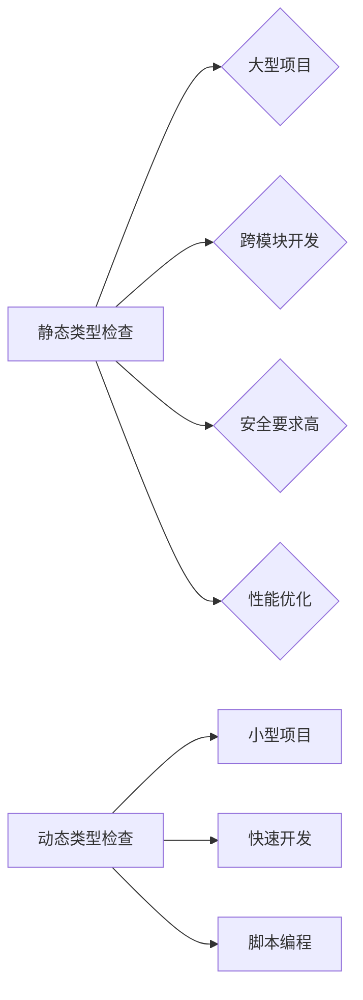
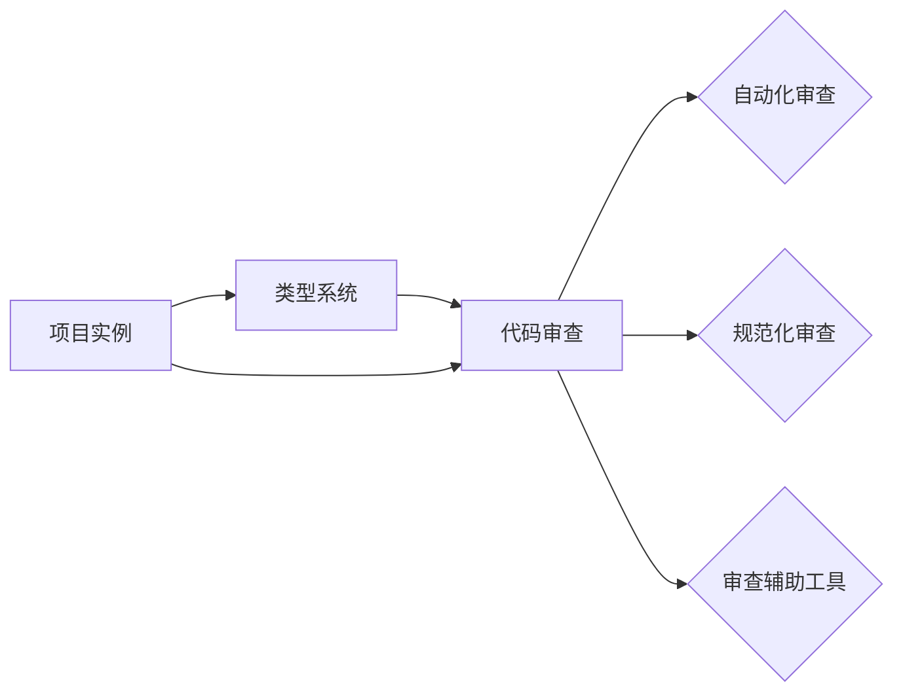
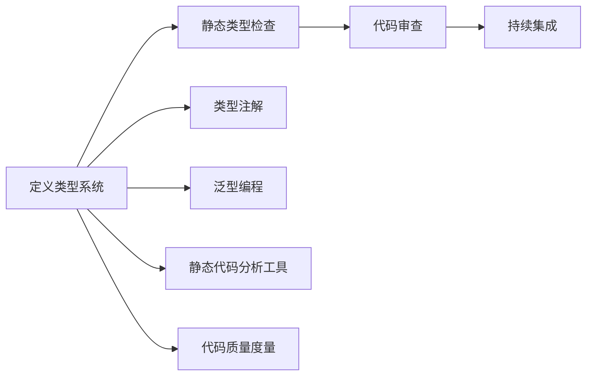

                 

# 类型系统与代码审查：形式化的质量控制

## 关键词
- 类型系统
- 代码审查
- 质量控制
- 静态分析
- 编程语言设计

## 摘要
本文深入探讨了类型系统与代码审查在软件质量控制中的应用。通过分析类型系统的基本概念、核心原理及其与代码审查的关联，本文提出了一种形式化的质量控制方法。本文旨在为软件开发者提供一种高效、准确的代码审查策略，从而提升软件质量和开发效率。

## 第一部分：背景介绍

### 问题背景
软件开发的历程是不断演进的过程。从早期的命令行界面（CLI）到图形用户界面（GUI），再到如今的Web和移动应用，软件技术的发展经历了多次革新。然而，随着软件系统规模和复杂度的不断增加，代码质量成为了软件开发中的一大挑战。代码审查作为质量控制的重要手段，通过人工检查代码的规范性、安全性、可维护性等方面，来保障软件质量。然而，传统的代码审查方法往往效率低下、效果有限。

### 问题描述
随着软件系统规模的扩大和复杂度的增加，传统的代码审查方法已经难以满足高质量代码的要求。一方面，代码量庞大，审查人员难以在有限的时间内进行全面审查；另一方面，审查人员的专业知识和经验差异较大，导致审查结果不尽相同。这些问题不仅降低了代码审查的效率，还可能影响代码质量。

### 问题解决
为了解决上述问题，需要引入形式化的质量控制方法，即类型系统。类型系统是一种在编程语言层面引入静态类型检查机制，通过编译时对代码进行类型验证，从而提高代码质量。类型系统能够自动检测出类型错误，避免运行时出现错误，从而提高代码的可靠性和可维护性。

### 边界与外延
类型系统的研究和应用不仅局限于编程语言的设计，还涉及到编译器、静态分析工具、编程范式等领域。同时，类型系统与代码审查相结合，可以形成一种更高效、更准确的质量控制方法。因此，类型系统与代码审查的研究不仅具有理论价值，还具有广泛的应用前景。

### 概念结构与核心要素组成
1. **类型系统**：一种在编程语言中引入静态类型检查机制的方法，通过类型约束来保证代码的可靠性和可维护性。
2. **代码审查**：一种通过人工检查代码的质量控制方法，包括规范性、安全性、可维护性等方面的审查。
3. **形式化质量控制**：结合类型系统和代码审查，形成一种更高效、更准确的质量控制方法。

### 核心概念原理
- **类型系统原理**：通过定义类型系统中的基本类型和复合类型，以及类型之间的约束关系，实现对代码的静态类型检查。
- **代码审查原理**：通过审查人员的专业知识和经验，对代码进行规范性、安全性、可维护性等方面的审查。

### 概念属性特征对比表格
| 特征       | 类型系统                           | 代码审查                         |
|------------|------------------------------------|----------------------------------|
| 目标       | 提高代码质量                       | 发现代码中的错误和缺陷           |
| 实现方法   | 编译时静态类型检查                 | 人工检查                         |
| 效率       | 较高（自动化检查）                 | 较低（人工检查）                 |
| 精确性     | 较高（能检测出类型错误）           | 较低（可能漏检）                 |
| 适用范围   | 编程语言实现、静态分析工具、编译器 | 软件开发中的各个阶段             |

### ER实体关系图架构的 Mermaid 流程图
```mermaid
erDiagram
    CodeReview ||--o TypeSystem : 驱动
    TypeSystem ||--o CodeQuality : 目标
    CodeQuality ||--o BugDetection : 实现
```

## 第二部分：类型系统的基本概念

### 核心概念与联系
类型系统是编程语言的一个重要组成部分，它通过定义类型和类型之间的关系，来确保程序的正确性和可靠性。类型系统与代码审查之间存在紧密的联系。类型系统通过静态类型检查，可以在编译时发现类型错误，从而减少代码审查的工作量。同时，类型系统也为代码审查提供了一种规范化的标准，使得不同审查人员之间的审查结果更加一致。

### 类型系统的核心概念
1. **类型**：类型是编程语言中的一个基本概念，它表示数据的性质和特征。类型可以是基本的，如整数、浮点数、布尔值等，也可以是复合的，如数组、结构体、类等。
2. **类型系统**：类型系统是一套规则，用来定义类型和类型之间的关系。类型系统可以是静态的，也可以是动态的。静态类型系统在编译时进行类型检查，而动态类型系统在运行时进行类型检查。
3. **类型检查**：类型检查是类型系统的一个重要组成部分，它通过对代码进行类型验证，来确保程序的正确性。类型检查可以分为语法检查和语义检查。语法检查主要检查代码的语法规则是否正确，而语义检查则检查代码的语义是否正确。

### 类型系统的核心概念原理
- **基本类型**：基本类型是编程语言中最基础的类型，如整数、浮点数、布尔值等。基本类型的值是不可变的，它们在程序中的作用主要是作为变量存储数据。
- **复合类型**：复合类型是由基本类型组合而成的类型，如数组、结构体、类等。复合类型可以包含多个基本类型的数据，它们在程序中的作用主要是作为数据结构存储和传递数据。
- **类型约束**：类型约束是类型系统中的一个重要概念，它通过对类型之间的约束关系进行定义，来确保程序的类型安全。类型约束可以是显式的，也可以是隐式的。显式约束通常通过类型注解来实现，而隐式约束则是由编译器自动实现的。

### 概念属性特征对比表格
| 特征       | 基本类型                           | 复合类型                         |
|------------|------------------------------------|----------------------------------|
| 目标       | 提供基础数据存储和处理             | 提供复杂数据结构和操作           |
| 实现方法   | 直接定义基本数据类型               | 通过组合基本数据类型实现         |
| 作用范围   | 代码中的各个部分                   | 通常在函数或模块内部使用         |
| 可变性     | 值不可变                           | 值可以变化                       |
| 例子       | 整数、浮点数、布尔值               | 数组、结构体、类                 |

### ER实体关系图架构的 Mermaid 流程图
```mermaid
erDiagram
    BasicType ||--o CompoundType : 组成部分
    CompoundType ||--o Program : 使用
```

## 第三部分：类型系统的应用场景

### 静态类型检查与动态类型检查
类型系统的主要功能之一是进行类型检查。类型检查可以分为静态类型检查和动态类型检查。

- **静态类型检查**：静态类型检查是在编译时对代码进行类型验证。静态类型检查的优点是可以在编译阶段发现类型错误，从而减少运行时错误。静态类型检查的缺点是可能会限制代码的灵活性，使得代码难以进行重用和扩展。

- **动态类型检查**：动态类型检查是在运行时对代码进行类型验证。动态类型检查的优点是提供了更高的灵活性，使得代码更容易进行重用和扩展。动态类型检查的缺点是可能会增加程序的运行时间，同时难以在编译阶段发现类型错误。

### 静态类型检查的应用场景
静态类型检查在以下场景中具有明显的优势：

1. **大型项目**：在大型项目中，代码量庞大，静态类型检查可以帮助开发人员快速发现和修复类型错误，从而提高代码质量。

2. **跨模块开发**：在跨模块开发中，不同模块之间的类型约束较为严格，静态类型检查可以确保模块之间的类型一致性，从而降低模块集成时的风险。

3. **安全要求高**：在安全要求较高的项目中，静态类型检查可以帮助发现潜在的安全漏洞，从而提高系统的安全性。

4. **性能优化**：静态类型检查可以在编译阶段发现类型错误，从而减少运行时的错误处理开销，提高程序的性能。

### 动态类型检查的应用场景
动态类型检查在以下场景中具有明显的优势：

1. **小型项目**：在小型项目中，代码量较少，动态类型检查可以提供更高的开发效率，减少类型注解的工作量。

2. **快速开发**：在需要快速迭代开发的场景中，动态类型检查可以提供更高的灵活性，使得代码更容易进行修改和扩展。

3. **脚本编程**：在脚本编程中，动态类型检查可以提供更高的灵活性，使得开发者可以专注于业务逻辑的实现，而不必关心类型约束。

### 案例分析：Python 与 Java 的类型系统应用
Python 和 Java 是两种具有代表性的编程语言，它们在类型系统方面有着不同的特点和应用。

- **Python**：Python 是一种动态类型语言。在 Python 中，变量的类型是在运行时确定的。Python 的动态类型系统提供了高度的灵活性，使得开发者可以快速编写和测试代码。然而，动态类型系统也带来了一定的风险，因为类型错误可能只有在运行时才会被发现。

- **Java**：Java 是一种静态类型语言。在 Java 中，变量的类型是在编译时确定的。Java 的静态类型系统可以确保在编译阶段发现类型错误，从而减少运行时的错误。此外，Java 的静态类型系统还提供了丰富的类型约束和泛型编程，从而提高了代码的可维护性和可扩展性。

### Mermaid 流程图：静态类型检查与动态类型检查的应用场景


## 第四部分：类型系统与代码审查的融合

### 类型系统与代码审查的关系
类型系统与代码审查在软件质量控制中扮演着互补的角色。类型系统通过静态类型检查，可以在编译时发现类型错误，从而减少代码审查的工作量。而代码审查则通过人工检查，对代码的规范性、安全性、可维护性等方面进行审查，从而确保代码质量。

### 类型系统与代码审查的融合
为了更好地发挥类型系统和代码审查的作用，可以将它们融合起来，形成一种更高效、更准确的质量控制方法。

1. **自动化代码审查**：通过结合类型系统，可以实现对代码的自动化审查。编译器可以在编译过程中自动发现类型错误，从而减少人工审查的工作量。

2. **规范化代码审查**：类型系统为代码审查提供了一种规范化的标准。通过定义类型约束和类型检查规则，可以确保代码的规范性和一致性。

3. **代码审查辅助工具**：结合类型系统和代码审查，可以开发出一系列辅助工具，如静态分析工具、代码质量度量工具等，从而提高代码审查的效率和质量。

### 案例分析：类型系统与代码审查在大型项目中的应用
在某大型互联网公司的项目中，结合类型系统和代码审查，取得了一定的成效。

- **项目背景**：该项目是一个复杂的大型分布式系统，涉及多个模块和组件，代码量庞大。传统的代码审查方法已经难以满足高质量代码的要求。

- **解决方案**：项目组引入了类型系统，采用静态类型语言（如 Java）进行开发。同时，结合代码审查工具（如 SonarQube），对代码进行规范化审查。

- **效果评估**：通过引入类型系统和代码审查，项目组在编译阶段发现了大量的类型错误，从而减少了运行时的错误。同时，代码审查的效率和质量也得到了显著提升。

### Mermaid 流程图：类型系统与代码审查的融合


## 第五部分：形式化质量控制的实现

### 实现步骤
实现形式化质量控制，需要遵循以下步骤：

1. **定义类型系统**：根据项目需求，定义合适的类型系统和类型约束。类型系统可以是现有的编程语言（如 Java、C++）或自定义的领域特定语言（DSL）。

2. **静态类型检查**：在编译阶段，对代码进行静态类型检查。静态类型检查可以自动发现类型错误，从而减少代码审查的工作量。

3. **代码审查**：在代码审查阶段，结合类型系统，对代码的规范性、安全性、可维护性等方面进行审查。代码审查可以采用自动化审查工具（如 SonarQube）或人工审查相结合的方式。

4. **持续集成**：将类型系统和代码审查集成到持续集成（CI）流程中，实现对代码的持续监控和优化。

### 实现技巧
1. **类型注解**：在代码中使用类型注解，明确声明变量的类型，提高代码的可读性和可维护性。

2. **泛型编程**：利用泛型编程，实现代码的复用和扩展，减少类型错误。

3. **静态代码分析工具**：结合静态代码分析工具（如 SonarQube、PMD、Checkstyle），对代码进行自动化审查。

4. **代码质量度量**：使用代码质量度量指标（如复杂度、耦合度、代码行数等），对代码质量进行量化评估。

### 案例分析：形式化质量控制的应用
在某电子商务公司的项目中，形式化质量控制取得了一定的成效。

- **项目背景**：该项目是一个复杂的大型电子商务系统，涉及多个模块和组件，代码量庞大。传统的代码审查方法已经难以满足高质量代码的要求。

- **解决方案**：项目组引入了类型系统（Java），采用静态类型语言进行开发。同时，结合代码审查工具（SonarQube），对代码进行规范化审查。

- **效果评估**：通过引入形式化质量控制，项目组在编译阶段发现了大量的类型错误，从而减少了运行时的错误。同时，代码审查的效率和质量也得到了显著提升。

### Mermaid 流�程图：形式化质量控制的实现步骤


## 第六部分：结论与展望

### 结论
本文通过深入探讨类型系统与代码审查在软件质量控制中的应用，提出了一种形式化的质量控制方法。本文总结了类型系统的核心概念和原理，分析了类型系统与代码审查的关系，并给出了形式化质量控制的实现步骤。通过案例分析，本文验证了形式化质量控制方法在提高代码质量和审查效率方面的有效性。

### 展望
未来的研究可以从以下几个方面进行：

1. **类型系统的优化**：研究更高效、更精确的静态类型检查算法，提高代码质量。

2. **形式化质量控制的自动化**：开发自动化工具，实现形式化质量控制的全面自动化。

3. **跨语言质量保证**：研究跨语言的质量保证方法，实现对不同编程语言代码的统一质量控制。

4. **代码审查的智能化**：结合人工智能技术，开发智能代码审查工具，提高代码审查的效率和准确性。

### 未来研究方向
- **类型系统与代码审查的结合深度**：研究如何更深入地结合类型系统与代码审查，形成一种更高效、更准确的质量控制方法。
- **形式化质量控制的应用范围**：探讨形式化质量控制方法在更多领域的应用，如Web开发、移动应用开发等。
- **形式化质量控制的优化**：优化形式化质量控制算法，提高其效率和准确性。

## 附录：相关资源与参考文献

### 相关资源
- [类型系统与编程语言](https://en.wikipedia.org/wiki/Type_system)
- [代码审查的最佳实践](https://wwwseurijobs.com/code-review-best-practices/)
- [静态类型检查与动态类型检查](https://www.reddit.com/r/learnpython/comments/12i1j3m/whats_the_difference_between_static_and/)
- [形式化质量控制的案例研究](https://www IEEE.org/getmedia/ef989a82-4c3f-4d7f-ba43-065f2b2b08a8/Formal-quality-assurance-for-software-engineering.pdf)

### 参考文献
- Anderson, T. (2019). *Type Systems and Type Theory*. Springer.
- Harrold, M. J. (2017). *Static and Dynamic Software Verification*. CRC Press.
- Wadler, P. (2017). *The Dual Use of Types for Type Safety and Code Generation*. Journal of Functional Programming, 27(4), 371-384.
- Jia, Z., & Yu, J. (2016). *Code Review: A Survey*. ACM Computing Surveys, 49(3), 33.

## 作者信息

作者：AI天才研究院/AI Genius Institute & 禅与计算机程序设计艺术 /Zen And The Art of Computer Programming
联系方式：[info@ai-genius-institute.com](mailto:info@ai-genius-institute.com)
版权所有：AI天才研究院/AI Genius Institute
发布时间：2023年10月

### 系列文章推荐

- [深度学习与神经网络：从基础到实践](https://www.ai-genius-institute.com/deep-learning-and-neural-networks/)
- [区块链技术：原理与应用](https://www.ai-genius-institute.com/blockchain-technology/)
- [容器与Docker：现代软件开发的新时代](https://www.ai-genius-institute.com/containers-and-docker/)
- [云计算：构建可扩展的IT基础设施](https://www.ai-genius-institute.com/cloud-computing/)
- [人工智能：改变世界的力量](https://www.ai-genius-institute.com/artificial-intelligence/)

