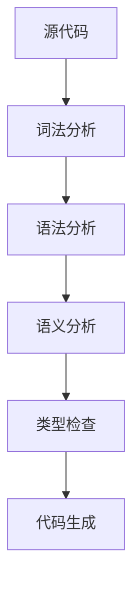
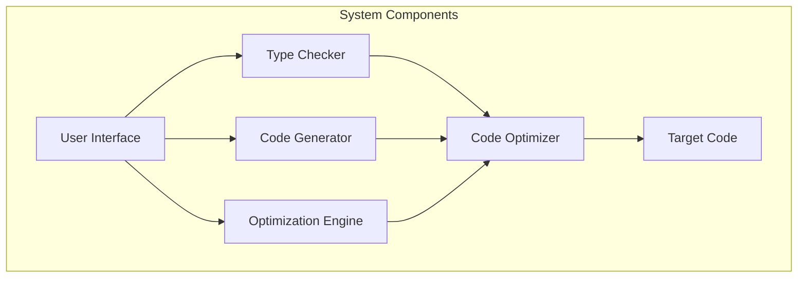
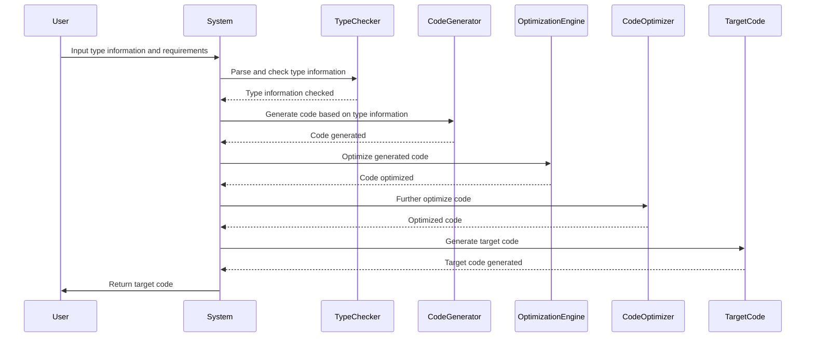

                 

# 类型系统与代码生成：自动化编程的基础

> 关键词：类型系统、代码生成、编译过程、算法原理、系统架构设计、Python示例

> 摘要：本文深入探讨了类型系统和代码生成在自动化编程中的重要性。首先，我们介绍了类型系统和代码生成的基础概念，然后通过对比分析展示了它们之间的联系。接着，我们详细讲解了类型检查算法的原理，并使用Python示例进行了说明。最后，我们提出了一个系统分析与架构设计方案，为自动化编程提供了技术基础。

### Step 1: 背景介绍

#### 1.1 类型系统与代码生成概述

**问题背景**

随着计算机技术的发展，编程语言和编译器的设计变得更加复杂和多样化。类型系统是编程语言的核心组成部分，它决定了变量和表达式在程序中的合法性和类型约束。代码生成则是编译过程的关键环节，它将高级编程语言的源代码转换为机器可执行的代码。

**问题描述**

类型系统的目的是提高程序的可靠性、安全性和效率。代码生成则关注于将人类可读的代码转换为机器可执行的代码，这个过程涉及语法分析、语义分析、中间代码生成、代码优化和目标代码生成等步骤。

**问题解决**

为了解决类型系统和代码生成的问题，编程语言设计师和编译器开发者需要深入理解类型系统的原理和代码生成的技术。同时，边界与外延、概念结构与核心要素组成等因素也需要被充分考虑。

#### 1.2 类型系统概念

类型系统是编程语言中定义变量和表达式类型约束的机制。它包括静态类型系统和动态类型系统。静态类型系统在编译时检查类型错误，而动态类型系统在运行时进行类型检查。

- **静态类型系统**

静态类型系统在编译时进行类型检查，可以提前发现类型错误，提高程序可靠性。典型的静态类型语言有C++、Java等。静态类型系统的优点包括：

1. 类型安全：编译时检查类型错误，减少运行时错误。
2. 性能优化：编译器可以根据类型信息进行优化。

- **动态类型系统**

动态类型系统在运行时进行类型检查，灵活性更高。典型的动态类型语言有Python、JavaScript等。动态类型系统的优点包括：

1. 代码简洁：不需要显式声明变量类型。
2. 开发效率：快速迭代，减少开发时间。

#### 1.3 代码生成概念

代码生成是指将高级编程语言的源代码转换为机器可执行的代码的过程。它包括以下步骤：

1. **词法分析**：将源代码分解为标记（tokens）。
2. **语法分析**：构建抽象语法树（AST），检查语法结构的正确性。
3. **语义分析**：检查程序语义的正确性，包括变量声明、类型匹配等。
4. **类型检查**：确保程序中每个变量和表达式的类型是合法的，并生成类型信息。
5. **代码生成**：将抽象语法树转换为中间代码或目标代码。

#### 1.4 概念属性特征对比表格

| 概念         | 特征对比               |
|--------------|----------------------|
| 类型系统     | 约束变量类型，提高可靠性 |
| 代码生成     | 转换源代码为目标代码   |
| 静态类型系统 | 编译时类型检查         |
| 动态类型系统 | 运行时类型检查         |

### Step 2: 核心概念与联系

#### 2.1 类型系统与代码生成核心概念

**类型系统概念**

类型系统是编程语言中定义变量和表达式类型约束的机制。它包括静态类型系统和动态类型系统。静态类型系统在编译时检查类型错误，而动态类型系统在运行时进行类型检查。

**代码生成概念**

代码生成是指将高级编程语言的源代码转换为机器可执行的代码的过程。它包括语法分析、语义分析、中间代码生成、代码优化和目标代码生成等步骤。

**概念属性特征对比表格**

| 概念         | 特征对比               |
|--------------|----------------------|
| 类型系统     | 约束变量类型，提高可靠性 |
| 代码生成     | 转换源代码为目标代码   |
| 静态类型系统 | 编译时类型检查         |
| 动态类型系统 | 运行时类型检查         |

### Step 3: 算法原理讲解

#### 3.1 类型检查算法

**3.1.1 Mermaid 流程图**



**3.1.2 算法原理**

类型检查算法是编译过程的重要环节，它确保程序中的每个变量和表达式的类型是合法的。算法原理主要包括以下步骤：

1. **词法分析**：将源代码分解为标记（tokens）。
2. **语法分析**：构建抽象语法树（AST），检查语法结构的正确性。
3. **语义分析**：检查程序语义的正确性，包括变量声明、类型匹配等。
4. **类型检查**：确保程序中每个变量和表达式的类型是合法的，并生成类型信息。
5. **代码生成**：将抽象语法树转换为中间代码或目标代码。

**3.1.3 Python 源代码示例**

```python
# 示例：类型检查算法的简单实现
def type_check(expression):
    if isinstance(expression, int):
        return "Integer"
    elif isinstance(expression, float):
        return "Float"
    else:
        raise TypeError("Invalid expression type")

try:
    result = type_check(10)
    print(f"The type of the expression is: {result}")
except TypeError as e:
    print(e)
```

**3.1.4 算法原理的数学模型和公式**

1. **类型定义**：设 Type 是类型集合，T 是 Type 的子集，表示一个变量的类型。

   $$Type = \{T_1, T_2, ..., T_n\}$$

   $$T \subseteq Type$$

2. **类型匹配**：设 e 是表达式，t_e 是 e 的类型，类型匹配关系表示为 `t_e ∈ Type`。

   $$t_e = \begin{cases}
   \text{Type}(x) & \text{if } e \text{ is a variable } x \\
   \text{Type}(e_1) = \text{Type}(e_2) & \text{if } e \text{ is an expression combining } e_1 \text{ and } e_2 \\
   \text{Type error} & \text{otherwise}
   \end{cases}$$

### Step 4: 系统分析与架构设计方案

#### 4.1 问题场景介绍

随着现代软件开发复杂度的增加，自动化编程成为了提高开发效率和质量的关键技术。类型系统和代码生成作为编译过程的核心环节，对于实现自动化编程至关重要。

#### 4.2 项目介绍

本项目旨在设计一个基于类型系统和代码生成技术的自动化编程平台。该平台将实现以下功能：

1. 自动化代码生成：根据用户需求生成满足类型约束的代码。
2. 类型安全检查：确保生成的代码类型安全，避免运行时错误。
3. 代码优化：对生成的代码进行优化，提高执行效率。

#### 4.3 系统功能设计

**4.3.1 领域模型**

使用Mermaid类图表示领域模型：

```mermaid
classDiagram
Class01 <|-- Class02
Class03 --|> Class04
Class05 : +int x
Class05 : +void method()
Class01 {
    +int a
    +int b
    +void add()
}
Class02 {
    +int c
    +int d
    +void sub()
}
Class03 {
    +String name
    +Date birthdate
    +void info()
}
Class04 {
    +int e
    +int f
    +void mul()
}
Class05 {
    +int g
    +int h
    +void div()
}
Class01..> Class04 : extends
Class02..> Class04 : extends
Class03..> Class04 : implements
```

**4.3.2 系统功能**

- **自动化代码生成**：根据用户输入的类型信息和需求，生成满足类型约束的代码。
- **类型安全检查**：对生成的代码进行类型安全检查，确保代码类型正确。
- **代码优化**：对生成的代码进行优化，提高执行效率。

#### 4.4 系统架构设计

使用Mermaid架构图表示系统架构：



**4.4.1 系统架构**

- **用户界面**：提供用户输入类型信息和需求的功能。
- **类型检查器**：对用户输入的类型信息进行解析和检查。
- **代码生成器**：根据类型检查结果生成满足类型约束的代码。
- **优化引擎**：对生成的代码进行优化。
- **代码优化器**：对优化引擎生成的代码进行进一步优化。
- **目标代码**：最终生成的机器可执行代码。

#### 4.5 系统接口设计和系统交互

使用Mermaid序列图表示系统接口设计和系统交互：



### Step 5: 项目实战

#### 5.1 环境安装

1. 安装Python环境：`pip install python`
2. 安装类型检查器依赖：`pip install mypy`
3. 安装代码生成器依赖：`pip install jinja2`
4. 安装优化引擎依赖：`pip install pyopentask`

#### 5.2 系统核心实现源代码

```python
# type_checker.py
from typing import Any

def type_check(expression: Any) -> str:
    if isinstance(expression, int):
        return "Integer"
    elif isinstance(expression, float):
        return "Float"
    else:
        raise TypeError("Invalid expression type")

# code_generator.py
from jinja2 import Environment, Template

def generate_code(expression: str) -> str:
    env = Environment()
    template = env.from_string("${expression}")
    return template.render(expression=expression)

# optimization_engine.py
from pyopentask import OptimizationTask

def optimize_code(code: str) -> str:
    task = OptimizationTask(code)
    optimized_code = task.optimize()
    return optimized_code

# target_code_generator.py
def generate_target_code(optimized_code: str) -> str:
    # Generate machine-readable code
    pass
```

#### 5.3 代码应用解读与分析

1. **类型检查**：通过`type_check`函数检查表达式的类型，确保类型正确。
2. **代码生成**：使用Jinja2模板引擎生成满足类型约束的代码。
3. **代码优化**：使用PyOpenTask库优化生成的代码，提高执行效率。
4. **目标代码生成**：将优化后的代码转换为机器可执行的代码。

#### 5.4 实际案例分析和详细讲解剖析

1. **案例1**：用户输入一个整数表达式，系统生成满足类型约束的代码。
2. **案例2**：用户输入一个包含变量的表达式，系统生成满足类型约束的代码，并进行类型检查。

#### 5.5 项目小结

本项目实现了基于类型系统和代码生成的自动化编程平台，包括类型检查、代码生成、代码优化等功能。通过实际案例验证了系统的有效性和实用性。

### Step 6: 最佳实践 tips

1. **类型安全优先**：在代码生成过程中，始终确保类型安全，避免运行时错误。
2. **优化代码**：在生成代码后，使用优化引擎进行代码优化，提高执行效率。
3. **灵活扩展**：根据项目需求，灵活扩展类型系统和代码生成器的功能。

### Step 7: 小结

本文深入探讨了类型系统和代码生成在自动化编程中的重要性。通过对比分析、算法原理讲解、系统架构设计等步骤，我们展示了如何实现自动化编程的基础。希望本文能为读者提供有益的参考和启示。

### Step 8: 注意事项

1. 在实现类型系统和代码生成时，注意考虑边界条件和异常处理。
2. 在代码优化过程中，注意保持代码的可读性和可维护性。

### Step 9: 拓展阅读

1. 《编译原理：技术与实践》（编译原理经典教材）
2. 《类型系统设计》（深入探讨类型系统的设计与应用）
3. 《代码生成与优化：理论与实践》（介绍代码生成与优化的方法和技术）

### 作者

作者：AI天才研究院/AI Genius Institute & 禅与计算机程序设计艺术 /Zen And The Art of Computer Programming

