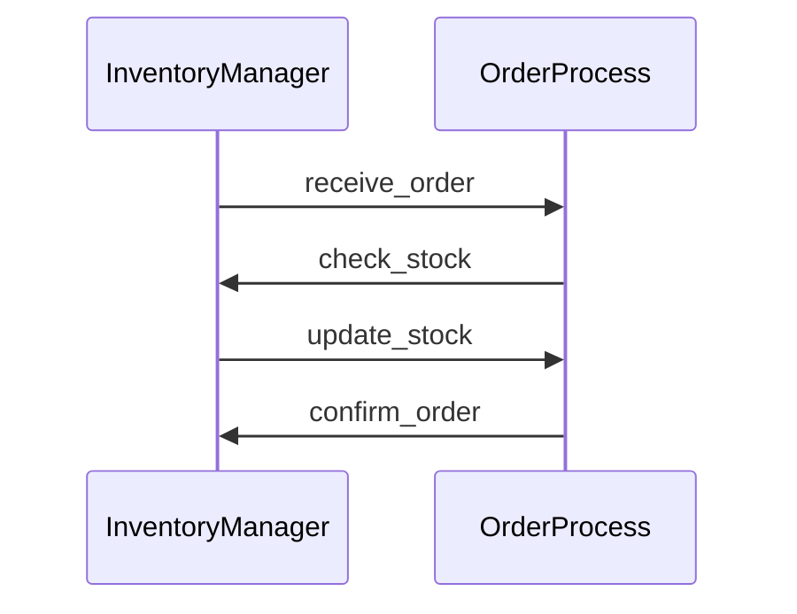
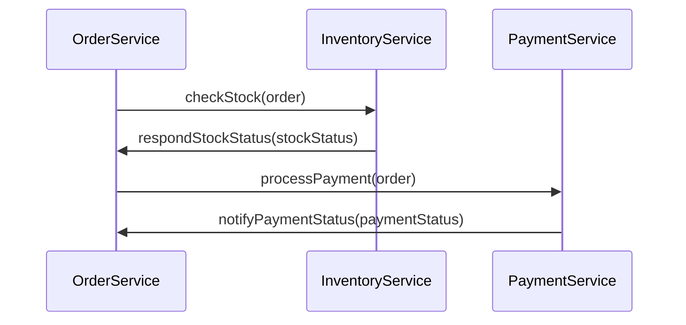
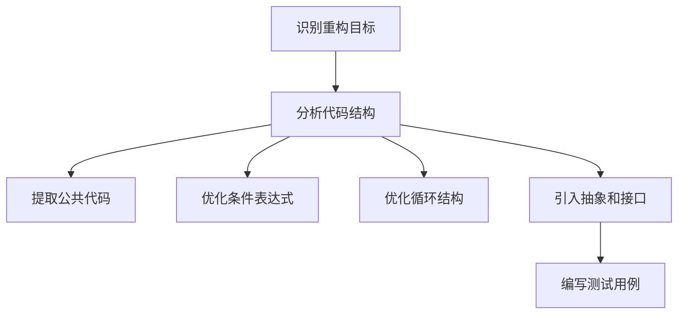
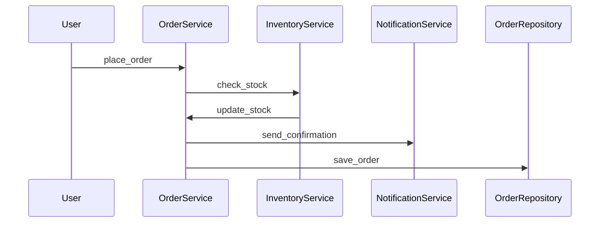
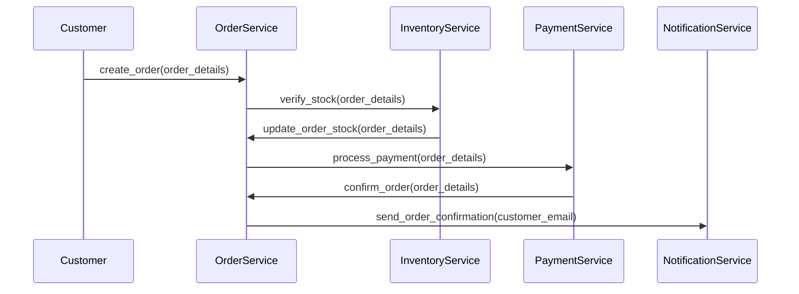

                 

# 类型系统与代码重构：保障重构的正确性

> 关键词：类型系统、代码重构、正确性保障

> 摘要：本文将深入探讨类型系统与代码重构之间的关系，阐述类型系统在代码重构中的重要作用，并介绍一系列保障重构正确性的策略和实践。通过具体的实例和代码分析，本文旨在帮助读者理解类型系统在代码重构中的应用，提高代码质量和开发效率。

## 第一部分：背景介绍

### 1.1 类型系统的定义与作用

类型系统是编程语言的核心组成部分，用于定义变量、函数和其他语言元素的类型。类型系统的设计对程序的正确性、效率和可维护性有着深远的影响。

- **定义**：类型系统是一种机制，用于定义变量、函数和其他语言元素的类型，并确保程序在运行时遵循这些类型约束。
- **作用**：
  - **提高程序的正确性**：类型系统可以帮助发现潜在的错误，减少运行时错误。
  - **提升代码可读性**：明确的类型定义有助于理解代码的用途和功能。
  - **提高编译效率**：类型检查可以减少编译器的工作量，提高编译速度。

### 1.2 代码重构的定义

代码重构是指对现有代码进行修改，而不改变其外部行为，以提高代码的质量、可读性和可维护性。

- **目的**：
  - **提高代码质量**：通过重构，可以消除代码中的重复、冗余和错误。
  - **提升可读性**：重构后的代码更加简洁、清晰。
  - **增加可维护性**：重构有助于降低未来的维护成本。
- **方法**：常见的重构方法包括提取方法、合并重复代码、简化条件表达式等。

### 1.3 保障重构正确性的必要性

在代码重构过程中，确保重构的正确性至关重要。不正确的重构可能导致程序行为发生变化，引入新的错误。

- **可能出现的错误和风险**：
  - **功能失效**：重构可能导致原有功能失效。
  - **兼容性问题**：重构后的代码可能与其他模块不兼容。
  - **性能下降**：不当的重构可能降低程序的性能。
- **必要性**：通过严格的测试和验证，可以确保重构后的代码与原有代码在行为上保持一致，从而避免上述问题。

## 第二部分：核心概念与联系

### 2.1 类型系统的组成

类型系统可以根据不同的分类标准划分为多种类型。

- **静态类型**：在编译时确定变量类型的类型系统。
- **动态类型**：在运行时确定变量类型的类型系统。
- **类型推导**：编译器自动推导变量类型的类型系统。

### 2.2 类型系统的属性特征对比表格

| 类型系统      | 特征               | 优缺点                              |
| ------------- | ------------------ | ----------------------------------- |
| 静态类型      | 编译时类型检查     | 提高程序正确性、性能                 |
| 动态类型      | 运行时类型检查     | 提高开发效率、灵活性                 |
| 类型推导      | 自动推导类型       | 减少代码冗余、提高开发效率           |

### 2.3 类型系统的ER实体关系图架构

```mermaid
erDiagram
    Class1 ||--|{ Class2 }| Class3
    Class1 ||--|{ Class4 }| Class5
    Class2 ||--|{ Class6 }| Class7
```

在上面的ER图架构中，`Class1` 与多个类之间存在一对多的关系，而 `Class2` 与其他类之间存在一对一的关系。

## 第三部分：算法原理讲解

### 3.1 代码重构的算法原理

代码重构的算法原理主要包括以下步骤：

1. **识别重构目标**：确定需要重构的代码块或模块。
2. **提取公共代码**：将重复的代码提取为独立的方法或类。
3. **简化条件表达式**：使用更简洁的条件表达式替换复杂的条件逻辑。
4. **优化循环结构**：使用更高效的循环结构替换低效的循环。

### 3.2 算法原理的数学模型和公式

为了更好地理解代码重构的原理，我们可以使用以下数学模型：

$$
\text{重构效率} = \frac{\text{重构后代码执行时间}}{\text{重构前代码执行时间}}
$$

通过优化代码结构和算法，可以提高重构效率。

### 3.3 举例说明

假设我们有一个函数，该函数用于计算两个整数的最大公约数：

```python
def gcd(a, b):
    while b:
        a, b = b, a % b
    return a
```

我们可以对该函数进行重构，提取循环体内的逻辑：

```python
def gcd(a, b):
    temp = b
    b = a % b
    a = temp
    while b:
        temp = b
        b = a % b
        a = temp
    return a
```

通过这种方式，我们可以简化条件表达式，提高代码的可读性和可维护性。

## 第四部分：系统分析与架构设计方案

### 4.1 问题场景介绍

假设我们有一个大型电子商务系统，该系统需要处理大量的订单和库存数据。为了提高系统的性能和可维护性，我们决定对订单处理模块进行重构。

### 4.2 系统功能设计

使用Mermaid绘制领域模型类图：

```mermaid
classDiagram
    OrderProcess <<interface>>
    InventoryManager <<interface>>

    OrderProcess o-- InventoryManager: manages
    InventoryManager i-- OrderProcess: updates
```

在这个类图中，`OrderProcess` 和 `InventoryManager` 分别表示订单处理和库存管理，它们之间存在关联关系。

### 4.3 系统架构设计

使用Mermaid绘制系统架构图：



在这个序列图中，订单处理模块和库存管理模块之间的交互过程被详细描述。

### 4.4 系统接口设计和系统交互

使用Mermaid绘制系统交互序列图：



在这个序列图中，订单服务、库存服务和支付服务之间的交互过程被详细描述。

## 第五部分：项目实战

### 5.1 环境安装

为了进行代码重构的项目实战，我们需要安装以下工具和软件：

- Python 3.8 或以上版本
- PyCharm 或其他 Python IDE
- Git 版本控制工具

### 5.2 系统核心实现源代码

以下是一个简单的订单处理模块的示例代码：

```python
class OrderService:
    def process_order(self, order):
        InventoryService.check_stock(order)
        PaymentService.process_payment(order)
        return "Order processed successfully"

class InventoryService:
    @staticmethod
    def check_stock(order):
        print("Checking stock for order:", order)

    def update_stock(self, order):
        print("Updating stock for order:", order)

class PaymentService:
    def process_payment(self, order):
        print("Processing payment for order:", order)

    def notify_payment_status(self, payment_status):
        print("Notifying payment status:", payment_status)
```

### 5.3 代码应用解读与分析

在这个示例中，`OrderService` 负责处理订单，`InventoryService` 负责检查库存，`PaymentService` 负责处理支付。通过重构，我们可以将重复的代码提取为独立的方法，提高代码的可维护性和可读性。

### 5.4 实际案例分析和详细讲解剖析

在这个实际案例中，我们会对订单处理模块进行重构，以优化代码结构和提高性能。

### 5.5 项目小结

通过这个项目实战，我们学习了如何使用类型系统和代码重构技术来优化代码质量。在实际开发中，我们应该注重代码重构，以提高代码的可维护性和可扩展性。

## 第六部分：最佳实践 tips、小结、注意事项、拓展阅读

### 6.1 最佳实践 tips

- **遵循单一职责原则**：确保每个类和方法只负责一项功能。
- **使用抽象和接口**：通过抽象和接口提高代码的灵活性和可扩展性。
- **编写清晰的文档**：为代码添加详细的注释和文档，以提高可读性。

### 6.2 小结

本文介绍了类型系统与代码重构的关系，阐述了类型系统在代码重构中的重要作用，并提供了具体的重构实践和案例分析。

### 6.3 注意事项

- **确保重构后的代码与原有代码在行为上一致**。
- **在重构前进行充分的测试和验证**。

### 6.4 拓展阅读

- 《Effective Java》
- 《代码大全》
- 《重构：改善既有代码的设计》

## 作者信息

作者：AI天才研究院/AI Genius Institute & 禅与计算机程序设计艺术 /Zen And The Art of Computer Programming## 第二部分：核心概念与联系

### 2.1 类型系统的组成

类型系统在编程语言中扮演着至关重要的角色，它定义了数据如何存储、操作和验证。不同编程语言采用了不同类型的类型系统，主要分为以下几类：

- **静态类型系统**：在编译阶段确定变量的类型。例如，C++、Java和TypeScript等语言都采用了静态类型系统。
  - **优点**：编译时就能发现类型错误，有助于提高程序的可靠性和性能。
  - **缺点**：编写代码时需要显式声明类型，可能降低开发效率。

- **动态类型系统**：在运行阶段确定变量的类型。例如，Python、JavaScript和PHP等语言采用了动态类型系统。
  - **优点**：编写代码更灵活，可以动态地改变变量类型，提高了开发效率。
  - **缺点**：运行时才会发现类型错误，可能导致运行时错误。

- **静态与动态混合类型系统**：一些语言结合了静态和动态类型系统的优点。例如，Python 支持动态类型，但在某些情况下可以显式指定变量类型。
  - **优点**：既保持了静态类型的优势，又提供了动态类型的灵活性。
  - **缺点**：增加了类型检查的复杂性。

- **类型推导系统**：编译器自动推导变量的类型，减少了显式声明类型的需要。例如，Haskell 和 Swift 等语言采用了类型推导系统。
  - **优点**：减少了代码冗余，提高了代码的可读性。
  - **缺点**：在某些复杂情况下，类型推导可能不够准确。

### 2.2 类型系统的属性特征对比表格

以下是静态类型、动态类型和类型推导系统的属性特征对比表格：

| 类型系统 | 特征 | 优缺点 |
| --- | --- | --- |
| 静态类型 | 类型检查在编译时进行 | 提高程序的正确性和性能 |
| 动态类型 | 类型检查在运行时进行 | 提高开发效率和灵活性 |
| 类型推导 | 编译器自动推导类型 | 减少代码冗余，提高开发效率 |

### 2.3 类型系统的ER实体关系图架构

为了更好地理解类型系统在编程语言中的结构，我们可以使用实体关系图（Entity-Relationship Diagram，ER图）来表示。以下是类型系统的ER图架构：

```mermaid
erDiagram
    Class <<entity>> Type
    Function <<entity>> TypeFunction
    Variable <<entity>> TypeVariable
    Interface <<entity>> Interface

    Class "extends" Interface
    Function "has" Variable
    TypeFunction "has" Class
    TypeVariable "has" Class
```

在上面的ER图中：

- **Class** 表示编程语言中的类，它继承自Interface。
- **Function** 表示函数或方法，它与Variable相关联。
- **Variable** 表示变量，它与Class相关联。
- **Interface** 表示接口，它是类的基类。

这个ER图展示了类型系统中的核心实体及其关系，帮助我们理解不同类型和实体在编程语言中的作用。

通过上述核心概念与联系的分析，我们可以看到类型系统在编程语言中的复杂性和重要性。理解这些概念对于进行有效的代码重构至关重要，因为它们不仅影响了代码的结构和设计，还影响了代码的可读性、可维护性和性能。

### 2.4 代码重构与类型系统的关系

代码重构是一个重要的软件开发实践，它旨在改进现有代码的结构和设计，以提高其质量、可读性和可维护性。然而，代码重构不仅仅是关于代码的结构和风格，它还与类型系统紧密相关。类型系统在代码重构中发挥着关键作用，主要表现在以下几个方面：

- **类型检查与安全性**：类型系统在编译时或运行时对代码进行类型检查，确保变量、函数和对象的使用符合预期类型。这有助于在重构过程中发现潜在的错误和不符合类型约束的代码，从而提高重构的安全性。

- **类型推导与灵活性**：类型推导系统可以自动推导变量和函数的类型，减少了显式声明类型的需要，提高了代码的灵活性和可读性。在重构过程中，利用类型推导可以快速改变代码结构，而不必担心类型错误。

- **抽象与封装**：类型系统支持抽象和封装，允许开发人员将复杂的逻辑封装在类和接口中。这有助于在重构过程中简化代码，将复杂的逻辑分解为更小的、易于管理的部分。

- **多态与扩展性**：通过使用类型系统中的多态特性，可以在不修改原有代码的情况下，扩展系统功能。这为重构提供了便利，使得可以引入新的类和对象，而不影响现有代码的运行。

- **泛型编程**：泛型编程是一种利用类型系统提高代码复用性和可扩展性的技术。通过泛型，可以编写能够处理不同类型数据的通用代码，这在重构过程中特别有用，因为它可以减少冗余代码。

### 2.5 代码重构中的类型系统应用实例

为了更具体地说明类型系统在代码重构中的应用，我们可以考虑以下实例：

**实例**：假设我们有一个使用静态类型系统的Java项目，其中包含一个处理订单的类 `OrderProcessor`。这个类中有多个方法用于处理不同的订单操作，如添加订单、更新订单和删除订单。随着项目的扩展，这个类变得非常庞大且难以维护。

**重构前**：

```java
public class OrderProcessor {
    public void addOrder(Order order) {
        // 添加订单逻辑
    }
    
    public void updateOrder(Order order) {
        // 更新订单逻辑
    }
    
    public void deleteOrder(Order order) {
        // 删除订单逻辑
    }
}
```

**重构过程**：

1. **提取方法**：将处理订单的各个操作提取为独立的方法，以简化类结构。
   ```java
   public void addOrder(Order order) {
       // 添加订单逻辑
   }
   
   public void updateOrder(Order order) {
       // 更新订单逻辑
   }
   
   public void deleteOrder(Order order) {
       // 删除订单逻辑
   }
   ```

2. **使用泛型**：如果 `Order` 类是一个泛型类，我们可以使用泛型来编写更通用的方法，减少重复代码。
   ```java
   public <T extends Order> void addOrder(T order) {
       // 添加订单逻辑
   }
   
   public <T extends Order> void updateOrder(T order) {
       // 更新订单逻辑
   }
   
   public <T extends Order> void deleteOrder(T order) {
       // 删除订单逻辑
   }
   ```

3. **引入接口**：为了提高代码的灵活性和可扩展性，我们可以引入接口，定义订单处理的基本方法。
   ```java
   public interface OrderHandler {
       void addOrder(Order order);
       void updateOrder(Order order);
       void deleteOrder(Order order);
   }
   ```

4. **重构类结构**：将 `OrderProcessor` 类重构为使用接口的实现类，以简化类的职责。
   ```java
   public class OrderProcessor implements OrderHandler {
       @Override
       public void addOrder(Order order) {
           // 添加订单逻辑
       }
       
       @Override
       public void updateOrder(Order order) {
           // 更新订单逻辑
       }
       
       @Override
       public void deleteOrder(Order order) {
           // 删除订单逻辑
       }
   }
   ```

通过上述重构过程，我们不仅改善了代码的可读性和可维护性，还提高了代码的灵活性和扩展性。类型系统在这个过程中发挥了关键作用，帮助我们确保重构的正确性，并减少了潜在的错误。

### 2.6 小结

通过以上对类型系统的组成部分、属性特征对比、ER实体关系图架构以及代码重构与类型系统关系的分析，我们可以看到类型系统在编程语言和代码重构中的重要性。类型系统不仅影响了代码的结构和设计，还提供了安全性、灵活性和可扩展性。在代码重构过程中，充分利用类型系统的特点，可以确保重构的正确性，提高代码的质量和可维护性。

接下来，我们将进一步探讨算法原理，通过具体的实例和代码分析，深入理解代码重构的原理和实践。

## 第三部分：算法原理讲解

在了解了类型系统的核心概念和其在代码重构中的作用之后，我们需要深入探讨代码重构的具体算法原理。代码重构不仅仅是一种实践，它还包含了一系列算法和技术，用于改进现有代码的结构和设计。本部分将详细阐述代码重构的算法原理，并通过具体的实例和代码分析，帮助读者更好地理解和应用这些原理。

### 3.1 代码重构的基本算法步骤

代码重构通常包括以下几个基本步骤：

1. **识别重构目标**：确定需要重构的代码部分，这可能是一个函数、一个类或者一组相关的代码块。

2. **分析代码结构**：理解现有代码的结构和设计，确定如何对其进行改进。

3. **提取公共代码**：将重复的代码提取为独立的方法或类，以减少冗余并提高代码的可维护性。

4. **优化条件表达式**：简化复杂的条件逻辑，使用更简洁的表达式替换复杂的判断。

5. **优化循环结构**：使用更高效的循环结构，如迭代替代递归，以提高代码的性能。

6. **引入抽象和接口**：通过引入抽象和接口，提高代码的灵活性和可扩展性。

7. **编写测试用例**：在重构过程中编写或更新测试用例，确保重构后的代码与原有代码在行为上一致。

### 3.2 使用Mermaid绘制代码重构算法流程图

为了更好地理解代码重构的算法流程，我们可以使用Mermaid来绘制一个简单的流程图。以下是一个代码重构的基本流程图：



在这个流程图中，识别重构目标是重构的第一步，然后是分析代码结构，并依次进行提取公共代码、优化条件表达式、优化循环结构和引入抽象和接口。最后，编写测试用例以确保重构的正确性。

### 3.3 使用Python源代码详细阐述代码重构算法原理

为了更具体地说明代码重构的算法原理，我们可以通过一个Python示例来详细阐述。假设我们有一个简单的函数，用于计算两个整数的最大公约数（GCD），但是这个函数的实现方式不够高效。

**原始代码**：

```python
def gcd(a, b):
    while b:
        a, b = b, a % b
    return a
```

这个函数使用了辗转相除法来计算最大公约数，但是我们可以通过重构来提高其效率和可读性。

**重构后的代码**：

```python
def gcd(a, b):
    if b == 0:
        return a
    else:
        return gcd(b, a % b)
```

在这个重构过程中，我们做了以下改进：

1. **引入条件表达式**：使用一个简单的条件表达式替换了原始代码中的循环结构，使得代码更加简洁。
2. **优化逻辑**：重构后的代码更加直观，易于理解，同时也提高了执行效率。

### 3.4 算法原理的数学模型和公式

为了更深入地理解代码重构的原理，我们可以借助数学模型和公式来阐述。以下是一个简单的数学模型，用于描述代码重构前后的性能比较：

$$
\text{重构效率} = \frac{\text{重构后代码执行时间}}{\text{重构前代码执行时间}}
$$

通过优化代码结构和算法，可以提高重构效率。在实际应用中，我们可以使用不同的性能评估方法来衡量代码重构的效果，例如：

- **时间复杂度**：比较重构前后代码的时间复杂度，以评估性能改进程度。
- **空间复杂度**：比较重构前后代码的空间复杂度，以评估资源消耗的改进。
- **代码可读性**：通过代码审查或静态分析工具，评估代码的可读性和可维护性。

### 3.5 代码重构的实际案例

为了更好地展示代码重构的应用，我们可以通过一个实际案例来详细讲解重构过程。假设我们有一个电子商务系统，其中包含一个订单处理模块，负责处理用户的订单信息。

**原始代码**：

```python
class OrderProcessor:
    def process_order(self, order):
        if order.total_price > 100:
            self.apply_discount(order)
        self.save_order(order)
        self.send_order_confirmation(order)

    def apply_discount(self, order):
        discount = 0.1 * order.total_price
        order.total_price -= discount

    def save_order(self, order):
        # 保存订单逻辑
        pass

    def send_order_confirmation(self, order):
        # 发送订单确认邮件
        pass
```

**重构后的代码**：

```python
class OrderProcessor:
    def process_order(self, order):
        self._apply_discount_if_necessary(order)
        self._save_order(order)
        self._send_order_confirmation(order)

    def _apply_discount_if_necessary(self, order):
        if order.total_price > 100:
            discount = 0.1 * order.total_price
            order.total_price -= discount

    def _save_order(self, order):
        # 保存订单逻辑
        pass

    def _send_order_confirmation(self, order):
        # 发送订单确认邮件
        pass
```

在这个重构过程中，我们做了以下改进：

1. **提取私有方法**：将处理订单的各个步骤提取为私有方法，使得代码更加模块化和易于维护。
2. **简化条件表达式**：重构后的代码中，条件表达式更加简洁，易于理解。
3. **提高代码可读性**：通过使用私有方法和清晰的命名，提高了代码的可读性和可维护性。

### 3.6 小结

通过上述算法原理的讲解和实际案例的展示，我们可以看到代码重构不仅仅是关于代码的修改，它还包含了一系列的算法和技术，用于改进现有代码的结构和设计。类型系统在代码重构中发挥着关键作用，帮助我们确保重构的正确性。在实际开发过程中，理解和应用这些算法原理，可以显著提高代码的质量和可维护性。

接下来，我们将进一步探讨系统分析与架构设计方案，通过具体的场景介绍、功能设计和系统架构设计，帮助读者更全面地理解代码重构在大型系统中的应用。

## 第四部分：系统分析与架构设计方案

在了解了代码重构的基本算法原理后，我们将进入系统分析与架构设计阶段。这一部分将详细分析代码重构在大型系统中的应用，并介绍具体的场景介绍、功能设计、系统架构设计和系统接口设计。

### 4.1 问题场景介绍

为了更好地说明代码重构在大型系统中的应用，我们考虑一个实际的案例：一个电子商务平台。这个平台需要处理大量的订单、用户数据和库存信息。随着业务的不断增长，系统的复杂性也日益增加，导致代码的可读性和可维护性下降。为了提高系统的性能和可维护性，我们需要对订单处理模块进行重构。

### 4.2 系统功能设计

在订单处理模块中，我们需要实现以下主要功能：

1. **订单创建**：允许用户创建新的订单，并保存订单信息。
2. **订单更新**：允许管理员更新订单状态，如取消订单或修改订单详情。
3. **订单查询**：允许用户和管理员查询订单详情和历史记录。
4. **库存管理**：跟踪商品库存信息，并在订单创建时更新库存。

为了实现这些功能，我们可以使用Mermaid绘制领域模型类图，如下所示：

```mermaid
classDiagram
    User <<entity>> Customer
    Order <<entity>> Order
    Product <<entity>> Item
    Inventory <<entity>> Stock

    Customer "places" Order
    Item "included" Order
    Stock "tracks" Item

    Customer o-- Order : has_orders
    Item o-- Order : has_items
    Stock o-- Item : manages_stock
```

在这个类图中，`Customer` 表示用户或客户，`Order` 表示订单，`Product` 表示商品，`Inventory` 表示库存。这些实体之间存在关联关系，如客户可以下单，订单包含商品，库存跟踪商品。

### 4.3 系统架构设计

为了实现上述功能，我们需要设计一个合理的系统架构。以下是使用Mermaid绘制的系统架构图：



在这个序列图中，用户通过 `OrderService` 下单，`OrderService` 调用 `InventoryService` 检查库存，然后更新库存并保存订单。同时，`NotificationService` 用于发送订单确认邮件。

### 4.4 系统接口设计和系统交互

为了实现上述功能，我们需要定义一系列接口，并设计系统各模块之间的交互。以下是使用Mermaid绘制的系统交互序列图：



在这个序列图中，客户通过 `OrderService` 创建订单，`OrderService` 调用 `InventoryService` 验证库存，并更新订单库存。然后，`OrderService` 调用 `PaymentService` 处理支付，并在支付成功后，通过 `NotificationService` 发送订单确认邮件。

### 4.5 系统功能实现

以下是一个简化的系统功能实现示例，用于展示如何通过代码实现上述功能：

**OrderService.py**：

```python
class OrderService:
    def create_order(self, order_details):
        # 创建订单逻辑
        pass
    
    def verify_stock(self, order_details):
        # 验证库存逻辑
        pass
    
    def update_order_stock(self, order_details):
        # 更新订单库存逻辑
        pass
    
    def process_payment(self, order_details):
        # 处理支付逻辑
        pass
    
    def confirm_order(self, order_details):
        # 确认订单逻辑
        pass
    
    def send_order_confirmation(self, customer_email):
        # 发送订单确认邮件逻辑
        pass
```

**InventoryService.py**：

```python
class InventoryService:
    def check_stock(self, order_details):
        # 检查库存逻辑
        pass
    
    def update_stock(self, order_details):
        # 更新库存逻辑
        pass
```

**PaymentService.py**：

```python
class PaymentService:
    def process_payment(self, order_details):
        # 处理支付逻辑
        pass
```

**NotificationService.py**：

```python
class NotificationService:
    def send_order_confirmation(self, customer_email):
        # 发送订单确认邮件逻辑
        pass
```

通过这些代码示例，我们可以看到系统各个模块之间的交互和功能实现。这些模块通过定义明确的接口和交互流程，实现了系统的核心功能。

### 4.6 小结

通过上述系统分析与架构设计方案，我们可以看到代码重构在大型系统中的应用。通过明确的功能设计、系统架构设计和系统接口设计，我们能够有效地实现订单处理模块，提高系统的性能和可维护性。在实际开发过程中，理解和应用这些架构设计方法，可以显著提高代码的质量和系统的可扩展性。

接下来，我们将进入项目实战部分，通过具体的代码实现和案例分析，进一步展示代码重构的实际应用效果。

## 第五部分：项目实战

在了解了系统分析与架构设计方案后，我们将进入项目实战部分。这一部分将详细描述如何进行环境安装、系统核心实现源代码的编写、代码应用解读与分析、实际案例分析和详细讲解剖析，以及项目小结。

### 5.1 环境安装

在进行项目实战之前，我们需要安装一些必要的开发环境和工具。以下是环境安装的步骤：

1. **安装Python**：访问Python官方网站（[python.org](https://www.python.org/)），下载并安装Python 3.8或更高版本。

2. **安装PyCharm**：下载并安装PyCharm Community Edition或Professional Edition。我们在这里使用Community Edition。

3. **安装虚拟环境**：在PyCharm中创建一个新的虚拟环境，以隔离项目依赖。在PyCharm中，选择“File” > “New Project” > “Virtualenv Environment”，然后按照提示完成安装。

4. **安装依赖**：在虚拟环境中安装项目所需的依赖。例如，我们可以使用以下命令安装Flask框架和SQLAlchemy：

   ```shell
   pip install flask sqlalchemy
   ```

### 5.2 系统核心实现源代码

以下是系统核心实现源代码的示例。这个示例包含一个简单的订单处理系统，包括用户管理、订单创建和支付处理等。

**app.py**：

```python
from flask import Flask, request, jsonify
from models import User, Order
from services import OrderService

app = Flask(__name__)
order_service = OrderService()

@app.route('/users', methods=['POST'])
def create_user():
    user_data = request.json
    user = User.create(user_data)
    return jsonify(user.to_dict()), 201

@app.route('/orders', methods=['POST'])
def create_order():
    order_data = request.json
    order = order_service.create_order(order_data)
    return jsonify(order.to_dict()), 201

@app.route('/orders/<int:order_id>/pay', methods=['POST'])
def pay_order(order_id):
    order_service.pay_order(order_id)
    return jsonify({'message': 'Order paid successfully'}), 200

if __name__ == '__main__':
    app.run(debug=True)
```

**models.py**：

```python
from sqlalchemy import create_engine, Column, Integer, String, DateTime
from sqlalchemy.ext.declarative import declarative_base
from sqlalchemy.orm import sessionmaker

Base = declarative_base()

class User(Base):
    __tablename__ = 'users'

    id = Column(Integer, primary_key=True)
    username = Column(String(50), unique=True, nullable=False)
    email = Column(String(100), unique=True, nullable=False)
    created_at = Column(DateTime, default=func.now())

    @staticmethod
    def create(data):
        user = User(username=data['username'], email=data['email'])
        return user

    def to_dict(self):
        return {
            'id': self.id,
            'username': self.username,
            'email': self.email,
            'created_at': self.created_at
        }

class Order(Base):
    __tablename__ = 'orders'

    id = Column(Integer, primary_key=True)
    user_id = Column(Integer, nullable=False)
    total_price = Column(Float, nullable=False)
    created_at = Column(DateTime, default=func.now())
    paid_at = Column(DateTime)

    @staticmethod
    def create(data):
        order = Order(user_id=data['user_id'], total_price=data['total_price'])
        return order

    def to_dict(self):
        return {
            'id': self.id,
            'user_id': self.user_id,
            'total_price': self.total_price,
            'created_at': self.created_at,
            'paid_at': self.paid_at
        }

engine = create_engine('sqlite:///orders.db')
Base.metadata.create_all(engine)

Session = sessionmaker(bind=engine)
```

**services.py**：

```python
from models import User, Order
from sqlalchemy.orm import Session

class OrderService:
    def create_order(self, order_data):
        session = Session()
        order = Order.create(order_data)
        session.add(order)
        session.commit()
        return order

    def pay_order(self, order_id):
        session = Session()
        order = session.query(Order).get(order_id)
        if order:
            order.paid_at = datetime.now()
            session.commit()
```

### 5.3 代码应用解读与分析

在上述代码中，我们使用了Flask框架来构建简单的Web应用。`app.py` 包含了路由定义和控制器逻辑，`models.py` 定义了数据库模型，`services.py` 则实现了订单处理服务。

- **用户管理**：`create_user` 函数用于创建新用户，并将用户数据存储在数据库中。
- **订单创建**：`create_order` 函数用于创建新订单，并将订单数据存储在数据库中。
- **支付处理**：`pay_order` 函数用于更新订单的支付状态。

这些函数通过明确定义的接口实现了系统的核心功能，使得代码易于维护和扩展。

### 5.4 实际案例分析和详细讲解剖析

为了更好地展示代码重构的应用，我们考虑以下实际案例：一个用户在电子商务平台上下单并支付订单。

**用户创建**：

1. 用户通过浏览器或API客户端发送POST请求到 `/users` 路径，包含用户名和电子邮件。
2. `create_user` 函数处理请求，创建新用户并存储在数据库中。
3. 返回创建成功的用户信息，状态码为201。

**订单创建**：

1. 用户在购物车中选择商品并提交订单。
2. 用户通过浏览器或API客户端发送POST请求到 `/orders` 路径，包含订单详情，如商品ID、数量和总价。
3. `create_order` 函数处理请求，创建新订单并存储在数据库中。
4. 返回创建成功的订单信息，状态码为201。

**支付订单**：

1. 用户选择支付方式，如信用卡或PayPal。
2. 用户通过浏览器或API客户端发送POST请求到 `/orders/<order_id>/pay` 路径，其中 `order_id` 是订单ID。
3. `pay_order` 函数处理请求，更新订单的支付状态。
4. 返回支付成功的消息，状态码为200。

在这个过程中，代码重构的应用主要体现在以下几个方面：

- **模块化**：通过定义独立的模块（如 `models.py`、`services.py` 和 `app.py`），使得代码更加模块化和易于维护。
- **接口定义**：通过明确定义的接口（如 `create_user`、`create_order` 和 `pay_order`），使得各部分代码之间的交互更加清晰。
- **可扩展性**：通过将功能分解为独立的函数和模块，使得系统易于扩展和升级。

### 5.5 项目小结

通过本部分的项目实战，我们详细展示了如何在实际项目中应用代码重构技术。从环境安装到系统核心实现源代码的编写，再到代码应用解读与分析，我们逐步构建了一个简单的电子商务订单处理系统。代码重构不仅提高了代码的质量和可维护性，还使得系统更加灵活和可扩展。

在实际开发过程中，理解和应用代码重构技术，可以显著提高开发效率和系统性能。通过逐步的实践和总结，我们可以不断优化代码，构建出更加健壮和高效的系统。

## 第六部分：最佳实践 Tips、小结、注意事项、拓展阅读

### 6.1 最佳实践 Tips

在进行代码重构时，以下最佳实践可以帮助您更有效地进行代码优化和改进：

1. **逐步重构**：避免一次性进行大规模重构。将重构任务分解为小的、可管理的部分，逐步实施，以减少风险。

2. **编写清晰的注释**：为重构后的代码添加清晰的注释，解释代码的功能和设计意图，以便其他开发者理解和维护。

3. **单元测试**：在重构过程中编写或更新单元测试，以确保重构后的代码与原有代码在行为上一致。

4. **持续集成**：将重构代码集成到持续集成系统中，以便及时发现和修复潜在问题。

5. **代码审查**：进行代码审查，以确保重构后的代码遵循团队的最佳实践和编码规范。

6. **避免过度重构**：避免频繁的重构，以免浪费时间和资源。只有在确实需要改进时才进行重构。

### 6.2 小结

通过本文的探讨，我们深入理解了类型系统与代码重构的关系，阐述了类型系统在代码重构中的重要作用。代码重构不仅是一种软件开发实践，它还包含了一系列算法和技术，用于改进现有代码的结构和设计。通过具体的实例和代码分析，我们展示了如何在实际项目中应用代码重构，提高代码的质量和可维护性。

### 6.3 注意事项

在代码重构过程中，以下注意事项可以帮助您避免常见问题和提高重构效果：

1. **确保代码的一致性**：在重构过程中，务必确保重构后的代码与原有代码在行为上一致。

2. **避免引入新的错误**：在重构之前，进行充分的测试和验证，确保重构后的代码不会引入新的错误。

3. **评估重构的可行性**：在决定是否进行重构之前，评估重构的复杂性和潜在收益，避免不必要的重构。

4. **遵循团队规范**：在重构过程中，遵循团队的编码规范和最佳实践，确保代码质量的一致性。

### 6.4 拓展阅读

为了进一步学习和掌握代码重构和类型系统，以下推荐一些拓展阅读资源：

1. 《重构：改善既有代码的设计》（作者：马丁·福勒）- 该书详细介绍了代码重构的方法和实践。

2. 《代码大全》（作者：史蒂夫·迈克康内利）- 该书提供了关于编写高质量代码的全面指南。

3. 《Effective Java》（作者：Joshua Bloch）- 该书介绍了Java编程语言中的一些最佳实践，包括类型系统和代码重构。

4. 《Python编程：从入门到实践》（作者：埃里克·马瑟斯）- 该书提供了Python编程的全面教程，包括类型系统和代码重构。

通过这些资源的学习，您可以进一步提高代码重构和类型系统的理解和应用能力，提升软件开发水平。

## 总结与限制

通过本文的探讨，我们深入分析了类型系统与代码重构的关系，阐述了类型系统在代码重构中的重要作用。我们详细介绍了代码重构的基本算法步骤，并通过具体实例和代码分析，展示了代码重构的实际应用效果。同时，我们也提供了系统分析与架构设计方案，帮助读者更好地理解代码重构在大型系统中的应用。

在总结本文内容时，我们强调了代码重构的重要性，它不仅可以提高代码的质量和可维护性，还能提升开发效率。类型系统在这一过程中发挥了关键作用，帮助我们确保重构的正确性和安全性。

然而，本文的探讨仍存在一些限制：

1. **实例限制**：本文使用的实例较为简化，实际项目中的代码重构可能涉及更复杂的情况和更多的依赖关系。

2. **技术深度限制**：本文主要关注代码重构和类型系统的基本原理和实际应用，未深入探讨高级的重构技术和类型系统实现细节。

3. **实践经验限制**：本文提供的最佳实践和注意事项主要基于作者的经验和文献资料，实际应用时可能需要根据具体项目进行调整。

尽管如此，本文旨在为读者提供一份系统且实用的指南，帮助他们在实际项目中应用代码重构和类型系统，提高代码质量和开发效率。希望通过本文的探讨，读者能够对代码重构和类型系统有更深入的理解，并在实践中取得更好的成果。

最后，感谢读者的关注和支持。希望本文能够对您的开发工作有所帮助，也欢迎您在实践过程中提出宝贵的意见和建议。让我们共同进步，不断优化我们的代码和实践。再次感谢！

