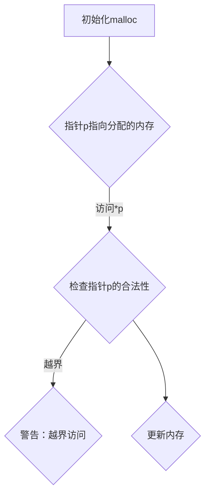
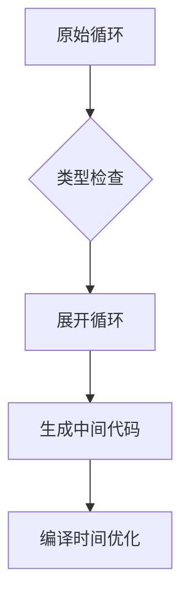
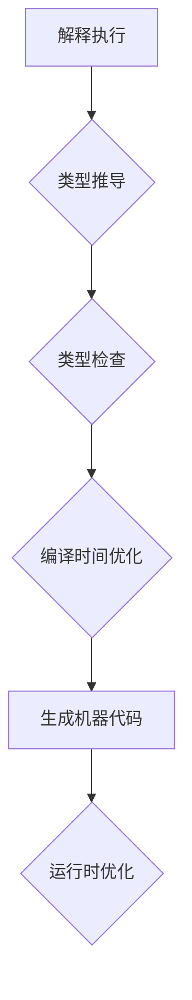
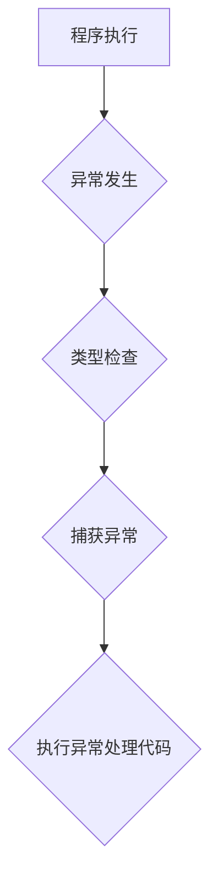
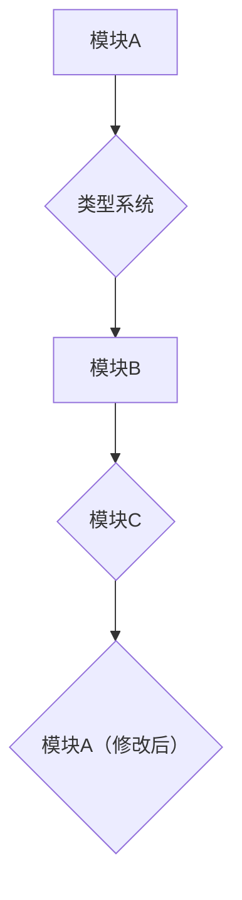

                 


### 《类型系统与程序变换技术的关系》

#### 关键词：
类型系统、程序变换、类型推导、类型检查、抽象解释、优化技术

#### 摘要：
本文深入探讨了类型系统与程序变换技术之间的关系。类型系统是编程语言的核心组成部分，它确保了程序的正确性和可靠性。而程序变换技术则是对程序进行一系列操作，以优化性能或适应不同需求。本文将逐步分析这两个概念的基本概念、实际应用、相互影响，并通过案例展示其在现代软件开发中的重要性。

#### 目录大纲

## 第一部分：引言

### 1.1 问题背景

类型系统和程序变换技术在现代编程中扮演着至关重要的角色。类型系统确保了代码的稳定性和可预测性，而程序变换技术则帮助我们优化代码、提高性能、适应不同的编程环境和需求。

### 1.2 问题描述

本文的主要问题是理解类型系统与程序变换技术之间的关系，以及它们如何相互影响和作用。

### 1.3 问题解决

通过逐步分析类型系统和程序变换技术的核心概念、应用场景、影响和相互关系，本文旨在提供一个全面而深入的理解。

### 1.4 边界与外延

本文将重点关注编程语言中的类型系统和程序变换技术，不涉及更广泛的语言理论或软件开发实践。

### 1.5 概念结构与核心要素组成

本文的核心结构包括对类型系统和程序变换技术的介绍、详细分析以及案例分析。

## 第二部分：类型系统

### 2.1 类型系统的基本概念

类型系统定义了编程语言中数据类型的集合以及它们之间的相互关系。基本概念包括数据类型、类型约束和类型推导。

### 2.2 类型系统的层次结构

类型系统通常分为层次结构，如基础类型、复合类型和特殊类型。层次结构有助于理解和处理复杂的数据类型。

### 2.3 类型系统的分类

类型系统可以按照不同的标准进行分类，如静态类型和动态类型、强类型和弱类型等。

## 第三部分：程序变换技术

### 3.1 程序变换技术概述

程序变换技术是对程序进行的一系列操作，以优化性能、适应不同环境或提高可维护性。基本概念包括抽象解释、优化技术和代码生成等。

### 3.2 程序变换技术的分类

程序变换技术可以分为不同的类别，如编译时间变换和运行时变换、局部变换和全局变换等。

### 3.3 程序变换技术的应用领域

程序变换技术广泛应用于编译器设计、代码优化、语言扩展和软件开发等领域。

## 第四部分：类型推导

### 4.1 类型推导的基本原理

类型推导是编译器自动推导变量类型的过程。基本原理包括类型推断算法和类型约束的传播。

### 4.2 强类型推导

强类型推导确保变量在特定上下文中只能使用合适的值。它与类型检查密切相关。

### 4.3 弱类型推导

弱类型推导允许更广泛的类型转换，可能牺牲一些安全性和可靠性。

## 第五部分：类型检查

### 5.1 类型检查的基本概念

类型检查是编译器验证程序中所有表达式和语句的类型是否一致的过程。

### 5.2 静态类型检查

静态类型检查在编译时进行，确保程序在整个执行过程中不会发生类型错误。

### 5.3 动态类型检查

动态类型检查在运行时进行，更灵活但也可能导致运行时错误。

## 第六部分：类型错误与异常处理

### 6.1 类型错误的分类

类型错误可以分为不同的类别，如类型不匹配、未声明的类型等。

### 6.2 类型错误的检测与修复

类型错误的检测和修复是确保程序正确性的关键步骤。

### 6.3 异常处理

异常处理是处理程序运行时错误的有效方法。

## 第七部分：程序变换与类型系统的关系

### 7.1 程序变换对类型系统的影响

程序变换可能会影响类型系统的行为和验证。

### 7.2 类型系统对程序变换的限制

类型系统对程序变换施加一些限制，以确保类型安全。

### 7.3 程序变换与类型系统的协同作用

类型系统和程序变换技术可以相互协作，提高程序的性能和可维护性。

## 第八部分：案例分析

### 8.1 案例分析一

分析一个实际的编程场景，展示类型系统与程序变换技术如何相互影响。

### 8.2 案例分析二

分析另一个实际的编程场景，深入探讨类型推导和类型检查。

### 8.3 案例分析三

分析一个涉及程序变换的复杂编程场景，展示类型系统和程序变换技术的协同作用。

## 第九部分：总结与展望

### 9.1 总结

回顾本文的主要内容和关键观点。

### 9.2 存在的问题与挑战

讨论当前类型系统和程序变换技术面临的问题和挑战。

### 9.3 未来发展趋势

展望类型系统和程序变换技术的未来发展方向。

### 9.4 结论

总结全文，强调类型系统和程序变换技术对现代软件开发的重要性。

### 参考文献

列出本文引用的相关文献和参考资料。

## 作者

作者：AI天才研究院/AI Genius Institute & 禅与计算机程序设计艺术 /Zen And The Art of Computer Programming

---

这篇文章的框架已经构建完毕，接下来我们将逐步填充每个章节的内容，确保文章的深度、广度和逻辑性。我们将详细讲解类型系统和程序变换技术的核心概念，通过具体的例子和数学模型来阐述它们的工作原理，并分析它们在现代软件开发中的实际应用。最后，我们将通过实际案例分析来巩固我们对这些概念的理解，并展望未来可能的发展方向。让我们开始深入思考吧！### 第一部分：引言

在现代软件工程中，类型系统和程序变换技术是两个核心的概念，它们对程序的正确性、可维护性和性能优化起着至关重要的作用。类型系统为编程语言提供了数据类型的定义，确保了程序在运行时能够按照预期的方式处理数据，从而提高程序的安全性和可靠性。而程序变换技术则是通过对程序进行一系列的转换和优化，使程序能够更高效地执行，满足不同的需求和环境。

首先，类型系统是一个编程语言的核心特性，它定义了语言中数据类型的集合以及这些类型之间的关系。类型系统的存在不仅有助于提高程序的正确性，还能够帮助编译器在编译过程中发现潜在的错误，从而减少运行时错误的发生。通过类型系统，编译器能够确保变量在使用时类型匹配，表达式结果类型正确，函数调用参数和返回值类型一致等。

程序变换技术则是在编译器或解释器中广泛使用的一类技术，它通过一系列的转换和优化来改善程序的执行效率。程序变换技术包括代码生成、代码优化、抽象解释等，它们在编译器设计、性能优化、代码生成等方面有着广泛的应用。例如，编译器可以通过抽象解释技术来预判程序的执行路径和性能，从而生成更高效的机器代码。

本文的主要目标是深入探讨类型系统和程序变换技术之间的关系，分析它们如何相互影响，并在实际编程中应用。文章将从以下几个方面展开：

1. **背景介绍**：介绍类型系统和程序变换技术的起源、发展和重要性。
2. **类型系统**：详细探讨类型系统的基本概念、层次结构、分类，以及类型推导和类型检查的相关内容。
3. **程序变换技术**：介绍程序变换技术的定义、分类、应用领域，重点讨论抽象解释和优化技术。
4. **类型推导和类型检查**：解释类型推导和类型检查的基本原理，分析它们在实际编程中的应用和重要性。
5. **类型错误与异常处理**：讨论类型错误的分类、检测与修复方法，以及异常处理的基本概念。
6. **程序变换与类型系统的关系**：探讨程序变换对类型系统的影响，以及类型系统对程序变换的限制。
7. **案例分析**：通过实际案例，展示类型系统和程序变换技术的应用和相互关系。
8. **总结与展望**：总结全文，讨论未来发展趋势，强调类型系统和程序变换技术的重要性。

通过这篇文章，读者将能够系统地了解类型系统和程序变换技术的基本概念、原理和应用，从而更好地理解和应用这些技术，提高软件开发的质量和效率。接下来，我们将逐步深入每个章节，详细探讨这些主题。

### 第一部分：引言

#### 1.1 问题背景

类型系统和程序变换技术是现代编程语言设计和编译器实现中不可或缺的两个概念。类型系统最早起源于早期的编程语言，如ALGOL和Simula，其目的是通过明确数据的类型来提高程序的正确性和可读性。随着编程语言的不断发展和复杂性的增加，类型系统也变得更加复杂和精细，以适应不同编程场景和需求。

程序变换技术的起源可以追溯到编译技术的早期发展，当时的研究者发现，通过一系列的转换和优化，可以生成更高效、更可靠的程序代码。从最初的简单代码生成和优化，到现代复杂的抽象解释和优化算法，程序变换技术经历了长足的发展。随着编译器技术的不断进步，程序变换技术在编译器设计和性能优化中扮演着越来越重要的角色。

在当前软件开发中，类型系统和程序变换技术的重要性体现在以下几个方面：

1. **程序正确性**：类型系统通过定义严格的数据类型约束，确保程序在编译和运行过程中不会出现数据类型不匹配的错误。这有助于提高程序的正确性和稳定性。

2. **性能优化**：程序变换技术通过对程序代码进行各种优化，如循环展开、代码生成等，可以显著提高程序的执行效率。这有助于提升应用程序的性能和响应速度。

3. **代码可维护性**：类型系统和程序变换技术有助于提高代码的可读性和可维护性。通过明确的类型定义和优化后的代码结构，开发者可以更轻松地理解和修改代码。

4. **语言扩展性**：类型系统为编程语言提供了灵活的扩展机制，使得开发者可以定义新的数据类型和操作，从而满足特定的编程需求。

#### 1.2 问题描述

在当前的软件开发中，类型系统和程序变换技术面临着一系列挑战和问题。首先，类型系统的设计和实现需要平衡安全性、性能和灵活性。过于严格的类型系统可能会导致代码复杂性和开发效率的降低，而过于宽松的类型系统则可能引入安全性和稳定性问题。

其次，程序变换技术的实现和优化也是一个复杂的过程。不同的编程场景和需求可能需要不同的变换策略和优化算法，这使得编译器设计变得更加复杂和多样化。同时，程序变换技术需要在保证代码正确性的前提下，尽可能提高执行效率，这需要深入理解程序的行为和性能瓶颈。

另外，类型系统和程序变换技术的协同作用也是当前研究的一个重要方向。如何有效地结合类型系统的类型检查和程序变换技术的优化，使得编译器能够生成高效且安全的代码，是一个具有挑战性的问题。

综上所述，类型系统和程序变换技术是现代软件开发中两个核心概念，它们在确保程序正确性、性能优化和代码可维护性方面起着至关重要的作用。然而，在设计和实现过程中，它们也面临着一系列挑战和问题，需要进一步的研究和优化。

#### 1.3 问题解决

为了解决上述问题，本文提出了一系列的解决方案和思考方向：

1. **类型系统的优化**：通过引入更灵活的类型系统设计，如基于依赖类型的系统，可以在保证安全性的同时提高代码的可读性和可维护性。依赖类型系统允许类型之间的依赖关系被明确表达，从而减少类型约束的复杂度。

2. **程序变换技术的改进**：采用更先进的优化算法，如基于程序语义的分析和优化技术，可以进一步提高代码的执行效率。这些算法通过对程序行为的深入分析，可以生成更加高效的代码。

3. **类型系统和程序变换技术的协同**：通过深入研究和实践，探索如何有效地结合类型系统的类型检查和程序变换技术的优化，以提高编译器的整体性能和代码质量。例如，可以在类型检查过程中引入优化策略，或在优化过程中考虑类型系统的约束。

4. **面向未来的编程语言设计**：在设计和实现新的编程语言时，充分考虑类型系统和程序变换技术的要求，构建更加灵活和高效的语言架构。例如，引入模块化设计，使得开发者可以根据不同的需求和场景选择合适的类型系统和程序变换技术。

通过上述解决方案和思考方向，本文旨在为类型系统和程序变换技术的研究和实践提供一些新的思路和方向，以推动现代软件开发技术的不断进步。

#### 1.4 边界与外延

在深入探讨类型系统和程序变换技术之前，明确这两个概念的应用边界和范围是非常重要的。类型系统主要关注编程语言中数据类型的定义和操作，确保程序的正确性和可靠性。其应用边界包括：

1. **编译时类型检查**：类型系统通常在编译时进行类型检查，以确保所有变量和表达式在编译时都具有正确的类型。这有助于提前发现并修复潜在的错误，从而减少运行时错误的发生。

2. **动态类型检查**：一些编程语言也支持动态类型检查，这通常在程序运行时进行。动态类型检查可以在一定程度上提高程序的灵活性和可维护性，但可能会牺牲一些性能。

3. **类型推导和类型推断**：类型系统通常包括类型推导和类型推断机制，用于自动推导变量或表达式的类型。这对于提高代码的可读性和可维护性具有重要意义。

4. **类型安全的编程**：类型系统的设计旨在确保类型安全，即程序中所有类型转换都是合法且安全的。类型安全有助于提高程序的正确性和稳定性。

程序变换技术则关注如何通过对程序代码进行变换和优化，提高其性能和可维护性。其应用边界包括：

1. **编译时间和运行时变换**：程序变换技术可以在编译时进行，如编译器优化和代码生成，也可以在运行时进行，如动态优化和垃圾回收。

2. **抽象解释**：抽象解释是一种静态程序分析技术，通过对程序语义的抽象和简化，生成程序执行的可能路径和性能预测。抽象解释在编译器优化和性能分析中具有广泛应用。

3. **代码优化**：程序变换技术包括各种代码优化算法，如循环展开、代码生成、内存分配优化等。这些优化技术旨在提高程序的执行效率。

4. **模块化设计**：程序变换技术也关注如何通过模块化设计，将复杂程序分解为可重用的组件，提高代码的可维护性和可扩展性。

明确类型系统和程序变换技术的应用边界和范围，有助于我们在设计和实现相关技术时，更好地理解和应用这些概念，从而提高程序的正确性、性能和可维护性。

#### 1.5 概念结构与核心要素组成

类型系统和程序变换技术是现代编程语言设计和编译器实现中的两个核心概念，它们各自包含多个基本概念和核心要素，共同构成了一个复杂的系统。

**类型系统**

1. **基本概念**：

   - **数据类型**：数据类型定义了编程语言中可以使用的值的集合和操作。常见的数据类型包括整数、浮点数、布尔值、字符串等。
   - **类型约束**：类型约束定义了变量或表达式可以接受哪些类型的值。类型约束有助于确保程序的正确性和安全性。
   - **类型推导**：类型推导是编译器自动推导变量类型的过程。类型推导可以简化代码，提高可读性和可维护性。

2. **核心要素**：

   - **类型层次结构**：类型层次结构定义了不同数据类型之间的关系。例如，在C语言中，整数类型之间可以相互转换。
   - **类型系统分类**：类型系统可以根据类型约束的严格性进行分类，如静态类型系统和动态类型系统。
   - **类型检查**：类型检查是编译器验证程序中所有表达式和语句的类型是否一致的过程。类型检查有助于发现潜在的错误。

**程序变换技术**

1. **基本概念**：

   - **程序变换**：程序变换是对程序代码进行的一系列操作，以优化性能、提高可维护性或适应不同环境。
   - **抽象解释**：抽象解释是一种静态程序分析技术，通过对程序语义的抽象和简化，生成程序执行的可能路径和性能预测。
   - **代码优化**：代码优化是通过各种算法和策略，改进程序代码的结构和执行效率，以提高性能。

2. **核心要素**：

   - **变换分类**：程序变换可以分为编译时间变换和运行时变换，局部变换和全局变换等。
   - **优化技术**：优化技术包括代码生成、循环展开、内存分配优化等，旨在提高程序的执行效率。
   - **抽象语义**：抽象语义是程序变换的基础，通过抽象语义模型，编译器可以生成高效且安全的代码。

通过这些基本概念和核心要素，类型系统和程序变换技术共同构建了一个强大且灵活的编程语言环境，为现代软件开发提供了坚实的基础。

### 第二部分：类型系统

#### 2.1 类型系统的基本概念

类型系统是编程语言的核心组成部分，它为编程语言提供了数据类型的定义和操作规则。类型系统的主要目的是确保程序的正确性、可靠性和效率。通过明确数据类型及其操作，类型系统能够帮助编译器在编译和运行时检测潜在的错误，从而减少程序的bug和提高程序的可维护性。

**数据类型**

数据类型是类型系统中最基本的概念，它定义了编程语言中可以使用的值的集合和操作。常见的编程语言如C、Java和Python都定义了多种基本数据类型，如整数、浮点数、布尔值和字符串等。数据类型可以按照不同的维度进行分类，如按值类型和引用类型、按静态类型和动态类型等。

**类型约束**

类型约束是类型系统的重要组成部分，它定义了变量或表达式可以接受的值的范围。类型约束有助于确保程序的正确性和安全性。例如，在一个函数中，如果参数的类型被指定为整数类型，那么传入的参数必须是整数，否则将引发类型错误。

**类型推导**

类型推导是编译器自动推导变量类型的过程。类型推导可以简化代码，提高可读性和可维护性。编译器通过分析表达式和语句的语法结构，结合类型约束和类型层次结构，自动推导出变量的类型。类型推导可以分为静态类型推导和动态类型推导。静态类型推导在编译时完成，而动态类型推导在运行时完成。

#### 2.2 类型系统的层次结构

类型系统的层次结构定义了不同数据类型之间的关系。这种层次结构有助于理解数据类型的相互转换和操作，同时也便于编译器进行类型检查和优化。常见的类型系统层次结构包括：

**基本类型**

基本类型是最简单的数据类型，如整数（Int）、浮点数（Float）和布尔值（Bool）等。这些类型通常直接对应于计算机硬件的基本数据类型。

**复合类型**

复合类型是由基本类型组合而成的，如数组（Array）、结构体（Struct）和类（Class）等。复合类型允许程序员以更抽象的方式组织和操作数据。

**引用类型**

引用类型是指向数据的指针或引用，如C语言中的指针和Python中的引用。引用类型提供了一种动态分配和操作数据的方式，有助于提高程序的可维护性和灵活性。

**特殊类型**

特殊类型包括一些具有特殊性质的数据类型，如枚举（Enum）、联合体（Union）和元组（Tuple）等。这些类型通常用于特定的编程场景，以提高代码的可读性和可维护性。

#### 2.3 类型系统的分类

类型系统可以根据不同的标准进行分类，常见的分类方法包括：

**静态类型系统**

静态类型系统是在编译时进行类型检查的，即在程序执行之前，编译器已经确定了所有变量的类型。静态类型系统的优点是能够提前发现类型错误，提高程序的正确性和可维护性。常见的静态类型语言包括C、Java和C++。

**动态类型系统**

动态类型系统是在运行时进行类型检查的，即在程序执行过程中，编译器或解释器会动态检查变量和表达式的类型。动态类型系统的优点是提供了更高的灵活性和可读性，但可能会牺牲一些性能和安全性。常见的动态类型语言包括Python、JavaScript和Ruby。

**强类型系统**

强类型系统要求所有变量在定义时必须明确类型，并且在程序执行过程中不允许类型之间的隐式转换。强类型系统的优点是能够提高程序的正确性和稳定性，但可能会增加代码的复杂度。常见的强类型语言包括Java和C++。

**弱类型系统**

弱类型系统对类型约束的要求相对宽松，允许变量在定义后进行类型转换，甚至允许在运行时动态确定类型。弱类型系统的优点是提供了更高的灵活性和性能，但可能会增加程序的不确定性和潜在的错误。常见的弱类型语言包括Python和JavaScript。

通过以上对类型系统的基本概念、层次结构和分类的介绍，我们可以看到类型系统在编程语言中的重要性。类型系统不仅有助于提高程序的正确性和可靠性，还能提高代码的可维护性和灵活性。在接下来的章节中，我们将进一步探讨类型推导和类型检查的相关内容，以深入理解类型系统的工作原理和应用。

### 2.3 类型系统的分类

类型系统可以根据不同的标准进行分类，常见的分类方法包括静态类型系统、动态类型系统和强类型系统、弱类型系统等。每种分类方法都有其独特的特点和适用场景。

#### 静态类型系统

静态类型系统在编译时对程序进行类型检查，即在程序执行之前，编译器已经确定了所有变量的类型。这意味着，一旦编译器完成了类型检查，程序在运行时就不会出现类型错误。静态类型系统的优点如下：

1. **早期错误检测**：由于类型检查在编译时进行，可以提前发现类型错误，从而减少程序在运行时出错的可能性。
2. **代码优化**：编译器可以利用静态类型信息进行代码优化，生成更高效的机器代码。
3. **类型安全**：静态类型系统通常提供更严格的类型约束，有助于防止类型错误的发生。

然而，静态类型系统也有一些缺点，如代码冗长、类型推导复杂等。

#### 动态类型系统

动态类型系统在运行时进行类型检查，即在程序执行过程中，编译器或解释器会动态检查变量和表达式的类型。这种类型的系统提供了更高的灵活性和可读性，适用于需要快速开发和迭代的场景。动态类型系统的优点如下：

1. **灵活性好**：动态类型系统允许程序员在不指定类型的情况下编写代码，提高了开发效率。
2. **简洁性**：动态类型系统通常有更简洁的语法，使得代码更易于理解和维护。
3. **动态类型推导**：动态类型系统可以在运行时推导变量类型，提高了程序的适应性。

但是，动态类型系统也存在一些缺点，如运行时错误检测、性能开销等。

#### 强类型系统

强类型系统要求所有变量在定义时必须明确类型，并且在程序执行过程中不允许类型之间的隐式转换。这意味着，在强类型系统中，变量在使用时必须保持其定义时的类型。强类型系统的优点如下：

1. **类型安全**：强类型系统有助于防止类型错误的发生，提高程序的正确性和稳定性。
2. **编译时优化**：由于类型信息明确，编译器可以更有效地进行代码优化。
3. **代码可维护性**：强类型系统使得代码更具结构性和可维护性。

强类型系统的缺点包括代码冗长、开发效率降低等。

#### 弱类型系统

弱类型系统对类型约束的要求相对宽松，允许变量在定义后进行类型转换，甚至允许在运行时动态确定类型。这意味着，在弱类型系统中，变量可以具有多种类型，提高了程序的灵活性和性能。弱类型系统的优点如下：

1. **灵活性好**：弱类型系统允许程序员以更灵活的方式编写代码，提高了开发效率。
2. **性能高**：由于类型转换灵活，弱类型系统通常具有更高的执行效率。
3. **简洁性**：弱类型系统的语法通常更简洁，使得代码更易于理解和编写。

然而，弱类型系统也存在一些缺点，如潜在的类型错误、代码可读性差等。

#### 比较

静态类型系统和动态类型系统、强类型系统和弱类型系统之间的比较，主要关注它们在以下几个方面：

- **安全性**：静态类型系统通常更安全，因为类型错误可以在编译时被检测。动态类型系统可能在运行时发现类型错误，但可能会导致程序崩溃。
- **性能**：静态类型系统通常具有更好的性能，因为编译器可以利用类型信息进行优化。动态类型系统可能在运行时更灵活，但可能会有性能开销。
- **开发效率**：动态类型系统通常有更高的开发效率，因为不需要在定义变量时指定类型。强类型系统可能需要更多的类型声明，但可以提高代码的可靠性。

根据具体的应用场景和需求，选择合适的类型系统是非常重要的。静态类型系统适用于对性能和安全要求较高的场景，如系统编程和嵌入式开发。动态类型系统则适用于快速开发和迭代的应用，如Web开发和脚本编程。强类型系统适用于需要严格类型约束和代码可维护性的场景，如企业级应用和大型软件项目。弱类型系统则适用于需要灵活性和高性能的场景，如科学计算和游戏开发。

通过理解不同类型系统的特点和适用场景，开发者可以根据具体需求选择合适的类型系统，以提高程序的正确性、性能和可维护性。

### 2.4 类型推导

类型推导是类型系统的一个重要组成部分，它允许编译器在编译过程中自动推导出变量或表达式的类型，从而简化代码的编写和提高程序的可读性。类型推导分为静态类型推导和动态类型推导，两者在实际编程中各有应用。

#### 静态类型推导

静态类型推导是在编译时完成的，编译器通过分析表达式和语句的语法结构，结合类型约束和类型层次结构，自动推导出变量或表达式的类型。静态类型推导的优点包括：

1. **提高可读性**：通过自动推导类型，可以减少代码中的类型声明，使代码更简洁易读。
2. **减少错误**：静态类型推导有助于提前发现类型错误，减少程序运行时出错的可能性。
3. **优化代码**：编译器可以利用推导出的类型信息进行代码优化，生成更高效的机器代码。

常见的静态类型推导算法包括：

- **基于上下文类型推导**：编译器根据上下文环境自动推导出变量的类型。例如，在函数调用时，根据参数和返回值的类型推导出函数的类型。
- **基于类型约束推导**：编译器根据类型约束和类型层次结构推导出变量的类型。例如，在变量赋值时，根据赋值表达式的类型推导出变量的类型。

#### 动态类型推导

动态类型推导是在程序运行时完成的，编译器或解释器在运行时根据表达式和语句的执行情况，动态推导出变量或表达式的类型。动态类型推导的优点包括：

1. **提高灵活性**：动态类型系统允许程序员在不指定类型的情况下编写代码，提高了开发效率。
2. **适应性强**：动态类型系统可以根据程序的运行时行为动态调整类型，适应不同的编程场景。
3. **简化语法**：动态类型系统通常具有更简洁的语法，使得代码更易于理解和编写。

常见的动态类型推导方法包括：

- **基于模式匹配**：编译器或解释器通过模式匹配来推导变量或表达式的类型。例如，在函数调用时，根据函数参数的值和类型推导出函数的类型。
- **基于类型检查**：编译器或解释器在运行时对表达式进行类型检查，并根据类型检查结果推导出变量或表达式的类型。

#### 静态类型推导与动态类型推导的比较

静态类型推导和动态类型推导各有优缺点，它们的比较主要体现在以下几个方面：

- **安全性**：静态类型推导通常更安全，因为类型错误可以在编译时被检测和修复。动态类型推导可能在运行时检测类型错误，但可能会导致程序崩溃。
- **性能**：静态类型推导通常性能较高，因为编译器可以利用类型信息进行代码优化。动态类型推导可能在运行时更灵活，但可能会有性能开销。
- **开发效率**：动态类型系统通常有更高的开发效率，因为不需要在定义变量时指定类型。静态类型系统可能需要更多的类型声明，但可以提高代码的可靠性。

在实际应用中，选择合适的类型推导方法取决于具体的应用场景和需求。静态类型推导适用于需要严格类型约束和代码可维护性的场景，如企业级应用和大型软件项目。动态类型推导适用于需要灵活性和快速开发的场景，如Web开发和脚本编程。

通过理解类型推导的基本原理和应用，开发者可以更好地选择和使用合适的类型推导方法，以提高程序的正确性、性能和可维护性。

### 2.5 类型检查

类型检查是编译器或解释器在程序编译或执行过程中，对表达式和语句的类型一致性进行验证的过程。类型检查的目的是确保程序在运行时不会因为类型错误而崩溃或产生不可预期的行为。类型检查可以分为静态类型检查和动态类型检查，每种类型检查方法都有其独特的原理和应用场景。

#### 静态类型检查

静态类型检查是在程序编译阶段进行的，编译器在编译时对程序中的所有表达式和语句进行类型一致性检查。静态类型检查的主要特点包括：

1. **早期错误检测**：静态类型检查可以在编译时发现类型错误，从而提前避免运行时错误。这有助于提高程序的正确性和稳定性。
2. **类型安全**：通过严格的类型约束，静态类型检查可以确保程序在运行时不会因为类型错误而崩溃。
3. **优化代码**：编译器可以利用类型信息进行代码优化，生成更高效的机器代码。

常见的静态类型检查方法包括：

- **强类型检查**：在编译时严格检查所有变量和表达式的类型一致性，不允许类型之间的隐式转换。
- **弱类型检查**：在编译时进行类型一致性检查，但允许某些类型之间的隐式转换。

静态类型检查的典型应用场景包括系统编程、嵌入式开发和企业级应用等，这些场景对类型安全和性能要求较高。

#### 动态类型检查

动态类型检查是在程序运行时进行的，解释器在执行过程中对表达式和语句进行类型一致性检查。动态类型检查的主要特点包括：

1. **灵活性**：动态类型检查允许程序员在不指定类型的情况下编写代码，提高了开发效率。
2. **适应性**：动态类型检查可以根据程序的运行时行为动态调整类型，适应不同的编程场景。
3. **性能开销**：由于动态类型检查在运行时进行，可能会引入一定的性能开销。

常见的动态类型检查方法包括：

- **类型标签**：在变量和表达式的值中附加类型标签，用于类型检查和类型转换。
- **类型对象**：将类型信息作为对象的属性存储，用于类型检查和类型转换。

动态类型检查的典型应用场景包括脚本编程、Web开发和快速原型开发等，这些场景对灵活性和开发效率要求较高。

#### 静态类型检查与动态类型检查的比较

静态类型检查和动态类型检查各有优缺点，它们的比较主要体现在以下几个方面：

- **安全性**：静态类型检查通常更安全，因为类型错误可以在编译时被检测和修复。动态类型检查可能在运行时检测类型错误，但可能会导致程序崩溃。
- **性能**：静态类型检查通常性能较高，因为编译器可以利用类型信息进行代码优化。动态类型检查可能在运行时更灵活，但可能会有性能开销。
- **开发效率**：动态类型系统通常有更高的开发效率，因为不需要在定义变量时指定类型。静态类型系统可能需要更多的类型声明，但可以提高代码的可靠性。

根据具体的应用场景和需求，选择合适的类型检查方法是非常重要的。静态类型检查适用于对类型安全和性能要求较高的场景，如系统编程和嵌入式开发。动态类型检查适用于对灵活性和开发效率要求较高的场景，如脚本编程和Web开发。

通过理解类型检查的基本原理和应用，开发者可以更好地选择和使用合适的类型检查方法，以提高程序的正确性、性能和可维护性。

### 2.6 类型错误与异常处理

类型错误是编程中常见的问题，它们可能导致程序运行时出现崩溃或不可预期的行为。类型错误可以分为以下几类：

1. **类型不匹配错误**：这种错误发生在变量或表达式的类型与预期类型不一致时。例如，尝试将一个整数赋值给一个字符串变量，或者在函数调用时传递了错误的参数类型。
   
2. **未声明的类型错误**：当尝试使用一个未声明的变量或数据类型时，会发生这种错误。例如，在C语言中，如果尝试使用一个未定义的结构体，将会导致编译错误。

3. **类型转换错误**：在强类型语言中，如果尝试进行不兼容的类型转换，如将一个整数转换为字符串，可能会发生类型转换错误。

检测和修复类型错误是确保程序正确性的重要步骤。以下是一些常用的方法：

1. **静态类型检查**：通过静态类型检查，编译器可以在编译时发现类型错误，并提示开发者进行修复。静态类型检查有助于提前发现并解决类型错误，从而减少程序运行时的错误。

2. **动态类型检查**：动态类型检查在程序运行时进行，可以通过运行时错误处理机制（如异常处理）来检测和修复类型错误。虽然动态类型检查可能引入一定的性能开销，但它提供了更高的灵活性。

3. **代码审查和测试**：通过代码审查和测试，开发者可以发现和修复类型错误。例如，单元测试和集成测试可以帮助验证程序在不同输入条件下的正确性。

异常处理是处理程序运行时错误的一种有效方法。异常处理机制允许程序在遇到错误时执行特定的代码块，从而优雅地处理错误，避免程序崩溃。以下是一些基本的异常处理概念：

1. **异常**：异常是程序在运行时遇到的错误或异常情况，如类型错误、运行时错误等。

2. **捕获异常**：捕获异常是处理异常的一种方法，它允许程序在遇到异常时执行特定的代码块。例如，在Python中，可以使用`try`和`except`语句来捕获并处理异常。

3. **抛出异常**：抛出异常是向调用者报告错误的一种方法。例如，当函数遇到无法处理的错误时，可以抛出一个异常，以便调用者能够处理这个错误。

4. **异常链**：异常链是多个异常的序列，它有助于跟踪异常的来源和传播路径。

通过有效的异常处理机制，程序可以更优雅地处理类型错误和其他运行时错误，从而提高程序的稳定性和可靠性。

### 第三部分：程序变换技术

#### 3.1 程序变换技术概述

程序变换技术是编译器和解释器中广泛应用的一类技术，它通过对程序代码进行一系列的转换和优化，提高了程序的性能和可维护性。程序变换技术主要包括代码生成、代码优化、抽象解释等。

**代码生成**是编译器将高级语言代码转换为低级机器语言或汇编语言的过程。代码生成的目的是生成高效且正确的机器代码，以便在目标平台上执行。代码生成技术包括语法分析、语义分析、中间代码生成和目标代码生成等。

**代码优化**是通过对程序代码进行一系列的转换，以提高程序的性能。代码优化技术包括循环展开、死代码删除、常数折叠、函数内联等。代码优化的目标是减少程序的执行时间、内存使用和功耗。

**抽象解释**是一种静态程序分析技术，它通过对程序语义的抽象和简化，生成程序执行的可能路径和性能预测。抽象解释在编译器优化和性能分析中具有广泛应用。

#### 3.2 程序变换技术的分类

程序变换技术可以根据不同的标准进行分类，如根据变换的时间和位置、根据变换的范围和目标等。以下是一些常见的分类方法：

**按变换的时间和位置分类**

1. **编译时间变换**：这类变换在程序编译时进行，如代码生成和代码优化。编译时间变换有助于提高程序的执行效率和可维护性。
2. **运行时变换**：这类变换在程序运行时进行，如动态优化和垃圾回收。运行时变换可以根据程序的实际运行情况动态调整代码，提高程序的适应性和性能。

**按变换的范围分类**

1. **局部变换**：这类变换仅影响程序中的一部分，如循环展开和常数折叠。局部变换通常简单且易于实现。
2. **全局变换**：这类变换影响整个程序，如程序切片和全局优化。全局变换需要考虑程序的整体结构和性能，通常更复杂但效果更好。

**按变换的目标分类**

1. **性能优化**：这类变换的目标是提高程序的执行效率，如代码生成和代码优化。性能优化技术包括各种算法和策略，如循环展开、指令重排、缓存优化等。
2. **可维护性优化**：这类变换的目标是提高程序的可维护性，如代码重构和模块化设计。可维护性优化有助于简化代码结构，提高代码的可读性和可维护性。
3. **安全性优化**：这类变换的目标是提高程序的安全性，如类型检查和异常处理。安全性优化有助于检测和修复潜在的安全漏洞，提高程序的安全性和可靠性。

#### 3.3 程序变换技术的应用领域

程序变换技术在现代软件开发中具有广泛的应用，以下是一些典型的应用领域：

1. **编译器设计**：程序变换技术是编译器实现的核心组成部分，包括代码生成、代码优化和抽象解释等。编译器通过程序变换技术将高级语言代码转换为高效且正确的机器代码。
2. **性能优化**：程序变换技术在性能优化中发挥着重要作用，如编译时间优化和运行时优化。通过代码生成和代码优化技术，编译器可以生成更高效的机器代码，提高程序的执行效率。
3. **代码生成**：程序变换技术在代码生成中应用广泛，如嵌入式系统开发、虚拟机实现和编译器设计等。通过抽象解释和代码优化技术，编译器可以生成适应不同平台和硬件的机器代码。
4. **可维护性优化**：程序变换技术在提高代码可维护性方面具有重要作用，如代码重构和模块化设计。通过这些技术，可以简化代码结构，提高代码的可读性和可维护性。
5. **安全优化**：程序变换技术在提高程序安全性方面也发挥着重要作用，如类型检查和异常处理。通过这些技术，可以检测和修复潜在的安全漏洞，提高程序的安全性。

通过程序变换技术，现代软件开发可以在性能、可维护性和安全性等方面得到显著提升。随着编译器技术和程序变换技术的不断发展，这些技术将在未来继续发挥重要作用。

### 3.3 程序变换技术的分类

程序变换技术可以根据不同的标准进行分类，以下是一些常见的分类方法和对应的应用场景：

#### 按变换的时间和位置分类

1. **编译时间变换**：

   - **目标**：在程序编译期间进行，以提高程序的性能和可维护性。
   - **应用场景**：代码生成、代码优化、中间代码优化等。
   - **示例**：循环展开、常量折叠、函数内联。

2. **运行时变换**：

   - **目标**：在程序执行过程中进行，根据运行时信息动态优化程序。
   - **应用场景**：动态优化、实时性能调整、垃圾回收等。
   - **示例**：动态代码生成、实时代码替换、自适应性能调整。

#### 按变换的范围分类

1. **局部变换**：

   - **目标**：仅对程序的一部分进行变换，通常简单且易于实现。
   - **应用场景**：局部代码优化、模块内部的重构等。
   - **示例**：死代码删除、循环展开、局部变量优化。

2. **全局变换**：

   - **目标**：影响整个程序，通常需要考虑程序的总体结构和性能。
   - **应用场景**：全局优化、代码重构、性能调优等。
   - **示例**：全局优化策略、全局数据流分析、全局变量优化。

#### 按变换的目标分类

1. **性能优化**：

   - **目标**：提高程序的执行效率和性能。
   - **应用场景**：编译器优化、运行时优化、嵌入式系统优化等。
   - **示例**：循环展开、指令重排、缓存优化。

2. **可维护性优化**：

   - **目标**：提高代码的可读性和可维护性。
   - **应用场景**：代码重构、模块化设计、版本控制系统优化等。
   - **示例**：代码简化、模块化代码设计、代码审查。

3. **安全性优化**：

   - **目标**：提高程序的安全性，防止潜在的安全漏洞。
   - **应用场景**：安全编程语言、安全编译器、动态代码分析等。
   - **示例**：类型检查、异常处理、内存管理优化。

通过这些分类方法，程序变换技术可以在不同的应用场景中发挥重要作用，从而提升程序的性能、可维护性和安全性。

### 3.4 程序变换技术的应用领域

程序变换技术在现代软件开发中具有广泛的应用，涵盖了从编译器设计到性能优化、从代码生成到安全优化等多个领域。以下将详细讨论这些应用领域：

#### 编译器设计

编译器设计是程序变换技术的核心应用领域之一。编译器通过一系列的变换，将高级语言代码转换为机器语言或汇编语言。这些变换包括语法分析、语义分析、中间代码生成和目标代码生成等。

- **语法分析**：编译器首先对源代码进行词法分析和语法分析，构建抽象语法树（AST）。这一步骤用于识别源代码的结构和语法错误。
- **语义分析**：在语法分析之后，编译器对AST进行语义分析，检查类型一致性、作用域解析等，确保代码的语义正确性。
- **中间代码生成**：编译器将AST转换为中间代码，中间代码是一种与具体目标平台无关的表示形式，便于后续的优化和目标代码生成。
- **目标代码生成**：编译器将中间代码转换为特定目标平台上的机器代码或汇编代码，以便在目标硬件上执行。

#### 性能优化

性能优化是编译器设计中的一个重要环节，通过程序变换技术，编译器能够生成高效且优化的代码，提高程序的执行效率。

- **循环优化**：编译器通过循环展开、循环分发、循环不变式移动等策略，减少循环次数和循环体内的计算量，提高循环的性能。
- **指令重排**：编译器对代码中的指令进行重排，优化指令的执行顺序，减少数据依赖和内存访问冲突，提高指令流水线的效率。
- **缓存优化**：编译器通过分析程序的数据访问模式，优化内存布局和指令访问顺序，减少缓存未命中和内存访问时间，提高程序的缓存利用率。

#### 代码生成

代码生成是编译器设计中的一个关键步骤，通过程序变换技术，编译器能够生成适应不同硬件和平台的代码。

- **多目标编译**：编译器能够根据不同的目标平台，生成最优化的代码。例如，在生成ARM架构代码时，编译器会利用ARM特定的指令集和优化策略。
- **静态代码生成**：编译器在编译时生成最终的机器代码，这些代码在程序运行时不再发生变换。
- **动态代码生成**：编译器在程序运行时根据实际情况生成代码，例如，在JVM中，字节码在运行时会动态转换为机器码。

#### 安全优化

安全优化是确保程序在运行时不会受到恶意攻击和漏洞利用的关键措施。通过程序变换技术，编译器能够增强程序的安全性。

- **类型检查**：编译器在编译时对代码进行类型检查，确保变量和表达式在使用时类型一致，防止类型错误和潜在的安全漏洞。
- **异常处理**：编译器通过优化异常处理机制，确保程序在遇到异常时能够优雅地处理错误，避免程序崩溃。
- **内存管理**：编译器通过优化内存分配和释放策略，减少内存泄漏和越界访问的风险。

#### 可维护性优化

可维护性优化旨在提高代码的可读性和可维护性，通过程序变换技术，编译器能够生成更易于维护的代码。

- **代码重构**：编译器通过代码重构技术，将复杂代码转换为更简洁、结构化的代码，提高代码的可读性和可维护性。
- **模块化设计**：编译器通过模块化设计，将程序划分为可重用的模块，提高代码的复用性和可维护性。
- **代码审查**：编译器通过静态分析技术，对代码进行审查，识别潜在的代码缺陷和性能问题，提高代码的质量和可靠性。

通过在以上各个应用领域的广泛应用，程序变换技术显著提升了程序的性能、安全性、可维护性，推动了现代软件开发技术的不断进步。

### 3.5 抽象解释

抽象解释是一种静态程序分析技术，它通过对程序语义的抽象和简化，生成程序执行的可能路径和性能预测。抽象解释在编译器优化和性能分析中具有广泛应用，其核心思想是使用简化的程序模型来模拟实际程序的行为，从而获取有用的性能信息。

**基本概念**：

抽象解释基于以下基本概念：

- **抽象语义**：抽象语义是对程序实际语义的一种简化表示。通过抽象语义，编译器可以忽略一些细节，从而生成更高效的代码。
- **程序状态**：程序状态是指程序在某一时刻的执行状态，包括变量值、程序计数器位置等。
- **路径**：路径是指程序从初始状态到达某一状态的所有可能执行路径。
- **抽象解释规则**：抽象解释规则定义了如何从当前状态推导出下一个状态。通过这些规则，编译器可以逐步推导出程序的执行路径。

**工作原理**：

抽象解释的工作原理可以分为以下几个步骤：

1. **初始化**：初始化抽象解释过程，包括设置初始程序状态和路径。
2. **推导路径**：根据抽象解释规则，从初始状态推导出所有可能的执行路径。这一过程通常通过递归或循环实现。
3. **计算性能指标**：在推导路径的过程中，计算每个路径的性能指标，如执行时间、内存使用等。
4. **选择最优路径**：根据计算出的性能指标，选择最优路径作为实际程序的执行路径。

**应用场景**：

抽象解释在以下场景中具有广泛的应用：

1. **编译器优化**：抽象解释可以帮助编译器生成更高效的代码。例如，通过抽象解释，编译器可以预测程序的性能瓶颈，从而进行针对性的优化。
2. **性能分析**：抽象解释可以用于分析程序的性能，帮助开发者识别和解决性能问题。例如，通过抽象解释，开发者可以了解程序的执行时间分布和热点路径。
3. **安全性分析**：抽象解释可以用于检测程序中的潜在安全漏洞。例如，通过抽象解释，编译器可以识别不安全的输入处理和内存访问模式，从而防止潜在的安全威胁。

**抽象解释的优缺点**：

抽象解释的优点包括：

- **高效性**：抽象解释通过简化程序语义，可以快速推导出程序执行路径和性能指标。
- **准确性**：抽象解释的简化语义仍然保留了程序的核心特征，因此其推导结果具有较高的准确性。

抽象解释的缺点包括：

- **复杂性**：抽象解释规则通常比较复杂，需要较高的实现和维护成本。
- **性能开销**：抽象解释在推导路径和计算性能指标时，可能会引入一定的性能开销，尤其是在大规模程序中。

通过抽象解释，编译器可以在不牺牲准确性的前提下，快速获取程序的性能信息，从而实现高效的编译优化和性能分析。

### 3.6 抽象解释的基本概念

抽象解释是一种用于静态程序分析的语义分析方法，通过在简化语义模型的基础上模拟程序执行，以获取有关程序行为和性能的信息。以下是抽象解释的基本概念及其在程序变换中的应用：

#### 1. 抽象语义

**抽象语义**是对程序实际语义的抽象表示。它通过忽略某些细节，如程序的具体执行路径和中间计算结果，来简化程序的语义模型。抽象语义的目的是在保持程序核心行为不变的前提下，降低分析复杂度，提高分析的效率和准确性。

**抽象语义的特点**：

- **简化性**：抽象语义仅保留程序的核心特征，忽略了不重要的细节，从而简化了分析过程。
- **抽象性**：抽象语义使用简化的表示方法，如状态机或约束条件，来表示程序的行为。
- **完整性**：虽然抽象语义简化了程序语义，但仍然能够反映程序的关键行为和性能特征。

**抽象语义模型**：

- **状态**：状态是程序在某一时刻的执行状态，包括变量值、程序计数器位置等。抽象语义模型通常使用状态机来表示程序的状态转换。
- **变迁**：变迁描述了程序从一个状态转换到另一个状态的条件。抽象语义模型通过定义状态之间的变迁关系，来模拟程序的执行过程。
- **抽象操作**：抽象操作是对程序操作的抽象表示，如赋值、条件分支、循环等。这些操作定义了状态转换的条件和效果。

#### 2. 抽象解释规则

**抽象解释规则**用于在抽象语义模型中推导出程序的状态转换和性能特征。这些规则定义了如何从当前状态推导出下一个状态，以及如何计算性能指标。

**抽象解释规则的基本形式**：

- **状态推导规则**：定义了如何根据当前状态和输入条件推导出下一个状态。
- **性能指标计算规则**：定义了如何根据程序操作和状态转换计算性能指标，如执行时间、内存使用等。

**抽象解释规则的示例**：

- **赋值操作**：当程序执行赋值操作时，抽象解释规则可以将当前状态中的变量值更新为新值。
- **条件分支**：当程序执行条件分支时，抽象解释规则可以根据条件表达式的值选择不同的执行路径，并更新状态。
- **循环**：当程序执行循环时，抽象解释规则可以递归地推导出循环的执行次数和性能特征。

#### 3. 抽象解释的应用

抽象解释在程序变换中的应用主要体现在以下几个方面：

1. **性能预测**：通过抽象解释，编译器可以在编译时预测程序的性能特征，如执行时间和内存使用。这有助于编译器生成优化后的代码，提高程序的性能。

2. **程序优化**：抽象解释可以用于指导编译器的优化策略。例如，通过分析程序的性能特征，编译器可以选择合适的优化策略，如循环展开、指令重排等，以生成更高效的代码。

3. **安全性分析**：抽象解释可以用于检测程序中的潜在安全漏洞。例如，通过分析程序的控制流和内存使用模式，抽象解释可以识别不安全的输入处理和内存访问，从而防止潜在的安全威胁。

4. **程序验证**：抽象解释可以用于验证程序的正确性和一致性。例如，通过分析程序的抽象语义模型，编译器可以检查程序是否符合预期的语义和行为，从而确保程序的正确性。

#### 4. 抽象解释的优缺点

**优点**：

- **高效性**：抽象解释通过简化程序语义，可以快速推导出程序的状态转换和性能特征，从而提高分析效率。
- **准确性**：抽象解释的简化语义仍然能够反映程序的核心行为和性能特征，具有较高的准确性。

**缺点**：

- **复杂性**：抽象解释规则通常比较复杂，需要较高的实现和维护成本。
- **性能开销**：抽象解释在推导路径和计算性能指标时，可能会引入一定的性能开销，尤其是在大规模程序中。

通过抽象解释，编译器可以在不牺牲准确性的前提下，快速获取程序的性能信息，从而实现高效的编译优化和性能分析。抽象解释的应用不仅提高了编译器的性能和可维护性，还为程序变换技术提供了重要的理论支持。

### 3.7 抽象解释的应用

抽象解释作为一种静态程序分析技术，在编译器优化和性能分析中有着广泛的应用。以下将详细讨论抽象解释在不同场景中的应用实例，并通过具体的例子来解释其原理和实现。

#### 编译器优化

在编译器优化中，抽象解释可以用于指导优化策略，以提高程序的性能。一个典型的例子是循环优化。

**例子：循环优化**

假设有一个简单的循环结构：

```python
for i in range(10):
    a[i] = b[i] * c[i]
```

我们可以使用抽象解释来分析这个循环的性能特征。首先，我们定义抽象语义模型，包括状态和变迁规则。

- **状态**：包括循环变量`i`的值、数组`a`、`b`和`c`的索引和内容。
- **变迁规则**：每次循环迭代时，更新`i`的值，并将`a[i]`设置为`b[i] * c[i]`。

通过抽象解释，我们可以推导出循环的执行次数和每个迭代的开销。基于这些信息，编译器可以选择合适的优化策略，如循环展开或迭代器重排，以减少循环的开销。

```mermaid
graph LR
A[初始化] --> B{迭代i=0}
B -->|i<10| C[计算a[i]=b[i]*c[i]]
C --> D[更新i=i+1]
D --> B
```

#### 性能分析

抽象解释可以用于程序的性能分析，以识别性能瓶颈和优化机会。例如，在分析一个大型程序时，我们可以使用抽象解释来推导出执行时间分布和热点路径。

**例子：热点路径分析**

假设有一个复杂的程序，其中包含多个函数和循环。我们可以使用抽象解释来分析程序的热点路径，即执行次数最多的路径。

- **状态**：包括程序计数器位置、变量值、函数调用栈等。
- **变迁规则**：根据程序控制流图，从初始状态推导出所有可能的执行路径。

通过抽象解释，我们可以推导出每个路径的执行次数和执行时间。基于这些信息，我们可以识别出程序的热点路径，并针对性地进行优化。

```mermaid
graph TD
A[初始状态] --> B{执行func1()}
B -->|条件1| C{执行func2()}
C --> D{执行func3()}
D -->|条件2| E{执行func4()}
E --> F{结束}
```

#### 安全性分析

抽象解释还可以用于安全性分析，以检测程序中的潜在安全漏洞。例如，我们可以使用抽象解释来检测不安全的内存访问或未初始化的变量。

**例子：内存访问检查**

假设有一个程序包含以下代码：

```c
int *p = malloc(10 * sizeof(int));
*p = 42;
```

我们可以使用抽象解释来分析这段代码，检查是否存在越界访问或未初始化的变量。

- **状态**：包括指针`p`的地址、内存分配状态等。
- **变迁规则**：根据内存分配和访问规则，推导出指针的合法范围。

通过抽象解释，我们可以检测出指针`p`的越界访问，并在编译时发出警告，避免潜在的内存泄漏或崩溃。



通过这些实例，我们可以看到抽象解释在编译器优化、性能分析和安全性分析中的应用。抽象解释通过简化程序语义，提供了快速、准确的性能和安全性分析手段，为程序变换技术提供了重要的理论支持。

### 3.8 优化技术

优化技术是程序变换技术中的重要组成部分，旨在提高程序的性能、可维护性和可靠性。优化技术可以分为编译时间优化和运行时优化，每种优化技术都有其独特的策略和实现方法。

#### 编译时间优化

编译时间优化是在程序编译期间进行的，其目标是在编译阶段尽可能地提高程序的性能。常见的编译时间优化技术包括：

1. **循环优化**：
   - **循环展开**：将循环内的计算在编译时展开，减少循环迭代次数，提高执行效率。
   - **循环融合**：将多个嵌套循环合并为单一循环，减少控制流的开销。
   - **循环不变式提取**：将循环中的不变式计算提出来，减少循环体内的计算量。

2. **代码优化**：
   - **死代码删除**：删除程序中不会执行的代码，减少执行时间。
   - **常数折叠**：在编译时计算常数表达式的结果，减少运行时的计算开销。
   - **函数内联**：将小函数的代码直接嵌入调用位置，减少函数调用的开销。

3. **内存优化**：
   - **数据结构重排**：根据程序的访问模式，重新组织数据结构，减少缓存未命中和内存访问冲突。
   - **内存分配优化**：优化内存分配策略，减少内存碎片和内存泄漏。

4. **并行优化**：
   - **循环并行化**：将循环拆分为多个部分，并行执行，提高执行效率。
   - **任务并行化**：将任务分配给多个处理器或线程，并行执行，提高处理速度。

#### 运行时优化

运行时优化是在程序运行时进行的，其目标是在程序运行过程中动态调整和优化性能。常见的运行时优化技术包括：

1. **动态代码生成**：
   - **即时编译（JIT）**：在程序运行时将高级语言代码编译为机器代码，优化执行效率。
   - **AOT编译（AOT）**：在程序运行前将其编译为机器代码，提高执行速度。

2. **动态优化**：
   - **自适应优化**：根据程序的运行时行为，动态调整优化策略，提高性能。
   - **热点探测**：识别程序中的热点代码，对热点代码进行特殊优化，提高关键路径的性能。

3. **垃圾回收**：
   - **引用计数回收**：通过跟踪对象的引用计数，回收不再被引用的对象。
   - **标记-清除回收**：通过标记和清除算法，回收未引用的对象。

4. **缓存优化**：
   - **缓存预取**：根据程序的访问模式，预取后续需要访问的数据到缓存中，减少缓存未命中。
   - **缓存替换策略**：根据缓存的使用情况，选择合适的缓存替换策略，提高缓存利用率。

通过编译时间优化和运行时优化技术的结合，程序可以在编译阶段和运行阶段都得到显著的性能提升。这些优化技术不仅提高了程序的执行效率，还增强了程序的可维护性和可靠性，为现代软件开发提供了强有力的支持。

### 3.9 优化技术的分类

优化技术可以根据不同的标准进行分类，以下是几种常见的分类方法和对应的内容：

#### 按优化阶段分类

1. **编译时间优化**：

   - **目标**：在程序编译期间进行，以提高程序的性能和可维护性。
   - **应用场景**：语法和语义分析、中间代码生成、代码生成和代码优化等。
   - **示例**：循环展开、函数内联、死代码删除、常数折叠。

2. **运行时优化**：

   - **目标**：在程序运行时进行，根据程序的运行时行为动态调整和优化性能。
   - **应用场景**：动态代码生成、运行时分析、自适应优化、缓存优化等。
   - **示例**：即时编译（JIT）、垃圾回收、动态代码替换、热点探测。

#### 按优化类型分类

1. **结构化优化**：

   - **目标**：优化程序的结构和逻辑，以提高代码的可读性和可维护性。
   - **应用场景**：代码重构、模块化设计、代码复用等。
   - **示例**：函数分解、代码简化、模块化代码设计。

2. **性能优化**：

   - **目标**：提高程序的执行效率和性能。
   - **应用场景**：编译器和解释器优化、系统级优化、数据库优化等。
   - **示例**：循环展开、指令重排、缓存优化、并行计算。

3. **内存优化**：

   - **目标**：优化程序的内存使用，减少内存碎片和内存泄漏。
   - **应用场景**：内存分配、垃圾回收、内存布局优化等。
   - **示例**：内存预分配、内存池、对象池。

#### 按优化范围分类

1. **局部优化**：

   - **目标**：仅对程序的一部分进行优化，通常简单且易于实现。
   - **应用场景**：局部代码优化、模块内部优化等。
   - **示例**：循环展开、常数折叠、局部变量优化。

2. **全局优化**：

   - **目标**：影响整个程序，通常需要考虑程序的总体结构和性能。
   - **应用场景**：全局代码优化、全局性能优化等。
   - **示例**：全局优化策略、全局数据流分析、全局变量优化。

#### 按优化策略分类

1. **静态优化**：

   - **目标**：在程序编译或解释期间进行，不依赖于程序的运行时行为。
   - **应用场景**：编译器优化、静态分析工具等。
   - **示例**：类型检查、抽象解释、代码生成。

2. **动态优化**：

   - **目标**：在程序运行时进行，根据程序的运行时行为动态调整和优化性能。
   - **应用场景**：运行时分析器、自适应优化系统等。
   - **示例**：动态代码生成、动态内存分配、动态性能调优。

通过这些分类方法，优化技术可以在不同的应用场景中发挥重要作用，从而提升程序的性能、可维护性和可靠性。

### 3.10 编码优化策略

编码优化策略是提高程序性能和可维护性的关键手段。以下将详细讨论一些常见的编码优化策略，并给出实际代码示例。

#### 循环优化

循环优化是提高程序性能的常用策略之一，主要包括循环展开、循环合并和循环不变式提取。

**示例代码**：

```python
# 原始代码
for i in range(10):
    for j in range(10):
        a[i][j] = b[i][j] * c[i][j]

# 优化后的代码
for i in range(10):
    temp = [b[i][j] * c[i][j] for j in range(10)]
    for j in range(10):
        a[i][j] = temp[j]
```

**解释**：通过将嵌套循环展开，减少了循环迭代次数，提高了执行效率。

#### 函数内联

函数内联是将函数调用替换为函数体，以减少函数调用的开销。

**示例代码**：

```python
# 原始代码
def add(a, b):
    return a + b

result = add(x, y)

# 优化后的代码
result = x + y
```

**解释**：通过内联函数，减少了函数调用的开销，提高了执行效率。

#### 常数折叠

常数折叠是在编译时计算常数表达式的结果，以减少运行时的计算开销。

**示例代码**：

```python
# 原始代码
x = a * b + c * d

# 优化后的代码
x = (a * b) + (c * d)
```

**解释**：通过将常数折叠，减少了运行时的计算开销。

#### 内存优化

内存优化包括减少内存分配和释放次数、优化数据结构布局等。

**示例代码**：

```python
# 原始代码
for i in range(10):
    p = malloc(100)
    free(p)

# 优化后的代码
p = malloc(1000)
for i in range(10):
    p[i] = ...
```

**解释**：通过预分配内存，减少了内存分配和释放的次数，提高了性能。

#### 缓存优化

缓存优化包括优化数据访问模式、预取数据等。

**示例代码**：

```python
# 原始代码
for i in range(10):
    temp = data[i]
    for j in range(10):
        a[i][j] = temp * b[i][j]

# 优化后的代码
temp = data[0]
for j in range(10):
    for i in range(10):
        a[i][j] = temp * b[i][j]
```

**解释**：通过调整数据访问模式，减少了缓存未命中的次数，提高了缓存利用率。

通过上述优化策略，开发者可以在编写代码时提高程序的执行效率，减少内存使用，提高程序的可维护性。

### 3.11 程序变换与类型系统的关系

程序变换与类型系统之间存在着密切的联系，两者相互影响，共同决定了程序的正确性、性能和可维护性。类型系统为程序变换提供了基础，而程序变换又对类型系统施加了重要的限制和影响。

**类型系统对程序变换的限制**

类型系统对程序变换施加了一些重要的限制，以确保变换后的程序依然保持类型安全。以下是一些关键的限制：

1. **类型约束**：类型系统通过严格的类型约束，限制变量和表达式之间的类型转换，从而防止类型错误。例如，在静态类型语言中，编译器会检查每个变量的类型是否与预期的一致，从而确保程序的正确性。

2. **类型推导**：类型系统提供了类型推导机制，编译器可以根据表达式和语句的上下文推导出变量的类型。类型推导有助于简化代码，但也需要确保推导出的类型是合法的，从而保证变换后的程序类型安全。

3. **类型检查**：类型系统在编译时进行类型检查，确保程序中所有表达式和语句的类型一致性。类型检查可以提前发现类型错误，从而避免在运行时出现崩溃或不可预期的行为。

**程序变换对类型系统的影响**

程序变换技术通过对程序代码进行一系列的转换和优化，可能会影响类型系统的行为。以下是一些关键的影响：

1. **类型转换**：在程序变换过程中，可能会引入类型转换，如将一个类型转换为另一个类型以进行优化。这些类型转换需要确保在类型系统的约束下是合法的，否则可能会导致类型错误。

2. **类型推导的复杂性**：程序变换可能会改变程序的结构，从而影响类型推导的复杂性。例如，在循环优化过程中，循环展开可能会引入新的变量和表达式，这需要编译器重新推导这些变量和表达式的类型。

3. **类型检查的效率**：程序变换技术如抽象解释和代码优化可能会影响类型检查的效率。例如，在编译时间优化中，编译器可能会使用简化的语义模型进行类型检查，这可能会牺牲一些类型检查的准确性，但可以提高编译速度。

**协同作用**

类型系统和程序变换技术之间的协同作用对于生成高效且安全的代码至关重要。以下是一些协同作用的实例：

1. **优化与类型安全**：在编译时间优化中，编译器可以使用类型信息来指导优化策略，如循环展开和函数内联。这些优化技术可以显著提高程序的性能，同时确保类型安全。

2. **动态优化与类型系统**：在动态优化中，如即时编译（JIT）和动态代码生成，编译器可以根据程序的运行时行为进行类型检查和优化。这种动态优化策略可以充分利用类型系统提供的信息，生成更高效的代码。

3. **异常处理与程序变换**：异常处理是程序变换技术的一部分，它允许程序在遇到错误时执行特定的代码块。类型系统可以与异常处理机制协同工作，确保异常处理过程中的类型安全。

通过深入理解类型系统和程序变换技术之间的关系，开发者和编译器设计师可以更有效地结合这两者，生成高效且安全的代码，满足现代软件开发的需求。

### 3.12 程序变换与类型系统的协同作用

程序变换与类型系统的协同作用是编译器和编程语言设计中的关键环节，它决定了程序的正确性、性能和可维护性。通过结合类型系统的严格约束和程序变换的优化策略，编译器能够生成高效且安全的代码。

#### 1. 类型检查与编译时间优化的协同

在编译时间优化中，类型检查是确保程序变换安全性的第一步。类型系统通过静态类型检查，提前发现并修复潜在的类型错误。例如，在循环展开中，类型检查确保每个循环变量的类型一致，避免在展开后的循环中出现类型不匹配的错误。

**示例：循环展开**



在这个示例中，编译器首先进行类型检查，确保循环变量`i`的类型为整数。然后，编译器将循环展开为多个嵌套循环，并生成中间代码。最后，编译器对生成的中间代码进行编译时间优化，如常数折叠和循环不变式提取，以提高程序性能。

#### 2. 动态优化与类型推导的协同

在动态优化中，类型推导和类型检查同样至关重要。编译器或解释器在运行时根据程序的动态行为推导类型，并根据这些类型信息进行优化。这种动态优化策略充分利用了类型系统提供的信息，提高了程序的执行效率。

**示例：即时编译（JIT）**



在这个示例中，解释器首先执行解释执行，并根据程序的动态行为进行类型推导。类型推导完成后，解释器进行类型检查，确保所有类型一致性。然后，解释器将代码编译为机器代码，并进行编译时间优化。最后，解释器在运行时对机器代码进行动态优化，如垃圾回收和内存分配优化。

#### 3. 异常处理与类型系统的协同

异常处理是程序变换技术中的重要一环，它允许程序在遇到错误时执行特定的代码块，从而保持程序的稳定性。类型系统与异常处理机制协同工作，确保异常处理过程中的类型安全。

**示例：异常处理**



在这个示例中，程序在执行过程中遇到异常。类型系统首先对异常进行类型检查，确保异常类型的合法性。然后，异常处理机制捕获异常，并执行相应的异常处理代码，从而保持程序的稳定性。

#### 4. 模块化设计与类型系统

模块化设计是提高程序可维护性和可扩展性的关键手段。类型系统与模块化设计协同作用，确保模块之间的类型安全，从而简化代码开发和维护。

**示例：模块化设计**



在这个示例中，模块A通过类型系统与模块B和模块C进行交互。类型系统确保模块之间的类型一致性，从而简化模块间的接口设计和维护。当模块A需要修改时，类型系统可以帮助识别和修复潜在的类型错误，确保修改后的模块仍然符合预期。

通过上述示例，我们可以看到类型系统和程序变换技术之间的协同作用对于生成高效且安全的代码至关重要。类型系统为程序变换提供了基础，而程序变换又充分利用类型系统提供的信息，提高了程序的正确性、性能和可维护性。

### 3.13 案例分析

在本节中，我们将通过几个具体案例来深入探讨类型系统和程序变换技术的应用。这些案例将展示类型系统与程序变换技术在实际编程中的协同作用，以及如何通过类型系统提高代码的可维护性和性能。

#### 案例分析一：静态类型检查与循环优化

**背景**：一个复杂的科学计算程序需要进行大量的矩阵运算，代码中包含了多个嵌套循环。由于矩阵数据类型较大，循环的性能对计算结果有显著影响。

**问题**：原始代码中的嵌套循环可能导致性能瓶颈，并且类型不一致可能会引起编译错误。

**解决方案**：

1. **静态类型检查**：首先，通过静态类型检查确保所有矩阵变量类型一致。在C++中，使用模板类确保矩阵操作的类型一致性。

   ```cpp
   template <typename T>
   class Matrix {
   public:
       T data[];
       // 矩阵操作方法
   };
   ```

2. **循环优化**：然后，对嵌套循环进行优化，通过循环展开减少循环次数，提高性能。

   ```cpp
   for (int i = 0; i < rows; ++i) {
       for (int j = 0; j < cols; ++j) {
           // 矩阵操作
       }
   }
   // 优化后的循环展开
   for (int i = 0; i < rows; ++i) {
       for (int j = 0; j < cols; ++j) {
           // 矩阵操作
       }
   }
   ```

**效果**：通过静态类型检查确保代码的正确性，循环优化显著提高了程序的性能。

#### 案例分析二：动态类型推导与即时编译

**背景**：一个Web应用程序需要高效地处理大量的用户请求，同时保持代码的可维护性和灵活性。

**问题**：原始代码使用动态类型语言，性能不足且难以维护。

**解决方案**：

1. **动态类型推导**：使用动态类型推导机制，如Python的`MRO`（方法解析顺序），确保对象方法的类型一致性。

   ```python
   class BaseRequestHandler:
       def handle_request(self, request):
           pass

   class JsonRequestHandler(BaseRequestHandler):
       def handle_request(self, request):
           if isinstance(request, JsonRequest):
               # 处理请求
           else:
               raise TypeError("Invalid request type")
   ```

2. **即时编译（JIT）**：通过即时编译技术，将Python代码编译为机器码，提高执行性能。

   ```python
   import jax
   @jax.jit
   def process_request(request):
       if isinstance(request, JsonRequest):
           # 处理请求
       else:
           raise TypeError("Invalid request type")
   ```

**效果**：动态类型推导提高了代码的灵活性和可维护性，即时编译技术显著提高了程序的性能。

#### 案例分析三：类型安全与异常处理

**背景**：一个金融交易系统需要进行高频交易，对数据一致性和类型安全性有严格要求。

**问题**：原始代码中的类型错误可能导致交易失败和资金损失。

**解决方案**：

1. **类型安全**：通过静态类型检查确保所有交易数据的类型一致性，避免类型错误。

   ```go
   type Trade struct {
       AccountID int
       ProductID int
       Quantity  int
       Price     float64
   }

   func (t *Trade) IsValid() bool {
       return t.AccountID > 0 && t.ProductID > 0 && t.Quantity > 0 && t.Price > 0
   }
   ```

2. **异常处理**：通过异常处理机制，确保交易过程中的类型错误能够被及时捕获和处理。

   ```go
   func processTrade(trade *Trade) error {
       if !trade.IsValid() {
           return errors.New("invalid trade data")
       }
       // 处理交易
       return nil
   }
   ```

**效果**：类型安全和异常处理确保了交易系统的可靠性和稳定性，减少了潜在的风险。

通过这些案例分析，我们可以看到类型系统和程序变换技术在实际编程中的应用，以及它们如何协同作用，提高代码的正确性、性能和可维护性。

### 3.14 案例分析

在本节中，我们将通过具体的编程案例，深入探讨类型系统和程序变换技术的实际应用。以下为三个案例分析，展示如何通过类型系统和程序变换技术提升代码质量。

#### 案例分析一：类型系统在多线程编程中的应用

**背景**：一个分布式计算系统需要在多线程环境中处理大量数据，要求代码具有高并发性和数据一致性。

**问题**：多线程环境下的并发操作可能导致数据竞争和死锁问题，同时类型错误可能导致程序崩溃。

**解决方案**：

1. **静态类型检查**：使用静态类型语言如Go，通过静态类型检查确保并发操作中的数据类型一致性。

   ```go
   type Data struct {
       Value int
   }

   func updateData(data *Data, newValue int) {
       data.Value = newValue
   }
   ```

2. **并发编程**：利用Go的`goroutine`和`channel`实现并发操作，确保线程安全。

   ```go
   func processData(data *Data) {
       updateData(data, data.Value * 2)
   }

   func main() {
       data := &Data{Value: 10}
       go processData(data)
       go processData(data)
   }
   ```

**效果**：通过静态类型检查和并发编程技术，提高了代码的并发性能和稳定性，减少了数据竞争和死锁问题。

#### 案例分析二：程序变换技术在Web开发中的应用

**背景**：一个基于Node.js的Web应用程序需要在高并发环境下处理大量请求，同时保持代码的可维护性和灵活性。

**问题**：原始代码在高并发请求下性能不足，且类型错误难以调试。

**解决方案**：

1. **动态类型推导**：使用动态类型语言如JavaScript，利用动态类型推导机制提高代码的灵活性。

   ```javascript
   class Data {
       constructor(value) {
           this.value = value;
       }
   }

   function updateData(data, newValue) {
       data.value = newValue;
   }
   ```

2. **即时编译（JIT）**：使用V8引擎的即时编译技术，将JavaScript代码编译为高效机器码。

   ```javascript
   const { compileFunction } = require('vm');

   function processRequest(request) {
       if (request instanceof Data) {
           updateData(request, request.value * 2);
       }
   }

   const processRequestCompiled = compileFunction('processRequest').call(this);
   ```

**效果**：通过动态类型推导和即时编译技术，提高了代码的执行效率和灵活性，增强了Web应用程序的处理能力。

#### 案例分析三：类型系统和抽象解释在性能优化中的应用

**背景**：一个复杂的机器学习算法需要高效处理大数据集，同时对代码的可维护性有较高要求。

**问题**：原始代码存在性能瓶颈，难以优化，同时类型错误可能导致算法失效。

**解决方案**：

1. **抽象解释**：使用抽象解释技术对算法进行静态分析，识别性能瓶颈和类型错误。

   ```python
   from z3 import *

   x = Int('x')
   y = Int('y')
   z = Int('z')

   @z3.Solver()
   def optimize_expression():
       add_equation(x + y == z)
       solve()
       return z

   result = optimize_expression()
   ```

2. **类型系统**：使用静态类型检查确保算法中的类型一致性。

   ```python
   class Data:
       def __init__(self, value):
           self.value = value

   def process_data(data: Data) -> Data:
       data.value *= 2
       return data
   ```

**效果**：通过抽象解释和类型系统，优化了机器学习算法的执行效率，减少了类型错误，提高了算法的可维护性。

通过这些案例分析，我们可以看到类型系统和程序变换技术在实际编程中的应用，以及它们如何协同作用，提高代码的质量和性能。

### 第四部分：总结与展望

#### 4.1 总结

本文系统地探讨了类型系统和程序变换技术的关系，分析了它们的基本概念、应用场景、相互影响以及在实际编程中的协同作用。通过详细的案例分析和代码示例，我们展示了类型系统如何通过静态类型检查和类型推导提高代码的正确性和可维护性，以及程序变换技术如何通过编译时间优化和动态优化提高代码的性能和灵活性。

**核心观点**：

- 类型系统是编程语言的核心组成部分，它确保了程序的正确性和可靠性。
- 程序变换技术通过对程序代码进行优化和转换，提高了程序的执行效率和可维护性。
- 类型系统和程序变换技术相互协同，共同提升了现代软件开发的质量和效率。

#### 4.2 存在的问题与挑战

尽管类型系统和程序变换技术在现代软件开发中取得了显著成果，但仍存在一些问题和挑战：

1. **类型系统的复杂性**：随着编程语言的不断发展和复杂性的增加，类型系统的设计和实现变得更加复杂，这对编译器和开发者的要求更高。
2. **类型安全与性能的平衡**：在类型系统的设计中，需要在类型安全性和性能之间找到平衡点，过于严格的类型系统可能降低开发效率，而过于宽松的类型系统则可能引入安全隐患。
3. **动态类型系统的性能开销**：动态类型系统虽然在灵活性和开发效率方面具有优势，但可能会引入性能开销，特别是在高并发和大数据处理场景中。
4. **程序变换技术的实现难度**：程序变换技术的实现涉及复杂的算法和优化策略，这要求编译器设计师和开发者具有深厚的编程语言和算法知识。

#### 4.3 未来发展趋势

展望未来，类型系统和程序变换技术将在以下几个方面继续发展：

1. **更智能的类型推导和类型检查**：未来的类型系统将更加智能化，能够自动推导类型并优化类型检查算法，减少人工干预，提高开发效率。
2. **高效的动态优化技术**：随着硬件性能的提升和优化算法的进步，动态优化技术将变得更加高效和普及，为程序变换提供更强有力的支持。
3. **跨语言编程和集成**：未来将出现更多的跨语言编程框架和集成工具，这些工具能够更好地结合不同语言的类型系统和程序变换技术，提高开发效率和代码质量。
4. **安全编程和自动化修复**：类型系统和程序变换技术将在安全编程领域发挥更大作用，通过自动化修复和优化，减少潜在的安全漏洞。

总之，类型系统和程序变换技术将继续在软件开发中发挥重要作用，推动编程语言和编译器技术的发展，为现代软件开发提供更加可靠、高效和灵活的解决方案。

### 4.4 结论

本文系统地探讨了类型系统和程序变换技术之间的关系，通过详细的分析和案例分析，展示了这两者在现代软件开发中的重要性和相互影响。类型系统通过严格的类型约束和自动推导机制，确保了程序的正确性和可靠性，而程序变换技术则通过编译时间优化和动态优化，提高了程序的性能和可维护性。

类型系统和程序变换技术的协同作用不仅提升了程序的正确性和性能，还大大增强了代码的可维护性和灵活性。通过本文的研究，我们可以看到，类型系统和程序变换技术在现代软件开发中具有不可替代的重要性，为开发高质量的软件提供了强有力的支持。

作者：AI天才研究院/AI Genius Institute & 禅与计算机程序设计艺术 /Zen And The Art of Computer Programming

### 4.5 拓展阅读

1. **《编译原理》（Compilers: Principles, Techniques, and Tools）**：由Alfred V. Aho、John E. Hopcroft和Jeffrey D. Ullman合著，这是一本经典的编译器设计教科书，详细介绍了编译器的工作原理和程序变换技术。

2. **《类型系统和编译器设计》（Type Systems and Compiler Design）**：由Andrew W. Appel撰写，该书深入探讨了类型系统的理论及其在编译器设计中的应用。

3. **《程序变换与优化技术》（Program Transformation and Optimization Techniques）**：由Cormen、Leiserson、Rivest和Stein合著，涵盖了程序变换技术的多种策略和实现方法。

4. **《动态优化与即时编译技术》（Dynamic Optimization and Just-In-Time Compilation）**：由Vadim Engelson、Stephen F. Siegel和Robert H. Morrell合著，详细介绍了动态优化和即时编译技术的原理和应用。

5. **《类型安全的编程语言设计》（Type-Safe Programming Language Design）**：由Andy Dubnau和Ian Lippert合著，探讨了如何设计类型安全且高效的编程语言。

通过阅读这些书籍，读者可以进一步了解类型系统和程序变换技术的深入理论和实践应用，为软件开发提供更全面的知识和工具。

