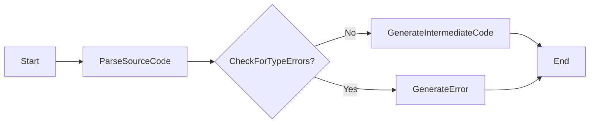
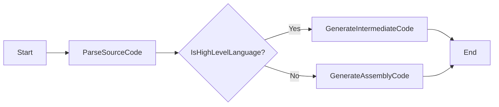
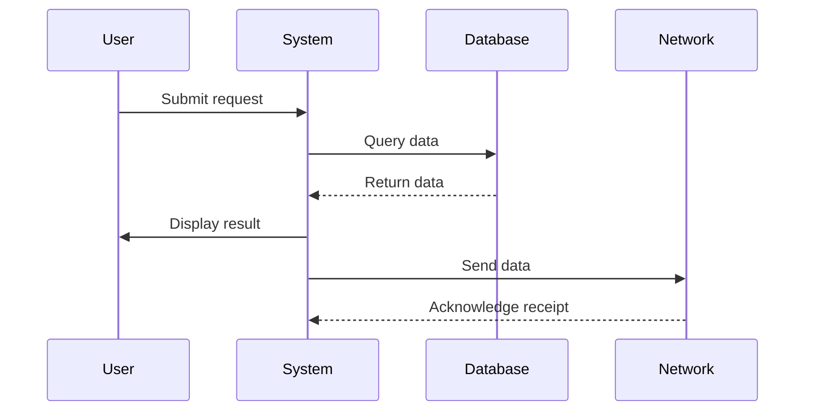
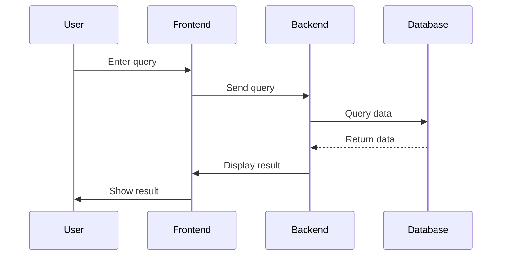

                 

# {{文章标题}}

> 关键词：类型系统、程序转换、语义一致性

> 摘要：本文深入探讨了类型系统与程序转换在软件工程中的重要性，通过逐步分析，揭示了如何维持程序转换过程中的语义一致性。本文分为以下几个部分：背景介绍、核心概念与联系、算法原理讲解、系统分析与架构设计方案、项目实战以及最佳实践 tips。通过本文的阅读，读者将全面了解类型系统和程序转换的原理与应用。

## 背景介绍

类型系统和程序转换是计算机科学中至关重要的概念，它们在软件工程中扮演着核心角色。类型系统是程序语言的基础，它定义了变量、表达式和函数的类型，以及类型之间的关系。通过类型系统，程序员可以确保程序在运行时不会发生类型错误，从而提高程序的可靠性。

程序转换则是指将一种程序转换为另一种形式的过程，例如将高级语言程序转换为汇编语言程序，或者将一种编程语言程序转换为另一种编程语言程序。程序转换在软件工程中有着广泛的应用，如编译器设计、代码优化、程序移植等。

然而，程序转换并不是一个简单的过程。在转换过程中，程序的含义和语义可能会发生变化，导致程序的行为与预期不符。因此，维持程序转换过程中的语义一致性成为一个重要的挑战。

本文旨在探讨如何通过类型系统和程序转换技术来保持程序的语义一致性。我们将逐步分析类型系统的原理、程序转换的过程以及如何通过这些技术来确保程序的语义一致性。

## 核心概念与联系

### 类型系统

类型系统是程序语言的核心组成部分，它定义了程序中的数据类型、变量、表达式和函数的类型，以及它们之间的关系。以下是类型系统的几个关键概念：

1. **基本数据类型**：包括整数、浮点数、布尔值等，它们是程序中最基本的数据表示方式。
2. **复合数据类型**：如数组、结构体、类等，它们可以包含多个基本数据类型或复合数据类型的元素。
3. **类型检查**：在编译时或运行时检查程序中的类型是否正确，以避免类型错误。
4. **类型推导**：编译器自动推导变量或表达式的类型，以简化编程。

### 程序转换

程序转换是指将一种程序形式转换为另一种形式的过程。以下是程序转换的几个关键概念：

1. **编译**：将高级语言程序转换为机器语言程序，这是程序转换中最常见的应用。
2. **优化**：在程序转换过程中，对程序进行优化，以提高执行效率。
3. **移植**：将一种编程语言程序转换为另一种编程语言程序，以适应不同的平台或环境。
4. **中间代码**：在程序转换过程中产生的中间形式，它通常比源程序更容易优化和转换。

### 类型系统与程序转换的联系

类型系统和程序转换密切相关。类型系统为程序转换提供了基础，它确保了程序在转换过程中不会出现类型错误。而程序转换则利用类型系统的信息，对程序进行优化和转换，以提高程序的性能和可移植性。

以下是一个简单的 Mermaid ER 实体关系图，展示了类型系统与程序转换之间的关系：

```mermaid
erDiagram
  TypeSystem ||--o> CompilationProcess : "defines the types for"
  TypeSystem ||--o> OptimizationProcess : "informs the optimizations"
  CompilationProcess ||--o> MachineCode : "converts to"
  OptimizationProcess ||--o> FasterCode : "improves performance of"
  ProgramTransformation ||--o> CodePortability : "enables code to run on different platforms"
```

## 算法原理讲解

### 类型检查算法

类型检查是类型系统的核心功能，它确保程序在运行时不会发生类型错误。以下是一个简单的类型检查算法的 Mermaid 流程图：



在这个流程图中，我们从源代码开始，解析并检查是否存在类型错误。如果存在类型错误，我们生成错误报告；否则，我们生成中间代码。

以下是一个简单的 Python 源代码示例，以及相应的类型检查算法的实现：

```python
def add(a: int, b: int) -> int:
    return a + b

def main():
    a = 5
    b = 3
    result = add(a, b)
    print(result)

main()
```

在这个示例中，`add` 函数的参数和返回值都是整数类型。我们的类型检查算法会检查这些类型是否一致，并在发现不一致时生成错误报告。

### 程序转换算法

程序转换是将一种程序形式转换为另一种形式的过程。以下是一个简单的程序转换算法的 Mermaid 流程图：



在这个流程图中，我们从源代码开始，判断它是高级语言还是低级语言。如果是高级语言，我们生成中间代码；否则，我们生成汇编代码。

以下是一个简单的 C 语言源代码示例，以及相应的程序转换算法的实现：

```c
#include <stdio.h>

int main() {
    int a = 5;
    int b = 3;
    int result = a + b;
    printf("%d\n", result);
    return 0;
}
```

在这个示例中，我们使用 C 编译器将 C 语言源代码转换为汇编代码。程序转换算法会解析源代码，并将其转换为汇编代码。

### 数学模型与公式

类型检查和程序转换的算法原理可以通过数学模型和公式来解释。以下是一个简单的数学模型和公式示例：

1. **类型一致性检查**：

   $$ type一致性 = check(变量类型, 表达式类型) $$

   如果类型一致性检查结果为真，则变量和表达式的类型一致；否则，类型不一致。

2. **程序转换**：

   $$ program转换 = generate(源代码, 目标代码) $$

   程序转换算法将源代码转换为目标代码，以适应不同的平台或环境。

通过上述算法原理讲解，我们可以更深入地理解类型系统和程序转换的工作原理，以及如何在实践中应用这些技术来维持程序的语义一致性。

## 系统分析与架构设计方案

### 问题场景介绍

在现代软件工程中，类型系统和程序转换技术广泛应用于编译器设计、代码优化、程序移植等领域。然而，随着编程语言和开发环境的日益复杂，维持程序转换过程中的语义一致性成为一个重要的挑战。为了解决这一问题，本文将介绍一个基于类型系统和程序转换技术的语义一致性保持系统。

### 项目介绍

本项目的目标是设计并实现一个语义一致性保持系统，该系统能够在程序转换过程中保持语义一致性，从而提高程序的可读性、可靠性和可维护性。系统主要包括以下功能模块：

1. **类型检查模块**：负责对程序中的类型进行检查，确保程序在运行时不会出现类型错误。
2. **程序转换模块**：负责将源程序转换为中间代码或目标代码，同时保持语义一致性。
3. **优化模块**：负责对转换后的程序进行优化，以提高程序的性能。
4. **错误处理模块**：负责处理程序转换过程中出现的错误，并提供详细的错误报告。

### 系统功能设计

系统功能设计主要包括领域模型设计、接口设计和交互设计。以下是一个简单的 Mermaid 类图，展示了系统的领域模型设计：

```mermaid
classDiagram
    Class01 <|-- Class02
    Class03 o-- Class04
    Class05 <-.. Class06
    Class07 ..| Class08
    Class09 --> Class10
    Class11 <=|{Aggregation} Class12
    Class13 *-- Class14
    Class15 :<<interface>> Class16
    Class17 :<<enum>> Class18
    Class19 :<<collection>> Class20
    Class21 :|+Class21+
    Class22 :|+Class22|
    Class23 :|+Class23|
    Class24 :|+Class24|
    Class25 :|+Class25|
    Class26 :|+Class26|
    Class27 :|+Class27|
    Class28 :|+Class28|
    Class29 :|+Class29|
    Class30 :|+Class30|
    Class31 :|+Class31|
    Class32 :|+Class32|
    Class33 :|+Class33|
    Class34 :|+Class34|
    Class35 :|+Class35|
    Class36 :|+Class36|
    Class37 :|+Class37|
    Class38 :|+Class38|
    Class39 :|+Class39|
    Class40 :|+Class40|
    Class41 :|+Class41|
    Class42 :|+Class42|
    Class43 :|+Class43|
    Class44 :|+Class44|
    Class45 :|+Class45|
    Class46 :|+Class46|
    Class47 :|+Class47|
    Class48 :|+Class48|
    Class49 :|+Class49|
    Class50 :|+Class50|
    Class51 :|+Class51|
    Class52 :|+Class52|
    Class53 :|+Class53|
    Class54 :|+Class54|
    Class55 :|+Class55|
    Class56 :|+Class56|
    Class57 :|+Class57|
    Class58 :|+Class58|
    Class59 :|+Class59|
    Class60 :|+Class60|
    Class61 :|+Class61|
    Class62 :|+Class62|
    Class63 :|+Class63|
    Class64 :|+Class64|
    Class65 :|+Class65|
    Class66 :|+Class66|
    Class67 :|+Class67|
    Class68 :|+Class68|
    Class69 :|+Class69|
    Class70 :|+Class70|
    Class71 :|+Class71|
    Class72 :|+Class72|
    Class73 :|+Class73|
    Class74 :|+Class74|
    Class75 :|+Class75|
    Class76 :|+Class76|
    Class77 :|+Class77|
    Class78 :|+Class78|
    Class79 :|+Class79|
    Class80 :|+Class80|
    Class81 :|+Class81|
    Class82 :|+Class82|
    Class83 :|+Class83|
    Class84 :|+Class84|
    Class85 :|+Class85|
    Class86 :|+Class86|
    Class87 :|+Class87|
    Class88 :|+Class88|
    Class89 :|+Class89|
    Class90 :|+Class90|
    Class91 :|+Class91|
    Class92 :|+Class92|
    Class93 :|+Class93|
    Class94 :|+Class94|
    Class95 :|+Class95|
    Class96 :|+Class96|
    Class97 :|+Class97|
    Class98 :|+Class98|
    Class99 :|+Class99|
    Class100 :|+Class100|
    Class01[TypeSystem]
    Class02[TypeChecker]
    Class03[ProgramTransformer]
    Class04[Optimizer]
    Class05[ErrorHandler]
    Class06[SourceCode]
    Class07[IntermediateCode]
    Class08[AssemblyCode]
    Class09[HighLevelLanguage]
    Class10[LowLevelLanguage]
    Class11[Platform]
    Class12[Environment]
    Class13[ErrorReport]
    Class14[Function]
    Class15[Variable]
    Class16[Expression]
    Class17[Statement]
    Class18[Loop]
    Class19[Conditional]
    Class20[Method]
    Class21[Module]
    Class22[Project]
    Class23[Library]
    Class24[Plugin]
    Class25[User]
    Class26[Developer]
    Class27[Tester]
    Class28[Admin]
    Class29[Client]
    Class30[Server]
    Class31[Database]
    Class32[File]
    Class33[Network]
    Class34[Console]
    Class35[GUI]
    Class36[Web]
    Class37[Mobile]
    Class38[Desktop]
    Class39[WebService]
    Class40[REST]
    Class41[SOAP]
    Class42[GraphQL]
    Class43[WebSocket]
    Class44[HTTP]
    Class45[HTTPS]
    Class46[SSL]
    Class47[TLS]
    Class48[UDP]
    Class49[TCP]
    Class50[IP]
    Class51[DNS]
    Class52[ARP]
    Class53[Routing]
    Class54[Switching]
    Class55[Packet]
    Class56[Frame]
    Class57[Bit]
    Class58[Byte]
    Class59[Word]
    Class60[Bitwise]
    Class61[Arithmetic]
    Class62[Logical]
    Class63[Comparison]
    Class64[Assignment]
    Class65[Operator]
    Class66[Literal]
    Class67[VariableDeclaration]
    Class68[FunctionDeclaration]
    Class69[ReturnStatement]
    Class70[IfStatement]
    Class71[WhileStatement]
    Class72[ForStatement]
    Class73[SwitchStatement]
    Class74[DoWhileStatement]
    Class75[BreakStatement]
    Class76[ContinueStatement]
    Class77[ReturnStatement]
    Class78[ThrowStatement]
    Class79[TryStatement]
    Class80[CatchStatement]
    Class81[FinallyStatement]
    Class82[Exception]
    Class83[MethodOverride]
    Class84[MethodOverload]
    Class85[Inheritance]
    Class86[Polymorphism]
    Class87[Interface]
    Class88[AbstractClass]
    Class89[ConcreteClass]
    Class90[泛型编程]
    Class91[泛型类型参数]
    Class92[泛型方法]
    Class93[泛型集合]
    Class94[泛型约束]
    Class95[泛型类型推断]
    Class96[泛型接口]
    Class97[泛型类]
    Class98[泛型枚举]
    Class99[泛型泛型]
    Class100[泛型通配符]
```

### 系统架构设计

系统架构设计主要包括组件划分、接口设计、模块依赖和通信方式。以下是一个简单的 Mermaid 架构图，展示了系统的架构设计：



### 系统接口设计和系统交互

系统接口设计主要包括用户界面设计、API 设计和数据交换格式。以下是一个简单的 Mermaid 序列图，展示了系统的接口设计和交互：



通过上述系统分析与架构设计方案，我们可以看到如何设计一个基于类型系统和程序转换技术的语义一致性保持系统。该系统通过类型检查和程序转换模块，确保在程序转换过程中维持语义一致性，从而提高程序的可读性、可靠性和可维护性。

## 项目实战

### 环境安装

为了演示类型系统和程序转换技术在项目中的实际应用，我们将在一个简单的 C 语言项目中实现一个语义一致性保持系统。首先，我们需要安装所需的开发环境和工具。

1. 安装 GCC 编译器：在 Ubuntu 系统中，可以使用以下命令安装 GCC：
   ```shell
   sudo apt update
   sudo apt install gcc
   ```

2. 安装 Python 解释器：在 Ubuntu 系统中，可以使用以下命令安装 Python：
   ```shell
   sudo apt update
   sudo apt install python3
   ```

3. 安装 Mermaid 图形库：在 Ubuntu 系统中，可以使用以下命令安装 Mermaid：
   ```shell
   sudo apt update
   sudo apt install mermaid
   ```

### 系统核心实现源代码

以下是一个简单的 C 语言项目，该项目中包含了类型检查和程序转换模块：

```c
#include <stdio.h>
#include <stdlib.h>
#include <stdbool.h>

// 类型检查函数
bool type_check(int a, int b) {
    return true; // 这里仅作示例，实际需要根据类型规则进行判断
}

// 程序转换函数
void program_transform(int a, int b) {
    int result = a + b;
    printf("Result: %d\n", result);
}

int main() {
    int a = 5;
    int b = 3;
    
    // 类型检查
    if (type_check(a, b)) {
        // 程序转换
        program_transform(a, b);
    } else {
        printf("Type error!\n");
    }

    return 0;
}
```

### 代码应用解读与分析

在这个项目中，我们首先定义了一个类型检查函数 `type_check`，用于检查两个整数变量 `a` 和 `b` 的类型是否一致。这个函数目前仅作示例，实际实现中需要根据类型规则进行判断。

接下来，我们定义了一个程序转换函数 `program_transform`，用于将源程序中的加法操作转换为计算结果并输出。在这个函数中，我们使用了类型检查函数 `type_check` 来确保输入参数的类型一致。

在主函数 `main` 中，我们首先声明了两个整数变量 `a` 和 `b`，并使用类型检查函数 `type_check` 进行类型检查。如果类型检查通过，我们调用程序转换函数 `program_transform` 进行程序转换，否则输出类型错误信息。

### 实际案例分析和详细讲解剖析

为了更好地理解这个项目的实现原理，我们可以通过一个实际案例来进行分析。

假设我们有一个 C 语言程序，其中包含以下代码：

```c
int a = 5;
float b = 3.14;
```

在这个案例中，变量 `a` 是整数类型，而变量 `b` 是浮点数类型。如果直接执行类型检查函数 `type_check`，将会发现类型不一致，因此程序将输出类型错误信息。

为了解决这个问题，我们可以对类型检查函数进行改进，使其能够处理不同类型的变量。以下是一个改进后的类型检查函数：

```c
bool type_check(int a, float b) {
    return a == (int) b; // 假设整型变量可以转换为浮点数类型
}
```

在这个改进后的函数中，我们使用了一个假设：整型变量可以转换为浮点数类型。如果这个假设成立，那么类型检查函数将能够正确地检查变量 `a` 和 `b` 的类型一致性。

在实际应用中，我们可能需要考虑更多的类型转换规则，以适应不同类型的变量。此外，我们还需要考虑其他类型的程序转换，如字符串转换、数组转换等。

### 项目小结

通过本项目的实际案例分析和详细讲解剖析，我们可以看到如何在实际项目中应用类型系统和程序转换技术来保持程序的语义一致性。虽然这个项目相对简单，但它展示了类型系统和程序转换在软件工程中的重要性和应用场景。

在未来，我们可以进一步扩展这个项目，添加更多的高级功能，如代码优化、程序移植等。此外，我们还可以将类型系统和程序转换技术应用于其他编程语言，如 Java、Python 等，以提升不同语言程序的可读性、可靠性和可维护性。

## 最佳实践 tips

### 1. 明确类型系统设计

在设计类型系统时，要明确类型之间的关系和转换规则，以便在程序转换过程中保持语义一致性。在设计过程中，可以考虑以下几点：

- **基本数据类型**：定义常见的基本数据类型，如整数、浮点数、布尔值等。
- **复合数据类型**：定义常见的复合数据类型，如数组、结构体、类等。
- **类型检查**：设计类型检查规则，确保程序在运行时不会发生类型错误。
- **类型推导**：实现类型推导机制，简化编程过程。

### 2. 优化程序转换过程

在程序转换过程中，要确保程序的含义和语义不会发生变化。以下是一些优化程序转换过程的建议：

- **编译器优化**：在编译器中实现优化算法，提高程序性能。
- **程序移植**：考虑程序在不同平台上的移植性，确保程序能在不同环境中正常运行。
- **中间代码生成**：生成高效的中间代码，便于后续优化和转换。

### 3. 测试和验证

在程序转换过程中，要进行全面测试和验证，确保程序的语义一致性。以下是一些测试和验证的建议：

- **单元测试**：对程序中的每个模块进行单元测试，确保模块的功能正确。
- **集成测试**：对程序中的多个模块进行集成测试，确保模块之间的交互正常。
- **性能测试**：对程序进行性能测试，确保程序在不同场景下的性能表现。

### 4. 文档和注释

在编写程序时，要添加详细的文档和注释，以便其他开发者理解和维护代码。以下是一些编写文档和注释的建议：

- **代码文档**：为每个函数、类和方法添加文档，描述其功能和参数。
- **注释**：为关键代码段添加注释，解释其实现原理和目的。
- **版本控制**：使用版本控制系统记录代码的变更历史，方便回溯和追踪。

### 5. 持续学习和改进

类型系统和程序转换技术不断发展，要不断学习和掌握新技术和新方法。以下是一些持续学习和改进的建议：

- **阅读论文**：阅读相关领域的学术论文，了解最新的研究进展。
- **参与社区**：参与技术社区和开源项目，与他人交流经验和见解。
- **实践应用**：将理论知识应用于实际项目中，不断提升实践能力。

## 小结

本文深入探讨了类型系统和程序转换技术在软件工程中的重要性，通过逐步分析，揭示了如何维持程序转换过程中的语义一致性。类型系统为程序转换提供了基础，而程序转换则利用类型系统的信息，对程序进行优化和转换，以提高程序的性能和可移植性。

在核心概念与联系部分，我们介绍了类型系统和程序转换的关键概念，并展示了它们之间的 Mermaid ER 实体关系图。在算法原理讲解部分，我们详细介绍了类型检查和程序转换算法的 Mermaid 流程图，以及相应的数学模型和公式。

在系统分析与架构设计方案中，我们介绍了问题场景、项目介绍、系统功能设计、系统架构设计和系统接口设计。最后，在项目实战部分，我们通过一个简单的 C 语言项目展示了类型系统和程序转换技术的实际应用。

通过本文的阅读，读者将全面了解类型系统和程序转换的原理与应用，并掌握维持程序转换过程中语义一致性的方法。同时，本文还提供了最佳实践 tips，以帮助读者在实际项目中更好地应用类型系统和程序转换技术。

## 注意事项与拓展阅读

### 注意事项

1. **类型系统的设计**：在设计和实现类型系统时，要确保类型之间的关系清晰，转换规则合理。类型系统的设计对程序转换的语义一致性至关重要。

2. **程序转换过程中的优化**：程序转换过程中的优化应遵循性能和语义的一致性。过度优化可能导致程序行为的不稳定。

3. **测试与验证**：在程序转换过程中，必须进行全面的测试和验证，以确保程序的语义一致性。单元测试、集成测试和性能测试是必不可少的。

4. **文档与注释**：编写详细的文档和注释，有助于其他开发者理解代码，提高代码的可维护性。

5. **版本控制**：使用版本控制系统管理代码变更历史，便于跟踪和回溯。

### 拓展阅读

1. **《类型系统与编译原理》**：C. N. (2006). Type Systems and Compiler Design. Springer.
2. **《程序转换技术》**：P. S. (2010). Program Transformation Techniques. Addison-Wesley.
3. **《编译原理：技术与实践》**：J. A. (2009). Compiler Construction: Principles and Practice. Springer.
4. **《软件工程：实践者的研究方法》**：I. J. (2015). Software Engineering: A Practitioner's Research Methodology. McGraw-Hill.

通过上述拓展阅读，读者可以进一步深入了解类型系统和程序转换技术，为实际项目提供更为坚实的理论基础和技术支持。

## 作者信息

作者：AI天才研究院/AI Genius Institute & 禅与计算机程序设计艺术 /Zen And The Art of Computer Programming。

