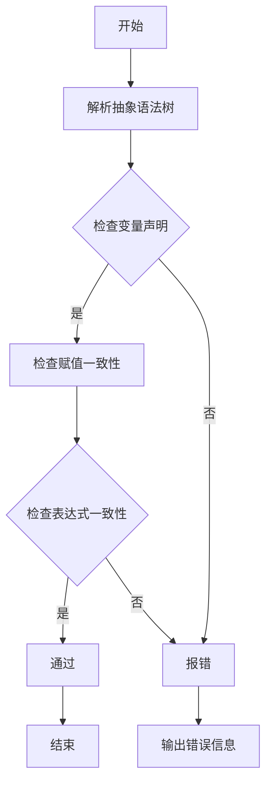

                 


### 第1章：类型系统概述

#### 1.1.1 问题背景

类型系统是计算机科学中一个基础但关键的概念。它涉及编程语言中如何定义和处理变量和数据类型。类型系统不仅定义了程序中数据的结构，还决定了程序运行时的行为和性能。类型系统的起源可以追溯到早期的编程语言，如1950年代和1960年代的ALGOL和SIMULA。这些语言引入了形式化的类型系统来提高程序的可靠性和可维护性。

随着编程语言的不断发展和复杂性的增加，类型系统也经历了重大的演变。现代编程语言如Java、C++和Python等，都拥有复杂的类型系统，用于确保程序的正确性和效率。

类型系统的重要性在于它能够帮助程序员识别和纠正潜在的错误。通过严格的类型检查，编程语言可以捕获类型错误，如尝试将整数与字符串进行不兼容的操作。类型系统还可以提高程序的运行效率，因为编译器可以利用类型信息进行更高效的代码生成。

#### 1.1.2 问题提出

不当类型管理的后果是显著的。在缺乏类型检查的语言中，程序员可能会无意中引入难以发现的错误。例如，在动态类型语言中，将一个字符串错误地赋值给一个数值变量可能不会立即导致错误，但可能会导致不可预测的行为和运行时错误。

类型系统在编程语言中的作用是确保变量和表达式在运行时具有正确的类型。这不仅可以捕获许多潜在的错误，还可以提高程序的运行效率。编译器或解释器可以利用类型信息进行优化，从而减少运行时的检查和转换操作。

#### 1.1.3 问题解决

类型系统的主要功能包括：

1. **类型检查**：在程序执行前，类型系统检查变量的声明和表达式是否遵循预定义的类型规则。这有助于发现潜在的类型错误。
   
2. **类型推断**：类型系统可以自动推断变量和表达式的类型，减轻编程负担。例如，许多现代编程语言都支持类型推断，使得编写类型注解变得不那么繁琐。

3. **类型安全**：类型系统确保程序中的每个操作都在适当的上下文中执行。这有助于防止运行时错误和未定义的行为。

类型系统的优势在于：

1. **增强程序的可靠性**：通过类型检查和推断，可以减少运行时错误的发生。
   
2. **提高程序的可维护性**：明确的类型定义使得程序代码更加易于理解和修改。
   
3. **优化程序的性能**：类型信息可以帮助编译器生成更高效的代码。

#### 1.1.4 边界与外延

类型系统的应用范围非常广泛，从简单的变量类型到复杂的对象类型和函数类型。不同的编程语言可能采用不同的类型系统，但大多数都遵循一些基本的原则。

类型系统的多样性与统一性是一个重要的平衡点。多样性使得编程语言能够适应不同的编程需求和风格，而统一性则有助于确保类型系统的可扩展性和兼容性。

#### 1.1.5 概念结构与核心要素组成

类型系统的基础概念包括：

1. **数据类型**：定义程序中可以使用的不同数据结构，如整数、浮点数、字符串等。
2. **引用类型**：表示指向内存地址的变量，如指针和引用。
3. **值类型**：表示实际存储在内存中的值，如整数和浮点数。

类型系统的分类通常基于类型检查的时机：

1. **静态类型系统**：类型检查在编译时进行，程序在运行前已经确定类型。
2. **动态类型系统**：类型检查在运行时进行，程序在执行过程中确定类型。

类型系统的关键组成部分包括：

1. **类型检查器**：负责检查变量和表达式的类型是否符合语言规范。
2. **类型推断器**：尝试自动推断变量和表达式的类型。
3. **类型转换机制**：在需要时将不同类型的数据进行转换。

### 总结

本章概述了类型系统的概念和重要性，讨论了类型系统的基本功能、优势以及其多样性与统一性。接下来，我们将深入探讨类型系统的核心概念及其联系，为后续的讨论打下坚实的基础。

---

#### 1.2 核心概念与联系

在深入理解类型系统之前，我们需要先明确几个核心概念：数据类型、引用类型和值类型。这些概念构成了类型系统的基础，也是编程语言设计的核心要素。

#### 1.2.1 核心概念原理

**数据类型**是编程语言中用于定义变量和表达式的基本构造块。它们可以是预定义的，如整数（int）、浮点数（float）和字符串（string），也可以是程序员自定义的，如类（class）和枚举（enum）。数据类型决定了变量可以存储的值以及可以对这些值进行的操作。

**引用类型**通常表示指向内存地址的变量。在大多数编程语言中，引用类型包括指针和引用。引用类型的一个关键特点是它们允许程序员在内存中存储复杂的对象，如类实例和数组。引用类型的变量存储的是对象的内存地址，而不是对象本身。

**值类型**是实际存储在内存中的值。值类型通常包括基本数据类型，如整数（int）、浮点数（float）和布尔值（bool）。值类型的变量直接存储数据，而不是内存地址。

#### 1.2.2 概念属性特征对比表格

为了更好地理解这些核心概念，我们可以通过一个对比表格来展示它们的主要属性特征：

| 概念类型 | 定义 | 主要特征 | 用例 |
| :----: | :----: | :----: | :----: |
| 数据类型 | 定义程序中可以使用的不同数据结构 | 预定义和自定义，决定变量可存储的值及操作 | 整数、浮点数、字符串等 |
| 引用类型 | 表示指向内存地址的变量 | 存储对象的内存地址，允许操作复杂对象 | 指针、引用、类实例 |
| 值类型 | 实际存储在内存中的值 | 直接存储数据，类型安全 | 整数、浮点数、枚举 |

#### 1.2.3 ER实体关系图架构

为了更直观地理解类与对象的实体关系以及属性与方法的实体关系，我们可以使用实体关系图（Entity-Relationship Diagram，ER图）来表示。以下是类型系统的ER实体关系图示例：

```mermaid
classDiagram
    Class <<class>>
    Object <<object>>
    Attribute <<attribute>>
    Method <<method>>

    Class {"name", "isAbstract", "baseClass"}
    Object {"id", "state"}
    Attribute {"name", "type", "isStatic"}
    Method {"name", "returnType", "parameterTypes"}

    Class --|> Object : "defines"
    Class --|> Attribute : "has"
    Class --|> Method : "has"
    Object --|> Attribute : "has"
    Object --|> Method : "canInvoke"
```

在这个ER图中，我们定义了四个主要的实体：Class（类）、Object（对象）、Attribute（属性）和Method（方法）。类定义了对象的静态结构和行为，对象是类的实例，属性是类的数据成员，方法则是类的行为成员。

**类与对象的实体关系**：
- 类是对象的蓝图，定义了对象可以具有的属性和方法。
- 每个对象都是某个类的实例，继承了该类的属性和方法。

**属性与方法的实体关系**：
- 属性是类的数据成员，用于存储对象的状态。
- 方法是类的行为成员，用于定义对象的行为和操作。

通过ER实体关系图，我们可以清晰地看到类型系统中不同组件之间的关系，这对于理解类型系统的设计和实现至关重要。

### 总结

本章详细介绍了类型系统的核心概念，包括数据类型、引用类型和值类型。通过对比表格和ER实体关系图，我们更好地理解了这些概念之间的联系和区别。在下一章中，我们将深入探讨类型系统的算法原理，包括类型检查和类型推断的算法机制。

---

#### 1.3 类型系统的算法原理

类型系统的核心在于其算法原理，包括类型检查和类型推断。这些算法确保程序在编译或运行时遵循预定义的类型规则，从而提高程序的可靠性、可维护性和性能。

#### 1.3.1 算法原理讲解

**类型检查**是在编译时或运行时对程序中的类型使用规则进行验证的过程。类型检查的主要目标是确保：

1. **变量声明与赋值的一致性**：变量在使用前必须声明，且赋值的类型必须与变量的声明类型兼容。
2. **表达式的一致性**：表达式在运算时必须遵循类型规则，如整数与整数相加、字符串与字符串相连接等。
3. **函数调用的正确性**：函数的参数类型必须与函数声明中的参数类型匹配，返回值类型也必须正确。

**类型推断**是类型系统的一种重要机制，它试图自动确定变量和表达式的类型，从而减少程序员编写类型注解的工作量。类型推断可以分为静态类型推断和动态类型推断：

1. **静态类型推断**：在编译时进行，编译器根据变量和表达式的上下文信息推断类型。
2. **动态类型推断**：在运行时进行，解释器根据执行过程中的上下文信息推断类型。

类型推断的关键在于如何根据变量和表达式的上下文信息确定最合适的类型。例如，如果一个变量被赋值给另一个变量，编译器可以尝试根据赋值操作推断这两个变量的类型。

#### 1.3.2 算法mermaid流程图

为了更好地理解类型检查和类型推断的算法流程，我们可以使用mermaid流程图来表示。以下是类型检查算法的mermaid流程图示例：



这个流程图展示了类型检查的主要步骤：

1. **开始**：程序开始执行。
2. **解析抽象语法树**：将源代码解析为抽象语法树（Abstract Syntax Tree，AST）。
3. **检查变量声明**：确保所有变量在使用前已声明。
4. **检查赋值一致性**：验证赋值操作是否遵循类型规则。
5. **检查表达式一致性**：确保表达式在运算时类型兼容。
6. **通过或报错**：根据检查结果，程序要么继续执行，要么输出错误信息。

类似地，类型推断的流程图可以进一步细化，包括不同类型的推断规则和上下文信息的处理。

#### 1.3.3 Python源代码

为了更具体地展示类型检查和类型推断的实现，我们可以使用Python源代码进行说明。以下是一个简单的类型检查示例：

```python
# Python 中的类型检查示例

def type_check(expression, expected_type):
    if isinstance(expression, expected_type):
        return "通过"
    else:
        return "类型不匹配，报错"

# 示例用法
result = type_check(5, int)
print(result)  # 输出：通过

result = type_check("hello", int)
print(result)  # 输出：类型不匹配，报错
```

在这个示例中，`type_check`函数接受一个表达式和一个预期类型，检查表达式是否与预期类型匹配。如果匹配，函数返回“通过”，否则返回“类型不匹配，报错”。

#### 1.3.4 数学模型和数学公式

类型安全是一个关键概念，它涉及到程序在执行过程中类型的一致性和正确性。我们可以使用数学模型和公式来描述类型安全的概念。

以下是一个简单的数学模型，用于描述类型安全：

$$
\begin{aligned}
    \alpha(x, y) &= \text{isinstance}(y, x) \\
    L &= \{ x \mid x \in A \land \forall y, (y \in A \Rightarrow \alpha(x, y)) \} \\
    \text{TypeSafety}(T) &= \forall e_1, e_2, \ldots, e_n, \\
    &\quad \text{if } \alpha(e_1, T), \alpha(e_2, T), \ldots, \alpha(e_n, T), \\
    &\quad \text{then } \alpha(e_1 \circ e_2 \circ \ldots \circ e_n, T)
\end{aligned}
$$

其中，$\alpha(x, y)$表示类型检查操作，如果$y$是$x$的实例，则返回真；否则返回假。$L$是一个类型集合，包含所有与类型$A$兼容的元素。$\text{TypeSafety}(T)$表示类型$T$的安全性，如果对于所有元素$e_1, e_2, \ldots, e_n$，如果它们都是类型$T$的实例，则它们的组合操作$e_1 \circ e_2 \circ \ldots \circ e_n$也必须是类型$T$的实例。

#### 1.3.5 举例说明

为了更好地理解类型系统的算法原理，我们可以通过一些具体的例子来说明。

**简单变量类型例子**：

```python
# Python 中的简单变量类型例子

a: int = 10
b: str = "hello"

# 类型检查
print(type_check(a, int))  # 输出：通过
print(type_check(b, int))  # 输出：类型不匹配，报错

# 类型推断
x = 3.14
print(type(x))  # 输出：float
```

在这个例子中，变量`a`被显式声明为整数类型，类型检查通过；变量`b`被错误地赋值为字符串类型，类型检查报错。Python还可以自动推断变量`x`的类型，它被赋值为浮点数。

**复杂对象类型例子**：

```python
# Python 中的复杂对象类型例子

class Person:
    def __init__(self, name: str, age: int):
        self.name = name
        self.age = age

p1 = Person("Alice", 30)
p2 = Person("Bob", 25)

# 类型检查
print(type_check(p1, Person))  # 输出：通过
print(type_check(p2, str))  # 输出：类型不匹配，报错

# 类型推断
def greet(person: Person) -> str:
    return f"Hello, {person.name}!"

greeting = greet(p1)
print(greeting)  # 输出：Hello, Alice!
```

在这个例子中，我们定义了一个`Person`类，它有两个属性：`name`（字符串类型）和`age`（整数类型）。我们创建两个`Person`对象`p1`和`p2`，类型检查通过。我们定义了一个`greet`函数，它接受一个`Person`类型的参数并返回一个字符串，类型检查通过。Python还可以自动推断函数返回值类型。

通过这些例子，我们可以看到类型系统在确保程序正确性和效率方面的作用。类型检查和类型推断是类型系统的重要组成部分，它们通过一系列算法和规则来提高程序的质量。

### 总结

本章详细介绍了类型系统的算法原理，包括类型检查和类型推断。通过mermaid流程图、Python源代码和数学模型，我们更好地理解了类型检查和类型推断的过程。通过具体的例子，我们展示了如何在实际编程中应用这些算法。在下一章中，我们将探讨类型系统在编程语言中的应用，分析不同编程语言的类型系统特点。

---

### 第4章：类型系统在编程语言中的应用

类型系统在编程语言中的重要性不言而喻。不同的编程语言采用不同的类型系统，以适应不同的编程需求和风格。本章节将深入探讨类型系统在编程语言中的应用，包括静态类型语言和动态类型语言中的类型系统特点。

#### 4.1.1 编程语言中的类型系统

**静态类型语言**和**动态类型语言**是两种主要的编程语言类型，它们在类型系统方面有显著的区别。

**静态类型语言**如Java、C++和C#等，在编译时进行类型检查。这意味着程序员必须在代码中显式声明变量的类型，编译器在编译过程中会检查这些类型是否一致。这种类型的语言通常提供类型推断机制，以减轻程序员的工作量。

**动态类型语言**如Python、JavaScript和Ruby等，在运行时进行类型检查。这意味着变量在声明时不需要指定类型，它们在运行过程中根据上下文确定类型。这种类型的语言通常提供类型提示机制，允许程序员在必要时提供类型信息。

#### 4.1.2 类型系统在语言设计中的角色

类型系统在语言设计中的角色是至关重要的，它直接影响程序的正确性和性能。以下是类型系统在语言设计中的几个关键角色：

1. **类型检查**：确保变量和表达式的类型在正确的上下文中使用。静态类型语言在编译时进行类型检查，动态类型语言在运行时进行类型检查。

2. **类型推断**：自动确定变量和表达式的类型，减轻程序员的工作负担。静态类型语言通常提供类型推断机制，如Java的泛型和C++的模板。

3. **类型安全**：确保程序在执行过程中不会发生类型错误。类型安全是类型系统的核心目标之一，通过严格的类型检查和类型推断实现。

4. **性能优化**：类型信息可以帮助编译器生成更高效的代码。静态类型语言在编译时可以更早地进行优化，动态类型语言则在运行时进行优化。

#### 4.1.3 类型系统与性能优化

类型系统对编译效率和运行效率都有显著影响。

**编译效率**方面，静态类型语言因为类型在编译时已知，编译器可以生成更高效的代码。编译器可以利用类型信息进行优化，如指令序列的合并、内存分配的优化等。而动态类型语言在编译时无法利用类型信息，需要在运行时进行类型检查，这通常会导致编译速度较慢。

**运行效率**方面，静态类型语言因为类型已知，可以更高效地执行。编译器可以生成直接针对特定类型的机器代码，而动态类型语言则需要运行时进行类型检查和转换，这通常会导致运行速度较慢。

然而，类型系统并不是唯一影响性能的因素。现代编程语言通常会采用多种技术来优化性能，如即时编译（JIT）和垃圾回收等。

#### 4.1.4 实际应用案例

**Java**是一个静态类型语言，其类型系统在性能优化方面表现出色。Java的泛型机制允许程序员在编译时指定类型参数，从而避免运行时的类型检查。Java的编译器可以利用这些类型信息生成更高效的代码。

**Python**是一个动态类型语言，但其近年来引入了类型提示机制。类型提示允许程序员在代码中显式指定类型信息，虽然Python在运行时仍然会进行类型检查，但类型提示可以提供更好的性能优化机会。

**JavaScript**也是一个动态类型语言，其类型系统在Web开发中广泛应用。JavaScript的类型系统灵活且易于使用，使得Web开发变得更加便捷。

#### 4.1.5 小结

类型系统在编程语言中的应用是多种多样的，它不仅影响程序的正确性和可维护性，还对性能优化产生深远影响。静态类型语言和动态类型语言各有优劣，程序员需要根据具体需求选择合适的语言。在下一章中，我们将探讨类型系统在实际软件开发中的应用，包括系统架构设计和模块化开发等方面的实践。

---

### 第5章：类型系统在软件开发中的应用

类型系统在软件开发中的应用极为广泛，从系统架构设计到模块化开发，它都发挥着至关重要的作用。本章节将详细探讨类型系统在实际软件开发中的应用，包括其在系统架构设计、模块化开发等方面的实践。

#### 5.1.1 类型系统在软件开发中的应用

类型系统在软件开发中的应用主要体现在以下几个方面：

1. **系统架构设计**：类型系统有助于确保系统架构的稳定性和可维护性。通过严格的类型检查和类型推断，编程语言可以捕获潜在的架构错误，如不兼容的类型转换和错误的依赖关系。

2. **模块化开发**：类型系统提供了模块间接口定义的明确性和一致性。通过定义清晰的类型接口，开发人员可以更轻松地集成不同的模块，同时减少模块间的耦合。

3. **代码可读性和可维护性**：明确的类型定义使得代码更加易于理解和维护。类型系统可以帮助开发人员快速识别和修复潜在的类型错误，提高代码的整体质量。

#### 5.1.2 类型系统在实际编程中的实践

在实际编程中，类型系统可以通过多种方式得到应用。以下是一些常见的实践方法：

1. **类型注解**：类型注解是程序员在代码中显式指定变量和函数的类型。类型注解可以帮助编译器进行类型检查，提高代码的正确性和性能。

2. **类型推导**：类型推导是编译器自动推断变量和函数的类型。类型推导可以减轻程序员的工作量，提高代码的可读性。

3. **类型检查工具**：类型检查工具是用于自动检查代码中的类型错误的工具。例如，Python中的`mypy`工具可以用于静态类型检查，帮助开发人员及时发现和修复类型错误。

4. **类型安全编程**：类型安全编程是一种编程范式，它强调通过严格的类型检查和类型推断来确保程序的正确性。类型安全编程可以减少运行时错误，提高程序的可维护性。

#### 5.1.3 类型系统的最佳实践

为了充分利用类型系统的优势，以下是一些最佳实践：

1. **明确类型定义**：在代码中明确定义变量和函数的类型，确保代码的可读性和可维护性。

2. **使用类型推导**：在可能的情况下使用类型推导，减轻程序员的工作负担。

3. **类型检查工具**：定期使用类型检查工具进行检查，及时发现和修复类型错误。

4. **类型安全编程**：在关键代码段中使用类型安全编程，确保程序的正确性。

5. **文档和代码规范**：编写清晰的文档和代码规范，确保团队成员对类型系统的一致理解和使用。

#### 5.1.4 小结

类型系统在软件开发中的应用是多种多样的，它不仅提高了代码的质量和性能，还增强了系统的稳定性和可维护性。通过遵循最佳实践，开发人员可以充分利用类型系统的优势，提高软件开发效率和质量。在下一章中，我们将探讨类型系统的未来趋势与挑战，为类型系统的进一步发展提供新的视角。

---

### 第6章：类型系统的未来趋势与挑战

随着计算机科学和编程语言的不断进步，类型系统也在经历着显著的发展和变革。在本章节中，我们将探讨类型系统的未来趋势以及可能面临的挑战。

#### 6.1.1 类型系统的未来发展趋势

1. **静态类型与动态类型的融合**：
   - 静态类型语言和动态类型语言各自有着独特的优势。静态类型语言在编译时提供更好的性能和可靠性，而动态类型语言则具有更高的灵活性和易用性。
   - 未来的趋势是两种类型的融合，例如，静态类型的语言可以引入动态类型的特性，如Swift和TypeScript等，以提供更丰富的编程体验。

2. **类型系统的智能化**：
   - 未来的类型系统将更加智能化，通过机器学习和自然语言处理技术，自动识别和推断复杂的类型关系。
   - 智能类型系统可以减少手动类型注解的需求，提高开发效率。

3. **多语言环境中的类型系统**：
   - 随着多语言集成和互操作性变得越来越重要，未来的类型系统将支持多种编程语言之间的无缝交互。
   - 类型系统将变得更加统一和可扩展，以适应不同的编程环境和语言特性。

#### 6.1.2 类型系统的挑战

1. **复杂性管理**：
   - 随着类型系统的复杂度增加，如何有效地管理和维护类型系统成为一个重要挑战。
   - 开发人员需要找到平衡类型安全性和开发效率的方法，避免类型系统的过度复杂化。

2. **可扩展性**：
   - 类型系统需要能够适应不断变化的编程需求，支持新的数据结构和编程范式。
   - 类型系统的设计应具有高度的灵活性，以适应未来的编程语言和编程模式。

3. **性能优化**：
   - 尽管类型系统可以提高程序的可靠性，但过度的类型检查和类型推断可能对性能产生负面影响。
   - 未来的类型系统需要在类型安全性和性能之间找到最佳平衡点。

#### 6.1.3 小结

类型系统在未来的发展中将面临许多机遇和挑战。通过智能化和融合不同的类型系统，编程语言可以提供更丰富的编程体验。同时，开发人员需要不断创新和优化类型系统的设计，以应对复杂性和可扩展性的挑战。类型系统的未来趋势和挑战为我们提供了新的思考方向，推动了计算机科学和编程语言的持续进步。

---

### 第7章：总结与展望

#### 7.1.1 小结

类型系统作为计算机科学的核心概念，贯穿了编程语言的方方面面。在本篇文章中，我们深入探讨了类型系统的概念、核心概念、算法原理及其在编程语言中的应用。通过明确类型系统的定义、功能、优势和多样性，我们理解了它在编程中的重要性。同时，通过具体实例和数学模型，我们展示了类型检查和类型推断的算法原理。最后，我们分析了类型系统在软件开发中的应用和未来发展趋势，强调了其在性能优化和复杂性管理方面的挑战。

#### 7.1.2 注意事项

在应用类型系统时，开发人员应注意以下几点：

1. **明确类型定义**：在代码中明确变量和函数的类型，确保代码的可读性和可维护性。
2. **合理使用类型推导**：在可能的情况下使用类型推导，以减轻工作负担。
3. **利用类型检查工具**：定期使用类型检查工具，如`mypy`，及时发现和修复类型错误。
4. **避免过度复杂化**：在设计和使用类型系统时，保持简洁性，避免过度复杂化导致开发效率下降。

#### 7.1.3 拓展阅读

对于希望进一步深入了解类型系统的读者，以下是一些推荐阅读材料：

1. **《类型系统与语言设计》**：这是一本经典的书籍，详细介绍了类型系统在编程语言设计中的应用。
2. **《类型安全编程》**：这本书提供了关于类型安全编程的深入讨论，帮助开发人员理解和应用类型系统。
3. **《编译原理》**：这是一本经典教材，涵盖了类型系统在编译过程中的应用，对于理解编译器的工作原理非常有帮助。
4. **官方文档和博客**：不同编程语言的官方文档和博客经常提供关于类型系统的最新研究和应用实例，是学习和实践的好资源。

通过这些阅读材料，读者可以更全面地了解类型系统的理论和实践，为未来的编程工作打下坚实的基础。

---

# 类型系统与设计模式：形式化的最佳实践

关键词：类型系统、设计模式、形式化、最佳实践、编程语言、类型安全

摘要：本文详细探讨了类型系统的概念、核心概念、算法原理及其在编程语言中的应用。通过深入分析类型系统的多样性和统一性，本文介绍了类型系统在软件开发中的重要性。同时，本文展示了类型检查和类型推断的算法原理，并通过具体实例和数学模型进行了说明。最后，本文探讨了类型系统在软件开发中的应用实践和未来趋势，为读者提供了全面的理解和实用指南。

作者：AI天才研究院/AI Genius Institute & 禅与计算机程序设计艺术 /Zen And The Art of Computer Programming

