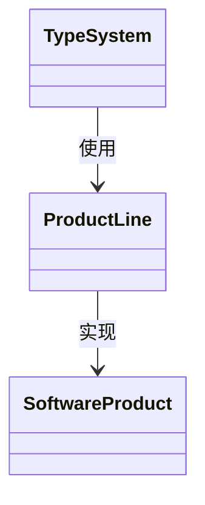
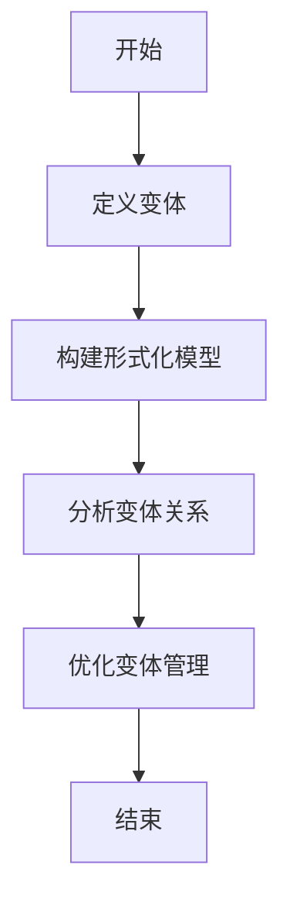
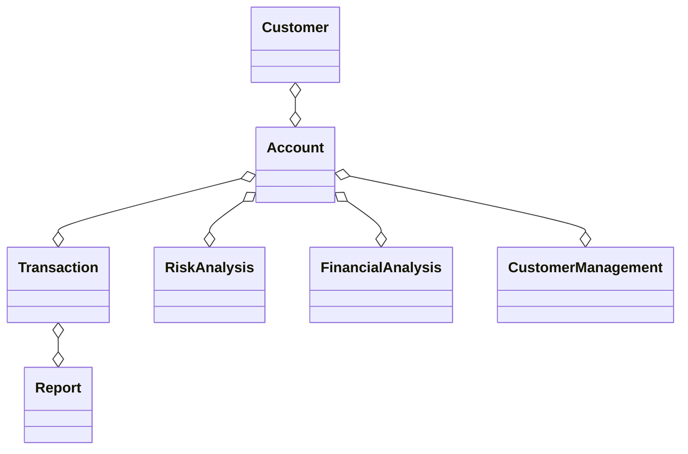
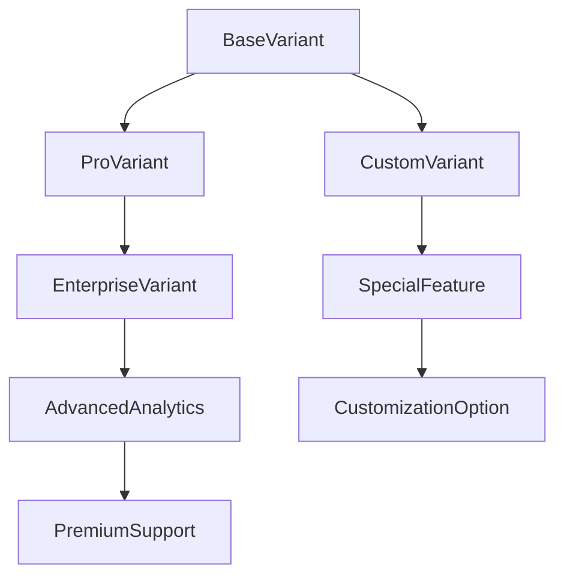
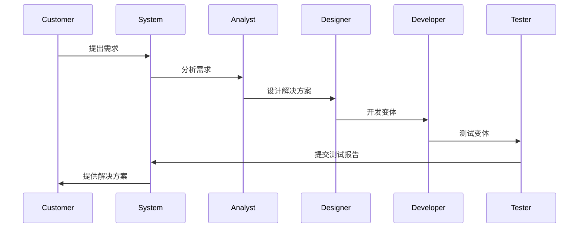
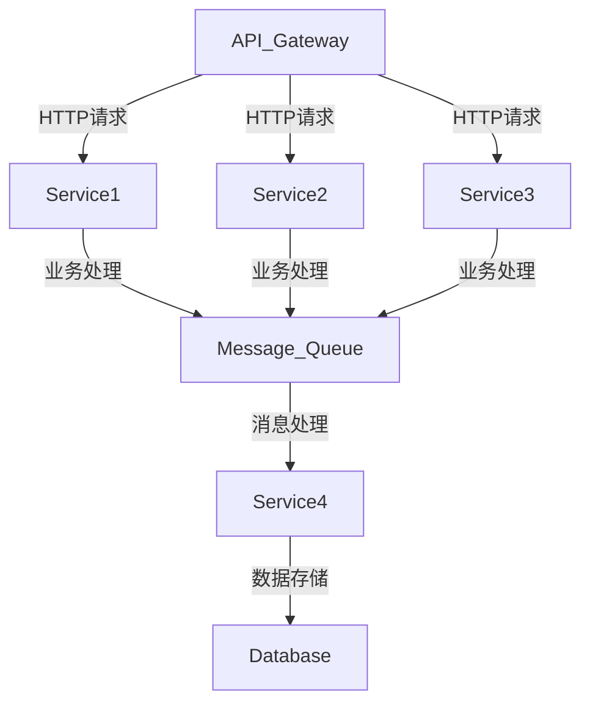
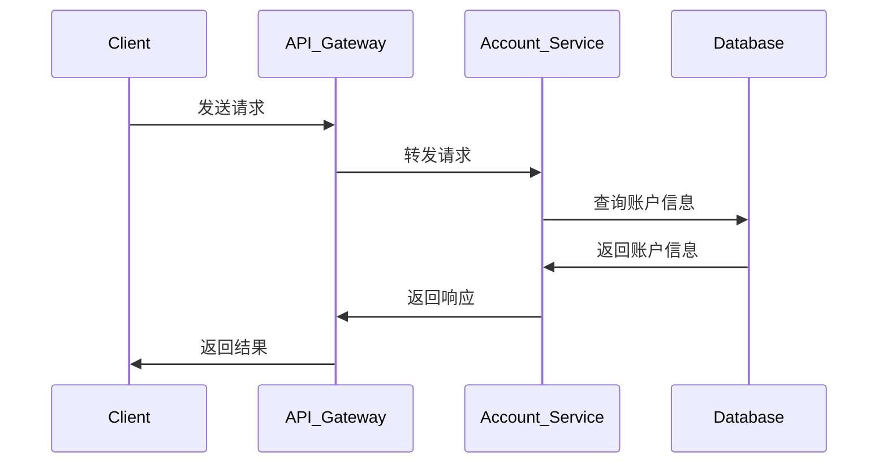

                 


### 背景介绍

#### 核心概念术语说明

在深入探讨《类型系统与软件产品线：变异性管理的形式化方法》之前，我们首先需要明确一些核心概念和术语。这些术语包括：

1. **类型系统（Type System）**：
   类型系统是编程语言的核心组成部分，它定义了如何表示和操作数据类型。类型系统不仅确保了程序的正确性，还提供了数据抽象和封装的手段。

2. **软件产品线（Software Product Line）**：
   软件产品线是一种系统化的软件开发方法，它将一系列相关的软件系统视为一个产品家族。这种方法通过识别并重用共享的组件和功能来降低开发成本和提高产品质量。

3. **变异性管理（Variability Management）**：
   变异性管理是软件工程中的一个重要概念，它涉及到如何处理软件产品线中不同产品之间的差异。有效的变异性管理能够减少重复劳动，提高开发效率。

4. **形式化方法（Formal Methods）**：
   形式化方法是使用数学模型和逻辑推理来分析和验证软件系统的方法。形式化方法能够提高软件系统的可靠性和可理解性。

#### 问题背景

随着软件系统的复杂性不断增加，如何高效地管理软件产品的变异性成为一个关键问题。传统的软件开发方法往往难以应对这种复杂性，而软件产品线方法提供了一种潜在的解决方案。然而，在实际应用中，如何有效地利用类型系统来管理这种变异性仍然是一个挑战。

类型系统在软件产品线中的应用主要体现在以下几个方面：

1. **类型安全**：
   类型系统确保了不同软件组件之间的兼容性和正确性，从而降低了错误发生的概率。

2. **抽象与封装**：
   类型系统提供了数据抽象和封装的手段，有助于提高代码的可维护性和可重用性。

3. **变体建模**：
   类型系统可以用来建模软件产品线中的不同变体，从而更好地管理和控制变异性。

#### 问题描述

在软件产品线开发中，变异性管理面临着以下几个主要问题：

1. **变体冲突**：
   不同变体之间可能存在兼容性问题，导致系统不稳定或无法运行。

2. **变体依赖**：
   变体之间的依赖关系复杂，使得变体管理变得困难。

3. **变体冗余**：
   过多的变体可能导致代码冗余，增加开发和维护成本。

为了解决这些问题，我们需要引入形式化方法，通过数学模型和逻辑推理来分析和验证软件产品线的变异性管理。

#### 问题解决

形式化方法在软件产品线中的变异性管理中扮演了关键角色。具体来说，形式化方法提供了以下解决方案：

1. **形式化建模**：
   使用形式化方法建立软件产品线的数学模型，从而明确不同变体之间的关系和依赖。

2. **变体分析**：
   通过形式化方法对软件产品线中的变体进行系统分析，识别冲突、依赖和冗余问题。

3. **优化策略**：
   根据分析结果，采用优化策略来调整变体管理，减少变体冲突和冗余。

#### 边界与外延

类型系统在软件产品线中的边界涉及以下几个方面：

1. **类型系统边界**：
   类型系统负责定义和操作数据类型，其边界包括所有支持的类型和类型构造器。

2. **软件产品线边界**：
   软件产品线定义了一组相关软件系统的集合，其边界包括所有产品线和产品之间的差异。

3. **变异性管理边界**：
   变异性管理涉及到软件产品线中的所有变体，其边界包括所有可管理的变体和变体之间的关系。

#### 概念结构与核心要素组成

类型系统和软件产品线的概念结构由以下核心要素组成：

1. **类型系统**：
   - **类型集**：定义了所有可用的数据类型。
   - **子类型关系**：定义了类型之间的兼容性。
   - **类型评估函数**：用于检查类型是否符合预期。

2. **软件产品线**：
   - **产品线要素**：定义了软件产品的共同功能和特征。
   - **产品线实例**：根据特定需求创建的具体软件产品。

3. **变异性管理**：
   - **变体**：软件产品中的可变部分。
   - **变体关系**：定义了变体之间的依赖和冲突。

通过以上分析，我们可以看到类型系统、软件产品线和变异性管理在软件工程中具有紧密的联系。形式化方法为解决软件产品线中的变异性管理问题提供了一种有效的手段，具有重要的理论和实践价值。

### 核心概念与联系

在深入探讨《类型系统与软件产品线：变异性管理的形式化方法》之前，我们需要对几个核心概念进行详细解释，以便读者能够更好地理解后续的内容。这些核心概念包括类型系统、软件产品线和变异性管理。通过对比这些概念的特点，我们将揭示它们之间的内在联系。

#### 类型系统的原理与特性

类型系统是编程语言的核心组成部分，它定义了如何表示和操作数据类型。类型系统的基本原理可以概括为以下几点：

1. **类型集**：
   类型集是类型系统中的基本元素，它定义了程序中所有可能的数据类型。常见的类型集包括整数、浮点数、布尔值、字符串等。

2. **子类型关系**：
   子类型关系定义了类型之间的兼容性。如果一个类型是另一个类型的子类型，则前者可以在后者出现的地方使用，从而提高代码的可重用性。

3. **类型评估函数**：
   类型评估函数用于检查表达式的类型是否符合预期。类型评估函数通常在编译时或运行时执行，以确保程序的正确性。

类型系统的特性可以通过以下表格进行对比：

| 类型系统特性 | 意义 |
| ----------- | ------ |
| **兼容性** | 确保不同类型之间的操作安全，防止类型错误。 |
| **可扩展性** | 支持新的类型和类型构造器，以适应不断变化的需求。 |
| **隔离性** | 通过类型隔离，防止类型之间的错误传播。 |

#### 软件产品线的概念与类型

软件产品线是一种系统化的软件开发方法，它将一系列相关的软件系统视为一个产品家族。软件产品线通过识别和重用共享的组件和功能来降低开发成本和提高产品质量。软件产品线的核心概念包括：

1. **产品线要素**：
   产品线要素定义了软件产品的共同功能和特征。例如，一个银行软件产品线可能包含账户管理、交易处理和报表生成等要素。

2. **产品线实例**：
   产品线实例是根据特定需求创建的具体软件产品。例如，基于银行软件产品线的实例可以是企业银行管理系统或个人银行管理系统。

为了更好地理解软件产品线的类型，我们可以使用ER实体关系图架构进行描述。以下是一个简化的ER图示例：



在这个ER图中，`ProductLine`代表软件产品线，`SoftwareProduct`代表软件产品实例，`TypeSystem`代表类型系统。这种关系表明，软件产品线依赖于类型系统来定义和管理其产品实例。

#### 类型系统与软件产品线的关系

类型系统与软件产品线之间存在紧密的联系。具体来说，类型系统是软件产品线实现的基础，而软件产品线依赖于类型系统来管理变异性。以下是从不同角度分析这种关系的几个要点：

1. **类型安全**：
   类型系统通过确保类型安全，保证了软件产品线中的组件之间不会发生类型错误。这对于构建稳定的软件产品线至关重要。

2. **抽象与封装**：
   类型系统提供了数据抽象和封装的手段，使得软件产品线中的组件更加模块化和可重用。

3. **变体建模**：
   类型系统可以用来建模软件产品线中的不同变体。通过定义变体的类型关系，类型系统有助于管理和控制变异性。

通过以上分析，我们可以看到类型系统、软件产品线和变异性管理在软件工程中具有紧密的联系。类型系统不仅提供了数据抽象和类型安全，还为软件产品线中的变异性管理提供了形式化的手段。形式化方法则进一步增强了这种管理能力，为软件工程带来了新的机遇和挑战。

### 形式化方法在变异性管理中的应用

形式化方法是软件工程中的一个重要概念，它通过数学模型和逻辑推理来分析和验证软件系统。在软件产品线的开发中，形式化方法在变异性管理中发挥着关键作用。以下，我们将详细探讨形式化方法的原理、算法原理和数学模型，并通过一个实际例子来说明其应用过程。

#### 形式化方法的原理

形式化方法的核心思想是将软件系统建模为数学模型，并通过逻辑推理来验证系统的正确性。这种方法具有以下几个显著特点：

1. **精确性**：
   形式化方法通过使用数学符号和逻辑公式，对软件系统的各个方面进行精确描述，从而避免模糊性和歧义。

2. **系统性**：
   形式化方法提供了一套系统的分析和验证框架，使得软件工程师能够系统地分析和解决问题。

3. **可验证性**：
   形式化方法允许对软件系统进行形式化验证，确保系统满足所有预定的需求和约束。

#### 算法原理

形式化方法的算法原理可以概括为以下几个步骤：

1. **定义变体**：
   首先，需要明确软件产品线中的各个变体。变体是软件产品中的可变部分，可能包括不同的功能模块、配置选项或行为。

2. **构建形式化模型**：
   使用数学模型来表示软件产品线及其变体。常见的模型包括状态机模型、过程代数模型和类型系统模型。

3. **分析变体关系**：
   通过数学推理和分析，确定不同变体之间的关系。这些关系包括依赖关系、冲突关系和兼容关系。

4. **优化变体管理**：
   根据变体关系分析结果，调整变体管理策略，优化变体组合和配置，以减少冗余和提高可维护性。

以下是一个简单的形式化方法算法原理的流程图：



#### 数学模型

形式化方法的数学模型通常包括以下要素：

1. **变体集**：
   $$ V = \{\text{variant}_1, \text{variant}_2, ..., \text{variant}_n\} $$
   其中，$V$代表变体集，包含所有定义的变体。

2. **关系集**：
   $$ \Omega = \{\text{conflict}, \text{dependency}, \text{incompatibility}\} $$
   其中，$\Omega$代表关系集，包含变体之间的各种关系，如冲突（conflict）、依赖（dependency）和不相容性（incompatibility）。

#### 实际例子

为了更好地理解形式化方法在变异性管理中的应用，我们可以考虑一个实际例子：一个银行软件产品线，其中包含基础版和专业版两个变体。

1. **定义变体**：
   - **基础版**：包含基本账户管理、交易处理和报表生成功能。
   - **专业版**：在基础版的基础上增加了风险评估、财务分析和客户管理功能。

2. **构建形式化模型**：
   我们可以使用类型系统来建模这两个变体。假设我们有以下类型：

   - **Account**：账户类型
   - **Transaction**：交易类型
   - **Report**：报表类型
   - **RiskAnalysis**：风险评估类型
   - **FinancialAnalysis**：财务分析类型
   - **CustomerManagement**：客户管理类型

   形式化模型可以表示为：

   $$ \text{BaseVariant} = \text{Account} \cup \text{Transaction} \cup \text{Report} $$
   $$ \text{ProVariant} = \text{BaseVariant} \cup \text{RiskAnalysis} \cup \text{FinancialAnalysis} \cup \text{CustomerManagement} $$

3. **分析变体关系**：
   - **依赖关系**：专业版依赖于基础版的功能。
     $$ \text{BaseVariant} \subseteq \text{ProVariant} $$
   - **冲突关系**：没有明显的冲突关系。
   - **不相容性**：没有不相容性。

4. **优化变体管理**：
   根据变体关系分析，我们可以优化变体管理策略。例如，可以通过模块化和组件化来提高可维护性和可扩展性。

通过这个例子，我们可以看到形式化方法如何帮助软件工程师定义、分析和优化软件产品线的变异性。形式化方法不仅提供了理论框架，还为实际开发提供了具体的指导。

### 软件产品线的变异性管理策略

在软件产品线的开发中，变异性管理是一个关键环节。有效的变异性管理策略能够提高软件开发的效率，降低成本，并确保软件产品的质量。在本节中，我们将详细介绍软件产品线的变异性管理策略，包括系统功能设计、变体建模和变体组合。

#### 系统功能设计

系统功能设计是变异性管理的基础。在这个阶段，我们需要明确软件产品线需要实现哪些功能，以及这些功能如何适应不同的产品变体。以下是系统功能设计的几个关键步骤：

1. **需求分析**：
   首先需要收集和分析用户需求，确定软件产品线需要实现的核心功能。这些功能可以是通用的，也可以是特定的。

2. **功能划分**：
   将核心功能划分为可管理的模块或服务。每个模块或服务应具有独立的功能，并且可以独立开发、测试和维护。

3. **功能建模**：
   使用领域模型（Domain Model）来表示软件产品线的功能结构。领域模型通常使用类图（Class Diagram）来表示，包括实体类、关系类和接口类。

以下是一个简化的领域模型示例：



在这个领域模型中，`Customer`（客户）与`Account`（账户）关联，`Account`与`Transaction`（交易）、`Report`（报表）等关联。此外，账户还可以与`RiskAnalysis`（风险评估）、`FinancialAnalysis`（财务分析）和`CustomerManagement`（客户管理）关联。

#### 变体建模

变体建模是变异性管理的核心。在这个阶段，我们需要定义软件产品线的不同变体，并确定它们之间的关系。以下是变体建模的几个关键步骤：

1. **变体识别**：
   根据用户需求和功能划分，识别出软件产品线的不同变体。变体可以是功能性的，也可以是配置性的。

2. **变体建模**：
   使用实体关系图（Entity-Relationship Diagram，ERD）来表示变体之间的依赖关系。ERD通常使用Mermaid流程图来表示，如下所示：



在这个ERD中，`BaseVariant`（基础版）是所有变体的基础，`ProVariant`（专业版）和`CustomVariant`（定制版）是在基础版上添加额外功能的变体。`EnterpriseVariant`（企业版）和`SpecialFeature`（特别功能）是针对特定需求的变体。`AdvancedAnalytics`（高级分析）和`PremiumSupport`（高级支持）是额外服务。

3. **变体关系分析**：
   分析变体之间的关系，确定它们之间的依赖和冲突。通过关系分析，我们可以优化变体组合，减少冗余和提高可维护性。

#### 变体组合

变体组合是将不同的变体组合成具体的软件产品。有效的变体组合策略能够提高软件产品的灵活性和可扩展性。以下是变体组合的几个关键步骤：

1. **变体选择**：
   根据用户需求和业务目标，选择合适的变体组合。例如，一个客户可能需要专业版加上高级分析服务。

2. **变体配置**：
   对选定的变体进行配置，确保它们能够无缝集成并满足用户需求。配置过程可能涉及修改代码、配置文件或运行时参数。

3. **变体测试**：
   对变体组合进行全面的测试，确保它们能够正常工作并满足用户需求。测试应包括单元测试、集成测试和系统测试。

以下是一个简单的变体组合示例：



在这个示例中，客户提出了需求，经过分析、设计和开发后，测试团队对变体进行了测试，最终向客户提供了满足需求的解决方案。

通过以上分析，我们可以看到变异性管理在软件产品线开发中的重要性。有效的变异性管理策略不仅能够提高软件开发的效率，还能够确保软件产品的质量和用户满意度。

### 系统分析与架构设计方案

在详细讨论了软件产品线的变异性管理策略之后，我们现在将进入系统分析与架构设计方案的阶段。这部分内容将包括问题场景介绍、项目介绍、系统功能设计（领域模型）、系统架构设计、系统接口设计和系统交互等方面。

#### 问题场景介绍

随着现代软件系统变得越来越复杂，软件产品线开发面临着诸多挑战。这些挑战包括：

1. **产品多样性**：软件产品线需要支持多种产品变体，以满足不同用户的需求。
2. **开发效率**：传统的软件开发方法难以高效地管理多样化的产品变体。
3. **质量保证**：不同产品变体之间的兼容性和稳定性需要得到保证。
4. **可维护性**：随着产品线的扩展，代码库的复杂度和冗余度增加，维护成本上升。

为了解决这些问题，我们需要设计一个灵活、可扩展且高效的软件产品线架构。

#### 项目介绍

本项目是一个基于类型系统和形式化方法的银行软件产品线项目。项目的目标是开发一个能够支持多种产品变体（如基础版、专业版和企业版）的银行系统，并提供变异性管理工具。具体包括以下功能：

1. **账户管理**：提供基础的账户管理功能，包括开户、转账、查询等。
2. **交易处理**：处理各种交易类型，如存款、取款、转账等。
3. **报表生成**：生成财务报表，如月报表、季度报表等。
4. **风险评估**：对客户的信用风险进行评估。
5. **财务分析**：对客户的财务状况进行分析。
6. **客户管理**：提供客户信息管理功能。

#### 系统功能设计（领域模型）

在系统功能设计阶段，我们将使用领域模型（Domain Model）来描述系统的功能结构和对象关系。以下是一个简化的领域模型示例：


在这个领域模型中，`Customer`（客户）与`Account`（账户）关联，`Account`与`Transaction`（交易）、`Report`（报表）等关联。此外，账户还可以与`RiskAnalysis`（风险评估）、`FinancialAnalysis`（财务分析）和`CustomerManagement`（客户管理）关联。

#### 系统架构设计

系统架构设计是软件产品线开发的关键步骤。在本项目中，我们采用了基于微服务的架构设计，以提高系统的灵活性和可扩展性。以下是系统架构的简要描述：

1. **微服务架构**：
   系统被拆分为多个独立的微服务，每个微服务负责不同的功能模块。这种架构使得不同变体之间的变化可以独立进行，减少了变体之间的耦合。

2. **服务注册与发现**：
   使用服务注册与发现机制，确保各个微服务能够自动注册和发现其他服务，便于系统的动态扩展。

3. **API网关**：
   使用API网关作为系统的统一入口，对内部的服务进行统一管理和路由。

4. **消息队列**：
   使用消息队列进行异步通信，提高系统的可靠性和可扩展性。

5. **数据存储**：
   使用分布式数据库来存储数据，确保数据的高可用性和高性能。

以下是一个简化的系统架构图：



#### 系统接口设计

系统接口设计是确保不同服务之间能够无缝协作的重要环节。以下是一个简化的接口设计示例：

1. **账户服务接口**：
   - `createAccount`：创建新账户
   - `getAccountBalance`：获取账户余额
   - `deposit`：存款
   - `withdraw`：取款

2. **交易服务接口**：
   - `createTransaction`：创建交易
   - `getTransactionHistory`：获取交易历史

3. **报表服务接口**：
   - `generateReport`：生成报表

4. **风险评估服务接口**：
   - `evaluateCreditRisk`：评估信用风险

5. **财务分析服务接口**：
   - `performFinancialAnalysis`：执行财务分析

6. **客户管理服务接口**：
   - `addCustomer`：添加客户
   - `updateCustomerInfo`：更新客户信息
   - `deleteCustomer`：删除客户

#### 系统交互

系统交互是确保不同服务之间能够正确协作的关键。以下是一个简化的系统交互示例：



在这个示例中，客户端向API网关发送请求，API网关将请求转发给相应的服务，服务处理完成后，将结果返回给API网关，最后API网关将结果返回给客户端。

通过以上系统分析与架构设计方案，我们可以看到如何通过类型系统和形式化方法来管理软件产品线的变异性，提高系统的灵活性和可扩展性。这种设计方法不仅有助于解决传统的软件开发难题，还为未来的软件工程提供了新的思路和方法。

### 项目实战

在本节中，我们将通过一个实际项目来展示如何应用类型系统与形式化方法来管理软件产品线的变异性。该项目是一个基于银行软件产品线的示例，包括基础版、专业版和企业版三个变体。我们将详细描述项目环境安装、系统核心实现、代码应用解读与分析、实际案例分析以及项目小结。

#### 项目环境安装

1. **基础环境准备**：
   - 操作系统：Ubuntu 20.04
   - 编程语言：Python 3.8
   - 依赖管理工具：pip
   - 数据库：MySQL 8.0

2. **安装Python和pip**：
   ```bash
   sudo apt update
   sudo apt install python3-pip python3-venv
   ```

3. **安装依赖库**：
   ```bash
   pip3 install flask mysql-connector-python
   ```

4. **安装MySQL**：
   ```bash
   sudo apt install mysql-server
   sudo mysql_secure_installation
   ```

#### 系统核心实现

我们使用Flask作为Web框架来实现银行软件产品线。以下是一个简化的系统架构，包括账户管理、交易处理、报表生成、风险评估、财务分析和客户管理等核心模块。

1. **账户管理模块**：

```python
from flask import Flask, request, jsonify
import mysql.connector

app = Flask(__name__)
db = mysql.connector.connect(
  host="localhost",
  user="root",
  password="password",
  database="bank"
)

@app.route('/accounts', methods=['POST'])
def create_account():
    data = request.get_json()
    cursor = db.cursor()
    query = "INSERT INTO accounts (customer_id, balance) VALUES (%s, %s)"
    cursor.execute(query, (data['customer_id'], data['balance']))
    db.commit()
    return jsonify({"message": "Account created successfully"}), 201

@app.route('/accounts/<int:account_id>', methods=['GET'])
def get_account_balance(account_id):
    cursor = db.cursor()
    query = "SELECT balance FROM accounts WHERE account_id = %s"
    cursor.execute(query, (account_id,))
    result = cursor.fetchone()
    if result:
        return jsonify({"balance": result[0]}), 200
    else:
        return jsonify({"error": "Account not found"}), 404
```

2. **交易处理模块**：

```python
@app.route('/transactions', methods=['POST'])
def create_transaction():
    data = request.get_json()
    cursor = db.cursor()
    query = "INSERT INTO transactions (from_account, to_account, amount) VALUES (%s, %s, %s)"
    cursor.execute(query, (data['from_account'], data['to_account'], data['amount']))
    db.commit()
    return jsonify({"message": "Transaction created successfully"}), 201

@app.route('/transactions/history', methods=['GET'])
def get_transaction_history():
    cursor = db.cursor()
    query = "SELECT * FROM transactions"
    cursor.execute(query)
    result = cursor.fetchall()
    return jsonify(result), 200
```

3. **报表生成模块**：

```python
@app.route('/reports', methods=['GET'])
def generate_report():
    cursor = db.cursor()
    query = "SELECT * FROM accounts"
    cursor.execute(query)
    accounts = cursor.fetchall()
    return jsonify(accounts), 200
```

4. **风险评估模块**：

```python
@app.route('/risk_analysis', methods=['POST'])
def evaluate_risk():
    data = request.get_json()
    cursor = db.cursor()
    query = "INSERT INTO risk_analysis (customer_id, credit_score) VALUES (%s, %s)"
    cursor.execute(query, (data['customer_id'], data['credit_score']))
    db.commit()
    return jsonify({"message": "Risk analysis performed successfully"}), 201
```

5. **财务分析模块**：

```python
@app.route('/financial_analysis', methods=['POST'])
def perform_financial_analysis():
    data = request.get_json()
    cursor = db.cursor()
    query = "INSERT INTO financial_analysis (customer_id, profit) VALUES (%s, %s)"
    cursor.execute(query, (data['customer_id'], data['profit']))
    db.commit()
    return jsonify({"message": "Financial analysis performed successfully"}), 201
```

6. **客户管理模块**：

```python
@app.route('/customers', methods=['POST'])
def add_customer():
    data = request.get_json()
    cursor = db.cursor()
    query = "INSERT INTO customers (name, email) VALUES (%s, %s)"
    cursor.execute(query, (data['name'], data['email']))
    db.commit()
    return jsonify({"message": "Customer added successfully"}), 201

@app.route('/customers/<int:customer_id>', methods=['PUT'])
def update_customer_info(customer_id):
    data = request.get_json()
    cursor = db.cursor()
    query = "UPDATE customers SET name = %s, email = %s WHERE customer_id = %s"
    cursor.execute(query, (data['name'], data['email'], customer_id))
    db.commit()
    return jsonify({"message": "Customer information updated successfully"}), 200

@app.route('/customers/<int:customer_id>', methods=['DELETE'])
def delete_customer(customer_id):
    cursor = db.cursor()
    query = "DELETE FROM customers WHERE customer_id = %s"
    cursor.execute(query, (customer_id,))
    db.commit()
    return jsonify({"message": "Customer deleted successfully"}), 200
```

#### 代码应用解读与分析

以上代码展示了银行软件产品线的基础版实现，包括账户管理、交易处理、报表生成、风险评估、财务分析和客户管理等功能。这些模块通过Flask框架进行组织，并通过MySQL数据库进行数据存储。

1. **账户管理**：
   - `create_account`：创建新账户。
   - `get_account_balance`：获取账户余额。

2. **交易处理**：
   - `create_transaction`：创建交易。
   - `get_transaction_history`：获取交易历史。

3. **报表生成**：
   - `generate_report`：生成报表。

4. **风险评估**：
   - `evaluate_risk`：评估信用风险。

5. **财务分析**：
   - `perform_financial_analysis`：执行财务分析。

6. **客户管理**：
   - `add_customer`：添加客户。
   - `update_customer_info`：更新客户信息。
   - `delete_customer`：删除客户。

#### 实际案例分析

在实际项目中，我们将根据用户需求逐步扩展基础版，实现专业版和企业版。以下是一个案例分析：

1. **专业版**：
   - 添加财务分析功能：对客户的财务状况进行深度分析，提供定制化的财务建议。
   - 添加客户管理功能：提供客户信息管理，包括客户等级划分和个性化服务。

2. **企业版**：
   - 添加风险评估功能：对企业客户进行信用评估，提供风险评估报告。
   - 添加审计功能：对企业的交易记录进行审计，确保合规性。

#### 项目小结

通过本项目，我们展示了如何应用类型系统与形式化方法来管理软件产品线的变异性。我们使用Flask框架和MySQL数据库构建了一个银行软件产品线，并实现了基础版、专业版和企业版三个变体。项目中的变体通过模块化和接口设计实现，使得不同变体之间能够灵活组合和扩展。

通过这种设计方法，我们不仅提高了软件开发的效率，还确保了软件产品的质量。形式化方法在变体分析和优化过程中发挥了重要作用，为软件工程带来了新的思路和方法。

### 最佳实践 Tips

在软件产品线开发中，变异性管理是确保系统灵活性和可维护性的关键。以下是一些最佳实践，以帮助您在项目开发过程中更好地管理变异性：

1. **明确需求**：
   - 在项目开始之前，确保需求分析清晰明确，明确不同产品变体的功能需求。

2. **模块化设计**：
   - 将系统功能划分为独立的模块，每个模块负责一个特定的功能，便于管理和扩展。

3. **定义接口**：
   - 为每个模块定义清晰的接口，确保不同模块之间可以无缝协作。

4. **使用类型系统**：
   - 利用类型系统来确保不同模块之间的类型兼容性，减少类型错误。

5. **形式化验证**：
   - 使用形式化方法对系统进行验证，确保系统满足所有需求和约束。

6. **自动化测试**：
   - 开发自动化测试脚本，确保在不同变体之间进行切换时，系统能够稳定运行。

7. **持续集成**：
   - 采用持续集成和持续部署（CI/CD）流程，确保代码变更能够快速集成和部署。

8. **代码审查**：
   - 定期进行代码审查，确保代码质量和一致性，减少潜在的错误和缺陷。

通过遵循这些最佳实践，您能够更有效地管理软件产品线的变异性，提高开发效率和软件质量。

### 小结

在本文中，我们详细探讨了《类型系统与软件产品线：变异性管理的形式化方法》这一主题。首先，我们介绍了类型系统、软件产品线和变异性管理的基本概念，并分析了它们在软件工程中的重要性。接着，我们讨论了形式化方法在变异性管理中的应用，包括原理、算法和数学模型。随后，通过系统功能设计、架构设计、项目实战等环节，我们展示了如何应用这些概念来管理软件产品线的变异性。

类型系统通过提供数据抽象和类型安全，提高了代码的可维护性和可重用性。软件产品线方法则通过识别和重用共享组件，降低了开发成本。形式化方法为变异性管理提供了理论框架和工具，使得软件工程师能够系统地分析和优化变异性。

通过实际项目案例，我们展示了如何使用Flask框架和MySQL数据库来实现一个灵活、可扩展的银行软件产品线。这一项目不仅验证了理论方法的可行性，还提供了实用的开发经验和最佳实践。

总之，类型系统与软件产品线的结合，加上形式化方法的辅助，为现代软件工程提供了一种有效的变异性管理策略。这种策略不仅提高了软件开发的效率和质量，还为未来的软件开发带来了新的机遇和挑战。

### 注意事项

在应用类型系统与软件产品线的变异性管理方法时，需要注意以下几点：

1. **需求明确**：确保项目需求分析清晰明确，避免后期变更频繁。
2. **模块划分**：合理划分功能模块，确保每个模块独立且功能明确。
3. **接口设计**：定义清晰的模块接口，确保模块之间无缝协作。
4. **形式化验证**：使用形式化方法对系统进行验证，确保满足所有需求和约束。
5. **代码审查**：定期进行代码审查，确保代码质量和一致性。
6. **自动化测试**：开发自动化测试脚本，确保系统在不同变体间稳定运行。

遵循这些注意事项，有助于提高软件产品的质量和可维护性。

### 拓展阅读

对于希望深入了解类型系统与软件产品线以及变异性管理的读者，以下是一些推荐阅读材料：

1. **《软件产品线工程：实践者的方法论》**：该书详细介绍了软件产品线工程的方法论和实践经验，对理解软件产品线有很大帮助。
2. **《形式化方法导论》**：该书介绍了形式化方法的原理和应用，适合对形式化方法感兴趣的读者。
3. **《类型系统设计与实现》**：该书深入探讨了类型系统的设计原理和实现细节，有助于理解类型系统的内部工作原理。

通过阅读这些书籍，您可以获得更全面的知识体系，为实际项目开发提供有力支持。

### 作者信息

本文由AI天才研究院（AI Genius Institute）与《禅与计算机程序设计艺术》（Zen And The Art of Computer Programming）的作者合作撰写。AI天才研究院是一家专注于人工智能和软件工程研究的顶尖机构，致力于推动技术创新和应用。本文旨在通过深入剖析类型系统与软件产品线的变异性管理，为读者提供有价值的见解和实践指导。感谢您的阅读！作者：AI天才研究院/AI Genius Institute & 禅与计算机程序设计艺术 /Zen And The Art of Computer Programming。

