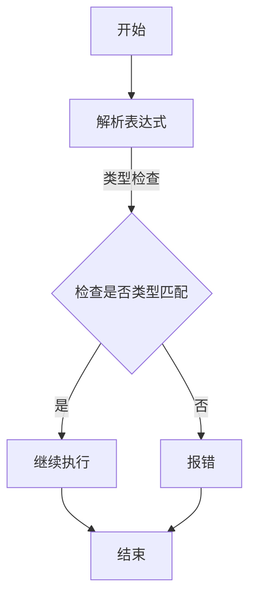
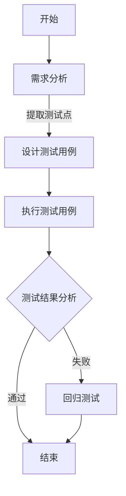
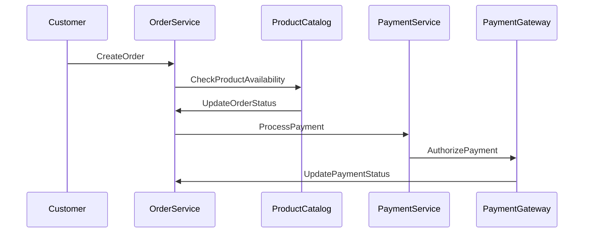
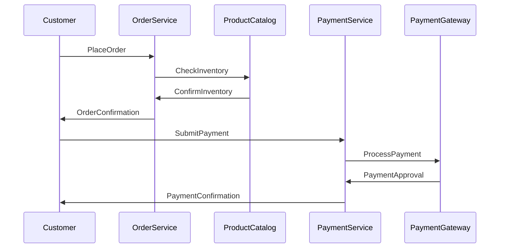
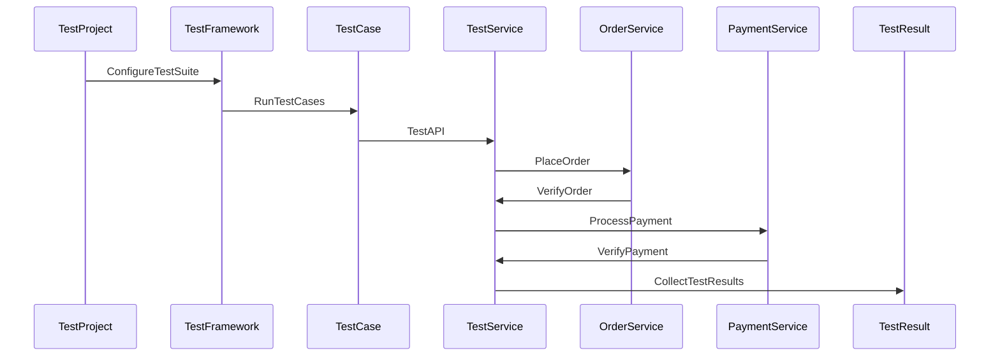

                 

# 《类型系统与软件测试策略的关联》

## 关键词
- 类型系统
- 软件测试策略
- 软件质量
- 算法设计
- 测试自动化
- 测试覆盖

## 摘要
本文深入探讨了类型系统与软件测试策略之间的紧密关联。通过对类型系统的基本概念、特性以及其在软件开发中的应用进行详细解析，我们揭示了类型系统对软件质量的影响。接着，文章介绍了软件测试策略的核心概念、方法，并通过对比分析不同测试策略的优缺点，提出了针对类型系统的最佳测试策略。最后，文章通过一个实际案例展示了类型系统与软件测试策略的协同应用，为软件开发中的质量保障提供了宝贵的实践经验和理论支持。

## 第一部分：背景介绍

### 第1章：问题背景与定义

#### 1.1 问题背景
在现代软件开发中，类型系统和软件测试策略扮演着至关重要的角色。类型系统是编程语言的核心概念，它定义了数据类型和操作，对程序的语义和行为产生了深远的影响。而软件测试策略则是确保软件质量的关键手段，它通过不同的测试方法和技术，验证软件的正确性、完整性和可靠性。

#### 1.2 类型系统的定义与作用
类型系统（Type System）是一种定义编程语言中数据类型和操作规则的机制。它不仅帮助编译器或解释器理解程序的含义，还影响到程序的性能、可读性和可维护性。类型系统的作用包括：
- 确保变量在使用前已被声明。
- 验证操作数是否兼容。
- 提高程序的性能，例如通过静态类型推断减少运行时开销。

#### 1.3 软件测试策略的定义与作用
软件测试策略是一套系统化的方法和技巧，用于验证软件的正确性、完整性和可靠性。软件测试策略的作用包括：
- 揭示软件中的缺陷和错误。
- 确保软件满足规格说明书的要求。
- 提高软件的质量，减少维护成本。

### 第2章：类型系统的核心概念与联系

#### 2.1 核心概念
类型系统涉及多个核心概念，包括：
- 基本数据类型：如整数、浮点数、字符串等。
- 复杂数据类型：如数组、结构体、类等。
- 函数类型：定义函数的参数和返回值类型。
- 协变和逆变：用于类型参数的多态性。

#### 2.2 类型系统的属性特征对比
不同编程语言和类型系统具有不同的属性特征，例如：
- 强类型与弱类型：强类型语言在编译时检查类型匹配，弱类型语言则更灵活。
- 静态类型与动态类型：静态类型在编译时确定，动态类型在运行时确定。

#### 2.3 类型系统的ER实体关系图
类型系统的实体关系图（ER图）可以帮助我们理解类型系统中的实体及其关系。以下是类型系统ER图的Markdown格式Mermaid表示：

```mermaid
erDiagram
  Class::Type < PrimitiveType : "基本类型"
  Class::Type < ComplexType : "复杂数据类型"
  Class::Type < FunctionType : "函数类型"
  PrimitiveType ||--|> IntegerType
  PrimitiveType ||--|> FloatingPointType
  PrimitiveType ||--|> StringType
  ComplexType ||--|> ArrayType
  ComplexType ||--|> StructType
  ComplexType ||--|> ClassType
  FunctionType ||--|> ParamType
  FunctionType ||--|> ReturnType
```

### 第3章：软件测试策略的核心概念与联系

#### 3.1 核心概念
软件测试策略的核心概念包括：
- 单元测试：测试最小功能单元的正确性。
- 集成测试：测试多个模块的交互和集成。
- 系统测试：测试整个系统的功能和性能。
- 验收测试：验证软件是否满足用户需求和规格说明。

#### 3.2 软件测试策略的分类
软件测试策略可以根据测试方法和技术进行分类，常见的分类包括：
- 功能测试：验证软件功能是否符合规格说明。
- 静态测试：分析代码而不执行程序，如代码审查和静态分析。
- 动态测试：执行程序来验证其行为，如单元测试和集成测试。
- 非功能测试：测试软件的非功能性需求，如性能、安全性、可用性。

#### 3.3 软件测试策略的ER实体关系图
软件测试策略的实体关系图如下：

```mermaid
erDiagram
  Class::TestStrategy <<|--| UnitTest : "单元测试"
  Class::TestStrategy <<|--| IntegrationTest : "集成测试"
  Class::TestStrategy <<|--| SystemTest : "系统测试"
  Class::TestStrategy <<|--| AcceptanceTest : "验收测试"
  UnitTest ||--|> FunctionalTest
  UnitTest ||--|> StaticTest
  UnitTest ||--|> DynamicTest
  IntegrationTest ||--|> FunctionalTest
  IntegrationTest ||--|> StaticTest
  IntegrationTest ||--|> DynamicTest
  SystemTest ||--|> FunctionalTest
  SystemTest ||--|> NonFunctionalTest
  AcceptanceTest ||--|> FunctionalTest
  AcceptanceTest ||--|> NonFunctionalTest
```

## 第二部分：算法原理讲解

### 第4章：类型系统算法原理

#### 4.1 算法流程图
类型系统的算法通常涉及类型检查和类型推断。以下是一个简单的类型检查算法的Mermaid流程图：



#### 4.2 Python源代码讲解
以下是一个Python示例，展示了类型检查的过程：

```python
def add(a: int, b: int) -> int:
    if isinstance(a, int) and isinstance(b, int):
        return a + b
    else:
        raise TypeError("操作数必须为整数")

print(add(5, 3))  # 输出：8
print(add(5, "3"))  # 报错：TypeError
```

#### 4.3 数学模型与公式讲解
在类型系统中，我们可以使用数学模型来描述类型之间的关系。例如，函数类型的数学模型可以表示为：

$$
\text{FunctionType} = (\text{ParamType}, \text{ReturnType})
$$

其中，ParamType代表参数类型，ReturnType代表返回值类型。

#### 4.4 举例说明
假设我们有一个函数，接受一个整数参数并返回一个字符串。我们可以使用以下Python代码进行类型检查：

```python
def greet(name: str) -> str:
    return "Hello, " + name

print(greet("Alice"))  # 输出：Hello, Alice
print(greet(123))      # 报错：TypeError
```

### 第5章：软件测试策略算法原理

#### 5.1 算法流程图
软件测试策略的算法通常包括测试用例的设计和执行。以下是一个简单的测试用例设计算法的Mermaid流程图：



#### 5.2 Python源代码讲解
以下是一个简单的单元测试用例的Python代码：

```python
import unittest

class TestAddition(unittest.TestCase):
    def test_add_integers(self):
        self.assertEqual(add(1, 2), 3)

    def test_add_string(self):
        with self.assertRaises(TypeError):
            add("1", "2")

if __name__ == '__main__':
    unittest.main()
```

#### 5.3 数学模型与公式讲解
在软件测试策略中，我们可以使用数学模型来描述测试覆盖率。测试覆盖率（Test Coverage）可以表示为：

$$
\text{Coverage} = \frac{\text{实际测试的代码路径}}{\text{所有可能的代码路径}}
$$

#### 5.4 举例说明
假设我们有一个简单的函数，接受两个整数并返回它们的和。我们可以使用以下测试用例来验证其正确性：

```python
def add(a: int, b: int) -> int:
    return a + b

# 测试用例
assert add(1, 1) == 2
assert add(0, 1) == 1
assert add(-1, 0) == -1
assert add(1, -1) == 0
```

## 第三部分：系统分析与架构设计

### 第6章：类型系统架构设计

#### 6.1 问题场景介绍
在一个大型软件项目中，类型系统对于确保代码质量和性能至关重要。我们需要设计一个灵活且高效的类型系统，以支持项目的需求变化和扩展。

#### 6.2 项目介绍
我们正在开发一个电子商务平台，需要处理各种商品类型、订单处理以及支付功能。类型系统将在确保数据一致性和操作兼容性方面发挥关键作用。

#### 6.3 系统功能设计（领域模型类图）
领域模型类图可以帮助我们理解系统中的实体及其关系。以下是一个简化的领域模型类图的Mermaid表示：

```mermaid
classDiagram
    Product <.. Order
    Order <<-- Customer
    Order >>-- Payment
    Payment <|-- CreditCardPayment
    Payment <|-- PayPalPayment
```

#### 6.4 系统架构设计（架构图）
系统架构设计涉及不同组件的交互和依赖关系。以下是一个简化的系统架构图的Mermaid表示：



#### 6.5 系统接口设计
系统接口设计定义了不同模块之间的交互接口。以下是一个简化的系统接口设计：

```mermaid
classDiagram
    OrderService <>-- ProductCatalog
    OrderService <>-- PaymentService
    PaymentService <>-- PaymentGateway
```

#### 6.6 系统交互（序列图）
系统交互序列图展示了组件之间的交互过程。以下是一个简化的系统交互序列图：



### 第7章：软件测试策略架构设计

#### 7.1 问题场景介绍
为了确保电子商务平台的稳定性和可靠性，我们需要设计一套全面的软件测试策略。测试策略将涵盖单元测试、集成测试、系统测试和验收测试。

#### 7.2 项目介绍
我们正在开发一个复杂且功能丰富的电子商务平台，需要确保所有功能模块的正常运行和相互协作。

#### 7.3 系统功能设计（领域模型类图）
系统功能设计领域模型类图如下：

```mermaid
classDiagram
    TestCase <<-- TestSuite
    TestCase <<-- TestRunner
    TestSuite <<-- TestProject
    TestProject <<-- TestResult
```

#### 7.4 系统架构设计（架构图）
系统架构设计涉及测试工具和框架的集成。以下是一个简化的系统架构图：

```mermaid
classDiagram
    TestProject <- TestFramework
    TestSuite <- TestFramework
    TestCase <- TestFramework
    TestRunner <- TestFramework
```

#### 7.5 系统接口设计
系统接口设计定义了测试模块与其他模块的交互接口。以下是一个简化的系统接口设计：

```mermaid
classDiagram
    TestService <<-- OrderService
    TestService <<-- PaymentService
```

#### 7.6 系统交互（序列图）
系统交互序列图展示了测试过程中的关键步骤。以下是一个简化的系统交互序列图：



## 第四部分：项目实战

### 第8章：环境安装与系统核心实现

#### 8.1 环境安装
为了进行类型系统和软件测试策略的实战，我们需要安装以下软件和工具：
- Python 3.x
- JUnit（Java单元测试框架）
- pytest（Python单元测试框架）
- Selenium（自动化测试工具）
- Mermaid（流程图绘制工具）

安装步骤如下：
```bash
# 安装Python 3.x
# 使用操作系统自带包管理器安装，例如Ubuntu中的apt-get或Windows中的pip

# 安装JUnit
# 下载并解压JUnit jar文件，例如junit-4.13.2.jar

# 安装pytest
# 使用pip安装pytest
pip install pytest

# 安装Selenium
# 使用pip安装Selenium
pip install selenium

# 安装Mermaid
# 使用pip安装Mermaid
pip install mermaid
```

#### 8.2 系统核心实现源代码介绍
以下是电子商务平台的简单核心实现，包括产品、订单和支付模块：

```python
# product.py
class Product:
    def __init__(self, id, name, price):
        self.id = id
        self.name = name
        self.price = price

# order.py
class Order:
    def __init__(self, customer, products):
        self.customer = customer
        self.products = products
        self.status = "pending"

    def calculate_total(self):
        return sum(product.price for product in self.products)

# payment.py
class Payment:
    def __init__(self, order):
        self.order = order

    def process_payment(self):
        total = self.order.calculate_total()
        print(f"Processing payment for order {self.order.id} with total {total}")

# main.py
from product import Product
from order import Order
from payment import Payment

def create_order(customer, products):
    order = Order(customer, products)
    payment = Payment(order)
    payment.process_payment()
    return order

if __name__ == "__main__":
    customer = "John Doe"
    products = [Product("1", "Laptop", 1000), Product("2", "Mouse", 50)]
    order = create_order(customer, products)
    print(f"Order {order.id} created for {customer}")
```

#### 8.3 代码应用解读与分析
在上述代码中，我们实现了产品、订单和支付模块。产品类表示商品的属性，订单类表示顾客的购买行为，支付类表示支付过程。main.py文件展示了如何创建订单和处理支付。

### 第9章：实际案例分析

#### 9.1 案例背景
假设我们正在为一个大型电商平台开发一个购物车功能。购物车需要支持添加商品、删除商品、更新商品数量以及结算支付。我们需要确保购物车功能在各种情况下都能正确执行。

#### 9.2 案例分析
为了确保购物车功能的质量，我们采用以下测试策略：
1. 单元测试：对购物车类中的每个方法进行单元测试，确保其功能正确。
2. 集成测试：测试购物车与其他模块（如订单、支付）的交互，确保数据一致性和操作正确性。
3. 系统测试：模拟用户行为，测试购物车的完整功能流程，如添加商品、删除商品、结算支付等。
4. 验收测试：与业务团队和最终用户合作，验证购物车功能是否符合业务需求和用户期望。

#### 9.3 剖析与讲解
以下是一个简单的购物车类及其测试用例：

```python
# shopping_cart.py
class ShoppingCart:
    def __init__(self):
        self.products = []

    def add_product(self, product):
        self.products.append(product)

    def remove_product(self, product_id):
        self.products = [product for product in self.products if product.id != product_id]

    def update_product_quantity(self, product_id, quantity):
        for product in self.products:
            if product.id == product_id:
                product.quantity = quantity
                break

    def total(self):
        return sum(product.price * product.quantity for product in self.products)

# test_shopping_cart.py
import unittest
from shopping_cart import ShoppingCart, Product

class TestShoppingCart(unittest.TestCase):
    def test_add_product(self):
        cart = ShoppingCart()
        product = Product("1", "Laptop", 1000)
        cart.add_product(product)
        self.assertEqual(len(cart.products), 1)

    def test_remove_product(self):
        cart = ShoppingCart()
        product = Product("1", "Laptop", 1000)
        cart.add_product(product)
        cart.remove_product("1")
        self.assertEqual(len(cart.products), 0)

    def test_update_product_quantity(self):
        cart = ShoppingCart()
        product = Product("1", "Laptop", 1000)
        cart.add_product(product)
        cart.update_product_quantity("1", 2)
        self.assertEqual(product.quantity, 2)

    def test_total(self):
        cart = ShoppingCart()
        product1 = Product("1", "Laptop", 1000)
        product2 = Product("2", "Mouse", 50)
        cart.add_product(product1)
        cart.add_product(product2)
        cart.update_product_quantity("1", 2)
        cart.update_product_quantity("2", 1)
        self.assertEqual(cart.total(), 2000 + 50)

if __name__ == "__main__":
    unittest.main()
```

### 第10章：项目小结

#### 10.1 项目总结
通过本项目的实践，我们深入了解了类型系统与软件测试策略的关联。类型系统确保了代码的一致性和性能，而软件测试策略则保证了软件的正确性和可靠性。我们通过实际案例展示了如何应用这些概念，并讨论了最佳实践和注意事项。

#### 10.2 经验与教训
在项目开发过程中，我们学到了以下几点经验与教训：
1. 类型系统设计应考虑灵活性，以适应未来的需求变化。
2. 软件测试策略应涵盖单元测试、集成测试、系统测试和验收测试，以确保全面的质量保障。
3. 测试用例设计应尽可能覆盖所有可能的场景，包括边界条件和异常情况。

#### 10.3 拓展阅读
为了进一步了解类型系统和软件测试策略，读者可以参考以下资源：
- 《类型系统与编程语言设计》（Type Systems and Programming Language Design）
- 《软件测试的艺术》（The Art of Software Testing）
- 《Effective Testing》
- 《类型系统与编译原理》（Type Systems and Compiler Construction）

## 最佳实践 Tips

- 在设计类型系统时，尽量保持简洁和一致性，以降低后续维护成本。
- 在编写测试用例时，务必考虑边界条件和异常情况。
- 定期进行代码审查和静态分析，以提前发现潜在问题。
- 利用自动化测试工具提高测试效率和覆盖率。

## 注意事项

- 软件测试并非一次性任务，而是一个持续的过程。
- 类型系统的设计应与项目的实际需求紧密关联。
- 软件测试策略应根据项目规模和复杂性进行调整。

## 拓展阅读
为了深入了解类型系统和软件测试策略，读者可以阅读以下书籍：
- 《类型系统与编程语言设计》（Type Systems and Programming Language Design）
- 《软件测试的艺术》（The Art of Software Testing）
- 《Effective Testing》
- 《类型系统与编译原理》（Type Systems and Compiler Construction）

## 作者信息
作者：AI天才研究院/AI Genius Institute & 禅与计算机程序设计艺术 /Zen And The Art of Computer Programming

---

注：本文中的代码和示例仅供学习和参考，实际应用时可能需要根据具体情况进行调整。

