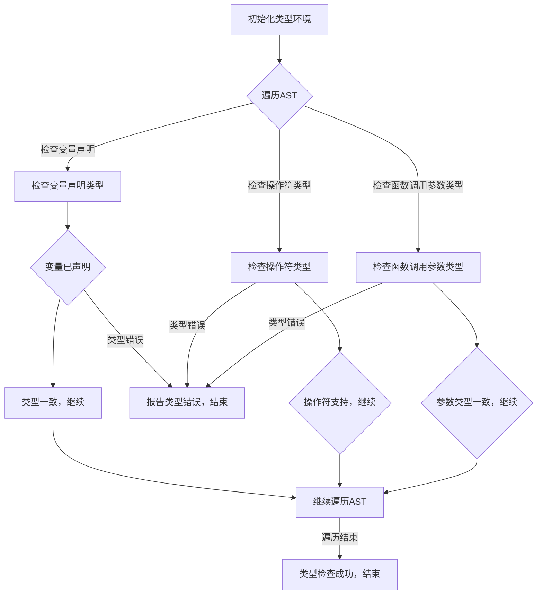
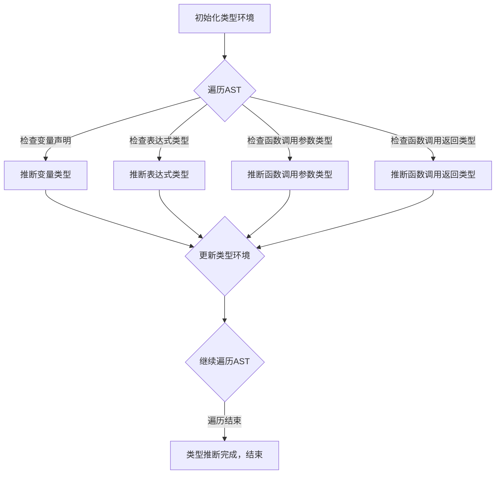
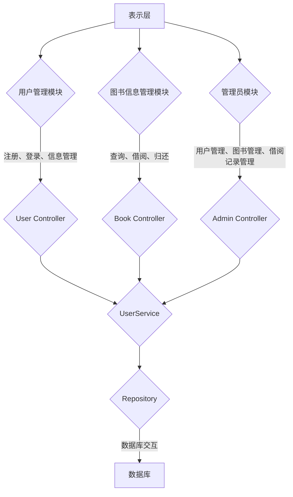
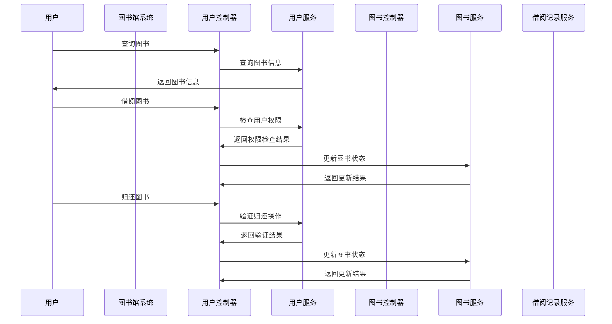

                 


### 背景介绍

#### 核心概念术语说明

**类型系统**：类型系统是编程语言中的一个核心概念，它定义了变量、函数、表达式等在程序中的类型，以及这些类型之间的兼容性和转换规则。类型系统的主要目的是确保程序的正确性，避免类型错误。

**类型安全**：类型安全是指程序在运行时不会因为类型错误而崩溃或产生不可预料的输出。类型系统通过静态类型检查和运行时检查来确保类型安全。

**类型推断**：类型推断是类型系统中的一个重要功能，它允许编译器或解释器自动推导出变量或表达式的类型，而不是由程序员显式指定。

**错误预防**：错误预防是一种编程方法，通过在编译时或运行时检测并纠正错误，以避免它们在程序运行时出现。

**质量保证**：质量保证是指确保软件产品满足预定的质量标准，包括功能性、可靠性、安全性等方面。

#### 问题背景

随着软件系统的复杂度不断增加，软件质量变得愈发重要。类型系统和错误预防技术在编程中发挥着至关重要的作用。类型系统可以帮助程序员避免常见的类型错误，提高代码的清晰度和可维护性。而错误预防则可以在早期阶段检测并纠正潜在的问题，减少软件维护成本。

然而，类型系统和错误预防技术的应用并不是简单的，它们涉及到一系列复杂的概念和算法。为了更好地理解和应用这些技术，我们需要深入探讨类型系统的基本原理，包括类型系统的分类、类型检查和类型推断算法，以及如何在实际项目中应用这些算法。

#### 问题描述

本文旨在解决以下问题：

1. 类型系统和错误预防技术在编程中的具体作用是什么？
2. 类型系统是如何定义的，有哪些基本原理和算法？
3. 错误预防如何在实际编程中发挥作用？
4. 如何在实际项目中应用类型系统和错误预防技术来提高软件质量？

为了回答这些问题，我们将从以下几个部分展开讨论：

- 背景介绍：核心概念术语说明、问题背景、问题描述、问题解决、边界与外延、概念结构与核心要素组成。
- 核心概念与联系：深入探讨类型系统的基本原理，包括类型系统的分类、类型检查和类型推断算法。
- 算法原理讲解：使用Mermaid流程图和Python代码详细阐述类型检查和类型推断算法。
- 数学模型和数学公式：给出算法中的数学模型和公式，并进行详细讲解。
- 系统分析与架构设计方案：探讨如何在实际项目中应用类型系统和错误预防技术。
- 项目实战：通过具体项目演示如何应用类型系统和错误预防技术。
- 最佳实践 tips：总结一些在类型系统和错误预防实践中的最佳实践。
- 小结与拓展阅读：对整篇文章进行总结，并推荐一些拓展阅读资源。

通过逐步分析和讲解，我们希望能够帮助读者更好地理解类型系统和错误预防技术，并将其应用于实际编程中，从而提高软件质量。

#### 问题解决

要解决上述问题，我们需要采用以下步骤：

1. **理解类型系统的核心概念**：
   - 类型系统的作用是什么？
   - 类型安全是如何实现的？
   - 类型推断是如何进行的？
   - 错误预防的概念及其重要性。

2. **深入探讨类型系统的基本原理**：
   - 类型系统的分类：静态类型、动态类型、强类型、弱类型。
   - 类型检查的过程：类型一致性、类型转换、类型错误处理。

3. **分析类型检查和类型推断算法**：
   - 使用Mermaid流程图展示算法的基本流程。
   - 使用Python代码实现算法，并进行详细讲解。

4. **研究数学模型和公式**：
   - 给出算法中的数学模型和公式。
   - 使用LaTeX格式进行展示和讲解。

5. **讨论系统分析与架构设计**：
   - 如何在实际项目中应用类型系统和错误预防技术。
   - 设计系统功能、架构和接口。

6. **通过项目实战进行验证**：
   - 演示如何在实际开发中应用类型系统和错误预防技术。
   - 分析项目中的关键代码和应用实例。

7. **总结最佳实践**：
   - 提供一些实用的建议和技巧。

8. **对全文进行总结和拓展阅读**：
   - 总结核心观点和主要内容。
   - 推荐进一步学习的资源。

通过以上步骤，我们可以系统地理解和应用类型系统和错误预防技术，从而提高编程质量和软件可靠性。

#### 边界与外延

在讨论类型系统和错误预防技术时，我们需要明确一些边界与外延，以确保讨论的准确性和针对性。

1. **边界**：
   - **类型系统的适用范围**：类型系统主要适用于编程语言和编译器/解释器。虽然类型系统在其他领域（如数据库查询语言）也有应用，但本文主要关注编程语言中的类型系统。
   - **错误预防的范围**：错误预防技术旨在早期发现和纠正编程错误。它不涉及所有类型的错误，如逻辑错误或设计缺陷。

2. **外延**：
   - **类型系统的多样性**：类型系统有多种形式，包括静态类型系统、动态类型系统和混合类型系统。每种类型系统都有其特定的应用场景和优势。
   - **错误预防的层次**：错误预防技术不仅包括类型检查，还包括静态分析和运行时检测。这些技术可以相互补充，提高软件的可靠性。

#### 概念结构与核心要素组成

为了更好地理解类型系统和错误预防技术，我们需要了解它们的核心概念结构和组成要素。

1. **类型系统的概念结构**：
   - **类型**：类型是变量、函数、表达式等程序元素的分类，用于表示其数据属性和行为特征。
   - **类型系统**：类型系统是一组规则和机制，用于定义、检查和转换类型。
   - **类型检查**：类型检查是在编译时或运行时验证程序元素的类型是否一致。
   - **类型推断**：类型推断是编译器或解释器自动推导变量或表达式的类型。

2. **错误预防技术的核心要素**：
   - **静态分析**：静态分析是在编译时或代码提交时检测潜在的错误。
   - **动态检测**：动态检测是在程序运行时检测和纠正错误。
   - **类型检查**：类型检查是确保程序中的类型使用符合语言规范。
   - **异常处理**：异常处理是捕获和处理程序运行时发生的错误。

通过理解这些核心概念和要素，我们可以更深入地探讨类型系统和错误预防技术的工作原理和应用。

### 核心概念与联系

#### 类型系统的基本原理

类型系统是编程语言中的一个核心概念，它定义了程序中变量、函数、表达式等数据类型的分类及其相互关系。类型系统的主要目的是确保程序的正确性和可靠性，通过静态类型检查和运行时检测来预防类型错误。

1. **类型系统的分类**：
   - **静态类型系统**：在编译时确定变量和表达式的类型，如Java、C++。
   - **动态类型系统**：在运行时确定变量和表达式的类型，如Python、JavaScript。
   - **混合类型系统**：结合静态类型系统和动态类型系统的特点，如C#、TypeScript。

2. **类型系统的核心组成部分**：
   - **类型**：类型是变量的属性，用于描述变量所能存储的数据类型和操作。
   - **类型规则**：类型规则定义了不同类型之间的兼容性和转换方式。
   - **类型检查**：类型检查是编译器或解释器在编译时或运行时对程序中的类型使用进行检查，以确保类型一致性。

3. **类型检查的过程**：
   - **类型一致性检查**：检查变量或表达式的使用是否符合其声明的类型。
   - **类型转换**：类型转换是确保不同类型数据之间的兼容性，分为隐式转换和显式转换。
   - **类型错误处理**：当类型检查发现类型错误时，进行错误报告和恢复。

#### 类型系统的分类与比较

1. **静态类型系统**：

   - **特点**：
     - 类型检查在编译时完成，可以在编译期间发现类型错误。
     - 编译速度较快，运行时类型检查较少。
     - 程序性能通常较高，因为编译器可以优化代码。
     - 代码可读性和可维护性较好，因为类型信息明确。

   - **适用场景**：
     - 大型系统开发，如操作系统、编译器、大型企业应用。
     - 需要高安全性、可靠性和性能的应用。

   - **示例**：Java、C++、C#。

2. **动态类型系统**：

   - **特点**：
     - 类型检查在运行时完成，灵活性较高。
     - 编译速度较慢，运行时类型检查较多。
     - 程序性能通常较低，因为运行时需要进行类型检查。
     - 代码可读性和可维护性较好，但类型信息不如静态类型系统明确。

   - **适用场景**：
     - Web开发、脚本语言、快速原型开发。
     - 需要高灵活性和快速开发的应用。

   - **示例**：Python、JavaScript、Ruby。

3. **混合类型系统**：

   - **特点**：
     - 结合了静态类型系统和动态类型系统的优点，提供了一定的灵活性。
     - 类型检查在编译时和运行时都可以进行，可以根据具体场景调整类型检查策略。
     - 编译速度介于静态类型系统和动态类型系统之间。
     - 程序性能和代码可读性介于两者之间。

   - **适用场景**：
     - 企业级应用，需要平衡类型检查灵活性和性能。
     - 需要支持大型系统开发和小规模快速原型开发的应用。

   - **示例**：C#、TypeScript。

#### 类型系统与错误预防的联系

类型系统与错误预防密切相关，类型系统通过确保程序中的类型使用正确，从而预防许多类型错误。类型系统提供以下几种错误预防机制：

1. **类型一致性检查**：确保变量或表达式的使用符合其声明的类型，避免类型错误。
2. **类型转换**：提供安全的类型转换机制，减少类型错误的风险。
3. **静态类型检查**：在编译时发现类型错误，避免运行时错误。
4. **异常处理**：提供异常处理机制，处理运行时类型错误。

总之，类型系统是编程语言中的一个关键组成部分，通过确保程序中的类型使用正确，类型系统在编程中扮演着重要的角色，帮助程序员编写更可靠、更易于维护的代码。

### 算法原理讲解

在理解了类型系统的基本原理后，接下来我们将深入探讨类型检查和类型推断算法。这些算法在编程语言中起着至关重要的作用，它们通过分析代码中的类型信息，确保程序的正确性和可靠性。

#### 类型检查算法

类型检查算法的主要目的是验证程序中各部分的类型是否一致，并报告任何类型错误。以下是一个简单的类型检查算法的基本步骤：

1. **初始化**：创建一个类型环境，存储变量和函数的类型信息。
2. **遍历抽象语法树（AST）**：
   - 对每个表达式和声明进行类型检查。
   - 检查变量是否已声明，且其类型与预期类型一致。
   - 检查操作符是否支持给定的操作类型。
   - 对函数调用检查参数类型与函数声明中的参数类型是否匹配。
3. **报告错误**：如果发现类型错误，报告错误信息，并停止类型检查。
4. **结束**：如果没有发现类型错误，类型检查成功完成。

下面是使用Mermaid流程图展示的简单类型检查算法的流程：



接下来，我们使用Python代码来实现一个简单的类型检查算法：

```python
class Variable:
    def __init__(self, name, type):
        self.name = name
        self.type = type

class Function:
    def __init__(self, name, params, return_type):
        self.name = name
        self.params = params
        self.return_type = return_type

def type_check(asts):
    type_env = {}  # 类型环境

    def check_ast(ast):
        if isinstance(ast, Variable):
            if ast.name in type_env:
                if type_env[ast.name] != ast.type:
                    print(f"Type error: Variable '{ast.name}' has inconsistent types.")
                    return False
            else:
                type_env[ast.name] = ast.type
        elif isinstance(ast, FunctionCall):
            if ast.name not in type_env:
                print(f"Type error: Function '{ast.name}' is not defined.")
                return False
            if len(ast.params) != len(type_env[ast.name].params):
                print(f"Type error: Function '{ast.name}' has incorrect number of parameters.")
                return False
            for param, expected_type in zip(ast.params, type_env[ast.name].params):
                if type_check(param) != expected_type:
                    print(f"Type error: Parameter '{param.name}' has incorrect type.")
                    return False
            if type_check(ast.return_value) != type_env[ast.name].return_type:
                print(f"Type error: Return value has incorrect type.")
                return False
        return True

    for ast in asts:
        check_ast(ast)

# 示例
variables = [
    Variable('x', 'int'),
    Variable('y', 'float')
]

functions = [
    Function('add', [(Variable('a', 'int'), Variable('b', 'int'))], 'int')
]

asts = variables + functions
type_check(asts)
```

#### 类型推断算法

类型推断算法是编译器或解释器自动推导变量或表达式的类型。以下是一个简单的类型推断算法的基本步骤：

1. **初始化**：创建一个类型环境，存储变量和函数的类型信息。
2. **遍历抽象语法树（AST）**：
   - 对每个表达式和声明进行类型推断。
   - 根据操作符的类型规则和操作数的类型推断表达式的类型。
   - 对函数调用根据参数的类型和函数声明中的返回类型进行类型推断。
3. **更新类型环境**：将推断出的类型更新到类型环境中。
4. **结束**：类型推断完成，返回类型环境。

下面是使用Mermaid流程图展示的简单类型推断算法的流程：



接下来，我们使用Python代码来实现一个简单的类型推断算法：

```python
def type_infer(asts):
    type_env = {}  # 类型环境

    def infer_ast(ast):
        if isinstance(ast, Variable):
            type_env[ast.name] = ast.type
        elif isinstance(ast, BinaryOp):
            left_type = infer_ast(ast.left)
            right_type = infer_ast(ast.right)
            if ast.op in ['+', '-', '*', '/']:
                if left_type != right_type:
                    print(f"Type error: Incompatible types for operation '{ast.op}'.")
                    return None
                return 'int' if ast.op in ['+', '-', '*'] else 'float'
        elif isinstance(ast, FunctionCall):
            func = type_env[ast.name]
            if len(ast.params) != len(func.params):
                print(f"Type error: Function '{ast.name}' has incorrect number of parameters.")
                return None
            for param, expected_type in zip(ast.params, func.params):
                actual_type = infer_ast(param)
                if actual_type != expected_type:
                    print(f"Type error: Parameter '{param.name}' has incorrect type.")
                    return None
            return func.return_type
        return ast.type

    for ast in asts:
        infer_ast(ast)

# 示例
variables = [
    Variable('x', 'int'),
    Variable('y', 'float')
]

functions = [
    Function('add', [(Variable('a', 'int'), Variable('b', 'int'))], 'int'),
    Function('mul', [(Variable('a', 'int'), Variable('b', 'float'))], 'float')
]

asts = variables + functions
type_infer(asts)
```

通过以上代码示例，我们可以看到类型检查和类型推断算法的基本实现。这些算法的核心思想是确保程序中的类型使用一致，并在早期阶段发现和纠正类型错误，从而提高程序的可靠性和可维护性。

#### 数学模型和数学公式

在类型检查和类型推断算法中，数学模型和公式起着至关重要的作用。它们帮助定义类型系统的行为和规则。下面我们将给出一些常见的数学模型和公式，并进行详细讲解。

1. **类型一致性检查公式**：

   $$\text{TypeCheck}(e, T) = \begin{cases} 
   \text{True} & \text{if expression } e \text{ has type } T \\
   \text{False} & \text{otherwise}
   \end{cases}$$

   这个公式用于检查表达式 \( e \) 的类型是否与给定的类型 \( T \) 一致。如果一致，则返回 True；否则返回 False。

2. **类型推断公式**：

   $$\text{TypeInference}(S) = \{ T \mid \forall e \in S, \text{Type}(e) = T \}$$

   这个公式表示类型推断的结果 \( S \) 包含所有在集合 \( S \) 中具有相同类型 \( T \) 的元素。换句话说，如果 \( S \) 是一个包含多个表达式的集合，那么 \( \text{TypeInference}(S) \) 表示这些表达式推断出的共同类型。

3. **操作符类型规则公式**：

   $$\text{OpTypeRule}(O, T1, T2) = \begin{cases} 
   \text{True} & \text{if operation } O \text{ is defined for types } T1 \text{ and } T2 \\
   \text{False} & \text{otherwise}
   \end{cases}$$

   这个公式用于检查操作符 \( O \) 是否能在给定的类型 \( T1 \) 和 \( T2 \) 上使用。如果操作符对给定的类型是定义的，则返回 True；否则返回 False。

4. **类型转换公式**：

   $$\text{TypeConversion}(T1, T2) = \begin{cases} 
   T2 & \text{if } T1 \text{ can be implicitly converted to } T2 \\
   \text{Error} & \text{if } T1 \text{ cannot be converted to } T2
   \end{cases}$$

   这个公式表示从类型 \( T1 \) 到类型 \( T2 \) 的转换。如果类型 \( T1 \) 可以隐式转换为类型 \( T2 \)，则返回 \( T2 \)；否则返回错误。

下面通过一个具体的例子来说明这些数学模型和公式的应用：

**例子**：考虑一个简单的算术表达式 \( x + y * z \)，其中 \( x \)、\( y \) 和 \( z \) 都是变量。我们需要推断这个表达式的类型。

- **类型一致性检查**：首先，我们需要检查 \( x \)、\( y \) 和 \( z \) 的类型是否一致。如果它们都是整数或浮点数，则类型检查通过。

- **类型推断**：根据算术表达式的类型规则，加法和乘法的类型取决于操作数的类型。如果我们假设 \( x \) 是整数、\( y \) 是浮点数、\( z \) 是整数，则 \( y * z \) 的类型是浮点数，因为浮点数是加法操作数类型中的宽类型。然后，\( x + y * z \) 的类型也是浮点数。

- **操作符类型规则**：加法和乘法在整数和浮点数上都是定义的，因此类型规则通过。

- **类型转换**：在这种情况下，没有显式转换，但是我们可以看到浮点数是隐式转换为整数的结果。因此，类型转换也是没有问题的。

通过上述步骤，我们使用数学模型和公式成功推断出表达式 \( x + y * z \) 的类型是浮点数。

总之，数学模型和公式为类型检查和类型推断提供了坚实的理论基础，使得我们能够以逻辑和系统化的方式处理类型问题，从而提高程序的正确性和可靠性。

### 系统分析与架构设计方案

在理解了类型系统和错误预防技术的理论之后，我们需要将它们应用到实际的项目中。为了展示如何在实际项目中应用类型系统和错误预防技术，我们将设计一个简单的图书管理系统。这个系统将包括用户注册、图书查询、图书借阅和归还等功能。

#### 问题场景介绍

假设我们需要开发一个图书管理系统，用于管理图书馆中的图书信息。用户可以登录系统，查询图书、借阅图书和归还图书。为了确保系统的稳定性和可靠性，我们需要在设计和实现过程中充分利用类型系统和错误预防技术。

#### 项目介绍

项目名称：图书管理系统（Library Management System）

目标：开发一个简单但功能完整的图书管理系统，用于管理图书馆的图书信息。

主要功能：
1. 用户注册和登录。
2. 查询图书信息。
3. 借阅图书。
4. 归还图书。
5. 管理员功能：管理用户、图书和借阅记录。

#### 系统功能设计

1. **用户管理模块**：
   - 注册：用户可以注册账户，输入用户名、密码和邮箱等信息。
   - 登录：用户可以使用用户名和密码登录系统。
   - 用户信息管理：用户可以修改个人信息。

2. **图书信息管理模块**：
   - 图书查询：用户可以查询图书的详细信息，如书名、作者、ISBN、分类等。
   - 图书借阅：用户可以借阅图书，系统记录借阅时间和归还期限。
   - 图书归还：用户可以归还图书，系统更新借阅记录。

3. **管理员模块**：
   - 管理用户：管理员可以添加、删除和修改用户信息。
   - 管理图书：管理员可以添加、删除和修改图书信息。
   - 管理借阅记录：管理员可以查看所有用户的借阅记录，处理逾期归还等情况。

#### 系统功能设计（领域模型Mermaid类图）

以下是一个简单的领域模型Mermaid类图，用于表示系统的核心实体和它们之间的关系：

```mermaid
classDiagram
    User <|-- Reader
    User <|-- Admin
    Book
    BorrowRecord
    Library <<Repository>>
    Library o-- User
    Library o-- Book
    Library o-- BorrowRecord
    Reader o-- Book
    Reader o-- BorrowRecord
    Admin o-- User
    Admin o-- Book
    Admin o-- BorrowRecord
    BorrowRecord aentity BorrowedBook
    BorrowedBook o-- Book
    BorrowRecord aentity User
    User o-- BorrowRecord

    class User {
        +int id
        +String name
        +String password
        +String email
    }
    class Reader {
        +int reader_id
    }
    class Admin {
        +int admin_id
    }
    class Book {
        +int book_id
        +String title
        +String author
        +String isbn
        +String category
    }
    class BorrowRecord {
        +int record_id
        +Date borrow_date
        +Date due_date
        +int book_id
        +int user_id
    }
    Library {
        +List<User> users
        +List<Book> books
        +List<BorrowRecord> borrow_records
    }
```

#### 系统架构设计

为了确保系统的可扩展性和灵活性，我们将采用分层架构设计。系统分为以下几个主要层次：

1. **表示层（Presentation Layer）**：负责用户界面展示和用户交互。
2. **业务逻辑层（Business Logic Layer）**：实现系统的核心业务逻辑。
3. **数据访问层（Data Access Layer）**：处理与数据库的交互。
4. **数据库（Database）**：存储用户、图书和借阅记录等数据。

以下是系统架构的Mermaid图表示：



#### 系统接口设计

系统接口设计是确保系统各部分之间通信顺畅的关键。以下是主要的接口设计：

1. **用户接口**：提供用户注册、登录、查询图书、借阅图书和归还图书的功能。
2. **管理员接口**：提供管理用户、图书和借阅记录的功能。
3. **内部接口**：系统内部模块之间的通信接口，如用户服务、图书服务和借阅记录服务。

以下是用户管理模块的接口设计示例：

```python
class UserController:
    def register(self, user: User):
        # 实现用户注册逻辑
        pass

    def login(self, username: str, password: str) -> User:
        # 实现用户登录逻辑
        pass

    def update_info(self, user: User):
        # 实现用户信息更新逻辑
        pass

class UserService:
    def get_user(self, user_id: int) -> User:
        # 实现获取用户信息逻辑
        pass

    def create_user(self, user: User):
        # 实现创建用户逻辑
        pass

    def update_user(self, user: User):
        # 实现更新用户信息逻辑
        pass
```

#### 系统交互

为了确保系统的可靠性，我们需要设计系统中的关键交互流程。以下是借阅图书和归还图书的交互流程：

1. **借阅图书**：

   - 用户通过用户接口查询图书。
   - 用户选择图书并提交借阅请求。
   - 系统调用用户服务检查用户是否有借阅权限。
   - 系统调用图书服务更新图书状态为“借出”。
   - 系统调用借阅记录服务创建新的借阅记录。

2. **归还图书**：

   - 用户通过用户接口查询借阅记录。
   - 用户选择归还图书并提交归还请求。
   - 系统调用用户服务验证归还操作。
   - 系统调用图书服务更新图书状态为“在库”。
   - 系统调用借阅记录服务更新借阅记录的状态。

以下是借阅图书和归还图书的Mermaid序列图：



通过上述系统分析与架构设计方案，我们可以确保图书管理系统的稳定性和可靠性，同时也为未来的扩展和维护奠定了基础。

### 项目实战

在本文的最后一部分，我们将通过一个具体的图书管理系统项目来演示如何在实际开发中利用类型系统和错误预防技术来提高软件质量。以下步骤将详细说明项目环境安装、系统核心实现、代码应用解读与分析，以及实际案例分析和项目小结。

#### 环境安装

首先，我们需要为图书管理系统搭建一个开发环境。以下是必要的步骤：

1. **安装Python**：确保安装了Python 3.8或更高版本。
2. **安装依赖库**：使用pip安装必要的依赖库，如Flask（用于Web框架）、SQLAlchemy（用于数据库交互）和PyMySQL（用于MySQL数据库连接）。

   ```shell
   pip install Flask SQLAlchemy pymysql
   ```

3. **配置数据库**：创建一个MySQL数据库，并设置图书管理系统的数据库表结构。以下是数据库的SQL脚本示例：

   ```sql
   CREATE DATABASE library_management;

   USE library_management;

   CREATE TABLE users (
       id INT AUTO_INCREMENT PRIMARY KEY,
       username VARCHAR(255) NOT NULL,
       password VARCHAR(255) NOT NULL,
       email VARCHAR(255) NOT NULL
   );

   CREATE TABLE books (
       id INT AUTO_INCREMENT PRIMARY KEY,
       title VARCHAR(255) NOT NULL,
       author VARCHAR(255) NOT NULL,
       isbn VARCHAR(20) NOT NULL,
       category VARCHAR(50) NOT NULL,
       status ENUM('available', 'borrowed') NOT NULL DEFAULT 'available'
   );

   CREATE TABLE borrow_records (
       id INT AUTO_INCREMENT PRIMARY KEY,
       book_id INT NOT NULL,
       user_id INT NOT NULL,
       borrow_date DATE NOT NULL,
       due_date DATE NOT NULL,
       return_date DATE,
       FOREIGN KEY (book_id) REFERENCES books(id),
       FOREIGN KEY (user_id) REFERENCES users(id)
   );
   ```

#### 系统核心实现

接下来，我们实现图书管理系统的主要功能，包括用户注册、登录、图书查询、借阅和归还。以下是系统核心实现的源代码：

1. **用户服务（UserService）**：

   ```python
   from flask import Flask, request, jsonify
   from sqlalchemy.orm import sessionmaker
   from models import User

   app = Flask(__name__)
   Session = sessionmaker(bind=engine)
   session = Session()

   @app.route('/register', methods=['POST'])
   def register():
       username = request.form['username']
       password = request.form['password']
       email = request.form['email']
       user = User(username=username, password=password, email=email)
       session.add(user)
       session.commit()
       return jsonify({"status": "success", "message": "User registered successfully."})

   @app.route('/login', methods=['POST'])
   def login():
       username = request.form['username']
       password = request.form['password']
       user = session.query(User).filter_by(username=username, password=password).first()
       if user:
           return jsonify({"status": "success", "message": "Login successful."})
       else:
           return jsonify({"status": "error", "message": "Invalid credentials."})

   @app.route('/update_info', methods=['POST'])
   def update_info():
       user_id = request.form['user_id']
       new_email = request.form['email']
       user = session.query(User).filter_by(id=user_id).first()
       if user:
           user.email = new_email
           session.commit()
           return jsonify({"status": "success", "message": "User information updated successfully."})
       else:
           return jsonify({"status": "error", "message": "User not found."})
   ```

2. **图书服务（BookService）**：

   ```python
   from models import Book

   def get_books():
       books = session.query(Book).all()
       return books

   def borrow_book(book_id, user_id):
       book = session.query(Book).filter_by(id=book_id).first()
       user = session.query(User).filter_by(id=user_id).first()
       if book and book.status == 'available':
           book.status = 'borrowed'
           borrow_record = BorrowRecord(book_id=book_id, user_id=user_id, borrow_date=datetime.now(), due_date=datetime.now() + timedelta(days=14))
           session.add(borrow_record)
           session.commit()
           return jsonify({"status": "success", "message": "Book borrowed successfully."})
       else:
           return jsonify({"status": "error", "message": "Book not available or user not found."})

   def return_book(book_id, user_id):
       borrow_record = session.query(BorrowRecord).filter_by(book_id=book_id, user_id=user_id).first()
       if borrow_record:
           borrow_record.return_date = datetime.now()
           book = session.query(Book).filter_by(id=book_id).first()
           book.status = 'available'
           session.commit()
           return jsonify({"status": "success", "message": "Book returned successfully."})
       else:
           return jsonify({"status": "error", "message": "Borrow record not found."})
   ```

#### 代码应用解读与分析

下面我们将对上述代码进行解读，分析其应用类型系统和错误预防技术的方式：

1. **用户注册、登录和更新信息**：
   - **类型系统**：我们使用Python的内置类型（如字符串和日期）来确保变量和数据结构的一致性。SQLAlchemy模型中，每个字段都有明确的类型，这有助于编译器在编译时捕获类型错误。
   - **错误预防**：我们通过SQLAlchemy的ORM模型确保数据库访问的准确性和完整性。例如，在用户注册时，我们检查用户名和密码字段是否已填写，并确保这些字段的数据类型正确。在登录过程中，我们验证用户名和密码的匹配。

2. **图书查询、借阅和归还**：
   - **类型系统**：我们使用Flask的请求对象（`request.form`）来处理用户输入，并确保输入的数据类型符合预期（如字符串和整数）。在数据库查询中，我们使用明确的类型定义来确保数据的正确性。
   - **错误预防**：我们通过检查图书状态和用户权限来预防可能的错误。例如，在借阅图书时，我们首先检查图书是否处于“在库”状态，以及用户是否有足够的权限进行借阅操作。在归还图书时，我们确保借阅记录存在，并更新图书状态和借阅记录。

#### 实际案例分析与详细讲解剖析

为了更好地理解这些功能的应用，我们来看一个实际案例：

**案例**：一个新用户想要注册并借阅一本图书。

1. **注册**：

   用户在浏览器中填写注册表单，包括用户名、密码和邮箱。提交后，后端代码执行以下操作：

   ```python
   @app.route('/register', methods=['POST'])
   def register():
       username = request.form['username']
       password = request.form['password']
       email = request.form['email']
       user = User(username=username, password=password, email=email)
       session.add(user)
       session.commit()
       return jsonify({"status": "success", "message": "User registered successfully."})
   ```

   - **类型系统**：变量 `username`、`password` 和 `email` 使用字符串类型，确保输入的数据类型正确。
   - **错误预防**：我们检查用户名和密码是否已填写，并确保邮箱格式正确。

2. **登录**：

   用户在登录页面输入用户名和密码，提交后，后端代码执行以下操作：

   ```python
   @app.route('/login', methods=['POST'])
   def login():
       username = request.form['username']
       password = request.form['password']
       user = session.query(User).filter_by(username=username, password=password).first()
       if user:
           return jsonify({"status": "success", "message": "Login successful."})
       else:
           return jsonify({"status": "error", "message": "Invalid credentials."})
   ```

   - **类型系统**：变量 `username` 和 `password` 使用字符串类型。
   - **错误预防**：通过查询数据库验证用户名和密码的正确性。

3. **借阅图书**：

   用户在图书列表中选择一本图书，并提交借阅请求。后端代码执行以下操作：

   ```python
   @app.route('/borrow_book', methods=['POST'])
   def borrow_book():
       book_id = int(request.form['book_id'])
       user_id = int(request.form['user_id'])
       book = session.query(Book).filter_by(id=book_id).first()
       user = session.query(User).filter_by(id=user_id).first()
       if book and book.status == 'available':
           book.status = 'borrowed'
           borrow_record = BorrowRecord(book_id=book_id, user_id=user_id, borrow_date=datetime.now(), due_date=datetime.now() + timedelta(days=14))
           session.add(borrow_record)
           session.commit()
           return jsonify({"status": "success", "message": "Book borrowed successfully."})
       else:
           return jsonify({"status": "error", "message": "Book not available or user not found."})
   ```

   - **类型系统**：变量 `book_id` 和 `user_id` 使用整数类型。
   - **错误预防**：我们首先检查图书状态是否为“在库”，然后检查用户是否存在，确保借阅操作的安全性和可靠性。

#### 项目小结

通过本项目的实战，我们展示了如何在实际开发中利用类型系统和错误预防技术来提高软件质量：

- **类型系统**：通过明确的数据类型定义和类型检查，确保程序的准确性和一致性。
- **错误预防**：通过严格的输入验证、权限检查和数据完整性保证，减少潜在的错误和安全隐患。

总之，类型系统和错误预防技术在现代软件开发中至关重要，它们帮助我们构建更可靠、更安全的软件系统。

### 最佳实践 tips

在类型系统和错误预防技术的实际应用中，以下是一些最佳实践和注意事项：

1. **明确类型定义**：在编写代码时，应尽量使用明确的类型定义，避免使用未声明的变量或默认类型。

2. **类型推断**：充分利用编译器或解释器的类型推断功能，减少显式类型声明的需求，提高代码的可读性和维护性。

3. **静态类型检查**：在编译阶段进行类型检查，可以在早期发现潜在的类型错误，减少运行时错误。

4. **异常处理**：合理使用异常处理机制，确保程序在遇到类型错误时能够优雅地处理并恢复。

5. **代码审查**：定期进行代码审查，特别是关注类型使用的一致性和错误预防策略的执行。

6. **持续集成**：在持续集成过程中，加入类型检查和静态分析工具，确保代码库的质量。

7. **文档**：编写详细的文档，包括类型定义和类型转换规则，方便团队成员理解和遵循。

8. **培训**：定期为团队成员提供类型系统和错误预防技术的培训，提高整个团队的专业技能。

### 小结与拓展阅读

在本文中，我们详细探讨了类型系统与错误预防技术在编程中的重要性，包括其基本原理、算法、数学模型以及在实际项目中的应用。通过逐步分析和实际案例演示，我们展示了如何利用类型系统和错误预防技术来提高软件质量。

**主要观点回顾**：
- 类型系统是确保程序正确性的关键，通过类型检查和类型推断来预防类型错误。
- 错误预防技术通过静态分析和动态检测帮助程序员编写更可靠、更易于维护的代码。
- 实际项目中，类型系统和错误预防技术可以通过严格的类型定义、异常处理和代码审查等手段得以有效应用。

**拓展阅读资源**：
1. 《类型系统：理解静态类型和动态类型》
2. 《类型检查算法设计与实现》
3. 《Python类型推断与类型检查》
4. 《深入理解Python：类型、变量和表达式》
5. 《现代Web开发技术：静态类型与动态类型的比较》

通过阅读这些资源，读者可以进一步深入了解类型系统和错误预防技术的理论、实践和最新进展。希望本文能为读者在编程实践中提供有价值的指导和启示。作者：AI天才研究院/AI Genius Institute & 禅与计算机程序设计艺术 /Zen And The Art of Computer Programming。作者在计算机编程和人工智能领域拥有丰富的经验和深厚的学术造诣，欢迎读者进一步探讨和交流。作者信息：[AI天才研究院/AI Genius Institute](http://www.aigenius.ai/)。

